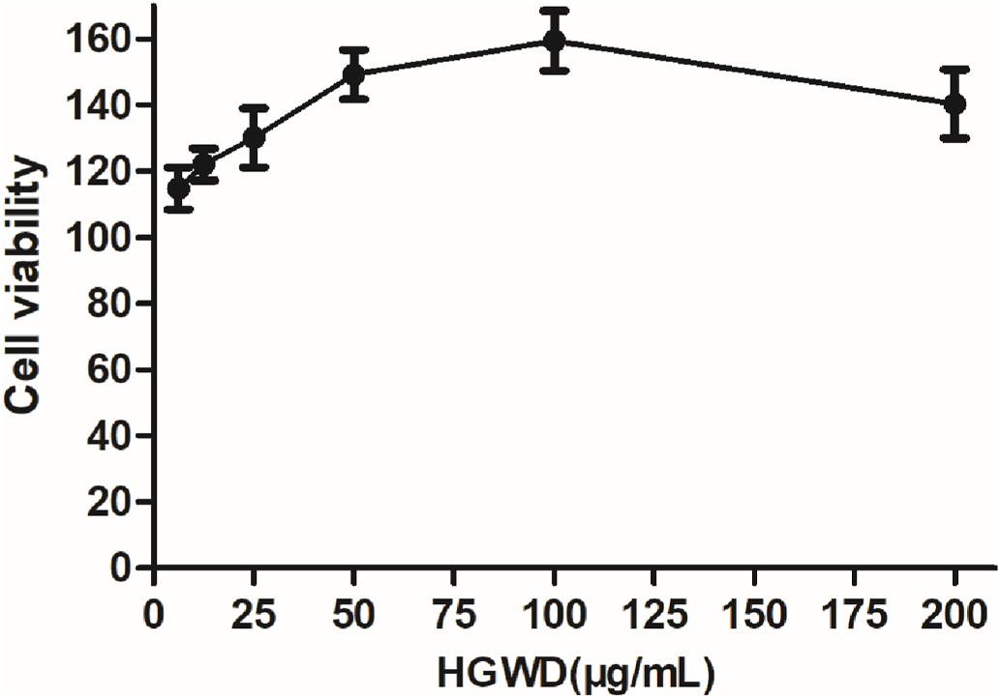
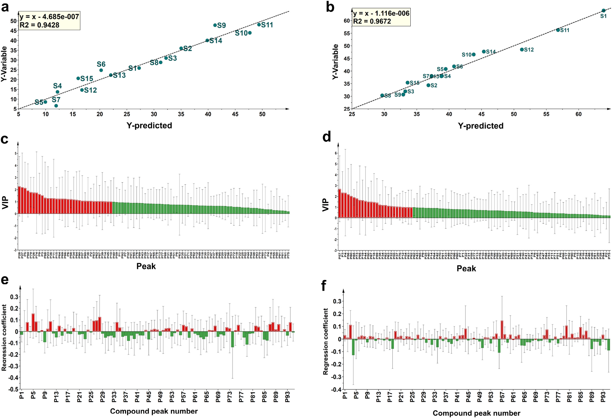
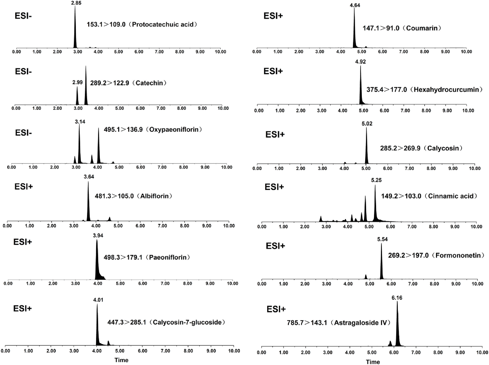

<!-- 方針: ほぼ全訳＋必要に応じた補足。原文構成に沿って訳出。「> 補足:」は訳者注。 -->

## 書誌情報

- 原題: A comprehensive quality evaluation for Huangqi Guizhi Wuwu decoction by integrating UPLC-DAD/MS chemical profile and pharmacodynamics combined with chemometric analysis
- 著者: Maoyuan Jiang, Lele Yang（共同筆頭）, Liang Zou, Lei Zhang, Shengpeng Wang, Zhangfeng Zhong, Yitao Wang, Peng Li*（マカオ大学中医薬品質研究国家重点実験室・中医薬科学研究所／成都大学食品生物工程学院／四川省中医薬科学院実験動物センター, 中国）
- 掲載: *Journal of Ethnopharmacology* 319 (2024) 117325. https://doi.org/10.1016/j.jep.2023.117325
- インパクトファクター: **5.4**（*Journal of Ethnopharmacology*, JCR 2024 / Clarivate, 2025年6月公表）
- 受理経過: 受領 2023-07-13 / 改訂 2023-09-30 / 採録 2023-10-15 / オンライン公開 2023-10-16 / © 2023 Elsevier B.V. All rights reserved.

> 補足: HGWD = 黄耆桂枝五物湯（Huangqi Guizhi Wuwu Decoction）。RA = リウマチ性関節炎(rheumatoid arthritis)。Q-marker = 品質マーカー(quality marker)。UPLC-DAD = 超高速液体クロマトグラフィー・ダイオードアレイ検出器。UPLC-HRMS = UPLC・高分解能質量分析(本研究ではLTQ-Orbitrap)。UPLC-TQ-MS/MS = UPLC・トリプル四重極タンデム質量分析。PLSR = 部分最小二乗回帰。VIP = 変数重要度投影値。掲載誌の巻号表記は原文どおり319 (2024)（受理・出版は2023年）。

## 要旨（Abstract）

**民族薬理学的関連性:** 黄耆桂枝五物湯(HGWD)は『金匱要略』に記載された古典的漢方処方で、ヒトの「血痺」（「痺」証の一種）の治療に用いられてきた。臨床では、HGWDはリウマチ性関節炎(RA)の治療に応用されている。

**研究目的:** 薬効と化学的特性の両方を反映する化学マーカーの特定は、TCMの品質管理にとって大きな意義をもつ。本研究は、HGWDの抗RA作用を例に、全体的な化学プロファイルと生物活性データを組み合わせて化学マーカーを識別する包括的戦略の開発を目的とした。

**材料と方法:** 第一に、超高速液体クロマトグラフィー・ダイオードアレイ検出器(UPLC-DAD)指紋を確立・バリデーションし、異なる産地のHGWDの全体的品質を評価した。UPLC-DAD指紋とケモメトリクス手法の組み合わせにより、産地の異なるHGWDに関連する特性マーカーをスクリーニングした。第二に、15ロットのHGWD試料の化学プロファイルを、UPLCとハイブリッド線形イオントラップ-Orbitrap質量分析(UPLC-HRMS)を連結して特性評価した。続いて15ロットのHGWD試料のin vitro抗RA活性を評価した。第三に、スペクトル効果関係解析を行い、Q-markerとなりうる生物活性化合物を識別した。最後に、UPLCトリプル四重極タンデム質量分析法(UPLC-TQ-MS/MS)を最適化・確立し、15ロットのHGWDにおける特性マーカー・Q-markerの定量分析に用いた。

**結果:** UPLC-DAD指紋において合計30の共通ピークを割り当てた。9ピークが特性マーカー（protocatechuic acid, coumarin, cinnamic acid, oxypaeoniflorin, paeoniflorin, calycosin, formononetin, catechin, albiflorin）として認識された。さらにUPLC-HRMS化学プロファイルにおいて95の共通化合物を同定した。薬理学的解析から、15ロットのHGWD試料の抗RA活性は大きく異なることが示された。スペクトル効果関係解析により、抗RA活性と正の相関をもつ30の潜在的生物活性成分が明らかとなった。そのうち相対含量が1%を超える5化合物（paeoniflorin, astragaloside IV, hexahydrocurcumin, formononetin, calycosin-7-glucoside）をQ-markerとして選定し、LPS誘導RAW264.7マクロファージでその活性を検証した。最終的に、上記12の代表成分を15ロットのHGWD試料で同時定量した。

**結論:** 全体的化学プロファイルと代表成分評価を組み合わせた本系統的戦略は、HGWDの品質評価を改善するための信頼性が高く有効な手法となりうる。

> 補足: 略語一覧（原文Abbreviations）: TCMs=Traditional Chinese medicines（中医薬）、RA=rheumatoid arthritis（リウマチ性関節炎）、UPLC-DAD=ultra-performance liquid chromatography coupled with diode array detector、GC-MS=gas chromatography-mass spectrometry、PLSR=partial least squares regression、ANN=artificial neural network、HGWD=Huangqi Guizhi Wuwu Decoction、AR=Astragali Radix（黄耆）、PRA=Paeoniae Radix Alba（白芍）、CR=Cinnamomi Ramulus（桂枝）、ZRR=Zingiberis Rhizoma Recens（生姜）、JF=Jujubae Fructus（大棗）、TQ-MS/MS=triple quadrupole tandem mass spectrometry、RSD=relative standard deviation、MRM=multiple reaction monitoring、VIP=variable importance in projection。

## 1. 序論（Introduction）

複数成分・複数標的を特徴とする中医薬(TCMs)、特にTCM処方は、中国や東洋諸国で広く用いられてきた。TCMの化学成分は、多様な産地・配合される複数の基原種・異なる前処理法の影響を受けやすい。したがって、全体的な化学プロファイルを反映し、かつ代表成分を評価する包括的・系統的な品質管理戦略は、臨床における安全性と有効性を保証する上で不可欠である。超高速液体クロマトグラフィー・ダイオードアレイ検出器(UPLC-DAD)指紋は広く研究されており、TCMの全体的品質評価に適切に応用されている。加えて、薬効に関連する代表成分の精密な定量も、統合的な品質管理に有用である。しかし多くの場合、TCMの有効性・安全性の推定には1つないし数種の化学成分のみが定量的に検出されるにとどまる。明らかに、これらの成分だけではTCMの真正かつ内在的な特性を反映できない。したがって、TCMの治療効果に最も大きく寄与する品質マーカー(Q-marker)は、治療効果の物質的基盤を理解し、薬理活性に基づく品質管理を発展させる上で重要な役割を果たす。

これまで、高分解能かつ十分な感度を有する多成分分析技術がTCMの化学プロファイル特性評価に用いられてきた。例としてUPLC-DAD、液体クロマトグラフィー-質量分析(UPLC-MS)、ガスクロマトグラフィー-質量分析(GC-MS)、定量核磁気共鳴(QNMR)が挙げられる。しかし、高スループット分析技術で得られる膨大な化学情報の中から、Q-markerとして働く特定の化学化合物をスクリーニング・認識することはできない。このギャップを埋めるため、ケモメトリクス手法（灰色関連解析(GRA)、部分最小二乗回帰(PLSR)解析、人工ニューラルネットワーク(ANNs)など）による薬効と化学プロファイルの相関解析（スペクトル効果関係）が提案されてきた。特にPLSRは、サンプル数が変数数よりはるかに少ない場合のスペクトル効果関係の決定に頻用される。したがって、多量の化学プロファイルデータを含むTCMのスペクトル効果関係をPLSRで確立することはより適切といえる。

黄耆桂枝五物湯(HGWD)は古典的漢方処方で、『金匱要略』に「養血温経」の効能をもつものとして原典記載がある。HGWDは伝統的に、身体の痺れと四肢の痛みを特徴症状とする「血痺」（「痺」証の一種）の治療に用いられてきた。HGWDは白芍(Paeoniae Radix Alba, PRA)・桂枝(Cinnamomi Ramulus, CR)・黄耆(Astragali Radix, AR)・生姜(Zingiberis Rhizoma Recens, ZRR)・大棗(Jujubae Fructus, JF)の5種の生薬から構成される。現代薬理学的研究により、HGWDは鎮痛作用・神経伝達物質の調節作用・抗リウマチ性関節炎(RA)作用を有することが示されている。さらに、多くの臨床試験でHGWDがRA治療において信頼できる治療効果を有することが示されている。特に、RAによって生じる関節痛などの臨床症状は「血痺」の症状と類似する。先行する科学的研究は、HGWDの抗RA効果を実証してきた。例えば、HGWD投与により足関節滑膜の炎症が軽減されうることが示されている。しかし、特にRA治療効果に最も大きく寄与する化学成分について、合理的な品質評価が欠如している。したがって、薬効に寄与する成分の探索が課題となる。異常な免疫細胞応答による炎症はRAの病態形成において役割を果たす。これらの免疫細胞のうち、炎症性M1マクロファージは炎症性サイトカイン（IL-6やTNF-αなど）のレベル上昇を誘導することで関節の侵食を引き起こし、これがRAの進行を制御する上で決定的である。古典的かつ確立された炎症細胞モデルとして、LPS誘導RAW264.7マクロファージが抗RA化合物のスクリーニングに広く用いられている。

本研究では、全体的化学プロファイルの決定と化学マーカーの発見を統合した包括的戦略をHGWDの品質評価のために提案した。なお化学マーカーとは、産地の多様性を反映する特性マーカーと、薬理活性に基づくQ-markerの両方を指す。まず、異なる産地に由来する15ロットのHGWD試料の全体的品質を評価するため、UPLC-DAD指紋を確立・バリデーションした。次に、30の共通ピークをもつUPLC-DAD指紋とケモメトリクスを効果的に組み合わせ、産地に関連する特性マーカーを首尾よくスクリーニングした。第二に、指紋分析と組み合わせたハイブリッド線形イオントラップ(LTQ)-Orbitrap質量分析法により、15ロットのHGWD試料のUPLC-MS化学プロファイルを決定した。さらに、HGWDロットの抗RA活性を評価した。Q-markerとなりうる生物活性成分を発見するためスペクトル効果関係解析を実施し、その活性をさらに検証した。最後に、UPLCトリプル四重極タンデム質量分析(UPLC-TQ-MS/MS)による12の代表成分の迅速かつ同時定量法を最適化・確立し、15ロットのHGWDに首尾よく適用した。

## 2. 材料と方法（Materials and methods）

### 2.1 材料と試薬

広州白雲山板橋制薬有限公司(広東省広州市)より、15ロットの黄耆(AR)・白芍(PRA)・桂枝(CR)・生姜(ZRR)・大棗(JF)の提供を受け、各ロットの基原種・産地を明示した(Table S1)。すべての生薬はマカオ大学のPeng Li教授により基原鑑定された。

参照標準品として、protocatechuic acid、protocatechualdehyde、oxypaeoniflorin、albiflorin、paeoniflorin、coumarin、calycosin-7-glucoside、cinnamaldehyde、cinnamic acid、calycosin、2-methoxy cinnamaldehyde、cinnamyl alcohol、benzoylpaeoniflorin、formononetin、astragaloside IV、6-gingerol、6-shogaol、astragaloside II、astragaloside I、8-gingerol、isoquercitrin、procyanidin B1、catechin、procyanidin B2、epicatechin、hexahydrocurcumin、leucineを成都MUST Biotechnology社より入手した。LC-MSグレードのアセトニトリル・メタノールはBaker社(米国サンフォード)より入手した。

RAW264.7マウスマクロファージは武漢Procell Life Science and Technology社より入手。ウシ胎児血清(FBS)・リン酸緩衝生理食塩水(PBS)・Dulbecco改変Eagle培地(DMEM)・トリプシン-EDTAはGIBCO社(米国NY州グランドアイランド)より購入。ジメチルスルホキシド(DMSO)およびリポ多糖(LPS)はSigma-Aldrich社(米国MO州セントルイス)より提供。デキサメタゾン、ペニシリン-ストレプトマイシン(Pen Strep)、CCK-8試薬はBeyotime Biotechnology社(上海)より提供。マウスTNF-αおよびIL-6のELISAキットはNeoBioscience社(深圳)より入手した。

### 2.2 試料溶液調製と化学標準品

HGWD試料は、古典的漢方文献『金匱要略』の記載どおりに調製した。黄耆(41.25 g)・白芍(41.25 g)・桂枝(41.25 g)・大棗(41.25 g)・生姜(82.5 g)を蒸留水1200 mLに0.5時間浸漬した後、1時間煎じた。溶液を2層のガーゼで濾過し、生薬換算1 g/mLとなるよう濃縮した。最終的に濃縮溶液を凍結乾燥し、乾燥剤入りデシケーターで保存した。

乾燥粉末試料(0.5 g)を70%メタノール水溶液(v/v) 25 mLに再溶解し、室温で30分間超音波処理した。上清を13,800×gで10分間遠心分離して回収し、指紋分析・定量分析に用いた。単味生薬試料も同様に調製した。各参照標準品を精密に秤量してメタノールに溶解しストック溶液とし、分析前にさらに希釈して必要な濃度の作業溶液を得た。

### 2.3 UPLC-DAD指紋分析

- 装置: Dionex UltiMate 3000 rapid separation binary system（Dionex, Thermo Fisher Scientific社, 米国）
- カラム: Hypersil GOLD C18（150 mm × 2.1 mm, 1.9 μm, Thermo Fisher）、カラム温度 40 ℃
- 流速: 0.4 mL/min
- 移動相: A=0.2%ギ酸水(v/v)、B=アセトニトリル
- グラジエント: 0–5 min 5%B / 5–25 min 5–12%B / 25–45 min 12–20%B / 45–55 min 20–40%B / 55–65 min 40–95%B / 65–70 min 95%B
- 注入量: 2 μL
- UVスペクトルは **280 nm** で記録

### 2.4 指紋分析の精度・再現性・安定性

各共通ピークの参照ピークに対する相対保持時間(RRT)・相対ピーク面積(RPA)の相対標準偏差(RSD)の平均値を用いて指紋分析法を評価した。精度(precision)は同一試料溶液を6回評価して評価した。再現性(repeatability)は並行して調製した6検体で評価した。安定性(stability)は同一試料を同日内の0・3・6・9・12・24時間の時点で評価して決定した。

### 2.5 LTQ-Orbitrap質量分析条件

- 装置: ハイブリッドLTQ-Orbitrap質量分析計(Thermo Fisher Scientific, ドイツ・ブレーメン)をUPLC指紋システムに接続
- ポジティブ／ネガティブESIモード両方を使用。最適パラメータ: イオンスプレー電圧 4.5/−4.0 kV、キャピラリー温度 350/350 ℃、キャピラリー電圧 35/−35 V、チューブレンズ電圧 100/−100 V
- フルスキャン範囲: m/z 100–2000。スキャンサイクルは5回のデータ依存収集(DDA)イベントで構成
- 高分解能Orbitrap質量分析計（分解能 30000）を使用
- DDAイベントでは、フルスキャンイベントで応答が最も高い5イオンのMS2フラグメンテーションデータを動的除外を用いて取得。単離幅 m/z 2.0、衝突誘起解離(CID)の正規化衝突エネルギー 35%

### 2.6 化学プロファイルデータの前処理

Xcalibur 2.1ソフトウェアで取得した生データをThermo Compound Discoverer 3.2（Thermo Fisher Scientific, 米国）に取り込み、ピーク検出・アライメント・フィルタリング・グルーピングを実施。これにより、統合ピーク面積・m/z・保持時間(RT)を含むデータセットを取得した。関連参照標準品およびThermo Compound Discoverer 3.2内データベースとの高精度質量・MS2フラグメンテーションの比較により、15ロットのHGWD試料間の共通ピークを暫定的に同定した。各ピークの化合物の相対量は、各試料内の全体ピーク面積に対する各化合物のピーク面積の比として算出し、15ロットの試料における各化合物の平均相対量を計算した。データ正規化はMetaboAnalyst 5.0オンラインアルゴリズムの統計解析モジュールを用いて実施し、以降の多変量解析に供した。

### 2.7 細胞培養

マウス単球マクロファージ白血病細胞株RAW264.7を、10% FBSおよび1%ペニシリン-ストレプトマイシンを含むDMEM中、37 ℃・5% CO2で培養した。乾燥HGWD粉末をDMSOに溶解し、必要濃度になるよう培地で希釈した。最終DMSO濃度は0.1%未満とした。

### 2.8 RAW264.7細胞生存率アッセイ

HGWD試料の細胞毒性は、RAW264.7細胞を用いた比色CCK-8アッセイで試験した。細胞(8 × 10³個/ウェル)を96ウェルプレートに播種し、細胞接着後に異なる濃度(6.25, 12.5, 25, 50, 100, 200 μg/mL)のHGWD試料溶液を添加した。37 ℃・CO2インキュベーター内で48時間インキュベーション後、各ウェルに10% CCK-8を添加し、37 ℃でさらに2時間インキュベートした。生存率はSpectraMax M2マイクロプレートリーダー(Molecular Devices, 米国)を用いて450 nmの吸光度を測定して解析した。

### 2.9 LPS誘導RAW264.7細胞モデル

RAW264.7細胞を24ウェルプレートに10⁵個/ウェルで培養し、培地単独、またはLPS(ウェル内終濃度100 ng/mL)存在下で、15ロットのHGWD(ウェル内終濃度50 μg/mL)の存在下・非存在下にて48時間処理した。その後、上清を回収し、市販ELISAキットを用いてTNF-αおよびIL-6の量を測定した。全データはモデル群に対する低下率に変換した: 低下率(%) = (LPS群 − 薬物投与群)/LPS群 × 100%。

### 2.10 定量分析用UPLC-TQ-MS/MS条件

- 装置: ACQUITY I-Class UPLCシステム＋Xevo TQ-S microトリプル四重極質量分析計(Waters Corp., 英国)
- カラム: Hypersil GOLD C18（150 mm × 2.1 mm, 1.9 μm, Thermo Fisher）、カラム温度 40 ℃、注入量 2 μL
- 移動相: A=0.2%ギ酸水(v/v)、B=メタノール
- グラジエント: 0–3 min 5–50%B / 3–5 min 50–95%B / 5–7 min 95%B / 7–8 min 95–5%B / 8–10 min 5%B
- 流速: 0.3 mL/min
- MRM条件（ポジティブ・ネガティブ両モード）: キャピラリー電圧 3.0 kV、ソース温度 150 ℃、脱溶媒温度 350 ℃、コーンガス流量 30 L/h。最適化されたMRMパラメータはTable S2に記載。
- 制御・データ処理: MassLynx 4.2ソフトウェア(Waters Corp., 米国)

### 2.11 UPLC-TQ-MS/MS法のバリデーション

#### 2.11.1 直線性・検出下限・定量下限

検量線の作成には適切な濃度の各種標準作業溶液を用いた。シグナル対ノイズ比(S/N) 3のときの各分析対象濃度を検出下限(LLOD)、S/N 10のときの濃度を定量下限(LLOQ)とした。

#### 2.11.2 精度・再現性・安定性・回収率

精度試験では同一混合作業溶液を6回分析した。再現性試験では6検体を独立に調製して評価した。安定性については、同一試料溶液を同日内の6時点(0, 3, 6, 9, 12, 24時間)で評価した。回収率試験も実施した。既知量の各化学標準品をHGWD試料に添加して並行6検体を作成し、試料抽出法を適用した。回収率(%)は次式で算出: 回収率(%) = (検出量 − 元の量)/添加量 × 100%。

### 2.12 統計解析

Similarity Evaluation System for Chromatographic Fingerprint of Traditional Chinese Medicine（version 2004A）を用いてクロマトグラフィー指紋の類似度解析(SA)を自動的に実施した。共通ピークはピークアライメントにより認識した。割り当てられた共通ピーク面積はMetaboAnalyst 5.0で正規化し、SIMCA-P+ 14.1（Umetrics, スウェーデン・ウメオ）に取り込んでケモメトリクス解析を実施した。生MSおよびMSnフラグメンテーションデータはXcalibur 2.1ソフトウェアとThermo Compound Discoverer 3.2（Thermo Fisher Scientific社, 米国）で取得・可視化した。質量許容範囲は10 ppm以内とした。定量的UPLC-TQ-MS/MS解析にはMassLynx 4.2ソフトウェア(Waters Corp., 米国)を用いた。

PLSRモデルはSIMCA-P（SIMCA-P 14.1, Umetrics, スウェーデン）ソフトウェアで構築し、各ロットのHGWDにおける共通ピーク(説明変数)と抗RA活性(応答変数)の相関を説明した。回帰式の予測能力の評価にはR²を用いた。回帰係数と変数重要度投影(VIP)値を組み合わせて、PLSRモデルにおける応答変数への説明変数の相対的寄与を推定し、潜在的な品質管理マーカーとなる活性化合物を同定した。

## 3. 結果と考察（Results and discussion）

### 3.1 HGWD試料調製の最適化

試料再構成のためのメタノール濃度勾配(10%, 40%, 70%, 100%メタノール)を分析し、抽出方法最適化のため4種の抽出時間(10, 30, 45, 60分)を評価した。30–40分の範囲のピークは、メタノール濃度の増加(10%–70%)に伴いシグナル強度が高くなり、70%メタノールが望ましい抽出溶媒であることが示された(Fig. S1)。Fig. S2に示すように、30分以降は抽出効率の明らかな増加は見られなかった。したがって、乾燥粉末試料は試料質量:溶媒体積 = 1:50の比率で70%メタノールを用い、30分間の超音波抽出により処理することとした。

### 3.2 UPLC-DAD指紋条件の最適化

TCMの包括的品質管理のためには、より多くの化学情報を得るために高感度な適切な検出器を採用すべきである。そこで、DADとエアロゾルベース検出器(CAD)の結果を比較したところ、DADはより多くの検出可能なピークを与え、特に検出波長280 nmで顕著であった(Fig. S3)。続いてフルスキャンモード(190–400 nm)を用いて、280 nmでより多くのピークとより高いシグナル応答が観察されることを検証し、この波長をHGWDの全体的化学プロファイルをよりよく反映するものとして選択した。次に、XSELECT CSH C18（150 mm × 3 mm, 2.5 μm, Waters）、Hypersil GOLD C8（150 mm × 2.1 mm, 3 μm, Thermo Fisher）、ACQUITY™ UPLC BEH C18（100 mm × 2.1 mm, 1.7 μm, Waters）、Hypersil GOLD C18（150 mm × 2.1 mm, 1.9 μm, Thermo Fisher）の4カラムを評価した結果、Hypersil GOLD C18カラムが他の3カラムと比較してより良好なピーク形状と高い分離能を与えることがわかった(Fig. S4)。次に、アセトニトリル-水系とメタノール-水系の2種の移動相を用いて結果を比較した結果、メタノール-水系よりもアセトニトリル-水系で良好な分離が得られることが観察された(Fig. S5)。0.1%、0.2%、0.4%と異なる濃度のギ酸(FA)水溶液を移動相としてピーク形状・分離能の最適化に用いた。アセトニトリル-水単独よりもFAを含むアセトニトリル-水でより高いピーク応答が観察された(Fig. S6)。ピークの検出性が高く、固定相もFAに耐えられることから、アセトニトリル-0.2% FAをHGWD分析に適するものと決定した。さらに、グラジエント溶出プログラムを最適化し、UPLC-DAD指紋分析の項に記載のとおり実施した。

### 3.3 UPLC-DAD指紋分析

提案したUPLC-DAD法を、異なる産地に由来する15ロットのHGWD試料の分析に適用し、得られたクロマトグラムをSimilarity Evaluation System for Chromatographic Fingerprint of Traditional Chinese Medicine（version 2004A）に取り込んで評価した(Fig. S7)。加えて、認識された30の共通ピークによりHGWDの参照UPLC指紋を確立した(図1)。このうち、ピーク22（cinnamic acid、保持時間 = 38.33分）は、高い分離能・対称的ピーク形状・適度な保持時間を有することから、他の共通ピークの相対保持時間(RRT)・相対ピーク面積(RPA)算出のための参照ピークとして選定した。さらに、protocatechuic acid 4-glucoside（ピーク1）、protocatechuic acid（ピーク2）、catechin（ピーク5）、oxypaeoniflorin（ピーク6）、procyanidin B2（ピーク7）、epicatechin（ピーク8）、triphyllin B（ピーク9）、albiflorin（ピーク10）、paeoniflorin（ピーク11）、coumarin（ピーク13）、calycosin-7-glucoside（ピーク15）、elloramycin B（ピーク17）、calycosin（ピーク23）、2-methoxy cinnamaldehyde（ピーク24）、formononetin（ピーク25）、6-shogaol（ピーク26）（図1）を、参照標準品との照合およびThermo Compound Discoverer 3.2データベースにより暫定的に同定した。

指紋分析の精度・再現性・安定性の項で述べたとおり、精度の相対標準偏差(RSD)はRRTで0.7%未満、RPAで3.6%未満であった。再現性については、RRTおよびRPAのRSDはそれぞれ0.9%以下、4.8%以下であった。安定性のRSDはRRTで0.5%未満、RPAで4.9%未満であり、試料が24時間安定であることが示された。したがって、提案したUPLC-DAD指紋はHGWDの品質評価に用いる上で信頼性が高いことが示された。

### 3.4 類似度解析(SA)

15ロットすべてのHGWD試料の指紋は参照指紋と類似していた。相関係数を用いて、各ロットのHGWD試料のクロマトグラムと参照指紋クロマトグラムの類似性を比較した。**相関係数は0.929から0.994の範囲**で、Table 1に記載のとおり決定され、これらの試料の高い一貫性と安定性が示された。

**Table 1. HGWD 15ロットのクロマトグラム類似度（相関係数マトリクス、抜粋）**

| No. | S1 | S2 | S3 | S4 | S5 | S6 | S7 | S8 | S9 | S10 | S11 | S12 | S13 | S14 | S15 | R(参照) |
|---|---|---|---|---|---|---|---|---|---|---|---|---|---|---|---|---|
| S1 | 1 | | | | | | | | | | | | | | | |
| S2 | 0.956 | 1 | | | | | | | | | | | | | | |
| S3 | 0.969 | 0.966 | 1 | | | | | | | | | | | | | |
| S4 | 0.977 | 0.956 | 0.992 | 1 | | | | | | | | | | | | |
| S5 | 0.969 | 0.956 | 0.964 | 0.98 | 1 | | | | | | | | | | | |
| S6 | 0.97 | 0.97 | 0.972 | 0.979 | 0.972 | 1 | | | | | | | | | | |
| S7 | 0.983 | 0.961 | 0.966 | 0.974 | 0.96 | 0.983 | 1 | | | | | | | | | |
| S8 | 0.907 | 0.949 | 0.932 | 0.914 | 0.875 | 0.947 | 0.945 | 1 | | | | | | | | |
| S9 | 0.992 | 0.97 | 0.97 | 0.978 | 0.973 | 0.983 | 0.994 | 0.931 | 1 | | | | | | | |
| S10 | 0.971 | 0.965 | 0.964 | 0.976 | 0.985 | 0.985 | 0.966 | 0.901 | 0.977 | 1 | | | | | | |
| S11 | 0.976 | 0.944 | 0.935 | 0.957 | 0.97 | 0.964 | 0.98 | 0.884 | 0.986 | 0.97 | 1 | | | | | |
| S12 | 0.952 | 0.934 | 0.943 | 0.935 | 0.907 | 0.931 | 0.935 | 0.876 | 0.948 | 0.937 | 0.929 | 1 | | | | |
| S13 | 0.87 | 0.868 | 0.92 | 0.893 | 0.817 | 0.89 | 0.906 | 0.926 | 0.885 | 0.835 | 0.827 | 0.883 | 1 | | | |
| S14 | 0.956 | 0.939 | 0.939 | 0.953 | 0.948 | 0.967 | 0.987 | 0.92 | 0.979 | 0.945 | 0.977 | 0.908 | 0.895 | 1 | | |
| S15 | 0.87 | 0.892 | 0.882 | 0.867 | 0.824 | 0.903 | 0.93 | 0.966 | 0.905 | 0.838 | 0.863 | 0.832 | 0.942 | 0.933 | 1 | |
| R | 0.979 | 0.975 | 0.982 | 0.981 | 0.961 | 0.989 | 0.994 | 0.960 | 0.992 | 0.970 | 0.968 | 0.949 | 0.929 | 0.980 | 0.936 | 1 |

### 3.5 特性マーカースクリーニングのための直交部分最小二乗判別分析

TCMは数千年の発展の中で、生薬ごとの産地の多様性が徐々に増大してきた。本研究では、主要産地に由来する15ロットのAR・PRA・CR・ZRR・JFを代表的産地として収集した。15ロットのHGWD試料間の品質差異をさらに識別するため、正規化した共通ピーク面積を用いて教師ありOPLS-DAモデルを構築した。構築モデルの適合度(R2Y)と予測性(Q2)はそれぞれ **97%と72%** であった。Fig. S8aに示す検証結果はモデルの高い信頼性を示している。Fig. S8bに示すように、15ロットのHGWD試料はその産地に基づき3つの独立したゾーンに分化しており、化学組成に内在する差異を表し、環境条件の変動がHGWD中の成分の組成・量に影響しうることを示している。続いて、変数重要度投影(VIP)値に基づき、識別クラスターへの寄与が最大の成分をスクリーニングした。Fig. S8dに示すように、**VIP値 > 1.00の共通ピークが16個**選出された。さらにこれらの化合物はFig. S8cに示すとおり最大の負荷量係数を有していた。このうち、protocatechuic acid（ピーク2）、coumarin（ピーク13）、cinnamic acid（ピーク22）、oxypaeoniflorin（ピーク6）、paeoniflorin（ピーク11）、calycosin（ピーク23）、formononetin（ピーク25）、catechin（ピーク5）、albiflorin（ピーク10）の **9化学化合物** が同定され、産地の多様性を反映する特性マーカーとして選定された。

### 3.6 UPLC-LTQ-Orbitrap質量分析によるHGWDの化学プロファイル

UPLC指紋システムにハイブリッドLTQ-Orbitrap質量分析計を接続し、各HGWD試料の化学組成を分析した。ポジティブ・ネガティブモードにおけるHGWDの代表的な総イオンクロマトグラム(TIC)をFig. S9に示す。関連する参照標準品との高精度質量・MS2フラグメンテーション値の比較、文献データ(Cheng et al., 2020; Guo et al., 2010; Tong et al., 2021; Wang et al., 2019; Yang et al., 2020; Zhang et al., 2014)およびThermo Compound Discoverer 3.2データベースにより、15ロットのHGWD試料から **95の共通ピーク** が暫定的に同定された。内訳はフェノール類27・フラボノイド配糖体20・テルペノイド配糖体13・フラボノイド10・有機酸8・糖類4・その他13種類（Table S3）。各化合物の由来解析は、各生薬のLC-MSプロファイルの検討により実施し、5種の生薬のTICをFig. S10に示した。さらに、95の共通ピークの統合ピーク面積・保持時間からなるデータセットをThermo Compound Discoverer 3.2で取得した。その後、各ピーク面積はMetaboAnalyst 5.0オンラインアルゴリズムで正規化し、以降の多変量解析に供し、結果をTable S4にまとめた。

### 3.7 異なる産地のHGWD試料の生物活性

#### 3.7.1 細胞生存率アッセイ

CCK-8アッセイによりRAW264.7細胞に対するHGWDの毒性を評価した。**6.25～200 μg/mLの濃度範囲のHGWDは48時間以内でRAW264.7細胞に毒性を示さなかった**(図2)。

#### 3.7.2 HGWDはLPS誘導RAW264.7細胞モデルにおける炎症性サイトカインの放出を抑制する

LPS刺激RAW264.7細胞からのTNF-αおよびIL-6の放出に対するHGWDの効果を観察した。LPS刺激後、TNF-αおよびIL-6のレベルは有意に増加した（p < 0.01, 対照群比）が、HGWD（50 μg/mL）処理後にはTNF-αおよびIL-6の含量が低下した。さらに、15ロットのHGWDが示す抑制効果は互いに異なっていた(図3)。

### 3.8 PLSRによるスペクトル効果関係解析

本研究では、SIMCA-Pソフトウェアにより回帰式を決定した。その後、回帰係数およびVIP値を用いて各説明変数の応答変数への相対的影響を評価した。PLSR解析では、従来法（Thermo Compound Discovererで検索された全ピークをPLSR解析に取り込む方法）とは異なり、95試料それぞれの正規化ピーク面積のみを独立変数(X)とし、HGWDの各生物活性指標を個別に従属変数(Y)とした。

図4aに示すように、回帰式のR²は **0.9428** であり、回帰モデルが良好な予測能力を有することが示された。VIP値 > 1の19の色素団ピークがTNF-αの低下と正の相関を示した：P28, P27, P5, P94, P26, P3, P88, P11, P6, P58, P34, P84, P90, P57, P2, P83, P87, P14, P10。解析結果はTable S5および図4c・eに示した。

図4bに示すように、回帰式のR²は **0.9672** であった。VIP値 > 1の15の色素団ピークがIL-6の低下と正の相関を示した：P57, P3, P80, P85, P73, P19, P44, P87, P82, P63, P55, P37, P76, P54, P83。解析結果はTable S6および図4d・fに示した。

### 3.9 潜在的抗RA化合物の炎症性サイトカイン抑制効果の検証

Q-markerの基本特性（特異性と測定可能性）を踏まえ、HGWD中の30の潜在的抗炎症化合物のうち、相対含量が1%を超える5化学化合物をQ-markerとして採用した：P34（paeoniflorin, **8.02%**）、P84（astragaloside IV, **1.24%**）、P73（hexahydrocurcumin, **1.60%**）、P82（formononetin, **3.39%**）、P37（calycosin-7-glucoside, **2.42%**）。そして、5つの潜在的抗RA化合物それぞれの炎症性サイトカイン抑制効果を評価した。陽性対照としてデキサメタゾンを用いた。

結果は、paeoniflorinおよびastragaloside IVがLPS誘導RAW264.7細胞モデルにおけるTNF-αの放出を抑制しうること、hexahydrocurcumin・formononetin・calycosin-7-glucosideがIL-6の放出に対して抑制効果を示すことを示した(Fig. S11)。paeoniflorin, astragaloside IV, hexahydrocurcumin, formononetin, calycosin-7-glucosideのIC50値はそれぞれ **144 μM, 407 μM, 76 μM, 535 μM, 686 μM** であった。TNF-α産生を抑制した2化合物およびIL-6放出を抑制した3化合物の活性は、正の回帰係数の順序と一致していた。

さらに、正の相関を示した他の化合物（6-shogaol、gallic acid、loganin、pinoresinol、malic acid）も抗炎症活性を有することが報告されている。以上の結果から、確立されたPLSR解析はHGWDのQ-marker範囲を絞り込みさらにスクリーニングする上で信頼できることが示された。

### 3.10 UPLC-TQ-MS/MS条件の最適化

産地の多様性と生物活性に基づく12の代表成分を同時定量するため、UPLC-TQ-MS/MS技術を用いて定量分析を実施した。高感度・高選択性を達成するため、ポジティブ・ネガティブ両イオンモードでの多重反応モニタリング(MRM)を用いた。12標的分析対象の関連MS/MSパラメータは、自動MS/MS最適化プログラム(Intelli Start)を用い、干渉なく最良のピーク強度を得るよう混合参照標準品で最適化した。ポジティブ・ネガティブモードにおける12標的分析対象の代表的スペクトルをFig. S12に示し、最適化パラメータはTable S2に示した。指紋分析条件を基盤として、複雑なHGWD試料中の12標的分析対象の異性体からの干渉を排除するため、確立されたMS/MSパラメータでさらに移動相組成を最適化した。その結果、アセトニトリル-0.2% FAと比較して、メタノール-0.2% FAではすべての標的化合物、特にoxypaeoniflorinについてより良好な分離が得られた(Fig. S13)。したがって、定量にはメタノール-0.2% FAを移動相として採用した。

要約すると、12の代表成分すべてが最適パラメータのMRMモードでわずか **7分** で独立に分離・検出され、HGWD試料中の12代表成分のポジティブ・ネガティブモードにおける代表的MS/MSスペクトルを図5に示した。

### 3.11 UPLC-TQ-MS/MS定量分析法のバリデーション

#### 3.11.1 直線性・定量下限・検出下限

12の標的分析対象について検量線（すべて相関係数 ≥ 0.990）を構築し、詳細をTable 2に示した。**定量下限(LLOQ)は0.2～6.2 ng/mL、検出下限(LLOD)は0.04～1.6 ng/mL** の範囲で決定された。以上の結果は、確立されたUPLC-TQ-MS/MS法が信頼性が高く高感度であることを示している。

**Table 2. HGWD中12標的分析対象の検量線・範囲・LLOD・LLOQ・回収率・精度・再現性・安定性**

| No. | 分析対象 | 検量線 (y=peak area, x=濃度μg/mL) | r | 範囲 (μg/mL) | LLOQ (ng/mL) | LLOD (ng/mL) | 回収率 (%, n=6) | 精度 (RSD, %) | 安定性 (RSD, %) | 再現性 (RSD, %) |
|---|---|---|---|---|---|---|---|---|---|---|
| 1 | Protocatechuic acid | y = 12385.4x + 1273.3 | 0.997 | 0.09–5.65 | 2.6 | 0.6 | 99.2 ± 1.9 | 0.6 | 1.7 | 1.4 |
| 2 | Catechin | y = 3816.3x + 552.3 | 0.997 | 0.10–6.35 | 6.2 | 1.6 | 104.9 ± 2.0 | 0.4 | 1.2 | 2.7 |
| 3 | Oxypaeoniflorin | y = 164889.3x + 13562.4 | 0.998 | 0.07–4.30 | 1.1 | 0.1 | 99.8 ± 1.7 | 0.8 | 1.1 | 1.3 |
| 4 | Albiflorin | y = 304230.1x + 67631.5 | 0.990 | 0.91–58.13 | 3.5 | 0.9 | 100.4 ± 2.5 | 0.7 | 1.0 | 0.9 |
| 5 | Paeoniflorin | y = 334987.2x + 78681.1 | 0.999 | 1.75–112.00 | 1.7 | 0.8 | 95.8 ± 3.4 | 1.2 | 1.9 | 1.1 |
| 6 | Calycosin-7-glucoside | y = 394866.0x + 18367.4 | 0.997 | 0.07–4.70 | 0.3 | 0.1 | 104.7 ± 6.5 | 2.1 | 1.6 | 2.4 |
| 7 | Coumarin | y = 1323080.2x + 96132.3 | 0.996 | 0.18–11.80 | 0.2 | 0.04 | 102.1 ± 1.9 | 0.8 | 1.6 | 1.5 |
| 8 | Hexahydrocurcumin | y = 129197.0x + 413.0 | 0.998 | 0.05–3.733 | 1.8 | 0.5 | 97.2 ± 6.9 | 1.5 | 1.8 | 2.3 |
| 9 | Calycosin | y = 60845.8x + 2234.5 | 0.999 | 0.40–25.0 | 3.0 | 0.7 | 103.2 ± 6.1 | 1.2 | 1.4 | 2.6 |
| 10 | Cinnamic acid | y = 8359.3x + 1815.6 | 0.993 | 0.40–25.80 | 3.1 | 1.6 | 103.7 ± 7.4 | 0.9 | 3.9 | 4.3 |
| 11 | Formononetin | y = 284241.1x + 10860.5 | 0.998 | 0.12–7.45 | 0.4 | 0.1 | 98.4 ± 1.4 | 1.2 | 1.3 | 1.0 |
| 12 | Astragaloside IV | y = 93882.8x + 1568.9 | 0.998 | 0.07–4.25 | 4.6 | 0.3 | 102.0 ± 8.4 | 1.5 | 1.8 | 4.6 |

> 補足: LLOQ=定量下限(S/N=10)、LLOD=検出下限(S/N=3)。検量線のyはピーク面積、xは分析対象濃度(μg/mL)。

#### 3.11.2 精度・再現性・安定性・回収率

精度については **2.1%以内** のRSDが決定された。再現性のRSDは **0.9%～4.6%** の範囲であった。安定性については、12標的化合物のRSDは24時間で **1.0%～3.9%** の範囲であった。全分析対象の総合平均回収率は **95.8%～104.9%** で許容範囲内であり、Table 2に示すとおりであった。

### 3.12 UPLC-TQ-MS/MSによる12代表成分の定量

MRMモードによる最適UPLC-TQ-MS/MS法を、15ロットのHGWD試料中の12代表成分の定量に3連測定で適用した。HGWD試料中の12代表成分の総合平均含量をTable S7に示し、3産地由来の12化合物の含量を図6にまとめた。12代表成分の含量については、**albiflorinとpaeoniflorinが他の10化合物より著しく多量に存在した**。

> 補足: 図6の縦軸は含量(μg/g)。原文の図では、albiflorin・paeoniflorinが他の10成分より1桁以上高い含量域（軸の一部を圧縮して表示）にあることが示されている。各成分の産地間の統計的有意差(*, **)はグラフ中に示されているが、各バーの具体的な数値は原文の図表示のみであり本文中には記載がないため、正確な数値は「原文参照（Fig. 6およびTable S7）」とする。

## 4. 結論（Conclusion）

本研究では、UPLC-DAD指紋分析、UPLC-HRMS化学プロファイリング、薬力学的評価、ケモメトリクスを組み合わせた多成分定量を統合した包括的戦略を、HGWDの品質評価のために確立した。15のHGWD試料の指紋を決定し、**30の共通ピーク**を同定して化学的類似性を評価した。

続いて、提案したUPLC-DAD指紋とOPLS-DAモデルの組み合わせにより、産地に関連する **9つの特性マーカー**（protocatechuic acid, coumarin, cinnamic acid, oxypaeoniflorin, paeoniflorin, calycosin, formononetin, catechin, albiflorin）を同定した。さらなる品質評価のため、HGWDのQ-markerとなりうる生物活性化合物を発見するスペクトル効果関係解析を実施した。UPLC-HRMSに基づく化学プロファイリングにより、15ロットのHGWD試料から **95の共通化合物** を暫定的に同定した。薬力学的評価から、異なるロット間の抗RA活性が大きく異なることが示された。スペクトル効果関係解析により、抗RA活性と正の関連をもつ **30の潜在的生物活性化合物** がスクリーニングされた。このうち相対含量1%超の5化合物（paeoniflorin, astragaloside IV, hexahydrocurcumin, formononetin, calycosin-7-glucoside）がHGWDのQ-markerとして採用された。最終的に、上記12の代表成分を15ロットのHGWD試料で同時定量した。この包括的戦略は、HGWDの品質評価を改善するための信頼性が高く有効な手法となりうる。

> 補足（実務的示唆）: 本研究の実務上の要点は、①UPLC-DAD指紋＋OPLS-DAで「産地判別に使う指標成分」を、②UPLC-HRMS化学プロファイル＋抗RA活性のPLSRスペクトル効果解析で「薬効に関連する指標成分」を、それぞれ別のロジックで絞り込み、両者を統合してQ-marker・定量対象を決定している点である。品質規格の設計としては、産地判別用の9マーカー（指紋レベルでの識別）と、薬効関連の5 Q-marker（paeoniflorin・astragaloside IV・hexahydrocurcumin・formononetin・calycosin-7-glucoside、いずれも定量規格の対象になりうる）を役割分けして運用する発想が参考になる。特にpaeoniflorin・albiflorinはHGWD中の含量が突出して大きく、含量管理の主要指標となりうる一方、hexahydrocurcuminはIC50が最も低く(76 μM)活性面で重要と位置付けられている。なお、本研究のQ-marker選定基準（相対含量1%超）は本研究独自の閾値であり、他処方への一般化には注意を要する。

## 訳者補足（用語）

- **黄耆桂枝五物湯(HGWD)**: 黄耆(AR)・白芍(PRA)・桂枝(CR)・生姜(ZRR)・大棗(JF)の5生薬からなる『金匱要略』収載の古典的処方。「血痺」（しびれ・痛みを特徴とする「痺」証の一種）に用いられ、現代ではリウマチ性関節炎(RA)への応用が研究されている。
- **スペクトル効果関係(spectrum-effect relationship)**: クロマトグラフィー指紋（各成分ピーク=説明変数）と薬理活性データ（応答変数）の相関をケモメトリクス(本研究ではPLSR)で解析し、薬効に寄与する成分を絞り込む手法。
- **VIP値(variable importance in projection)**: PLS(R)モデルにおいて各説明変数(ピーク)が応答変数の予測にどれだけ寄与しているかを示す指標。一般にVIP > 1が重要とされる。
- **OPLS-DA**: 直交部分最小二乗判別分析。群間（本研究では産地）の分類モデルを構築し、分類に寄与する変数(ピーク)をVIP値・負荷量で特定する教師あり多変量解析。
