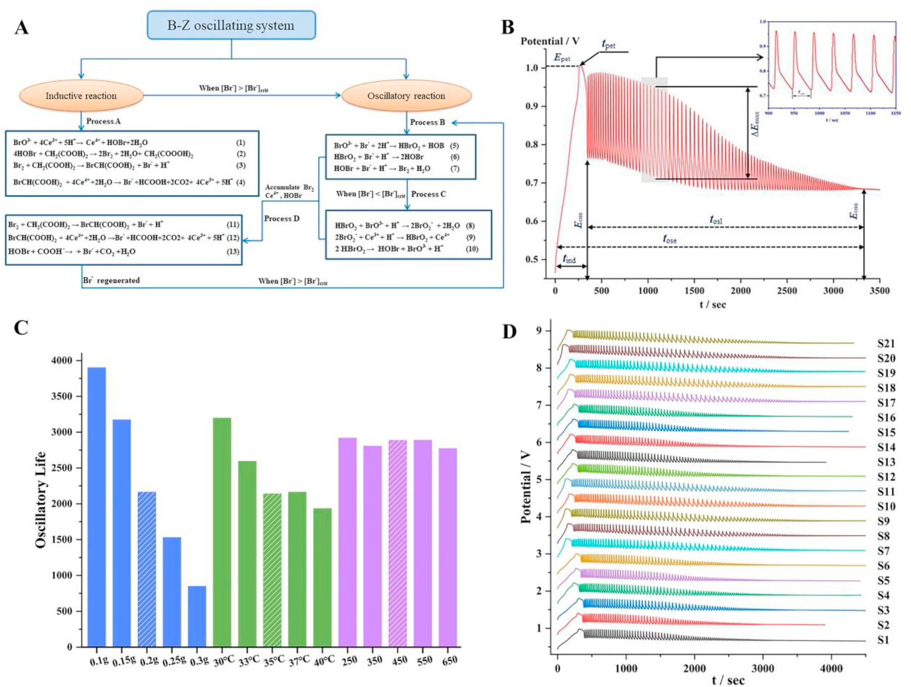
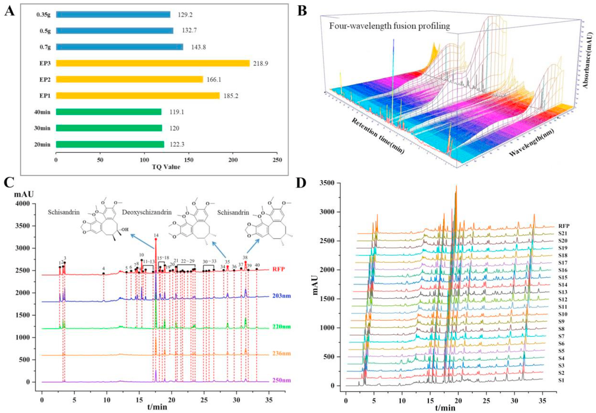
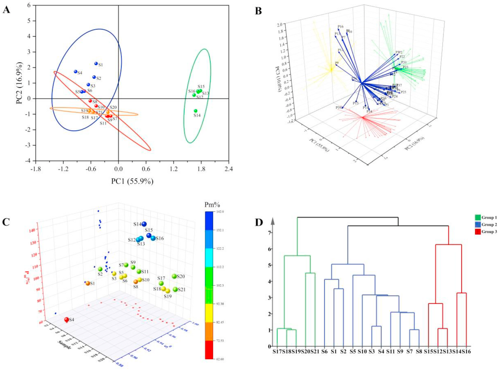
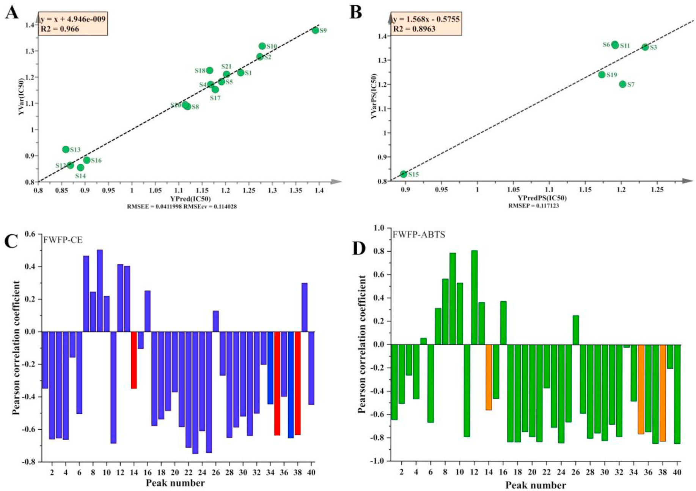

<!-- 方針: ほぼ全訳＋必要に応じた補足。原文構成に沿って訳出。「> 補足:」は訳者注。 -->

## 書誌情報

- 原題: Quality control of Hugan capsule based on four-wavelength fusion profiling and electrochemical fingerprint combined with antioxidant activity and chemometric analysis
- 著者・所属: Yantong Chen, Lili Lan, Guoxiang Sun（瀋陽薬科大学薬学院, 中国）／Wanyang Sun（暨南大学薬学院・広東省中医薬感受性疾病工程研究センター, 中国）／Hong Zhang（瀋陽薬科大学生命科学・生物製薬学院, 中国）
- 掲載誌・巻号・DOI: *Analytica Chimica Acta* 1251 (2023) 341015. https://doi.org/10.1016/j.aca.2023.341015
- インパクトファクター: 要確認（*Analytica Chimica Acta*, JCR 2024 / Clarivate。検索した複数の二次情報源では「約6.4（6.41）」とする報告が多いが、Clarivate公式値を直接確認できていないため数値は確定できず「要確認」とする）
- 受理経過 / ライセンス: 受領 2023年1月7日／改訂受理 2023年2月17日／採録 2023年2月24日／オンライン公開 2023年2月27日。© 2023 Elsevier B.V. All rights reserved.（0003-2670/©2023）。Handling Editor: Dr Jing-Juan Xu。

> 補足: HGCs = 護肝カプセル(Hugan Capsules)。FWFP = 四波長融合プロファイリング(Four-wavelength fusion profiling)。ECFP = 電気化学指紋(Electrochemical fingerprint)。SQFM = 系統定量指紋法(systematically quantified fingerprint method)。B-Z = Belousov-Zhabotinsky振動反応。ABTS = 2,2′-アジノ-ビス(3-エチルベンゾチアゾリン-6-スルホン酸)。AEAC = ビタミンC当量抗酸化能。BCA = 二変量相関解析(bivariate correlation analysis)。DSD = デオキシシザンドリン(Deoxyschizandrin)、SSD = シザンドリン(Schisandrin)、SSB = シザンドリンB(Schisandrin B)（原文中でDSD/SSDの記載順が箇所により入れ替わっている可能性があるが、本訳では原文の表記に忠実に訳出する）。本論文は分析法開発（ケモメトリクス・電気化学指紋）の研究論文。

## 要旨（Abstract）

生薬製剤(HPs)の品質標準体系を改善することは、中医薬(TCM)の発展にとって困難な課題である。現在、HPsの安全性・有効性・品質一貫性を高めるための、包括的・科学的・効果的な評価法を確立することが急務である。本研究では、護肝カプセル(HGCs)を例として用いた。まず、4製造元由来の21バッチのHGCs中の3つの品質マーカー(Q-marker)をHPLCで定量し、各試料の含量に大きな差があることを見出した。さらに、四波長融合プロファイリング(FWFP)を確立し、系統定量指紋法(SQFM)によって評価した。主成分分析(PCA)を用いてFWFPの予備解析を行い、化学組成・含量の変動のばらつきを識別した。次に、B-Z振動系を通じて9つの特性パラメータを記録し、電気化学指紋(ECFP)を構築してFWFPと連携評価し、SQFM結果の等重み付けを用いて試料品質を総合的に評価した。21バッチの試料は4群6グレードに分類され、試料間で指標成分と電気化学活性物質の含量に有意な差があることが示された。最後に、ビタミンCを陽性対照として、2,2′-アジノ-ビス(3-エチルベンゾチアゾリン-6-スルホン酸)(ABTS)消去試験を用いて試料の抗酸化活性を検討した。部分最小二乗法(PLS)と二変量相関解析(BCA)を用いて、FWFP-ABTSおよびFWFP-ECFPの指紋-薬効相関を解析した。その結果、電気化学試験とABTS試験の抗酸化能には類似性があり、HGCsの40のHPLC指紋ピークのうち31ピークに抗酸化活性が認められることが分かった。2つの手法は互いに裏付け合い、HGCs中の抗酸化成分を効果的かつ協働的に反映した。本研究で確立したFWFPとECFPはHGCsの品質検出を実現し、HPsの品質標準の改善およびTCMの品質標準法研究に新たな方向性を提供する。

## 1. 序論（Introduction）

社会と技術の発展に伴い、様々な疾病の予防・治療に生薬製剤(HPs)を用いる動きが世界的に高まっている。HPsは多成分・多標的・多機能という特徴を持ち、TCMの継承と革新にとって重要な担い手である。しかしTCMおよびHPsには、成分が複雑である、作用機序が不明確である、品質管理が難しいといった短所もある。したがって、現代的な検出法と革新的な分析法を組み合わせてTCMおよびその複方製剤の近代的研究を行い、その品質を管理し、品質標準体系を改善することは、困難であるが避けられない趨勢である[1,2]。

近年、TCMの主要な分析法にはHPLC[3,4]、GC[5,6]、近赤外分光法[7]、ナノテクノロジー[8]などがある。中でもTCM指紋は現代分析技術と組み合わせることでTCMおよびHPsの分析において重要な役割を果たしている。その「整体性(integrity)」と「模糊性(fuzziness)」という顕著な特徴はTCMの基本理論と合致しており、国内外で認められたTCM品質管理の有効な手法である[9,10]。HPLC指紋はTCMの全成分を俯瞰的に把握でき[11]、各試料間の定性的・定量的な類似性を示すことができるため、TCMおよびHPs中の有効成分の含量測定や医薬品の品質一貫性評価における優先的な手法となっている[12]。しかし、異なる条件・波長下では化合物ごとに紫外吸収特性が異なるため、単一波長のHPLC指紋は試料の化学情報を一面的にしか特徴づけられない[13,14]。そこで、異なる波長下の試料情報を融合して多波長指紋を形成することで、より包括的かつ客観的な試料理解が可能になる。本研究では、各波長で最大シグナル応答を示すピークを統合して新たなクロマトグラムを構築する四波長融合指紋(FWFP)を確立し、HP情報の抽出と統合に用いた[15,16]。系統定量指紋法(SQFM)を用いて化学指紋の定性的類似度・定量的類似度を評価した[17]。

HPLC指紋は医薬品分析の分野で広く用いられているが、試料前処理が複雑である、分析技術の操作工程が煩雑である、実験コストが高い、検出時間が長いといった限界がある[18]。そこで、TCMおよびHPsの全体の化学的物質について定性的・定量的情報を包括的に取得するため、電気化学指紋法(ECFP)が迅速・簡便・低コストな新しい指紋技術として登場した[19]。ECFPは試料前処理が簡単、実験操作が簡便、価格が安いという利点を持ち、TCMおよびHPs中の電気活性成分全体を特徴づけることができる[20,21]。その結果はHPLCの評価結果の補完として組み合わされ、TCMおよびその製剤の全体的な品質を議論するために用いられ、TCMおよびその製剤の品質管理・評価に優れた分析手法を提供する。

HGCsは『中国薬局方』2020年版に収載されており[22]、6種の生薬（柴胡(Bupleurum Radix, BR)、茵陳蒿(Artemisiae Scopariae Herba, ASH)、五味子(Fructus Schisandrae, FS)、板藍根(Isatidis Radix, IR)、猪胆粉(Suis Fellis Pulvis, SFP)、緑豆(Mung Bean, MB)）から作られる。疏肝理気・健脾消食・降トランスアミナーゼ作用を持ち、慢性活動性肝炎および早期肝硬変の治療にも臨床で用いられている。『中国薬局方』2020年版に従い、本研究ではデオキシシザンドリン(DSD)、シザンドリン(SSD)、シザンドリンB(SSB)をHGCsの定量分析のための3つの品質マーカー(Q-marker)として用いた。調査によれば、HGCsの品質一貫性に関する国内外の報告はごく少ない。したがって、HGCsの成分に関する定性的・定量的情報を迅速かつ包括的に分析・管理できる手法の開発が急務となっている。

本論文では、HGCsのFWFPを確立し、ECFPと組み合わせて21バッチの試料の全体的な品質一貫性を評価した。主成分分析(PCA)と階層的クラスター分析(HCA)を用いて、HPLCとECFPが試料間の差異を識別する能力を検証した。PLSモデルを用いてABTS試験結果を解析し、FWFPと抗酸化活性の関係を検討した。同時に、FWFPを橋渡しとして、二変量相関解析(BCA)をECFPと抗酸化能の関係に適用し、試料の化学組成と生物活性の関連を解析した。結論として、本研究はHGCsの品質一貫性を科学的・客観的・包括的に評価し、TCMおよびHPsの包括的な品質一貫性評価のための新規かつ実行可能な方向性を提供した。

## 2. 材料と方法（Materials and Methods）

### 2.1. 試薬と化学物質

21バッチのHGCs（濃縮カプセル）は4つの異なる製造元（製造元AからS1–S6、製造元BからS7–S11、製造元CからS12–S16、製造元DからS17–S21）から、すべて薬局で購入した。SSAおよびSSBの標準品は中国食品薬品検定研究院（北京、中国）から、DSDは上海融合医薬科技有限公司（上海、中国）から購入した。2,2′-アジノ-ビス(3-エチルベンゾチアゾリン-6-スルホン酸)(ABTS)とビタミンC(Vc, 99.0%)は、それぞれ上海麦克林生化科技有限公司（上海、中国）とSolarbio Biotechnology Co., Ltd.から購入した。

アセトニトリル・メタノール（HPLCグレード）と濃硫酸(H2SO4, 98%)は裕王化学試薬有限公司（山東、中国）から、無水エタノールは天津富宇精細化学有限公司から、リン酸（HPLCグレード）は科密欧化学試薬有限公司（天津、中国）から、1-ヘプタンスルホン酸ナトリウムは中美化学工場（山東、中国）から入手した。硫酸セリウムアンモニウムは天津博迪化学有限公司（天津、中国）から、臭素酸カリウムは天津科密欧化学試薬有限公司（天津、中国）から、マロン酸は天津大茂化学試薬工場（天津、中国）から得た。実験全過程で脱イオン水を使用した。その他の試薬・化学物質はすべて分析グレードであった。

### 2.2. 装置と分析条件

#### 2.2.1. HPLC分析

分析はAgilent 1100 HPLCシリーズ（Agilent Technologies, Santa Clara, CA, USA）で行い、オンライン脱気装置、四次元低圧混合ポンプ、オートサンプラー、DAD検出器を装備し、化合物のクロマトグラフィー分析に用いた。データの解析・収集はAgilent OpenLAB CDS Chemstation（Edition C.01.07）で制御した。分離はCOSMOSIL Packed 5C18-MS-IIカラム（4.6ID×250 mm、5 μm）を用い、カラム温度35 ℃で行った。移動相は0.2%(v/v)リン酸水溶液(5 mmol/Lの1-ヘプタンスルホン酸ナトリウムを含む)(A)とアセトニトリル-メタノール(9:1, v/v)(B)からなり、流速1.0 mL/minとした。グラジエント溶出は以下の通り: 7–10% B (0–5 min)；10–50% B (5–10 min)；50–60% B (10–20 min)；60–75% B (20–35 min)；75–85% B (35–40 min)；85–7% B (40–45 min)。注入量は10 μLとした。DAD検出は203 nm、220 nm、236 nm、250 nmの各波長で行った。

#### 2.2.2. 電気化学振動分析

電気化学分析はCHI 660E電気化学ワークステーション（上海辰華儀器有限公司）を用い、DF-101S集熱式定温加熱磁力撹拌器（上海力辰邦西儀器科技有限公司）を装備して行った。作用電極にはCHI 115白金電極（上海辰華儀器有限公司）、参照電極にはCHI 150飽和カロメル電極（双塩橋、天津蘭博科技発展有限公司）を用いた。試料の電位-時間(E-t)曲線（電極電位(E)の時間(t)関数）は、CHI 700E電気化学装置（上海、中国）で記録した。

#### 2.2.3. 抗酸化実験条件

ABTSストック溶液は、ABTS·+ラジカル溶液(7.0 mmol/L)とK2S2O8水溶液(5.0 mmol/L)を1:1の割合で暗所・室温で12–16時間反応させて得た。10倍希釈した一連の試料溶液(0, 0.1, 0.3, 0.5, 0.8, 1.2 mL)とVC(0.05 mg/mL)をそれぞれ2 mLのABTS作業溶液と混合し、無水エタノールで5 mLに希釈した。上記混合液を25 ℃暗所で10分静置後、734 nmで吸光度を測定し、各試料は3回並行測定した。ラジカル消去率(RS%)は以下の式(1)で算出した:

RS% = [1-(A-Ab)/A0] × 100% (1)

Aは試料(試料、無水エタノール、ABTS·+)の吸光度、Abは陰性対照(無水エタノール、ABTS·+)の吸光度、A0はABTS溶液（ブランク対照）の吸光度である。一連の試料溶液の消去率と濃度をプロットして線形回帰式を作成し、ABTSラジカルの50%を消去するのに必要な化合物濃度(IC50)を式から算出した。陽性対照としてVcをABTS抗酸化機序の結果と比較した。

### 2.3. 標準品・試料溶液の調製

#### 2.3.1. HPLC試料・標準溶液

試料溶液: 5個のHGCsを細かく均一に粉砕した。HGCs 0.7 gを精密に量り取り、無水エタノール10 mLで室温にて超音波(120 W, 40 kHz)下で20分抽出した。静置後、試料溶液の減量分は無水エタノールで補正した。

混合標準溶液: SSD、DSD、SSBを適量精密に量り取り、メスフラスコ中でメタノールに溶解し、十分に振り混ぜて、それぞれSSD 60 μg/mL、DSD 16 μg/mL、SSB 40 μg/mLの最終濃度溶液を希釈により得た。また、上記標準溶液をメタノールで適切な濃度範囲に希釈した6段階の濃度で検量線を作成した。

さらに、すべての試料溶液・標準溶液は0.45 μmナイロンフィルターでろ過し、4 ℃で保存した。

#### 2.3.2. 電気化学試料

HGCs 0.2 gを精密に量り取り、自作のセラミック反応器に入れた。H2SO4(3.0 mol/L) 12 mL、CH2(COOH)2(0.4 mol/L) 6 mL、硫酸セリウムアンモニウム溶液(0.2 mol/L H2SO4溶液で調製、0.02 mol/L) 3 mLを順に反応器に加え、35 ℃で3分間撹拌(450 r/min)して十分に混合した。続いて作用電極と参照電極を反応液に挿入し、KBrO3(0.3 mol/L) 3 mLを注入した。35 ℃の恒温下、450 r/minの磁気撹拌のもと、電位振動が消失するまで試料の電位-時間(E-t)曲線を記録した。試料を含まない上記4種の溶液をブランクのBelousov-Zhabotinsky(B-Z)振動系とした。

### 2.4. データ解析

FWFPおよびECFPの評価は、自社開発のソフトウェア「Digitized Evaluation System for Super-Information Characteristics of TCM Chromatographic Fingerprints 4.0」（ソフトウェア認証番号 0407573、中国）を用いて行った。データ解析はOriginPro 2021およびSIMCA 14.1ソフトウェアを用い、主成分分析(PCA)、階層的クラスター分析(HCA)、部分最小二乗法(PLS)を含む解析を実施した。

## 3. 理論（Theory）

### 3.1. SQFMの理論

SQFMは、試料指紋(SFP)と参照指紋(RFP)の間の定性的・定量的な差異を比較するために用いる。2つのベクトル →X = (x1, x2 … xi)と →Y = (y1, y2 … yi)（xi, yiはそれぞれSFPおよびRFPのピークシグナル）について、→Xと→Yのなす角度(θ)の余弦値であるマクロ定性類似度(Sm, 式(2))は、定性類似度(SF)と比率定性類似度(S′F)の平均値である。これは、化学指紋の分布において大きなピークが小さなピークを覆い隠す影響を排除するため、SFとS′Fの等重み付けにより、ピークの位置と頻度を監視して、SFPとRFPの間の成分の数と分布比率の類似度を正確に記述できる。さらに、マクロ定量類似度(Pm, 式(5))は、→Xの→Yへの射影平均である投影類似度(C, 式(3))と、SFPの全ピーク面積のRFPに対する百分率でありSFにより補正される含量類似度(P, 式(4))から算出される。これにより、試料の化学組成全体の含量を記述でき、試料の品質を包括的・客観的に評価できる。SmとPmを組み合わせて品質グレードを識別する手法をSQFMと呼ぶ。この手法によれば、品質は8段階に分けられ、その判定基準は表1に示す通りである。Smの値が0.85を超える場合、化学組成と分布比率が類似していることを、Pmの値の範囲が85.0%から120%であることは、試料間の量・質の差が小さいことを示す。したがって指紋は、成分が複雑な試料の分析において絶対的な優位性を持ち、化学成分の種類と量をより包括的に反映する。

Sm = 1/2(SF + S′F) (2)

C = (Σxi yi) / [√(Σxi²)・√(Σyi²)] × 100% ※原文の分数式は複雑な組版のため、意味を保持しつつ簡潔に表記（原文参照） (3)

P = (Σxi / Σyi)・SF × 100% (4)

Pm = 1/2(C + P) (5)

> 補足: 式(3)(5)は原文がOCR起因で数式表記が崩れており、分数・平方根の正確な組版を本文から完全に復元することが困難であった。数式の定義（射影類似度Cと含量類似度Pの平均としてPmを求める、という骨子）は原文の記述に沿って訳したが、厳密な数式表現は原文図表参照が望ましい。

### 3.2. B-Z振動反応の機構

BrO3⁻-H⁺-有機物-Mn⁺の構造はB-Z振動系と呼ばれ、Belousovの振動系を基に Zhabotinskyによって提唱された。その振動反応は本質的に酸化還元反応であり、典型的な非線形化学反応系である。Fieldらが提案したFKNモデルに基づき、B-Z振動反応の過程がうまく説明された[23]。反応機構は、誘導過程(A)と振動過程(B, C, D)の2つの主要な過程にまとめられる[24]。

本研究では、B-Z振動反応は非平衡閉鎖系であり、反応過程全体はBr⁻濃度の影響を受ける。反応系全体において、Br⁻の臨界濃度([Br⁻]crit)が存在する。誘導過程中に系内のBr⁻濃度([Br⁻])が[Br⁻]critより高い場合、B-Z振動反応において3つの不可逆過程(B, C, D)が生じる可能性を誘導しうる（図1A）：[Br⁻]＞[Br⁻]critの場合過程(5)から(7)が起こる。逆に[Br⁻]＜[Br⁻]critの場合、過程Cが反応を開始する。Br⁻の再生が誘発され、その過程でDが起こる。3つの過程サイクルの発生は、B-Z振動反応が生成されたことを示す。したがって、[Br⁻]は振動反応における選択スイッチに相当する。まとめると、B-Zは、マロン酸を除く反応物と中間体の「消費-再生」サイクルの中で発生する振動過程とみなされた。

## 4. 結果と考察（Results and Discussion）

### 4.1. HPLC指紋分析

#### 4.1.1. 実験条件の最適化

有効な時間内に理想的な指紋を構築するため、試料液比(35 mg/mL、50 mg/mL、70 mg/mL)、移動相グラジエント溶出プロセス(EP1、EP2、EP3、表S1に記載)、抽出時間(20分、30分、40分)を検討した。総フィンガープリント情報量(TQ)は、クロマトグラフィーシグナルの大きさ・均一性・全体情報量を表す指標であり、指紋情報全体を代表する。したがってTQを抽出条件の最適化に用いた。

TQ = Σ Ri lg(Ai・tRi・Nr / Ni) (6)

Aiは各ピークの面積、tRiは保持時間、Niは理論段数、Riは分離度を表し、Nrは対照指紋ピークの理論段数である。TQ値が大きいほど情報量が多く、抽出条件がよいことを意味する。

図2Aは、上記2.3.1で提案した抽出条件・クロマトグラフィー条件が最適条件であったことを示した。

#### 4.1.2. 指紋分析の方法バリデーション

2.3で調製した試料溶液S1を用いて、クロマトグラフィー法の精度(precision)、再現性(repeatability)、安定性(stability)、正確性(accuracy)、直線性(linearity)、検出限界(LOD)、定量限界(LOQ)を検討した。方法の精度・再現性・安定性は、各クロマトグラフィーピークの相対保持時間(RRT)と相対ピーク面積(RPA)の相対標準偏差(RSD)を算出して評価し、方法の有効性を検証した。SSBピークはピーク形状が良好で良好な分離が得られたため、参照ピークとして選択した。

精度試験はS1を6回連続注入して行った。RRTとRPAのRSD値はそれぞれ0.4%未満、4.84%未満であった。方法の再現性は6重並行試料を調製して検証し、RRTとRPAはそれぞれ0.65%未満、4.28%未満であった。安定性については、試料溶液を室温(25±2 ℃)で0, 2, 4, 8, 12, 24時間保存した後、各クロマトグラフィーピークのRRTとRPAのRSDはそれぞれ0.5%、5.0%を超えなかった。

対応する標準品と試料のピークの保持時間・UV吸収曲線を比較した結果、3種のマーカーが同定された。ピーク14、ピーク35、ピーク38がそれぞれSSD、DSD、SSBと同定された（図2C）。さらに、正確性は一般に回収率試験で表され、試料の回収率は標準添加法により決定された。3つのQ-markerの平均回収率はそれぞれ96.0%、95.0%、101.9%であり、RSDはそれぞれ2.70%、2.19%、3.07%であった。この結果は方法の正確性が高いことを示した。同時に、DSD・SSB・SSDの直線性は、ピーク面積を従属変数(Y軸)、溶液濃度を独立変数(X軸)として作成した。3つのマーカーのLODとLOQはそれぞれ溶液希釈法により推定した。3つのQ-markerの直線性結果、LOD、LOQは表2に示す。結果はピーク面積と成分濃度の間に良好な線形関係があることを示し、相関係数rはすべて0.9999より大きかった。3化合物間の線形関係は目標濃度範囲内で許容範囲であった。要するに、確立されたHPLC指紋分析法により、正確・信頼性が高く・適用可能な形で3マーカーの含量を決定できた。

**表2 SSD、DSD、SSBの検量線・線形範囲・LOD・LOQ**

| 化合物 | 検量線 | r | 線形範囲(μg/mL) | LOD(ng) | LOQ(ng) |
|---|---|---|---|---|---|
| SSD | y = 55.335x + 23.334 | 1.0000 | 6.0–180.0 | 60.0 | 200.0 |
| DSD | y = 92.922x + 32.259 | 1.0000 | 1.6–48.0 | 160.0 | 533.3 |
| SSB | y = 58.138x + 12.752 | 1.0000 | 4.0–120.0 | 222.2 | 800.0 |

> 補足: y = ピーク面積、x = 濃度(μg/mL)。rはR²を平方根にとって得た値。

#### 4.1.3. 3つのQ-markerの含量評価

本実験では、DSD、SSB、SSDの3つのQ-markerを220 nmで測定し、試料の定量に用いた。21バッチのHGCs中の3指標成分の濃度(μg/mL)を外部標準法により算出した。表S2に示されるように、同一製造元の異なるバッチ間でも3つのQ-marker含量に有意な差があった。例えば、S4(製造元A)とS8(製造元B)の3指標成分は平均含量より著しく低く、一方、製造元CのS14と製造元DのS20は他の同一製造元バッチより明らかに高かった。特筆すべきは、3指標成分の平均含量・総含量が製造元間で大きく異なる点である。SSDおよびDSDの含量ならびに3マーカーの総含量は 製造元C＞製造元D＞製造元B＞製造元A の順であり、SSBは 製造元C＞製造元B＞製造元D＞製造元A の順であった。製造元Cの試料は指標成分含量が高く、製造元Aは低いことが直感的に見て取れた。

> 補足: 各バッチの3成分の具体的な数値（表S2）は補足資料に記載されており、原文の本文にはバッチごとの実数値は明示されていない（傾向のみ記述）。原文参照。

### 4.2. 電気化学振動系解析

#### 4.2.1. 実験条件の最適化

好ましい形状と適切な反応時間を持つ電気化学系を得るため、振動系における試料量、温度(T)、撹拌速度の影響を検討した。図1B、表S3、図1から、電気化学指紋の形状と特性パラメータはHGCsの用量に明らかに影響を受けることが分かった。HGCsの量が増加するにつれ、振動応答の抑制が徐々に強まり、振動寿命が短くなり誘導時間が長くなった。また、Tも電気化学指紋の形状と特性パラメータに有意な影響を与えたが、撹拌速度には明らかな影響がなかった。したがって、HGCsの品質評価のために安定したECFPを得るため、試料量0.2 g、温度35 ℃、撹拌速度450 r/minを選択した。

#### 4.2.2. ECFP分析の方法バリデーション

2.2.2節に従い、最適条件下で6個体を並行測定してS1の再現性を評価した。誘導時間(tind)、ピークトップ時間(tpet)、振動寿命(tosl)、振動終了時間(tose)、ピークトップ電位(Epet)、振動開始電位(Eoss)、振動終了電位(Eose)、振動周期(τosc)、最大振幅(ΔEmax)のRSDをそれぞれ算出したところ、それぞれ0.86%、0.26%、0.34%、0.39%、0.49%、1.52%、1.65%、1.79%、3.61%であった（表S4）。総じて、ECFP特性パラメータのRSDは4.0%を超えず、本論文で用いた電気化学振動法は試料の測定において優れた再現性を示し、ECFP分析の信頼できる基盤を提供した。

### 4.3. 指紋分析

#### 4.3.1. 四波長融合プロファイリング分析

TCMの成分は複雑・多様であり化学成分の含量が低いうえ、成分ごとに最大紫外吸収波長が異なる。したがって、単一波長を用いてTCM成分の品質を検出することには一定の限界があり、すべての化学情報の指紋を要約することができない。本研究では、3次元スペクトルクロマトグラフィー(図2B)からHGCsの全紫外域における吸収特性を取得した。より多くの成分情報を示すため、203 nm、220 nm、236 nm、250 nmをモニタリング波長として選択した。図2Cは4波長が異なる吸収シグナルを示すことを示しており、単一波長のUV吸収データのみに依拠して試料を解析・議論しても、試料中の有効成分を包括的に評価することは困難であることを示した。したがって、HGCs指紋の単一波長の欠点を克服し、試料の必要な類似度とクロマトグラフィーピーク数を実現するため、本研究は2.4節で述べたソフトウェアを用いてFWFPを確立した。融合時間ウィンドウは最良のマッチング結果を得るため0.1分とし、より包括的で豊富な試料情報を得るため最大のFWFP指紋を構築した。21件のHGCsの共通ピーク数は203 nmで39、220 nmで30、236 nmで24、250 nmで24であったのに対し、FWFPでは40であった。単一波長クロマトグラフィーと比較して、新たに形成されたFWFPは迷いピーク(stray peaks)の影響を大幅に低減し、有効ピークの情報を十分に保持した。

#### 4.3.2. 主成分分析

FWFPピークの品質解析能力を検討するため、多変量統計手法としてPCAを選択し、多変量データ系の次元削減により試料とフィンガープリントピークの相関を識別し、対応する研究技術から試料の包括的な関連情報を抽出した[25–27]。

まず、21試料の40の共通ピーク面積をOrigin ソフトウェアに取り込んだ。第1〜第3主成分でデータ分散の82.8%を説明した(PC1 = 55.9%、PC2 = 16.9%、PC3 = 10.0%)。次に21観測値×40変数(21×40)の行列モデルを作成した。2D色スコアプロット（図3A）から、すべての試料は4群に分けられることが分かった。同一製造元Aに由来するS1–S6は1つのクラスター(群I)にまとまり、PC1と負の相関、PC2と正の相関を示した。S7–S11（製造元B）とS17–S21（製造元D）はPC1・PC2と負の相関を示し、それぞれ群II・群IIIであった。製造元Cは群IVであった。この結果は、本分析法が異なる製造元由来の試料を効果的に識別でき、同一製造元由来の試料はより高い品質一貫性を持つことを示した。また、3D青色ローディングプロット（図3B）により、各元のフィンガープリントピークが合成変数に与える寄与をより直感的に把握でき、試料中の主要な変数を同定し、試料間の類似性・相違性の解析に役立った。共通ピークが原点から離れているほど寄与が大きいことが示された。まとめると、化学組成の変動と試料間の定性的な相違はPCAモデルにより予備的に識別され、異なる化合物が全体試料に与える影響の違いを定性的に解析したが、異なる製造元のバッチにおける様々な成分に起因する潜在的な差異と全体的な試料品質の一貫性は、フィンガープリント法によりさらに包括的・科学的に評価・管理する必要があった。

#### 4.3.3. SQFMによるFWFPの評価

21試料の定性的・定量的類似度解析のため、図2Dに示すように21バッチのHGCsのFWFPを評価ソフトウェアに取り込み、全試料の融合クロマトグラムを平均化してRFPを生成し、SQFMにより試料の品質を評価した。類似度結果に基づくグレード分けの後、表1に示す通り、製造元Aの6バッチのうち最良はグレード2、最低はグレード6であった。製造元Bの5バッチのうち3バッチはグレード1であり、製造元Cの5バッチはそれぞれグレード5、5、7、6、6、製造元Dの5バッチはグレード1〜3であった。以上の結果は、製造元Bと製造元Dの試料の全体的な品質が優れている一方、製造元Cは他の製造元由来の試料と異なり、品質が劣ることを示した。同時に、21バッチのHGCsのSFWFP値は0.885〜0.989の範囲にあり、各バッチの化学指紋の量・含量の分布が均一であることを示した。一方でPFWFP値は54.6%〜145.5%であり、化学成分の含量が試料間で大きく異なることを示し、全試料の品質評価は主にPFWFPに依存していた。これらの結果はいずれも、4つの異なる製造元由来の21バッチの試料間で品質グレードに相違があり、試料間の主要な化学成分・含量にも相違があることを示した。したがって、単一または複数成分の定量では試料全体の品質を代表することはできない。試料の品質をより包括的・科学的に解析するため、21バッチの試料全体の品質を管理するにはフィンガープリント分析を用いる必要があった。さらに、図3Cの3D散布図に試料間の階層的分布・クラスタリング情報が明確に示された。これらの試料の集積はPCA解析の結果と大きく一致し、S1–S6、S7–S11、S12–S15、S16–S21がそれぞれ優れたクラスタリングを示した。要するに、SQFMと組み合わせたHPLC指紋によって、HGCsの品質一貫性を定性的・定量的に評価でき、HGCsの一般的な品質管理のための科学的・包括的・信頼性の高い方法を提供した。

#### 4.3.4. ECFPの解析と評価

21バッチのECFPのRFPは、2.4節で述べたソフトウェアに*.csvファイルを取り込み、平均法により生成した。各試料のSECとPECはSQFMを用いて算出され、試料は基準に従って異なるグレードに割り当てられた。toslは電気化学指紋による試料品質一貫性評価の主な根拠として用いられた。図1Cは最適条件下で電気化学振動系から得られた全試料のE-t曲線を示し、表3に9つの主要な特性パラメータを記録・要約した。これらのE-t曲線と特性パラメータは、試料中の活性成分がB-Z振動系に与える影響を反映し、試料の電気活性成分と含量の分布について総括的な情報を提供した。表1と図1Cから、21試料の誘導曲線の形状は類似の変動を示し、SEC値はすべて0.975以上であり、異なるバッチのHGCsにおける化学成分または電気活性成分の種類が非常に類似しており、数のわずかな差も小さいことを示唆した。しかし振動反応にはさまざまな程度の差があり、化学含量の違いを反映していた。PECの値が大きいほどtoslは長くなり、B-Z振動系への抑制効果は小さくなることから、試料中の化学含量が低いことを示した。特に、S17–S19(製造元D)の振動周期は著しく長く、これらの試料中の活性成分含量が少ないことを意味した。対照的に、製造元Aは4製造元の中で化学活性成分の含量が最も高かった。toslに基づく全試料の総化合物量の順序は次の通りであった: S1 > S2 > S5 > S6 > S14 > S16 > S15 > S3 > S12 > S13 > S4 > S21 > S20 > S9 > S11 > S8 > S10 > S17 > S19 > S7 > S18。

**表3 21バッチのHGCsの全体的活性成分の特性パラメータ**

| No. | tind/s | tpet/s | tosl/s | tose/s | Epet/V | Eoss/V | Eose/V | τosc/s | ΔEmax/V |
|---|---|---|---|---|---|---|---|---|---|
| S1 | 396.8 | 318.3 | 2908.2 | 3305 | 0.9808 | 0.7423 | 0.6760 | 43 | 0.2277 |
| S2 | 375.8 | 298.9 | 2796.2 | 3172 | 1.002 | 0.7600 | 0.7031 | 43 | 0.2184 |
| S3 | 390.5 | 307.7 | 3189.5 | 3580 | 1.003 | 0.7561 | 0.6887 | 47 | 0.2339 |
| S4 | 322.6 | 233.2 | 3214.4 | 3537 | 1.017 | 0.7772 | 0.6936 | 47 | 0.2262 |
| S5 | 350.7 | 272.9 | 2945.3 | 3296 | 1.009 | 0.7623 | 0.6833 | 45 | 0.2184 |
| S6 | 352.5 | 274.2 | 2998.2 | 3351 | 1.002 | 0.7781 | 0.6996 | 45 | 0.2137 |
| S7 | 219.8 | 136.3 | 4309.2 | 4331 | 1.013 | 0.7998 | 0.6940 | 59 | 0.2213 |
| S8 | 245.2 | 165.3 | 4133.8 | 4379 | 1.016 | 0.8099 | 0.6900 | 56 | 0.2357 |
| S9 | 211.3 | 126.8 | 4096.7 | 4308 | 1.015 | 0.8049 | 0.6899 | 58 | 0.2365 |
| S10 | 261.6 | 177.8 | 4228.4 | 4490 | 1.014 | 0.8003 | 0.6896 | 58 | 0.2374 |
| S11 | 217.4 | 129.9 | 4101.6 | 4319 | 1.023 | 0.8110 | 0.6993 | 56 | 0.2321 |
| S12 | 304.3 | 223.6 | 3192.7 | 3497 | 1.03 | 0.8016 | 0.6947 | 47 | 0.2145 |
| S13 | 301.1 | 218.9 | 3199.9 | 3501 | 1.031 | 0.7933 | 0.6966 | 45 | 0.2190 |
| S14 | 272.3 | 189.4 | 3023.7 | 3296 | 1.018 | 0.7953 | 0.6873 | 44 | 0.2066 |
| S15 | 314.3 | 229.3 | 3127.7 | 3442 | 1.028 | 0.7977 | 0.7024 | 46 | 0.2106 |
| S16 | 319.4 | 242.5 | 3034.6 | 3354 | 1.028 | 0.8108 | 0.7008 | 44 | 0.2200 |
| S17 | 261.6 | 167.2 | 4268.4 | 4530 | 1.031 | 0.8082 | 0.7013 | 54 | 0.2341 |
| S18 | 278.3 | 185.9 | 4325.7 | 4604 | 1.029 | 0.8082 | 0.7048 | 57 | 0.2341 |
| S19 | 279.5 | 187.7 | 4300.5 | 4580 | 1.034 | 0.8140 | 0.7076 | 56 | 0.2356 |
| S20 | 181.0 | 96.1 | 3974.0 | 4155 | 1.033 | 0.8221 | 0.6734 | 60 | 0.2376 |
| S21 | 237.9 | 148.4 | 3886.1 | 4124 | 1.023 | 0.8186 | 0.6699 | 60 | 0.2305 |
| RSD% | 19.31% | 28.33% | 2.78% | 13.39% | 1.32% | 2.83% | 1.50% | 12.8% | 4.35% |

同時に、電気化学の実験結果を検討するため階層的クラスター解析(HCA)を用いた。PECをSIMCAソフトウェアに取り込んだ。この手法により試料はおおむね3つのカテゴリーに分けられ（図3D）、そのうちS12–S16は1つのカテゴリーに、S17–21は1つのカテゴリーにまとめられた。この2つのカテゴリー分けの結果は製造元CおよびDと一致しており、一方、製造元AとBの11バッチは1つのカテゴリーにまとめられ、両製造元の試料における内因性化学活性物質の含量が類似していることを示した。さらに、HPLC法とEC法の解析結果は完全には一致していないことも注目に値する。これはHPLCが主にUV吸収特性を持ち特定溶媒に溶解し設定された溶出プログラムで特定波長で検出される試料成分を検出するのに対し、電気化学はB-Z振動系における酸化反応に関与する試料中の総活性成分の能力をより反映するためと考えられる。

TCMの品質評価の補完的な解析手法として、TCM指紋の包括的評価法の結果は単一検出法の限界をさらに明らかにした。別の視点・方向から見ると、この手法はHGCsの品質一貫性評価に役立った。同時に、この手法は他のTCMの品質一貫性評価にも利用できると考えられ、TCMの品質における有意な差異を定性的・定量的両側面から効果的かつ信頼性高く検出でき、より科学的・有効・信頼性の高い結果を確保できる。

### 4.4. 抗酸化活性解析

#### 4.4.1. ABTS法によるFWFP-薬効相関

本研究ではABTS·+を用いてHGCsのin vitro抗酸化活性を測定し、21バッチのHGCsのクリアランス率の結果として半数最大阻害濃度(IC50)を表した。21バッチの試料のIC50値は0.8284 mg/mLから1.7538 mg/mLの範囲であり（表1）、すべての試料が対応する抗酸化活性を示すことを明らかにした。その中で、S15(0.8284 mg/mL)は最も強い抗酸化効果を示し、S3(1.7538 mg/mL)は最も弱かった。同時に、ABTS·+で測定した抗酸化活性を比較する陽性対照として、L-アスコルビン酸のビタミンC当量抗酸化能(AEAC)値を導入した。その検量線: y = 150.31x + 0.012、r = 0.9990。21バッチの試料のVC当量範囲は1.8512 μg/mLから3.9191 μg/mLであった（表S5）。S12–S16（製造元C）はABTSに対する消去能が弱く、いずれもVcより弱いことが分かった。

FWFPと抗酸化実験の関係を探るため、21試料の40個の共通ピーク面積を独立変数(X)、IC50値を従属変数(Y)としてPLSモデルを効果的に構築した。全試料は無作為にモデル化のための較正群(15試料)と検証のための予測群(6試料: S3, S6, S7, S11, S12, S15, S19)に分けられた。構築された較正モデル（図4A）は説明分散(R2Y) 0.996、予測力(Q2) 0.672を示し、このモデルが高い適合度と正確な予測能力を有することを十分に確認できた。推定の二乗平均平方根誤差(RMSEE)は0.0412、交差検証プログラム(RMSECV)値は0.1140であり、モデルが頑健で許容可能であることを示した。予測の二乗平均平方根誤差(RMSEP)値は0.1171であり、モデルが理想的な予測能力を持つ優れた予測モデルであることを証明した（図4B）。さらに、すべての試料の実験値と予測されたIC50値の間に目立った異常は認められなかった（表S4）。まとめると、FWFPはPLSモデルを通じてHGCsの異なるバッチの抗酸化能を予測するために使用できる。

#### 4.4.2. ECFPのFWFP-薬効相関

電気化学の本質は酸化還元反応であり、振動指紋は異なる頻度・振幅の連続的な変動を示すため、電気化学解析から得られる抗酸化活性とクロマトグラフィー指紋の薬効相関を直感的に示すことは困難であった。ここで、ABTS抗酸化実験と組み合わせて電気化学とFWFPの関係を検証した。FWFPの40ピークの面積と21バッチのHGCsのPEC値との間のピアソン相関係数(r)を算出することで、ピーク面積とPEC値(peaks-PEC)の相関を検討した。電気化学のPEC値は実際に試料の酸化還元能力を反映しており、試料中の活性成分が多いほどPEC値は小さく、試料の抗酸化能は強く、すなわちB-Z振動系への阻害はより大きいため、peaks-PECは負の相関を示す。図4Cに示すように、31ピーク（全ピーク数の約77.5%）のrp値がゼロ未満であり、これらのピークがB-Z振動反応の阻害に重要な役割を果たすことを示した。

同時に、FWFPピーク値とIC50値の相関(peaks-IC50)を確立し、FWFPピーク値に対して二変量相関解析(BCA)を行い、結果は同様にr値で表した。原理上、peaks-IC50は負の相関を示すはずであり、すなわちIC50値が小さいほど抗酸化能が優れている。図4Dは、31ピークもIC50と負の相関を示し、これは全ピーク数の77.5%を占めることを示した(r < 0)。さらに、両方の薬効相関において共通の相関を示す38ピークのうち30ピークが負の相関を示し、Peak-14(SSD)、Peak-34(DSD)、Peak-37(SSB)はいずれもより優れた抗酸化活性を示した。これは、電気化学法と抗酸化法の評価結果が類似しており、互いに裏付け合い、HGCs中の抗酸化成分を効果的かつ協働的に反映しうることを意味する。しかし、2つの指紋-薬効相関における負の相関を示すフィンガープリントピークの割合は異なっており、これは2つの反応系の違いに起因し、結果にある程度の偏差をもたらす可能性があると解釈できる。これは、本研究で設計した実験計画が、2つの手法の共通ピークが異なる観点から酸化還元に与える寄与を客観的・包括的に示すことができ、HGCsの化学的性質・薬理活性に対する正確かつ明確な参照を提供することを意味する。

### 4.3.5. FWFPとECFPの統合評価

表1に示すように、試料グレードの評価はFWFPとECFPで完全には一致しておらず、これは検出原理のわずかな相違に起因すると考えられる。例えば、S4はPFWFP値が基準の70.0%未満であったためFWFP評価ではグレード6と判定されたが、ECFPではSEC = 0.991、PEC = 102.4%でグレード1であった。そこで、試料の品質一貫性を包括的・客観的に反映するため、2種類の指紋の等重み総合評価法を採用した。SFW-ECとPFW-ECの値は式(7)(8)により算出した。最終グレードはパラメータの最悪値により決定され、総合評価基準はSQFMと同様に統一された。

SFW-EC = 1/2(SFWFP + SEC) (7)

PFW-EC = 1/2(PFWFP + PEC) (8)

表1に示すように、SFW-EC値はいずれも0.978以上であり、PFW-EC値の範囲は82.55%から112.9%であり、全試料が化学組成の割合・量において類似していることを意味した。これに基づき、21バッチの試料は4グレードに分けられ、S2、S3、S5、S8、S16はグレード2、S1、S6、S12–S15はグレード3、S4はグレード4、それ以外はグレード1であり、すべての試料が許容範囲内にあり、優れた品質一貫性を有することを示した。

## 5. 結論（Conclusions）

本論文では、21バッチのHGCsの四波長最大融合プロファイリングが確立された。FWFPの統合データを抽出・解析することで、従来の単一波長分析の欠点が補われ、試料の全体的な品質が包括的に解析された。確立されたPCAモデルとSQFMを用いて試料の定性的・定量的差異を識別し、試料の品質一貫性を信頼性高く評価した。次に、複雑な前処理手順を伴わないECFPが電気化学原理に基づいて構築された。HCAを用いてHGCs中の関連する電気活性物質と対応する化学成分を特徴づけ、解析し、HPsに関する豊富で視覚的な情報を大量に提供した。同時に、ABTS抗酸化能と組み合わせてPLSモデルを構築し、peak-PECフィンガープリント薬効図とpeak-IC50図を作成して電気化学とABTSの抗酸化能を比較し、その中でFWFPピークを媒介としてABTSとECFP評価結果への寄与を検討した。結果は、両手法が試料の活性成分に対して良好な抗酸化予測能力を有することを示し、化合物の内因性活性を予測するための新たで有用な研究方向を提供した。要するに、本研究で提案された手法は、HGCsの内部の化学成分全体の品質一貫性を定性的・定量的の両側面から評価できる。新規手法の開発は、TCMおよびHPsの品質と薬効の両方を管理するための信頼性が高く、実用的、包括的かつ効果的な戦略を提供した。これは、TCMおよびHPsの品質標準の改善と品質標準法の研究にとって優れた方向性を提供する。

## 訳者補足（任意）

> 補足（実務的示唆）: 本研究の要点は、(1) 中国薬局方が規定する3つのQ-marker（デオキシシザンドリン・シザンドリン・シザンドリンB）のみでは製造元間・バッチ間の品質差を捉えきれないことを実証した上で、(2) HPLC四波長融合指紋(FWFP)という「化学組成プロファイル」と、電気化学指紋(ECFP)という「全電気活性成分プロファイル」という**独立した検出原理**を等重み統合し、両者の不一致（例: S4）をワーストケースで補正する堅牢な総合評価スキームを提案した点、さらに(3) 指紋-薬効(ABTS抗酸化)相関により、単なる化学的同一性でなく実際に抗酸化能に寄与するピーク（Peak-14=SSD、Peak-34=DSD、Peak-37=SSBを含む31/40ピーク）を特定した点にある。ECFPはHPLCのような複雑な前処理・高コストな分析機器を要さず、簡便・低コストに全体的な電気活性成分プロファイルを得られるため、日常的なロット内スクリーニング（一次スクリーニング）にECFPを、詳細な成分同定・定量にHPLC-FWFPを充てるという二段階運用が実務上考えられる。また、本研究で示された「製造元間で著しい品質のばらつきがある（特に製造元Cが低品質グレードに集中）」という知見は、単一マーカー規格だけでは検出できない製造工程・原料由来の品質変動を、複合指紋法によって可視化できることを具体的に裏付ける事例といえる。

> 補足: 表1本体の全データ（21バッチ×4波長×FWFP×ECFP×統合評価×ABTS IC50、すべての数値）は原文の大型表であり、本訳では紙面の都合上、原文の記述（範囲・代表値・グレード分布）を可能な限り本文中に反映したが、表1全体の逐一の転記は行っていない。バッチ単位の全数値を確認する場合は原文Table 1を参照されたい。
