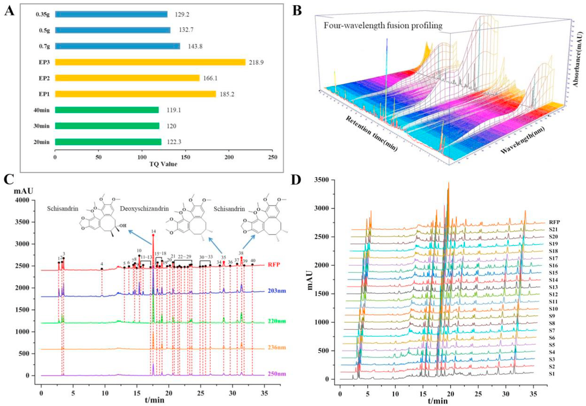
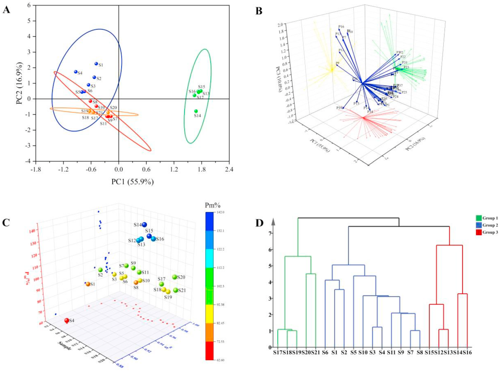
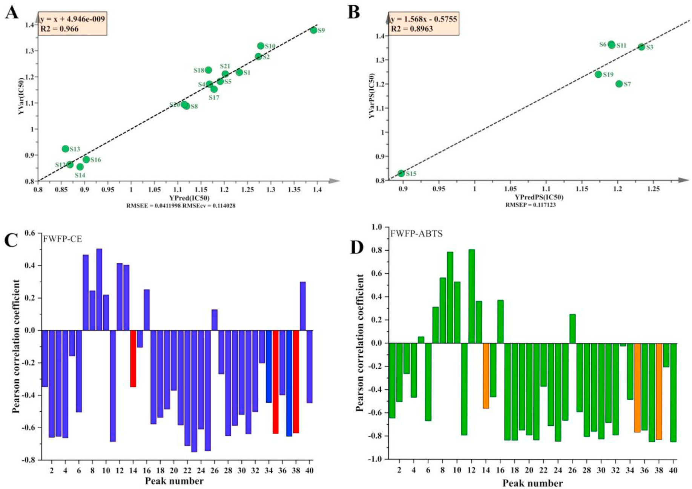

<!-- 方針: ほぼ全訳＋必要に応じた補足。原文構成に沿って訳出。「> 補足:」は訳者注。 -->

## 書誌情報

- 原題: Quality control of Hugan capsule based on four-wavelength fusion profiling and electrochemical fingerprint combined with antioxidant activity and chemometric analysis
- 著者: Yantong Chen, Lili Lan（責任著者）, Wanyang Sun（責任著者）, Hong Zhang（責任著者）, Guoxiang Sun（責任著者）
- 所属: 瀋陽薬科大学 薬学院ほか（中国遼寧省瀋陽）／暨南大学 薬学院（広東省広州）
- 掲載: *Analytica Chimica Acta* 1251 (2023) 341015. https://doi.org/10.1016/j.aca.2023.341015
- インパクトファクター: **6.4**（*Analytica Chimica Acta*, JCR 2024 / Clarivate, Q1。分析化学分野の代表的国際誌。正確には IF 6.41）
- 受領 2023-01-07 / 改訂 2023-02-17 / 採録 2023-02-24 / オンライン公開 2023-02-27
- 助成: 中国国家自然科学基金（No. 81573586, 81703696）
- 利益相反: なし（著者申告）

> 補足: 護肝カプセル（Hugan Capsule, HGCs／中国名「護肝胶囊」）は中国薬典2020年版収載の中成薬で、**柴胡（Bupleurum Radix, BR）・茵陳蒿（Artemisiae Scopariae Herba, ASH）・五味子（Fructus Schisandrae, FS）・板藍根（Isatidis Radix, IR）・猪胆粉（Suis Fellis Pulvis, SFP）・緑豆（Mung Bean, MB）**の6生薬からなる。疏肝理気・健脾消食・降トランスアミナーゼの効能をもち、慢性活動性肝炎・初期肝硬変の治療に臨床応用される。本研究で定量する3つのQ-marker（品質マーカー）は五味子由来のリグナン類、すなわち**シザンドリン（Schisandrin, SSD）・デオキシシザンドリン（Deoxyschizandrin, DSD）・シザンドリンB（Schisandrin B, SSB）**である。

> 補足（略号の対応）: 原文は略号が多いので主要なものを整理する。**FWFP**=四波長融合指紋（Four-Wavelength Fusion Profiling）、**ECFP**=電気化学指紋（Electrochemical Fingerprint）、**SQFM**=系統的定量指紋法（Systematically Quantified Fingerprint Method）、**B-Z**=ベロウソフ–ジャボチンスキー（振動反応）、**Sm**=マクロ定性類似度、**Pm**=マクロ定量類似度、**G/Ga**=SQFMによる品質等級、**PCA**=主成分分析、**HCA**=階層クラスター分析、**PLS**=部分最小二乗法、**BCA**=二変量相関分析、**ABTS**=ABTSラジカル消去による抗酸化試験、**AEAC**=ビタミンC当量抗酸化能。

## 要旨（Abstract）

生薬製剤（HP）の品質規格体系を改善することは、伝統中医薬（TCM）の発展にとって困難な課題である。現時点で急務なのは、HPの安全性・有効性・品質一貫性を高めるための包括的・科学的・効果的な評価法を確立することである。本研究では護肝カプセル（HGCs）を例に取った。まず、4業者21ロットのHGCs中の3つの品質マーカー（Q-marker）をHPLCで定量したところ、各試料の含量に大きな差が認められた。さらに四波長融合指紋（FWFP）を確立し、系統的定量指紋法（SQFM）で評価した。主成分分析（PCA）でFWFPを予備的に解析し、化学組成と含量の差の変動を識別した。次に、B-Z振動系を通じて9つの特徴パラメータを記録し、電気化学指紋（ECFP）を構築してFWFPと連携評価し、SQFM結果の等重みを用いて試料品質を総合的に評価した。21ロットの試料は4群6等級に分けられ、指標成分と電気化学活性物質の含量に有意差があることが示された。最後に、ビタミンCを陽性対照として、ABTSラジカル消去法により試料の抗酸化活性を検討した。部分最小二乗法（PLS）と二変量相関分析（BCA）を用いて、FWFP-ABTSおよびFWFP-ECFPの指紋−効果relationshipを解析した。その結果、電気化学とABTS試験で類似した抗酸化能が認められ、HGCsのHPLC指紋40ピーク中31ピークが抗酸化活性をもつことが見出された。両手法は互いに支え合い、HGCs中の抗酸化成分を効果的かつ協調的に反映した。本研究で確立したFWFPとECFPはHGCsの品質検出を実現でき、HPの品質規格の改善とTCMの品質規格法の研究に新しい方向性を提供する。

## 1. 序論（Introduction）

社会と技術の発展に伴い、各種疾患の予防・治療のために生薬製剤（HP）を用いる動きが世界的に高まっている。HPは多成分・多標的・多機能などの特徴をもち、TCMの継承と革新のための重要な担い手である。しかし、TCMとHPには成分が複雑・機序が不明・品質管理が困難といった短所がある。したがって、現代的な検出手法と革新的な解析手法を組み合わせ、TCMとその複方製剤を現代的に研究して品質を管理し、品質規格体系を改善することは、困難だが避けられない趨勢である[1,2]。

近年、TCMの主要な分析手法にはHPLC[3,4]、GC[5,6]、近赤外分光法[7]、ナノテクノロジー[8]などがある。中でもTCM指紋と現代分析技術を組み合わせた手法は、TCMとHPの解析で重要な役割を果たす。その「全体性（integrity）」と「あいまいさ（fuzziness）」という顕著な特徴はTCMの基礎理論に合致しており、国内外で認められたTCM品質管理の有効な手法である[9,10]。HPLC指紋はTCMの全成分を俯瞰でき[11]、各試料間の定性的・定量的な類似性を示せるため、TCM・HP中の有効成分の含量測定と医薬品の品質一貫性評価に好適な手法とされる[12]。しかし、化合物ごとに条件・波長により紫外吸収が異なるため、単一波長のHPLC指紋では試料の化学情報を一面的にしか特徴づけられない。そこで、異なる波長下の試料情報を融合して多波長指紋を作れば、より包括的かつ客観的に試料を理解できる。本研究では、各波長で最大シグナル応答をもつピークを新しいクロマトグラムに合成してHP情報を抽出・統合する**四波長融合指紋（FWFP）**を確立した[13–16]。化学指紋の定性的・定量的類似度の評価には**系統的定量指紋法（SQFM）**を用いた[17]。

HPLC指紋は医薬品分析で広く使われているが、前処理が複雑・分析操作の工程・実験費用が高い・検出時間が長い、といった限界がある[18]。そこで、TCMとHPの全化学物質の定性・定量情報を包括的に得るために、**電気化学指紋法（ECFP）**が、迅速・簡便・低コストな新しい指紋技術として登場した[19]。前処理が簡単・実験操作が便利・安価という利点があり、TCM・HP中の電気化学活性成分全体を特徴づけられる[20,21]。この結果をHPLC評価の補足として組み合わせ、TCM全体の品質を論じることで、TCMとその製剤の品質管理・評価に優れた分析手法を提供する。

HGCsは中国薬典2020年版に収載され[22]、**柴胡（BR）・茵陳蒿（ASH）・五味子（FS）・板藍根（IR）・猪胆粉（SFP）・緑豆（MB）**の6生薬から作られる。疏肝理気・健脾消食・降トランスアミナーゼの効能をもち、慢性活動性肝炎・初期肝硬変の治療に臨床応用される。中国薬典2020年版に従い、本研究ではデオキシシザンドリン（DSD）・シザンドリン（SSD）・シザンドリンB（SSB）をHGCs定量分析の3つの品質マーカー（Q-marker）とした。調査によると、HGCsの品質一貫性に関する報告は国内外でほとんどなく、HGCs成分の定性・定量情報を迅速かつ包括的に解析・管理できる手法の開発が急務であった。

本論文ではHGCsのFWFPを確立し、ECFPと組み合わせて21ロット試料の全体的な品質一貫性を評価した。PCAとHCAを用いて、HPLCとECFPが試料間の差を識別する能力を検証した。PLSモデルでABTS試験結果を解析してFWFPと抗酸化活性の関係を探り、同時にFWFPを橋渡しとして、二変量相関分析（BCA）をECFPと抗酸化の関係（試料の化学組成と生物活性）に適用した。結論として本研究はHGCsの品質一貫性を科学的・客観的・包括的に評価し、TCM・HPの総合的品質一貫性評価に新しく実行可能な方向性を提供した。

## 2. 材料と方法（Materials and methods）

### 2.1. 試薬・化学品

4業者由来の計21ロットのHGCsを用いた（**S1–S6が業者A、S7–S11が業者B、S12–S16が業者C、S17–S21が業者D**）。全試料（濃縮カプセル）は薬局から購入した。SSA・SSBの標準品は中国食品薬品検定研究院（NIFDC, 北京）、DSDは上海栄和医薬科技有限公司（上海）より購入。ABTS〔2,2′-アジノビス（3-エチルベンゾチアゾリン-6-スルホン酸）〕とビタミンC（Vc, 99.0%）はそれぞれ上海麥克林生化科技（上海）、Solarbio Biotechnologyより購入した。

> 補足: 標準品の記載は原文で "SSA and SSB" とあるが、本論文の分析対象マーカーは一貫して SSD（シザンドリン）・DSD・SSB の3成分であり、"SSA" は SSD の誤記と判断される（原文ママを併記）。

アセトニトリル・メタノール（HPLCグレード）・濃硫酸（H₂SO₄, 98%）は宇王化学試剤（山東）、無水エタノールは天津福宇精細化工、リン酸（HPLCグレード）は科密欧化学試剤（天津）、1-ヘプタンスルホン酸ナトリウムは中美化工廠（山東）より入手。硫酸セリウムアンモニウムは天津博迪化工（天津）、臭素酸カリウムは天津科密欧化学試剤（天津）、マロン酸は天津大茂化学試剤廠（天津）より入手。全実験を通じて脱イオン水を用い、その他の試薬はすべて分析グレード。

### 2.2. 装置と分析条件

#### 2.2.1. HPLC分析

Agilent 1100 HPLCシリーズ（Agilent Technologies, 米国）を用い、オンラインデガッサー・四次元低圧混合ポンプ・オートサンプラー・DAD検出器を装備。データ解析・収集はAgilent OpenLAB CDS Chemstation（Edition C.01.07）で制御した。分離は **COSMOSIL Packed 5C18-MS-IIカラム（4.6 mm ID × 250 mm, 5 µm）**、**カラム温度35 ℃**で行った。移動相は**（A）0.2%（v/v）リン酸水溶液（1-ヘプタンスルホン酸ナトリウム5 mmol/L含有）と（B）アセトニトリル–メタノール（9:1, v/v）**、**流速1.0 mL/min**。グラジエント溶出は以下のとおり。

| 時間（min） | B（有機相）比 |
|---|---|
| 0–5 | 7 → 10% |
| 5–10 | 10 → 50% |
| 10–20 | 50 → 60% |
| 20–35 | 60 → 75% |
| 35–40 | 75 → 85% |
| 40–45 | 85 → 7% |

**注入量10 µL**。DAD検出は **203 nm・220 nm・236 nm・250 nm** で行った。

#### 2.2.2. 電気化学振動分析

電気化学分析はCHI 660E電気化学ワークステーション（上海辰華儀器）を用い、DF-101S恒温加熱磁気撹拌器（上海立辰邦西儀器科技）を装備。作用電極にCHI 115白金電極（上海辰華儀器）、参照電極にCHI 150飽和二重塩橋カロメル電極（天津藍標科技発展）を用いた。試料の電位–時間（E-t）曲線（時間tの関数としての電極電位E）はCHI 700E電気化学装置（上海）で記録した。

#### 2.2.3. 抗酸化実験条件

ABTSストック液は、ABTS⋅⁺ラジカル溶液（7.0 mmol/L）とK₂S₂O₈水溶液（5.0 mmol/L）を1:1で混合し、室温・暗所で12–16時間反応させて得た。10倍希釈した一連の試料溶液（0, 0.1, 0.3, 0.5, 0.8, 1.2 mL）およびVc（0.05 mg/mL）を、それぞれ2 mLのABTS作業液と混合し、無水エタノールで5 mLに希釈した。上記混合液を25 ℃・暗所で10分静置後、**734 nm**で吸光度を測定し、各試料は3回並行測定した。ラジカル消去率（RS%）は次式（1）で算出する。

RS% = [1 −（A − Ab）/ A0] × 100% … 式(1)

Aは試料（試料＋無水エタノール＋ABTS⋅⁺）の吸光度、Abは陰性対照（無水エタノール＋ABTS⋅⁺）の吸光度、A0はブランク対照としてのABTS溶液の吸光度。一連の試料溶液の消去率と濃度をプロットして直線回帰式を作り、その式から**50%阻害濃度（IC50、ABTSラジカルの50%を消去するのに要する化合物濃度）**を算出できる。陽性対照としてVcをABTS抗酸化機構の結果と比較した。

### 2.3. 標準溶液・試料溶液の調製

#### 2.3.1. HPLC試料・標準溶液

**試料溶液**: HGCs 5カプセルを細かく粉砕して均一に混合。0.7 gを精秤し、無水エタノール10 mLとともに超音波浴（120 W, 40 kHz）で室温20分間抽出した。静置後、失われた重量分を無水エタノールで補正した。

**混合標準溶液**: SSD・DSD・SSBを適量精秤し、メスフラスコ中でメタノールに溶解して十分振り混ぜ、希釈により最終濃度 **SSD 60 µg/mL・DSD 16 µg/mL・SSB 40 µg/mL** を得た。検量線は上記標準溶液を6段階濃度でメタノール希釈して適切な濃度範囲で作成した。すべての試料・標準溶液は0.45 µmナイロンフィルターでろ過し、4 ℃で保存した。

#### 2.3.2. 電気化学試料

HGCs 0.2 gを精秤し、自作のセラミック反応器に入れた。H₂SO₄（3.0 mol/L）12 mL、CH₂(COOH)₂（マロン酸, 0.4 mol/L）6 mL、硫酸セリウムアンモニウム溶液（0.2 mol/L H₂SO₄で調製, 0.02 mol/L）3 mLを順に加え、35 ℃で3分間撹拌（450 rpm）して均一に混合した。続いて作用電極と参照電極を挿入し、KBrO₃（0.3 mol/L）3 mLを注入。35 ℃・450 rpm撹拌下で、電位振動が消失するまで試料のE-t曲線を記録した。試料なしの上記4溶液をブランクのB-Z振動系とした。

### 2.4. データ解析

FWFPとECFPの評価は自社開発ソフト「TCMクロマト指紋の超情報特性デジタル評価システム4.0（Digitized Evaluation System for Super-Information Characteristics of TCM Chromatographic Fingerprints 4.0, ソフト登録番号0407573, 中国）」で行った。データ解析にはOriginPro 2021とSIMCA 14.1を用い、PCA・HCA・PLSを実施した。

## 3. 理論（Theory）

### 3.1. SQFMの理論

SQFMは、試料指紋（SFP）と参照指紋（RFP）の間の定性的・定量的差を比較する手法である。2つのベクトル X→=(x1, x2…xi) と Y→=(y1, y2…yi)（xi, yi はそれぞれSFP・RFPのピークシグナル）を考える。**マクロ定性類似度（Sm, 式2）**は X→ と Y→ のなす角θのベクトルコサインであり、化学指紋の分布における定性類似度（SF）と比定性類似度（S′F）の平均で、大きなピークが小さなピークを覆い隠す影響をSFとS′Fの等重みで排除する。これにより曲線中のピーク位置と頻度を監視し、SFPとRFP間の化学成分の数と分布比の類似度合いを正確に記述できる。さらに**マクロ定量類似度（Pm, 式5）**は、投影含量類似度（C, 式3、X→のY→への投影）と定量類似度（P, 式4、SFPの総ピーク面積のRFP成分に対する割合をSFで補正したもの）の平均で算出する。これにより全体的な化学組成含量を記述し、試料品質を包括的・客観的に評価できる。SmとPmを組み合わせて品質水準を判定する方法がSQFMである。本法では品質を8等級に分け、分類基準はTable 1に示す。**Sm値が0.85超は化学組成と分布比が類似すること**を意味し、**Pm値の範囲が85.0%〜120%は試料間の量的・質的差が小さいこと**を示す。したがって指紋は、複雑成分をもつ試料の解析において、化学成分の種類と量をより包括的に反映する絶対的な優位性をもつ。

数式（原文の式2〜5）は本文に記号のまま与えられている。要点は「Sm＝定性の一致度（0〜1）」「Pm＝定量の一致度（%）」の2軸で試料をRFPと比べる、というものである。

> 補足: SQFM は瀋陽薬科大 Sun らのグループが継続的に用いている自作の指紋評価法で、指紋どうしの「並び（定性・Sm）」と「大きさ（定量・Pm）」を分けて数値化し、両者を組み合わせて等級（G）を付ける。等級判定基準は Table 1 下段に示す（Sm と Pm/% の値域ごとに G=1〜8）。

**Table 1（下段）. SQFM 等級評価基準。**

| G（等級） | Sm ≥ | Pm/%（範囲） |
|---|---|---|
| 1 | 0.95 | 95–105 |
| 2 | 0.9 | 90–110 |
| 3 | 0.85 | 85–115 |
| 4 | 0.8 | 80–120 |
| 5 | 0.7 | 70–130 |
| 6 | 0.6 | 60–140 |
| 7 | 0.5 | 50–150 |
| 8 | < 0.50 | 0–∞ |

### 3.2. B-Z振動反応の機構

BrO₃⁻–H⁺–有機物–Mⁿ⁺ の構造をもつ系は、Belousov の振動系に基づき Zhabotinsky が提唱した **B-Z振動系**と呼ばれ、その振動反応は本質的に酸化還元反応であり、典型的な非線形化学反応系である。Field らが提唱したFKNモデルに基づき、B-Z振動反応の過程が説明された。反応機構は主に2つの過程、すなわち誘導過程（A）と振動過程（B・C・D）にまとめられる。

本研究のB-Z振動反応は非平衡閉鎖系であり、反応過程全体がBr⁻濃度の影響を受ける。系全体には臨界Br⁻濃度（[Br⁻]crit）が存在する。誘導過程で系中の[Br⁻]が[Br⁻]critより高いと、B-Z振動反応の3つの不可逆過程（B・C・D）の可能性を誘発する（Fig. 1A）。[Br⁻]>[Br⁻]crit なら反応(5)〜(7)が起こる。逆に[Br⁻]<[Br⁻]crit のとき過程Cが反応を開始し、Br⁻の再生が引き起こされ、その過程で過程Dが起こる。3つの過程サイクルの発生はB-Z振動反応が生じたことを示す。したがって[Br⁻]は振動反応における選択スイッチに相当する。要するにB-Zは、マロン酸を除く反応物・中間体の「消費–再生」サイクルで起こる振動過程とみなせる。

## 4. 結果と考察（Results and discussion）

### 4.1. HPLC指紋分析

#### 4.1.1. 実験条件の最適化

有効時間内に理想的な指紋を構築するため、**材料–液比（35, 50, 70 mg/mL）**、**移動相グラジエント溶出過程（EP1, EP2, EP3、Table S1）**、**抽出時間（20, 30, 40分）**を検討した。全指紋情報量（TQ）はクロマトシグナルの大きさ・均一化・全情報を表す指標で、指紋全体の情報を代表する。そこでTQを抽出条件の最適化に用いた。TQ値が大きいほど情報量が多く、抽出条件が良好である。

TQ = Σ Ri·lg( Ai·tRi·Ni / Nr ) … 式(6)

Ai: 各ピーク面積、tRi: 保持時間、Ni: 理論段数、Ri: 分離度、Nr: 対照指紋ピークの理論段数。Fig. 2Aは、上記2.3.1で提案した抽出条件・クロマト条件が最適であることを示した（EP3・0.7 g・20分でTQ最大）。

> 補足: Fig. 2A の TQ 値は、抽出時間3条件（20/30/40分で 122.3/120/119.1）・グラジエント3条件（EP1/EP2/EP3 で 185.2/166.1/218.9）・材料液比3条件（0.7/0.5/0.35 g で 143.8/132.7/129.2）。最終採用条件（0.7 g・20分・グラジエントEP相当）が最大TQを与える、という読み取り（数値は図から）。

#### 4.1.2. 指紋分析法のバリデーション

2.3節で調製した試料溶液S1を用いて、クロマト法の精度・併行精度・安定性・正確性・直線性・LOD・LOQを検討した。精度・併行精度・安定性は、各クロマトピークの相対保持時間（RRT）と相対ピーク面積（RPA）のRSDを算出して評価した。SSBピークはピーク形状・分離が良好なため参照ピークに選んだ。

- **精度**: S1を連続6回注入。RRTのRSDは**0.4%未満**、RPAは**4.84%未満**。
- **併行精度**: 6並行調製で検証。RRTは**0.65%未満**、RPAは**4.28%未満**。
- **安定性**: 試料溶液を室温（25±2 ℃）で0, 2, 4, 8, 12, 24時間保存。各ピークのRRTのRSDは**0.5%以内**、RPAは**5.0%以内**。

試料と対応標準品の保持時間・UV吸収曲線を比較し、3種のマーカーを同定した。**ピーク14＝SSD、ピーク35＝DSD、ピーク38＝SSB**（Fig. 2C）。正確性は回収率試験（標準添加法）で評価し、3つのQ-markerの平均回収率はそれぞれ**96.0%（SSD）・95.0%（DSD）・101.9%（SSB）**、RSDはそれぞれ**2.70%・2.19%・3.07%**であった。DSD・SSB・SSDの直線性はピーク面積を従属変数（Y）、溶液濃度を独立変数（X）としてフィットし、LOD・LOQは溶液希釈法で推定した。結果をTable 2に示す。相関係数rはいずれも**0.9999超**で、良好な直線関係を示した。

> 補足: マーカーのピーク番号は節により表記が揺れている。本節(4.1.2)と Fig. 2C では **ピーク14=SSD／35=DSD／38=SSB**、後述の指紋−効果解析(4.4.2)では **Peak-14(SSD)／Peak-34(DSD)／Peak-37(SSB)** と DSD・SSB の番号が1つずつ異なる（原文ママ）。融合指紋(FWFP)と単一波長指紋でピーク番号付けが異なることによる不一致とみられる。

**Table 2. SSD・DSD・SSBの検量線・直線範囲・LOD・LOQ。**

| 化合物 | 検量線 y = bx + a | r | 直線範囲（µg/mL） | LOD（ng） | LOQ（ng） |
|---|---|---|---|---|---|
| SSD（シザンドリン） | y = 55.335x + 23.334 | 1.0000 | 6.0–180.0 | 60.0 | 200.0 |
| DSD（デオキシシザンドリン） | y = 92.922x + 32.259 | 1.0000 | 1.6–48.0 | 160.0 | 533.3 |
| SSB（シザンドリンB） | y = 58.138x + 12.752 | 1.0000 | 4.0–120.0 | 222.2 | 800.0 |

（y: ピーク面積、x: 濃度（µg/mL）。r は R² の平方根として取得。LOD・LOQ の単位は原文どおり ng。）

#### 4.1.3. 3つのQ-markerの含量評価

本実験では、DSD・SSB・SSDの3つのQ-markerを**220 nm**で測定し試料を定量した。21ロットHGCs中の3指標成分の濃度（µg/mL）を外部標準法で算出した。Table S2に示すとおり、同一業者の異なるロット間でも3つのQ-markerの含量に有意差があった。例えばS4（業者A）・S8（業者B）の3指標成分は平均含量より有意に低く、業者CのS14・業者DのS20のSSD・DSD・SSB含量は同一業者の他ロットより明らかに高かった。特筆すべきは、3指標成分の平均含量・総含量が業者間で大きく異なることである。SSD・DSDおよび3マーカー総含量の順は**業者C > 業者D > 業者B > 業者A**、SSBは**業者C > 業者B > 業者D > 業者A**であった。業者Cの試料は指標成分含量が高く、業者Aは低いことが直感的に見て取れる。

> 補足: ロット別の3成分の実測含量（µg/mL）は補足資料 **Table S2** に置かれており、本体PDFには数値表として収録されていない（本文は上記の順序関係のみ提示）。個々のロットの数値は**原文（Supplementary data, https://doi.org/10.1016/j.aca.2023.341015 ）参照**。

### 4.2. 電気化学振動系分析

#### 4.2.1. 実験条件の最適化

良好な形状と適切な反応時間の電気化学系を得るため、振動系における試料量・温度（T）・撹拌速度の影響を検討した。Fig. 1B・Table S3・Fig. 1より、電気化学指紋の形状と特徴パラメータはHGCsの投与量に明らかに影響された。HGCs量が増えるほど振動応答の阻害が強まり、振動寿命が短く・誘導時間が長くなった。またTも形状・特徴パラメータに有意に影響したが、撹拌速度には明らかな影響がなかった。したがって、安定なECFPを得るため**試料0.2 g・35 ℃・450 rpm**を選んだ。

#### 4.2.2. ECFP分析法のバリデーション

2.2.2節に従い、最適条件下でS1を6個体並行測定して再現性を評価した。誘導時間（tind）・ピーク頂点時間（tpet）・振動寿命（tosl）・振動終了時間（tose）・ピーク頂点電位（Epet）・振動開始電位（Eoss）・振動終了電位（Eose）・振動周期（τosc）・最大振幅（ΔEmax）のRSDはそれぞれ**0.86%・0.26%・0.34%・0.39%・0.49%・1.52%・1.65%・1.79%・3.61%**（Table S4）。全体としてECFP特徴パラメータのRSDは**4.0%以下**で、本電気化学振動法は試料測定に優れた再現性をもち、ECFP解析の信頼できる基盤を提供した。

### 4.3. 指紋分析

#### 4.3.1. 四波長融合指紋（FWFP）分析

TCMの成分は複雑・多様で化学成分の含量が低く、成分ごとに最大紫外吸収波長が異なる。そのため単一波長でTCM成分の品質を検出するには限界があり、全化学情報の指紋を要約できない。本研究では、HGCsの全紫外域の吸収特性を三次元スペクトルクロマトグラフィー（Fig. 2B）から取得した。より多くの成分情報を示すため、**203・220・236・250 nm**を監視波長に選んだ。Fig. 2Cは4波長が異なる吸収シグナルを示すことを明らかにし、単一波長のUV吸収データだけで試料の有効成分を包括的に評価するのは困難であることを示した。そこで単一波長の欠点を克服し、必要な類似度とピーク数を実現するため、2.4節のソフトでFWFPを確立した。融合時間窓を0.1分として最適マッチングを達成し、より包括的で豊富な試料情報を得るために最大のFWFP指紋を構築した。21ロットHGCsの共通ピーク数は**203 nmで39、220 nmで30、236 nmで24、250 nmで24**であったのに対し、**FWFPでは40**であった。単一波長クロマトと比べ、新たに形成されたFWFPは夾雑ピークの影響を大幅に減らし、有効ピークの情報を完全に保持した。

#### 4.3.2. 主成分分析（PCA）

FWFPピークの品質解析能力を探るため、多変量統計ツールとしてPCAを選び、多変量データ系の次元を削減して試料と指紋ピークの相関を識別した。まず21試料の40共通ピーク面積をOriginソフトに取り込み、得られた最初の3主成分がデータ分散の**82.8%**を説明した（**PC1＝55.9%, PC2＝16.9%, PC3＝10.0%**）。次に21観測×40変数の行列モデルを作成した。2次元カラースコアプロット（Fig. 3A）では全試料が4群に分かれた。同一業者Aの**S1–S6は1クラスタ（群I）**に集まり、PC1と負・PC2と正の相関。**S7–S11（業者B）とS17–S21（業者D）**はPC1・PC2と負の相関で、それぞれ群II・群III。**業者Cは群IV**。この結果は、本解析法が異なる業者の試料を効果的に識別でき、同一業者の試料は品質一貫性が良好であることを示した。3次元青ローディングプロット（Fig. 3B）では、各元指紋ピークの合成変数への寄与を直感的に把握でき、原点から遠い共通ピークほど寄与が大きいことが示された。要するにPCAモデルにより化学組成の変動と試料間の定性差が予備的に識別されたが、業者間・ロット間の潜在差と全体品質の一貫性は、なお指紋法でさらに包括的・科学的に評価・管理する必要があった。

#### 4.3.3. SQFMによるFWFPの評価

21試料の定性・定量類似度解析のため（Fig. 2D）、21ロットHGCsのFWFPを評価ソフトに取り込み、融合クロマトグラムの平均から全試料のRFPを生成し、SQFMで品質を評価した。類似度結果に基づく等級分けの後（Table 1）、業者Aの6ロットは最良が等級2・最低が等級6。業者Bの5ロットのうち3つが等級1。業者Cの5ロットは等級5, 5, 7, 6, 6、業者Dの5ロットは等級1〜3であった。以上より、業者B・業者Dの試料は全体品質が良好、業者Cは他業者と異なり不良であった。同時に、21ロットの**SFWFP値は0.885〜0.989**で、各ロットの化学指紋の量・含量分布が均一であることを示した。一方、**PFWFP値は54.6%〜145.5%**で、化学成分の含量が試料間で大きく異なり、全試料の品質評価は主にPFWFPに依存した。これらの結果はいずれも、4業者21ロット間で品質水準に差があり、主要化学成分・含量にも差があることを示した。したがって単一または数成分の測定では試料全体の品質を代表できず、より包括的・科学的な品質解析には指紋分析が必要である。さらに3次元散布図（Fig. 3C）に試料間の階層分布とクラスタ情報が明示され、S1–S6, S7–S11, S12–S15, S16–S21が良好にクラスタリングされ、PCA結果とよく一致した。要するに、HPLC指紋とSQFMの併用はHGCsの品質一貫性を定性・定量の両面で評価でき、HGCsの総合品質管理に科学的・包括的・信頼できる手法を提供した。

> 補足: 本節末で 3D 散布図のクラスタが **S12–S15／S16–S21** と記されているが、2.1 節・PCA(4.3.2)・HCA(4.3.4)の記述では業者Cが **S12–S16**、業者Dが **S17–S21** である。境界（S16の帰属）の表記が節間で揺れており、原文ママ。原則は「業者C＝S12–S16、業者D＝S17–S21」で読むのが整合する。

#### 4.3.4. ECFPの解析と評価

21ロットのECFPの平均からRFPを生成し（*.csvをソフトに取り込み）、各試料のSEC・PECをSQFMで算出して等級を付与した。振動寿命（tosl）を電気化学指紋による試料品質一貫性評価の主要基準とした。Fig. 1Cは最適条件下で得た全試料のE-t曲線を示し、Table 3に9つの主要特徴パラメータをまとめた。これらのE-t曲線と特徴パラメータは、試料中の活性成分がB-Z振動系に及ぼす影響を反映し、試料の電気化学活性成分の分布と含量を総合的に要約した。Table 1・Fig. 1Cより、21試料の誘導曲線の形状は類似した変動を示し、**SEC値はすべて0.975超**で、各ロットの化学的・電気化学活性成分の種類が高度に類似し、数のわずかな差も小さいことを示した。ただし振動反応には程度差の違いがあり、化学含量の違いを反映した。**PEC値が大きいほどtoslが長く、B-Z系への阻害が小さく、試料中の化学含量が低い**ことを示す。特にS17–S19（業者D）の振動周期が有意に長く、これらの試料の活性成分含量が少ないことを意味した。逆に業者Aは4業者中で化学活性成分の含量が高かった。toslによる全試料の総化合物量の順は次のとおり:

S1 > S2 > S5 > S6 > S14 > S16 > S15 > S3 > S12 > S13 > S4 > S21 > S20 > S9 > S11 > S8 > S10 > S17 > S19 > S7 > S18

同時にHCAで電気化学結果を検討した。PECをSIMCAに取り込み、試料を大きく3カテゴリに分けた（Fig. 3D）。**S12–S16が1カテゴリ、S17–S21が1カテゴリ**で、これらは業者C・Dと一致。**業者A・Bの11ロットは1カテゴリ**にまとまり、両業者の試料中の内在化学活性物質の含量が類似することを示した。さらに、HPLCとEC解析法の結果は完全には一致しなかった。これはHPLCが主に、特定溶媒に溶けて設定した溶出プログラムを通り特定波長で検出されるUV吸収特性をもつ成分を検出するのに対し、電気化学はB-Z振動系の酸化反応に関与する試料中の全活性成分の能力をより反映するためと考えられる。

**Table 3. 21ロットHGCsの全体活性成分の特徴パラメータ。**

| No. | tind/s | tpet/s | tosl/s | tose/s | Epet/V | Eoss/V | Eose/V | τosc/s | ΔEmax/V |
|---|---|---|---|---|---|---|---|---|---|
| S1 | 396.8 | 318.3 | 2908.2 | 3305 | 0.9808 | 0.7423 | 0.6760 | 43 | 0.2277 |
| S2 | 375.8 | 298.9 | 2796.2 | 3172 | 1.002 | 0.7600 | 0.7031 | 43 | 0.2184 |
| S3 | 390.5 | 307.7 | 3189.5 | 3580 | 1.003 | 0.7561 | 0.6887 | 47 | 0.2339 |
| S4 | 322.6 | 233.2 | 3214.4 | 3537 | 1.017 | 0.7772 | 0.6936 | 47 | 0.2262 |
| S5 | 350.7 | 272.9 | 2945.3 | 3296 | 1.009 | 0.7623 | 0.6833 | 45 | 0.2184 |
| S6 | 352.5 | 274.2 | 2998.2 | 3351 | 1.002 | 0.7781 | 0.6996 | 45 | 0.2137 |
| S7 | 219.8 | 136.3 | 4309.2 | 4331 | 1.013 | 0.7998 | 0.6940 | 59 | 0.2213 |
| S8 | 245.2 | 165.3 | 4133.8 | 4379 | 1.016 | 0.8099 | 0.6900 | 56 | 0.2357 |
| S9 | 211.3 | 126.8 | 4096.7 | 4308 | 1.015 | 0.8049 | 0.6899 | 58 | 0.2365 |
| S10 | 261.6 | 177.8 | 4228.4 | 4490 | 1.014 | 0.8003 | 0.6896 | 58 | 0.2374 |
| S11 | 217.4 | 129.9 | 4101.6 | 4319 | 1.023 | 0.8110 | 0.6993 | 56 | 0.2321 |
| S12 | 304.3 | 223.6 | 3192.7 | 3497 | 1.03 | 0.8016 | 0.6947 | 47 | 0.2145 |
| S13 | 301.1 | 218.9 | 3199.9 | 3501 | 1.031 | 0.7933 | 0.6966 | 45 | 0.2190 |
| S14 | 272.3 | 189.4 | 3023.7 | 3296 | 1.018 | 0.7953 | 0.6873 | 44 | 0.2066 |
| S15 | 314.3 | 229.3 | 3127.7 | 3442 | 1.028 | 0.7977 | 0.7024 | 46 | 0.2106 |
| S16 | 319.4 | 242.5 | 3034.6 | 3354 | 1.028 | 0.8108 | 0.7008 | 44 | 0.2200 |
| S17 | 261.6 | 167.2 | 4268.4 | 4530 | 1.031 | 0.8082 | 0.7013 | 54 | 0.2341 |
| S18 | 278.3 | 185.9 | 4325.7 | 4604 | 1.029 | 0.8082 | 0.7048 | 57 | 0.2341 |
| S19 | 279.5 | 187.7 | 4300.5 | 4580 | 1.034 | 0.8140 | 0.7076 | 56 | 0.2356 |
| S20 | 181.0 | 96.1 | 3974.0 | 4155 | 1.033 | 0.8221 | 0.6734 | 60 | 0.2376 |
| S21 | 237.9 | 148.4 | 3886.1 | 4124 | 1.023 | 0.8186 | 0.6699 | 60 | 0.2305 |
| RSD% | 19.31 | 28.33 | 2.78 | 13.39 | 1.32 | 2.83 | 1.50 | 12.8 | 4.35 |

（tind: 誘導時間、tpet: ピーク頂点時間、tosl: 振動寿命、tose: 振動終了時間、Epet: ピーク頂点電位、Eoss: 振動開始電位、Eose: 振動終了電位、τosc: 振動周期、ΔEmax: 最大振幅。）

#### 4.3.5. FWFPとECFPの統合評価

Table 1のとおり、試料等級の評価はFWFPとECFPで完全には一致しなかった。これは検出原理の微妙な違いによると考えられる。例えばS4はFWFP評価でPFWFP値が基準の70.0%未満のため等級6と判定されたが、ECFPでは**SEC=0.991・PEC=102.4%で等級1**であった。そこで2種の指紋を**等重みで総合評価**し、試料の品質一貫性を包括的・客観的に反映した。SFW-EC・PFW-ECは式(7)・(8)で算出した。

- SFW-EC = 1/2（SFWFP + SEC） … 式(7)
- PFW-EC = 1/2（PFWFP + PEC） … 式(8)

最終等級は各パラメータの最悪値で決定し、総合評価基準はSQFMと統一した。Table 1より、**SFW-EC値は0.978以上**、**PFW-EC値は82.55%〜112.9%**で、全試料が化学組成比・量ともに類似することを示した。これにより21ロットは**4等級**に分けられた：**S2, S3, S5, S8, S16が等級2**、**S1, S6, S12–S15が等級3**、**S4が等級4**、**残りが等級1**。すべての試料が許容範囲内にあり、良好な品質一貫性をもつことを示した。

TCMの品質評価の補償的解析法として、TCM指紋の総合評価法の結果は単一検出法の限界をさらに明らかにした。本法はHGCsの品質一貫性評価に有用であり、他のTCMの品質一貫性評価にも用いることができ、TCM品質の有意差を定性・定量の両面から効果的・信頼的に検出でき、結果をより科学的・効果的・信頼できるものにすると示唆された。

**Table 1. 各条件の指紋評価結果と21ロットHGCsのIC50値（mg/mL）。**（Sm: 定性類似度、Pm: 定量類似度（%）、G: SQFM等級。列は単一波長203/220/236/250 nm・FWFP・ECFP・統合(FW-EC)・ABTSのIC50。）

| No. | 203nm Sm/Pm/G | 220nm Sm/Pm/G | 236nm Sm/Pm/G | 250nm Sm/Pm/G | FWFP S/P/G | ECFP S/P/G | 統合 S/P/G | IC50 |
|---|---|---|---|---|---|---|---|---|
| S1 | 0.926/82.3/4 | 0.942/79.5/5 | 0.964/80/4 | 0.962/79.8/5 | 0.942/81.4/4 | 0.976/94.6/2 | 0.959/88/3 | 1.2175 |
| S2 | 0.954/94.5/2 | 0.936/89.5/3 | 0.952/87.7/3 | 0.97/85.8/3 | 0.958/92.6/2 | 0.975/91.2/2 | 0.967/91.9/2 | 1.4779 |
| S3 | 0.974/87.1/3 | 0.97/83/4 | 0.978/83/4 | 0.982/82.2/4 | 0.976/85.7/3 | 0.989/101.7/1 | 0.983/93.7/2 | 1.7538 |
| S4 | 0.885/65.1/6 | 0.949/54.9/7 | 0.979/54.6/7 | 0.895/57.3/7 | 0.895/62.7/6 | 0.991/102.4/1 | 0.943/82.55/4 | 1.0713 |
| S5 | 0.976/85/3 | 0.983/80.7/4 | 0.987/80/4 | 0.989/79.7/5 | 0.978/84.1/4 | 0.981/97.7/1 | 0.978/90.9/2 | 1.1823 |
| S6 | 0.976/87.4/3 | 0.981/82.8/4 | 0.986/81.9/4 | 0.988/81.8/4 | 0.979/86.5/3 | 0.989/90.2/2 | 0.984/88.35/3 | 1.3649 |
| S7 | 0.975/97.6/1 | 0.975/98.2/1 | 0.977/99.2/1 | 0.976/100.7/1 | 0.976/98.4/1 | 0.994/101.6/1 | 0.985/100/1 | 1.0010 |
| S8 | 0.986/81.7/4 | 0.98/79.8/5 | 0.987/80.7/4 | 0.986/81.8/4 | 0.987/81.5/4 | 0.987/101.7/1 | 0.987/91.6/2 | 1.0868 |
| S9 | 0.973/97.7/1 | 0.978/98/1 | 0.975/98.7/1 | 0.979/99.8/1 | 0.977/98.3/1 | 0.985/103.5/1 | 0.981/100.9/1 | 1.3778 |
| S10 | 0.981/86.6/3 | 0.983/85.3/3 | 0.981/85.6/3 | 0.981/86/3 | 0.983/86.7/3 | 0.988/106.5/2 | 0.986/96.6/1 | 1.3778 |
| S11 | 0.976/96.1/1 | 0.957/97.3/1 | 0.975/97.9/1 | 0.974/98.9/1 | 0.976/96.9/1 | 0.988/102.9/1 | 0.982/99.9/1 | 1.5699 |
| S12 | 0.968/126/5 | 0.977/133.4/6 | 0.978/134.2/6 | 0.977/130.6/6 | 0.969/127/5 | 0.987/94.6/2 | 0.978/110.8/3 | 0.8626 |
| S13 | 0.968/127.8/5 | 0.978/135.7/6 | 0.979/136.2/6 | 0.978/132.6/6 | 0.968/129.3/5 | 0.987/94.2/2 | 0.978/111.8/3 | 0.9232 |
| S14 | 0.963/137.9/6 | 0.982/145/7 | 0.982/145.4/7 | 0.983/145.5/7 | 0.967/142/7 | 0.989/83.7/4 | 0.978/112.9/3 | 0.8556 |
| S15 | 0.969/132.5/6 | 0.977/139.2/6 | 0.978/139/6 | 0.978/135.2/6 | 0.969/133.3/6 | 0.985/92.5/2 | 0.977/112.9/3 | 0.8284 |
| S16 | 0.97/130.6/6 | 0.978/137.5/6 | 0.979/137.5/6 | 0.979/133.9/6 | 0.97/131.8/6 | 0.989/86.3/3 | 0.980/109.1/2 | 0.8839 |
| S17 | 0.976/92.6/2 | 0.98/91.1/2 | 0.979/91.2/2 | 0.983/93.3/2 | 0.979/92.8/2 | 0.992/110.3/3 | 0.986/101.6/1 | 1.1521 |
| S18 | 0.974/89.6/3 | 0.979/88.2/3 | 0.977/88.5/3 | 0.984/90.3/2 | 0.977/89.7/3 | 0.988/110.7/3 | 0.983/100.2/1 | 1.2248 |
| S19 | 0.974/88.7/3 | 0.979/87.2/3 | 0.978/87.5/3 | 0.983/89.5/3 | 0.978/88.8/3 | 0.986/110.7/3 | 0.982/99.75/1 | 1.2408 |
| S20 | 0.98/101.6/1 | 0.981/102.6/1 | 0.979/102.8/1 | 0.986/104.4/1 | 0.982/101.9/1 | 0.977/105.2/2 | 0.978/103.6/1 | 1.0935 |
| S21 | 0.975/93/2 | 0.98/90.8/2 | 0.979/90.8/2 | 0.982/92.1/2 | 0.978/92.7/2 | 0.977/100.8/1 | 0.978/96.75/1 | 1.2107 |
| Mean | 0.967/99.11/3 | 0.973/99.03/4 | 0.978/99.16/4 | 0.976/99.11/4 | 0.970/99.24/3 | 0.986/99.19/2 | 0.978/99.22/2 | 1.179 |
| Min | 0.885/65.1/1 | 0.936/54.9/1 | 0.952/54.6/1 | 0.895/57.3/1 | 0.895/62.7/1 | 0.975/83.7/1 | 0.943/82.55/1 | 0.828 |
| Max | 0.986/137.9/6 | 0.983/145/7 | 0.987/145.4/7 | 0.989/145.5/7 | 0.987/142/7 | 0.994/110.7/4 | 0.987/112.9/4 | 1.7538 |
| RSD% | 2.31/20.00/53.10 | 1.44/24.71/53.55 | 0.77/24.83/53.94 | 2.00/23.44/55.06 | 2.03/21.09/54.23 | 0.55/7.83/46.68 | 1.04/8.83/49.9 | 21.07 |

> 補足: S4 のように、HPLC 指紋（FWFP）では低品質（等級6）でも電気化学指紋（ECFP）では高品質（等級1）と評価される「不一致例」が、両手法を併用する意義を示す。HPLC は UV 吸収する特定成分を、ECFP は酸化還元に関与する全電気活性成分を見ているため相補的、というのが著者の主張。

### 4.4. 抗酸化活性分析

#### 4.4.1. ABTS法によるFWFP–効果relationship

本研究ではABTS⋅⁺でHGCsのin vitro抗酸化活性を測定し、消去率の結果としてIC50（半数最大阻害濃度）で表した。IC50値が低いほど試料の抗酸化力が強い。21ロットのIC50値は**0.8284 mg/mL〜1.7538 mg/mL**（Table 1）で、全試料が相応の抗酸化活性を示した。中でも**S15（0.8284 mg/mL）が最強、S3（1.7538 mg/mL）が最弱**であった。同時に、L-アスコルビン酸のビタミンC当量抗酸化能（AEAC）を陽性対照として導入し、ABTS⋅⁺で測定した抗酸化活性を比較した。その検量線は **y = 150.31x + 0.012, r = 0.9990**。21ロットのVc当量範囲は**1.8512 µg/mL〜3.9191 µg/mL**（Table S5）。S12–S16（業者C）はABTSへの消去能が弱かったが、いずれもVcより弱かった。

FWFPと抗酸化実験の関係を探るため、21試料の40共通ピーク面積を独立変数（X）、IC50値を従属変数（Y）としてPLSモデルを効果的に確立した。全試料を無作為に**検量群（15試料、モデル化・予測用）と予測群（6試料: S3, S6, S7, S11, S12, S15, S19）**に分けてモデルを検証した。確立した検量モデル（Fig. 4A）は説明分散（R²Y）**0.996**、予測力（Q²）**0.672**を示し、高い適合度と正確な予測能力を確認するのに十分であった。二乗平均平方根推定誤差（RMSEE）は**0.0412**、交差検証（RMSECV）値は**0.1140**で、モデルが頑健かつ受容可能であることを示した。予測二乗平均平方根誤差（RMSEP）値は**0.1171**で、理想的な予測能力をもつ優れた予測モデルであることを証明した（Fig. 4B）。全試料の実測IC50値と予測IC50値の間に明らかな異常はなかった（Table S4）。要するに、FWFPはPLSモデルを通じて異なるロットのHGCsの抗酸化能を予測できる。

> 補足: 予測群を原文は「6 samples」と記しながら、続けて S3・S6・S7・S11・S12・S15・S19 の **7ロット**を列挙している（原文ママ）。ロット数の数え方の誤記とみられるが、本稿では改変せず転記する。

#### 4.4.2. ECFPのFWFP–効果relationship

電気化学の本質は酸化還元反応であり、振動指紋は異なる周波数・振幅の連続変動を示すため、電気化学分析から得た抗酸化活性とクロマト指紋の効果relationshipを直感的に表示するのは難しい。そこでABTS抗酸化実験と組み合わせて、電気化学とFWFPの関係を検証した。FWFPの40ピーク面積と21ロットHGCsのPEC値の間のピアソン相関係数（r）を算出し、ピーク面積とPEC値の相関（peaks-PEC）を探った。電気化学のPEC値は試料の酸化還元能を実際に反映し、試料中の活性成分が多いほどPEC値が小さく、抗酸化能が強い（＝B-Z振動系への阻害が大きい）ため、peaks-PECは負相関になる。Fig. 4Cのとおり、**31ピークのrp値がゼロ未満（全ピークの約77.5%）**で、これらのピークがB-Z振動反応の阻害に重要な役割を果たすことを示した。

同時にFWFPピーク値とIC50値の相関（peaks-IC50）を確立し、FWFPピーク値に二変量相関分析（BCA）を行い、結果をr値で表した。原理上、peaks-IC50は負相関であるべきで（IC50が小さいほど抗酸化能が優れる）、Fig. 4Dは**31ピークがIC50とも負相関（全ピークの77.5%, r<0）**であることをよく示した。さらに、2つの効果relationshipで共通の相関を示した38ピークのうち30ピークが負相関で、**Peak-14（SSD）・Peak-34（DSD）・Peak-37（SSB）**はいずれもより良い抗酸化活性を示した。これは電気化学法と抗酸化法の評価結果が類似・相互支持し、HGCs中の抗酸化成分を効果的・協調的に反映できることを意味する。ただし、2つの指紋–効果relationshipで負相関を示す指紋ピークの割合には差があり、これは2つの反応系の違いによる結果の偏差と解釈できる。本実験計画は、2手法の共通ピークの酸化還元への寄与を異なる視点から客観的・包括的に示し、HGCsの化学的性質と薬理活性に正確で明確な参照を提供する、という点で意味がある。

## 5. 結論（Conclusions）

本論文では21ロットのHGCsの四波長最大融合指紋（FWFP）を確立した。FWFPの統合データを抽出・解析することで従来の単一波長分析の欠点を補い、試料の全体品質を包括的に解析した。確立したPCAモデルとSQFMで試料の定性・定量を識別し、品質一貫性を信頼性高く評価した。次に、複雑な前処理を要さないECFPを電気化学原理に基づき構築した。HCAでHGCs中の関連電気活性物質と対応化学成分を特徴づけ・解析し、HPに豊富な視覚情報を提供した。同時にABTS抗酸化能と組み合わせてPLSモデルを確立し、peak-PEC指紋効果とpeak-IC50図を描いて電気化学とABTSの抗酸化能を比較し、FWFPピークを媒介としてABTS・ECFP評価結果への寄与を探った。その結果、両者は試料の活性成分に対して良好な抗酸化予測能をもち、化合物の内在活性予測に新しく有利な研究方向を提供した。要するに本研究の手法は、HGCsの内部全体化学成分の品質一貫性を定性・定量の両面から評価できる。この新規手法の開発は、TCM・HPの品質と効能の二重管理に信頼性・実用性・包括性・有効性のある戦略を提供し、TCM・HPの品質規格の改善と品質規格法の研究に優れた方向性を提供する。

## 参考文献

1. Z. Li, X. Zhang, J. Liao, X. Fan, Y. Cheng, An ultra-robust fingerprinting method for quality assessment of traditional Chinese medicine using multiple reaction monitoring mass spectrometry, J. Pharm. Anal. 11 (1) (2021) 88–95.
2. L. Wang, Z. Li, X. Zhao, W. Liu, Y. Liu, J. Yang, X. Li, X. Fan, Y. Cheng, A network study of Chinese medicine xuesaitong injection to elucidate a complex mode of action with multicompound, multitarget, and multipathway, Evid. Based Complement. Alternat. Med. (2013) 652373.
3. L. Lan, J. Zhang, T. Yang, D. Gong, Z. Zheng, G. Sun, P. Guo, H. Zhang, Compound synthesizing profiling based on quantitative HPLC fingerprints combined with antioxidant activity analysis for Zhizi Jinhua pills, Phytomedicine 105 (2022) 154340.
4. W. Liu, D.-x. Yin, N. Tang, T. Zhang, J. Wang, D.-h. Qin, Z. Zhang, Quality evaluation of Sinopodophyllum hexandrum (Royle) Ying based on active compounds, bioactivities and RP-HPLC fingerprint, Ind. Crop. Prod. 174 (2021).
5. B. Quintanilla-Casas, B. Torres-Cobos, F. Guardiola, M. Servili, S. Vichi, A. Tres, Geographical authentication of virgin olive oil by GC-MS sesquiterpene hydrocarbon fingerprint: verifying EU and single country label-declaration, Food Chem. 378 (2022) 132104.
6. M. Li, R. Yang, H. Zhang, S. Wang, D. Chen, S. Lin, Development of a flavor fingerprint by HS-GC-IMS with PCA for volatile compounds of Tricholoma matsutake Singer, Food Chem. 290 (2019) 32–39.
7. S. Jeong, S. Seol, H. Kim, Y. Lee, S.H. Nam, J.M. An, H. Chung, Cooperative combination of LIBS-based elemental analysis and near-infrared molecular fingerprinting for enhanced discrimination of geographical origin of soybean paste, Food Chem. 399 (2023) 133956.
8. S.R. Yousefi, A. Sobhani, H.A. Alshamsi, M. Salavati-Niasari, Green sonochemical synthesis of BaDy(2)NiO(5)/Dy(2)O(3) and BaDy(2)NiO(5)/NiO nanocomposites in the presence of core almond as a capping agent and their application as photocatalysts for the removal of organic dyes in water, RSC Adv. 11 (19) (2021) 11500–11512.
9. D.Z. Yang, Y.Q. An, X.L. Jiang, D.Q. Tang, Y.Y. Gao, H.T. Zhao, X.W. Wu, Development of a novel method combining HPLC fingerprint and multi-ingredients quantitative analysis for quality evaluation of traditional Chinese medicine preparation, Talanta 85 (2) (2011) 885–890.
10. L. Zheng, M. Wang, Z. Chen, J. Hou, X. Li, Simultaneous quantitation of 13 active components in SimiaoYong'an decoction using high-performance liquid chromatography with diode array detection, Acta Chromatogr. 31 (3) (2019) 216–221.
11. X. Li, F. Zhang, Y. Shi, B. Bao, G. Sun, Assessing the quality consistency of Rong'e Yishen oral liquid by five-wavelength maximization profilings and electrochemical fingerprints combined with antioxidant activity analyses, Anal. Chim. Acta 1192 (2022) 339348.
12. B. Yan, L. Yang, D. Ma, G. Sun, Comprehensively evaluating the quality consistency of liuwei dihuang pill by five-wavelength overall fused HPLC fingerprints combined with simultaneous determination and antioxidant activity, J. Chromatogr. Sci. 55 (10) (2017) 1026–1036.
13. H. Zhu, Y. Qiu, D. Gong, J. Wang, G. Sun, A novel method for quality consistency evaluation of Yankening Tablet by multi-wavelength fusion profiling combined with overall components dissolution method and antioxidant activity analysis, J. Pharm. Biomed. Anal. 196 (2021) 113910.
14. L. Tao, Q. Zhang, Y. Wu, X. Liu, Quality evaluation of moluodan concentrated pill using high-performance liquid chromatography fingerprinting coupled with chemometrics, J. Separ. Sci. 39 (24) (2016) 4673–4680.
15. D. Gong, J. Chen, Y. Sun, X. Liu, G. Sun, Multiple wavelengths maximization fusion fingerprint profiling for quality evaluation of compound liquorice tablets and related antioxidant activity analysis, Microchem. J. 160 (2021).
16. F. Yang, G. Sun, J. Chen, Development of a HPLC-DAD method combined with multicomponent chemometrics and antioxidant capacity to monitor the quality consistency of compound bismuth aluminate tablets by comprehensive quantified fingerprint method, Anal. Methods 9 (27) (2017) 4082–4090.
17. F. Yang, T. Chu, Y. Zhang, X. Liu, G. Sun, Z. Chen, Quality assessment of licorice (Glycyrrhiza glabra L.) from different sources by multiple fingerprint profiles combined with quantitative analysis, antioxidant activity and chemometric methods, Food Chem. 324 (2020) 126854.
18. X. Li, D. Gong, G. Sun, H. Zhang, W. Sun, High performance liquid chromatography three-wavelength fusion fingerprint combined with electrochemical fingerprint and antioxidant method to evaluate the quality consistency of Mingmu Dihuang Pill, J. Chromatogr. A 1681 (2022) 463448.
19. T. Zhang, Y. Liang, B. Yuan, F. Ding, Y. Zhang, M. Wei, X. Chen, Determining method and conditional factors of electrochemical fingerprint of Chinese traditional medicine, Chin. Sci. Bull. 52 (16) (2007) 2190–2202.
20. D. Gong, X. Li, X. Liu, G. Sun, P. Guo, Electrochemical-based quantitative fingerprint evaluation strategy combined with multi-markers assay by monolinear method for quality control of herbal medicine, Phytomedicine 104 (2022) 154274.
21. Y. Sun, D. Gong, G. Sun, Quality monitoring and evaluation of Powdered Poppy Capsule Extractive by multiple wavelengths matching average fusion chromatographic fingerprint combined with electrochemical fingerprint, Microchem. J. 169 (2021).
22. N.P. Committee, Pharmacopoeia of the People's Republic of China 2020, China Medical Science and Technology Press, Beijing, 2020.
23. R.J. Field, E. Koros, R.M. Noyes, Oscillations in chemical systems. II. Thorough analysis of temporal oscillation in the bromate-cerium-malonic acid system, J. Am. Chem. Soc. 94 (25) (1972) 8649–8664.
24. T. Zhang, Z. Zhao, X. Fang, J. Qiao, F. Xiang, R. Zhu, Y. Liang, F. Ding, Principle of nonlinear chemical fingerprint by using dissipative components in samples as well as calculation and evaluation of similarity, Sci. China Chem. 55 (2) (2011) 304–322.
25. R.L.-N. de la Fuente, S. García-Muñoz, L.T. Biegler, An efficient nonlinear programming strategy for PCA models with incomplete data sets, J. Chemometr. 24 (2010) 301–311.
26. Y. Ni, Y. Lai, S. Brandes, S. Kokot, Multi-wavelength HPLC fingerprints from complex substances: an exploratory chemometrics study of the Cassia seed example, Anal. Chim. Acta 647 (2) (2009) 149–158.
27. J.D. Qiu, S.H. Luo, J.H. Huang, R.P. Liang, Using support vector machines for prediction of protein structural classes based on discrete wavelet transform, J. Comput. Chem. 30 (8) (2009) 1344–1350.

## 訳者補足（本稿の位置づけ）

- **手法の骨格**: 本論文は瀋陽薬科大 Sun グループの「多波長融合指紋（FWFP）＋電気化学指紋（ECFP）＋抗酸化活性」という一連の中成薬品質評価プラットフォームを、護肝カプセルに適用したもの。同グループは複方甘草片・六味地黄丸・明目地黄丸・榮阿益腎口服液など多くの中成薬で同型の研究を発表している（本文の引用文献に多数）。本サイトには類縁の五波長・全波長指紋＋電気化学＋抗酸化の論文（貞芪扶正 ZQFZ、豨薟草 SH-RSQFM 等）が既にあり、方法論の系譜として比較すると理解しやすい。
- **新規性のポイント（著者主張）**: (1) 単一波長の情報の偏りを4波長融合で補う、(2) 生薬製剤にECFP（B-Z振動反応）を初めて適用、(3) ABTSとECFPの両方で抗酸化を測り、FWFPピークを橋渡しに指紋–効果relationshipを比較。
- **QC実務への示唆（訳者注）**: 薬典が定量対象とする五味子リグナン3成分（SSD/DSD/SSB）だけでは、業者間・ロット間の品質差（PFWFP 54.6〜145.5%、IC50 0.83〜1.75 mg/mL の2倍以上の開き）を捉えきれない、という点が実データで示されている。「何をいくつ測るか」で品質判定が変わる典型例であり、指紋（全体像）＋多成分定量＋（可能なら）活性評価の多層QCが有効という主張は、多成分処方の品質管理を考えるうえで参考になる。
- **限界**: ロット別のQ-marker実測含量（Table S2）・Vc当量（Table S5）・グラジエント比較（Table S1）・ECFP精度（Table S3, S4）は補足資料に置かれ本体PDFにない。個別数値は原文Supplementary data参照。また電気化学（ECFP）はHPLCと評価が一致しない場合があり、両者は相補的に用いる前提である。
