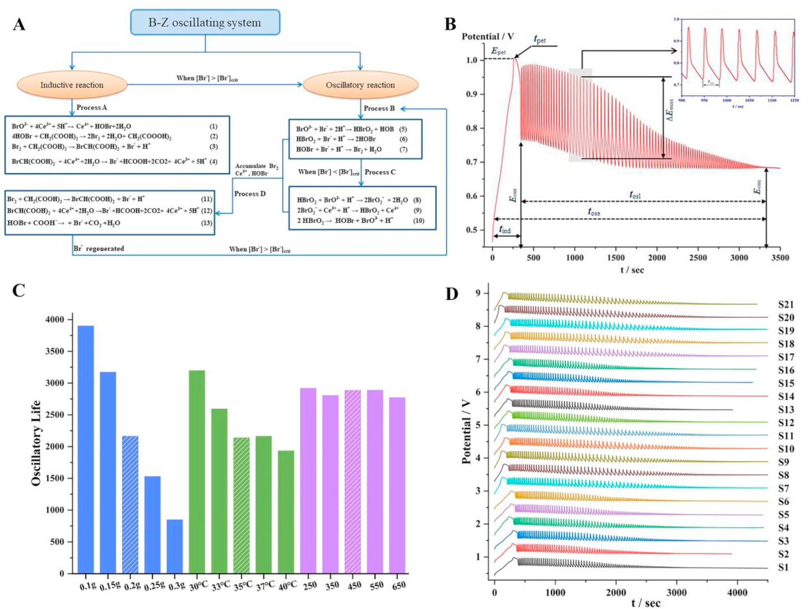
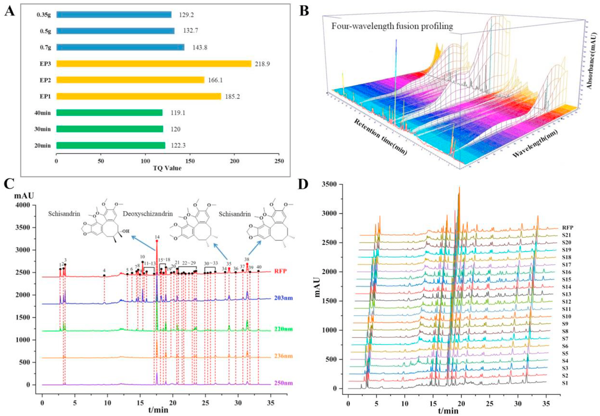
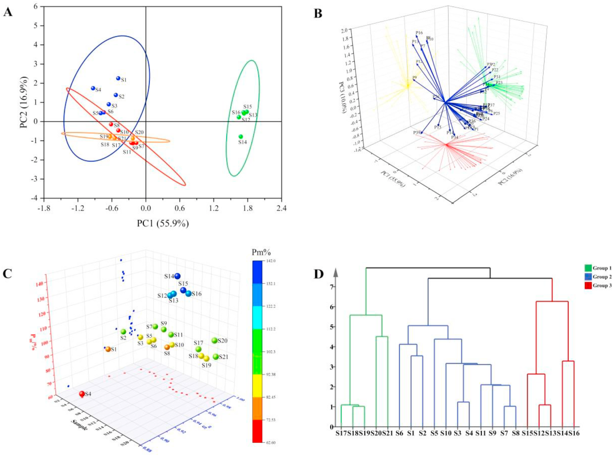
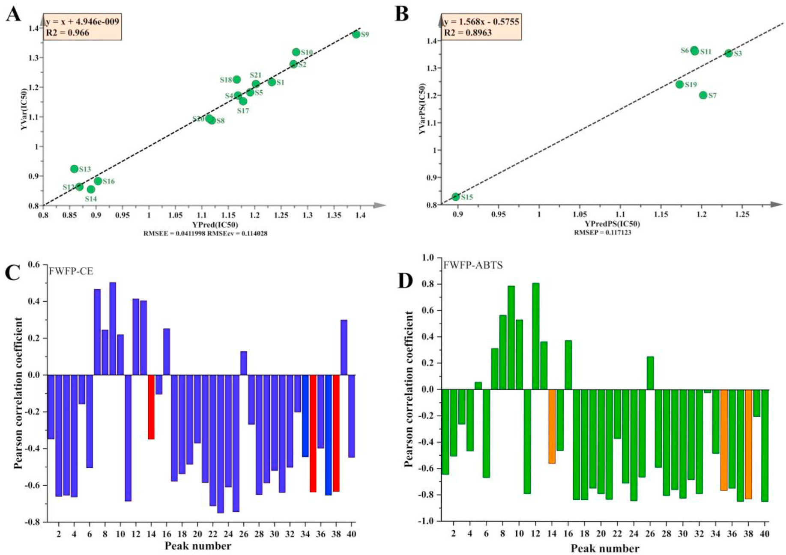

<!-- 方針: ほぼ全訳＋必要に応じた補足。原文構成（Introduction→Materials and methods→Theory→Results and discussion→Conclusions）に沿って訳出。「> 補足:」は訳者注。 -->

## 書誌情報

- 標題（原題）: Quality control of Hugan capsule based on four-wavelength fusion profiling and electrochemical fingerprint combined with antioxidant activity and chemometric analysis
- 著者・所属: Yantong Chen, Lili Lan, Guoxiang Sun（瀋陽薬科大学薬学院、中国・遼寧省瀋陽）／Wanyang Sun（曁南大学薬学院・広東省中医薬＆疾病感受性工程研究センター、中国・広東省広州）／Hong Zhang（瀋陽薬科大学生命科学・生物製薬学院、中国・遼寧省瀋陽）
- 掲載誌・巻号・DOI: Analytica Chimica Acta 1251 (2023) 341015. DOI: 10.1016/j.aca.2023.341015
- インパクトファクター: 6.4（Analytica Chimica Acta, JCR 2024 / Clarivate）
- 受理経過 / ライセンス: 受領 2023年1月7日／改訂 2023年2月17日／採録 2023年2月24日／オンライン公開 2023年2月27日。© 2023 Elsevier B.V. All rights reserved.
- 助成: 国家自然科学基金（No. 81573586, 81703696）
- 担当編集者（Handling Editor）: Dr. Jing-Juan Xu

> 補足: 略語一覧（原文Abbreviationsより）。ABTS = 2,2′-アジノ-ビス(3-エチルベンゾチアゾリン-6-スルホン酸)；AEAC = 等価抗酸化能；B-Z = Belousov-Zhabotinsky（振動反応）；BCA = 二変量相関分析；DSD = デオキシシザンドリン（Deoxyschizandrin）；ECFP = 電気化学的指紋；FWFP = 四波長融合プロファイリング；HGCs = 護肝カプセル(Hugan Capsules)；HP = 生薬製剤(herbal preparation)；HCA = 階層クラスター分析；PCA = 主成分分析；PLS = 部分最小二乗法；Q-markers = 品質マーカー；RFP = 参照指紋；r = ピアソン相関係数；SSD = シザンドリン(Schisandrin)；SSB = シザンドリンB(Schisandrin B)；SQFM = 系統定量指紋法(systematically quantified fingerprint method)；SFP = 試料指紋；TCM = 漢方薬(traditional Chinese medicine)。

## ハイライト（Highlights）

- SQFMにより護肝カプセルの品質一致性を評価した。
- 試料情報を統合するため四波長融合プロファイリングを確立した。
- 生薬製剤の特性評価にECFPを用いたのは本研究が初めてである。
- ABTSラジカル消去試験とECFPの両方で抗酸化活性を決定したのも初めてである。
- FWFP-ECFPとFWFP-IC50を比較検討し、薬効相関を解析した。

## 要旨（Abstract）

生薬製剤（herbal preparations; HPs）の品質規格体系を改善することは、漢方薬（TCM）の発展にとって困難な課題である。現在、HPsの安全性・有効性・品質一致性を高めるための、包括的・科学的かつ効果的な評価法を確立することが急務となっている。本研究では、護肝カプセル（Hu Gan capsules; HGCs）を例として取り上げた。まず、4製造元の21バッチのHGCsに含まれる3種の品質マーカー（Q-markers）をHPLCで定量したところ、試料ごとの含量に大きな差が見られた。さらに、四波長融合プロファイリング（four-wavelength fusion profiling; FWFP）を確立し、系統定量指紋法（systematically quantified fingerprint method; SQFM）で評価した。主成分分析（PCA）を用いてFWFPの予備的解析を行い、化学組成・含量の差異の変動を判別した。続いて、B-Z振動系を通じて9つの特性パラメータを記録し、電気化学的指紋（electrochemical fingerprint; ECFP）を構築してFWFPと合わせて評価し、SQFM結果の等重みを用いて試料品質を総合的に評価した。21バッチの試料は4グループ・6グレードに分けられ、試料間で指標成分および電気化学的活性物質の含量に有意な差があることが示された。最後に、ビタミンCを陽性対照として、2,2′-アジノ-ビス(3-エチル-ベンゾチアゾリン-6-スルホン酸)（ABTS）ラジカル消去試験を適用して試料の抗酸化活性を検討した。部分最小二乗法（PLS）と二変量相関分析（BCA）を用いて、FWFP-ABTSおよびFWFP-ECFPの指紋-薬効関係を解析した。その結果、電気化学的手法とABTS試験で類似した抗酸化能が見られ、HGCsの40本のHPLC指紋ピークのうち31本に抗酸化活性が認められた。両手法は互いに支持し合い、HGCs中の抗酸化成分を効果的かつ協働的に反映した。本研究で確立したFWFPとECFPはHGCsの品質検出を実現でき、HPsの品質規格の改善とTCMの品質規格法の研究に新たな方向性を提供するものである。

**キーワード**: 漢方薬（Traditional Chinese medicine）；四波長融合プロファイリング（Four-wavelength fusion profiling）；品質一致性管理（Quality consistency control）；電気化学的指紋（Electrochemical fingerprint）；抗酸化活性（Antioxidant activity）

## 1. 序論（Introduction）

社会と科学技術の発展に伴い、様々な疾病の予防・治療に生薬製剤（HPs）を用いる動きが世界的に高まっている。HPsは多成分・多標的・多機能といった特徴を持ち、漢方薬（TCM）の継承と革新の重要な担い手である。しかし、TCMおよびHPsには、成分が複雑である、作用機序が不明確である、品質管理が難しいといった短所もある。したがって、現代的な検出法と革新的な分析法を組み合わせ、TCMおよびその複方製剤の現代的研究を行い、その品質を管理し、品質規格体系を改善することは、困難ではあるが避けられない趨勢である [1,2]。

近年、TCMの主な分析法にはHPLC [3,4]、GC [5,6]、近赤外分光法 [7]、ナノテクノロジー [8]などがある。しかし、TCM指紋図譜と現代分析技術を組み合わせる手法が、TCMおよびHPsの分析において重要な役割を果たしている。その顕著な特徴である「整体性（integrity）」と「模糊性（fuzziness）」は、TCMの基本理論とまさに合致しており、国内外で認められたTCMの品質管理の効果的な手法である [9,10]。HPLC指紋図譜はTCMの全成分を俯瞰する視点を提供でき [11]、各試料間の定性的・定量的な類似性を示すことができるため、TCMおよびHPsにおける有効成分の含量決定と薬物の品質一致性評価にとって望ましい方策となっている [12]。しかしながら、異なる化合物は異なる条件・異なる波長のもとで異なる紫外吸収を示すため、単一波長のHPLC指紋図譜は試料の化学的情報を一面的にしか特徴づけられない [13,14]。そこで、異なる波長下での試料情報を融合して多波長指紋図譜を形成することで、試料についてより包括的かつ客観的な理解を提供できる。本研究では、各波長で最大シグナル応答を示すピークを統合して新たなクロマトグラムとする四波長融合指紋（FWFP）を確立し、HPの情報抽出・統合に用いた [15,16]。化学指紋図譜の定性的類似性・定量的類似性を評価するために、系統定量指紋法（SQFM）を用いた [17]。

HPLC指紋図譜は医薬品分析の分野で広く用いられているが、試料前処理が複雑である、分析技術の操作プロセスが煩雑である、実験コストが高い、検出時間が長い、といった限界がある [18]。そこで、TCMおよびHPsの化学物質全体について定性的・定量的情報を包括的に取得するため、電気化学的指紋法（ECFP）が、迅速・簡便・低コストな新しい指紋技術として登場した [19]。この手法は試料前処理が簡便、実験操作が容易、価格が安いという利点を持ち、TCMおよびHPs中の電気活性成分全体を特徴づけることができる [20,21]。その結果はHPLCの評価結果を補完・統合してTCMの全体的な品質を議論するために用いられ、TCMおよびその製剤の品質管理・評価にとって優れた分析法を提供する。

HGCsは『中国薬局方』2020年版 [22]に収載されており、柴胡（Bupleurum Radix; BR）、茵陳蒿（Artemisiae Scopariae Herba; ASH）、五味子（Fructus Schisandrae; FS）、板藍根（Isatidis Radix; IR）、猪胆粉（Suis Fellis Pulvis; SFP）、緑豆（Mung Bean; MB）の6生薬から製造される。疏肝理気・健脾消食・トランスアミナーゼ低下の効能を持つ。臨床では慢性活動性肝炎および肝硬変早期の治療にも用いられる。『中国薬局方』2020年版に従い、本研究ではデオキシシザンドリン（DSD）、シザンドリン（SSD）、シザンドリンB（SSB）をHGCsの定量分析のための3つの品質マーカー（Q-markers）とした。調査によれば、HGCsの品質一致性に関する国内外の報告は少ない。したがって、HGCs成分の定性的・定量的情報を迅速かつ包括的に分析・管理できる手法の開発は、解決が急がれる課題となっている。

本論文では、HGCsのFWFPを確立し、ECFPと組み合わせて21バッチの試料の全体的な品質一致性を評価した。主成分分析（PCA）と階層クラスター分析（HCA）を用いて、HPLCとECFPが試料間の差異を判別する能力を検証した。PLSモデルを用いてABTS試験結果を解析し、FWFPと抗酸化活性の関係を検討した。同時に、FWFPを橋渡しとして、二変量相関分析（BCA）を用いて、試料の化学組成と生物活性の観点からECFPと抗酸化活性の関係を検討した。結論として、本研究はHGCsの品質一致性を科学的・客観的かつ包括的に評価し、TCMおよびHPsの包括的な品質一致性評価にとって新規かつ実行可能な方向性を提供するものである。

## 2. 材料と方法（Materials and methods）

### 2.1. 試薬と化学物質

合計21バッチのHGCs（濃縮カプセル）を4つの異なる製造元（製造元AからS1〜S6、製造元BからS7〜S11、製造元CからS12〜S16、製造元DからS17〜S21）から入手し、いずれも薬局で購入した。SSAおよびSSBの標準品は中国食品薬品検定研究院（北京）から、DSDは上海融和医薬科技有限公司（上海）から購入した。2,2′-アジノ-ビス(3-エチル-ベンゾチアゾリン-6-スルホン酸)（ABTS）とビタミンC（Vc、純度99.0%）は、それぞれ上海麦克林生化科技有限公司（上海）とSolarbio Biotechnology Co., Ltd.から購入した。

アセトニトリル、メタノール（HPLCグレード）、濃硫酸（H₂SO₄、98%）は禹王化学試薬有限公司（山東省）から、無水エタノールは天津富宇精細化工有限公司から、リン酸（HPLCグレード）はKermel Chemistry Reagent Co., Ltd（天津）から、1-ヘプタンスルホン酸ナトリウムは中美化学工場（山東省）から入手した。硫酸セリウムアンモニウムは天津博迪化学有限公司（天津）から、臭素酸カリウムは天津科密欧化学試薬有限公司（天津）から、マロン酸は天津大茂化学試薬工場（天津）から入手した。実験全体を通して脱イオン水を使用した。その他の試薬・化学物質はすべて分析グレードのものを用いた。

### 2.2. 装置と分析条件

#### 2.2.1. HPLC分析

分析にはAgilent 1100 HPLCシリーズ（Agilent Technologies, Santa Clara, CA, USA）を用い、オンライン脱気装置、四次元低圧混合ポンプ、オートサンプラー、DAD検出器を装備した。データ解析・収集はAgilent OpenLAB CDS Chemstation（Edition C.01.07）で制御した。分離はCOSMOSIL Packed 5C18-MS-IIカラム（4.6 ID × 250 mm, 5 μm）を用い、カラム温度35 ℃で行った。移動相は0.2%(v/v)リン酸水溶液（5 mmol/L 1-ヘプタンスルホン酸ナトリウム含有）(A)およびアセトニトリル-メタノール（9:1, v/v）(B)からなり、流速1.0 mL/minとした。グラジエント溶出条件は次の通り: 7–10% B (0–5 min)；10–50% B (5–10 min)；50–60% B (10–20 min)；60–75% B (20–35 min)；75–85% B (35–40 min)；85–7% B (40–45 min)。注入量は10 μLとした。DAD検出は203 nm、220 nm、236 nm、250 nmで行った。

#### 2.2.2. 電気化学的振動分析

電気化学分析には、CHI 660E電気化学ワークステーション（上海辰華儀器有限公司）を使用し、DF-101S集熱式定温加熱磁気撹拌機（上海力辰邦西儀器科技有限公司）を装備した。作用電極にはCHI 115白金電極（上海辰華儀器有限公司）、参照電極にはCHI 150飽和複塩橋カロメル電極（天津蘭標科技発展有限公司）を用いた。試料の電位-時間（E-t）曲線（電極の電位(E)の時間(t)に対する変化）は、CHI 700E電気化学装置（上海）で記録した。

#### 2.2.3. 抗酸化実験条件

ABTS原液は、ABTS⋅⁺ラジカル溶液（7.0 mmol/L）とK₂S₂O₈水溶液（5.0 mmol/L）を1:1の比率で混合し、暗所室温で12〜16時間反応させて調製した。10倍希釈した一連の試料溶液（0、0.1、0.3、0.5、0.8、1.2 mL）およびVC（0.05 mg/mL）を、それぞれ2 mLのABTS作業溶液と混合し、無水エタノールで5 mLに希釈した。上記混合液を25 ℃暗所で10分静置後、734 nmで吸光度を測定し、各試料を3回並行測定した。ラジカル消去率（RS%）は次式(1)で算出できる:

RS% = [1-(A-Ab)/A0] × 100% (1)

Aは試料（試料＋無水エタノール＋ABTS⋅⁺）の吸光度、Abは陰性対照（無水エタノール＋ABTS⋅⁺）の吸光度、A0はブランク対照としてのABTS溶液の吸光度である。一連の試料溶液の濃度と消去率をプロットして線形回帰式を作成し、50%阻害濃度（IC50、ABTSラジカルの50%を消去するために必要な化合物濃度）を式から算出できる。陽性対照として、VcをABTS抗酸化機序の結果と比較した。

### 2.3. 標準溶液・試料溶液の調製

#### 2.3.1. HPLC試料溶液・標準溶液

試料溶液: 5個のHGCsを細かく均一に粉砕混合した。0.7 gのHGCsを精密に秤量し、10 mLの無水エタノール中で超音波浴（120 W、40 kHz）を用いて室温で20分間抽出した。静置後、試料溶液の減量分は無水エタノールで補正した。

混合標準溶液: SSD、DSD、SSBを適量精密に秤量し、メスフラスコ内でメタノールに溶解して標準溶液を調製し、十分に振り混ぜた後、希釈によりそれぞれ最終的にSSD 60 μg/mL、DSD 16 μg/mL、SSB 40 μg/mLを得た。さらに、上記標準溶液を適切な濃度範囲までメタノールで希釈した6段階の濃度水準により検量線を作成した。

なお、すべての試料溶液・標準溶液は0.45 μmナイロンフィルターでろ過し、4 ℃で保存した。

#### 2.3.2. 電気化学試料

0.2 gのHGCsを精密に秤量し、自作のセラミック反応器に入れた。反応器にH₂SO₄（3.0 mol/L）12 mL、CH₂(COOH)₂（0.4 mol/L）6 mL、硫酸セリウムアンモニウム溶液（0.2 mol/L H₂SO₄溶液で調製した0.02 mol/L溶液）3 mLを順次加え、35 ℃で450 r/minで3分間撹拌して十分に混合した。続いて、作用電極と参照電極を反応液に挿入し、KBrO₃（0.3 mol/L）3 mLを注入した。35 ℃の定温下、450 r/minの磁気撹拌のもと、電位振動が消失するまで試料の電位-時間（E-t）曲線を記録した。試料を含まない上記4種の溶液を、ブランクのBelousov-Zhabotinsky（B-Z）振動系とした。

### 2.4. データ解析

FWFPおよびECFPの評価は、自社開発ソフトウェア「Digitized Evaluation System for Super-Information Characteristics of TCM Chromatographic Fingerprints 4.0」（ソフトウェア認証番号 0407573、中国）により行った。データ解析にはOriginPro 2021およびSIMCA 14.1ソフトウェアを用い、主成分分析（PCA）、階層クラスター分析（HCA）、部分最小二乗法（PLS）を実施した。

## 3. 理論（Theory）

### 3.1. SQFMの理論

SQFMは、試料指紋（SFP）と参照指紋（RFP）の間の定性的・定量的な差異を比較するために用いる。2つのベクトル →X=(x1,x2…xi) と →Y=(y1,y2…yi)（xi、yiはそれぞれSFPおよびRFPのピークシグナルを表す）について、マクロ定性類似度（macro qualitative similarity, Sm、式(2)）は、→Xと→Yのなす角(θ)のコサイン値である定性類似度（SF）と、化学指紋図譜の分布における比率定性類似度（S′F）——SFの等重みによって、大きなピークが小さなピークを覆い隠す影響を排除するもの——の平均値である。したがって、SmはSFPとRFPの間の化学成分の数と分布割合の類似度を、曲線上のピーク位置と頻度を監視することで正確に記述できる。さらに、マクロ定量類似度（macro quantitative similarity, Pm、式(5)）は、→Xの→Yへの射影平均値である投影類似度（P、式(4)）、および含量類似度（C、式(3)）——SFPの総ピーク面積のRFP成分に対する割合をSFで補正したもの——の平均として算出される。これにより、試料全体の化学組成含量を記述し、包括的かつ客観的に試料の品質を評価できる。SmとPmを組み合わせて品質グレードを判定する方法をSQFMと呼ぶ。この方法によれば、品質は8段階に分けられ、その判定基準は表1に示す通りである。Sm値が0.85を超える場合、試料の化学組成と分布割合が類似していることを意味し、Pm値の範囲が85.0%〜120%であれば量・質の面で試料間の差異が小さいことを示す。したがって、指紋図譜は成分が複雑な試料の解析において絶対的な優位性を持つ。なぜなら、化学成分の種類と量をより包括的に反映するからである。

Sm = 1/2 (SF + S′F) (2)

C = [Σxi・yi / Σyi²] または [Σxi・yi / Σxi²]（原文の分数表記は組版が崩れているため、原文の式構成に対応する形でのみ示す。詳細な数式導出は原文参照）(3)

P = [Σxi / Σyi]・SF × 100% (4)

Pm = 1/2 (C + P) (5)

> 補足: 原文PDFのテキスト抽出では式(2)〜(5)の分数・平方根の組版が崩れており、正確な数式の再現は困難であった。SQFMの定義式の詳細（SF・S′Fの厳密な定義を含む）は原文（原論文本文および引用文献[17]）を参照されたい。ここでは原文が明記する言葉による定義（Sm=定性類似度の平均、Pm=定量類似度の平均）と、表1に示されたグレード判定基準の数値は正確に訳出している。

### 3.2. B-Z振動反応の機序

BrO₃⁻-H⁺-有機物-Mⁿ⁺の構造は、Belousovの振動系を基礎としてZhabotinskyが提唱したB-Z振動系と呼ばれ、その振動反応は本質的に酸化還元反応であり、典型的な非線形化学反応系である。Fieldらが提唱したFKNモデルに基づき、B-Z振動反応の過程がうまく説明された [23]。この反応機序は、誘導過程（A）と振動過程（B、C、D）の2つの主要な過程にまとめられる [24]。

本研究では、B-Z振動反応は非平衡閉鎖系であり、反応過程全体はBr⁻の濃度の影響を受ける。反応系全体には、Br⁻の臨界濃度（[Br⁻]crit）が存在する。誘導過程において系内のBr⁻濃度（[Br⁻]）が[Br⁻]critより高い場合、B-Z振動反応における3つの不可逆過程（B、C、D）（図1A）のうち、過程(5)〜(7)が生じる可能性を誘発しうる。逆に、[Br⁻]＜[Br⁻]critのとき、過程Cが反応を開始する。Br⁻の再生が誘発され、この過程でDが生じる。3つの過程サイクルが生じたことは、B-Z振動反応が生成されたことを示す。したがって、[Br⁻]は振動反応における選択スイッチに相当する。要するに、B-Z反応は、マロン酸を除く反応物・中間体の「消費-再生」サイクルの中で生じる振動プロセスとみなされる。

## 4. 結果と考察（Results and discussion）

### 4.1. HPLC指紋分析

#### 4.1.1. 実験条件の最適化

有効な時間内で理想的な指紋図譜を構築するため、試料液比（35 mg/mL、50 mg/mL、70 mg/mL）、移動相グラジエント溶出過程（EP1、EP2、EP3、表S1に記載）、抽出時間（20分、30分、40分）を検討した。総指紋情報量（TQ）はクロマトグラフィーシグナルの大きさ・均質性・総合的情報を示す指標であり、指紋図譜全体の情報を代表する。したがって、TQを抽出条件の最適化に用いた。TQ値が大きいほど情報量が多く、抽出条件が良好であることを示す。

TQ = Σ(i=1→n) Rilg(Ai・tRi・Ni/Nr) (6)

Ai: 各ピークの面積；tRi: 保持時間；Ni: 理論段数；Ri: 分離度を表す；Nrは対照指紋ピークの理論段数である。

図2Aは、上記2.3.1で提案した抽出条件・クロマトグラフィー条件が最適条件であることを示した。

#### 4.1.2. 指紋分析法のバリデーション

2.3で調製した試料溶液S1を用いて、クロマトグラフィー法の精度・再現性・安定性・正確性・直線性、検出限界（LOD）、定量限界（LOQ）を検討した。方法の精度・再現性・安定性は、各クロマトグラフィーピークの相対保持時間（RRT）と相対ピーク面積（RPA）の相対標準偏差（RSD）を算出することで評価し、方法の有効性を検証した。SSBピークはピーク形状が良好で分離が良かったため、参照ピークとして選択した。精度試験はS1を6回連続注入して検討した。結果は、RRTおよびRPAのRSD値がそれぞれ0.4%未満、4.84%未満であることを示した。方法の再現性は6並行試料を調製して検証し、RRTおよびRPAはそれぞれ0.65%、4.28%を下回った。安定性については、試料溶液を室温（25±2 ℃）で0、2、4、8、12、24時間保存した後、各クロマトグラフィーピークのRRTおよびRPAのRSDはそれぞれ0.5%、5.0%を超えなかった。

試料と対応する標準品の保持時間・UV吸収曲線を比較した結果、3種のマーカーが同定された。ピーク14、ピーク35、ピーク38が、それぞれSSD、DSD、SSBと同定された（図2C）。さらに、正確性は一般に回収率試験で表され、試料の回収率は標準添加法により決定された。3つのQ-markerの平均回収率はそれぞれ96.0%、95.0%、101.9%であり、RSDはそれぞれ2.70%、2.19%、3.07%であった。これらの結果は、本法の正確性が優れていることを示した。同時に、DSD、SSB、SSDの直線性は、ピーク面積を従属変数（Y軸）、溶液濃度を独立変数（X軸）として適合させた。3つのマーカーのLODおよびLOQは、それぞれ溶液希釈法により推定した。3つのQ-markerの直線性結果、LOD、LOQを表2に示す。結果は、ピーク面積と成分濃度の間に良好な線形関係があることを示し、相関係数rはすべて0.9999より大きかった。3化合物間の線形関係は、目標濃度範囲内で許容範囲であった。要するに、確立されたHPLC指紋分析法により、3マーカーの含量を正確に決定できるものであり、この方法は正確・信頼性が高く実用的であった。

#### 表2. SSD、DSD、SSBの検量線・直線範囲・LOD・LOQ

| 化合物 | 検量線a | rb | 直線範囲(μg/mL) | LODc(ng) | LOQd(ng) |
| :-- | :-- | :-: | :-: | :-: | :-: |
| SSD | y = 55.335x + 23.334 | 1.0000 | 6.0–180.0 | 60.0 | 200.0 |
| DSD | y = 92.922x + 32.259 | 1.0000 | 1.6–48.0 | 160.0 | 533.3 |
| SSB | y = 58.138x + 12.752 | 1.0000 | 4.0–120.0 | 222.2 | 800.0 |

a y: ピーク面積；x: 濃度(μg/mL)。 b rはR²の平方根として得た。 c LOD: 検出限界。 d LOQ: 定量限界。

> 補足: 本文中の「相関係数rはすべて0.9999より大きかった」との記述と、表2に示すr=1.0000（有効数字4桁で丸めた値）は原文のまま。

#### 4.1.3. 3つのQ-markerの含量評価

本実験では、DSD、SSB、SSDの3つのQ-markerを220 nmで測定し、試料の定量に用いた。21バッチのHGCs中の3指標成分の濃度（μg/mL）は、外部標準法に従って算出した。表S2に示す通り、同一製造元の異なるバッチ間でも3Q-markerの含量に有意な差があった。例えば、S4（製造元A）とS8（製造元B）の3指標成分は平均含量より有意に低かったのに対し、製造元CのS14と製造元DのS20のSSD、DSD、SSB含量は同一製造元の他バッチより明らかに高かった。特筆すべきは、3指標成分の平均含量・総含量が製造元間で大きく異なっていた点である。そのうち、SSDおよびDSDの含量ならびに3マーカーの総含量は、製造元C＞製造元D＞製造元B＞製造元Aの順であり、SSBは製造元C＞製造元B＞製造元D＞製造元Aの順であった。直感的に見て、製造元Cの試料は指標成分の含量が高く、製造元Aは低いことが分かる。

> 補足: 各バッチ・各成分の詳細な濃度数値は表S2（補足資料）に記載されており、原文提供テキストには表S2自体の数値は含まれていなかった。詳細は原論文の補足資料（Supplementary data, https://doi.org/10.1016/j.aca.2023.341015）を参照されたい。

### 4.2. 電気化学的振動系解析

#### 4.2.1. 実験条件の最適化

良好な波形と適切な反応時間を持つ電気化学系を実現するため、振動系における試料投与量、温度（T）、撹拌速度の影響を検討した。図1B、表S3、図1から、電気化学的指紋の波形と特性パラメータがHGCsの投与量によって明らかに影響を受けることが分かった。HGCsの量が増加するにつれて振動応答の抑制が徐々に強まり、振動寿命が短くなり誘導時間が長くなった。さらに、Tも電気化学的指紋の波形・特性パラメータに有意な影響を与えたが、撹拌速度には明確な影響はなかった。したがって、0.2 gの試料量を選択し、35 ℃・450 r/minで実験を行い、HGCsの品質評価のための安定したECFPを得た。

#### 4.2.2. ECFP分析法のバリデーション

2.2.2に従い、最適条件下でS1を6個体並行測定することにより再現性を評価した。誘導時間（tind）、ピーク頂点時間（tpet）、振動寿命（tosl）、振動終了時間（tose）、ピーク頂点電位（Epet）、振動開始電位（Eoss）、振動終了電位（Eose）、振動周期（τosc）、最大振幅（ΔEmax）のRSDをそれぞれ算出したところ、順に0.86%、0.26%、0.34%、0.39%、0.49%、1.52%、1.65%、1.79%、3.61%であった（表S4）。総じて、ECFP特性パラメータのRSDは4.0%を超えず、本論文で用いた電気化学的振動法は試料の測定において優れた再現性を有し、ECFP分析の信頼できる根拠を提供した。

### 4.3. 指紋分析

#### 4.3.1. 四波長融合プロファイリング分析

TCMの成分は複雑・多様であり化学成分の含量は低く、成分ごとに最大紫外吸収波長が異なる。したがって、単一波長でTCM成分の品質を検出することには一定の限界があり、全化学情報の指紋図譜を要約することはできない。本研究では、全紫外域におけるHGCsの吸収特性を3次元スペクトルクロマトグラフィー（図2B）から取得した。より多くの成分情報を示すため、203 nm、220 nm、236 nm、250 nmをモニタリング波長として選択した。図2Cは、4波長がそれぞれ異なる吸収シグナルを示すことを示しており、単一波長のUV吸収データのみに依拠した分析・考察では、試料中の有効成分を包括的に評価することが困難であることを示している。そこで、HGCs指紋図譜の単一波長の欠点を克服し、試料の類似度とクロマトグラフィーピーク数を必要な水準で実現するため、本研究では2.4節で述べたソフトウェアを用いてFWFPを構築した。融合時間窓は最良の適合結果を得るため0.1分とし、最大のFWFP指紋図譜を構築してより包括的で豊富な試料情報を得た。21バッチのHGCsの共通ピーク数は、203 nmで39本、220 nmで30本、236 nmで24本、250 nmで24本であったのに対し、FWFPでは40本であった。単一波長のクロマトグラフィーと比較して、新たに形成されたFWFPは迷入ピークの影響をかなり低減しつつ、有効ピークの情報を十分に保持した。

#### 4.3.2. 主成分分析

FWFPピークの品質解析能力を検討するため、多変量統計手法であるPCAを選択し、多変量データ系のもつ次元を削減することで試料とフィンガープリントピークの相関を判別し、対応する研究技術から試料の包括的な関連情報を抽出した [25–27]。

まず、21試料の40共通ピーク面積をOrigin softwareに取り込んだ。得られた最初の3主成分でデータ分散の82.8%を説明した（PC1=55.9%、PC2=16.9%、PC3=10.0%）。次に、21観測値×40変数（21×40）の行列モデルを作成した。2次元カラースコアプロット（図3A）から分かるように、すべての試料は4グループに分けられた。同じ製造元AのS1〜S6は一つのクラスタ（グループI）にまとまり、PC1とは負の相関、PC2とは正の相関を示した。S7〜S11（製造元B）とS17〜S21（製造元D）はPC1・PC2いずれとも負の相関を示し、それぞれグループII・IIIとなった。製造元CはグループIVである。この結果は、本分析法が異なる製造元由来の試料を効果的に判別できること、そして同一製造元由来の試料は品質一致性がより良好であることを示した。さらに、3次元青色ローディングプロット（図3B）により、各元の指紋ピークが合成変数に対して持つ寄与をより直感的に把握でき、試料中の主要変数を特定し、試料間の類似性・差異の解析に役立てることができた。共通ピークが原点から離れているほど、その寄与が大きいことが示された。要するに、PCAモデルにより、化学組成の変動と試料間の定性的な差異を予備的に判別することができ、異なる化合物が試料全体に与える影響の違いを定性的に解析できたが、異なる製造元・バッチの試料に由来する潜在的な差異と、試料全体の品質一致性については、指紋図譜法によりさらに包括的・科学的に評価・管理する必要があった。

#### 4.3.3. SQFMによるFWFPの評価

21試料の定性的・定量的類似度解析のため、図2Dに示すように、21バッチのHGCsのFWFPを評価ソフトウェアに取り込み、融合クロマトグラムを平均化することで全試料のRFPを生成し、SQFMにより試料の品質を評価した。類似度結果に基づきグレード分けを行った結果、表1に示す通り、製造元Aの6バッチのうち最良のものはグレード2、最低はグレード6であった。製造元Bの5バッチのうち3バッチはグレード1であり、製造元Cの5バッチはそれぞれグレード5、5、7、6、6、製造元Dの5バッチはグレード1〜3であった。以上の結果は、製造元Bと製造元Dの試料の全体的な品質は良好である一方、製造元Cは他の製造元の試料と異なり品質が劣ることを示した。同時に、21バッチのHGCsのSFWFP値は0.885〜0.989の範囲にあり、各バッチの化学指紋図譜の量・含量の分布が均一であることを示した。しかしながら、PFWFPの値は54.6%〜145.5%の間であり、化学成分の含量が試料間で大きく乖離していることを示しており、全試料の品質評価は主にPFWFPに依存していた。これらの結果はいずれも、4つの異なる製造元に由来する21バッチの試料間で品質水準に差異があること、また試料間で主要な化学成分・含量にも差異があることを示した。したがって、単一または複数成分の定量だけでは試料全体の品質を代表することはできない。21バッチの試料全体の品質を管理するには指紋分析を用いることが必要であり、それによって試料品質のより包括的・科学的な分析が保証される。さらに、図3Cの3次元散布図には、試料間の階層的な分布・クラスタリング情報が明確に示された。これらの試料の集積はPCA解析の結果と大きく一致しており、S1〜S6、S7〜S11、S12〜S15、S16〜S21がそれぞれ優れたクラスタリングを示した。要するに、HPLC指紋図譜とSQFMを組み合わせることで、HGCsの品質一致性を定性的・定量的に評価でき、HGCsの一般的な品質管理にとって科学的・包括的かつ信頼できる方法を提供した。

#### 表1. 21バッチHGCsの各条件下での指紋評価結果とIC50値(mg/mL)

<!-- 列: 203/220/236/250nm各々のSm・Pm・G、FWFP(Sm・Pm・G)、ECFP(Sm・Pm・G)、統合評価(Sm・Pm・G)、ABTS IC50。Gは各手法によるSQFMグレード。 -->

| No. | 203nm Sm | Pm | G | 220nm Sm | Pm | G | 236nm Sm | Pm | G | 250nm Sm | Pm | G | FWFP Sm | Pm | G | ECFP Sm | Pm | G | 統合 Sm | Pm | G | ABTS IC50 |
| :-- | :-: | :-: | :-: | :-: | :-: | :-: | :-: | :-: | :-: | :-: | :-: | :-: | :-: | :-: | :-: | :-: | :-: | :-: | :-: | :-: | :-: | :-- |
| S1 | 0.926 | 82.3 | 4 | 0.942 | 79.5 | 5 | 0.964 | 80 | 4 | 0.962 | 79.8 | 5 | 0.942 | 81.4 | 4 | 0.976 | 94.6 | 2 | 0.959 | 88 | 3 | 1.2175 |
| S2 | 0.954 | 94.5 | 2 | 0.936 | 89.5 | 3 | 0.952 | 87.7 | 3 | 0.97 | 85.8 | 3 | 0.958 | 92.6 | 2 | 0.975 | 91.2 | 2 | 0.967 | 91.9 | 2 | 1.4779 |
| S3 | 0.974 | 87.1 | 3 | 0.97 | 83 | 4 | 0.978 | 83 | 4 | 0.982 | 82.2 | 4 | 0.976 | 85.7 | 3 | 0.989 | 101.7 | 1 | 0.983 | 93.7 | 2 | 1.7538 |
| S4 | 0.885 | 65.1 | 6 | 0.949 | 54.9 | 7 | 0.979 | 54.6 | 7 | 0.895 | 57.3 | 7 | 0.895 | 62.7 | 6 | 0.991 | 102.4 | 1 | 0.943 | 82.55 | 4 | 1.0713 |
| S5 | 0.976 | 85 | 3 | 0.983 | 80.7 | 4 | 0.987 | 80 | 4 | 0.989 | 79.7 | 5 | 0.978 | 84.1 | 4 | 0.981 | 97.7 | 1 | 0.978 | 90.9 | 2 | 1.1823 |
| S6 | 0.976 | 87.4 | 3 | 0.981 | 82.8 | 4 | 0.986 | 81.9 | 4 | 0.988 | 81.8 | 4 | 0.979 | 86.5 | 3 | 0.989 | 90.2 | 2 | 0.984 | 88.35 | 3 | 1.3649 |
| S7 | 0.975 | 97.6 | 1 | 0.975 | 98.2 | 1 | 0.977 | 99.2 | 1 | 0.976 | 100.7 | 1 | 0.976 | 98.4 | 1 | 0.994 | 101.6 | 1 | 0.985 | 100 | 1 | 1.0010 |
| S8 | 0.986 | 81.7 | 4 | 0.98 | 79.8 | 5 | 0.987 | 80.7 | 4 | 0.986 | 81.8 | 4 | 0.987 | 81.5 | 4 | 0.987 | 101.7 | 1 | 0.987 | 91.6 | 2 | 1.0868 |
| S9 | 0.973 | 97.7 | 1 | 0.978 | 98 | 1 | 0.975 | 98.7 | 1 | 0.979 | 99.8 | 1 | 0.977 | 98.3 | 1 | 0.985 | 103.5 | 1 | 0.981 | 100.9 | 1 | 1.3778 |
| S10 | 0.981 | 86.6 | 3 | 0.983 | 85.3 | 3 | 0.981 | 85.6 | 3 | 0.981 | 86 | 3 | 0.983 | 86.7 | 3 | 0.988 | 106.5 | 2 | 0.986 | 96.6 | 1 | 1.3778 |
| S11 | 0.976 | 96.1 | 1 | 0.957 | 97.3 | 1 | 0.975 | 97.9 | 1 | 0.974 | 98.9 | 1 | 0.976 | 96.9 | 1 | 0.988 | 102.9 | 1 | 0.982 | 99.9 | 1 | 1.5699 |
| S12 | 0.968 | 126 | 5 | 0.977 | 133.4 | 6 | 0.978 | 134.2 | 6 | 0.977 | 130.6 | 6 | 0.969 | 127 | 5 | 0.987 | 94.6 | 2 | 0.978 | 110.8 | 3 | 0.8626 |
| S13 | 0.968 | 127.8 | 5 | 0.978 | 135.7 | 6 | 0.979 | 136.2 | 6 | 0.978 | 132.6 | 6 | 0.968 | 129.3 | 5 | 0.987 | 94.2 | 2 | 0.978 | 111.8 | 3 | 0.9232 |
| S14 | 0.963 | 137.9 | 6 | 0.982 | 145 | 7 | 0.982 | 145.4 | 7 | 0.983 | 145.5 | 7 | 0.967 | 142 | 7 | 0.989 | 83.7 | 4 | 0.978 | 112.9 | 3 | 0.8556 |
| S15 | 0.969 | 132.5 | 6 | 0.977 | 139.2 | 6 | 0.978 | 139 | 6 | 0.978 | 135.2 | 6 | 0.969 | 133.3 | 6 | 0.985 | 92.5 | 2 | 0.977 | 112.9 | 3 | 0.8284 |
| S16 | 0.97 | 130.6 | 6 | 0.978 | 137.5 | 6 | 0.979 | 137.5 | 6 | 0.979 | 133.9 | 6 | 0.97 | 131.8 | 6 | 0.989 | 86.3 | 3 | 0.980 | 109.1 | 2 | 0.8839 |
| S17 | 0.976 | 92.6 | 2 | 0.98 | 91.1 | 2 | 0.979 | 91.2 | 2 | 0.983 | 93.3 | 2 | 0.979 | 92.8 | 2 | 0.992 | 110.3 | 3 | 0.986 | 101.6 | 1 | 1.1521 |
| S18 | 0.974 | 89.6 | 3 | 0.979 | 88.2 | 3 | 0.977 | 88.5 | 3 | 0.984 | 90.3 | 2 | 0.977 | 89.7 | 3 | 0.988 | 110.7 | 3 | 0.983 | 100.2 | 1 | 1.2248 |
| S19 | 0.974 | 88.7 | 3 | 0.979 | 87.2 | 3 | 0.978 | 87.5 | 3 | 0.983 | 89.5 | 3 | 0.978 | 88.8 | 3 | 0.986 | 110.7 | 3 | 0.982 | 99.75 | 1 | 1.2408 |
| S20 | 0.98 | 101.6 | 1 | 0.981 | 102.6 | 1 | 0.979 | 102.8 | 1 | 0.986 | 104.4 | 1 | 0.982 | 101.9 | 1 | 0.977 | 105.2 | 2 | 0.978 | 103.6 | 1 | 1.0935 |
| S21 | 0.975 | 93 | 2 | 0.98 | 90.8 | 2 | 0.979 | 90.8 | 2 | 0.982 | 92.1 | 2 | 0.978 | 92.7 | 2 | 0.977 | 100.8 | 1 | 0.978 | 96.75 | 1 | 1.2107 |
| **平均** | 0.967 | 99.11 | 3 | 0.973 | 99.03 | 4 | 0.978 | 99.16 | 4 | 0.976 | 99.11 | 4 | 0.970 | 99.24 | 3 | 0.986 | 99.19 | 2 | 0.978 | 99.22 | 2 | 1.179 |
| **最小** | 0.885 | 65.1 | 1 | 0.936 | 54.9 | 1 | 0.952 | 54.6 | 1 | 0.895 | 57.3 | 1 | 0.895 | 62.7 | 1 | 0.975 | 83.7 | 1 | 0.943 | 82.55 | 1 | 0.828 |
| **最大** | 0.986 | 137.9 | 6 | 0.983 | 145 | 7 | 0.987 | 145.4 | 7 | 0.989 | 145.5 | 7 | 0.987 | 142 | 7 | 0.994 | 110.7 | 4 | 0.987 | 112.9 | 4 | 1.7538 |
| **RSD%** | 2.31 | 20.00 | 53.10 | 1.44 | 24.71 | 53.55 | 0.77 | 24.83 | 53.94 | 2.00 | 23.44 | 55.06 | 2.03 | 21.09 | 54.23 | 0.55 | 7.83 | 46.68 | 1.04 | 8.83 | 49.9 | 21.07 |

**SQFMグレード判定基準**: Sm≥0.95かつPm 95–105% → G1／Sm≥0.9かつPm 90–110% → G2／Sm≥0.85かつPm 85–115% → G3／Sm≥0.8かつPm 80–120% → G4／Sm≥0.7かつPm 70–130% → G5／Sm≥0.6かつPm 60–140% → G6／Sm≥0.5かつPm 50–150% → G7／Sm＜0.50 → G8。（Gは各手法によるSQFM評価グレード）

#### 4.3.4. ECFPの解析と評価

21バッチのECFPのRFPは、*.csvファイルを2.4節のソフトウェアに入力し、平均法により生成した。各試料のSECおよびPECはSQFMを用いて算出し、基準に従い試料に異なるグレードを割り当てた。toslは電気化学的指紋による試料品質一致性評価の主要な根拠として用いた。図1Cは最適条件下で得られた全試料のE-t曲線を示し、表3は9つの主要な特性パラメータを記録・要約したものである。これらのE-t曲線と特性パラメータは、試料中の活性成分がB-Z振動系に与える影響を反映し、試料の電気活性成分の分布・含量の総括的な情報を提供した。表1と図1Cは、21試料の誘導曲線の波形が類似の変動を示すこと、SEC値がすべて0.975以上であることを示しており、これは異なるバッチのHGCsにおける化学的・電気活性成分の種類が非常に類似していること、および数のわずかな違いも小さいことを示唆する。しかしながら、振動反応には程度の異なる差異があり、化学含量の違いを反映していた。PECの値が大きいほど、toslは長くなり、B-Z振動系への抑制効果は小さくなり、試料中の化学含量が低いことを示していた。特に、S17〜S19（製造元D）の振動周期は有意に長く、これらの試料中の活性成分含量が少ないことを意味した。対照的に、製造元Aは4製造元のうち化学活性成分の含量が最も高かった。toslに基づく全試料の総化合物含量の順位は次の通りであった: S1 > S2 > S5 > S6 > S14 > S16 > S15 > S3 > S12 > S13 > S4 > S21 > S20 > S9 > S11 > S8 > S10 > S17 > S19 > S7 > S18。

#### 表3. 21バッチHGCsの全体的な活性成分の特性パラメータ

| No. | tind/s | tpet/s | tosl/s | tose/s | Epet/V | Eoss/V | Eose/V | τosc/s | ΔEmax/V |
| :-- | :-: | :-: | :-: | :-: | :-: | :-: | :-: | :-: | :-: |
| S1 | 396.8 | 318.3 | 2908.2 | 3305 | 0.9808 | 0.7423 | 0.6760 | 43 | 0.2277 |
| S2 | 375.8 | 298.9 | 2796.2 | 3172 | 1.002 | 0.7600 | 0.7031 | 43 | 0.2184 |
| S3 | 390.5 | 307.7 | 3189.5 | 3580 | 1.003 | 0.7561 | 0.6887 | 47 | 0.2339 |
| S4 | 322.6 | 233.2 | 3214.4 | 3537 | 1.017 | 0.7772 | 0.6936 | 47 | 0.2262 |
| S5 | 350.7 | 272.9 | 2945.3 | 3296 | 1.009 | 0.7623 | 0.6833 | 45 | 0.2184 |
| S6 | 352.5 | 274.2 | 2998.2 | 3351 | 1.002 | 0.7781 | 0.6996 | 45 | 0.2137 |
| S7 | 219.8 | 136.3 | 4309.2 | 4331 | 1.013 | 0.7998 | 0.6940 | 59 | 0.2213 |
| S8 | 245.2 | 165.3 | 4133.8 | 4379 | 1.016 | 0.8099 | 0.6900 | 56 | 0.2357 |
| S9 | 211.3 | 126.8 | 4096.7 | 4308 | 1.015 | 0.8049 | 0.6899 | 58 | 0.2365 |
| S10 | 261.6 | 177.8 | 4228.4 | 4490 | 1.014 | 0.8003 | 0.6896 | 58 | 0.2374 |
| S11 | 217.4 | 129.9 | 4101.6 | 4319 | 1.023 | 0.8110 | 0.6993 | 56 | 0.2321 |
| S12 | 304.3 | 223.6 | 3192.7 | 3497 | 1.03 | 0.8016 | 0.6947 | 47 | 0.2145 |
| S13 | 301.1 | 218.9 | 3199.9 | 3501 | 1.031 | 0.7933 | 0.6966 | 45 | 0.2190 |
| S14 | 272.3 | 189.4 | 3023.7 | 3296 | 1.018 | 0.7953 | 0.6873 | 44 | 0.2066 |
| S15 | 314.3 | 229.3 | 3127.7 | 3442 | 1.028 | 0.7977 | 0.7024 | 46 | 0.2106 |
| S16 | 319.4 | 242.5 | 3034.6 | 3354 | 1.028 | 0.8108 | 0.7008 | 44 | 0.2200 |
| S17 | 261.6 | 167.2 | 4268.4 | 4530 | 1.031 | 0.8082 | 0.7013 | 54 | 0.2341 |
| S18 | 278.3 | 185.9 | 4325.7 | 4604 | 1.029 | 0.8082 | 0.7048 | 57 | 0.2341 |
| S19 | 279.5 | 187.7 | 4300.5 | 4580 | 1.034 | 0.8140 | 0.7076 | 56 | 0.2356 |
| S20 | 181.0 | 96.1 | 3974.0 | 4155 | 1.033 | 0.8221 | 0.6734 | 60 | 0.2376 |
| S21 | 237.9 | 148.4 | 3886.1 | 4124 | 1.023 | 0.8186 | 0.6699 | 60 | 0.2305 |
| **RSD%** | 19.31% | 28.33% | 2.78% | 13.39% | 1.32% | 2.83% | 1.50% | 12.8% | 4.35% |

TCMの品質評価の補完的手法として、TCM指紋図譜の包括的評価法の結果は、単一検出法の限界をさらに明らかにした。別の視点・方向から見ると、この方法はHGCsの品質一致性評価にとって有用であった。同時に、この方法は他のTCMの品質一致性評価にも応用できると考えられ、TCM品質の有意な差異を定性的・定量的の両観点から効果的かつ信頼性高く検出でき、結果がより科学的・効果的・信頼できるものとなるようにできる。

同時に、階層クラスター分析（HCA）を用いて電気化学の実験結果を検討した。PECはSIMCAソフトウェアに取り込まれた。この方法により、試料は大まかに3つのカテゴリーに分けられ（図3D）、そのうちS12〜S16は1カテゴリー、S17〜S21は1カテゴリーにグループ化された。これら2カテゴリーのグループ化結果は製造元C・Dの結果と一致していたが、製造元A・Bの11バッチの試料は1つのカテゴリーにグループ化され、両製造元の試料中の固有の化学的活性物質の含量が類似していることを示した。さらに、HPLC分析とEC分析法の結果は完全には一致していなかった点が特筆される。これは、HPLCが主に特定の溶媒に溶解し設定した溶出プログラムを通じて特定の波長で検出されるUV吸収特性を持つ試料成分を検出するのに対し、電気化学はB-Z振動反応系の酸化反応に参加する試料中の総活性成分の能力をより多く反映するためと考えられる。

#### 4.3.5. FWFPとECFPの統合評価

表1から分かるように、試料グレードの評価はFWFPとECFPで完全には一致しておらず、これは検出原理のわずかな違いによると考えられる。例えば、S4はFWFP評価では基準中のPFWFP値が70.0%未満であったためグレード6と判定されたが、ECFPではSEC=0.991、PEC=102.4%でグレード1であった。そこで、2種類の指紋図譜を等重みで統合評価する手法を採用し、試料の品質一致性を包括的かつ客観的に反映した。SFW-ECとPFW-ECの結果は式(7)・(8)に従って算出した。最終グレードはパラメータの最悪値により決定し、統合評価基準はSQFMと統一した。

SFW-EC = 1/2(SFWFP + SEC) (7)

PFW-EC = 1/2(PFWFP + PEC) (8)

表1に示されるように、SFW-EC値はすべて0.978以上であり、PFW-EC値の範囲は82.55%〜112.9%であって、試料全体が類似した化学組成の割合・量を有することを意味した。これに基づき、21バッチの試料は4グレードに分けられた。S2、S3、S5、S8、S16はグレード2、S1、S6、S12〜S15はグレード3、S4はグレード4、残りはグレード1であり、すべての試料が許容範囲内にあり、優れた品質一致性を有することを示した。

### 4.4. 抗酸化活性分析

#### 4.4.1. ABTS法によるFWFP-薬効相関

本研究では、ABTS⋅⁺を用いてin vitroでHGCsの抗酸化活性を測定し、半数阻害濃度（IC50）を21バッチのHGCsの消去率結果として表した。IC50値が低いほど、試料の抗酸化能が優れている。表1に示すように、21バッチの試料のIC50値は0.8284 mg/mL〜1.7538 mg/mLの範囲であり、すべての試料が対応する抗酸化活性を示すことが明らかとなった。そのうち、S15（0.8284 mg/mL）が最も強い抗酸化効果を示し、S3（1.7538 mg/mL）が最も弱かった。同時に、L-アスコルビン酸の等価抗酸化能（AEAC）値を陽性対照として導入し、ABTS⋅⁺で測定した抗酸化活性と比較した。その検量線はy = 150.31x + 0.012、r = 0.9990であった。21バッチの試料のVc当量範囲は1.8512 μg/mL〜3.9191 μg/mL であった（表S5）。S12〜S16（製造元C）はABTSに対する消去能が弱く、いずれもVcより弱かったことが分かる。

FWFPと抗酸化実験の関係を検討するため、21試料の40共通ピーク面積を独立変数（X）、IC50値を従属変数（Y）としてPLSモデルを効果的に構築した。すべての試料はモデリング・予測のための較正群（15試料）と、モデルを検証するための予測群（6試料: S3、S6、S7、S11、S12、S15、S19）にランダムに分割した。構築された較正モデル（図4A）は、説明分散（R²Y）0.996、予測力（Q²）0.672を示し、本モデルが高い適合度と正確な予測能力を有することを十分に確認するものであった。二乗平均平方根推定誤差（RMSEE）は0.0412、交差検証プログラム（RMSECV）値は0.1140であり、モデルが頑健で受容可能であることを示した。

予測の二乗平均平方根誤差（RMSEP）値は0.1171であり、本モデルが理想的な予測能力を有し優れた予測モデルであることを示した（図4B）。さらに、全試料の実測IC50値と予測IC50値の間に明らかな異常は認められなかった（表S4）。要するに、FWFPはPLSモデルを通じて異なるバッチのHGCsの抗酸化能を予測するために使用できる。

> 補足: 原文の記述では表S4が本節（実測値・予測値の比較）とECFPバリデーション（4.2.2）の両方で言及されているが、これは原著の表記のままである。詳細数値は原論文の補足資料を参照されたい。

#### 4.4.2. ECFPによるFWFP-薬効相関

電気化学の本質は酸化還元反応であり、振動指紋は異なる周波数・振幅の連続的な変動を示すため、電気化学分析から得られる抗酸化活性とクロマトグラフィー指紋図譜の薬効関係を直感的に示すことは困難であった。ここでは、ABTS抗酸化実験と組み合わせて電気化学とFWFPの関係を検証した。ピーク面積とPEC値の相関（ピーク-PEC）は、FWFPの40ピークの面積と21バッチHGCsのPEC値との間のピアソン相関係数（r）を算出することで検討した。電気化学のPEC値は試料の酸化還元能を実際に反映しており、試料中の活性成分が多いほどPEC値は小さく、試料の抗酸化能は強く、すなわちB-Z振動系への抑制がより大きくなるため、ピーク-PECは負の相関を示す。図4Cに示すように、40ピーク中31ピーク（全体の約77.5%）のrp値が0未満であり、これらのピークがB-Z振動反応の抑制において重要な役割を果たしていることを示した。

同時に、FWFPピーク値とIC50値の相関（ピーク-IC50）を確立し、FWFPピーク値について二変量相関分析（BCA）を実施し、結果は同じくr値で表した。原理上、ピーク-IC50は負の相関を示すはずであり、すなわちIC50値が小さいほど抗酸化能が優れていることを意味する。図4Dは、31ピークもまたIC50と負の相関を示し（r＜0）、これはピーク総数の77.5%を占めることを十分に裏付けた。さらに、2つの薬効相関において共通に相関を示した38ピークのうち30ピークが負の相関であり、ピーク14（SSD）、ピーク34（DSD）、ピーク37（SSB）はいずれもより優れた抗酸化活性を示した。これは、電気化学法と抗酸化法の評価結果が類似しており、互いに支持し合い、HGCs中の抗酸化成分を効果的かつ協働的に反映できることを意味する。しかしながら、2つの指紋-薬効関係における負相関ピークの割合には差異があり、これは2つの反応系の違いによって解釈しうるものであり、結果にいくつかの偏差が生じたと考えられる。これは、我々が設計した実験計画が、2つの手法の共通ピークが酸化還元に与える寄与を異なる視点から客観的かつ包括的に示すことができ、HGCsの化学的性質・薬理活性について正確かつ明確な参考を提供することを意味する。

## 5. 結論（Conclusions）

本論文では、21バッチのHGCsの四波長最大融合プロファイリングを確立することに成功した。FWFPの統合データを抽出・解析することで従来の単一波長分析の欠点を補い、試料の全体的な品質を包括的に解析した。構築されたPCAモデルとSQFMを用いて、試料の定性的・定量的差異を判別し、試料の品質一致性を信頼性高く評価した。次に、複雑な前処理手順を要しないECFPを電気化学の原理に基づいて構築した。HGCs中の関連する電気活性物質・対応する化学成分を特徴づけ解析するためHCAを用い、HPsについて豊富で視覚的な情報を提供した。同時に、ABTS抗酸化能と組み合わせてPLSモデルを構築し、ピーク-PEC指紋薬効図とピーク-IC50図を作成して電気化学とABTSの抗酸化能を比較し、その中でFWFPピークを媒介として、ABTS評価結果とECFP評価結果への寄与を検討した。結果は、両者が試料の活性成分に対して優れた抗酸化予測能力を有することを示し、化合物の内在活性を予測するための新規かつ有望な研究方向を提供した。要するに、本研究で提案した手法は、HGCsの内在的な化学成分全体の品質一致性を定性的・定量的の両側面から評価できるものである。この新規手法の開発は、TCMおよびHPsの品質と薬効を二重に管理するための、信頼性が高く実用的・包括的かつ効果的な戦略を提供する。TCMおよびHPsの品質規格の改善と品質規格法の研究にとって、優れた方向性を提供するものである。

## CRediT著者貢献声明

Yantong Chen: 検証、調査、可視化、概念化、データキュレーション、原稿執筆（原案）、形式解析、原稿執筆（査読・編集）、ソフトウェア。Lili Lan: 方法論、形式解析、ソフトウェア、監修、原稿執筆（査読・編集）。Wanyang Sun: プロジェクト管理、資金獲得、監修。Hong Zhang: 方法論、形式解析、ソフトウェア、監修。Guoxiang Sun: 資源、プロジェクト管理、資金獲得、監修、概念化、原稿執筆（査読・編集）。

## 利益相反

著者らは、本論文で報告された研究に影響を与えたと見なされうる既知の競合する金銭的利害関係または個人的関係がないことを宣言する。

## データの利用可能性

本論文で報告された研究には利用されたデータはない。

## 謝辞

本研究は国家自然科学基金（Nos. 81573586, 81703696）の支援を受けた。

## 訳者補足（任意）

> 補足（実務的示唆）: 本研究の要点は、①単一波長HPLC指紋の限界を補うため203/220/236/250nmの4波長を融合したFWFPを構築した点、②電気化学（B-Z振動反応）による指紋（ECFP）を漢方製剤の品質評価に初めて応用し、HPLCとは異なる原理（酸化還元活性）から品質一致性を評価できることを示した点、③ABTS抗酸化試験・PLS・二変量相関分析を組み合わせて「指紋のどのピークが薬効（抗酸化）に寄与するか」を定量的に対応づけた点にある。実務的には、規格上の3成分（デオキシシザンドリン・シザンドリン・シザンドリンB）のみの定量では捉えきれない製造元間・バッチ間の品質差（特に製造元Cの試料は指標成分含量が高いにもかかわらずFWFP評価では低グレードとなるなど、単純な含量の高低とSQFMグレードが必ずしも一致しない点）を、指紋図譜と電気化学という異なる原理の手法を組み合わせることで多面的に検出できることを示す好例である。なお、表S1〜S5（実験条件の詳細比較・各バッチの3成分濃度・ECFP特性パラメータのRSD・AEAC換算値など）は補足資料（Supplementary data）に記載されており、本解説では取得できたテキストの範囲でその内容の要点のみを訳出した。数値の詳細は原論文の補足資料を参照されたい。
