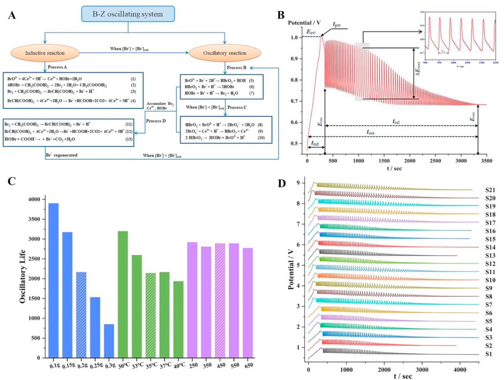

<!-- 方針: ほぼ全訳＋必要に応じた補足。原文構成に沿って訳出。「> 補足:」は訳者注。 -->

## 書誌情報

- 原題: Quality control of Hugan capsule based on four-wavelength fusion profiling and electrochemical fingerprint combined with antioxidant activity and chemometric analysis
- 著者: Yantong Chen a, Lili Lan a, Wanyang Sun b, Hong Zhang c, Guoxiang Sun a
  - a 瀋陽薬科大学 薬学院（中国・遼寧省瀋陽）
  - b 暨南大学 薬学院／広東省中医薬・疾病感受性工程研究センター（中国・広東省広州）
  - c 瀋陽薬科大学 生命科学・生物製薬学院（中国・遼寧省瀋陽）
- 掲載: *Analytica Chimica Acta* 1251 (2023) 341015. https://doi.org/10.1016/j.aca.2023.341015
- インパクトファクター: **6.4**（*Analytica Chimica Acta*, JCR 2024 / Clarivate）
- 受理経過: 受領 2023-01-07 / 改訂 2023-02-17 / 採録 2023-02-24 / オンライン公開 2023-02-27（© 2023 Elsevier B.V. All rights reserved.）

> 補足: HGCs = Hugan capsule（本文では「Hu Gan capsules」、日本語では護肝顆粒／護肝片系の中成薬に相当）。DSD = デオキシシザンドリン(Deoxyschizandrin)、SSD = シザンドリン(Schisandrin)、SSB = シザンドリンB(Schisandrin B)。FWFP = four-wavelength fusion profiling（四波長融合指紋)。ECFP = electrochemical fingerprint（電気化学指紋）。SQFM = systematically quantified fingerprint method（系統的定量指紋評価法）。B-Z = Belousov-Zhabotinsky振動反応。ABTS = 2,2′-アジノビス(3-エチルベンゾチアゾリン-6-スルホン酸)。AEAC = ビタミンC換算抗酸化能。BCA = 二変量相関解析(bivariate correlation analysis)。RFP = 基準指紋(reference fingerprint)。SFP = 試料指紋(sample fingerprint)。PLS = 部分最小二乗法。

## 要旨（Abstract）

生薬製剤(HPs)の品質規格体系を改善することは、中医薬(TCM)の発展にとって困難な課題である。現在、HPsの安全性・有効性・品質一貫性を高めるための包括的・科学的・効果的な評価法を確立することが急務となっている。本研究ではHugan capsule(HGCs)を例に用いた。まず、4社の21バッチのHGCsについて3種の品質マーカー(Q-marker)をHPLCで定量し、各試料の含量に大きな差があることを見出した。さらに、四波長融合指紋(FWFP)を確立し、系統的定量指紋評価法(SQFM)で評価した。主成分分析(PCA)によりFWFPの予備的解析を行い、化学組成・含量の変動のばらつきを識別した。次に、B-Z振動系を通じて9つの特性パラメータを記録し、電気化学指紋(ECFP)を構築してFWFPと統合評価し、SQFM結果の等重み付けにより試料品質を包括的に評価した。21バッチの試料は4群・6等級に分けられ、指標成分および電気化学活性物質の含量に有意な差があることが示された。最後に、ビタミンCを陽性対照として、2,2′-アジノビス(3-エチルベンゾチアゾリン-6-スルホン酸)(ABTS)ラジカル消去試験を用いて試料の抗酸化活性を検討した。部分最小二乗法(PLS)と二変量相関解析(BCA)を用いて、FWFP-ABTSおよびFWFP-ECFPの指紋-薬効関係を解析した。その結果、電気化学とABTS試験の間で類似した抗酸化能があること、また、HGCsの40本のHPLC指紋ピークのうち31本に抗酸化活性があることが判明した。両手法は互いに支持し合い、HGCs中の抗酸化成分を効果的かつ協働的に反映した。本研究で確立したFWFPとECFPはHGCsの品質検出を実現でき、HPsの品質規格の改善およびTCMの品質規格法研究に新たな方向性を提供する。

## 1. 序論（Introduction）

社会・技術の発展に伴い、様々な疾病の予防・治療のために生薬製剤(HPs)を用いる動きが世界的に高まっている。HPsは多成分・多標的・多機能という特徴を持ち、中医薬(TCM)の継承・革新にとって重要な担い手である。しかし、TCMおよびHPsには、成分が複雑である、作用機序が不明確である、品質管理が難しいといった短所もある。したがって、現代的な検出法と革新的な解析法を組み合わせてTCMおよびその複方製剤の現代的研究を行い、品質を制御し、品質規格体系を改善することは困難だが避けられない趨勢である[1,2]。

近年、TCMの主要な分析法にはHPLC[3,4]、GC[5,6]、近赤外分光[7]、ナノ技術[8]などがある。中でもTCM指紋は現代分析技術と組み合わせることでTCM・HPsの解析に重要な役割を果たしている。その「全体性」と「あいまい性」という顕著な特徴はTCMの基礎理論と合致しており、国内外で認められたTCM品質管理の有効な手法である[9,10]。HPLC指紋はTCMの全成分の全体像を提供でき[11]、各試料間の定性的・定量的な類似性を示すことができるため、TCM・HPs中の有効成分の含量測定および医薬品の品質一貫性評価における優先的な選択肢となっている[12]。しかしながら、異なる化合物は条件・波長によって紫外吸収特性が異なり、単一波長のHPLC指紋では試料の化学情報を一面的にしか特徴づけられない[13,14]。そこで、異なる波長下の試料情報を融合して多波長指紋を形成することで、試料についてより包括的・客観的な理解が得られる。本研究では、各波長で最大信号応答を示すピークを新たなクロマトグラムに統合する四波長融合指紋(FWFP)を確立し、HP情報の抽出・統合に用いた[15,16]。化学指紋の定性的類似性と定量的類似性を評価するために、系統的定量指紋評価法(SQFM)を用いた[17]。

HPLC指紋は医薬分析分野で広く用いられているものの、試料前処理が複雑、分析技術の操作工程が煩雑、実験コストが高い、検出時間が長いなどの限界がある[18]。そこで、TCM・HPsの全体的な化学物質について定性的・定量的情報を包括的に取得するため、電気化学指紋法(ECFP)が迅速・簡便・低コストな新たな指紋技術として登場した[19]。ECFPは試料前処理が簡単、実験操作が便利、低価格という利点を持ち、TCM・HPs中の電気化学活性成分全体を特徴づけることができる[20,21]。その結果はHPLCの評価結果を補完するものとして組み合わせ、TCMの全体的な品質を議論するために用いられ、TCMおよびその製剤の品質管理・評価に優れた分析法を提供する。

HGCsは『中国薬典』2020年版に収載されており[22]、柴胡(Bupleurum Radix, BR)、茵蔯蒿(Artemisiae Scopariae Herba, ASH)、五味子(Fructus Schisandrae, FS)、板藍根(Isatidis Radix, IR)、豬膽粉(Suis Fellis Pulvis, SFP)、緑豆(Mung Bean, MB)の6種の生薬から作られる。疏肝理気・健脾消食・トランスアミナーゼ低減の効能を持ち、臨床では慢性活動性肝炎・早期肝硬変の治療にも用いられる。『中国薬典』2020年版に従い、本研究ではデオキシシザンドリン(DSD)・シザンドリン(SSD)・シザンドリンB(SSB)をHGCsの定量分析における3種の品質マーカー(Q-marker)とした。調査によれば、HGCsの品質一貫性に関する国内外の報告は少なく、HGCs成分の定性的・定量的情報を迅速かつ包括的に解析・管理できる手法の開発は喫緊の課題となっている。

本論文では、HGCsのFWFPを確立し、ECFPと組み合わせて21バッチ試料の全体的な品質一貫性を評価した。主成分分析(PCA)と階層クラスター分析(HCA)を用いて、HPLCとECFPが試料間の差異を識別する能力を検証した。PLSモデルを用いてABTS試験結果を解析し、FWFPと抗酸化活性の関係を検討した。同時に、FWFPを橋渡しとして、二変量相関解析(BCA)をECFPと抗酸化能の関係、すなわち試料の化学組成と生物活性の関係の解析に適用した。結論として、本研究はHGCsの品質一貫性を科学的・客観的・包括的に評価し、TCM・HPsの包括的な品質一貫性評価に新規かつ実行可能な方向性を提供するものである。

## 2. 材料と方法（Materials and methods）

### 2.1 試薬・化学物質

21バッチのHGCs(すべて濃縮カプセル)は4社の異なる製造元から入手し(S1–S6は製造元A、S7–S11は製造元B、S12–S16は製造元C、S17–S21は製造元D)、すべて薬局から購入した。SSDとSSBの標準品は中国食品薬品検定研究院(北京)から、DSDは上海融和医薬科技有限公司(上海)から購入した。2,2′-アジノビス(3-エチルベンゾチアゾリン-6-スルホン酸)(ABTS)とビタミンC(Vc, 99.0%)はそれぞれ上海麦克林生化科技有限公司(上海)およびSolarbio Biotechnology社から購入した。

アセトニトリル・メタノール(HPLCグレード)・濃硫酸(H2SO4, 98%)は裕王化学試薬有限公司(山東)から、無水エタノールは天津富宇精細化工有限公司から、リン酸(HPLCグレード)は科密欧化学試薬有限公司(天津)から、1-ヘプタンスルホン酸ナトリウムは中美化学工場(山東)から入手した。硫酸セリウムアンモニウムは天津博迪化学有限公司(天津)、臭素酸カリウムは天津科密欧化学試薬有限公司(天津)、マロン酸は天津大茂化学試薬工場(天津)から購入した。実験全体を通して脱イオン水を使用した。その他の試薬・化学物質はすべて分析用グレードであった。

### 2.2 装置と分析条件

#### 2.2.1 HPLC分析

分析はAgilent 1100 HPLCシリーズ(Agilent Technologies, Santa Clara, CA, USA)を用いて実施した。オンライン脱気装置、四元低圧混合ポンプ、オートサンプラー、DAD検出器を備え、化合物のクロマトグラフィー分析に用いた。データの収集・解析はAgilent OpenLAB CDS Chemstation(Edition C.01.07)で制御した。分離はCOSMOSIL Packed 5C18-MS-IIカラム(4.6ID×250 mm, 5 μm)、カラム温度35 ℃で行った。移動相はA:0.2%(v/v)リン酸水溶液(5 mmol/L 1-ヘプタンスルホン酸ナトリウム含有)、B:アセトニトリル-メタノール(9:1, v/v)を用い、流速1.0 mL/minとした。グラジエント溶出は次の通り: 7–10% B(0–5 min)、10–50% B(5–10 min)、50–60% B(10–20 min)、60–75% B(20–35 min)、75–85% B(35–40 min)、85–7% B(40–45 min)。注入量は10 μL。DAD検出は203 nm、220 nm、236 nm、250 nmの4波長で行った。

#### 2.2.2 電気化学振動分析

電気化学分析はCHI 660E電気化学ワークステーション(上海辰華儀器有限公司)を用いて実施し、DF-101S恒温加熱磁気撹拌器(上海力辰邦西儀器科技有限公司)を装備した。作用電極にはCHI 115白金電極(上海辰華儀器有限公司)、参照電極にはCHI 150飽和二重塩橋カロメル電極(天津藍標科技発展有限公司)を用いた。試料の電位-時間(E-t)曲線(電極の電位Eの時間t関数)は、CHI 700E電気化学装置(上海)で記録した。

#### 2.2.3 抗酸化実験条件

ABTSストック溶液は、ABTS⋅+ラジカル溶液(7.0 mmol/L)とK2S2O8水溶液(5.0 mmol/L)を1:1の割合で混合し、暗所・室温で12–16時間反応させて調製した。10倍希釈した一連の試料溶液(0, 0.1, 0.3, 0.5, 0.8, 1.2 mL)およびVC(0.05 mg/mL)を、それぞれ2 mLのABTS作業溶液と混合し、無水エタノールで5 mLに希釈した。上記混合液を25 ℃暗所に10分間静置後、734 nmで吸光度を測定し、各試料は3回並行測定した。ラジカル消去率(RS%)は以下の式(1)で算出した。

RS% = [1-(A-Ab)/A0] ×100% (1)

Aは試料(試料・無水エタノール・ABTS⋅+)の吸光度、Abは陰性対照(無水エタノール・ABTS⋅+)の吸光度、A0はABTS溶液をブランク対照とした吸光度である。一連の試料溶液の消去率と濃度をプロットして線形回帰式を作成し、50%阻害濃度(IC50、ABTSラジカルの50%を消去するのに必要な化合物濃度)を式から算出した。陽性対照としてVcをABTS抗酸化機構の結果と比較した。

### 2.3 標準溶液・試料溶液の調製

#### 2.3.1 HPLC試料・標準溶液

試料溶液: 5個のHGCsを細かく均一に粉砕した。0.7 gのHGCsを精密に量り取り、10 mLの無水エタノールで超音波抽出(120 W, 40 kHz)を室温で20分間行った。静置後、試料溶液の重量減少分は無水エタノールで補正した。

混合標準溶液: SSD、DSD、SSBを適量精密に量り取り、メタノールでメスフラスコに溶解して標準溶液を調製し、十分に振とうした後、それぞれ最終濃度60 μg/mLのSSD、16 μg/mLのDSD、40 μg/mLのSSBを希釈により得た。さらに、上記標準溶液を適切な濃度範囲までメタノールで希釈した6段階の濃度水準により検量線を作成した。

なお、すべての試料溶液・標準溶液は0.45 μmナイロンフィルターでろ過し、4 ℃で保存した。

#### 2.3.2 電気化学用試料

0.2 gのHGCsを精密に量り取り、自作のセラミック反応器に入れた。H2SO4(3.0 mol/L)12 mL、CH2(COOH)2(0.4 mol/L)6 mL、硫酸セリウムアンモニウム溶液(0.2 mol/L H2SO4溶液で調製、0.02 mol/L)3 mLを反応器に順次加え、35 ℃で3分間撹拌(450 r/min)し十分に混合した。続いて作用電極と参照電極を反応液に挿入し、KBrO3(0.3 mol/L)3 mLを注入した。35 ℃一定温度、450 r/minの磁気撹拌下で、電位振動が消失するまで試料の電位-時間(E-t)曲線を記録した。上記4種の溶液のうち試料を含まないものをブランクB-Z振動系とした。

### 2.4 データ解析

FWFPおよびECFPの評価は、社内開発ソフトウェア「Digitized Evaluation System for Super-Information Characteristics of TCM Chromatographic Fingerprints 4.0」(ソフトウェア認証番号0407573、中国)により実施した。データ解析はOriginPro 2021およびSIMCA 14.1ソフトウェアを用い、主成分分析(PCA)、階層クラスター分析(HCA)、部分最小二乗法(PLS)を含む。

## 3. 理論（Theory）

### 3.1 SQFMの理論

SQFMは、試料指紋(SFP)と基準指紋(RFP)の定性的・定量的な差異を比較するために用いられる。SFPとRFPのピーク信号をそれぞれ表す2つのベクトル→X=(x1,x2…xi)、→Y=(y1,y2…yi)を考える。→Xと→Yのなす角(θ)の余弦値が定性的類似度(SF)であり、化学指紋の分布における比率的類似度(S′F)は、大きなピークが小さなピークを覆い隠す影響を排除するために用いる。SmはSFとS′Fの平均値(式2)であり、これによりカーブ中のピーク位置・頻度をモニタリングして、SFPとRFPの間の化学成分の数と分布比率の類似度を正確に記述できる。さらに、巨視的定量類似度(Pm、式5)は、→Xの→Yへの射影の平均(投影類似度C、式3)と含量類似度(P、式4、SFPの総ピーク面積のRFPに対する百分率をSFで補正したもの)から算出され、試料全体の化学組成含量を記述し、試料品質を包括的・客観的に評価できる。SmとPmを組み合わせて品質等級を判定する方法をSQFMと呼ぶ。この方法により品質は8等級に分けられ、分類基準は表1に示す通りである。Sm値が0.85以上であれば、試料の化学組成・分布比率が類似していることを、Pm値の範囲が85.0%〜120%であれば、試料間の量・質の差が小さいことを意味する。したがって指紋は、成分が複雑な試料の解析において、化学成分の種類・量をより包括的に反映できるという絶対的な利点を持つ。

> 補足: 原文の式(2)〜(5)（Sm・C・P・Pmの定義式）はOCR抽出テキストでは数式記号(根号・総和記号等)が正しく再現できないため、ここでは日本語での趣旨説明にとどめる。正確な数式表記は原文PDFを参照されたい。

**表. SQFM等級評価基準**

| Sm | ≥0.95 | 0.9 | 0.85 | 0.8 | 0.7 | 0.6 | 0.5 | ＜0.50 |
|---|---|---|---|---|---|---|---|---|
| Pm/% | 95–105 | 90–110 | 85–115 | 80–120 | 70–130 | 60–140 | 50–150 | 0–∞ |
| 等級G | 1 | 2 | 3 | 4 | 5 | 6 | 7 | 8 |

### 3.2 B-Z振動反応の機構

BrO3⁻-H⁺-有機物-Mn⁺という構造はB-Z振動系と呼ばれ、Belousovの振動系を基礎としてZhabotinskyにより提唱された。その振動反応は本質的に酸化還元反応であり、典型的な非線形化学反応系である。Fieldらが提唱したFKNモデルに基づき、B-Z振動反応の過程が説明されてきた[23]。反応機構は誘導過程(A)と振動過程(B、C、D)の2つの主要過程にまとめられる[24]。

本研究において、B-Z振動反応は非平衡閉鎖系であり、反応過程全体はBr⁻濃度の影響を受ける。反応系全体には臨界濃度[Br⁻]critが存在する。誘導過程中に系内の[Br⁻]が[Br⁻]critより高い場合、B-Z振動反応において3つの不可逆過程(B、C、D)(図1A)が生じ得る。逆に[Br⁻]＜[Br⁻]critのとき、過程Cが反応を開始する。Br⁻の再生が誘発され、その過程でDが生じる。3つの過程サイクルが生じることがB-Z振動反応の発生を示す。すなわち[Br⁻]は振動反応における選択スイッチに相当する。要するに、B-Zはマロン酸を除く反応物・中間体の「消費-再生」サイクルの中で生じる振動過程とみなされる。

## 4. 結果と考察（Results and discussion）

### 4.1 HPLC指紋分析

#### 4.1.1 実験条件の最適化

有効時間内に理想的な指紋を構築するため、試料液比(35 mg/mL, 50 mg/mL, 70 mg/mL)、移動相グラジエント溶出プロセス(EP1, EP2, EP3、表S1参照)、抽出時間(20 min, 30 min, 40 min)を検討した。総指紋情報量(TQ)はクロマトグラフィー信号の大きさ・均一化・総情報量の指標であり、指紋全体の情報を代表する。したがってTQを抽出条件の最適化に用いた。TQ値が大きいほど情報量が多く、抽出条件が優れていることを意味する。

TQ = Σ Ri lg(Ai tRi Nr / Ni) (式6)

（Ai: 各ピークの面積、tRi: 保持時間、Ni: 理論段数、Ri: 分離度、Nr: 対照指紋ピークの理論段数）

図2Aに示すように、上記2.3.1で提案した抽出条件・クロマトグラフィー条件が最適条件であった。

> 補足: 図2Aから読み取れる実際のTQ値は、試料液量が0.35 g=129.2、0.5 g=132.7、0.7 g=143.8、グラジエントがEP1=185.2、EP2=166.1、EP3=218.9、抽出時間が20 min=122.3、30 min=120、40 min=119.1であった（本文注記のTable S1は補足資料であり本PDFには含まれないため、この数値は図2Aから読み取ったもの）。いずれも最終的に採用された条件（0.7 g/10 mL、20分抽出、2.2.1に記載のグラジエント）が各検討群の中で最大のTQ値を示しており、本文の「最適条件であった」という記述と整合する。

#### 4.1.2 指紋分析法のバリデーション

2.3で調製した試料溶液S1を用いて、クロマトグラフィー法の精度(precision)、再現性(repeatability)、安定性(stability)、正確性(accuracy)、直線性(linearity)、検出限界(LOD)、定量限界(LOQ)を検討した。方法の精度・再現性・安定性は、各クロマトグラフィーピークの相対保持時間(RRT)・相対ピーク面積(RPA)の相対標準偏差(RSD)を算出して評価した。ピーク形状が良好で分離が優れていたため、SSBピークを参照ピークとして選択した。精度試験はS1を6回連続注入して評価し、RRTおよびRPAのRSD値はそれぞれ0.4%未満、4.84%未満であった。方法の再現性は6検体を並行調製して検証し、RRTおよびRPAはそれぞれ0.65%未満、4.28%未満であった。安定性については、試料溶液を室温(25±2 ℃)で0, 2, 4, 8, 12, 24時間保存した後、各クロマトグラフィーピークのRRTおよびRPAのRSDはそれぞれ0.5%、5.0%を超えなかった。

試料と対応する標準品の保持時間・UV吸収曲線を比較し、3種のマーカーを同定した。ピーク14、ピーク35、ピーク38がそれぞれSSD、DSD、SSBと同定された(図2C)。また、正確性は一般に回収率試験で表され、試料の回収率は標準添加法により決定した。3種Q-markerの平均回収率はそれぞれ96.0%、95.0%、101.9%であり、RSDはそれぞれ2.70%、2.19%、3.07%であった。この結果は本法の正確性が優れていることを示した。同時に、ピーク面積を従属変数(Y軸)、溶液濃度を独立変数(X軸)として、DSD・SSB・SSDの直線性をフィッティングした。3種マーカーのLODおよびLOQは希釈法によりそれぞれ推定した。3種Q-markerの直線性結果、LOD、LOQを表2に示す。結果はピーク面積と成分濃度との間に良好な線形関係があることを示し、相関係数rはすべて0.9999を超えた。目的濃度範囲内で3化合物間の線形関係は許容範囲内であった。要するに、確立したHPLC指紋分析法により3種マーカーの含量を正確・信頼性高く・実用的に定量できた。

**表2. SSD・DSD・SSBの検量線・直線範囲・LOD・LOQ**

| 化合物 | 回帰式 | r | 直線範囲(μg/mL) | LOD(ng) | LOQ(ng) |
|---|---|---|---|---|---|
| SSD | y = 55.335x + 23.334 | 1.0000 | 6.0–180.0 | 60.0 | 200.0 |
| DSD | y = 92.922x + 32.259 | 1.0000 | 1.6–48.0 | 160.0 | 533.3 |
| SSB | y = 58.138x + 12.752 | 1.0000 | 4.0–120.0 | 222.2 | 800.0 |

（y: ピーク面積、x: 濃度[μg/mL]。r はR²の平方根として算出。LOD: 検出限界、LOQ: 定量限界）

#### 4.1.3 3種Q-marker含量の評価

本実験では、DSD・SSB・SSDの3種Q-markerを220 nmで測定し、試料の定量に用いた。21バッチHGCs中の3種指標成分の濃度(μg/mL)は外部標準法により算出した。表S2に示す通り(補足資料。本PDFには含まれず「原文参照」)、同一製造元の異なるバッチ間でも3種Q-markerの含量には有意な差があった。例えば製造元AのS4と製造元BのS8の3種指標成分は平均含量より有意に低く、一方で製造元CのS14と製造元DのS20の3種指標成分の含量は同一製造元の他バッチより明らかに高かった。特筆すべきは、3種指標成分の平均含量・総含量が製造元間で大きく異なっていた点である。SSD・DSDの含量および3種マーカーの総含量は 製造元C＞製造元D＞製造元B＞製造元A の順であり、SSBは 製造元C＞製造元B＞製造元D＞製造元A の順であった。直感的に、製造元Cの試料は指標成分含量が高く、製造元Aは低いことが見て取れた。

### 4.2 電気化学振動系分析

#### 4.2.1 実験条件の最適化

良好な形状と適切な反応時間を持つ電気化学系を実現するため、振動系における試料量・温度(T)・撹拌速度の影響を検討した。図1B、表S3(補足資料、本PDFには含まれず「原文参照」)、図1から、電気化学指紋の形状・特性パラメータはHGCsの投与量に明らかに影響されることが分かった。HGCs量が増加するにつれて振動応答の抑制が徐々に強まり、振動寿命は短く、誘導時間は長くなった。また、Tも電気化学指紋の形状・特性パラメータに有意な影響を与えたが、撹拌速度には明らかな影響が見られなかった。したがって、試料0.2 gを選択し、35 ℃・450 r/minで実験を行い、HGCsの品質評価に安定したECFPを得た。

#### 4.2.2 ECFP分析法のバリデーション

2.2.2節に従い、最適条件下でS1を6検体並行測定して再現性を評価した。誘導時間(tind)、ピークトップ時間(tpet)、振動寿命(tosl)、振動終了時間(tose)、ピークトップ電位(Epet)、振動開始電位(Eoss)、振動終了電位(Eose)、振動周期(τosc)、最大振幅(ΔEmax)のRSDをそれぞれ算出したところ、0.86%、0.26%、0.34%、0.39%、0.49%、1.52%、1.65%、1.79%、3.61%であった(表S4、補足資料)。総じて、ECFP特性パラメータのRSDは4.0%を超えず、本研究で用いた電気化学振動法は試料測定において優れた再現性を持ち、ECFP解析の信頼できる基盤を提供した。

### 4.3 指紋分析

#### 4.3.1 四波長融合指紋分析

TCMの成分は複雑・多様で化学成分の含量が低く、成分ごとに最大紫外吸収波長が異なる。したがって単一波長でTCM成分の品質を検出することには一定の限界があり、全ての化学情報の指紋を要約することはできない。本研究では、3次元スペクトルクロマトグラフィー(図2B)からHGCsの全紫外域における吸収特性を取得した。203 nm、220 nm、236 nm、250 nmをモニタリング波長として選択し、より多くの成分情報を示した。図2Cは、4波長がそれぞれ異なる吸収シグナルを示すことを示しており、単一波長のUV吸収データのみに依拠して試料の有効成分を包括的に評価することは困難であることを意味する。そこで、HGCs指紋の単一波長の欠点を克服し、試料の必要な類似度・クロマトグラフィーピーク数を実現するため、本研究では2.4節で述べたソフトウェアを用いてFWFPを確立した。融合時間窓は最良のマッチング結果を得るため0.1分とし、より包括的で豊富な試料情報を得るために最大のFWFP指紋を構築した。21バッチHGCsの共通ピーク数は203 nmで39、220 nmで30、236 nmで24、250 nmで24であったのに対し、FWFPでは40であった。単一波長クロマトグラフィーと比較して、新たに形成されたFWFPは迷いピークの影響を大幅に低減し、有効ピークの情報を十分に保持した。

#### 4.3.2 主成分分析

FWFPピークの品質解析能力を検討するため、多変量統計手法として主成分分析(PCA)を選び、多変量データ系のデータ次元を削減することで試料とフィンガープリントピーク間の相関を識別し、対応する研究技術から試料の包括的な関連情報を抽出した[25–27]。

まず、21試料の40共通ピーク面積をOrigin ソフトウェアに取り込んだ。得られた最初の3主成分でデータ分散の82.8%を説明した(PC1=55.9%、PC2=16.9%、PC3=10.0%)。次に、21観測値×40変数(21×40)の行列モデルを作成した。2Dカラースコアプロット(図3A)から分かるように、全試料は4群に分かれた。同一製造元Aに由来するS1–S6は一つのクラスタに集まり(グループI)、PC1と負の相関、PC2と正の相関を示した。S7–S11(製造元B)、S17–S21(製造元D)はPC1・PC2と負の相関を示しそれぞれグループII、IIIに、製造元CはグループIVとなった。この結果は、本解析法が異なる製造元由来の試料を効果的に識別でき、同一製造元由来の試料は品質一貫性がより優れていることを示した。さらに、3Dブルーローディングプロット(図3B)により、各原指紋ピークが合成変量に対して持つ寄与をより直感的に把握でき、試料中の主要変数を特定し、試料間の類似性・差異の解析に役立てられる。共通ピークが原点から遠いほど寄与が大きいことを示した。要するに、PCAモデルにより化学組成の変動と試料間の定性的差異が予備的に識別されたが、これは異なる化合物が試料全体に及ぼす影響を定性的に解析したものであり、異なる製造元のバッチにおける様々な成分に起因する潜在的な差異や試料全体の品質一貫性については、依然として指紋法によりさらに包括的・科学的に評価・管理する必要がある。

#### 4.3.3 SQFMによるFWFPの評価

21試料の定性的・定量的類似性解析のため、図2Dに示すように21バッチHGCsのFWFPを評価ソフトウェアに取り込み、融合クロマトグラムを平均化して全試料のRFPを生成し、SQFMにより試料の品質を評価した。類似度結果に基づき等級を分けたところ、表1に示す通り、製造元Aの6バッチのうち最良は等級2、最低は等級6であった。製造元Bの5バッチのうち3バッチは等級1、製造元Cの5バッチはそれぞれ等級5, 5, 7, 6, 6、製造元Dの5バッチは等級1〜3であった。以上の結果は、製造元B・Dの試料全体の品質は良好であるのに対し、製造元Cは他の製造元の試料と異なり品質が劣ることを示した。同時に、21バッチHGCsのSFWFP値は0.885〜0.989の範囲にあり、各バッチ試料における化学指紋の量・含量の分布が均一であることを示した。しかし、PFWFPの値は54.6%〜145.5%の間にあり、試料間で化学成分の含量に大きなばらつきがあることを示しており、全試料の品質評価は主にPFWFPに依存した。これらの結果はいずれも、4つの異なる製造元による21バッチの試料間で品質水準に差異があり、試料間の主要な化学成分・含量にも差異があることを示した。したがって、単一または少数成分の測定では試料全体の品質を代表できない。試料品質をより包括的・科学的に解析するため、21バッチ試料全体の品質を管理するには指紋分析を用いる必要があった。また、図3Cの3D散布図には試料間の階層的分布・クラスタリング情報が明瞭に示されている。これらの試料の集積はPCA解析の結果と非常によく一致しており、S1–S6、S7–S11、S12–S15、S16–S21がそれぞれ優れたクラスタリングを示した。要するに、HPLC指紋とSQFMを組み合わせることでHGCsの品質一貫性を定性的・定量的に評価でき、HGCsの一般的な品質管理に科学的・包括的・信頼性の高い方法を提供した。

**表1a. 単一波長指紋(203/220/236/250 nm)のSQFM評価結果**

| No. | 203nm Sm | 203nm Pm(%) | 203nm G | 220nm Sm | 220nm Pm(%) | 220nm G | 236nm Sm | 236nm Pm(%) | 236nm G | 250nm Sm | 250nm Pm(%) | 250nm G |
|---|---|---|---|---|---|---|---|---|---|---|---|---|
| S1 | 0.926 | 82.3 | 4 | 0.942 | 79.5 | 5 | 0.964 | 80 | 4 | 0.962 | 79.8 | 5 |
| S2 | 0.954 | 94.5 | 2 | 0.936 | 89.5 | 3 | 0.952 | 87.7 | 3 | 0.97 | 85.8 | 3 |
| S3 | 0.974 | 87.1 | 3 | 0.97 | 83 | 4 | 0.978 | 83 | 4 | 0.982 | 82.2 | 4 |
| S4 | 0.885 | 65.1 | 6 | 0.949 | 54.9 | 7 | 0.979 | 54.6 | 7 | 0.895 | 57.3 | 7 |
| S5 | 0.976 | 85 | 3 | 0.983 | 80.7 | 4 | 0.987 | 80 | 4 | 0.989 | 79.7 | 5 |
| S6 | 0.976 | 87.4 | 3 | 0.981 | 82.8 | 4 | 0.986 | 81.9 | 4 | 0.988 | 81.8 | 4 |
| S7 | 0.975 | 97.6 | 1 | 0.975 | 98.2 | 1 | 0.977 | 99.2 | 1 | 0.976 | 100.7 | 1 |
| S8 | 0.986 | 81.7 | 4 | 0.98 | 79.8 | 5 | 0.987 | 80.7 | 4 | 0.986 | 81.8 | 4 |
| S9 | 0.973 | 97.7 | 1 | 0.978 | 98 | 1 | 0.975 | 98.7 | 1 | 0.979 | 99.8 | 1 |
| S10 | 0.981 | 86.6 | 3 | 0.983 | 85.3 | 3 | 0.981 | 85.6 | 3 | 0.981 | 86 | 3 |
| S11 | 0.976 | 96.1 | 1 | 0.957 | 97.3 | 1 | 0.975 | 97.9 | 1 | 0.974 | 98.9 | 1 |
| S12 | 0.968 | 126 | 5 | 0.977 | 133.4 | 6 | 0.978 | 134.2 | 6 | 0.977 | 130.6 | 6 |
| S13 | 0.968 | 127.8 | 5 | 0.978 | 135.7 | 6 | 0.979 | 136.2 | 6 | 0.978 | 132.6 | 6 |
| S14 | 0.963 | 137.9 | 6 | 0.982 | 145 | 7 | 0.982 | 145.4 | 7 | 0.983 | 145.5 | 7 |
| S15 | 0.969 | 132.5 | 6 | 0.977 | 139.2 | 6 | 0.978 | 139 | 6 | 0.978 | 135.2 | 6 |
| S16 | 0.97 | 130.6 | 6 | 0.978 | 137.5 | 6 | 0.979 | 137.5 | 6 | 0.979 | 133.9 | 6 |
| S17 | 0.976 | 92.6 | 2 | 0.98 | 91.1 | 2 | 0.979 | 91.2 | 2 | 0.983 | 93.3 | 2 |
| S18 | 0.974 | 89.6 | 3 | 0.979 | 88.2 | 3 | 0.977 | 88.5 | 3 | 0.984 | 90.3 | 2 |
| S19 | 0.974 | 88.7 | 3 | 0.979 | 87.2 | 3 | 0.978 | 87.5 | 3 | 0.983 | 89.5 | 3 |
| S20 | 0.98 | 101.6 | 1 | 0.981 | 102.6 | 1 | 0.979 | 102.8 | 1 | 0.986 | 104.4 | 1 |
| S21 | 0.975 | 93 | 2 | 0.98 | 90.8 | 2 | 0.979 | 90.8 | 2 | 0.982 | 92.1 | 2 |
| Mean | 0.967 | 99.11 | 3 | 0.973 | 99.03 | 4 | 0.978 | 99.16 | 4 | 0.976 | 99.11 | 4 |
| Min | 0.885 | 65.1 | 1 | 0.936 | 54.9 | 1 | 0.952 | 54.6 | 1 | 0.895 | 57.3 | 1 |
| Max | 0.986 | 137.9 | 6 | 0.983 | 145 | 7 | 0.987 | 145.4 | 7 | 0.989 | 145.5 | 7 |
| RSD% | 2.31 | 20.00 | 53.10 | 1.44 | 24.71 | 53.55 | 0.77 | 24.83 | 53.94 | 2.00 | 23.44 | 55.06 |

**表1b. FWFP・ECFP・両者統合評価のSQFM結果とABTS抗酸化活性(IC50)**

| No. | FWFP Sm | FWFP Pm(%) | FWFP G | ECFP Sm | ECFP Pm(%) | ECFP G | 統合 Sm | 統合 Pm(%) | 統合 G | ABTS IC50(mg/mL) |
|---|---|---|---|---|---|---|---|---|---|---|
| S1 | 0.942 | 81.4 | 4 | 0.976 | 94.6 | 2 | 0.959 | 88 | 3 | 1.2175 |
| S2 | 0.958 | 92.6 | 2 | 0.975 | 91.2 | 2 | 0.967 | 91.9 | 2 | 1.4779 |
| S3 | 0.976 | 85.7 | 3 | 0.989 | 101.7 | 1 | 0.983 | 93.7 | 2 | 1.7538 |
| S4 | 0.895 | 62.7 | 6 | 0.991 | 102.4 | 1 | 0.943 | 82.55 | 4 | 1.0713 |
| S5 | 0.978 | 84.1 | 4 | 0.981 | 97.7 | 1 | 0.978 | 90.9 | 2 | 1.1823 |
| S6 | 0.979 | 86.5 | 3 | 0.989 | 90.2 | 2 | 0.984 | 88.35 | 3 | 1.3649 |
| S7 | 0.976 | 98.4 | 1 | 0.994 | 101.6 | 1 | 0.985 | 100 | 1 | 1.0010 |
| S8 | 0.987 | 81.5 | 4 | 0.987 | 101.7 | 1 | 0.987 | 91.6 | 2 | 1.0868 |
| S9 | 0.977 | 98.3 | 1 | 0.985 | 103.5 | 1 | 0.981 | 100.9 | 1 | 1.3778 |
| S10 | 0.983 | 86.7 | 3 | 0.988 | 106.5 | 2 | 0.986 | 96.6 | 1 | 1.3778 |
| S11 | 0.976 | 96.9 | 1 | 0.988 | 102.9 | 1 | 0.982 | 99.9 | 1 | 1.5699 |
| S12 | 0.969 | 127 | 5 | 0.987 | 94.6 | 2 | 0.978 | 110.8 | 3 | 0.8626 |
| S13 | 0.968 | 129.3 | 5 | 0.987 | 94.2 | 2 | 0.978 | 111.8 | 3 | 0.9232 |
| S14 | 0.967 | 142 | 7 | 0.989 | 83.7 | 4 | 0.978 | 112.9 | 3 | 0.8556 |
| S15 | 0.969 | 133.3 | 6 | 0.985 | 92.5 | 2 | 0.977 | 112.9 | 3 | 0.8284 |
| S16 | 0.97 | 131.8 | 6 | 0.989 | 86.3 | 3 | 0.980 | 109.1 | 2 | 0.8839 |
| S17 | 0.979 | 92.8 | 2 | 0.992 | 110.3 | 3 | 0.986 | 101.6 | 1 | 1.1521 |
| S18 | 0.977 | 89.7 | 3 | 0.988 | 110.7 | 3 | 0.983 | 100.2 | 1 | 1.2248 |
| S19 | 0.978 | 88.8 | 3 | 0.986 | 110.7 | 3 | 0.982 | 99.75 | 1 | 1.2408 |
| S20 | 0.982 | 101.9 | 1 | 0.977 | 105.2 | 2 | 0.978 | 103.6 | 1 | 1.0935 |
| S21 | 0.978 | 92.7 | 2 | 0.977 | 100.8 | 1 | 0.978 | 96.75 | 1 | 1.2107 |
| Mean | 0.970 | 99.24 | 3 | 0.986 | 99.19 | 2 | 0.978 | 99.22 | 2 | 1.179 |
| Min | 0.895 | 62.7 | 1 | 0.975 | 83.7 | 1 | 0.943 | 82.55 | 1 | 0.828 |
| Max | 0.987 | 142 | 7 | 0.994 | 110.7 | 4 | 0.987 | 112.9 | 4 | 1.7538 |
| RSD% | 2.03 | 21.09 | 54.23 | 0.55 | 7.83 | 46.68 | 1.04 | 8.83 | 49.9 | 21.07 |

> 補足: 原文Table 1は上記1a・1bを1枚の表として掲載しているが、列数が23と非常に多いため、本訳では読みやすさのために2表に分割した（数値・行の対応関係はすべて保持）。「G」は表3.1のSQFM等級評価基準に基づく等級。

#### 4.3.4 ECFPの解析・評価

21バッチECFPのRFPは、2.4節で述べたソフトウェアに\*.csvファイルを入力して平均法により生成した。各試料のSECおよびPECはSQFMを用いて算出し、基準に従って試料に等級を付与した。toslはECFPによる試料品質一貫性評価の主な根拠として用いた。図1Cは最適条件下で電気化学振動系から得た全試料のE-t曲線を示し、表3は9つの主要な特性パラメータを記録・要約したものである。これらのE-t曲線・特性パラメータは、試料中の活性成分がB-Z振動系に及ぼす影響を反映し、試料の電気化学活性成分の分布・含量の総括を提供する。表1・図1Cから、21試料の誘導曲線の形状は類似した変動を示し、SEC値はすべて0.975以上であり、異なるバッチのHGCs中の化学的または電気化学活性成分の種類が高度に類似しており、数のわずかな差も小さいことが示唆された。しかし、振動反応には程度の異なる差が存在し、化学含量の違いを反映していた。PECの値が大きいほどtoslは長く、B-Z振動系に対する抑制効果は小さく、試料中の化学含量が低いことを示す。特に、S17–S19(製造元D)の振動周期は有意に長く、これらの試料中の活性成分含量が少ないことを意味した。対照的に、製造元Aは4製造元の中で化学活性成分含量が高かった。toslに基づく全試料の総化合物量の順序は次の通りであった: S1＞S2＞S5＞S6＞S14＞S16＞S15＞S3＞S12＞S13＞S4＞S21＞S20＞S9＞S11＞S8＞S10＞S17＞S19＞S7＞S18。

**表3. 21バッチHGCsの全体活性成分の特性パラメータ**

| No. | tind/s | tpet/s | tosl/s | tose/s | Epet/V | Eoss/V | Eose/V | τosc/s | ΔEmax/V |
|---|---|---|---|---|---|---|---|---|---|
| S1 | 396.8 | 318.3 | 2908.2 | 3305 | 0.9808 | 0.7423 | 0.6760 | 43 | 0.2277 |
| S2 | 375.8 | 298.9 | 2796.2 | 3172 | 1.002 | 0.7600 | 0.7031 | 43 | 0.2184 |
| S3 | 390.5 | 307.7 | 3189.5 | 3580 | 1.003 | 0.7561 | 0.6887 | 47 | 0.2339 |
| S4 | 322.6 | 233.2 | 3214.4 | 3537 | 1.017 | 0.7772 | 0.6936 | 47 | 0.2262 |
| S5 | 350.7 | 272.9 | 2945.3 | 3296 | 1.009 | 0.7623 | 0.6833 | 45 | 0.2184 |
| S6 | 352.5 | 274.2 | 2998.2 | 3351 | 1.002 | 0.7781 | 0.6996 | 45 | 0.2137 |
| S7 | 219.8 | 136.3 | 4309.2 | 4331 | 1.013 | 0.7998 | 0.6940 | 59 | 0.2213 |
| S8 | 245.2 | 165.3 | 4133.8 | 4379 | 1.016 | 0.8099 | 0.6900 | 56 | 0.2357 |
| S9 | 211.3 | 126.8 | 4096.7 | 4308 | 1.015 | 0.8049 | 0.6899 | 58 | 0.2365 |
| S10 | 261.6 | 177.8 | 4228.4 | 4490 | 1.014 | 0.8003 | 0.6896 | 58 | 0.2374 |
| S11 | 217.4 | 129.9 | 4101.6 | 4319 | 1.023 | 0.8110 | 0.6993 | 56 | 0.2321 |
| S12 | 304.3 | 223.6 | 3192.7 | 3497 | 1.03 | 0.8016 | 0.6947 | 47 | 0.2145 |
| S13 | 301.1 | 218.9 | 3199.9 | 3501 | 1.031 | 0.7933 | 0.6966 | 45 | 0.2190 |
| S14 | 272.3 | 189.4 | 3023.7 | 3296 | 1.018 | 0.7953 | 0.6873 | 44 | 0.2066 |
| S15 | 314.3 | 229.3 | 3127.7 | 3442 | 1.028 | 0.7977 | 0.7024 | 46 | 0.2106 |
| S16 | 319.4 | 242.5 | 3034.6 | 3354 | 1.028 | 0.8108 | 0.7008 | 44 | 0.2200 |
| S17 | 261.6 | 167.2 | 4268.4 | 4530 | 1.031 | 0.8082 | 0.7013 | 54 | 0.2341 |
| S18 | 278.3 | 185.9 | 4325.7 | 4604 | 1.029 | 0.8082 | 0.7048 | 57 | 0.2341 |
| S19 | 279.5 | 187.7 | 4300.5 | 4580 | 1.034 | 0.8140 | 0.7076 | 56 | 0.2356 |
| S20 | 181.0 | 96.1 | 3974.0 | 4155 | 1.033 | 0.8221 | 0.6734 | 60 | 0.2376 |
| S21 | 237.9 | 148.4 | 3886.1 | 4124 | 1.023 | 0.8186 | 0.6699 | 60 | 0.2305 |
| RSD% | 19.31 | 28.33 | 2.78 | 13.39 | 1.32 | 2.83 | 1.50 | 12.8 | 4.35 |

TCMの品質評価に対する補完的解析法として、TCM指紋の包括的評価法の結果は単一検出法の限界をさらに明らかにした。別の視点・方向から見ると、この方法はHGCsの品質一貫性評価に役立つものであった。同時に、本手法は他のTCMの品質一貫性評価にも応用でき、TCMの品質における有意な差異を定性的・定量的側面の両方から効果的・信頼性高く検出でき、結果がより科学的・効果的・信頼できるものとなることが示唆された。

同時に、階層クラスター分析(HCA)を用いて電気化学の実験結果を検討した。PECをSIMCAソフトウェアに取り込んだ。この方法により試料はおおむね3つのカテゴリーに分けられ(図3D)、そのうちS12–S16は1カテゴリー、S17-21は1カテゴリーにグループ化された。これら2カテゴリーのグループ分け結果はそれぞれ製造元C・Dと一致しており、一方で製造元A・Bの11バッチは1つのカテゴリーにグループ化され、両製造元の試料中の内在的な化学活性物質の含量が類似していることを示した。さらに特筆すべきは、HPLCとEC分析法の結果が完全には一致しなかった点である。これは、HPLCが主に特定の溶媒に溶解し設定した溶出プログラムを通じて特定の波長で検出されるUV吸収特性を持つ試料成分を検出するのに対し、電気化学はB-Z振動系における酸化還元反応に関与する試料中の全活性成分の能力をより反映するためと考えられる。

#### 4.3.5 FWFPとECFPの統合評価

表1に示す通り、試料等級の評価はFWFPとECFPで完全には一致しなかったが、これは検出原理のわずかな相違に起因すると考えられる。例えばS4は、PFWFP値が基準で70.0%未満であったためFWFP評価では等級6と判定されたが、ECFPではSEC=0.991、PEC=102.4%で等級1であった。そこで本研究では、2種の指紋の等重み付け統合評価法を採用し、試料の品質一貫性を包括的・客観的に反映した。SFW-ECおよびPFW-ECの結果は式(7)・(8)に従って算出した。最終等級はパラメータの最も悪い値で決定し、統合評価基準はSQFMと同様に統一した。

SFW-EC = 1/2(SFWFP + SEC) (式7)

PFW-EC = 1/2(PFWFP + PEC) (式8)

表1が示す通り、SFW-EC値はいずれも0.978以上であり、PFW-EC値の範囲は82.55%〜112.9%であり、全試料の化学組成の割合・量が類似していることを意味した。これに基づき、21バッチ試料は4等級に分けられ、S2、S3、S5、S8、S16は等級2、S1、S6、S12–S15は等級3、S4は等級4、その他は等級1であり、全試料が許容範囲内にあり品質一貫性が優れていることが示された。

### 4.4 抗酸化活性分析

#### 4.4.1 ABTS法によるFWFPと薬効の関係

本研究ではABTS⋅+を用いてHGCsのin vitro抗酸化活性を測定し、21バッチHGCsのクリアランス率結果として半数阻害濃度(IC50)を表した。IC50値が低いほど試料の抗酸化性が優れていることを示す。表1に示す通り、21バッチ試料のIC50値は0.8284 mg/mLから1.7538 mg/mLの範囲であり、すべての試料が相応の抗酸化活性を示した。その中で、S15(0.8284 mg/mL)が最も強い抗酸化効果を示し、S3(1.7538 mg/mL)が最も弱かった。同時に、L-アスコルビン酸換算抗酸化能(AEAC)値を陽性対照としてABTS⋅+により測定した抗酸化活性と比較したところ、その検量線はy=150.31x+0.012、r=0.9990であった。21バッチ試料のVC当量範囲は1.8512 μg/mLから3.9191 μg/mLであった(表S5、補足資料)。S12–S16(製造元C)はABTSに対する消去能が弱く、両者とも(全試料が)Vcより弱いことが分かった。

FWFPと抗酸化実験の関係を検討するため、21試料の40共通ピーク面積を独立変数(X)、IC50値を従属変数(Y)としてPLSモデルを構築した。全試料はランダムに較正群(モデリング用15試料)と予測群(検証用6試料: S3, S6, S7, S11, S12, S15, S19)に分割した。構築した較正モデル(図4A)は説明分散(R2Y)0.996、予測力(Q2)0.672を示し、本モデルが高い適合度と正確な予測能力を持つことを十分に確認できた。二乗平均平方根推定誤差(RMSEE)は0.0412、交差検証プログラム(RMSECV)値は0.1140であり、モデルが頑健で受容可能であることを示した。予測の二乗平均平方根誤差(RMSEP)値は0.1171であり、モデルが理想的な予測能力を持つ優れた予測モデルであることが証明された(図4B)。さらに、全試料の実験値と予測IC50値の間に目立った異常は見られなかった(表S4)。要するに、FWFPはPLSモデルを通じてHGCsの異なるバッチの抗酸化能を予測するために使用できる。

#### 4.4.2 ECFPによるFWFPと薬効の関係

電気化学の本質は酸化還元反応であり、振動指紋は異なる周波数・振幅の連続的な変動を示すため、電気化学解析から得られる抗酸化活性とクロマトグラフィー指紋の薬効関係を直感的に示すことは困難であった。ここでは、ABTS抗酸化実験と組み合わせて電気化学とFWFPの関係を検証した。FWFPの40ピークの面積と21バッチHGCsのPEC値との間のピアソン相関係数(r)を算出することで、ピーク面積とPEC値の相関(peaks-PEC)を検討した。電気化学のPEC値は試料の酸化還元能を実際に反映しており、試料中の活性成分が多いほどPEC値は小さく、試料の抗酸化能は強く、すなわちB-Z振動系への抑制がより大きいことを意味し、peaks-PECは負の相関を示す。図4Cに示す通り、40ピークのうち31ピークのrp値がゼロ未満であり(全ピーク数の約77.5%)、これらのピークがB-Z振動反応の抑制において重要な役割を果たすことが示された。

同時に、FWFPピーク値とIC50値の相関(peaks-IC50)を確立し、FWFPピーク値に対して二変量相関分析(BCA)を行い、結果はr値で表した。原理上、peaks-IC50は負の相関を示すべきであり、すなわちIC50値が小さいほど抗酸化能が優れている。図4Dは、31ピークがIC50とも負の相関を示すことをよく示しており、これは全ピーク数の77.5%を占めた(r＜0)。さらに、2つの薬効関係で共通の相関を示す38ピークのうち30ピークが負の相関を示し、ピーク14(SSD)、ピーク34(DSD)、ピーク37(SSB)はいずれもより優れた抗酸化活性を示した。これは電気化学と抗酸化法の評価結果が類似しており、互いに支持し合い、HGCs中の抗酸化成分を効果的・協働的に反映できることを意味する。しかし、2つの指紋-薬効関係における負の相関を示す指紋ピークの割合は異なっており、これは2つの反応系の違いに起因し、結果にいくらかの偏差をもたらした可能性があると解釈できる。これは、本研究で設計した実験スキームが、2手法の共通ピークが酸化還元反応に果たす寄与を異なる視点から客観的・包括的に示すことができ、HGCsの化学的性質・薬理活性に対する正確・明確な参考を提供できることを裏付けている。

## 5. 結論（Conclusions）

本論文では、21バッチHGCsの四波長最大融合指紋を確立することに成功した。FWFPの統合データを抽出・解析することで、従来の単一波長解析の欠点を補い、試料全体の品質を包括的に解析した。確立したPCAモデルとSQFMを用いて試料の定性的・定量的な差異を識別し、試料の品質一貫性を信頼性高く評価した。次に、複雑な前処理工程を必要としないECFPを電気化学の原理に基づき構築した。HAC(HCA)を用いてHGCs中の関連する電気化学活性物質および対応する化学成分を特徴づけ、解析し、HPsに豊富な視覚的情報を提供した。同時に、ABTS抗酸化能と組み合わせてPLSモデルを構築し、peak-PEC指紋薬効図とpeak-IC50図を作成して電気化学とABTSの抗酸化能を比較し、FWFPピークを媒介としてABTSおよびECFP評価結果への寄与を検討した。結果は、両者が試料の活性成分に対して良好な抗酸化予測能力を持つことを示し、化合物の内在的活性を予測するための新規かつ有望な研究方向を提供した。要するに、本研究で提案した手法は、HGCsの内部全体の化学成分の品質一貫性を定性的・定量的の両側面から評価できる。新規手法の開発は、TCM・HPsの品質と薬効の二元管理のための信頼性高く実用的、包括的かつ効果的な戦略を提供した。TCM・HPsの品質規格の改善および品質規格法の研究に優れた方向性を提供するものである。

## 訳者補足

- 本研究の枠組みは「①複数波長のHPLC指紋を融合してFWFPを作る → ②前処理不要のB-Z振動電気化学指紋(ECFP)を並行して取得する → ③両者をSQFMで等重み統合評価する → ④ABTS抗酸化試験との指紋-薬効相関でどのピークが薬効に寄与するかを絞り込む」という4段構えである。実務的には、HPLCによる個別成分(Q-marker)定量だけでは製造元間・バッチ間の品質差を十分に説明できないという課題に対し、指紋全体(パターン)＋簡便・低コストな電気化学指紋という2系統の情報を組み合わせることで、より頑健な合否判定・等級付けが可能になる点が実務上の示唆として大きい。
- ECFPはHPLCのような複雑な前処理(抽出・分離・検出波長選択)を必要とせず、試料をB-Z振動系に投入して電位-時間曲線を記録するだけで全体の電気化学活性(≒還元性成分の総体)を捉えられる。日常的なロット判定・スクリーニング用途において、HPLCによる確定分析の前段のふるい分けとして活用できる可能性がある。ただし本研究でも述べられている通り、HPLCとECFPの検出原理の違いにより等級判定が完全には一致しない場合があるため(例: S4)、両者は補完関係にあり、どちらか一方に置き換えるものではない点に注意が必要である。
- 本研究のQ-marker(DSD・SSD・SSB)はいずれも五味子(Fructus Schisandrae)由来のリグナン類であり、Hugan capsuleの6生薬の中でも五味子由来成分を中心とした品質評価になっている点は留意すべきである。柴胡・茵蔯蒿・板藍根・豬膽粉・緑豆に由来する成分については、FWFPの40共通ピークの一部として間接的に捉えられているに過ぎず、個別の指標成分としては定量されていない。
- 表S1〜S5として言及される補足資料（グラジエント条件の詳細、3種Q-markerのバッチ別含量、ECFP特性パラメータの再現性データ、PLSモデルの実測-予測比較、AEAC換算値）は本文PDFには含まれておらず、原文の補足資料(Supplementary data, https://doi.org/10.1016/j.aca.2023.341015)を参照する必要がある。
- 本研究は中国国家自然科学基金(No. 81573586, 81703696)の助成を受けている。利益相反の申告はなく、著者らは開示すべき競合する金銭的利害関係はないと述べている。
