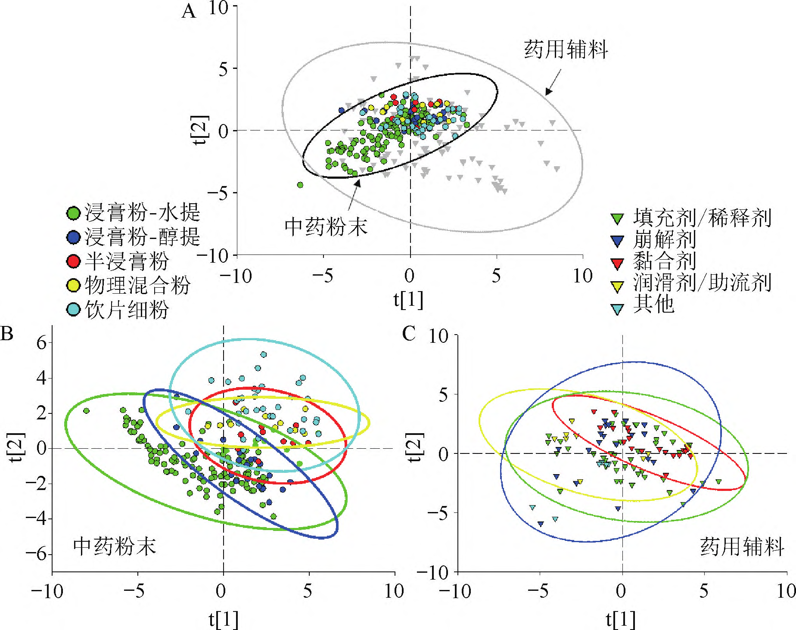
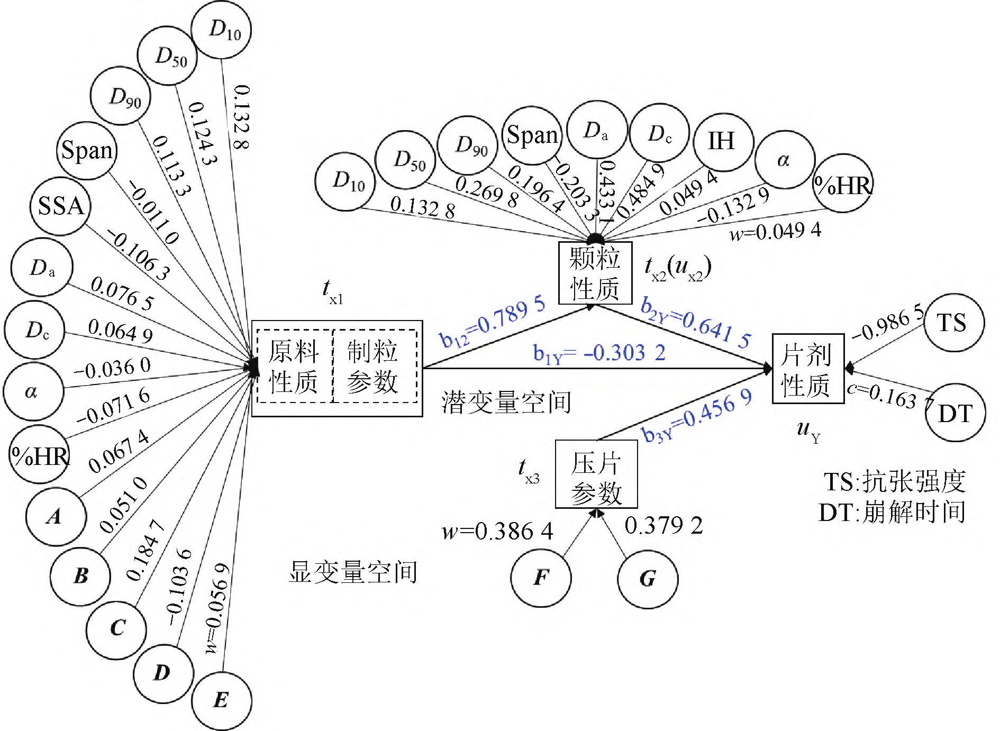
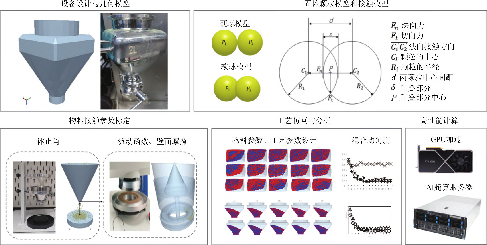
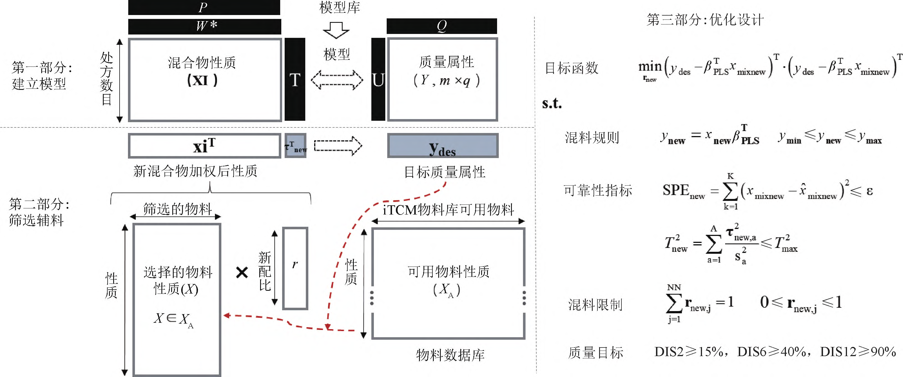
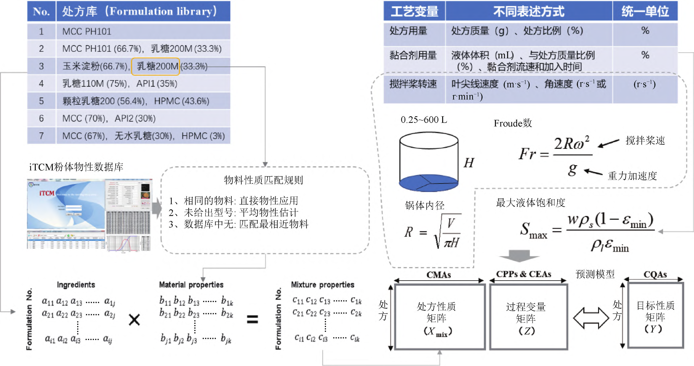
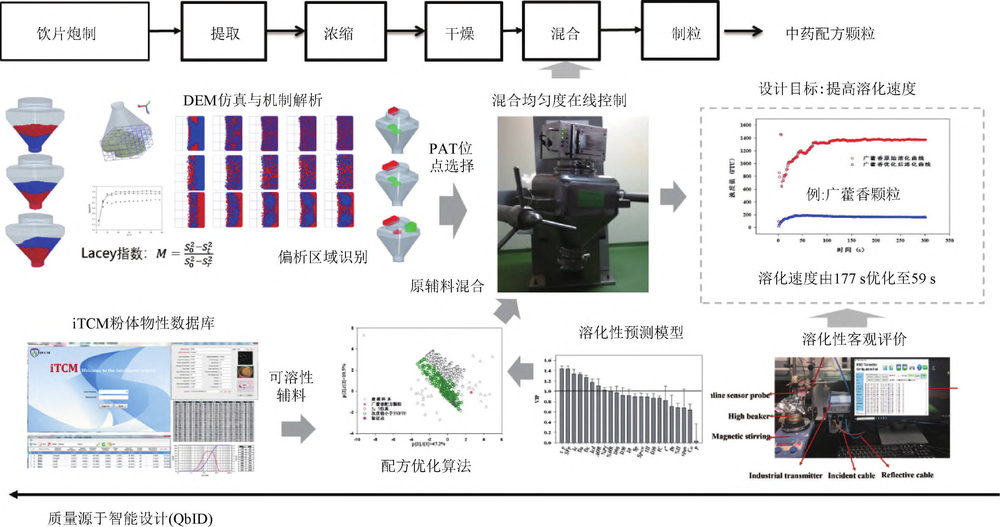

<!-- 方針: ほぼ全訳＋必要に応じた補足。原文（中文・招待総説）構成に沿って訳出。本文の[N]は原文の番号引用に対応し末尾の参考文献にリンクする。図1〜図8は原本PDFの埋め込みラスター画像をPyMuPDF(get_image_rects/xref抽出)で取り出し、Readで内容確認のうえ全訳キャプションで該当箇所に埋め込んだ。「> 補足:」は訳者注。 -->

## 書誌情報

- 原題: 高品质中药制剂"物料-工艺-装备"协同智能设计（Intelligent co-design of material, process, and equipment for manufacturing high-quality traditional Chinese medicine preparations）
- 著者: 徐冰（XU Bing）¹²\*・乔延江（QIAO Yan-jiang）¹²・杜守颖（DU Shou-ying）¹・张志强（ZHANG Zhi-qiang）²³・肖伟（XIAO Wei）⁴（1. 北京中医薬大学 中薬学院／2. 北京市科委 中薬生産過程管理と品質評価 北京市重点実験室／3. 中薬配方顆粒鍵技術 国家地方連合工程研究センター（天津）／4. 中薬製薬過程管理とスマート製造技術 全国重点実験室（江蘇 連雲港））
- 掲載: *中国中药杂志（China Journal of Chinese Materia Medica）*, 2023, Vol. 48, No. 15, 3977–3987 相当. DOI: 10.19540/j.cnki.cjcmm.20230715.301
- 区分: **「中薬製剤スマート設計と先進製造」特集** の招待総説
- 助成: 国家自然科学基金（82074033）／連雲港市重大技術攻関「掲榜掛帥」項目（CGJBGS2101）／中国工程院戦略研究・諮問項目（2022-XY-44）ほか
- インパクトファクター: **該当なし**（中文核心誌でJCR収載外。中薬分野の代表的学術誌）

> 補足: 本稿は、漢方製剤の工業製造に「デジタル/AI設計」を導入する研究を牽引する **北京中医薬大学 徐冰（Xu Bing）チーム** の招待総説である。テーマは、医薬品の品質を「作ってから検査する」のではなく「**設計段階で作り込む**」という QbD（Quality by Design）を、さらに一歩進めて **AI・データ駆動で自動化する QbID（Quality by Intelligent Design）** へ発展させること。日本の読者には、**製剤（錠剤・顆粒・カプセル）の処方・工程・装置を、材料物性データベースと機械学習で一体設計する「デジタルツイン/インシリコ製剤設計」の漢方版**、と考えると位置づけが分かりやすい。専門用語（略語）が多いため、下に整理する。

## 用語の整理（訳者による前置き）

- **QbD（Quality by Design）**＝品質は設計に由来する。医薬品開発の基本原則（ICH Q8）。**QbDD（Quality by Digital Design）**＝デジタル設計版。**QbID（Quality by Intelligent Design）**＝本稿が掲げるスマート設計版。
- **Pharma 4.0**＝製薬版インダストリー4.0（ISPEが2016年提唱）。デジタル・スマート化。
- **OSD（oral solid dosage）**＝経口固形製剤（錠剤・カプセル・顆粒剤）。
- **CMA / CPP / CQA / CEA**＝重要材料属性（critical material attributes）／重要工程パラメータ（critical process parameters）／重要品質属性（critical quality attributes）／**重要装置属性（critical equipment attributes、本稿が新たに提起）**。
- **製剤設計四面体（pharmaceutical design tetrahedron）**＝CMA・CPP・CEA・CQAの4頂点からなる、本稿の中心概念。材料科学の四面体[14] を製剤設計に借用したもの。
- **iTCM**＝著者らが構築した漢方粉体の物性データベース（智慧中薬数据库）。
- **MCS（manufacturing classification system）**＝製造分類システム。工程の複雑さで経口固形製剤の工程ルートを分類。
- **DEM（discrete element method）**＝離散要素法。粉体の粒子挙動をシミュレーションする手法。**CFD**＝計算流体力学、**FEM**＝有限要素法。
- **PLS / PLS-PM / MB-PLS**＝部分最小二乗（回帰）／PLS経路モデリング／多ブロックPLS。多変量の統計モデリング手法。
- **HSWG（high shear wet granulation）**＝高剪断湿式造粒。**配方顆粒**＝単味の漢方エキス顆粒。**浸膏粉**＝生薬エキスの乾燥粉末。**成片性（tabletability）**＝打錠して錠剤になりやすさ。

## 要旨（摘要）

制薬4.0（Pharma 4.0）を背景に、医薬品の品質源于設計（QbD）を支える設計ツールは、スマート設計（intelligent/smart design）の方向へ加速的に反復・進化している。本稿は、従来の漢方（中薬）製剤の研究開発が経験に依存しがちで、設計実験のパラメータ次元が限られ、工程と装置の整合性が低く、工程スケールアップの試行錯誤コストが高いといった限界に対し、「材料-工程-装置」協同スマート設計の解決策を提起する。漢方経口固形製剤（OSD）を例に、設計モデル・設計目標・設計ツール・設計応用の4側面から紹介する。

設計モデルでは、重要材料属性・重要工程パラメータ・重要装置属性・重要品質属性からなる **製剤設計四面体** を提起する。市販薬品の評価を通じて、製品の品質属性分類に基づく高品質漢方製剤の設計目標を提起する。設計ツールでは、iTCM粉体物性データベース・工程分類システム・システムモデリングとシミュレーション・信頼性最適化設計など、漢方製剤スマート設計プラットフォームの主要コンポーネント、および各モジュールが漢方OSDの共通鍵環節の規律性設計知識を高効率に獲得するうえで果たす役割を述べる。最後に、漢方の高剪断湿式造粒工程設計と、漢方配方顆粒の溶化性設計を例に、「材料-工程-装置」協同スマート設計の応用を紹介する。先進的な製剤設計理論・方法の研究は、漢方製剤の研究開発効率・信頼性・製品品質を高め、漢方ハイエンド製剤製品がイノベーションを牽引するのを推進するのに役立つ。

- **キーワード**: 質量源于智能設計（QbID）／製剤設計四面体／物性データベース／製造分類システム／システムモデリングとシミュレーション／信頼性最適化

## 序論——QbD から QbID へ

質量源于設計（quality by design, QbD）は、すべての薬物研究開発設計の基本原則であり、設計過程が薬品品質に決定的な役割を果たすことは業界の共通認識となっている[1-2]。世界的なインダストリー4.0革命を背景に、国際製薬工学協会（ISPE）は2016年に **制薬4.0（Pharma 4.0）**[3] を提起し、製薬領域のデジタル変革とスマート化のアップグレードを促進した。新型コロナウイルス感染症の勃発は、薬品のQbDを支える設計ツールがスマート設計の方向へ加速的に反復・進化することを促した。

2022年、英国CMAC未来製造研究センターは **質量源于数字化設計（quality by digital design, QbDD）**[4] を提起し、デジタルツイン・モデル駆動のデータファクトリー・マイクロファクトリーを用いて経口固形製剤（OSD）のエンドツーエンド工程設計を支援した。同年、DANIEL S らは[5] QbDDに基づくRNAワクチン設計プラットフォームを提起した。大手多国籍製薬企業も相次いでデジタル製剤工程設計ツールを展開しており、たとえばアストラゼネカが構築したデジタル設計加速プラットフォーム（Digital Design Accelerator Platform）[6]、およびイーライリリーのCRAVE工程ビッグデータシステム[7] がある。QbDDはコンピュータ支援設計（CAD）ツールとQbD手法を統合し、高スループットのコンピュータシミュレーション実験を通じて、工程開発の加速や湿式（実験室）実験の試験・検証の指導を実現し、実験負担を軽減できる。

漢方製剤は物質の組成構造と過程の相態の複雑性という特徴をもち、その工程研究開発は経験に依存しがちで[8]、指導となる信頼できる物理・物理化学の基礎データ・基礎知識を欠く。漢方複方製剤の工程設計過程では、設計ツールに「実験計画法（DOE）＋統計解析」[9-10] を用いることが多く、得られるDOEの小サンプル実験データはパラメータ次元・情報量が比較的低く、ある単位操作・ある品目について得た設計知識を外挿しがたい。工程研究開発の過程は定型装置に依存し、実験計画で設備パラメータを考慮することが少なく、工程と装置の整合性が低く、工程スケールアップ過程の試行錯誤コストが高い。

薬品の質量源于設計は、薬品の品質問題をできるだけ設計段階で解決することを目指すが、設計の信頼性を高める核心的な鍵は、**規律性設計知識（regularity design knowledge）の発見と応用** にある。たとえば馮怡ら[11] は漢方製剤エキスパートシステムの構築構想を提起し、専門家の経験知識を総括して製剤処方・工程への推論機能を形成しようとした。加えて、規律性設計知識を獲得する可能な経路には、データ駆動のモデルマイニング、第一原理（first principles）、またはその組み合わせがある。データ駆動型モデルは既存データ情報中の問題解決策とパターンを総括し、知識の帰納を補助できる。ビッグデータと人工知能アルゴリズムの組み合わせ、あるいは第一原理の方式は、創造的な知識を生み出す可能性がある。

現在、経口固形製剤は漢方複方製剤の新薬開発の主体であり、錠剤・カプセル剤・顆粒剤などの現代漢方剤形が漢方OSDの主体である[12]。漢方製剤の研究開発効率と信頼性を高めるため、著者らのチームは漢方OSD開発過程を研究対象とし、できるだけ多くの漢方製剤の原料・添加剤を収集して物性を総合的に表征し、**iTCM物性データベース** を構築した。さらに品目横断の実験を通じて物性空間と工程パラメータ空間の結合が製品品質に及ぼす影響を探索し、物料の可製造属性の分類規律を研究し、より汎用性の高い工程モデルを確立し、最適化アルゴリズムと組み合わせてOSD工程スマート設計手法を形成した。同時に、高性能計算と粒子系シミュレーションを用いて特定の製剤設備内の物料・工程を設計する方法も探索した。チームの段階的な成果に基づき、**質量源于智能設計（quality by intelligent design, QbID）** の理念のもとでの漢方製剤「材料-工程-装置」協同設計手法を提起し、設計モデル・設計目標・設計ツール・設計応用の4側面から紹介して、高品質漢方製剤設計の解決策を提供する。

## 1. 設計モデル——製剤設計四面体

漢方製剤の工程設計では、重要材料属性（CMAs）・重要工程パラメータ（CPPs）・重要品質属性（CQAs）がQbD手法の鍵となる要素であり、うちCMAsとCPPsが工程の入力を、CQAsが工程の出力を表す。数学モデルを通じてCMAs・CPPs・CQAsを関連づけられる[13]。工程数学モデルと、それに基づく最適化制御アルゴリズムは、漢方製造システムの「頭脳」であり、製薬装置は漢方製造システムの「骨格」と「筋肉」である。装置は生産工程の担い手で、異なる装置モジュールが工程の動作を実行する。

堅牢な生産工程は異なる規模・異なる設備条件に適応できるべきだが、優れた生産工程は生産設備と整合すべきであり、これが工程パラメータを保証する前提条件でもある。異なる設備原理・設備設計は製品品質に影響しうるので、薬物研究開発では十分なリスク評価を行うべきである。製薬装置について、本稿は **重要装置属性（critical equipment attributes, CEAs）** を提起する。これは、出力物料の品質に影響する重要な設備の側面——たとえば設備設計・設備の重要コンポーネントの構造や機構・操作パラメータの制御など——を指す。材料科学四面体の理念[14] を借用し、本稿はCMAs・CPPs・CQAs・CEAsを組み合わせて **製剤設計四面体** を構成する（図1）。そして、チームが確立した TCM iFactory 経口固形製剤連続製造プラットフォームを例に、製剤四面体に基づく薬品設計モデルを説明する。

ICH指導原則《Q13：原薬と製剤の連続製造ガイドライン》では、2つ以上の単位操作の統合を **連続製造（continuous manufacturing, CM）** と定義している[15]。連続製造システムでは、物料の持続的入力・過程中の持続的転化・持続的出力を満たすべきである。連続製造工程では、設備設計とシステム統合が工程制御戦略の構成部分となる。

図1は漢方の湿式造粒-打錠の連続製造システムを示し、連続混合・連続双螺杆湿式造粒・連続乾燥・連続顆粒潤滑・連続打錠の5つの鍵単位操作と相応の補助施設を含む。連続製造工程では、入力物料の属性がCM操作と性能の各側面に影響する。たとえば、入力物料の変動は成分の下流単位での滞留時間分布に影響し、伝播して製品品質に影響しうる。したがって薬品開発では、密度・流動性・表面エネルギーなど、入力物料の潜在的CMAsを表征すべきである。

設備の設計・配置、設備間の接続は工程性能に影響する。たとえば連続混合単位[16] では、水平式混合機のブレード角度・ブレード枚数・ブレード角度・混合機出口堰の設計などのCEAs、および連続フィーダーの質量流量・混合機の撹拌速度などのCPPsが、物料の混合均一度と通量に影響する。また連続湿式造粒単位では、2本の噛み合う螺杆が同方向に共回転して物料を螺杆長さ方向に沿って押し進め、湿潤と核形成・成長と緻密化・摩耗と破砕という粒子成長過程を順次完了する。螺杆を構成する輸送エレメントの螺条間隔・螺条半径・螺条厚さ・螺溝深さ、混練エレメントの混練角度・混練ディスク幅、整粒エレメントのリング設計、および異なる螺杆エレメントの組み合わせ方式などのCEAs、物料の供給速度・液固比・螺杆回転数などのCPPsが、造粒される顆粒の粒径分布・機械強度・構造に影響し、同時に設備の自己洗浄能力などの連続操作性能にも影響する。

上記の漢方連続製造システムでは、CMAs・CPPs・CEAsが共同で過程入力となり、物料表征・設備設計・工程設計の方法[17] を総合的に用いてCQAsへの影響を研究し、設備コンポーネントと連続工程の高度な整合の要求を満たせる。

## 2. 設計目標——製造分類システム（MCS）

漢方複方製剤の工程研究範囲は、主に前処理工程・抽出精製と濃縮乾燥工程・成型工程を含む。うち抽出精製と濃縮乾燥工程は、漢方製剤成型原料の漢方飲片からの分離を決め、漢方製剤の有効性・安全性を保障する主要環節で、高品質漢方製剤には高度な均一性をもつ製剤原料が必要である。製剤成型工程は漢方OSD製品の製剤学的属性・生物薬剤学的属性を決める。

化学薬OSDは一般に明確な製剤学的目標をもつ。たとえば化学薬の経口固形通常放出製剤の「速やかな溶出」の定義は「規定条件下、30分以内に有効成分（API）の溶出がいずれも表示量の85%以上に達する」であり、「非常に速やかな溶出」の定義は「規定条件下、15分以内にAPIの溶出がいずれも表示量の85%以上に達する」である[18]。現在、漢方OSDは2020年版《中国薬典》の関連剤形項下の要求を満たすことを目標とすることが多く、優劣を区別しがたい。これに対し、著者らのチームは漢方経口固形製剤 **製造分類システム（manufacturing classification system, MCS）**[19-22] を提起した。これは製品の重要品質属性の分類と製造工程の分類を含む（図2）。錠剤の崩壊遅延、顆粒剤の溶化後の濁度の高さ、カプセル剤の吸湿は、漢方経口固形製剤に多い品質問題である。多バッチの市販製品の製剤学的属性の分布を分析することで、高品質漢方製剤の品質設計目標を帰納できる。

**錠剤（漢方通常放出錠）**[20] について、チームは代表的な市販漢方錠剤50バッチを収集し、崩壊の速遅（≤30分をⅠ類、>30分をⅡ類）、崩壊過程で破裂現象が起こるか（明らかな破裂ありを亜型A、なしを亜型B）、完全崩壊時に測定成分の累積溶出度が90%を超えるか（≥90%を1類、<90%を2類）を分類根拠として、50バッチの漢方錠剤にⅠA2・ⅠB1・ⅡB1・ⅡB2の4分類を観察した。うちⅠ類錠剤（速やかな崩壊性能をもつ錠剤）は、漢方通常放出の浸膏錠・半浸膏錠の設計・改善の目標にできる。

**顆粒剤**[21] について、チームは代表的な顆粒剤90バッチ（漢方配方顆粒30バッチ・中成薬顆粒剤30バッチ・漢方顆粒〈日本の漢方エキス顆粒〉30バッチ）を収集し、溶化程度・溶化時間・溶化機構を分類根拠として顆粒剤の溶化挙動分類システムを構築した。溶化程度の次元では、完全溶化（濁度値0〜70 FTU）・軽微混濁（70〜350 FTU）・混濁（350〜2000 FTU）・重度混濁（>2000 FTU）の4類を定義した。溶化時間の次元では、速溶化（<100 s）・溶化速度一般（101〜300 s）・遅溶化（>301 s）の3類を定義した。加えて顆粒の溶化機構を、溶解制御型（α型）・分散制御型（β型）・先分散後溶解制御型（γ型）に分けた。速やかな溶化、および顆粒の溶解性・分散性の向上を、漢方顆粒剤・漢方配方顆粒の設計目標にできる。

**硬カプセル剤**[22] について、チームは代表的な漢方カプセル剤30種を収集し、内容物の吸湿曲線を表征し、一次速度論モデルで吸湿曲線をフィッティングして吸湿速度定数を得た。内容物の24時間吸湿率15%を吸湿の強弱の分類境界、吸湿速度定数0.58を吸湿の速遅の分類境界として、漢方カプセル剤の吸湿挙動分類システムを確立した。吸湿が強く速い品目は約6.67%、強く遅い品目は約33.3%、弱く速い品目は約26.7%、弱く遅い品目は約33.3%であった。吸湿が強い品目には、防湿添加剤の選択、吸湿率の低いカプセル殻の応用、その他の防湿措置を試みられる。

## 3. 設計ツール

### 3.1 物料庫と物性データベース

固形製剤の工程開発過程は原料・添加剤の物理的性質と密接に関連し、できるだけ多くの代表的物料を収集することで、工程モデルの「入力」となる物性パラメータ空間を拡大できる。2006年、米国アボット研究所のHLINAK A と米国パデュー大学のKURIYAN K ら[23] は、標準化された材料性質試験法を用いて経口固形製剤常用添加剤の物理的性質データベースを構築する構想を提起した。2011年、米国国立製薬技術・教育研究所（NIPTE）と米国食品医薬品局（FDA）などが協力して、この分野で初の薬用添加剤物性データベース（material database）「NIPTE-FDA添加剤知識庫」[24] を開発した。2014年、バルセロナ大学のSUÑÉ-NEGRE J ら[25] はSeDeMエキスパートシステムで51種の添加剤を物性表征し、流動性と圧縮性に基づいて添加剤の直接打錠性能を分類しようとした。2018年、ヘント大学のVAN SNICK B ら[26] は、37種の薬用添加剤と18種のAPIからなる物料庫を確立し、12種の試験法に基づく100個の物性パラメータで各物料を全面的に表征した。方法論的には、物料庫（material library）は物性データベースに等しい。ただし物料庫は実物からなる物料倉庫でありうるのに対し、物性データベースは実物料庫のデジタル表征である。

国外の物性データベースは化学薬のAPI・添加剤を対象とすることが多く、漢方粉体の物性データと変動規律の系統的研究を欠く。この問題に対し、チームは前段でSeDeMエキスパートシステム・2020年版《中国薬典》・《欧州薬局方》の粉体試験法を総合し、**漢方粉体物理指紋図**[27-28] を提起し、2018年に **iTCM智慧中薬データベースシステム（V1.0）**[29-30] を開発した。すでに抽出物200バッチと薬用添加剤98バッチの物性データを収録し、うち添加剤77バッチのデータをネットワーク共有している[31]。続いてチームは漢方粉体物性周期表[32] を構築し、漢方粉体の「薬輔合一（薬物と添加剤の一体性）」の性質と物性変化の規律を理解した。2021年には原料・添加剤の近赤外拡散反射スペクトルデータを追加した[33]。

iTCMデータに収録された298バッチの粉末物料の物性データを主成分分析（PCA）した各物料のスコアプロットを図3Aに示す。漢方粉末は基本的に薬用添加剤の物性空間内に位置し、漢方粉体と一部の薬用添加剤の物性が類似することを示す。さらに200バッチの漢方物料の物性データを単独でPCAしたスコアプロットを図3Bに示す。データベース中の水抽出物と醇（エタノール）抽出物の信頼楕円の重なりが大きく、物理的性質が類似することを示す。飲片細粉と抽出物の信頼楕円は一部しか重ならず、両者の物理的性質の差が大きいことを示す。半浸膏粉の信頼楕円は抽出物と飲片細粉の間に位置し、半浸膏粉が抽出物粉末と飲片細粉の物理的性質を総合していることを説明する。98バッチの薬用添加剤の物性データを単独でPCAしたスコアプロットを図3Cに示す。崩壊剤の物性範囲の分布が比較的広いのは、主にリンゴ酸と炭酸水素ナトリウムを発泡崩壊剤としてこの類に分類し、リンゴ酸が左下方に位置して他の崩壊剤と距離が遠いためである。サンプル集では結合剤がヒドロキシプロピルセルロース（HPMC）とエチルセルロース（EC）を主とし、充填剤中の微結晶セルロース（MCC）などと物性が類似し、結合剤と充填剤の信頼楕円が重なる。

物料庫中の物性データを次元削減して解析することで、異なる類別の物料間の異同を説明でき、同一類別の物料は類似の物性をもつ。薬用添加剤の物性空間は漢方粉末の物性空間より大きく、薬用添加剤を用いて漢方物料の物性の「偏り」や「欠陥」を是正できる。

### 3.2 工程分類システム

工程分類システムの研究は、組方（処方）物料の性質に応じて最適な工程ルートを選ぶのに役立ち、製剤設計時に工程分類システムを通じて異なる工程ルートの意思決定を補助できる。2015年、LEANE M ら[34] は初めて **製造分類システム（MCS）** の構築構想を提起し、英国薬物科学院（APS）に依拠してMCSワーキンググループを設立した。MCSは工程の複雑さを低から高へ、経口固形製剤の工程ルートを4類に分ける——Ⅰ類は直接打錠、Ⅱ類は乾式造粒、Ⅲ類は湿式造粒、Ⅳ類はその他（顆粒コーティング・ホットメルト押出・3Dプリントなど）。生物薬剤学分類システム（BCS）の補完として、MCSは主にAPIと処方の性質に基づいて薬物の開発可能性・製造可能性・実行可能な工程ルートを予測することを目標とする。MCSの合理性を証明するため、2018年、LEANE M ら[35] は1996〜2017年の435件の上市薬品のEU公開評価報告を分析し、高薬物負荷量と難溶性API（通常は粒径を小さくして溶解度を高める）の製剤処方が複雑な工程ルートを選ぶ傾向にあることを予備的に見いだした。加えて、ミネソタ大学のSUN C[36] は文献レビューに基づき、二元混合粉体打錠分類システム（tableting classification system, TCS）を提起して錠剤処方設計を指導した。

経口固形製剤のMCSが専門家経験と一部の研究開発報告の予備的総括の段階にとどまり、定量的な実験データの裏付けを欠くという問題に対し、チームは物料庫の研究アプローチを用いて、異なる漢方物料と薬用添加剤の経口固形製剤共通鍵単位における製剤学的挙動を研究し、相応の工程分類システムを確立した。

**錠剤の圧縮過程**では、VASILJEVIĆ I ら[37] が、スウェーデン・ウプサラ大学のNORDSTRÖM J ら[38] が2012年に提起した粉体圧縮性評価向けの「3ステップ・5パラメータ」分類プロトコルを、粉体の圧縮性・圧実性・成片性の総合評価向けの「5ステップ・7パラメータ」の圧縮挙動分類システム（compression behavior classification system, CBCS）[39] に拡張できると考えた。CBCS分類により、漢方水抽出物浸膏粉が質地が軟らかく可塑性がよく打錠力に敏感だが圧縮過程で破砕しにくいこと、大多数の漢方浸膏粉が成片性分類のCategory 2A型（MCC類物料と乳糖類物料の中間）に属し可圧性物料の多様性を豊かにすること、加えて甘草・黄芩・川芎の浸膏粉は抗張強度2.0 MPa超の錠剤に圧縮できないこと[40] が証明された。

**乾式造粒過程**では、固相分率（SF）と抗張強度（TS）が中間体薄片（ribbon）の重要属性である。薄片を粉砕して打錠する例で、チームは粉体辊圧（ロール圧縮）挙動分類システム（roll compression behavior classification system, RCBCS）[41] を構築した。薄片のSFを0.6〜0.8に管理すると成片性損失を減らせ、薄片のTSは後続の碾磨造粒時に十分な機械強度をもつよう1.0 MPa超であるべきである。漢方物料の32%は辊圧後の薄片が上記目標を満たすが、他の漢方物料は目標を満たすため処方設計が必要である。辊圧過程では薄片の分裂がしばしば起こり、横方向分裂（「T」分裂）と縦方向分裂（「L」分裂）を含む。「T」分裂は液圧の増加とともに減少し、「L」分裂は液圧の増加とともに増加する。塑性物料は「L」分裂を起こしやすく、脆性物料は「T」分裂を起こしやすい。

**湿式造粒-打錠工程**では、チームは相対成片性変化（relative change of tabletability, CoTr）指標を革新的に提起して物料の成片能力を定量化し、物料庫の方法と組み合わせて湿式造粒工程に基づく物料成片性分類システム（tabletability change classification system under wet granulation, TCCS-WG）[42] を確立した。異なる物料の湿式造粒後の相対成片性変化は3類に分けられる——成片性損失（Type Ⅰ）・成片性不変（Type Ⅱ）・成片性増加（Type Ⅲ）。Type Ⅰ物料の特徴はCoTr<-5%で、物料庫の40%がこの類に属する。成片性損失の大小により、Type Ⅰ物料はさらにType Ⅰa・Type Ⅰbの2亜類に分けられる。Type Ⅱ物料のCoTrは-5%≤CoTr≤5%で50%が属し、Type Ⅲ物料はCoTr>5%で10%が属する。このTCCS-WGは、漢方の湿式造粒-打錠の処方設計時に、物料成片性のリスク評価の一手法を提供する。

### 3.3 システムモデリングとシミュレーション

モデリング・シミュレーション技術はすでに薬物研究開発ライフサイクルの複数の重要意思決定点に応用されている[43]。モデルに基づくシミュレーションは、高度に複雑なシステム内部の変数間の相互関係を研究・実験できる。従来の工程モデリング研究では、物性空間・工程パラメータ空間・製品品質属性空間の結合関係の研究がある製薬単位、またはある特定の製剤処方に集中することが多く、品目横断・工程横断の全体的な関連研究を欠いた。KOURTI T ら[44] とDJURIS J ら[45] は、複数工程からなる固形製剤過程について、単位統合モデルが原料品質変動の工程システム内での伝播の理解、異なる単位パラメータ間の相互作用の理解に役立ち、過程制御・最適化に最大の柔軟性を提供できると考えた。チームは漢方製薬過程システムについて、逓進PLS（expanding PLS）モデリング[46]・多ブロック部分最小二乗（MB-PLS）[47-48]・パスモデリングなどのシステムモデリング鍵技術[49] を確立し、直列式・直並列混合式の多単位漢方製薬過程の品質伝達規律のモデル化[50-51] を実現した。

三七総サポニン（PNS）錠の混合・造粒・打錠などの成型工程環節を研究対象とし[49]、製品の重要品質属性に三七総サポニン錠の抗張強度と崩壊時間を選び、52回の実験を設計してPNS原料の物性・造粒と打錠の工程パラメータ・顆粒中間体の物性・錠剤CQAsの変化関係を反映させた。工程ルート中の品質伝達の論理関係に従って、各単位のデータ行列の直並列方式と品質情報の伝達方向を確定した（図4）。

部分最小二乗パスモデリング（PLS-PM）モデルは、高次元の顕在変数（元の変数）を次元削減し、測度モデルを通じて次元削減過程における製薬工程の高次元顕在変数空間と低次元潜在変数空間の多次元組み合わせ・相互作用を表征し、構造モデルを通じて潜在変数因子と製品の重要品質属性の相関関係を表征して、各工程単位の最終製品品質への寄与、および各工程単位の結合協同機構を明確にする。本例では、第1潜在変数が主に錠剤抗張強度の情報を、第2潜在変数が主に錠剤崩壊時限の情報を説明する。

第1潜在変数を例に、PNS錠の工程システムの測度モデルと構造モデルを図4に示す。測度モデルでは顕在変数と潜在変数の関係を重み（w）で表す。図4より、中間体顆粒のタップ密度（w=0.4849）・かさ密度（w=0.4331）・D50（w=0.2698）、総混時間（w=0.3864）、上下杵最小分離距離（w=0.3792）が錠剤抗張強度に影響する主要因子である。構造モデルでは各データブロックの応答変数への影響を内部回帰係数で表す。図4より、顆粒性質（b2Y=0.6415）と打錠パラメータ（b3Y=0.4569）が錠剤抗張強度への影響が大きく、原料性質と造粒パラメータの影響は小さい（b1Y=-0.3032）。一方、原料性質と造粒パラメータは顆粒性質への影響が大きい（b12=0.7895）。この結果は、PNS錠処方の物性が加工で顆粒を形成した後、さらに最終製品へ伝達されることを示す。顆粒粒径と密度を小さくし、総混時間を短縮し、打錠時の上下杵最小分離距離を小さくすることが、錠剤抗張強度の増大に有利である。顆粒粒径を小さくすると顆粒表面積が増えて粒子間結合部位が増え、総混時間を短縮するとステアリン酸マグネシウムの過混合効果が減り、上下杵最小分離距離を小さくすることは打錠力を増やすことに相当する。システムモデルによる重要工程パラメータの識別結果は工程知識・経験と符合し、しかもシステムモデルは多次元パラメータの定量関係を表征できる。工程システムモデルは処方物料・工程パラメータに関する構造化された関係知識を含み、コンピュータに識別させて処方・工程の協同設計を補助できる。

データ駆動型モデルのほか、計算流体力学（CFD）・有限要素法（FEM）・離散要素法（DEM）などの先進的な流程シミュレーションツールがすでに製薬領域に応用されている[52-55]。チームは装置の三次元モデリング・離散要素シミュレーション・高性能計算資源を統合して経口固形製剤粒子系シミュレーションプラットフォームを構築し（図5）、鍵工程の装置・工程のデジタルツインモデルを研究し、鍵工程単位の装置内の複雑な粒子運動・粒子-設備間の複雑な作用を精確にシミュレーションした[56]。漢方浸膏粉は成分が複雑で、DEMシミュレーションで相応のシミュレーション入力パラメータの報告を欠く。チームは離散要素法で漢方浸膏粉の安息角・かさ密度・流動関数・壁面摩擦の測定をシミュレーションし、実験結果と対比して、シミュレーション材料パラメータ・シミュレーション粒子間・シミュレーション粒子と設備材料間の接触パラメータおよび固体密度を確定し[57-58]、これに基づいて工業生産スケールでの粒子系運動と生産過程性能の定量化をさらに実現した。

### 3.4 信頼性最適化設計アルゴリズム

最適化設計は、多数の設計案から最良案を選ぶ設計法である。数学的には、最適化設計は一定の制約条件下で、設計変数を独立変数とする目的関数の極値問題を解くことである。設計過程の数学モデルを構築し、コンピュータで解法システムを組むことで、設計空間の探索を実現できる。三七総サポニンゲル骨格錠をモデル薬物として、信頼性最適化設計アルゴリズムの漢方錠剤処方スマート設計における実行可能性を研究した[59-62]。

12バッチの異なる由来のPNS抽出物を収集して原料物性の変動をシミュレーションし、処方配合比とその他の物料種類を固定して錠剤12バッチを調製した。別に上記処方と異なる14バッチのHPMC K4Mを収集して添加剤物性の変動をシミュレーションし、処方配合比とその他の物料種類を固定して錠剤14バッチを調製した。計26バッチの異なる三七総サポニンゲル骨格錠を調製した。処方を構成する原料・添加剤の物理指紋図を表征し、「GRASSMANN物性混合則」で処方物性を推定した[63]。処方粉体の物理的性質に基づき、ジンセノシドRg1の2・6・12時間の溶出度（それぞれDIS2・DIS6・DIS12）を同時に予測するPLSモデルを確立した。処方配合比・添加剤の由来と規格が不変の条件下で、PNS原料の組み合わせ均一化を通じて溶出曲線目標（DIS2≥15%・DIS6≥40%・DIS12≥90%）を満たすようシミュレーションした。PLSモデルに基づき、モンテカルロシミュレーション法で1万通りの薬・添加剤配合比をシミュレーションし、3時点の溶出度目標に基づいて実行可能解集を選び出した（図6）。

さらにHotelling T²とSPE指標を組み合わせ、モデル中心に近く、目標要求に適合し信頼性の高い解を選び出した。最適化処方の2・6・12時間の溶出度平均値はそれぞれ15.5%・43.3%・99.7%で、予設目標を満たせた。類似のアプローチで、チームは処方配合比・原料が不変の条件下で物料庫から添加剤HPMC K4Mの組み合わせを選び出して溶出曲線要求を満たすようシミュレーションし、最適化後の処方が各時点の溶出度値を明らかに高め、12時間溶出度が予設目標を満たすことを見いだした。設計タスクのシナリオを変えたり、モデルにより多くの種類の変数を組み込んだりする場合でも、図6の信頼性最適化設計アルゴリズムのフローは設計目標・設計変数において強い拡張性をもつ。

## 4. 設計応用

### 4.1 高剪断湿式造粒の「材料-工程-装置」協同スマート設計

高剪断湿式造粒（high shear wet granulation, HSWG）は一般的な漢方造粒工程で、その過程は物料性質・結合剤性質・結合剤用量と添加方式・撹拌翼と剪断刃の速度・湿混時間など多くの要因に影響される[64]。すでに公開報告されたHSWG工程研究文献では、多様な製剤処方・設備規模・工程条件のデータを得られる。チームは文献データベースから143組のデータ[65] を検索・収集した。17の製剤処方を含み、計22種の物料（19種の添加剤と3種のAPI）に関わる。この処方庫は多様性に富み、過程モデルの汎用性の基礎を築いた。造粒過程はいずれも水を結合剤とし、設備規模は0.25〜600 Lに分布した。

同一類別または同一規格の薬用添加剤が類似の物理的性質をもつという前提仮定に基づき、文献物料とiTCM粉体物性データベースの物料を一定の規則でマッチングし、iTCMデータベースの物性パラメータで文献物料の性質を記述した。異なる規模の設備の釜体内径を推算し、無次元パラメータ **フルード数（Fr）** を計算して設備の撹拌強度を反映させた。結合剤用量を液体と固体の比率に統一し、加えて無次元パラメータ **最大細孔飽和度（Smax）** を推定して顆粒成長過程での液体の湿潤顆粒中の充填状態を反映させた。無次元パラメータで設備属性パラメータと造粒工程パラメータを統合し、造粒設備規模の影響も除去できる[66]。

異なる由来のデータを融合したうえで、PLS回帰法を用いて、高剪断湿式造粒過程の「処方物性-過程パラメータ-顆粒品質」多変量関連モデルを確立した（図7）。モデルを実験室条件へ移行するため、モデル拡充・検証試験を設計した。結果は、少量の実験室データを多変量校正モデルに統合すると、特に低い結合剤用量（液固比0.6未満）の場合に予測誤差をさらに減らせることを示した。文献データで実験データを強化する方法により、従来の実験計画より少ない実行回数で済み、実験時間・コストの節約に役立つ。図6の信頼性最適化設計アルゴリズムと組み合わせれば、高剪断湿式造粒の処方・過程最適化（目標顆粒粒径の達成など）を支援できる。

### 4.2 漢方配方顆粒の「材料-工程-装置」協同スマート設計

高品質の配方顆粒を製造することは、企業の生産・臨床応用の目標である。溶化性は漢方顆粒剤の重要な官能品質属性の一つで、製品の溶出・生物学的利用能に直接影響し、患者の服薬コンプライアンスに影響し、同時に製薬工程技術水準の優劣も反映する。チームはプローブ式濁度センサーを用いて、濁度値に基づく漢方配方顆粒の溶化性の客観的評価法を確立した[67-68]。市販サンプルの試験を通じて、中成薬顆粒に比べ配方顆粒の濁度値が高めであること、漢方顆粒（日本の漢方エキス顆粒）に比べ配方顆粒の溶化速度が遅いことを見いだした[21]。

漢方配方顆粒の官能品質を高めるため、チームは中間体浸膏粉の物性パラメータと乾式造粒の辊圧力を独立変数とし、顆粒溶化過程で濁度が平衡に達する時間と溶化5分時の濁度値をそれぞれ従属変数として、漢方配方顆粒の溶化速度・溶化程度の予測モデルを確立した[69]。添加剤添加量などの制約条件を与え、シミュレーション最適化アルゴリズムでiTCMデータベース中の候補可溶性添加剤を選び、1000個の配方配合比をシミュレーションして混合物性質を計算し、目標設定と組み合わせて目標に適合する配方を選んで検証した。

**広藿香（パチョリ）配方顆粒** を例に（図8）、配方・工程協同設計アルゴリズムで可溶性添加剤庫から最良の添加剤・配合比を選び出し、設計法の検証を通じて、単位質量の広藿香配方顆粒の濁度値を元の **705 FTU から169 FTU へ低下** させ、溶化が平衡に達する時間を **177 s から59 s へ短縮** した。加えて、原料・添加剤の混合均一性を保証するため、チームはDEMで漢方顆粒系の混合挙動をシミュレーションし、漢方粉体の離散要素シミュレーションに適した粒子モデル・粒子接触力学モデルを系統的に研究し、代表的な漢方・薬用添加剤の粒子間・粒子と装置境界間の微視的力学パラメータを較正し、漢方粉体の混合過程の離散要素シミュレーション法を確立した。異なる充填方式・充填係数・添加剤占比・原料と添加剤の粒径差などの要因が混合過程の均一度に及ぼす影響を系統的に研究した。DEM後処理での画像解析・数値解析を通じて偏析領域を識別し、混合設備の過程分析技術（PAT）モニタリング位置の選択と混合過程終点判断の合理性に根拠を提供した[70]。

## 5. まとめと展望

本稿は経口固形製剤の成型工程を対象に、重要材料属性・重要工程パラメータ・重要装置属性・製品重要品質属性からなる **製剤設計四面体** を提起し、4側面の設計要素間の相互関係を述べた。製品の重要品質属性または性能指標の分類を通じて、高品質な製剤学的属性の設計目標を識別・提起した。iTCM粉体物性データベース・工程分類システム・システムモデリングとシミュレーション・信頼性最適化設計などの設計ツールからなる漢方スマート設計プラットフォームの主要コンポーネントを詳述した。規律性設計知識の発見・総括の面では、データ駆動の物料横断・単位横断の研究モデル、および物理学法則・材料力学などの第一原理に基づくシミュレーション研究モデルを紹介した。最後に、漢方の高剪断湿式造粒工程設計と漢方配方顆粒溶化性設計を例に、「材料-工程-装置」協同スマート設計の応用を紹介した。

設計は製造業の魂であり、未知領域の探索と各交叉学科の総合運用の実践である。高品質な設計は、設計理念のイノベーション・全面的な設計要素構造の発展・先進的な設計ツールの習得・有効な設計過程の実施にある。薬品研究開発の目的は、高品質な製品を設計すること、および設計目標に適合する工程を持続的に生み出せることにある。現在、薬品研究開発設計はデジタル化・スマート化の段階に入った。スマート設計は知識処理を核心とし、複雑性という特徴をもつ漢方製剤製品・工程の設計について、規律性設計知識の発見・表現・組織・応用を通じてスマート設計の目的を達成できる。スマート設計のツール・手段は漢方製剤設計の自動化をよく支援でき、設計早期に製品・工程の重要性能を予測・評価・最適化し、設計の一次成功率を高め、設計欠陥や承認後変更を避けられる。先進的な製剤設計理論・方法の研究は、漢方製品の品質を高め、漢方ハイエンド製剤製品がイノベーションを牽引するのを推進するのに役立つ。

> 補足: 本稿の核心は、「漢方製剤の設計を、**熟練者の勘（経験）から、物性データベース＋機械学習＋物理シミュレーションによる“予測できる設計”へ**転換する」という方法論である。鍵は3点——①従来の CMA・CPP・CQA の三角形に **CEA（装置属性）** を加えた「四面体」で、連続製造では装置と工程が不可分であることを明示した。②298バッチの粉体物性DB（iTCM）を土台に、物料の圧縮性・辊圧性・湿式造粒での成片性変化を **分類システム（CBCS/RCBCS/TCCS-WG）** に落とし込み、「この物料はどの工程ルートが向くか」を事前判断できるようにした。③PLS経路モデルやDEMシミュレーションで工程内の品質伝達を定量化し、モンテカルロ最適化で処方を自動探索する。応用例（広藿香顆粒の濁度705→169FTU）は、この一連の「デジタル製剤設計」が実際に製品の官能品質を改善できることを具体的に示している。日本の製剤開発でも通用する、QbDの次にくる「AI設計（QbID）」の設計図といえる。

## 参考文献

原文の引用順に対応する。本文中の [N] は各項目にリンクする。

1. ICH. ICH harmonized tripartite guideline: Pharmaceutical Development Q8(R2)［S］. 2009.
2. 徐冰, 史新元, 吴志生, 等. 论中药质量源于设计［J］. 中国中药杂志, 2017, 42(6): 1015.
3. BINGGELI L, HEESAKKERS H, WÖLBELING C, et al. Special report: 2018 Europe annual conference. "Pharma 4.0: hype or reality?"［J］. Pharm Eng, 2018, 38(4): 40.
4. CHANTAL M, CAMERON B, DANIEL M, et al. The CMAC quality by digital design workflow［C］. Glasgow: CMAC Annual Open Day, 2022.
5. DANIEL S, KIS Z, KONTORAVDI C, et al. Quality by Design for enabling RNA platform production processes［J］. Trends Biotechnol, 2022, 40(10): 1213.
6. MÄKI-LOHILUOMA E, SÄKKINEN N, PALOMÄKI M, et al. Use of machine learning in prediction of granule particle size distribution and tablet tensile strength in commercial pharmaceutical manufacturing［J］. Int J Pharm, 2021, 609: 121146.
7. SHI Z, HILDEN J. Small-scale modeling of pharmaceutical powder compression from tap density testers, to roller compactors, and to the tablet press using big data［J］. J Pharm Innov, 2017, 12: 41.
8. 阳长明. 基于临床价值和传承创新的中药复方制剂设计［J］. 中草药, 2019, 50(17): 3997.
9. 张星, 赖文静, 林夏, 等. Box-Behnken设计-响应面法优化经典名方四妙勇安汤煎煮工艺研究［J］. 中草药, 2023, 54(10): 3109.
10. 高武锋, 周湘杰, 庄欣雅, 等. 基于混料设计的经典名方当归补血汤喷雾干燥工艺研究［J］. 中草药, 2023, 54(7): 2086.
11. 冯怡, 杜若飞, 洪燕龙, 等. 关于构建中药制剂工艺设计专家系统的思考［J］. 世界科学技术（中医药现代化）, 2013, 15(1): 25.
12. 刘乐环, 周跃华, 周刚, 等. 2005—2021年批准上市中药复方新药的回顾分析［J］. 中国现代中药, 2023, 25(1): 1.
13. 唐雪芳, 齐飞宇, 王团结, 等. 中药生产过程智能质量控制专利技术进展［J］. 中国中药杂志, 2023, 48(12): 3190.
14. SUN C. Materials Science Tetrahedron: a useful tool for pharmaceutical research and development［J］. J Pharm Sci, 2009, 98: 1671.
15. ICH. ICH harmonized tripartite guideline Q13: Continuous Manufacturing of Drug Substances and Drug Products［S］. 2022.
16. 王芬, 徐冰, 刘雨, 等. 中药质量源于设计方法和应用: 连续制造［J］. 世界中医药, 2018, 13(3): 566.
17. 梁子辰, 唐雪芳, 杨平, 等. 中药连续制造研究进展和成熟度评估［J］. 中国中药杂志, 2023, 48(12): 3162.
18. 国家药品监督管理局药品审评中心. 人体生物等效性试验豁免指导原则［EB/OL］. [2023-07-12].
19. 齐飞宇, 李文静, 赵晓庆, 等. 中药口服固体制剂制造分类系统（Ⅰ）: 工艺路线分类［J］. 中国中药杂志, 2023, 48(12): 3169.
20. 赵晓庆, 廖冬灵, 齐飞宇, 等. 中药口服固体制剂制造分类系统（Ⅱ）: 片剂崩解行为分类［J］. 中国中药杂志, 2023, 48(12): 3180.
21. 齐飞宇, 于佳琦, 李文静, 等. 中药口服固体制剂制造分类系统（Ⅲ）: 颗粒剂溶化行为分类［J］. 中国中药杂志, 2023, 48(15): 3988.
22. 林雨, 李焕正, 梁子辰, 等. 中药口服固体制剂制造分类系统（Ⅳ）: 胶囊剂吸湿行为分类［J］. 中国中药杂志, 2023, 48(15): 3997.
23. HLINAK A, KURIYAN K, MORRIS K, et al. Understanding critical material properties for solid dosage form design［J］. J Pharm Innov, 2006, 1(1): 12.
24. BASU P, KHAN M, HOAG S, et al. NIPTE-FDA excipients knowledge base［EB/OL］. [2023-07-12].
25. SUÑÉ-NEGRE J, ROIG M, FUSTER R, et al. New classification of directly compressible (DC) excipients in function of the SeDeM diagram expert system［J］. Int J Pharm, 2014, 470(1/2): 15.
26. VAN SNICK B, DHONDT J, PANDELAERE K, et al. A multivariate raw material property database to facilitate drug product development and enable in-silico design of pharmaceutical dry powder processes［J］. Int J Pharm, 2018, 549(1/2): 415.
27. 张毅, 徐冰, 孙飞, 等. 中药提取物粉末物理指纹谱研究及应用［J］. 中国中药杂志, 2016, 41(12): 2221.
28. 张煜皓, 王雅雯, 宿军慧, 等. 中药粉体物理指纹图谱研究进展［J］. 分析测试学报, 2021, 40(1): 139.
29. XU B, QIAO Y. Explore the iTCM Knowledge Base［EB/OL］. [2023-07-12].
30. DAI S, XU B, SHI G, et al. SeDeM expert system for directly compressed tablet formulation: a review and new perspectives［J］. Powder Technol, 2019, 342: 517.
31. 曹君杰, 徐冰, 戴胜云, 等. iTCM中药口服固体制剂原辅料物性数据库的构建及应用［J］. 中草药, 2021, 52(17): 5166.
32. 戴胜云, 徐冰, 张志强, 等. 中药粉体物性周期表的建立及应用［J］. 中华中医药杂志, 2019, 34(5): 1902.
33. 张坤峰, 王政, 曹君杰, 等. 中药口服固体制剂原辅料近红外光谱数据库的构建及应用［J］. 分析测试学报, 2021, 40(1): 1.
34. LEANE M, PITT K, REYNOLDS G, et al. A proposal for a drug product Manufacturing Classification System (MCS) for oral solid dosage forms［J］. Pharm Dev Technol, 2015, 20(1): 12.
35. LEANE M, PITT K, REYNOLDS G, et al. Manufacturing classification system in the real world: factors influencing manufacturing process choices for filed commercial oral solid dosage formulations, case studies from industry and considerations for continuous processing［J］. Pharm Dev Technol, 2018, 23(10): 964.
36. SUN C. Classification system for tableting behaviors of binary powder mixtures［J］. Asian J Pharm Sci, 2016, 11(4): 486.
37. VASILJEVIĆ I, TURKOVIĆ E, PILLER M, et al. An investigation into applicability of different compression behaviour assessment approaches for multiparticulate units characterization［J］. Powder Technol, 2021, 379: 526.
38. NORDSTRÖM J, KLEVAN I, ALDERBORN G. A protocol for the classification of powder compression characteristics［J］. Eur J Pharm Biopharm, 2012, 80(1): 209.
39. DAI S, XU B, ZHANG Z, et al. A compression behavior classification system of pharmaceutical powders for accelerating direct compression tablet formulation design［J］. Int J Pharm, 2019, 572: 118742.
40. 戴胜云. 中药直接压片处方智能设计方法研究［D］. 北京: 北京中医药大学, 2019.
41. YU J, XU B, ZHANG K, et al. Using a material library to understand the impacts of raw material properties on ribbon quality in roll compaction［J］. Pharmaceutics, 2019, 11(12): 662.
42. WANG Y, CAO J, ZHAO X, et al. Using a material library to understand the change of tabletability by high shear wet granulation［J］. Pharmaceutics, 2022, 14(12): 2631.
43. 国家药品监督管理局药品审评中心. 模型引导的药物研发技术指导原则［EB/OL］. [2023-07-12].
44. KOURTI T, LEPORE J, LIESUM L, et al. Scientific and regulatory considerations for implementing mathematical models in the Quality by Design (QbD) framework［J］. Pharm Eng, 2014, 34(6): 1.
45. DJURIS J, DJURIC Z. Modeling in the Quality by Design environment: Regulatory requirements and recommendations for design space and control strategy appointment［J］. Int J Pharm, 2017, 533(2): 346.
46. XU B, LIN Z, WU Z, et al. Target-oriented overall process optimization (TOPO) for reducing variability in the quality of herbal medicine products［J］. Chemometr Intell Lab, 2013, 128: 144.
47. SUN F, XU B, ZHANG Y, et al. Latent variable modeling to analyze the effects of process parameters on the dissolution of paracetamol tablet［J］. Bioengineered, 2017, 8(1): 61.
48. SUN F, XU B, ZHANG Y, et al. Statistical modeling methods to analyze the impacts of multiunit process variability on critical quality attributes of Chinese herbal medicine tablets［J］. Drug Des Dev Ther, 2016, 10: 3909.
49. SUN F, XU B, DAI S, et al. A novel framework to aid the development of design space across multi-unit operation pharmaceutical processes: a case study of Panax Notoginseng saponins immediate release tablet［J］. Pharmaceutics, 2019, 11(9): 474.
50. 徐冰, 史新元, 罗赣, 等. 中药工业大数据关键技术与应用［J］. 中国中药杂志, 2020, 45(2): 221.
51. 王馨. 串联型中药制药工艺设计空间耦合效应研究［D］. 北京: 北京中医药大学, 2018.
52. KOTTLAN A, GLASSER B J, KHINAST J G. Powder bed dynamics of a single-tablet-scale vibratory mixing process［J］. Powder Technol, 2023, 414: 118029.
53. MADLMEIR S, FORGBER T, TROGRLIC M, et al. Quantifying the coating yield by modeling heat and mass transfer in a Wurster fluidized bed coater［J］. Chem Eng Sci, 2022, 252: 117505.
54. MAZOR A, OREFICE L, MICHRAFY A, et al. A combined DEM & FEM approach for modelling roll compaction process［J］. Powder Technol, 2018, 337: 3.
55. WEI Y, WOO M W, SELOMULYA C, et al. Numerical simulation of mono-disperse droplet spray dryer under the influence of nozzle motion［J］. Powder Technol, 2019, 355: 93.
56. 石辰风. 中药混合过程离散元模拟研究［D］. 北京: 北京中医药大学, 2021.
57. 石辰风, 杨茂蕊, 唐正馨, 等. 中药浸膏粉离散元模拟参数标定方法研究［J］. 中草药, 2020, 51(24): 6205.
58. 李焕正, 唐雪芳, 林雨, 等. 桂枝茯苓胶囊混合过程离散元仿真研究: 参数标定［J］. 中国中药杂志, 2023, 48(15): 4007.
59. ZHANG Y, XU B, WANG X, et al. Optimal selection of incoming materials from the inventory for achieving the target drug release profile of high drug load sustained-release matrix tablet［J］. AAPS PharmSciTech, 2019, 20: 76.
60. ZHANG Y, XU B, WANG X, et al. Setting up multivariate specifications on critical raw material attributes to ensure consistent drug dissolution from high drug-load sustained-release matrix tablet［J］. Drug Dev Ind Pharm, 2018, 44(11): 1733.
61. YANG M, XU B, WANG X, et al. Effect of spray drying conditions on physical properties of Panax notoginseng Saponin (PNS) powder and the intra-batch dissolution variability of PNS hydrophilic matrix tablet［J］. Drug Des Dev Ther, 2021, 15: 1425.
62. 张毅. 原辅料变异对中药片剂质量一致性的影响及控制研究［D］. 北京: 北京中医药大学, 2017.
63. GRASSMANN P. Physical principles of chemical engineering［M］. New York: Pergamon Press, 1971.
64. 王政, 王雅雯, 曹君杰, 等. 中药高剪切湿法制粒过程物料可制造性分类研究［J］. 中国中药杂志, 2021, 46(19): 4969.
65. WANG Z, CAO J, LI W, et al. Using a material database and data fusion method to accelerate the process model development of high shear wet granulation［J］. Sci Rep, 2021, 11: 16514.
66. LUO G, XU B, ZHANG Y, et al. Scale-up of a high shear wet granulation process using a nucleation regime map approach［J］. Particuology, 2017, 31: 87.
67. 于佳琦, 徐冰, 李婉婷, 等. 两种在线传感器评价中药配方颗粒溶化性研究［J］. 中华中医药杂志, 2020, 35(5): 2395.
68. 于佳琦, 徐冰, 黄雨妍, 等. 基于在线浊度传感器的中药颗粒剂溶化性评价和分类研究［J］. 中国中药杂志, 2020, 45(2): 259.
69. 于佳琦. 中药配方颗粒制粒工艺评价与设计研究［D］. 北京: 北京中医药大学, 2020.
70. SHI G, XU B, ZHANG Z, et al. Raw material variability and its impact on the online adaptive control of cohesive powder blend homogeneity using NIR spectroscopy［J］. Processes, 2019, 7(9): 568.
