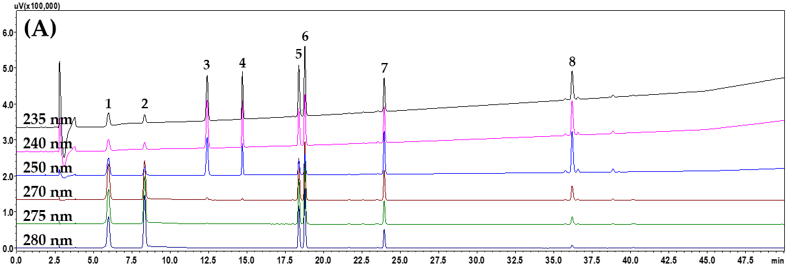
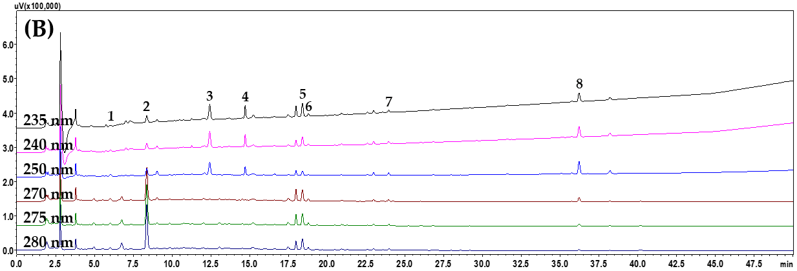
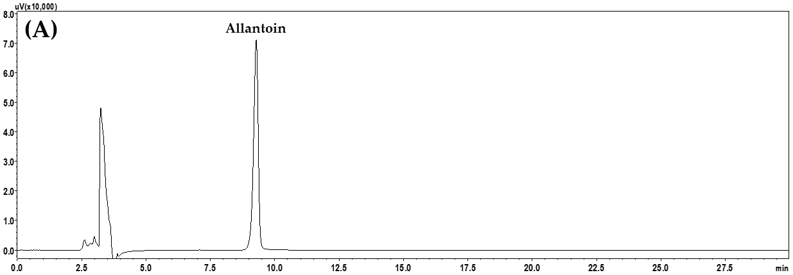
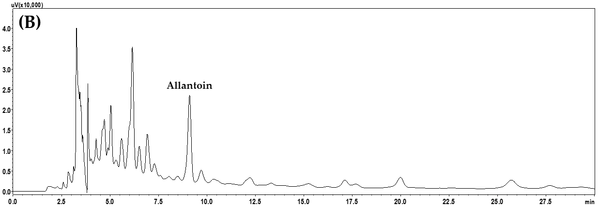

<!-- 方針: ほぼ全訳＋必要に応じた補足。原文の構成に沿って訳出。「> 補足:」は訳者注。 -->

## 書誌情報

- 原題: Development and Validation of an HPLC–PDA Method for Quality Control of Jwagwieum, an Herbal Medicine Prescription: Simultaneous Analysis of Nine Marker Compounds
- 著者: Chang-Seob Seo, Jeeyoun Jung, Sarah Shin（KM Science Research Division, Korea Institute of Oriental Medicine, KIOM, 韓国・大田）
- 掲載: *Pharmaceuticals* 2025, 18, 481. https://doi.org/10.3390/ph18040481（オープンアクセス, CC BY 4.0）
- インパクトファクター: **4.8**（*Pharmaceuticals*, JCR 2024 / Clarivate）
- 受理経過: 受領 2025-02-24 / 改訂 2025-03-14 / 受理 2025-03-25 / 公開 2025-03-27
- 資金: 韓国韓医学研究院（健康な老化のための韓医学理論の科学化, KSN2312021）

> 補足: 左帰飲は、韓国語読みで Jwagwieum / Joa-Gui Em、中国語で坐帰飲（Zuoguiyin）。本文では原文の略号 **JGE** を用いる。

## 要旨（Abstract）

**背景・目的**: 左帰飲（JGE）は6種の生薬——熟地黄（*Rehmannia glutinosa*）、山薬（*Dioscorea japonica*）、枸杞子（*Lycium chinense*）、山茱萸（*Cornus officinalis*）、茯苓（*Poria cocos*）、炙甘草（*Glycyrrhiza uralensis*）——からなり、腎陰虚証の治療に広く用いられてきた。本研究では、9成分——没食子酸（gallic acid）、5-ヒドロキシメチルフルフラール（5-HMF）、モロニサイド（morroniside）、ロガニン（loganin）、リクイリチンアピオシド（liquiritin apioside）、リクイリチン（liquiritin）、オノニン（ononin）、グリチルリチン（glycyrrhizin）、アラントイン（allantoin）——を同時定量するための、フォトダイオードアレイ検出器付き高速液体クロマトグラフィー（HPLC–PDA）法を開発した。

**方法**: 開発した JGE のQC用 HPLC–PDA 法を、直線性・検出限界（LOD）・定量限界（LOQ）・回収率・精度について検証した。

**結果**: 検量線の回帰式における決定係数は ≥0.9980、LOD と LOQ はそれぞれ 0.003–0.071 µg/mL、0.010–0.216 µg/mL であった。回収率と精度（相対標準偏差, RSD）はそれぞれ 96.36–106.95%、<1.20% であった。本法において、9成分は凍結乾燥物1グラムあたり 0.15–3.69 mg の濃度で検出された。

**結論**: 開発・バリデーションした分析法は、JGE および関連する生薬処方の品質管理のための基礎データを得るために利用できる。

**キーワード**: Jwagwieum; Joa-Gui Em; 同時分析; 品質管理; HPLC–PDA

## 1. 序論（Introduction）

主に2種以上の植物由来生薬からなる生薬処方は、東アジアで伝統医学として広く用いられてきた——韓国では韓医学（TKM）、中国では中医学（TCM）、日本では漢方医学（KM）。これらは、複数の生薬の複合作用を通じて、慢性疾患・老化・免疫調節など様々な健康問題の改善に有効とされる。近代科学技術の進歩に伴い、TKM・TCM・KM などの薬理作用や安全性を確認する研究が活発に行われ、生薬の科学的基盤の強化と国際的なヘルスシステムでの役割拡大に寄与している。ここで、TKM・TCM・KM の品質管理も重要な要素である。

JGE（坐帰飲, Zuoguiyin）は6種の生薬——熟地黄（Rehmanniae Radix Preparata）、山薬（Dioscoreae Rhizoma）、枸杞子（Lycii Fructus）、山茱萸（Corni Fructus）、茯苓（Poria Sclerotium）、炙甘草（Glycyrrhizae Radix et Rhizoma Preparata cum Melle）——からなる処方で、TKM・TCM・KM を代表する処方として腎陰虚証の治療に広く用いられてきた。

JGE の腎陰虚証への効果については、Han ら[6]が片側尿管閉塞（UUO）の動物モデルで腎障害・腎機能の改善効果を、Na ら[7]が虚血再灌流誘発の急性腎不全モデルで NLRP3 および TLR4/NF-κB シグナルの改善を介した腎保護効果を報告している。

JGE の生物学的有効性に関する報告はあるものの、品質管理に関する報告はほとんどない。TKM・TCM・KM などの生薬処方では、一貫した生物学的有効性の検証と品質管理の達成のために標準化研究が必要である。分析法開発のため、JGE を構成する生薬の主要成分が調査された——フラン誘導体の 5-HMF（熟地黄）[8]、アルカロイドのアラントイン（山薬）[9]、アルカロイドのベタイン（枸杞子）[10]、フェノール類の没食子酸とイリドイド配糖体のモロニサイド・スウェロサイド・ロガニン・コルニン・コルヌシド（山茱萸）[11,12]、トリテルペノイドのポリポレン酸C・パキミ酸（茯苓）[13]、フラボノイドのリクイリチン・リクイリチゲニン・リクイリチンアピオシド・オノニンとトリテルペノイドサポニンのグリチルリチン（甘草）[14,15]。

今日、TKM・TCM・KM の品質管理用分析法開発は、HPLC や超高速液体クロマトグラフィーとPDA検出・タンデム質量分析を組み合わせた手法で行われている[16–19]。

本研究では、JGE の効率的な品質管理と臨床/非臨床研究の基礎データを確保するため、9種の指標成分を用いた同時分析用 HPLC–PDA 法を開発・バリデーションした。指標成分は、没食子酸(1)、5-HMF(2)、モロニサイド(3)、ロガニン(4)、リクイリチンアピオシド(5)、リクイリチン(6)、オノニン(7)、グリチルリチン(8)、アラントイン(9) である（原文 Figure S1）。

## 2. 結果と考察（Results and Discussion）

### 2.1 JGE構成6生薬のHPLCプロファイリングと指標成分の選定

指標成分の選定は複数の基準に基づいた：(1) JGE を構成する6生薬の主要生理活性成分を同定した先行研究[8–15]、(2) 韓国薬局方（KP）・中国薬局方（CP）を含む公定書への収載、(3) 既往分析でのQCマーカーとしての妥当性。特に、5-HMF（熟地黄）、グリチルリチン（甘草）、ロガニンとモロニサイド（山茱萸）、ベタイン（枸杞子）は KP または CP で主要な品質マーカーとして公式に認知されている。さらに、JGE 抽出物中でのこれら成分の検出性とクロマト分離を確認するため HPLC プロファイリングを実施した。この目的で、0.1%(v/v) ギ酸(FA) を加えた蒸留水(DW)–アセトニトリル(ACN) 溶媒系のグラジエント溶出と、SunFire™ C18 カラム（250 mm × 4.6 mm, 5 µm; Waters）を用いた。

調査した各生薬の主要成分は次のとおり：5-HMF（熟地黄）；アラントイン（山薬）；ベタイン（枸杞子）；モロニサイド・スウェロサイド・ロガニン・メチルガレート・没食子酸・コルニン・コルヌシド・プロトカテク酸（山茱萸）；ポリポレン酸C・パキミ酸（茯苓）；リクイリチン・リクイリチンアピオシド・リクイリチゲニン・オノニン・グリチルリチン（甘草）。各生薬の HPLC プロファイルと主要成分は原文 Figure S2 に示す。

計18成分を JGE 試料に適用可能なものとして試験した。このうち、山薬・枸杞子の主成分であるアラントインとベタインは本分析条件では検出されなかった。ベタインはアミノ酸系構造ゆえ紫外発色団を欠き保持も短いため本分析から除外し、アラントインは別カラムで分離して分析した。アラントイン・ベタインの2成分を除く16成分は、重なるピークなく60分以内に良好に分離・検出された。しかし、6生薬からなる JGE 試料中で検出されたのは9成分（没食子酸、5-HMF、モロニサイド、ロガニン、リクイリチンアピオシド、リクイリチン、オノニン、グリチルリチン、アラントイン）のみであった。最終的にこの9成分を JGE のQC用マーカーとして選定した。選定マーカーのうち、アラントインは Luna NH2 カラム（250 mm × 4.6 mm, 5 µm, Phenomenex）上で DW–ACN 移動相系を用い別途分析した。

> 補足: 実務的には「1カラム・1メソッドで全成分」とはならず、**本体8成分（C18）＋アラントイン（NH2カラム）の2系統**運用になる点に注意。

### 2.2 HPLC–PDA同時分析の操作条件の最適化

JGE のマーカー8成分（2.1節）の同時分析法を最適化するため、既報[1]の分析法を改変して適用した。最適化は3段階で検証した。

**Stage I**: いくつかの逆相C18カラム——SunFire™（Waters）、Kinetex（Phenomenex）、Capcell Pak UG80（Shiseido）、Hypersil GOLD（Thermo Fisher）——でマーカーの分離度とピーク形状を比較した（いずれも粒径5 µm、長さ250 mm、内径4.6 mm）。リクイリチンアピオシドとリクイリチンを除く他のマーカーは分離度 >1.5（完全分離）だったが、この2成分はカラムにより分離度が変動した。具体的には、両成分間の分離度は SunFire™ 2.26、Kinetex 1.14、Capcell Pak UG80 1.84、Hypersil GOLD 0.99 であった。特に Kinetex では没食子酸が他カラムより広いピーク形状で溶出し、Hypersil GOLD では没食子酸と 5-HMF にテーリングが生じた。リクイリチンアピオシド/リクイリチンの分離度が最良だった SunFire™ を最終的に選定した。

| カラム | liquiritin apioside / liquiritin の分離度(Rs) | 備考 |
| --- | --- | --- |
| SunFire™ | 2.26 | 最良 → 採用 |
| Capcell Pak UG80 | 1.84 | — |
| Kinetex | 1.14 | 没食子酸がブロード |
| Hypersil GOLD | 0.99 | 没食子酸・5-HMFにテーリング |

**Stage II**: カラム選定後、移動相に加える酸——0.1%(v/v) FA、0.1%(v/v) トリフルオロ酢酸(TFA)、0.1%(v/v) リン酸(PA)、1.0%(v/v) 酢酸(AA)——でピーク形状と分離度を比較した。全マーカーの分離度は試験条件全体で 2.06–2.28 とベースライン分離を示し、条件間で有意な差はなかった（いずれも閾値 Rs>1.5 を超過）。そこで、HPLC や LC–MS/MS で移動相に頻用される FA を選定した。

**Stage III**: カラムとモバイル相添加酸を決定後、カラム温度（30、40、50 ℃）によるピークパターンを比較・評価した。マーカーを用いた分離度比較では全条件で >1.5 と良好だったが、JGE 試料では 30 ℃で没食子酸が近接する未知ピークと重なった。さらに 50 ℃では没食子酸・5-HMF のテーリング（標準溶液）と、JGE 試料でロガニンが未知ピークと重なる現象が観察された。最適なカラムオーブン温度は **40 ℃** と決定した。

以上の結果に基づき、JGE 試料中の8マーカー成分の同時分析の最適条件を確立した：SunFire™ C18 カラム、0.1%(v/v) FA を含む DW–ACN 移動相、カラムオーブン温度 40 ℃。詳細な HPLC 操作条件は原文 Table S1 に示す。標準溶液と JGE 溶液の代表的クロマトグラムを Figure 1 に示す。

アラントインの分析は既報のプロトコル[9]で実施：Luna NH2 カラム（250 mm × 4.6 mm, 5 µm, Phenomenex）を40 ℃に維持し、DW–ACN 移動相のイソクラティック流で行った（原文 Table S1）。クロマトグラムを Figure 2（210 nm）に示す。

確立した分析法のもとで、マーカー成分の保持時間とピーク面積の RSD によりHPLC装置性能を評価したところ、**RSD ≤ 0.53%** と優れた装置性能が示された（原文 Tables S2, S3）。

### 2.3 開発したHPLC–PDA法のバリデーション

JGE のQC用に開発した HPLC–PDA 法を、9種のマーカー成分を用いて直線性・感度（LOD・LOQ）・正確さ（回収率）・精度について検証した（原文 Tables 1–3）。直線性の指標である決定係数(r²)は、各成分の検量線濃度範囲で評価した検量線の回帰式から求めた。8マーカー成分の r² は ≥0.9980 と優れた直線性を示した（Table 1）。感度として測定した LOD・LOQ は、それぞれ 0.003–0.764 µg/mL、0.010–2.315 µg/mL と算出された（アラントインを含む範囲, Table 1）。正確さ評価のための回収率は 96.36–106.95%（RSD ≤ 2.50%）と優れた正確さを示した（Table 2）。精度（日内・日間）は RSD で評価し、全マーカー成分で RSD < 1.20% であった（Table 3）。これらの結果は、本法が JGE の品質評価に適することを示す。

**Table 1. 同時HPLC分析における各マーカー成分のパラメータ（n=3）**
LOD/LOQ の単位は µg/mL、保持時間(RT)は分。

| No. 成分 | 検出波長(nm) | 直線範囲(µg/mL) | 回帰式 | r² | LOD | LOQ | RT(min) |
| --- | --- | --- | --- | --- | --- | --- | --- |
| 1 没食子酸 | 270 | 0.16–10.00 | y = 144,135.94x − 18,031.79 | 1.0000 | 0.004 | 0.011 | 5.99 |
| 2 5-HMF | 280 | 0.31–20.00 | y = 92,740.24x + 2,003.38 | 0.9997 | 0.041 | 0.125 | 8.34 |
| 3 モロニサイド | 240 | 0.16–10.00 | y = 53,334.63x + 144.75 | 1.0000 | 0.004 | 0.013 | 12.42 |
| 4 ロガニン | 235 | 0.16–10.00 | y = 56,300.13x + 1,261.95 | 1.0000 | 0.006 | 0.020 | 14.71 |
| 5 リクイリチンアピオシド | 275 | 0.47–30.00 | y = 38,748.93x + 3,593.01 | 1.0000 | 0.026 | 0.079 | 18.39 |
| 6 リクイリチン | 275 | 0.16–10.00 | y = 39,806.34x + 2,067.17 | 1.0000 | 0.003 | 0.010 | 18.79 |
| 7 オノニン | 250 | 0.16–10.00 | y = 50,734.87x − 1,491.47 | 0.9980 | 0.009 | 0.027 | 23.96 |
| 8 グリチルリチン | 250 | 1.56–100.00 | y = 8,363.50x + 3,769.30 | 1.0000 | 0.071 | 0.216 | 36.18 |
| 9 アラントイン（NH2カラム） | 210 | 3.13–100.00 | y = 9,179.35x − 8.21 | 1.0000 | 0.764 | 2.315 | 9.27 |

> 補足: 要旨・結論が示す「LOD 0.003–0.071、LOQ 0.010–0.216」は本体8成分の範囲。アラントインのみ別法で LOD 0.764・LOQ 2.315 と感度は低め。

**Table 2. 開発したHPLC–PDA法における9マーカーの回収率(%)（n=5）**
標準添加法、各成分3濃度。全体で回収率 96.36–106.95%、RSD ≤ 2.50%。回収率(%) =（検出量 − 元の量）/ 添加量 × 100。

| No. 成分 | 元の量(µg/mL) | 添加3濃度での回収率(%) |
| --- | --- | --- |
| 1 没食子酸 | 2.14 | 102.65 / 101.79 / 101.01 |
| 2 5-HMF | 8.13 | 102.26 / 101.95 / 99.41 |
| 3 モロニサイド | 4.14 | 104.66 / 96.63 / 106.20 |
| 4 ロガニン | 3.50 | 105.01 / 103.50 / 106.95 |
| 5 リクイリチンアピオシド | 7.42 | 98.20 / 106.49 / 101.83 |
| 6 リクイリチン | 1.52 | 98.19 / 102.21 / 96.36 |
| 7 オノニン | 1.50 | 100.37 / 99.73 / 103.56 |
| 8 グリチルリチン | 37.02 | 105.00 / 100.28 / 107.21 |
| 9 アラントイン | 23.85 | 100.77 / 105.10 / 101.15 |

**Table 3. 9マーカーの精度（日内 n=5 / 日間 n=15）**: 全マーカーで精度 RSD < 1.20%、正確さは概ね 98–102%。各成分3濃度（例: 没食子酸 2.5/5.0/10.0、リクイリチンアピオシド 7.5/15/30、グリチルリチン 25/50/100、アラントイン 25/50/100 µg/mL）で評価。各値の詳細は原文 Table 3 参照。

### 2.4 安定性試験（Stability Test）

標準溶液・試料溶液中のマーカー成分の安定性は **97.14–105.24%（RSD ≤ 2.06%）** と測定された（原文 Tables S4, S5）。これは9マーカー成分の安定性が **少なくとも72時間** 保証されることを意味し、QC応用に向けた分析法の頑健性を示す。マーカー成分は光分解防止のためアンバーバイアルで保存した。本安定性データは、JGE 抽出物のバッチ間の一貫性を担保することで、ルーチンQCへの適用可能性をさらに支持する。

### 2.5 システム適合性評価（System Suitability Evaluation）

ピーク性能評価のためのシステム適合性を確立基準に従い評価した。全パラメータが要求閾値を満たした：容量因子(k) ≥ 1.16、選択性因子(α) ≥ 1.03、分離度(Rs) ≥ 2.25、理論段数(N) ≥ 16,566.18、対称係数(S) ≤ 1.19（原文 Table S6）。結果は分析法開発が成功裏に行われたことを確認した。

> 補足: 3.8節の設定基準は k>1, α>1, Rs≥1.5, N>2000, S≤2.0。実測値はいずれも基準を上回る。

### 2.6 JGE試料中の9マーカー成分の同時定量分析

JGE の効率的QC用に最適化した分析法を実試料に適用した。定量は各標的成分の紫外極大吸収波長で行った：アラントイン(210 nm)、ロガニン(235 nm)、モロニサイド(240 nm)、オノニン・グリチルリチン(250 nm)、没食子酸(270 nm)、リクイリチンアピオシド・リクイリチン(275 nm)、5-HMF(280 nm)。凍結乾燥 JGE 試料中で、9マーカー成分は **0.15–3.69 mg/g** の範囲で定量された（Table 4）。このうち、甘草の主要マーカーであるグリチルリチンが最も多く、含量は 3.67–3.69 mg/g であった。

**Table 4. HPLC–PDA法によるJGE試料中9マーカー成分の濃度（mg/g, n=3）**

| No. 成分 | JGE-1 | JGE-2 | JGE-3 |
| --- | --- | --- | --- |
| 1 没食子酸 | 0.21 | 0.21 | 0.21 |
| 2 5-HMF | 0.81 | 0.82 | 0.82 |
| 3 モロニサイド | 0.41 | 0.41 | 0.41 |
| 4 ロガニン | 0.35 | 0.35 | 0.35 |
| 5 リクイリチンアピオシド | 0.74 | 0.74 | 0.75 |
| 6 リクイリチン | 0.15 | 0.15 | 0.15 |
| 7 オノニン | 0.15 | 0.15 | 0.15 |
| 8 グリチルリチン | 3.69 | 3.68 | 3.67 |
| 9 アラントイン | 2.94 | 2.92 | 2.88 |

> 補足: 各値のSD・RSD（×10⁻²のSD表記、RSDは概ね 0.04–1.50%）は原文 Table 4 参照。3ロット間のばらつきは小さい。

## 3. 材料と方法（Materials and Methods）

### 3.1 植物材料

JGE を構成する6生薬のうち、熟地黄は Shin Hung（韓国・麗水）、山薬・枸杞子・山茱萸・茯苓は Sunilmulsan（ソウル）、甘草は CK Pharm（ソウル）から2023年7月に購入した。これらは韓国食品医薬品安全処（MFDS）のGMP認証を受けた生薬専門メーカーである。原料生薬の詳細は原文 Table S7。各生薬は Dr. Goya Choi（KIOM）が形態学的に同定し、各標本（2022HA01-1〜2022HA01-6）を KIOM の KM Science Research Division に保管した。

### 3.2 試薬

JGE のQC用の9標準品（純度 ≥98.0%）を天然物メーカーから購入した（Merck KGaA, ドイツ；Wuhan ChemFaces, 中国；Biopurify Phytochemicals, 中国；Shanghai Sunny Biotech, 中国）。詳細は原文 Table S8。メタノール(MeOH)・ACN・DW（いずれもHPLCグレード）は JT Baker。ACSグレード FA（≥99.7%）は Merck、HPLCグレード AA（≥99.7%）は Thermo Fisher、HPLCグレード TFA（≥99.0%）と PA（85%）は Merck から購入した。

### 3.3 JGE水抽出試料の調製

JGE 水抽出物は Purichems社（韓国・義王）が製造した。原文 Table S7 の重量に従い、6生薬（計3.15 kg）に水31.5 Lを加え、電気抽出器で **95 ℃・3時間**加圧抽出し、濾布（10 µm）で濾過した。濾液を **80 ℃・真空度 −0.08 MPa** で減圧濃縮し、凍結乾燥機（LP20, IlShinBioBase）で凍結乾燥した。これにより **827.5 g（収率26.3%）** の粉末試料を得て、使用まで冷蔵庫（約4 ℃・湿度30%）で保存した。

### 3.4 HPLC–PDA同時定量用の標準溶液・試料溶液の調製

8標準品のストック溶液を MeOH 中で 1.0 mg/mL に調製し、約4 ℃（湿度30%）で3日間保存して用時に段階希釈した。試料溶液は、凍結乾燥 JGE 100 mg に 70% MeOH 10 mL を加え、**60分間の超音波抽出**で調製した。全溶液は HPLC 分析前に 0.2 µm メンブレンフィルター（GVS ABLUO）で濾過した。

### 3.5 同時HPLC–PDA分析の装置・操作条件

HPLC 操作条件は既報[1]に基づいて適用した。Shimadzu Prominence LC-20A シリーズ（LabSolution v5.117 制御）を用い、8成分（没食子酸・5-HMF・モロニサイド・ロガニン・リクイリチンアピオシド・リクイリチン・オノニン・グリチルリチン）の分離は SunFire™ 逆相カラム（250 mm × 4.6 mm, 5 µm, Waters）で、アラントインは別途 Luna NH2 カラム（250 mm × 4.6 mm, 5 µm, Phenomenex）で行った。詳細は原文 Table S1。

### 3.6 開発したHPLC–PDA法のバリデーション

JGE のQC用 HPLC–PDA 法のバリデーションは、確立ガイドライン[20]（ICH Q2B）に基づき、直線性・LOD・LOQ・回収率・精度を評価して実証した。各マーカーの検量線回帰式は y = ax + b（y=ピーク面積, x=標準品濃度 µg/mL）。直線性は異なる濃度水準で測定した回帰式の r² で評価。感度評価では、3連測定した検量線データの回帰分析から得た各y切片の標準偏差と平均傾きを用い、**LOD = 3.3 × σ/S、LOQ = 10 × σ/S**（σ=y切片の標準偏差、S=回帰式の平均傾き）で算出。回収率は標準添加法で5回（n=5）、3濃度水準（低・中・高）を既知試料に添加して測定し、回収率(%) =（検出量 − 元の量）/ 添加量 × 100 で算出。精度は日内（1日, n=5）・日間（3日, n=15）の RSD で評価した。

### 3.7 安定性試験

各成分の MeOH 溶液中の安定性を3日間（0, 6, 12, 24, 36, 48, 72 h）、混合マーカー標準溶液で試験した。試験標準溶液中の各成分濃度は、5-HMF・モロニサイド・ロガニン 10.00 µg/mL、没食子酸・リクイリチンアピオシド・リクイリチン・オノニン 20.00 µg/mL、グリチルリチン 100.00 µg/mL。初回測定値を100.0%として比較した。アラントイン（MeOH中 100.00 µg/mL）は C18 で検出されないため、適した NH2 カラムで別途試験した。さらに、70% MeOH で調製した試料溶液の安定性も3日間（同時点）試験した。アラントインは同様に NH2 カラムで試験した。

### 3.8 システム適合性試験

ピーク性能評価パラメータ（k, α, Rs, N, S）を公表ガイドライン[20,21]に基づき試験した。基準は k>1、α>1、Rs≥1.5、N>2000、S≤2.0 と設定し、開発した分析法のピーク性能を検証した。

## 4. 結論（Conclusions）

本研究では、TKM で腎陰虚証の治療に用いられる JGE のQC用分析法を、HPLC–PDA システムを用いて——著者らの考えでは初めて——開発した。HPLC–PDA は分析法開発に広く用いられる手法である。開発した分析法は、直線性（r² > 0.9980）、感度（LOD 0.003–0.071 µg/mL、LOQ 0.010–0.216 µg/mL）、正確さ（96.36–106.95%）、精度（RSD < 1.20%）、システム適合性などの評価に基づき適切であることが示された。これらは、本法が JGE および類似処方の品質管理に高い信頼性で適することを確認するものである。

本研究の意義は、生薬の標準化と規制評価への貢献にある。バリデーション済みの分析法を確立することで、本研究は生薬処方の一貫性と有効性を担保する品質保証プログラムに適用できる基礎データを提供する。

今後の研究では、これらマーカー成分の生体内での薬物動態・生物学的利用能を探求し、治療効果のより良い理解を可能にすべきである。加えて、本分析アプローチは他の伝統生薬処方にも拡張でき、TCM・TKM・KM の科学的標準化をさらに支援しうる。

---

## 訳者補足（実務向けメモ）

> 以下は原文には無い、QC実務向けの整理（訳者注）。

- **規格設定の出発点として使える**: 1回の HPLC–PDA（＋アラントインは別カラム）で由来生薬の異なる複数成分を一括把握でき、多成分処方の同等性・恒常性評価に直結。PDA検出なので MS 不要、汎用機で再現しやすい。
- **主力マーカー候補はグリチルリチン**（含量最大 3.67–3.69 mg/g、3ロットで安定）。一方 **リクイリチン・オノニン（0.15 mg/g級）は微量**なので、規格化時は試料中濃度と LOQ（リクイリチン 0.010、オノニン 0.027 µg/mL）の余裕を確認したい。
- **他施設・他カラムへ移植する際の最初の確認点**（原文が問題を明示した箇所）: ①カラム温度 **40 ℃**（30 ℃で没食子酸、50 ℃で没食子酸・5-HMF・ロガニンに不具合）、②**SunFire相当のC18**（リクイリチンアピオシド/リクイリチンの分離度がカラム依存、目標 Rs>1.5）、③**没食子酸まわりの未知ピーク**の有無。
- **限界**: 1法で全成分を網羅できない（アラントインは別カラム、ベタインは対象外）。バリデーションは ICH Q2B 準拠だが、ロバストネスの網羅的検討やロット数（実試料3）は限定的で、実生産ロットでの追検証が望ましい。
- 補足資料（Table S1〜S8, Figure S1〜S6: グラジエント条件、各生薬プロファイル、カラム/酸/温度の比較クロマト、システム適合性、処方組成、標準品情報）の細目は **原文参照**。

## 参考文献

> 原論文の参考文献。番号は本文の引用 [N] に対応（クリックで該当文献へジャンプ）。各文献はDOIまたはGoogle Scholar検索へのリンク。

1. Seo, C.S.; Lee, M.Y. Method development and validation for simultaneous analysis of eleven components for quality control of Geumgwesingihwan using HPLC–DAD and UPLC–MS/MS. Separations 2022, 9, 213 — [Google Scholarで探す](https://scholar.google.com/scholar?q=Seo%2C%20C.S.%3B%20Lee%2C%20M.Y.%20Method%20development%20and%20validation%20for%20simultaneous%20analysis%20of%20eleven%20components%20for%20quality%20control%20of%20Geumgwesingihwan%20using%20HPLC%E2%80%93DAD%20and%20UPLC%E2%80%93MS/MS.%20Separations%202022%2C%209%2C%20213)
2. Wu, T.Y.; Chang, F.R.; Liou, J.R.; Lo, I.W.; Chung, T.C.; Lee, L.Y.; Chi, C.C.; Du, Y.C.; Wong, M.H.; Juo, S.H.H.; et al. Rapid HPLC quantification approach for detection of active constituent in modern combinatorial formula, San-Huang-Xie-Xin-Tang (SHXXT). Front. Pharmacol. 2016, 7, 374 — [Google Scholarで探す](https://scholar.google.com/scholar?q=Wu%2C%20T.Y.%3B%20Chang%2C%20F.R.%3B%20Liou%2C%20J.R.%3B%20Lo%2C%20I.W.%3B%20Chung%2C%20T.C.%3B%20Lee%2C%20L.Y.%3B%20Chi%2C%20C.C.%3B%20Du%2C%20Y.C.%3B%20Wong%2C%20M.H.%3B%20Juo%2C%20S.H.H.%3B%20et%20al.%20Rapid%20HPLC%20quanti%EF%AC%81cation%20approach%20for%20detection%20of%20active%20constituent%20in%20modern%20combinatorial%20formula%2C%20San-Huang-Xie-Xin-Tang%20%28S)
3. Ren, Z.; Ren, Y.; Li, Z.; Xu, H. TCMM: A unified database for traditional Chinese medicine modernization and therapeutic innovations. Comput. Struct. Biotechnol. J. 2024, 23, 1619–1630 — [Google Scholarで探す](https://scholar.google.com/scholar?q=Ren%2C%20Z.%3B%20Ren%2C%20Y.%3B%20Li%2C%20Z.%3B%20Xu%2C%20H.%20TCMM%3A%20A%20uni%EF%AC%81ed%20database%20for%20traditional%20Chinese%20medicine%20modernization%20and%20therapeutic%20innovations.%20Comput.%20Struct.%20Biotechnol.%20J.%202024%2C%2023%2C%201619%E2%80%931630)
4. Gao, Y.; Liang, A.; Fan, X.; Hu, L.; Hao, F.; Li, Y. Safety research in traditional Chinese medicine: Methods, applications, and outlook. Engineering 2019, 5, 76–82 — [Google Scholarで探す](https://scholar.google.com/scholar?q=Gao%2C%20Y.%3B%20Liang%2C%20A.%3B%20Fan%2C%20X.%3B%20Hu%2C%20L.%3B%20Hao%2C%20F.%3B%20Li%2C%20Y.%20Safety%20research%20in%20traditional%20Chinese%20medicine%3A%20Methods%2C%20applications%2C%20and%20outlook.%20Engineering%202019%2C%205%2C%2076%E2%80%9382)
5. Kono, T.; Shimada, M.; Yamamoto, M.; Kaneko, A.; Oomiya, Y.; Kubota, K.; Kase, Y.; Lee, K.; Uezono, Y. Complementary and synergistic therapeutic effects of compounds found in Kampo medicine: Analysis of daikenchuto. Front. Pharmacol. 2015, 6, 159 — [Google Scholarで探す](https://scholar.google.com/scholar?q=Kono%2C%20T.%3B%20Shimada%2C%20M.%3B%20Yamamoto%2C%20M.%3B%20Kaneko%2C%20A.%3B%20Oomiya%2C%20Y.%3B%20Kubota%2C%20K.%3B%20Kase%2C%20Y.%3B%20Lee%2C%20K.%3B%20Uezono%2C%20Y.%20Complementary%20and%20synergistic%20therapeutic%20effects%20of%20compounds%20found%20in%20Kampo%20medicine%3A%20Analysis%20of%20daikenchuto.%20Front.%20Pharmacol.%202015%2C%206%2C%20159)
6. Han, B.H.; Yu, J.K.; Jang, Y.J.; Kim, H.Y.; Yoon, J.J.; Cho, N.G.; Lee, H.S.; Kang, D.G. The protective effect of Oryeongsan, Geumgwe-sinkihwan, and Jwagwieum on renal injury in rats with unilateral ureteral obstruction. Herb. Formula Sci. 2023, 31, 133–144 — [Google Scholarで探す](https://scholar.google.com/scholar?q=Han%2C%20B.H.%3B%20Yu%2C%20J.K.%3B%20Jang%2C%20Y.J.%3B%20Kim%2C%20H.Y.%3B%20Yoon%2C%20J.J.%3B%20Cho%2C%20N.G.%3B%20Lee%2C%20H.S.%3B%20Kang%2C%20D.G.%20The%20protective%20effect%20of%20Oryeongsan%2C%20Geumgwe-sinkihwan%2C%20and%20Jwagwieum%20on%20renal%20injury%20in%20rats%20with%20unilateral%20ureteral%20obstruction.%20Herb.%20Formula%20Sci.%202023%2C%2031%2C%20)
7. Na, S.W.; Jang, Y.J.; Hong, M.H.; Yoon, J.J.; Lee, H.S.; Kim, H.Y.; Kang, D.G. Protective effect of Joa-Gui Em through the improvement of the NLRP3 and TLR4/ NF-κb signaling by ischemia/reperfusion-induced acute renal failure rats. Evid. Based Complement. Alternat. Med. 2021, 2021, 7178868 — [Google Scholarで探す](https://scholar.google.com/scholar?q=Na%2C%20S.W.%3B%20Jang%2C%20Y.J.%3B%20Hong%2C%20M.H.%3B%20Yoon%2C%20J.J.%3B%20Lee%2C%20H.S.%3B%20Kim%2C%20H.Y.%3B%20Kang%2C%20D.G.%20Protective%20effect%20of%20Joa-Gui%20Em%20through%20the%20improvement%20of%20the%20NLRP3%20and%20TLR4/%20NF-%CE%BAb%20signaling%20by%20ischemia/reperfusion-induced%20acute%20renal%20failure%20rats.%20Evid.%20Based%20Comple)
8. Hwang, S.Y.; Hwang, B.Y.; Choi, W.H.; Jung, H.J.; Huh, J.D.; Lee, K.S.; Ro, J.S. Quantitative determination of 5-hydroxymethyl-2- furaldehyde in the Rehmanniae Radix Preparata samples at various processing stages. Kor. J. Pharmacogn. 2001, 32, 116–120 — [Google Scholarで探す](https://scholar.google.com/scholar?q=Hwang%2C%20S.Y.%3B%20Hwang%2C%20B.Y.%3B%20Choi%2C%20W.H.%3B%20Jung%2C%20H.J.%3B%20Huh%2C%20J.D.%3B%20Lee%2C%20K.S.%3B%20Ro%2C%20J.S.%20Quantitative%20determination%20of%205-hydroxymethyl-2-%20furaldehyde%20in%20the%20Rehmanniae%20Radix%20Preparata%20samples%20at%20various%20processing%20stages.%20Kor.%20J.%20Pharmacogn.%202001%2C%2032%2C%20116%E2%80%9312)
9. Seo, C.S.; Huang, D.S.; Lee, J.K.; Ha, H.K.; Kim, H.K.; Seo, Y.B.; Shin, H.K. Quantitative determination of the marker constituent of Dioscoreae Rhizoma by the packaging methods. Kor. J. Herbol. 2008, 23, 45–49 — [Google Scholarで探す](https://scholar.google.com/scholar?q=Seo%2C%20C.S.%3B%20Huang%2C%20D.S.%3B%20Lee%2C%20J.K.%3B%20Ha%2C%20H.K.%3B%20Kim%2C%20H.K.%3B%20Seo%2C%20Y.B.%3B%20Shin%2C%20H.K.%20Quantitative%20determination%20of%20the%20marker%20constituent%20of%20Dioscoreae%20Rhizoma%20by%20the%20packaging%20methods.%20Kor.%20J.%20Herbol.%202008%2C%2023%2C%2045%E2%80%9349)
10. Zhao, B.T.; Jeong, S.Y.; Hwangbo, K.; Moon, E.C.; Seo, E.K.; Lee, D.; Lee, J.H.; Min, B.S.; Ma, E.S.; Son, J.K.; et al. Quantitative analysis of betaine in Lycii fructus by HILIC-ELSD. Arch. Pharm. Res. 2013, 36, 1231–1237 — [Google Scholarで探す](https://scholar.google.com/scholar?q=Zhao%2C%20B.T.%3B%20Jeong%2C%20S.Y.%3B%20Hwangbo%2C%20K.%3B%20Moon%2C%20E.C.%3B%20Seo%2C%20E.K.%3B%20Lee%2C%20D.%3B%20Lee%2C%20J.H.%3B%20Min%2C%20B.S.%3B%20Ma%2C%20E.S.%3B%20Son%2C%20J.K.%3B%20et%20al.%20Quantitative%20analysis%20of%20betaine%20in%20Lycii%20fructus%20by%20HILIC-ELSD.%20Arch.%20Pharm.%20Res.%202013%2C%2036%2C%201231%E2%80%931237)
11. Jiang, Y.; Chen, H.; Wang, L.; Zou, J.; Zheng, X.; Liu, Z. Quality evaluation of polar and active components in crude and processed Fructus corni by quantitative analysis of multicomponents with single marker. J. Anal. Methods Chem. 2016, 2016, 6496840 — [Google Scholarで探す](https://scholar.google.com/scholar?q=Jiang%2C%20Y.%3B%20Chen%2C%20H.%3B%20Wang%2C%20L.%3B%20Zou%2C%20J.%3B%20Zheng%2C%20X.%3B%20Liu%2C%20Z.%20Quality%20evaluation%20of%20polar%20and%20active%20components%20in%20crude%20and%20processed%20Fructus%20corni%20by%20quantitative%20analysis%20of%20multicomponents%20with%20single%20marker.%20J.%20Anal.%20Methods%20Chem.%202016%2C%202016%2C%2064968)
12. Jeong, E.J.; Kim, T.B.; Yang, H.; Kang, S.Y.; Kim, S.Y.; Sung, S.H.; Kim, Y.C. Neuroprotective iridoid glycosides from Cornus officinalis fruits against glutamate-induced toxicity in HT22 hippocampal cells. Phytomedicine 2012, 19, 317–321 — [Google Scholarで探す](https://scholar.google.com/scholar?q=Jeong%2C%20E.J.%3B%20Kim%2C%20T.B.%3B%20Yang%2C%20H.%3B%20Kang%2C%20S.Y.%3B%20Kim%2C%20S.Y.%3B%20Sung%2C%20S.H.%3B%20Kim%2C%20Y.C.%20Neuroprotective%20iridoid%20glycosides%20from%20Cornus%20of%EF%AC%81cinalis%20fruits%20against%20glutamate-induced%20toxicity%20in%20HT22%20hippocampal%20cells.%20Phytomedicine%202012%2C%2019%2C%20317%E2%80%93321)
13. Li, G.; Xu, M.L.; Lee, J.S.; Woo, M.H.; Chang, H.W.; Son, J.K. Cytotoxicity and DNA topoisomerases inhibitory activity of constituents from the sclerotium of Poria cocos. Arch. Pharm. Res. 2004, 27, 829–833 — [Google Scholarで探す](https://scholar.google.com/scholar?q=Li%2C%20G.%3B%20Xu%2C%20M.L.%3B%20Lee%2C%20J.S.%3B%20Woo%2C%20M.H.%3B%20Chang%2C%20H.W.%3B%20Son%2C%20J.K.%20Cytotoxicity%20and%20DNA%20topoisomerases%20inhibitory%20activity%20of%20constituents%20from%20the%20sclerotium%20of%20Poria%20cocos.%20Arch.%20Pharm.%20Res.%202004%2C%2027%2C%20829%E2%80%93833)
14. Zhou, S.; Cao, J.; Qiu, F.; Kong, W.; Yang, S.; Yang, M. Simultaneous determination of five bioactive components in Radix Glycyrrhizae by pressurized liquid extraction combined with UPLC–PDA and UPLC/ESI–QTOF–MS confirmation. Phytochem. Anal. 2013, 24, 527–533 — [Google Scholarで探す](https://scholar.google.com/scholar?q=Zhou%2C%20S.%3B%20Cao%2C%20J.%3B%20Qiu%2C%20F.%3B%20Kong%2C%20W.%3B%20Yang%2C%20S.%3B%20Yang%2C%20M.%20Simultaneous%20determination%20of%20%EF%AC%81ve%20bioactive%20components%20in%20Radix%20Glycyrrhizae%20by%20pressurized%20liquid%20extraction%20combined%20with%20UPLC%E2%80%93PDA%20and%20UPLC/ESI%E2%80%93QTOF%E2%80%93MS%20con%EF%AC%81rmation.%20Phytochem.%20Anal.%202013%2C%2024%2C)
15. Wu, Y.P.; Meng, X.S.; Bao, Y.R.; Wang, S.; Kang, T.G. Simultaneous quantitative determination of nine active chemical compositions in traditional Chinese medicine Glycyrrhiza by RP-HPLC with full-time five-wavelength fusion method. Am. J. Chin. Med. 2013, 41, 211–219 — [Google Scholarで探す](https://scholar.google.com/scholar?q=Wu%2C%20Y.P.%3B%20Meng%2C%20X.S.%3B%20Bao%2C%20Y.R.%3B%20Wang%2C%20S.%3B%20Kang%2C%20T.G.%20Simultaneous%20quantitative%20determination%20of%20nine%20active%20chemical%20compositions%20in%20traditional%20Chinese%20medicine%20Glycyrrhiza%20by%20RP-HPLC%20with%20full-time%20%EF%AC%81ve-wavelength%20fusion%20method.%20Am.%20J.%20Chin.%20Med.%202)
16. Seo, C.S. Simultaneous quantification of nine target compounds in traditional Korean medicine, Bopyeo-tang, using high- performance liquid chromatography–photodiode array detector and ultra-performance liquid chromatography–tandem mass spectrometery. Molecules 2024, 29, 1171 — [Google Scholarで探す](https://scholar.google.com/scholar?q=Seo%2C%20C.S.%20Simultaneous%20quanti%EF%AC%81cation%20of%20nine%20target%20compounds%20in%20traditional%20Korean%20medicine%2C%20Bopyeo-tang%2C%20using%20high-%20performance%20liquid%20chromatography%E2%80%93photodiode%20array%20detector%20and%20ultra-performance%20liquid%20chromatography%E2%80%93tandem%20mass%20spectrometery.%20)
17. Kim, H.S.; Baek, S.H. Ultra-high performance liquid chromatography–tandem mass spectrometry assay for simultaneous determination of 22 marker compounds in traditional herbal medicine Ojeoksan. J. Pharm. Biomed. Anal. 2024, 246, 116193.   Pharmaceuticals 2025, 18, 481 12 of 12 — [Google Scholarで探す](https://scholar.google.com/scholar?q=Kim%2C%20H.S.%3B%20Baek%2C%20S.H.%20Ultra-high%20performance%20liquid%20chromatography%E2%80%93tandem%20mass%20spectrometry%20assay%20for%20simultaneous%20determination%20of%2022%20marker%20compounds%20in%20traditional%20herbal%20medicine%20Ojeoksan.%20J.%20Pharm.%20Biomed.%20Anal.%202024%2C%20246%2C%20116193.%20%20%20Pharmaceutic)
18. Park, G.; Go, S.H.; Ku, S.; Kim, M.K.; Jang, Y.P. Development and validation of simultaneous HPLC–PDA analysis method for quality control of Hwang-ryeon-hae-dok-tang: An analytical quality by design approach. J. Liq. Chromatogr. Relat. Technol. 2024, 47, 14–25 — [Google Scholarで探す](https://scholar.google.com/scholar?q=Park%2C%20G.%3B%20Go%2C%20S.H.%3B%20Ku%2C%20S.%3B%20Kim%2C%20M.K.%3B%20Jang%2C%20Y.P.%20Development%20and%20validation%20of%20simultaneous%20HPLC%E2%80%93PDA%20analysis%20method%20for%20quality%20control%20of%20Hwang-ryeon-hae-dok-tang%3A%20An%20analytical%20quality%20by%20design%20approach.%20J.%20Liq.%20Chromatogr.%20Relat.%20Technol.%202024%2C)
19. Kiang, M.; Cao, J.; Zhang, C.; Su, B.; Wang, S.; Ning, N.; Lei, T.; Li, P. A comprehensive strategy for quality evaluation of Wushe Zhiyang Pills by integrating UPLC–DAD fingerprint and multi-ingredients rapid quantitation with UPLC–MS/MS technology. J. Pharm. Biomed. Anal. 2022, 210, 114556 — [Google Scholarで探す](https://scholar.google.com/scholar?q=Kiang%2C%20M.%3B%20Cao%2C%20J.%3B%20Zhang%2C%20C.%3B%20Su%2C%20B.%3B%20Wang%2C%20S.%3B%20Ning%2C%20N.%3B%20Lei%2C%20T.%3B%20Li%2C%20P.%20A%20comprehensive%20strategy%20for%20quality%20evaluation%20of%20Wushe%20Zhiyang%20Pills%20by%20integrating%20UPLC%E2%80%93DAD%20%EF%AC%81ngerprint%20and%20multi-ingredients%20rapid%20quantitation%20with%20UPLC%E2%80%93MS/MS%20technology.%20)
20. International Conference on Harmonisation. Guidance for Industry, Q2B, Validation of Analytical Procedures: Methodology; Food and Drug Administration: Rockville, MD, USA, 1996 — [Google Scholarで探す](https://scholar.google.com/scholar?q=International%20Conference%20on%20Harmonisation.%20Guidance%20for%20Industry%2C%20Q2B%2C%20Validation%20of%20Analytical%20Procedures%3A%20Methodology%3B%20Food%20and%20Drug%20Administration%3A%20Rockville%2C%20MD%2C%20USA%2C%201996)
21. Bose, A. HPLC calibration process parameters in terms of system suitability test. Austin Chromatogr. 2014, 1, 1–4. Disclaimer/Publisher’s Note: The statements, opinions and data contained in all publications are solely those of the individual author(s) and contributor(s) and not of MDPI and/or the editor(s). MDPI and/or the editor(s) disclaim responsibility for any injury to people or property resulting from any ideas, methods, instructions or products referred to in the content — [Google Scholarで探す](https://scholar.google.com/scholar?q=Bose%2C%20A.%20HPLC%20calibration%20process%20parameters%20in%20terms%20of%20system%20suitability%20test.%20Austin%20Chromatogr.%202014%2C%201%2C%201%E2%80%934.%20Disclaimer/Publisher%E2%80%99s%20Note%3A%20The%20statements%2C%20opinions%20and%20data%20contained%20in%20all%20publications%20are%20solely%20those%20of%20the%20individual%20author%28)
