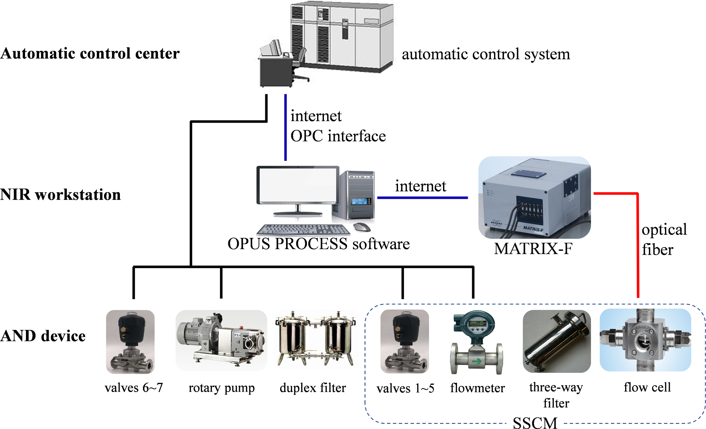
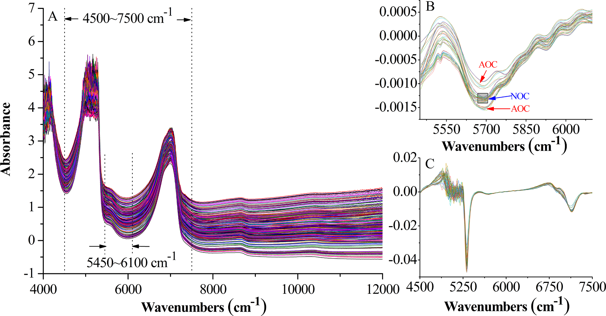
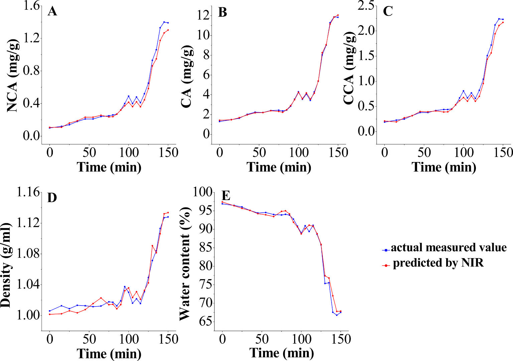
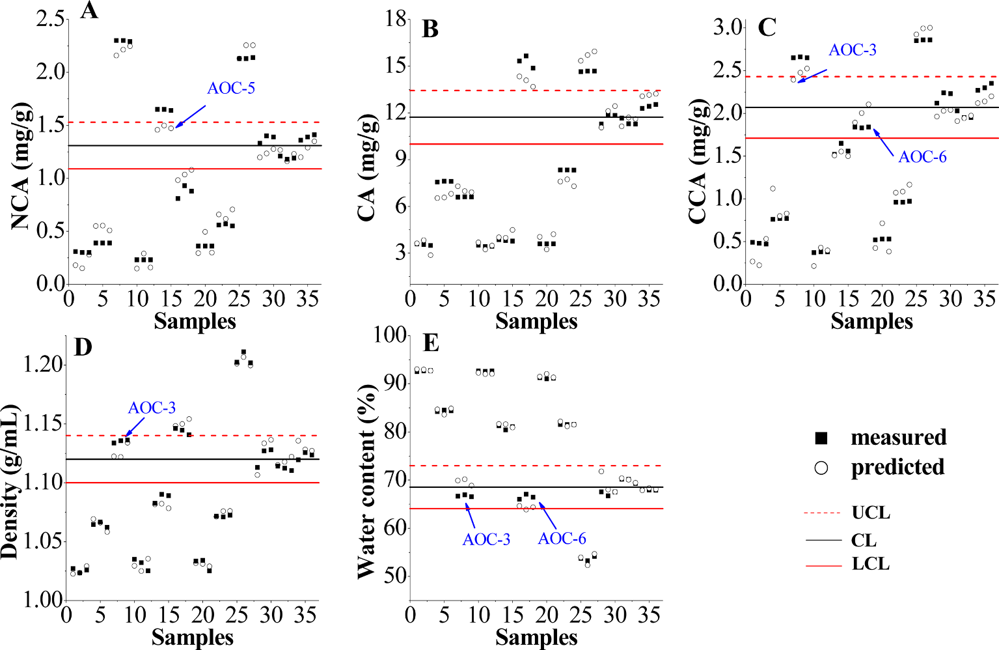

<!--
digest_chart は原文Table5のShewhart管理チャート中心値（CL、終点サンプルの平均値、mg/g）を示す。管理限界（UCL/LCL）は本文Table5参照。
-->

## 書誌情報

- 標題（原題）: Application of near infrared spectroscopy and real time release testing combined with statistical process control charts for on-line quality control of industrial concentrating process of traditional Chinese medicine "Jinyinhua"
- 著者・所属: Ye Jin ａ、Wenjun Du ｂ、Xuesong Liu ｃ、Yongjiang Wu ｃ,*　（ａ 麗水学院 生態学院／ｂ 金華市中心医院／ｃ 浙江大学 薬学院）
- 掲載誌・巻号・DOI: Infrared Physics & Technology 123 (2022) 104135、DOI: 10.1016/j.infrared.2022.104135
- インパクトファクター: 3.83（Infrared Physics & Technology, JCR2024 / Clarivate。2025年発表）
- 受理経過 / ライセンス: 2021年12月24日受付、2022年3月15日改訂受理、2022年3月15日受理、2022年3月18日オンライン公開。© 2022 Elsevier B.V. All rights reserved.

## 要旨（Abstract）

濃縮工程は、金銀花（Lonicerae Japonicae Flos、LJF、中国語で「金銀花」）製剤の製造における重要な単位操作である。近赤外（NIR）分光法とリアルタイムリリース試験（RTRT）を統計的工程管理（SPC）手法と組み合わせ、濃縮工程のオンラインモニタリングと最終LJF濃縮液に対する品質管理戦略の構築のために提示した。自動NIR検出（AND）装置を設計し、濃縮液中の気泡、固形不純物、流れがNIRスペクトルに与える影響を除去するのに有効であることを実証した。部分最小二乗（PLS）モデルを構築し、ネオクロロゲン酸（NCA）、クロロゲン酸（CA）、クリプトクロロゲン酸（CCA）、密度、水分含量をオンラインで定量した結果、リアルタイムデータが得られ、良好な予測能を示した。単変量Shewhart、多変量Hotelling T2、二乗予測誤差（SPE）を含むSPEツールを比較し、RTRTに適用した。RTRTの結果、最終LJF濃縮液のリリース基準は以下の通りであった：1.09 mg/g ＜ NCA ＜ 1.53 mg/g、10.00 mg/g ＜ CA ＜ 13.44 mg/g、1.71 mg/g ＜ CCA ＜ 2.43 mg/g、1.10 g/ml ＜ 密度 ＜ 1.14 g/ml、64.07% ＜ 水分含量 ＜ 72.99%、SPE結果 ＜ 0.04。ShewhartチャートとSPEチャートは異常の検出と正常バッチのリリースに有用であることが示された。本研究は、中医薬（TCM）の工業スケール濃縮工程のオンライン品質管理におけるNIRとRTRT・SPCチャート併用の有効性を実証した。

## 1. 序論（Introduction）

2004年、米国食品医薬品局（FDA）はプロセス分析工学（PAT）のガイダンスにおいてリアルタイムリリース（RTR）の概念を提唱し、工程データに基づき工程内および/または最終製品の許容可能な品質を評価・保証する能力と定義した[1]。2009年、国際調和会議（ICH）は、バッチリリースと区別するためRTRをリアルタイムリリース試験（RTRT）に改めた（医薬品開発Q8(R2)ガイドライン）[2]。このガイドラインでは、RTRTがエンドプロダクト試験を代替できる可能性が示唆され、RTRTの仕様を策定する際には品質特性、管理方法（例：PAT）、判定基準が重要な検討事項であるとされた[3]。2012年、欧州医薬品庁（EMA）はRTRTに関するガイドラインを発出し、原薬・中間体・最終製品に対するRTRTを提案した。このガイドラインでは、RTRTがNIR分光法（通常は多変量解析と組み合わせて用いる）などのPATツールを利用しうることが示された[4]。

中医薬（TCM）の近代化の進展に伴い、工程分析・工程管理ツールはTCM医薬品において急速に発展してきた。しかし、原料生薬の品質は産地、栽培条件、収穫時期、貯蔵などにより大きく左右されうる。TCMの製造は複雑な化学成分と工程ステップを含み、in-line/on-lineモニタリングと工程管理を困難にしている。そのため、TCM業界では従来のオフライン分析法が中間体・最終製品の測定において依然として主流であるが、サンプル調製に起因する誤差や本質的な時間遅れなど大きな欠点を有する。近年、中国食品薬品監督管理局（CFDA）はTCMの品質管理水準を高めるためPATツールの導入を推奨している。NIR分光法は迅速・非破壊・非汚染という特徴を持つ代表的かつ汎用のPATツールであり、従来のオフライン分析法と比較して分析時間を大幅に短縮できる。TCM製造分野におけるNIRベースのPAT応用は、原料[5–7]、抽出[8–10]、混合[11]、濃縮[12]、アルコール沈殿[13,14]など数多く報告されている。しかし、これらの試みの大部分は実験室または パイロットスケールで行われており、工業スケールでのin-line/on-line NIR応用の報告は少ない。

金銀花（Lonicerae Japonicae Flos、LJF、中国語で「金銀花」）は、スイカズラ（Lonicera japonica Thunb.）の乾燥花蕾に由来する。中国において重要な医薬品／食品資源であり、数千年にわたり発熱・炎症の治療に広く用いられてきた。ネオクロロゲン酸（NCA）、クロロゲン酸（CA）、クリプトクロロゲン酸（CCA）などのフェノール酸類が主要な生理活性成分である[15]。抗菌・抗ウイルス・解熱作用を有することから、清開霊注射液、双黄連錠などの中成薬の原料としても用いられる[16]。LJF製剤の製造において、エキスの濃縮は溶媒除去のための重要な単位操作であり、下流工程および最終製品の品質に大きな影響を与える。TCMの工業生産において、濃縮工程の管理は通常、生産時間、手動で測定した密度、および/または濃縮液の外観性状の組み合わせを通じて熟練オペレータが濃縮の進行度を判断することに依存している。しかし、この管理方法は、工程外乱が終点でのみ検出される（または検出されない）ため、原料属性（原料・エキスの品質など）や重要工程パラメータ（濃縮温度・圧力など）が中間体・最終製品に及ぼす影響を無視してしまい、あまり効果的ではない。さらに、濃縮液の密度・濃度その他のパラメータがデジタルかつ視覚的にモニタリングされていないため、濃縮工程の終点を精密に管理することができない。濃縮工程中には大量の溶媒が蒸発し、密度値が継続的に上昇する。特に最後の30分間は、終点まで密度が急激に上昇する。密度は濃縮工程の終点判定における第一の評価指標であるだけでなく、後続の精製・乾燥工程にも影響を与える重要な因子である。工程効率を改善しバッチ間変動を最小化するためには、多変量解析法を組み合わせたNIR技術がLJF濃縮工程における重要品質特性のリアルタイムモニタリングを促進する上で大きな価値を持ち、継続的品質検証とリアルタイムリリースの実現に資すると考えられる。密度、残留溶媒（水分）、生薬成分（NCA、CA、CCA）はLJF濃縮工程における重要品質特性である。NCA、CA、CCAはLJF濃縮液中で比較的高濃度であり、オンラインNIRの実現可能性を担保している。

本研究の全体目的は、RTRTの概念をTCM業界に導入することである。NIR分光法とRTRTを、工業スケールでの濃縮工程のオンラインモニタリングと最終濃縮液の品質管理戦略の構築に初めて適用した。われわれの過去の研究[17,18]によれば、液体中間体の気泡、固形不純物、流れはNIRスペクトルに深刻な影響を与えうる。特に濃縮工程では、真空、沸騰、乱流により大量の気泡が発生し、異常なスペクトルデータをもたらす。収集されたNIRスペクトルの精度と再現性を改善するため、本研究では静的スペクトル収集法を独創的に提案し、自動NIR検出（AND）装置を設計して工業スケールの濃縮工程のオンラインモニタリングに適用した。NCA、CA、CCA、密度、水分含量のオンライン定量のためにPLSモデルを構築・適用した。Shewhart、Hotelling T2、二乗予測誤差（SPE）などのSPCチャートを比較し、RTRTに適用した[19]。正常操業条件（NOC）で得られたバッチを用いてバッチ再現性を検討し、管理限界、すなわちRTRTの許容リリース基準を定めた。工程パラメータの人為的な変動を意図的に発生させ、異常検出能力を評価した。これらの工程分析手法・技術から得られた知見は、工程理解の向上、品質管理水準の向上、最終的にはエンドプロダクト試験の削減または代替に役立てることができる。

## 2. 材料と方法（Materials and Methods）

### 2.1 動的濃縮工程

LJFの動的濃縮は、中国のTCM製薬工場に設置された6基の3トン濃縮釜（No. I～VI）で実施した。LJFの水性エキスを濃縮釜にポンプ輸送し、通常操業条件（80 ℃、真空下で150分間、真空度 −0.04～−0.08 MPa）で濃縮した。蒸気エネルギーを節約するため、体積が70%以上減少した時点で、濃縮液を濃縮釜No. II～VIから濃縮釜No. Iへ順次ポンプ輸送した。濃縮液を合流させた後、動的濃縮工程全体を完了するのに約50分を要した。密度値は最後の30分間、5～10分ごとに手動で測定した。終点は密度が1.10～1.12 g/mlに達した時点とした。

### 2.2 AND装置とオンラインスペクトル測定

工業スケールでTCM製造工程のリアルタイムモニタリングにNIR分光法を適用することは容易ではない。オンラインモニタリングのため、AND制御システム（Fig. 1）を構成し適用した。このシステムは、生産現場のAND装置、NIRワークステーション、自動制御センターの3部分に分かれる。AND装置（Fig. 2で赤色で示す）は、濃縮液中の気泡、固形不純物、流れが収集NIRスペクトルに与える影響を低減するように設計されており、二重フィルタ、ロータリーポンプ、スペクトル・サンプル収集モジュール（SSCM）、光ファイバー管、エア管、および空気作動弁6・7を含む。Fig. 1、Fig. 2に示す通り、SSCMは空気作動弁1～5、三方フィルタ、流量計、サンプリング口、透過型プローブ2本（Solvias社、ドイツ）を備えたフローセルからなる。AND装置内の流量計、ロータリーポンプ、全空気作動弁は、自動制御センターの自動制御システム（ACS）により制御された。粘性のある濃縮液のため、AND装置は濃縮釜No. Iの循環ループ上に設置され、LJF濃縮液がフローセルに円滑に流入できるようにした。NIR放射を伝送しオンラインスペクトルを収集するため、プローブは光路長2 mmのフローセルに挿入され、光ファイバーを介してMatrix-F FT-NIR分光計（Bruker Optics社、ドイツ）に接続された。単一の光ファイバーの長さは30 m（片方向長）であった。

スペクトルデータの取得、データ処理、データ出力はOPUS PROCESSソフトウェア（Bruker Optics社、ドイツ）により実施し、周期測定、測定スペクトルの評価、記録データの出力を実行できた。OPUS PROCESSソフトウェアで用いられる標準化通信インターフェースであるオブジェクトリンキング・アンド・エンベディング（OLE）フォープロセスコントロール（OPC）を、ACSとの通信に適用した。処理済みスペクトルデータは評価されACSワークステーションに転送され、得られた測定データは濃縮工程の制御に利用できた。ACSワークステーションとOPUS PROCESSソフトウェアの両方が編集可能な警報限界を提供しており、異常な濃縮工程で生じうる外れ値を識別するために用いられた。現在の分析値が定義された管理限界を超えると、ACSとOPUS PROCESSソフトウェアが信号によりこの事象を通知される。警報レベルはNIRワークステーションとACSワークステーションの両方で同時に確認できる。オンラインモニタリングが必要な場合、OPUS PROCESSソフトウェアとAND装置はACSから送られるトリガーにより起動する。設計された手順によれば、AND装置が起動すると、流量計とロータリーポンプが始動し、空気作動弁2、3、6、7が開放され、空気作動弁1、4、5が閉鎖される。これにより、濃縮釜内のLJF濃縮液はフローセルを通過できる。NIRスペクトルを収集する場合、空気作動弁2、3が閉鎖され、空気作動弁1が開放される。これによりフローセル内のLJF濃縮液は停止し、静的スペクトル収集が可能となり、収集スペクトルのベースラインに対する流速・気泡の影響が排除される。サンプリングの場合、NIRデータ収集終了時に空気作動弁4、5が開放され、LJF濃縮液は重力によりパイプから流出し自動的にサンプリングされる。NIRスペクトルまたは濃縮液の収集後、空気作動弁2、3が再開放され、空気作動弁1が再閉鎖される。これにより新鮮なLJF濃縮液が再びフローセルを通過できるようになる。加えて、気泡除去機能を有する三方フィルタは、固形不純物と気泡を効果的に除去できる。NIRスペクトル測定は5分ごとに実施し、分解能8 cm⁻¹で4000～12000 cm⁻¹の領域で収集した。各スペクトルは32回スキャンの平均値とした。動的濃縮工程開始時には、濃縮液は10～15分ごとに採取した。濃縮液の合流（No. II～VI → No. I）後は、5分ごとに採取した。

### 2.3 参照分析法

LJF濃縮液中のNCA、CA、CCA濃度は、バリデーション済みの高速液体クロマトグラフィー（HPLC）法により分析した。クロマトグラフィー分離はKromasil 100-5-C18カラム（4.6×250 mm、5 μm）を用い、30 ℃、Agilent 1260 HPLCシステム（Agilent Technologies社、米国）で実施した。移動相は0.1%リン酸水溶液とメタノール（v:v = 80:20）からなり、流速1.0 ml/min。注入量は10 μl。検出波長は327 nmに設定した。工業濃縮工程中に採取した濃縮液（約1 g）を水で25～100 mlに希釈し、遠心分離・ろ過の後にHPLCシステムに注入した。HPLC法のバリデーションは中国薬局方（2020年版）[20]に準拠して実施した。システム適合性、特異性、直線性、範囲、精度、併行精度、安定性、回収率などのバリデーションパラメータを検討した。

密度は、80 ℃における濃縮液1 mlの重量測定により求めた。密度値はρ = m/v（v = 1 ml）として算出した[21,22]。水分含量は、中国薬局方（2020年版）[20]推奨の常圧加熱乾燥法により測定した。すべての実験は3回繰り返した。

### 2.4 NIRモデルの構築

文献によれば、多変量解析法はNIRデータから化学的・物理的情報を抽出するための必須ツールである。中でもPLS回帰は最も広く用いられる線形多変量回帰法であり、文献[23–25]で詳細に議論されている。本研究では、スペクトル前処理およびPLS回帰はOPUSソフトウェア（Bruker Optics社、ドイツ）を用いて実施した。最適な因子数の決定には、リーブワンアウト交差検証（LOOCV）法と予測残差二乗和（PRESS）値を用いた。さらに、以下の評価パラメータにより検量結果を評価した：検量セットの相関係数（R）、検量の二乗平均平方根誤差（RMSEC）、交差検証の二乗平均平方根誤差（RMSECV）、検量の相対標準誤差（RSEC）。予測結果は以下により評価した：予測セットの相関係数（r）、予測の二乗平均平方根誤差（RMSEP）、予測の相対標準誤差（RSEP）。上記評価パラメータの詳細は文献[26,27]を参照。

本研究では、動的濃縮工程の13のNOCバッチ（NOC-1～13）をNIRでオンラインモニタリングした。バッチNOC-1～10から採取した工程内サンプル209検体を検量セットとしてPLSモデルを構築した。バッチNOC-11～13は、構築したPLSモデルのオンライン測定における有用性の実証と予測能の評価に用いた。

### 2.5 品質管理チャート

品質管理チャートは、製造工程が依然として「統計的管理状態」にあることを検証するための代表的な図的ツールである[28]。従来の単変量管理チャート（Shewhartなど）は、バッチ工程における重要品質特性を個別にモニタリングするために構築される。多数の相互相関変数を含む多変量系に関心のある特性が存在する場合、MSPC法が適用可能である。

MSPCチャートは主に主成分分析（PCA）に由来し、主成分（PC、すなわち因子）を抽出しHotelling T2、SPEなどの管理チャートを構築して工程モニタリングを行う。したがって、PCAベースのMSPC法は工程における高次元かつ相関のある変数を扱う能力を有する[29]。研究者らはMSPCとNIRを実験室スケールのTCM生産工程に適用しており、MSPCはバッチ工程の異常検出および再現性評価において有効であることが示されている[13,30]。

本研究ではRTRTのため2種類の品質管理チャートを用いた：単変量Shewhartチャートと、Hotelling T2およびSPEを含む多変量統計的工程管理（MSPC）チャートである。これらのチャートは異常の識別とNOCバッチのリリースに適用した。NOCバッチから得られた終点サンプル計54検体をSPCチャートの管理限界の設定に用いた。SPCチャートの管理限界（すなわちRTRTのリリース基準）を満たすNOCバッチは、後続の製造単位操作へリリースされる。定義された管理限界を超える異常なオンラインデータは外れ値として識別され警報が発せられる。LJFエキスの生産には年間数十バッチの原料が使用される。バッチ間で原料の産地・品質に差異がある。原料の産地が変わった際には、既存データセットに新しい最終濃縮液を組み込むことで管理限界を更新する。

RTRTの実現可能性を検証するため、異常操業条件（AOC）、例えば異常な濃縮温度、生産時間、および/または最終密度を意図的に設定してバッチを運転した。ACSを持たない旧生産現場では、濃縮工程中に異常現象や問題（LJFエキスの投入量の不安定、加熱管のスケーリングや加熱蒸気圧力の変動に起因する濃縮温度の不安定など）が時折発生していた。特に濃縮温度は最も不安定な工程パラメータの1つであり、70 ℃～90 ℃の間で変動した。AND装置の設計・設置・運用はACSを前提として行われたため、異常生産は発生しなかった。したがって、AOCバッチの実験はTable 1に設計した通り、パイロットプラントで実施した。3つの濃縮温度（70 ℃、80 ℃、90 ℃）を選択し、生産時間の調整によりAOCバッチの濃縮液の最終密度値を正常範囲（1.10～1.12 g/ml）外に制御した。バッチAOC-1～9から採取した終点サンプルを、RTRTのリリース基準と異常検出能力の評価に用いた。

**表1. 工程変数を示す実験バッチ（NOC-1～10はモデル構築用、NOC-11～13およびAOC-1～9はモデル検証用）**

| バッチNo. | 温度（℃） | 生産時間（min） | 最終密度（g/ml） |
| --- | --- | --- | --- |
| NOC-1～13 | 80 | 150 | 1.12 |
| AOC-1 | 70 | 70 | 1.03 |
| AOC-2 | 70 | 110 | 1.08 |
| AOC-3 | 70 | 160 | 1.13 |
| AOC-4 | 80 | 60 | 1.03 |
| AOC-5 | 80 | 100 | 1.08 |
| AOC-6 | 80 | 165 | 1.15 |
| AOC-7 | 90 | 60 | 1.04 |
| AOC-8 | 90 | 100 | 1.09 |
| AOC-9 | 90 | 170 | 1.20 |

#### 2.5.1 Shewhartチャート

Shewhart管理チャートは、中心線をx̄（データの平均値）として構築される[31]。管理状態パラメータx̄とσが既知であれば、上方管理限界（UCL）、中心線（CL）、下方管理限界（LCL）は次式で与えられる：UCL = x̄ + kσ；CL = x̄；LCL = x̄ − kσ。ここでkは各管理限界と中心線との距離を標準偏差の単位で表したもの、σは検量セットの標準偏差である。通常k = 2または3を用いる。

#### 2.5.2 Hotelling T2とSPE [28]

n個の工程変数についてそれぞれm回測定した n × m のNIRデータ行列Xを考える。行列XはPCAにより新しい行列T（f × m、すなわちスコア行列）に縮約できる：

X = Σ(i=1→f) tiPiᵀ + E

ここでfは因子数、Piは主成分負荷量、tiはスコアベクトル、Eは残差行列である。新たなNIRスペクトルデータxnewについて、スコアベクトルはtnew = xnewP、予測結果はx̂new = tnewPᵀ（Pは負荷量行列）として算出される。残差はenew = xnew − x̂newとして算出される。得られたHotelling統計量はTnew² = tnewΛ⁻¹tnewᵀ、SPEはSPEnew = enewenewᵀで与えられる（Λは固有値行列）。T2統計量、SPE統計量の信頼限界は以下の通り：

T²lim = f(m − 1)(m + f) / (m(m − f)) · Ff,(m−f),α

SPElim = gχ²h,α（g = v/(2c)、h = 2c²/v）

αは有意水準、c、vはそれぞれ検量セットのSPEの平均値と分散である。T²new ＞ T²lim またはSPEnew ＞ SPElim の場合に異常が検出されたと判定し、工程は管理外にあるとみなす。

> 補足: 上記T²limの式は原文の表示が数式レイアウト崩れにより判読しづらい箇所があったため、統計的工程管理（MSPC）の標準的な式（f(m−1)(m+f)/(m(m−f))·F分布統計量）として補って訳出した。詳細な導出は原文および文献[28]を参照。

## 3. 結果と考察（Results and Discussion）

### 3.1 参照分析の結果

対象とした3種のフェノール酸の代表的クロマトグラムをFig. 3に示す。NCA、CA、CCAはベースライン分離されていることがわかる。理論段数5000以上、テーリングファクター0.97～1.02、分離度2.5以上が確認された場合に、HPLCシステムは分析に適していると判断した。さらに、各分析対象のピークについて算出した純度係数は、全サンプルにおいて閾値限界を上回っていた。HPLC法の主要な方法論パラメータと検量線をTable 2に示す。

**表2. 参照HPLC法の方法論パラメータと検量線**

| 分析対象 | tR（min） | 回帰式 | 直線範囲（μg/ml） | R² | 精度 RSD%（n=6） | 併行精度 RSD%（n=6） | 安定性 RSD%（48 h） | 回収率 平均%（n=6） | 回収率 RSD% |
| --- | --- | --- | --- | --- | --- | --- | --- | --- | --- |
| NCA | 7.87 ± 0.11 | Y = 33.59X − 25.12 | 1.939～194.4 | 0.9999 | 0.11 | 0.53 | 0.88 | 98.11 | 0.60 |
| CA | 14.50 ± 0.16 | Y = 32.48X − 112.24 | 10.11～1011 | 0.9999 | 0.13 | 0.63 | 0.37 | 101.5 | 1.5 |
| CCA | 18.01 ± 0.09 | Y = 29.49X − 27.86 | 1.977～198.0 | 0.9999 | 0.11 | 0.94 | 0.84 | 102.1 | 0.38 |

参照分析で測定した原料LJFエキス、工程内サンプル209検体、NOCバッチの終点サンプル54検体、AOCバッチの終点サンプル27検体すべての結果をTable 3に示す。NOCバッチは一貫した製品品質と良好な再現性を有していたことが結論づけられる。密度・水分含量と比較して、LJFエキス中のNCA、CA、CCAは高いRSD値（53.2%以上）を示した。主な要因の一つは、バッチ間で原料の品質に差異があることである。既知の通り、TCMの品質は産地、栽培条件、収穫時期、貯蔵、製造工程により大きく左右されうる。これらの変動により、各バッチのLJFエキスの品質の一貫性を維持することが困難となる。AOCバッチの終点サンプルにおいても、AOCバッチが意図的に異常な工程条件下で運転されたため、RSD値は広く変動した（60.3%以上）。濃縮液の品質は工程パラメータの変動に敏感であった。したがって、NOCバッチの終点サンプルと比較し、AOCバッチの終点サンプルにおけるNCA、CA、CCA濃度はバッチ間で有意な差異が存在した。

**表3. エキスおよび濃縮液における5つの品質属性の測定結果**

| | NCA (mg/g) | CA (mg/g) | CCA (mg/g) | 密度 (g/ml) | 水分含量 (%) |
| --- | --- | --- | --- | --- | --- |
| LJFエキス 範囲 | 0.04919～0.2257 | 0.7810～2.731 | 0.09022～0.3513 | 0.9973～1.013 | 93.76～98.32 |
| LJFエキス RSD% | 60.8 | 53.5 | 53.2 | 0.528 | 1.37 |
| NOC（工程内） 範囲 | 0.04919～1.408 | 0.7753～15.49 | 0.09308～2.346 | 0.9918～1.163 | 65.06～98.32 |
| NOC（工程内） RSD% | 78.0 | 72.4 | 76.6 | 4.52 | 11.3 |
| NOC（終点） 範囲 | 0.9414～1.609 | 11.01～15.49 | 1.568～2.380 | 1.111～1.163 | 65.06～72.57 |
| NOC（終点） RSD% | 13.7 | 6.19 | 12.4 | 0.927 | 2.59 |
| AOC（終点） 範囲 | 0.2268～2.304 | 3.432～15.65 | 0.3721～2.857 | 1.024～1.211 | 53.24～92.72 |
| AOC（終点） RSD% | 81.3 | 60.3 | 67.8 | 5.44 | 16.7 |

Fig. 4は、NCA、CA、CCA、密度の経時変化曲線が類似の傾向を示し時間とともに増加する一方、水分含量は逆の傾向を示すことを表している。フェノール酸類・密度はいずれも、水分含量の高さ（98%超）と持続的な蒸発により当初は緩やかかつ安定的な増加を示した。濃縮工程の第二段階（濃縮釜No. II～VIからNo. Iへの濃縮液移送）に入った後、動的曲線は100～120分の間で変動した。主な理由は、濃縮液の合流操作が濃縮釜No. Iの真空を利用して行われるため、温度・真空度の低下が生じることによる。また、5基の濃縮釜（No. II～VI）間の濃縮液の密度値には、各濃縮釜の濃縮効率の違いにより差異が存在した。濃縮液の合流後は大量の水分が蒸発し、濃縮工程の終点まではより急速な増加率が観察された。

### 3.2 NIRスペクトル解析

Fig. 5AはNOCバッチの生NIRスペクトルを示す。NIRスペクトルデータの前処理はOPUSソフトウェアで実施した。定数オフセット除去、最小-最大正規化、直線減算、ベクトル正規化、乗法散乱補正、一次微分（1st D）、二次微分およびこれらの組み合わせを含む複数種類の前処理法をスペクトルデータセットに試行した。これらの手法の詳細な説明は文献[32–34]を参照。各品質属性について、OPUSソフトウェアにより300以上のモデルを構築した。計算結果によれば、直線減算法を用いたCAモデルが最良の性能を示し、これに定数オフセット除去法と1st D法が続いた。NCA、CCA、水分含量、密度モデルについても、モデル最適化の後に同様の結果が得られた。われわれの過去の報告文献[10,18]によれば、直線減算法・定数オフセット除去法は流速・気泡・固形不純物のスペクトルベースラインへの影響を除去できず、最小-最大正規化などの他の前処理法についても同様であった。そこで、ピークを明確化し定数・直線のベースラインドリフトを除去するため、生スペクトルデータは1st D法で前処理した。微分操作ごとにノイズレベルが上昇するため、すべての微分スペクトルはSavitzky-Golay（S-G）フィルタ（21点）で平滑化した。

NIRスペクトルにおける吸収は、中赤外分光法（mid-IR）にみられるC-H、O-H、N-Hの基本振動に由来する結合音・倍音バンドから生じる。分子構造中に豊富なC-H・O-H結合を含むため、収集したNIRデータにはフェノール酸類に関する十分な化学情報が含まれていた。4000～4500 cm⁻¹の領域はC-H・O-H伸縮の指紋吸収に起因し、透過率がゼロに近くノイズを多く含む可能性がある。水のNIRスペクトルは、O-Hの第一倍音およびO-H基の変角・伸縮の結合音にそれぞれ由来する6944 cm⁻¹および5155 cm⁻¹付近に強い吸収を示す。得られる強い吸収帯は通常、水溶液のNIRスペクトルにみられ、4500～5450 cm⁻¹および6100～7500 cm⁻¹の範囲の吸収の大部分をマスクする。7500～12000 cm⁻¹領域（第二・第三倍音に由来）の主な特徴は、強度とS/N比が低いことである。したがって、「ノイズ領域」（4000～4500 cm⁻¹）、「水領域」（4500～5450 cm⁻¹および6100～7500 cm⁻¹）、「低強度領域」（7500～12000 cm⁻¹）を除外した。残る5450～6100 cm⁻¹の領域は、C-H伸縮の第一倍音に関連するバンドを含みフェノール酸類の定量分析に十分に寄与するため、NCA、CA、CCAモデルに適用した。Fig. 5Bに示す通り、1st DとS-Gで前処理したスペクトルは、NOCバッチとAOCバッチの間で5690 cm⁻¹付近に明瞭な差異を示しており、異常検出・診断の実現可能性が明らかである。密度・水分含量モデルについては、「ノイズ領域」と「低強度領域」を除外し、残るスペクトル領域4500～7500 cm⁻¹をモデル構築に選択した（Fig. 5A、Fig. 5C）。

LJF濃縮工程のデータ傾向を観察しより明確に理解するため、バッチNOC-1～10（検量セット）のスペクトルデータをPCAで検討した。PCAは1st D・S-Gによる前処理後のスペクトルデータ（5450～6100 cm⁻¹）を用いて算出した。採用した最初の2つのPCで全変動の89%を説明した。濃縮工程全体を通じたPCスコア（PC1 vs. PC2）の傾向チャートをFig. 6Aに示す。PC2のスコアは継続的に減少するのに対し、PC1は当初減少した後に増加する。特に100～120分の間ではデータ点がより密集しており、濃縮液が時間とともにほとんど変化していないことを示す。一方120分後は、PC1のスコアが大きく変動する。これらの結果は3.1節の観察と一致している。

NOCバッチとAOCバッチの終点サンプルにおける全体的な変動を詳細に検討しクラスタ傾向を可視化するため、PC1 vs. PC2の散布図（Fig. 6B）を得た。NOCバッチとAOCバッチの間には明確な境界がみられる。異なる工程条件（温度、時間、最終密度）を持つAOCバッチは、それぞれ異なる分布を示す。NOCバッチとAOCバッチ由来の濃縮液は品質に大きなばらつきがあることが明らかである。PCAベースのMSPCは、異常検出とNOCバッチのリリースにおいて実現可能なツールであると考えられる。

### 3.3 モデル構築と予測

前述の領域のNIRスペクトルデータを1st D・S-Gで前処理し、実測データと相関させた。CA、NCA、CCA、水分含量、密度のPLSモデルを構築した。5つのモデルの統計結果をTable 4に示し、良好な検量・予測結果を示している。NIR分光法とPLS法・AND制御システムを組み合わせることで、LJF濃縮工程のオンライン定量モニタリングが実現可能であると結論づけられる。

**表4. 5つの品質属性に対する最適モデルの統計値**

| | 因子数 | 検量セット R | RMSECV | RMSEC | RSEC (%) | 予測セット r | RMSEP | RSEP (%) |
| --- | --- | --- | --- | --- | --- | --- | --- | --- |
| NCA | 7 | 0.9884 | 0.058 | 0.051 | 9.29 | 0.9982 | 0.060 | 9.76 |
| CA | 6 | 0.9948 | 0.367 | 0.322 | 5.58 | 0.9995 | 0.104 | 1.96 |
| CCA | 7 | 0.9916 | 0.079 | 0.068 | 7.85 | 0.9982 | 0.074 | 7.41 |
| 密度 | 8 | 0.9727 | 0.011 | 0.009 | 1.01 | 0.9848 | 0.007 | 0.68 |
| 水分含量 | 9 | 0.9949 | 0.962 | 0.752 | 1.09 | 0.9953 | 1.170 | 1.31 |

われわれの過去の報告文献では、濃縮液中の密度と残留溶媒含量の間に良好な相関がみられている[12]。Table 4に示す通り、密度・水分含量モデルはフェノール酸類のモデルよりも明らかに優れた性能を示し、最小の予測誤差（RSEP ≤ 1.31%）を示した。この現象の主な要因は、水分含量・密度の値が高いことにある。一方、フェノール酸類の測定濃度は低く、天然物に対するNIR分光法の検出限界（0.1%～0.01%）に近かった[14,25]。同様に、LJF濃縮液中のCA濃度はNCA・CCAより著しく高く、NCA・CCAモデルと比較してCAモデルはRSEC・RSEP値が低いため予測誤差が小さかった。

各モデルは通常、時間的・空間的変動の制約下で使用されるため、新しいサンプル・新しいバッチの出現によりモデルが「無効」となる場合に多変量検量における実用上の限界が生じる。工業製造における長期利用における構築モデルの有用性を確保するため、再検量によるモデル更新の方法が提案されている[18,36]。原料の産地が変わりr値が0.9を下回った場合には、既存モデルの検量セットに新規バッチのサンプルを組み込み再検量することでモデル更新を行う。

### 3.4 オンライン定量モニタリング

濃縮工程における重要品質特性のオンライン測定へのPLSモデルの利用について、工業スケールでの反復実験を通じて検討した。5つのモデルはOPUS PROCESSソフトウェアにアップロードされ、バッチ工程モニタリングに適用された。バッチ運転全体を通じて異常スペクトルはほとんど収集されなかった。Fig. 7に示す通り、予測された動態曲線は滑らかであり、急激で著しい変動はみられない。静的スペクトル収集法により気泡・流速変動がNIRスペクトルに与える影響を効果的に最小化できることがわかる。NIRオンラインで予測された品質属性の傾向は、参照分析法で得られた傾向と一致した。5つのモデルは円滑に稼働し良好な予測能を示し、3.3節で得られた検量・予測結果を裏付けた。

### 3.5 Shewhartチャートによる定量的RTRT

NOCバッチでは主要な操業上の問題が発生しなかったため、最終濃縮液のすべての品質属性について良好な一貫性が達成された。Shewhartチャートの管理限界は、これらのNOCバッチから収集した終点サンプルに基づき設定した。すべての品質属性についてShewhart管理限界は±2標準偏差に固定した。これは、一部のAOCバッチ（例：AOC-6）の品質属性がNOCバッチに非常に近かったためである。Shewhart管理チャートの統計値をTable 5に示す。バッチNOC-11～13とAOC-1～9の終点サンプルをテストセットとして、定量的リリース基準と異常検出能力を評価した（Table 6）。定量的RTRTの結果、NOCバッチの予測値・実測値の両方が管理限界内にあり、正しい識別と正常なリリースが示された（Fig. 8）。AOCバッチについては、Shewhartチャートによりほとんどの異常を検出できたものの、一部のAOCバッチが個別のチャートで誤って識別された。NCAチャート（Fig. 8A）では、バッチAOC-5のHPLC実測値はUCLを上回っていたが、NIR予測値はLCLを下回っており、これはNCAに構築したPLSモデルの予測能に限界があったためと考えられる。同様に、CCAチャート（Fig. 8C）ではAOC-3の予測値の1つがUCLを下回り、誤ってNOCサンプルと判定された。AOC-6（Fig. 8C）については、実測値・予測値の両方が管理限界内にあり、NOCバッチと誤認された。したがって、中間体の濃度がUCL・LCLに近い場合、分析誤差に起因する誤判定が生じる可能性があり、リリースリスクが高まる。NCA・CCAモデルと比較して、CAモデルはより小さい予測誤差を示した。CAチャート（Fig. 8B）では、AOCバッチの予測値・実測値の両方が限界外にあった。

密度チャートについては、Fig. 8Dに示す通り、バッチAOC-3の実測値・予測値は管理限界内にありNOCバッチと誤認された。これはFig. 8EにおけるAOC-3、AOC-6についても同様であった。理由の一つは、AOC-3、AOC-6の異常条件がモデル訓練時の正常操業条件に近かったことである。バッチAOC-3を例にとると、平均最終密度と水分含量はそれぞれ1.13 g/mlと66.7%であり、NOCバッチとほぼ同等であった。これらの類似性が誤識別を招いた。

**表5. Shewhart管理チャートの統計値**

| | CL | σ | LCL | UCL |
| --- | --- | --- | --- | --- |
| NCA | 1.31 mg/g | 0.11 | 1.09 mg/g | 1.53 mg/g |
| CA | 11.72 mg/g | 0.86 | 10.00 mg/g | 13.44 mg/g |
| CCA | 2.07 mg/g | 0.18 | 1.71 mg/g | 2.43 mg/g |
| 密度 | 1.12 g/ml | 0.01 | 1.10 g/ml | 1.14 g/ml |
| 水分含量 | 68.53% | 2.23 | 64.07% | 72.99% |

**表6. RTRT検証用のAOC・NOCバッチ情報（サンプルNo.とバッチの対応）**

| サンプルNo. | バッチ | サンプルNo. | バッチ | サンプルNo. | バッチ | サンプルNo. | バッチ |
| --- | --- | --- | --- | --- | --- | --- | --- |
| 1 | AOC-1 | 10 | AOC-4 | 19 | AOC-7 | 28 | NOC-11 |
| 2 | AOC-1 | 11 | AOC-4 | 20 | AOC-7 | 29 | NOC-11 |
| 3 | AOC-1 | 12 | AOC-4 | 21 | AOC-7 | 30 | NOC-11 |
| 4 | AOC-2 | 13 | AOC-5 | 22 | AOC-8 | 31 | NOC-12 |
| 5 | AOC-2 | 14 | AOC-5 | 23 | AOC-8 | 32 | NOC-12 |
| 6 | AOC-2 | 15 | AOC-5 | 24 | AOC-8 | 33 | NOC-12 |
| 7 | AOC-3 | 16 | AOC-6 | 25 | AOC-9 | 34 | NOC-13 |
| 8 | AOC-3 | 17 | AOC-6 | 26 | AOC-9 | 35 | NOC-13 |
| 9 | AOC-3 | 18 | AOC-6 | 27 | AOC-9 | 36 | NOC-13 |

まとめると、LJF濃縮液のリリース基準は以下の通りであった：1.09 mg/g ＜ NCA ＜ 1.53 mg/g、10.00 mg/g ＜ CA ＜ 13.44 mg/g、1.71 mg/g ＜ CCA ＜ 2.43 mg/g、1.10 g/ml ＜ 密度 ＜ 1.14 g/ml、64.07% ＜ 水分含量 ＜ 72.99%。最終濃縮液は、リリース前に上記に列挙したすべてのリリース基準を満たす試験に合格する必要がある。最終的に、AOCバッチの終点サンプルはいずれも望ましいリリース基準を満たさず、NOCバッチは正常にリリースされ得た。

単変量Shewhart管理チャートは異常検出とNOCバッチのリリースを効果的に行えるが、変数間の関数関係の存在を考慮していない。Shewhartチャートのみによる濃縮液のモニタリングは非常に危険である。リリース精度を改善するには、単変量ShewhartとMSPC統計量の組み合わせが必要と考えられる。

### 3.6 MSPCによる定性的RTRT

単変量Shewhartチャートに加え、濃縮液が管理下にあるかを検証するため、Hotelling T2とSPEを含むMSPCチャートを用いた。最初の10のNOCバッチから収集した最終濃縮液を用いて、MSPCチャートの管理限界（95%信頼区間）を設定した。全体変動の89%を占める最初の2つのPCを用いて、波長5450～6100 cm⁻¹でMSPCモデルを構築した。NOC・AOCバッチの各終点サンプルについて予測したHotelling T2およびSPEの結果をFig. 9に示す。Hotelling T2およびSPEの管理限界は、それぞれ6.58、0.04であった。Hotelling T2管理チャート（Fig. 9A）では、テストしたAOC・NOCバッチのすべてが管理限界を下回っており、異常診断の失敗を示している。一方、SPEチャート（Fig. 9B）では、NOCバッチは管理限界内に良好に収まり、これらのAOCバッチはすべて限界を超えていた。SPEチャートはAOCバッチの異常を効果的に検出し、NOCバッチを適切にリリースできることがわかる。さらに、バッチAOC-1、AOC-4、AOC-7はSPEチャートの管理限界から大きく逸脱しており、これはそれぞれ最小の濃縮時間（70 ℃、60 ℃、60 ℃）と最も低い最終密度（1.03、1.03、1.04 g/ml）に起因すると考えられる。一方、バッチAOC-3、AOC-6はSPEの管理限界に近かったが、これは最終密度が検量セットと類似していたためである。SPEチャートは最終密度に対しより敏感である可能性がある。

2.5.2節で述べた通り、Hotelling T2は最初の少数の重要なPCを用いて算出されるのに対し、SPEは残差を用いて算出される。PC1・PC2は全体変動の89%を占めるものの、残りの11%も異なる変動要因を説明しうる重要な要素である。したがって、SPEチャートは本研究において異常検出に有効なMSPCツールであり、最終濃縮液のRTRTの定性的リリース基準は予測SPE結果 ＜ 0.04である。

## 4. 結論（Conclusions）

本研究で設計したAND装置とその制御システムは、濃縮液の気泡、固形不純物、流れがNIRスペクトルに与える影響を最小化するのに有効であることが実証され、オンラインスペクトルデータの精度を向上させた。NIRスペクトルは、LJF工業濃縮工程全体を通じて自動的かつ連続的に収集可能であった。構築したPLSモデルは、工業スケールにおける5つの重要品質特性のオンライン定量モニタリングに正常に適用された。

生薬製品の品質は、原料と工程変動の影響を受けやすい。バッチ再現性を維持し最終製品の品質を確保するため、RTRTの概念をTCM製造工程に初めて導入した。SPC統計量を組み合わせたオンラインNIRベースのRTRTを研究した結果、異常検出とNOCバッチのリリースに有効であることが判明した。ShewhartチャートとSPEチャートは相互に補完的であった。この2つのSPC管理チャートの組み合わせを用いることが必要である。RTRTの結果、AOCバッチの終点サンプルは定性的・定量的RTRTリリース基準を同時に満たさず、NOCバッチは正しく識別され正常にリリースされ得たことが示された。したがって、LJF濃縮液のリリース基準は以下の通りであった：1.09 mg/g ＜ NCA ＜ 1.53 mg/g、10.00 mg/g ＜ CA ＜ 13.44 mg/g、1.71 mg/g ＜ CCA ＜ 2.43 mg/g、1.10 g/ml ＜ 密度 ＜ 1.14 g/ml、64.07% ＜ 水分含量 ＜ 72.99%、SPE結果 ＜ 0.04。定性的・定量的RTRTリリース基準の両方を満たす最終濃縮液は、下流工程へリリースされる。リリース基準を満たさない最終濃縮液は、実際の製造工程においてリリースリスクを低減するため、参照分析法により再分析されることが期待される。オンラインNIRベースのRTRTとSPC管理チャートの併用は、検出効率を向上させるだけでなく、TCMの品質管理戦略の構築と生産工程の最適化にも役立つと展望される。

## 訳者補足（任意）

- 本論文は、単一の生薬（金銀花／忍冬花＝スイカズラ科植物の花蕾）を対象としたTCM製造工程における濃縮ステップに、リアルタイムリリース試験（RTRT）の概念を初めて導入した実証研究である。日本の製薬・生薬業界でも、GMP工程管理においてPAT（プロセス分析工学）やQbD（Quality by Design）の考え方が徐々に浸透しているが、本論文は「工業スケール」（3トン濃縮釜×6基）での実装事例である点が実務的に参考になる。
- 気泡・固形不純物・流速がNIRスペクトルの品質を左右するという課題は、粘稠な水性エキスを扱う濃縮工程に特有の問題であり、著者らが独自開発した「静的スペクトル収集」方式（バルブ操作で一時的に流れを止めてから測定する）は、他の生薬エキスの濃縮・抽出工程のオンラインNIR導入を検討する際にも応用可能な着想と考えられる。
- 単変量（Shewhart）チャートと多変量（Hotelling T2／SPE）チャートの使い分けについて、本論文はHotelling T2が有効に機能せずSPEチャートのみが異常検出に有効であったと報告している。これは主成分の説明率（89%）で捨象された残差（11%）の情報が異常検出に重要であったことを意味しており、MSPC導入時にはT2だけでなくSPEも必ず併用すべきという実務上の教訓として読める。
- インパクトファクターの出典について、掲載誌Infrared Physics & Technologyの2024年JCR値（3.83）はjournalimpact.org等の二次情報源に基づく。Clarivate公式のJournal Citation Reports原本には本セッションでは直接アクセスできなかったため、正確な値は必要に応じて所属機関の図書館等でJCR原本を確認されたい。
