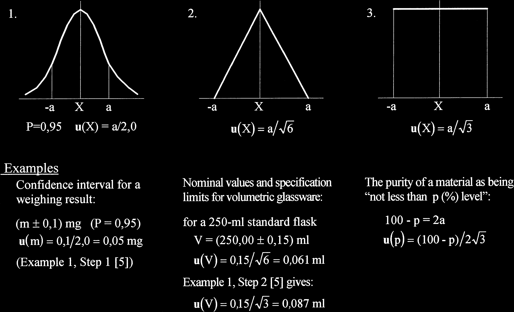
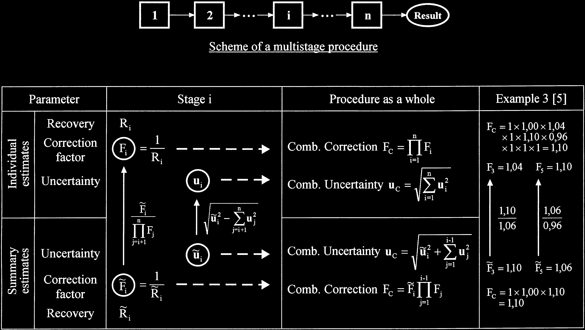

<!-- 方針: 全訳＋必要に応じた補足。原文（5頁のPractitioner's Report）の構成・節立てに沿って忠実に訳す。数式・図はFig.1〜3をPyMuPDFで抽出し本文に埋め込んだ（本文PDFのテキスト抽出では数式記号(√, ±など)が文字化けしていたため、抽出画像の表記に基づき正確な式を復元した）。 -->

## 書誌情報

- 標題（原題）: Evaluating uncertainty in analytical measurements: the pursuit of correctness
- 著者・所属: Rouvim Kadis（R. L. Kadis）／D. I. メンデレーエフ計量学研究所（VNIIM）, 19 Moskovsky pr., 198005 St. Petersburg, ロシア
- 掲載誌・巻号・DOI: *Accreditation and Quality Assurance* 3 (1998) 237–241, Springer-Verlag. DOI: [10.1007/s007690050233](https://doi.org/10.1007/s007690050233)
- インパクトファクター: 1.0（*Accreditation and Quality Assurance*, JCR 2024 / Clarivate, 2025年6月公表）
- 受理経過 / 発表: 受領 1998年1月29日 / 受理 1998年2月10日。第2回EURACHEM測定不確かさワークショップ（ベルリン, 1997年9月29〜30日）にて発表（Practitioner's Report区分：「品質保証・妥当性確認・認定における経験の報告とノート」）。

> 補足（訳者注）: 本論文は、同著者 Rouvim Kadis の博士論文 *Evaluation of measurement uncertainty in analytical chemistry*（University of Tartu, 2008）にも "Publication I" として再録されている（原文とは独立に、本論文単体として本ページで解説する）。

## 要旨（Abstract）

不確かさの評価は、原理としては単純であるが、特に化学分析においては日常的な作業ではなく、正しく行うには細心の注意が要る。このことは特に、この主題に関する最も重要な文書である EURACHEM Guide、*Quantifying Uncertainty in Analytical Measurement*（1995）を検討することで見えてくる。この検討により、著者の見解では、Guide中のワークド・イグザンプル（worked examples）に示された不確かさ推定プロセスの主要な細部のいくつかに、正しさの不足があることが明らかになる。そこで著者は、不確かさを推定する際の「正しさを追求する（in pursuit of correctness）」ルールをいくつか定式化した。これらのルールと、それに付随する解説は、次の項目に関するものである：(1) Type B評価における不確かさの適切な分布関数の選択、(2) 合成不確かさへの個々の寄与を別個に考慮する必要性、(3) 不確かさ推定プロセスにおいて実際の影響要因を考慮に入れること。さらに、内部的な整合性のみが求められる比較試験との関連で、条件付き不確かさ対全体的な不確かさの推定という問題にも触れる。

キーワード: 化学分析 ／ 測定不確かさ ／ 推定プロセス

## 1. 序論（Introduction）

物理量の測定の特性づけに一般に用いられる「測定不確かさ」という用語は、これまで化学分析の要求に適応させるのがやや難しかった。しかし、この概念を（物質量・分析・化学の）測定というこの分野に導入することは、きわめて自然なことである。このテーマについて発表された多数の論文\[1–4\]は、分析データの品質という文脈における不確かさの利用と評価に関する重要な論点を検討してきた。しかし本論文は、不確かさ推定値そのものの品質を左右する事柄に焦点を当てる。

分析実務における測定不確かさの概念の実装は現在、主要な論点についてはコンセンサスが得られているものの、なお修正を要するいくつかの細部が「固定」されたとはみなせない、独特な建築物の設計段階にたとえることができる。分析測定における不確かさを評価する手続きについても、それがEURACHEM Guide \[5\]で示される形では、同じことが言える。この文書は、分析化学の問題に適用される不確かさ概念の発展に対する、疑いなく最も重要な貢献である。しかし、この文書のワークド・イグザンプル\[5, Appendix A\]に示された不確かさ推定プロセスにおける実務上の指示のいくつかは、完全に正しいとは思われず、コメントを要する。これは、この主題についてのある種の単純化しすぎた、あるいは不正確な洞察によるものであり、非現実的な推定をもたらしうる。推定値の「誤差」がどの程度であるかにかかわらず、これらの論点はGuideの教育的な意義に鑑みて原理的に重要である。したがって、不確かさの推定値ができる限り正しいものになるように、いくつかの（十分に自明な）ルールを定式化するために、これらの「些細な点」に注意を向ける価値がある。以下に、これらの「正しさを追求する」ルールを、Guideの該当する例への言及とともに示す。

## 2. 不確かさを推定するための「正しさを追求する」3つのルール

### Rule 1: 適切な分布関数の選択

**Rule 1**: 適切な分布関数の選択（Type Bによる不確かさの評価において）は、問題となる量に関して利用可能なすべての情報に基づいて行うべきである。

標準不確かさの推定は、問題となる量Xの値が存在すると期待される上限 a+ と下限 a− という限界値から行われることが多い（この範囲 a+ − a− は、Xの最良推定値に対して対称であることが多く、その場合の半値幅は a=(a+ − a−)/2 となる）。測定データの評価という実務では、（客観的な知識や個人の判断に基づいて）最大限界を設定することが、実際にできることのすべてである場合が多い。上記の値aを、想定する確率分布の種類に応じた適切な換算係数で割ればよいだけである。ここで重要なのは、利用可能な関連情報をすべて用いることである。

> 補足（訳者注）: この段落は、PDFからのテキスト抽出時に上下限を表す記号（a+, a−等）が正しく認識されず文字化けしていたため、直後のFig. 1（下記に抽出画像を掲載）の表記と文脈から意味を復元して訳出した。

何が分かっているかという観点から、典型的な3つのケースは次のとおりである（Fig. 1参照）：

1. 明示された信頼水準をもつ、（統計的に）推定された信頼区間
2. 期待値と、それを中心として設定された最大限界
3. 最大限界のみ

特に断りがない限り、ケース1では区間の算出に正規（ガウス）分布が用いられたと考えるのが自然であり、その分布の適切な分位点を用いて標準不確かさを回復できる（信頼水準95%に対して分位点は2.0とする）。対照的に、ケース3では問題となる量についての情報が極めて乏しく、対称な一様（矩形）分布でモデル化する以外にない。このとき対象量の期待値は範囲の中点となり、換算係数は√3に等しい。ケース2は、期待値のような追加情報があるために、この値付近の値のほうが限界値付近の値よりも生起しやすいとみなせる場合に生じる。この状況はケース3とは異なる。まさにこのため、計測における不確かさの表現の指針（ISO Guide to the Expression of Uncertainty in Measurement）\[6\]のF.2.3.3項は、このような場合には、正規分布と矩形分布という2つの極端の間の妥協案として三角分布を採用することを推奨している。この場合の換算係数は√6に等しく、得られる標準不確かさは、矩形分布モデルを用いた場合に比べて約30％小さくなる。ケース2からケース3に移るにつれて不確かさが増大していくことは、ある意味で、限界値の間での対象量の値の分布について私たちが無知であることへの「代償」であるといえる。

Fig. 1の原図には、それぞれのケースに対応する具体例と数値が付されている。それらを表にまとめる。

| ケース | 分布 | 換算係数 | 具体例 | 計算 | u(X) |
|---|---|---|---|---|---|
| 1. 推定信頼区間 | 正規（ガウス） | 2.0（P=95%） | 秤量結果 (m ± 0.1) mg（P=0.95）（Guide 例1・Step1） | u(m) = 0.1 / 2.0 | 0.05 mg |
| 2. 期待値＋最大限界 | 三角 | √6 | 250 mLメスフラスコの公称値と規格限界 V=(250.00 ± 0.15) mL | u(V) = 0.15 / √6 | 0.061 mL |
| 2（Guideの実際の計算, 誤り） | 矩形 | √3 | 同上（Guide 例1・Step2の計算） | u(V) = 0.15 / √3 | 0.087 mL |
| 3. 最大限界のみ | 矩形 | √3 | 材料純度「p（%）以上」, 100 − p = 2a | u(p) = (100 − p) / (2√3) | — |

EURACHEM Guideの例において矩形分布が用いられているすべての事例は、実はケース3ではなくケース2に該当することを認識すべきである。とりわけ、体積計に関する不確かさの評価がそうである。すなわち、公称容量とはまさに期待値そのものだからである。したがって、換算係数√3を適用して算出された標準不確かさはすべて、過大評価になっていると考えられる（前表のとおり、正しい三角分布によるu(V)=0.061 mLに対し、Guideの矩形分布による計算はu(V)=0.087 mLとなっている）。このアプローチはベイズの「無差別の原理（principle of equal ignorance）」に基づくものであり、計量学における不確かさ推定では一般的な実務であるが、測定誤差を最大限界の形で規定するすべてのケースについて正しいとみなすことはできない。単純で普遍的な図式ではあるが、これは常識と衝突する。矩形分布を仮定してよいのは、対象量の取り得る値について限界値以外に何も分かっていない場合に限られる。例えば、ある材料の純度に関する不確かさが「p（%）水準以上」として表される場合は、そうした一例となりうる。というのも、この場合、純度の期待値（あるいは公称値）自体が分かっていないからである。モデル分布の適用に関する他の例もFig. 1に示されている。

### Rule 2: 不確かさ成分の独立性

**Rule 2**: 合成不確かさへの寄与としては、不確かさの各成分をできる限り独立したものとして考慮する必要がある。

しかしワークド・イグザンプルには、合成される成分の一方が実際にはもう一方を包含してしまい、その結果「二重計上（double counting）」、すなわち不確かさ推定における冗長性が生じている状況がある。体積測定における不確かさの評価は、この典型的な例である。

ここでは、次の3つの寄与が不確かさにとって本質的であると考えられている：

- A. 当該種類のガラス器具についての規格限界
- B. 標線までの充填の繰返し性
- C. 周囲温度の影響

規定された容量公差をもつ標準体積計はいたるところで用いられている。しかし重要なのは、公差、すなわち体積誤差の限界が、標準条件下でその種類の体積計を各回使用する際について、単一かつ十分な誤差特性である、という点である（ISO規格\[7, 8\]を参照）。言い換えれば、実際の容量と公称容量との差は、器具（例えばメスフラスコ）を標線まで満たす各回について、この限界内に収まっていなければならない。したがって、公差が用いられている場合、充填のばらつきを別個の不確かさ成分として考慮することは余分（superfluous）である。もちろん、水による充填の繰返し性に関するデータが利用可能であれば、それを考慮に入れてもよい。しかし、繰返し性実験を行った結果として、実際には器具が個別に校正されたことになり、公称容量をその推定値で置き換えることができ、これによって規定公差を適用する必要性が直ちに解消される。このような場合には不確かさへの寄与は2つだけとなり、最終的な解析では大幅に低減された不確かさの値が得られる。検討したこれらのケースをFig. 2に模式的に示す。

（測定対象の液体の性質（粘度、表面張力など）が水のそれと大きく異なる場合、例えば非水溶液の場合には、不確かさへの追加の寄与が生じうることに注意が必要である。これらの影響は、適切な校正液を用いた個別校正によって考慮される。）

![図2. 体積測定における不確かさの評価。合成不確かさucへの寄与：(1) ガラス器具の規格限界、(2) 標線までの充填のばらつき、(3) 周囲温度の影響。左「一般的なケース[5]」では成分1・2・3すべてが独立にucへ寄与する。中央「標準体積計」では成分1（規格限界）が成分2（充填の繰返し性）を包含（二重計上）しつつucへ寄与する。右「個別校正された体積計」では成分1が不要になり、成分2・3のみがucへ寄与し、結果としてucが縮小する。](assets/kadis-1998-uncertainty-pursuit-of-correctness/fig2.png)

次に、別の状況として、Guideの「パンにおける有機リン系農薬の定量」（例3）を検討しよう。これは均質化に始まりGC定量で終わる、いくつかの逐次的な段階からなる多段階の手続きである。手続き全体についての合成補正係数Fcと合成不確かさucは、各段階iに関する個々の値、すなわち補正係数Fiと不確かさuiから、次のように導かれる：

$$F_C = \prod_{i=1}^{n} F_i \tag{合成補正}$$

$$u_C = \sqrt{\sum_{i=1}^{n} u_i^2} \tag{合成不確かさ}$$

（これらの値は回収率実験から知られている場合がある。Riを回収率とすると、Fi = 1/Riとなる。）このプロトコルは、これらの計算がすべて正しいことを示しているように見える。しかし、これが成り立つのは、上式の各成分が強く独立している場合に限られる。実際にはそうではない。例えば抽出段階では、補正係数F3にはそれ以降のすべての段階で実験的に得られた系統的な影響がすでに含まれており、不確かさu3にもそれ以降のすべての不確かさが組み込まれている。洗浄済み抽出液の濃縮段階の値F5、u5についても同様である。したがって、実際にはこれらの段階については、個々の推定値ではなく要約された推定値（summary estimates）を得ていることになる。このような段階について個々の補正係数Fiを得るには、要約値F̃iを、それ以降のすべての段階に関する補正係数（の積）で割らなければならない（例3で利用可能なデータはこれを可能にする）。そうすれば、手続き全体についての合成係数を計算できる。

個々の補正係数を求めることなく、合成補正の計算を行うことも可能である。それには、係数の積の中で最初に現れる要約係数F̃i（例3ではF3がこれに当たる）で止めればよい。これにより、多段階の手続きは、合成値に対して独立な寄与をする要素へと分解される。Fig. 3は、この2通りの計算方法を示している。要約推定値から個々の推定値を求める操作は上向きの矢印で、（積として）合成補正を求める操作は横向きの矢印で示されている（合成不確かさを計算する対応する手順も表に含まれている）。表の右側の列には、例3に関連する実際の計算が示されている。

Fig. 3の関係式は次のとおりである：

**個々の推定値（表の上段）**

$$F_i = \frac{1}{R_i}$$

$$F_C = \prod_{i=1}^{n} F_i \qquad u_C = \sqrt{\sum_{i=1}^{n} u_i^2}$$

段階iの個々の値を要約値から求める場合：

$$F_i = \frac{\widetilde{F}_i}{\displaystyle\prod_{j=i+1}^{n} F_j} \qquad u_i = \sqrt{\widetilde{u}_i^2 - \sum_{j=i+1}^{n} u_j^2}$$

**要約推定値（表の下段）**

$$\widetilde{F}_i = \frac{1}{\widetilde{R}_i}$$

$$F_C = \widetilde{F}_i \prod_{j=1}^{i-1} F_j \qquad u_C = \sqrt{\widetilde{u}_i^2 + \sum_{j=1}^{i-1} u_j^2}$$

Fig. 3が示す例3の数値は次のとおり（原図の「Example 3 [5]」列）：

| 項目 | 値 |
|---|---|
| 個々の補正係数の積（9段階）Fc | 1×1.00×1.04×1×1.10×0.96×1×1×1 = 1.10 |
| 個々の推定値 F3 | 1.04 |
| 個々の推定値 F5 | 1.10 |
| 要約推定値 F̃3 | 1.10 |
| 要約推定値 F̃5 | 1.06 |
| 最初の要約係数（F̃3）で止めた場合のFc | 1×1.00×1.10 = 1.10 |

（表中「1.10/1.06」「1.06/0.96」は、要約値F̃iから個々の値Fiを求める際の除算過程を示す原図中の注記であり、上の関係式 Fi=F̃i/∏Fj に対応する。原図の詳細な数値対応は画像（Fig. 3）を参照。）

いずれの経路で計算しても、手続き全体の合成補正係数はFc=1.10で一致することが示されている。すなわち、9段階すべてについて個々の補正係数を求めて掛け合わせても、あるいは最初の要約係数F̃3（＝それ以降の段階をひとまとめにした値）に、それより前の段階の個々の係数（F1=1, F2=1.00）を掛けても、同じ結果になる。

### Rule 3: 実際に効いている影響要因のみを考慮する

**Rule 3**: 不確かさを推定する際には、当該手続きの文脈で測定結果に実際に影響を及ぼす影響要因のみを考慮すべきである。

再びGuideの例3を参照しよう。GC測定に関連する不確かさの評価は、ここでは（Table A3.6 \[5\]）、異なる機器・オペレーター（および時間）にわたるGCのばらつきについての広範な調査に基づいている。しかし、これらの要因の変動範囲が広いにもかかわらず、こうして得られた不確かさ推定値の有用性には疑問がある。実際、GC定量の条件は通常、試料と標準の両方の応答が同一の機器で、同一のアナリストによって、短期間のうちに記録されるようなものである。このため、これらの影響要因は分析結果においておおむね相殺される。したがって、これらの要因を考慮すること（GC定量段階と検量線作成段階のそれぞれについて別個にばらつきを推定すること）は、当該手続きの文脈における誤解に基づいていると思われる。

同じ例における秤量に関連する不確かさの評価についても触れておくべきである。この場合に考慮される不確かさへの2つの寄与は、「繰返し性実験」の標準偏差（0.03 g）と、長期データの平均値の標準偏差（0.008 g）である。この2成分を合成すると、値0.031 gが得られる。

まず注意すべきは、求めようとする不確かさの推定において、長期的なばらつきの尺度として「平均値の標準偏差」を用いるのは正しくない、という点である。もし利用可能なデータが、この例のような11か月分ではなく、例えば22か月分であったなら、この考え方に従うと長期的な寄与は約√2倍小さくなってしまうことになる。利用可能な月次点検分銅データ（Table A3.1(3) \[5\]）は標準偏差0.026 gを与え、この値だけが単回の秤量の長期的ばらつきを特徴づける。一方、Table A3.1(1) \[5\] は、秤量の精度を詳しく検討するのに非常に有用でありうる、反復秤量／読み取りの繰返しの結果を示している。標準的な方式\[9\]に従って一元配置分散分析（one-way ANOVA）を適用すると、秤量の総変動の各成分を分離して推定できる。というのも、上で述べた標準偏差0.03 gは、明らかにデータを分離せずに1つの大きな標本として扱って得られたものだからである。こうして、読み取りの繰返しの標準偏差は0.020 g（自由度f=36）であることが分かる。F検定により、月次の長期標準偏差0.026 g（f=10）は、有意水準10%においてもこの推定値と有意差がないことが容易に示せる。ここから、時間はまったく要因になっておらず、長期的なばらつきによる寄与を考慮する必要はないことが分かる。さらに解析を進めると、単回の秤量について、秤量の繰返しの標準偏差はおよそ0.05 g（f=11）であることが分かる。この推定値は、読み取りの繰返しの標準偏差0.020 gよりも有意に大きく（F検定）、したがって、実験室での秤量には何らかの追加的な変動要因が存在することになる。その原因が何であれ、合成標準不確かさに対する秤量の実際の寄与として採用すべきなのは、この0.05 gという値である。

| 推定値 | 標準偏差 | 自由度 f | 位置づけ |
|---|---|---|---|
| 繰返し性実験（Guideが単純合成に用いた値） | 0.03 g | — | 実際にはデータを分離せず1標本として扱って得た値（分離が必要） |
| 長期データ平均の標準偏差（Guideの合成に用いた値） | 0.008 g | — | 長期ばらつきの尺度として不適切（データ期間に依存して変動） |
| Guideの単純合成（0.03gと0.008gの合成） | 0.031 g | — | 過大評価/不適切な合成 |
| 月次点検分銅データの標準偏差（長期ばらつきの正しい尺度） | 0.026 g | 10 | F検定で読取り繰返しSDと有意差なし→時間は要因でない |
| 読み取りの繰返しの標準偏差（ANOVA分解） | 0.020 g | 36 | 長期SDと有意差なし |
| 秤量の繰返しの標準偏差（ANOVA分解, 正しい寄与） | 0.05 g | 11 | 読取り繰返しSDより有意に大（追加変動要因あり）→これを採用すべき |

## 3. もう一つの所見

不確かさの評価に関して最も重要な点の一つは、関連するすべての誤差要因を考慮に入れ、対応する寄与を合成すべきであるという点である。こうして得られる推定値は、当該分析手続きに内在する全体的な不確かさ（overall uncertainty）を定量化するものである。分析結果の意味のある報告と解釈に加えて、この全体的な不確かさは、例えば標準物質を用いる品質管理の目的にも適用できる。

しかし分析実務には、全体的な不確かさの推定がその扱いに不向きであり、したがって不要であるように思われるケースも数多く存在する。例えば、BS 6478に基づき、カドミウム放出に関して2つのセラミック器具を比較しなければならないとしよう（Guideの例2を参照）。この実験は、同一の浸出用溶液を満たした被験容器を、同一の期間、同一の温度（いずれも合理的な精度で測定される）で静置し、得られた2つの抽出溶液を、同一の挟み込み参照溶液（bracketing reference solutions）を用いたAASで分析する、という形で行われる。問題は、2つの試料がこの試験に関して互いに異なるかどうか、統計の言葉で言えば、2つの測定結果の差が、それら自身のばらつきを背景として有意であるかどうか、である。

ベイズ理論に基づく整合性判定基準（conformity criteria）、および通常の統計に基づく判定基準の両方を、2つの測定結果の比較という問題（それぞれの不確かさを考慮に入れる）に適用できる\[10\]。これは、例2で算出されたような全体的な不確かさが、この比較実験について問題を正しく解くには不適切であるという事実にかかわらず成り立つ。全体的な不確かさは、この目的には「過剰」なのである。明らかに、実際の実験条件が公称条件からずれることに起因する誤差成分の多くは、比較対象の2つの結果について共通であり、対応する寄与は差の不確かさの算定において消える。したがって、結果の絶対的な真度（trueness）ではなく内部的な整合性のみが問題である場合には、そのような比較試験の範囲内で変動しない影響量は無視してよく、全体的な不確かさは、その特定の条件に適した不確かさへと縮小される。これを条件付き不確かさ（conditional uncertainty）と呼ぶ。

このようなアプローチの可能性は、（不確かさを扱う「トップダウン」法に関してではあるが）\[1\]においてすでに指摘されている。「条件付き不確かさ」あるいはそれに類する用語は、分析データの取扱いにおいて今後普及していくと考えられる。というのも、分析ラボにおける日常業務の相当部分は、そのような結果の内部的な整合性のみを必要とするからである。これは、不確かさが過大になりすぎる場合にそれを小さくするための「抜け道」とみなすべきではない。むしろ、目的適合性の原則（fitness-for-purpose principle）を適用する一事例として捉えるべきである。目的適合性という考え方は、測定プロセス自体が生み出すデータと同様、不確かさの推定値にも明らかに十分適用可能である。

最後に、ISO Guide \[6\]の非常に的を射た、かつ深みのある一節（item 3.4.6。この一節はEURACHEM文書にも item 5.4.16 としてそのまま引き継がれている）を引用しておくのが適切だろう：

> 「不確かさの評価は、決まりきった作業でも、単なる数学的な作業でもない。それは、測定対象量（measurand）の性質、および用いられる測定方法と手続きについての詳細な知識に依存する。したがって、測定結果に付されて示される不確かさの質と有用性は、最終的には、その値の決定に寄与する人々の理解、批判的分析、および誠実さにかかっている。」

## 参考文献

1. Analytical Methods Committee, RSC (1995) Analyst 120:2303–2308
2. Cortez L (1995) Microchim Acta 119:323–328
3. Williams A (1996) Accred Qual Assur 1:14–17
4. Wegscheider W, Zeiler H-J, Heindl R, Mosser J (1997) Ann Chim 87:273–283
5. EURACHEM (1995) Quantifying Uncertainty in Analytical Measurement
6. ISO, IEC, OIML, BIPM (1992) Guide to the Expression of Uncertainty in Measurement, 1st edn. ISO（IFCC・IUPAC・IUPAPを含む7機関共同名義の1993年版も入手可能）
7. ISO 384 (1979) Laboratory glassware. Principles of design and construction of volumetric glassware
8. ISO 4787 (1984) Laboratory glassware. Volumetric glassware. Methods for use and testing of capacity
9. Doerffel K (1990) Statistik in der analytischen Chemie, 5th edn, chap 8. Deutscher Verlag für Grundstoffindustrie, Leipzig
10. Weise K, Wöger W (1994) Meas Sci Technol 5:879–882

## 訳者補足

- 本論文は5頁の短い"Practitioner's Report"（実務者からの報告）であり、実験データを伴う原著論文ではなく、EURACHEM Guide（1995年版）の付属書A記載のワークド・イグザンプルに対する方法論的な批評・注釈という性格が強い。原文にある数式・数値・図（Fig.1〜3の内容）は本ページ上でもれなく再現した。
- 本論文で検証対象となっているEURACHEM Guide "Quantifying Uncertainty in Analytical Measurement" は初版が1995年（本論文の3年後に改訂第2版が2000年に出版された）。本論文はこの初版の付属書A（Appendix A）の3つの例（例1: 秤量・体積計、例2: セラミック製品からのカドミウム溶出試験、例3: パン中の有機リン系農薬定量）を具体的に検証している。
- Rule 1〜3はいずれも、GUM（ISO Guide to the Expression of Uncertainty in Measurement, 1993/1995）の枠組み自体を否定するものではなく、その枠組みの「適用の仕方」における誤りやすい点（分布関数の選び方、成分の独立性の確認、影響要因の取捨選択）を指摘するものである。今日の分析化学における不確かさ評価（例えばEURACHEM/CITAC Guide CG4の最新版やボトムアップ法とトップダウン法の使い分けの議論）でも、これらの注意点は基本的な考え方として引き継がれている。
- 原文Fig.1〜3の図はモノクロの線画（白線／黒背景）としてPDFに埋め込まれており、1997年のEURACHEMワークショップ発表用スライド（OHPないしプレゼンテーション資料）に由来すると推測される。抽出画像はPDF埋め込み画像をそのまま複製したものであり、加工・着色は行っていない。
