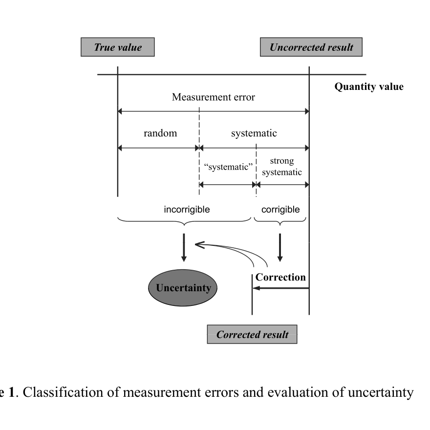
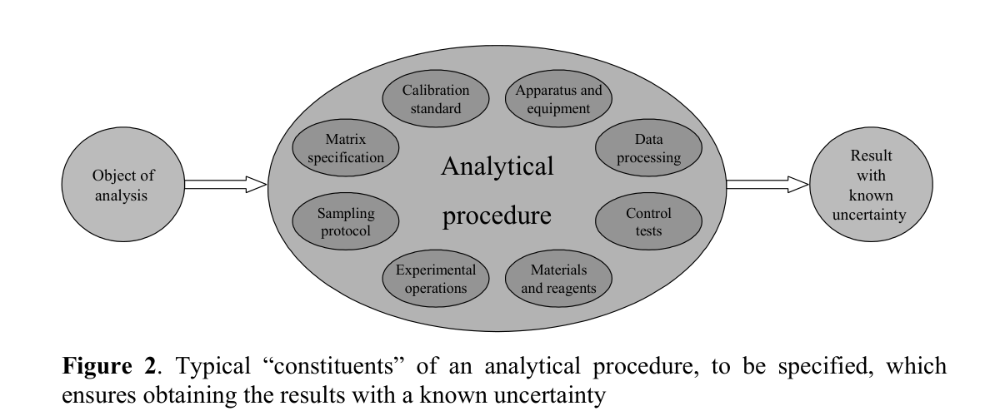
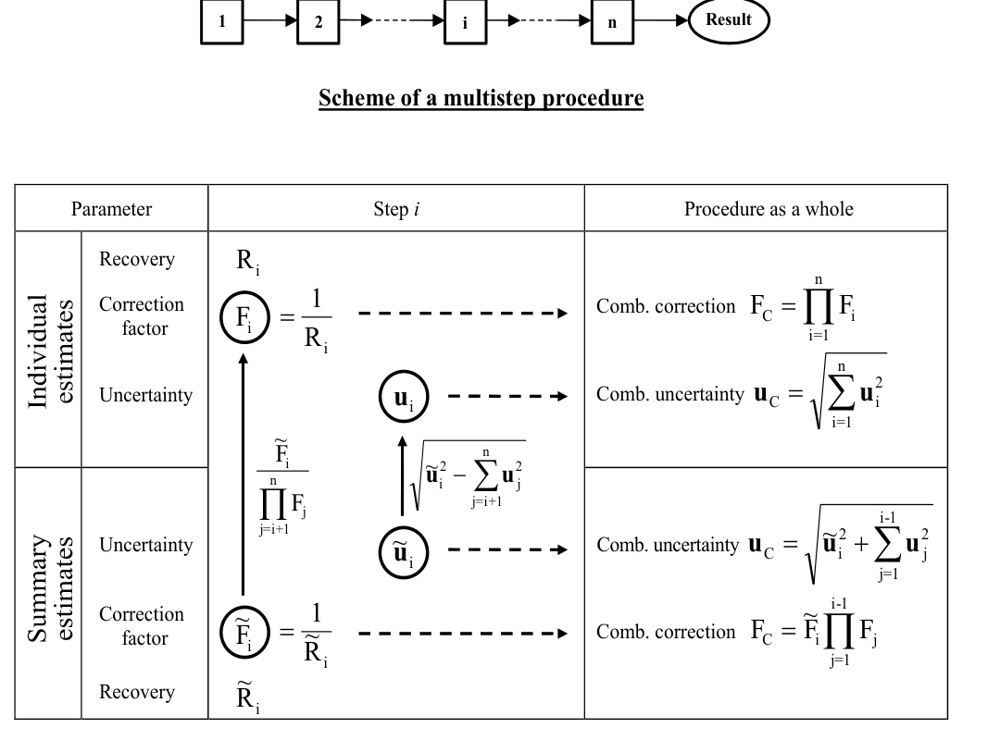
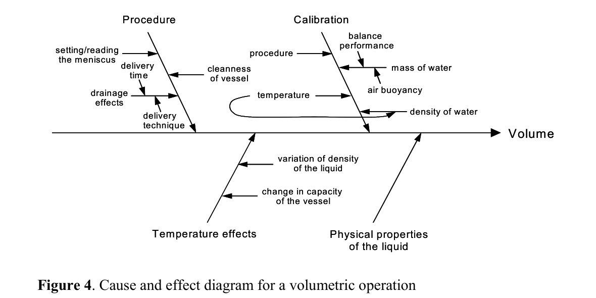
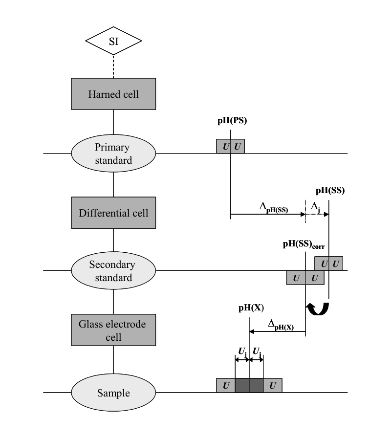

<!-- 方針: 全訳＋必要に応じた補足。原文の節番号（例: 2.1.1.1）は原文に忠実に維持して訳出する。式番号は原文準拠。「> 補足:」は訳者注。 -->

## 書誌情報

- 標題（原題）: Evaluation of measurement uncertainty in analytical chemistry: related concepts and some points of misinterpretation
- 著者: Rouvim Kadis（ロウヴィム・カディス）
- 所属: Institute of Chemistry, Faculty of Science and Technology, University of Tartu, Estonia（エストニア・タルトゥ大学 化学研究所）
- 種別: 博士学位論文（Dissertationes Chimicae Universitatis Tartuensis 79）。2008年6月11日、タルトゥ大学化学研究所博士委員会により学位授与を承認。公開審査（commencement）は2008年9月15日。
- 指導教員（Supervisor）: Ivo Leito教授（タルトゥ大学化学研究所）
- 審査担当（Opponent）: Ewa Bulska教授（ワルシャワ大学化学部）
- 出版: Tartu Ülikooli Kirjastus（タルトゥ大学出版局）, 2008
- ISSN 1406–0299 / ISBN 978–9949–11–904–2（印刷版） / **ISBN 978–9949–11–905–9（PDF版）**
- インパクトファクター: 該当なし（学術誌論文ではなく博士学位論文であるため）。本論文が土台とする原著論文6編の掲載誌は Accreditation and Quality Assurance、Analytical and Bioanalytical Chemistry、Talanta、Analyst、Journal of Analytical Chemistry（いずれも1998〜2008年発表）。
- DOI: なし（大学リポジトリ発行の学位論文のためDOI未付与。本文中の「原文リンク」欄には University of Tartu の出版物としての書誌情報を示す）

> 補足（訳者）: 本論文は、著者が1998〜2008年に発表した6編の原著論文（Publication I〜VI、下記「原著論文一覧」参照）を土台として、それらの内容を「測定不確かさと関連概念」というテーマで統合・敷衍した統合的博士論文（synthesis-type dissertation、いわゆる論文博士的な「総説＋原著再録」形式）である。本文（1章〜7章、9〜49頁）がKadis自身による統合的議論であり、巻末（51〜103頁）に原著論文I〜VIが版元の許諾を得て全文再録されている。**本文2〜3章の内容は、再録された原著論文の要旨・統合であるため、本ページでは本文（1〜4章、5章参考文献、6章まとめ）を全訳し、巻末再録の原著論文I〜VI自体は二重全訳を避けて「原文参照」とする**（既に本文中で当該論文の要点・数値が明示的に紹介されている箇所はその都度訳出した）。なお、**Publication I**（R. Kadis, "Evaluating uncertainty in analytical measurements: the pursuit of correctness," Accreditation and Quality Assurance, 1998, 3(6), 237–241）は、本サイトでは同著者の1998年論文 `Evaluating_uncertainty_in_analytical_mea.pdf` として別途単独の解説ページ化も進めている（本セッションと並行作業のためスラッグ未確定）。

## 原著論文一覧（List of Original Publications）

本論文は以下のローマ数字で参照される原著論文を土台とする。

| # | 著者・書誌 |
|---|---|
| I | R. Kadis. *Evaluating uncertainty in analytical measurements: the pursuit of correctness.* Accreditation and Quality Assurance. 1998, 3(6), 237–241.（再録: *Measurement Uncertainty in Chemical Analysis*, P. De Bièvre, H. Günzler (Eds), Springer, 2003, pp. 147–151） |
| II | R. Kadis. *Analytical procedure in terms of measurement (quality) assurance.* Accreditation and Quality Assurance. 2002, 7(7), 294–298.（再録2件: 同上De Bièvre/Günzler編2003, pp. 1–7／*Validation in Chemical Measurement*, De Bièvre and Günzler (Eds), Springer, 2005, pp. 148–152） |
| III | R. Kadis. *Secondary pH standards and their uncertainty in the context of the problem of two pH scales.* Analytical and Bioanalytical Chemistry. 2002, 374(5), 817–823. |
| IV | R. Kadis. *Evaluation of measurement uncertainty in volumetric operations: the tolerance-based approach and the actual performance-based approach.* Talanta. 2004, 64(1), 167–173. |
| V | R. Kadis. *Do we really need to account for run bias when producing analytical results with stated uncertainty? Comment on 'Treatment of bias in estimating measurement uncertainty'.* Analyst, 2007, 132(12), 1272–1274. |
| VI | R. L. Kadis. *Measurement uncertainty and chemical analysis.* Journal of Analytical Chemistry, 2008, 63(1), 95–100. |

## 略語（Abbreviations）

- ASTM: American Society for Testing and Materials（米国試験材料協会）
- CITAC: Co-operation on International Traceability in Analytical Chemistry
- emf: electromotive force（起電力）
- GUM: Guide to the Expression of Uncertainty in Measurement（測定における不確かさの表現のガイド）
- IEC: International Electrotechnical Commission
- ISO: International Organization for Standardization
- NBS: US National Bureau of Standards（米国国立標準局、現NIST）
- RLJP: residual liquid junction potential（残留液間電位）
- QUAM: Quantifying Uncertainty in Analytical Measurement（分析測定における不確かさの定量化＝EURACHEM/CITACガイド）
- RSC: Royal Society of Chemistry
- VIM: International Vocabulary of Basic and General Terms in Metrology（国際計量計測用語集）

## 要旨（原文 6. SUMMARY の全訳）

> 補足（訳者）: 本論文は通常の学術論文にあるような冒頭のAbstractを持たず、末尾（原文47頁）に置かれた「6. SUMMARY」章が要旨に相当する。読者の便宜のため、この要旨をここに前出しする（原文での出現順どおりの訳は本文末の「5章の後」に相当する位置にも置かず、下記「6. まとめ」の節で改めて言及する）。

本論文は、分析化学における測定不確かさ評価の理論的・実践的問題を扱う。

第1部は、測定不確かさの主要な側面を、他の計量学・品質概念——とりわけ古典的測定アプローチの中心にある精確さ（accuracy）と誤差（error）——との関係において論じる。測定誤差を偶然誤差と系統誤差に区分することを詳細に検討し、分析測定において特に重要となる「系統的」誤差という概念を強調する。共通の分析概念に品質の側面を統合することを、提案する「分析手順」の定義を通じて示す。分析化学における不確かさ評価の推奨アプローチを比較し、合理的な戦略を定式化する。

第2部は、分析的不確かさの評価における誤解釈のいくつかの論点を分析し、これまで適切に扱われてこなかった問題に対する正しい解決策を提示する。取り上げる論点は次の通りである: 多段階分析手順における不確かさの定量化と補正係数、体積測定操作における不確かさの評価、pH測定標準の評価における液間電位寄与の考慮、そして日常的な分析定量におけるrun biasの扱い。後の2つの論点は、分析測定において依然として複雑な問題であり続けている「バイアスの扱い」という論点群の具体例にあたる。

本論文には、到達した結論、参考文献、および6編の原著論文が含まれる。

> 補足（訳者）: 原文には続けて「7. SUMMARY IN ESTONIAN」としてエストニア語による同内容の要旨が置かれているが、内容は上記日本語要旨と同一であるため本ページでは割愛する。また要旨末尾に「ACKNOWLEDGEMENTS（謝辞）」として、指導教員Ivo Leito教授、理学技術学部長Peeter Burk教授、Archimedes財団およびエストニア教育研究省（博士研究奨学金）、著者の家族（Anna, Leo）、サンクトペテルブルクのD. I. Mendeleyev計量学研究所の同僚（Leonid Konopelko所長、Gennady Nezhikhovsky、Olga Tudorovskaya、Olga Efremova各氏）、旧友のIlya Ioffe氏・Irina Ziskind氏への謝辞が述べられている。

## 1. 序論（Introduction）

この10年間で、測定不確かさという概念は分析品質の領域における重要な新しいパラダイムとなり、分析結果の精確さを表す単一の尺度を提供するようになった。一般に測定は、とりわけ分析測定は、その不確かさを知らなければ正しく解釈することができない。これに対応して、産出された結果の不確かさを評価するという要求事項は、分析試験所の品質システムを定めるISO/IEC 17025規格[1]、および医療用試験所に特化したISO 15189規格[2]に盛り込まれている。測定不確かさの評価は、国際的な方針[3]に沿って認定機関に奨励されることで、分析試験所——とりわけ認定試験所——において一般的な実務になりつつある。基礎となるISOガイド[4]、その分析化学版であるEURACHEM/CITACガイド[5]から、直近のEUROLAB報告書[11]に至るまで、複数のガイダンス文書[4–11]が公表されており、幅広い分析用途で不確かさをどう推定するかについて有用な指針と実例を提供している。少数の批判的レビュー[12, 13]は、評価プロセスへの異なるアプローチ（「ボトムアップ」と「トップダウン」）に主眼を置き、それぞれの長所・短所を論じている。化学分析における測定不確かさ推定の問題は、EURACHEMが主催した複数の国際ワークショップ[例えば14, 15]、および世界各地の他機関によるセミナー・講習会の中心的話題であり続けてきた。また関連する問題群を幅広く扱う書籍[16, 17]も出版されており、その最初のもの[16]は完全に学術誌論文を集めたものである。

分析実務への測定不確かさ方法論の導入に注がれてきた多大な努力にもかかわらず、なおその実践的な適用にはいくつかの問題が影を落としている。分析的不確かさはしばしば適切に推定されておらず、その結果、同一の分析手順について異なる試験所が算出した不確かさの値には広いばらつきが生じることが、あるサーベイ[18]から明らかになっている。分析結果が規格適合性/不適合性の検証に用いられる規制分野では、示された不確かさの推定値がしばしば無効であることが判明するため、不確かさの言明の信頼性という問題が急務となっている[19]。これは分析データ品質の指標としての測定不確かさの有用性を著しく損なう。分析化学者の中には、分析化学における不確かさ概念の適用可能性に懐疑的、あるいは敵対的とすらいえる姿勢を示す者もいる[20–23]。

以上の問題のうち、分析・計量学コミュニティで依然議論が続く不確かさ方法論に内在する困難[12, 24]に帰せられる部分はごく一部に過ぎず、むしろ計量学的概念に対する根本的理解の欠如、および不確かさ推定手順の実務上の標準化における困難の帰結である。このことは、化学分析における不確かさ推定のいくつかの誤解釈の点として表面化する。例えば、不確かさへ個別の寄与をなしていない要因を独立した成分として扱うといった不確かさ源の不適切な同定、あるいは持続的なバイアスを無視する一方でrun biasを補正するといった分析バイアスの不適切な扱いなどである。

計量学一般、そしてとりわけ測定不確かさやトレーサビリティといった論点は、大半の分析化学者にとって新しいものであり、その多くはその価値を確信していない。EURACHEMの初代会長であり、化学に計量学的概念を導入するために多大な貢献をしたBernard King博士は、この二つのコミュニティで採られるアプローチの違いについてこう書いている。「計量学者と分析化学者との間の思考のギャップ（この両方であると自認する人はそう多くない）は、一部は誤解に、一部は用語の違いの使用に起因する」[25]。これに加えて、化学分析における品質の論点は伝統的に統計学の領域と見なされてきたため、計量学的発想と統計学的発想を区別しないことが著しい混乱を招きかねない。統計学者によって提案された、いわゆる「不確かさの操作的定義」[26]——これは推定される不確かさを単なる中間精度にまで還元することを許してしまう——は、そうした混乱の一例である。

分析化学の研究から専門的な計量学の世界へと転じた著者が本研究で追求する目的は二つある。第一は、計量学および品質保証に関わる関連概念の文脈の中に測定不確かさの概念を位置づけて提示することである。これにより、分析科学およびサービスにおける測定不確かさの本質と役割についてのより良い洞察が得られる。第二は、公表されたガイドや近年の文献に見られる分析的不確かさの評価におけるいくつかの誤解釈の点を明らかにし、これまで適切に扱われてこなかった分析上の問題に対する正しい解決策を提示することである。より一般的な文脈では、著者が追求する目的は、計量学者と分析化学者の間の「文化的ギャップを架橋する」ことの一助となることである。というのも、両文化に受け入れられる化学測定における唯一の計量学が確立される必要があるからである。

## 2. 分析QAにおける測定不確かさと関連概念（Measurement Uncertainty and Related Concepts in Analytical Quality Assurance）

### 2.1 精確さ・誤差との関係における測定不確かさの概念

#### 2.1.1 定義と沿革

**2.1.1.1.** 国際計量計測用語集（VIM）の新しい第3版[27 (2.26)]における「測定不確かさ」の定義は次の通りである。

> 測定不確かさ、不確かさ 使用された情報に基づき、測定対象量に帰属される量の値のばらつきを特徴づける非負のパラメータ。

この定義は、測定対象量について利用可能な情報を不確かさの推定に際して適切に用いることの重要性を強調している。より重要なのは、この定義が、VIM第2版[28 (3.9)]の定義と同様、我々が測定において暗黙のうちに見出そうとしている知り得ない量である「真の値」に言及せず、測定結果とその評価された不確かさにのみ焦点を当てている点である。この哲学は、1993年に「測定における不確かさの表現のガイド（GUM）」[4]が登場して以来発展してきた現代の測定不確かさ方法論の中心点の一つを構成する。

一方でGUM自体は、不確かさに関する他の伝統的な概念を排除しているわけではなく、それらも「理想として」有効であると見なしている[4 (2.2.4)]。そうした概念の定義はVIM第1版[29 (3.09)]に見出せる。

> 測定の不確かさ 測定対象量の真の値が存在すると信じられる値の範囲を特徴づける推定値。

さらに古い不確かさの定義の文言は、1973年の *A Code of Practice for the Detailed Statement of Accuracy* に見られる[30]。

> 測定された量の真の値が存在すると信じられる、最終結果の周りの値の範囲。

**2.1.1.2.** すなわち、不確かさは計量学において新しい概念ではなく、伝統的には測定の誤差の起こりうる限界の推定値として解釈されてきた。長い間、不確かさの推定は測定結果の周りの信頼できる誤差限界の評価として扱われてきた。米国国立標準局(NBS)のCh. Eisenhartによる1968年の論文[31]の以下の一節は、今日でもその現実性を失っていない不確かさ推定の問題をよく言い表している。「厳密に言えば、報告された値の実際の誤差、すなわちその真からの偏差の大きさと符号は、通常知り得ない。しかしこの誤差の限界は、報告値が得られた測定プロセスの精度から、また測定プロセスの起こりうるバイアスに対する合理的な限界から——誤りである危険をいくらか伴いつつ——通常推測できる」。

しかし、不確かさ成分の推定方法、およびそれらを最終的にどう結合するかについての最良の方法には合意がなかった。伝統的な区分に沿って、「偶然不確かさ」と「系統的不確かさ」——それぞれ対応する原因から生じる——は推定過程で別々に伝播され、それらをどう結合するか（例えば線形加算か二乗和か）は数十年にわたる議論の的であった[32]。そのため1981年に公表されたあるサーベイ[33]では、偶然不確かさの計算法7種（Vertrauensgrenze des zufälligen Fehlereinteils）、系統的不確かさの計算法9種（Vertrauensgrenze des nichterfaßten systematischen Fehlereinteils）、そして結合不確かさの計算法9種（Vertrauensgrenze des Meßfehlers, Meßunsicherheit）が議論・比較されている。

標準化された不確かさ方法論は工学応用、特に流体流量測定において不可欠であったため、航空宇宙産業に関連する複数の組織によって妥協案が提案・標準化された[34]。線形加算、二乗和平方根、あるいは他の何らかの結合方法のいずれをも許容し、ただし2成分を別個にも報告し、不確かさの計算式の選択をユーザーが明示することが求められた。書籍[35, 36]は、90年代初頭までに工学問題における不確かさ方法論で得られた進展を総括している。1993年のGUMの公表は、様々な科学・技術分野での計量学的概念の広範な適用を告げる新時代の幕開けとなった。

**2.1.1.3.** 分析化学における「不確かさ」もまた新しいものではない。L. Currieは1978年にこう書いている[37, p. 128]。「化学分析の結果は、それに現実的な不確かさの推定値が伴わなければほとんど価値がない」。そしてこのとき、不確かさ成分の適切な分類が提案された。「『推定される（inferred）』成分と『見積もられる（estimated）』成分への細分は、全体の不確かさの意味について重要な情報を与える」。注目すべきは、この細分が誤差源を偶然的とみなすか系統的とみなすかにかかわらず提案されている点であり、これは現代の測定不確かさ方法論がタイプAおよびタイプBの評価される不確かさを扱う方式とほぼ同じである。

もちろん、分析領域における「不確かさ」という用語の意味は時代とともに変化してきた。当初「不確かさ」とは、分析結果を提示する際に記号「±」の後に書かれる数字を意味し、起こりうる偶然誤差を特徴づけるものであった。1930年代にASTMが発行した *Manual on Presentation of Data*[38]は、日常的な統計的基礎に基づき「不確かさの限界」を計算する規則を確立した。40〜50年代には、こうした限界の評価が分析手順の研究における一般的な実務となった[39, 40]。しかし70年代末までには、化学分析における不確かさは総測定誤差の限界を意味すると考えられるようになった。この不確かさの意味はNBSの分析化学者らの研究の中で明確化され、最終的にJ. Taylorが示した定義に表現された[41]。

> 不確かさ 真の値が存在すると推定される値の範囲。これは、偶然誤差と系統誤差の両方に起因する起こりうる不正確さの最良推定値である。

同時に、計量学と密接な関係を持たない分析化学者たちは、彼ら自身の道を歩み、同じ問題を解くために彼ら自身の用語法を用いた。偶然誤差と系統誤差の区間推定値を何らかの形で組み合わせた分析結果の許容可能性を判定する多くの基準が提案されてきた。「total error（総誤差）」[42]、「total analytical error（総分析誤差）」[43]、「maximum total error（最大総誤差）」[44]、その他（文献44を参照）が挙げられる。

#### 2.1.2 不確かさと精確さ——哲学の違い：化学者の視点

上記最後の定義は、不確かさとは単に起こりうる「不正確さ」の推定値であると述べている。この用語の肯定的な対をなす表現である「精確さ（accuracy）」は、分析化学者の間で長年にわたり一般的に用いられてきた。精確さは常に、分析手法と結果の品質を特徴づける最も重要な概念とされ、階層[45]の中で決定的な分析特性として認識されてきた。したがって、精確さと不確かさという2つの概念の相互関係の問題は検討に値する。

**2.1.2.1** VIMにおける定義[27 (2.13)]によれば、

> 測定精確さ、精確さ 測定量値と測定対象量の真の量値との一致の近さ。

精確さは定性的な概念である。しかし、それぞれ偶然誤差と系統誤差に対応する「精度（precision）」と「真度（trueness）」の観点から記述すれば定量化できる（標準化された用語法におけるこれらの用語・概念の変遷のサーベイは[46]に示されている）。この線に沿えば、精確さの2つの尺度、すなわち推定標準偏差と（バイアスの）限界が評価・報告されるべきものとなる。伝統的な測定誤差の理論が説くように[47]、これら2つの数値は、誤差成分の性質が異なるために、いかなる方法によっても厳密に結合して単一の（不）精確さの指標を与えることはできない。そして分析手法・結果の（不）精確さは、伝統的には2成分ベクトルとしてこのように評価されてきた[37, 48–50]。この方法論は、手法性能研究のためのIUPAC統一プロトコル[51]およびISO 5725規格群[52]に具現化されている。

**2.1.2.2.** VIM第3版の論拠に関する近年の論文[53]では、測定の哲学と記述に対する2つの異なるアプローチが定式化されており、そこでは「古典的アプローチ」と「不確かさアプローチ」と呼ばれている。

古典的、すなわち伝統的アプローチは、1971年に遡って論じられたように[54]、2つの公準に基づく。

- α — 測定される量には真の値が存在する。
- β — 真の値を探し当てることは不可能である。

第一の言明は、測定の必要な前提かつ目的として現れる。すなわち測定を始めるにあたり、我々は自分たちが探し求めている測定量のある値が存在するという信念から出発する。第二の言明は、我々の努力がもたらすのはあくまで近似、すなわち真の値の推定値に過ぎないということを述べる。これは測定誤差が不可避であるという事実に等しい。

一方、GUMをその最も顕著な代表とする不確かさアプローチは、真の値を知ることは不可能であり、さらに測定対象量の定義と整合する真の値の集合が存在しうる以上、得られた値が真の値にどれだけ近いかを知ることは不可能であると主張する。したがって「測定誤差」は抽象的な、実務上は無用な概念となる。実務上より重要なのは、このアプローチが、偶然と系統の両方の「効果」（ここでは「誤差」という語は用いられない）から生じる情報を対等に結合する定量的手段を提供する点であり、既知の系統効果に対する補正を行った後、それらすべてを標準偏差様の量として扱う。その結果、測定の品質を特徴づけるために、使用されたすべての情報に基づいて確率分布関数（PDF）の分散が推定される。

**2.1.2.3.** 不確かさアプローチが測定の哲学的基礎において根本的に異なる立場を含意するという事実は、研究者の注意を逃れてきたように思われる。このアプローチは実質的に（文献55参照）、「数は世界の中にある」（J.ケプラー）という言明から、実際「測定において、数は割り当てられるのではなく発見される」[56]という言明から、「数は我々自身によって自然に割り当てられる」（R.カルナップ）という言明への概念上の移行を意味し、したがって測定は決定ではなく（数の）割り当てであるとする。これは測定の一般的な概念的基礎の根本的な変化であり、真の値という概念そのものが単に無用なものとして消え去る。

真の値の実在性については長らく議論が続いてきた。すなわち、経験的にアクセス不可能であるならば「真の値」は本当に存在するのか、という問いである。つい最近も分析測定に関してこの問いが提起された[57]。「自然、あるいは我々の実験の中に、そもそも『真の値』は存在するのか？」もし存在しないのであれば、我々は「真の値」について考えるのをやめるべきではないか？

実際に（材料の化学組成の）決定を扱う分析化学者は、こうした挑戦的な考えを受け入れる用意がまずないだろう。「真の値」と言うとき、化学者は実際の正しい組成を念頭に置いている。そして化学的実体（分子、イオン）は原理的に数えることができる離散的実体であるから、正しい組成は確かに存在する。分子を数えることは、実務上も（例えば原子間力顕微鏡を用いて表面上で）ますます可能になりつつあり、真の材料組成へのアクセスを可能にしつつある。多くの場合、分析者はブランク試料に既知量の純物質を添加することによって自ら真の値を設定できる。したがって化学的な思考方式にとって真の値の実在性は疑いようがない。

**2.1.2.4.** 分析測定における新しい哲学の最も一貫した提唱者の一人であるPaul De Bièvre教授は[58]、不確かさの評価によって、「（『真の値』に結びついているがゆえに疑わしい）『精確さ』の疑わしい意味は、実用的な意味である『測定不確かさ』に置き換えられる」のであり、もはや「精確さ」や「真の値」を非生産的な概念として言及する必要はないと論じる。しかし[53]で論じられているように、不確かさアプローチにおいて実際に行われているのは、「測定対象量の『本質的に唯一の』（真の）値が、与えられた確率で存在すると考えられる」区間を確立することである。真の値の概念は、測定の目的を定式化するためには確かに必要であるが、不確かさ区間の評価そのものには直接用いられない。問題は、計算の中で用いないという理由で「真の値」を我々の意識から追放することが正当化されるかどうかである。

私見では、不確かさ評価に関して精確さという伝統的概念を放棄することは、有用でも必要でもない。古典的アプローチの哲学を、不確かさアプローチが提供する道具と実践的方法論とを組み合わせて用いることが、かなり適切であるように思われる。このようにすれば、測定不確かさは、明確な規則に従って構築される、精確さの単一数値指標として捉えることができる。

原論文IIで最初に提示された「精確さ」と「不確かさ」の関係についてのこの見解は、RSC分析法委員会が「不確かさの推定はおそらく結果の精確さを表現する最も適切な手段である」と認めたことにより裏付けを得ている[59]。

#### 2.1.3 偶然誤差・系統誤差・「系統的」誤差

測定誤差を偶然と系統に区分することは、精確さが精度と真度の観点から推定される伝統的アプローチにとって基本的である。これに対しGUMに従えば、すべての不確かさ成分は、その二乗した標準偏差を用いて偶然量として結合される。「偶然誤差と系統誤差との間の原理的な違いの否定」こそが、化学分析における不確かさ方法論の適用に反対する論者が提起する主要な異論点であった（この引用が取られた例えば文献22参照）。以下の詳細な議論は、原論文IIおよびVIに基づき、この論点を扱う。

**2.1.3.1.** かなりの程度、測定誤差をこれらいずれかの型に分類することは慣習の問題であり、分析システムをどの水準から見るかに依存する。ある水準で系統的に見える誤差は、より高い水準では偶然的になる。例えば、（ある手順による分析実施における）試験所バイアスは、多数の試験所の集合を検討対象に切り替えれば偶然誤差となる。V. Nalimovはこの点について[60]でこう書いている。「偶然誤差について語ることができるのは、測定の集合が明確に定義され限定されている場合のみである。」

そうした限定のよい例は、VIM第2版[28 (3.13)]における「偶然誤差」の定義に見られ、これは併行精度条件（同一操作者、同一装置、短時間）の下で行われる測定、すなわち一つの分析run内の条件に関係する。この戦略により、誤差の曖昧さのない分類が可能になる。他の実験条件下で推定された測定誤差の特性は、多かれ少なかれ系統誤差成分によって「汚染」されている。

**2.1.3.2.** 誤差の偶然・系統への区分が条件依存的であることは、M. Thompsonが提案した分析誤差の階層モデルから見て取れる[61]。このモデルによれば、均質な材料の分析結果における誤差は次の成分から成る。(1) 手法バイアス、(2) 試験所バイアス、(3) run bias、そして最後に (4) （併行精度条件下での）偶然誤差。この「誤差のはしご（ladder of errors）」と呼ばれるモデルは、はしごの各段階の不確かさ寄与を結合することで得られる、結果の不確かさを評価する基礎と見なされている。注目すべきは、上記に列挙された誤差成分——そして「バイアス」として現れる成分——のすべてが、その標準偏差によって特徴づけられる偶然変数として扱われている点である[61]。

**2.1.3.3.** 偶然誤差と系統誤差への区分は、既知組成の材料を所定の手順に従って分析するという、精確さの実験的推定の「技術」から生じる。こうして得られる精度と真度の指標は、分析手順の品質を特徴づける。しかし、いかなる目的であれ分析結果を利用する顧客にとって関心があるのは、結果そのものの品質である。この観点からは、結果の誤差が偶然か系統かそれとも両者を含むかは重要ではない。製品、すなわち分析結果の品質に着目することは、総誤差の特性を前面に押し出す。

**2.1.3.4.** 系統誤差とは、伝統的には「同一の量を反復測定した際に不変であるか規則的に変化する測定誤差成分」を意味する[62]。しかし、実験条件一式を精密に再現することの不可能性のために、科学者たちは長らく、系統誤差には通常、定数成分と変動成分の両方が含まれることを認識してきた。Ch. Eisenhartが論じたように[47]、単一の距離を反復測定する場合でさえ、系統的に見えるいくつかの効果は一定であるが、いくつかは（例えば日ごとに）機会ごとに変動することが予期され、系統誤差に変動成分を寄与する。化学分析では、これらの誤差成分は長らく「veränderliche (schwankende) systematische Fehler」[63]、「variable part of systematic error component」[64]、あるいは「random components of systematic error」[65]として知られてきた。重要な点は、定数（強い系統的）誤差成分は、推定されて既知になれば、結果に補正を適用することで排除できるが、変動成分は偶然量として、通常の偶然誤差寄与とともに考慮されるべきだということである。

**2.1.3.5.** これらの発想は、測定不確かさの「ランダム化」という概念へと発展した。これに従えば、伝統的に系統誤差と呼ばれていたものは、検討中の実験について起こりうる系統誤差のすべての値からなる母集団から無作為に取り出された一つの特別な値として扱われる。このようにして、対応する確率分布を仮定した、いわゆる「系統的」誤差という特異な偶然変数が導入される。統計的情報がない場合にそうした（仮想的な）分布の分散を定量化することは特別な課題である。この場合、経験と入手可能な知識に基づく主観的な推定を用いなければならない。しかしこのアプローチにより、偶然と「系統的」の両方のすべての誤差寄与を対等に扱い、結果として生じる確率分布の分散へと対応する分散として結合することが可能になる。

**2.1.3.6.** 関心の対象が、ある手順を用いて得られた（あるいは得られるであろう）分析結果の精確さであると仮定しよう。これは、与えられた装置で、与えられた分析者によって、あるいは与えられた試験所においてさえ行われた（あるいは行われるであろう）ものである必要はない。言い換えれば、我々が関心を持つのは、手順の1つの実施ではなく、手順のありうる多数の実施を用いて得られる結果の精確さを推定するという問題の文脈における系統誤差[66, 67]である。

**2.1.3.7.** このような問題設定では、それら実施のそれぞれに内在する局所的な系統誤差は、偶然変数「系統的」誤差の値として現れ、厳密な意味での偶然誤差と根本的に異ならない。違いは、それが観測された測定値の母集団と同一でない母集団の上で定義されているという点だけである。この状況は、いわゆる技術的測定（技術者によって制御工学において通常行われる）に典型的であり、そこでは結果が指定された手順に従って得られ、精確さは測定が行われる前に評価される。技術的測定において採用される、偶然と「系統的」への誤差の分類[68]は、総不確かさの計算において（二乗した標準偏差として）成分を結合する統一的方法を提供する。同じ原理は、例えば文書化された標準の中に定められた指定の手順に従って分析種が定量される分析測定にも適用可能である。こうした測定こそが、化学分析において通常「日常的（routine）」と呼ばれるものである。

私たちは自信を持って、物理測定において導入された「系統的」誤差の概念が、とりわけ化学分析において適切であると述べることができる。この誤差はここで、2つの型の実施の集合、すなわち手順実施の集合と、マトリックス組成または物理的性質が異なり測定結果に影響する、その手順で分析される試料の集合の上で生じる。実際、供試試料と標準物質とのこれらの性質における違いは、通常は校正の不適切さに関連づけられる「系統的」誤差の出現をもたらす。これは化学分析に典型的である。

**2.1.3.8.** 分析測定においては、固定の、あらかじめ定められた校正関数を用いて「同一マトリックスの」未知試料を分析する際、常にマトリックスの不一致が伴う。通常、分析手順は、「総合的」な校正関数を使用できるように、試料マトリックスの範囲をカバーするよう開発される。マトリックス不一致による誤差は、著しく重要でないとしても不可避である。これは実際、分析手順に伴う総変動の内在的な一部を構成する。

一方これらの効果は、認められたプロトコル[51, 52]に従った「手法性能研究」から生じる通常の精確さの指標にはまったく含まれない。そこで定義される精確さの実験（文献52, Part 1, Section 4.2）は、いかなる変動するマトリックス依存の寄与も前提とせず、同一の試験項目に限定されている。基礎となる統計モデルは、試験所成分のバイアスのみが考慮されるべきだと仮定している。この種の誤差源こそが、まさに「偶然」と「系統的」を区別しない測定不確かさの概念によって公正に扱われるものである。模擬試料を用いることで、結果に影響する要因に関して、マトリックスの効果は直接的な調査の対象となり、分析試料と校正標準とで異なる水準にありうる。少なくとも上限・下限に対応する2水準でマトリックス因子を変動させるこうした研究のための実験計画は、かねてより提案されてきた[69, 70]。

**2.1.3.9.** 到達すべき結論は、誤差を偶然と系統に区分する伝統的な方式は、特異な偶然変数「系統的」誤差が生じる、指定された手順に従う測定における誤差構造の現在の見方と整合しないということである。これは特に分析測定に典型的である。

むしろ誤差を、補正可能（corrigible、何かできることがあるもの）と補正不可能（incorrigible、何もできないもの）として分類するほうが適切であろう。この場合、偶然成分と「系統的」成分の両方が第二のグループに統合される。かつて提案されたこの誤差の分類[71]は、GUMの不確かさ評価原則と整合する。実際、補正可能誤差の推定値は補正を行うために用いられる。補正不可能誤差は結果の不確かさに寄与し、補正の不確かさも同様に考慮される。これを次の図式（図1）に模式的に示す。

### 2.2 分析手順——化学分析における品質保証の鍵概念

#### 2.2.1 測定アシュアランス・測定不確かさ・測定手順

K. Doerffelは分析科学を化学と計量学の間にある学問領域と評した[72]。これに沿って、分析サービス——顧客のニーズのために化学分析を行う一種の分析産業——を、化学、計量学、産業品質管理の諸概念に基づくシステムとして定義することができる。

**2.2.1.1.** サービスとしての分析業務において、測定を「生産プロセス」の観点から捉えること——すなわち測定結果を、産業上の生産プロセスに類似した反復可能なプロセスの出力とみなし、それを化学測定プロセス（chemical measurement process）とも呼ぶこと——が原理的に重要である。そうすることで、物理測定において発展してきた品質保証の原理と技法を分析業務に適用できる。これらの原理と技法は測定アシュアランス（measurement assurance）[73]という分野を構成し、これは測定プロセスで産出される測定が有効である、すなわちその意図された用途に十分見合っているという確信を与える体系である。

計量学的観点からは、「十分見合っている」とは単に許容できる不確かさを備えているということを意味する。測定が実務上の何らかのニーズに資するのであれば、それはその目的から生じる精確さ／不確かさに関する何らかの要求事項を満たすことにある。1974年付のNBS報告書[74]からの引用は次の通りである。「実務上の測定それぞれについて必要なのは、結果の不確かさがその意図された用途に対して十分であることだけである」。この場合、測定の結果は「目的に適合する（fit for purpose）」と見なされる。

**2.2.1.2.** 実際には、測定として定義される一連の操作に伴う不確かさが決定されるべきものである。この、測定が行われる一連の操作が測定手順（measurement procedure）を構成する。

測定不確かさ方法論の特徴的な点は、いかなる数値測定も孤立して考えるのではなく、それを生成するプロセスとの関係において考えるところにある。プロセスに作用するすべての要因が定義されれば、それらは実質的に関連する不確かさ源を決定し、総不確かさの値を最終的に導出するためのそれらの定量化を実行可能にする。GUMで提示される不確かさ方法論は、指定された測定手順という考え方にきちんと適合すると言える。なぜなら、手順が不確かさの言明の指す文脈を定義するからである。

この化学分析における戦略の根底には2つの基本命題がある。第一に、化学測定プロセスが管理された状態で稼働している場合、規定どおりに実施された分析手順には評価されるべき固有の精確さがある。第二に、（この場合測定不確かさである）精確さの尺度は、与えられた手順に典型的なものとして、産出される結果に転移させることができ、それらの結果に一定の信頼度を与える。この両命題の正当化は、W. Youdenが分析性能に関する研究の中で与えている[75, 76]。

**2.2.1.3.** このアプローチを実務上適用するための前提として、化学測定プロセスが規格の範囲内で運用され、統計的管理状態にとどまっていることが仮定される。「管理」とは、プロセスの性能特性、すなわち精度とバイアスが、正確には決定できないとしても一定に保たれることを意味する。

これを裏付け無効なデータの報告を回避するために、分析システムは継続的な性能について試験される必要がある。この目的のために多数の管理試験を用いることができ、例えば並行測定間の差の検定、現用試験材料の完全分析の複製、標準物質の分析などがある。

重要な点は、管理試験が、与えられた測定が要求する方法・割合で実施され、分析手順全体の不可欠な一部を構成することである。この場合それらはより具体的なものとなり、測定プロセスの重要点に関係する。

**2.2.1.4.** この体系において重要なのは、測定不確かさが手順の開発・バリデーションの過程で、通常の使用に先立って推定され、その不確かさは指定された条件下で手順を適用することによって得られる将来の結果に割り当てられる、という点である。このアプローチは、段落2.1.3.6で論じた化学分析における日常的な測定に共通するものである。

#### 2.2.2 品質保証の観点から見た分析手順

分析化学において効果的な品質保証戦略を促進する方法の一つは、品質の側面を通常の分析概念に統合することである。「分析手順」という概念は、こうした品質志向の（再）定式化に最も適したものと思われる。

**2.2.2.1.** まず、「手法（method）」ではなく「手順（procedure）」という用語を適切に使用することに注目すべきである。これらの用語は、分析方法論の階層[77, 78]における隣接する2つの具体性の水準に対応し、一般から特殊への系列として表現される。

技法（technique） → 方法（method） → 手順（procedure） → プロトコル（protocol）

これによれば、手順の水準は、方法を利用するために必要な具体的な指示を提供する。

しかし、この用語法が常に守られているわけではない。多くの場合、分析法（analytical method）が語られるとき、実質的には分析手順が意味されている。文書化された標準は通常「分析法」と題されるが、その適用に際して従うべき具体的な指示を提供している。「分析法のバリデーション」や「分析法の性能特性」といった表現は、用語の不正確な使用の典型例である。

他方、階層の中で最も具体的な2つの水準を区別する通常の理由はなく、「手順」という用語は指定された「プロトコル」にも及ぶ。[77]における両概念の定義によれば、両者ともに具体的な文書化された指示に忠実に従わなければならない。品質保証用語法で使用され、VIMでも「測定手順」の同義語として言及される「標準作業手順（standard operating procedure）」（文書の標準化された形式が強調される）という用語[27 (2.6)]は、階層の両水準をカバーしているように思われる。

**2.2.2.2.** 一般的概念としての分析手順と、その特定の実施、すなわち特定の状況下で具現化された個別バージョンの手順とは区別されるべきである。実務上、分析手順は、それらすべてが規定された仕様の範囲内であれば、装置、試薬、環境条件、さらには分析者自身の日常的なやり方の点で異なる、様々な実施として存在しうる。段落2.1.3.6で説明したように、この変動性は測定手順に関連する不確かさの特徴的な源である。

**2.2.2.3.** 通常の意味で「分析手順」という用語は、単に分析を実施する際に何をすべきかの記述を意味する。[79]で参照されるこの概念の定義はかなり漠然としている。「分析手順は、分析を実施する方法を指す。これは各分析試験を実施するために必要な段階を詳しく記述すべきである。これには次のものが含まれうるがそれに限られない。すなわち試料、標準品、試薬の調製、装置の使用、検量線の作成、計算のための式の使用、等」[80]。要するに、これは分析を実施するためになすべきすべての事柄の記述を意味する。

段落2.2.1.2の論理は、この概念に品質保証の側面を含める根拠を与える。ここでの問題は単に「分析を実施する方法」ではなく、指定された品質の結果を得ることを確実にするそれである。精確さ／不確かさの制約は、その概念の決定的な側面を与えるべく定義に組み込まれるべきである。こうして我々は、品質保証の観点から与えられる定義に至る。すなわち、既知の不確かさを持つ分析結果を得ることを確実にする、従うべき指定された手順、である。これは図2に模式的に示され、そこでは分析手順の典型的な「構成要素」が示されている。

**2.2.2.4.** このように定義された分析手順の概念は、「手法バリデーション」の問題に対する進んだ見方を提供する。この用語は一般に、手法の性能特性と限界を確立し、「手法が目的に適合している」[81]こと、すなわち特定の分析上の問題を解くのに適していることを検証するプロセスを意味する。問題は、顧客のニーズに基づいて適合性をどのように評価すべきかである。

一般的に推奨されるのは[例えば80, 81]、精度や真度、検出限界・定量限界、選択性、感度等の複数の特性を分析性能の判定基準とみなし、バリデーション研究の過程で評価することである。これに基づき、当該手順が指定の分析上の要求事項を満たせるかどうかについて判断が下される。しかし顧客の視点からは、最終製品としての分析結果の品質こそが主たる関心事である。この点で、産出されるデータが目的に適合してさえいれば、手順は適切であるとみなされることになる。

したがって、測定不確かさは、バリデーション研究において他の何よりも第一に考慮されるべきパラメータであるということになる。他の特性は、方法論が十分に確立され完全に理解されていることを保証するために望ましいが、それらの基準そのものでのバリデーションは、通常みられるように対応する要求事項が欠如していることを踏まえても実務的でないと思われる。すなわち、不確かさの評価と不確かさ要求事項への適合性の評価とが、バリデーションの究極の目的を構成すべきである。上記のように定義された分析手順によって、そうしたバリデーションプロセスのための概念的枠組みが構築されつつある。

原論文IIで最初に示されたこの見解は、単一試験所バリデーションに関するIUPACガイドライン[82]によって裏付けられており、そこでは「……手法バリデーションとは測定の不確かさを推定する作業に等しい」と述べられている。分析手順の選定基準となる伝統的な性能特性一式を、分析種の濃度とともに測定不確かさがどう変化するかを記述する単一の「不確かさ関数」に置き換えるという近年の提案[83]も、同じ方向への動きを表している。

### 2.3 GUMと「whole method」性能方法論による不確かさ評価

#### 2.3.1 モデル化アプローチと経験的アプローチ

**2.3.1.1.** GUMの原則は、異なる不確かさ源からの個別の寄与を結合することで不確かさを計算する、一貫性があり広く適用可能な方法論を形成する。この伝播手続きは、関連するすべての不確かさ源の同定、その大きさの推定、そして成分を結合して結合標準不確かさを形成し、次いで拡張不確かさを形成することを含意する。これと並行して、バイアスの起こりうる原因（図1で強い系統的として描かれた誤差）が調査され、有意な系統効果に対する補正が想定される。したがって、結果に影響する要因の詳細な分析と、それらの要因が入力量として現れる定量的モデルが必要とされる。

**2.3.1.2.** GUMを分析化学の問題に特化して有用に適応させたガイド、*Quantifying Uncertainty in Analytical Measurement*（QUAM）[5]や、GUM原則の定量試験分野への拡張[7, 10]にもかかわらず、この方法論は主として「計量学志向」の分析化学者の間で受け入れられてきたにすぎない。実際、このアプローチは、「whole method（全体としての手法）」性能を評価するために伝統的に用いられてきたものとは著しく異なる。精度や真度といった性能特性は、試験所内での手順開発・バリデーション、あるいは共同研究の中で得られる。その場合、影響因子の解析も数学モデルも必要とされない。アプローチが完全に経験的だからである。

**2.3.1.3.** これは、2.1.2.2で論じた測定への2つの主要アプローチ、古典的方法論と不確かさ方法論、におけるモデルの役割に対応する。一般に不確かさアプローチは、測定によって得られる知識のモデル依存性を強調するのに対し、古典的アプローチはモデルの役割を軽視する傾向がある。分析測定に関して言えば、プロセスの複雑さゆえに化学測定プロセスの網羅的なモデルを構築することが常に可能とは限らないと言える。分析手順がシステム理論において内部構造が未知のシステム、すなわちブラックボックスとして扱われる[84]のも不思議ではない。ブラックボックスをホワイト（透明な）ボックスに変えることはそう容易ではなく、それゆえ分析化学において「whole-method」性能研究が伝統的に用いられてきた。

**2.3.1.4.** RSC分析法委員会は[85]、伝統的な「whole method」性能研究を、GUMに基づく「ボトムアップ」法とは対照的な、不確かさを扱う「トップダウン」法とみなすことを提案・裏付けた。トップダウンアプローチでは、試験所は「より高い水準」から、すなわち試験所母集団の一員として見られ、共同研究は操作上の影響因子の組合せの代表標本を取得すると想定される。したがって、共同研究で得られる再現精度の標準偏差は、GUMに従って得られるであろう結合不確かさのよい推定値であるということになる。実際には、不確かさ成分の個別の定量化と結合の代わりに、直接的な集合的定量化が用いられる。

**2.3.1.5.** ごく最近では、EUROLAB[11]によって別の分類方式が提示され、そこではGUMに基づく方法論はモデル化アプローチ（modelling approach）と呼ばれ、単一試験所バリデーション、試験所間研究、技能試験という3つの「whole method」性能方法論を包含する経験的アプローチ（empirical approach）と対比される。不確かさ推定過程に多様な品質保証手段を組み込もうとする明確な傾向があり、これは試験所の実際の需要に応え、通常の分析実務をより適切に反映するものである。

**2.3.1.6.** 測定システムの網羅的な分析、モデル化、不確かさの伝播に基づくモデル化アプローチは計量学的に健全であり、この評価プロセスの成果のみが厳密な意味で「測定不確かさ」と呼ばれうる。他方、経験的アプローチはすべてを包含する変動性を一度に考慮に入れるが、十分性、網羅の程度、そして性能研究の特定条件から実際の条件への「外挿」という問題を直ちに提起する。測定手法に組み込まれた近似・仮定のような不確かさの源は、その手法内にとどまる限り経験的に考慮することが原理的に困難である。

**2.3.1.7.** EUROLAB報告書[11]は、測定不確かさへの経験的アプローチはモデル化アプローチと同程度に妥当であると主張する。ただし[11 (1.1.3)]では、いずれのアプローチにおいても、1) 測定される量が明確かつ曖昧さなく定義されるべきこと、2) 「不確かさの主要な成分を同定するために」測定プロセスが注意深く分析されるべきことが強調されている。言い換えれば、関連する不確かさ源のリストが提供されることが要求される。したがって、GUM方法論の最初の2つのステップ、すなわち測定対象量の仕様と不確かさ源の同定は、経験的な調査へと移され、そこで必要とされることになる。この方法によってのみ、[11]で宣言されているGUM原則との適合性が達成されうる。

#### 2.3.2 合理的戦略

**2.3.2.1.** 問題の複雑さを考えると、GUM方法論を純粋な形で分析測定に実装するのは困難である。複数の要因の複合的効果が観測可能であれば、総変動性とバイアスの関連する推定値を、不確かさバジェットに合理的に組み入れることができる。QUAM第2版[5]で示されている実例は、このような混合アプローチのよい例証を提供する。

異なる不確かさ源を分析する際に効果的な方策は実際、個々の源に内在する偶然変動を分離するのではなく、それらを手順全体としての反復から推定される実験的併行精度としてまとめて捉えることである。バイアスとそれに付随する不確かさ成分についても同様であり、通常は手順全体について実験的に研究される。[5]の不確かさバジェットに「併行精度（repeatability）」や「バイアス」（あるいは「回収率」）の項目、および原因結果図における対応する枝がそれ自体現れていることは、純粋なGUMに基づく方法論から経験的アプローチへの移行を示している。出力量を特徴づける精度が直接推定され、不確かさ源の中に表示されているとすれば、測定モデルにおける入力量として不確かさ源を同定するにあたり、我々は厳密にGUMに従っていると言えるだろうか。

**2.3.2.2.** 従うべき合理的戦略は、複数のアプローチを併用すること、すなわち利用可能な「whole method」性能データと、実験計画で十分にカバーされていない追加の不確かさ寄与とを組み合わせることにある。この結合過程では、追加の不確かさ寄与による増幅を最小限に抑える、利用可能な「最高水準」の精度指標、すなわち共同試験からの再現精度標準偏差を用いるのが適切である。しかし多くの場合、単に併行精度の推定値を用い、それに他の必要な成分を加えることになる。いずれにせよ、性能情報、少なくとも併行精度標準偏差の使用は不可欠である。

**2.3.2.3.** 先行研究のデータを用いるにあたっては、データの関連性、条件の変動、研究に含まれていなかった可能性のある前処理段階、その他の論点に対処する必要がある[86]。これらすべての問いに、利用可能な情報を必要な情報（不確かさ源の分析に基づく）と比較する調整段階[5 (7.2.1)]で答えることが推奨される[87, 88]。測定に影響するが経験的調査の過程で考慮されなかった要因は、総不確かさへの寄与について追加で評価されるべきである。

**2.3.2.4.** このように、不確かさ推定においては異なる方法論の組合せを扱わなければならない。この一般的戦略に従う、ISO[8]、NORDTEST[9]、EUROLAB[11]が発行した近年のガイドは、化学分析における測定不確かさ推定へのこうした統合的アプローチを示している。

## 3. 分析的不確かさ評価における誤解釈のいくつかの論点（Some Points of Misinterpretation in the Evaluation of Analytical Uncertainties）

### 3.1 多段階分析手順における不確かさの定量化と補正係数

**3.1.1.** 分析手順の真度は、しばしば回収率、すなわち量の測定値と期待値（参照値）の比の形で表現される。これは、相対測定誤差が測定範囲全体でほぼ一定である場合に正当化される。この場合、分析バイアスは、結果に乗じる補正係数を用いて補正することができる。

**3.1.2.** 原理的には、n個の連続する段階から成る分析手順について、各段階iに関わる成分不確かさ$u_i$と補正係数$F_i$から、結合不確かさ$u_C$と結合補正係数$F_C$を次のように導出できる。

$$u_{\mathrm{C}} = \sqrt{\sum_{i=1}^{n} u_i^2} \tag{1}$$

$$F_{\mathrm{C}} = \prod_{i=1}^{n} F_i \tag{2}$$

この方法は、QUAM初版[89]の実例A3「パンにおける有機リン系農薬の定量」で具体的に用いられた。異なる段階（液液抽出、清浄化、抽出液の濃縮など）についての$u_i$と$F_i$の値は、回収率実験から得られた。段階$i$における回収率を$R_i$とすると、補正係数は$F_i = 1/R_i$である。

**3.1.3.** 式(1)と(2)が成り立つのは、結合される成分が真に独立な個別の寄与を表す場合に限られる。しかし、この実例ではそうなっていない。例えば、抽出段階における回収率$R_3$は、抽出に始まりガスクロマトグラフィー定量に終わる複数の操作を実施することで決定される。したがって補正係数$F_3$には、抽出以降の段階の系統効果が必然的に含まれることになる。同様に不確かさ$u_3$にも、それ以降のすべての不確かさが取り込まれている。このように、実際には個別の推定値の代わりに要約推定値が計算に用いられており、これが結合パラメータの推定を誤らせる。

**3.1.4.** ある段階$i$の個別補正係数$F_i$を得るには、利用可能な要約推定値$\tilde{F}_i$を、それ以降のすべての段階に関わる補正係数で割らなければならない。そうして初めて、手順全体についての結合係数$F_C$を計算できる。あるいは、$n$段階すべての個別推定値を求めることなく、段階$i$から$n$までをカバーする要約推定値$\tilde{F}_i$を積の因子としてそのまま用いる方法もある。

図3の図式は、結合補正係数$F_C$と結合不確かさ$u_C$の計算における2通りの方法を示している。要約推定値から個別推定値を導出する過程は上向きの矢印で、積または二乗和平方根として結合パラメータを得る過程は水平の矢印で描かれている。段階$i$に関する数値（円で示す）は、個別推定値$F_i$、$u_i$（表の上段）あるいは要約推定値$\tilde{F}_i$、$\tilde{u}_i$（表の下段）のいずれかである。

**3.1.5.** この事例は、不確かさの伝播過程が正しく行われるには細心の注意が必要であることを示している。混乱を避けるためには、成分を、分析システムの独立に評価するのが難しい別々の部分からではなく、個別の（あるいは結合された）不確かさ源から生じるものとして同定しなければならない。最終測定結果から各段階の効果がまとめて評価される多段階分析手順の事例は、この特徴を明確に示している。

QUAM[89]の実例A3における不確かさおよび補正係数の評価に対する批判は、著者の原論文Iで示された。ガイドの第2版[5]では、この実例は（今度は実例A4として）全面的に改訂され、院内バリデーション研究からのデータを利用した不確かさの起こりうる源の分析とその定量化に重点が置かれた。

### 3.2 体積測定の不確かさ：公差ベースアプローチと実測性能ベースアプローチ

**3.2.1.** ほとんどの分析手順の一部をなす体積の測定は、基本的な分析操作に属する。これは通常、分析試験所において天びんに次いで2番目に基本的な計測機器である体積計測用ガラス器具を用いて行われる。体積操作の精確さの問題は常に話題であり続けており、常にガラス器具が製造される際の指定公差の観点から答えられてきた（例えば[90]のTable 4.1参照）。

**3.2.2.** EURACHEMガイド[5, 89]（実例、付録Aを参照）は、体積測定の不確かさを推定する際に3つの別個の寄与を考慮すべきであると述べている。

1. 仕様から得られる、体積計測用器具の容量公差。
2. 体積の併行精度実験から得られる偶然変動。
3. 周囲温度の効果。

この時点で2つの疑問が生じる。第一は体積計測用器具の使用に内在する偶然変動に関するもので、それは実際、記載された公差にすでに含まれているのではないかというものである。第二は、それにもかかわらず実際の性能が調べられているのであれば、なぜそれは公差の代わりにではなく公差とともに不確かさの計算に用いられ、結果として不確かさの推定に冗長性をもたらすのか、というものである。

**3.2.3.** 商業的に製造される体積計測用器具は、通常「許容誤差の最大値（maximum permissible error）」の形で、その器具が準拠する文書化された標準によって指定される、一定の計量学的要求事項を満たさなければならない。仕様への適合が製造業者により当初から保証される、あるいは独立の機関によって実証される場合、その機器が使用中に生じさせる誤差は、指定された許容誤差の限界を超えないものと認められる。これは、体積測定を含む様々な計測分野において測定機器のために確立された品質保証システムの基本的な原則である。

**3.2.4.** 体積計測用器具の使用は、容器を満たす、標線または目盛りに対してメニスカスを合わせる／読み取る、器具が送出用であれば排出する、といった一連の操作を伴う。言い換えれば、あらゆる体積測定は、分析者が実施しなければならない何らかの操作手順を伴う。これにより、体積計測用器具に内在する精確さは、切り離せない手順上の誤差の寄与を無視して単独で評価することができないという状況が生じる。

すべての有意な誤差源が標準的な手順に従うことにより管理下に置かれているならば、手順上の誤差はある限界内にあると仮定してよい。したがってその適正な使用に典型的な偶然誤差寄与を、体積誤差の限界に組み込むことが体積計測用ガラス器具にとって慣例となっている。

**3.2.5.** 実験室用体積計測用ガラス器具の仕様の原則を定めた文書化された標準、例えばISO標準[91]に目を向けると、体積計測用器具の使用におけるrun間変動が公差値の中で考慮されていることがわかる。特に、排出の技法の変動により誤差が有意になりうる送出用ガラス器具については、体積誤差の限界は、併行精度条件下で得られる実験標準偏差の少なくとも4倍以上と規定されている。

実験研究から得られる証拠は、これが実験室実務において成立することを示している。一例として、原論文IVで示された1目盛りピペットのデータは、99.7%信頼区間として表現される偶然誤差の寄与が、Aクラス公差値の0.5〜0.8倍の範囲に収まることを示しており、これは標準仕様から期待される割合（≤3/4）と完全に一致する。校正サービスなど、より高い精確さの水準が目指される場合には、さらに小さい偶然変動が得られる。

**3.2.6.** これらの知見は、容量公差が体積計測用ガラス器具の通常使用における許容誤差の限界であって、EURACHEMガイドが述べる[5 (Appendix G)]ように特にその校正における「校正の不確かさ」の限界ではないことを示している。もちろん、体積計測用ガラス器具の適正な使用のための手順は、資格を有し意欲のある要員によって遵守されなければならない。これらの手順はISO標準[92]や該当する国内標準に定められているほか、この主題を詳細に記述した章を含む定量化学分析の教科書にも述べられている。

**3.2.7.** 原因結果図を作成することは、不確かさ源を分析するための有効な手段である。体積操作について構築されたそのような図を図4に示す。図には4つの主な枝が描かれている。

- **手順（Procedure）**: 総不確かさへの手順上の寄与を代表し、関連する要因を組み込む。
- **温度の効果（Temperature effects）**: 2つの異なる効果、すなわち温度による液体の密度の変動と、温度変化に伴う容器自体の容量の変化が考慮される。両者は「対抗的に」作用し、前者は通常後者よりはるかに大きい。
- **校正（Calibration）**: 手順と温度という独自の下位の枝を含み、後者は上述のように2本の矢印を持ち、加えて特に質量を天びんで決定することに関連するいくつかの追加効果を含む。
- **液体の物理的性質（Physical properties of the liquid）**: 主に送出プロセスに関わり、測定される液体と水との間の粘度や表面張力といった性質の違いを考慮する。通常用いられる希薄水溶液についてはこれらの効果は小さく無視できる。

**3.2.8.** 体積計測用ガラス器具が実験室で通常使用される典型的な場合、測定不確かさを評価する実務的な方法は、仕様からの公差を用いることである。原因結果図における上側の枝、すなわち手順と校正に関係する影響因子は、記載された公差にカバーされている。追加で考慮すべきなのは下側の枝、すなわち温度効果のみである。この補足的な寄与を加えれば、標準不確かさに換算した容量公差の使用は十分に正当化される。

**3.2.9.** 記載された公差では達成できない高水準の精確さが要求される場合、あるいはガラス器具の製造業者を確信を持って信頼できない場合、さらにはガラス器具が誤用され、あるいは損傷している場合には、体積の併行精度実験を実施し、使用者の手元における実際の性能を評価することが妥当である。これはある意味で校正実験であり、内容物または送出された実際の体積の重量測定に基づく。このようにして、工場校正された体積計測用器具は院内校正されたものとなり、公称容量の代わりに推定された真の容量を、また公差から導かれるものよりも校正不確かさのより具体的な推定値として平均の実験標準偏差を用いることになる。

**3.2.10.** 重要な点は、測定と校正の両方からの不確かさが、今や実験標準偏差の観点から推定されるため、製造業者の公差を利用する必要がなくなるということである。したがって我々は、指定された公差と推定された変動性は、[5]が推奨するように併用されるのではなく、択一的に用いられるべきであると認識するに至る。この2つの異なる手順は、公差ベースアプローチと実測性能ベースアプローチと呼ぶことができる。前者では公称容量と公差ベースの不確かさが測定結果として採用され、後者では（特定の体積計測用器具の）推定真容量が採用され、通常ははるかに小さい不確かさが伴う。

**3.2.11.** 表1に、2つのアプローチについての完全な不確かさバジェットを示す。これにより総不確かさへの様々な寄与を比較でき、いずれか一方の効率性・適切性を判断できる。このバジェットは、100 mLクラスBメスフラスコについて得られた計算と実験データによって例示される。

**表1. 体積操作の不確かさバジェット——メスフラスコを用いた液体体積の測定**

| 不確かさ源 | 標準不確かさの式 a | 標準不確かさの例 b, mL |
|---|---|---|
| **(1) 公差ベースアプローチ** | | |
| 手順・校正 | $\Delta_v / \sqrt{6}$ | 0.082 |
| 温度 | $V\alpha\Delta t / \sqrt{6}$ | 0.034 |
| 結合標準不確かさ | | 0.089 |
| 拡張不確かさ（k = 2） | | **0.18** |
| 測定結果 | | 100.00 ± 0.18 |
| **(2) 実測性能ベースアプローチ** | | |
| 手順 | $s$ | 0.014 |
| 校正－手順 | $s/\sqrt{n}$ | 0.0044 |
| 校正－天びん性能 | $\dfrac{1}{\rho_w}\sqrt{s_b^2 + 2\Delta_{nl}^2/3}$ | 0.00013 |
| 校正－水の密度/温度 | $\dfrac{V}{\rho_w}\left(\dfrac{\mathrm{d}\rho_w}{\mathrm{d}t}\right)_t \dfrac{\Delta_t}{\sqrt{6}}$ | 0.0017 |
| 温度 | $V\alpha\Delta t / \sqrt{6}$ | 0.034 |
| 結合標準不確かさ | | 0.037 |
| 拡張不確かさ（k = 2） | | **0.074** |
| 測定結果 | | 100.15 ± 0.07 |

a) これらの式において、$\Delta_v$は指定された体積公差、$V$は工場校正された体積計測用器具の公称容量または院内校正されたそれの推定真容量、$\alpha$は測定される液体の体積熱膨張係数、$\Delta t$は平均作業温度周りの起こりうる温度変動の限界、$s$は反復数$n$の併行精度（校正）実験から得られる標準偏差、$\rho_w$は校正用液体としての水の密度、$s_b$は標準偏差として指定される天びんの併行精度、$\Delta_{nl}$は線形特性関数からの最大許容偏差として指定される天びんの非線形性、$\Delta_t$は校正過程における起こりうる温度変動の限界である。 
b) 例として、100 mLクラスBメスフラスコの不確かさを、仕様(1)と校正実験(2)に基づいて計算した。詳細は原論文IVを参照。

例から明らかなように、仕様ではなく実測性能に基づけば、得られる不確かさは大幅に縮小する。これは、偶然変動が実際にバジェットへもたらす寄与が小さいこと、そしてさらに小さい残余の校正不確かさの寄与によるものである。また、有意な校正バイアス（0.15 mL）も明らかになる。しかしこのことは、3.2.9で述べたような十分な理由によって正当化されない限り、分析者が必ずしも自分の体積計測用ガラス器具について性能評価作業に従事しなければならないことを意味するわけではない。

とりわけ表から見て取れるのは、（平均室温の周りで±4℃の変動という通常の仮定で計算された）温度変動による不確かさが、実測性能アプローチにおいて支配的な寄与になるということである。ここから導かれる推論は、体積計測用器具の使用における温度管理が欠如している場合、院内校正は正当化されないということである。要求されておらず測定においても保証されていない高水準の精確さで校正を行うことは合理的でない。

**3.2.12.** 結論として、体積計測用器具に指定された容量公差は、温度効果以外に追加の考慮を必要とせずに、体積の不確かさの評価に適切に使用できる。あるいは、必要であれば、指定された公差にかかわらず、併行精度（校正）実験において実際の性能を推定しなければならない。これは単一の手順に結合されるべきではない、2つの異なる手順である。EURACHEMの原勧告は過剰な手順を含んでおり、大規模な実験室読者層向けに設計された近年の教科書[93–95]でそれを踏襲する理由はほとんどない。

### 3.3 不確かさ評価に関連する測定バイアスの扱い

認識された系統効果に対する補正の要求は、GUM[4 (3.2.4)]における測定不確かさ方法論の中心点の一つである。不確かさ成分は中心化された偶然変数として結合される一方、強い系統効果は補正されるべきである。潜在的なバイアスは調査され、観測された差が不確かさと比較して統計的に有意であれば、測定結果において補正されることが想定されている。バイアス補正に伴う不確かさは、その後他の不確かさ成分と結合される。

化学分析におけるバイアスの扱いの問題は近年の文献[例えば24, 96–98]で多くの注目を集めており、特に、補正を行うことが技術的・経済的観点から非実務的とみなされる場合に、未補正の（有意であっても）バイアスをどう扱う必要があるかという点に関してである。近年の論文[98]で論じられているように、(1) バイアスが有意であり、(2) バイアスの原因が理解されており、(3) その効果の正確な推定値が利用可能であり、(4) 補正を適用することで不確かさに有用な低減が生じる、というこれらの場合には、そのバイアスに対する補正は技術的理由から十分正当化される。逆に、上記のいずれも満たされない場合、補正は正当化されず不可能である。

しかしながら、状況の分析から導かれるものとは全く逆の推奨がなされている顕著な例がある。一つの例はpH二次標準の評価に関するもので、これはpHトレーサビリティ連鎖の中で一定水準の不確かさを割り当てられる。もう一つは試験所における化学分析の通常実務に関するものである。それぞれの分析分野の権威者による、これら両方の事例を、以下3.3.1節および3.3.2節で分析する。

#### 3.3.1 二次pH標準の評価：残留液間電位寄与の考慮

**3.3.1.1.** pH測定のトレーサビリティ要求は、作業測定を一次標準に、必要であればSI単位にまで結びつける階層的システムが確立されており、連鎖のすべてのリンクが不確かさを述べられていることを含意する。最高水準では、一次pH標準として同定される緩衝液のpH値が、一次測定法を構成する液絡なしの電気化学セル、Harned cellから、最も低い不確かさ（拡張不確かさとしてpH単位で0.003〜0.004†）で決定される。二次pH標準と呼ばれる他の緩衝液のpH値は、液間セルにおける比較によって一次標準の値から導出され、結果に伴う不確かさはより大きくなる。二次標準は、作業測定水準（日常のpH計器）でガラス電極と液間を含むセルの校正に用いられ、最終的にさらに大きな不確かさを伴う測定結果を与える。

> †（原注）これは、不安定性や汚染の可能性等を考慮しない、緩衝液の測定pH値に内在する不確かさであり、使用者の手元の試料についてはこれに加えて考慮されるべきものである。

**3.3.1.2.** ある組成の異なる緩衝液に対する他方のpHの評価は、塩橋で隔てられた2つの溶液S1、S2を含む差動セルの起電力(emf)測定に基づく。

$$\mathrm{Pt} \mid \mathrm{H_2} \mid S_2 \; \| \; \mathrm{KCl}\ (\geq 3.5\ \mathrm{mol\ dm^{-3}}) \; \| \; S_1 \mid \mathrm{H_2} \mid \mathrm{Pt} \tag{3}$$

このようにして、一方の溶液のpHは他方の項で表現される。

$$\mathrm{pH}(S_2) = \mathrm{pH}(S_1) - E_{\Delta\mathrm{pH}}/k + (E_{j2} - E_{j1})/k \tag{4}$$

ここで差 $(E_{j2} - E_{j1})$ はセルemfへの残留液間電位の寄与であり、$k = (RT/F)\ln 10$ はネルンスト勾配である。垂直毛細管中に構築された自由拡散液間——最良の性能を持つことが知られている——がこうした測定に用いられる。

**3.3.1.3.** 最近のIUPAC勧告 *Measurement of pH. Definition, standards, and procedures*[99]では、一次・二次・作業水準でのpH測定について典型的な不確かさバジェットが示されている。具体的には、セル(3)を用いた二次pH緩衝液のバジェットにおいて、RLJPによる標準不確かさは0.006と推定され、これがバジェットにおける主要な寄与である。その結果、二次pH標準に対して不当に高い水準の不確かさ（拡張不確かさとして0.015）が設定されており、これは一次標準のおよそ4倍に相当する。

**3.3.1.4.** [99]における標準不確かさ0.006は、RLJP誤差の起こりうる値の限界±0.01から導かれており、その分布は矩形分布であると仮定されている。この限界は、複数の二次緩衝液のpH(SS)値と、一次法によって割り当てられたそれらのpH(PS)値との比較から推定されている。(1:1)リン酸緩衝液を参照とするこうした測定は、式(4)におけるRLJP誤差が、25℃で中間のpH範囲（3 ≤ pH ≤ 11）において±0.01の範囲内であることを示している。これはIUPAC文書[99]のFig. 2に示されている通りである。

しかし、RLJPの不確かさに対するこの「統計的」な評価アプローチは、単純な論理と矛盾する。それが成り立つのは、特定の測定でどの緩衝液の組合せが比較されているかが未知の場合に限られるだろう。しかし実際には、我々は自分たちが測定している緩衝液の性質を常に知っている。この理由から、液間電位によって引き起こされる不確かさのこうした全体的な推定は、特に再現性の高い自由拡散型の液間が用いられる場合には、正当化されない。

**3.3.1.5.** 2つの電解質溶液間の異種イオン性の接合部に一般に生じる拡散電位は、二次緩衝液の値を、その「真の」値、すなわち一次法で測定されれば得られるであろう値から、ある方向へ変位させる。変位の大きさは溶液の組成と接合部の幾何形状によって決まる。この理由から、RLJP誤差は与えられた溶液の対について本質的に系統的であり、偶然的ではない。この誤差は、不確かさ評価においてバイアスとして確実に扱われるべきである。

**3.3.1.6.** このRLJP誤差の系統的性格の直接的な証拠は、特定の系——フタル酸塩／(1:1)リン酸塩緩衝液——についての差 δpH = pH(SS) − pH(PS) のデータに見ることができる。原論文IIIに示されたこのデータは、約30年間にわたる複数の研究者の結果から計算されたものである。δpHの値はよく一致しており、5つの異なる数値からの平均値は0.008、平均の標準偏差はわずか0.001と推定される。

**3.3.1.7.** このようにして得られたδpHの値を、二次標準緩衝液の評価における補正に用いることは妥当である。バイアス補正のための基準(i)〜(iv)[98]は、この場合すべて満たされる。すると、元のバジェットにおけるRLJP不確かさの寄与は、補正の不確かさ、すなわち推定されたδpHの平均の標準偏差に置き換えられる。その結果、この二次pH標準の結合標準不確かさは、それが導出される元の一次標準とほぼ同じ水準（この場合0.003）になる。標準緩衝液のpH値に内在する不確かさは著しく縮小され、最終的には拡張不確かさとして0.006が得られる。

上記の知見は、十分なデータの欠如ゆえに、他の緩衝液系については必ずしも同程度によいとは限らない。とはいえ、現時点で補正が完全には信頼できないとしても、新しいデータが利用可能になるにつれて洗練させることができるだろう。

**3.3.1.8.** 二次緩衝液に割り当てられる不確かさの水準は、pH専門家の間で長らく論争の的であった、複数標準スケールと単一標準スケールという2つのpHスケールの問題の文脈において重要である[100, 101]。0.015のような高い目標不確かさが二次標準に割り当てられれば、2つのスケール間のpH値の差は無視できるものとなり、2つのスケールの問題は解決されたように見える。実際には、両方の「スケール」は階層の異なる水準で作用しつつpHに関与している。これは、pHトレーサビリティ連鎖の特徴的な性質であり、差動セルにおける液間電位の寄与の結果として、一次水準から二次水準へ移行する際にバイアスが生じる。頻繁ではないが、計量学にはトレーサビリティ連鎖における単位の大きさの変化の類似例がある。例えば質量計量学では、「真の質量」と「見かけの質量」という2つの概念が用いられ、両者は浮力補正によって関連づけられる。

**3.3.1.9.** pHにおけるトレーサビリティ連鎖に沿った測定と不確かさの関係は、図5のように模式的に示すことができる。図中、トレーサビリティの経路は、一次標準の値pH(PS)から二次標準の値pH(SS)への移行として描かれ、続いて液間バイアス$\Delta_j$の大きさに等しい補正（曲がった矢印で示す）が行われる。pH(SS)corrの値から未知試料の値pH(X)への移行は$\Delta_{\mathrm{pH}(X)}$で示される。作業測定水準では、RLJP効果は大きさと符号が異なりうるため、図中に$U_j$として示される追加の不確かさ寄与が生じる。

> 補足（訳者）: 原文のFig.4（体積操作の原因結果図）とこの図は、原文PDFではいずれも「Figure 4」として印刷されている（原著の図番号の誤植と見られる。おそらく本図は「Figure 5」の意図であったと推測される）。本ページでは原文の誤植をそのまま指摘した上で、画像キャプションでは便宜的に「図5」と付番した。

#### 3.3.2 run bias：化学分析で本当に補正が必要か？

**3.3.2.1.** バイアス／不確かさ評価の直接的な方法は、分析手順を適切な標準物質に適用することである（あるいは、検討中の手順と参照手順を適切な試料に並行して適用する）。反復測定の平均を参照値と比較することにより、分析バイアスを検出し、その有意性を評価できる。バイアス研究では、中間精度（「試験所内再現精度」）条件が好まれることが一般に受け入れられている。というのも、併行精度条件下で作業する場合よりも多くの効果をこの場合カバーでき、不確かさのより代表的な推定値が得られうるからである。

**3.3.2.2.** 不確かさ評価に関して、分析バイアスは併行精度条件下で、各分析runにおけるCRMの単発分析によって決定されるべきであるとの提案が最近なされた[102]。その著者ら[102]は、常に「run bias」——CRMの参照値からの観測された偏差——について結果を補正することが最良の戦略であるとの結論に至っている。補正が適用されない場合、同じく併行精度条件下で推定される結果の不確かさは、その未補正のバイアスを考慮に入れるために適切な方法で拡大されるべきであるとされる。

**3.3.2.3.** バイアスの問題における出発点は、観測された差が統計的に有意であるか否かという問いである。有意性の検定にどの標準偏差——併行精度、中間精度、あるいは再現精度——を用いるかによって、異なる結論に至りうる。併行精度標準偏差を用いれば（参照値の標準不確かさと二乗和した上で）、「run bias」は確かに有意と判定される可能性が高い。著者ら[102]はまさにこの種の検定を主張し、「バイアスはしばしば再現精度データに基づく有意性検定によって隠されている」と認めている。

これは、研究志向の分析化学者と、分析サービスの提供に従事する分析化学者との姿勢を今なお分ける問いである。著者ら[102]は、「……大半の分析者は、彼らの第一の目的は測定対象量の真の値にできる限り近い試験結果を得ることであると考えるだろう」との信念から出発している。しかし、分析サービスにおける分析者、あるいは分析試験所全体としての目的は、これとは全く異なる——その意図された用途に見合った品質の結果、すなわち「目的に適合する」結果を産出することである。測定誤差を低減しようとする探求が目的適合性の要求事項から生じるのでなければ、「隠されている」ものを見つけようとするいかなる努力も不要である。それは、（適切な）測定不確かさ基準を用いれば実際には生じておらず通常は生じない有意なバイアスが生じている、という誤った結論に導く。

**3.3.2.4.** 「run bias」に対する補正から何が期待できるかをより詳しく検討すると、その結果は一見して思われるほど魅力的ではないことがわかる。バイアスを打ち消すことによる利益は、その補正とともに導入される追加の不確かさ寄与によって大幅に「相殺」されるだろう。これは特に標準物質の単発分析が実施される場合に当てはまり、不確かさにおける偶然誤差寄与を倍加させる結果になる。「誤差のはしご」モデル[61]によれば、単発の試験結果$x$は、真の値$\mu$、併行精度誤差$\varepsilon$、そしてrun bias、試験所バイアス、手法バイアスに対応する寄与$\delta_{\mathrm{run}}$、$\delta_{\mathrm{lab}}$、$\delta_{\mathrm{meth}}$を用いて次のように表現される。

$$x = \mu + \varepsilon + \delta_{\mathrm{run}} + \delta_{\mathrm{lab}} + \delta_{\mathrm{meth}} \tag{5}$$

このとき、結果の結合不確かさ$u$は[85]によって次のように与えられる。

$$u^2 = \sigma_{\varepsilon}^2 + \sigma_{\mathrm{run}}^2 + \sigma_{\mathrm{lab}}^2 + u_b^2 \tag{6}$$

ここで$\sigma_{\varepsilon}^2$は併行精度条件下での分散、$\sigma_{\mathrm{run}}^2$と$\sigma_{\mathrm{lab}}^2$はそれぞれrunバイアスおよび試験所バイアスの母集団の分散、$u_b$は手法バイアスに対する標準不確かさである。「run bias」に対する補正の場合、式(5)における$\delta_{\mathrm{run}}$、$\delta_{\mathrm{lab}}$、$\delta_{\mathrm{meth}}$の寄与は打ち消し合うが、補正された結果の不確かさ$u_{\mathrm{corr}}$は次のようになる。

$$u_{\mathrm{corr}}^2 = \sigma_{\varepsilon}^2 + u_{\mathrm{CRM}}^2 + u_{\mathrm{matr}}^2 \tag{7}$$

ここで$u_{\mathrm{CRM}}$はCRMに帰属される参照値の不確かさ、$u_{\mathrm{matr}}$は供試材料と参照材料との間のマトリックス（および分析種水準）の不一致に起因する不確かさであり、併行精度標準偏差$\sigma_{\varepsilon}$は供試試料と参照試料とで等しいとしている。式(6)と(7)の不確かさ成分の大きさを直接比較するのは難しいが、$u_{\mathrm{corr}}$が$u$を大きく下回ることはまずないと予想される。

**3.3.2.5.** 式(6)で与えられる結果の不確かさは、併行精度誤差に続く分析システムの階層の第2水準にあるrun効果を含んでいる。次の効果、すなわち試験所バイアス、さらには手法バイアスまでもが単に不確かさ成分としてバジェットに含められているのだとすれば、この効果を系統誤差とみなすのは明らかに合理的でない。測定不確かさは、異なる時点、異なる試験所、異なる手法という「空間」における分析結果の比較可能性の基礎を提供しながら、分析結果の品質を大局的な意味で表現するということを認識することが重要である。この観点からは、run間の比較可能性は、是正措置によって考慮されるべき要因ではない。

**3.3.2.6.** バイアス補正のための技術的基準(i)〜(iv)（上記3.3節参照）を検討すると、バイアスを決定する際に併行精度条件へと変更することで、有意性検定に用いる標準偏差が（人為的に）縮小されるため、基準(i)はより容易に満たされることになる。基準(ii)を満たすことは問題含みとなる。というのも、観測された差に「原因のない」run bias成分が現れるからである。単発のCRM分析から導かれるバイアスの推定値は十分に正確ではありえないため、基準(iii)、そしてその帰結として基準(iv)も満たされない傾向にある。したがって、「run bias」に対する補正はほとんど正当化できない。そして、補正が適用されない場合にそのバイアスを含むことになる不確かさは、runごとに異なることになり、これは実務上望ましくない。

この問題の他の側面は、原論文Vで論じられている。

## 4. 結論（Conclusions）

1. 測定不確かさ方法論は、精確さと誤差という観点から表現される分析データ品質についての古典的な洞察を捨て去ることを意味しない。古典的アプローチの哲学を、不確かさアプローチが提供する道具・実践的方法論と組み合わせて用いることが、かなり適切であるように思われる。したがって測定不確かさは、明確な規則に従って構築される、精確さの単一数値指標として捉えることができる。

2. 測定手順のありうる実施の集合上で定義される特異な偶然変数である「系統的」誤差の概念は、化学分析においてとりわけ妥当である。この誤差はここで、物理測定の場合のように手順実施の集合上でのみならず、手順の範囲内でそのマトリックス組成が異なる試料の集合上でも生じる。「系統的」誤差のこれら両方の成分が、分析結果の不確かさに寄与する。

3. 「分析手順」という概念に品質の側面を明示的に含める十分な理由がある。これにより概念の決定的な側面が与えられる。このように定義される分析手順とは、「既知の不確かさを持つ分析結果を得ることを確実にする、従うべき指定された手順」である。定義に組み込まれた目的適合性の基準は、「手法バリデーション」の問題に対する進んだ見方を提供する。バリデーション研究において、他の性能特性の中でも最も重要な考慮を必要とするのは測定不確かさである。

4. 不確かさ推定の合理的戦略は、不確かさの関連する源を同定し、それをまず「whole method」性能データ（精度と真度）を用いて考慮に入れることを含む。全体の性能研究でカバーされていない、あるいは不十分にしかカバーされていない不確かさ成分は、その後別途考慮される。少なくとも併行精度標準偏差という、何らかの性能情報の利用が不可欠である。

5. 分析手順における不確かさ成分を検討する際には、分析システムの、単独では評価が難しい別々の部分からではなく、個別の（あるいは結合された）不確かさ源から生じるものとして成分を同定しなければならない。ある段階への効果が最終測定結果から評価される多段階分析手順の例は、この特徴を示している。

6. 体積の不確かさの評価においては、指定された公差と推定された変動性は、一般に推奨されているように併用されるのではなく、択一的に用いられるべきである。これら2つの異なる手順は、公差ベースアプローチと実測性能ベースアプローチと呼ぶことができる。一方では公称容量と公差ベースの不確かさが測定結果として採用され、他方では推定された真容量が採用され、通常ははるかに小さい不確かさが伴う。

7. 測定バイアスの扱いは、分析測定において依然として複雑な論点であり続けている。十分に検討された2つの事例は、下された判断が健全な論理ではなく誤解釈に基づいていることを示している。特に、補正のためのすべての基準が満たされる二次標準緩衝液のpH値におけるバイアスは、統計的に不確かさの一成分として扱われてきた。逆に、ある分析定量において生じた偶然変数である「run bias」は、補正されるべきバイアスとして解釈されてきた。

## 参考文献

1. ISO/IEC 17025:2005, General requirements for the competence of testing and calibration laboratories, International Organization for Standardization.

2. ISO 15189:2003, Medical laboratories − Particular requirements for quality and competence, International Organization for Standardization.

3. ILAC-G17:2002, Introducing the concept of uncertainty of measurement in testing in association with the application of the standard ISO/IEC 17025, International Laboratory Accreditation Cooperation.

4. ISO/IEC Guide 98:1995, Guide to the expression of uncertainty in measurement, International Organization for Standardization.

5. EURACHEM / CITAC Guide CG 4: Quantifying uncertainty in analytical measurement, 2nd ed. Eurachem, 2000.

6. V. J. Barwick and S. L. R. Ellison, Protocol for uncertainty evaluation from validation data, Report LGC/VAM/1998/088, LGC Ltd., January 2000.

7. EA-4/16, EA guidelines on the expression of uncertainty in quantitative testing, European Co-operation for Accreditation, December 2003.

8. ISO/TS 21748:2004, Guidance for the use of repeatability, reproducibility and trueness estimates in measurement uncertainty estimation, International Organization for Standardization.

9. B. Magnusson, T. Näykki, H. Hovind and M. Krysell, Handbook for calculation of measurement uncertainty in environmental laboratories, 2nd ed. NORDTEST Technical Report 537, February 2004.

10. Guide to the evaluation of measurement uncertainty for quantitative test results, EUROLAB Technical Report 1/2006, August 2006.

11. Measurement uncertainty revisited: Alternative approaches to uncertainty evaluation, EUROLAB Technical Report 1/2007, March 2007.

12. E. Desimoni and B. Brunetti, Annali di Chim., 2005, 95(5), 265.

13. I. Taverniers, E. Van Bockstaele and M. De Loose, Trends Anal. Chem., 2004, 23(7), 480.

14. Second EURACHEM Workshop: Measurement uncertainty in chemical analysis: Current practice and future directions. Berlin, 29–30 September 1997.

15. Third EURACHEM Workshop in co-operation with IAEA: Efficient methodology for the evaluation of uncertainty in analytical chemistry; Implementing the ISO guide. Helsinki, (13)14–15 June 1999.

16. Measurement uncertainty in chemical analysis, P. De Bièvre and H. Günzler (Eds.). Berlin, etc.: Springer, 2003.

17. S. K. Kimothi, Uncertainty of measurement: Physical and chemical metrology: Impact and analysis. Milwaukee, Wis.: ASQ Press, 2002.

18. R. Visser, Accred. Qual. Assur., 2004, 9(11/12), 717.

19. A. M. H. van der Veen, Accred. Qual. Assur., 2003, 8(6), 300.

20. W. Horwitz and R. Albert, Analyst, 1997, 122(6), 615.

21. W. Horwitz, J. AOAC Int., 1998, 81(4), 785.

22. A. B. Blank, J. Anal. Chem., 2005, 60(12), 1173.

23. A. N. Smagunova, Zavod. Lab. Diagn. Mater., 2007, 73(1), 116（ロシア語）.

24. W. Hässelbarth, Accred. Qual. Assur., 2004, 9(8), 509.

25. B. King, Metrologia, 1997, 34(1), 41.

26. E. Hund, D. L. Massart and J. Smeyers-Verbeke, Trends Anal. Chem., 2001, 20(8), 394.

27. ISO/IEC Guide 99:2007, International vocabulary of metrology – Basic and general concepts and associated terms (VIM, 3rd edn), International Organization for Standardization.

28. International vocabulary of basic and general terms in metrology (VIM), 2nd edn, International Organization for Standardization, 1993.

29. International vocabulary of basic and general terms in metrology (VIM), 1st edn, International Organization for Standardization, 1984.

30. P. J. Campion, J. E. Burns and A. Williams, A code of practice for the detailed statement of accuracy, National Physical Laboratory. London: Her Majesty's Stationery Office, 1973.

31. C. Eisenhart, Science, 1968, 160, 1201.

32. A. R. Colclough, J. Res. Nat. Bur. Stand., 1987, 92(3), 167.

33. H.-J. Martens, Feingerätetechnik, 1981, 30(10), 443; 30(11), 514.

34. R. B. Abernethy and B. Ringhiser, The history and statistical development of the new ASME-SAE-AIAA-ISO measurement uncertainty methodology. AIAA/SAE/ASME/ASEE 21st Joint Propulsion Conference. Monterey California, July 8–10, 1985.

35. H. W. Coleman and W. G. Steel, Jr, Experimentation and uncertainty analysis for engineers. New York, etc.: Wiley, 1989.

36. R. H. Dieck, Measurement uncertainty: Methods and applications: A guide to estimating and understanding the accuracy of test and experimental data, 2nd edn, Research Triangle Park. NC: Instrument Society of America, 1997.

37. L. A. Currie, Sources of error and the approach to accuracy in analytical chemistry, Treatise on analytical chemistry, I. M. Kolthoff and P. J. Elving (Eds.), Part I, Theory and practice, V.1, 2nd edn. New York, etc.: Wiley, 1978. P. 95.

38. A.S.T.M. Manual on presentation of data: Supplement A − Presenting ± limits of uncertainty of an observed average. Philadelphia: American Society for Testing Materials, 1935.

39. R. F. Moran, Ind. Eng. Chem. Anal. Ed., 1943, 15(6), 361.

40. M. G. Mellon, Quantitative analysis: Methods of separation and measurement. New York: Thomas Y. Crowell Comp., 1955. P. 375.

41. J. K. Taylor, Quality assurance of chemical measurements. Chelsea, MI: Lewis Publishers, 1987.

42. E. F. McFarren, R. J. Lisha and J. H. Parker, Anal. Chem., 1970, 42(3), 358.

43. J. O. Westgard, R. N. Carey and S. Wold, Clin. Chem., 1974, 20(7), 825.

44. R. Wolters and G. Kateman, Anal. Chim. Acta, 1988, 207, 111.

45. M. Valcárcel and A. Ríos, Anal. Chem., 1993, 65(18), 781A.

46. R. L. Kadis, J. Anal. Chem., 2007, 62(6), 506.

47. C. Eisenhart, J. Res. Nat. Bur. Stand., 1963, 67C(2), 161.

48. W. J. Youden, Accuracy and precision: Evaluation and interpretation of analytical data, Treatise on analytical chemistry, I. M. Kolthoff and P. J. Elving (Eds.), Part 1, Theory and practice, Vol. 1, 1st edn. New York, etc.: Wiley, 1959. P. 47.

49. J. Mandel, Accuracy and precision: Evaluation and interpretation of analytical results, Treatise on analytical chemistry, I. M. Kolthoff and P. J. Elving (Eds.), Part 1, Theory and practice, Vol. 1, 2nd edn. New York, etc.: Wiley, 1978. P. 243.

50. G. T. Wernimont, Use of statistics to develop and evaluate analytical methods. Gaithersburg MD: AOAC International, 1985.

51. IUPAC Protocol for the design, conduct and interpretation of method-performance studies, Pure Appl. Chem., 1995, 67(2), 331.

52. ISO 5725:1994, Accuracy (trueness and precision) of measurement methods and results, Parts 1−6 (Part 5 is 1998), International Organization for Standardization.

53. C. Ehrlich, R. Dybkaer and W. Wöger, Accred. Qual. Assur., 2007, 12(3/4), 201.

54. V. M. Sviridenko, Measur. Techn., 1971, 14(5), 667.

55. L. Mari, Measurement, 2005, 38(4), 259.

56. J. Michell, History and philosophy of measurement: A realist view, Proc. 10th IMEKO TC7 International symposium on advances of measurement science. St. Petersburg, June 30–July 2, 2004.

57. P. De Bièvre, Accred. Qual. Assur., 2000, 5(7), 265.

58. P. De Bièvre, Accred. Qual. Assur., 2006, 10(12), 645.

59. Terminology – the key to understanding analytical science, Part 1: Accuracy, precision und uncertainty, AMC Technical Brief, 13, 2003.

60. V. V. Nalimov, Application of mathematical statistics to chemical analysis. Oxford: Pergamon, 1963. P. 6.

61. M. Thompson, Analyst, 2000, 125(11), 2020.

62. T. V. Korneeva, Explanatory dictionary on metrology, measurement techniques, and quality control. Moscow: Russkii Yazyk, 1990（ロシア語）.

63. R. Kaiser, Z. Anal. Chem., 1971, 256(1), 1.

64. V. I. Paneva, N. A. Makulov and O. B. Korotkina, Development and attestation of procedures for the quantitative analysis of substances and materials. Moscow: Mashinostroenie, 1987（ロシア語）.

65. B. Ya. Kaplan, L. N. Filimonov and I. A. Maiorov, Metrology of the analytical monitoring of production in nonferrous metallurgy. Moscow: Metallurgiya, 1989（ロシア語）.

66. S. A. Wagner, PTB Mitteilungen, 1979, 89(2), 83.

67. W. Wöger, Randomization of systematic errors and its consequences for the evaluation of measurements, Quantum metrology and fundamental physical constants, P. H. Cutler and A. A. Lucas (Eds.). New York and London: Plenum, 1983.

68. M. A. Zemel'man, Metrological basics for technical measurements. Moscow: Izd. Standartov, 1991（ロシア語）.

69. N. A. Makulov, Zavod. Lab., 1976, 42(12), 1457（ロシア語）.

70. A. Parczewski and A. Rokosz, Chem. Analit., 1978, 23, 225.

71. T. B. Crumpler and J. H. Yoe, Chemical computations and errors. New York: Wiley; London: Chapman and Hall, 1940. Ch. VII.

72. K. Doerffel, Fresenius. J. Anal. Chem., 1998, 361(5), 393.

73. J. M. Cameron, J. Qual. Technol., 1976, 8(1), 53.

74. P. E. Pontius, Notes on the fundamentals of measurement and measurement as a production process, NBSIR 74-545. Washington, D. C.: National Bureau of Standards, 1974.

75. W. J. Youden, Anal. Chem., 1960, 32(13), 23A.

76. W. J. Youden, Mat. Res. Stand., 1961, 1(4), 268.

77. J. K. Taylor, Anal. Chem., 1983, 55(6), 600A, 608A.

78. M. Parkany, J AOAC, 1986, 69(3), 396.

79. D. Holcombe, Accred. Qual. Assur., 1999, 4(12), 525.

80. Validation of analytical procedures: Text and methodology, Q2 (R1), ICH Harmonized Tripartite Guideline, International Conference on Harmonization of Technical Requirements for Registration of Pharmaceuticals for Human Use, 1994.

81. EURACHEM Guide: The fitness for purpose of analytical methods: A laboratory guide to method validation and related topics. LGC (Teddington) Ltd, 1998.

82. IUPAC Harmonized guidelines for single-laboratory validation of methods of analysis, Pure Appl. Chem., 2002, 74(5), 835.

83. M. Thompson and R. Wood, Accred. Qual. Assur., 2006, 10(9), 471.

84. D. L. Massart, A. Dijkstra and L. Kaufman, Evaluation and optimization of laboratory methods and analytical procedures. Amsterdam, etc.: Elsevier, 1978. Ch. 28 and 29.

85. Analytical Methods Committee, Analyst, 1995, 120(9), 2303.

86. S. L. R. Ellison, Accred. Qual. Assur., 1998, 3(3), 95.

87. S. L. R. Ellison and V. J. Barwick, Accred. Qual. Assur., 1998, 3(3), 101.

88. S. L. R. Ellison and V. J. Barwick, Analyst, 1998, 123(6), 1387.

89. Quantifying uncertainty in analytical measurement, Version 6. Eurachem, 1995.

90. K. Doerffel, Statistik in der analytischen Chemie, 5. Aufl. Leipzig: Deutscher Verlag für Grundstoffindustrie, 1990.

91. ISO 384:1978, Laboratory glassware − Principles of design and construction of volumetric glassware, International Organization for Standardization.

92. ISO 4787:1984, Laboratory glassware − Volumetric glassware − Methods for use and testing of capacity, International Organization for Standardization.

93. I. Mueller-Harvey and R. M. Baker, Chemical analysis in the laboratory: A basic guide. Cambridge: RSC, 2002. Ch. 4.

94. E. Mullins, Statistics for the quality control chemistry laboratory. Cambridge: RSC, 2003. Ch. 8.

95. D. B. Hibbert, Quality assurance for the analytical chemistry laboratory. Oxford, etc.: Oxford University Press, 2007. Ch. 6.

96. A. Maroto, R. Boqué, J. Riu and F. X. Rius, Accred. Qual. Assur., 2002, 7(3), 90.

97. V. Synek, Talanta, 2005, 65(4), 829.

98. B. Magnusson and S. L. R. Ellison, Anal. Bioanal. Chem., 2008, 390(1), 201.

99. R. P. Buck, S. Rondinini, A. K. Covington, F. G. K. Baucke, M. F. Camoes, M. J. T. Milton, T. Mussini, R. Naumann, K. W. Pratt, P. Spitzer and G. S. Wilson, Pure Appl. Chem., 2002, 74(11), 2169.

100. A. K. Covington, Anal. Chim. Acta, 1981, 127, 1.

101. W. F. Koch, Chem. Eng. News, 1997, 75(42), 6.

102. G. E. O'Donnell and D. B. Hibbert, Analyst, 2005, 130(5), 721.

## 訳者補足

- **本論文の性質**: 本論文は通常の実験論文（Results & Discussionを持つ単一の研究報告）ではなく、著者Kadisが1998〜2008年に発表した6編の原著論文（Publication I〜VI、上記「原著論文一覧」参照）を土台に、それらに通底する2つの大きな論点——(A) 測定不確かさと精確さ・誤差・分析手順といった関連概念との関係の整理、(B) 分析的不確かさ評価における4つの誤解釈の論点への解決策の提示——として統合・敷衍した「統合的（synthesis-type）博士論文」である。本ページで全訳した1〜4章（および要旨・参考文献）が、この統合的な議論の全体にあたる。巻末（原文51〜103頁）に原著論文I〜VIが版元の許諾を得て全文再録されているが、その内容は本文2〜3章で著者自身が要約・引用しつつ論じ直しているため、再録部分自体は「原文参照」とし、二重全訳は行っていない。

- **「whole method」性能アプローチという用語について**: 本論文で頻出する「whole method performance（『手法全体』としての性能）」は、GUMに基づく「ボトムアップ」型（不確かさ源を個別に同定・定量化し積み上げて合成する）の不確かさ評価に対して、精度（併行精度・再現精度）や真度（回収率・バイアス）といった手法全体の実測性能指標を直接に不確かさへ読み替える「トップダウン」型の経験的アプローチ全般を指す用語として用いられている。EUROLAB[11]の分類では、単一試験所バリデーション・試験所間共同研究・技能試験の3つがこれに含まれるとされる。本論文の結論（4章、特に4番目の結論）は、この2つのアプローチを「どちらか一方」ではなく「性能データを土台にしつつ不足分をGUM的に積み増す」という統合戦略として整理している点に特徴がある。

- **実務上の含意（訳者所感、原文に無い言及）**: 本論文が扱う4つの誤解釈の論点——(1)多段階手順での個別推定値と要約推定値の混同、(2)体積測定の公差と実測性能の二重使用、(3)pH二次標準における液間電位バイアスの過大な不確かさ計上、(4)日々のCRM測定に基づくrun bias補正の妥当性——は、いずれも「不確かさ源の同定単位を取り違えると、過大あるいは過小な不確かさ・誤ったバイアス処理に帰結する」という共通の教訓を持つ。特に(1)と(4)は、QC実務でHPLC等の多段階前処理を伴う分析法や、日常分析での内部標準/CRMによる補正運用を設計する際に、不確かさ・バイアスの帰属先を明確に切り分ける必要があるという点で参考になる。ただし本論文自体はいずれも化学分析一般（pH測定・容量分析・多段階前処理を伴う残留農薬定量など）を題材としており、生薬・漢方QC分析に固有の内容は含まれない。

- **既知の図番号の重複について**: 原文PDFには「Figure 4」が2回登場する（3.2節の体積操作の原因結果図、および3.3.1節のpHトレーサビリティ図）。これは原著の付番の誤り（後者は本来「Figure 5」であるべきと推測される）であり、本ページでは前者を図4、後者を図5として訳出画像に付番し直した上でこの旨を注記した。原文の数値・文言そのものは変更していない。
