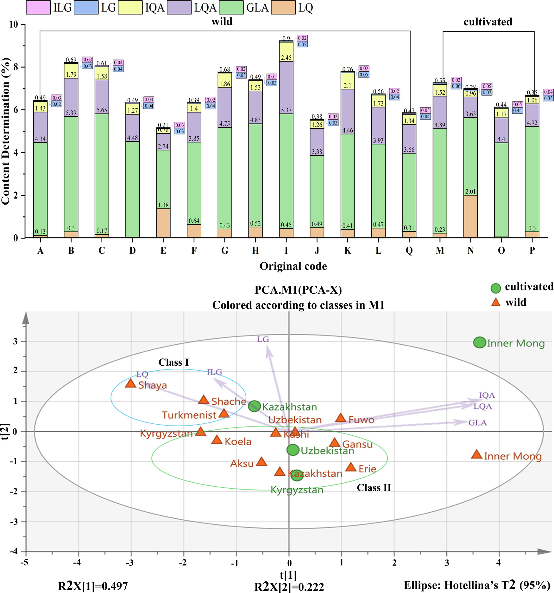

<!-- 方針: ほぼ全訳＋必要に応じた補足。原文構成に沿って訳出。「> 補足:」は訳者注。 -->

## 書誌情報

- 原題: A trinity fingerprint evaluation system of traditional Chinese medicine
- 著者・所属: Huizhi Yang, Ting Yang, Dandan Gong, Xiaohui Li, Guoxiang Sun*, Ping Guo*（瀋陽薬科大学薬学院, 中国／Xiaohui Liのみ中国通信科技（江門）有限公司）
- 掲載誌・巻号・DOI: *Journal of Chromatography A* 1673 (2022) 463118. https://doi.org/10.1016/j.chroma.2022.463118
- インパクトファクター: **約3.8〜4.2**（*Journal of Chromatography A*, JCR 2024 / Clarivate。情報源により3.8・4.0・4.21などの報告があり幅がある。掲載当時2022年の値は別途要確認）
- 受理経過 / ライセンス: 受領 2022-02-26 / 改訂 2022-04-29 / 採録 2022-05-02 / オンライン公開 2022-05-10。© 2022 Elsevier B.V. All rights reserved.

> 補足: 略語一覧（原文Abbreviations節より）: BCA=バイバリエート相関分析（二変量相関分析）、ESM=外部標準法、GLA=グリチルリチン酸、IEM=区間消去法、ILG=イソリクイリチゲニン、IQA=イソリクイリチンアピオシド、LG=リクイリチゲニン、LQ=リクイリチン、LQA=リクイリチンアピオシド、MAML=単一直線による多マーカー定量法(multi-markers assay by monolinear method)、MEMA=測定マーカー、QAMS=単一マーカーによる多成分定量分析、QFP=量子指紋、RFP=参照指紋、SQFM=系統的定量指紋法、TCM=中医薬（伝統中国医学）、PCA=主成分分析、FIA=フローインジェクション分析。本論文は分析法開発・品質評価の実験研究論文。

## 要旨（Abstract）

本研究は、中医薬(TCM)の多層性・多特性を反映できる一連の品質評価法の開発に焦点を当てた。甘草(*Glycyrrhiza glabra* L.)を方法開発サンプルとし、活性成分間の標準曲線関係を通じて、単一直線による多マーカー定量法(MAML)の実現可能性を初めて検討した。グリチルリチン酸を測定マーカーとして用いることで、MAMLは甘草の5成分（イソリクイリチゲニン、イソリクイリチンアピオシド、リクイリチゲニン、リクイリチン、リクイリチンアピオシド）を同時に定量できた。MAMLとQAMS（単一マーカーによる多成分定量分析）をそれぞれ外部標準法(ESM)と比較したところ、MAMLとESMで算出された成分含量には有意差がなく（相対誤差(RE)はおおむね2.00%未満）、一方でQAMSにより算出された成分含量のREは大きくばらつき、MAMLがQAMSより正確であることが示された。加えて、区間消去法によりUVおよびTHzの量子指紋が構築された。系統的定量指紋法を核とし、HPLC・UV・THzに基づく「三位一体」指紋品質評価システムを開発した。本システムは、総合評価結果により、13産地・2つの栽培モデル（野生／栽培）の甘草試料の品質差を判別することに成功した。同時に、異なる加工レベルの甘草の品質情報も明らかにした。最後に、バイバリエート相関分析（二変量相関分析）を用いてUV/HPLCと抗酸化スペクトル効果との関連性を検討し、甘草の二次元活性スペクトルを提供した。本手法は、甘草さらには他のTCMについて、化学指紋の特徴、化学結合の振動特性、生物活性情報の点で、より徹底的かつ客観的な分析技術を提供しうる。

© 2022 Elsevier B.V. All rights reserved.

## 1. 序論（Introduction）

2019年の新型コロナウイルス(2019-nCoV)の流行以来、中医薬(TCM)は中国における予防・治療戦略の重要な柱となっている\[1\]。一方、薬物の安全性はTCMの内部品質と密接に関連している\[2,3\]。TCMの内部品質は、産地の違いや栽培方法の違いなど、さまざまな事情により大きく変動しうる\[4\]。TCMの複雑な混合機序はまた、その品質管理をより困難にしている\[5\]。そこで本研究では、13産地由来の甘草(*Glycyrrhiza glabra* L.)85バッチを方法開発サンプルとし、TCMの統合的な品質管理法の確立に取り組んだ。

現在、クロマトグラフィー指紋、特にHPLC指紋はTCMの品質管理に広く利用されている\[6,7\]。しかし、HPLC-DAD指紋分析は一般に固有の波長で決定されるため、後続のデータ処理において一部の物質の応答が単一波長では低すぎる、あるいは検出されないという問題が生じうる\[8\]。単一波長では全化合物の最大紫外(UV)吸収特性を特徴づけることはできない。そこで、他波長での指紋情報を考慮し、有用情報を発掘するプラットフォームを提供するため、三波長最大融合指紋法が確立された\[9,10\]。しかし残念ながら、この手法もUV吸収を持つ一般的な化合物の指紋特性のみを考慮したものであった\[11,12\]。このような状況下で、複数の検出技術を組み合わせてTCMの品質を管理することが不可欠となった。紫外可視吸収は主に共役系または芳香族系成分の不飽和帯情報を明らかにする。フローインジェクション分析(FIA)法と組み合わせることで、低消費量・高精度でのサンプルの迅速な分析が可能となり、主観的な波長選択の一面性を回避できる\[13–15\]。テラヘルツ(THz)応答は、分子集団挙動と組み合わせることで、TCM中の高分子（アミノ酸、炭水化物など）の全体構造および関連する環境情報の振動モードを反映できる\[16–19\]。これら3手法の原理は相補的であるだけでなく、TCM分析における分類および類似性評価にも共通して用いられている。しかしスペクトルデータは一般に、連続信号・冗長情報・複雑な図形という特徴を持ち、包括的な定性・定量分析への利用が難しい。以上の問題を踏まえ、Guoxiang Sun教授\[20,21\]は、区間消去法(IEM)によって連続的なスペクトル信号を定量化する「量子指紋(QFP)」を提唱した。デジタル情報処理による統合・低減の結果は量子指紋ピークとして表現される。確立されたQFPは対象の情報特性を網羅するだけでなく、スペクトル特性をより簡潔かつ直感的にする。TCMの品質は、クロマトグラフィー(HPLC-FP)とスペクトル(UV-QFPおよびTHz-QFP)を用いた系統的定量指紋法(SQFM)\[22\]によって評価された。

さらに、TCMは未だ体系的な標準化を達成しておらず、一部の標準物質は高価であるため、一部成分の定量が困難である\[23\]。そこで、単一直線による多マーカー定量法(MAML)\[24\]が提案され、甘草において初めて検証された。MAMLは、単一マーカーによる多成分定量分析(QAMS)\[25,26\]をさらに発展させたものである。線形範囲と系統的方法論、さらには誤差解析・信頼性解析の理論に重点を置き、操作誤差を最小化し分析技術の精度を高めることを目的としている。本研究では甘草の定量指紋を用い、グリチルリチン酸を測定マーカー(MEMA)とし、定量成分の標準曲線下で絶対補正係数を算出した後、対応する成分の相対補正係数を算出した。活性化合物の定量管理に加え、1,1-ジフェニル-2-ピクリルヒドラジル(DPPH)ラジカル消去アッセイにより甘草試料のin vitro抗酸化活性を検討した\[27–29\]。バイバリエート相関分析(BCA)\[30\]により、UVおよびHPLCと抗酸化活性のスペクトル効果関係が論じられ、試料の二次元活性プロファイリングが提供された。要するに、本論文は、TCMの機能特性・多成分性・多層性などを反映しうる、科学的で厳密かつ標準化された品質評価法の確立を目指すものである。

## 2. 理論（Theory）

### 2.1. 系統的定量指紋法（SQFM）

SQFM\[22\]は、TCMシステムに対する実用的かつ適応性の高いマクロ的定量評価法である。定性比類似度(**S**F′)は、大きなピークが小さなピークを覆い隠してしまうという定性類似度(**S**F)の問題を克服できる。**S**F′はすべての指紋ピークに等しい重みを持つ。TCMの化学指紋の量と分布比を監視して曖昧さを解消するマクロ定性類似度因子(**S**m)は、この両者の平均値である。同様に、定量類似度(**P**)も、投影含量類似度(**C**)における大きなピークが小さなピークを隠すという一面性を克服できる。**P**と**C**の平均値はマクロ定量類似度(**P**m)と呼ばれ、化学指紋の全体含量を全体として監視するために用いられる。すべての式はEqs.(1–2)に示されており、*xi*と*yi*はそれぞれ試料指紋(SFP)と参照指紋(RFP)のピーク面積を表す。RFPは全試料の指紋を平均化して得られる。

したがって、**S**mと**P**mの両方を用いてTCMの品質を評価する方法はSQFMと呼ばれ、両者のうち低い値が品質グレードを決定し、TCMは以下の8つのカテゴリーに区分される。

- Grade1=[**S**m≥0.95, 95%≤**P**m≤105%], Grade2=[**S**m≥0.90, 90%≤**P**m≤110%]
- Grade3=[**S**m≥0.85, 85%≤**P**m≤115%], Grade4=[**S**m≥0.80, 80%≤**P**m≤120%]
- Grade5=[**S**m≥0.70, 70%≤**P**m≤130%], Grade6=[**S**m≥0.60, 60%≤**P**m≤140%]
- Grade7=[**S**m≥0.50, 50%≤**P**m≤150%], Grade8=[**S**m<0.50, **P**m<50%または>150%]

> 補足: 原文には**S**m・**P**mの数式（Eqs.1–2）が数式組版で掲載されているが、レイアウト崩れのため本訳では正確な数式表記の再現を省略する。**S**mは**S**Fと**S**F′の平均、**P**mは**C**と**P**の平均という定義（本文記載）は上記の通り。数式が必要な場合は原文参照。

### 2.2. 単一直線による多マーカー定量法（MAML）

MAML\[24\]は、QAMS\[23\]の原理とTCMの定量指紋理論を組み合わせた新規手法である。複数の活性化合物の標準曲線が、指紋検出と同一のクロマトグラフィー条件下で確立された。測定マーカー(MEMA)の標準曲線を用いて、他の化合物の標準曲線パラメータについて相対補正係数・誤差・信頼性が算出された。許容誤差範囲内で、標準曲線法を最大限簡素化し、標準物質の使用を節約するという目的が達成される。MEMA(s)および他の化合物(i)の標準曲線に基づき絶対補正係数(*f*i)を算出する（Eqs.3–6）。*b*as=as/Csおよび*b*ai=ai/Ciの式は、*b*asと*b*aiが濃度に大きく影響することを示す。濃度が大きいほど切片・傾き比は小さくなり、測定誤差は小さくなる。線形平均濃度*C*0=0.5(*C*1+*C*2)が最良の試験サンプル濃度として一般に受け入れられている。Eq.(7)に示す通り、相対補正係数(*f*si)を算出する。*b*a=|*a*/*C*|≤1%*b*（誤差1.0%未満）のとき、Eq.(8)の傾きの式を用いて直接得ることができる。この比は単純相対補正係数(*f′*si)と呼ばれる。さらに、相対補正係数の誤差（方法信頼性*R*と呼ぶ）もEq.(9)で検討されており、これには秤量誤差(*RSD*Cs)、標準曲線誤差(*b*as/*b*s)、MEMAの相対ピーク面積誤差(*RSD*As)、他の化合物の相対ピーク面積誤差(*RSD*Ai)が含まれる。したがって、MAMLはQAMSにおける線形範囲検証・系統的手法検証の不足を補うものであり、試験技術者に誤りを排除する方法も助言できる。

> 補足: Eqs.(3)–(10)の数式（As=bsCs+as 等の一連の回帰式・補正係数の式）は原文参照。要点は、MEMA(測定マーカー、本研究ではグリチルリチン酸)の標準曲線から他成分の「相対補正係数（fsi）」を導出し、MEMAの実測濃度とピーク面積比から他成分濃度Cmを逆算する（Eq.10: Cm = fsi×Cms×Am / Ams）という考え方である。

### 2.3. TCMのTHz量子指紋の整合性評価システム

一般に、テラヘルツ透過スペクトルはTHz-TDSシステムにおいて光学パラメータを抽出するために最も広く用いられる方法である。主な抽出の考え方は、光路下で試料の実信号(**E**sam(*t*))と、試料なしで得られる参照信号(**E**ref(*t*))を測定することである。次に、フーリエ変換操作法を用いて、直接受信された時間領域信号を周波数領域信号(**E**ref(*ω*)および**E**sam(*ω*))に変換する。試料の屈折率と吸収係数は、DorneyおよびDuvillaretが提案した方法\[32,33\]によるデータ処理で得られた（Eqs.11–13参照）。*n*(*ω*)は試料の屈折率、*ω*は周波数、*ϕ*(*ω*)は試料信号と参照信号の位相差、*α*(*ω*)は試料の吸収係数を表す、*A*(*ω*)は周波数領域信号における試料と参照の振幅比、*d*は試料の厚さを表す。

この基盤の上に、区間消去法(IEM)（詳細は[3.7節](#4)記載のソフトウェア）によって量子指紋が構築される。これは本質的に、スペクトルをクロマトグラフィー的な量子ピークへと変換するプロセスである。Eqs.(14)–(16)に従う：**H**、**A**b*i*、**W**はそれぞれピーク高さ・ピーク面積・ピーク幅を表す。*b*iは消去開始点の吸光度、*W*はピーク幅、*i*は消去点の番号を示す。

スペクトル量子指紋の使用は、ソフトウェアによりスペクトル吸収係数の周波数を定量化することを目的としており、これによりピークをクロマトグラフィー指紋ピークと同様に照合できるようになる。これはTCMのスペクトログラムの定性・定量分析の可能性を提供する。

> 補足: Eqs.(11)–(16)（屈折率・吸収係数・量子ピーク高さ／面積／幅の算出式）は数式組版のため本訳では割愛し、原文参照とする。

## 3. 材料と方法（Materials and Methods）

### 3.1. 試薬と化学物質

13産地から採取された野生および栽培の甘草(*Glycyrrhiza glabra* L.)試料計85バッチ（補足Table S1）は、新疆福沃薬業有限公司（Xinjiang Fuwo Pharmaceutical Co., Ltd.）から提供されたもので、国内9産地・国外4産地を含む。

グリチルリチン酸(GLA, 98.5%)、リクイリチゲニン(LG, 98.5%)、イソリクイリチゲニン(ILG, 99.0%)、リクイリチンアピオシド(LQA, 99.0%)、イソリクイリチンアピオシド(IQA, 99.0%)、リクイリチン(LQ, 93.1%)の標準品は、中国食品薬品検定研究院(北京)より購入した。HPLCグレードのメタノール・アセトニトリル・リン酸は、Yuwang Industrial Co., Ltd.（山東省、中国）から入手した。ヘプタンスルホン酸ナトリウムはZhongmei Chemical Co., Ltd.（山東省、中国）から供給された。ポリエチレン粉末(AR級)はShanghai Guanbu Electromechanical Technology Co., Ltd（上海、中国）から入手した。実験過程では脱イオン水を使用した。

### 3.2. 試料調製

85バッチの甘草試料を均一な大きさに粉砕し、40メッシュ篩を通し、密封袋に入れ、使用前は遮光保存した。

#### 3.2.1. THz試料調製

甘草粉末を電熱送風乾燥オーブン(DHG-9070A、上海一恒科学儀器有限公司)であらかじめ60℃で2時間乾燥させた後、取り出してデシケーター中で放冷した。甘草粉末試料を約0.2g秤量し、打錠成形型(HY-12、天津天光新光学儀器有限公司)に載せ、24MPaで1分間加圧して直径13mmの円形ペレットを成形した。

#### 3.2.2. HPLC試料および標準溶液の調製

溶媒（80%メタノール水溶液）45mLを用いて、試料粉末1gを超音波浴（120W、40kHz、JP-020、Skymen Cleaning Equipment Shenzhen Co., Ltd.、中国）で20分間抽出した。室温まで放冷後、溶媒で50mLに定容した。その後、抽出した試料溶液を0.45μmのマイクロポア濾過膜で濾過して分析に供した。6化合物を正確に秤量し、メタノールに溶解して、LQA 100μg/mL、LQ 60μg/mL、IQA 100μg/mL、LG 10μg/mL、ILG 20μg/mL、GLA 800μg/mLの標準溶液を調製した。分析前は、すべての試料・標準溶液を4℃・遮光で保存した。

### 3.3. HPLC分析条件

HPLC分析はAgilent 1260シリーズ液体クロマトグラフ（Agilent Technologies, Santa Clara, CA, USA）で行い、Quat Pump VLポンプ、オートサンプラー、フォトダイオードアレイ検出器(DAD)を備えた。甘草のクロマトグラフィー分離はCOSMOSILカラム（250mm×4.6mm、5μm）で行った。

移動相は2相からなる：(A) 5mMヘプタンスルホン酸ナトリウム溶液－リン酸(499:1, v/v)、(B) アセトニトリルとメタノール(9:1, v/v)、流速1.0mL/min。グラジエント溶出は以下の通り：0–13分、96%–70% A；13–15分、70%–67% A；15–18分、67%–66% A；18–40分、66%–18% A；40–45分、18%–15% A；45–50分、15%–96% A。注入量は5μLで、分析の全実行時間は50分、カラム温度35℃であった。DAD検出波長は220nm、250nm、370nmとした。

### 3.4. UV分光条件

FIAを分析原理とし、UVスペクトルはDADを備えたAgilent 1100 HPLCシステム（Agilent, USA）でPEEKチューブ(5000mm×0.12)を用いて記録した。190–400nmの波長範囲で、波長間隔1nm・スリット幅1nmで検出を行った。3.2.2節で調製した試料溶液を10倍希釈後、80%メタノール水(80:20, v/v)をキャリヤーとしてPEEKチューブに5μL注入し、流速1mL/min・35℃で測定した。

### 3.5. THz分光条件

THzスペクトルデータはCCT-1800テラヘルツ時間領域分光計（China Communication Technology Co., Ltd, 深圳, 中国）で測定した。装置を20分間予熱後、窒素を導入して試料室内の水蒸気を除去し、窒素参照スペクトルを取得した。各試料スペクトルは100回走査により測定した。

### 3.6. 抗酸化活性分析

甘草の抗酸化能を確認するため、85試料についてDPPHアッセイを実施した（Jinyu Chenの方法\[34\]を軽微に改変）。実験前に、DPPH溶液(0.064mg/mL)を80%メタノールで調製し、遮光保存した。3.2.2節で調製した甘草試料抽出液を10倍希釈し、その2mLと一定量（0, 0.3, 0.5, 1, 1.5, 1.8, 2mL）のDPPH溶液を混合後、80%メタノールで5mLに定容した。混合液を暗所で40分間反応させた後、UV分光光度計（島津160A）を用い、80%メタノールをブランクとして517nmで吸光度を測定した。各試料は三重測定した。

DPPHラジカル消去活性(*RS*%)の百分率は次式で表される。

*RS*% = [*A*0 − (*A*s − *A*b)] / *A*0 × 100% ……式(17)

*A*0は陰性対照溶液（DPPH＋80%メタノール）の吸光度、*A*sは試料溶液（DPPH＋試料＋80%メタノール）の吸光度、*A*bはブランク溶液（試料＋80%メタノール）の吸光度を示す。*RS*%値を試料濃度に対してプロットし、甘草の抗酸化能を表す50%阻害濃度(IC50)を算出した。

### 3.7. データ解析

THz指紋とUV指紋のデータは、自社開発ソフトウェア「TCM Spectrum Quantum Profiling Consistency Digitized Evaluation System 4.0」（ソフトウェア認証番号 7,037,415、中国）で解析した。HPLC指紋は「Digitized Evaluation System for consistency of TCM spectral Fingerprints 4.0」（ソフトウェア認証番号 0,407,573、中国）で解析した。主成分分析(PCA)にはOrigin 2019bを使用した。

## 4. 結果と考察（Results and Discussion）

### 4.1. 方法バリデーション

参照物質と試料の指紋ピークの保持時間・UVスペクトルを比較することにより、220nmにおいてピーク7、8、12、17、21、23がそれぞれLQA、LQ、IQA、LG、ILG、GLAであると同定された（Fig. 1）。3.3節で確立したHPLC法の頑健性をさらに検討するため、S1を方法論的バリデーションに用いた。関連する標準曲線の相関係数(R)は、6化学物質の目標濃度範囲内ですべて0.999を超え、良好な線形関係を示した（Table 1）。検出限界・定量限界はそれぞれ1.5–32.3ng、4.84–107.66ngであった。6化合物の回収率は97.6%、101.9%、98.6%、97.6%、100.3%、98.5%であり、本法の正確さが要件を満たすことが示された。含量測定法の精度・再現性・安定性の検証には、6つの定量ピークの保持時間(RT)およびピーク面積(PA)の相対標準偏差(RSD)を用いた。精度はS1の6回連続注入、再現性は6個の個別サンプル(S1)の分析、安定性は同一試料(S1)を25℃で32時間（0, 2, 4, 6, 8, 12, 24, 32時間）にわたり測定して評価した。RTおよびPAのRSDはそれぞれ1.0%未満、2.0%未満であった。精度・再現性・安定性は、HPLC指紋の適用性を評価するために利用された。GLA(ピーク23)を基準ピークとして、25の共通ピークについて相対RT・相対PAのRSDを算出したところ、それぞれ0.23%未満、3.84%未満であった。

UV法の検討は3.4節に示す条件に従って実施した。方法精度の評価のため、同一試料(S1)を連続して6回注入した。再現性の分析には6個の個別サンプル(S1)を連続注入した。試料の安定性は25℃で0, 2, 4, 6, 8, 12時間にわたり観測した。220nmでの未分離クロマトグラムにおけるRT・PAのRSDを精度・再現性・安定性の評価に用いたところ、それぞれ0.52%未満、2.07%未満であった。

さらに、THz-QFP法の実現可能性についても検証を行い、SQFMのパラメータ**P**mに基づいて直線性・精度・再現性・特異性を検討した。試料をそれぞれ0, 11, 30, 50, 100, 150, 200, 250mg正確に秤量し、200mg未満の試料にはポリエチレン粉末(PE)を加えて200mgとした。3.2.1節の方法によりTHzで曲線を記録した（Fig. 1D）。

試料質量と**P**mをそれぞれ横軸・縦軸として線形回帰式を得た。回帰式は**P**m = 0.7445*m* + 14.691；*r* = 0.9935であった。この結果は、試料質量11–250mgの範囲で試料質量と**P**mの間に良好な線形関係があることを示した。3.5節で確立した方法に従い、S1試料を6回連続測定して精度を評価したところ、**P**mのRSDは1.34%であった。6個のS1試料を分析して再現性を検討したところ、**P**mのRSDは1.28%であった。特異性は、試料室内に水蒸気ピークやPE粉末が存在せず、THz検出を妨害しないことを要求するものであるが、この点も確認された。以上の試験結果から、確立した方法は所定の要件を満たすことが示された。

**Table 1. 6分析対象物の検量線・LOD・LOQおよび回収率**

| 対象成分 | 回帰式（*y*=ピーク面積, *x*=標準品濃度μg/mL） | R² | 線形範囲(μg/mL) | LOD(ng) | LOQ(ng) | 回収率(%) | RSD(%) |
|---|---|---|---|---|---|---|---|
| LQ | *y* = 17.388*x* + 1.6534 | 0.9999 | 14.5–870.5 | 2.2 | 7.3 | 97.6 | 1.09 |
| LG | *y* = 28.829*x* − 3.1188 | 0.9998 | 4.8–58.1 | 1.5 | 4.8 | 101.9 | 1.25 |
| ILG | *y* = 12.072*x* − 1.0910 | 0.9998 | 1.7–51.2 | 2.6 | 8.5 | 98.6 | 2.50 |
| LQA | *y* = 11.902*x* + 1.9934 | 0.9999 | 15.5–930.6 | 2.3 | 7.8 | 97.6 | 1.48 |
| IQA | *y* = 5.8756*x* + 0.0158 | 0.9998 | 34.9–418.3 | 5.2 | 17.4 | 100.3 | 3.80 |
| GLA | *y* = 1.0623*x* + 0.2017 | 0.9995 | 64.6–1938.0 | 32.3 | 107.7 | 98.5 | 2.10 |

*LQ=リクイリチン、LG=リクイリチゲニン、ILG=イソリクイリチゲニン、LQA=リクイリチンアピオシド、IQA=イソリクイリチンアピオシド、GLA=グリチルリチン酸。LOD=検出限界、LOQ=定量限界。*

### 4.2. 6成分の定量分析

#### 4.2.1. MAML定量分析

MAMLがQAMSに代わって甘草の活性成分をより正確に定量できるかを検討するため、外部標準法(ESM)・QAMS・MAMLの3手法を用いて6物質の濃度を測定した（補足Table S3参照）。ESM\[35\]では、Table 1に記載の線形回帰式を用いて定量成分含量を容易に算出できる。GLAをMEMAとし、残り5化合物の含量はZhimin Wangら\[36\]によるQAMSに従って算出した。2.2節のMAML原理に基づき、GLAを同様にMEMAとして用いた。まず、*R*は95.5%を上回った（Table 2）。次に、ILG、LG、IQA、LQ、LQAの相対補正係数を算出した。最後に、ESMで算出したGLA濃度とピーク面積を用い、Eq.(10)により5物質の含量を得た。QAMSとMAMLの差異を比較するため、それぞれのESMに対する相対誤差(RE)を個別に算出した（補足Table S4参照）。結果は、MAMLのREがQAMSのREよりも有意に低いことを示し、特に甘草中で含量が高いLQA・LQ・IQAでその差が顕著であった。MAMLのREは概ね0.50%以下であり、多くは0.10%を超えることすらなかった。これは、MAMLとEMSの結果に有意差がないことを示すものであった。ただし、一部のILG・LGのREは2.0%を上回ったが、これはその含量が4μg/mL未満であることに起因する。要約すると、MAMLはより信頼性の高い精度を持つ革新的な手法であることが強く証明された。MAMLは検出コストと分析時間の削減というQAMSの利点を受け継ぐだけでなく、TCMの整合性評価のための定量指紋管理法をも提供する。

**Table 2. MAMLにより得られた甘草の各パラメータ値**

| 成分 | *C*0（線形平均濃度） | *b*ai（切片・傾き比） | *f*i（絶対補正係数） | *f*si（相対補正係数） | 1%*b*i | *f′*si（単純相対補正係数） | *R*(*i*)%（方法信頼性） |
|---|---|---|---|---|---|---|---|
| GLA | 1001.30 | −0.0002 | 1.0621 | 1.0000 | 0.0106 | 1.0000 | — |
| ILG | 26.45 | −0.0412 | 12.0308 | 0.0883 | 0.1207 | 0.0880 | 97.53 |
| LG | 31.45 | −0.0992 | 28.7298 | 0.0370 | 0.2883 | 0.0368 | 97.97 |
| IQA | 226.60 | 0.0001 | 5.8757 | 0.1808 | 0.0588 | 0.1808 | 98.17 |
| LQ | 442.50 | 0.0037 | 17.4017 | 0.0610 | 0.1740 | 0.0611 | 98.34 |
| LQA | 473.05 | 0.0042 | 11.9042 | 0.0892 | 0.1190 | 0.0893 | 98.25 |

#### 4.2.2. サンプル分析

6活性成分の含量比率を用いて、13産地の栽培・野生甘草試料の品質を判別した（Table 3）。85甘草試料におけるLQの平均含量比率は0.43%で、23バッチのみが2020年版中国薬局方の規定含量(LQ≥0.50%)に達していた。GLAの平均比率は4.14%であり、S71(1.00%)とS79(1.95%)を除き適格であった(GLA≥2.0%, 2020年版中国薬局方)\[37\]。試料中のIQAは0.10%–1.11%で、LG・ILGの含量はほぼ0.10%と低かった。総じて、6活性成分の含量は顕著に多様であり、85試料の平均含量比率はGLA＞LQA＞IQA＞LQ＞LG＞ILGの順であった。

**Table 3. 甘草85バッチの6マーカー含量比率(%)およびIC50値**

（LQ・GLA・LQA・IQA・LG・ILGは含量比率%、IC50はDPPH 50%阻害濃度〔単位は原文中に明記なし・原文参照〕）

| 試料 | LQ | GLA | LQA | IQA | LG | ILG | IC50 |
|---|---|---|---|---|---|---|---|
| S1 | 0.07 | 4.32 | 1.53 | 0.56 | 0.01 | 0.04 | 0.5531 |
| S2 | 0.13 | 4.01 | 1.43 | 0.52 | 0.03 | 0.04 | 0.3145 |
| S3 | 0.19 | 4.7 | 1.34 | 0.39 | 0.01 | 0.02 | 0.3215 |
| S4 | 0.12 | 6.65 | 2.09 | 0.89 | 0.03 | 0.06 | 0.4544 |
| S5 | 0.19 | 4.95 | 1.72 | 0.66 | 0.05 | 0.02 | 0.1056 |
| S6 | 0.59 | 4.57 | 1.57 | 0.53 | 0.02 | 0.01 | 0.1010 |
| S7 | 0.14 | 6.53 | 2 | 0.82 | 0.06 | 0.03 | 0.1411 |
| S8 | 0.26 | 5.47 | 1.68 | 0.56 | 0.02 | 0.05 | 0.1143 |
| S9 | 0.1 | 4.96 | 1.05 | 0.45 | 0.04 | 0.04 | 0.3007 |
| S10 | 0.01 | 4.08 | 1.67 | 0.64 | 0.07 | 0.05 | 0.1411 |
| S11 | 0.07 | 4.22 | 0.99 | 0.38 | 0.03 | 0.04 | 0.1143 |
| S12 | 0.05 | 5.13 | 1.15 | 0.46 | 0.03 | 0.04 | 0.3301 |
| S13 | 0.54 | 3.26 | 0.89 | 0.27 | 0.03 | 0.03 | 0.3918 |
| S14 | 1.45 | 2.14 | 0.59 | 0.14 | 0.03 | 0.03 | 0.1411 |
| S15 | 2.09 | 2.83 | 0.86 | 0.21 | 0.04 | 0.03 | 0.1143 |
| S16 | 0.75 | 4.27 | 1.61 | 0.46 | 0.07 | 0.03 | 0.2316 |
| S17 | 0.39 | 3.43 | 1.46 | 0.41 | 0.01 | 0.02 | 0.6318 |
| S18 | 0.79 | 3.84 | 1.12 | 0.29 | 0.03 | 0.01 | 0.5279 |
| S19 | 0.45 | 3.34 | 0.86 | 0.24 | 0.01 | 0.03 | 0.5334 |
| S20 | 0.31 | 4.92 | 2.17 | 0.85 | 0.03 | 0.02 | 0.2633 |
| S21 | 0.52 | 6 | 2.54 | 0.94 | 0.05 | 0.02 | 0.2676 |
| S22 | 0.44 | 3.18 | 1.38 | 0.4 | 0.02 | 0.02 | 0.3921 |
| S23 | 0.57 | 6.51 | 1.32 | 0.41 | 0.06 | 0.01 | 0.3241 |
| S24 | 0.56 | 4.81 | 1.9 | 0.65 | 0.02 | 0.01 | 0.2457 |
| S25 | 0.53 | 6.36 | 2.94 | 1.11 | 0.04 | 0.02 | 0.3033 |
| S26 | 0.69 | 5.63 | 2.04 | 0.78 | 0.07 | 0.03 | 0.2669 |
| S27 | 0.13 | 4.13 | 2.37 | 0.8 | 0.03 | 0.01 | 0.1184 |
| S28 | 0.59 | 3.52 | 1.49 | 0.41 | 0.03 | 0.03 | 0.1318 |
| S29 | 0.35 | 3.87 | 1.27 | 0.45 | 0.03 | 0.02 | 0.4121 |
| S30 | 0.54 | 2.75 | 1.02 | 0.27 | 0.03 | 0.02 | 0.3006 |
| S31 | 0.26 | 4.98 | 2.46 | 0.91 | 0.04 | 0.02 | 0.1184 |
| S32 | 0.52 | 5.74 | 2.84 | 1.04 | 0.07 | 0.02 | 0.1318 |
| S33 | 0.2 | 2.65 | 1.01 | 0.34 | 0.04 | 0.03 | 0.4348 |
| S34 | 0.66 | 4.34 | 1.85 | 0.6 | 0.04 | 0.03 | 0.3395 |
| S35 | 0.25 | 3.07 | 1.47 | 0.47 | 0.02 | 0.01 | 0.3541 |
| S36 | 0.51 | 4.37 | 1.86 | 0.6 | 0.07 | 0.01 | 0.2184 |
| S37 | 0.14 | 5.72 | 1.67 | 0.64 | 0.04 | 0.03 | 0.1318 |
| S38 | 0.41 | 5.01 | 1.44 | 0.5 | 0.04 | 0.01 | 0.1688 |
| S39 | 0.16 | 4.2 | 1.55 | 0.57 | 0.06 | 0.01 | 0.5155 |
| S40 | 0.2 | 4.61 | 1.41 | 0.5 | 0.09 | 0.01 | 0.1958 |
| S41 | 2.72 | 3.2 | 0.58 | 0.17 | 0.03 | 0.05 | 0.1935 |
| S42 | 2.28 | 5.64 | 1.2 | 0.37 | 0.04 | 0.09 | 0.1935 |
| S43 | 1.77 | 2.63 | 0.85 | 0.21 | 0.02 | 0.02 | 0.3413 |
| S44 | 1.28 | 3.06 | 1.19 | 0.36 | 0.17 | 0.02 | 0.3664 |
| S45 | 0.04 | 4.9 | 1.06 | 0.45 | 0.03 | 0.02 | 0.4276 |
| S46 | 0.03 | 3.71 | 0.79 | 0.29 | 0.04 | 0.01 | 0.4275 |
| S47 | 0.09 | 3.78 | 1.28 | 0.49 | 0.06 | 0.01 | 0.4358 |
| S48 | 0.09 | 5.19 | 1.54 | 0.53 | 0.05 | 0.01 | 0.3326 |
| S49 | 0.41 | 4.97 | 1.16 | 0.33 | 0.02 | 0 | 0.1822 |
| S50 | 0.27 | 5.24 | 0.87 | 0.26 | 0.07 | 0 | 0.1834 |
| S51 | 0.4 | 5.02 | 1.15 | 0.38 | 0.04 | 0 | 0.1535 |
| S52 | 0.12 | 4.43 | 1.04 | 0.44 | 0.03 | 0 | 0.2064 |
| S53 | 0.27 | 2.78 | 1.08 | 0.37 | 0.11 | 0.04 | 0.2246 |
| S54 | 0.71 | 4.6 | 1.88 | 0.6 | 0.05 | 0.07 | 0.3149 |
| S55 | 0.5 | 4.94 | 2.56 | 0.9 | 0.04 | 0.04 | 0.1184 |
| S56 | 0.3 | 4.42 | 1.98 | 0.7 | 0.04 | 0.1 | 0.1318 |
| S57 | 0.14 | 3.55 | 1.92 | 0.7 | 0.07 | 0.08 | 0.1638 |
| S58 | 0.31 | 3.99 | 1.46 | 0.47 | 0.21 | 0.07 | 0.2029 |
| S59 | 0.18 | 3.62 | 1.98 | 0.58 | 0.04 | 0.02 | 0.1650 |
| S60 | 0.36 | 4.15 | 1.52 | 0.54 | 0.02 | 0.05 | 0.2967 |
| S61 | 0.45 | 2.9 | 1.28 | 0.44 | 0.04 | 0.04 | 0.2073 |
| S62 | 0.31 | 4.13 | 1.38 | 0.43 | 0.03 | 0.05 | 0.1784 |
| S63 | 0.4 | 4.05 | 1.39 | 0.53 | 0.03 | 0.03 | 0.1411 |
| S64 | 0.1 | 2.3 | 0.76 | 0.25 | 0.04 | 0.04 | 0.3921 |
| S65 | 0.41 | 4.49 | 1.75 | 0.62 | 0.02 | 0.03 | 0.3241 |
| S66 | 0.4 | 3.93 | 1.19 | 0.44 | 0.02 | 0.06 | 0.1141 |
| S67 | 0.17 | 2.89 | 0.63 | 0.23 | 0.03 | 0.04 | 0.2083 |
| S68 | 0.19 | 2.78 | 1.27 | 0.42 | 0.01 | 0.02 | 0.2397 |
| S69 | 0.32 | 4.45 | 1.21 | 0.41 | 0.03 | 0.04 | 0.1919 |
| S70 | 0.25 | 3.64 | 1.07 | 0.39 | 0.02 | 0.04 | 0.1609 |
| S71 | 0.05 | 1 | 0.26 | 0.1 | 0.01 | 0.03 | 0.2804 |
| S72 | 0.18 | 2.96 | 0.9 | 0.29 | 0.02 | 0.03 | 0.2043 |
| S73 | 0.41 | 2.98 | 0.98 | 0.36 | 0.03 | 0.04 | 0.2025 |
| S74 | 0.2 | 4.18 | 1.85 | 0.73 | 0.06 | 0.05 | 0.3921 |
| S75 | 0.15 | 2.48 | 1.23 | 0.32 | 0.06 | 0.08 | 0.3241 |
| S76 | 0.37 | 4.29 | 2.35 | 0.81 | 0.03 | 0.06 | 0.3184 |
| S77 | 0.14 | 2.06 | 0.61 | 0.22 | 0.03 | 0.04 | 0.3500 |
| S78 | 0.35 | 4.85 | 1.43 | 0.51 | 0.03 | 0.03 | 0.3921 |
| S79 | 0.08 | 1.95 | 0.41 | 0.13 | 0.06 | 0.04 | 0.3241 |
| S80 | 0.49 | 4 | 1.51 | 0.55 | 0.07 | 0.04 | 0.3380 |
| S81 | 0.35 | 4.1 | 2.02 | 0.74 | 0.05 | 0.03 | 0.4525 |
| S82 | 0.23 | 4.58 | 1.12 | 0.38 | 0.02 | 0.05 | 0.1678 |
| S83 | 0.17 | 3.78 | 0.92 | 0.37 | 0.07 | 0.05 | 0.3334 |
| S84 | 0.2 | 5.74 | 1.65 | 0.61 | 0.03 | 0.08 | 0.1390 |
| S85 | 1.22 | 4.11 | 0.59 | 0.21 | 0.03 | 0.09 | 0.1801 |
| Mean | 0.43 | 4.14 | 1.42 | 0.49 | 0.04 | 0.03 | 0.2684 |

6成分の含量は産地により変動した（Fig. 2）。シャヤ(9.24%)が最高で、キルギス(8.23%)、トルクメニスタン(8.09%)が続いた。対照的に、内モンゴルにおける6化合物の総含量比率は最も低く(5.17%)、エリエ(5.56%)、扶沃(5.87%)が続いた。6成分の含量は生育環境によっても異なり、カザフスタンおよび内モンゴルの野生甘草試料における6分析化学物質の総含量比率は、栽培試料に比べてはるかに低かった。一方でキルギスでは逆の特性を示し、キルギスの栽培試料(S49–S52、Table 3)ではILG含量がほぼ無視できる水準であった。Fig. 2Aから、内モンゴルのLQ含量は他の12地域より概して高いことも分かった。ウズベキスタンおよびキルギスの栽培試料は、他産地に比べLG含量がはるかに多かった。

明らかに、6つのマーカーは大きく変動した。したがって、マーカー化合物の定量分析のみで甘草の品質を評価することには限界があり、さらなる化学量論的検討が必要であった。

#### 4.2.3. 主成分分析

上記6指標の判別能力を詳細に検討するため、試料産地を区分基準とし、産地別平均データの次元削減にPCA\[38\]を用いた。PCAモデルの二次元行列は17観測値×6変数(17×6)で構成され、合計分散71.9%(PC1=49.7%、PC2=22.2%)を示した。さらに、LG、ILG、LQの3変数はPC1と負の相関を、IQA、LQA、GLAはPC1と正の相関を示した。全変数はPC2と正の相関を示した（Fig. 2B）。

Fig. 2Bに示す通り、17観測値は主に4つのカテゴリーに区分された。シャヤ・莎車(シャチェ)・トルクメニスタン産の野生試料およびカザフスタン産の栽培試料は同一クラス(Class I)に区分された。コエラ・アクス・カシュガル・カザフスタン・甘粛・エリエで生育した野生試料、およびキルギス・ウズベキスタンの2つの異なる生育パターンの試料は、もう一方のクラス(Class II)に置かれた。このうちLG・ILG・LQはClass Iの判別に大きく寄与した。扶沃の試料(Class III)はIQA・LQA・GLAの含量の影響を受け、PC1・PC2の両方と正の相関を示した。加えて、内モンゴル産試料(Class IV)は産地間で顕著な差異があり、栽培生育モード下の観測値は95%信頼区間の外側に外れ、外れ値とみなしうる。この現象の理由としては、内モンゴルにおけるLQ含量が他地域より顕著に高く、6マーカーの全体含量（Fig. 2B、E）が低いことが考えられる。

しかしながら、Class IIの座標位置は、PCAにおける6化合物のラベル重みが大きくないことを示しており、これは6化合物だけでは甘草の内部品質全体を代表できず、指紋によるさらなる評価・管理が必要であることを意味していた。

### 4.3. 指紋分析

#### 4.3.1. HPLCの融合指紋分析

甘草の主要な化学成分であるGLA(ピーク23)とLQ(ピーク8)は、220nmおよび250nmで強いUV吸収を示した。加えて、異なる波長における甘草試料のUV吸収には明らかな差異が見られた（Fig. 1C）。9–15分のピークは220nmで最大の応答を示す一方、17–25分および25–35分のピークはそれぞれ370nmおよび250nmで最大吸収を示した。したがって、物質のUV吸収を最大化するため、三波長最大融合指紋が確立された。

各波長における総指紋ピーク数は、220nmで25、250nmで13、370nmで10と決定された。85バッチの試料のクロマトグラフィー信号を3.7節のソフトウェアに取り込んだ。次に、最大吸収ピークを融合基準として、25の共通ピークを持つ三波長融合指紋が生成された。異なる融合時間窓の間で、**S**m、**P**m、**n**（総指紋ピーク数）、**m**（基線分離（分離度**R**≥1.5）が得られた指紋ピーク数）が比較された（Fig. 1B）。可能な限り正確に全体の化学指紋量・全体含量を検出するため、**S**mおよび**P**mはそれぞれ0.70超・70%–130%の範囲で選択すべきである。さらに、**m**値が大きいという前提のもとで、より大きな**m**/**n**比を選択すべきであり、これは有効ピークの情報を保持しつつ不純物ピークの影響を除去するものである。

結果は、融合時間窓の幅を0.2分に設定した場合に良好な類似度と適切なピーク数が得られることを示した。したがって、3つの検出波長のクロマトグラムは0.2分の融合時間窓で融合された。

#### 4.3.2. HPLC指紋の定性・定量類似度分析

4.3.1節で説明した融合法により85試料の∗.CDFファイルが統合され、合計25ピークを持つ85のクロマトグラフィー合成指紋(CSF)が得られた。産地に基づき、全試料を平均法によりそれぞれ算出した。野生・栽培産地を含む17対応地域の参照指紋(RFP)が取得された。UV/THz由来試料の指紋も同様の方法で取得された（Fig. 3C）。SQFMに基づき、各産地の甘草の内部品質を**S**mおよび**P**m値により評価した。Table 4に示す通り、内モンゴルを除き、他地域の**S**m-HPLC値は0.800–0.900の間にあり、これはほとんどの地域における試料の化学組成または分布比の類似度が低いことを意味していた。一方で、産地間の化学組成含量には有意な差異があり、**P**m-HPLC値は大きく変動した(68.0%–130.0%)。内モンゴル産試料の内部品質は他地域とは著しく異なっており、これはPCAスコア散布図（Fig. 2B）における内モンゴル試料の異常な分布を説明するものであった。要約すると、SQFMは定性・定量両方の観点から甘草試料の指紋を評価でき、適切な品質管理のための方法を提供した。

#### 4.3.3. UVおよびTHzスペクトル量子指紋の開発と確立

連続信号を簡略化し評価を容易にするため、量子分光法を用いて元のスペクトル計算を置き換えデータを簡略化できるかを検討した。85甘草試料のUVおよびTHz指紋は、米国分析化学会が定めるクロマトグラム統合ファイル形式に合わせて∗.CDFファイルへ変換された。2.3節のIEMの原理に従い、THz指紋ピークの処理モードについて、ピーク幅2・区間点5、8、15で検討した（Fig. 3B）。THz指紋の元のプロファイルとデータ情報を維持するため、最終的にピーク幅2・区間点5の条件がTHz-QFPの形成に選択された。生のTHz指紋とTHz-QFPパラメータ(**S**mおよび**P**m)についてそれぞれt検定を行った。t検定のP値は0.05（両側）を上回り、両者に有意差がないことが示された。UV-QFPも同様に処理された（Fig. 3A）。85のUV-QFP/THz-QFPは産地別に分類され、各産地のRFPは算術平均法により取得され、これにより甘草の二重スペクトル量子指紋の類似度が評価された（Fig. 3C、D、E）。

UV-QFPの評価結果では、内モンゴルを除き、他地域の試料の**S**m-UVはすべて0.990を超えた（Table 4）。これは、内モンゴル産甘草の成分分布比が他地域と比べ有意に異なることを再度裏付けるものであった。190nm–400nmの範囲で、試料は**S**m-UVと極めて大きく変動する**P**m-UVにより4つの異なるグレードに区分された。他の2種類の指紋特性情報とは異なり、**S**m-THzは大きく変動した(0.732–0.947)が、**P**m-THzは比較的安定していた。試料は4つの異なるグレードに区分された（Table 4）。さらに、結果は栽培試料の品質グレードが野生試料よりも有意に高いことを示した。これは、人為的な管理により、栽培試料の成分の量・含量が野生試料と比べ相対的により安定していると推察される。

特に注目すべきは、3つの検出技術で得られた指紋の品質グレードがかなり異なっていた点であり、これはHPLC指紋で共通成分とみなされない余分なピークに起因する可能性がある。不飽和結合や助色団は、クロマトグラフィーよりもUVスペクトルへの寄与が大きいと考えられる。補足すると、THz技術は主にアミノ酸や多糖類など、甘草試料中の生体分子の分析に用いられる\[39,40\]。同時に、低周波結合振動や結晶性フォノン振動を含む多くの分子振動が、そのスペクトルに反映される\[41\]。これはさらに、単一の検出技術は一面的であり、多次元の化学成分のモードや特性を提供できず、TCMの包括的な品質管理を制約することを示している。

#### 4.3.4. HPLC-FP、UV-QFP、THz-QFPの総合評価

甘草試料の品質を多次元的に評価し品質グレードを統一するため、HPLC・UV・THz指紋に基づく総合評価法が提案された。平均アルゴリズムを用いて、Eqs.(18)–(19)により2つのパラメータ(**S**m-HPLC+UV+THzおよび**P**m-HPLC+UV+THz)を評価した。

**S**m-HPLC+UV+THz = (1/3)（**S**m-HPLC + **S**m-UV + **S**m-THz） ……式(18)

**P**m-HPLC+UV+THz = (1/3)（**P**m-HPLC + **P**m-UV + **P**m-THz） ……式(19)

Table 4に、異なる産地の甘草試料の総合品質評価結果を示す。13産地のうち、内モンゴル・エリエ・コエラはグレード4、トルクメニスタン・甘粛・シャヤ・莎車・キルギスはグレード3、残りの産地はグレード2と評価された。総合評価パラメータは、内モンゴルを除き、残る3地域の栽培試料の**S**m-HPLC+UV+THzが野生試料より大きく、対応する**P**m-HPLC+UV+THzの変動は小さいことを示した。これは、人為的に管理された甘草試料が高い内部品質類似度を持つことを示していた。結論として、本研究は試料の化学組成の類似度と、全体的な化学結合の振動スペクトルの類似度を組み合わせたものである。これにより、検出原理・検出範囲の違いに起因する単一指紋法による評価結果の偏りの可能性を回避した。したがって、本研究で提案された総合評価は優れた品質管理法であった。

**Table 4. SQFMによる2つの生育パターンを持つ17地域の評価結果**

| 産地 | Sm-HPLC | Pm-HPLC(%) | Grade(HPLC) | Sm-THz | Pm-THz(%) | Grade(THz) | Sm-UV | Pm-UV(%) | Grade(UV) | Sm-融合 | Pm-融合(%) | Grade(融合) |
|---|---|---|---|---|---|---|---|---|---|---|---|---|
| トルクメニスタン | 0.886 | 121.4 | 3 | 0.801 | 100.5 | 4 | 0.995 | 69.4 | 6 | 0.894 | 97.1 | 3 |
| 扶沃（Fuwo） | 0.828 | 83.3 | 4 | 0.891 | 99.9 | 3 | 0.995 | 110.1 | 3 | 0.904 | 97.8 | 2 |
| 甘粛 | 0.835 | 86.7 | 4 | 0.853 | 95.6 | 3 | 0.993 | 74.5 | 5 | 0.894 | 85.6 | 3 |
| コエラ（Koela） | 0.647 | 93.7 | 3 | 0.883 | 95.7 | 3 | 0.999 | 103.7 | 2 | 0.843 | 97.7 | 4 |
| アクス | 0.883 | 93.8 | 3 | 0.833 | 95.1 | 4 | 0.996 | 100.5 | 2 | 0.904 | 96.5 | 2 |
| シャヤ（沙雅） | 0.848 | 129.0 | 5 | 0.866 | 97.9 | 3 | 0.999 | 111.3 | 3 | 0.904 | 112.7 | 3 |
| エリエ（Erie） | 0.832 | 74.4 | 5 | 0.813 | 97.9 | 4 | 0.992 | 72.6 | 5 | 0.879 | 81.6 | 4 |
| 莎車（シャチェ） | 0.800 | 105.9 | 4 | 0.879 | 97.8 | 3 | 0.997 | 89.8 | 3 | 0.892 | 97.8 | 3 |
| カシュガル（喀什） | 0.874 | 97.4 | 3 | 0.902 | 99.6 | 3 | 0.996 | 100.7 | 3 | 0.924 | 99.2 | 2 |
| 内モンゴル（野生） | 0.726 | 68.7 | 6 | 0.827 | 96.6 | 4 | 0.981 | 93.1 | 2 | 0.845 | 86.1 | 4 |
| 内モンゴル（栽培） | 0.590 | 77.6 | 7 | 0.930 | 95.4 | 2 | 0.987 | 111.4 | 3 | 0.836 | 94.8 | 4 |
| キルギス（野生） | 0.892 | 120.1 | 4 | 0.732 | 96.6 | 5 | 0.995 | 69.4 | 6 | 0.873 | 95.4 | 3 |
| キルギス（栽培） | 0.876 | 91.4 | 3 | 0.947 | 104.1 | 2 | 0.995 | 89.9 | 3 | 0.939 | 95.1 | 2 |
| ウズベキスタン（野生） | 0.883 | 101.7 | 3 | 0.820 | 95.1 | 4 | 0.998 | 90.4 | 2 | 0.900 | 95.7 | 2 |
| ウズベキスタン（栽培） | 0.855 | 96.3 | 3 | 0.893 | 103.8 | 3 | 0.998 | 101.0 | 2 | 0.915 | 100.4 | 2 |
| カザフスタン（野生） | 0.914 | 104.8 | 2 | 0.812 | 95.6 | 4 | 0.997 | 103.1 | 2 | 0.908 | 101.2 | 2 |
| カザフスタン（栽培） | 0.884 | 106.3 | 3 | 0.916 | 95.4 | 2 | 0.998 | 99.9 | 2 | 0.933 | 100.5 | 2 |
| 平均 | 0.827 | 97.2 | 4 | 0.859 | 97.8 | 3 | 0.995 | 93.6 | 2 | 0.893 | 96.2 | 3 |

*Sm・Pmの列はHPLC・THz-QFP・UV-QFPそれぞれの値、右端はHPLC+THz+UV等重み融合値。Gradeは各パラメータでのSQFMグレード(1が最良)。*

## 5. スペクトル効果関係分析（Spectrum-effect relationship analysis）

DPPHを用いて85試料のin vitro抗酸化活性をIC50で表し測定した。試料間の抗酸化能には有意差があり、これは単一成分によるものではない可能性がある（Table 3）。その内的関係を検討するため、220nmにおけるHPLC指紋の25共通ピーク面積とそのIC50値をBCA法で解析した。結果はPearsonの*r*(*r*P)で表され、Fig. 3Gに示す。負の相関を示すピークは抗酸化活性に重要な役割を果たす。なぜなら*r*P値が小さいほど、抗酸化への寄与が大きいためである。HPLCのスペクトル効果関係分析では、ピーク5、6、9、11、13、16、18、20が正のピークであった以外、残りのピークは甘草の抗酸化活性と強い負の相関を示した。このうち、LQA(ピーク7)、LQ(ピーク8)、IQA(ピーク12)、LG(ピーク17)、ILG(ピーク21)などのフラボノイドは顕著な抗酸化能を有していた。トリテルペノイドであるGLA(ピーク23)も同様に抗酸化活性を有していた。一般的なスペクトル処理法ではUVのスペクトル効果関係分析は困難であるが、QFPはこの目的を達成しうる。ピーク群1–8(190nm–231nm)およびピーク群19–33(277nm–400nm)はFig. 3Gにおいて負の相関を示した。甘草中のほとんどのフラボノイドがこれら2つの波長帯で高い吸収強度を示すことは容易に見出せた。結果は、これらの帯域でπ-π*またはn-π*電子遷移を生じる甘草の物質が抗酸化に有意な影響を与えることを示した。TCMの成分は複雑であり、抗酸化機序はさらに複雑である。原理の違いによりスペクトル効果関係にはばらつきがあるものの、これらは相補的に二次元の抗酸化プロファイルを形成し、TCMのさらなるin vitro分析を可能にしうる。

## 6. 結論（Conclusions）

SQFMを核とし、MAMLを基盤として、本研究はHPLC定量指紋の管理法を独創的に構築し、「三位一体」指紋評価システムおよび二次元活性スペクトルを用いて甘草の品質を評価した。SQFMにより、甘草の指紋化学特性と分子化学結合の振動スペクトルとの類似性を検討した。異なる産地・2つの生育モードの甘草試料は異なるグレードに区分された。加えて、MAMLは甘草の品質評価システムに初めて適用され、その結果は、TCMの多指標品質管理のための新規手法を提供するMAMLが革新的な手法であることを疑いなく証明した。MAMLはQAMSより優れている。本論文で提案された「三位一体」指紋評価システムには、HPLC指紋だけでなく、UV-QFPおよびTHz-QFPという2つの新興量子指紋も含まれていた。抗酸化とUV-QFP/HPLC-FPとの関係をさらに検討し、甘草に関する補足的な生物活性情報を実証した。これらの評価法は互いに補完し合い、TCMのより包括的かつ客観的な品質管理のための多次元的なインテリジェント戦略を提供する。

## 訳者補足

- **甘草(Glycyrrhiza glabra L.)**は日本の漢方処方でも頻用される代表的生薬（他種Glycyrrhiza uralensis等も薬局方収載）で、グリチルリチン酸(GLA)が代表的な指標成分。本研究では中国薬局方(2020年版)の規格（LQ≥0.50%、GLA≥2.0%）との対比で品質を論じている点が実務的に参考になる。
- 本研究のMAML（単一直線多マーカー定量法）は、QAMS（単一マーカーによる多成分定量、相対補正係数を用いる手法）をさらに発展させたもので、直線範囲や誤差・信頼性の系統的検証を組み込むことで精度を高めている。QAMSは既に複数論文（本サイトの`qams-single-marker-review`等）で扱われている手法であり、本論文はその発展形を甘草で初検証した点に新規性がある。
- 「三位一体（Trinity）」システムは、HPLC指紋（分離ベース）・UV量子指紋（共役構造由来の吸収特性）・THz量子指紋（分子集団振動・骨格振動）という原理の異なる3手法を等重み融合し、単一手法の限界（一面性）を補う設計思想である点が、本論文の中心的な主張。
- Table 3（85バッチの含量データ）のIC50単位は原文中に明記がなく、「原文参照」とした（3.6節の記述からmg/mL相当と推定されるが、原文に単位表記がないため断定しない）。
- 図表番号中の「Table 2」補正係数(*f*si等)は、GLAをMEMAとした場合の各成分固有の値であり、他の測定マーカーを用いる場合は再算出が必要な点に留意。
