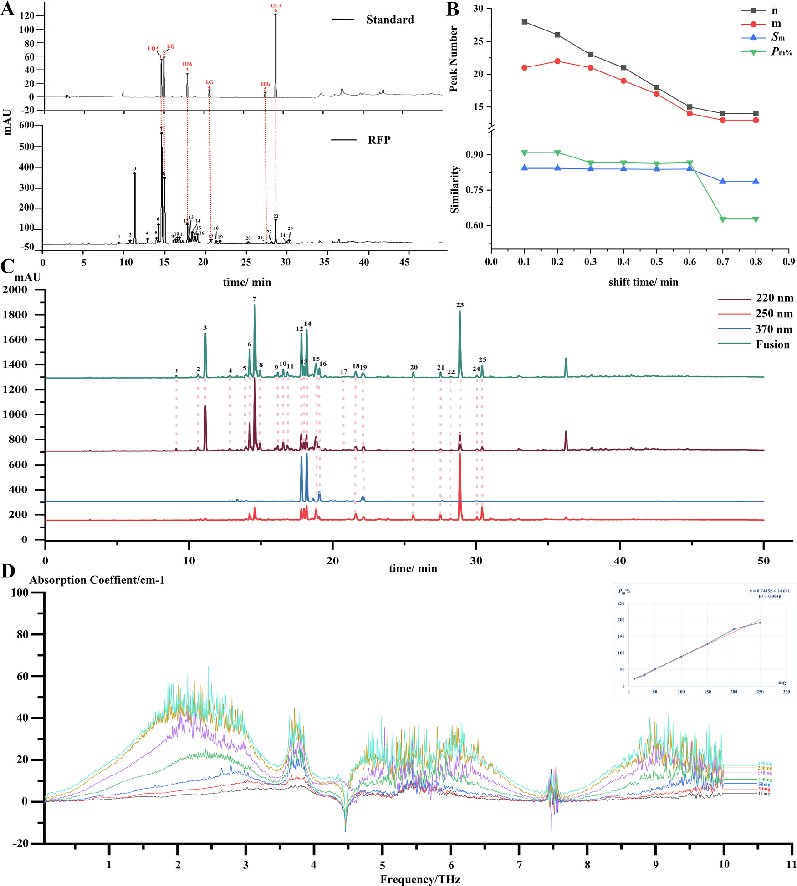
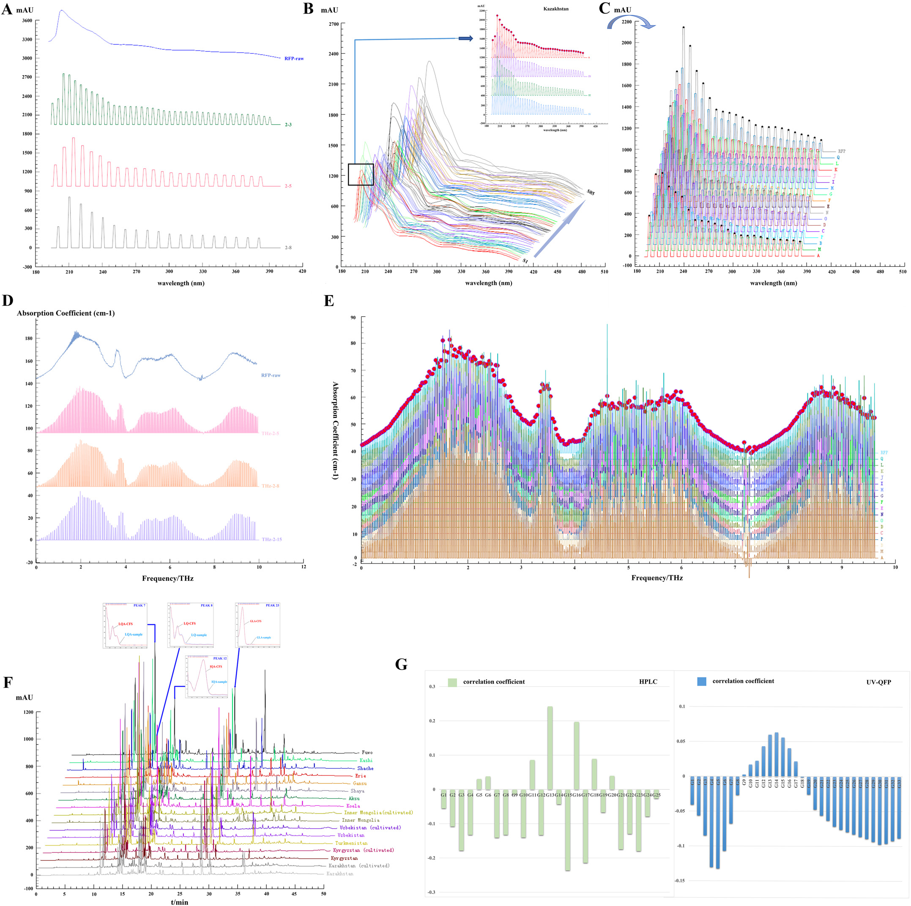

<!-- 方針: ほぼ全訳＋必要に応じた補足。原文構成に沿って訳出。「> 補足:」は訳者注。 -->

## 書誌情報

- 原題: A trinity fingerprint evaluation system of traditional Chinese medicine
- 著者: Huizhi Yang, Ting Yang, Dandan Gong, Xiaohui Li, Guoxiang Sun, Ping Guo（瀋陽薬科大学 薬学院／中国通信科技(江門)有限公司, 中国）
- 掲載: *Journal of Chromatography A* 1673 (2022) 463118. https://doi.org/10.1016/j.chroma.2022.463118
- インパクトファクター: **要確認**（*Journal of Chromatography A*）。複数の二次情報源（wos-journal.info、journalimpact.org、bioxbio.com 等）で 2024年JCR値として 4.21／4.0／3.843 など異なる数値が示されており、Clarivate公式JCRを直接確認できなかったため、正確な値は捏造せず「要確認」とする。
- 受理経過: 受領 2022-02-26 / 改訂 2022-04-29 / 採録 2022-05-02 / オンライン公開 2022-05-10 / © 2022 Elsevier B.V. All rights reserved.

> 補足: 略語一覧（原文Abbreviations節より）— BCA: bivariate correlation analysis（バイバリエート相関解析）; ESM: external standard method（外標準法）; GLA: glycyrrhizic acid（グリチルリチン酸）; IEM: interval erasure method（区間消去法）; ILG: isoliquiritigenin（イソリクイリチゲニン）; IQA: isoliquiritin apioside（イソリクイリチンアピオシド）; LG: liquiritigenin（リクイリチゲニン）; LQ: liquiritin（リクイリチン）; LQA: liquiritin apioside（リクイリチンアピオシド）; MAML: multi-markers assay by monolinear method（単一直線多成分定量法）; MEMA: measurement marker（測定基準物質）; QAMS: quantitative analysis of multi-components by single-marker（単一マーカーによる多成分定量法）; QFP: quantum fingerprint（量子指紋）; RFP: reference fingerprint（参照指紋）; SQFM: systematically quantified fingerprint method（系統定量指紋法）; TCM: traditional Chinese medicine（伝統中薬）; PCA: principal component analysis（主成分分析）; FIA: flow injection analysis（フローインジェクション分析）。

## 要旨（Abstract）

本研究は、伝統中薬（TCM）の多層性・多特性を反映できる一連の品質評価法の開発を目的とした。甘草（*Glycyrrhiza glabra* L.）を方法開発用試料とし、活性成分間の検量線関係を通じて、単一直線多成分定量法（MAML）の実現可能性を初めて検討した。グリチルリチン酸（GLA）を測定基準物質（MEMA）として用いることで、MAMLは甘草の5成分（イソリクイリチゲニン、イソリクイリチンアピオシド、リクイリチゲニン、リクイリチン、リクイリチンアピオシド）を同時に定量できた。MAMLとQAMS（単一マーカーによる多成分定量法）をそれぞれ外標準法（ESM）と比較したところ、MAMLとESMで算出した成分含量には有意差がない（相対誤差(RE)は概ね2.00%未満）ことが分かった一方、QAMSで算出した成分含量のREは大きくばらつき、MAMLの方がQAMSより正確であることが示された。さらに、区間消去法（IEM）によりUVおよびTHz量子指紋を導入した。系統定量指紋法（SQFM）を核として、HPLC・UV・THzに基づく「三位一体（Trinity）」指紋品質評価システムを開発した。本システムは、13産地・2栽培形態の甘草試料の品質差を総合評価結果によって判別することに成功した。同時に、異なる加工技術水準の甘草の品質情報も明らかにした。最後にバイバリエート相関解析（BCA）を用い、UV/HPLCと抗酸化スペクトル効果との関連性を検討し、甘草の二次元活性スペクトルを提示した。本手法は、化学指紋特性・化学結合振動特性・生物活性情報の観点から、甘草をはじめとする他のTCMに対して、より徹底的かつ客観的な分析技術を提供しうる。

© 2022 Elsevier B.V. All rights reserved.

## 1. 序論（Introduction）

2019年の新型コロナウイルス（2019-nCoV）の発生以来、伝統中薬（TCM）は中国における予防・治療戦略の要となっている。一方、医薬品の安全性はTCMの内在的品質と密接に関わっている。TCMの内在的品質は、産地の違いや栽培方法の違いなど様々な要因により大きく変動しうる。TCMの複雑な混合機構は、その品質管理をより難しくしている。そこで本研究では、13産地由来の甘草（*Glycyrrhiza glabra* L.）85バッチを方法開発用試料とし、TCMのための統合的な品質管理法の構築に取り組んだ。

現在、クロマトグラフィー指紋、特にHPLC指紋はTCMの品質管理に広く利用されている。しかしHPLC-DAD指紋分析は通常、固有の波長で決定されるため、後続のデータ処理において一部の物質の応答が単一波長では低すぎたり、検出されなかったりすることがある。単一波長では全化合物の紫外(UV)最大吸収特性を特徴づけることはできない。そこで、他波長における指紋情報も考慮し、有用情報の抽出のための基盤を提供するために、三波長最大融合指紋が確立された。しかし残念ながら、この手法もUV吸収を持つ一般的な化合物の指紋特性しか考慮していなかった。このような状況下、複数の検出技術を組み合わせてTCMの品質を制御することが不可欠であった。紫外可視吸収は主に共役系または芳香族系成分の不飽和帯情報を明らかにする。フローインジェクション分析（FIA）法と組み合わせることで、低消費・高精度での迅速な試料分析が可能になり、主観的な波長選択の一面性を回避できる。テラヘルツ（THz）応答は分子集団挙動と組み合わせることで、TCM中の高分子（アミノ酸、炭水化物等）の全体構造や関連する環境情報の振動モードを反映しうる。この3手法の原理は相補的であるだけでなく、TCM分析の分類・類似性評価においても一般的に用いられている。しかしスペクトルデータは一般に、連続信号・冗長情報・複雑な図形という特徴を持ち、包括的な定性・定量分析への利用が難しい。以上の問題を踏まえ、Guoxiang Sun教授は、連続的なスペクトル信号を区間消去法（IEM）により数量化する「量子指紋（QFP）」を提唱した。デジタル情報処理による統合・縮約の結果は量子指紋ピークとして表現される。確立されたQFPは対象の情報特徴を網羅するだけでなく、スペクトル特性をより簡潔・直感的にする。TCMの品質は、クロマトグラフィー（HPLC-FP）とスペクトル（UV-QFPおよびTHz-QFP）を用いる系統定量指紋法（SQFM）によって評価された。

さらに、TCMはいまだ体系的な標準化を達成できておらず、一部の標準物質は高価であるため、成分の定量が困難な場合がある。そこで、単一直線多成分定量法（MAML）が提案され、甘草で初めて検証された。MAMLは単一マーカーによる多成分定量法（QAMS）からの更なる技術革新である。MAMLは線形範囲と系統的方法論、さらには誤差解析・信頼性解析理論に焦点を当てることで、操作誤差を最小化し分析技術の精度を高める。本研究では甘草の定量指紋を用い、グリチルリチン酸（GLA）を測定基準物質（MEMA）として、定量成分の標準曲線下で絶対補正係数を算出し、続いて対応成分の相対補正係数を求めた。また活性化合物の定量的な制御に加え、1,1-ジフェニル-2-ピクリルヒドラジル（DPPH）ラジカル消去アッセイにより甘草試料のin vitro抗酸化活性を検討した。バイバリエート相関解析（BCA）を通じて、UVとHPLCの間の抗酸化活性のスペクトル-薬効関係を論じ、試料の二次元活性プロファイリングを提示した。要するに本論文は、TCMの機能特性・多成分性・多層性等を反映しうる、科学的・厳密・標準化された品質評価法群の確立を目的とした。

## 2. 理論（Theory）

### 2.1 系統定量指紋法（Systematically quantified fingerprint method, SQFM）

SQFMは、実用性と適応性を兼ね備えたTCM系の巨視的定量評価法である。定性比類似度（***S***F'）は、大きなピークが小さなピークを覆い隠してしまうという定性類似度（***S***F）の問題を克服できる。***S***F'はすべての指紋ピークに等しい重みを与える。TCMの化学指紋のピーク数と分布比を監視し曖昧さを解消する巨視的定性類似度係数（***S***m）は、この両者の平均である。同様に、定量類似度（***P***）も、投影含量類似度（***C***）における大きなピークが小さなピークを覆い隠す一面性を克服できる。***P***と***C***の平均値は巨視的定量類似度（***P***m）と呼ばれ、化学指紋の全体含量を全体として監視するために用いられる。原文の式(1)–(2)にすべての算出式が示されており、*x*iおよび*y*iはそれぞれ試料指紋（SFP）と参照指紋（RFP）のピーク面積を表す。RFPは全試料の指紋を平均して得る。

> 補足: 原文の式(1)（***S***m）・式(2)（***P***m）はOCR抽出の都合上、分数・総和記号を含む数式表記が崩れているため本訳では再現していない。数式の厳密な形は原論文の該当箇所を参照されたい。

したがって、***S***mと***P***mの両方を用いてTCMの品質を評価する方法をSQFMと呼び、両者のうち低い方の値が品質等級を決定する。これによりTCMは以下の8等級に区分される。

- Grade1 = [***S***m≥0.95, 95%≤***P***m≤105%]、Grade2 = [***S***m≥0.90, 90%≤***P***m≤110%]
- Grade3 = [***S***m≥0.85, 85%≤***P***m≤115%]、Grade4 = [***S***m≥0.80, 80%≤***P***m≤120%]
- Grade5 = [***S***m≥0.70, 70%≤***P***m≤130%]、Grade6 = [***S***m≥0.60, 60%≤***P***m≤140%]
- Grade7 = [***S***m≥0.50, 50%≤***P***m≤150%]、Grade8 = [***S***m<0.50、または***P***mが50%未満／150%超]

### 2.2 単一直線多成分定量法（Multi-markers assay by monolinear method, MAML）

MAMLは、QAMSの原理とTCM定量指紋の理論を組み合わせた新規手法である。指紋検出と同一のクロマトグラフィー条件下で複数の活性化合物の標準曲線を確立する。測定基準物質（MEMA）の標準曲線を用いて、他化合物の標準曲線パラメータについて相対補正係数・誤差・信頼性を算出する。許容誤差範囲内で、標準曲線法を最大限に簡略化し標準物質の使用を節約するという目的が達成される。

MEMA（s）と他化合物（i）の標準曲線に基づき、絶対補正係数（*f*i）を式(3)–(6)のとおり算出する。*b*as = *a*s/*C*sおよび*b*ai = *a*i/*C*iという式は、*b*asおよび*b*aiが濃度に大きく影響することを示す。濃度が大きいほど切片の傾きは小さくなり、測定誤差も小さくなる。線形平均濃度 *C*0 = 0.5(*C*1+*C*2) は、一般に最良の試験試料濃度として受け入れられている。式(7)のとおり相対補正係数（*f*si）を算出する。*b*a = |*a*/*C*| ≤ 1%*b*（誤差1.0%未満）の場合、式(8)の傾きの式を用いて直接求めることができ、この比は簡易相対補正係数（*f*'si）と呼ばれる。さらに、相対補正係数の誤差（方法信頼性 *R* と呼ぶ）も式(9)で検討され、これは秤量誤差（*RSD*Cs）、標準曲線誤差（*b*as/*b*s）、MEMAの相対ピーク面積誤差（*RSD*As）、および他化合物のそれ（*RSD*Ai）を含む。したがってMAMLは、QAMSに欠けていた線形範囲の検査と系統的な技術検証を補い、試験技術者に誤りを排除する方法も助言できる。

主要な算出式（原文式(3)–(10)、簡略表記）:
- *A*s = *b*s*C*s + *a*s（MEMAの回帰式）、*A*i = *b*i*C*i + *a*i（成分iの回帰式）
- *f*s = *A*s/*C*s = *b*s + *b*as、*f*i = *A*i/*C*i = *b*i + *b*ai
- *f*si = *f*s/*f*i = (*b*s+*b*as)/(*b*i+*b*ai)、簡易版: *f*'si ≈ *b*s/*b*i
- *R* = 1 − *RSD*Ci（*RSD*Cs・*b*as/*b*s・*b*ai/*b*i・*RSD*Ai・*RSD*Asを含む合成誤差から算出）、*R* ≥ 95.5% を要求
- 含量算出: *C*m = *f*si × *C*ms × *A*m / *A*ms （*C*ms はESMで求めたMEMA濃度、*A*m・*A*ms は成分・MEMAのピーク面積）

### 2.3 TCM THz量子指紋の一致性評価システム

一般に、テラヘルツ透過スペクトルはTHz-TDSシステムにおいて光学パラメータを抽出するために最も広く用いられる手法である。主な抽出の考え方は、光路下で試料の実信号（***E***sam(*t*)）と、試料なしで得られる参照信号（***E***ref(*t*)）を測定することである。次にフーリエ変換操作法を用い、直接受信した時間領域信号を周波数領域信号（***E***ref(*ω*)、***E***sam(*ω*)）に変換する。試料の屈折率・吸収係数は、DorneyおよびDuvillaretが提案した方法によるデータ処理で得られる（原文式(11)–(13)）。*n*(*ω*)は試料の屈折率、*ω*は周波数、*ϕ*(*ω*)は試料信号と参照信号の位相差、*α*(*ω*)は試料の吸収係数、*A*(*ω*)は周波数領域信号における試料と参照の振幅比、*d*は試料の厚さを表す。

これに基づき、区間消去法（IEM）によって量子指紋が構築される（使用ソフトウェアは3.7節に記載）。これは本質的にスペクトルをクロマトグラフィー的な量子ピークへ変換する過程である。式(14)–(16)のとおり、***H***・***A***bi・***W***はそれぞれピーク高さ・ピーク面積・ピーク幅を表す。*b*iは消去開始点の吸光度、*W*はピーク幅、*i*は消去点の数を示す。

- *H* = *A*bi（ピーク高さ = 消去開始点の吸光度）
- *A* = *W*×*H*（ピーク面積）
- *W* = *i*/200（ピーク幅 = 消去点数/200）

スペクトル量子指紋の利用は、ソフトウェアによってスペクトル吸収係数の周波数を数量化し、クロマトグラフィー指紋ピークのようにピークをマッチングできるようにすることを目的とする。これによりTCMのスペクトログラムの定性・定量分析の可能性が開かれる。

## 3. 材料と方法（Materials and methods）

### 3.1 試薬と化学物質

13の異なる産地（国内9産地、海外4産地。詳細は補足Table S1）から採取された、野生・栽培の甘草（*Glycyrrhiza glabra* L.）試料85バッチを、新疆Fuwo製薬有限公司より提供を受けた。

標準物質グリチルリチン酸（GLA, 98.5%）、リクイリチゲニン（LG, 98.5%）、イソリクイリチゲニン（ILG, 99.0%）、リクイリチンアピオシド（LQA, 99.0%）、イソリクイリチンアピオシド（IQA, 99.0%）、リクイリチン（LQ, 93.1%）は、中国食品薬品検定研究院（北京）より購入した。HPLCグレードのメタノール、アセトニトリル、リン酸は玉皇実業有限公司（山東）から入手した。ヘプタンスルホン酸ナトリウムは中美化学有限公司（山東）から供給された。ポリエチレン粉末（AR級）は上海冠歩機電科技有限公司（上海）から入手した。実験を通して脱イオン水を使用した。

### 3.2 試料調製

85バッチの甘草試料を均一な粒度に粉砕し、40メッシュふるいでふるい分け、自封袋に入れ、使用前はいずれも遮光保管した。

**3.2.1 THz用試料調製:** 甘草粉末を電熱送風乾燥オーブン（DHG-9070A、上海一恒科学儀器有限公司）で60℃・2時間あらかじめ乾燥し、取り出してデシケーター内で冷却した。約0.2 gの甘草粉末を秤量し、打錠成型器（HY-12、天津天光新光学儀器有限公司）に載せ、24 MPaで1分間加圧して直径13 mmの円形錠剤に成形した。

**3.2.2 HPLC試料・標準溶液調製:** 試料粉末1 gを80%メタノール水溶液45 mLで超音波抽出（120 W、40 kHz、JP-020、深圳市思棋美清洗設備有限公司）した（20分間）。室温に戻した後、溶媒で50 mLに定容した。抽出後の試料溶液は0.45 μmミクロポア膜でろ過し分析に供した。6化合物を精密に秤量しメタノールに溶解して標準溶液（LQA 100 μg/mL、LQ 60 μg/mL、IQA 100 μg/mL、LG 10 μg/mL、ILG 20 μg/mL、GLA 800 μg/mL）を調製した。分析前、すべての試料・標準溶液は4℃遮光保存した。

### 3.3 HPLC分析条件

HPLC分析は、Quat Pump VLポンプ、オートサンプラー、フォトダイオードアレイ検出器（DAD）を備えたAgilent 1260シリーズ液体クロマトグラフ（Agilent Technologies, Santa Clara, CA, USA）を用いて実施した。甘草のクロマトグラフィー分離はCOSMOSILカラム（250 mm × 4.6 mm, 5 μm）で行った。

移動相は2相構成: (A) 5 mMヘプタンスルホン酸ナトリウム溶液-リン酸(499:1, v/v)、(B) アセトニトリル-メタノール(9:1, v/v)、流速1.0 mL/min。グラジエント溶出は次のとおり: 0–13 min、96%→70% A; 13–15 min、70%→67% A; 15–18 min、67%→66% A; 18–40 min、66%→18% A; 40–45 min、18%→15% A; 45–50 min、15%→96% A。注入量5 μL、総分析時間50分、カラム温度35℃。DAD検出波長は220 nm、250 nm、370 nmの3波長。

### 3.4 UV分光条件

FIAを分析原理とし、DADを備えたAgilent 1100 HPLCシステム（Agilent, USA）上でPEEKチューブ（5000 mm × 0.12）を用いてUVスペクトルを記録した。190–400 nmの波長範囲で、波長間隔1 nm・スリット幅1 nmで検出した。3.2.2節で調製した試料溶液を10倍希釈後、80%メタノール-水(80:20, v/v)をキャリアとし、流速1 mL/min・35℃でPEEKチューブに5 μL注入した。

### 3.5 THz分光条件

THzスペクトルデータはCCT-1800テラヘルツ時間領域分光計（中国通信科技有限公司, 深圳）で測定した。装置を20分間予熱後、窒素を導入して試料室の水蒸気を除去し、窒素参照スペクトルを取得した。各試料スペクトルは100回スキャンして測定した。

### 3.6 抗酸化活性分析

甘草の抗酸化能を確認するため、85試料に対しDPPHアッセイをJinyu Chenらの方法をわずかに改変して用いた。実験前にDPPH溶液（0.064 mg/mL）を80%メタノールで調製し遮光保存した。3.2.2節で調製した甘草試料抽出液を10倍希釈し、その2 mLと一定量（0, 0.3, 0.5, 1, 1.5, 1.8, 2 mL）のDPPH溶液を混合し、80%メタノールで5 mLに定容した。混合物を暗所で40分間反応させ、80%メタノールをブランクとしてUV分光光度計（島津160A）で517 nmの吸光度を測定した。各試料は3連で測定した。

DPPHラジカル消去活性率（*RS*%）は次式で表される。

*RS*% = [*A*0 − (*A*s − *A*b)] / *A*0 × 100%（式17）

*A*0は陰性対照溶液（DPPH + 80%メタノール）の吸光度、*A*sは試料溶液（DPPH + 試料 + 80%メタノール）の吸光度、*A*bはブランク溶液（試料 + 80%メタノール）の吸光度を表す。*RS*%値を試料濃度に対してプロットし、甘草の抗酸化能を表す50%阻害濃度（IC50）を算出した。

### 3.7 データ解析

THzおよびUV指紋のデータは、自社開発ソフトウェア「TCM Spectrum Quantum Profiling Consistency Digitized Evaluation System 4.0」（ソフトウェア認証番号 7,037,415、中国）で解析した。HPLC指紋は「Digitized Evaluation System for consistency of TCM spectral Fingerprints 4.0」（ソフトウェア認証番号 0,407,573、中国）で解析した。主成分分析（PCA）にはOrigin 2019bを用いた。

## 4. 結果と考察（Results and discussion）

### 4.1 方法論的検証

標準物質と試料の指紋ピークの保持時間・UVスペクトルを比較することで、ピーク7, 8, 12, 17, 21, 23が220 nmにおいてそれぞれLQA, LQ, IQA, LG, ILG, GLAであることが確定された（図1）。3.3節で確立したHPLC法の頑健性をさらに検討するため、S1を用いて方法論的検証を行った。6化学物質の目標濃度範囲において、関連する標準曲線の相関係数（R）はいずれも0.999超であり、良好な線形関係が示された（表1）。検出限界・定量限界はそれぞれ1.5–32.3 ng、4.84–107.66 ngであった。6化合物の回収率は97.6%、101.9%、98.6%、97.6%、100.3%、98.5%であり、方法の正確性は要求を満たすことが示された。6つの定量ピークの保持時間（RT）・ピーク面積（PA）の相対標準偏差（***RSD***）を用い、含量測定法の精度・再現性・安定性を検証した。精度はS1を6回注入して、再現性はS1由来の6個別試料を分析して検証し、安定性は同一試料（S1）を25℃で32時間（0, 2, 4, 6, 8, 12, 24, 32時間）安定に保持して検証した。RTおよびPAの***RSD***はそれぞれ1.0%未満、2.0%未満であった。GLA（ピーク23）を参照ピークとして、25個の共通ピークの相対RT・相対PAの***RSD***を算出したところ、それぞれ0.23%未満、3.84%未満であった。

UVの方法論的検討は3.4節の条件に従って実施した。方法精度を評価するため、同一試料（S1）を6回連続注入し、方法再現性の分析のため6個の別試料（S1）を連続注入した。試料の安定性は25℃で0, 2, 4, 6, 8, 12時間モニタリングした。220 nmでの未分離クロマトグラムのRT・PAの***RSD***を精度・再現性・安定性の評価に用いた結果、それぞれ0.52%未満、2.07%未満であった。

さらにTHz-QFP法の実現可能性を検証し、SQFMのパラメータ***P***mに基づいて直線性・精度・再現性・特異性を検討した。試料0, 11, 30, 50, 100, 150, 200, 250 mgを精密に秤量し、200 mg未満の試料にはポリエチレン粉末（PE）を添加して200 mgとした。3.2.1節の方法を用いてTHzで曲線を記録した（図1D）。試料質量を横軸、***P***mを縦軸として線形回帰式を求めたところ、***P***m = 0.7445*m* + 14.691（*r* = 0.9935）となり、11–250 mgの範囲で試料質量と***P***mの間に良好な線形関係があることが示された。3.5節の方法に従いS1試料を6回連続測定して精度を評価したところ、***P***mの***RSD***は1.34%であった。6個のS1試料を分析して再現性を検討したところ、***P***mの***RSD***は1.28%であった。特異性については、試料室に水蒸気ピークやPE粉末が存在せずTHz検出を妨害しないことが求められる。以上の試験結果から、確立された方法は所定の要求を満たすことが示された。

**表1. 6分析対象物の検量線・LOD・LOQ・回収率**

| 分析対象 | 回帰式 | R² | 直線範囲(μg/mL) | LOD(ng) | LOQ(ng) | 回収率(%) | RSD(%) |
|---|---|---|---|---|---|---|---|
| LQ | y = 17.388x + 1.6534 | 0.9999 | 14.5–870.5 | 2.2 | 7.3 | 97.6 | 1.09 |
| LG | y = 28.829x − 3.1188 | 0.9998 | 4.8–58.1 | 1.5 | 4.8 | 101.9 | 1.25 |
| ILG | y = 12.072x − 1.0910 | 0.9998 | 1.7–51.2 | 2.6 | 8.5 | 98.6 | 2.50 |
| LQA | y = 11.902x + 1.9934 | 0.9999 | 15.5–930.6 | 2.3 | 7.8 | 97.6 | 1.48 |
| IQA | y = 5.8756x + 0.0158 | 0.9998 | 34.9–418.3 | 5.2 | 17.4 | 100.3 | 3.80 |
| GLA | y = 1.0623x + 0.2017 | 0.9995 | 64.6–1938.0 | 32.3 | 107.7 | 98.5 | 2.10 |

（y: ピーク面積、x: 標準物質の濃度(μg/mL)。LQ: リクイリチン、LG: リクイリチゲニン、ILG: イソリクイリチゲニン、LQA: リクイリチンアピオシド、IQA: イソリクイリチンアピオシド、GLA: グリチルリチン酸）

### 4.2 6成分の定量分析

**4.2.1 MAML定量分析**

MAMLがQAMSに代わって甘草の活性成分をより正確に定量できるかを検討するため、外標準法（ESM）・QAMS・MAMLの3手法で6物質の濃度を決定した（詳細は補足Table S3、原文参照）。ESMでは、表1に示した線形回帰式から定量成分含量を容易に算出できる。GLAをMEMAとして用い、残り5化合物の含量はZhimin Wangらの方法によるQAMSで算出した。2.2節のMAML原理に基づき、GLAを同じくMEMAとして用いた。まず、*R*は95.5%を上回った（表2）。次にILG, LG, IQA, LQ, LQAの相対補正係数を算出した。最後に、ESMで算出したGLA濃度とピーク面積を用い、式(10)により5物質の含量を求めた。QAMSとMAMLの差異を比較するため、それぞれのESMに対する相対誤差（*RE*）を別途算出した（補足Table S4、原文参照）。

**表2. MAMLにより得られた甘草の各パラメータ値**

| 分析対象 | C0 | bai | fi | fsi | 1%bi | f'si | R(i)(%) |
|---|---|---|---|---|---|---|---|
| GLA | 1001.30 | −0.0002 | 1.0621 | 1.0000 | 0.0106 | 1.0000 | ― |
| ILG | 26.45 | −0.0412 | 12.0308 | 0.0883 | 0.1207 | 0.0880 | 97.53 |
| LG | 31.45 | −0.0992 | 28.7298 | 0.0370 | 0.2883 | 0.0368 | 97.97 |
| IQA | 226.60 | 0.0001 | 5.8757 | 0.1808 | 0.0588 | 0.1808 | 98.17 |
| LQ | 442.50 | 0.0037 | 17.4017 | 0.0610 | 0.1740 | 0.0611 | 98.34 |
| LQA | 473.05 | 0.0042 | 11.9042 | 0.0892 | 0.1190 | 0.0893 | 98.25 |

（C0: 線形平均濃度、bai: 切片の傾き、fi: 絶対補正係数、fsi: 相対補正係数、f'si: 簡易相対補正係数、R(i)%: 方法信頼性）

結果は、MAMLの*RE*がQAMSのそれより有意に低いことを示した。特にLQA・LQ・IQAという甘草中で高含量の成分でこの傾向が顕著であった。MAMLの*RE*は概ね0.50%以下であり、多くは0.10%を超えないほどであった。これはMAMLの結果とEMS（ESM）の結果に有意差がないことを示している。一方、一部のILG・LGの*RE*は2.0%を上回ったが、これはこれら成分の含量が4 μg/mL未満と低かったことに起因する。総括すると、MAMLはより信頼性の高い精度を持つ革新的な手法であることが強く証明された。MAMLはQAMSが持つ検出コスト・分析時間の削減という利点を継承しつつ、TCMの一致性評価のための定量指紋管理法を提供する。

**4.2.2 試料分析**

6活性成分の百分率含量を用いて、13産地由来の栽培・野生甘草試料の品質を判別した（表3）。85甘草試料におけるLQの平均百分率含量は0.43%であり、2020年版中国薬典（Ch.P.）が規定する含量（LQ≥0.50%）に達したのは23バッチのみであった。GLAの平均百分率は4.14%で、S71（1.00%）とS79（1.95%）を除き適格であった（GLA≥2.0%, 2020 Ch.P.）。試料中のIQAは0.10%–1.11%であり、LGおよびILGの含量はほぼ0.10%程度と低かった。全体として6活性成分の含量は顕著にばらつき、85試料における平均百分率含量の順位はGLA＞LQA＞IQA＞LQ＞LG＞ILGであった。

**表3. 甘草試料85バッチにおける6マーカーの百分率含量とIC50値**

> 補足: 単位はいずれも原文表記に従う（LQ・GLA・LQA・IQA・LG・ILG は乾燥試料に対する百分率含量[%]、IC50は原文中に単位の明記がないため「原文参照」とする）。試料番号(S1–S85)と個別産地の対応は補足Table S1に記載されており、原文の主要本文からは特定できないため「原文参照」とする。

| 試料 | LQ | GLA | LQA | IQA | LG | ILG | IC50 |
|---|---|---|---|---|---|---|---|
| S1 | 0.07 | 4.32 | 1.53 | 0.56 | 0.01 | 0.04 | 0.5531 |
| S2 | 0.13 | 4.01 | 1.43 | 0.52 | 0.03 | 0.04 | 0.3145 |
| S3 | 0.19 | 4.7 | 1.34 | 0.39 | 0.01 | 0.02 | 0.3215 |
| S4 | 0.12 | 6.65 | 2.09 | 0.89 | 0.03 | 0.06 | 0.4544 |
| S5 | 0.19 | 4.95 | 1.72 | 0.66 | 0.05 | 0.02 | 0.1056 |
| S6 | 0.59 | 4.57 | 1.57 | 0.53 | 0.02 | 0.01 | 0.1010 |
| S7 | 0.14 | 6.53 | 2 | 0.82 | 0.06 | 0.03 | 0.1411 |
| S8 | 0.26 | 5.47 | 1.68 | 0.56 | 0.02 | 0.05 | 0.1143 |
| S9 | 0.1 | 4.96 | 1.05 | 0.45 | 0.04 | 0.04 | 0.3007 |
| S10 | 0.01 | 4.08 | 1.67 | 0.64 | 0.07 | 0.05 | 0.1411 |
| S11 | 0.07 | 4.22 | 0.99 | 0.38 | 0.03 | 0.04 | 0.1143 |
| S12 | 0.05 | 5.13 | 1.15 | 0.46 | 0.03 | 0.04 | 0.3301 |
| S13 | 0.54 | 3.26 | 0.89 | 0.27 | 0.03 | 0.03 | 0.3918 |
| S14 | 1.45 | 2.14 | 0.59 | 0.14 | 0.03 | 0.03 | 0.1411 |
| S15 | 2.09 | 2.83 | 0.86 | 0.21 | 0.04 | 0.03 | 0.1143 |
| S16 | 0.75 | 4.27 | 1.61 | 0.46 | 0.07 | 0.03 | 0.2316 |
| S17 | 0.39 | 3.43 | 1.46 | 0.41 | 0.01 | 0.02 | 0.6318 |
| S18 | 0.79 | 3.84 | 1.12 | 0.29 | 0.03 | 0.01 | 0.5279 |
| S19 | 0.45 | 3.34 | 0.86 | 0.24 | 0.01 | 0.03 | 0.5334 |
| S20 | 0.31 | 4.92 | 2.17 | 0.85 | 0.03 | 0.02 | 0.2633 |
| S21 | 0.52 | 6 | 2.54 | 0.94 | 0.05 | 0.02 | 0.2676 |
| S22 | 0.44 | 3.18 | 1.38 | 0.4 | 0.02 | 0.02 | 0.3921 |
| S23 | 0.57 | 6.51 | 1.32 | 0.41 | 0.06 | 0.01 | 0.3241 |
| S24 | 0.56 | 4.81 | 1.9 | 0.65 | 0.02 | 0.01 | 0.2457 |
| S25 | 0.53 | 6.36 | 2.94 | 1.11 | 0.04 | 0.02 | 0.3033 |
| S26 | 0.69 | 5.63 | 2.04 | 0.78 | 0.07 | 0.03 | 0.2669 |
| S27 | 0.13 | 4.13 | 2.37 | 0.8 | 0.03 | 0.01 | 0.1184 |
| S28 | 0.59 | 3.52 | 1.49 | 0.41 | 0.03 | 0.03 | 0.1318 |
| S29 | 0.35 | 3.87 | 1.27 | 0.45 | 0.03 | 0.02 | 0.4121 |
| S30 | 0.54 | 2.75 | 1.02 | 0.27 | 0.03 | 0.02 | 0.3006 |
| S31 | 0.26 | 4.98 | 2.46 | 0.91 | 0.04 | 0.02 | 0.1184 |
| S32 | 0.52 | 5.74 | 2.84 | 1.04 | 0.07 | 0.02 | 0.1318 |
| S33 | 0.2 | 2.65 | 1.01 | 0.34 | 0.04 | 0.03 | 0.4348 |
| S34 | 0.66 | 4.34 | 1.85 | 0.6 | 0.04 | 0.03 | 0.3395 |
| S35 | 0.25 | 3.07 | 1.47 | 0.47 | 0.02 | 0.01 | 0.3541 |
| S36 | 0.51 | 4.37 | 1.86 | 0.6 | 0.07 | 0.01 | 0.2184 |
| S37 | 0.14 | 5.72 | 1.67 | 0.64 | 0.04 | 0.03 | 0.1318 |
| S38 | 0.41 | 5.01 | 1.44 | 0.5 | 0.04 | 0.01 | 0.1688 |
| S39 | 0.16 | 4.2 | 1.55 | 0.57 | 0.06 | 0.01 | 0.5155 |
| S40 | 0.2 | 4.61 | 1.41 | 0.5 | 0.09 | 0.01 | 0.1958 |
| S41 | 2.72 | 3.2 | 0.58 | 0.17 | 0.03 | 0.05 | 0.1935 |
| S42 | 2.28 | 5.64 | 1.2 | 0.37 | 0.04 | 0.09 | 0.1935 |
| S43 | 1.77 | 2.63 | 0.85 | 0.21 | 0.02 | 0.02 | 0.3413 |
| S44 | 1.28 | 3.06 | 1.19 | 0.36 | 0.17 | 0.02 | 0.3664 |
| S45 | 0.04 | 4.9 | 1.06 | 0.45 | 0.03 | 0.02 | 0.4276 |
| S46 | 0.03 | 3.71 | 0.79 | 0.29 | 0.04 | 0.01 | 0.4275 |
| S47 | 0.09 | 3.78 | 1.28 | 0.49 | 0.06 | 0.01 | 0.4358 |
| S48 | 0.09 | 5.19 | 1.54 | 0.53 | 0.05 | 0.01 | 0.3326 |
| S49 | 0.41 | 4.97 | 1.16 | 0.33 | 0.02 | 0 | 0.1822 |
| S50 | 0.27 | 5.24 | 0.87 | 0.26 | 0.07 | 0 | 0.1834 |
| S51 | 0.4 | 5.02 | 1.15 | 0.38 | 0.04 | 0 | 0.1535 |
| S52 | 0.12 | 4.43 | 1.04 | 0.44 | 0.03 | 0 | 0.2064 |
| S53 | 0.27 | 2.78 | 1.08 | 0.37 | 0.11 | 0.04 | 0.2246 |
| S54 | 0.71 | 4.6 | 1.88 | 0.6 | 0.05 | 0.07 | 0.3149 |
| S55 | 0.5 | 4.94 | 2.56 | 0.9 | 0.04 | 0.04 | 0.1184 |
| S56 | 0.3 | 4.42 | 1.98 | 0.7 | 0.04 | 0.1 | 0.1318 |
| S57 | 0.14 | 3.55 | 1.92 | 0.7 | 0.07 | 0.08 | 0.1638 |
| S58 | 0.31 | 3.99 | 1.46 | 0.47 | 0.21 | 0.07 | 0.2029 |
| S59 | 0.18 | 3.62 | 1.98 | 0.58 | 0.04 | 0.02 | 0.1650 |
| S60 | 0.36 | 4.15 | 1.52 | 0.54 | 0.02 | 0.05 | 0.2967 |
| S61 | 0.45 | 2.9 | 1.28 | 0.44 | 0.04 | 0.04 | 0.2073 |
| S62 | 0.31 | 4.13 | 1.38 | 0.43 | 0.03 | 0.05 | 0.1784 |
| S63 | 0.4 | 4.05 | 1.39 | 0.53 | 0.03 | 0.03 | 0.1411 |
| S64 | 0.1 | 2.3 | 0.76 | 0.25 | 0.04 | 0.04 | 0.3921 |
| S65 | 0.41 | 4.49 | 1.75 | 0.62 | 0.02 | 0.03 | 0.3241 |
| S66 | 0.4 | 3.93 | 1.19 | 0.44 | 0.02 | 0.06 | 0.1141 |
| S67 | 0.17 | 2.89 | 0.63 | 0.23 | 0.03 | 0.04 | 0.2083 |
| S68 | 0.19 | 2.78 | 1.27 | 0.42 | 0.01 | 0.02 | 0.2397 |
| S69 | 0.32 | 4.45 | 1.21 | 0.41 | 0.03 | 0.04 | 0.1919 |
| S70 | 0.25 | 3.64 | 1.07 | 0.39 | 0.02 | 0.04 | 0.1609 |
| S71 | 0.05 | 1 | 0.26 | 0.1 | 0.01 | 0.03 | 0.2804 |
| S72 | 0.18 | 2.96 | 0.9 | 0.29 | 0.02 | 0.03 | 0.2043 |
| S73 | 0.41 | 2.98 | 0.98 | 0.36 | 0.03 | 0.04 | 0.2025 |
| S74 | 0.2 | 4.18 | 1.85 | 0.73 | 0.06 | 0.05 | 0.3921 |
| S75 | 0.15 | 2.48 | 1.23 | 0.32 | 0.06 | 0.08 | 0.3241 |
| S76 | 0.37 | 4.29 | 2.35 | 0.81 | 0.03 | 0.06 | 0.3184 |
| S77 | 0.14 | 2.06 | 0.61 | 0.22 | 0.03 | 0.04 | 0.3500 |
| S78 | 0.35 | 4.85 | 1.43 | 0.51 | 0.03 | 0.03 | 0.3921 |
| S79 | 0.08 | 1.95 | 0.41 | 0.13 | 0.06 | 0.04 | 0.3241 |
| S80 | 0.49 | 4 | 1.51 | 0.55 | 0.07 | 0.04 | 0.3380 |
| S81 | 0.35 | 4.1 | 2.02 | 0.74 | 0.05 | 0.03 | 0.4525 |
| S82 | 0.23 | 4.58 | 1.12 | 0.38 | 0.02 | 0.05 | 0.1678 |
| S83 | 0.17 | 3.78 | 0.92 | 0.37 | 0.07 | 0.05 | 0.3334 |
| S84 | 0.2 | 5.74 | 1.65 | 0.61 | 0.03 | 0.08 | 0.1390 |
| S85 | 1.22 | 4.11 | 0.59 | 0.21 | 0.03 | 0.09 | 0.1801 |
| **平均** | 0.43 | 4.14 | 1.42 | 0.49 | 0.04 | 0.03 | 0.2684 |

産地によって6活性成分の含量は変動した（図2）。沙雅(Shaya)が最も高く(9.24%)、次いでキルギスタン(8.23%)、トルクメニスタン(8.09%)であった。対照的に、内モンゴルにおける6化合物の合計百分率含量が最も低く(5.17%)、次いで二連(Erie)(5.56%)、撫順(Fuwo)(5.87%)であった。6成分の含量は生育環境によっても顕著に異なり、カザフスタンおよび内モンゴル産の野生甘草試料における6分析化学物質の合計百分率含量は、栽培試料に比べてはるかに低かった。一方、キルギスタンでは逆の傾向を示し、キルギスタンの栽培試料（S49–S52、表3）ではILG含量がほぼ無視できるレベルであった。図2Aから、内モンゴルのLQ含量は他の12地域に比べ概して高いことも分かった。ウズベキスタンおよびキルギスタンの栽培試料は、他の産地に比べLG含量がはるかに多かった。

明らかに、6マーカーは大きく変動していた。したがって、マーカー化合物の定量分析のみで甘草の品質を評価するには限界があり、さらなる化学量論的（ケモメトリクス的）検討が必要であった。

**4.2.3 主成分分析（PCA）**

上記6指標の判別能をより詳しく調べるため、試料産地を区分基準とし、産地別平均データの次元削減にPCAを用いた。PCAモデルの2次元行列は17観測値×6変数(17×6)で構成され、全分散71.9%（PC1=49.7%、PC2=22.2%）を示した。さらに、LG・ILG・LQの3変数はPC1と負の関連を示し、IQA・LQA・GLAはPC1と正の関連を示した。全変数はPC2と正の相関を示した（図2B）。

図2Bに示すとおり、17観測値は主に4つのクラスに分けられた。沙雅(Shaya)・莎車(Shache)・トルクメニスタンの野生試料およびカザフスタンの栽培試料はクラスI。コエラ(Koela)・アクス(Aksu)・カシ(Kashi)・カザフスタン・甘粛(Gansu)・二連(Erie)の野生試料、およびキルギスタン・ウズベキスタンの2栽培形態試料はクラスII。撫順(Fuwo)の試料はIQA・LQA・GLAの含量の影響を受けPC1・PC2に正の相関を示すクラスIII。内モンゴルの試料（クラスIV）は地域間で顕著な差異を示し、栽培モードの観測値は95%信頼区間外に位置し外れ値とみなされた。この現象の理由として、内モンゴルにおけるLQ含量が他地域より顕著に高く、6マーカーの総体含量が低かったことが考えられる（図2B, E）。

しかし、クラスIIの座標位置からは、PCAにおける6化合物の負荷重みが大きくないことが示され、これは6化合物だけでは甘草の全体的な内在的品質を代表できず、指紋によるさらなる評価・管理が必要であることを示唆している。

### 4.3 指紋分析

**4.3.1 HPLCの融合指紋分析**

甘草の主要化学成分であるGLA（ピーク23）とLQ（ピーク8）は220 nmおよび250 nmで強いUV吸収を示した。加えて、甘草試料のUV吸収は波長ごとに明らかな差異を示した（図1C）。9–17分のピークは220 nmで最大応答を示し、17–25分および25–35分のピークはそれぞれ370 nmおよび250 nmで最大吸収を示した。そこで物質のUV吸収を最大化するため、三波長最大融合指紋を確立した。

各波長における総指紋ピーク数は220 nmで25、250 nmで13、370 nmで10と決定された。85バッチの試料のクロマトグラフィー信号を3.7節記載のソフトウェアに取り込んだ。次に、最大吸収ピークを融合基準として、25共通ピークを持つ三波長融合指紋を生成した。異なる融合時間窓間で***S***m・***P***m・***n***（総指紋ピーク数）・***m***（分離度***R***≥1.5でベースライン分離されたピーク数）を比較した（図1B）。全体の化学指紋の量・含量をできる限り正確に検出するため、***S***mおよび***P***mはそれぞれ0.70超・70%–130%の範囲で選択すべきである。さらに、***m***値が大きいという前提の下で、***m***/***n***比がより大きいものを選択すべきであり、これにより有効ピークの情報を保持しつつ不純物ピークの影響を除去できる。

融合時間窓の幅を0.2分に設定した場合に良好な類似性と適切なピーク数が得られることが示された。そのため、3検出波長のクロマトグラムは0.2分の融合時間窓で融合した。

**4.3.2 HPLC指紋類似度の定性・定量分析**

4.3.1節で述べた融合法により85試料の\*.CDFファイルを統合し、計25ピークを持つ85個のクロマトグラフィー合成指紋（CSF）を得た。産地に応じて、全試料を平均法で個別に算出した。野生・栽培の両産地を含む17対応地域の参照指紋（RFP）を取得した。UV/THz起源試料の指紋も同様の方法で取得した（図3C）。SQFMに基づき、***S***mおよび***P***m値によって様々な産地由来の甘草の内在的品質を評価した。表4に示すとおり、内モンゴルを除き、他地域の***S***m-HPLC値は0.800–0.900の間にあり、これはほとんどの地域の試料における化学組成または分布比の類似性が低いことを意味する。一方、産地間で化学組成含量に有意差があり、***P***m-HPLC値は大きく変動した（68.0%–130.0%）。内モンゴル試料の内在的品質は他地域と比較して有意に異なり、これはPCAスコア散布図（図2B）における内モンゴル試料の異常な分布を説明する。要約すると、SQFMは定性的・定量的双方の観点から甘草試料の指紋を評価でき、適切な品質管理の方法を提供する。

**4.3.3 UVおよびTHzスペクトル量子指紋の開発と確立**

連続信号を簡略化し評価をより容易にするため、量子分光法を用いて元のスペクトル計算に代えデータを簡略化できるか検討した。85甘草試料のUVおよびTHz指紋は、米国分析化学会が定める クロマトグラム統合ファイル規格に適合する\*.CDFファイルに変換された。2.3節のIEM原理に従い、ピーク幅2・区間点5、8、15の条件下でTHz指紋ピークの処理モードを検討した（図3B）。THz指紋の元のプロファイル・データ情報を維持するため、最終的にピーク幅2・区間点5の条件を選択しTHz-QFPを形成した。生のTHz指紋とTHz-QFPパラメータ（***S***mおよび***P***m）に対しそれぞれ*t*検定を実施したところ、*P*値は0.05超（両側検定）であり、両者間に有意差がないことが示された。UV-QFPも同様に処理した（図3A）。85個のUV-QFP／THz-QFPを産地別に分類し、算術平均法により各産地のRFPを取得し、甘草の二重スペクトル量子指紋の類似性を評価した（図3C, D, E）。

UV-QFPの評価結果では、内モンゴルを除き他地域試料の***S***m-UVはいずれも0.990超であった（表4）。これにより、内モンゴル産甘草の成分分布比が他地域と比較して有意に異なることが再確認された。190 nm–400 nmの範囲において、試料は***S***m-UVおよび極めて変動の大きい***P***m-UVにより4つの異なる等級に分けられた。他2種の指紋特性化情報とは異なり、***S***m-THzは大きく変動した(0.732–0.947)が、***P***m-THzは比較的安定していた。試料は4つの異なる等級に分けられた（表4）。さらに、栽培由来試料の品質等級は野生試料に比べ有意に高いことが示された。これは、栽培試料の成分の量・含量が人為的な管理を経ることで野生試料に比べ相対的に安定していることを示唆する。

特に注目すべきは、3つの検出技術で得られた指紋の品質等級がかなり異なっていた点であり、これはHPLC指紋で共通成分とみなされない追加ピークに起因する可能性がある。不飽和結合や助色団は、クロマトグラフィーよりもUVスペクトルへの寄与が大きい可能性がある。補足的に、THz技術は主に甘草試料中のアミノ酸・多糖類などの生体分子の解析に用いられる。同時に、低周波結合振動や結晶格子フォノン振動を含む多くの分子振動がそのスペクトルに反映される。これはさらに、単一の検出技術が一面的であり、多次元の化学成分のモードや特性を提供できず、TCMの包括的品質管理を制約することを示している。

**4.3.4 HPLC-FP・UV-QFP・THz-QFPの総合評価**

甘草試料の品質を多次元的に評価し品質等級を統一するため、HPLC・UV・THz指紋に基づく総合評価法を提案した。平均アルゴリズムを用い、式(18)–(19)により2つのパラメータ（***S***m-HPLC+UV+THzおよび***P***m-HPLC+UV+THz）を評価した。

- ***S***m-HPLC+UV+THz = (***S***m-HPLC + ***S***m-UV + ***S***m-THz) / 3（式18）
- ***P***m-HPLC+UV+THz = (***P***m-HPLC + ***P***m-UV + ***P***m-THz) / 3（式19）

表4に、異なる産地由来の甘草試料の総合品質評価結果を示す。13産地のうち、内モンゴル・二連(Erie)・コエラ(Koela)はGrade4、トルクメニスタン・甘粛(Gansu)・沙雅(Shaya)・莎車(Shache)・キルギスタンはGrade3、残りの地域はGrade2と評価された。総合評価パラメータからは、内モンゴルを除き、残る3地域（キルギスタン・ウズベキスタン・カザフスタン）の栽培試料の***S***m-HPLC+UV+THzは野生試料より大きく、対応する***P***m-HPLC+UV+THzの変動は小さいことが示された。これは、人為的に管理された甘草試料が高い内在的品質類似性を持つことを示している。結論として、本研究は試料の化学組成の類似性と、化学結合全体の振動スペクトルの類似性を組み合わせた。これにより、検出原理・検出範囲の違いに起因して単一の指紋法が評価結果に偏りをもたらす可能性を回避した。したがって、本研究で提案した総合評価は優れた品質管理法であるといえる。

**表4. SQFMによる2栽培形態17地域の評価結果**

| 産地・栽培形態 | HPLC Sm | HPLC Pm(%) | HPLC等級 | THz-QFP Sm | THz-QFP Pm(%) | THz等級 | UV-QFP Sm | UV-QFP Pm(%) | UV等級 | 総合 Sm | 総合 Pm(%) | 総合等級 |
|---|---|---|---|---|---|---|---|---|---|---|---|---|
| Turkmenistan | 0.886 | 121.4 | 3 | 0.801 | 100.5 | 4 | 0.995 | 69.4 | 6 | 0.894 | 97.1 | 3 |
| Fuwo | 0.828 | 83.3 | 4 | 0.891 | 99.9 | 3 | 0.995 | 110.1 | 3 | 0.904 | 97.8 | 2 |
| Gansu | 0.835 | 86.7 | 4 | 0.853 | 95.6 | 3 | 0.993 | 74.5 | 5 | 0.894 | 85.6 | 3 |
| Koela | 0.647 | 93.7 | 3 | 0.883 | 95.7 | 3 | 0.999 | 103.7 | 2 | 0.843 | 97.7 | 4 |
| Aksu | 0.883 | 93.8 | 3 | 0.833 | 95.1 | 4 | 0.996 | 100.5 | 2 | 0.904 | 96.5 | 2 |
| Shaya | 0.848 | 129.0 | 5 | 0.866 | 97.9 | 3 | 0.999 | 111.3 | 3 | 0.904 | 112.7 | 3 |
| Erie | 0.832 | 74.4 | 5 | 0.813 | 97.9 | 4 | 0.992 | 72.6 | 5 | 0.879 | 81.6 | 4 |
| Shache | 0.8 | 105.9 | 4 | 0.879 | 97.8 | 3 | 0.997 | 89.8 | 3 | 0.892 | 97.8 | 3 |
| Kashi | 0.874 | 97.4 | 3 | 0.902 | 99.6 | 3 | 0.996 | 100.7 | 3 | 0.924 | 99.2 | 2 |
| Inner Mongolia | 0.726 | 68.7 | 6 | 0.827 | 96.6 | 4 | 0.981 | 93.1 | 2 | 0.845 | 86.1 | 4 |
| Inner Mongolia(cultivated) | 0.59 | 77.6 | 7 | 0.93 | 95.4 | 2 | 0.987 | 111.4 | 3 | 0.836 | 94.8 | 4 |
| Kyrgyzstan | 0.892 | 120.1 | 4 | 0.732 | 96.6 | 5 | 0.995 | 69.4 | 6 | 0.873 | 95.4 | 3 |
| Kyrgyzstan(cultivated) | 0.876 | 91.4 | 3 | 0.947 | 104.1 | 2 | 0.995 | 89.9 | 3 | 0.939 | 95.1 | 2 |
| Uzbekistan | 0.883 | 101.7 | 3 | 0.82 | 95.1 | 4 | 0.998 | 90.4 | 2 | 0.9 | 95.7 | 2 |
| Uzbekistan(cultivated) | 0.855 | 96.3 | 3 | 0.893 | 103.8 | 3 | 0.998 | 101.0 | 2 | 0.915 | 100.4 | 2 |
| Kazakhstan | 0.914 | 104.8 | 2 | 0.812 | 95.6 | 4 | 0.997 | 103.1 | 2 | 0.908 | 101.2 | 2 |
| Kazakhstan(cultivated) | 0.884 | 106.3 | 3 | 0.916 | 95.4 | 2 | 0.998 | 99.9 | 2 | 0.933 | 100.5 | 2 |
| **平均** | 0.827 | 97.2 | 4 | 0.859 | 97.8 | 3 | 0.995 | 93.6 | 2 | 0.893 | 96.2 | 3 |

## 5. スペクトル-薬効関係解析（Spectrum-effect relationship analysis）

DPPHを用いて85試料のin vitro抗酸化活性をIC50として決定した。試料間の抗酸化能には有意な差があり、これは単一成分のみに起因するものではないと考えられた（表3）。両者の内在的関係を検討するため、220 nmにおけるHPLC指紋の25共通ピーク面積とIC50値をBCA法により解析した。結果はPearsonの*r*（*r*P）で表された（図3G）。負の相関を示すピークは抗酸化活性に重要な役割を果たす。*r*P値が小さいほど抗酸化への寄与が大きいためである。HPLCのスペクトル-薬効関係分析では、ピーク5, 6, 9, 11, 13, 16, 18, 20（正の相関を示すピーク）を除き、残りのピークは甘草の抗酸化活性と強い負の相関を示した。中でもLQA（ピーク7）、LQ（ピーク8）、IQA（ピーク12）、LG（ピーク17）、ILG（ピーク21）などのフラボノイド類は有意な抗酸化能を有していた。トリテルペノイドであるGLA（ピーク23）も抗酸化活性を有していた。一般的なスペクトル処理法ではUVのスペクトル-薬効関係分析は困難であるが、QFPはこれを達成できる。ピーク群1–8（190 nm–231 nm）とピーク群19–33（277 nm–400 nm）は図3Gにおいて負の相関を示した。これらの2つの波長帯において、甘草中の大半のフラボノイド類が高い吸収強度を示すことは難しくなく見出せた。結果は、これらの波長帯でπ-π*またはn-π*電子遷移を生じる甘草中の物質が、抗酸化に有意な影響を与えることを示した。TCMの成分は複雑であり、抗酸化機構はさらに複雑である。原理の違いによりスペクトル-薬効関係には差異があるものの、これらは相互に補完しあって二次元の抗酸化プロファイルを形成し、TCMのさらなるin vitro分析に資する。

## 6. 結論（Conclusions）

SQFMを核とし、MAMLを基礎として、本研究はHPLC定量指紋の管理法を独創的に構築し、「三位一体（Trinity）」指紋評価システムと二次元活性スペクトルを用いて甘草の品質を評価した。SQFMにより、甘草の指紋化学特性と分子化学結合の振動スペクトルとの類似性を検討した。異なる産地・2栽培形態の甘草試料は異なる等級に区分された。加えて、MAMLを甘草の品質評価システムに初めて適用し、その結果はMAMLがTCMの多指標品質管理のための新たな方法を提供する革新的な手法であることを疑いなく証明した。MAMLはQAMSより優れている。本論文で提案した「三位一体」指紋評価システムには、HPLC指紋だけでなく、UV-QFPおよびTHz-QFPという2つの新興の量子指紋も含まれる。抗酸化とUV-QFP／HPLC-FPとの関係をさらに検討し、甘草の生物活性情報を補完的に証明した。これらの評価法は互いに補完し合い、TCMのより包括的かつ客観的な品質管理のための多次元的・知的な戦略を提供する。

## 訳者補足

- **MAMLの実務的意義:** MAMLはQAMSと同様、高価な標準物質を持たない成分についても基準物質（本研究ではGLA）1つで多成分を定量できる手法だが、線形範囲の検証や誤差・信頼性解析（*R*≥95.5%の要求）を組み込むことで、QAMSより体系的な妥当性確認ができる点が特徴。実務では、標準物質の入手性・コストが制約となる複数成分同時定量（例えば漢方エキス製剤の複数指標成分）において、QAMSの代替・改良法として応用が期待できる。ただし本研究のRE検証は甘草1系（85バッチ）に限られ、他TCMへの外挿性・普遍性は原文でも明言されていない点に留意が必要。
- **「三位一体」指紋システムの位置づけ:** HPLC指紋（分離ベースの化学成分プロファイル）に加え、UV-QFP（発色団・共役系の全体プロファイル）とTHz-QFP（分子振動・生体高分子情報）を組み合わせることで、単一手法では捉えにくい品質差（本研究では特に内モンゴル産試料の異常性）を多角的に検出できることを示した点が本研究の中心的な貢献といえる。ただし3手法の等級判定が一致しない産地が多く見られ（表4）、著者らも「単一の検出技術は一面的」と述べているとおり、各スペクトル手法の等級はそれぞれの検出原理に基づく相対評価である点に注意して解釈する必要がある。
- **品質管理への示唆:** 2020年版中国薬典の規格（LQ≥0.50%、GLA≥2.0%）に照らすと、本研究の85バッチ中LQ規格適合はわずか23バッチ（約27%）であり、産地・栽培形態による含量変動が薬典適合率に直結することを示す実例といえる。マーカー成分の定量のみでは品質を代表しきれない（PCAでの説明力が限定的）という知見は、含量規格に加えて指紋（プロファイル）評価を組み合わせる必要性を裏付けている。
- **限界:** 本研究はTHz-QFPやUV-QFPの等級判定基準（等級区分の閾値等）がSQFMの枠組みを転用したものであり、THz・UV固有の検証（例えば装置間差・室間再現性）については論文内で言及がない。また試料番号と個別産地の対応（補足Table S1）や、QAMS・ESM・MAML比較の詳細数値（補足Table S3, S4）は補足資料に記載されており、本訳の底本（本文）からは参照できないため「原文参照」とした。
