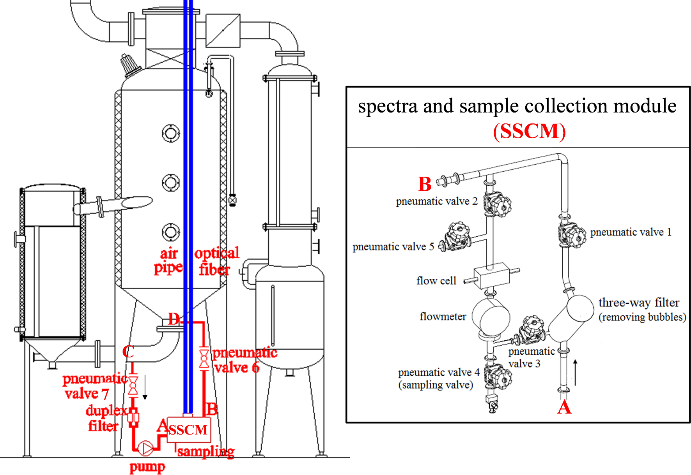
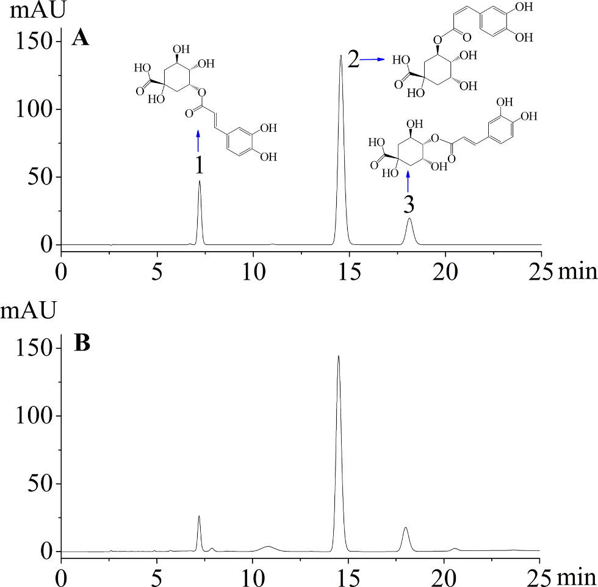
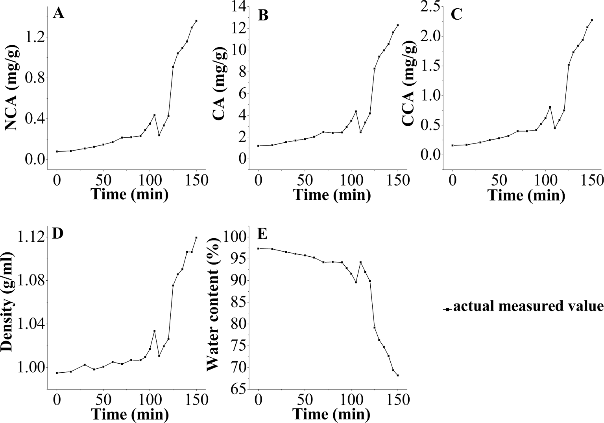
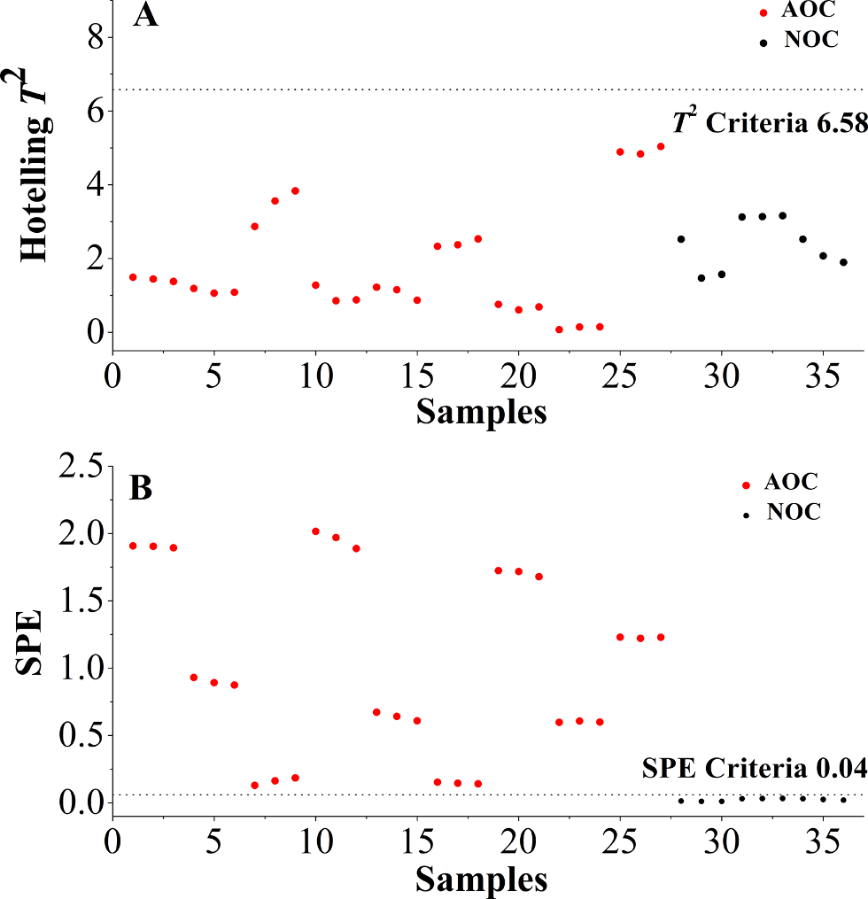

<!-- 方針: ほぼ全訳＋必要に応じた補足。原文構成に沿って訳出。「> 補足:」は訳者注。 -->

## 書誌情報

- 原題: Application of near infrared spectroscopy and real time release testing combined with statistical process control charts for on-line quality control of industrial concentrating process of traditional Chinese medicine "Jinyinhua"
- 著者: Ye Jin（麗水学院 生態学院）、Wenjun Du（金華市中心医院）、Xuesong Liu、Yongjiang Wu（責任著者。いずれも浙江大学 薬学院）（中国）
- 掲載: *Infrared Physics & Technology* 123 (2022) 104135. https://doi.org/10.1016/j.infrared.2022.104135
- インパクトファクター: **3.8**（*Infrared Physics & Technology*, JCR 2024 / Clarivate。※IF 2024 の値は出典により 3.4〜3.83 と幅がある。ここでは JCR 2024 の代表値 3.83 を丸めて 3.8 とした）
- 受領 2021-12-24 / 改訂 2022-03-15 / 採録 2022-03-15 / オンライン公開 2022-03-18
- ライセンス: © 2022 Elsevier B.V. All rights reserved.

> 補足: 金銀花（きんぎんか、Lonicerae Japonicae Flos, LJF, 中国名「金銀花」）は、スイカズラ *Lonicera japonica* Thunb. の乾燥花蕾。清熱解毒の生薬で、熱・炎症の治療に古くから用いられる。主要活性成分はフェノール酸類で、本論文が定量対象とする**ネオクロロゲン酸（NCA）・クロロゲン酸（CA）・クリプトクロロゲン酸（CCA）**の3種。金銀花は熱毒寧注射液や双黄連錠などの中成薬（中国の承認済み漢方製剤）の原料でもある。
>
> 本論文のテーマは「成分の分析法開発」ではなく、**製造工程（濃縮）そのものをオンラインでリアルタイムに監視し、最終品を試験なしで出荷判定する（＝リアルタイムリリース試験, RTRT）ための品質管理戦略**である。キーワードとなる略語を先に整理する:
>
> - **NIR**（近赤外分光）… 光を当てて反射／透過スペクトルから成分量・物性を非破壊・迅速に推定する分光法。PAT の代表的ツール。
> - **PAT**（Process Analytical Technology, プロセス解析工学）… 製造工程を測定・解析しながら品質を作り込む考え方（FDA が2004年に提唱）。
> - **RTRT**（Real Time Release Testing, リアルタイムリリース試験）… 工程中に集めたデータに基づいて最終品の品質を保証し、従来の「完成品を抜き取って試験する」工程を置き換えられるという考え方（ICH Q8(R2)）。
> - **PLS**（Partial Least Squares, 部分最小二乗回帰）… NIRスペクトルから目的の成分量・物性を予測する多変量回帰モデル。
> - **SPC / MSPC**（統計的工程管理／多変量統計的工程管理）… 工程が「統計的管理状態」にあるかを管理図で監視する手法。単変量の **Shewhart 管理図**と、多変量の **Hotelling T²**・**SPE**（squared prediction error, 二乗予測誤差）を用いる。
> - **CQA**（Critical Quality Attribute, 重要品質特性）／**NOC**（Normal Operating Condition, 正常運転条件）／**AOC**（Abnormal Operating Condition, 異常運転条件）／**AND装置**（Automatic NIR Detection device, 自動NIR検出装置。本研究の自作装置）。

## 要旨（Abstract）

濃縮工程は、金銀花（LJF、中国名「金銀花」）製品の製造における重要な単位操作である。本研究では、濃縮工程のオンライン監視と、最終LJF濃縮液の品質管理戦略の開発のために、近赤外（NIR）分光と、統計的工程管理（SPC）法を組み合わせたリアルタイムリリース試験（RTRT）を提示した。気泡・固形不純物・濃縮液の流動がNIRスペクトルに与える影響を除去するため、自動NIR検出（AND）装置を設計し、その有効性を実証した。部分最小二乗（PLS）モデルを構築し、ネオクロロゲン酸（NCA）・クロロゲン酸（CA）・クリプトクロロゲン酸（CCA）・密度・水分のオンライン定量に用い、リアルタイムデータと満足な予測能を示した。SPCツールとして単変量のShewhart、多変量のHotelling T²、二乗予測誤差（SPE）を比較し、RTRTに適用した。RTRTの結果、最終LJF濃縮液のリリース基準は次のとおりとなった：**1.09 mg/g < NCA < 1.53 mg/g、10.00 mg/g < CA < 13.44 mg/g、1.71 mg/g < CCA < 2.43 mg/g、1.10 g/ml < 密度 < 1.14 g/ml、64.07% < 水分 < 72.99%、SPE結果 < 0.04**。ShewhartおよびSPE管理図は、異常検出と正常バッチのリリースに有用であることが示された。本研究は、中薬の工業濃縮工程のオンライン品質管理において、NIRおよびRTRTをSPC管理図と組み合わせることの有効性を実証した。

## 1. 序論（Introduction）

2004年、米国食品医薬品局（FDA）はプロセス解析工学（PAT）のガイダンスにおいてリアルタイムリリース（RTR）の概念を提唱し、これを「工程データに基づいて工程内および／または最終製品の許容できる品質を評価・保証する能力」と定義した [1]。2009年、医薬品規制調和国際会議（ICH）は、バッチリリースと区別するため、製剤開発ガイドライン Q8(R2) においてRTRをリアルタイムリリース試験（RTRT）に修正した [2]。このガイドラインは、RTRTが完成品試験を置き換えうることを示唆し、RTRTの規格を開発する際には品質特性・管理手法（例：PAT）・許容基準が重要な考慮事項であるとした [3]。2012年、欧州医薬品庁（EMA）はRTRTに関するガイドラインを発行し、原薬・中間体・最終製品に対するRTRTを提案した。このガイドラインは、RTRTが近赤外（NIR）分光（通常は多変量解析と組み合わせて）などのPATツールを利用しうることを示した [4]。

中薬（TCM）の近代化の進展に伴い、TCM製薬においてプロセス解析・プロセス管理ツールが急速に発展した。しかし、原生薬の品質は地理的産地・栽培条件・収穫時期・保存などによって大きく左右されうる。TCMの製造は複雑な化学構成成分と工程ステップを含み、これがインライン／オンライン監視とプロセス管理を困難にする。そのため、TCM産業では、試料前処理による誤差や本質的な時間遅れといった重大な欠点があるにもかかわらず、従来のオフライン分析法が中間体・最終製品の測定を依然として支配している。近年、中国食品薬品監督管理局（CFDA）は、TCMの品質管理水準を高めるためにPATツールの導入を推奨している。NIR分光は、迅速・非破壊・非汚染という特徴を持つ典型的でよく使われるPATツールであり、従来のオフライン分析法と比べて分析時間を大幅に短縮できる。TCM製造におけるNIRベースのPAT応用は数多く報告されており、例えば原料 [5–7]、抽出 [8–10]、混合 [11]、濃縮 [12]、アルコール沈殿 [13,14] などがある。しかし、これらの試みの大半は実験室規模あるいはパイロット規模で行われたもので、工業スケールでのTCM製造におけるインライン／オンラインNIR応用の報告はほとんどない。

金銀花（LJF、中国名「金銀花」）はスイカズラ *Lonicera japonica* Thunb. の乾燥花蕾に由来する。中国において重要な医薬／食品資源として、数千年にわたり発熱・炎症の治療に広く用いられてきた。ネオクロロゲン酸（NCA）・クロロゲン酸（CA）・クリプトクロロゲン酸（CCA）などのフェノール酸類が主要な生理活性成分である [15]。抗菌・抗ウイルス・解熱作用を持つため、熱毒寧注射液・双黄連錠などの中国の承認済み漢方製剤（中成薬）の原料としても用いられている [16]。LJF製品の製造において、抽出液の濃縮は溶媒除去のための重要な単位操作であり、下流工程および最終製品の品質に大きな影響を与える。TCMの工業生産では、濃縮の工程管理は通常、生産時間・手作業による密度測定・濃縮液の外観の組み合わせによって濃縮進行度を判断する経験豊富な作業者に依存している。しかしこの管理はあまり有効ではない。というのも、工程の外乱が検出されないか、または終点でしか検出されず、原料物性（例：原料や抽出液の品質）や重要工程パラメータ（例：濃縮温度・圧力）が中間体・最終製品に及ぼす影響が無視されているからである。さらに、濃縮液の密度・濃度その他のパラメータがデジタル的・視覚的に監視されていないため、濃縮工程の終点を精密に管理できない。濃縮工程では大量の溶媒が蒸発し、密度値は連続的に増加する。とりわけ最後の30分間には、終点まで密度の急激な上昇が観察される。密度は濃縮工程の終点判定における第一義的な評価指標であるだけでなく、後続の精製および／または乾燥工程に影響する重要な因子でもある。

工程効率の向上とバッチ間ばらつきの最小化のため、NIR技術を多変量法と組み合わせることは、LJF濃縮工程中の重要品質特性（CQA）のリアルタイム監視を促進し、継続的な品質検証とリアルタイムリリースを実現するうえで大きな価値を持つ。密度・残留溶媒（水）・医薬化合物（NCA・CA・CCA）がLJF濃縮工程のCQAである。NCA・CA・CCAはLJF濃縮液中で比較的高濃度であり、オンラインNIRの実行可能性を担保する。

本研究の全体目標は、RTRTの概念をTCM産業に導入することである。NIR分光とRTRTを、工業スケールでの濃縮工程のオンライン監視と最終濃縮液の品質管理戦略の開発に初めて適用した。私たちの先行研究 [17,18] によれば、気泡・固形不純物・液体中間体の流動はNIRスペクトルに深刻な影響を与えうる。特に濃縮工程では、真空・沸騰・乱流によって多数の気泡が生成し、異常なスペクトルデータをもたらす。収集NIRスペクトルの正確度と再現性を改善するため、本研究では静的スペクトル収集法を独創的に提案し、自動NIR検出（AND）装置を設計して工業濃縮工程のオンライン監視に適用した。部分最小二乗（PLS）モデルを構築し、NCA・CA・CCA・密度・水分のオンライン定量に適用した。Shewhart・Hotelling T²・二乗予測誤差（SPE）などの統計的工程管理（SPC）管理図を比較し、RTRTに適用した [19]。正常運転条件（NOC）で得られたバッチを用いてバッチ再現性を検討し、管理限界（＝RTRTの許容リリース基準）を定義した。工程パラメータの人為的な変動を意図的に導入し、異常検出能を評価した。これらのプロセス解析法・技術から得られる知見は、プロセス理解の向上、品質管理水準の引き上げ、そして最終的には完成品試験の削減または置き換えの助けに利用できる。

## 2. 材料と方法（Materials and methods）

### 2.1. 動的濃縮工程

LJFの動的濃縮は、中国のあるTCM製薬工場に設置された6基の3トン濃縮缶（No. I〜VI）で行った。LJFの水抽出液を濃縮缶に送液し、正常運転条件下、真空（−0.04〜−0.08 MPa）・80 ℃で150分間濃縮した。蒸気エネルギーを節約するため、容積が70%以上減少した時点で、濃縮液を濃縮缶 No. II〜VI から No. I へ順次移送した。濃縮液を合流させた後、動的濃縮工程全体を終えるのに約50分を要した。最後の30分間は5〜10分ごとに手作業で密度値を測定した。密度が1.10〜1.12 g/mlに達した時点を終点とした。

### 2.2. AND装置とオンラインスペクトル測定

工業スケールでTCM製造工程のリアルタイム監視にNIR分光を適用するのは困難である。オンライン監視のため、本研究ではAND制御システム（Fig. 1）を構成・適用した。このシステムは3つの部分に分かれる：製造現場のAND装置・NIRワークステーション・自動制御センター。AND装置（Fig. 2で赤色に着色）は、収集NIRスペクトルへの気泡・固形不純物・濃縮液流動の影響を低減するよう設計され、複式フィルター・ロータポンプ・スペクトル及び試料収集モジュール（SSCM）・光ファイバー管・空気管・空気圧弁6および7からなる。Fig. 1・Fig. 2に示すとおり、SSCMは空気圧弁1〜5・三方フィルター・流量計・サンプリング口・2本の透過プローブ（Solvias, ドイツ）を備えたフローセルを含む。AND装置内の流量計・ロータポンプ・全空気圧弁は、自動制御センター内の自動制御システム（ACS）によって制御された。濃縮液が粘稠であるため、AND装置は濃縮缶 No. I の循環ループ上に設置し、LJF濃縮液がフローセルへ円滑に流入できるようにした。NIR放射を伝送しオンラインスペクトルを収集するため、プローブは光路長2 mmのフローセルに挿入し、光ファイバーを介して Matrix-F FT-NIR分光計（Bruker Optics Inc., ドイツ）に接続した。単一光ファイバーの長さは30 m（片方向の長さ）であった。

スペクトルデータの取得・処理・出力は OPUS PROCESS ソフトウェア（Bruker Optics Inc., ドイツ）で行い、周期的測定の実行・測定スペクトルの評価・記録データの出力ができた。OPUS PROCESS ソフトウェアで用いられる標準化された通信インターフェースであるプロセス制御用OLE（OPC）を、ACSとの通信に適用した。処理されたスペクトルデータは評価されてACSワークステーションに転送され、得られた測定データは濃縮工程の制御に利用できた。ACSワークステーションとOPUS PROCESSソフトウェアはいずれも編集可能なアラーム限界を備え、異常な濃縮工程中に発生しうる外れ値の特定に利用できた。現在の分析値が定義された管理限界を超えると、ACSとOPUS PROCESSソフトウェアに信号で通知される。アラームレベルはNIRワークステーションとACSワークステーションで同時に読み取れる。

オンライン監視が必要な場合、ACSから送られるトリガーによってOPUS PROCESSソフトウェアとAND装置が起動された。設計された手順に従い、AND装置が起動すると、流量計とロータポンプが作動し、空気圧弁2・3・6・7が開き、空気圧弁1・4・5が閉じる。これにより濃縮缶内のLJF濃縮液がフローセルを通過できる。NIRスペクトルを収集する場合は、空気圧弁2・3を閉じ、空気圧弁1を開く。これによりフローセル内のLJF濃縮液が停止し、静的スペクトル収集が可能となって、流速と気泡が収集スペクトルのベースラインに与える影響を排除できる。サンプリングする場合は、NIRデータ収集の終了時に空気圧弁4・5を開き、LJF濃縮液が重力で管から流出して自動的にサンプリングされる。NIRスペクトルまたは濃縮液の収集後、空気圧弁2・3を再度開き、空気圧弁1を再度閉じる。これにより新しいLJF濃縮液が再びフローセルを通過できる。加えて、気泡除去機能を持つ三方フィルターにより、固形不純物と気泡を効果的に除去できた。NIRスペクトル測定は5分ごとに行い、4000〜12,000 cm⁻¹の領域を分解能8 cm⁻¹で収集した。各スペクトルは32回スキャンの平均とした。動的濃縮工程開始時には濃縮液を10〜15分ごとに収集した。濃縮液の合流（No. II〜VI → No. I）後は、濃縮液を5分ごとに収集した。

### 2.3. 参照分析（基準となるオフライン測定）

LJF濃縮液中のNCA・CA・CCAの濃度は、バリデーション済みの高速液体クロマトグラフィー（HPLC）法で分析した。クロマト分離は Kromasil 100–5-C18 カラム（4.6 × 250 mm, 5 μm）を30 ℃で用い、Agilent 1260 HPLC システム（Agilent Technologies, 米国）で行った。移動相は0.1%リン酸水溶液とメタノール（v:v = 80:20）からなり、流速1.0 ml/minとした。注入量は10 μl。検出波長は327 nmに設定した。工業濃縮工程中に収集した濃縮液（約1 g）を水で25〜100 mlに希釈し、遠心・ろ過してHPLCシステムに注入した。HPLC法のバリデーションは中国薬典（2020）[20] に準拠して実施した。システム適合性・特異性・直線性・範囲・精度・併行精度・安定性・回収率などのバリデーションパラメータを検討した。

密度は、80 ℃の濃縮液1 mlを秤量して測定した。密度値は ρ = m/v（v = 1 ml）として算出した [21,22]。水分は中国薬典（2020）[20] が推奨する古典的な乾燥減量法で測定した。全実験は3回繰り返した。

### 2.4. NIRモデルの開発

文献によれば、多変量法はNIRデータから化学的・物理的情報を抽出する必須のツールである。中でもPLS回帰は最も広く用いられる線形多変量回帰法であり、文献 [23–25] で詳細に議論されている。本研究では、スペクトル前処理とPLS回帰を OPUS ソフトウェア（Bruker Optics Inc., ドイツ）で行った。最適な因子数の決定には、一個抜き交差検証（LOOCV）法と予測残差平方和（PRESS）値を用いた。さらに、校正結果を次の評価パラメータで評価した：校正セットの相関係数（R）・校正の平方平均平方根誤差（RMSEC）・交差検証の平方平均平方根誤差（RMSECV）・校正の相対標準誤差（RSEC）。予測結果を次の評価パラメータで評価した：予測セットの相関係数（r）・予測の平方平均平方根誤差（RMSEP）・予測の相対標準誤差（RSEP）。上記評価パラメータの詳細は文献 [26,27] にある。

本研究では、動的濃縮工程の13の正常運転条件（NOC）バッチ（NOC-1〜13）をNIRでオンライン監視した。バッチ NOC-1〜10 から収集した**209の工程内試料**を校正セットとしてPLSモデルの構築に用いた。バッチ NOC-11〜13 は、開発したPLSモデルのオンライン測定への有用性を実証し、モデルの予測能を評価するために実施した。

### 2.5. 品質管理図

品質管理図は、製造工程が依然として「統計的管理状態」にあることを検証する典型的なグラフツールである [28]。従来の単変量管理図（例：Shewhart）は、バッチ工程の重要品質特性を個別に監視するために構築される。注目する特性が相互に相関する多数の変数を含む多変量システムに存在する場合には、MSPC法を適用できる。

MSPC管理図は主に主成分分析（PCA）から導かれ、主成分（PC、すなわち因子）を抽出して工程監視のためのHotelling T²・SPEなどの管理図を構築する。したがって、PCAベースのMSPC法は、工程中の高次元かつ相関した変数を扱う能力を持つ [29]。研究者らはMSPCとNIRを実験室規模のTCM生産工程に適用しており、MSPCは異常検出とバッチ工程の再現性評価に有効であることが示されている [13,30]。

本研究ではRTRTのために2種類の品質管理図を用いた：単変量のShewhart管理図と、Hotelling T²・SPEを含む多変量統計的工程管理（MSPC）管理図である。これらの管理図を、異常の特定とNOCバッチのリリースに適用した。NOCバッチから得た**計54の終点試料**をSPC管理図の管理限界の定義に用いた。SPC管理図の管理限界（＝RTRTのリリース基準）を満たすNOCバッチは、後続の製造単位操作にリリースされる。定義された管理限界を超える異常なオンラインデータは外れ値として特定・警報される。LJF抽出液を製造するには、年間数十バッチの原料が使われる。バッチ間で原料の由来・品質には差がある。原料の由来が変わった場合、新しい最終濃縮液を既存データセットに組み入れて管理限界を更新する。

RTRTの実行可能性を検証するため、異常運転条件（AOC）で意図的にバッチを運転した（例：異常な濃縮温度・生産時間・最終密度）。ACSのなかった旧製造現場では、濃縮工程中に異常現象や問題が時折発生していた（例：LJF抽出液の投入量の不安定、加熱管のスケーリングや加熱蒸気圧の変動による濃縮温度の不安定）。とりわけ濃縮温度は最も不安定な工程パラメータの一つで、70 ℃〜90 ℃の間で変動した。AND装置の設計・設置・運転はACSを基盤に行われたため、異常生産は起こらなかった。そこでAOCバッチの実験はパイロット現場で、Table 1 の設計どおりに運転した。3つの濃縮温度（70 ℃・80 ℃・90 ℃）を選び、AOCバッチの濃縮液の最終密度値は、生産時間を調整することで正常範囲（1.10〜1.12 g/ml）外に制御した。バッチ AOC-1〜9 から収集した終点試料を、RTRTのリリース基準と異常検出能の評価に用いた。

**Table 1. 工程変数を示す実験バッチ。** バッチ NOC-1〜10 はモデル構築に、バッチ NOC-11〜13 と AOC-1〜9 はモデル検証に用いた。

| バッチ番号 | 温度（℃） | 生産時間（min） | 最終密度（g/ml） |
|---|---|---|---|
| NOC-1〜13 | 80 | 150 | 1.12 |
| AOC-1 | 70 | 70 | 1.03 |
| AOC-2 | 70 | 110 | 1.08 |
| AOC-3 | 70 | 160 | 1.13 |
| AOC-4 | 80 | 60 | 1.03 |
| AOC-5 | 80 | 100 | 1.08 |
| AOC-6 | 80 | 165 | 1.15 |
| AOC-7 | 90 | 60 | 1.04 |
| AOC-8 | 90 | 100 | 1.09 |
| AOC-9 | 90 | 170 | 1.20 |

#### 2.5.1. Shewhart管理図

Shewhart管理図は、x̄（データの平均）を中心線として構築される [31]。管理状態のパラメータ x̄ と σ が既知であれば、上方管理限界（UCL）・中心線（CL）・下方管理限界（LCL）は次で与えられる：UCL = x̄ + kσ；CL = x̄；LCL = x̄ − kσ。ここで k は各管理限界と中心線の距離を標準偏差単位で測ったもの、σ は校正セットの標準偏差である。通常 k = 2 または 3。

#### 2.5.2. Hotelling T² と SPE [28]

n個の工程変数と各変数のm回の測定からなる n × m のNIRデータ行列 X を考える。行列 X はPCAによって新しい行列 T（f × m）、すなわちスコア行列に縮約でき、次式に従う：

$$X = \sum_{i=1}^{f} t_i p_i^T + E$$

ここで f は因子数、pᵢ は主成分ローディング、tᵢ はスコアベクトル、E は残差行列である。新しいNIRスペクトルデータ x_new に対し、予測結果 x̂_new は x̂_new = t_new Pᵀ = x_new PPᵀ として算出される（t_new はスコアベクトル、P はローディング行列）。残差 e_new は e_new = x_new − x̂_new で与えられる。したがって Hotelling T² 統計量は T²_new = t_new Λ t_new^T として、SPE統計量は SPE_new = e_new e_new^T として算出される（Λ は固有値行列）。T²・SPE統計量の信頼限界は次で与えられる：

$$T^2 \leqslant T^2_{lim} = \frac{f(m-1)}{m-f} F_{f,(m-f),\alpha}$$

$$SPE \leqslant SPE_{lim} = g\chi^2_{h,\alpha}, \quad g = v/(2c), \quad h = 2c^2/v$$

ここで α は有意水準、c と v は校正データセットのSPEの平均値と分散値である。T²_new > T²_lim または SPE_new > SPE_lim のとき、異常が検出されたとみなし、工程は管理外れ（out-of-control）とみなす。

## 3. 結果と考察（Results and discussion）

### 3.1. 参照分析の結果

調査した3種のフェノール酸の代表的なクロマトグラムを Fig. 3 に示す。NCA・CA・CCAがベースライン分離していることが分かる。理論段数5000超・テーリング係数0.97〜1.02・分離度2.5超が観察されたとき、HPLCシステムは分析に適していると判断した。さらに、3分析対象物の各ピークについて算出した純度因子は、全試料で閾値限界を上回った。HPLC法の主要な方法論パラメータと検量線を Table 2 に示す。

**Table 2. 参照HPLC法の方法論パラメータと検量線。**（精度・併行精度は n = 6、安定性は48 h、回収率は n = 6）

| 分析対象物 | tR（min） | 回帰式 | 直線範囲（μg/ml） | R² | 精度 RSD%（n=6） | 併行精度 RSD%（n=6） | 安定性 RSD%（48 h） | 回収率 平均% | 回収率 RSD% |
|---|---|---|---|---|---|---|---|---|---|
| NCA | 7.87 ± 0.11 | Y = 33.59 X − 25.12 | 1.939〜194.4 | 0.9999 | 0.11 | 0.53 | 0.88 | 98.11 | 0.60 |
| CA | 14.50 ± 0.16 | Y = 32.48 X − 112.24 | 10.11〜1011 | 0.9999 | 0.13 | 0.63 | 0.37 | 101.5 | 1.5 |
| CCA | 18.01 ± 0.09 | Y = 29.49 X − 27.86 | 1.977〜198.0 | 0.9999 | 0.11 | 0.94 | 0.84 | 102.1 | 0.38 |

参照分析（2.3節）で分析した全収集試料には、元のLJF抽出液、NOCバッチからの209の工程内試料と54の終点試料、AOCバッチからの27の終点試料が含まれる。結果を Table 3 にまとめる。NOCバッチは一貫した製品品質と満足な再現性を持つと結論できる。密度・水分と比べて、LJF抽出液ではNCA・CA・CCAの高いRSD値（53.2%超）が観察された。主要な要因の一つは、バッチ間で原料の品質に差があったことである。周知のとおり、TCMの品質は地理的産地・栽培条件・収穫時期・保存・生産工程により大きく左右されうる。これらの変動が、様々なバッチのLJF抽出液の品質一貫性の維持を困難にする。AOCバッチからの終点試料でもRSD値は広く変動した（60.3%超）。これはAOCバッチが異常な工程条件で意図的に運転されたためである。濃縮液の品質は工程パラメータの変動に敏感であった。したがって、NOCバッチの終点試料と比べて、AOCバッチの終点試料のNCA・CA・CCA濃度にはバッチ間で有意な差が存在した。

**Table 3. 抽出液・濃縮液中の5つの品質特性の測定結果。**

| | NCA (mg/g) | CA (mg/g) | CCA (mg/g) | 密度 (g/ml) | 水分 (%) |
|---|---|---|---|---|---|
| **LJF抽出液** 範囲 | 0.04919〜0.2257 | 0.7810〜2.731 | 0.09022〜0.3513 | 0.9973〜1.013 | 93.76〜98.32 |
| RSD% | 60.8 | 53.5 | 53.2 | 0.528 | 1.37 |
| **NOC（工程内）** 範囲 | 0.04919〜1.408 | 0.7753〜15.49 | 0.09308〜2.346 | 0.9918〜1.163 | 65.06〜98.32 |
| RSD% | 78.0 | 72.4 | 76.6 | 4.52 | 11.3 |
| **NOC（終点）** 範囲 | 0.9414〜1.609 | 11.01〜15.49 | 1.568〜2.380 | 1.111〜1.163 | 65.06〜72.57 |
| RSD% | 13.7 | 6.19 | 12.4 | 0.927 | 2.59 |
| **AOC（終点）** 範囲 | 0.2268〜2.304 | 3.432〜15.65 | 0.3721〜2.857 | 1.024〜1.211 | 53.24〜92.72 |
| RSD% | 81.3 | 60.3 | 67.8 | 5.44 | 16.7 |

Fig. 4 は、NCA・CA・CCA・密度の時間発展曲線が同様の傾向を示し、時間とともに増加する一方、水分は逆の傾向を示すことを表す。フェノール酸類と密度はいずれも、当初は高い水分含量（98%超）と定常的な蒸発のため、緩やかで安定した増加を示した。濃縮工程の第二段階（濃縮液を濃縮缶 No. II〜VI から No. I へ移送）に入ると、動的曲線は100〜120分の間で変動した。主な理由は、濃縮液の合流操作が濃縮缶 No. I の真空を介して行われ、温度と真空度の低下を招いたことである。加えて、5基の濃縮缶（No. II〜VI）間の濃縮液の密度値には、濃縮缶ごとに濃縮効率が異なることによる差があった。濃縮液の合流後、大量の水が蒸発し、濃縮工程の終わりまでより急速な増加率が観察された。

### 3.2. NIRスペクトル解析

Fig. 5A はNOCバッチの生NIRスペクトルを示す。NIRスペクトルデータの前処理は OPUS ソフトウェアで行った。定数オフセット除去・min–max正規化・直線差引き・ベクトル正規化・多重散乱補正・一次微分（1st D）・二次微分およびそれらの組み合わせを含む数種類の前処理法を試した。これらの方法の詳細な説明は文献 [32–34] にある。各品質特性について、OPUS ソフトウェアで300超のモデルを構築した。計算の結果、CAモデルは直線差引き法が最良の性能を示し、定数オフセット除去・1st D法がこれに続いた。NCA・CCA・水分・密度のモデルについても、モデル最適化後は同様の結果であった。私たちの先行報告 [10,18] によれば、直線差引きと定数オフセット除去法は流速・気泡・固形不純物のスペクトルベースラインへの影響を除去できず、min–max正規化などの他の再処理法も同様であった。したがって、ピークを顕在化させ定数的・線形的なベースラインドリフトを除去するため、生スペクトルデータを1st D法で前処理した。微分操作のたびにノイズレベルが増加するため、全微分スペクトルは Savitzky-Golay（S-G）フィルター（21点）で平滑化した。

NIRスペクトル中の吸収は、赤外分光（中赤外, mid-IR）に見られるC-H・O-H・N-Hの基準振動の結合音および倍音バンドから生じる [35]。分子構造中に豊富なC-H・O-H結合を持つため、収集NIRデータはフェノール酸に十分な化学情報を含んでいた。C-HとO-H伸縮の指紋吸収に帰属する4000〜4500 cm⁻¹の領域は、透過率がゼロになったりノイズが多すぎたりする可能性がある。水のNIRスペクトルは6944 cm⁻¹と5155 cm⁻¹付近で強い吸収を示し、それぞれO-Hの第一倍音、O-H基の変角と伸縮の結合に由来する。これらの強い吸収バンドは通常、水溶液のNIRスペクトルに見られ、4500〜5450 cm⁻¹および6100〜7500 cm⁻¹の範囲の吸収の大半を覆い隠す。7500〜12000 cm⁻¹領域（第二・第三倍音に由来）の主な特徴は、低強度と低いS/N比である。したがって「ノイズ領域」（4000〜4500 cm⁻¹）、「水領域」（4500〜5450 cm⁻¹および6100〜7500 cm⁻¹）、「低強度領域」（7500〜12000 cm⁻¹）を除外した。残る**5450〜6100 cm⁻¹**の領域を NCA・CA・CCA モデルに適用した。この領域はC-H伸縮の第一倍音に関連するバンドを含み、フェノール酸の定量分析に十分寄与する。Fig. 5B に示すとおり、1st DとS-Gで前処理したスペクトルは、5690 cm⁻¹付近でNOCバッチとAOCバッチの間に明瞭な差を示し、異常の検出と診断の実行可能性を明らかにした。密度・水分モデルについては「ノイズ領域」と「低強度領域」を除外し、残る**4500〜7500 cm⁻¹**のスペクトル領域をモデル構築に選んだ（Fig. 5A・Fig. 5C）。

データの傾向を観察し、LJF濃縮工程をより明確に理解するため、バッチ NOC-1〜10（校正セット）のスペクトルデータを、1st DとS-Gで前処理した後のスペクトルデータ（5450〜6100 cm⁻¹）を用いてPCAで解析した。用いた最初の2つのPCが全変動の**89%**を説明した。濃縮工程全体を通じたPCスコア（PC1 vs. PC2）の傾向チャートを得た（Fig. 6A）。PC2のスコアは連続的に減少する一方、PC1は時間とともにまず減少して次に増加した。とりわけ100〜120分の間はデータ点がより密集し、濃縮液が時間とともにほとんど変化しないことを示した。120分以降はPC1のスコアが大きく変動した。これらの結果は3.1節の観察と一致した。

NOCバッチとAOCバッチの終点試料の全体的な変動を詳細に検討しクラスター傾向を可視化するため、PC1 vs. PC2 の散布図を得た（Fig. 6B）。NOCバッチとAOCバッチの間に明瞭な境界が観察できる。異なる工程条件（温度・時間・最終密度）のAOCバッチは、互いに異なる分布を持つ。NOCバッチとAOCバッチの濃縮液が品質面で相当に異なることは明らかである。PCAベースのMSPCは、異常検出とNOCバッチのリリースにおいて実行可能なツールと思われる。

### 3.3. モデル開発と予測

上述の領域のNIRスペクトルデータを1st DとS-Gで前処理し、実測データと相関させた。CA・NCA・CCA・水分・密度のPLSモデルを確立した。5つのモデルの統計結果を Table 4 に示す。満足な校正・予測結果を示している。NIR分光をPLS法とAND制御システムと併用すれば、LJF濃縮工程のオンライン定量監視が実現できると結論できる。

先行報告文献では、濃縮液中の密度と残留溶媒含量の間に良好な相関が観察された [12]。Table 4 に示すとおり、密度・水分モデルはフェノール酸のモデルより明らかに優れた性能を示し、最小の予測誤差（RSEP ≦ 1.31%）を与えた。この現象の主な原因は、水分と密度の値が高いことにある。一方、フェノール酸の測定濃度は低く、天然物に対するNIR分光の検出限界（0.1%〜0.01%）に近づいていた [14,25]。同様に、LJF濃縮液中のCAの濃度はNCA・CCAよりはるかに高かった。NCA・CCAモデルと比べて、CAモデルはRSEC・RSEP値が低いため、予測誤差が小さかった。

各モデルは通常、時間的・空間的変動の制約の中で使われるため、新しい試料や新しいバッチの出現によって確立モデルが「無効」になったときに、多変量校正の実用的な限界が生じる。工業製造での長期使用に対する開発モデルの有用性を確保するため、再校正によるモデル更新法が提案されている [18,36]。原料の由来が変わり、r値が0.9を下回った場合、新しいバッチの試料を既存モデルの校正セットに組み入れて再校正することで、モデル更新を行う。

**Table 4. 5つの品質特性の最適モデルの統計。**

| | 因子数 | R（校正） | RMSECV | RMSEC | RSEC (%) | r（予測） | RMSEP | RSEP (%) |
|---|---|---|---|---|---|---|---|---|
| NCA | 7 | 0.9884 | 0.058 | 0.051 | 9.29 | 0.9982 | 0.060 | 9.76 |
| CA | 6 | 0.9948 | 0.367 | 0.322 | 5.58 | 0.9995 | 0.104 | 1.96 |
| CCA | 7 | 0.9916 | 0.079 | 0.068 | 7.85 | 0.9982 | 0.074 | 7.41 |
| 密度 | 8 | 0.9727 | 0.011 | 0.009 | 1.01 | 0.9848 | 0.007 | 0.68 |
| 水分 | 9 | 0.9949 | 0.962 | 0.752 | 1.09 | 0.9953 | 1.170 | 1.31 |

### 3.4. オンライン定量監視

濃縮工程中の重要品質特性のオンライン測定へのPLSモデルの使用を、工業スケールでの反復実験によって検証した。5つのモデルを OPUS PROCESS ソフトウェアにアップロードし、バッチ工程監視に適用した。バッチ運転を通じて異常スペクトルはほとんど収集されなかった。Fig. 7 に示すとおり、予測された速度論曲線は滑らかで、急激で激しい変動は観察されない。静的スペクトル収集法が、気泡と流速変動のNIRスペクトルへの影響を効果的に最小化できたことが分かる。NIRオンラインで予測された品質特性の傾向は、参照分析から得たものと一致した。5つのモデルは滑らかに動作し良好な予測能を示し、3.3節で得た校正・予測結果を裏付けた。

### 3.5. Shewhartと定量的RTRT

NOCバッチでは大きな運転上の問題が発生しなかったため、最終濃縮液の全品質特性で良好な一貫性が得られた。Shewhart管理図の管理限界は、これらのNOCバッチから収集した終点試料に基づいて確立した。Shewhartの管理限界は**±2標準偏差**に固定した。これは、あるAOCバッチ（例：AOC-6）の品質特性がNOCバッチに非常に近かったためである。Shewhart管理図の統計を Table 5 に示す。バッチ NOC-11〜13 と AOC-1〜9 の終点試料を試験セットとして、定量的リリース基準と異常検出能を評価した（Table 6）。定量的RTRTの結果、NOCバッチの予測値・実測値はいずれも管理限界内にあり、正しい識別と成功裏のリリースを示した（Fig. 8）。AOCバッチについては、大半の異常はShewhart管理図で検出できたものの、一部のAOCバッチが一部の管理図で誤って識別された。NCA管理図（Fig. 8A）では、バッチAOC-5のHPLC実測値はUCLを上回ったがNIR予測値はLCLを下回った。これはおそらく、構築したNCAのPLSモデルの予測能が限定的であったためである。同様に、CCA管理図（Fig. 8C）のAOC-3の予測値の一つはUCLを下回り、誤ってNOC試料と印付けされた。AOC-6（Fig. 8C）では、実測データと予測データがいずれも管理限界内にあり、NOCバッチと誤識別された。したがって、中間体の濃度が上方・下方の管理限界（UCL・LCL）に近い場合、分析誤差による誤判定が起こりうるため、リリースのリスクが高まる。NCA・CCAモデルと比べて、CAモデルは予測誤差が小さかった。CA管理図（Fig. 8B）では、AOCバッチの予測値と実測値がいずれも限界外にあった。

密度管理図（Fig. 8D）では、バッチAOC-3の実測データと予測データが管理限界内にあり、NOCバッチと誤識別された。Fig. 8E のバッチAOC-3・AOC-6も同様であった。一因は、AOC-3・AOC-6の異常条件がモデルの訓練時の正常運転条件に近かったことである。バッチAOC-3を例にとると、平均最終密度と水分はそれぞれ1.13 g/mlと66.7%で、NOCバッチとほぼ同等であった。これらの類似性が必然的に誤識別を招いた。

まとめると、LJF濃縮液の定量的リリース基準は次のとおりであった：**1.09 mg/g < NCA < 1.53 mg/g、10.00 mg/g < CA < 13.44 mg/g、1.71 mg/g < CCA < 2.43 mg/g、1.10 g/ml < 密度 < 1.14 g/ml、64.07% < 水分 < 72.99%**。最終濃縮液は、リリース前に試験を通過し上記の全リリース基準を満たす必要がある。最終的に、AOCバッチの終点試料はいずれも所望のリリース基準を満たさず、NOCバッチは成功裏にリリースできた。

単変量Shewhart管理図は異常を検出しNOCバッチを効果的にリリースできたが、変数間の関数関係の存在を考慮していない。Shewhart管理図のみで行う濃縮液の監視は非常に危険である。リリースの正確さを改善するには、単変量Shewhartと多変量MSPC統計の併用が必要と思われる。

**Table 5. Shewhart管理図の統計。**

| 品質特性 | CL（中心線） | σ | LCL（下方限界） | UCL（上方限界） |
|---|---|---|---|---|
| NCA | 1.31 mg/g | 0.11 | 1.09 mg/g | 1.53 mg/g |
| CA | 11.72 mg/g | 0.86 | 10.00 mg/g | 13.44 mg/g |
| CCA | 2.07 mg/g | 0.18 | 1.71 mg/g | 2.43 mg/g |
| 密度 | 1.12 g/ml | 0.01 | 1.10 g/ml | 1.14 g/ml |
| 水分 | 68.53% | 2.23 | 64.07% | 72.99% |

**Table 6. RTRT検証のためのAOC・NOCバッチの情報。**（試料番号1〜36とその所属バッチ。試料番号1〜27がAOCバッチ、28〜36がNOCバッチ）

| 試料No. | バッチ | 試料No. | バッチ | 試料No. | バッチ | 試料No. | バッチ |
|---|---|---|---|---|---|---|---|
| 1 | AOC-1 | 10 | AOC-4 | 19 | AOC-7 | 28 | NOC-11 |
| 2 | AOC-1 | 11 | AOC-4 | 20 | AOC-7 | 29 | NOC-11 |
| 3 | AOC-1 | 12 | AOC-4 | 21 | AOC-7 | 30 | NOC-11 |
| 4 | AOC-2 | 13 | AOC-5 | 22 | AOC-8 | 31 | NOC-12 |
| 5 | AOC-2 | 14 | AOC-5 | 23 | AOC-8 | 32 | NOC-12 |
| 6 | AOC-2 | 15 | AOC-5 | 24 | AOC-8 | 33 | NOC-12 |
| 7 | AOC-3 | 16 | AOC-6 | 25 | AOC-9 | 34 | NOC-13 |
| 8 | AOC-3 | 17 | AOC-6 | 26 | AOC-9 | 35 | NOC-13 |
| 9 | AOC-3 | 18 | AOC-6 | 27 | AOC-9 | 36 | NOC-13 |

### 3.6. MSPCと定性的RTRT

単変量Shewhart管理図に加え、濃縮液が管理状態にあるかを検定するため、Hotelling T²・SPEを含むMSPC管理図を用いた。最初の10のNOCバッチから収集した最終濃縮液を、MSPC管理図の管理限界の定義（95%信頼区間）に用いた。全変動の89%を占めた最初の2つのPCを、波長5450〜6100 cm⁻¹でMSPCモデルの構築に用いた。NOC・AOCバッチの各終点試料の予測Hotelling T²・SPE結果を Fig. 9 に示す。Hotelling T²・SPEの管理限界はそれぞれ**6.58**と**0.04**であった。Hotelling T²管理図（Fig. 9A）では、試験AOC・NOCバッチがすべて管理限界を下回り、異常診断の失敗を示した。一方SPE管理図（Fig. 9B）では、NOCバッチは管理限界内に十分収まり、これらAOCバッチはすべて限界を超えた。SPE管理図はAOCバッチの異常を効果的に検出し、NOCバッチを適切にリリースできることが分かる。さらに、バッチAOC-1・AOC-4・AOC-7はSPE管理図の管理限界から大きく逸脱した。これは最短の濃縮時間（それぞれ70 ℃・60 ℃・60 ℃）と最低の最終密度（それぞれ1.03・1.03・1.04 g/ml）に起因する。一方、バッチAOC-3・AOC-6はSPEの管理限界に近かった。これは最終密度が訓練セットに類似していたためである。SPE管理図は最終密度により敏感である可能性が分かる。

> 補足: 原文は「バッチAOC-1・AOC-4・AOC-7の最短濃縮時間（70 ℃・60 ℃・60 ℃）」と温度を記しているが、Table 1 のとおりこれらの温度はそれぞれ 70 ℃・80 ℃・90 ℃、生産時間はいずれも最短の 60〜70 min である。原文の括弧内の値は温度と時間を取り違えた誤記の可能性があるが、ここでは原文ママに転記した。

2.5.2節で述べたとおり、Hotelling T²は最初の重要な数個のPCを用いて算出され、SPEは残差を用いて算出される。PC1・PC2が全変動の89%を占めたが、残る11%も重要であり、異なる変動源を説明しうる。したがって、本研究ではSPE管理図が異常検出に有効なMSPCツールであり、最終濃縮液に対するRTRTの定性的リリース基準は予測SPE結果 < 0.04 である。

## 4. 結論（Conclusions）

本研究で設計したAND装置とその制御システムは、気泡・固形不純物・濃縮液の流動がNIRスペクトルに与える影響を最小化するのに有効であることが実証され、オンラインスペクトルデータの正確度が向上した。LJFの工業濃縮工程全体を通じて、NIRスペクトルを自動的・連続的に収集できた。構築したPLSモデルは、工業スケールで5つの重要品質特性のオンライン定量監視に成功裏に適用された。

生薬製品の品質は原料と工程の変動に影響されやすい。バッチ再現性を維持し最終製品の品質を確保するため、RTRTの概念をTCMの製造工程に初めて導入した。オンラインNIRベースのRTRTをSPC統計と組み合わせることを検討し、異常検出とNOCバッチのリリースに有効であることを見出した。ShewhartとSPE管理図は相互に補完的であった。これら2つのSPC管理図を組み合わせて用いることが必要である。RTRTの結果、AOCバッチの終点試料は定性的・定量的RTRTリリース基準を同時に満たさず、NOCバッチは正しく識別され成功裏にリリースできた。したがって、LJF濃縮液のリリース基準は次のとおりであった：**1.09 mg/g < NCA < 1.53 mg/g、10.00 mg/g < CA < 13.44 mg/g、1.71 mg/g < CCA < 2.43 mg/g、1.10 g/ml < 密度 < 1.14 g/ml、64.07% < 水分 < 72.99%、SPE結果 < 0.04**。定性的・定量的RTRTリリース基準の双方を満たす最終濃縮液が下流工程にリリースされる。リリース基準を満たさない最終濃縮液は、実際の製造工程でのリリースリスクを低減するため、参照分析で再分析することが期待される。オンラインNIRベースのRTRTをSPC管理図と併用することは、検出効率を向上させるだけでなく、TCMの品質管理戦略の開発と生産工程の最適化にも役立つと展望される。

## 謝辞・利益相反

著者らは、本論文で報告した研究に影響を与えたと見なされうる既知の競合する財務的利害や個人的関係はないと宣言する。本研究は、浙江省自然科学基金（LGC19B050002）、麗水市科学技術計画（2020GYX05）、「重大新薬創製」国家科学技術重大特別プロジェクト（2018ZX09201010）の財政的支援を受けた。

## 訳者補足

- **この論文の新規性はどこか**: 従来のNIR×PATによる中薬工程監視の多くは実験室／パイロット規模だったのに対し、本研究は**工業スケール（3トン濃縮缶6基）**でのオンライン監視を実現し、さらに**RTRT（リアルタイムリリース試験）の概念を中薬製造に初めて持ち込んだ**点にある。分析法の開発ではなく「工程を測りながら出荷判定する仕組み」を作った、GMP／規制寄りの研究。
- **AND装置の意味**: 工業濃縮では真空沸騰で大量の気泡が出て、そのままではNIRスペクトルが乱れて定量できない。本研究の肝は、弁の開閉で濃縮液を一時停止させ**気泡・流動のない静止状態でスペクトルを取る（静的スペクトル収集）**という工夫と、それを自動化した自作装置（AND）である。ハード側の工夫がオンライン化の成否を分けている。
- **2種類の管理図の役割分担**: 定量的な合否（各成分・密度・水分が規格幅に入るか）は Shewhart 管理図、スペクトル全体のパターンが正常から外れていないかの定性的な合否は SPE 管理図で見る。**Hotelling T²は本データではAOC（異常）バッチを検出できず失敗**した一方、**SPE は全AOCバッチを検出**できた。「多変量管理図なら何でも効く」わけではなく、主成分で説明しきれない残差（＝SPE）にこそ異常が現れた、という実務的教訓が示されている。
- **限界**: フェノール酸（NCA・CA・CCA）は濃度が低くNIRの検出限界（0.1〜0.01%程度）に近いため、これらのPLSモデルは密度・水分モデルより予測誤差が大きい（RSEP 7〜10%）。実際、Shewhart 管理図では一部のAOCバッチが誤判定された。著者らも「Shewhart単独は危険」「規格に近い濃縮液は再分析すべき」と限界を明記している。
