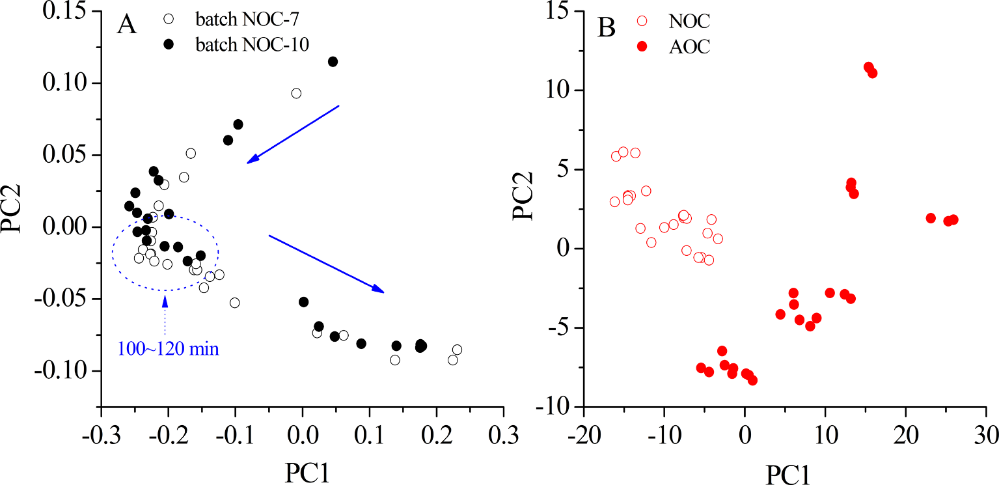

## 書誌情報

- 標題（原題）: Application of near infrared spectroscopy and real time release testing combined with statistical process control charts for on-line quality control of industrial concentrating process of traditional Chinese medicine "Jinyinhua"
- 著者・所属: Ye Jin（a. 麗水学院 生態学院／College of Ecology, Lishui University, Lishui 323000, China）、Wenjun Du（b. 金華市中心医院／Jinhua Municipal Central Hospital, Jinhua 321000, China）、Xuesong Liu・Yongjiang Wu（c. 浙江大学 薬学院／College of Pharmaceutical Sciences, Zhejiang University, Hangzhou 310058, China）※Yongjiang Wuが責任著者（Corresponding author, E-mail: yjwu@zju.edu.cn）
- 掲載誌・巻号・DOI: Infrared Physics & Technology, 123 (2022) 104135；DOI: 10.1016/j.infrared.2022.104135
- インパクトファクター: 3.8（Infrared Physics & Technology、bioxbio・journalmetrics等の二次集計に基づく2024年版相当値。Clarivate公式ポータルでの一次確認は取れておらず「要確認」）
- 受理経過 / ライセンス: 2021年12月24日受付、2022年3月15日改訂受理、2022年3月15日受理、2022年3月18日オンライン公開。1350-4495/© 2022 Elsevier B.V. All rights reserved.（オープンアクセスではない通常の著作権表示）
- 助成: 浙江省自然科学基金（LGC19B050002）、麗水市科学技術計画（2020GYX05）、国家重大新薬創製科技重大専項（2018ZX09201010）

## 要旨（Abstract）

濃縮工程は、金銀花（Lonicerae Japonicae Flos; LJF、中国語で「金銀花」）製品の製造における重要な単位操作である。本研究では、LJF濃縮液の最終品質管理戦略の開発とオンライン濃縮モニタリングのために、近赤外（NIR）分光法とリアルタイムリリース試験（real time release testing; RTRT）を統計的工程管理（statistical process control; SPC）法と組み合わせて提示した。気泡・固形不純物・濃縮液の流れがNIRスペクトルに与える影響を排除することに有効であると証明された自動NIR検出（automatic NIR detection; AND）装置を設計した。部分最小二乗法（partial least squares; PLS）モデルを構築し、ネオクロロゲン酸（neochlorogenic acid; NCA）、クロロゲン酸（chlorogenic acid; CA）、クリプトクロロゲン酸（cryptochlorogenic acid; CCA）、密度、水分含量のオンライン測定を行い、リアルタイムデータを提供するとともに満足のいく予測能を示した。一変量Shewhart、多変量Hotelling T2、二乗予測誤差（squared prediction error; SPE）を含むSPCツールを比較し、RTRTに適用した。RTRTの結果、最終LJF濃縮液のリリース基準は以下の通りであった：1.09 mg/g ＜ NCA ＜ 1.53 mg/g、10.00 mg/g ＜ CA ＜ 13.44 mg/g、1.71 mg/g ＜ CCA ＜ 2.43 mg/g、1.10 g/ml ＜ 密度 ＜ 1.14 g/ml、64.07% ＜ 水分含量 ＜ 72.99%、およびSPE結果 ＜ 0.04。ShewhartとSPEチャートは、異常の検出と正常バッチのリリースに有用であることが証明された。本研究は、中薬（TCM）の産業規模の濃縮工程のオンライン品質管理におけるNIRとRTRT、SPCチャートの組み合わせの有効性を実証した。

**キーワード**: 近赤外分光法（Near infrared spectroscopy）；金銀花（Lonicerae Japonicae Flos）；濃縮工程（Concentrating process）；リアルタイムリリース試験（Real time release testing）；統計的工程管理（Statistical process control）

## 1. 序論（Introduction）

2004年、米国食品医薬品局（FDA）はプロセス分析工学（process analytical technology; PAT）のガイダンスにおいてリアルタイムリリース（real time release; RTR）という概念を提案し、プロセスデータに基づき工程内および／または最終製品の許容可能な品質を評価・保証する能力として定義した［1］。2009年、国際医薬品規制調和会議（ICH）は、医薬品開発Q8（R2）のガイドラインにおいてバッチリリースと区別するため、RTRをリアルタイムリリース試験（real time release testing; RTRT）へと改称した［2］。このガイドラインは、RTRTが最終製品試験に代わりうることを示唆しており、RTRTの規格を開発する際には品質属性・管理手法（例：PAT）・許容基準が重要な考慮事項であるとされた［3］。2012年、欧州医薬品庁（EMA）はRTRTに関するガイドラインを発行し、原薬・中間体・最終製品に対するRTRTを提案した。このガイドラインは、RTRTが（多くの場合多変量解析と組み合わされる）近赤外（NIR）分光法などのPATツールを利用しうることを示した［4］。

中薬（traditional Chinese medicine; TCM）の近代化の進展に伴い、プロセス分析・工程管理ツールはTCM製剤において急速に発展を遂げてきた。しかし、原料生薬の品質は産地・栽培条件・収穫時期・保存状態などにより大きく影響を受けうる。TCMの製造は複雑な化学成分と工程ステップを伴い、これがイン・ライン／オン・ラインモニタリングと工程管理を困難にしている。そのため、TCM産業では、サンプル調製に起因する誤差や本質的な時間遅延といった重大な欠点があるにもかかわらず、従来のオフライン分析法が中間体・最終製品の測定において依然として主流である。近年、中国国家食品薬品監督管理局（CFDA）はTCMの品質管理水準を高めるためPATツールの導入を奨励している。NIR分光法は典型的かつ汎用されるPATツールであり、迅速・非破壊・無汚染という特徴を持ち、従来のオフライン分析法と比較して分析時間を大幅に短縮できる。原料［5–7］、抽出［8–10］、配合（blending）［11］、濃縮［12］、アルコール沈殿［13,14］など、TCM製造におけるNIRベースのPAT応用は数多く報告されている。しかし、これらの試みの大半は実験室規模またはパイロット規模で実施されたものであり、TCM製造における産業規模のイン・ライン／オン・ラインNIR応用の報告はほとんどない。

金銀花（Lonicerae Japonicae Flos; LJF、中国語で「金銀花」）は、スイカズラ（*Lonicera japonica* Thunb.）の乾燥花蕾に由来する。中国において重要な医薬品／食品資源であり、数千年にわたり発熱・炎症の治療に広く用いられてきた。ネオクロロゲン酸（NCA）、クロロゲン酸（CA）、クリプトクロロゲン酸（CCA）などのフェノール酸類が主要な生理活性成分である［15］。抗菌・抗ウイルス・解熱作用を有することから、レドニン注射液（Reduning injection）、双黄連錠（Shuanghuanglian tablets）などの中成薬の原料としても用いられる［16］。LJF製品の製造において、エキスの濃縮は溶媒除去のための重要な単位操作であり、下流工程および最終製品の品質に大きな影響を与える。TCMの産業製造において、濃縮の工程管理は通常、生産時間・手動測定した密度・濃縮液の外観などを組み合わせて濃縮の進行を判断する熟練オペレーターに依存している。しかし、この管理方法はあまり有効ではない。というのも、プロセス擾乱は工程の終了時にしか（あるいは終了時にすら）検出されず、原料属性（例：原料・エキスの品質）や重要工程パラメータ（例：濃縮温度・圧力）が中間体・最終製品に与える影響が無視されるためである。さらに、濃縮液の密度・濃度などのパラメータがデジタル的・視覚的にモニタリングされていないため、濃縮工程の終点を精密に制御することができない。濃縮工程中は大量の溶媒が蒸発し、密度は継続的に上昇する。特に最後の30分間では、終点まで急激な密度上昇が観察される。密度は濃縮工程の終点判定における主要な評価指標であるだけでなく、後続の精製・乾燥工程に影響する重要な因子でもある。工程効率を改善しバッチ間変動を最小化するため、多変量解析法と組み合わせたNIR技術は、LJF濃縮工程における重要品質属性のリアルタイムモニタリングを促進し、継続的品質検証とリアルタイムリリースを実現するうえで大きな価値を持つと考えられる。密度・残留溶媒（水分）・薬効成分（NCA・CA・CCA）は、LJF濃縮工程における重要品質属性である。NCA・CA・CCAはLJF濃縮液中で比較的高濃度であり、オンラインNIRの実現可能性を担保している。

本研究の全体目的は、RTRTの概念をTCM産業に導入することである。NIR分光法とRTRTは、産業規模での濃縮工程のオンラインモニタリングと最終濃縮液の品質管理戦略の開発に初めて適用された。我々の過去の研究［17,18］によれば、液状中間体の気泡・固形不純物・流れはNIRスペクトルに深刻な影響を与えうる。特に濃縮工程では、真空・沸騰・乱流により多数の気泡が発生し、異常なスペクトルデータを生じる。収集されたNIRスペクトルの精度と再現性を向上させるため、本研究は静止スペクトル収集（static spectral collection）の手法を新たに提案し、自動NIR検出（automatic NIR detection; AND）装置を設計して産業規模の濃縮工程のオンラインモニタリングに適用した。部分最小二乗法（PLS）モデルを構築し、NCA・CA・CCA・水分含量・密度のオンライン測定に適用した。Shewhart、Hotelling T2、二乗予測誤差（SPE）などの統計的工程管理（SPC）チャートを比較し、RTRTに適用した［19］。正常操作条件（normal operational condition; NOC）下で得られたバッチを用いてバッチ再現性を検討し、管理限界（すなわちRTRTの許容リリース基準）を定義した。工程パラメータの人為的変動を意図的に与え、異常検出能力を評価した。これらのプロセス分析手法・技術から得られた知見は、工程理解を深め、品質管理水準を高め、最終的には最終製品試験の削減・代替に資すると考えられる。

## 2. 材料と方法（Materials and methods）

### 2.1. 動的濃縮工程（Dynamic concentrating processes）

LJFの動的濃縮は、中国国内のTCM製薬工場に設置された6基の3トン濃縮器（No. I ～ VI）で行われた。LJFの水性エキスを濃縮器にポンプ注入し、通常操作条件下（80 ℃、150分間、真空度 −0.04 ～ −0.08 MPa）で濃縮した。蒸気エネルギーを節約するため、体積が70%以上減少した時点で、濃縮液を濃縮器No. II ～ VIから濃縮器No. Iへ順次ポンプ移送した。濃縮液を合流させた後、全体の動的濃縮工程を完了するまでに約50分を要した。密度値は、最後の30分間は5～10分ごとに手動測定した。終点は密度が1.10 ～ 1.12 g/mlに達した時点とした。

### 2.2. AND装置とオンラインスペクトル測定（AND device and on-line spectral measurement）

TCM製造工程の産業規模でのリアルタイムモニタリングにNIR分光法を適用することは困難である。オンラインモニタリングのため、本研究ではAND制御システム（図1）を構築・適用した。これは、生産作業場のAND装置、NIRワークステーション、自動制御センターの3部分に分けられる。AND装置（図2で赤く着色）は、二重濾過器（duplex filter）、ロータポンプ、スペクトル・試料収集モジュール（spectra and sample collection module; SSCM）、光ファイバー配管、エア配管、空気圧バルブ6・7から構成され、濃縮液の気泡・固形不純物・流れがNIRスペクトルに与える影響を低減するよう設計された。図1・図2に示すように、SSCMは空気圧バルブ1～5、三方濾過器、流量計、サンプリング口、2本の透過プローブ（Solvias社、ドイツ）を備えたフローセルから構成される。流量計・ロータポンプ・AND装置内の全空気圧バルブは、自動制御センター内の自動制御システム（automatic control system; ACS）により制御された。濃縮液の粘性が高いため、AND装置は濃縮器No. Iの循環ループに設置され、LJF濃縮液がフローセルへ円滑に流入できるようにした。NIR放射を伝送しオンラインスペクトルを収集するため、プローブは光路長2 mmのフローセルに挿入され、光ファイバーを介してMatrix-F FT-NIR分光計（Bruker Optics社、ドイツ）に接続された。単一光ファイバーの長さは30 m（片道長）であった。

スペクトルデータの取得・データ処理・データ出力は、OPUS PROCESSソフトウェア（Bruker Optics社、ドイツ）により行われ、これは周期的測定の実行、測定スペクトルの評価、記録データの出力を実行できる。OPUS PROCESSソフトウェアで用いられる標準化通信インターフェースである、プロセス制御用オブジェクトリンク・埋め込み（object linking and embedding for process control; OPC）を用いてACSと通信した。処理されたスペクトルデータは評価されACSワークステーションへ転送され、得られた測定データを濃縮工程の制御に用いることができた。ACSワークステーションとOPUS PROCESSソフトウェアはいずれも編集可能な警報限界を提供し、異常な濃縮工程で生じうる外れ値を識別するために使用できた。現在の分析値が定義された管理限界を超えた場合、ACSとOPUS PROCESSソフトウェアは信号によりその状況を通知される。警報レベルはNIRワークステーションとACSワークステーションで同時に確認できる。オンラインモニタリングが必要な場合、OPUS PROCESSソフトウェアとAND装置はACSから送られるトリガーにより起動された。設計された手順に従い、AND装置が起動すると、流量計とロータポンプが起動し、空気圧バルブ2・3・6・7が開かれ、バルブ1・4・5が閉じられる。これにより、濃縮器内のLJF濃縮液がフローセルを通過できる。NIRスペクトルを収集する際は、バルブ2・3を閉じ、バルブ1を開くことで、フローセル内のLJF濃縮液の流れを停止させ、静止スペクトル収集を可能にし、これにより流量・気泡が収集スペクトルのベースラインに与える影響を排除した。サンプリングの際は、NIRデータ収集の終了時にバルブ4・5を開き、LJF濃縮液が重力によりパイプから流出し自動的にサンプリングされた。NIRスペクトルまたは濃縮液の収集後、バルブ2・3を再度開き、バルブ1を再度閉じることで、新鮮なLJF濃縮液が再びフローセルを通過できるようにした。加えて、気泡除去機能を備えた三方濾過器により、固形不純物と気泡を効果的に除去できた。NIRスペクトル測定は5分ごとに実施し、4000 ～ 12,000 cm⁻¹の領域を分解能8 cm⁻¹で収集した。各スペクトルは32回スキャンの平均値とした。動的濃縮工程の開始時には濃縮液を10 ～ 15分ごとに採取し、濃縮液の合流（No. II ～ VI → No. I）後は5分ごとに採取した。

### 2.3. 参照アッセイ（Reference assays）

LJF濃縮液中のNCA・CA・CCAの濃度は、バリデーション済みの高速液体クロマトグラフィー（HPLC）法により分析した。クロマトグラフィー分離は、Agilent 1260 HPLCシステム（Agilent Technologies社、米国）を用い、Kromasil 100–5-C18カラム（4.6 × 250 mm、5 μm）上、30 ℃で実施した。移動相は0.1%リン酸水溶液とメタノール（v:v = 80:20）からなり、流速1.0 ml/minとした。注入量は10 μlとした。検出波長は327 nmに設定した。産業規模の濃縮工程中に収集した濃縮液（約1 g）を水で25 ～ 100 mlに希釈し、遠心分離・濾過後にHPLCシステムへ注入した。HPLC法のバリデーションは中国薬局方（2020年版）［20］に従って実施した。システム適合性・特異性・直線性・範囲・精度・再現性・安定性・回収率などのバリデーションパラメータを検討した。

密度は、80 ℃における濃縮液1 mlの質量を計量することにより測定した。密度値はρ = m/v（v = 1 ml）として算出した［21,22］。水分含量は、中国薬局方（2020年版）［20］で推奨される古典的な乾燥法（オーブン法）により検出した。すべての実験は3回繰り返した。

### 2.4. NIRモデルの構築（NIR model development）

文献によれば、多変量解析法はNIRデータから化学的・物理的情報を抽出するための必須ツールである。中でもPLS回帰は最も広く用いられる線形多変量回帰法であり、文献［23–25］で広範に論じられている。本研究では、スペクトルの前処理とPLS回帰は、OPUSソフトウェア（Bruker Optics社、ドイツ）を用いて実施した。最適な因子数の決定には、一個抜き交差検証（leave-one-out cross validation; LOOCV）法と予測残差平方和（predicted residual error sums of squares; PRESS）値を用いた。さらに、検量結果は以下の評価パラメータにより評価した：検量セットの相関係数（R）、検量の二乗平均平方根誤差（RMSEC）、交差検証の二乗平均平方根誤差（RMSECV）、検量の相対標準誤差（RSEC）。予測結果は以下の評価パラメータにより評価した：予測セットの相関係数（r）、予測の二乗平均平方根誤差（RMSEP）、予測の相対標準誤差（RSEP）。上記評価パラメータの詳細は文献［26,27］を参照されたい。

本研究では、13の正常操作条件（NOC）バッチ（NOC-1 ～ 13）の動的濃縮工程をオンラインNIRでモニタリングした。バッチNOC-1 ～ 10から採取された209の工程内試料を検量セットとしてPLSモデルの構築に用いた。バッチNOC-11 ～ 13は、構築したPLSモデルのオンライン測定における有用性を示し、モデルの予測能力を評価するために実施した。

### 2.5. 品質管理チャート（Quality control charts）

品質管理チャートは、製造工程が依然として「統計的管理状態」にあることを検証するための代表的な図的ツールである［28］。従来の一変量管理図（例：Shewhart）は、バッチ工程における重要品質属性を個別にモニタリングするために構築される。相互に相関する多数の変数を含む多変量系に関心対象の属性が存在する場合、MSPC（multivariate statistical process control）法を適用できる。MSPCチャートは主に主成分分析（PCA）に由来し、主成分（principal components; PCs、すなわち因子）を抽出し、工程モニタリングのためのHotelling T2、SPEなどの管理図を構築する。したがって、PCAベースのMSPC法は、工程における高次元・相関変数を扱う能力を有する［29］。研究者らは実験室規模でMSPCとNIRをTCM生産工程に適用しており、MSPCは異常の検出とバッチ工程の再現性評価に有効であることが証明されている［13,30］。

本研究では、RTRTのために2種類の品質管理チャートを使用した：一変量Shewhart管理図と、Hotelling T2・SPEを含む多変量統計的工程管理（MSPC）チャートである。これらのチャートは、異常の識別とNOCバッチのリリースに適用された。NOCバッチから得られた合計54の終点試料を用いて、SPCチャートの管理限界を定義した。SPCチャートの管理限界（すなわちRTRTのリリース基準）を満たすNOCバッチは、後続の製造単位操作へリリースされる。定義された管理限界を超えるオンラインの異常データは、外れ値として識別され警報が発される。LJFエキスの生産には、年間数十バッチの原料が使用される。バッチ間で原料の由来・品質に差異がある。原料の由来が変わった場合、既存データセットに新たな最終濃縮液を組み込むことで管理限界を更新する。

RTRTの実現可能性を検証するため、異常操作条件（abnormal operational condition; AOC）（例：異常な濃縮温度・生産時間・最終密度）のバッチを意図的に運転した。ACSを備えていなかった以前の生産作業場では、濃縮工程中に異常現象や問題（例：LJFエキスの投入量の不安定さ、加熱管のスケーリングや加熱蒸気圧の変動に起因する濃縮温度の不安定さ）が生じることがあった。特に濃縮温度は最も不安定な工程パラメータの一つであり、70 ℃から90 ℃の間で変動した。AND装置の設計・設置・運用はACSを前提として行われたため、異常生産は発生しなかった。したがって、AOCバッチの実験は、表1に設計した通り、パイロット作業場で実施した。3つの濃縮温度（70 ℃、80 ℃、90 ℃）を選択し、生産時間を調整することでAOCバッチの濃縮液の最終密度値を正常範囲（1.10 ～ 1.12 g/ml）外に制御した。バッチAOC-1 ～ 9から収集した終点試料は、RTRTのリリース基準と異常検出能力の評価に用いた。

#### 表1. プロセス変数を示す実験バッチ（バッチNOC-1～10はモデル構築に、バッチNOC-11～13とAOC-1～9はモデルの検証に用いた）

| バッチNo. | 温度 (℃) | 生産時間 (min) | 最終密度 (g/ml) |
| :--- | :-: | :-: | :-: |
| NOC-1 ～ 13 | 80 | 150 | 1.12 |
| AOC-1 | 70 | 70 | 1.03 |
| AOC-2 | 70 | 110 | 1.08 |
| AOC-3 | 70 | 160 | 1.13 |
| AOC-4 | 80 | 60 | 1.03 |
| AOC-5 | 80 | 100 | 1.08 |
| AOC-6 | 80 | 165 | 1.15 |
| AOC-7 | 90 | 60 | 1.04 |
| AOC-8 | 90 | 100 | 1.09 |
| AOC-9 | 90 | 170 | 1.20 |

#### 2.5.1. Shewhart管理図

Shewhart管理図は、データの平均値 x̄ を中心線として構築される［31］。管理内パラメータ x̄ と σ が既知の場合、上方管理限界（UCL）・中心線（CL）・下方管理限界（LCL）は次式で与えられる：UCL = x̄ + kσ；CL = x̄；LCL = x̄ − kσ。ここでkは各管理限界と中心線の間の距離を標準偏差単位で表したものであり、σは検量セットの標準偏差である。通常k = 2または3を用いる。

#### 2.5.2. Hotelling T2とSPE［28］

n個の工程変数についてそれぞれm回の測定値を持つ、n × mのNIRデータ行列Xを考える。行列XはPCAにより、スコア行列である新しい行列T（f × m）へ次式に従って縮約できる：

X = Σ(i=1 to f) tᵢpᵢᵀ + E

ここでfは因子数、pᵢは主成分負荷量、tᵢはスコアベクトル、Eは残差行列である。新しいNIRスペクトルデータ x_new について、スコアベクトルは t_new = x_new P として算出され（Pは負荷量行列）、予測結果 x̂_new は x̂_new = t_new Pᵀ として計算される。得られたHotelling統計量T²は T²_new = t_newᵀ Λ⁻¹ t_new として計算される（Λは固有値行列）。残差 e_new は e_new = x_new − x̂_new として計算され、SPE統計量は SPE_new = e_newᵀ e_new として与えられる。したがって、T²とSPEの管理限界は次のように与えられる：

T² ≤ T²_lim = f(m − 1) / (m − f) × F_{f, (m−f), α}

SPE ≤ SPE_lim = g χ²_{h, α}　（g = v / (2c)、h = 2c² / v）

ここでαは有意水準、c・vはそれぞれ検量セットのSPEの平均値・分散値である。T²_new ＞ T²_lim またはSPE_new ＞ SPE_limのとき、異常が検出されたとみなされ、工程は管理外れ（out-of-control）と判定される。

> 補足: 原文はこの箇所（式の添字・上付き文字の配置）がPDFからのテキスト抽出時に大きく乱れており、正確な組版は判読できなかった。上記の再構成は、引用元［28］（MacGregor and Kourti, 1995, Statistical process control of multivariate processes）で標準的に用いられるPCAベースのMSPC（Hotelling T²・SPE）の定式化に基づく妥当な復元であり、原文の数式そのものではない。正確な表記は原文PDFを参照されたい。

## 3. 結果と考察（Results and discussion）

### 3.1. 参照アッセイの結果（Results of the reference assays）

3種の対象フェノール酸の代表的なクロマトグラムを図3に示す。NCA・CA・CCAはベースライン分離されていることが分かる。理論段数5000以上、テーリング係数0.97 ～ 1.02、分離度2.5以上が観察された場合に、HPLCシステムは分析に適していると判断した。さらに、3種の分析対象それぞれのピークについて算出した純度係数（purity factor）は、すべての試料で閾値限界を上回っていた。HPLC法の主要な方法論パラメータと検量線を表2に示す。

#### 表2. 参照HPLC法の方法論パラメータと検量線

| 分析対象 | tR (min) | 回帰式 | 直線性範囲 (μg/ml) | R² | 精度 RSD% (n=6) | 再現性 RSD% (n=6) | 安定性 RSD% (48h) | 回収率 平均% (n=6) | 回収率 RSD% |
| :--- | :--- | :--- | :--- | :--- | :-: | :-: | :-: | :-: | :-: |
| NCA | 7.87 ± 0.11 | Y = 33.59X − 25.12 | 1.939 ～ 194.4 | 0.9999 | 0.11 | 0.53 | 0.88 | 98.11 | 0.60 |
| CA | 14.50 ± 0.16 | Y = 32.48X − 112.24 | 10.11 ～ 1011 | 0.9999 | 0.13 | 0.63 | 0.37 | 101.5 | 1.5 |
| CCA | 18.01 ± 0.09 | Y = 29.49X − 27.86 | 1.977 ～ 198.0 | 0.9999 | 0.11 | 0.94 | 0.84 | 102.1 | 0.38 |

原料LJFエキス、NOCバッチから採取した209の工程内試料と54の終点試料、AOCバッチから採取した27の終点試料を含む、収集したすべての試料を、2.3節に記載した参照アッセイにより分析した。結果を表3にまとめる。NOCバッチは一貫した製品品質と満足のいく再現性を有していたと結論できる。密度・水分含量と比較して、LJFエキスにおけるNCA・CA・CCAのRSD値は高く（53.2%以上）観察された。主な要因の一つは、バッチ間で原料の品質に差異があったことである。周知のとおり、TCMの品質は産地・栽培条件・収穫時期・保存状態・生産工程によって大きく影響を受けうる。これらの変動により、様々なバッチのLJFエキスの品質一貫性を維持することが難しくなっている。AOCバッチの終点試料においても、RSD値は広範囲（60.3%以上）にわたっていたが、これはAOCバッチが意図的に異常な工程条件で運転されたためである。濃縮液の品質は工程パラメータの変動に敏感であった。したがって、NOCバッチの終点試料と比較して、AOCバッチの終点試料におけるNCA・CA・CCA濃度はバッチ間で有意な差異が存在した。

#### 表3. エキスおよび濃縮液における5つの品質属性の測定結果

| | NCA (mg/g) | CA (mg/g) | CCA (mg/g) | 密度 (g/ml) | 水分含量 (%) |
| :--- | :--- | :--- | :--- | :--- | :--- |
| LJFエキス - 範囲 | 0.04919 ～ 0.2257 | 0.7810 ～ 2.731 | 0.09022 ～ 0.3513 | 0.9973 ～ 1.013 | 93.76 ～ 98.32 |
| LJFエキス - RSD% | 60.8 | 53.5 | 53.2 | 0.528 | 1.37 |
| NOC（工程内）- 範囲 | 0.04919 ～ 1.408 | 0.7753 ～ 15.49 | 0.09308 ～ 2.346 | 0.9918 ～ 1.163 | 65.06 ～ 98.32 |
| NOC（工程内）- RSD% | 78.0 | 72.4 | 76.6 | 4.52 | 11.3 |
| NOC（終点）- 範囲 | 0.9414 ～ 1.609 | 11.01 ～ 15.49 | 1.568 ～ 2.380 | 1.111 ～ 1.163 | 65.06 ～ 72.57 |
| NOC（終点）- RSD% | 13.7 | 6.19 | 12.4 | 0.927 | 2.59 |
| AOC（終点）- 範囲 | 0.2268 ～ 2.304 | 3.432 ～ 15.65 | 0.3721 ～ 2.857 | 1.024 ～ 1.211 | 53.24 ～ 92.72 |
| AOC（終点）- RSD% | 81.3 | 60.3 | 67.8 | 5.44 | 16.7 |

図4は、NCA・CA・CCA・密度の時間推移曲線が類似の傾向を示し時間とともに増加する一方、水分含量は逆の傾向を示すことを表す。フェノール酸類と密度はいずれも、高い水分含量（98%超）と持続的な蒸発によりおそらく初期には緩やかで着実な増加を示した。濃縮工程の第2段階（濃縮器No. II ～ VIからNo. Iへ濃縮液を移送する段階）に入った後、動的曲線は100 ～ 120分の間で変動した。主な理由は、濃縮液の合流操作が濃縮器No. Iの真空を利用して行われ、温度・真空度の低下を招いたためである。また、5基の濃縮器（No. II ～ VI）間の濃縮液の密度値には、濃縮器ごとの濃縮効率の違いに起因する差異が存在した。濃縮液の合流後、大量の水分が蒸発し、濃縮工程終了までより急速な増加率が観察された。

### 3.2. NIRスペクトル解析（NIR spectral analysis）

図5AはNOCバッチの生NIRスペクトルを示す。NIRスペクトルデータの前処理はOPUSソフトウェアで行った。定数オフセット除去、最小最大正規化、直線減算（straight-line subtraction）、ベクトル正規化、乗法散乱補正、1次微分（1st D）、2次微分、およびそれらの組み合わせを含む、いくつかの種類の前処理法をスペクトルデータセットに試した。これらの手法の詳細な記述は文献［32–34］を参照されたい。各品質属性について、OPUSソフトウェアにより300以上のモデルを構築した。計算結果は、直線減算法を用いたCAモデルが最良の性能を示し、定数オフセット除去法・1st D法がこれに続くことを示した。NCA・CCA・水分含量・密度モデルについても、モデル最適化後に同様の結果が得られた。我々の過去の報告文献［10,18］によれば、直線減算法・定数オフセット除去法は流量・気泡・固形不純物がスペクトルベースラインに与える影響を除去できず、最小最大正規化などの他の再処理法についても同様であった。したがって、ピークを明らかにし一定・線形のベースラインドリフトを除去するため、生スペクトルデータは1st D法で前処理した。微分演算のたびにノイズレベルが増加するため、すべての微分スペクトルはSavitzky-Golay（S-G）フィルター（21ポイント）で平滑化した。

NIRスペクトルの吸収は、赤外分光法（中赤外）に見られるC-H・O-H・N-H基本振動の結合音・倍音バンドに由来する［35］。分子構造中に豊富なC-H・O-H結合を含むため、収集されたNIRデータはフェノール酸類について十分な化学情報を含んでいた。4000 ～ 4500 cm⁻¹の領域は、C-H・O-H伸縮のフィンガープリント吸収に起因し、透過率がゼロに近くノイズが多い可能性がある。水のNIRスペクトルは、O-Hの第一倍音とO-H基の変角・伸縮の結合音に由来する、それぞれ約6944 cm⁻¹・5155 cm⁻¹に強い吸収を示す。得られる強い吸収帯は水溶液のNIRスペクトルに通常見られ、4500 ～ 5450 cm⁻¹および6100 ～ 7500 cm⁻¹の範囲の大半の吸収を覆い隠す。7500 ～ 12,000 cm⁻¹領域（第二・第三倍音に由来）の主な特徴は低強度と低いS/N比である。したがって、「ノイズ領域」（4000 ～ 4500 cm⁻¹）、「水領域」（4500 ～ 5450 cm⁻¹および6100 ～ 7500 cm⁻¹）、「低強度領域」（7500 ～ 12,000 cm⁻¹）は除外した。C-H伸縮の第一倍音に関連するバンドを含み、フェノール酸類の定量分析に十分寄与する残りの領域5450 ～ 6100 cm⁻¹を、NCA・CA・CCAモデルに適用した。図5Bに示すように、1st DとS-Gで前処理したスペクトルは、5690 cm⁻¹付近でNOCバッチとAOCバッチの間に明瞭な違いを示し、異常検出・診断の実現可能性を明らかにしている。密度・水分含量モデルについては、「ノイズ領域」と「低強度領域」を除外し、残りのスペクトル領域4500 ～ 7500 cm⁻¹をモデル構築に選択した（図5A・図5C）。

データ傾向を観察しLJF濃縮工程をより明確に理解するため、バッチNOC-1 ～ 10（検量セット）のスペクトルデータをPCAで検討した。これは、1st DとS-Gで前処理した後のスペクトルデータ（5450 ～ 6100 cm⁻¹）を用いて算出した。採用した最初の2つのPCで全変動の89%を説明した。濃縮工程全体を通じたPCスコア（PC1対PC2）の推移チャートを取得し、図6Aに示す。PC2のスコアは継続的に減少する一方、PC1は最初は減少しその後増加する。特に100 ～ 120分の間では、データ点がより密集し、濃縮液が時間経過とともにほとんど変化していないことを示している。120分以降は、PC1のスコアは大きく変動する。これらの結果は3.1節での観察と一致していた。

NOC・AOCバッチの終点試料の全体的な変動を詳細に検討しクラスター傾向を可視化するため、PC1対PC2の散布図を取得した（図6B）。NOCバッチとAOCバッチの間には明確な境界が観察できる。異なる工程条件（温度・時間・最終密度）を持つAOCバッチは、互いに異なる分布を示す。NOC・AOCバッチ由来の濃縮液は品質にかなりの差異があることが明らかである。PCAベースのMSPCは、異常検出とNOCバッチのリリースにおいて有望なツールであると考えられる。

### 3.3. モデルの構築と予測（Model development and prediction）

上述の領域のNIRスペクトルデータを1st DとS-Gで前処理し、実測データと相関させた。CA・NCA・CCA・水分含量・密度に対するPLSモデルを構築した。5モデルの統計結果を表4に示し、満足のいく検量・予測結果を示している。NIR分光法とPLS法、AND制御システムを組み合わせることで、LJFの濃縮工程のオンライン定量モニタリングが実現できると結論できる。

我々の過去の報告文献では、濃縮液中の密度と残留溶媒含量の間に良好な相関が観察されている［12］。表4に示すように、密度と水分含量モデルは、フェノール酸類のモデルより明らかに優れた性能を示し、最小の予測誤差（RSEP ≤ 1.31%）を示す。この現象の主な原因は、水分含量と密度の値が高いことにある。一方、フェノール酸類の測定濃度は低く、天然物に対するNIR分光法の検出限界（0.1% ～ 0.01%）に近づいている［14,25］。同様に、LJF濃縮液中のCA濃度はNCA・CCAより大幅に高く、NCA・CCAモデルと比較して、CAモデルはRSEC・RSEP値が小さいため予測誤差が小さかった。

各モデルは通常時間的・空間的変動に限界があるため、新たな試料・新たなバッチの出現により構築モデルが「無効」となった場合、多変量検量における実務上の制約が生じる。産業製造における長期使用のためにモデルの有用性を確保するため、再検量によるモデル更新の方法が提案されている［18,36］。原料の由来が変化し、かつr値が0.9を下回った場合、既存モデルの検量セットに新バッチ由来の試料を組み込み再検量することでモデル更新を行う。

#### 表4. 5つの品質属性に対する最適モデルの統計値

| | | 検量セット | | | | 予測セット | |
| :--- | :-: | :-: | :-: | :-: | :-: | :-: | :-: |
| 属性 | 因子数 | R | RMSECV | RMSEC | RSEC (%) | r | RMSEP (RSEP %) |
| NCA | 7 | 0.9884 | 0.058 | 0.051 | 9.29 | 0.9982 | 0.060 (9.76) |
| CA | 6 | 0.9948 | 0.367 | 0.322 | 5.58 | 0.9995 | 0.104 (1.96) |
| CCA | 7 | 0.9916 | 0.079 | 0.068 | 7.85 | 0.9982 | 0.074 (7.41) |
| 密度 | 8 | 0.9727 | 0.011 | 0.009 | 1.01 | 0.9848 | 0.007 (0.68) |
| 水分含量 | 9 | 0.9949 | 0.962 | 0.752 | 1.09 | 0.9953 | 1.170 (1.31) |

### 3.4. オンライン定量モニタリング（On-line quantitative monitoring）

濃縮工程中の重要品質属性のオンライン測定へのPLSモデルの使用は、産業規模での反復実験により検討した。5つのモデルをOPUS PROCESSソフトウェアにアップロードし、バッチ工程モニタリングに適用した。バッチ運転を通じて異常スペクトルはほとんど収集されなかった。図7に示すように、予測される動態曲線は滑らかであり、急激で深刻な変動は観察されない。静止スペクトル収集法は、気泡・流量変動がNIRスペクトルに与える影響を効果的に最小化できることが分かる。オンラインNIRにより予測された品質属性の傾向は、参照アッセイにより得られた傾向と一致した。5つのモデルは円滑に稼働し良好な予測能を示し、これは3.3節で得られた検量・予測結果を裏付けるものであった。

### 3.5. Shewhartと定量的RTRT（Shewhart and quantitative RTRT）

NOCバッチでは大きな操業上の問題が生じなかったため、最終濃縮液のすべての品質属性について良好な一貫性が得られた。Shewhart管理図の管理限界は、これらのNOCバッチから収集した終点試料に基づき構築した。すべての品質属性のShewhart管理限界は±2標準偏差に固定した。これは、一部のAOCバッチ（例：AOC-6）の品質属性がNOCバッチに非常に近かったためである。Shewhart管理図の統計値を表5に示す。バッチNOC-11 ～ 13、AOC-1 ～ 9からの終点試料を検証セットとして用い、定量的リリース基準と異常検出能力を評価した（表6）。定量的RTRTの結果、NOCバッチの予測値・実測値はいずれも管理限界内であり、正しい識別と正常なリリースを示した（図8）。AOCバッチについては、Shewhart管理図の大半で異常を検出できたものの、一部のAOCバッチについては誤って識別された例もあった。NCAチャート（図8A）では、バッチAOC-5のHPLC実測値はUCLを上回っていたが、NIR予測値はLCLを下回っていた。これはおそらく、NCAに構築されたPLSモデルの予測能力に限界があったためと考えられる。同様に、CCAチャート（図8C）ではAOC-3の予測値の一つがUCL未満であり、誤ってNOC試料として識別された。AOC-6（図8C）では、実測値・予測値のいずれも管理限界内にあり、NOCバッチと誤識別された。したがって、中間体の濃度がUCL・LCLの上限・下限に近い場合、分析誤差により誤判定が生じる可能性があり、リリースのリスクを高める。NCA・CCAモデルと比較して、CAモデルはより小さい予測誤差を示した。CAチャート（図8B）では、AOCバッチの予測値・実測値のいずれも管理限界外にあった。

密度チャート（図8D）に示すように、バッチAOC-3の実測値・予測値は管理限界内にあり、AOC-3・AOC-6（図8E）と同様にNOCバッチと誤識別された。理由の一つは、AOC-3・AOC-6の異常条件がモデルの訓練に用いた正常操作条件に近かったことである。バッチAOC-3を例にとると、平均最終密度と水分含量はそれぞれ1.13 g/ml・66.7%であり、NOCバッチとほぼ同等であった。これらの類似性は誤識別を必然的に招いた。

まとめると、LJF濃縮液の定量的リリース基準は以下の通りであった：1.09 mg/g ＜ NCA ＜ 1.53 mg/g、10.00 mg/g ＜ CA ＜ 13.44 mg/g、1.71 mg/g ＜ CCA ＜ 2.43 mg/g、1.10 g/ml ＜ 密度 ＜ 1.14 g/ml、64.07% ＜ 水分含量 ＜ 72.99%。最終濃縮液は、リリースされる前に上記のすべてのリリース基準を満たす試験に合格する必要がある。最終的に、AOCバッチの終点試料はいずれも望ましいリリース基準を満たさず、NOCバッチは正常にリリースできた。

#### 表5. Shewhart管理図の統計値

| | CL | σ | LCL | UCL |
| :--- | :--- | :--- | :--- | :--- |
| NCA | 1.31 mg/g | 0.11 | 1.09 mg/g | 1.53 mg/g |
| CA | 11.72 mg/g | 0.86 | 10.00 mg/g | 13.44 mg/g |
| CCA | 2.07 mg/g | 0.18 | 1.71 mg/g | 2.43 mg/g |
| 密度 | 1.12 g/ml | 0.01 | 1.10 g/ml | 1.14 g/ml |
| 水分含量 | 68.53% | 2.23 | 64.07% | 72.99% |

#### 表6. RTRT検証に用いたAOC・NOCバッチの情報（サンプル番号とバッチの対応）

| サンプルNo. | バッチ | サンプルNo. | バッチ | サンプルNo. | バッチ | サンプルNo. | バッチ |
| :-: | :--- | :-: | :--- | :-: | :--- | :-: | :--- |
| 1 | AOC-1 | 10 | AOC-4 | 19 | AOC-7 | 28 | NOC-11 |
| 2 | AOC-1 | 11 | AOC-4 | 20 | AOC-7 | 29 | NOC-11 |
| 3 | AOC-1 | 12 | AOC-4 | 21 | AOC-7 | 30 | NOC-11 |
| 4 | AOC-2 | 13 | AOC-5 | 22 | AOC-8 | 31 | NOC-12 |
| 5 | AOC-2 | 14 | AOC-5 | 23 | AOC-8 | 32 | NOC-12 |
| 6 | AOC-2 | 15 | AOC-5 | 24 | AOC-8 | 33 | NOC-12 |
| 7 | AOC-3 | 16 | AOC-6 | 25 | AOC-9 | 34 | NOC-13 |
| 8 | AOC-3 | 17 | AOC-6 | 26 | AOC-9 | 35 | NOC-13 |
| 9 | AOC-3 | 18 | AOC-6 | 27 | AOC-9 | 36 | NOC-13 |

一変量Shewhart管理図は異常の検出とNOCバッチのリリースに有効に機能しうるものの、変数間の関数的関係の存在を考慮していない。Shewhart管理図単独での濃縮液のモニタリングは非常に危険である。リリースの正確性を改善するには、一変量ShewhartとMSPC統計量の組み合わせが必要であると考えられる。

### 3.6. MSPCと定性的RTRT（MSPC and qualitative RTRT）

一変量Shewhart管理図に加え、濃縮液が管理内に留まっているかを検定するため、Hotelling T2・SPEを含むMSPC管理図を用いた。最初の10のNOCバッチから収集した最終濃縮液を用いて、MSPC管理図の管理限界（95%信頼区間）を定義した。全変動の89%を占める最初の2つのPCを用いて、波長5450 ～ 6100 cm⁻¹でMSPCモデルを構築した。NOC・AOCバッチの各終点試料について予測したHotelling T2・SPEの結果を図9に示す。Hotelling T2・SPEの管理限界はそれぞれ6.58・0.04であった。Hotelling T2管理図（図9A）では、図に示すように、検証用のAOC・NOCバッチはいずれも管理限界を下回っており、異常診断の失敗を示している。一方、SPE管理図（図9B）では、NOCバッチは管理限界内に十分留まっており、これらのAOCバッチはすべて限界を超えている。SPE管理図はAOCバッチの異常を効果的に検出し、NOCバッチを適切にリリースできることが分かる。さらに、バッチAOC-1・AOC-4・AOC-7はSPE管理図の管理限界から大きく逸脱しており、これは最小の濃縮時間（それぞれ70 ℃・60分、80 ℃・60分、90 ℃・60分に対応する条件）と最も低い最終密度（それぞれ1.03、1.03、1.04 g/ml）に起因すると考えられる。一方、バッチAOC-3・AOC-6はSPEの管理限界に近かったが、これは最終密度が訓練セットと類似していたためである。SPE管理図は最終密度に対してより敏感である可能性がある。

2.5.2節で述べたように、Hotelling T2は最初の重要ないくつかのPCを用いて算出されるのに対し、SPEは残差を用いて算出される。PC1・PC2が全変動の89%を占めていたものの、残りの11%も異なる変動要因を説明しうる重要な部分であった。したがって、本研究においてSPE管理図は異常検出に有効なMSPCツールであり、最終濃縮液のRTRTの定性的リリース基準は予測SPE結果 ＜ 0.04である。

## 4. 結論（Conclusions）

本研究で設計したAND装置とその制御システムは、濃縮液の気泡・固形不純物・流れがNIRスペクトルに与える影響を最小化し、オンラインスペクトルデータの精度を改善することに有効であると証明された。LJFの産業規模の濃縮工程全体を通じて、NIRスペクトルを自動的かつ継続的に収集できた。構築したPLSモデルは、産業規模での5つの重要品質属性のオンライン定量モニタリングに正常に適用された。

生薬製品の品質は原料と工程変動の影響を受けやすい。バッチ再現性を維持し最終製品品質を確保するため、RTRTの概念をTCMの製造工程に初めて導入した。SPC統計量と組み合わせたオンラインNIRベースのRTRTを検討し、異常の検出とNOCバッチのリリースに有効であることが分かった。Shewhart管理図とSPE管理図は互いに相補的であった。これら2つのSPC管理図を組み合わせて使用することが必要である。RTRTの結果、AOCバッチの終点試料は定性的・定量的RTRTリリース基準を同時に満たさなかった一方、NOCバッチは正しく識別され正常にリリースされた。したがって、LJF濃縮液のリリース基準は以下の通りであった：1.09 mg/g ＜ NCA ＜ 1.53 mg/g、10.00 mg/g ＜ CA ＜ 13.44 mg/g、1.71 mg/g ＜ CCA ＜ 2.43 mg/g、1.10 g/ml ＜ 密度 ＜ 1.14 g/ml、64.07% ＜ 水分含量 ＜ 72.99%、およびSPE結果 ＜ 0.04。定性的・定量的RTRTリリース基準の両方を満たす最終濃縮液は下流工程へリリースされる。リリース基準を満たさない最終濃縮液は、実務上の製造工程においてリリースリスクを低減するため、参照アッセイによる再分析が想定される。オンラインNIRベースのRTRTとSPC管理図を組み合わせることで、検出効率が改善されるだけでなく、TCMの品質管理戦略の開発と生産工程の最適化にも資すると考えられる。

## 謝辞

浙江省自然科学基金（LGC19B050002）、麗水市科学技術計画（2020GYX05）、国家重大新薬創製科技重大専項（2018ZX09201010）の資金支援に感謝する。

## 利益相反

著者らは、本論文で報告した研究に影響を与えたと思われる既知の競合する金銭的利益または個人的関係を有していないことを宣言する。

## 訳者補足（任意）

> 補足: 本稿は、FDA・ICH・EMAが医薬品製造全般で提唱してきた「リアルタイムリリース試験（RTRT）」の考え方を、中薬（TCM）の産業規模の濃縮工程に初めて適用した実証研究である。実務上の要点は次の3点に整理できる。
> ① 気泡・固形不純物・流れによるNIRスペクトルの乱れという、液体中間体特有の測定上の課題に対し、静止スペクトル収集という工学的な解決策（AND装置）を提示したこと。
> ② 品質を「密度」という単一の物理量だけでなく、有効成分（フェノール酸3種）・水分・密度という複数の重要品質属性で多面的に管理し、PLSモデルによりオンラインで定量化したこと。
> ③ 一変量（Shewhart）と多変量（Hotelling T2・SPE）の管理図はそれぞれ検出できる異常のタイプが異なり（本研究ではSPEがAOC検出に優れ、Hotelling T2は機能しなかった）、両者を併用する必要があるという知見。これは他の生薬・製剤のPAT／RTRT設計にも応用できる一般的な示唆である。
> なお、本研究はLJF（金銀花）という単一原料の濃縮工程という限定的な単位操作を対象としており、原料ロットが変わった場合のモデル更新（再検量）が前提とされている点、Hotelling T2単独では異常検出能力が不十分であった点には留意が必要である。
