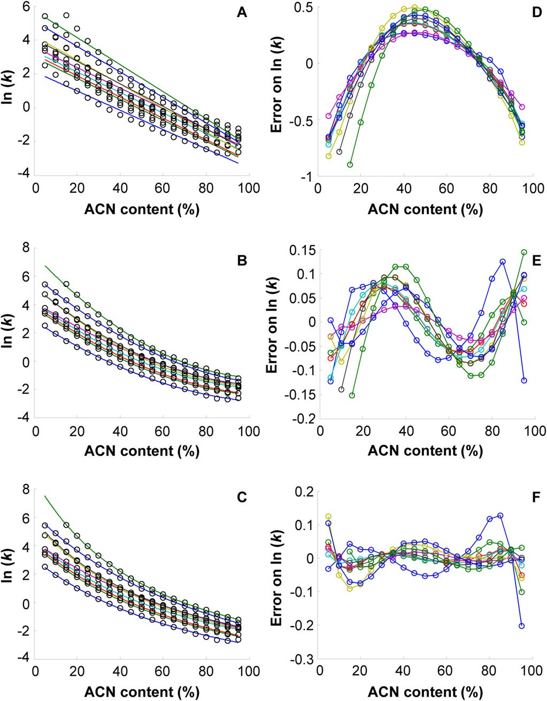
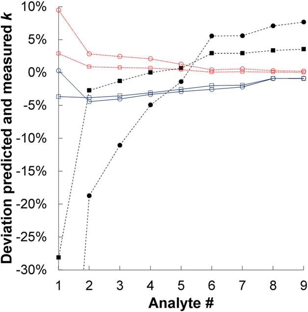
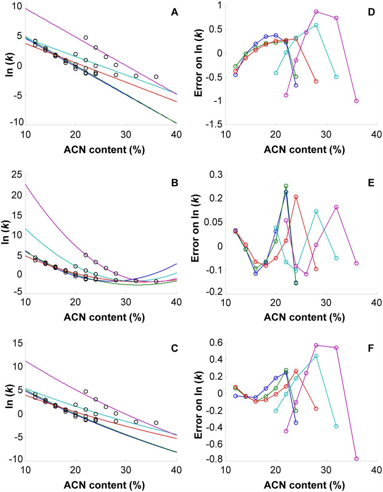
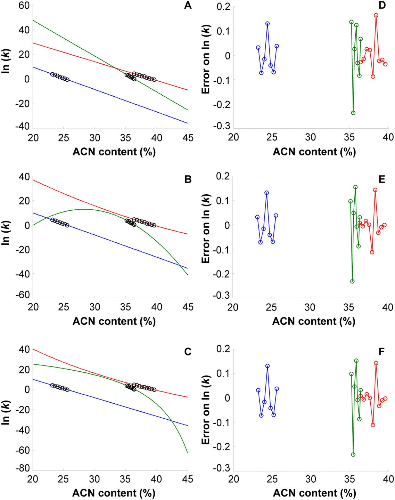
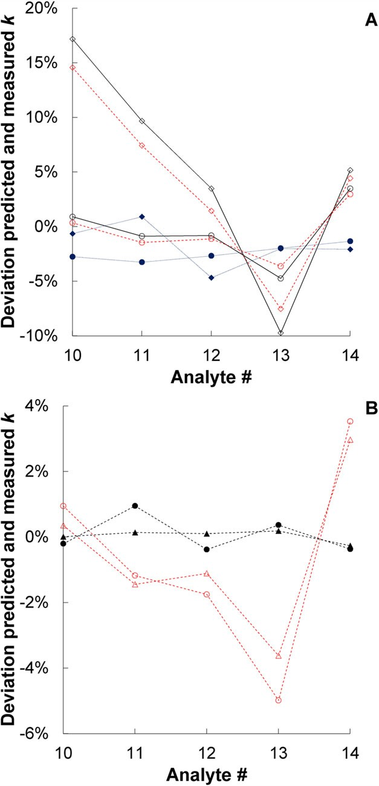

## 書誌情報

- 標題（原題）: Applicability of linear and nonlinear retention-time models for reversed-phase liquid chromatography separations of small molecules, peptides, and intact proteins
- 著者・所属: Eva Tyteca¹、Jelle De Vos¹、Nikola Vankova¹˒²、Petr Cesla²、Gert Desmet¹、Sebastiaan Eeltink¹（¹Department of Chemical Engineering, Vrije Universiteit Brussel, Brussels, Belgium／²Department of Analytical Chemistry, Faculty of Chemical Technology, University of Pardubice, Pardubice, Czech Republic）
- 掲載誌・巻号・DOI: *Journal of Separation Science* 2016; 39: 1249–1257. https://doi.org/10.1002/jssc.201501395（本解説はWiley-VCHの自己アーカイブ規定に基づく査読済みポストプリント版 http://hdl.handle.net/10195/67569 を底本とする）
- インパクトファクター: **2.9**（*J. Sep. Sci.*, JCR 2024 / Clarivate。Q2。出典により2.9〜3.2と幅あり）
- 受理経過 / ライセンス: 本文に受理日の記載なし（原文参照）。非営利目的での自己アーカイブが許諾されたポストプリント。
- 資金提供: Research Foundation Flanders（G.0256.16N）、N. VankovaはErasmus+プログラムの助成を受けた。著者に利益相反なし。

## 要旨（Abstract）

線形溶媒強度（LSS）モデルと2つの非線形保持時間モデル、すなわち二次モデルおよびNeueモデルの適用性と予測特性を、低分子（フェノール誘導体）・ペプチド・完全長タンパク質の分離を対象に評価した。保持時間測定は等温（イソクラティック）モードとグラジエントモード（異なるグラジエント時間・溶出強度の組合せを適用）の両方で実施した。

二次モデルは、低分子（平均絶対予測誤差1.5%）およびペプチド分離（予測誤差2.3%）において最も正確な保持係数予測を与えた。Neueモデルの利点は、わずか3回のグラジエントスカウトランのみに基づいて正確な予測が可能な点であり、煩雑な等温保持時間測定を不要にできることである。ペプチドについては、グラジエントスカウトランとNeueモデルを組み合わせることで、等温測定を用いる場合と比べてより良好な予測誤差（<2.2%）が得られた。二次モデルの適用性は、誤差関数と指数関数の複雑な組合せのため限定的である。

タンパク質の分離では、保持に対する有機修飾剤含量の強い影響のため、適用できる溶出ウィンドウが非常に狭かった。したがって、完全長タンパク質の線形的な保持時間挙動は線形溶媒強度モデルによってよく記述される。グラジエントスカウトランを用いた予測誤差（2.2%）は、等温スカウトランを用いた場合（3.2%）より有意に低かった。

**キーワード**: 線形溶媒強度モデル／メソッド開発／Neue–Kussモデル／保持時間予測／選択性

## 1. 序論（Introduction）

逆相液体クロマトグラフィー（RP-LC）モードで分析される小さな非極性分子の保持は、分配（パーティショニング）が支配的であることが一般に認められている[1]。カラムを等温（イソクラティック）モードで運用する場合、疎水性の幅が広い成分を含む混合物のベースライン分離は、妥当な時間内では達成できないことが多い。この「一般溶出問題（general-elution problem）」を克服するため、溶媒強度のグラジエントを適用することができる[2]。グラジエントモードではピーク幅が主に溶出時点の保持係数によって決まるため、グラジエント分離は狭くほぼ一定のピーク幅をもたらし、その結果、比較可能な検出感度が得られる。

保持係数（k）を移動相組成（φ）の関数として記述する保持モデルの構築は、メソッド開発戦略にとって極めて重要である。目的は、可能な限り短い分析時間で望ましい分離性能を達成することにある。混合物分析のためのメソッド開発は通常、多大な専門知識を要し（数週間の作業になることもある）、ピークの重なりが生じやすいこと[3, 4]、および個々の分析対象の保持時間がグラジエント勾配など条件に敏感に依存することが原因で、時間を要する。1970年代後半以降、保持時間モデルを開発し、Chromsword[5]やDryLab[6]のようなコンピュータ支援メソッド開発（CAMD）ソフトウェアに実装する試みが数多くなされてきた。RP-LCにおける保持時間モデルには、kとφの関係を記述する様々な式が開発されており、線形溶媒強度（LSS）モデル[7]、二次保持時間モデル[8–10]、Neueモデル[11]などがある。

1980年代にSnyderとDolanにより導入されたLSSモデルはメソッド開発戦略で最も頻繁に用いられ、RP-LCにおける等温保持を次式で記述する[7]:

> ln(k) = ln(kw) − S·φ ……(1)

ここでkwはφ→0（すなわち純水）に外挿したkの値、Sは分析対象と有機溶媒に固有の定数である「溶媒強度パラメータ」である。LSSモデルは低分子分離[12–14]にもペプチド・タンパク質を含む生体分子[15–17]にも適用されてきた。しかし、生体分子の保持時間は移動相組成に強く依存するため、保持時間モデルを構築・検証するための等温データがほとんど入手できない。さらに、LSSモデル（低分子分離用）はφの狭い範囲でしか有効でないことが報告されている[18]。

この点を考慮し、また多モード保持機構が生じる場合の保持時間モデリングを改善するため、文献上では非線形保持時間モデルが提案されてきた。二次モデル（式2）[8]およびNeue・Kussによって開発されたモデル（式3）[11]である:

> ln(k) = ln(kw) − S₁·φ − S₂·φ² ……(2)

> ln(k) = ln(kw) + 2·ln(1 + S₂·φ) − S₁·φ / (1 + S₂·φ) ……(3)

ここでkwは外挿された切片、S₁は傾き、S₂は曲率係数である。Neueモデルは、移動相の溶出強度の尺度として極性指数を用いるBoschとRosésの式[19]と強い類似性を示し、これによりモデルの適用範囲がモバイル相組成の全範囲に拡張される。式(2)・(3)で定義されるモデルは、メタノールの代わりにアセトニトリルを有機修飾剤として用いる場合や、固定相表面のシラノール基による望ましくない二次的保持効果が保持に影響する場合[20, 21]に現れうる、ln kとφの間の凹状の傾向を正確にフィッティングできる。しかし、これらのモデルの主な欠点は、ln kとφの間の曲率を正確にフィッティングするために多数の等温データ点が必要な点である[22]。さらに、二次モデルは外挿時にkwの値に誤差を生じやすい[11]。

本研究では、低分子（フェノール誘導体）および分子量（MW）817〜66,430 Daの生体分子（合成ペプチドおよび完全長タンパク質）を対象に、グラジエント保持係数を正確に推定するためのLSSモデル、二次保持時間モデル、Neue保持時間モデルの適用可能性と限界を検討した。保持モデルのパラメータは、異なる溶媒強度の移動相を適用した等温保持時間のRP-LC測定に基づいて決定した。LSSのkwおよびSパラメータ、ならびに非線形モデルのkw・S₁・S₂パラメータに基づく保持時間予測の正確性についても、異なるグラジエント時間・グラジエント幅の組合せを適用したグラジエントモードでのスカウトランによって評価した。

## 2. 材料と方法（Materials and Methods）

### 2.1 試薬・材料

アセトニトリル（ACN、HPLCスープラグレード）とギ酸（FA）はBiosolve社（Valkenswaard、オランダ）から入手した。脱イオンHPLCグレード水はMilli-Q水精製システム（Millipore、Molsheim、フランス）で自製した。

ウラシル、5-アミノ-2-ニトロフェノール(1)、4-ニトロフェノール(2)、3-ニトロフェノール(3)、o-クレゾール(4)、2-ニトロフェノール(5)、4-ブロモフェノール(6)、3,4-ジメチルフェノール(7)、4-ブロモ-2-ニトロフェノール(8)、4-ブロモ-2,6-キシレノール(9)の9種フェノール類、5種の合成ペプチド（ニューロテンシン(10)、アンジオテンシンI ヒト酢酸塩水和物(11)、ブラジキニン断片1–8酢酸塩水和物(12)、副腎皮質刺激ホルモン断片18–39ヒト（ACTH; 13）、ウシ膵臓由来インスリンB鎖酸化型(14)）、および3種のタンパク質（ウマ心臓由来シトクロムc(15)、ウシ赤血球由来炭酸脱水酵素(16)、BSA(17)）はSigma–Aldrich社（Steinheim、ドイツ）から購入した。

ウラシルおよび個々のフェノール誘導体のストック溶液は、各化合物500 ppmを70:30 v/v ACN/水に溶解して調製した。各ペプチド・タンパク質については、各分析対象1000 ppmを0.05% v/v FA含有水に溶解してストック溶液を調製した。個々のフェノール・ペプチド・タンパク質の試料混合物は、ストック溶液を以下の濃度域に希釈して調製した: フェノール類40〜80 ppm、ブラジキニン・ニューロテンシン4〜100 ppm、インスリン・アンジオテンシン10〜100 ppm、ACTH 20〜200 ppm、シトクロムc・炭酸脱水酵素・BSA 100〜1000 ppm。すべての試料は、等温溶出条件またはグラジエント開始条件に対応する移動相組成に溶解した。

フェノール類・ペプチドの分離には、2.6 μmコアシェル型C18シリカ修飾粒子を充填したAccucore C18カラム（100 × 2.1 mm i.d.、細孔径80 Å、Thermo Fisher Scientific社、Germering、ドイツ）を用いた。タンパク質の分離には、2.6 μmコアシェル型C4シリカ修飾粒子を充填したAccucore-150-C4カラム（150 × 2.1 mm i.d.、細孔径150 Å、Thermo Fisher Scientific社）を用いた。

### 2.2 装置・LC条件

HPLC実験はUltimate 3000 RSLCシステム（Thermo Fisher Scientific社）を用いて実施した。構成はデガッサ、バイナリ高圧ポンプ、1.2 μLの注入ループを備えた6ポート注入バルブ付きサーモスタット制御プル-ループ型オートサンプラー、30℃に設定した温度制御カラムコンパートメント、フローセル容量2.5 μLのダイオードアレイ検出器である。カラムと注入器・検出器の接続にはNanoViperチューブ（Thermo Fisher Scientific社、入口・出口チューブ350 × 0.075 mm i.d.）を使用した。

接続チューブに起因する外部時間（text）および圧力寄与は、カラムをゼロデッドボリュームコネクタに置き換えてウラシルを注入することで決定した。カラムデッドタイム（t0）は、移動相組成ACN/水 = 76:24 v/vでウラシルを注入して決定した。外部寄与を補正したカラムデッドタイムは0.54分であった。デッドタイム（tD）は、移動相にアセトントレーサーを添加し、ブランクグラジエントランを記録し、254 nmでUV検出することで決定した。tDは0.3 mL/minにおいて1.4分と決定された。

フェノール類は水とACNを移動相として等温・グラジエント条件下で分離した。フェノール誘導体の等温分離は、φが0.05〜0.95 ACNの広い範囲のアセトニトリル/水比で測定した。9種のフェノールとウラシルの混合物は、φ0（初期移動相組成）が0.05、0.10、0.15 ACNから開始し、φend（最終移動相組成）0.95 ACNに至る線形グラジエントで分離した。グラジエント分離はグラジエント時間（tG）5、10、15分でそれぞれ実施した。ペプチド・タンパク質は0.05% v/v FA含有ACN水溶液混合物を用いて等温・グラジエント条件下で分離した。線形グラジエント分離は、φ0値0.04、0.08、0.12、0.16、0.20、φend 0.64 ACN、tG 3.42、5、10、15分で実施した。すべてのHPLC実験は、低分子分離に最適なvan Deemter流速に相当する流速0.3 mL/minで実施した。

### 2.3 数値解析法

等温保持時間測定からkwおよびSパラメータを得るために、最小二乗フィッティングを用いる自作のMatlabプログラムを使用した。非線形モデルについては、Matlabのlsqcurvefitルーチンでフィッティングを実施した。初期値のグリッドサーチを実装した。等温ランを用いた線形・二次モデルについては、Matlabのpolyfitルーチンを使用した。グラジエントスカウトランを用いた線形モデルについては、グラジエント保持係数の解析式をlsqcurvefitルーチンに実装した。等温フィッティングの残差は(kpredicted − kexp)として計算し、パーセント誤差は(kpredicted − kexp)/kexpとして決定した。

## 3. 結果と考察（Results and Discussion）

低分子・生体分子（合成ペプチド・完全長タンパク質を含む）の分離における保持機構・予測能の類似点・相違点を最大限把握するため、すべての分析対象を同一の装置構成で分析した。低分子の分離、すなわち米国環境保護庁（EPA）により優先汚染物質として指定されているフェノール誘導体[23]には、シリカコアシェル型C18粒子を充填したカラムを使用した。この試験のため、疎水性の広い範囲をカバーするよう、ニトロ・アルキル・ブロモフェノール誘導体からなる試験混合物を作成した。ペプチドもC18カラムを用いて分析し、合成ペプチドのMWは817〜5734 Daであった。MW 12,384、29,000、66,430 Daのインタクトタンパク質は、C4官能基を充填したカラムで分離した。51アミノ酸からなるインスリンは、低MWペプチドとインタクトタンパク質の間のギャップを橋渡しする。

適用可能な移動相組成範囲を推定するための初期グラジエントスカウトランを実施した後、等温保持時間測定を行った。低分子と同じk範囲に到達するよう広いMW範囲の生体分子を選定したが、ペプチド、特にタンパク質で適用可能な溶媒組成範囲は低分子に比べてはるかに狭かった。**図1**は、等温モードで異なるφ値において得られた、選定フェノール（図1A）、ペプチド（図1B）、インタクトタンパク質（図1C）の溶出プロファイルの重ね合わせを示す。

MWの増加に伴い適用可能なφ範囲は減少し、より高い溶媒強度係数Sに対応する。実際、SとMWの関係はSnyderとDolanによってすでに提案されている[7]。低い溶媒強度を用いるとブロードなピークと低いS/Nが得られ、正確な保持時間の決定に影響する。分散を考慮し、検出限界を確保するため、インタクトタンパク質の濃度は高く設定した。

### 3.1 フェノール誘導体の保持時間モデリング

等温保持時間測定を実施し、保持係数（k）と溶媒強度（φ）の関係をLSSモデル（図2A）、二次保持時間モデル（図2B）、Neueモデル（図2C）でモデル化した。図2D〜Fに対応する残差プロットを示す。

フェノール誘導体の非線形保持挙動は低ACN・高ACN含量で最も顕著であり、二次モデルとNeueモデルのみがこれを考慮できる。二次保持時間モデルを適用した際には残差にS字型の傾向が観察されるものの、両非線形モデルとも残差の絶対値は比較的小さい。次に、kgはLSS[24]・Neueモデル[11]についてそれぞれ以下の解析式を用いて推定できる（式4: LSSモデル、式5: Neueモデル）。

> 補足: 原文式(4)(5)は本解説の底本であるポストプリントPDFのOCR抽出において、べき乗・分数の入れ子・指数関数の引数などの記号が著しく乱れており、正確な数式として再現できなかった。誤った数式を推測で補うと数値のねつ造になるため、ここでは掲載しない。原文の趣旨は「グラジエント保持係数kgを、等温測定から得たkw・S（LSSモデル）またはkw・S₁・S₂（Neueモデル）パラメータのみから、解析式によって直接計算できる」という点であり、この点と本文中の数値（予測誤差％等）は原文記載どおり正確に転記している。式の正確な形は原文（*J. Sep. Sci.* 2016, 39, 1249–1257、式(4)(5)、引用文献[24][11]）を直接参照されたい。

ここでk0はグラジエント開始時点における分析対象の保持係数を表す。二次モデルについてkgを決定するには数値積分が必要であった[25]。実験的なグラジエント保持係数（原文表記: kg = tR − 1。原文参照——OCR抽出の結果であり、標準的な保持係数の定義 k = (tR − t0)/t0 のOCR誤りである可能性がある。数値そのものへの影響はなく、本文が報告する予測誤差％等はそのまま転記している）は、tG = 5、10、15分でφ0–φendを0.05〜0.95としたラン、および固定グラジエント時間（tG = 10分）で異なるグラジエント開始条件（φ0 = 0.10、0.15）としたランについて、グラジエントモードで記録したクロマトグラムから個々の分析対象ごとに直接決定した。

図3はEq.(4)・(5)による予測値と実測kgの偏差を、等温モードで測定した各分析対象個別のS・kwパラメータに基づいて示す。図3AではLSSモデルとNeueモデルの予測誤差を比較している。LSSモデル適用時に予測値と実測kg値の間で最大の偏差が見られるのは早期溶出分析対象である。等温曲線に存在する非線形性はNeueモデルによって考慮され、より正確なkg予測につながる。二次モデルはNeueモデルよりわずかに良好な性能を示した（平均絶対予測誤差1.5%対2.4%、図3B参照）。

LSS・Neueモデルのkw・Sパラメータは、3種の異なるtGと2種の異なるφ0を用いたグラジエントスカウトランによっても推定でき、式(4)・(5)を適用し、leave-two-out戦略を用いてS（S₁・S₂）およびkw値を推定した。

図4は、実験的kgとLSS・Neueモデルに基づく予測値の偏差を各分析対象個別に比較している。LSSモデルを用いた予測精度は、グラジエントが比較的高い溶媒強度から開始する場合、早期溶出分析対象で有意に低下する。非線形Neueモデルによる予測はLSSモデルによる予測を上回る。図4はまた、予測精度がモデル構築時に用いたtGとφの組合せに依存することも示している。全体として、等温保持時間測定とNeueモデルの適用によるkg予測が最も正確であった。

### 3.2 ペプチドおよびインタクトタンパク質の保持時間モデリング

**図5**・**図6**は、それぞれペプチドとインタクトタンパク質についてのLSS・二次・Neue保持時間モデルのフィッティングとその残差を示す。

ペプチドは明確な非線形保持挙動を示し、そのため非線形保持時間モデルのフィッティングがより正確であった。二次モデルの残差はNeueモデルの残差より低く、Neueモデルは最も保持の強い2つのペプチド（ACTHとインスリン）に存在する強い非線形性に対応できない。C4カラムを用いた場合でも、インタクトタンパク質の保持時間決定に適用できる溶出ウィンドウは非常に小さかった。これにより、ほぼ線形なln(k)対φの領域が得られた。この条件下では、LSSモデルが保持挙動を正確に記述する。現時点では、φ範囲外ではインタクトタンパク質がペプチドと同様の非線形保持挙動を示し、kwを決定するための外挿が真値と比べて有意な過小評価につながりうる、という点は推測の域を出ない。

3.1節と同様の戦略を用い、グラジエント保持係数を等温モデルパラメータに基づいて推定し、グラジエントモードで記録した実験値と比較した。

図7Aは、グラジエント時間15分で広いグラジエント幅（φ=0.04–0.64）と、より高いACN含量から開始するグラジエント（φ=0.20–0.64）を用いた場合のLSS・Neue・二次モデルの予測を比較している。LSSのフィッティング自体は不良であるものの、低ACN含量から開始する広いグラジエント幅を適用した場合、ペプチドに対するLSSモデルの予測精度は意外にも良好であった。しかし、グラジエント開始時に比較的高いACN含量を用いると、最初に溶出するペプチドで最大17%に達する高い予測誤差が見られた。Neueモデルはより正確なkg予測を与えるが、グラジエント開始時に高含量の有機修飾剤を用いる場合には有意に乖離し始める。二次モデルは最も良好な結果を示し、平均予測誤差はわずか2.3%であった。

グラジエントスカウトランとNeueモデル・式(5)の解析式を組み合わせて用いた場合、等温ランを用いる場合と比べて良好な予測誤差が得られた（図7B参照）。予測誤差は典型的には0.1〜1.3%の範囲であり、平均予測誤差は2.2%であった。グラジエント開始時の有機修飾剤含量を増加させた場合（φ0 > 0.16）のみ、早期溶出ペプチドの精度が低下したが、これは部分的な等温溶出挙動に起因する可能性がある。グラジエントスカウトランの使用には、より速く、より汎用的であるという追加の利点がある。最小二乗最適化の際、許容できるフィッティングを見出すためには保持パラメータの初期値のグリッドサーチが必要であった点に留意されたい。

図6に示すように、実際に適用可能な溶媒強度ウィンドウにおいてln kとφの間にほぼ線形の関係が得られた。したがって、インタクトタンパク質についてはLSSモデルのみを適用してSおよびkwパラメータを決定した。等温保持時間測定に基づくと、平均予測誤差は3.2%、最大誤差は4.8%（φ0=0.16・tG=15分適用時）であった。CAMD戦略を用い、LSS・Neue保持時間モデルの構築にグラジエントスカウトランを用いることも検討した。しかし、保持パラメータの初期値のグリッドサーチや、最適化を可能な限り高感度にするためのソルバーオプションの変更を行っても、許容できるフィッティングは得られなかった。異なるグラジエント開始濃度の組合せによるスカウトランの組合せも検討したが、いずれも不適切なフィッティングとなった。

## 4. 結論（Concluding remarks）

低分子・ペプチドの両方について、得られた等温k値は非線形性が存在する比較的広い溶媒範囲に対応する。したがって、等温保持時間測定のより良い記述は非線形保持モデルを用いることで得られる。しかし、検討した中で最も保持の強いペプチド（ACTHとインスリン）については、Neueモデルを用いると予測精度の誤差が有意に増大した。低分子・ペプチド分離の両方について、二次モデルはNeueモデルよりも正確な保持時間予測を与えることが判明した。Neueモデルにはkgの解析式が存在し、迅速で汎用的なスカウトランを可能にすることを考慮すると、Neueモデルは低分子・ペプチドのグラジエント予測に好ましいモデルとみなせる。さらに、ペプチドのグラジエント分離の場合、Neueモデルを用いることで予測誤差が低減された。得られた予測誤差は、二次モデルと等温スカウトランによって得られる誤差と同程度の範囲であった。

タンパク質のMWがより高いこと、および予想されるS値が高いこと[7]と一致して、ln(k)対φの曲線は非常に急峻であることが判明し、その結果、低分子・ペプチドと同様のk範囲を得つつ信頼できるピーク積分を達成できる溶媒範囲は非常に狭いものとなった。LSSモデルおよび検討した非線形モデルは、適用した溶媒強度範囲内では非常に類似したフィッティング精度を示した。この範囲外では、非線形モデルは物理的にあり得ない外挿値を与えた。タンパク質もペプチドと同様に非線形保持挙動を示すと推測することはできるが、実際に適用可能な溶媒範囲はこれを実証するには狭すぎる。タンパク質分離における保持パラメータの正確な推定にグラジエントスカウトランを用いる試みは不成功であった。したがって、タンパク質のCAMDには、保持パラメータを得るために個別の等温ラン（少なくとも2点）を実施する必要がある。

## 訳者補足

- 本論文は漢方・生薬そのものを対象とした品質評価論文ではなく、逆相HPLCにおける保持時間モデル（LSS・二次・Neue-Kuss）の適用限界を、分子サイズ（低分子〜ペプチド〜完全長タンパク質、MW 817〜66,430 Da）という軸で体系的に比較した基礎的な分析化学の研究である。本ライブラリに既収載の関連論文（`retention-modeling-lc-review`／`retention-modelling-liquid-chromatography-review-2021`／`retention-prediction-lc-perspective-gritti`／`insilico-hplc-qspr-lser-lss-retention`など）と合わせて読むことで、コンピュータ支援メソッド開発（CAMD、DryLab等）の理論的基盤を補強する位置づけとなる。
- 漢方・生薬QCへの示唆（原文に明示的記載なし・訳者所見）: 生薬エキス中には低分子成分（フラボノイド・フェノール酸等）から高分子量成分（多糖・タンパク質様成分）まで幅広い分子種が混在しうる。本研究が示す「分子サイズが大きくなるほど適用可能な溶媒強度域が狭くなり、非線形保持モデルより線形モデルで十分になる」という知見は、生薬複合成分の同時定量法を等温スカウトランから構築する際、対象成分の分子量域に応じてモデル選択・スカウトラン設計を変えるべきという実務的な留意点として参考になりうる。
- 原文の式(4)・(5)（LSSモデル・Neueモデルによるグラジエント保持係数kgの解析式）は、OCR抽出されたポストプリントPDF内で記号（べき乗・入れ子分数・指数関数の引数）の一部が判読困難であった。本文中で報告されている数値（予測誤差％、MW値、装置条件等）はすべて原文記載どおり正確に転記しているが、式(5)の完全な数式表記のみ「原文参照」とする。捏造を避けるため、判読不能な記号列をそのまま推測で補完することはしていない。
