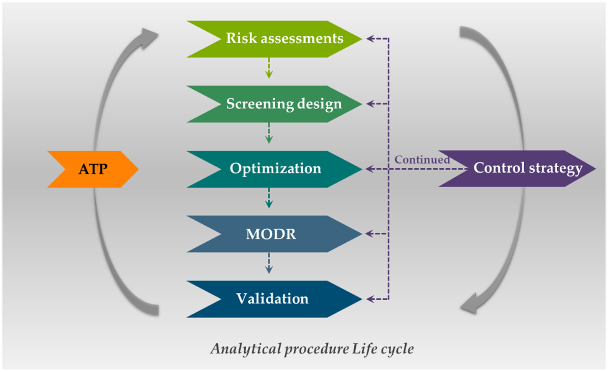
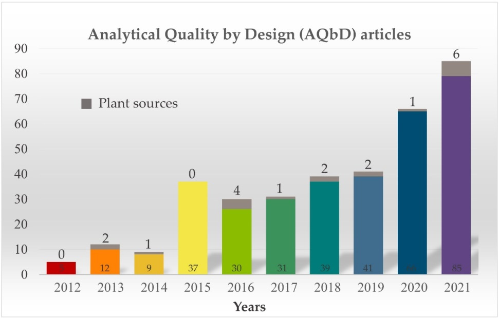

<!-- 方針: 総説の忠実訳。原文構成に沿う。「> 補足:」は訳者注。数式はKaTeXで表示。 -->

## 書誌情報

- 原題: Analytical Quality by Design (AQbD) Approach to the Development of Analytical Procedures for Medicinal Plants
- 著者: Geonha Park, Min Kyoung Kim, Seung Hyeon Go, Minsik Choi, Young Pyo Jang（責任著者）（慶熙大学校, 韓国）
- 掲載: *Plants* 2022, 11, 2960. https://doi.org/10.3390/plants11212960（オープンアクセス）
- インパクトファクター: **約4.0**（*Plants*, MDPI・JCR近年）

> 補足: 本稿は個別の分析データでなく、**薬用植物の分析法をAQbD(ICH Q14系の考え方)で開発する方法論**の総説。当サイトの芫花AQbD(同じJangグループ)の姉妹的レビューで、指紋・定量・Q-marker分析の「上流の設計論」にあたる。

## 薬用植物の分析法開発における分析的Quality by Design（AQbD）アプローチ

### 要約 (Abstract)
薬用植物の創薬において、品質、安全性、および有効性を監視するための適切な分析法を備えた科学的規制システムは不可欠である。過去数年間、薬用植物の分析において分析的Quality by Design（AQbD）戦略を採用する試みはごくわずかしか行われてこなかった。AQbDは、リスクアセスメントからライフサイクル管理に至るまで、分析手順を理解する包括的な手法および開発アプローチである。強化されたAQbDアプローチは、信頼性の高い分析法を開発するために必要な時間と労力を削減し、method operable design region（MODR）を通じて柔軟な変更管理（change control）をもたらし、out-of-specification（OOS）結果を低減する。しかし、薬用植物分析の分野では、化学的および生物学的特性の複雑さが障壁となるため、analytical target profiles（ATPs）の定義やcritical analytical procedure parameters（CAPPs）の特定など、すべてのAQbDワークフローのステップに従うことは困難である。本総説では、薬用植物の分析手順へのAQbDの多様な応用について議論する。単一化合物の分析とは異なり、薬用植物分析は生物材料に含まれる多成分を分析することを特徴とするため、特定の薬用植物分析における分析パラメータ内の相関関係、植物原材料の多様性、複数の植物化学物質（phytochemicals）に対して定義された1つ以上の分析ターゲット、重要な分析特性、および分析管理戦略（control strategy）に焦点を当てて要約する。さらに、デザインベースの品質管理技術の使用を通じて得られる機会と、共存する課題についても議論する。

---

### 1. 導入 (Introduction)
天然物の主要な起源として、薬用植物は何千年もの間、治療用植物化学物質（phytochemicals）の多様な供給源として、生薬用途の重要な候補として使用されてきた。米国食品医薬品局（USFDA）の植物性医薬品（botanical drugs）、欧州の生薬製剤（HMP）、中国の漢方薬（TCM）、およびその他の国々における植物性医薬品は、一般に天然物を含有する薬剤である。これらの薬剤の意図される治療有効性は、不均一な混合物（heterogeneous mixture）を用いた多成分・多標的（multi-component, multi-targeted）の作用機序を通じて実現される可能性が高い。生薬原料は自然（野生および/または農場栽培）から調達されるため、様々な環境的影響にさらされる。したがって、残留農薬、重金属汚染、異なる植物部位の使用、地理的影響、収穫後処理などの品質変化要因に細心の注意を払わなければならない。さらに、抽出プロセスの選択などの生産プロセスも品質の一貫性に影響を与える。

製薬業界は、原材料から最終医薬品に至るまで、製薬プロセスの複数の部分で分析データに依存している。すべての生産プロセスが品質の一貫性に影響を与えるため、各プロセスの監視および管理システムを持つことが非常に重要である。バリデートされた分析法は、標的化学物質の追跡、医薬品開発および製造における品質管理プロトコル、およびリスクに基づくライフサイクル管理（life cycle management）の体系的アプローチのための効果的なツールと見なされている。

日米EU医薬品規制調和国際会議（ICH）は、リスクを「原薬（API）および製剤の品質に対する危害の発生確率、重大性、および検出性の組み合わせ」と定義し、品質リスク管理（QRM）に関するICHガイドラインQ9を発表した。分析手順のQRMは、深い理解への体系的なアクセスを提供し、ライフサイクル全体で各方法の性能において取得されるデータの品質について、リスクの確認、監視、および管理を行う。また、米国薬局方（USP）は、ライフサイクルにおける循環を通じた継続的な修正および改善を含む、分析手順を確立するための全体的な証拠に基づくアプローチの枠組みである一般章<1220>「Analytical Procedure Life Cycle」（分析手順ライフサイクル）を公開した。ライフサイクル管理を適用して確立された分析法は、規制上の柔軟性を有する。

従来の分析手順（例：従来のquality-by-testing (QbT)方法論、試行錯誤（trial-and-error）アプローチ、またはone-factor-at-time (OFAT)調査）は、関連する実施基準を伴う一貫した方法に固定されるが、強化されたアプローチ（enhanced approach）は、再バリデーションプロトコルを必要とせずに、継続的な改善をサポートするために、実証された堅牢なデザインスペース（design space）内での分析パラメータの変更を容易にすることができる。分析手順に対する包括的な理解と管理戦略（control strategy）は、分析手順開発に関するICH Q14のステップ2ドラフトに記載されている分析的Quality by Design（AQbD）の概念を通じて実質的に達成できる。ICH Q14では、AQbDが強化されたアプローチ（enhanced approach）と呼ばれていることを強調することも価値がある。

過去20年間、QbDの原則は製薬業界全体にますます導入されてきた。特に、QbDの定義は、ICHガイドラインQ8（R2）によって「事前定義された目的から始まり、健全な科学と品質リスク管理に基づいて、製品およびプロセスの理解とプロセス管理を強調する開発への体系的アプローチ」と定義されている。試験を増やすことや異なる段階で試験することが、必ずしも製品品質、堅牢な製造プロセス、または効率的な開発を向上させるとは限らない。しかし、品質は、その目的を達成するために科学的に設計され、規制特性および医薬品品質システム（PQS）の深い理解を含むQbDの体系的なプロセスを通じて、より効果的に得ることができる。

AQbDは、QbDの概念を分析法開発のプロセスに適用したものであり、医薬品生産システムのすべてのステップで品質を監視する上で重要な役割を果たらす。AQbDは、健全な科学と品質リスク管理を通じて具体的な目標を理解し、構築することによる深い分析法から始まる。具体的な目標について、研究者は事前に分析ターゲットプロファイル（ATP）を定義する。ATPは「a prospective description of the desired performance of an analytical procedure that is used to measure a quality attribute, and it defines the required quality of the reportable value produced by the procedure」（品質特性を測定するために使用される分析手順の望ましい性能の将来的な記述であり、その手順によって生成される報告値の必要な品質を定義するもの）である。ここで、特定の分析手順に重大な影響を与える、重要分析手順特性（CAPAs）として定義される方法の性能の具体的な指標および/または特性が確立される。一方、環境条件、サンプル特性、技術パラメータ、測定、装置構成など、CAPAsに密接な影響を与える分析パラメータは、リスクアセスメントアプローチを通じて決定される。一般的に、入力パラメータと分析品質CAPAsの間の因果関係を確認する3つのリスク評価テスト（信号機リスク分析（traffic light risk analysis）、石川ダイアグラム、および故障モード影響解析（FMEA））がある。最もリスクが高いと評価されたパラメータは、重要分析手順パラメータ（CAPPs）として選択され、分析プロトコルが所望の品質を満たしていることを確認するために管理または監視される必要がある。

初期の分析管理戦略（control strategy）を確立するために、統計的ツールを使用する数学的アプローチである実験計画法（DoE）アプローチを利用できる。関与するパラメータの数が多いため、特にCAPPsが標的物質の定量結果に影響を与える場合、分析性能が限界に達するリスクが高くなる。選択されたCAPAsに影響を与えるパラメータの効果およびそれらのパラメータ内の効果が複雑な場合、まずDoE戦略を通じてCAPPsを単純化する手順が導入され、次にスクリーニング計画（screening design）を使用して分析プロセスを最適化する。特に、スクリーニング計画の結果は、応答曲面計画（response surface design）の3次元（3D）空間を通じてCAPPsの動的な因子対応答の関係を示し、それを多項式方程式として表現する。このプロセスは最適化ステップと呼ばれ、固定された分析法ではなく、方法操作可能設計領域（MODR）が導き出される。動作領域の満たされた分析性能基準内で手順が変更された場合に、手順のさらなる承認なしに十分に許容できるという科学的保証であるMODRを通じて、技術的柔軟性を達成できる。この後、MODR内で動作点（working point）が選択され、様々な基準（例：同定のための特異性および感度、定量のための正確性および精度）に基づいて品質管理方法の手順バリデーションが実行される。最後に、計画された一連の管理戦略（control strategy）について議論されるべきであり、これはライフサイクル管理によって要求されるATP基準の継続的な充足を保証するAQbD手順全体を網羅する必要がある。このステップには、各バッチでの実施から得られるデータの定期的な監視と、分析手順の目的が適合しているかどうかを判断するための変更後の性能評価の両方が含まれる。図1は、分析品質管理方法のライフサイクルを表すAQbDワークフローを示している。

> 補足: 図1および図2は原文を参照してください。

> - 図1：AQbDプロセスのステップの概略図（ATP、リスクアセスメント、スクリーニング計画、最適化、MODR、分析手順のバリデーション、および管理戦略）。
> - 図2：Scopusデータベース（2012年〜2021年）における、製薬業界での「Analytical quality by design」検索（カラーバー）および植物由来に分類された論文（グレーバー）に関連する年別の学術出版物数。

---

### 表1. 用語と略称 (Table 1. The terminology and abbreviations)

| 専門用語・略称 | 原文の定義・表記 | 日本語訳・説明 |
| :--- | :--- | :--- |
| **Introduction** | | **導入** |
| QbD | Quality by Design (ICH Q8) | プロセス理解とリスク管理に基づく体系的な開発アプローチ |
| AQbD | Analytical Quality by Design | 分析法開発へのQbD概念の適用 |
| OOS | Out-of-specification | 規格外結果 |
| USFDA | United States Food and Drug Administration | 米国食品医薬品局 |
| HMP | Herbal Medicine Products | 生薬製剤 |
| TCM | Traditional Chinese Medicine | 中医学（漢方薬） |
| ICH | International Council for Harmonization of Technical Requirements for Pharmaceuticals for Human Use | 医薬品規制調和国際会議 |
| QRM | Quality risk management (ICH Q9) | 品質リスク管理 |
| USP | United States Pharmacopeia | 米国薬局方 |
| QbT | Quality by Testing | 試験による品質管理（従来手法） |
| OFAT | One-factor-at-time | 一要因試験法（一回に一因子のみを変更する手法） |
| PQS | Pharmaceutical Quality System (ICH Q10) | 医薬品品質システム |
| **Fit-for-Purpose: Analytical Target Profiles** | | **目的に適合：分析ターゲットプロファイル** |
| ATP(s) | Analytical Target Profile(s) (ICH Q14) | 分析ターゲットプロファイル |
| API(s) | Active Pharmaceutical Ingredient(s) | 医薬品有効成分（原薬） |
| **Backbone-of-AQbD: Risk Assessment** | | **AQbDの骨格：リスクアセスメント** |
| APA(s) | Analytical Procedure Attribute(s) (ICH Q14) | 分析手順特性 |
| CAPA(s)$^a$ | Critical Analytical Procedure Attribute(s) | 重要分析手順特性（CMAと同義） |
| APP(s) | Analytical Procedure Parameter(s) (ICH Q14) | 分析手順パラメータ |
| CAPP(s)$^b$ | Critical Analytical Procedure Parameter(s) | 重要分析手順パラメータ（CMPと同義） |
| FMEA | Failure Modes Effects Analysis | 故障モード影響解析 |
| RPN | Risk Priority Number | リスク優先度数 |
| **Sort-the Main effects-out: Design of Experiment for Screening factors** | | **主効果の分類：因子スクリーニングのための実験計画法** |
| DoE | Design of Experiment | 実験計画法 |
| FFD | Full Factorial Design | 全因子計画法（二水準） |
| fFD | Fractional Factorial Design | 一部実施要因計画法（二水準） |
| PBD | Plackett-Burman Design | プラケット・バーマン計画法 |
| CP(s) | Center Point(s) | 中心点 |
| **Make-the Best conditions: Design of Experiment for Optimization** | | **最適条件の作成：最適化のための実験計画法** |
| CCD | Central Composite Design | 中心複合計画法 |
| BBD | Box-Behnken Design | ボックス・ベンケン計画法 |
| **Specify-Applicable Range: Method Operable Design Region** | | **適用範囲の特定：方法操作可能設計領域** |
| MODR | Method Operable Design Region (ICH Q14) | 方法操作可能設計領域 |
| PAR | Proven Acceptable Range for Analytical Procedure (ICH Q14) cf. Proven Acceptable Range (ICH Q8) | 分析手順の実証済み許容範囲 |
| **Planned-set-of-Controls: Analytical Procedure Control Strategy** | | **計画された管理セット：分析手順管理戦略** |
| SST | System Suitability Test (ICH Q14) | システム適合性試験 |
| **Confirm-the validity: Validation of Analytical Procedures** | | **妥当性の確認：分析手順のバリデーション** |
| EC(s) | Established Condition(s) (ICH Q12) | 既定条件 |
| DL | Detection Limit (ICH Q2) | 検出限界 |
| QL | Quantitation Limit (ICH Q2) | 定量限界 |
| **Prolong-for-Warranty: Analytical Procedure Lifecycle** | | **保証の延長：分析手順ライフサイクル** |
| USP-NF | United States Pharmacopeia–National Formulary | 米国薬局方・国民医薬品集 |

$^a$ 本研究における統一用語であり、様々な研究における重要方法特性（CMA）と同様の意味を持つ。  
$^b$ 本研究における統一用語であり、様々な研究における重要方法パラメータ（CMP）と同様の意味を持つ。

> 補足: 一般的な製薬業界におけるQbDのコンテキストでは、重要品質特性（CQA）および重要プロセスパラメータ（CPP）という用語が使われますが、分析法（AQbD）においては、本論文の著者は重要分析手順特性（CAPA/CMA）および重要分析手順パラメータ（CAPP/CMP）という用語を統一して使用しています。

---

### 2. 目的に適合：分析ターゲットプロファイル (Fit-for-Purpose: Analytical Target Profiles)
AQbDの最初のステップは、意図する分析手順のATPを定義することである。ATPは、よく定義された将来的な要件の要約であり、分析手順は正確な評価を通じて要求される測定品質を満たさなければならない。これは特定の方法や分析技術を意図するものではないため、ATPの基準を満たしていれば、どのような分析手順でも適用できる柔軟性を提供する。ATPには、標的サンプル、標的API、サンプル調製、必要な分析技術、装置要件、方法要件、標的アプリケーション、報告可能な品質特性、および重要な分析特性などのすべての要素が含まれる。標的アプリケーションには、最終医薬品の有効性と安全性を保証するための、原薬の力価試験のための同定、分離、定量などの一般的なアッセイや、不純物プロファイルや残留溶媒などのその他の規格試験が含まれる。特に、生薬（薬用植物）を分析する場合、目標は、栽培環境、収穫時期、保管などによる品質変化を追跡するために、クロマトグラフィー指紋（chromatographic fingerprints）を用いた種の識別や、バッチ間の相関分析である場合がある。

2016年から2021年までに発表された、植物資源に対するAQbDの分析法開発への適用に関するいくつかの報告が、それぞれの特徴とともに表2にまとめられている。本総説では、各論文のATPを「APIs」、「分析技術（analytical techniques）」、および「方法要件（method requirements）」の3つのカテゴリに分類している。様々な薬用植物における様々なクラスのAPIsを目的として分析手順が開発された。ほとんどの論文は、それぞれの分析技術によるAPIsの分離と定量を目的としており、そのため、天然物質の分離に一般的に使用されている液体クロマトグラフィーが主に利用された。この技術は、様々な植物化学物質（phytochemicals）の海の中から目的のAPIsを分析するために、APIsのスペクトルを得ることよりも、クロマトグラムを得ることに焦点を当てていた。フラボノイド類、テルペノイド類、キノン類、サポニン類、およびクルクミノイドやクマリン類などのフェノール化合物クラスが、（超）高速液体クロマトグラフィー-紫外線/可視光（フォトダイオードアレイ検出器）（(U)HPLC-UV/Vis (PDA)）技術によって分析された。質量分析（Mass spectrometry）はテルペンラクトン類およびポリフェノール類の分析に採用され、超臨界流体クロマトグラフィー（supercritical fluid chromatography）はカンナビノイド類の分析に利用された。糖およびその誘導体はUV/Vis分光光度計では容易に検出されないため、示差屈折計（RI）、蒸発光散乱検出器（ELSD）、およびサンプル調製プロセスなどの様々な検出方法が分析に適用された。

#### 表2. 2016年から2021年に発表された植物資源用分析手順の開発へのAQbDの適用（Table S1の要約）

| 年 | 著者 (Authors) | 薬用植物 (Medicinal Plants) | 文献番号 |
| :--- | :--- | :--- | :--- |
| 2021 | Zhang et al. | イチョウ (*Ginkgo biloba*) | [41] |
| 2021 | Tiwari et al. | ルリマツリ属種 (*Plumbago* species) | [37] |
| 2021 | Kim et al. | フジモドキ (*Daphne genkwa*) | [34] |
| 2021 | Parab Gaonkar et al. | ウコン (*Curcuma longa*) | [40] |
| 2021 | Kim et al. | シャクヤク (*Paeonia lactiflora*) ＆ オニダケ (*Angelica gigas*) | [36] |
| 2021 | Deidda et al. | アサ属種 (*Cannabis* Species) | [43] |
| 2020 | Silva et al. | サトウキビ蜜 (Sugarcane Honey) | [44] |
| 2019 | Deidda et al. | 大麻オリーブオイル (Cannabis-olive oil) | [48] |
| 2019 | Zhang et al. | カンゾウ (*Glycyrrhiza glabra*) | [35] |
| 2018 | Ancillotti et al. | カキ (*Diospyros kaki*) | [42] |
| 2018 | Shao et al. | トウジン (*Codonopsis pilosula*) ＆ キバナオウギ (*Astragalus membranaceus*) | [45] |
| 2017 | Silva et al. | サトウキビ (*Saccharum officinarum*) | [46] |
| 2016 | Sheng-Yun et al. | シナゴールドスレッド/コプティス (*Coptis chinensis*) | [49] |
| 2016 | Wang et al. | トウジン (*Codonopsis pilosula*) ＆ キバナオウギ (*Astragalus membranaceus*) | [47] |
| 2016 | Dai et al. | 田七人参 (*Panax notoginseng*) | [38] |
| 2016 | Gong et al. | 田七人参 (*Panax notoginseng*) | [39] |

---

### 3. AQbDの骨格：リスクアセスメント (Backbone-of-AQbD: Risk Assessment)
ATPが確立された後、分析性能の品質に影響を与える分析手順特性（APAs）を選択する必要がある。これらのAPAsは、定量可能な分析出力によって追跡される主要な変数であり、分析プロセスの期待される品質を保証するために妥当な範囲内でなければならない。一般的に、CAPAsは先行知識と科学的プロセスに基づくリスクアセスメントを通じて決定される。リスクアセスメントは、APAsやATPへの適合性など、方法の性能に影響を与える分析手順パラメータ（APPs）を特定し、順位付けすることを目的としている。したがって、これはATP、APAs、APPs、および管理戦略（control strategy）を接続するための、AQbDの第一印象および骨格を形成する。リスクアセスメントの実施後、「重要」分析手順特性（CAPAs）および「重要」分析手順パラメータ（CAPPs）の優先リストが得られる。

リスクアセスメントを実行するために使用される主なツールは、フローチャート、チェックシート、プロセスマッピング、石川ダイアグラム（魚の骨図または因果関係図としても知られる）、故障モード影響解析（FMEA）などである。この後、CAPPsを用いた分析手順のモデリングと統計的評価により、方法操作可能設計領域（MODR）が得られ、これは設計領域内での分析手順の変更を許可する規制上の柔軟性の基礎となり得る。薬用植物に対するAQbDアプローチでは、潜在的なCPPsを特定するために石川ダイアグラムが圧倒的に多く利用されており、これにFMEAやリスク推定マトリクス（信号機リスク分析として知られる）が続いている。

リスクアセスメントはAQbDの成功への重要なステップであり、適切なデザインスペース研究の前提条件である。また、手順開発の取り組みとその効果への焦点を絞るためにも重要である。デザインスペースの段階に達する前であっても、不適切なリスクアセスメントのためにAQbDが失敗することがある。したがって、リスクアセスメントは、開発の初期段階から分析手順のライフサイクルにおける継続的な監視に至るまで、各ステップで更新されるべきである。

#### 3.1. 石川ダイアグラム (Ishikawa Diagram)
魚の骨図または因果関係図とも呼ばれる石川ダイアグラムは、問題の考えられる原因を分類するために使用される視覚化ツールである。問題の根本原因を特定するために、サンプル調製、装置、材料、人員要因、および環境条件などに関連する様々なカテゴリのリスクを分析することができる。ほとんどのクロマトグラフィー法では、6M（Mother nature（環境）、Machine（装置）、Materials（材料）、Method（方法）、Measurement（測定）、Man（人））の分岐を持つ石川ダイアグラムを使用してリスクアセスメントが行われる。この方法は、分析結果に影響を与える可能性のある様々なパラメータを可視化し、同時に示すことができるが、パラメータ間の関連性を特定することはできない。

#### 3.2. 故障モード影響解析 (Failure Modes Effects Analysis: FMEA)
FMEAは、すべての潜在的な問題（故障モード）とその影響（影響解析）を特定し、ランク付けする、先き回りした定性的かつ体系的なリスク分析である。FMEAの目的は、最も優先度の高い欠陥から始めて、欠陥を排除または削減するための対策を講じることである。故障モードは、その結果がどれほど重大であるか（S：severity）、どれほど頻繁に発生するか（O：occurrence）、およびどれほど容易に検出できるか（D：detectability）に従って優先順位が付けられる。リスク優先度数（RPN）は、S、O、Dのスコア（それぞれ1から10の間）を掛け合わせることで計算され、数値が高いほどリスクが高いことを示す。
$$RPN = S \times O \times D$$
Kimら[34]およびZhangら[35]は、高リスク因子を選択するための魚の骨図の後続としてFMEAを使用した。どちらの研究でも、多くの植物化学物質を同時に分析するためにHPLC-PDAが使用され、様々なパラメータが複雑に相互作用するため、スコアリングプロセスを通じてより高リスクなパラメータを密かつ正確に特定する目的でFMEAが使用された。様々な潜在的CAPPsのリスクレベルが数値で表されるため、因子の優先順位を容易に比較できる。

#### 3.3. リスク推定マトリクス (Risk Estimation Matrix)
リスク推定マトリクス（または信号機やヒートマップ）は、色コードを使用してリスクのレベルを可視化するのに役立つ。赤は重大または破滅的なリスク、黄は中程度のリスク、緑は軽微または無視できるリスクを示す。各パラメータが各CAPAに与える影響を一目で把握できるという利点がある。Tiwariら[37]およびKimら[36]は、HPLC分析においてCAPAsと潜在的CAPPsの間の相関を推定するためにリスク推定マトリクスを使用した。先行知識や先行研究に基づくリスクアセスメントなしにCAPPsが決定される場合、CAPPsの有効性をテストするためにいくつかの予備実験を行う必要がある。

---

### 4. 主効果の分類：因子スクリーニングのための実験計画法 (Sort-the Main Effects-out: Design of Experiments (DoE) for Screening Factors)
CAPAsおよびCAPPsはリスクアセスメントから直接導き出すことができるが、考慮すべき特性やパラメータが多すぎる場合は、実験計画法（DoE）の概念を適用して、多数の潜在的なCAPAsおよびCAPPsの中から重要な少数のものを選択することができる。従来の試験法（QbT方法論、一要因試験法（OFAT）調査、試行錯誤アプローチなど）で実験を行う場合、応答に影響を与える変数のすべての効果を理解し、管理することはほぼ不可能である。DoEの目的は、統計的手法を通じて「最小の実験」で「最大の情報」を得るための実験計画を確立することである。

因子スクリーニングのためのDoE（「スクリーニングDoE」と呼ぶ）は、応答に影響を与える因子を特定し、分析手順の特性に影響を与える可能性のあるすべての因子を評価して、因子の定性的、定量的、および総合的な側面を理解するのに役立つ。いくつかの研究において、全因子計画法（FFD）、一部実施要因計画法（fFD）、およびプラケット・バーマン計画法（PBD）が主にスクリーニングDoEに使用されることが示されている。スクリーニングDoEおよび最適化DoEモデルの特徴は表3にまとめられている。

#### 表3. スクリーニングおよび最適化DoEの特徴 (Characteristics of screening and optimization DoE)

| DoEのタイプ | 実験計画 (Experimental Design) | 一般的な因子数 ($k$) | 水準 (Levels) | 実験回数 ($N$) |
| :--- | :--- | :--- | :--- | :--- |
| **スクリーニングDoE** | 二水準全因子計画法 (Two-level Full factorial design) | $2 < k < 5$ | 2 | $2^k$ |
| | 二水準一部実施要因計画法 (Two-level fractional factorial design) | $k > 3$ | 2 | $2^{k-p}$ * |
| | プラケット・バーマン計画法 (Plackett-Burman design) | $k < N - 1$ | 2 | $N$ |
| **最適化DoE** | 三水準全因子計画法 (Three-level full factorial design) | $2 < k < 3$ | 3 | $3^k$ |
| | 中心複合計画法 (Composite central design) | $2^k < 5$ | 5 | $2^k + 2k + C$ |
| | ボックス・ベンケン計画法 (Box-Behnken design) | $3 < k < 5$ | 3 | $2k(k - 1) + C$ |
| | デーラート計画法 (Doehlert design) | 2 または 3 | 複数 (Multiple) | $k^2 + k + C$ |

* $p$ は計画を分割するために使用される計画ジェネレータ（design generator）の数。
> 補足: $C$ は中心点（Center Point）の繰り返し数を示す。

#### 4.1. 全因子計画法 (Full Factorial Design: FFD)
全因子計画法（FFD）は、通常2〜5個の因子において、交絡することなく因子の主効果とそれらの相互作用を理解するために使用される。スクリーニング設計プロセスにおいて、二水準FFDはその経済的効率性のために最初に考慮される設計である。因子はアルファベットの大文字で表され、因子の高い水準は（+）または+1、低い水準は（−）または−1、中間の水準は0として表される。2、3、および4つの実験因子に対する二水準FFDマトリクスは表4に示されている。因子のすべての可能な組み合わせがモデルに含まれ、実験回数の式は $level^{factors}$（すなわち $2^k$）として表される。

天然物分析にAQbDを適用した論文の中で、Kimら[34]は、カラム温度、流量、注入量、および移動相溶媒のグラジエントスロープの中から、フジモドキ（*Genkwa Flos*）のフラボノイドピーク数に主に影響を与える変数を特定するために、4因子二水準（$2^4$）FFDを利用した。

#### 表4. 2因子（$2^2$）、3因子（$2^3$）、および4因子（$2^4$）の実験因子に対する二水準FFDマトリクス

| $2^2$ 計画マトリクス | | $2^3$ 計画マトリクス | | | | $2^4$ 計画マトリクス | | | | |
| :--- | :--- | :--- | :--- | :--- | :--- | :--- | :--- | :--- | :--- | :--- |
| **No.** | **$X_1$** | **$X_2$** | **No.** | **$X_1$** | **$X_2$** | **$X_3$** | **No.** | **$X_1$** | **$X_2$** | **$X_3$** | **$X_4$** |
| 1 | -1 | -1 | 1 | -1 | -1 | -1 | 1 | -1 | -1 | -1 | -1 |
| 2 | -1 | +1 | 2 | -1 | -1 | +1 | 2 | -1 | -1 | -1 | +1 |
| 3 | +1 | -1 | 3 | -1 | +1 | -1 | 3 | -1 | -1 | +1 | -1 |
| 4 | +1 | +1 | 4 | -1 | +1 | +1 | 4 | -1 | -1 | +1 | +1 |
| | | | 5 | +1 | -1 | -1 | 5 | -1 | +1 | -1 | -1 |
| | | | 6 | +1 | -1 | +1 | 6 | -1 | +1 | -1 | +1 |
| | | | 7 | +1 | +1 | -1 | 7 | -1 | +1 | +1 | -1 |
| | | | 8 | +1 | +1 | +1 | 8 | -1 | +1 | +1 | +1 |
| | | | | | | | 9 | +1 | -1 | -1 | -1 |
| | | | | | | | 10 | +1 | -1 | -1 | +1 |
| | | | | | | | 11 | +1 | -1 | +1 | -1 |
| | | | | | | | 12 | +1 | -1 | +1 | +1 |
| | | | | | | | 13 | +1 | +1 | -1 | -1 |
| | | | | | | | 14 | +1 | +1 | -1 | +1 |
| | | | | | | | 15 | +1 | +1 | +1 | -1 |
| | | | | | | | 16 | +1 | +1 | +1 | +1 |

#### 4.2. 一部実施要因計画法 (Fractional Factorial Design: fFD)
評価する因子の数が増えると、実験因子間のすべての効果と相互作用を評価することは効率的ではない場合がある。個々の因子の効果と変数間の相互作用は実験応答に影響を与え、たとえそれが統計的に有意であっても、これらの因子に関する知識と理解は不十分な場合がある。この場合、実験応答に主に影響を与える因子に関する情報を取得し、意味の薄い高次の相互作用を犠牲にして最小限の実験を実行することが望ましい。

一部実施要因計画法（fFD）は、実験因子の数が4つ以上の場合に、比較的少ない実験回数で多くの実験因子の効果を評価できるため、一般的に使用されるスクリーニングDoEモデルの1つである。fFDはFFDを $2^p$ で割ることによって設計される。fFDは立方体マトリクスのすべての点の実験設計を必要としないため、時間を短縮できるという利点があるが、変数の主効果と相互作用が交絡（confound）する可能性があるという欠点がある。この交絡を避けるために、全因子を一部実施要因に分割するために使用される交絡効果を理解するための概念である計画ジェネレータ（design generator）の数を慎重に考慮して、適切なfFDを選択する必要がある。fFDの実験回数は $2^{k-p}$ であり、ここで $k$ は実験因子の数、$p$ は計画を分割するために使用される計画ジェネレータの数である。

Shaoら[45]は、HPLC-ELSDを使用してトウジン（*Codonopsis Radix*）エキスとキバナオウギ（*Astragali Radix*）エキスの糖含有量を分析する際に、7つのパラメータをスクリーニングするために二水準fFDを適用し、3つのパラメータをCAPPsとして特定した。

#### 表5. 3因子（$2^{3-1}$）、4因子（$2^{4-1}$）、および5因子（$2^{5-2}$）の実験因子に対する二水準fFDマトリクス

| $2^{3-1}$ 計画マトリクス $^{*A}$ | | | $2^{4-1}$ 計画マトリクス $^{*B}$ | | | | $2^{5-2}$ 計画マトリクス $^{*C}$ | | | | |
| :--- | :--- | :--- | :--- | :--- | :--- | :--- | :--- | :--- | :--- | :--- | :--- |
| **No.** | **$X_1$** | **$X_2$** | **$X_3$** | **No.** | **$X_1$** | **$X_2$** | **$X_3$** | **$X_4$** | **No.** | **$X_1$** | **$X_2$** | **$X_3$** | **$X_4$** | **$X_5$** |
| 1 | -1 | -1 | +1 | 1 | -1 | -1 | -1 | -1 | 1 | -1 | -1 | -1 | +1 | +1 |
| 2 | -1 | +1 | -1 | 2 | +1 | -1 | -1 | +1 | 2 | +1 | -1 | -1 | -1 | -1 |
| 3 | +1 | -1 | -1 | 3 | -1 | +1 | -1 | +1 | 3 | -1 | +1 | -1 | -1 | +1 |
| 4 | +1 | +1 | +1 | 4 | +1 | +1 | -1 | -1 | 4 | +1 | +1 | -1 | +1 | -1 |
| | | | | 5 | -1 | -1 | +1 | +1 | 5 | -1 | -1 | +1 | +1 | -1 |
| | | | | 6 | +1 | -1 | +1 | -1 | 6 | +1 | -1 | +1 | -1 | +1 |
| | | | | 7 | -1 | +1 | +1 | -1 | 7 | -1 | +1 | +1 | -1 | -1 |
| | | | | 8 | +1 | +1 | +1 | +1 | 8 | +1 | +1 | +1 | +1 | +1 |

$^{*A}$ $X_3 = X_1 \times X_2$;  
$^{*B}$ $X_4 = X_1 \times X_2 \times X_3$;  
$^{*C}$ $X_4 = X_1 \times X_2$; $X_5 = X_1 \times X_3$.

#### 4.3. プラケット・バーマン計画法 (Plackett-Burman Design: PBD)
プラケット・バーマン計画法（PBD）は、二水準で数学的に導出された4の倍数のスクリーニング設計である。PBDは $N-1$ 個の因子を $N$ 回の実験で調査するために使用され、7つ以上の因子（特に4の倍数、少なくとも8回、すなわち8、12、16、20回など）を持つ実験計画を提案し、7、11、15、19個までの因子を調査するのに適している。二水準PBDは、7つの因子を二水準PBDで設計することと飽和fFD（$2^{7-4}$）で設計することが類似しているため、飽和fFDと類似している。11個の実験因子に対してPBDを使用して実験を設計する場合、12回の実験ランが設計される（表6）。

PBDは、できるだけ少ない実験回数で、すべての主効果の不偏推定量を提供できるため、スクリーニングに有用であるが、主効果間の相互作用を評価することは困難である。したがって、PBDは薬用植物分析のスクリーニング変数として広く使用されている。

Zhangらは、7つの因子から3つの中心点（CP）を繰り返して設計された15回のランの下で、4つのCAPPsを選択するためにPBDを使用した[41]。別のPBD研究では、CPをテストせずに8つの因子から設計された12回のランの下で4つのCAPPsが選択された[35]。PBDで調査可能な因子の数（$N-1$）が調査対象の因子の数を超える場合、残りの列はダミー因子（dummy factor）列として定義される。これは、物理化学的な意味を持たず、水準-1と+1の間で変化する仮想的な変数である。

Sheng-Yunと共同研究者らは、シナゴールドスレッド（*Coptis chinensis*）の主要アルカロイドの臨界分離能（resolution）の最大化、分析時間の最小化、およびピーク幅の最小化を目指して、5つの潜在的なAPPsの中から3つのCAPPsを選択するためにPBDを利用した[49]。

Wangら[47]は、トウジン（*Codonopsis pilosula*）とキバナオウギ（*Astragalus membranaceus*）からなる参耆扶正注射液（Shenqi Fuzheng injection）中の9つの生物活性化合物の定量のために、固相抽出（SPE）およびHPLC-UV/ELSD分析プロセスの両方の主効果をスクリーニングするためにPBDを適用した。

#### 表6. 11個の実験因子に対するプラケット・バーマン計画（PBD）のマトリクス

| **No.** | **$X_1$** | **$X_2$** | **$X_3$** | **$X_4$** | **$X_5$** | **$X_6$** | **$X_7$** | **$X_8$** | **$X_9$** | **$X_{10}$** | **$X_{11}$** |
| :--- | :--- | :--- | :--- | :--- | :--- | :--- | :--- | :--- | :--- | :--- | :--- |
| 1 | +1 | -1 | +1 | -1 | -1 | -1 | +1 | +1 | +1 | -1 | +1 |
| 2 | +1 | +1 | -1 | +1 | -1 | -1 | -1 | +1 | +1 | +1 | -1 |
| 3 | -1 | +1 | +1 | -1 | +1 | -1 | -1 | -1 | +1 | +1 | +1 |
| 4 | +1 | -1 | +1 | +1 | -1 | +1 | -1 | -1 | -1 | +1 | +1 |
| 5 | +1 | +1 | -1 | +1 | +1 | -1 | +1 | -1 | -1 | -1 | +1 |
| 6 | +1 | +1 | +1 | -1 | +1 | +1 | -1 | +1 | -1 | -1 | -1 |
| 7 | -1 | +1 | +1 | +1 | -1 | +1 | +1 | -1 | +1 | -1 | -1 |
| 8 | -1 | -1 | +1 | +1 | +1 | -1 | +1 | +1 | -1 | +1 | -1 |
| 9 | -1 | -1 | -1 | +1 | +1 | +1 | -1 | +1 | +1 | -1 | +1 |
| 10 | +1 | -1 | -1 | -1 | +1 | +1 | +1 | -1 | +1 | +1 | -1 |
| 11 | -1 | +1 | -1 | -1 | -1 | +1 | +1 | +1 | -1 | +1 | +1 |
| 12 | -1 | -1 | -1 | -1 | -1 | -1 | -1 | -1 | -1 | -1 | -1 |

---

### 5. 最適条件の作成：最適化のための実験計画法 (Make-the Best Conditions: Design of Experiments (DoE) for Optimization)
スクリーニングDoEプロセスを通じて選択されたCAPPsは、最適化DoEプロセスを通じてさらに調査され、最適化され得る。最適化のためのDoEは、対称モデルと非対称モデルに分けられる。対称設計（symmetrical design）は、対称的な実験領域を含み、実験誤差を評価するために中心点（CP）が3〜5回測定される。全因子計画法（FFD）、中心複合計画法（CCD）、ボックス・ベンケン計画法（BBD）、およびデーラート計画法（Doehlert design）が対称設計と見なされる。非対称の実験領域を評価する必要がある場合には、D-optimal計画法などの非対称設計が適用される。薬用植物の分析手順を最適化するために、主に3水準FFD、CCD、BBD、およびデーラート計画法が実施される。

#### 5.1. 全因子計画法 (Full Factorial Design: FFD)
FFDは最適化DoEに使用する場合、複雑な応答曲面のモデリングや、すべての実験因子のすべての水準（-1、0、および+1）の組み合わせのテストを可能にするため、主に3水準FFDが考慮される。最適化のためのFFDは、因子のすべての組み合わせをテストしなければならず、因子の数が増えると必要な実験回数が劇的に増加するため、通常、因子の数が2つまたは3つのように少ない場合に使用される。3水準FFDの実験回数は $3^{factors}$（すなわち $3^k$）であり、すなわち2因子の実験には9回（$3^2$）、3因子の実験には27回（$3^3$）のランが必要である。3因子に対する3水準FFDのマトリクスは表7にまとめられている。

Silvaら[44]は、HPLC-RIを用いたサトウキビ蜜（sugarcane honey）からの糖の分離、同定、および定量を評価するために $3^3$-FFDを設計し、3つのCAPAs（目的ピークの面積、分離能、非対称性）を評価し、リスクアセスメントから3つのCAPPs（流量、カラム温度、および移動相溶媒の比率）を選択した。

Parab Gaonkarら[40]は、HPLC-UVを使用したウコン（*Curcuma longa*）中のクルクミノイド類の定量の目的で、移動相中のオルトリン酸濃度と移動相の比率を最適化するために、CPをテストせずに $2^2$-FFDを適用した。

例外的に、因子の特性によりCPを設定できないため、CPを除外してFFDを実行できる。Deiddaら[43]は、アサ属種（*Cannabis* species）からの9つのカンナビノイドを分析するために $2^3$-FFDを使用し、Silvaら[46]は、MEPS-UHPLC-PDA分析によるサトウキビ（*Saccharum officinarum*）からの糖の分離および定量のために、2因子1水準（$1^2$）、3因子2水準（$2^3$）、および4因子1水準（$1^4$）という3つの異なるFFDモデルを利用した。
> 補足: 上記 $1^2$ や $1^4$ などの表記は、おそらく因子と水準の組み合わせ（1水準・複数因子など）を示す原文特有の表現です。

#### 表7. 3水準全因子計画法（$3^3$-FFD）、中心複合計画法（CCD）、およびボックス・ベンケン計画法（BBD）のマトリクス

| $3^3$ 全因子計画法 | | | 中心複合計画法 (CCD) | | | ボックス・ベンケン計画法 (BBD) | | |
| :--- | :--- | :--- | :--- | :--- | :--- | :--- | :--- | :--- |
| **No.** | **$X_1$** | **$X_2$** | **No.** | **$X_1$** | **$X_2$** | **$X_3$** | **No.** | **$X_1$** | **$X_2$** | **$X_3$** |
| 1 | -1 | -1 | 1 | -1 | -1 | -1 | 1 | -1 | -1 | 0 |
| 2 | -1 | -1 | 2 | +1 | -1 | -1 | 2 | +1 | -1 | 0 |
| 3 | -1 | -1 | 3 | -1 | +1 | -1 | 3 | -1 | +1 | 0 |
| 4 | -1 | 0 | 4 | +1 | +1 | -1 | 4 | +1 | +1 | 0 |
| 5 | -1 | 0 | 5 | -1 | -1 | +1 | 5 | -1 | 0 | -1 |
| 6 | -1 | 0 | 6 | +1 | -1 | +1 | 6 | +1 | 0 | -1 |
| 7 | -1 | +1 | 7 | -1 | +1 | +1 | 7 | -1 | 0 | +1 |
| 8 | -1 | +1 | 8 | +1 | +1 | +1 | 8 | +1 | 0 | +1 |
| 9 | -1 | +1 | 9 | -1.68| 0 | 0 | 9 | 0 | -1 | -1 |
| 10| 0 | -1 | 10| +1.68| 0 | 0 | 10| 0 | +1 | -1 |
| 11| 0 | -1 | 11| 0 | -1.68| 0 | 11| 0 | -1 | +1 |
| 12| 0 | -1 | 12| 0 | +1.68| 0 | 12| 0 | +1 | +1 |
| 13| 0 | 0 | 13| 0 | 0 | -1.68| 13| 0 | 0 | 0 |
| 14| 0 | 0 | 14| 0 | 0 | +1.68| 14| 0 | 0 | 0 |
| 15| 0 | 0 | 15| 0 | 0 | 0 | 15| 0 | 0 | 0 |
| 16| 0 | +1 | 16| 0 | 0 | 0 | | | | |
| 17| 0 | +1 | 17| 0 | 0 | 0 | | | | |
| 18| 0 | +1 | 18| 0 | 0 | 0 | | | | |
| 19| +1 | -1 | 19| 0 | 0 | 0 | | | | |
| 20| +1 | -1 | 20| 0 | 0 | 0 | | | | |
| 21| +1 | -1 | | | | | | | | |
| 22| +1 | 0 | | | | | | | | |
| 23| +1 | 0 | | | | | | | | |
| 24| +1 | 0 | | | | | | | | |
| 25| +1 | +1 | | | | | | | | |
| 26| +1 | +1 | | | | | | | | |
| 27| +1 | +1 | | | | | | | | |

> 補足: 表7の $3^3$-FFD 列における一部の行のパラメータ値の省略は、原文マトリクスに正確に基づいています。

#### 5.2. 中心複合計画法 (Central Composite Design: CCD)
中心複合計画法（CCD）は、二水準FFD（$2^{factors}$）、スター計画（$2 \times factors$）、および中心点（CP）を含み、したがってCCDの実験点数（$N$）は、以下の式（1）を使用して計算される。ここで $C_0$ は中心点の繰り返し数である。
$$N = 2^{factors} + 2 \times factors + C_0 \quad (1)$$

CCDは、各因子の5つの水準を評価し、これらは $-\alpha$、$-1$、$0$、$1$、および $+\alpha$ として表される。ここで、FFDの点は水準-1と+1に位置し、スター計画の点は水準 $-\alpha$ と $+\alpha$ に位置し、中心点は0に位置する。CCDは、$\alpha$ の値に応じて、面心（face-centered）CCDと外接（circumscribed）CCDの2つの一般的なタイプに区別される。面心CCDは、因子ごとに3つの水準を必要とする $|\alpha| = 1$ の場合に使用され、外接CCDは、因子ごとに5つの水準を必要とする $|\alpha| > 1$ の場合に使用される。回転可能な外接CCDを実行するために、スター計画の $(-\alpha, +\alpha)$ を導き出すために、以下の式が適用される。
$$|\alpha| = (2^{factors})^{1/4}$$
したがって、因子数が2、3、4、5、および6の場合、$|\alpha|$ 値はそれぞれ1.41、1.68、2.00、2.38、および2.83となる。

CCDは、植物資源の分析条件を最適化するために広く適用されている。Kimらの研究[34]では、各パラメータに対して5つの点（-1.41、-1、0、+1、+1.41）を使用して、HPLC-PDAを用いたCAPAs（フラボノイドのピーク分離能）とCAPPs（カラム温度および移動相溶媒のグラジエントスロープ）の間の関係を評価するために、2因子CCDが実行された。

別の研究では、Kimら[36]は、生薬中のペオニフロリン（paeoniflorin）とデクルシン（decursin）の同時定量を目的として、極性の違いに基づいて2つの標的化合物が著しく異なる保持時間で溶出されたため、2セットのCCDを個別に実行した。

Zhangらは、化学プロファイリング法の目的で甘草（licorice）の標準デコクション（煎剤）のフィンガープリントを評価するためにAQbD戦略を適用した[35]。彼らは、移動相溶媒中の4つのグラジエントパラメータが総ピーク数、ピーク純度、およびキャパシティファクター分布に与える影響を評価した。

田七人参（*Panax notoginseng*）中の5つのサポニン類の定量のための同時HPLC-UV分析法の開発について、Gongら[39]は、グラジエント溶出条件を最適化するためにCCDを利用した。

#### 5.3. ボックス・ベンケン計画法 (Box-Behnken Design: BBD)
ボックス・ベンケン計画法（BBD）は、3水準の一部実施全因子計画に基づく、二次の回転可能な、またはほぼ回転可能な計画のクラスである。実験回数（$N$）は式（2）を用いて計算され、すなわち、3回の繰り返しCPを持つ3因子の場合は15回のランが必要である。
$$N = \{2 \times factors(factors - 1)\} + C_0 \quad (2)$$

BBDは、CCDまたはFFDの代替として使用でき、3因子に対して設計されたBBDの実験点はすべて $3^3$-FFDに含まれているため、FFDよりも効率的である。BBDは主に因子の数が3つ以上5つの以下の場合に適用される。BBDは、すべての因子が同時に最高または最低の水準を含まない組み合わせである。したがって、これらの計画は、不満足な結果が生じる可能性のある極端な条件下での実験を避けるのに役立つ。3因子に対するBBDのマトリクスは表7にまとめられている。

薬用植物の分析のためのパラメータ条件の最適化について、BBDは頻繁に適用される計画の1つである。
Zhangら[41]およびTiwariら[37]は、BBDの実験データを通じてHPLC分離の分析パラメータ条件を最適化するために、CAPAsとCAPPsの間の関係を調査した。

トウジン（*Codonopsis pilosula*）とキバナオウギ（*Astragalus membranaceus*）の混合植物エキス中の糖および単糖誘導体の定量のために、Shaoら[45]およびWangら[47]は、それぞれHPLC-ELSD分析のための最適化された方法を開発した。

#### 5.4. デーラート計画法 (Doehlert Design)
デーラート計画は空間を均一に満たし、各実験点は隣接する点から同じ距離にある。デーラート計画において、実験回数（$N$）は式（3）を用いて計算され、ここで $k$ は中心点（CP）の繰り返し数である。
$$N = factors^2 + factors + k \quad (3)$$

2因子の実験には7つの実験点が必要であり、これらはヘキサゴン（六角形）の6つの頂点と中心点（CP）で構成され（表8）、3因子の実験には、中心点（CP）を伴う中心ドデカヘドロン（十二面体）で構成される13の点が必要である（表8）。

上記の設計とは異なり、デーラート計画内の実験因子の水準は因子ごとに異なり、すなわち、2因子の実験を設計する場合、一方の因子は3つの水準を持ち、もう一方の因子は5つの水準を持つ。

Deiddaら[48]は、大麻オリーブオイル（cannabis olive oil）エキス中のカンナビジオール（cannabidiol）および $\Delta^9$-テトラヒドロカンナビノール（$\Delta^9$-tetrahydrocannabinol）の選択的定量のために、CAPPs（カラム温度、緩衝液pH、および流量）とCAPAs（総分析時間および限界ピーク分離能）の間の関係を評価するためにデーラート計画を使用した。

Ancillottiら[42]も、カキ（*Diospyros kaki*）に含まれる特定のポリフェノール類の定量のためのLC-MS分析法を開発するためにデーラート計画を使用した。

#### 表8. 2因子および3因子に対するデーラート計画のマトリクス

| 2つの実験因子の場合 | | | 3つの実験因子の場合 | | | |
| :--- | :--- | :--- | :--- | :--- | :--- | :--- |
| **No.** | **$X_1$** | **$X_2$** | **No.** | **$X_1$** | **$X_2$** | **$X_3$** |
| 1 | 0 | 0 | 1 | 1 | 0 | 0 |
| 2 | 1 | 0 | 2 | 0.5 | 0.866 | 0 |
| 3 | 0.5 | 0.866 | 3 | 0.5 | 0.289 | 0.816 |
| 4 | -1 | 0 | 4 | -1 | 0 | 0 |
| 5 | -0.5 | -0.866 | 5 | -0.5 | -0.866 | 0 |
| 6 | -0.5 | -0.866 | 6 | -0.5 | -0.289 | -0.816 |
| 7 | -0.5 | 0.866 | 7 | 0.5 | -0.866 | 0 |
| | | | 8 | 0.5 | -0.289 | -0.816 |
| | | | 9 | 0 | 0.577 | -0.816 |
| | | | 10 | -0.5 | 0.866 | 0 |
| | | | 11 | -0.5 | 0.289 | 0.816 |
| | | | 12 | 0 | -0.577 | 0.816 |
| | | | 13 | 0 | 0 | 0 |

---

### 6. 適用範囲の特定：方法操作可能設計領域 (Specify-Applicable Range: Method Operable Design Region (MODR))
分析パラメータの最適化が導出された後、コンピュータソフトウェアとバーチャルスクリーニングを使用して方法操作可能設計領域（MODR、デザインスペースとしても知られる）を決定する、パラメータ範囲の最適化ステップが続く。MODRは、CAPPsの許容可能な変動範囲内で事前に設定されたATPを満たす領域であり、CAPPsとCAPAsの間の関係に基づいて多次元空間に確立されるため、MODRは適切な分析手順の性能を提供できる。

ICH Q14ガイドライン[18]によると、単一のパラメータの一変量評価によって確立された範囲は、実証済み許容範囲（PAR：proven acceptable range）と定義される。理想的には、MODR（またはPAR）は、ATPの要件およびプログラムがこれらの基準を満たす確率をDoEの予測モデルと組み合わせ、手順のライフサイクル全体で検証され、新しい知識が得られたときに必要に応じて改良される。方法操作可能領域と継続的な改善プロセスは、規制上の柔軟性を備えた堅牢な分析を提供する。

薬用植物の分析手順のためのMODRを確立するために、モンテカルロ確率（Monte-Carlo probability）、ベイズ確率（Bayesian probability）、デジラビリティ関数（Desirability function）、工程能力分析（Capability analysis）、およびオーバーレイプロット（Overlay plot）が利用されてきた。

---

### 7. 計画された管理セット：分析手順管理戦略 (Planned-Set-of-Controls: Analytical Procedure Control Strategy)
分析手順の性能と品質を保証するために、適切な管理戦略（control strategy）を設定することが重要である。「管理戦略」の概念はICH Q8（R2）ガイドラインで登場し、ICHガイドラインQ10およびQ11でさらに発展した。その後、ICH Q14ガイドライン「分析手順開発」において分析手順の分野に拡大された。

分析手順の管理戦略（control strategy）は、分析物の特性およびMODRの理解から導き出される計画された管理セットである。これは、上記で議論したDoEおよびMODRの段階で収集された完全な統計から確立できる。従来のアプローチと比較して、AQbDアプローチの下での分析手順管理戦略に大きな違いはないように見えるかもしれない。しかし、分析手順および管理戦略を開発する従来のアプローチでは、一貫した性能を確保するために、観察されたデータに基づいてセットポイントおよび操作範囲が厳格に設定されることが多い。薬用植物の場合、多成分を含み、様々な要因の影響を受ける可能性があるため、この限定された範囲設定は容易にOOS（規格外）結果をもたらす可能性がある。AQbDなどの強化されたアプローチに基づく管理戦略は、変動を考慮して分析パラメータの操作範囲に柔軟性を提供できる。分析手順の管理戦略は、ATP、CAPAs、DoE実験データ、およびMODRを考慮して開発されるため、分析性能と目的との間のより強いリンクを提供する。

分析手順の管理戦略は、バリデーションガイドラインの前に決定されるべきであり、バリデーションの完了後に確認されるべきである。分析手順の管理戦略には、管理されるべき分析手順のパラメータ、および分析手順の記述の一部としてのシステム適合性試験（SST）が含まれる。分析手順の記述には、サンプルの調製、標準物質および試薬、装置の使用、報告可能な結果を計算するための数式および検量線の作成、その他の必要なステップなど、各分析テストを実行するために必要なステップを含める必要がある。

---

### 8. 妥当性の確認：分析手順のバリデーション (Confirm-the Validity: Validation of Analytical Procedures)
既定条件（ECs：Established Conditions）は、ICHガイドラインQ12で法的拘束力のある情報として定義されており、製品品質を保証するために必要であると見なされている。したがって、分析手順のECsも申請者によって確立、提案、および正当化され、規制当局によって承認されるべきである。ECsは、リスクアセスメント、先行知識、および一変量および/または多変量実験からの洞察を通じて特定できる。その後、ECsは、ICHガイドラインQ2（R1）「分析手順のバリデーション」に従って、特異性（specificity）、直線性（linearity）、真度（accuracy）、精度（precision：併行精度、室内再現精度、および室間再現精度）、範囲（range）、検出限界（DL）、定量限界（QL）、頑健性（robustness）、およびシステム適合性（system suitability）などのバリデーションパラメータによって確認されるべきである。

頑健性（robustness）は、材料、プロセス、環境、装置、およびその他の要因に関連する関連する変動要因を含めることによってモデルに組み込まれるべきである。ほとんどの手順において、頑健性の評価は開発中に実行される。ICH Q2に記載されているように、開発中に頑健性評価がすでに実行されている場合、バリデーション中に繰り返す必要はない。モデル開発は予測誤差を最小限に抑え、多変量モデルの長期的な性能を一貫して保証するための堅牢なモデルを提供すべきである。

---

### 9. 保証の延長：分析手順ライフサイクル (Prolong-for-Warranty: Analytical Procedure Lifecycle)
ライフサイクル（lifecycle）とは、製品情報、製造プロセス、販売、マーケティングなどの製品の総合的な段階を指していた。ライフサイクル管理は分析分野で明示的に扱われていなかったが、長い間議論されており、分析手順のライフサイクルの概念は、2022年にICHガイドラインQ14「分析手順開発」および米国薬局方-国民医薬品集（USP-NF）「分析手順ライフサイクル」によって正式に導入された。

分析手順のライフサイクルは、方法設計、性能評価、および継続的な改善など、QRMとバリデーションを通じて確立された分析方法の全体的なログ管理として説明できる。分析手順のライフサイクル管理を通じて、上記で言及したプロセス全体から得られた情報を使用して、発生する可能性のある異常を検出して分析データを改善することで修正できる。分析手順の結果をレビューすることは、手順のライフサイクル管理を容易にし、エラーを回避するための先き回りした介入を可能にする。また、バリデートされた方法へのアプローチの変更が必要な場合の手順とコストを削減し、ランダムな変数によって引き起こされる混乱を減らすことによって、最初に設定された目標を維持するのに役立つ。

---

### 10. 展望：課題と見通し (Perspectives: Challenges and Prospects)
AQbDの目標は、期待される性能を一貫して提供する頑健性を備えた高品質の手順を開発することである。リスクアセスメント、方法開発、最適化、およびバリデーションの間に取得された情報は、分析手順のデザインスペースであるMODRの確立を正当化するのに役立つ。

質量分析（MS）分析、キャピラリー電気泳動（CE）分析、超臨界流体クロマトグラフィー（SFC）分析、ガスクロマトグラフィー（GC）分析など、AQbDアプローチを通じて薬用植物のための様々な分析方法が開発されてきた。多くの研究でHPLC分析開発へのAQbDの適用が発表されている。これまでの研究によると、1つまたは複数のAPI(s)に対する最適な分析方法を確立するための一般的な戦略が成功裏に報告されている。

しかし、植物性抽出物（生薬エキス）の分析方法の最適化に対するAQbDアプローチの適用例は非常に限られている。植物性抽出物は複雑で多様な代謝物を含んでいるため、分析条件は単純ではない。さらに、統計的手法に基づくDoE技術によって分析パラメータを最適化することは困難である。したがって、製薬業界では、植物性抽出物の最適化された分析プロセスの開発にAQbDを適用するための多様なアプローチを模索する必要がある。

天然物成分の複雑さのため、最適化された分析手順を開発するための従来の方法では、様々な変数の効果を同時に評価することは不可能であった。AQbDアプローチを通じて、所望のATPsおよびCAPAsを設定し、適切な変数の相互作用と効果を評価して、MODRやPARなどの範囲の形で条件を決定することができる。それは、薬用植物の複雑さと多様性をより包括的に評価できる分析手順を提案し、AQbDアプローチを通じて確立することができる。しかし、薬用植物を医薬品有効成分として開発するためには、所望の品質の原薬（または生薬原料）の一貫した生産を確保するために、生産および製造プロセスにDoEを適用することが行われるべきである。そうすれば、分析手順のAQbDに基づく開発は、一貫した分析性能を容易に提供できる。

新薬開発のプロセスにおいて、原材料管理、バイオアッセイ、安定性試験、不純物試験、有効性および安全性試験などのいくつかの段階でAQbDアプローチが適用されてきた。しかし、薬用植物に基づく新薬開発においてAQbDアプローチを適用するにはいくつかの制限があり、これは薬物開発の原料としての植物資源の制限と密接に関連している。薬用植物の品質管理に「totality-of-evidence」（全証拠）アプローチを提供するためには、原材料から最終医薬品に至るまで、すべての可能な分析情報を収集し、定量化する必要がある。さらに、クロマトグラフィー情報を取得するプロセスにおいて、分析結果は単一の数値で表されるのではなく、時間経過に伴う連続データまたは3Dデータ（例：PDAスペクトル）として得られるため、大量の分析結果を効率的に評価するために適切なCAPAsおよびCAPPsを選択することが非常に重要である。したがって、実験設計においてCAPAsおよびCAPPsを選択する段階で間違いや脱落がないようにすることが非常に重要である。

AQbDアプローチにおけるリスクアセスメントおよびDoEのステップにより、多数のAPPsとその相互作用の影響を全体として評価できるという事実は、従来の分析手順に対する明確な比較優位性を表している。しかし、AQbDの各段階の結果をどのように解釈し、最終的な決定に対してより効果的にするかについて、さらなる考慮と研究が行われるべきである。

## 参考文献

> 原論文の参考文献。番号は本文の引用 [N] に対応。各文献はDOIまたはGoogle Scholar検索へのリンク。

1. Wu, C.; Lee, S.-L.; Taylor, C.; Li, J.; Chan, Y.-M.; Agarwal, R.; Temple, R.; Throckmorton, D.; Tyner, K. Scientific and regulatory approach to botanical drug development: A US FDA perspective. J. Nat. Prod. 2020, 83, 552–562. — [Google Scholarで探す](https://scholar.google.com/scholar?q=Wu%2C%20C.%3B%20Lee%2C%20S.-L.%3B%20Taylor%2C%20C.%3B%20Li%2C%20J.%3B%20Chan%2C%20Y.-M.%3B%20Agarwal%2C%20R.%3B%20Temple%2C%20R.%3B%20Throckmorton%2C%20D.%3B%20Tyner%2C%20K.%20Scienti%EF%AC%81c%20and%20regulatory%20approach%20to%20botanical%20drug%20development%3A)
2. Ahn, K. The worldwide trend of using botanical drugs and strategies for developing global drugs. BMB Rep. 2017, 50, 111–116. — [Google Scholarで探す](https://scholar.google.com/scholar?q=Ahn%2C%20K.%20The%20worldwide%20trend%20of%20using%20botanical%20drugs%20and%20strategies%20for%20developing%20global%20drugs.%20BMB%20Rep.%202017%2C%2050%2C%20111%E2%80%93116.)
3. Dushenkov, V.; Graf, B.L.; Lila, M.A. Botanical therapeutics in the modern world. CUNY Acad. Works 2016, 43, 50–54. — [Google Scholarで探す](https://scholar.google.com/scholar?q=Dushenkov%2C%20V.%3B%20Graf%2C%20B.L.%3B%20Lila%2C%20M.A.%20Botanical%20therapeutics%20in%20the%20modern%20world.%20CUNY%20Acad.%20Works%202016%2C%2043%2C%2050%E2%80%9354.)
4. Atanasov, A.G.; Zotchev, S.B.; Dirsch, V.M.; Supuran, C.T. Natural products in drug discovery: Advances and opportunities. Nat. Rev. Drug Discov. 2021, 20, 200–216. — [Google Scholarで探す](https://scholar.google.com/scholar?q=Atanasov%2C%20A.G.%3B%20Zotchev%2C%20S.B.%3B%20Dirsch%2C%20V.M.%3B%20Supuran%2C%20C.T.%20Natural%20products%20in%20drug%20discovery%3A%20Advances%20and%20opportunities.%20Nat.%20Rev.%20Drug%20Discov.%202021%2C%2020%2C%20200%E2%80%93216.)
5. Azwanida, N. A review on the extraction methods use in medicinal plants, principle, strength and limitation. Med. Aromat Plants 2015, 4, 2167-0412. — [Google Scholarで探す](https://scholar.google.com/scholar?q=Azwanida%2C%20N.%20A%20review%20on%20the%20extraction%20methods%20use%20in%20medicinal%20plants%2C%20principle%2C%20strength%20and%20limitation.%20Med.%20Aromat%20Plants%202015%2C%204%2C%202167-0412.)
6. Zhang, T.; Bai, G.; Han, Y.; Xu, J.; Gong, S.; Li, Y.; Zhang, H.; Liu, C. The method of quality marker research and quality evaluation of traditional Chinese medicine based on drug properties and effect characteristics. Phytomedicine 2018, 44, 204–211. — [Google Scholarで探す](https://scholar.google.com/scholar?q=Zhang%2C%20T.%3B%20Bai%2C%20G.%3B%20Han%2C%20Y.%3B%20Xu%2C%20J.%3B%20Gong%2C%20S.%3B%20Li%2C%20Y.%3B%20Zhang%2C%20H.%3B%20Liu%2C%20C.%20The%20method%20of%20quality%20marker%20research%20and%20quality%20evaluation%20of%20traditional%20Chinese%20medicine%20bas)
7. Sousa, L.V.E.; Gonçalves, R.; Menezes, J.C.; Ramos, A. Analytical method lifecycle management in pharmaceutical industry: A review. AAPS PharmSciTech 2021, 22, 128. — [Google Scholarで探す](https://scholar.google.com/scholar?q=Sousa%2C%20L.V.E.%3B%20Gon%C3%A7alves%2C%20R.%3B%20Menezes%2C%20J.C.%3B%20Ramos%2C%20A.%20Analytical%20method%20lifecycle%20management%20in%20pharmaceutical%20industry%3A%20A%20review.%20AAPS%20PharmSciTech%202021%2C%2022%2C%20128.)
8. Deidda, R.; Orlandini, S.; Hubert, P.; Hubert, C. Risk-based approach for method development in pharmaceutical quality control context: A critical review. J. Pharm. Biomed. Anal. 2018, 161, 110–121. — [Google Scholarで探す](https://scholar.google.com/scholar?q=Deidda%2C%20R.%3B%20Orlandini%2C%20S.%3B%20Hubert%2C%20P.%3B%20Hubert%2C%20C.%20Risk-based%20approach%20for%20method%20development%20in%20pharmaceutical%20quality%20control%20context%3A%20A%20critical%20review.%20J.%20Pharm.%20Biome)
9. Jayagopal, B.; Shivashankar, M. Analytical quality by design—A legitimate paradigm for pharmaceutical analytical method development and validation. Mech. Mater. Sci. Eng. J. 2017, 9. Available online: https://hal.archives-ouvertes.fr/hal-01504765 /document (accessed on 16 September 2022). — [Google Scholarで探す](https://scholar.google.com/scholar?q=Jayagopal%2C%20B.%3B%20Shivashankar%2C%20M.%20Analytical%20quality%20by%20design%E2%80%94A%20legitimate%20paradigm%20for%20pharmaceutical%20analytical%20method%20development%20and%20validation.%20Mech.%20Mater.%20Sci.%20Eng.)
10. Rignall, A. Analytical Procedure Lifecycle Management: Current Status and Opportunities. Pharm. Technol. 2018, 42, 18–23. — [Google Scholarで探す](https://scholar.google.com/scholar?q=Rignall%2C%20A.%20Analytical%20Procedure%20Lifecycle%20Management%3A%20Current%20Status%20and%20Opportunities.%20Pharm.%20Technol.%202018%2C%2042%2C%2018%E2%80%9323.)
11. European Medicines Agency. ICH Guideline Q9(R1) on Quality Risk Management. Step 2b, Amsterdam, The Nether- lands. 2021. Available online: https://www.ema.europa.eu/en/documents/scientific-guideline/draft-international-conference- harmonisation-technical-requirements-registration-pharmaceuticals_en-1.pdf (accessed on 16 December 2021). — [Google Scholarで探す](https://scholar.google.com/scholar?q=European%20Medicines%20Agency.%20ICH%20Guideline%20Q9%28R1%29%20on%20Quality%20Risk%20Management.%20Step%202b%2C%20Amsterdam%2C%20The%20Nether-%20lands.%202021.%20Available%20online%3A%20https%3A//www.ema.europa.eu/en/do)
12. Ramalinagm, P.; Shakir Basha, S.; Bhaddraya, K.; Beg, S. Risk assessment and design space consideration in analytical quality by design. In Handbook of Analytical Quality by Design; Elsevier: Amsterdam, The Netherlands, 2021; pp. 167–189. — [Google Scholarで探す](https://scholar.google.com/scholar?q=Ramalinagm%2C%20P.%3B%20Shakir%20Basha%2C%20S.%3B%20Bhaddraya%2C%20K.%3B%20Beg%2C%20S.%20Risk%20assessment%20and%20design%20space%20consideration%20in%20analytical%20quality%20by%20design.%20In%20Handbook%20of%20Analytical%20Quality)
13. United States Pharmacopeia. General Chapter, <1220> Analytical Procedure Lifecycle USP-NF; United States Pharmacopeia: Rockville, MD, USA, 2022. — [Google Scholarで探す](https://scholar.google.com/scholar?q=United%20States%20Pharmacopeia.%20General%20Chapter%2C%20%3C1220%3E%20Analytical%20Procedure%20Lifecycle%20USP-NF%3B%20United%20States%20Pharmacopeia%3A%20Rockville%2C%20MD%2C%20USA%2C%202022.)
14. Elder, D.; Borman, P. Improving Analytical Method Reliability Across the Entire Product Lifecycle Using QbD Approaches. Phar- maceutical Outsoursing. 2013. Available online: https://www.pharmoutsourcing.com/Featured-Articles/142484-Improving- Analytical-Method-Reliability-Across-the-Entire-Product-Lifecycle-Using-QbD-Approaches/ (accessed on 7 August 2013). — [Google Scholarで探す](https://scholar.google.com/scholar?q=Elder%2C%20D.%3B%20Borman%2C%20P.%20Improving%20Analytical%20Method%20Reliability%20Across%20the%20Entire%20Product%20Lifecycle%20Using%20QbD%20Approaches.%20Phar-%20maceutical%20Outsoursing.%202013.%20Available%20onli)
15. Hubert, C.; Lebrun, P.; Houari, S.; Ziemons, E.; Rozet, E.; Hubert, P. Improvement of a stability-indicating method by Quality-by- Design versus Quality-by-Testing: A case of a learning process. J. Pharm. Biomed. Anal. 2014, 88, 401–409. — [Google Scholarで探す](https://scholar.google.com/scholar?q=Hubert%2C%20C.%3B%20Lebrun%2C%20P.%3B%20Houari%2C%20S.%3B%20Ziemons%2C%20E.%3B%20Rozet%2C%20E.%3B%20Hubert%2C%20P.%20Improvement%20of%20a%20stability-indicating%20method%20by%20Quality-by-%20Design%20versus%20Quality-by-Testing%3A%20A%20cas)
16. Tome, T.; Ž igart, N.; ˇCasar, Z.; Obreza, A. Development and optimization of liquid chromatography analytical methods by using AQbD principles: Overview and recent advances. Org. Process Res. Dev. 2019, 23, 1784–1802. — [Google Scholarで探す](https://scholar.google.com/scholar?q=Tome%2C%20T.%3B%20%C5%BD%20igart%2C%20N.%3B%20%CB%87Casar%2C%20Z.%3B%20Obreza%2C%20A.%20Development%20and%20optimization%20of%20liquid%20chromatography%20analytical%20methods%20by%20using%20AQbD%20principles%3A%20Overview%20and%20recent%20advan)
17. Das, P.; Maity, A. Analytical quality by design (AQbD): A new horizon for robust analytics in pharmaceutical process and automation. Int. J. Pharm. Drug Anal. 2017, 5, 324–337. — [Google Scholarで探す](https://scholar.google.com/scholar?q=Das%2C%20P.%3B%20Maity%2C%20A.%20Analytical%20quality%20by%20design%20%28AQbD%29%3A%20A%20new%20horizon%20for%20robust%20analytics%20in%20pharmaceutical%20process%20and%20automation.%20Int.%20J.%20Pharm.%20Drug%20Anal.%202017%2C%205%2C%2032)
18. European Medicines Agency. ICH Guideline Q14 on Analytical Procedure Development Step 2b. Amsterdam, The Nether- lands. 2022. Available online: https://www.ema.europa.eu/en/documents/scientific-guideline/ich-guideline-q14-analytical- procedure-development-step-2b_en.pdf (accessed on 31 March 2022). — [Google Scholarで探す](https://scholar.google.com/scholar?q=European%20Medicines%20Agency.%20ICH%20Guideline%20Q14%20on%20Analytical%20Procedure%20Development%20Step%202b.%20Amsterdam%2C%20The%20Nether-%20lands.%202022.%20Available%20online%3A%20https%3A//www.ema.europa.eu/)
19. Mishra, V.; Thakur, S.; Patil, A.; Shukla, A. Quality by design (QbD) approaches in current pharmaceutical set-up. Expert Opin. Drug Deliv. 2018, 15, 737–758. — [Google Scholarで探す](https://scholar.google.com/scholar?q=Mishra%2C%20V.%3B%20Thakur%2C%20S.%3B%20Patil%2C%20A.%3B%20Shukla%2C%20A.%20Quality%20by%20design%20%28QbD%29%20approaches%20in%20current%20pharmaceutical%20set-up.%20Expert%20Opin.%20Drug%20Deliv.%202018%2C%2015%2C%20737%E2%80%93758.)
20. Jain, S. Quality by design (QBD): A comprehensive understanding of implementation and challenges in pharmaceuticals development. Int. J. Pharm. Pharm. Sci. 2014, 6, 29–35. — [Google Scholarで探す](https://scholar.google.com/scholar?q=Jain%2C%20S.%20Quality%20by%20design%20%28QBD%29%3A%20A%20comprehensive%20understanding%20of%20implementation%20and%20challenges%20in%20pharmaceuticals%20development.%20Int.%20J.%20Pharm.%20Pharm.%20Sci.%202014%2C%206%2C%2029%E2%80%9335)
21. Holm, P.; Allesø, M.; Bryder, M.C.; Holm, R. Q8 (R2) Pharmaceutical Development. In ICH Quality Guidelines: An Implementation Guide; John Wiley & Sons, Inc.: Hoboken, NJ, USA, 2017; pp. 535–577. — [Google Scholarで探す](https://scholar.google.com/scholar?q=Holm%2C%20P.%3B%20Alles%C3%B8%2C%20M.%3B%20Bryder%2C%20M.C.%3B%20Holm%2C%20R.%20Q8%20%28R2%29%20Pharmaceutical%20Development.%20In%20ICH%20Quality%20Guidelines%3A%20An%20Implementation%20Guide%3B%20John%20Wiley%20%26%20Sons%2C%20Inc.%3A%20Hoboken%2C%20NJ%2C)
22. Zhang, L.; Mao, S. Application of quality by design in the current drug development. Asian J. Pharm. Sci. 2017, 12, 1–8. — [Google Scholarで探す](https://scholar.google.com/scholar?q=Zhang%2C%20L.%3B%20Mao%2C%20S.%20Application%20of%20quality%20by%20design%20in%20the%20current%20drug%20development.%20Asian%20J.%20Pharm.%20Sci.%202017%2C%2012%2C%201%E2%80%938.)
23. Singh, B.; Khurana, R.K.; Kaur, R.; Beg, S. Quality by design (QbD) paradigms for robust analytical method development. Pharma Rev. 2016, 14, 61–66. — [Google Scholarで探す](https://scholar.google.com/scholar?q=Singh%2C%20B.%3B%20Khurana%2C%20R.K.%3B%20Kaur%2C%20R.%3B%20Beg%2C%20S.%20Quality%20by%20design%20%28QbD%29%20paradigms%20for%20robust%20analytical%20method%20development.%20Pharma%20Rev.%202016%2C%2014%2C%2061%E2%80%9366.)
24. Borman, P.; Campa, C.; Delpierre, G.; Hook, E.; Jackson, P.; Kelley, W.; Protz, M.; Vandeputte, O. Selection of Analytical Technology and Development of Analytical Procedures Using the Analytical Target Profile. Anal. Chem. 2022, 94, 559–570. — [Google Scholarで探す](https://scholar.google.com/scholar?q=Borman%2C%20P.%3B%20Campa%2C%20C.%3B%20Delpierre%2C%20G.%3B%20Hook%2C%20E.%3B%20Jackson%2C%20P.%3B%20Kelley%2C%20W.%3B%20Protz%2C%20M.%3B%20Vandeputte%2C%20O.%20Selection%20of%20Analytical%20Technology%20and%20Development%20of%20Analytical%20Proced)
25. Prajapati, P.B.; Jayswal, K.; Shah, S.A. Application of quality risk assessment and DoE-based enhanced analytical quality by design approach to development of chromatography method for estimation of combined pharmaceutical dosage form of five drugs. J. Chromatogr. Sci. 2021, 59, 714–729. — [Google Scholarで探す](https://scholar.google.com/scholar?q=Prajapati%2C%20P.B.%3B%20Jayswal%2C%20K.%3B%20Shah%2C%20S.A.%20Application%20of%20quality%20risk%20assessment%20and%20DoE-based%20enhanced%20analytical%20quality%20by%20design%20approach%20to%20development%20of%20chromatogra)
26. Little, T. Design of experiments for analytical method development and validation. BioPharm Int. 2014, 27, 40–45. — [Google Scholarで探す](https://scholar.google.com/scholar?q=Little%2C%20T.%20Design%20of%20experiments%20for%20analytical%20method%20development%20and%20validation.%20BioPharm%20Int.%202014%2C%2027%2C%2040%E2%80%9345.)
27. Raman, N.; Mallu, U.R.; Bapatu, H.R. Analytical quality by design approach to test method development and validation in drug substance manufacturing. J. Chem. 2015, 2015, 435129. — [Google Scholarで探す](https://scholar.google.com/scholar?q=Raman%2C%20N.%3B%20Mallu%2C%20U.R.%3B%20Bapatu%2C%20H.R.%20Analytical%20quality%20by%20design%20approach%20to%20test%20method%20development%20and%20validation%20in%20drug%20substance%20manufacturing.%20J.%20Chem.%202015%2C%202015%2C)
28. Rozet, E.; Lebrun, P.; Hubert, P.; Debrus, B.; Boulanger, B. Design spaces for analytical methods. TrAC Trends Anal. Chem. 2013, 42, 157–167. — [Google Scholarで探す](https://scholar.google.com/scholar?q=Rozet%2C%20E.%3B%20Lebrun%2C%20P.%3B%20Hubert%2C%20P.%3B%20Debrus%2C%20B.%3B%20Boulanger%2C%20B.%20Design%20spaces%20for%20analytical%20methods.%20TrAC%20Trends%20Anal.%20Chem.%202013%2C%2042%2C%20157%E2%80%93167.)
29. European Medicines Agency. ICH Guideline Q10 on Pharmaceutical Quality System Step 5, Amsterdam, The Netherlands. 2015. Available online: https://www.ema.europa.eu/en/documents/scientific-guideline/international-conference-harmonisation- technical-requirements-registration-pharmaceuticals-human_en.pdf (accessed on 1 September 2015). — [Google Scholarで探す](https://scholar.google.com/scholar?q=European%20Medicines%20Agency.%20ICH%20Guideline%20Q10%20on%20Pharmaceutical%20Quality%20System%20Step%205%2C%20Amsterdam%2C%20The%20Netherlands.%202015.%20Available%20online%3A%20https%3A//www.ema.europa.eu/en/doc)
30. Parr, M.K.; Schmidt, A.H. Life cycle management of analytical methods. J. Pharm. Biomed. Anal. 2018, 147, 506–517. — [Google Scholarで探す](https://scholar.google.com/scholar?q=Parr%2C%20M.K.%3B%20Schmidt%2C%20A.H.%20Life%20cycle%20management%20of%20analytical%20methods.%20J.%20Pharm.%20Biomed.%20Anal.%202018%2C%20147%2C%20506%E2%80%93517.)
31. Jackson, P.; Borman, P.; Campa, C.; Chatfield, M.; Godfrey, M.; Hamilton, P.; Hoyer, W.; Norelli, F.; Orr, R.; Schofield, T. Using the analytical target profile to drive the analytical method lifecycle. Anal. Chem. 2019, 91, 2577–2585. — [Google Scholarで探す](https://scholar.google.com/scholar?q=Jackson%2C%20P.%3B%20Borman%2C%20P.%3B%20Campa%2C%20C.%3B%20Chat%EF%AC%81eld%2C%20M.%3B%20Godfrey%2C%20M.%3B%20Hamilton%2C%20P.%3B%20Hoyer%2C%20W.%3B%20Norelli%2C%20F.%3B%20Orr%2C%20R.%3B%20Scho%EF%AC%81eld%2C%20T.%20Using%20the%20analytical%20target%20pro%EF%AC%81le%20to%20drive%20the)
32. Dispas, A.; Avohou, H.T.; Lebrun, P.; Hubert, P.; Hubert, C. ‘Quality by Design’ approach for the analysis of impurities in pharmaceutical drug products and drug substances. TrAC Trends Anal. Chem. 2018, 101, 24–33. — [Google Scholarで探す](https://scholar.google.com/scholar?q=Dispas%2C%20A.%3B%20Avohou%2C%20H.T.%3B%20Lebrun%2C%20P.%3B%20Hubert%2C%20P.%3B%20Hubert%2C%20C.%20%E2%80%98Quality%20by%20Design%E2%80%99%20approach%20for%20the%20analysis%20of%20impurities%20in%20pharmaceutical%20drug%20products%20and%20drug%20substanc)
33. Weitzel, J.; Forbes, R.A.; Snee, R.D. The Use of the Analytical Target Profile in the Lifecycle of an Analytical Procedure. J. Valid. Technol. 2015. — [Google Scholarで探す](https://scholar.google.com/scholar?q=Weitzel%2C%20J.%3B%20Forbes%2C%20R.A.%3B%20Snee%2C%20R.D.%20The%20Use%20of%20the%20Analytical%20Target%20Pro%EF%AC%81le%20in%20the%20Lifecycle%20of%20an%20Analytical%20Procedure.%20J.%20Valid.%20Technol.%202015.)
34. Kim, M.K.; Park, S.C.; Park, G.; Choi, E.; Ji, Y.; Jang, Y.P. Analytical quality by design methodology for botanical raw material analysis: A case study of flavonoids in Genkwa Flos. Sci. Rep. 2021, 11, 11936. — [Google Scholarで探す](https://scholar.google.com/scholar?q=Kim%2C%20M.K.%3B%20Park%2C%20S.C.%3B%20Park%2C%20G.%3B%20Choi%2C%20E.%3B%20Ji%2C%20Y.%3B%20Jang%2C%20Y.P.%20Analytical%20quality%20by%20design%20methodology%20for%20botanical%20raw%20material%20analysis%3A%20A%20case%20study%20of%20%EF%AC%82avonoids%20in%20G)
35. Zhang, H.; Wang, J.; Chen, Y.; Shen, X.; Jiang, H.; Gong, X.; Yan, j. Establishing the chromatographic fingerprint of traditional Chinese medicine standard decoction based on quality by design approach: A case study of Licorice. J. Sep. Sci. 2019, 42, 1144–1154. — [Google Scholarで探す](https://scholar.google.com/scholar?q=Zhang%2C%20H.%3B%20Wang%2C%20J.%3B%20Chen%2C%20Y.%3B%20Shen%2C%20X.%3B%20Jiang%2C%20H.%3B%20Gong%2C%20X.%3B%20Yan%2C%20j.%20Establishing%20the%20chromatographic%20%EF%AC%81ngerprint%20of%20traditional%20Chinese%20medicine%20standard%20decoction%20based)
36. Kim, M.K.; Park, G.; Hong, S.-P.; Jang, Y.P. Analytical Quality by Design Methodology Approach for Simultaneous Quantitation of Paeoniflorin and Decursin in Herbal Medicine by RP-HPLC Analysis. Nat. Prod. Sci. 2021, 27, 264–273. — [Google Scholarで探す](https://scholar.google.com/scholar?q=Kim%2C%20M.K.%3B%20Park%2C%20G.%3B%20Hong%2C%20S.-P.%3B%20Jang%2C%20Y.P.%20Analytical%20Quality%20by%20Design%20Methodology%20Approach%20for%20Simultaneous%20Quantitation%20of%20Paeoni%EF%AC%82orin%20and%20Decursin%20in%20Herbal%20Medicin)
37. Tiwari, R.; Kumar, A.; Solanki, P.; Dhobi, M.; Sundaresan, V.; Kalaiselvan, V.; Raghuvanshi, R.S. Analytical quality-by-design (AQbD) guided development of a robust HPLC method for the quantification of plumbagin from Plumbago species. J. Liq. Chromatogr. Relat. Technol. 2021, 44, 529–537. — [Google Scholarで探す](https://scholar.google.com/scholar?q=Tiwari%2C%20R.%3B%20Kumar%2C%20A.%3B%20Solanki%2C%20P.%3B%20Dhobi%2C%20M.%3B%20Sundaresan%2C%20V.%3B%20Kalaiselvan%2C%20V.%3B%20Raghuvanshi%2C%20R.S.%20Analytical%20quality-by-design%20%28AQbD%29%20guided%20development%20of%20a%20robust%20HPLC%20)
38. Dai, S.; Xu, B.; Zhang, Y.; Sun, F.; Li, J.; Shi, X.; Qiao, Y. Robust design space development for HPLC analysis of five chemical components in Panax notoginseng saponins. J. Liq. Chromatogr. Relat. Technol. 2016, 39, 504–512. — [Google Scholarで探す](https://scholar.google.com/scholar?q=Dai%2C%20S.%3B%20Xu%2C%20B.%3B%20Zhang%2C%20Y.%3B%20Sun%2C%20F.%3B%20Li%2C%20J.%3B%20Shi%2C%20X.%3B%20Qiao%2C%20Y.%20Robust%20design%20space%20development%20for%20HPLC%20analysis%20of%20%EF%AC%81ve%20chemical%20components%20in%20Panax%20notoginseng%20saponins.)
39. Gong, X.; Zhang, Y.; Chen, H.; Chen, T.; Pan, J.; Wang, X.; Qu, H. Development of an analytical method by defining a design space: A case study of saponin determination for Panax notoginseng extracts. Anal. Methods 2016, 8, 2282–2289. — [Google Scholarで探す](https://scholar.google.com/scholar?q=Gong%2C%20X.%3B%20Zhang%2C%20Y.%3B%20Chen%2C%20H.%3B%20Chen%2C%20T.%3B%20Pan%2C%20J.%3B%20Wang%2C%20X.%3B%20Qu%2C%20H.%20Development%20of%20an%20analytical%20method%20by%20de%EF%AC%81ning%20a%20design%20space%3A%20A%20case%20study%20of%20saponin%20determination%20fo)
40. Gaonkar, V.P.; Hullatti, K. Quality assessment and RP-HPLC method development for estimation of curcuminoids in Curcuma longa: A Quality by Design approach. J. Liq. Chromatogr. Relat. Technol. 2021, 44, 95–102. — [Google Scholarで探す](https://scholar.google.com/scholar?q=Gaonkar%2C%20V.P.%3B%20Hullatti%2C%20K.%20Quality%20assessment%20and%20RP-HPLC%20method%20development%20for%20estimation%20of%20curcuminoids%20in%20Curcuma%20longa%3A%20A%20Quality%20by%20Design%20approach.%20J.%20Liq.%20Chrom)
41. Zhang, S.; Wu, L.; Wang, X.; Gong, X.; Qu, H. Development of an HPLC–MS method for the determination of four terpene trilactones in Ginkgo biloba leaf extract via quality by design. Biomed. Chromatogr. 2021, 35, e5170. — [Google Scholarで探す](https://scholar.google.com/scholar?q=Zhang%2C%20S.%3B%20Wu%2C%20L.%3B%20Wang%2C%20X.%3B%20Gong%2C%20X.%3B%20Qu%2C%20H.%20Development%20of%20an%20HPLC%E2%80%93MS%20method%20for%20the%20determination%20of%20four%20terpene%20trilactones%20in%20Ginkgo%20biloba%20leaf%20extract%20via%20quality)
42. Ancillotti, C.; Orlandini, S.; Ciofi, L.; Pasquini, B.; Caprini, C.; Droandi, C.; Furlanetto, S.; Bubba, M.D. Quality by design compliant strategy for the development of a liquid chromatography–tandem mass spectrometry method for the determination of selected polyphenols in Diospyros kaki. J. Chromatogr. A 2018, 1569, 79–90. — [Google Scholarで探す](https://scholar.google.com/scholar?q=Ancillotti%2C%20C.%3B%20Orlandini%2C%20S.%3B%20Cio%EF%AC%81%2C%20L.%3B%20Pasquini%2C%20B.%3B%20Caprini%2C%20C.%3B%20Droandi%2C%20C.%3B%20Furlanetto%2C%20S.%3B%20Bubba%2C%20M.D.%20Quality%20by%20design%20compliant%20strategy%20for%20the%20development%20of%20a)
43. Deidda, R.; Schelling, C.; Roussel, J.-M.; Dispas, A.; Bleye, C.D.; Ziemons, E.; Hubert, P.; Veuthey, J.-L. The analysis of cannabinoids in cannabis samples by supercritical fluid chromatography and ultra-high-performance liquid chromatography: A comparison study. Anal. Sci. Adv. 2021, 2, 2–14. — [Google Scholarで探す](https://scholar.google.com/scholar?q=Deidda%2C%20R.%3B%20Schelling%2C%20C.%3B%20Roussel%2C%20J.-M.%3B%20Dispas%2C%20A.%3B%20Bleye%2C%20C.D.%3B%20Ziemons%2C%20E.%3B%20Hubert%2C%20P.%3B%20Veuthey%2C%20J.-L.%20The%20analysis%20of%20cannabinoids%20in%20cannabis%20samples%20by%20supercriti)
44. Silva, P.; Silva, C.L.; Perestrelo, R.; Nunes, F.M.; Câmara, J.S. Application of quality-by-design approach in the analytical method development for quantification of sugars in sugarcane honey by reversed-phase liquid chromatography. Food Anal. Methods 2020, 13, 1634–1649. — [Google Scholarで探す](https://scholar.google.com/scholar?q=Silva%2C%20P.%3B%20Silva%2C%20C.L.%3B%20Perestrelo%2C%20R.%3B%20Nunes%2C%20F.M.%3B%20C%C3%A2mara%2C%20J.S.%20Application%20of%20quality-by-design%20approach%20in%20the%20analytical%20method%20development%20for%20quanti%EF%AC%81cation%20of%20suga)
45. Shao, J.; Cao, W.; Qu, H.; Pan, J.; Gong, X. A novel quality by design approach for developing an HPLC method to analyze herbal extracts: A case study of sugar content analysis. PLoS ONE 2018, 13, e0198515. — [Google Scholarで探す](https://scholar.google.com/scholar?q=Shao%2C%20J.%3B%20Cao%2C%20W.%3B%20Qu%2C%20H.%3B%20Pan%2C%20J.%3B%20Gong%2C%20X.%20A%20novel%20quality%20by%20design%20approach%20for%20developing%20an%20HPLC%20method%20to%20analyze%20herbal%20extracts%3A%20A%20case%20study%20of%20sugar%20content%20an)
46. Silva, P.; Silva, C.L.; Perestrelo, R.; Nunes, F.M.; Câmara, J.S. A useful strategy based on chromatographic data combined with quality-by-design approach for food analysis applications. The case study of furanic derivatives in sugarcane honey. J. Chromatogr. A 2017, 1520, 117–126. — [Google Scholarで探す](https://scholar.google.com/scholar?q=Silva%2C%20P.%3B%20Silva%2C%20C.L.%3B%20Perestrelo%2C%20R.%3B%20Nunes%2C%20F.M.%3B%20C%C3%A2mara%2C%20J.S.%20A%20useful%20strategy%20based%20on%20chromatographic%20data%20combined%20with%20quality-by-design%20approach%20for%20food%20analys)
47. Wang, L.; Qu, H. Development and optimization of SPE-HPLC-UV/ELSD for simultaneous determination of nine bioactive components in Shenqi Fuzheng Injection based on Quality by Design principles. Anal. Bioanal. Chem. 2016, 408, 2133–2145. — [Google Scholarで探す](https://scholar.google.com/scholar?q=Wang%2C%20L.%3B%20Qu%2C%20H.%20Development%20and%20optimization%20of%20SPE-HPLC-UV/ELSD%20for%20simultaneous%20determination%20of%20nine%20bioactive%20components%20in%20Shenqi%20Fuzheng%20Injection%20based%20on%20Quality)
48. Deidda, R.; Avohou, H.T.; Baronti, R.; Davolio, P.L.; Pasquini, B.; Bubba, M.D.; Hubert, C.; Hubert, P.; Orlandini, S.; Furlanetto, S. Analytical quality by design: Development and control strategy for a LC method to evaluate the cannabinoids content in cannabis olive oil extracts. J. Pharm. Biomed. Anal. 2019, 166, 326–335. — [Google Scholarで探す](https://scholar.google.com/scholar?q=Deidda%2C%20R.%3B%20Avohou%2C%20H.T.%3B%20Baronti%2C%20R.%3B%20Davolio%2C%20P.L.%3B%20Pasquini%2C%20B.%3B%20Bubba%2C%20M.D.%3B%20Hubert%2C%20C.%3B%20Hubert%2C%20P.%3B%20Orlandini%2C%20S.%3B%20Furlanetto%2C%20S.%20Analytical%20quality%20by%20design%3A%20Devel)
49. Dai, S.-Y.; Xu, B.; Zhang, Y.; Li, J.; Sun, F.; Shi, X.; Qiao, Y. Establishment and reliability evaluation of the design space for HPLC analysis of six alkaloids in Coptis chinensis (Huanglian) using Bayesian approach. Chin. J. Nat. Med. 2016, 14, 697–708. — [Google Scholarで探す](https://scholar.google.com/scholar?q=Dai%2C%20S.-Y.%3B%20Xu%2C%20B.%3B%20Zhang%2C%20Y.%3B%20Li%2C%20J.%3B%20Sun%2C%20F.%3B%20Shi%2C%20X.%3B%20Qiao%2C%20Y.%20Establishment%20and%20reliability%20evaluation%20of%20the%20design%20space%20for%20HPLC%20analysis%20of%20six%20alkaloids%20in%20Copti)
50. European Medicines Agency. ICH Guideline Q11 on Development and Manufacture of Drug Substances (Chemi- cal Entities and Biotechnological/Biological Entities) Amsterdam, The Netherlands. 2012. Available online: https: //www.ema.europa.eu/en/documents/scientific-guideline/ich-guideline-q11-development-manufacture-drug-substances- chemical-entities-biotechnological/biological-entities_en.pdf (accessed on 1 November 2012). — [Google Scholarで探す](https://scholar.google.com/scholar?q=European%20Medicines%20Agency.%20ICH%20Guideline%20Q11%20on%20Development%20and%20Manufacture%20of%20Drug%20Substances%20%28Chemi-%20cal%20Entities%20and%20Biotechnological/Biological%20Entities%29%20Amsterdam%2C%20T)
51. Van Leeuwen, J.F.; Nauta, M.J.; Kaste, D.D.; Odekerken-Rombouts, Y.M.C.F.; Oldenhof, M.T.; Vredenbregt, M.J.; Barends, D.M. Risk analysis by FMEA as an element of analytical validation. J. Pharm. Biomed. Anal. 2009, 50, 1085–1087. — [Google Scholarで探す](https://scholar.google.com/scholar?q=Van%20Leeuwen%2C%20J.F.%3B%20Nauta%2C%20M.J.%3B%20Kaste%2C%20D.D.%3B%20Odekerken-Rombouts%2C%20Y.M.C.F.%3B%20Oldenhof%2C%20M.T.%3B%20Vredenbregt%2C%20M.J.%3B%20Barends%2C%20D.M.%20Risk%20analysis%20by%20FMEA%20as%20an%20element%20of%20analyti)
52. Almeida, J.; Bezerra, M.; Markl, D.; Berghaus, A.; Borman, P.; Schlindwein, W. Development and Validation of an in-line API Quantification Method Using AQbD Principles Based on UV-Vis Spectroscopy to Monitor and Optimise Continuous Hot Melt Extrusion Process. Pharmaceutics 2020, 12, 150. — [Google Scholarで探す](https://scholar.google.com/scholar?q=Almeida%2C%20J.%3B%20Bezerra%2C%20M.%3B%20Markl%2C%20D.%3B%20Berghaus%2C%20A.%3B%20Borman%2C%20P.%3B%20Schlindwein%2C%20W.%20Development%20and%20Validation%20of%20an%20in-line%20API%20Quanti%EF%AC%81cation%20Method%20Using%20AQbD%20Principles%20Bas)
53. Dejaegher, B.; Heyden, Y.V. Experimental designs and their recent advances in set-up, data interpretation, and analytical applications. J. Pharm. Biomed. Anal. 2011, 56, 141–158. — [Google Scholarで探す](https://scholar.google.com/scholar?q=Dejaegher%2C%20B.%3B%20Heyden%2C%20Y.V.%20Experimental%20designs%20and%20their%20recent%20advances%20in%20set-up%2C%20data%20interpretation%2C%20and%20analytical%20applications.%20J.%20Pharm.%20Biomed.%20Anal.%202011%2C%2056%2C%20)
54. Fukuda, I.M.; Pinto, C.F.F.; Moreira, C.D.S.; Saviano, A.M.; Lourenço, F.R.L. Design of experiments (DoE) applied to pharmaceuti- cal and analytical quality by design (QbD). Braz. J. Pharm. Sci. 2018, 54. — [Google Scholarで探す](https://scholar.google.com/scholar?q=Fukuda%2C%20I.M.%3B%20Pinto%2C%20C.F.F.%3B%20Moreira%2C%20C.D.S.%3B%20Saviano%2C%20A.M.%3B%20Louren%C3%A7o%2C%20F.R.L.%20Design%20of%20experiments%20%28DoE%29%20applied%20to%20pharmaceuti-%20cal%20and%20analytical%20quality%20by%20design%20%28Qb)
55. Lundstedt, T.; Seifert, E.; Abramo, L.; Thelin, B.; Nyström, Å.; Pettersen, J.; Bergman, R. Experimental design and optimization. Chemom. Intell. Lab. Syst. 1998, 42, 3–40. — [Google Scholarで探す](https://scholar.google.com/scholar?q=Lundstedt%2C%20T.%3B%20Seifert%2C%20E.%3B%20Abramo%2C%20L.%3B%20Thelin%2C%20B.%3B%20Nystr%C3%B6m%2C%20%C3%85.%3B%20Pettersen%2C%20J.%3B%20Bergman%2C%20R.%20Experimental%20design%20and%20optimization.%20Chemom.%20Intell.%20Lab.%20Syst.%201998%2C%2042%2C%203%E2%80%934)
56. Singh, B.; Kumar, R.; Ahuja, N. Optimizing drug delivery systems using systematic “Design of experiments” Part I: Fundamental aspects. Crit. Rev. Ther. Drug Carr. Syst. 2005, 22, 27–105. — [Google Scholarで探す](https://scholar.google.com/scholar?q=Singh%2C%20B.%3B%20Kumar%2C%20R.%3B%20Ahuja%2C%20N.%20Optimizing%20drug%20delivery%20systems%20using%20systematic%20%E2%80%9CDesign%20of%20experiments%E2%80%9D%20Part%20I%3A%20Fundamental%20aspects.%20Crit.%20Rev.%20Ther.%20Drug%20Carr.%20Syst.%202)
57. Barmpalexis, P.; Kanaze, F.I.; Georgarakis, E. Developing and optimizing a validated isocratic reversed-phase high-performance liquid chromatography separation of nimodipine and impurities in tablets using experimental design methodology. J. Pharm. Biomed. Anal. 2009, 49, 1192–1202. — [Google Scholarで探す](https://scholar.google.com/scholar?q=Barmpalexis%2C%20P.%3B%20Kanaze%2C%20F.I.%3B%20Georgarakis%2C%20E.%20Developing%20and%20optimizing%20a%20validated%20isocratic%20reversed-phase%20high-performance%20liquid%20chromatography%20separation%20of%20nimodip)
58. Sahu, P.K.; Ramisetti, N.R.; Cecchi, T.; Swain, S.; Patro, C.S.; Panda, J. An overview of experimental designs in HPLC method development and validation. J. Pharm. Biomed. Anal. 2018, 147, 590–611. — [Google Scholarで探す](https://scholar.google.com/scholar?q=Sahu%2C%20P.K.%3B%20Ramisetti%2C%20N.R.%3B%20Cecchi%2C%20T.%3B%20Swain%2C%20S.%3B%20Patro%2C%20C.S.%3B%20Panda%2C%20J.%20An%20overview%20of%20experimental%20designs%20in%20HPLC%20method%20development%20and%20validation.%20J.%20Pharm.%20Biomed)
59. Lewis, G.A.; Mathieu, D.; Phan-Tan-Luu, R. Pharmaceutical Experimental Design; CRC Press: Boca Raton, FL, USA, 1998. — [Google Scholarで探す](https://scholar.google.com/scholar?q=Lewis%2C%20G.A.%3B%20Mathieu%2C%20D.%3B%20Phan-Tan-Luu%2C%20R.%20Pharmaceutical%20Experimental%20Design%3B%20CRC%20Press%3A%20Boca%20Raton%2C%20FL%2C%20USA%2C%201998.)
60. Heyden, Y.V.; Massart, D. Review of the use of robustness and ruggedness in analytical chemistry. Data Handl. Sci. Technol. 1996, 19, 79–147. — [Google Scholarで探す](https://scholar.google.com/scholar?q=Heyden%2C%20Y.V.%3B%20Massart%2C%20D.%20Review%20of%20the%20use%20of%20robustness%20and%20ruggedness%20in%20analytical%20chemistry.%20Data%20Handl.%20Sci.%20Technol.%201996%2C%2019%2C%2079%E2%80%93147.)
61. Montgomery, D.C. Design and Analysis of Experiments; John Wiley & Sons: Hoboken, NJ, USA, 2017. — [Google Scholarで探す](https://scholar.google.com/scholar?q=Montgomery%2C%20D.C.%20Design%20and%20Analysis%20of%20Experiments%3B%20John%20Wiley%20%26%20Sons%3A%20Hoboken%2C%20NJ%2C%20USA%2C%202017.)
62. Dejaegher, B.; Heyden, Y.V. The use of experimental design in separation science. Acta Chromatogr. 2009, 21, 161–201. — [Google Scholarで探す](https://scholar.google.com/scholar?q=Dejaegher%2C%20B.%3B%20Heyden%2C%20Y.V.%20The%20use%20of%20experimental%20design%20in%20separation%20science.%20Acta%20Chromatogr.%202009%2C%2021%2C%20161%E2%80%93201.)
63. Vander Heyden, Y.; Perrin, C.; Massart, D. Optimization strategies for HPLC and CZE. In Handbook of Analytical Separations; Elsevier: Amsterdam, The Netherlands, 2000; pp. 163–212. — [Google Scholarで探す](https://scholar.google.com/scholar?q=Vander%20Heyden%2C%20Y.%3B%20Perrin%2C%20C.%3B%20Massart%2C%20D.%20Optimization%20strategies%20for%20HPLC%20and%20CZE.%20In%20Handbook%20of%20Analytical%20Separations%3B%20Elsevier%3A%20Amsterdam%2C%20The%20Netherlands%2C%202000%3B%20pp)
64. Dejaegher, B.; Heyden, Y.V. Ruggedness and robustness testing. J. Chromatogr. A 2007, 1158, 138–157. — [Google Scholarで探す](https://scholar.google.com/scholar?q=Dejaegher%2C%20B.%3B%20Heyden%2C%20Y.V.%20Ruggedness%20and%20robustness%20testing.%20J.%20Chromatogr.%20A%202007%2C%201158%2C%20138%E2%80%93157.)
65. Dejaegher, B.; Heyden, Y.V. Robustness testing of CE methods. In Capillary Electrophoresis Methods for Pharmaceutical Analysis; Elsevier: New York, Amsterdam, The Netherlands, 2008. — [Google Scholarで探す](https://scholar.google.com/scholar?q=Dejaegher%2C%20B.%3B%20Heyden%2C%20Y.V.%20Robustness%20testing%20of%20CE%20methods.%20In%20Capillary%20Electrophoresis%20Methods%20for%20Pharmaceutical%20Analysis%3B%20Elsevier%3A%20New%20York%2C%20Amsterdam%2C%20The%20Netherl)
66. Candioti, L.V.; Zan, M.M.D.; Cámara, M.S.; Goicoechea, H.C. Experimental design and multiple response optimization. Using the desirability function in analytical methods development. Talanta 2014, 124, 123–138. — [Google Scholarで探す](https://scholar.google.com/scholar?q=Candioti%2C%20L.V.%3B%20Zan%2C%20M.M.D.%3B%20C%C3%A1mara%2C%20M.S.%3B%20Goicoechea%2C%20H.C.%20Experimental%20design%20and%20multiple%20response%20optimization.%20Using%20the%20desirability%20function%20in%20analytical%20methods%20)
67. Politis, N.S.; Colombo, P.; Colombo, G.; Rekkas, D.M. Design of experiments (DoE) in pharmaceutical development. Drug Dev. Ind. Pharm. 2017, 43, 889–901. — [Google Scholarで探す](https://scholar.google.com/scholar?q=Politis%2C%20N.S.%3B%20Colombo%2C%20P.%3B%20Colombo%2C%20G.%3B%20Rekkas%2C%20D.M.%20Design%20of%20experiments%20%28DoE%29%20in%20pharmaceutical%20development.%20Drug%20Dev.%20Ind.%20Pharm.%202017%2C%2043%2C%20889%E2%80%93901.)
68. Borman, P.; Chatfield, M.; Jackson, P.; Laures, A.; Okafo, G. Reduced method robustness testing of analytical methods driven by a risk-based approach. Pharm. Technol. Eur. 2010, 22, 72–79. — [Google Scholarで探す](https://scholar.google.com/scholar?q=Borman%2C%20P.%3B%20Chat%EF%AC%81eld%2C%20M.%3B%20Jackson%2C%20P.%3B%20Laures%2C%20A.%3B%20Okafo%2C%20G.%20Reduced%20method%20robustness%20testing%20of%20analytical%20methods%20driven%20by%20a%20risk-based%20approach.%20Pharm.%20Technol.%20Eur.)
69. Plackett, R.L.; Burman, J.P. The design of optimum multifactorial experiments. Biometrika 1946, 33, 305–325. — [Google Scholarで探す](https://scholar.google.com/scholar?q=Plackett%2C%20R.L.%3B%20Burman%2C%20J.P.%20The%20design%20of%20optimum%20multifactorial%20experiments.%20Biometrika%201946%2C%2033%2C%20305%E2%80%93325.)
70. Vanaja, K.; Shobha Rani, R. Design of experiments: Concept and applications of Plackett Burman design. Clin. Res. Regul. Aff. 2007, 24, 1–23. — [Google Scholarで探す](https://scholar.google.com/scholar?q=Vanaja%2C%20K.%3B%20Shobha%20Rani%2C%20R.%20Design%20of%20experiments%3A%20Concept%20and%20applications%20of%20Plackett%20Burman%20design.%20Clin.%20Res.%20Regul.%20Aff.%202007%2C%2024%2C%201%E2%80%9323.)
71. Deming, S.; Morgan, S. Handbook of Chemometrics and Qualimetrics: Part A. Technometrics. 1998, 40, 264. — [Google Scholarで探す](https://scholar.google.com/scholar?q=Deming%2C%20S.%3B%20Morgan%2C%20S.%20Handbook%20of%20Chemometrics%20and%20Qualimetrics%3A%20Part%20A.%20Technometrics.%201998%2C%2040%2C%20264.)
72. Chowdary, K.; Shankar, K.R. Optimization of pharmaceutical product formulation by factorial designs: Case studies. J. Pharm. Res. 2016, 15, 105–109. — [Google Scholarで探す](https://scholar.google.com/scholar?q=Chowdary%2C%20K.%3B%20Shankar%2C%20K.R.%20Optimization%20of%20pharmaceutical%20product%20formulation%20by%20factorial%20designs%3A%20Case%20studies.%20J.%20Pharm.%20Res.%202016%2C%2015%2C%20105%E2%80%93109.)
73. Bezerra, M.A.; Santelli, R.E.; Oliveira, E.P.; Villar, L.S.; Escaleira, L.A. Response surface methodology (RSM) as a tool for optimization in analytical chemistry. Talanta 2008, 76, 965–977. — [Google Scholarで探す](https://scholar.google.com/scholar?q=Bezerra%2C%20M.A.%3B%20Santelli%2C%20R.E.%3B%20Oliveira%2C%20E.P.%3B%20Villar%2C%20L.S.%3B%20Escaleira%2C%20L.A.%20Response%20surface%20methodology%20%28RSM%29%20as%20a%20tool%20for%20optimization%20in%20analytical%20chemistry.%20Talant)
74. Karna, S.K.; Sahai, R. An overview on Taguchi method. Int. J. Eng. Math. Sci. 2012, 1, 1–7. — [Google Scholarで探す](https://scholar.google.com/scholar?q=Karna%2C%20S.K.%3B%20Sahai%2C%20R.%20An%20overview%20on%20Taguchi%20method.%20Int.%20J.%20Eng.%20Math.%20Sci.%202012%2C%201%2C%201%E2%80%937.)
75. Box, G.; Behnken, D. Simplex-sum designs: A class of second order rotatable designs derivable from those of first order. Ann. Math. Stat. 1960, 31, 838–864. — [Google Scholarで探す](https://scholar.google.com/scholar?q=Box%2C%20G.%3B%20Behnken%2C%20D.%20Simplex-sum%20designs%3A%20A%20class%20of%20second%20order%20rotatable%20designs%20derivable%20from%20those%20of%20%EF%AC%81rst%20order.%20Ann.%20Math.%20Stat.%201960%2C%2031%2C%20838%E2%80%93864.)
76. Ferreira, S.C.; Bruns, R.E.; Ferreira, H.S.; Matos, G.D.; David, J.M.; Brandao, G.C.; Silva, E.G.P.; Portugal, L.A.; Reis, P.S.; Souza, A.S.; et al. Box-Behnken design: An alternative for the optimization of analytical methods. Anal. Chim. Acta 2007, 597, 179–186. — [Google Scholarで探す](https://scholar.google.com/scholar?q=Ferreira%2C%20S.C.%3B%20Bruns%2C%20R.E.%3B%20Ferreira%2C%20H.S.%3B%20Matos%2C%20G.D.%3B%20David%2C%20J.M.%3B%20Brandao%2C%20G.C.%3B%20Silva%2C%20E.G.P.%3B%20Portugal%2C%20L.A.%3B%20Reis%2C%20P.S.%3B%20Souza%2C%20A.S.%3B%20et%20al.%20Box-Behnken%20design%3A%20A)
77. Eriksson, L.; Johansson, E.; Kettaneh-Wold, N.; Wikstrom, C.; Wold, S. Design of Experiments: Principles and Applications; Umetrics Academy: Stockholm, Sweden, 2000. — [Google Scholarで探す](https://scholar.google.com/scholar?q=Eriksson%2C%20L.%3B%20Johansson%2C%20E.%3B%20Kettaneh-Wold%2C%20N.%3B%20Wikstrom%2C%20C.%3B%20Wold%2C%20S.%20Design%20of%20Experiments%3A%20Principles%20and%20Applications%3B%20Umetrics%20Academy%3A%20Stockholm%2C%20Sweden%2C%202000.)
78. Mohini, B.; Sanju, N. Analytical quality by design (AQBD): New paradigm for analytical method development. Int. J. Dev. Res. 2015, 5, 3589–3599. — [Google Scholarで探す](https://scholar.google.com/scholar?q=Mohini%2C%20B.%3B%20Sanju%2C%20N.%20Analytical%20quality%20by%20design%20%28AQBD%29%3A%20New%20paradigm%20for%20analytical%20method%20development.%20Int.%20J.%20Dev.%20Res.%202015%2C%205%2C%203589%E2%80%933599.)
79. Verch, T.; Campa, C.; Chery, C.; Fenkel, R.; Graul, T.; Jaya, N.; Nakhle, B.; Springall, J.; Starkey, J.; Wypych, J.; et al. Analytical Quality by Design, Life Cycle Management, and Method Control. AAPS J. 2022, 24, 34. — [Google Scholarで探す](https://scholar.google.com/scholar?q=Verch%2C%20T.%3B%20Campa%2C%20C.%3B%20Chery%2C%20C.%3B%20Fenkel%2C%20R.%3B%20Graul%2C%20T.%3B%20Jaya%2C%20N.%3B%20Nakhle%2C%20B.%3B%20Springall%2C%20J.%3B%20Starkey%2C%20J.%3B%20Wypych%2C%20J.%3B%20et%20al.%20Analytical%20Quality%20by%20Design%2C%20Life%20Cycle%20Mana)
80. Arce, M.; Sanllorente, S.; Sanchez, M.S.; Sarabia, L.A.; Ortiz, M.C. Method operable design region obtained with a partial least squares model inversion in the determination of ten polycyclic aromatic hydrocarbons by liquid chromatography with fluorescence detection. J. Chromatogr. A 2021, 1657, 462577. — [Google Scholarで探す](https://scholar.google.com/scholar?q=Arce%2C%20M.%3B%20Sanllorente%2C%20S.%3B%20Sanchez%2C%20M.S.%3B%20Sarabia%2C%20L.A.%3B%20Ortiz%2C%20M.C.%20Method%20operable%20design%20region%20obtained%20with%20a%20partial%20least%20squares%20model%20inversion%20in%20the%20determinat)
81. European Medicines Agency. ICH Guideline Q2(R2) on Validation of Analytical Procedures. Amsterdam, The Netherlands. 2022. Available online: https://www.ema.europa.eu/en/documents/scientific-guideline/ich-guideline-q2r2-validation-analytical- procedures-step-2b_en.pdf (accessed on 31 March 2022). — [Google Scholarで探す](https://scholar.google.com/scholar?q=European%20Medicines%20Agency.%20ICH%20Guideline%20Q2%28R2%29%20on%20Validation%20of%20Analytical%20Procedures.%20Amsterdam%2C%20The%20Netherlands.%202022.%20Available%20online%3A%20https%3A//www.ema.europa.eu/en/d)
82. European Medicines Agency. ICH Guideline Q12 on Technical and Regulatory Considerations for Pharmaceutical Product Lifecy- cle Management. Amsterdam, The Netherlands. 2020. Available online: https://www.ema.europa.eu/en/documents/scientific- guideline/ich-guideline-q12-technical-regulatory-considerations-pharmaceutical-product-lifecycle-management_en.pdf (ac- cessed on 4 March 2020). — [Google Scholarで探す](https://scholar.google.com/scholar?q=European%20Medicines%20Agency.%20ICH%20Guideline%20Q12%20on%20Technical%20and%20Regulatory%20Considerations%20for%20Pharmaceutical%20Product%20Lifecy-%20cle%20Management.%20Amsterdam%2C%20The%20Netherlands.%20202)
83. Reid, G.L.; Cheng, G.; Fortin, D.T.; Harwood, J.W.; Morgado, J.E.; Wang, J.; Xue, G. Reversed-phase liquid chromatographic method development in an analytical quality by design framework. J. Liq. Chromatogr. Relat. Technol. 2013, 36, 2612–2638. — [Google Scholarで探す](https://scholar.google.com/scholar?q=Reid%2C%20G.L.%3B%20Cheng%2C%20G.%3B%20Fortin%2C%20D.T.%3B%20Harwood%2C%20J.W.%3B%20Morgado%2C%20J.E.%3B%20Wang%2C%20J.%3B%20Xue%2C%20G.%20Reversed-phase%20liquid%20chromatographic%20method%20development%20in%20an%20analytical%20quality%20by%20)
84. Sumithra, M.; Ravichandiran, V.; Shanmugasundarm, P. AQbD Oriented New LC-ESI/MS Method for Quantification of Sirolimus in Drug and Spiked Plasma Sample. Curr. Anal. Chem. 2018, 14, 519–529. — [Google Scholarで探す](https://scholar.google.com/scholar?q=Sumithra%2C%20M.%3B%20Ravichandiran%2C%20V.%3B%20Shanmugasundarm%2C%20P.%20AQbD%20Oriented%20New%20LC-ESI/MS%20Method%20for%20Quanti%EF%AC%81cation%20of%20Sirolimus%20in%20Drug%20and%20Spiked%20Plasma%20Sample.%20Curr.%20Anal.%20Chem.)
85. Staji´c, A.; Maksi´c, J.; Maksi´c, Ð.; Forsdahl, G.; Medenica, M.; Janˇci´c-Stojanovi´c, B. Analytical Quality by Design-based development and validation of ultra pressure liquid chromatography/MS/MS method for glycopeptide antibiotics determination in human plasma. Bioanalysis 2018, 10, 1861–1876. — [Google Scholarで探す](https://scholar.google.com/scholar?q=Staji%C2%B4c%2C%20A.%3B%20Maksi%C2%B4c%2C%20J.%3B%20Maksi%C2%B4c%2C%20%C3%90.%3B%20Forsdahl%2C%20G.%3B%20Medenica%2C%20M.%3B%20Jan%CB%87ci%C2%B4c-Stojanovi%C2%B4c%2C%20B.%20Analytical%20Quality%20by%20Design-based%20development%20and%20validation%20of%20ultra%20pressur)
86. Van Tricht, E.; Geurink, L.; Backus, H.; Germano, M.; Somsen, G.W.; Griend, C.E.S. One single, fast and robust capillary electrophoresis method for the direct quantification of intact adenovirus particles in upstream and downstream processing samples. Talanta 2017, 166, 8–14. — [Google Scholarで探す](https://scholar.google.com/scholar?q=Van%20Tricht%2C%20E.%3B%20Geurink%2C%20L.%3B%20Backus%2C%20H.%3B%20Germano%2C%20M.%3B%20Somsen%2C%20G.W.%3B%20Griend%2C%20C.E.S.%20One%20single%2C%20fast%20and%20robust%20capillary%20electrophoresis%20method%20for%20the%20direct%20quanti%EF%AC%81cati)
87. Krait, S.; Douša, M.; Scriba, G.K. Quality by design-guided development of a capillary electrophoresis method for the chiral purity determination of ambrisentan. Chromatographia 2016, 79, 1343–1350. — [Google Scholarで探す](https://scholar.google.com/scholar?q=Krait%2C%20S.%3B%20Dou%C5%A1a%2C%20M.%3B%20Scriba%2C%20G.K.%20Quality%20by%20design-guided%20development%20of%20a%20capillary%20electrophoresis%20method%20for%20the%20chiral%20purity%20determination%20of%20ambrisentan.%20Chromato)
88. Perovani, I.S.; Serpellone, C.O.; de Oliveira, A.R.M. An appraisal of experimental designs: Application to enantioselective capillary electromigration techniques. Electrophoresis 2021, 42, 1726–1743. — [Google Scholarで探す](https://scholar.google.com/scholar?q=Perovani%2C%20I.S.%3B%20Serpellone%2C%20C.O.%3B%20de%20Oliveira%2C%20A.R.M.%20An%20appraisal%20of%20experimental%20designs%3A%20Application%20to%20enantioselective%20capillary%20electromigration%20techniques.%20Electro)
89. Aboushady, D.; Hanafi, R.S.; Parr, M.K. Quality by design approach for enantioseparation of terbutaline and its sulfate conjugate metabolite for bioanalytical application using supercritical fluid chromatography. J. Chromatogr. A 2022, 1676, 463285. — [Google Scholarで探す](https://scholar.google.com/scholar?q=Aboushady%2C%20D.%3B%20Hana%EF%AC%81%2C%20R.S.%3B%20Parr%2C%20M.K.%20Quality%20by%20design%20approach%20for%20enantioseparation%20of%20terbutaline%20and%20its%20sulfate%20conjugate%20metabolite%20for%20bioanalytical%20application%20)
90. Muteki, K.; Morgado, J.E.; Reid, G.L.; Wang, J.; Xue, G.; Riley, F.W.; Harwood, J.W.; Fortin, D.T.; Miller, I.J. Quantitative structure retention relationship models in an analytical quality by design framework: Simultaneously accounting for compound properties, mobile-phase conditions, and stationary-phase properties. Ind. Eng. Chem. Res. 2013, 52, 12269–12284. — [Google Scholarで探す](https://scholar.google.com/scholar?q=Muteki%2C%20K.%3B%20Morgado%2C%20J.E.%3B%20Reid%2C%20G.L.%3B%20Wang%2C%20J.%3B%20Xue%2C%20G.%3B%20Riley%2C%20F.W.%3B%20Harwood%2C%20J.W.%3B%20Fortin%2C%20D.T.%3B%20Miller%2C%20I.J.%20Quantitative%20structure%20retention%20relationship%20models%20in%20a)
91. Freitas, J.; Silva, P.; Vaz-Pires, P.; Câmara, J.S. A systematic AQbD approach for optimization of the most influential experimental parameters on analysis of fish spoilage-related volatile amines. Foods 2020, 9, 1321. — [Google Scholarで探す](https://scholar.google.com/scholar?q=Freitas%2C%20J.%3B%20Silva%2C%20P.%3B%20Vaz-Pires%2C%20P.%3B%20C%C3%A2mara%2C%20J.S.%20A%20systematic%20AQbD%20approach%20for%20optimization%20of%20the%20most%20in%EF%AC%82uential%20experimental%20parameters%20on%20analysis%20of%20%EF%AC%81sh%20spoilage)
92. Robu, S.; Romila, A.; Buzia, O.D.; Spac, A.F.; Diaconu, C.; Tutunaru, D.; Lisa, E.; Nechita, A. Contribution to the optimization of a gas chromatographic method by QbD approach used for analysis of essential oils from salvia officinalis. Management 2019, 23, 24. — [Google Scholarで探す](https://scholar.google.com/scholar?q=Robu%2C%20S.%3B%20Romila%2C%20A.%3B%20Buzia%2C%20O.D.%3B%20Spac%2C%20A.F.%3B%20Diaconu%2C%20C.%3B%20Tutunaru%2C%20D.%3B%20Lisa%2C%20E.%3B%20Nechita%2C%20A.%20Contribution%20to%20the%20optimization%20of%20a%20gas%20chromatographic%20method%20by%20QbD%20ap)
93. Vogt, F.G.; Kord, A.S. Development of quality-by-design analytical methods. J. Pharm. Sci. 2011, 100, 797–812. — [Google Scholarで探す](https://scholar.google.com/scholar?q=Vogt%2C%20F.G.%3B%20Kord%2C%20A.S.%20Development%20of%20quality-by-design%20analytical%20methods.%20J.%20Pharm.%20Sci.%202011%2C%20100%2C%20797%E2%80%93812.)
94. Kim, M.-K.; Park, G.; Ji, Y.; Lee, Y.G.; Choi, M.; Go, S.H.; Son, M.; Jang, Y.P. Design of Experiments-Based Optimization of Flavonoids Extraction from Daphne genkwa Flower Buds and Flavonoids Contents at Different Blooming Stages. Plants 2022, 11, 925. — [Google Scholarで探す](https://scholar.google.com/scholar?q=Kim%2C%20M.-K.%3B%20Park%2C%20G.%3B%20Ji%2C%20Y.%3B%20Lee%2C%20Y.G.%3B%20Choi%2C%20M.%3B%20Go%2C%20S.H.%3B%20Son%2C%20M.%3B%20Jang%2C%20Y.P.%20Design%20of%20Experiments-Based%20Optimization%20of%20Flavonoids%20Extraction%20from%20Daphne%20genkwa%20Flow)
95. Tefas, L.R.; Toma, I.; Tomut,ă, I. Quality by Design Approach for the Development of Salinomycin and Gemcitabine Combination Therapy Liposomes for Colorectal Cancer. Farmacia 2022, 70, 596–606. — [Google Scholarで探す](https://scholar.google.com/scholar?q=Tefas%2C%20L.R.%3B%20Toma%2C%20I.%3B%20Tomut%2C%C4%83%2C%20I.%20Quality%20by%20Design%20Approach%20for%20the%20Development%20of%20Salinomycin%20and%20Gemcitabine%20Combination%20Therapy%20Liposomes%20for%20Colorectal%20Cancer.%20Farm)
96. Mittal, S.; Ali, J.; Baboota, S. DoE engineered Development and Validation of an RP-HPLC Method for Simultaneous Estimation of Temozolomide and Resveratrol in Nanostructured Lipid Carrier. J. AOAC Int. 2022, 105, 1258–1267. — [Google Scholarで探す](https://scholar.google.com/scholar?q=Mittal%2C%20S.%3B%20Ali%2C%20J.%3B%20Baboota%2C%20S.%20DoE%20engineered%20Development%20and%20Validation%20of%20an%20RP-HPLC%20Method%20for%20Simultaneous%20Estimation%20of%20Temozolomide%20and%20Resveratrol%20in%20Nanostructu)
97. Gundecha, S.; Patel, M.; Mayur, Y. An Application of Quality by Design and Analytical Greenness Assessment Approach for the Development of Erlotinib Stability Indicating Method. Chromatographia 2022, 85, 575–588. — [Google Scholarで探す](https://scholar.google.com/scholar?q=Gundecha%2C%20S.%3B%20Patel%2C%20M.%3B%20Mayur%2C%20Y.%20An%20Application%20of%20Quality%20by%20Design%20and%20Analytical%20Greenness%20Assessment%20Approach%20for%20the%20Development%20of%20Erlotinib%20Stability%20Indicating%20)
98. Muchakayala, S.K.; Katari, N.K.; Saripella, K.K.; Schaaf, H.; Marisetti, V.M.; Ettaboina, S.K.; Rekulapally, V.K. Implementation of analytical quality by design and green chemistry principles to develop an ultra-high performance liquid chromatography method for the determination of Fluocinolone Acetonide impurities from its drug substance and topical oil formulations. J. Chromatogr. A 2022, 1679, 463380. — [Google Scholarで探す](https://scholar.google.com/scholar?q=Muchakayala%2C%20S.K.%3B%20Katari%2C%20N.K.%3B%20Saripella%2C%20K.K.%3B%20Schaaf%2C%20H.%3B%20Marisetti%2C%20V.M.%3B%20Ettaboina%2C%20S.K.%3B%20Rekulapally%2C%20V.K.%20Implementation%20of%20analytical%20quality%20by%20design%20and%20green)
99. Yabré, M.; Ferey, L.; Somé, T.I.; Sivadier, G.; Gaudin, K. Development of a green HPLC method for the analysis of artesunate and amodiaquine impurities using Quality by Design. J. Pharm. Biomed. Anal. 2020, 190, 113507.  100. Kovaˇc, L.; ˇCasar, Z.; Lušin, T.T.; Roškar, R. Development of an Analytical Method for Determination of Related Substances and Degradation Products of Cabotegravir Using Analytical Quality by Design Principles. ACS Omega 2022, 7, 8896–8905. 101. Zagalo, D.M.; Silva, B.M.A.; Silva, C.; Simões, S.; Sousa, J.J. A quality by design (QbD) approach in pharmaceutical development of lipid-based nanosystems: A systematic review. J. Drug Deliv. Sci. Technol. 2022, 70, 103207.  102. Lee, S.L. A Totality-of-evidence approach to ensuring therapeutic consistency of naturally derived complex mixtures. In The Science and Regulations of Naturally Derived Complex Drugs; Springer: Cham, Switzerland, 2019; pp. 265–270. — [Google Scholarで探す](https://scholar.google.com/scholar?q=Yabr%C3%A9%2C%20M.%3B%20Ferey%2C%20L.%3B%20Som%C3%A9%2C%20T.I.%3B%20Sivadier%2C%20G.%3B%20Gaudin%2C%20K.%20Development%20of%20a%20green%20HPLC%20method%20for%20the%20analysis%20of%20artesunate%20and%20amodiaquine%20impurities%20using%20Quality%20by%20D)

