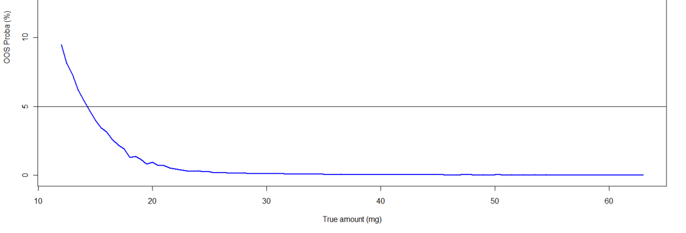

<!--
Rozet E, Lebrun P, Michiels J-F, Sondag P, Scherder T, Boulanger B.
Analytical Procedure Validation and the Quality by Design Paradigm.
Journal of Biopharmaceutical Statistics 2015;25(2):260-268.
doi:10.1080/10543406.2014.971176 の全訳密度日本語版。
-->

> **補足（本サイトでの位置づけ）:** 本論文は生薬そのものを扱う実験論文ではなく、**「分析法バリデーションはQuality by Design（QbD）の枠組みのどこに位置づけられるか」を整理した方法論・総説的な短編論文**である。著者グループ（Rozet・Lebrun・Boulanger ら、コンサルティング会社Arlenda S.A.）は、正確度プロファイル（accuracy profile）・β期待許容区間・OOS確率といった分析法バリデーション統計手法を提案してきた張本人たちであり、本論文はそれらの手法群を ICH Q8/Q9/Q10 の QbD 語彙（Analytical Target Profile・Critical Quality Attribute・Critical Process Parameter・Design Space・Control Strategy）に一対一で対応づける「翻訳表」のような役割を果たす。当サイトに既収載の [左側打ち切りガンマ分布の許容区間論文](tolerance-intervals-specification-limits-censored-gamma-mle-bayesian.html) が「規格限度（specification limit）をどう統計的に決めるか」を扱うのに対し、本論文は一段階手前の**「その分析法自体が信頼できると、どんな統計的裏付けをもって言えるのか」**を扱う。生薬・漢方のQC分析法（HPLC定量法など）を新規に立ち上げ、バリデーションを組む際の理論的な地図として読める。

---

## 書誌情報

- **標題（原題）:** Analytical Procedure Validation and the Quality by Design Paradigm
- **和題（本稿）:** 分析法バリデーションとQuality by Designパラダイム
- **著者・所属:** Eric Rozet¹（責任著者）, Pierre Lebrun¹, Jean-François Michiels¹, Perceval Sondag¹, Tara Scherder², Bruno Boulanger¹
  - ¹ Arlenda S.A., 1 avenue de l'hôpital, 4000 Liège, ベルギー
  - ² Arlenda Inc., 13 Ewing Drive, Flemington, New Jersey, 米国
  - 責任著者連絡先: Eric Rozet（eric.rozet@arlenda.com、Arlenda S.A., 1 avenue de l'hôpital, 4000 Liège, Belgium。電話 +32 4 366 4397、Fax +32 4 366 9683）
- **掲載誌・巻号・DOI:** Journal of Biopharmaceutical Statistics, 2015; 25(2): 260–268. DOI: 10.1080/10543406.2014.971176
- **インパクトファクター:** 要確認。Journal of Biopharmaceutical Statisticsの最新IFは出典（bioxbio・journalmetrics・SciMago等の二次集計サイト）によって0.8前後〜1.36と値に幅があり、Clarivate（JCR）公式の確定値をこの調査では一次情報源で確認できなかった。捏造を避けるため断定値は記載せず「要確認」とする。
- **受理経過 / ライセンス:** 入手した原稿ファイル名が「_V02」であることから、著者手元の改訂稿（著者最終稿に近いバージョン）とみられる。本文中に受理日・DOI登録日・ライセンス表記は含まれておらず、原文参照（正式な出版社版PDFでは記載されている可能性がある）。
- **キーワード:** Quality by Design（QbD）／許容区間（Tolerance Intervals）／方法バリデーション（Method Validation）／目的適合性（Fit for Purpose）

---

## 要旨（Abstract）

ICH Q8文書がQuality by Design（QbD）アプローチに従う医薬品プロセス開発を採用して以来、分析法の開発もこれに類似したアプローチに従う機会について多くの議論がなされてきた。QbDの原則に従った分析法の開発・最適化は広く議論・記述されてきた一方で、この枠組みにおける**分析法バリデーションの位置づけ**は明確にされてこなかった。本論文は、分析法バリデーションがQbDパラダイムに完全に統合されており、実際に目的に適合する（fit for purpose）分析法を開発するうえで不可欠な段階であることを示すことを目的とする。適切な統計的方法論――実験計画法（design of experiments）、統計モデリング、確率的言明――もまたその役割を担う。分析法バリデーションの成果物は、分析法の**Design Space**でもあり、そこから管理戦略（control strategy）を設定できる。

---

## 1. 序論（Introduction）

Quality by Design（QbD）の概念は、FDAの「21世紀に向けたcGMP」[1]やプロセス分析工学（Process Analytical Technology, PAT）[2]といった複数の施策、およびICH Q8[3]・Q9[4]・Q10[5]といった規制文書、FDAのプロセスバリデーションに関するガイダンス[6]を通じて医薬品産業に採り入れられてきた。その全体的な狙いは、これまで医薬品産業で実施されてきた**品質は試験で作り込む（quality by testing, QbT）**パラダイムから、プロセスと製品の理解を深め、それによって製品品質・プロセス効率・規制上の柔軟性を高めることを狙いとした開発へと転換することにある。

QbDは新しい概念ではなく、統計的実験計画法・多変量統計・統計的品質管理など、多くの品質・統計ツールや手法を含んでいる。医薬品の品質を高めるためには、最終製品の試験を増やすこと（すなわちQbT）は十分ではないことが認識されてきた[7]。その代わりに、医薬品製品の品質を高めるには、他の多くの産業ですでに実践されているように、**品質を製品に作り込む（QbD）**必要がある。それには、製剤化・製造プロセスに関わる変数が最終製品の品質にどのように影響するかを理解することが求められる。

分析法もまたプロセスであり、その開発にもQbDを適用すべきである。複数の著者が最近、Quality-by-Design（QbD）は体系的・科学的なアプローチで分析法を開発することを可能にすると述べている[8-12]。方法性能に影響する変数の理解・特定は、より早い段階で達成される[8-12]。ICH Q8(R2)[6]によれば、QbDは実験計画法（Design of Experiments, DoE）とDesign Space（DS）を組み合わせた最適化戦略とみなせる。

しかし、開発された分析法は、それが目的に本当に適合している（fit for purpose）ことを実証しない限り、実験室でそのまま使用できるわけではない。この目的適合性の実証は、一般に**分析法バリデーション**の段階で達成される。

本論文の目的は、分析法バリデーションがQbDパラダイムに完全に統合されており、日常的な適用に有用な分析法を開発するうえで不可欠な段階であることを示すことである。分析法バリデーションにおいても、実験計画法や統計モデリングを含む、類似の統計的方法論が実装されている。分析法バリデーションの成果物は、分析法のDesign Spaceでもあり、そこからさらに管理戦略を定義できる。

---

## 2. Analytical Target Profileと分析法バリデーション

Quality by Designに準拠した分析法の開発は、その**Analytical Target Profile（ATP、分析目標プロファイル）**の定義から始まる。ATPは、その分析法が意図する目的を定義することを狙いとする。ATPは、どの分析対象物質（analyte）を、どのマトリクス中で、どの濃度範囲にわたって測定するか、また、その方法に求められる性能基準とそれに対応する規格（specification）を定義する一連の特性をまとめたものである。これらの規格・特性は、分析法の意図する目的に紐づけられているべきである。関心のある読者向けのATPの例は、以下の参考文献に見出せる[8-11, 13]。ATPに含まれる定量的性能の要求事項は、そのままバリデーション段階で分析法が達成すべき**バリデーション許容限界**となる。加えて、複数の著者は、分析法が生成する結果を用いて誤った意思決定を行うことの**最大許容リスク**をATPの定義に含めることで、さらに踏み込んでいる[13]。

---

## 3. 分析法バリデーションにおけるCritical Quality Attribute

分析法の**Critical Quality Attribute（CQA、重要品質特性）**とは、開発された分析法の品質を判断するために測定される応答（response）のことである。CQAは、「望ましい製品品質を確保するために、適切な限界・範囲・分布の内側にあるべき、物理的・化学的・生物学的・微生物学的な特性」と定義される[3]。クロマトグラフィーによる分析法では、CQAは方法の選択性、すなわち分離度（resolution, RS）や分離（separation, S）の基準に関連づけられうる[12]。それ以外のCQAとして、分析にかかる実行時間、シグナル対ノイズ比、分析法の精度（precision）と真度（trueness）、定量下限（lower limit of quantification）や分析法の定量範囲（dosing range）が挙げられる。これらのCQAは、多変量の（非）線形モデルによって直接モデル化されることもある。しかし、他の状況では、モデル化される応答がCQAそのものとは異なる場合もある。この場合、CQAはこれら一次的な応答をモデル化した後に得られる。クロマトグラフィー法では、選択性を最適化する際の通常の主要CQAは臨界ペア（critical pair）の分離度であるが、分離度は関与する2つのクロマトグラフィーピークの保持係数（retention factor）に依存する。したがって、分離度の代わりに保持係数が直接モデル化される。分離度は、これらモデル化された応答から後で計算できる。

とはいえ、CQAは分離技術に限られるわけでも、分析法の定性的な性能だけに関連するわけでもない。医薬品製品の開発・管理における非常に重要な試験は、定量的な試験である。クロマトグラフィーによる定量法以外の例としては、ELISAのようなイムノアッセイ、q-PCR、相対力価（relative potency）アッセイなどがある。あらゆる定量的分析法の最終目標は、それを用いて信頼できる意思決定を行うために十分な品質の分析結果を提供することにある。したがって、定量的分析法にとってのCQAは、少なくともその定量的性能に関連するものであるべきである。分析法の**真度・精度・直線性・範囲・定量下限（LOQ）**、および分析法によって得られる結果の**正確度（accuracy）**というバリデーション特性が、鍵となるCQAである。これらは、それぞれの許容値とともに、ATPの定義に含められるべきである。

したがって、あらゆる定量的分析法のバリデーション段階は、QbDの枠組みに完全に沿ったものである。分析法バリデーションで監視されるべきCQAは、**偶然誤差（random error）**（例：室内再現精度のCV）、**系統誤差（systematic error）**（例：バイアスまたは回収率）、あるいはその両方を合わせた**総誤差（total error）**に関連する測定量である。

---

## 4. 分析法バリデーションにおけるCritical Process Parameters

分析法バリデーションはまた、いくつかの**Critical Process Parameters（CPP、重要工程パラメータ）**である因子を含む。第一の主要因子は、その方法が分析対象物質を定量することを意図する**濃度／量／力価の範囲**である。この因子は固定因子（fixed factor）であり、既知の濃度／量／力価をもつ、バリデーション標準品または品質管理試料（quality control samples）と呼ばれる試料によって表される。それとは対照的に、その方法の将来の日常的使用の間に遭遇するであろう変動の要因（sources of variability）――例えば操作者、装置、試薬ロット、日といったもの――は、変量因子（random factor）としてバリデーションのデザインに含めなければならない。これら変動要因の組み合わせは、一般に**ラン（runs）**または**シリーズ（series）**と呼ばれる。

---

## 5. 分析法バリデーションにおける実験計画法（Design of Experiments）

ICH Q8とFDAガイドラインは、医薬品プロセスを開発する際に適切な実験計画法を用いることを強く推奨している。分析法バリデーションで用いられる主なデザインは、**枝分かれ計画（nested designs）**または**（一部）要因計画（(fractional) factorial designs）**、あるいはその組み合わせである。これらのデザインは、分散成分（variance components）を推定するために用いられる。精密な推定を得るには、各因子について2水準を超える水準数を用いることが推奨される。とはいえ、分析法バリデーションに含まれる様々な変動要因は、一般に、分析法が実際に日常的にどのように用いられるかを模すために、「シリーズ」または「ラン」へとまとめられる。

バリデーション標準品の$i$番目の濃度水準について、ラン数が$J$であり、各ランで$K$回の反復測定が行われるとする。バリデーション実験は、各$i$番目の濃度水準について、ラン（またはシリーズ）を変量因子とする一元配置分散分析（one way Analysis Of Variance, ANOVA）変量モデルとして次のように記述できる:

$$
X_{jki} = \mu_i + \alpha_{j,i} + \varepsilon_{jki} \tag{1}
$$

ここで、$\alpha_{j,i} \sim N(0,\ \sigma^2_{\alpha,i})$、$\varepsilon_{jki} \sim N(0,\ \sigma^2_{\varepsilon,i})$ である。

$\mu_i$は検討対象の$i$番目の濃度水準のバリデーション標準品における全体平均、$\mu_i+\alpha_{j,i}$はラン$j$（$j$: 1から$J$）における平均、$\varepsilon_{jki}$は残差誤差、$\sigma^2_{\alpha,i}$はラン間分散（run-to-run variance）、$\sigma^2_{\varepsilon,i}$はラン内分散すなわち併行精度分散（within-run or repeatability variance）であり、いずれも$i$番目の濃度水準についてのものである。

分析法の全体的なばらつきは、**室内再現精度分散（intermediate precision variance）**

$$
\sigma^2_{PI,i} = \sigma^2_{\alpha,i} + \sigma^2_{\varepsilon,i}
$$

によって測定される。この分散成分モデルのすべてのパラメータは、REML法によって推定できる[14]。

---

## 6. Design Spaceと分析法バリデーション

ICHの製剤開発ガイドラインQ8[3]では、DSは「品質の保証を提供することが実証されている、入力変数（例：材料特性）と工程パラメータの多次元的な組み合わせと相互作用」と定義される。したがって、入力変数の多次元的な組み合わせと相互作用は、品質の保証が証明された部分空間、すなわちいわゆるDSに対応する。ICH Q8のDS定義の背後にある主要な概念は、**品質の保証（assurance of quality）**（品質リスクマネジメントとしても知られる）である。分析法開発の過程で得られる平均応答曲面は、CQAがその許容限界に到達するという保証がないため、DSを適切には定義しないことがすでに示されている。その代わりに、**確率マップ（probability maps）**がこのDSの要件に適切に応える[12, 15]。

分析法バリデーションもまた、DSを定義することを可能にする。それは、その方法が保証された品質の結果を提供することが実証された濃度範囲、すなわち

$$
\pi = P(-\lambda < X - \mu_T < \lambda) \tag{2}
$$

である。

バリデーション段階の目的は、将来の各分析結果があらかじめ定めた許容限界（$\lambda$）内に収まる**信頼確率$\pi$**が、最低限主張される水準$\pi_{min}$以上であるかどうかを評価することに要約できる[16]。ここでの統計的な問題は二重である。すなわち、確率$\pi$を推定しなければならないことと、それを$\pi_{min}$と比較する際にはその推定の不確実性を考慮に入れなければならないことである。これは頻度論統計において小標本での厳密解を持たないため、容易に解ける問題ではない。

とはいえ、この目的に応える複数のアプローチが提案されてきた。

### 6.1 β期待許容区間（β-expectation tolerance intervals）

第一のアプローチは、Eq.1に記述した一元配置ANOVA変量モデルを用いて、バリデーション標準品の各濃度水準において、定めたカバレッジ確率（例えば95%）の**β期待許容区間**を計算し、それをあらかじめ設定した許容限界と比較する方法である（Figure 1参照）。このアプローチを用いれば、将来の各結果はこれらの許容限界内に収まる確率が少なくとも95%となる。Lebrunら[17]は、β期待許容区間が**最高事後密度（Highest Posterior Density, HPD）区間**と等価であることを示している。少なからぬ数の分析法がこの方法でバリデートされてきた[16, 18-19]。Figure 1は、ある分析法のバリデーションで得られた**正確度プロファイル（accuracy profile）**を示しており、バリデーション標準品の各濃度水準における95%β期待許容区間を描いている。

Figure 1では、青破線で示す95%β期待許容区間は、4つの濃度水準（約12.5 mg・25 mg・50 mg・62.5 mg）のいずれにおいても、黒点線で示す±15%の許容限界の内側に完全に収まっている。区間の幅は中間の濃度水準（25 mg付近）で最も広くなり、最高濃度（62.5 mg付近）に近づくにつれて狭くなる。緑の点で示す個々の分析結果（相対誤差、%）は−7%から+5%程度の範囲に散らばっており、赤の実線で示す相対バイアスは0%付近で安定している。

### 6.2 Out Of Specification確率

もう一つのアプローチは、あらかじめ設定した許容限界の外側に将来の結果が得られる確率（**Out Of Specification, OOS**）を推定することである。Dewéら[20]は、Eq.1に記述した一元配置ANOVA変量モデルに従う結果について、この確率を計算することを提案した。同じ先の分析法について、その例をFigure 2に示す。DSは、この確率があらかじめ設定した最大値（例えば0.05）よりも小さい濃度範囲となる。各濃度水準$i$について、この確率は次のように計算される:

$$
\pi_{i} = P\big[X_i > \mu_{T,i} + \lambda\big] + P\big[X_i < \mu_{T,i} - \lambda\big] \tag{3}
$$

ここで、$X_i$は$i$番目の濃度水準について方法により得られた結果の平均濃度、$\hat\sigma_{PI,i}$は各$i$番目の濃度水準についての室内再現精度標準偏差である。各確率項は、Satterthwaite近似[21]に基づいて計算した自由度$f$を持つ**Student t分布**を用いて評価され、$X_i$を$\mu_{T,i}\pm\lambda$と比較する統計量の標準誤差は、ラン数$J$と各シリーズあたりの反復数$K$（総観測数$N=JK$）、および各濃度水準におけるラン間分散とラン内（併行精度）分散の比$\hat R_i$から構成される。Student t分布の使用が妥当であるのは、それがLebrunら[17]によって示されたとおり、このモデルにおける予測分布（predictive distribution）であるためである。

> 補足: Eq.3の右辺にある確率項それぞれの内部（$t(f)$の引数となる標準誤差の正確な代数的組み立て方）は、原稿がWordの数式エディタから抽出される過程で記号の上下・分数構造が崩れており、本文中の説明文（$N=JK$・$K$反復・$\hat R_i$＝ラン間分散とラン内分散の比・Satterthwaite近似による自由度$f$を用いるという記述）から確実に読み取れる範囲のみを訳出した。標準誤差の項の厳密なレイアウトは原文参照（原著PDFの数式画像を直接参照されたい）。

Figure 2では、横軸の濃度（Amount, mg）約12.5〜62 mgに対し、OOS確率（縦軸、%）は12.5 mg付近で約1.7%からスタートし、25 mg付近で約3.5%まで上昇したのち、50 mg以降はほぼ0%まで低下する。黒の点線で示す最大許容OOS確率5%を、検討した濃度範囲のいずれにおいても下回っており、この分析法のDSは検討した濃度範囲全体をカバーしていることが示されている。

### 6.3 濃度範囲全体にわたる連続モデリング：ベイズ的方法

もし、バリデーション標準品の濃度水準全体にわたって、ラン間分散と併行精度分散が均一（homogeneous）であると仮定できるならば、単一の線形混合モデルを、濃度を固定因子として含めてバリデーションデータに当てはめることができる。この場合、先の2つのDS定義アプローチはそのままこの状況に拡張できる。

より単純ではない状況として、ラン間分散および／または併行精度分散が不均一（heteroscedasticity）である場合に、濃度範囲全体にわたって分析法の結果をモデル化することが考えられる。このような場合のβ期待許容区間またはOOS確率の決定は、頻度論的な解が存在しないため、ベイズ的アプローチに基づくことができる[22]。

この文脈において、Eq.2のモデルは、ランダム傾き・ランダム切片を持ち、残差分散が濃度とともに増大する次の線形モデルとして書き直される:

$$
X_{ijk} = \beta_0 + \beta_1 \mu_{T,i} + u_{0,j} + u_{1,j}\mu_{T,i} + \varepsilon_{ijk} \tag{4}
$$

ここで、添字$i$はバリデーション標準品の$I$個の濃度水準、$j$は$J$個のシリーズまたはラン、$k$は各ランあたり$K$個の反復を表す。$\mu_{T,i}$は$i$番目の濃度水準のバリデーション標準品の濃度であり、基準値または慣用的な真値（reference or conventional true value）とみなされる。$\theta=(\beta_0,\ \beta_1)^{\top}$は固定効果である。加えて、$U_j=(u_{0,j},\ u_{1,j})^{\top}$は$j$番目のランのランダム効果であり、これも正規分布に従うと仮定される:

$$
U_j \sim N(0,\ \Sigma),\quad j=1,\dots,J\ \text{（独立に）} \tag{5}
$$

ここで$\Sigma$は、ランダム切片$u_{0,j}$とランダム傾き$u_{1,j}$の2×2分散共分散行列である。

最後に、$\varepsilon_{ijk}$は独立で正規分布に従うと仮定される残差誤差であり、その分散は$\sigma^2_i$である。この分散もまた、濃度水準$i$に依存すると想定される。この現象は、実際の場面で頻繁に観察される。この分散関数の一般形は、濃度のべき乗として与えられる:

$$
\sigma_i = \sigma\,(\mu_{T,i})^{\gamma} \tag{6}
$$

Figure 3は、このモデルを用い、MCMCシミュレーションによって推定した、ある分析法についての確率プロファイル（probability profile）を示す。これは、分析法がその目的に適合している濃度範囲を描いている。この範囲が、分析法バリデーションのDesign Spaceを表す。

Figure 3では、横軸の真の濃度（True amount, mg）約10〜63 mgに対し、OOS確率（縦軸、%）は低濃度側（12 mg付近）で約9.5%と高く、濃度の増加とともに急激に低下し、5%の水準線を14〜15 mg付近で下回った後、さらに緩やかに減少して30 mg以降はほぼ0%に漸近する曲線として描かれている。この曲線がOOS確率5%の水準線と交わる濃度が、当該分析法の**定量下限（LOQ）**として定義される。すなわち、ベイズ連続モデリングによって、離散的な濃度水準ごとの評価（Figure 1・2の方式）ではなく、濃度範囲全体にわたって連続的にDSの境界（この場合はLOQ）を定めることができる。

---

## 7. 管理戦略（Control Strategy）

分析法のQuality by Design開発は、その方法が日常的な適用の間、管理された状態を維持していることを確保し、逸脱を検出するための**管理戦略（control strategy）**を定義しなければ意味をなさない。分析法バリデーションはまた、品質管理試料を用いた管理戦略の定義も可能にする。実際、実施された実験は、例えば分析法の管理図（control chart）を構築する際の初期管理限界として用いることのできる**β期待許容区間**を定義することを可能にする[23]。管理外れの方法は、そうした管理図上で分析法の日々の性能を追跡することにより、効率的に検出し、是正措置を講じることができる。実際、β期待許容区間の使用は、消費者リスクと生産者リスクの間の適切なバランスを確保する[23]。

---

## 8. 結論（Conclusion）

分析法バリデーションは、Quality by Designパラダイムに完全に収まる。実際、医薬品開発と比較すると、分析法バリデーションは、FDAの最近のガイドライン[6]が定義するプロセスバリデーションの**第2段階（stage 2）**に位置づけることができる。分析法バリデーションは、すなわちアッセイの性能適格性評価（performance qualification）である。この文脈において、分析法バリデーションを、単なる「ICH Q2[24]チェックリスト」演習に限定された分析法開発上の追加負担とみなす見方は、姿を消すべきである。バリデーション段階とは、開発された分析法が将来の日常的な適用において有用であることの確認にほかならない。

---

## 参考文献

1. U.S. Food and Drug Administration (FDA), Department of Health and Human Services, Pharmaceutical Quality for the 21st Century — A Risk-Based Approach Progress Report, May 2007. http://www.fda.gov/AboutFDA/CentersOffices/CDER/ucm128080.html

2. United States Food and Drug Administration (FDA), Guidance for industry PAT — A framework for innovative pharmaceutical manufacturing and quality assurance, FDA, 2004.

3. International Conference on Harmonization (ICH) of Technical Requirements for Registration of Pharmaceuticals for Human Use, Topic Q8 (R2): Pharmaceutical Development, Geneva, 2009.

4. International Conference on Harmonization (ICH) of Technical Requirements for Registration of Pharmaceuticals for Human Use, Topic Q9: Quality Risk Management, Geneva, 2005.

5. International Conference on Harmonization (ICH) of Technical Requirements for Registration of Pharmaceuticals for Human Use, Topic Q10: Pharmaceutical Quality System, Geneva, 2008.

6. U.S. Food and Drug Administration (FDA), Department of Health and Human Services, Guidance for industry; Process validation: General Principles and Practices, January 2011.

7. R.A. Lionberger, S.L. Lee, L. Lee, A. Raw, L.X. Yu, The AAPS Journal 10 (2008) 268.

8. M. Schweitzer, M. Pohl, M. Hanna-Brown, P. Nethercote, P. Borman, G. Hansen, K. Smith, J. Larew, Pharm. Tech. 34 (2010) 52.

9. J. Ermer, European Pharmaceutical Review, 16 (2011), 16.

10. P. Nethercote, P. Borman, T. Bennett, G. Martin, P. McGregor, Pharm. Manufact. April (2010) 37.

11. P. Borman, J. Roberts, C. Jones, M. Hanna-Brown, R. Szucs, S. Bale, Separation Science 2 (2010) 1.

12. E. Rozet, P. Lebrun, B. Debrus, B. Boulanger, Ph. Hubert, Trac Trends In Analytical Chemistry 42 (2013) 157.

13. E. Rozet, E. Ziemons, R.D. Marini, B. Boulanger, Ph. Hubert, Anal. Chem. 84 (2012) 106.

14. Searle S.R., Casella G., McCulloch C.E., Variance Components, Wiley, 1992.

15. J.J. Peterson, K. Lief, Stat. Biopharm. Res. 2 (2010) 249.

16. Ph. Hubert, J.-J. Nguyen-huu, B. Boulanger, E. Chapuzet, P. Chiap, N. Cohen, P.-A. Compagnon, W. Dewé, M. Feinberg, M. Lallier, M. Laurentie, N. Mercier, G. Muzard, C. Nivet, L. Valat, J. Pharm. Biomed. Anal. 36 (2004) 579.

17. P. Lebrun, B. Boulanger, B. Debrus, Ph. Lambert, Ph. Hubert, J. Biopharm. Stat. 23 (2013) 1330.

18. Ph. Hubert, J.-J. Nguyen-Huu, B. Boulanger, E. Chapuzet, N. Cohen, P.-A. Compagnon, W. Dewé, M. Feinberg, M. Laurentie, N. Mercier, G. Muzard, L. Valat, E. Rozet, J. Pharm. Biomed. Anal. 45 (2007) 70.

19. Ph. Hubert, J.-J. Nguyen-Huu, B. Boulanger, E. Chapuzet, N. Cohen, P.-A. Compagnon, W. Dewé, M. Feinberg, M. Laurentie, N. Mercier, G. Muzard, L. Valat, E. Rozet, J. Pharm. Biomed. Anal. 45 (2007) 82.

20. W. Dewé, B. Govaerts, B. Boulanger, E. Rozet, P. Chiap, Ph. Hubert, Chemom. Intell. Lab. Syst. 85 (2007) 262.

21. F.E. Satterthwaite, Psychometrika 6 (1941) 309.

22. E. Rozet, B. Govaerts, P. Lebrun, K. Michail, E. Ziemons, R. Wintersteiger, S. Rudaz, B. Boulanger, Ph. Hubert, Anal. Chim. Acta 705 (2011) 193.

23. E. Rozet, C. Hubert, A. Ceccato, W. Dewé, E. Ziemons, F. Moonen, K. Michail, R. Wintersteiger, B. Streel, B. Boulanger, Ph. Hubert, J. Chromatogr. A 1158 (2007) 126.

24. International Conference on Harmonization (ICH) of Technical Requirements for Registration of Pharmaceuticals for Human Use, Topic Q2 (R1): Validation of Analytical Procedures: Text and Methodology, Geneva, 2005.

---

## 訳者補足

- **QbD用語と分析法バリデーション用語の対応表（本論文の骨子）:**

| ICH Q8のQbD概念 | 分析法バリデーションでの対応物 |
|---|---|
| Analytical Target Profile（ATP） | 分析対象物質・マトリクス・濃度範囲・性能基準（真度・精度・直線性・範囲・LOQ）とその許容限界の定義（2節） |
| Critical Quality Attribute（CQA） | 分離度・S/N比・実行時間・精度・真度・LOQ・定量範囲など、バリデーションで判定される応答（3節） |
| Critical Process Parameter（CPP） | 濃度／量／力価範囲（固定因子）、操作者・装置・試薬ロット・日といった変動要因（変量因子）（4節） |
| Design of Experiments（DoE） | 枝分かれ計画・（一部）要因計画によるラン／シリーズの設計、一元配置ANOVA変量モデル Eq.1（5節） |
| Design Space（DS） | 保証確率π（Eq.2）がπmin以上となる濃度範囲＝β期待許容区間・OOS確率・ベイズ連続モデリングのいずれかで定義（6節） |
| Control Strategy | β期待許容区間を初期管理限界とする分析法の管理図（コントロールチャート）（7節） |

- 本論文でいう「正確度プロファイル（accuracy profile）」「OOS確率」「β期待許容区間」は、著者グループ（Hubert・Boulanger・Rozetら、SFSTP＝フランス語圏製薬科学会の作業部会に連なる系譜）が2000年代から提案してきた、分析法バリデーションのための一連の統計手法である。当サイトに別途収載している[左側打ち切りガンマ分布の許容区間論文](tolerance-intervals-specification-limits-censored-gamma-mle-bayesian.html)における「許容区間（Tolerance Interval, TI）」は、本論文のβ期待許容区間と数学的に同じ枠組み（母集団の一定割合を一定の信頼度で含む区間）に属するが、後者の論文は「製造ロットの規格限度」を、本論文は「分析法そのものの信頼性」をそれぞれ対象にしている点が異なる。
- 本論文はEq.1〜6の統計モデル自体を新規に提案するものではなく、既発表の手法（特に参考文献[16]〜[23]に列挙されたHubert・Rozet・Lebrun・Dewéらの一連の論文）を、ICH Q8のQbD語彙に体系的に対応づけて再提示する「橋渡し」の位置づけの論文である。個々の統計手法の数理的な導出（例えばEq.3のt統計量の詳細な標準誤差の代数的展開）を深く追いたい場合は、原著が参照している[17]（Lebrun et al., J. Biopharm. Stat. 2013）や[20]（Dewé et al., Chemom. Intell. Lab. Syst. 2007）に当たる必要がある（本稿では原文のOCR抽出時に数式レイアウトが崩れていた箇所があり、上記6.2節の補足に記したとおり、無理な数式復元はせず文章での説明にとどめた）。
- 実務的示唆（訳者所見。原文に明示されない一般化）：生薬・漢方薬のHPLC定量法など、新規に分析法を立ち上げる際、本論文の枠組みは「バリデーションはICHQ2チェックリストの通過儀礼ではなく、その分析法が実際に使える濃度範囲＝Design Spaceを画定する統計的な作業である」という視点を与える。特に、複数濃度水準を離散的に評価する正確度プロファイル（6.1・6.2節）は比較的少ない統計知識で実装できる一方、濃度範囲全体で分散が不均一な場合のベイズ連続モデリング（6.3節）はより高度な統計的サポートを要する、という実務上のハードルの違いも読み取れる。
