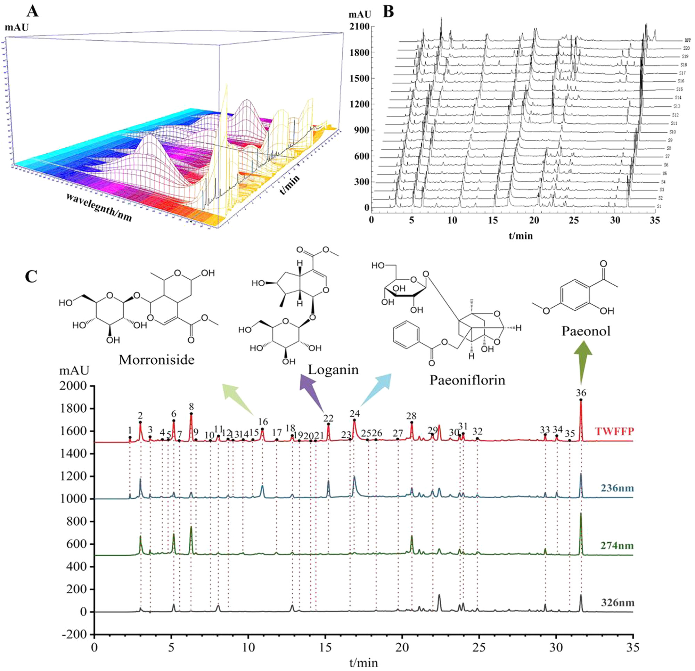
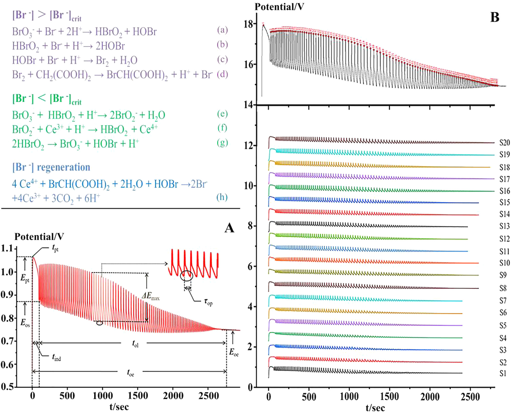

<!-- 方針: ほぼ全訳＋必要に応じた補足。原文構成に沿って訳出。「> 補足:」は訳者注。 -->

## 書誌情報

- 原題: High performance liquid chromatography three-wavelength fusion fingerprint combined with electrochemical fingerprint and antioxidant method to evaluate the quality consistency of Mingmu Dihuang Pill
- 著者: Xiang Li, Dandan Gong, Guoxiang Sun（瀋陽薬科大学薬学院）、Hong Zhang（瀋陽薬科大学生命科学・生物薬学院）、Wanyang Sun（暨南大学薬学院）, 中国
- 掲載: *Journal of Chromatography A* 1681 (2022) 463448. https://doi.org/10.1016/j.chroma.2022.463448
- インパクトファクター: **約3.8**（*Journal of Chromatography A*, JCR 2024 / Clarivate。報告により3.8〜4.2）
- 受理経過: 受領 2022-04-24 / 改訂 2022-08-13 / 採録 2022-08-22 / オンライン公開 2022-08-28

> 補足: MMDHP = 明目地黄丸（Mingmu Dihuang Pill）。TWFFP = 三波長融合指紋（Three-Wavelength Fusion Fingerprint）。ECFP = 電気化学指紋（Electrochemical Fingerprint）。SQFM = 系統定量指紋法（Systematically Quantified Fingerprint Method）。QAMS = 単一マーカーによる多成分同時定量法（Quantitative Analysis of Multi-components by Single Marker）。Q-marker = 品質マーカー。B-Z反応 = ベロウソフ・ジャボチンスキー(Belousov-Zhabotinsky)振動反応。MOR=モルロニシド、LOG=ロガニン、PAEF=パエオニフロリン、PAE=パエオノール。本論文は分析法開発（指紋分析・電気化学・抗酸化の統合評価）の研究論文。

## 要旨（Abstract）

本論文では、三波長融合指紋(TWFFP)を電気化学指紋(ECFP)・抗酸化法と組み合わせて、明目地黄丸(MMDHP)の品質一貫性を共同で探索した。TWFFPは複数波長における最大紫外吸収特性を十分に示し、単一波長評価がもたらす欠陥を補った。ECFPを確立してより深く特性パラメータを解析し、すべての試料が電気化学振動系に対して抑制効果を持つことを示した。2,2-ジアザ-ビス(3-エチルベンゾチアゾール-6-スルホン酸)（ABTS）抗酸化試験をECFPと組み合わせ、TWFFPのピーク面積を用いて指紋-薬効関係を確立した。その結果、36の共通ピークのうち15ピークが、両方の薬効関係に同時に重要な寄与をしていた。TWFFPとECFPは系統的に定量化された指紋法により評価され、HPLCと電気化学の試料識別能力を階層的クラスター分析(HCA)により考察した。含量百分率(Content percentage)を導入し、マーカー成分とマクロ定量類似度の関係を算出した。単一マーカーによる多成分定量分析(QAMS)法を検討し、マーカー成分を評価する精度を分析した。本研究は、複雑な中医薬(TCM)およびその複方製剤の品質一貫性管理のために、包括的で信頼性の高い方法を提供する。

© 2022 Elsevier B.V. All rights reserved.

## 1. 序論（Introduction）

中医薬(TCM)への国内外での関心と認識の高まりに伴い、臨床応用の過程で大きな発展の機会を得ている。TCMの安全性・有効性は品質・応用価値と直接関係するため、その品質一貫性管理は広く研究の注目を集めてきた。本論文では明目地黄丸(MMDHP)を例として、適切かつ効果的な評価方法を論じ、TCMの安全性・有効性確保のための参考と、さらなる検討を促すことを目指す。

高速液体クロマトグラフィー(HPLC)指紋技術、抗酸化技術、紫外(UV)・フーリエ変換赤外(FTIR)技術は、TCMの品質一貫性評価の分野で良好な応用展望を持つ。中でもHPLCは、TCMおよびその複方製剤の包括的な定性・定量分析に利用できる。通常、異なる種類の化合物は異なる波長で最大紫外吸収を示すため、単一波長では試料の品質を十分に分析できない可能性がある[1,2]。そこで本論文では三波長融合指紋(TWFFP)を導入し、3波長で最大の信号応答を示すピークを新しいクロマトグラムに統合した。異なる波長の情報を包括的に用いることで、試料をより十分に評価できる[3–5]。

HPLCの限界（実験コストが高い、前処理過程が複雑など）に対して、本論文はシンプルで経済的、普及させやすい電気化学指紋(ECFP)技術を導入した[6]。ECFPは全成分指紋という特徴を持ち、実験調製がシンプルで、試料は単に粉砕するだけ、あるいは全く処理せずに済む。TCMおよびその製剤の品質管理・評価に適した分析法である[7]。得られた結果はHPLCの評価結果と補完・比較され、MMDHPの品質一貫性を論じる。

MMDHPは地黄(rehmannia glutinosa)、山茱萸(cornus)、牡丹皮(peony bark)、白芍(white peony)、煅決明子(calcined cassia)など12種の生薬から構成される。肝腎を滋養し視力を改善する効能を持ち、臨床では肝腎陰虚・羞明(photophobia)・かすみ目の治療に用いられる[8]。このうち、モルロニシド(morroniside)とロガニン(loganin)は山茱萸の主要な薬理成分で、免疫調節・抗炎症・抗ショック作用を持つ。パエオノール(paeonol)は牡丹皮の活性成分の一つで清熱散瘀の効能を持ち、パエオニフロリン(paeoniflorin)は抗心筋虚血・血小板凝集抑制・鎮痛・鎮静などの効果を持つ[9–12]。中国薬局方およびこれら4化合物の性質を参考に、本研究ではこれらをMMDHPの定量分析における4つの品質マーカー(Q-marker)として用いた。

本論文では、抗酸化実験[13]、TWFFP、ECFPを組み合わせて、MMDHPの化学成分と生物活性を包括的に評価した。複雑なMMDHP系を、系統定量指紋法(SQFM)と単一マーカーによる多成分定量分析(QAMS)により解析した。MMDHPの定性・定量スコアは、マクロ定性類似度(**S**m)とマクロ定量類似度(**P**m)の両方を用いて算出した。主成分分析(PCA)と階層的クラスター分析(HCA)を用いて、HPLCとECFPがサンプルバッチ間の差異を識別する能力を検証した。結論として、MMDHPの品質一貫性は客観的に評価され、TCMおよびその複方製剤の全体的な品質を定量管理するための新たで実行可能な方法を提供した。

## 2. 材料と方法（Materials and methods）

### 2.1 試薬（Chemicals and reagents）

クロマトグラフィー用メタノール・アセトニトリルおよび分析用濃硫酸(98%)はいずれも山東裕王和天下有限公司から購入した。リン酸(クロマトグラフィー用)は四川成都科龍化学試薬工場、ヘプタンスルホン酸ナトリウムは山東中美色譜有限公司、硫酸セリウムアンモニウム四水和物は天津博迪化学有限公司から購入した。マロン酸・塩化カリウム・臭素酸カリウムはいずれも天津大茂化学試薬工場製である。実験全体を通して脱イオン水を使用し、すべての試薬・化学物質は分析用グレードであった。

モルロニシド(MOR、バッチNo. 25406-64-8、純度 > 98.0%)は成都アルファ・バイオテクノロジー社(四川省)、ロガニン(LOG、バッチNo. 111640-200503、純度 > 98.0%)とパエオノール(PAE、バッチNo. 110708-200506、純度 > 99.8%)は中国食品薬品検定研究院(北京)、パエオニフロリン(PAEF、バッチNo. 23180-57-6、純度 > 98.0%)は成都百芙芮天然物有限公司から入手した。4種のQ-marker化合物の構造は図2(C)に示す。

20バッチのMMDHP試料(S1–S20、濃縮丸)を薬局から収集した（S1–S7はメーカーA、S8–S10はメーカーB、S11–S13はメーカーC、S14・S15はメーカーD、S16・S17・S19・S20はメーカーE、S18はメーカーF）。

### 2.2 装置と条件（Apparatus and conditions）

#### 2.2.1 HPLC分析

HPLC実験はAgilent 1100 HPLCシリーズ機器(Agilent Technologies社、米国)で実施した。オンライン脱気装置・低圧混合四元ポンプ・オートサンプラー・カラムオーブン・ダイオードアレイ検出器(DAD)を含む機器一式を使用。データ取得・解析はOpenLAB CDS ChemStation(バージョンC.01.07、Agilent Technologies社)で行った。

- カラム: cosmsil C-18（250 mm × 4.6 mm, 5 μm）、カラム温度 35 ℃
- 移動相: A(水相)=5 mmol/Lヘプタンスルホン酸ナトリウム + 0.2%(v/v)リン酸水溶液、B(有機相)=アセトニトリル-メタノール(9:1, v/v)
- 注入量 10 μL、流速 1.0 mL/min
- グラジエント: 94–88%A (0–8 min)／88–79%A (8–15 min)／79–72%A (15–22 min)／72–60%A (22–26 min)／60–50%A (26–30 min)／50–38%A (30–40 min)／38–94%A (40–45 min)
- クロマトグラムは **220 nm、236 nm、274 nm、280 nm、326 nm** で抽出・処理

#### 2.2.2 電気化学振動分析

電気化学実験に使用した機器は、CHI760D電気化学ワークステーション(上海華辰儀器有限公司)、DF-101S集熱式恒温加熱磁力撹拌器(上海力辰邦西儀器科技有限公司)。作用電極は白金電極(CHI 115、上海華辰儀器有限公司)、参照電極は飽和複塩橋カロメル電極(雷磁217、上海儀電科学儀器有限公司)を用いた。

測定方法は以下の通り。MMDHPの均一微粉末0.15 gをセラミック反応装置に入れ、H₂SO₄溶液(3.0 mol/L) 12 mL、CH₂(COOH)₂溶液(0.4 mol/L、0.2 mol/L H₂SO₄溶液で調製) 6 mL、(NH₄)₄Ce(SO₄)₄溶液(0.02 mol/L、0.2 mol/L H₂SO₄溶液で調製) 3 mLを加えた。次に電極を反応混合溶液に入れ、恒温水浴装置(35 ℃)中で400 r/minの速度で3分間撹拌した後、KBrO₃溶液(0.3 mol/L) 3 mLを注入した。上記4種の溶液がブランクのB-Z振動系であり、電位の振動が消失するまで試料の電位-時間(E-t)曲線を収集した。

### 2.3 試料・標準溶液の調製

MMDHPの丸剤8個を秤取し、均一な小片に粉砕した。これらの小片を25 mLメスフラスコに入れ、80%メタノールで35 ℃・超音波浴20分間抽出し、有機系フィルターを通してHPLC分析に供した。MMDHP試料8個をすり鉢で均一な微粉末になるまで完全にすりつぶし、0.15 gを秤取して電気化学分析に用いた。

MMDHPの4種のQ-markerを精密に秤取し、メタノールに溶解して原液を得た。最終的に原液を混合・希釈して一連の濃度系列とし、検量線を作成した。

### 2.4 理論（Theory）

#### 2.4.1 系統定量指紋法（SQFM）[14,15]

SQFMはTCM指紋の全体的な定性・定量理論を代表する手法である。指紋試験では、試料指紋ベクトル(SFV)を X = (x₁, x₂…xₙ)、参照指紋ベクトル(RFV)を Y = (y₁, y₂…yₙ) とし、xᵢ・yᵢはそれぞれの指紋ピーク面積である。XとYのなす角の余弦値を計算したものが定性類似度 **S**F であり、これは試料と標準指紋との化学組成の含量分布比における類似性を明確に反映できる。ただし、大きなピークが小さなピークを覆い隠す問題がある。RFV Yを P0=(1,1…1)とし、SFV XをP0=(x₁/y₁, x₂/y₂…xₙ/yₙ) とすると、その挟角の余弦値は比率定性類似度 **S**F′ となり、これはすべての指紋ピークに等しい重みを与えるが、大きなピークの変化に対して感度が低い。まとめると、二重定性類似度(**S**FとS**F′**)の平均を マクロ定性類似度 **S**m と呼ぶ。

**C** は投影含量の類似度であり、XのY上への投影で、**S**Fと似た特性を持ち、すなわち小さいピークが大きいピークに覆われ、情報の欠落につながりやすい。異なる指紋ピーク面積には相互補償効果があり、類似度 **S**F を補正して定量類似度 **P** を得る必要がある。**P** はすべてのピーク積分値を等しく扱い、小さいピークに対応する化学成分の含量変化を正確に反映できる。まとめると、二重定量類似度(**C**と**P**)の平均を マクロ定量類似度 **P**m と呼ぶ。

SQFMは主に**S**mと**P**mから構成され、試料は上記パラメータの値に応じて8つの品質グレード(G1–G8、表1)に分けられ、その後TCMの品質の定性・定量評価が実現される。

上記パラメータの数式は以下の通りである。

- **S**F = cosθ = Σ(xᵢyᵢ) / √(Σxᵢ²・Σyᵢ²) …(1)
- **S**F′ = [Σ(xᵢ/yᵢ)/n] / √[Σ(xᵢ/yᵢ)²/n] …(2)（原文の式表記が数式画像的でやや崩れているため、原文の意図を汲んだ簡略表記。詳細は原文の数式参照）
- **S**m = (**S**F + **S**F′) / 2 …(3)
- **C** = [Σ(xᵢyᵢ) / Σyᵢ²] × 100% …(4)
- **P** = [Σxᵢ / (Σyᵢ・**S**F)] × 100% …(5)
- **P**m = (**C** + **P**) / 2 …(6)

> 補足: 原文の式(1)(2)(5)は原文PDFの数式レイアウトが崩れて抽出されており、分子・分母の対応が完全には明瞭でない箇所がある。上記は文脈および同一著者グループの関連論文（SQFM法）の記述パターンから読み取れる範囲での再構成であり、正確な数式は原文の図表参照を推奨する。

#### 2.4.2 単一マーカーによる多成分定量分析（QAMS）

TCMの組成は複雑であり、一部の標準物質は高価または希少であるため、一部成分の定量管理が困難である。本論文ではこの問題に対し、QAMSを適用して4種のQ-markerの含量を決定した。1つの成分(内部標準、安価または入手しやすいもの)を測定することで、複数成分の同時定量が可能になる[16]。検出器のフローセルが変化しない条件下、一定の線形範囲内では、主指標成分の含量間に一定の関数関係が存在する。したがってQAMS法は補正係数を用いて化合物の濃度を計算し、含量を得ることが保証される[17–19]。関連する計算式は以下の通り。

- **f**si = fs/fi = (As/Cs) / (Ai/Ci) …(7)
- **C**i = **f**si・Cs・(Ai/Ci) …(8)（原文の式(8)の項配置もレイアウト起因でやや崩れているため、式(7)の定義と整合する形で表記）

**f**si: 補正係数、**A**s: 内部標準対照(または供試品)のピーク面積、**C**s: 内部標準対照(または供試品)の濃度、**A**i: 成分対照(または供試品)のピーク面積、**C**i: 成分対照(または供試品)の濃度

#### 2.4.3 B-Z振動系のメカニズム

本論文で検討した電気化学反応はB-Z振動反応系であり、酸化還元反応である。反応機構は、H₂SO₄溶液中でCe⁴⁺が触媒として働き、BrO₃⁻を介してCH₂(COOH)₂を酸化するというものである[20]。反応式は図1に示されている。

反応過程全体はBr⁻を中心に展開すると考えられる。反応中、Br⁻には臨界濃度([Br⁻]crit)があり、系内のBr⁻濃度が[Br⁻]critより高い場合は式(a)–(d)に示す反応が起こり、逆にBr⁻が[Br⁻]critより低い場合は式(e)–(g)に示す反応が起こる。この過程でBr⁻の再生が誘発される（式h）。上記3つの過程が繰り返されることが、B-Z振動反応が発生していることを示す。

まとめると、B-Z反応は非平衡の閉鎖系である。散逸性物質としてのCH₂(COOH)₂は式(d)で示される反応を遅くする。適時に補充されない場合、系の反応速度を直接的または間接的に増加させ、最終的に反応は平衡に達する。生薬を添加した後、試料中の還元成分がBrO₃⁻と反応し、系の正常な動作を妨げ、巨視的には振動を抑制する現象を示す。活性成分含量が異なる試料は、異なる抑制度をもたらし、その結果異なる電気化学指紋を示す。

> 補足: 反応式(a)–(h)は図1に化学反応式として掲載されており、本文中では文章として説明されるのみで式そのものはテキスト抽出できなかった（図1参照）。

#### 2.4.4 4種のQ-markerの含量百分率（Pi%）

本論文では、各試料における4種Q-markerの含量とその合計の**P**i%を計算した。計算式は以下の通り。

- **P**i% = mi / mRFPi …(9)
- **P**i%(SUM) = mi(SUM) / mRFPi(SUM) …(10)

**m**i: 各試料における各マーカーの含量、**m**RFPi: 生成した参照指紋(RFP)における各マーカーの含量、**m**i(SUM): 各試料における4マーカーの合計含量、**m**RFPi(SUM): 生成したRFPにおける4マーカーの合計含量

### 2.5 データ解析

クロマトグラフィー指紋の評価は、実験室が開発したソフトウェア「TCM spectral quantum fingerprint consistency digital evaluation system 4.0（TCMスペクトル量子指紋一貫性デジタル評価システム 4.0）」で行った。データ解析にはOrigin 95、SIMCA 14.1、IBM SPSS Statisticsソフトウェアを使用した。

## 3. 結果と考察（Results and discussion）

### 3.1 方法バリデーション

確立したHPLC指紋の適用性を確保するため、精度(precision)と再現性(repeatability)をそれぞれ検討した。精度は同一試料溶液を連続6回分析して算出した。再現性は同一実験条件で調製した6つの並行試料溶液を注入して検証した。

LOGピークを参照ピークとし、23の共通ピークの相対保持時間(RRT)と相対ピーク面積(RPA)の相対標準偏差(RSD)を計算して精度・再現性を評価した。4種Q-markerについて、精度・再現性のRSD値はRRTで1.46%未満、RPAで3.06%未満であった。標準添加法により回収率を測定して方法の正確性を評価した結果、4種Q-markerの平均回収率は94.0〜104.0%、RSD 1.0%未満であった。ピーク面積を従属変数(Y軸)、溶液濃度を独立変数(X軸)として、4種Q-markerの検量線を作成した。検量線を用いて4種の検出限界(LOD)と定量限界(LOQ)をそれぞれ推定した。4種Q-markerの直線性の結果、LOD、LOQを表2に示す。目的濃度範囲内でピーク面積は成分濃度と良好な線形関係を示し、相関係数 r ≥ 0.999であった。結論として、確立したHPLC指紋は4種のQ-marker含量を正確に測定でき、方法は正確かつ信頼性が高い。

ECFPについては、2.2.2節に記載の方法で試料(S8)を6回測定して再現性を検証した。いくつかの特徴パラメータのRSDを計算した結果(図1(A))、誘導時間(**t**ind)、振動終了時間(**t**oe)、振動寿命(**t**ol)、ピーク頂点電位(**E**pt)、振動開始電位(**E**os)、振動終了電位(**E**oe)、振動周期(**τ**op)、最大振幅(**E**max)のRSDはそれぞれ6.78%、4.50%、4.53%、0.68%、1.53%、0.33%、3.82%、3.69%であった。平均RSDは3.23%であり、方法の再現性が良好であることを示した。全体として、本論文で確立したECFPは正確かつ信頼性が高く、20試料の指紋分析に使用できるものであった。

**表2. 4種Q-marker(MOR・LOG・PAEF・PAE)の回帰式・直線性・LOD・LOQ**

| 化合物 | 回帰式 | r | 直線性範囲 (μg/mL) | LOD (ng) | LOQ (ng) |
|---|---|---|---|---|---|
| MOR（モルロニシド） | y = 16608x + 15.458 | 0.9998 | 4.1–248 | 3.07 | 9.31 |
| LOG（ロガニン） | y = 15475x − 27.968 | 0.9992 | 2.5–150.6 | 4.50 | 13.64 |
| PAEF（パエオニフロリン） | y = 13281x − 17.924 | 0.9998 | 6.5–390 | 5.66 | 17.16 |
| PAE（パエオノール） | y = 26520x − 3.1866 | 1.0000 | 2.7–160 | 0.45 | 1.35 |

### 3.2 HPLC指紋分析

#### 3.2.1 三波長融合指紋分析

図2(A)に示す3Dスペクトログラムから得られたMMDHP中の対象分析物の吸収極大に基づき、より多くの成分情報を得るため236・274・326 nmをモニタリング波長として選定した。図2(C)から、各波長で異なる吸収シグナルが示されることがわかり、表1でも異なる波長における試料グレードに明確な差異が示された。これは、単一波長で表現される情報が限られており、すべての化学情報を包括するフィンガープリントを一般化できないことを示している。本研究ではTWFFPを用いて単一波長指紋の欠点を克服し、「TCMスペクトル量子指紋一貫性デジタル評価システム4.0」を用いて236・274・326 nmの3検出波長における最大スペクトルを構築した。各波長で最大応答を示すピークをTWFFPの新規ピークとして選定し、より包括的で豊富な試料情報を得た。過去の経験に基づき、融合時間窓を0.1 minとして試料(S1)を代表する新規クロマトグラムを得た。20のMMDHP試料は3波長で236 nmに23、274 nmに26、326 nmに22のピークを含み、TWFFPは36ピークを含んでいた（図2(B)）。単一波長クロマトグラフィーと比較して、新たに生成されたTWFFPは不純物ピークの影響を低減しつつ、有効なピーク情報を十分に保持できた。

#### 3.2.2 主成分分析（PCA）

TWFFPの品質識別能力を検討するため、PCA法を選び、多変量データ系のデータ次元を削減することで試料と指紋ピークの相関を確立した[3,21]。20試料の36の共通ピーク面積をOriginソフトウェアに取り込み、得られた第1〜第4主成分がデータ分散の80.55%を説明した。PC1とPC2をそれぞれ横軸・縦軸として、20観測値・36変数を含む2次元行列を構築した（図3(A)）。これはカラフルなスコアプロットと青色のローディングプロットからなる。カラフルなスコアプロットから、本法は異なるメーカーの試料を明確に識別でき、同一メーカーの試料は良好な一貫性を示した。同一メーカーのS1–S7は1つのクラスターにまとまり、PC1とは負の相関、PC2とは正の相関を示した。同一メーカーのS8–S10、S14・S15はいずれもPC1・PC2と負の相関を示した。S11–S13とS16–S20はPC1と正の相関を示し、同時にS11–S13とS16はPC2と負の相関、S17–S20はPC2と正の相関を示した。青色のローディングプロットは、元の指紋ピークが複合変数に与える寄与を直感的に理解する助けとなり、異なる化合物が全体に与える異なる影響力を定性的に分析し、試料間の類似性・相違性を識別する鍵となる変数を特定できる。図3(C)によれば、定量的な観点から、異なる指紋ピークが表す物質はその含量差により異なる寄与値を持ち、これにより試料が異なる分類傾向を示す。以上より、確立したPCAモデルは試料中の物質含量の差異に基づき20試料を識別できることがわかる。

#### 3.2.3 系統定量指紋法によるTWFFP評価

20バッチの試料のTWFFPを評価ソフトウェア「TCMスペクトル量子指紋一貫性デジタル評価システム4.0」に取り込み、平均法によりすべての試料の参照指紋(RFP)を生成した。これにより試料ピーク面積と含量の関係をさらに検証し、試料の定性・定量類似度を解析した。

RFPを標準として**S**mと**P**mの値を算出し、結果を表1に示した。表1から、すべての試料の**S**m値は0.899–0.992の範囲にあり、すべての試料が類似した化学組成を含むことを示している。**P**m値は64.3%–136.7%と大きな差があり、試料間で化学成分の含量が大きく異なることを示している。図3(B)から、異なるメーカーの試料のグレードは5段階(1から5)に分けられると解析された。同時に、S1–S7のような同一メーカーの試料でも、**P**mの変化によりグレードにわずかな変動があった。全試料を通して、**S**mは緩やかに変動する一方、**P**mは大きく変動し、これが異なる試料のグレードに影響を与えた。明らかに、**P**mはすべての試料のグレード評価に対する寄与が大きく、試料の識別に責任を持つのは定量組成であり、定性組成ではない。

さらに、4マーカーの含量測定結果とSQFMで得られた**P**m値との関係を検討した。**P**i%と**P**mの相関は図3(D)に示され、MOR・LOG・PAEF・PAEおよびそれらの合計の相関係数はそれぞれ0.7310、0.6871、0.9702、0.6223、0.9392であった。**P**i%と**P**mの間には一定の相関があることがわかる。加えて、PAEFと4Q-marker合計の**P**i%は比較的高かった。したがって、SQFMは試料の含量を正確に解析できると結論づけられる。

**表1. SQFMによるTCM品質グレード分類と、236 nm・274 nm・326 nm・TWFFP・ECFP・IC50値に基づく20バッチMMDHPの評価結果**

品質グレード基準:

| グレード | G1 | G2 | G3 | G4 | G5 | G6 | G7 | G8 |
|---|---|---|---|---|---|---|---|---|
| **S**m ≥ | 0.95 | 0.90 | 0.85 | 0.80 | 0.70 | 0.60 | 0.50 | < 0.50 |
| **P**m /% | 95–105 | 90–110 | 85–115 | 80–120 | 70–130 | 60–140 | 50–150 | 0〜∞ |

20バッチの評価結果:

| Sample | 236nm Sm | 236nm Pm% | 236nm Grade | 274nm Sm | 274nm Pm% | 274nm Grade | 326nm Sm | 326nm Pm% | 326nm Grade | TWFFP Sm | TWFFP Pm% | TWFFP Grade | ECFP Sm | ECFP Pm% | IC50 |
|---|---|---|---|---|---|---|---|---|---|---|---|---|---|---|---|
| 1 | 0.983 | 96.8 | 1 | 0.967 | 105.6 | 2 | 0.924 | 129.3 | 4 | 0.971 | 103.6 | 1 | 0.985 | 88.8 | 0.0679 |
| 2 | 0.984 | 88.7 | 2 | 0.985 | 82.3 | 3 | 0.953 | 92.7 | 2 | 0.985 | 87.1 | 2 | 0.964 | 68.9 | 0.1022 |
| 3 | 0.986 | 92.3 | 2 | 0.992 | 92.0 | 1 | 0.974 | 102.2 | 1 | 0.992 | 93.6 | 2 | 0.949 | 74.3 | 0.1101 |
| 4 | 0.984 | 89.0 | 2 | 0.995 | 83.2 | 3 | 0.960 | 95.0 | 1 | 0.992 | 87.5 | 2 | 0.959 | 51.1 | 0.1050 |
| 5 | 0.978 | 89.2 | 2 | 0.969 | 76.6 | 4 | 0.885 | 89.9 | 3 | 0.970 | 86.7 | 2 | 0.983 | 102.4 | 0.1001 |
| 6 | 0.991 | 95.6 | 1 | 0.991 | 95.2 | 1 | 0.955 | 105.4 | 2 | 0.989 | 96.8 | 1 | 0.962 | 75.9 | 0.0876 |
| 7 | 0.973 | 79.9 | 3 | 0.961 | 92.5 | 2 | 0.953 | 116.7 | 3 | 0.960 | 87.7 | 2 | 0.994 | 93.3 | 0.0876 |
| 8 | 0.948 | 72.8 | 4 | 0.884 | 90.1 | 3 | 0.799 | 73.7 | 5 | 0.899 | 79.5 | 4 | 0.997 | 117.0 | 0.1281 |
| 9 | 0.933 | 61.4 | 5 | 0.901 | 74.2 | 4 | 0.725 | 67.4 | 6 | 0.926 | 64.3 | 5 | 0.995 | 120.9 | 0.1811 |
| 10 | 0.945 | 62.2 | 5 | 0.918 | 75.4 | 4 | 0.823 | 59.9 | 7 | 0.922 | 66.6 | 5 | 0.995 | 108.7 | 0.1562 |
| 11 | 0.954 | 142.4 | 6 | 0.944 | 135.5 | 5 | 0.845 | 87.2 | 4 | 0.964 | 136.7 | 4 | 0.997 | 106.9 | 0.0884 |
| 12 | 0.960 | 132.0 | 5 | 0.941 | 130.6 | 5 | 0.867 | 77.0 | 5 | 0.959 | 129.0 | 4 | 0.991 | 92.3 | 0.0586 |
| 13 | 0.974 | 122.0 | 4 | 0.967 | 111.6 | 2 | 0.906 | 70.3 | 5 | 0.977 | 116.5 | 3 | 0.994 | 87.4 | 0.0713 |
| 14 | 0.944 | 77.8 | 4 | 0.950 | 81.8 | 3 | 0.934 | 95.4 | 2 | 0.944 | 78.4 | 4 | 0.995 | 109.9 | 0.1361 |
| 15 | 0.952 | 72.4 | 4 | 0.935 | 66.9 | 5 | 0.939 | 80.8 | 3 | 0.948 | 68.6 | 4 | 0.996 | 109.3 | 0.1391 |
| 16 | 0.980 | 115.3 | 3 | 0.985 | 113.6 | 2 | 0.928 | 143.2 | 7 | 0.990 | 114.1 | 2 | 0.997 | 122.7 | 0.1070 |
| 17 | 0.975 | 118.9 | 3 | 0.989 | 126.7 | 4 | 0.978 | 98.5 | 1 | 0.989 | 122.0 | 3 | 0.996 | 114.2 | 0.0914 |
| 18 | 0.975 | 130.2 | 5 | 0.949 | 111.9 | 3 | 0.772 | 145.0 | 7 | 0.958 | 116.7 | 3 | 0.998 | 107.6 | 0.0792 |
| 19 | 0.969 | 123.5 | 4 | 0.949 | 103.9 | 2 | 0.969 | 106.3 | 2 | 0.951 | 114.1 | 2 | 0.997 | 121.9 | 0.1290 |
| 20 | 0.950 | 118.4 | 3 | 0.945 | 107.4 | 2 | 0.929 | 66.9 | 6 | 0.964 | 115.3 | 2 | 0.994 | 122.0 | 0.1039 |

> 補足: 「Grade」はSQFM(上記グレード基準表)に基づく品質グレード(G1〜G8のうち該当する数字)。ECFP列にはGradeが示されていない（原文Table 1の構成に準拠）。IC50は抗酸化(ABTS)試験の値（原文Table 1では単位表記が確認できず、原文参照）。

#### 3.2.4 TWFFPの階層的クラスター分析（HCA）[22]

**S**mと**P**mをSIMCAソフトウェアに取り込み、HCA法を用いてSQFM法が異なる試料の一貫性・差異を明確に識別できるかを検討した。図4(A)に示すように、本法は試料を大まかに5つのカテゴリーに分けた。S8–S10・S14・S15は1つのカテゴリーに、S1–S7は1つのカテゴリーに、S19は単独で1つのカテゴリーに、4番目のカテゴリーにはS11–S13、5番目のカテゴリーにはS16–S18・S20が含まれた。これら5つの分類結果は各バッチのメーカーと良好に一致しており、SQFM法が試料の一貫性・差異の解析に信頼できることを示している。同時に、HCAによる試料のクラスタリングは、PCAモデルにおける試料間の相関結果と一致しており、両手法が試料の性質と含量の相関を正確に記述できることを示している。まとめると、SQFMは各成分に起因する潜在的な差異と試料全体の品質一貫性を解析でき、TCMおよびその複方製剤の全体的な品質を管理するための包括的、簡便、信頼性の高い方法として使用できる。

### 3.3 QAMSによる4種Q-marker含量の評価

本実験では4種のQ-markerを検討して試料を定量し、QAMSが検量線法(CCM)に代わってMMDHPの含量を測定できるかどうかを検証することを計画した。まず、CCM法を用い、表2に示す回帰式によりMOR・LOG・PAEF・PAEの含量を計算した。次に、2.4.2節で述べたQAMSの計算方法に従い、PAEFを内部標準(良好なピーク形状・高い信号強度・他ピークとの高い分離度)として用いて、他の3マーカーの含量を計算した。両手法で得られたマーカーの含量結果を比較し、QAMS法の信頼性を検証した。

CCMとQAMSで得られた含量の比率(**r**C/Q)を算出し、表3に示した。**r**C/Qが1に近いほど、両手法の含量結果が類似していることを示す。同時に、**t**検定を用いて統計解析を行い、両分析法で得られた含量値をSPSSソフトウェアに取り込んだ。その結果、他の3マーカーの**P**値はそれぞれ0.920、0.875、0.980であり、いずれも0.05より大きく、有意差はなかった。以上の結果はすべて、両手法間に有意差がないことを示している。したがって、QAMSはMMDHP中の4マーカーの含量を同時かつ正確に測定できると言える。

**表3. CCM法とQAMS法によりそれぞれ算出した4種Q-markerの含量、およびCCM/QAMS含量比(rC/Q)**

| Sample | CCM MOR (mg/g) | CCM LOG (mg/g) | CCM PAEF (mg/g) | CCM PAE (mg/g) | QAMS MOR (mg/g) | QAMS LOG (mg/g) | QAMS PAEF (mg/g) | QAMS PAE (mg/g) | rC/Q MOR | rC/Q LOG | rC/Q PAE |
|---|---|---|---|---|---|---|---|---|---|---|---|
| S1 | 1.0461 | 1.1199 | 3.0369 | 0.9359 | 1.0400 | 1.1517 | 3.0369 | 0.9439 | 1.0059 | 0.9724 | 0.9915 |
| S2 | 1.1017 | 1.2471 | 2.8433 | 0.5970 | 1.0951 | 1.2868 | 2.8433 | 0.6017 | 1.0060 | 0.9691 | 0.9922 |
| S3 | 1.1341 | 1.3052 | 2.9445 | 0.7892 | 1.1265 | 1.3479 | 2.9445 | 0.7959 | 1.0067 | 0.9683 | 0.9916 |
| S4 | 1.1179 | 1.2624 | 2.8627 | 0.7506 | 1.1107 | 1.3031 | 2.8627 | 0.7569 | 1.0065 | 0.9688 | 0.9917 |
| S5 | 1.1687 | 1.2035 | 3.0992 | 0.4895 | 1.1598 | 1.2400 | 3.0992 | 0.4926 | 1.0077 | 0.9706 | 0.9937 |
| S6 | 1.0641 | 1.1785 | 2.9565 | 0.9718 | 1.0580 | 1.2138 | 2.9565 | 0.9805 | 1.0058 | 0.9709 | 0.9911 |
| S7 | 0.7403 | 0.8234 | 2.3889 | 0.8829 | 0.7422 | 0.8398 | 2.3889 | 0.8923 | 0.9974 | 0.9805 | 0.9895 |
| S8 | 0.7477 | 0.8964 | 2.2627 | 0.6660 | 0.7501 | 0.9174 | 2.2627 | 0.6729 | 0.9968 | 0.9771 | 0.9897 |
| S9 | 0.8239 | 0.7421 | 1.7942 | 0.6522 | 0.8278 | 0.7553 | 1.7942 | 0.6609 | 0.9953 | 0.9825 | 0.9868 |
| S10 | 0.5580 | 0.7496 | 1.8889 | 0.6229 | 0.5651 | 0.7631 | 1.8889 | 0.6306 | 0.9874 | 0.9823 | 0.9878 |
| S11 | 1.7502 | 1.9147 | 5.1323 | 1.8196 | 1.7274 | 1.9828 | 5.1323 | 1.8323 | 1.0132 | 0.9657 | 0.9931 |
| S12 | 1.5131 | 1.7720 | 5.5171 | 1.6476 | 1.4972 | 1.8293 | 5.5171 | 1.6587 | 1.0106 | 0.9687 | 0.9933 |
| S13 | 1.3284 | 1.6438 | 4.8681 | 1.0983 | 1.3165 | 1.6964 | 4.8681 | 1.1055 | 1.0090 | 0.9690 | 0.9935 |
| S14 | 1.4686 | 1.3228 | 2.2546 | 1.3078 | 1.4641 | 1.3660 | 2.2546 | 1.3258 | 1.0031 | 0.9684 | 0.9864 |
| S15 | 1.5077 | 1.2389 | 2.3546 | 1.1677 | 1.5021 | 1.2759 | 2.3546 | 1.1829 | 1.0037 | 0.9710 | 0.9872 |
| S16 | 1.4673 | 1.1057 | 4.1386 | 1.1645 | 1.4506 | 1.1333 | 4.1386 | 1.1728 | 1.0115 | 0.9756 | 0.9929 |
| S17 | 1.4166 | 0.8977 | 4.1605 | 1.0816 | 1.4012 | 0.9135 | 4.1605 | 1.0891 | 1.0110 | 0.9827 | 0.9931 |
| S18 | 1.3680 | 1.3673 | 4.5082 | 0.9917 | 1.3522 | 1.4095 | 4.5082 | 0.9979 | 1.0117 | 0.9701 | 0.9938 |
| S19 | 1.8199 | 1.1436 | 3.8965 | 1.0025 | 1.7957 | 1.1740 | 3.8965 | 1.0097 | 1.0135 | 0.9741 | 0.9929 |
| S20 | 2.0326 | 1.2004 | 4.1917 | 0.7706 | 2.0026 | 1.2337 | 4.1917 | 0.7753 | 1.0150 | 0.9730 | 0.9939 |

> 補足: 補正係数（内部標準=PAEF）は **f**si-MOR = 0.7773、**f**si-LOG = 0.9006、**f**si-PAE = 0.5024。

### 3.4 電気化学指紋分析

表4に、MMDHPのECFPの8つの特徴パラメータを記録した。このうち**t**indは人為的な注入による主観的要因の影響を大きく受ける。**t**oe、**E**pt、**E**os、**E**oe、**τ**opのRSDはいずれも8未満であり、データからもこの5つのパラメータは全バッチ間であまり差がなく、試料間の差異をうまく反映できないことがわかる。そのため、電気化学的な試料品質評価の主な根拠として**t**olと**E**maxを用いた。

電気化学データをさらに解析するため、本論文では「TCMスペクトル量子指紋一貫性デジタル評価システム4.0」を革新的に用いてECFPを積分してピーク面積を求め、**S**mと**P**mを得た。図1(B)にMMDHP試料のB-Z振動系の非線形曲線と積分曲線をプロットした。特筆すべきは、電気化学が実際には試料中の活性成分がB-Z振動系に与える影響を反映しているという点である。表1と図1(B)に対応して、**P**m値が大きいほど試料の**t**olは長く、すなわちB-Z振動系への影響が小さいことを意味し、これは内部活性成分の含量が低いことを反映している。積分により得られた結果が電気化学ソフトウェアで読み取ったデータと一致するかを検証するため、**E**maxと**P**mを線形フィッティングしたところ、線形式は y = 0.0014x + 0.0701、**r** = 0.8962 であった。両手法が良好に相関しており、ECFP解析のための革新的な方法が信頼できることがわかる。**t**olと**E**maxをSIMCAソフトウェアに取り込みHCA解析を行った結果を図4(B)に示す。HPLC法で得られたHCA結果とは一定の差異があった。その理由として、HPLCは特定の溶媒に溶解した試料の一部成分の吸収特性を、特殊な溶出プログラムを経てある波長で検出したものを反映しているのに対し、電気化学は試料中のすべての活性成分がB-Z振動反応系で化学反応に関与する能力を反映していることが考えられる。

**表4. 20バッチ試料のECFP特徴パラメータのまとめ**

| Sample | tind/s | toe/s | tol/s | Ept/V | Eos/V | Eoe/V | τop/s | Emax/V |
|---|---|---|---|---|---|---|---|---|
| 1 | 26.6 | 2322.6 | 2296 | 1.0260 | 0.8457 | 0.7065 | 23.9 | 0.2277 |
| 2 | 47.9 | 2380.9 | 2333 | 0.9260 | 0.8225 | 0.6397 | 25.2 | 0.1533 |
| 3 | 55.1 | 2425.2 | 2370 | 0.9180 | 0.8088 | 0.6431 | 23.2 | 0.1579 |
| 4 | 43.6 | 2373.6 | 2330 | 0.9295 | 0.8527 | 0.6518 | 25.2 | 0.1293 |
| 5 | 41.0 | 2365.0 | 2324 | 0.9741 | 0.8079 | 0.6641 | 24.9 | 0.2088 |
| 6 | 47.2 | 2473.2 | 2426 | 0.9509 | 0.8344 | 0.6544 | 26.2 | 0.1684 |
| 7 | 39.7 | 2599.8 | 2560 | 0.9852 | 0.8156 | 0.6734 | 25.1 | 0.2051 |
| 8 | 16.2 | 2482.2 | 2466 | 1.0340 | 0.8343 | 0.7084 | 26.5 | 0.2380 |
| 9 | 10.6 | 2502.6 | 2492 | 1.0600 | 0.8915 | 0.7557 | 23.0 | 0.2077 |
| 10 | 11.6 | 2460.7 | 2449 | 1.0620 | 0.8908 | 0.7605 | 24.1 | 0.2024 |
| 11 | 23.4 | 2489.4 | 2466 | 1.0545 | 0.8677 | 0.7416 | 22.3 | 0.2153 |
| 12 | 25.1 | 2295.2 | 2270 | 1.0513 | 0.8835 | 0.7498 | 26.7 | 0.2165 |
| 13 | 48.1 | 2538.1 | 2490 | 1.0226 | 0.8742 | 0.7594 | 27.2 | 0.1973 |
| 14 | 17.8 | 2281.8 | 2264 | 1.0494 | 0.8729 | 0.7541 | 25.9 | 0.2254 |
| 15 | 15.9 | 2388.0 | 2372 | 1.0632 | 0.8735 | 0.7510 | 23.7 | 0.2138 |
| 16 | 25.6 | 2856.6 | 2831 | 1.0424 | 0.8570 | 0.7214 | 24.1 | 0.2380 |
| 17 | 25.0 | 2790.1 | 2765 | 1.0528 | 0.8785 | 0.7387 | 28.1 | 0.2286 |
| 18 | 24.6 | 2291.6 | 2267 | 1.0404 | 0.8495 | 0.7245 | 23.6 | 0.2231 |
| 19 | 35.8 | 2799.9 | 2764 | 1.0348 | 0.8457 | 0.7918 | 24.5 | 0.2372 |
| 20 | 25.2 | 2851.3 | 2826 | 1.0318 | 0.8570 | 0.7249 | 23.6 | 0.2295 |
| **RSD(%)** | 44.34 | 7.51 | 8.25 | 4.84 | 3.08 | 6.42 | 6.17 | 14.92 |

### 3.5 TWFFPの指紋-薬効相関解析

電気化学・HPLC・抗酸化実験[13]の関連性を探り、試料品質の評価におけるこれら3手法の信頼性を検証するため、TWFFPの36ピークを橋渡しとして、ピークとECFPの**P**mとの相関、ならびにピークとIC50値との相関を検討した。結果はPearson相関係数(**r**)で表され、図4(C)(D)に示した。原理から、IC50値が小さいほど試料の抗酸化能力が強く、ピーク-IC50は負の相関を示すはずである。同様に、試料中の活性成分が多いほどECFPの**P**m値は小さくなるため、ピーク-**P**mも負の相関を示すはずである。ピーク-IC50のグラフでは、29ピークがIC50と負の相関(**r** < 0)を示し、試料中のほとんどの化合物が抗酸化実験において役割を果たしていることを示している。ピーク-**P**mのグラフでは、16ピークが**P**mと負の相関(**r** < 0)を示し、これら16ピークのうち15ピークはIC50とも負の相関を示した。まとめると、電気化学法と抗酸化法の評価結果は類似しており、互いに支持し合い、MMDHP中の抗酸化成分を効果的に反映できると言える。同時に、2つの指紋-薬効関係で負の相関を示すピークの割合は異なっており、これは電気化学法と抗酸化法の反応系の違いに起因する可能性がある。また、両手法における共通ピークの寄与を客観的かつ包括的に示すものでもある。明らかに、本研究の結果はMMDHPの化学的性質と薬理活性に関する参考を提供しうる。

## 4. 結論（Conclusion）

本論文では、20バッチのMMDHPのTWFFPを首尾よく確立し、従来の単一波長分析の欠点を克服することで、試料の品質を包括的に分析できるようにした。PCAとSQFMの手法により、試料全体の品質を定性・定量の両面から識別・評価した。次に、HCAを行いSQFM法の信頼性を検証するとともに、側面からPCAの実用性を反映させた。SQFMとQAMSを組み合わせることで、MMDHP中の4種のQ-markerの包括的かつ正確な定量測定を実現した。ECFPは複雑な前処理なしに構築され、TCM複方製剤に対して豊富で定量可能な情報を提供した。電気化学的特徴データを用いてHCA解析を行い、ECFPの試料識別能力を検討した。ピーク-IC50とピーク-**P**mの指紋-薬効関係図を作成し、上記2つの薬効結果を比較した上で、ABTSおよびECFPの評価結果に対するTWFFP指紋ピークの寄与を論じた。これらすべてが試料中の有効成分を予測する良好な能力を示し、生物活性化合物の予測に良い方向性を提供した。最も重要な点として、本研究で提案された方法はMMDHPの全体的な化学組成を定性・定量的に評価できるだけでなく、TCMおよびその複方製剤の品質に対する革新的な電気化学統合手法も提供した。最終的にTCMの品質と薬効の二重管理を実現し、信頼できる考え方の道筋を提供した。

## 訳者補足（任意）

> 補足（実務的示唆）: 本研究は、同一著者グループ（瀋陽薬科大学 孫国祥研究室）が展開してきたSQFM(系統定量指紋法)シリーズの一つで、①複数波長のHPLC指紋を1本の指紋に融合するTWFFP、②前処理をほぼ必要としない電気化学指紋(ECFP)、③抗酸化(ABTS)活性、という原理の異なる3系統の評価軸を同一バッチ集合に対して並走させ、互いの識別結果を突き合わせている点が特徴的である。実務的には、(a) HPLCによる精密な4Q-marker定量（QAMS採用によりPAEF標準品のみで他3成分も算出可能、標準品コストを抑制）と、(b) 前処理不要で迅速なECFPによるロット間スクリーニングを役割分担させ、(c) 指紋-薬効相関（ピーク-IC50・ピーク-Pm）で抗酸化に寄与する可能性が高い共通ピーク（36ピーク中15ピーク）を把握しておく、という3段構えの運用が考えられる。ただし、抗酸化(ABTS)試験の具体的な操作条件（試薬濃度・反応時間・波長等）は、本文中に独立した節としては明記されておらず、著者らの既報[13]（Microchem. J. 175 (2022) 107195）に基づくと推測される（原文参照）。また、SQFMの数式表記（式1・2・5・8）はPDFからのテキスト抽出時にレイアウトが崩れている箇所があり、本訳では文脈に沿って再構成した旨を本文中に付記した。実際に自施設で数式を運用する場合は原文PDFの数式画像を直接参照することを推奨する。
