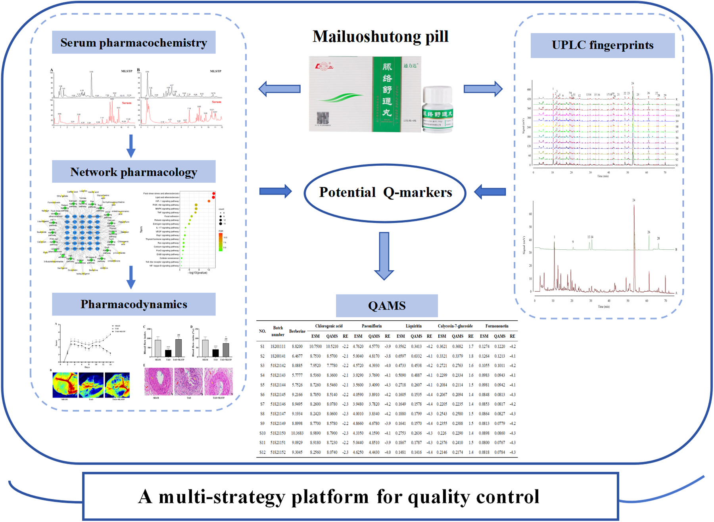
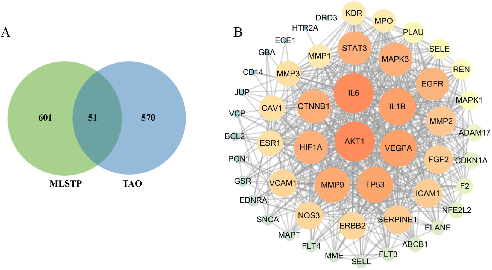
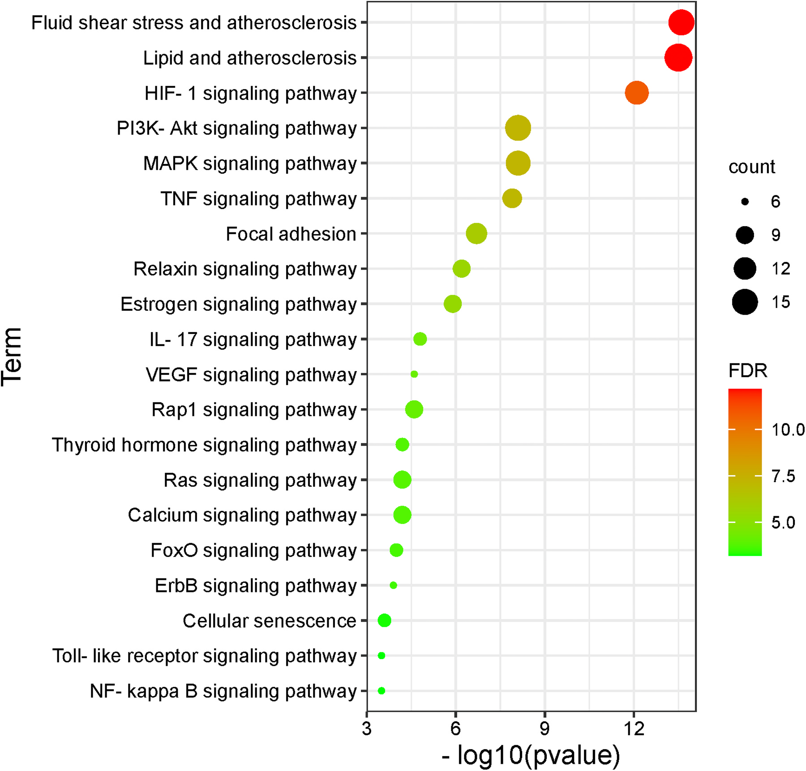
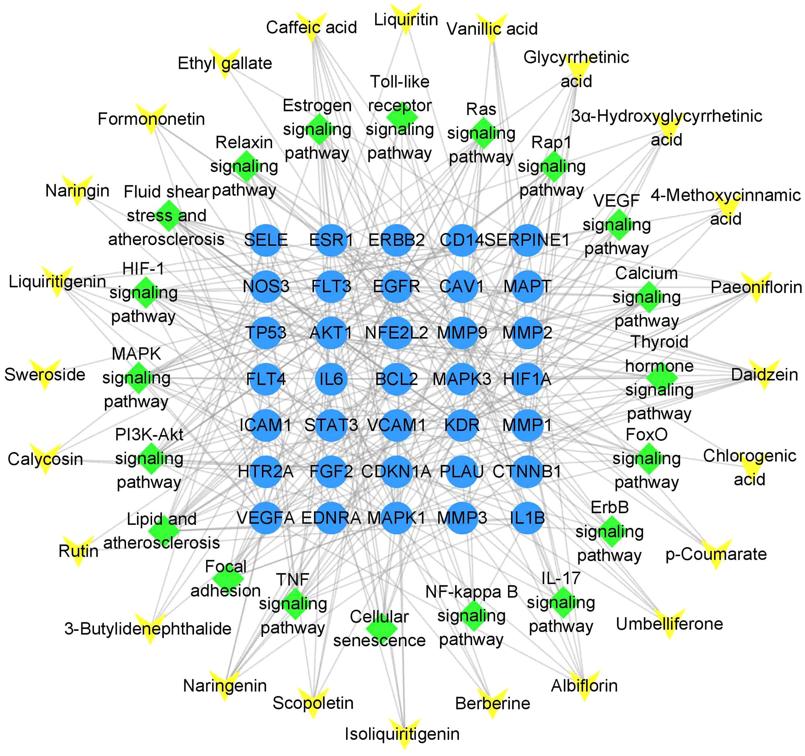
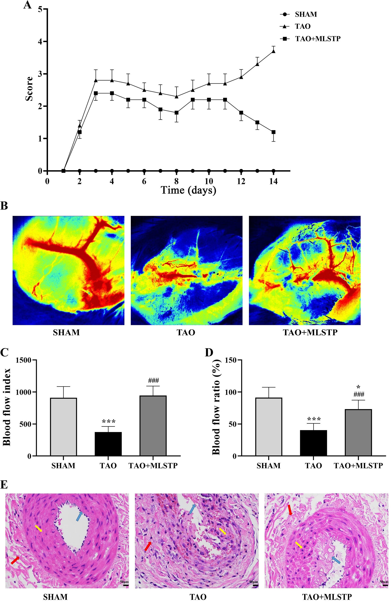
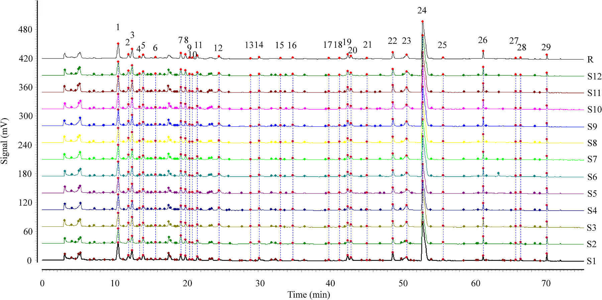
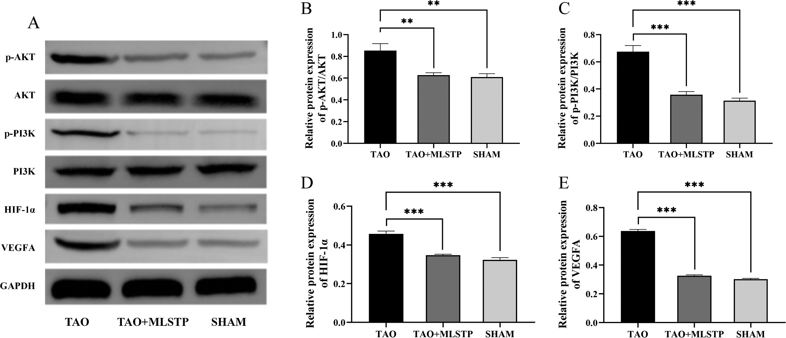
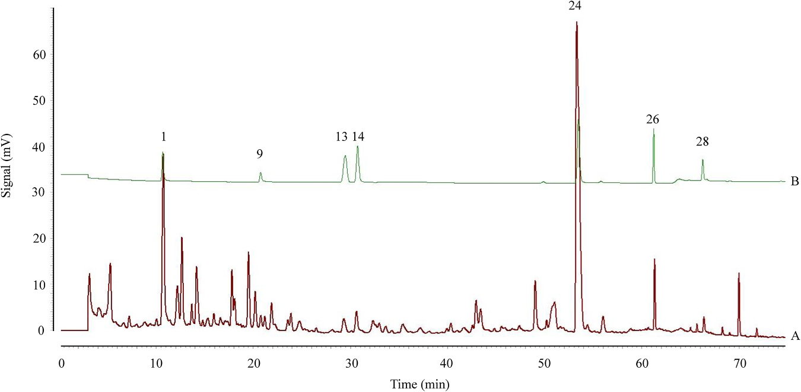

<!-- 方針: ほぼ全訳＋必要に応じた補足。原文構成に沿って訳出。「> 補足:」は訳者注。 -->

## 書誌情報

- 原題: Establishment of a multi-strategy platform for quality control and quality markers screen of Mailuoshutong pill
- 著者: Yaojuan Chu, Xiangyu Zhang, Lihua Zuo, Xiaobao Wang, Yingying Shi, Liwei Liu, Lin Zhou, Jian Kang, Bing Li, Wenbo Cheng, Shuzhang Du, Zhi Sun（鄭州大学第一附属医院薬学部 ほか, 中国。Chu・Zhangは共同筆頭）
- 掲載: *Journal of Pharmaceutical and Biomedical Analysis* 243 (2024) 116070. https://doi.org/10.1016/j.jpba.2024.116070
- インパクトファクター: **3.6**（*J. Pharm. Biomed. Anal.*, JCR 2024 / Clarivate）
- 受理経過: 受領 2024-01-08 / 改訂 2024-02-21 / 採録 2024-02-22 / オンライン公開 2024-02-23

> 補足: MLSTP = 脈絡疏通丸（Mailuoshutong pill。12種の生薬からなる）。TAO = 閉塞性血栓血管炎（バージャー病。四肢の中小動静脈・神経を侵す非動脈硬化性の分節性炎症性閉塞疾患）。QAMS = 一標準多成分定量法、ESM = 外部標準法、RCF = 相対補正係数。本論文は分析法開発＋in vivo薬効検証の研究論文。

## 要旨（Abstract）

閉塞性血栓血管炎(TAO)は再発率・障害率が高く治癒困難・予後不良の非動脈硬化性分節性炎症性閉塞疾患である。脈絡疏通丸(MLSTP)はTAOに有効な漢方として臨床的に実証されているが、数百の化学成分を含むため信頼できる品質評価指標の開発が課題である。本研究は多戦略プラットフォームを構築してMLSTPの品質均一性を評価した。ネットワーク薬理でMLSTPのTAO治療の鍵標的・シグナル経路を予測し、in vivo検証実験で **PI3K-AKT・VEGF・HIF-1経路**の調節を介してTAOに治療効果を示すことを確認。さらにMLSTPのUPLC指紋を確立し、ネットワーク薬理と組み合わせて潜在的Q-markerをスクリーニング。**クロロゲン酸・リクイリチン・芍薬苷(paeoniflorin)・カリコシン-7-グルコシド・ベルベリン・ホルモノネチン**の6成分を潜在的Q-markerに選定。最後に一標準多成分定量法(QAMS)を確立して6成分を定量し、外部標準法(ESM)と一致する結果を得た。本プラットフォームはMLSTPのQ-markerスクリーニングと品質管理に資する。

## 1. 序論（Introduction）

TAO(バージャー病)は四肢の静脈・中小動脈・神経を侵す疾患で、四肢虚血・安静時痛・遊走性血栓性静脈炎・間欠性跛行が主症状であり、進行すると潰瘍・壊疽から切断に至りうる。完治療法はなく、対症・外科・薬物療法が中心。漢方処方(MLSTP・参附注射液・四妙勇安湯等)の探索が増えている。MLSTPは「国医大師」唐祖宣の臨床経験に由来し **12種の生薬** からなり、清熱解毒・活血化瘀の効を持つ。中国薬局方2020はHPLCで一部成分のみを規定しており、Q-marker（品質と薬効を結ぶ指標。生物学的性質・測定可能性・配合環境を考慮）に基づく規格改善が求められる。QAMSは1成分を対照に相対補正係数(RCF)で他成分を同時定量する手法。本研究は分析化学・血清薬物化学・ネットワーク薬理・薬効・UPLC指紋・QAMSを統合した多戦略プラットフォームを構築した。

## 2. 材料と方法（Materials and Methods）

### 動物実験（TAO モデル）

雄Sprague-Dawleyラット(230–270 g)。ラウリン酸ナトリウム溶液(10 mg/mL, pH 8)を右後肢に注入してTAOモデルを作製（注入後1分以内に右後足が蒼白化＝成功）。成功した20匹を2群に無作為割付け、0.5% CMC-Na または **MLSTP 3.8 g/kg/日** を投与。偽手術群10匹。14日目にケタミン(80 mg/kg)・キシラジン(15 mg/kg)麻酔下でレーザースペックル血流測定、組織採取しWestern blot等で経路を解析。

### UPLC条件（指紋・QAMS）

- カラム: ACQUITY UPLC BEH C18（2.1 × 100 mm, 1.7 μm）＋VanGuardプレカラム、カラム温度 40 ℃
- 移動相: A=0.1%ギ酸水、B=アセトニトリル。グラジエント: 0–3 min 5%B / 3–15 min 5–10%B / 15–35 min 10–13%B / 35–55 min 13–22%B / 55–75 min 22–50%B / 75–80 min 50–100%B / 80–85 min 100%B / 85–85.2 min 100–5%B / 85.2–90 min 5%B
- 注入量 5 μL、流速 0.2 mL/min、TUV検出波長 **262 nm**
- 指紋解析: 中薬クロマト指紋類似度評価システム(2012年版)。12バッチを測定。

## 3. 結果（Results）

### 3.1 ネットワーク薬理

MLSTP経口投与後のラット血清で先行研究が **27のプロトタイプ成分** を同定。MLSTP吸収成分関連の652標的とTAO関連の621標的から **51の共通標的** を取得。STRING＋Cytoscape 3.9.1でPPIネットワーク(**51ノード・542エッジ**)を構築。平均次数21.680・平均媒介中心性0.013・平均近接中心性0.640を超える **14の鍵標的**: IL6・AKT1・VEGFA・HIF1A・IL1B・TP53・MMP9・CTNNB1・MAPK3・STAT3・EGFR・NOS3・ERBB2・CAV1。DAVIDでGO/KEGG濃縮(P<0.05): GO計411項目(生物学的過程BP 316・細胞成分CC 44・分子機能MF 51)、**KEGG 115経路**。in vivo検証でPI3K-AKT・VEGF・HIF-1経路の調節を確認。

### 3.3 指紋と類似度評価

12バッチのUPLC指紋を確立(S1を参照、中央値法)。多点補正で **29の共通ピーク** を取得、12バッチの類似度はいずれも **> 0.99**（品質が安定）。標準品で **7ピーク** を同定: クロロゲン酸・芍薬苷・リクイリチン・カリコシン-7-グルコシド・ベルベリン・ホルモノネチン・ハルパゴシド。

### 3.4 Q-markerの選定

血清で27成分を同定、ネットワーク薬理で24の潜在活性成分を取得。ハルパゴシドは指紋上は候補だが血清で未検出のため除外。最終的に **クロロゲン酸・芍薬苷・リクイリチン・カリコシン-7-グルコシド・ベルベリン・ホルモノネチン**の6成分を潜在的Q-markerに選定。

### 3.5 QAMSによる定量

**ベルベリンを内部標準**に、5成分(クロロゲン酸・芍薬苷・リクイリチン・カリコシン-7-グルコシド・ホルモノネチン)のRCF(fR)を算出: fR = (C_ベルベリン × Ak)/(Ck × A_ベルベリン)。RCF(262 nm, L1濃度)は概ね——クロロゲン酸 約4.07、芍薬苷 約34.0、リクイリチン 約2.55、カリコシン-7-グルコシド 約1.26、ホルモノネチン 約0.927。QAMSとESMの相対誤差(RE)は **−4.4〜1.8%** で両法に有意差なく、QAMSがMLSTPの多指標成分定量・品質管理に適用可能と示された。

## 4. 考察・結論（Discussion / Conclusion）

12バッチの指紋から29共通ピーク・7成分を同定し、UPLC指紋とネットワーク薬理の統合から、抗炎症・抗酸化・抗アポトーシス・血管新生・免疫調節などの良好な薬理活性をもつ6成分(クロロゲン酸・芍薬苷・リクイリチン・カリコシン-7-グルコシド・ベルベリン・ホルモノネチン)がQ-markerとして有望と判明。QAMSはESMと有意差がなく、MLSTPの迅速定量に利用できる。

**結論:** 血清薬物化学・ネットワーク薬理・薬効・UPLC指紋・QAMSを統合した多戦略プラットフォームを構築し、6つの潜在的Q-markerを同定、QAMSで定量法を確立した。MLSTPの品質管理・規格向上に有用な参照を提供し、TAOの臨床治療を支える。

> 補足（実務的示唆）: 本研究の枠組みは「血中に移行し効く成分(血清薬物化学) × 薬効標的(ネットワーク薬理＋動物実験) × 測定可能性(指紋・QAMS)」の三位一体でQ-markerを絞る点が要点。実務的には、ベルベリンを内部標準としたQAMSで標準品コストを抑えつつ6成分を同時定量でき、ESMと相対誤差±5%以内で代替可能。経路(PI3K-AKT/VEGF/HIF-1)まで紐づけている点が、単なる化学指標でなく薬効連動の規格設定に資する。

## 図（原論文より）

> 以下は原論文から抽出した主要な図。キャプションは訳者による要約。

