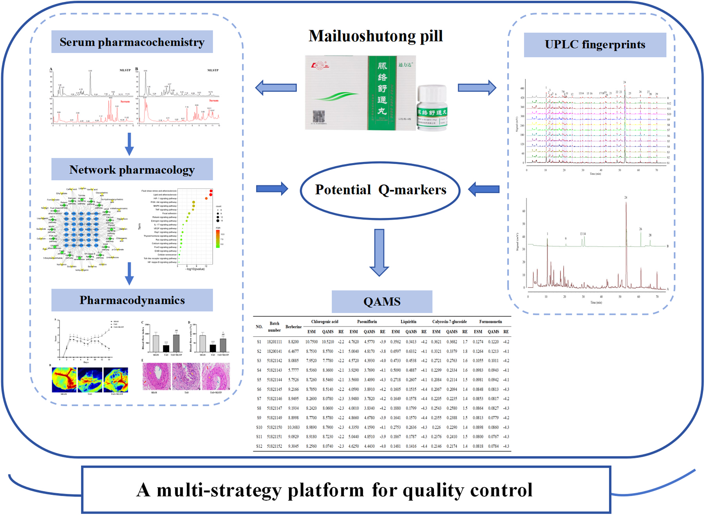
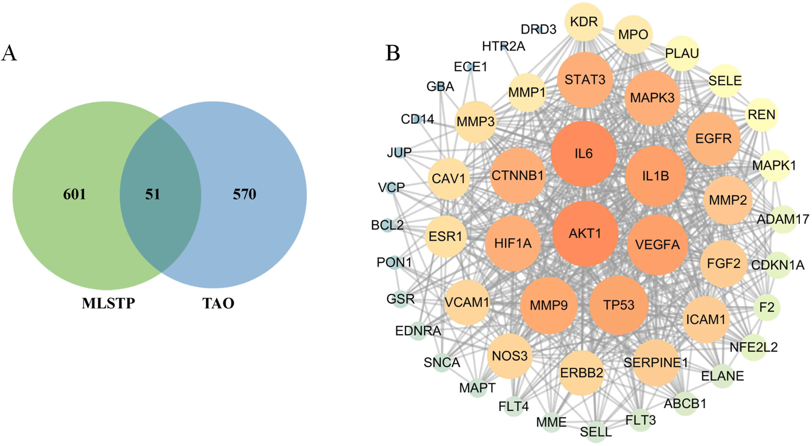
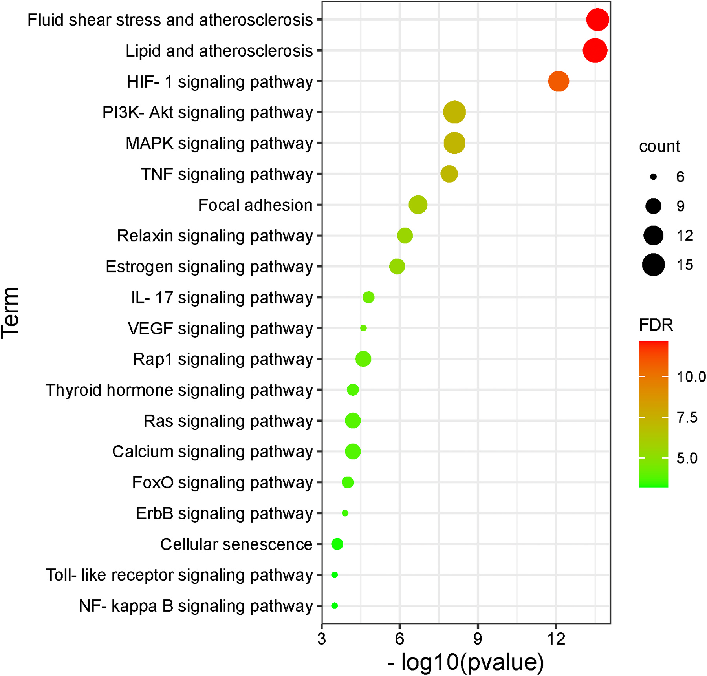
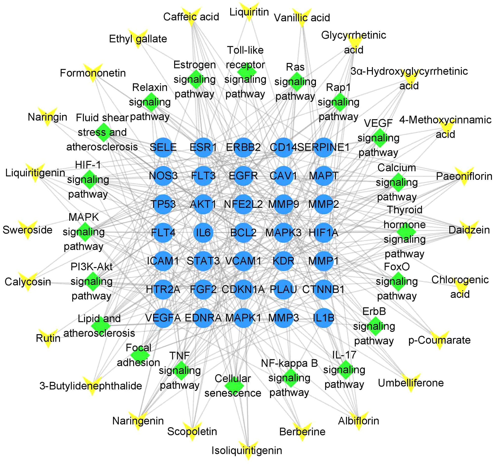
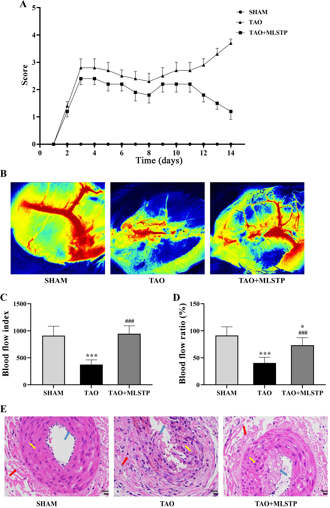
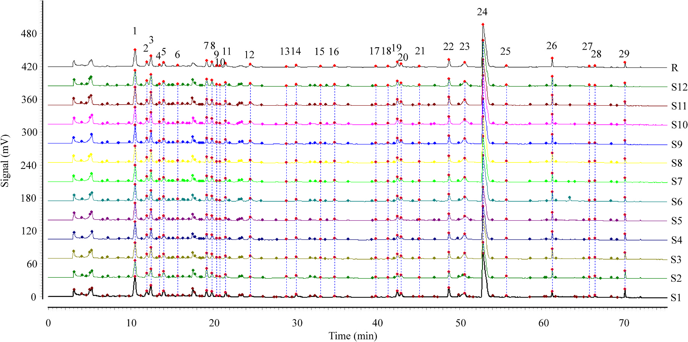
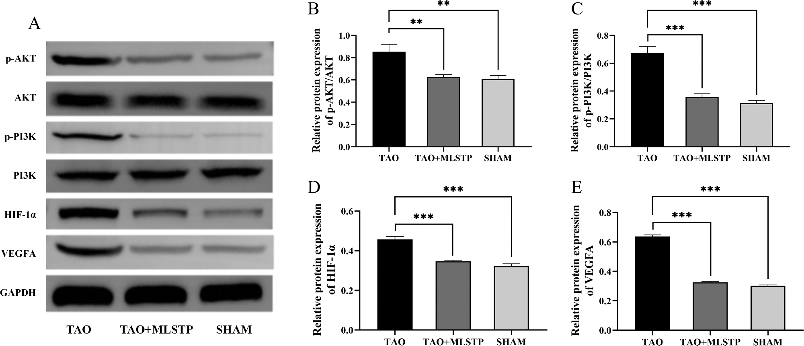
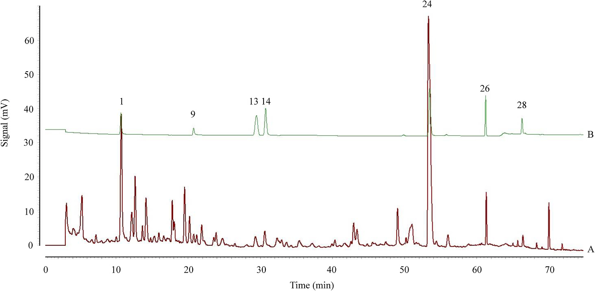

<!-- 方針: ほぼ全訳＋必要に応じた補足。原文構成に沿って訳出。「> 補足:」は訳者注。 -->

## 書誌情報

- 原題: Establishment of a multi-strategy platform for quality control and quality markers screen of Mailuoshutong pill
- 著者: Yaojuan Chu, Xiangyu Zhang, Lihua Zuo, Xiaobao Wang, Yingying Shi, Liwei Liu, Lin Zhou, Jian Kang, Bing Li, Wenbo Cheng, Shuzhang Du, Zhi Sun（鄭州大学第一附属医院薬学部 ほか, 中国。Chu・Zhangは共同筆頭）
- 掲載: *Journal of Pharmaceutical and Biomedical Analysis* 243 (2024) 116070. https://doi.org/10.1016/j.jpba.2024.116070
- インパクトファクター: **3.6**（*J. Pharm. Biomed. Anal.*, JCR 2024 / Clarivate）
- 受理経過: 受領 2024-01-08 / 改訂 2024-02-21 / 採録 2024-02-22 / オンライン公開 2024-02-23

> 補足: MLSTP = 脈絡疏通丸（Mailuoshutong pill。12種の生薬からなる）。TAO = 閉塞性血栓血管炎（バージャー病。四肢の中小動静脈・神経を侵す非動脈硬化性の分節性炎症性閉塞疾患）。QAMS = 一標準多成分定量法、ESM = 外部標準法、RCF = 相対補正係数。本論文は分析法開発＋in vivo薬効検証の研究論文。

## 要旨（Abstract）

閉塞性血栓血管炎(TAO)は再発率・障害率が高く治癒困難・予後不良の非動脈硬化性分節性炎症性閉塞疾患である。脈絡疏通丸(MLSTP)はTAOに有効な漢方として臨床的に実証されているが、数百の化学成分を含むため信頼できる品質評価指標の開発が課題である。本研究は多戦略プラットフォームを構築してMLSTPの品質均一性を評価した。ネットワーク薬理でMLSTPのTAO治療の鍵標的・シグナル経路を予測し、in vivo検証実験で **PI3K-AKT・VEGF・HIF-1経路**の調節を介してTAOに治療効果を示すことを確認。さらにMLSTPのUPLC指紋を確立し、ネットワーク薬理と組み合わせて潜在的Q-markerをスクリーニング。**クロロゲン酸・リクイリチン・芍薬苷(paeoniflorin)・カリコシン-7-グルコシド・ベルベリン・ホルモノネチン**の6成分を潜在的Q-markerに選定。最後に一標準多成分定量法(QAMS)を確立して6成分を定量し、外部標準法(ESM)と一致する結果を得た。本プラットフォームはMLSTPのQ-markerスクリーニングと品質管理に資する。

## 1. 序論（Introduction）

閉塞性血栓血管炎（thromboangiitis obliterans, TAO）は「バージャー病（Buerger's disease）」とも呼ばれ、主に四肢の静脈・中小動脈・神経を侵す非動脈硬化性の分節性炎症性閉塞疾患である[1]。主な臨床症状は四肢虚血・安静時痛（rest pain）・遊走性血栓性静脈炎・間欠性跛行で、これらは重症の四肢潰瘍や壊疽へ進行し、最終的に切断を要する場合がある[2]。1908年のLeo Buergerの画期的な論文以来、TAOの病態生理・病因・最善の治療法に関する進展はわずかしかなく[3]、現時点でTAOを完全に治癒できる治療法は存在しない[4]。特有かつ有効な治療法がない状況で、TAOの臨床管理は支持療法・外科的治療・薬物療法（微小循環改善薬・血管拡張薬・抗血小板薬・グルココルチコイド・抗菌薬など）で構成される[5]。この不足を補うため、TAOに対する漢方（伝統中医薬, TCM）処方——脈絡疏通丸（MLSTP）[6]・参附注射液[7]・四妙勇安湯[1]など——の探索を行う研究者が増えている。

MLSTPは第2代「国医大師」唐祖宣（Tang Zuxuan）の臨床経験に由来し、**12種の生薬**からなる[8]。清熱解毒・活血化瘀・祛湿消腫の効を持ち、TAOに良好な治療効果を示す[6]。著者らの先行研究では、UHPLC-Q-Orbitrap HRMSを用いた化学成分の網羅的解析によりMLSTP中に **211化合物** を同定し[8]、そのうち **27のプロトタイプ成分** が血中に吸収されることを確認している[9]。しかし、中国薬局方2020におけるMLSTPの現行品質管理規格は、黄耆（Astragali Radix, *Astragalus mongholicus* Bunge）中のアストラガロシドと、金銀花（Lonicerae Japonicae Flos, *Lonicera japonica* Thunb.）中のクロロゲン酸をHPLCで定量するのみで、MLSTP全体の品質を包括的に反映・評価できていない。したがって、MLSTPの品質管理規格の改善を急ぐ必要がある。

TCM製品の品質規格体系と既存の品質評価法を継続的に改善するため、2016年に劉昌孝（Liu Changxiao）院士が **Q-marker（quality marker, 品質マーカー）** の概念を提唱した[10]。Q-markerは「有効性（effectiveness）」「特異性（specificity）」「移行と追跡可能性（transfer and traceability）」「測定可能性（measurability）」「配合環境（compatibility environment）」の5つの鍵要素を重視する[11]。これらの要素はTCMの包括的な品質管理体系の確立を促進するうえで極めて重要な役割を果たす。さらにQ-markerの追跡可能性の要素と血清薬物化学（serum pharmacochemistry）の理論によれば、最終的な活性成分は血中に吸収される成分である可能性が高い[12,13]。したがって、血中に吸収される成分を解析し、さらにMLSTPの直接作用成分を同定することによってのみ、MLSTPの品質を根本的に管理できる。

TCMとその製剤の堅牢な品質管理体系の確立は、臨床有効性を保証する前提である[14]。指紋分析（fingerprint analysis）はTCMの全体品質を管理する重要な手法で、TCM品質の一貫性・安定性をより体系的・包括的に評価できる[15]。世界保健機関（WHO）・米国食品医薬品局（FDA）・中国食品薬品監督管理局などにより、生薬・TCMの品質管理標準として受け入れられている[16]。一標準多成分定量法（quantitative analysis of multi-components by single marker, QAMS）は、TCM中の複数成分の品質管理を実現する経済的で簡便な分析法である。TCMのある成分を対照とし、成分間の相対補正係数（relative correction factor, RCF）を補正して複数成分の含量を同時に定量するもので、幅広いTCMの多成分定量に広く用いられてきた。UPLCは高いカラム効率・分離能・感度などの利点を持ち、分析時間を大幅に短縮し分析効率を向上させ溶媒消費を低減できるため、TCMの複雑な多成分の分析・定量に理想的である。以上の理由から、本研究ではUPLCを用いてMLSTPの指紋とQAMS法を確立し、MLSTPの品質評価効率を高めるとともに異なるバッチのMLSTPの品質管理を促進した。

そこで本研究は、分析化学・血清薬物化学・ネットワーク薬理（network pharmacology）・薬効学（pharmacodynamics）・化学指紋・QAMSを統合した、MLSTPの品質管理とQ-markerスクリーニングのための多戦略プラットフォームを構築した（図1）。まず、血清薬物化学解析で得た吸収成分に基づき、MLSTPがTAOを治療する際の可能性のある標的・シグナル経路・潜在的活性成分をネットワーク薬理で決定した。次にTAOモデルラットを作製して、特定の関連標的とシグナル経路を検証した。さらにMLSTP試料のUPLC指紋を確立し、ネットワーク薬理の結果と組み合わせて潜在的Q-markerをスクリーニングした。最後にQAMS法で潜在的Q-markerの含量を定量した。本研究はMLSTPの品質管理・品質評価に重要な参照を提供する。

## 2. 材料と方法（Materials and Methods）

### 2.1 薬品と試薬

12バッチのMLSTP試料は魯南厚普製薬有限公司（S1〜S12、中国山東省。表S1）から提供を受けた。PI3K（ホスファチジルイノシトール3-キナーゼ）抗体はCell Signaling Technology、AKT（プロテインキナーゼB）抗体とp-AKT抗体はAbcam、p-PI3K・VEGFA（血管内皮増殖因子A）・HIF-1α（低酸素誘導因子1α）・GAPDH各抗体およびHRP標識ヤギ抗ウサギ二次抗体は武漢サービスバイオ（Wuhan Servicebio）から入手した。クロロゲン酸・芍薬苷（paeoniflorin）・リクイリチン（liquiritin）・カリコシン-7-グルコシド（calycosin-7-glucoside）・ベルベリン（berberine）・ホルモノネチン（formononetin）・ハルパゴシド（harpagoside）の標準品は成都Must Bio-technology（純度>98%）から購入した。HPLCグレードのアセトニトリル・ギ酸・メタノールはFisher Scientific製。

### 2.2 MLSTP吸収成分のネットワーク薬理解析

**2.2.1 PPIネットワークの構築・解析と鍵標的スクリーニング**: in vitroからin vivoへの移行・追跡可能性を考慮し、まずMLSTPで同定された血清プロトタイプ化合物を選抜した。次にMLSTP吸収成分の標的を、TCMSP（`old.tcmsp-e.com`）・SwissTargetPrediction（`swisstargetprediction.ch`）・PharmMapper（`lilab-ecust.cn/pharmmapper`）で収集し、得られた標的のタンパク名をUniProtデータベースでヒト種の検証済み遺伝子名に変換した。同時に「buerger disease」「thromboangiitis obliterans」を検索語として、OMIM・TTD・GeneCards・DisGeNETでTAO関連標的を収集した。さらにVenn図解析でMLSTP吸収成分とTAOの重複標的を取得し、この重複標的をSTRINGデータベース（生物種＝ヒト、最小要求相互作用スコア＝中信頼度0.400）に入力してPPI（タンパク質間相互作用）ネットワークを構築・解析した。結果はTSV形式で出力後、Cytoscape 3.9.1で可視化・解析し、最終的にトポロジー解析で鍵標的をスクリーニングした。

**2.2.2 GO・KEGG濃縮解析**: 重複標的をDAVIDデータベースに入力してGO機能・KEGG経路濃縮解析を行い、鍵標的に関連する生物学的過程（BP）・細胞成分（CC）・分子機能（MF）・シグナル経路を取得し、MLSTPがTAOを治療する潜在的な内在機構を明らかにした。結果はBioinformaticsプラットフォーム（`bioinformatics.com.cn`）で可視化した。

**2.2.3 「成分-標的-経路」ネットワークの構築**: Cytoscape 3.9.1で「成分-標的-経路」ネットワーク図を構築し、MLSTP吸収成分・鍵標的・上位20 KEGGシグナル経路の相互作用を示した。

### 2.3 実験による検証

**2.3.1 動物**: 雄Sprague-Dawleyラット（230–270 g）を済南鵬悦実験動物繁育より購入し、SPF環境で飼育。実験は鄭州大学生命倫理委員会の承認（承認番号2022-KY-1218–002、2022年10月16日）を受け、動物の苦痛低減に努めた。

**2.3.2 TAOモデルと薬物投与**: TAOモデルは既報[17]に従って誘導した。右後肢大腿動脈にラウリン酸ナトリウム溶液0.2 mL（生理食塩水で10 mg/mLに希釈しpH 8に調整）を注入。注入後1分以内に右後足の皮膚色が明らかに蒼白化すれば注入成功。翌日、右後肢に虚血性変化（チアノーゼの深化・趾の屈曲・趾端の黒色化・引きずり）が現れればモデル作製成功。偽手術群は同法で右後肢大腿動脈に生理食塩水0.2 mLを注入した。作製に成功した20匹を無作為に2群（各n=10）——TAO群とMLSTP群——に割り付け、術後1日目から毎日それぞれ0.5% CMC-Na溶液または **MLSTP（3.8 g/kg/日、臨床等価用量から換算）** を経口投与した[18]。偽手術ラット10匹には等量の0.5% CMC-Na溶液を陰性対照として投与した。

**2.3.3 臨床スコアリング**: 患肢の形態的変化の臨床所見を、既報[7]の二重盲検スコアリング法で毎日評価した。0＝正常な外観、1＝趾爪のみに限局した病変、2＝趾に限局、3＝足全体に限局、4＝足首上部〜膝下部に限局、5＝膝より上に進展した病変。

**2.3.4 患肢の血流速度と灌流血管分布**: 術後14日目にケタミン（80 mg/kg）・キシラジン（15 mg/kg）で腹腔内麻酔し、レーザースペックル血流イメージングシステム（RWD Life Science）で患肢全体の血流速度と灌流血管分布を測定した。

**2.3.5 組織病理学的評価**: 14日目の血流モニタリング後にラットを安楽死させ大腿動脈を速やかに摘出。4%パラホルムアルデヒドで固定後パラフィン包埋し、5 μm切片を脱パラフィン・ヘマトキシリン-エオジン（H&E）染色・洗浄・封入。Nikon Eclipse Ci顕微鏡で組織病理学的変化を観察・撮影した。

**2.3.6 ウエスタンブロット**: 大腿動脈に10倍容量の組織溶解液を加えて破砕・遠心し、上清のタンパク濃度をBCA法で定量。SDS-PAGEで分離後PVDF膜に転写し、5%スキムミルク/TBSTで30分ブロッキング、AKT・p-AKT・PI3K・p-PI3K・HIF-1α・VEGFA・GAPDH各抗体（1:1000）と4℃で一晩インキュベート。HRP標識ヤギ抗ウサギ二次抗体（1:5000）を30分反応させ、ECL化学発光法で現像・撮影し、Alpha Innotechソフトで標的タンパク発現の相対定量を行った。

### 2.4 試料溶液・標準溶液の調製

**2.4.1 指紋・QAMS用MLSTP試料溶液**: MLSTPを粉砕し、粉末1.0 gを50%メタノール水（v/v）50 mLに溶解、30分超音波抽出後さらに30分静置。0.22 µmメンブレンで濾過し、30%メタノール水（v/v）で5倍希釈してMLSTP試料溶液を得た。12バッチすべて同手順で調製した。

**2.4.2 標準溶液**: 各標準品1 mgを精秤し50%メタノール水（v/v）に溶解して100 μg/mLのストック標準溶液を調製。全ストックを混合・希釈して混合標準溶液（0.1–1 μg/mL）とし、さらに6段階（L1–L6）の直線性測定用溶液に段階希釈した。

### 2.5 クロマトグラフィー条件

システムはACQUITY UPLC H-Classシリーズ（Waters、TUV検出器・二元ポンプ・オンライン脱気・カラムオーブン・オートサンプラー付き）。分離はACQUITY UPLC BEH C18カラム（2.1 × 100 mm, 1.7 μm）＋VanGuardプレカラム（2.1 × 5 mm, 1.7 μm）、カラム温度40℃。移動相はA＝0.1%ギ酸水（v/v）、B＝アセトニトリルの勾配溶出：0–3 min（5%B）／3–15 min（5–10%B）／15–35 min（10–13%B）／35–55 min（13–22%B）／55–75 min（22–50%B）／75–80 min（50–100%B）／80–85 min（100%B）／85–85.2 min（100–5%B）／85.2–90 min（5%B）。注入量5 µL、流速0.2 mL/min、TUV検出波長 **262 nm**。

### 2.6 データ処理・解析

動物実験データはGraphPad Prism 8.0で一元配置分散分析・両側Student t検定またはMann-Whitney U検定により統計解析し、平均±SDで表示、P<0.05を有意とした。UPLC指紋解析は中薬クロマト指紋類似度評価システム（2012年版）で実施した。

## 3. 結果（Results）

### 3.1 MLSTP吸収成分のネットワーク薬理解析

**3.1.1 PPIネットワーク構築と鍵標的スクリーニング**: 著者らは先行研究[9]で、MLSTP経口投与後のラット血清中に27のプロトタイプ成分を同定している。MLSTP吸収成分に関連する652標的とTAO関連の621標的をそれぞれ取得し、**51の重複標的** を得た（図2A・表S2）。これらはMLSTPがTAOを改善する潜在的標的となりうる。重複標的をSTRINGに入力してPPIネットワークを構築・Cytoscape 3.9.1で可視化し、**51ノード・542エッジ** のPPIネットワーク図を得た（図2B）。標的の平均次数（degree）21.680・平均媒介中心性（betweenness centrality）0.013・平均近接中心性（closeness centrality）0.640。この3つの平均を超える **14の鍵標的**——IL6・AKT1・VEGFA・HIF1A・IL1B・TP53・MMP9・CTNNB1・MAPK3・STAT3・EGFR・NOS3・ERBB2・CAV1——はMLSTPによるTAO治療で重要な役割を果たしうる。

**3.1.2 濃縮解析**: 51重複標的についてDAVIDでGO・KEGG濃縮解析を行った（スクリーニング条件P<0.05）。**411のGO項目**（BP 316・CC 44・MF 51）と **115のKEGGシグナル経路** が濃縮された。上位10 GO項目と上位20 KEGG経路をP値の降順で図S1・図3に可視化した。作用の潜在標的が関わるシグナル経路は、酸化ストレス・細胞増殖・免疫調節・炎症反応・血管新生と密接に関連していた。

**3.1.3 「成分-標的-経路」ネットワークの構築・解析**: MLSTPの活性成分がTAOを改善する機構をさらに検証するため、Cytoscape 3.9.1で「成分-標的-経路」ネットワークを構築した（図4）。このネットワークから、潜在的活性化合物とみなされる **24の吸収化合物** が、**35の標的タンパク** と **20のシグナル経路** を調節して生物活性を発揮しうることが明らかになった。これはMLSTPが多標的・多経路でTAOを治療するという考えをさらに支持し、Q-markerと潜在標的のスクリーニングの理論的基盤となった。鍵標的（IL6・AKT1・VEGFA・HIF1A）とその関連シグナル経路（PI3K-Akt経路・VEGF経路・HIF-1経路）は密接に相関しており、これらの経路へのMLSTPの影響を検証するため動物実験を行った。

### 3.2 動物実験による検証

**3.2.1 MLSTP投与はTAOの臨床重症度を軽減した**: ラウリン酸ナトリウム注入により、患肢が徐々に紫黒色化しミイラ化するなど典型的なTAOの徴候・症状が発現した。TAO群は偽手術群より有意に高い平均臨床スコアを示した。MLSTP投与後、患肢の病変が縮小し平均臨床スコアが顕著に低下した（図5A）。患肢の血管機能を評価するためレーザースペックル・コントラスト・イメージングで血流速度と灌流血管分布を測定したところ、TAOラットでは大腿動脈が極度に狭窄し、血流の少ない小さな毛細血管叢に囲まれていた。一方、MLSTP投与TAOラットでは大腿動脈周囲の血管分布がより無秩序で、多数の毛細血管に囲まれ血流に富んでいた（図5B）。さらに血流指数と患肢/正常後肢の血流比は、TAOラットで偽手術ラットより明らかに減少したが、MLSTP投与TAOラットで顕著に増強された（図5C・D）。これらはMLSTP投与がTAOラット患肢の血管機能を改善することを示す。TAOの血管病理を評価するため大腿動脈のH&E染色を行ったところ、TAOラットでは大腿動脈の内膜・中膜・外膜に有意な炎症性浸潤があり、細胞配列が乱れ内膜細胞の重度の脱落と内腔の顕著な狭窄が見られた。MLSTP投与はこれらの病理学的特徴を効果的に抑制した（図5E）。

**3.2.2 MLSTP投与はPI3K・AKTのリン酸化を抑制しHIF-1α・VEGFA発現を低下させた**: PI3K-AKT経路・HIF-1経路・VEGF経路の調節に関わる鍵標的（PI3K・AKT・HIF-1α・VEGFA）を検証するため、ラット大腿動脈での発現をウエスタンブロットで測定した。MLSTP投与群ではTAO群と比べ、PI3K・AKTの活性化型を表すp-PI3K・p-AKTの発現が有意に減少した（図6A-C）。同様にHIF-1α・VEGFAの発現もMLSTP投与群で顕著に減少した（図6A・D・E）。これらはMLSTPがPI3K-AKT経路・HIF-1経路・VEGF経路に依存してTAOラットを保護することを示す。

### 3.3 指紋の確立と類似度評価

TCMの指紋はTCM中の全成分を包括的に把握でき、全体品質を管理する重要な手法である。12バッチのMLSTP試料を調製しUPLCで測定した。確立した方法は再現性・精度・安定性について検証し（表S3）、良好な方法再現性・高い機器精度・試料安定性を示した。クロマトグラムデータをCDF形式で中薬クロマト指紋類似度評価システム（2012年版）に取り込み、S1のクロマトグラムを参照スペクトルとして中央値法でMLSTP指紋を確立した（図7）。多点補正により計 **29の共通ピーク** を取得。12バッチのUPLC指紋類似度はいずれも **0.99超** で（表S4）、MLSTP試料の品質が一貫して安定であることを示した。標準品で **7ピーク** を同定した——クロロゲン酸・芍薬苷・リクイリチン・カリコシン-7-グルコシド・ベルベリン・ホルモノネチン・ハルパゴシド（図8）。

### 3.4 ネットワーク薬理と指紋の統合によるQ-markerの選定

MLSTP経口投与後の血清で27化合物を特性化し、ネットワーク薬理で吸収成分から24の潜在的活性化合物を得た。UPLC指紋ではハルパゴシドもMLSTPのTAO治療の候補成分となりうると示されたが、ハルパゴシドは血清で特性化されなかった。その結果、**クロロゲン酸・芍薬苷・リクイリチン・カリコシン-7-グルコシド・ベルベリン・ホルモノネチン** の6成分をMLSTPの潜在的Q-markerとして選定した。

### 3.5 QAMSによる潜在的Q-markerの定量

**3.5.1 直線性・精度・安定性・再現性・正確性**: MLSTPの全体品質を評価するため、6つの潜在的Q-markerをQAMS法で定量した。確立した方法は直線性・精度・安定性・再現性・回収率について検証し（表S5）、いずれも良好な性能を示した。

**3.5.2 RCF（fR）の算出**: 上記6濃度勾配の直線性溶液を用い、**ベルベリンを内部標準** としてクロロゲン酸・芍薬苷・リクイリチン・カリコシン-7-グルコシド・ホルモノネチンのRCFを算出した（表1）。RCFの算出式は fR = (C_ベルベリン × Ak)/(Ck × A_ベルベリン)。ここでCkは被測定物質の濃度、Akは被測定物質のピーク面積。

**表1. 262 nmにおける各成分のRCF**

| 濃度 | クロロゲン酸 | 芍薬苷 | リクイリチン | カリコシン-7-グルコシド | ホルモノネチン |
|---|---|---|---|---|---|
| L1 | 4.068 | 33.980 | 2.550 | 1.259 | 0.927 |
| L2 | 4.128 | 34.300 | 2.603 | 1.303 | 0.921 |
| L3 | 3.932 | 34.260 | 2.508 | 1.190 | 0.943 |
| L4 | 3.902 | 33.870 | 2.647 | 1.171 | 0.932 |
| L5 | 3.789 | 32.050 | 2.557 | 1.275 | 0.959 |
| L6 | 4.044 | 34.300 | 2.637 | 1.206 | 0.893 |
| 平均 | 3.977 | 33.790 | 2.583 | 1.234 | 0.929 |
| CV(%) | 3.2 | 2.6 | 2.1 | 4.3 | 2.4 |

**3.5.3 QAMSとESMの比較**: 含量・価格・安定性・入手容易性・クロマトピーク面積・保持時間を考慮し、ベルベリンをQAMSの内部標準に選定してMLSTPの潜在的Q-markerを定量した。クロロゲン酸・芍薬苷・リクイリチン・カリコシン-7-グルコシド・ホルモノネチンの含量を測定し、外部標準法（ESM）の結果と比較した。両法の差は相対誤差（RE）で表現し、RE = (W_QAMS − W_ESM)/W_ESM × 100% で算出した。12バッチのMLSTP試料中6成分の含量のREは **−4.4%〜1.8%**（表2）で、両法のRE値に有意差はなく、このQAMS法がMLSTPの多指標成分の含量測定に適用可能でMLSTPの品質管理に実行可能であることが示された。

## 4. 考察（Discussion）

本研究では、血清薬物化学・ネットワーク薬理・薬効学・UPLC指紋・QAMSを統合した多戦略プラットフォームを構築し、MLSTPの品質を監視した。TCM製剤であるMLSTPはTAO治療に有効と実証されており、主要活性成分にはフラボノイド・テルペノイド・フェノール酸などが含まれる[8]。品質管理のためアストラガロシドとクロロゲン酸がマーカーとして中国薬局方2020に収載されている。先行研究でLC-MSによるMLSTPの定性・定量解析を行ってきたが、分析技術の著しい進歩にもかかわらず、管理指標と薬効の関係は依然不確かで、MLSTP品質の指標となる薬効関連の特徴成分の同定は未解決であった。

TAOは臨床的に難治性の末梢血管疾患で、しばしば重度の四肢機能障害・器質的損傷を招き、診断後5年で25%・10年で38%・20年で46%の患者が切断のリスクを負い[19]、患者・家族・医療システム・社会に重い経済的負担と精神的ストレスを課す。先行研究はTAOが様々なシグナル経路[20–22]と関連することを示唆しており、TCM処方の多成分・多標的アプローチはその治療により適すると考えられる。しかしTCM処方は多数の複雑な成分からなり、経口投与後に血中に吸収される成分のみが薬効を発揮しうる。したがってMLSTPのTAO治療の薬効物質基盤と機構を包括的に解明するため、血清薬物化学とネットワーク薬理を用いて血清成分同定・標的予測・タンパク会合・GO/KEGG解析を行い、in vivo実験で検証して予測結果の信頼性を高めた。

血清試料中に計27のMLSTPプロトタイプ成分を同定した。これら活性成分の大半は黄耆・金銀花・甘草（Glycyrrhizae Radix Et Rhizoma, *Glycyrrhiza uralensis*）に由来する。本処方の主薬である黄耆・金銀花は主に解毒・消腫に作用し、甘草などの官薬は主に清熱・除湿の役割を果たす。総じて黄耆・金銀花・甘草がTAO治療で同等に重要な役割を果たしうることは、「主薬が処方で重要な役割を果たす」という従来の理解と一致する。

MLSTP吸収成分のネットワーク薬理解析から、24の潜在的活性化合物が主に酸化ストレス・細胞増殖・免疫調節・炎症反応・血管新生に関連する標的・経路を調節して作用することが明らかになった。MLSTPのTAO治療のシグナル経路には主に、糖尿病合併症におけるAGE-RAGE経路・HIF-1経路・PI3K-Akt経路・VEGF経路などが関わり、なかでもAGE-RAGE経路の相関が最も高い。TAOと糖尿病合併症である糖尿病足は、TCMでは「脱疽（TuoJu）」の範疇に属する。AGEとRAGEの特異的結合は一連のシグナル経路を誘導し、血管収縮・炎症などを引き起こして血栓形成に至らせる[23]。PI3K-Akt経路は脂質蓄積・血栓形成・脆弱プラーク破裂など様々な病理過程に関与し、血小板凝集の活性化で重要な機能を担う[24]。HIF-1αはPI3K/Aktの重要な下流因子で、酸素恒常性の維持と腫瘍微小環境の調節を担う重要な調節因子である[25]。PI3K/Akt経路の活性化はHIF-1αのアップレギュレーションと核内移行を促進し、次いでVEGFの転写・翻訳を開始して血管新生促進に一役買う[26]。通常VEGFはVEGFAを指し、血管新生を促進する主要増殖因子の一つで、血管内皮細胞の増殖・遊走を誘導し血管新生を促進、アポトーシス誘導性の血管透過性亢進を抑制する[27]。TAO患者における炎症反応の過剰活性化と免疫応答の撹乱は血管内皮機能の障害を招き、この障害が内皮損傷部位でさらに血小板の活性化・凝集を誘導し血栓形成を促進する[28]。血栓後の血管閉塞による局所低酸素は、内皮細胞におけるHIF-1αの発現をさらに増加させる。HIF-1αはVEGFの発現・分泌を開始し、局所の虚血・低酸素にある程度の代償効果を持つ[29]。以上の経路は、炎症反応・血小板凝集・血栓形成などと密接に関連する鍵標的に有意に濃縮された経路である。さらにin vivo検証実験は、MLSTPがPI3K・AKTタンパクのリン酸化とHIF-1α・VEGFAタンパクの発現を抑制することでTAO治療に寄与しうることを示した。総じてMLSTPは複数の経路を介してTAO治療の薬理効果を発揮しうる。

UPLCは化学マーカーの分離・定量に極めて有効な技術である。MLSTP中の成分をよりよく分離するため、よく使われる2種のカラム——Waters BEH C18（2.1 × 100 mm, 1.7 μm）とWaters HSS T3（2.1 × 100 mm, 1.8 μm）——を比較し、カラムの保持特性・成分の分離効果・MLSTPのピーク時間を考慮してBEH C18を選択した。また移動相としてアセトニトリル-水、アセトニトリル-0.1%ギ酸水、アセトニトリル-0.1%リン酸水のMLSTP成分ピーク分離への影響を検討し、アセトニトリル-0.1%ギ酸水が最良のピーク分離・ピーク形状・平滑なベースラインを与えた。さらに25・30・35・40℃のカラム温度の保持特性への影響を検討し、40℃でピーク形状が良好だったため40℃を選択した。加えて各成分の良好なピーク応答のため、MLSTPの薬物組成に基づき200–400 nmの全波長スキャンを行い、260・262・275・325・345 nmでのクロマトグラムとピーク分離を関連文献とともに検討したところ、262 nmのクロマトピークが最も情報量が多く、ピーク間分離が良好・ピーク高が適度・ベースラインが平滑であった。これに基づき12バッチのMLSTP試料のUPLC指紋を確立し、標準品で7共通ピークを同定した。さらにUPLC指紋とネットワーク薬理の統合から、クロロゲン酸・芍薬苷・リクイリチン・カリコシン-7-グルコシド・ベルベリン・ホルモノネチンがMLSTPのQ-markerとして有望であることが判明した。これら6化合物は抗炎症・抗酸化・抗アポトーシス・血管新生・免疫調節の点で良好な薬理活性を持つ[30–35]。さらに本研究で確立したQAMS法はESMと有意差がなく、MLSTPの迅速定量分析に利用できる。

## 5. 結論（Conclusions）

要約すると、血清薬物化学・ネットワーク薬理・薬効学・UPLC指紋・QAMSを含む多戦略プラットフォームを、MLSTPの品質管理とQ-marker同定のために成功裏に構築した。この統合アプローチにより6つの潜在的Q-markerを同定し、これらを定量するQAMS法を開発した。本研究はMLSTPのTAOに対する機構の今後の研究に新たな知見を与え、MLSTPの品質管理・評価に有用な参照を提供し、MLSTPの品質規格の向上を促進して、TAOの臨床治療に良好な保証を与える。

**資金**: 国家重点研究開発計画（2021YFC2401105）、世界中医薬学会連合会基金（WFCMS2019003）、河南省重点研究普及プロジェクト（222102310346・232102311200）、河南省医学科技研究計画の省部級重点プロジェクト（SBGJ202102087）、河南省高等学校重点科学研究プロジェクト（22A350018・22B360018）、中国光華科技基金会プロジェクトの支援を受けた。

> 補足（実務的示唆）: 本研究の枠組みは「血中に移行し効く成分(血清薬物化学) × 薬効標的(ネットワーク薬理＋動物実験) × 測定可能性(指紋・QAMS)」の三位一体でQ-markerを絞る点が要点。実務的には、ベルベリンを内部標準としたQAMSで標準品コストを抑えつつ6成分を同時定量でき、ESMと相対誤差±5%以内で代替可能。経路(PI3K-AKT/VEGF/HIF-1)まで紐づけている点が、単なる化学指標でなく薬効連動の規格設定に資する。前掲の滋腎育胎丸・復方刺五加顆粒のQAMS論文と同じ「単一マーカー規格→多成分QC」の流れを、さらに薬効機構の裏づけまで進めた例。

## 参考文献

1. H.Y. Li, H. Sun, A.H. Zhang, L.W. He, S. Qiu, J.R. Xue, F. Wu, X.J. Wang, Therapeutic effect and mechanism of Si-Miao-Yong-An-Tang on thromboangiitis obliterans based on the urine metabolomics approach, Front. Pharmacol. 13 (2022) 827733.

2. M. Arnoriaga-Rodriguez, J. Mayneris-Perxachs, A. Burokas, O. Contreras- Rodriguez, G. Blasco, C. Coll, C. Biarnes, R. Miranda-Olivos, J. Latorre, J. M. Moreno-Navarrete, A. Castells-Nobau, M. Sabater, M.E. Palomo-Buitrago, J. Puig, S. Pedraza, J. Gich, V. Perez-Brocal, W. Ricart, A. Moya, X. Fernandez-Real, L. Ramio-Torrenta, R. Pamplona, J. Sol, M. Jove, M. Portero-Otin, R. Maldonado, J. M. Fernandez-Real, Obesity impairs short-term and working memory through gut microbial metabolism of aromatic amino acids, Cell Metab. 32 (2020), 548-560 e7.

3. D.G. Cacione, C.R. Macedo, F. do Carmo Novaes, J.C. Baptista-Silva, Pharmacological treatment for Buerger’s disease, Cochrane Database Syst. Rev. 5 (2020) Cd011033.

4. Z.F. Li, X.J. Shu, W.H. Wang, S.Y. Liu, L. Dang, Y.Q. Shi, Y.W. Bai, Predictive value of serum VEGF, IL-1 and TNF-α in the treatment of thromboangiitis obliterans by revascularization, Exp. Ther. Med. 20 (2020) 232.

5. X.L. Sun, B.Y. Law, I.R. de Seabra Rodrigues Dias, S.W.F. Mok, Y.Z. He, V.K. Wong, Pathogenesis of thromboangiitis obliterans: Gene polymorphism and immunoregulation of human vascular endothelial cells, Atherosclerosis 265 (2017) 258–265.

6. X.B. Wang, M.L. Wang, Y.J. Chu, P.P. Zhou, X.Y. Zhang, J. Zou, L.H. Zuo, Y.Y. Shi, J. Kang, B. Li, W.B. Cheng, Z. Sun, X.J. Zhang, S.Z. Du, Integrated pharmacokinetics and pharmacometabolomics to reveal the synergistic mechanism of a multicomponent Chinese patent medicine, Mailuo Shutong pills against thromboangiitis obliterans, Phytomedicine 112 (2023) 154709.

7. F.F. Hong, C.S. He, X.J. Liu, G.L. Tu, F.X. Guo, S.L. Yang, Protective effect of Shenfu injection on thromboangiitis obliterans model rats, J. Ethnopharmacol. 138 (2011) 458–462.

8. X.Y. Zhang, Y.J. Chu, M.L. Wang, Y.Y. Shi, L.H. Zuo, Z.L. Li, J.Y. Liu, J. Kang, S. Z. Du, B. Li, Z. Sun, X.J. Zhang, Rapid and comprehensive identification of chemical constituents in Mai-Luo-Shu-Tong pill by UHPLC-Q-Orbitrap HRMS combined with a data mining strategy, Anal. Methods 14 (2022) 4990–5000.

9. Y.J. Chu, M.L. Wang, X.B. Wang, X.Y. Zhang, L.W. Liu, Y.Y. Shi, L.H. Zuo, S.Z. Du, J. Kang, B. Li, W.B. Cheng, Z. Sun, X.J. Zhang, Identifying quality markers of Mailuoshutong pill against thromboangiitis obliterans based on chinmedomics strategy, Phytomedicine 104 (2022) 154313.

10. C.X. Liu, Y.Y. Cheng, D.A. Guo, T.J. Zhang, Y.Z. Li, W.B. Hou, L.Q. Huang, H.Y. Xu, A new concept on quality marker for quality assessment and process control of Chinese medicines, Chin. Herb. Med. 9 (2017) 3–13.

11. X.J. Wang, A.H. Zhang, L. Kong, J.B. Yu, H.L. Gao, Z.D. Liu, H. Sun, Rapid discovery of quality-markers from Kaixin San using chinmedomics analysis approach, Phytomedicine 54 (2019) 371–381.

12. H. Xiong, A.H. Zhang, Q.Q. Zhao, G.L. Yan, H. Sun, X.J. Wang, Discovery of quality-marker ingredients of Panax quinquefolius driven by high-throughput chinmedomics approach, Phytomedicine 74 (2020) 152928.

13. F.T. Yin, X.H. Zhou, S.Y. Kang, X.H. Li, J. Li, I. Ullah, A.H. Zhang, H. Sun, X. J. Wang, Prediction of the mechanism of Dachengqi Decoction treating colorectal cancer based on the analysis method of " into serum components -action target-key pathway", J. Ethnopharmacol. 293 (2022) 115286.

14. G. Bai, T. Zhang, Y. Hou, G. Ding, M. Jiang, G. Luo, From quality markers to data mining and intelligence assessment: a smart quality-evaluation strategy for traditional Chinese medicine based on quality markers, Phytomedicine 44 (2018) 109–116.

15. H. Zhu, Y. Qiu, D. Gong, J. Wang, G. Sun, A novel method for quality consistency evaluation of Yankening Tablet by multi-wavelength fusion profiling combined with overall components dissolution method and antioxidant activity analysis, J. Pharm. Biomed. Anal. 196 (2021) 113910.

16. X. Li, H. Yang, X. Pang, G. Sun, Entirely control the quality consistency of Rong’e Yishen oral liquid by both quantified profiling and quantitative analysis of multi- components by single marker method, J. Pharm. Biomed. Anal. 193 (2021) 113719.

17. S.-i Ashida, M. Ishihara, H. Ogawa, Y. Abiko, Protective effect of ticlopidine on experimentally induced peripheral arterial occlusive disease in rats, Thromb. Res. 18 (1980) 55–67.

18. M.L. Wang, Y.J. Chu, L.H. Zuo, M.F. Zhao, J.Y. Liu, B. Li, Z. Sun, X.J. Zhang, S. Z. Du, Therapeutic effect of Mailuo Shutong pills in thromboangiitis obliterans model rats, Chin. J. Pharmacol. Toxicol. 36 (2022) 17–24.

19. M. Fei, W. Kewei, S. Jianfeng, G. Wenfei, H. Mingkui, X. Jiang, L. Yu, Advances in diagnosis and treatment of thromboangiitis obliterans, J. Vasc. Endovasc. Surg. 7 (2021), 1296-1301+1306.

20. Z. Wei, W. Jiang, H. Wang, H. Li, B. Tang, B. Liu, H. Jiang, X. Sun, The IL-6/STAT3 pathway regulates adhesion molecules and cytoskeleton of endothelial cells in thromboangiitis obliterans, Cell. Signal. 44 (2018) 118–126.

21. G. De Caridi, A. Bitto, M. Massara, G. Pallio, G. Pizzino, R. Serra, D. Altavilla, F. Squadrito, F. Spinelli, Increased serum HMGB-1, ICAM-1 and metalloproteinase- 9 levels in Buerger’s patients, Curr. Vasc. Pharmacol. 14 (2016) 382–387.

22. A. Aliee, F. Zahedi Avval, H. Taheri, S.M. Moghadam, M. Soukhtanloo, D. Hamidi Alamdari, B. Fazeli, The status of nitric oxide and its backup, heme oxygenase 1, in thromboangiitis obliterans, Rep. Biochem. Mol. Biol. 6 (2018) 197–202.

23. Z. Hegab, S. Gibbons, L. Neyses, M.A. Mamas, Role of advanced glycation end products in cardiovascular disease, World J. Cardiol. 4 (2012) 90–102.

24. G.F. Guidetti, I. Canobbio, M. Torti, PI3K/Akt in platelet integrin signaling and implications in thrombosis, Adv. Biol. Regul. 59 (2015) 36–52.

25. Z. Li, X. Li, Y. Zhu, Q. Chen, B. Li, F. Zhang, Protective effects of acetylcholine on hypoxia-induced endothelial-to-mesenchymal transition in human cardiac microvascular endothelial cells, Mol. Cell. Biochem. 473 (2020) 101–110.

26. R. Raja, S. Kale, D. Thorat, G. Soundararajan, K. Lohite, A. Mane, S. Karnik, G. C. Kundu, Hypoxia-driven osteopontin contributes to breast tumor growth through Y. Chu et al. Journal of Pharmaceutical and Biomedical Analysis 243 (2024) 116070 12 modulation of HIF1α-mediated VEGF-dependent angiogenesis, Oncogene 33 (2014) 2053–2064.

27. N. Ferrara, H.P. Gerber, J. LeCouter, The biology of VEGF and its receptors, Nat. Med. 9 (2003) 669–676.

28. M. Masoudian, B. Fazeli, H. Sharebiani, A. Rajabnejad, H. Ravari, M.M. Akbarin, M. Dadgarmoghaddam, Association of the five gene related endothelial cell dysfunction polymorphisms with Buerger’s disease development, Int. Angiol. 35 (2016) 205–211.

29. R.A. Johns, E. Takimoto, L.W. Meuchel, E. Elsaigh, A. Zhang, N.M. Heller, G. L. Semenza, K. Yamaji-Kegan, Hypoxia-inducible factor 1α Is a critical downstream mediator for hypoxia-induced mitogenic factor (FIZZ1/RELMα)-induced pulmonary hypertension, Arterioscler. Thromb. Vasc. Biol. 36 (2016) 134–144.

30. M. Naveed, V. Hejazi, M. Abbas, A.A. Kamboh, G.J. Khan, M. Shumzaid, F. Ahmad, D. Babazadeh, X. FangFang, F. Modarresi-Ghazani, L. WenHua, Z. XiaoHui, Chlorogenic acid (CGA): A pharmacological review and call for further research, Biomed. Pharmacother. 97 (2018) 67–74.

31. L. Zhang, W. Wei, Anti-inflammatory and immunoregulatory effects of paeoniflorin and total glucosides of paeony, Pharmacol. Ther. 207 (2020) 107452.

32. J. Qin, J. Chen, F. Peng, C. Sun, Y. Lei, G. Chen, G. Li, Y. Yin, Z. Lin, L. Wu, J. Li, W. Liu, C. Peng, X. Xie, Pharmacological activities and pharmacokinetics of liquiritin: a review, J. Ethnopharmacol. 293 (2022) 115257.

33. J. Chen, H. Ma, Y. Meng, Q. Liu, Y. Wang, Y. Lin, D. Yang, W. Yao, Y. Wang, X. He, P. Li, Analysis of the mechanism underlying diabetic wound healing acceleration by Calycosin-7-glycoside using network pharmacology and molecular docking, Phytomedicine 114 (2023) 154773.

34. D. Song, J. Hao, D. Fan, Biological properties and clinical applications of berberine, Front. Med. 14 (2020) 564–582.

35. K.C. Tay, L.T. Tan, C.K. Chan, S.L. Hong, K.G. Chan, W.H. Yap, P. Pusparajah, L. H. Lee, B.H. Goh, Formononetin: A review of its anticancer potentials and mechanisms, Front. Pharmacol. 10 (2019) 820. [\#1](#1) [\#1](#1) [\#1](#1) [\#1](#1) [\#1](#1) [\#1](#1) [\#1](#1) [\#1](#1) [\#1](#1) [\#1](#1) [\#1](#1) [\#1](#1) [\#1](#1) [\#1](#1) [\#1](#1) [\#1](#1) [\#1](#1) [\#1](#1) [\#1](#1) [\#1](#1) [\#1](#1) [\#1](#1) [\#1](#1) [\#1](#1) [\#1](#1) [\#1](#1) [\#1](#1) [\#1](#1) [\#1](#1) [\#11](#11) [\#11](#11) [\#11](#11) [\#11](#11) [\#11](#11) [mailto:dushuzhang911@163.com](mailto:dushuzhang911@163.com) [mailto:sunzhi2013@163.com](mailto:sunzhi2013@163.com)

