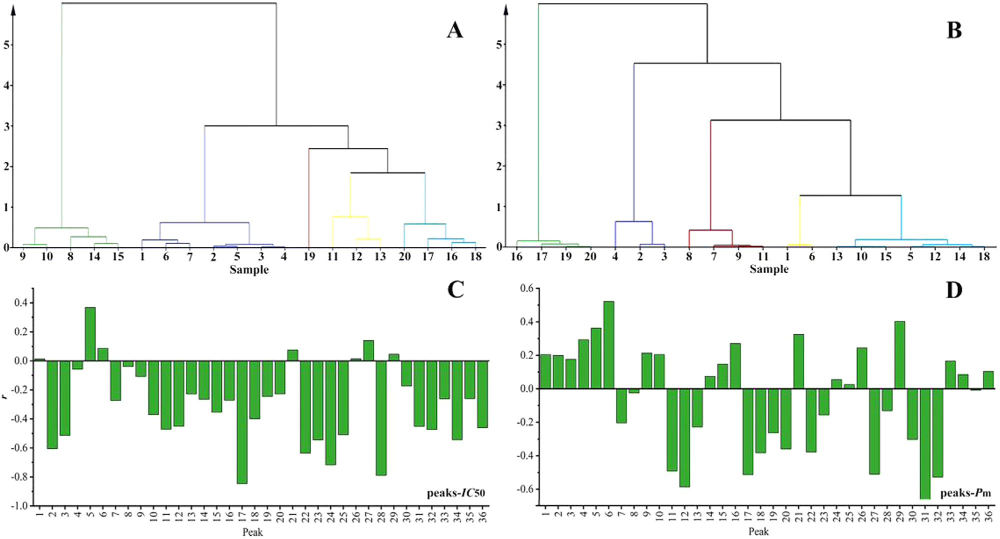

<!-- 方針: ほぼ全訳＋必要に応じた補足。原文構成に沿って訳出。「> 補足:」は訳者注。数値・単位・表は原文ママ。 -->

## 書誌情報

- 原題: High performance liquid chromatography three-wavelength fusion fingerprint combined with electrochemical fingerprint and antioxidant method to evaluate the quality consistency of Mingmu Dihuang Pill
- 著者: Xiang Li、Dandan Gong、Guoxiang Sun（責任著者）、Hong Zhang（責任著者）、Wanyang Sun（責任著者）
- 所属: 瀋陽薬科大学 薬学院／生命科学・生物製薬学院（中国遼寧省瀋陽）、暨南大学 薬学院（中国広州）
- 掲載: *Journal of Chromatography A* 1681 (2022) 463448. https://doi.org/10.1016/j.chroma.2022.463448
- インパクトファクター: **3.8**（*Journal of Chromatography A*, JCR 2024 / Clarivate, Q1。分析化学・分離科学の代表的国際誌。出典により3.8〜4.2の幅がある）
- 受領 2022-04-24 / 改訂 2022-08-13 / 採録 2022-08-22 / オンライン公開 2022-08-28
- 競合利益: 著者は競合利益なしと宣言。助成: 中国国家自然科学基金（No. 81573586）

> 補足: 明目地黄丸（Mingmu Dihuang Pill, MMDHP）は、熟地黄・山茱萸（サンシュユ果実, cornus）・牡丹皮（peony bark）・白芍（white peony）・煆石決明（calcined cassia＝石決明）など**12種の生薬**からなる中国の伝統処方（濃縮丸）で、肝腎を養い視力を助ける効能があり、臨床では肝腎陰虚・畏光（まぶしさ）・目のかすみに用いられる。本論文は、化学的な指紋（HPLC・電気化学）と生物活性（抗酸化）を統合し、「化学組成が似ているか（定性）」と「各成分の量がそろっているか（定量）」の両面から、20バッチ・6業者の**品質の一致性（バッチ間・業者間で品質がそろっているか）**を評価した2022年の研究。

> 補足（略語）: **TWFFP**＝三波長融合指紋（three-wavelength fusion fingerprint）。複数波長のうち各ピークで最大応答を示す波長の情報を1本のクロマトグラムに融合したもの。**ECFP**＝電気化学指紋（electrochemical fingerprint）。B-Z振動反応系にサンプルを加えたときの電位-時間曲線を指紋とする。**SQFM**＝体系的定量指紋法（systematically quantified fingerprint method）。指紋を定性類似度Smと定量類似度Pmで採点する手法。**QAMS**＝一点校正多成分定量（quantitative analysis of multi-components by single marker）。1つの標準品（内標）と補正係数で複数成分を定量する手法。**CCM**＝検量線法（calibration curve method）。**ABTS**＝2,2'-アジノビス(3-エチルベンゾチアゾリン-6-スルホン酸)を用いる抗酸化能試験（本文の "2,2-diaza-bis(3-ethylbenzothiazole-6-sulfonic acid)" は ABTS ラジカルの表記ゆれ）。

## 要旨（Abstract）

本論文では、明目地黄丸（MMDHP）の品質一致性を共同で探るために、三波長融合指紋（TWFFP）を電気化学指紋（ECFP）および抗酸化法と組み合わせて用いた。TWFFP は複数波長における最大紫外吸収特性を十分に示し、単一波長評価による欠点を補完した。ECFP を確立して特徴パラメータをより深く解析し、すべてのサンプルが電気化学振動系（electrochemical oscillation system）に対して抑制効果を示した。2,2'-アジノビス(3-エチルベンゾチアゾリン-6-スルホン酸)（ABTS）抗酸化試験を用い、ECFP と組み合わせて、TWFFP のピーク面積を用いた指紋-薬効相関（fingerprint-efficacy relationship）を確立した。その結果、**36本の共通ピークのうち15本が、両方の薬効相関に対して同時に重要な寄与**をした。TWFFP と ECFP は体系的定量指紋法（SQFM）によって評価し、HPLC と電気化学のサンプル判別能を階層的クラスター分析（HCA）で議論した。マーカー成分とマクロ定量類似度との関係を計算するために含量百分率（content percentage）を導入した。マーカー成分評価の正確性を解析するため、一点校正多成分定量（QAMS）を探索した。本研究は、複雑な伝統中薬（TCM）およびその複方製剤の品質一致性管理のための、包括的かつ信頼性の高い手法を提供した。

## 1. 序論（Introduction）

伝統中薬（TCM）に対する国内外の注目と認識の高まりに伴い、TCM は臨床応用の過程で大きな発展の機会を得ている。TCM の安全性と有効性は品質および応用価値に直接関係するため、その品質一致性管理は広範な研究の関心を集めてきた。本論文では明目地黄丸（MMDHP）を例に、TCM の安全性・有効性を確保するための参考となり、さらなる思考を促しうる、適切かつ効果的な評価手法を論じる。

HPLC 指紋技術、抗酸化技術、紫外（UV）およびフーリエ変換赤外（FTIR）技術は、TCM の品質一致性評価の分野で良好な応用の見通しをもつ。なかでも HPLC は TCM とその複方製剤の包括的な定性・定量分析に使える。通常、化合物のタイプが異なれば最大 UV 吸収を示す波長も異なり、単一波長ではサンプルの品質を十分に解析できないことがある [1, 2]。そこで本論文では、3つの波長で最大シグナル応答を示すピークを1本の新しいクロマトグラムに融合した**三波長融合指紋（TWFFP）**を導入した。異なる波長の情報を包括的に用いることで、サンプルをより十分に評価できる [3–5]。

HPLC には実験コストが高い・前処理工程が複雑といった限界があるのに比べ、本論文では、簡便・経済的で普及しやすい**電気化学指紋（ECFP）技術**を導入した [6]。ECFP は全成分指紋という特徴をもち、実験調製が簡単で、サンプルは単に粉砕するだけ、あるいは無処理でも済む。TCM とその製剤の品質管理・評価に優れた分析法である [7]。その結果を HPLC の評価結果で補完・比較し、MMDHP の品質一致性を議論する。

MMDHP は熟地黄（rehmannia glutinosa）・山茱萸（cornus）・牡丹皮（peony bark）・白芍（white peony）・煆石決明（calcined cassia）など**12種の生薬**から構成される。肝を養い視力を向上させる効能をもち、臨床では肝腎陰虚・畏光・目のかすみの治療に用いられる [8]。このうち**モロニシド（morroniside）とロガニン（loganin）**は山茱萸の主要な薬理成分で、免疫調節・抗炎症・抗ショック作用をもつ。**パエオノール（paeonol）**は牡丹皮の有効成分の一つで清熱・化瘀の作用をもち、**パエオニフロリン（paeoniflorin）**は抗心筋虚血・血小板凝集抑制・鎮痛・鎮静などの効果をもつ [9–12]。中国薬局方（Chinese Pharmacopoeia）とこれら4化合物の性質を参照し、これらを MMDHP の定量分析のための**4つの品質マーカー（Q-marker）**とした。

本論文では、抗酸化実験 [13]・TWFFP・ECFP を組み合わせて、MMDHP の化学成分と生物活性を包括的に評価した。複雑な MMDHP 系を、体系的定量指紋法（SQFM）と一点校正多成分定量（QAMS）で解析した。MMDHP の定性・定量スコア化は、マクロ定性類似度（S_m）とマクロ定量類似度（P_m）の両方を用いて行った。主成分分析（PCA）と階層的クラスター分析（HCA）で、バッチ間の差を判別する HPLC と ECFP の能力を検証した。結論として、MMDHP の品質一致性が客観的に評価され、TCM とその複方製剤の全体品質を定量的に管理するための新しく実行可能な手法が提供された。

## 2. 材料と方法（Materials and methods）

### 2.1. 試薬・試剤

クロマトグラフィーグレードのメタノール・アセトニトリル、および分析グレードの濃硫酸（98%）はいずれも山東裕王和天下有限公司より購入した。リン酸（クロマトグラフィーグレード）は四川成都科竜化学試剤工場、ヘプタンスルホン酸ナトリウム（sodium heptane sulfonate）は山東中美色譜有限公司、硫酸セリウムアンモニウム四水和物（cerium ammonium sulfate tetrahydrate）は天津博迪化工有限公司より購入した。マロン酸・塩化カリウム・臭素酸カリウムはいずれも天津大茂化学試剤工場より。実験全体で脱イオン水を用い、すべての試薬・化学物質は分析グレードであった。

標準品は次のとおり：モロニシド（MOR、batch No. 25406-64-8、純度 > 98.0%）は成都アルファ生物科技有限公司（中国四川）、ロガニン（LOG、batch No. 111640-200503、純度 > 98.0%）とパエオノール（PAE、batch No. 110708-200506、純度 > 99.8%）は中国薬品生物製品検定所（National Institute for the Control of Pharmaceutical and Biological Products, 北京）、パエオニフロリン（PAEF、batch No. 23180-57-6、純度 > 98.0%）は成都биопурифィ植物化学有限公司（Chengdu Biopurify Phytochemicals Ltd.）より入手した。4つの Q-marker 化合物の構造は Fig. 2 (C) に示す。

20バッチの MMDHP サンプル（S1–S20、濃縮丸）を薬局から収集した（S1–S7 は業者A、S8–S10 は業者B、S11–S13 は業者C、S14・S15 は業者D、S16・S17・S19・S20 は業者E、S18 は業者F より）。

### 2.2. 装置と条件

#### 2.2.1. HPLC 分析

HPLC 実験は Agilent 1100 HPLC シリーズ（Agilent Technologies, 米国）で行った。この装置群にはオンラインデガッサー、低圧混合四元ポンプ、オートサンプラー、カラムオーブン、ダイオードアレイ検出器（DAD）が含まれる。データ取得・解析は OpenLAB CDS ChemStation（Version C.01.07, Agilent Technologies Limited company）で実行した。分離にはクロマトグラフィーカラム **cosmsil C-18（250 mm × 4.6 mm, 5 μm）**を用い、カラム温度は **35 °C** に維持した。移動相は **5 mmol/L ヘプタンスルホン酸ナトリウム + 0.2%（v/v）リン酸水溶液（A）（水相）**と、**アセトニトリル-メタノール（9:1, v/v）（B）（有機相）**。注入量は **10 μL**、流速は **1.0 mL/min** とした。

線形グラジエント溶出プログラムは以下のとおり：

| 時間（min） | A（水相）比 |
|---|---|
| 0–8 | 94 → 88% |
| 8–15 | 88 → 79% |
| 15–22 | 79 → 72% |
| 22–26 | 72 → 60% |
| 26–30 | 60 → 50% |
| 30–40 | 50 → 38% |
| 40–45 | 38 → 94% |

クロマトグラムは **220 nm、236 nm、274 nm、280 nm、326 nm** で抽出・処理した。

#### 2.2.2. 電気化学振動分析

電気化学実験に用いた装置：CHI760D 電気化学ワークステーション（上海華辰儀器有限公司）、DF-101S 集熱式恒温加熱磁力撹拌器（上海力辰邦西儀器科技有限公司）。作用電極は白金電極（CHI 115, 上海華辰儀器有限公司）、参照電極は飽和二重塩橋カロメル電極（Leici 217, 上海儀電科学儀器有限公司）。

測定方法は以下のとおり：MMDHP の均一微粉末 **0.15 g** を、**12 mL の H₂SO₄ 溶液（3.0 mol/L）、6 mL の CH₂(COOH)₂（マロン酸）溶液（0.4 mol/L、0.2 mol/L H₂SO₄ で調製）、3 mL の (NH₄)₄Ce(SO₄)₄ 溶液（0.02 mol/L、0.2 mol/L H₂SO₄ で調製）**とともにセラミック反応装置に加えた。次に電極を反応混合液に入れ、**恒温水槽（35 °C）中で 400 r/min で 3 min 撹拌**し、最後に **3 mL の KBrO₃ 溶液（0.3 mol/L）**を注入した。上記4溶液がブランクの B-Z 振動系であり、サンプルの電位-時間（E-t）曲線を、電位振動が消失するまで収集した。

### 2.3. サンプルおよび標準溶液の調製

MMDHP を **8丸（pills）**秤量し、小さく均一な破片に粉砕した。破片を 25 mL メスフラスコに入れ、超音波バス中 **35 °C で 20 min、80% メタノール**で抽出し、最後に有機フィルターを通して HPLC 分析に供した。電気化学分析用には、MMDHP の8サンプルを乳鉢で完全に磨砕して均一微粉末とし、**0.15 g** を秤量した。

MMDHP の4つの Q-marker を正確に秤量し、メタノールで溶解して原液を得た。最後に原液を混合し、一連の濃度に希釈して検量線を作成した。

### 2.4. 理論

#### 2.4.1. 体系的定量指紋法（SQFM）[14, 15]

SQFM は、TCM 指紋の全体的な定性・定量理論の代表的手法である。指紋試験において、サンプル指紋ベクトル（SFV）は X⃗ = (x₁, x₂…xₙ)、参照指紋ベクトル（RFV）は Y⃗ = (y₁, y₂…yₙ)で、xᵢ・yᵢ はそれぞれ指紋ピーク面積である。X⃗ と Y⃗ のなす角のコサイン値が定性類似度 S_F である。S_F は含量の分布比率において、サンプルと標準指紋の化学組成の類似性を明確に反映できるが、「大きなピークが小さなピークを覆い隠す」という問題がある。RFV Y⃗ を (1,1…1)、SFV を (x₁/y₁, x₂/y₂…xₙ/yₙ) としたときのなす角のコサイン値が比定性類似度 S′_F で、全指紋ピークに等しい重みを与えるが、大きなピークの変化には鈍感になる。要するに、二重の定性類似度（S_F と S′_F）の平均 **S_m がマクロ定性類似度**である。

C は投影含量の類似性で、X⃗ の Y⃗ への投影であり、その性質は S_F に似る（小ピークが大ピークに覆われて情報が失われる）。異なる指紋ピーク面積は相互補償効果をもち、類似度 S_F を補正して定量類似度 P を得る必要がある。P は全ピーク積分値を等しく扱い、小ピークに対応する化学成分の含量変化を正確に反映できる。要するに、二重の定量類似度（C と P）の平均 **P_m がマクロ定量類似度**である。

SQFM は主に S_m と P_m から構成され、これらの値に従ってサンプルを8つの品質グレード（G1–G8）に分ける（Table 1）。これにより TCM 品質の定性・定量評価が実現される。

上記パラメータの式は以下のとおり（S_F = 式(1)、S′_F = 式(2)、S_m = ½(S_F + S′_F) = 式(3)、C = 式(4)、P = 式(5)、P_m = ½(C + P) = 式(6)）。

$$S_F = \cos\theta = \frac{\sum_{i=1}^{n} x_i y_i}{\sqrt{\sum x_i^2}\sqrt{\sum y_i^2}} \quad(1)$$

$$S'_F = \frac{\sum_{i=1}^{n} (x_i/y_i)}{\sqrt{n \sum (x_i/y_i)^2}} \quad(2)$$

$$S_m = \tfrac{1}{2}(S_F + S'_F) \quad(3)$$

$$C = \frac{\sum x_i y_i}{\sum y_i^2}\times 100\% \quad(4)$$

$$P = \frac{\sum x_i}{\sum y_i}\,S_F \times 100\% \quad(5)$$

$$P_m = \tfrac{1}{2}(C + P) \quad(6)$$

#### 2.4.2. 一点校正多成分定量（QAMS）

TCM の組成は複雑で、一部の標準物質は高価または希少なため、成分によっては定量管理が難しい。本論文ではこの問題に対し、4つの Q-marker の含量決定に QAMS を適用した。1成分（安価または入手容易な内標）を測定することで、複数成分の同時決定が実現できる [16]。検出器のフローセルが変わらないという条件下で、一定の線形範囲において主要指標成分の含量には一定の関数関係がある。したがって、QAMS が補正係数を用いて化合物の濃度を計算し含量を得ることが保証される [17–19]。計算式は以下のとおり（補正係数 f_si = 式(7)、C_i = 式(8)）。

$$f_{si} = \frac{f_s}{f_i} = \frac{A_s/C_s}{A_i/C_i} \quad(7)$$

$$C_i = f_{si}\cdot C_s\,\frac{A_i}{C_i} \quad(8)$$

f_si：補正係数、A_s：内標（または試料）のピーク面積、C_s：内標（または試料）の濃度、A_i：ある成分（または試料）のピーク面積、C_i：ある成分（または試料）の濃度。

> 補足: 式(8) は原文どおりに転記した（左辺と右辺に C_i が両方現れる表記）。QAMS の一般的な意図は「内標のピーク面積・濃度と補正係数から、標準品を持たない成分の含量を算出する」ことである。

#### 2.4.3. B-Z 振動系のメカニズム

本論文で研究した電気化学反応は B-Z 振動反応系で、酸化還元反応である。反応機構は、H₂SO₄ 溶液中で Ce⁴⁺ を触媒とし、BrO₃⁻ を介して CH₂(COOH)₂ を酸化するというもの [20]。反応式は Fig. 1 に示す。

反応プロセス全体は Br⁻ を中心に展開すると考えられる。反応において Br⁻ は臨界濃度 [Br⁻]_crit をもち、系内の Br⁻ 濃度が [Br⁻]_crit より高いと式(a)–(d)の反応が、逆に低いと式(e)–(g)の反応が起こる。このプロセス中に Br⁻ の再生がトリガーされる（式(h)）。以上の3プロセスが繰り返されることが、B-Z 振動反応が生じたことを示す。

要するに、B-Z 反応は非平衡閉鎖系である。散逸物質としての CH₂(COOH)₂ は式(d)の反応を遅らせるが、適時に補充されないと系の反応速度を直接・間接に高め、反応は最終的に平衡に達する。生薬を加えると、サンプル中の還元性成分が BrO₃⁻ と反応して系の正常な動作を妨害し、巨視的には振動を抑制する現象を示す。活性成分含量の異なるサンプルは異なる抑制度をもたらし、したがって異なる電気化学指紋を示す。

![Figure 1. B-Z 振動反応の機構（[Br⁻]>[Br⁻]_crit の式(a)–(d)・[Br⁻]<[Br⁻]_crit の式(e)–(g)・Br⁻ 再生の式(h)）と、代表的な ECFP（S15）および関連特徴パラメータ（A）、ならびに積分後の ECFP と20バッチ MMDHP サンプルの ECFP（B）。](assets/mmdhp-twffp-ecfp-antioxidant/fig1-bz-ecfp.jpeg)

#### 2.4.4. 4つの Q-marker の含量百分率（P_i%）

本論文では、各サンプルにおける4つの Q-marker の含量の P_i%、およびそれらの合計を計算した（式(9)・式(10)）。

$$P_{i\%} = \frac{m_i}{m_{RFPi}} \quad(9)\qquad P_{i\%(SUM)} = \frac{m_{i(SUM)}}{m_{RFPi(SUM)}} \quad(10)$$

m_i：各サンプルにおける各マーカーの含量、m_RFPi：生成した RFP における各マーカーの含量、m_i(SUM)：各サンプルにおける4マーカーの合計含量、m_RFPi(SUM)：生成した RFP における4マーカーの合計含量。

### 2.5. データ解析

クロマト指紋の評価は、研究室が開発したソフトウェア「TCM spectral quantum fingerprint consistency digital evaluation system 4.0（TCM スペクトル量子指紋一致性デジタル評価システム 4.0）」で行った。データ解析には Origin 95、SIMCA 14.1、IBM SPSS Statistics ソフトウェアを用いた。

## 3. 結果と考察（Results and discussion）

### 3.1. メソッドバリデーション

研究した HPLC 指紋の適用性を確保するため、精度（precision）と併行精度（repeatability）をそれぞれ実施した。精度は同一サンプル溶液を6回連続分析して算出した。併行精度は、同一実験条件で調製した6つの並行サンプル溶液を注入して試験した。

LOG ピークを基準ピークとして、**23本の共通ピーク**の相対保持時間（RRT）と相対ピーク面積（RPA）の相対標準偏差（RSD）を算出し、精度と併行精度を評価した。4つの Q-marker の RRT と RPA について、精度・併行精度の RSD 値はそれぞれ **1.46% 未満・3.06% 未満**であった。正確性は標準添加法で回収率を求めて評価した。4つの Q-marker の平均回収率は **94.0〜104.0%**、RSD は **1.0% 未満**であった。

ピーク面積を従属変数（Y軸）、溶液濃度を独立変数（X軸）として4つの Q-marker の検量線を作成し、検出限界（LOD）・定量限界（LOQ）を検量線から推定した。結果（Table 2）は、対象濃度範囲内でピーク面積が成分濃度と良好な線形関係をもち、相関係数 **r ≥ 0.999** であることを示した。結論として、確立した HPLC 指紋は4つの Q-marker の含量を正確に決定でき、本法は正確・信頼できるものであった。

ECFP については、併行精度を検証するためサンプル（S8）を 2.2.2 の方法で6回測定し、いくつかの特徴パラメータの RSD を算出した（Fig. 1(A)）。その結果、誘導時間（t_ind）・振動終了時間（t_oe）・振動寿命（t_ol）・ピーク頂電位（E_pt）・振動開始電位（E_os）・振動終了電位（E_oe）・振動周期（τ_op）・最大振幅（E_max）の RSD はそれぞれ **6.78%、4.50%、4.53%、0.68%、1.53%、0.33%、3.82%、3.69%**であった。平均 RSD は **3.23%** で、良好な併行精度を示した。総じて、本論文で確立した ECFP は正確・信頼でき、20サンプルの指紋分析に使用できた。

**Table 2. MOR・LOG・PAEF・PAE の線形回帰式・直線性・LOD・LOQ。**

| 化合物 | 回帰式 | r | 直線範囲（μg/mL） | LOD（ng） | LOQ（ng） |
|---|---|---|---|---|---|
| MOR（モロニシド） | y = 16608x + 15.458 | 0.9998 | 4.1–248 | 3.07 | 9.31 |
| LOG（ロガニン） | y = 15475x − 27.968 | 0.9992 | 2.5–150.6 | 4.50 | 13.64 |
| PAEF（パエオニフロリン） | y = 13281x − 17.924 | 0.9998 | 6.5–390 | 5.66 | 17.16 |
| PAE（パエオノール） | y = 26520x − 3.1866 | 1.0000 | 2.7–160 | 0.45 | 1.35 |

> 補足: 直線範囲の単位は原文どおり μg/mL、LOD/LOQ の単位は原文どおり ng（注入量あたりの絶対量として記載）。

### 3.2. HPLC 指紋分析

#### 3.2.1. 三波長融合指紋（TWFFP）分析

Fig. 2(A) の3D スペクトログラムから得た MMDHP 中の対象分析物の吸収極大に従い、より多くの成分情報を得るためのモニタリング波長として **236、274、326 nm** を選んだ。Fig. 2(C) のとおり各波長は異なる吸収シグナルを示し、Table 1 も波長ごとのサンプルグレードの明らかな違いを示した。これは単一波長が表す情報が限られ、全化学情報の指紋を一般化できないことを意味する。本研究では単一波長指紋の欠点を克服するため TWFFP を用い、「TCM spectral quantum fingerprint consistency digital evaluation system 4.0」で 236・274・326 nm の3検出波長における極大スペクトルを構築した。各波長で最大応答をもつピークを TWFFP の新しいピークとして選び、より包括的で豊富なサンプル情報を得た。過去の経験に基づき、サンプル（S1）を代表する新クロマトグラムを得るために融合時間窓を **0.1 min** とした。20の MMDHP サンプルは3波長で **23本（236 nm）・26本（274 nm）・22本（326 nm）**のピークを含み、**TWFFP は36本**のピークを含む（Fig. 2(B)）。単一波長クロマトグラフィーと比べ、新生成された TWFFP は不純物ピークの影響を低減し、有効なピーク情報を完全に保持できた。

#### 3.2.2. 主成分分析（PCA）

TWFFP の品質判別能を調べるため、多変量データの次元を削減してサンプルと指紋ピークの相関を確立する PCA を選んだ [3, 21]。20サンプルの36共通ピーク面積を Origin ソフトにインポートし、得られた最初の4主成分がデータ分散の **80.55%** を説明した。PC1・PC2 を横軸・縦軸として、20観測値・36変数を含む二次元行列を構築した（Fig. 3(A)、カラーのスコアプロットと青のローディングプロットを含む）。スコアプロットから、本法は異なる業者のサンプルを明確に判別でき、同一業者のサンプルは良好な一致性を示した。同一業者の S1–S7 は1つのクラスターに集まり、PC1 と負・PC2 と正の相関。同一業者の S8–S10 および S14・S15 はいずれも PC1・PC2 と負の相関。S11–S13 と S16–S20 は PC1 と正の相関で、同時に S11–S13 と S16 は PC2 と負、S17–S20 は PC2 と正の相関であった。青のローディングプロットは、元の指紋ピークの合成変数への寄与を直感的に理解する助けとなり、化合物ごとの全体への影響力の違いを定性的に解析して主要変数を特定する。Fig. 3(C) によれば、定量的観点では、異なる指紋ピークが表す物質は含量の違いにより異なる寄与値をもち、それがサンプルの分類傾向の違いを生む。以上の2図の比較から、確立した PCA モデルはサンプル中の物質含量の違いに応じて20サンプルを判別できることが分かる。

#### 3.2.3. TWFFP の SQFM 評価

20バッチの TWFFP を評価ソフト「TCM Spectral Quantum Fingerprint Consistency Digital Evaluation System 4.0」にインポートし、平均法で全サンプルの参照指紋（RFP）を生成した。これにより、サンプルのピーク面積と含量の関係をさらに検証し、サンプルの定性・定量類似性を解析できた。

RFP を標準として S_m・P_m を計算した（Table 1）。Table 1 のとおり、全サンプルの **S_m 値は 0.899–0.992** の範囲にあり、全サンプルが類似した化学組成を含むことを示す。**P_m 値は 64.3%〜136.7%** で大きな差があり、サンプル間の化学成分含量がかなり異なることを示す。Fig. 3(B) から、異なる業者のサンプルのグレードは5段階（1〜5）に分かれると解析した。同時に、S1–S7 のような同一業者のサンプルでも P_m の変化により微妙なグレード変化があった。全サンプルを通じて **S_m は緩やかに変動し、P_m は大きく変動**し、それが異なるサンプルのグレードに影響した。明らかに、P_m がグレード評価により大きく寄与し、定性組成ではなく**定量組成がサンプルの分化の原因**であった。

さらに、4マーカーの含量測定結果と SQFM で得た P_m 値の関係を調べた。P_i% と P_m の相関（Fig. 3(D)）は、MOR・LOG・PAEF・PAE とその合計の相関係数がそれぞれ **0.7310、0.6871、0.9702、0.6223、0.9392**であることを示した。P_i% と P_m にはある程度の相関があり、とくに PAEF の P_i% と4 Q-marker の合計は比較的高い相関であった。したがって、SQFM はサンプルの含量を正確に解析できると結論した。

> 補足: 原文の Fig. 3 キャプションは各小図の対応が入れ替わっている（本文の記述と図の中身に照らすと、(B)＝S_m/P_m/グレードの推移、(C)＝4マーカー含量の積み上げ棒、(D)＝P_i% vs P_m 回帰、が実際の内容）。上のキャプションは図の実際の中身に合わせて訳した。

#### 3.2.4. TWFFP の階層的クラスター分析（HCA）[22]

S_m・P_m を SIMCA ソフトにインポートし、HCA で SQFM がサンプルの一致性と差を明確に判別できるか調べた。Fig. 4(A) のとおり、本法はサンプルを大まかに **5カテゴリー**に分けた：S8–S10・S14・S15 が1カテゴリー、S1–S7 が1カテゴリー、S19 が単独で1カテゴリー、4番目に S11–S13、5番目に S16–S18・S20。これら5分類は各バッチの業者とよく一致し、SQFM がサンプルの一致性・差の解析に信頼できることを示す。同時に、HCA が示すクラスタリングは PCA モデルのサンプル間相関結果と一致し、両手法がサンプルの性質と含量の相関を正確に記述できることを示した。要するに、SQFM は各成分に由来する潜在的な差やサンプル全体の品質一致性を解析でき、TCM とその複方製剤の全体品質を管理する包括的・簡便・信頼できる手法として使える。

### 3.3. QAMS による4 Q-marker 含量の評価

本実験では、サンプル定量のため4つの Q-marker を調べ、MMDHP の含量決定において **QAMS が検量線法（CCM）を代替できるか**を検証しようとした。まず CCM で、Table 2 の線形回帰式により MOR・LOG・PAEF・PAE の含量を計算した。次に 2.4.2 の QAMS 計算法に従い、**PAEF を内標**（良好なピーク形状・高いシグナル強度・他ピークからの高い分離度）として他3マーカーの含量を計算した。2手法で得たマーカー含量を比較し、QAMS の信頼性を検証した。

CCM と QAMS で得た含量の比 **r_C/Q**（1に近いほど両手法の含量結果が類似）を計算した（Table 3）。同時に t 検定で統計解析し、両手法の含量値を SPSS にインポートした。その結果、他3マーカーの **P 値は 0.920、0.875、0.980**でいずれも 0.05 より大きく、有意差はなかった。以上より両手法に有意差はなく、QAMS は MMDHP 中の4マーカーの含量を同時かつ正確に決定できた。

**Table 3. CCM 法・QAMS 法でそれぞれ計算した4 Q-marker の含量（mg/g）と、両者の含量比 r_C/Q。**（PAEF は QAMS の内標のため CCM と同値。r_C/Q は MOR・LOG・PAE の3列のみ）

| サンプル | CCM MOR | CCM LOG | CCM PAEF | CCM PAE | QAMS MOR | QAMS LOG | QAMS PAEF | QAMS PAE | r_C/Q MOR | r_C/Q LOG | r_C/Q PAE |
|---|---|---|---|---|---|---|---|---|---|---|---|
| S1 | 1.0461 | 1.1199 | 3.0369 | 0.9359 | 1.0400 | 1.1517 | 3.0369 | 0.9439 | 1.0059 | 0.9724 | 0.9915 |
| S2 | 1.1017 | 1.2471 | 2.8433 | 0.5970 | 1.0951 | 1.2868 | 2.8433 | 0.6017 | 1.0060 | 0.9691 | 0.9922 |
| S3 | 1.1341 | 1.3052 | 2.9445 | 0.7892 | 1.1265 | 1.3479 | 2.9445 | 0.7959 | 1.0067 | 0.9683 | 0.9916 |
| S4 | 1.1179 | 1.2624 | 2.8627 | 0.7506 | 1.1107 | 1.3031 | 2.8627 | 0.7569 | 1.0065 | 0.9688 | 0.9917 |
| S5 | 1.1687 | 1.2035 | 3.0992 | 0.4895 | 1.1598 | 1.2400 | 3.0992 | 0.4926 | 1.0077 | 0.9706 | 0.9937 |
| S6 | 1.0641 | 1.1785 | 2.9565 | 0.9718 | 1.0580 | 1.2138 | 2.9565 | 0.9805 | 1.0058 | 0.9709 | 0.9911 |
| S7 | 0.7403 | 0.8234 | 2.3889 | 0.8829 | 0.7422 | 0.8398 | 2.3889 | 0.8923 | 0.9974 | 0.9805 | 0.9895 |
| S8 | 0.7477 | 0.8964 | 2.2627 | 0.6660 | 0.7501 | 0.9174 | 2.2627 | 0.6729 | 0.9968 | 0.9771 | 0.9897 |
| S9 | 0.8239 | 0.7421 | 1.7942 | 0.6522 | 0.8278 | 0.7553 | 1.7942 | 0.6609 | 0.9953 | 0.9825 | 0.9868 |
| S10 | 0.5580 | 0.7496 | 1.8889 | 0.6229 | 0.5651 | 0.7631 | 1.8889 | 0.6306 | 0.9874 | 0.9823 | 0.9878 |
| S11 | 1.7502 | 1.9147 | 5.1323 | 1.8196 | 1.7274 | 1.9828 | 5.1323 | 1.8323 | 1.0132 | 0.9657 | 0.9931 |
| S12 | 1.5131 | 1.7720 | 5.5171 | 1.6476 | 1.4972 | 1.8293 | 5.5171 | 1.6587 | 1.0106 | 0.9687 | 0.9933 |
| S13 | 1.3284 | 1.6438 | 4.8681 | 1.0983 | 1.3165 | 1.6964 | 4.8681 | 1.1055 | 1.0090 | 0.9690 | 0.9935 |
| S14 | 1.4686 | 1.3228 | 2.2546 | 1.3078 | 1.4641 | 1.3660 | 2.2546 | 1.3258 | 1.0031 | 0.9684 | 0.9864 |
| S15 | 1.5077 | 1.2389 | 2.3546 | 1.1677 | 1.5021 | 1.2759 | 2.3546 | 1.1829 | 1.0037 | 0.9710 | 0.9872 |
| S16 | 1.4673 | 1.1057 | 4.1386 | 1.1645 | 1.4506 | 1.1333 | 4.1386 | 1.1728 | 1.0115 | 0.9756 | 0.9929 |
| S17 | 1.4166 | 0.8977 | 4.1605 | 1.0816 | 1.4012 | 0.9135 | 4.1605 | 1.0891 | 1.0110 | 0.9827 | 0.9931 |
| S18 | 1.3680 | 1.3673 | 4.5082 | 0.9917 | 1.3522 | 1.4095 | 4.5082 | 0.9979 | 1.0117 | 0.9701 | 0.9938 |
| S19 | 1.8199 | 1.1436 | 3.8965 | 1.0025 | 1.7957 | 1.1740 | 3.8965 | 1.0097 | 1.0135 | 0.9741 | 0.9929 |
| S20 | 2.0326 | 1.2004 | 4.1917 | 0.7706 | 2.0026 | 1.2337 | 4.1917 | 0.7753 | 1.0150 | 0.9730 | 0.9939 |

補正係数：f_si−MOR = 0.7773、f_si−LOG = 0.9006、f_si−PAE = 0.5024

> 補足: r_C/Q はほぼすべて 0.99〜1.02 に収まり、QAMS（標準品1つ＝PAEF のみ使用）と CCM（各成分の検量線）の差が非常に小さいことを数値で示している。含量の絶対値を見ると、業者Cの S11–S13 と業者Eの S16–S20 で PAEF が 4〜5.5 mg/g と高く、業者B（S8–S10）では 1.8〜2.3 mg/g と低い。業者間で各成分量が大きく変動している点は、指紋（定性）が似ていても含量（定量）がそろわないという MMDHP の品質一致性の課題を裏づける。

### 3.4. 電気化学指紋（ECFP）分析

Table 4 は MMDHP の ECFP の8特徴パラメータを記録したものである。このうち t_ind は人為的な注入による主観的因子の影響を大きく受ける。t_oe・E_pt・E_os・E_oe・τ_op の RSD はいずれも 8 未満で、これら5パラメータは全バッチで大きな違いがなく、サンプル間の差を十分に反映できなかった。そこで、電気化学的なサンプル品質評価の主な根拠として **t_ol（振動寿命）と E_max（最大振幅）**を用いた。

電気化学データをさらに解析するため、「TCM spectral quantum fingerprint consistency digital evaluation system 4.0」を革新的に用いて **ECFP を積分してピーク面積を得**、そこから S_m・P_m を得た。Fig. 1(B) は MMDHP サンプルの B-Z 振動系の非線形曲線と積分曲線を示す。電気化学は実際には、サンプル中の活性成分が B-Z 振動系に及ぼす影響を反映している点が注目される。Table 1 および Fig. 1(B) に対応して、**P_m 値が大きいほどサンプルの t_ol が長く**、すなわち B-Z 振動系への影響が小さく、内部の活性成分含量が低いことを反映する。積分で得た結果が電気化学ソフトで読んだデータと一致するか検証するため、E_max を P_m に線形フィットしたところ、線形方程式は **y = 0.0014x + 0.0701、r = 0.8962** となった。両手法はよく相関し、ECFP を解析する革新的手法が信頼できることが分かった。t_ol と E_max を SIMCA にインポートして HCA 解析した結果（Fig. 4(B)）は、HPLC 法で得た HCA 結果とは一定の違いがあった。理由として、HPLC は特定溶媒に溶けたサンプルの一部成分の吸収特性を特定波長・特定溶出手順で反映するのに対し、電気化学はサンプル中の全活性成分が B-Z 振動反応系で化学反応に関与する能力を反映するため、と考えられる。

**Table 4. 20バッチのサンプルの特徴パラメータのまとめ。**（t_ind：誘導時間、t_oe：振動終了時間、t_ol：振動寿命、E_pt：ピーク頂電位、E_os：振動開始電位、E_oe：振動終了電位、τ_op：振動周期、E_max：最大振幅。最下行は各パラメータの RSD）

| サンプル | t_ind/s | t_oe/s | t_ol/s | E_pt/V | E_os/V | E_oe/V | τ_op/s | E_max/V |
|---|---|---|---|---|---|---|---|---|
| 1 | 26.6 | 2322.6 | 2296 | 1.0260 | 0.8457 | 0.7065 | 23.9 | 0.2277 |
| 2 | 47.9 | 2380.9 | 2333 | 0.9260 | 0.8225 | 0.6397 | 25.2 | 0.1533 |
| 3 | 55.1 | 2425.2 | 2370 | 0.9180 | 0.8088 | 0.6431 | 23.2 | 0.1579 |
| 4 | 43.6 | 2373.6 | 2330 | 0.9295 | 0.8527 | 0.6518 | 25.2 | 0.1293 |
| 5 | 41.0 | 2365.0 | 2324 | 0.9741 | 0.8079 | 0.6641 | 24.9 | 0.2088 |
| 6 | 47.2 | 2473.2 | 2426 | 0.9509 | 0.8344 | 0.6544 | 26.2 | 0.1684 |
| 7 | 39.7 | 2599.8 | 2560 | 0.9852 | 0.8156 | 0.6734 | 25.1 | 0.2051 |
| 8 | 16.2 | 2482.2 | 2466 | 1.0340 | 0.8343 | 0.7084 | 26.5 | 0.2380 |
| 9 | 10.6 | 2502.6 | 2492 | 1.0600 | 0.8915 | 0.7557 | 23.0 | 0.2077 |
| 10 | 11.6 | 2460.7 | 2449 | 1.0620 | 0.8908 | 0.7605 | 24.1 | 0.2024 |
| 11 | 23.4 | 2489.4 | 2466 | 1.0545 | 0.8677 | 0.7416 | 22.3 | 0.2153 |
| 12 | 25.1 | 2295.2 | 2270 | 1.0513 | 0.8835 | 0.7498 | 26.7 | 0.2165 |
| 13 | 48.1 | 2538.1 | 2490 | 1.0226 | 0.8742 | 0.7594 | 27.2 | 0.1973 |
| 14 | 17.8 | 2281.8 | 2264 | 1.0494 | 0.8729 | 0.7541 | 25.9 | 0.2254 |
| 15 | 15.9 | 2388.0 | 2372 | 1.0632 | 0.8735 | 0.7510 | 23.7 | 0.2138 |
| 16 | 25.6 | 2856.6 | 2831 | 1.0424 | 0.8570 | 0.7214 | 24.1 | 0.2380 |
| 17 | 25.0 | 2790.1 | 2765 | 1.0528 | 0.8785 | 0.7387 | 28.1 | 0.2286 |
| 18 | 24.6 | 2291.6 | 2267 | 1.0404 | 0.8495 | 0.7245 | 23.6 | 0.2231 |
| 19 | 35.8 | 2799.9 | 2764 | 1.0348 | 0.8457 | 0.7918 | 24.5 | 0.2372 |
| 20 | 25.2 | 2851.3 | 2826 | 1.0318 | 0.857 | 0.7249 | 23.6 | 0.2295 |
| RSD | 44.34 | 7.51 | 8.25 | 4.84 | 3.08 | 6.42 | 6.17 | 14.92 |

### 3.5. TWFFP の指紋-薬効相関分析

電気化学・HPLC・抗酸化実験 [13] の関係を探り、サンプル品質評価におけるこれら3手法の信頼性を検証するため、TWFFP の36ピークを橋渡しとして、ピークと ECFP の P_m の相関、およびピークと IC₅₀ 値の相関を調べた。結果は Pearson の相関係数 r で表した（Fig. 4(C)(D)）。原理上、IC₅₀ 値が小さいほどサンプルの抗酸化能は強く、peaks-IC₅₀ は負相関になるはず。同様に、サンプル中の活性成分が多いほど ECFP の P_m 値は小さくなり、peaks-P_m も負相関になる。peaks-IC₅₀ のグラフでは **29ピークが IC₅₀ と負相関（r < 0）**で、サンプル中のほとんどの化合物が抗酸化実験で役割を果たしたことを示す。peaks-P_m のグラフでは **16ピークが P_m と負相関（r < 0）**で、この16ピークのうち **15ピークは IC₅₀ とも負相関**であった。要するに、電気化学法と抗酸化法の評価結果は類似し、互いを支持でき、MMDHP 中の抗酸化成分を効果的に反映できた。同時に、負相関となるピークの比率は2つの指紋-薬効相関で異なり、これは電気化学法と抗酸化法の反応系の違いによると考えられる。また、両手法における共通ピークの寄与を客観的・包括的に示した。明らかに、本研究の結果は MMDHP の化学的特性と薬理活性の参考を提供できる。

## 4. 結論（Conclusion）

本論文では、20の MMDHP の TWFFP を確立し、従来の単一波長分析の欠点を克服して、サンプルの品質を包括的に解析できるようにした。PCA と SQFM により、サンプルの全体品質を定性・定量の両面から判別・評価した。次に HCA で SQFM の信頼性を検証し、あわせて PCA の実用性を側面から裏づけた。SQFM と QAMS を組み合わせ、MMDHP 中の4つの Q-marker の包括的・正確な定量決定を達成した。ECFP は複雑な前処理なしで構築され、TCM 複方製剤に豊富で定量可能な情報を提供した。ECFP のサンプル判別能を探るため、電気化学的なシグネチャー読み値を用いて HCA 解析を行った。peak-IC₅₀ および peak-P_m の指紋-薬効相関図を描き、ABTS と ECFP の評価結果に対する TWFFP 指紋ピークの寄与を議論した。いずれもサンプル中の有効成分を予測する良好な能力を示し、生物活性化合物の予測に良い方向性を提供した。最も重要なことに、本研究で提案した手法は、MMDHP の全体的な化学組成を定性・定量に評価できるだけでなく、TCM とその複方製剤の品質に対する革新的な電気化学的積分手法も提供した。最終的に、TCM の品質と有効性のデュアルコントロールを実現し、信頼できる考え方を提示した。

## 訳者補足

- **この論文の位置づけ**: 本研究は瀋陽薬科大学 Guoxiang Sun らのグループによる一連の「多波長融合指紋＋電気化学指紋＋抗酸化」研究（参考文献 [1][3][4][5][19][20][21] など）の系譜にある。特徴は、(1) HPLC の複数波長を1本に融合する **TWFFP**、(2) 前処理不要で全成分を反映する **ECFP（B-Z 振動）**、(3) 生物活性としての **ABTS 抗酸化**、を組み合わせ、これらを **SQFM の Sm（定性）・Pm（定量）**という共通のものさしで採点する点にある。
- **実務的な読みどころ**: (a) 全サンプルの S_m は 0.899–0.992 と高く「化学組成のパターンは似ている」が、P_m は 64.3%〜136.7% と幅広く「量はそろっていない」。品質差の主因は定性ではなく定量にある、という結論は多成分処方の品質管理で繰り返し現れるパターン。(b) QAMS（内標＝PAEF の1標準品だけで4成分を推定）と CCM（各成分の検量線）が t 検定で有意差なし（P>0.05）・r_C/Q≈0.99〜1.02 であり、標準品が高価・希少な成分の定量を QAMS で代替できる裏づけになっている。(c) 指紋-薬効相関で「36ピーク中15ピークが抗酸化と ECFP の両方に寄与」という結果は、どのピーク（成分）を Q-marker 候補として重点管理すべきかの手がかりになる。
- **限界（原文の記述から）**: 個々の共通ピークの化合物同定は4 Q-marker 以外はなされておらず、指紋-薬効相関で寄与が高いとされたピークの化学的実体は特定されていない。ABTS の IC₅₀ の具体値は Table 1 の1列として掲載されるのみで、抗酸化アッセイの詳細条件（濃度系列等）は本文では簡略。図 S 等の補足資料は本体 PDF に含まれないため本稿では扱わない。
- **雑誌 IF について**: *Journal of Chromatography A* の JCR 2024 インパクトファクターは出典により 3.8〜4.2 の幅がある（Clarivate 系の集計で概ね約3.8〜4）。本稿では代表値として 3.8 を採用し、幅がある旨を明記した。
