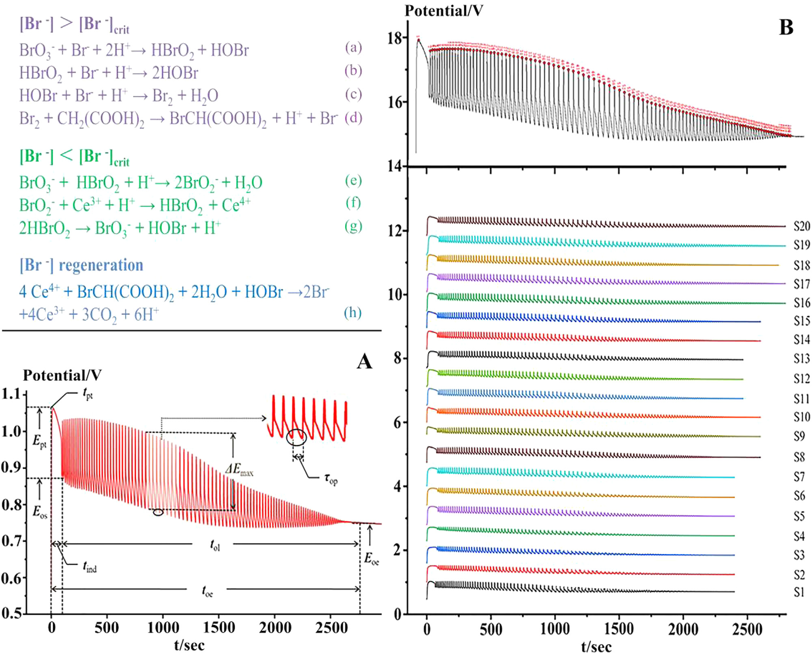
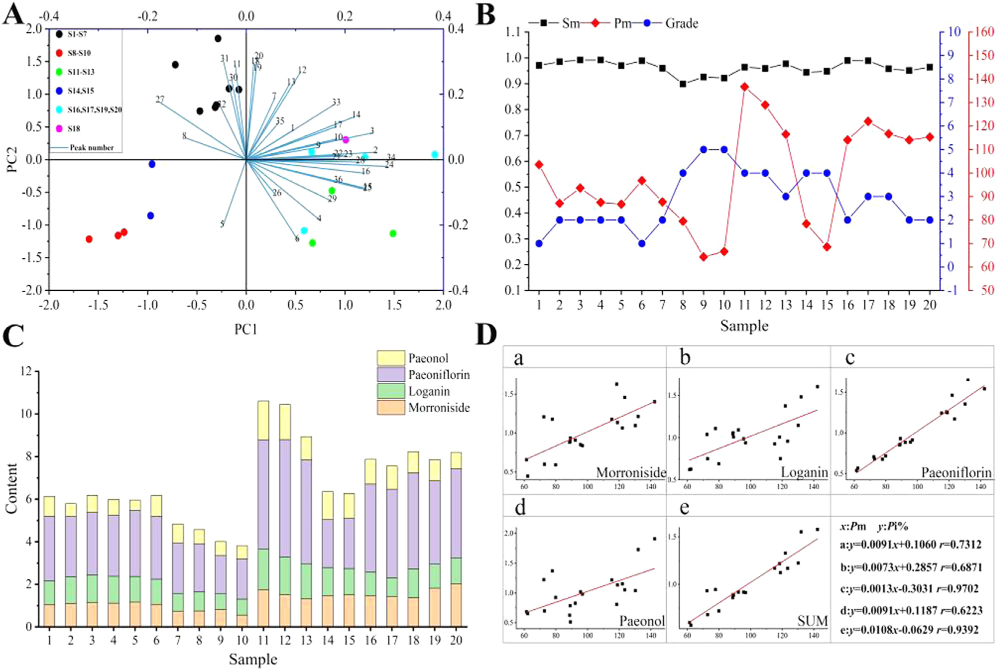

<!-- 方針: ほぼ全訳＋必要に応じた補足。原文構成に沿って訳出。「> 補足:」は訳者注。 -->

## 書誌情報

- 標題（原題）: High performance liquid chromatography three-wavelength fusion fingerprint combined with electrochemical fingerprint and antioxidant method to evaluate the quality consistency of Mingmu Dihuang Pill
- 著者・所属: Xiang Li（a）, Dandan Gong（a）, Guoxiang Sun（a、責任著者）, Hong Zhang（b、責任著者）, Wanyang Sun（c、責任著者）
  - a 瀋陽薬科大学 薬学院（School of Pharmacy, Shenyang Pharmaceutical University）, 遼寧省瀋陽, 中国
  - b 瀋陽薬科大学 生命科学・生物薬学院（School of Lifescience and Biopharmaceutics, Shenyang Pharmaceutical University）, 中国
  - c 暨南大学 薬学院（School of Pharmacy, Jinan University）, 広東省広州, 中国
- 掲載誌・巻号・DOI: *Journal of Chromatography A* 1681 (2022) 463448. DOI: 10.1016/j.chroma.2022.463448（ISSN 0021-9673）
- インパクトファクター: 約3.8（*Journal of Chromatography A*, JCR 2024 / Clarivate。情報源により3.8〜4.2の幅で報告されており、正確な単年値は要確認）
- 受理経過 / ライセンス: 受領 2022-04-24 ／ 改訂 2022-08-13 ／ 採録 2022-08-22 ／ オンライン公開 2022-08-28。© 2022 Elsevier B.V. All rights reserved.
- 助成: 国家自然科学基金（National Natural Science Foundation of China, No. 81573586）

> 補足: MMDHP = 明目地黄丸（Mingmu Dihuang Pill）。TWFFP = 三波長融合指紋（Three-Wavelength Fusion Fingerprint）。ECFP = 電気化学指紋（Electrochemical Fingerprint）。SQFM = 系統定量指紋法（Systematically Quantified Fingerprint Method）。QAMS = 単一マーカーによる多成分同時定量法（Quantitative Analysis of Multi-components by Single Marker）。CCM = 標準曲線法（Calibration Curve Method）。PCA = 主成分分析、HCA = 階層的クラスター分析。本論文は分析法開発（品質一貫性評価）の原著研究論文。

## 要旨（Abstract）

本論文では、三波長融合指紋（TWFFP）と電気化学指紋（ECFP）、および抗酸化法を組み合わせて、明目地黄丸（MMDHP）の品質一貫性を共同で探索した。TWFFPは複数波長における最大紫外吸収特性を十分に示し、単一波長評価がもたらす欠点を補った。ECFPを確立して特徴パラメータをより深く解析した結果、すべての試料が電気化学振動系に対して抑制効果を示した。2,2′-アジノビス(3-エチルベンゾチアゾリン-6-スルホン酸)（ABTS）抗酸化試験をECFPと組み合わせ、TWFFPのピーク面積との指紋-薬効相関を確立した。その結果、36の共通ピークのうち15ピークが、両方の薬効相関に同時に重要な寄与をしていた。TWFFPとECFPは系統定量指紋法によって評価され、HPLCと電気化学がそれぞれ試料を判別する能力を階層的クラスター分析（HCA）によって検討した。含量パーセンテージ（Pi%）の概念を導入し、マーカー成分の含量とマクロ定量類似度（Pm）との関係を計算した。単一マーカーによる多成分定量法（QAMS）を検討し、マーカー成分の含量評価の正確性を解析した。本研究は、複雑な漢方薬（TCM）とその複方製剤の品質一貫性管理のための、包括的で信頼性の高い方法を提供するものである。

**キーワード**: 明目地黄丸（Mingmu Dihuang Pill）；三波長融合指紋（Three-wavelength fusion fingerprint）；電気化学指紋（Electrochemical fingerprint）；抗酸化試験（Antioxidant test）；品質一貫性（Quality consistency）

## 1. 序論（Introduction）

漢方薬（TCM）は国内外で注目と認知が高まりつつあり、臨床応用の過程で大きな発展の機会を得ている。TCMの安全性・有効性は品質・応用価値と直接関わるため、その品質一貫性管理は広く研究の関心を集めてきた。本論文では、明目地黄丸（MMDHP）を例に取り、適切かつ効果的な評価法を論じることで、TCMの安全性・有効性の確保に向けた参考と、さらなる検討を促すことを目指す。

高速液体クロマトグラフィー（HPLC）指紋技術、抗酸化技術、紫外（UV）およびフーリエ変換赤外（FTIR）技術は、TCMの品質一貫性評価の分野において良好な応用展望を持つ。なかでもHPLCは、TCMおよびその複方製剤の包括的な定性・定量分析に利用できる。通常、異なる種類の化合物は異なる波長で最大紫外吸収を示すため、単一波長では試料の品質を十分に分析できない場合がある[1,2]。そこで本論文では三波長融合指紋（TWFFP）を導入し、3つの波長で最大の信号応答を示すピークを統合して新しいクロマトグラムを構成した。異なる波長での情報を包括的に利用することで、試料をより十分に評価できる[3–5]。

HPLCの限界（高い実験コストや複雑な前処理工程など）と比較して、本論文ではシンプルで経済的、普及しやすい電気化学指紋（ECFP）技術を導入した[6]。ECFPは全成分指紋という特徴を持ち、実験調製が簡便で、試料は単純に粉砕するだけ、あるいは前処理なしで済む。TCMおよびその製剤の品質管理・評価のための良好な分析法である[7]。得られた結果は、HPLCの評価結果と比較・補完し、MMDHPの品質一貫性を検討するために用いた。

MMDHPは、地黄（rehmannia glutinosa）、山茱萸（cornus）、牡丹皮（peony bark）、白芍（white peony）、煅制の決明子（calcined cassia）など12種類の生薬から構成される。肝腎を滋養し視力を改善する効能を持ち、臨床では肝腎不足・羞明・視力不明瞭の治療に用いられる[8]。このうち、モロニシド（morroniside）とロガニン（loganin）は山茱萸の主要な薬理成分であり、免疫調節・抗炎症・抗ショック作用を持つ。パエオノール（paeonol）は牡丹皮の活性成分の一つで清熱・活血化瘀の作用を持ち、シャクヤク配糖体（paeoniflorin）は抗心筋虚血・血小板凝集抑制・鎮痛・鎮静などの作用を持つ[9–12]。中国薬局方およびこれら4化合物の性質を参照し、我々はこれらをMMDHPの定量分析のための4つの品質マーカー（Q-marker）として用いた。

本論文では、抗酸化実験[13]、TWFFP、ECFPを組み合わせ、MMDHPの化学組成と生物活性を包括的に評価した。複雑なMMDHP系を、系統定量指紋法（SQFM）と単一マーカーによる多成分定量法（QAMS）によって解析した。MMDHPの定性・定量スコアは、マクロ定性類似度（**S**m）とマクロ定量類似度（**P**m）の両方を用いて行った。主成分分析（PCA）と階層的クラスター分析（HCA）を用いて、HPLCとECFPがバッチ間の差異を判別する能力を検証した。結論として、MMDHPの品質一貫性は客観的に評価され、TCMおよびその複方製剤の全体的な品質の定量管理のための新規かつ実行可能な方法が提供された。

## 2. 材料と方法（Materials and Methods）

### 2.1. 試薬・化学物質

クロマトグラフィー用グレードのメタノール・アセトニトリル、および分析グレードの濃硫酸（98%）はすべて山東裕王河天下有限公司（Shandong YuwangHeTianxia Co., Ltd.）より購入した。リン酸（クロマトグラフィー用グレード）は四川成都科龍化学試薬工場（Sichuan Chengdu Kelong Chemical Reagent Factory）、ヘプタンスルホン酸ナトリウムは山東中美クロマトグラフィー有限公司（Shandong Zhongmei Chromatography Co., Ltd.）、四水和硫酸第二セリウムアンモニウムは天津博迪化学有限公司（Tianjin Bodi Chemical Co., Ltd.）から購入した。マロン酸・塩化カリウム・臭素酸カリウムはいずれも天津大茂化学試薬工場（Tianjin Damao Chemical Reagent Factory）から入手した。実験には脱イオン水を使用し、すべての試薬・化学物質は分析グレードであった。

モロニシド（MOR、バッチNo. 25406-64-8、純度＞98.0%）は成都アルファ生物技術有限公司（Chengdu alfa biotechnology Co., Ltd., 四川, 中国）から購入した。ロガニン（LOG、バッチNo. 111640-200503、純度＞98.0%）とパエオノール（PAE、バッチNo. 110708-200506、純度＞99.8%）は中国食品薬品検定研究院（National Institute for the Control of Pharmaceutical and Biological Products, 北京, 中国）から購入した。シャクヤク配糖体（PAEF、バッチNo. 23180-57-6、純度＞98.0%）は成都Biopurify Phytochemicals社から入手した。4つのQ-marker化合物の構造は図2(C)に示した。

20バッチのMMDHP試料（S1〜S20、濃縮丸）を薬局から収集した（S1〜S7は製造元A、S8〜S10は製造元B、S11〜S13は製造元C、S14・S15は製造元D、S16・S17・S19・S20は製造元E、S18は製造元F）。

### 2.2. 装置と条件

#### 2.2.1. HPLC分析

HPLC実験はAgilent 1100 HPLCシリーズ機器（Agilent Technologies, USA）で行った。この機器一式にはオンライン脱気装置、低圧混合四元ポンプ、オートサンプラー、カラムオーブン、フォトダイオードアレイ検出器（DAD）が含まれる。データ取得・解析はOpenLAB CDS ChemStation（Version C.01.07, Agilent Technologies Limited company）で行った。分離にはCosmosil C18カラム（250 mm × 4.6 mm, 5 μm）を用い、カラム温度は35 ℃に保った。移動相はA（水相）が5 mmol/Lヘプタンスルホン酸ナトリウム＋0.2%（v/v）リン酸水溶液、B（有機相）がアセトニトリル-メタノール（9:1, v/v）であった。注入量10 μL、流速1.0 mL/min。直線グラジエント溶出プログラムは以下のとおりであった：94–88%A（0–8分）；88–79%A（8–15分）；79–72%A（15–22分）；72–60%A（22–26分）；60–50%A（26–30分）；50–38%A（30–40分）；38–94%A（40–45分）。クロマトグラムは220 nm、236 nm、274 nm、280 nm、326 nmで抽出・処理した。

#### 2.2.2. 電気化学振動解析

電気化学実験に使用した機器は、CHI760D電気化学ワークステーション（上海華辰儀器有限公司）、DF-101S集熱式恒温加熱磁力撹拌器（上海力辰邦西儀器科技有限公司）であった。作用電極は白金電極（CHI 115, 上海華辰儀器有限公司）、参照電極は飽和二重塩橋甘汞電極（Leici 217, 上海儀電科学儀器股份有限公司）を用いた。

測定法は以下のとおりであった：MMDHPの均一微粉末0.15 gをセラミック反応装置に入れ、H2SO4溶液（3.0 mol/L）12 mL、CH2(COOH)2溶液（0.4 mol/L、0.2 mol/L H2SO4溶液で調製）6 mL、(NH4)4Ce(SO4)4溶液（0.02 mol/L、0.2 mol/L H2SO4溶液で調製）3 mLを加えた。次に電極を反応混合溶液に入れ、恒温水浴装置（35 ℃）中で400 r/minの速度で3分間撹拌した後、KBrO3溶液（0.3 mol/L）3 mLを注入した。上記4種の溶液は空白のB-Z振動系であり、電位振動が消失するまで試料の電位-時間（E-t）曲線を収集した。

### 2.3. 試料・標準溶液の調製

MMDHP 8丸を秤量し、小さく均一な破片に粉砕した。破片を25 mLメスフラスコに入れ、35 ℃・超音波浴中で80%メタノールにより20分間抽出し、最後に有機フィルターを通してHPLC分析に供した。MMDHP 8試料を乳鉢で均一な微粉末に十分に粉砕し、0.15 gを秤量して電気化学分析に用いた。

MMDHPの4つのQ-markerを正確に秤量し、メタノールに溶解して原液を得た。最終的に原液を混合し、一連の濃度に希釈して検量線を作成した。

### 2.4. 理論

#### 2.4.1. 系統定量指紋法（SQFM）[14,15]

SQFMは、TCM指紋の全体的な定性・定量理論の代表的な方法である。指紋試験において、試料指紋ベクトル（SFV）はX = (x1, x2…xn)、参照指紋ベクトル（RFV）はY = (y1, y2…yn)であり、xi・yiはそれぞれの指紋ピーク面積である。XとYのなす角の余弦値を計算したものが定性類似度**S**Fである。**S**Fは、含量の分布比における試料と標準指紋の化学組成の類似性を明確に反映できる。しかし、大きいピークが小さいピークをマスクしてしまう問題がある。RFV Yを P0=(1,1…1) とし、SFV Xを P0=(x1/y1, x2/y2…xn/yn) とすると、そのなす角の余弦値は「比率定性類似度」**S**′Fとなる。これはすべての指紋ピークに等しい重みを与えるが、大きなピークの変化には鈍感になる。まとめると、この二重定性類似度（**S**Fと**S**′F）の平均値がマクロ定性類似度**S**mと呼ばれる。

**C**は投影含量の類似度であり、XのYへの射影である。その特性は**S**Fと類似しており、すなわち小さいピークが大きいピークに覆われて情報が失われやすい。異なる指紋ピーク面積には相互補償効果があるため、類似度**S**Fを補正して定量類似度**P**を得る必要がある。**P**はすべてのピーク積分値を等しく扱い、小さいピークに対応する化学成分の含量変化を正確に反映できる。まとめると、この二重定量類似度（**C**と**P**）の平均値がマクロ定量類似度**P**mと呼ばれる。

SQFMは主に**S**mと**P**mから構成され、試料はこれらのパラメータの値に応じて8つの品質グレード（G1–G8）に分類される（表1）。その後、TCMの品質の定性・定量評価が実現される。

上記パラメータの表現式は以下の式のとおりである（原文の数式は組版の都合上、一部の下付・分数表記がOCR抽出で判読困難であり、正確な数式表記は原文図表を参照されたい）。

- 式(1) **S**F ＝ cos*θ* ＝ Σ(xi・yi) ／ [√Σxi² ・ √Σyi²]
- 式(2) **S**′F ＝ 比率定性類似度（Yを(1,1,…,1)、Xを(x1/y1,…,xn/yn)としたときのcosθ。原文参照）
- 式(3) **S**m ＝ (1/2)（**S**F ＋ **S**′F）
- 式(4) **C** ＝ [Σ(xi・yi) ／ Σyi²] × 100%
- 式(5) **P** ＝ 定量類似度（**S**Fを補正した値。原文参照）
- 式(6) **P**m ＝ (1/2)（**C** ＋ **P**）

#### 2.4.2. 単一マーカーによる多成分定量分析（QAMS）

TCMの組成は複雑であり、一部の標準物質は高価または希少であるため、一部成分の定量管理が困難である。本論文ではこの問題に対し、4つのQ-markerの含量測定にQAMSを適用した。1つの成分（内部標準、安価または入手容易なもの）を測定することで、複数成分の同時定量が実現できる[16]。検出器のフローセルが不変という条件下では、一定の直線範囲内で主要指標成分の含量間に一定の関数関係が存在する。したがって、QAMS法は補正係数を用いて化合物の濃度を計算し、含量を求めることが保証される[17–19]。関連する計算式は以下のとおりである。

- 式(7) ***f**si* ＝ *fs*／*fi* ＝ (*As*／*Cs*) ／ (*Ai*／*Ci*)
- 式(8) ***C**i* ＝ ***f**si* × (*Ai*／*As*) × *Cs*（成分iの濃度＝補正係数×成分iと内部標準のピーク面積比×内部標準の濃度。原文の表記はOCR上一部不明瞭であり、QAMS法の一般式に基づき補って記載）

***f**si*: 補正係数
***A**s*: 内部標準対照品（または試験試料）のピーク面積
***C**s*: 内部標準対照品（または試験試料）の濃度
***A**i*: 成分対照品（または試験試料）のピーク面積
***C**i*: 成分対照品（または試験試料）の濃度

#### 2.4.3. B-Z振動系のメカニズム

本論文で検討した電気化学反応はB-Z振動反応系であり、酸化還元反応である。反応メカニズムは、H2SO4溶液中でCe4+が触媒として働き、BrO3−を介してCH2(COOH)2を酸化するというものである[20]。反応式は図1に示した。

全体の反応過程はBr−を中心に進行すると考えられる。反応中、Br−には臨界濃度（[Br−]crit）が存在し、系内のBr−濃度が[Br−]critより高い場合は式(a)–(d)に示す反応が起こり、逆にBr−が[Br−]critより低い場合は式(e)–(g)に示す反応が起こる。この過程でBr−の再生が誘発される（式(h)）。上記3つの過程が繰り返されることは、B-Z振動反応が発生していることを示す。

まとめると、B-Z反応は非平衡閉鎖系である。散逸性物質としてのCH2(COOH)2は、式(d)で表される反応を遅くする。もし速やかに補充されなければ、系の反応速度を直接的・間接的に増大させ、反応は最終的に平衡に達する。生薬材料を添加した後、試料中の還元性成分がBrO3−と反応し、系の正常な動作を妨げ、巨視的には振動を抑制する現象を示す。活性成分含量の異なる試料は異なる程度の抑制をもたらし、その結果異なる電気化学指紋を示す。

#### 2.4.4. 4つのQ-markerの含量パーセンテージ（*P*i%）

本論文では、各試料における4つのQ-markerの含量とその合計の**P**i%を計算した。計算式は以下のとおりである。

- 式(9) ***P**i*% ＝ *mi* ／ *m*RFPi
- 式(10) ***P**i*%(SUM) ＝ *mi*(SUM) ／ *m*RFPi(SUM)

***m**i*: 各試料における各マーカーの含量
***m***RFPi: 生成された参照指紋（RFP）における各マーカーの含量
***m**i*(SUM): 各試料における4つのマーカーの合計含量
***m***RFPi(SUM): 生成されたRFPにおける4つのマーカーの合計含量

### 2.5. データ解析

クロマトグラフィー指紋の評価は、研究室が開発した「TCM spectral quantum fingerprint consistency digital evaluation system 4.0（TCMスペクトル量子指紋一貫性デジタル評価システム 4.0）」というソフトウェアで行った。データ解析にはOrigin 95、SIMCA 14.1、IBM SPSS Statisticsソフトウェアを用いた。

## 3. 結果と考察（Results and Discussion）

### 3.1. 方法バリデーション

研究したHPLC指紋の適用可能性を確認するため、精度（precision）と繰返し性（repeatability）をそれぞれ検討した。精度は同一試料溶液を6回連続で分析して算出した。繰返し性は同一実験条件下で調製した6つの並行試料溶液を注入して検証した。

ロガニン（LOG）ピークを参照ピークとし、23の共通ピークの相対保持時間（RRT）と相対ピーク面積（RPA）の相対標準偏差（RSD）を計算して、精度と繰返し性を評価した。4つのQ-markerのRRTおよびRPAについて、精度・繰返し性ともにRSD値はすべてそれぞれ1.46%、3.06%未満であった。標準添加法により回収率を求めて方法の正確性を評価した。その結果、4つのQ-markerの平均回収率は94.0〜104.0%の間で、RSDは1.0%未満であった。ピーク面積を従属変数（Y軸）、溶液濃度を独立変数（X軸）として、4つのQ-markerの検量線を作成した。検出限界（LOD）と定量限界（LOQ）は検量線を用いてそれぞれ推定した。4つのQ-markerの直線性、LOD、LOQの結果を表2に示す。結果から、目標濃度範囲内でピーク面積は成分濃度と良好な直線関係を示し、相関係数*r*≥0.999であった。結論として、確立されたHPLC指紋は4つのQ-markerの含量を正確に測定でき、方法は正確かつ信頼性が高いことが示された。

**表2. MOR・LOG・PAEF・PAEの直線回帰式・直線性・LOD・LOQ**

| 化合物 | 回帰式 | *r* | 直線性 (μg/mL) | LOD (ng) | LOQ (ng) |
| :--- | :--- | :-: | :-: | :-: | :-: |
| MOR（モロニシド） | y = 16608x + 15.458 | 0.9998 | 4.1–248 | 3.07 | 9.31 |
| LOG（ロガニン） | y = 15475x − 27.968 | 0.9992 | 2.5–150.6 | 4.50 | 13.64 |
| PAEF（シャクヤク配糖体） | y = 13281x − 17.924 | 0.9998 | 6.5–390 | 5.66 | 17.16 |
| PAE（パエオノール） | y = 26520x − 3.1866 | 1.0000 | 2.7–160 | 0.45 | 1.35 |

ECFPについては、試料（S8）を2.2.2節に記載した方法で6回測定して繰返し性を検証した。いくつかの特徴パラメータの相対標準偏差（RSD）を計算し、図1(A)に示した。その結果、誘導時間（***t***ind）、振動終了時間（***t***oe）、振動寿命（***t***ol）、ピークトップ電位（***E***pt）、振動開始電位（***E***os）、振動終了電位（***E***oe）、振動周期（***τ***op）、最大振幅（***E***max）のRSDはそれぞれ6.78%、4.50%、4.53%、0.68%、1.53%、0.33%、3.82%、3.69%であった。平均RSDは3.23%であり、この方法が良好な繰返し性を持つことを示している。総じて、本論文で確立したECFPは正確かつ信頼性が高く、20試料の指紋分析に使用できるものであった。

### 3.2. HPLC指紋分析

#### 3.2.1. 三波長融合指紋分析

3Dスペクトログラムから得られたMMDHP中の対象分析物の吸収極大（図2(A)）に基づき、より多くの成分情報を得るために236 nm・274 nm・326 nmをモニタリング波長として選定した。図2(C)から、各波長で異なる吸収シグナルが示されており、表1でも異なる波長における試料グレードの明確な違いが示された。これは、単一波長で表現される情報が限られており、すべての化学情報の指紋を一般化できないことを示している。本研究では、単一波長指紋の欠点を克服するためにTWFFPを用い、「TCM spectral quantum fingerprint consistency digital evaluation system 4.0」を用いて236・274・326 nmの3つの検出波長における最大スペクトルを構築した。各波長で最大の応答を示すピークを新しいTWFFPのピークとして選定し、より包括的で豊富な試料情報を得た。過去の経験に基づき、融合時間窓を0.1分とし、試料（S1）を代表する新しいクロマトグラムを得た。20のMMDHP試料は、3波長でそれぞれ23（236 nm）、26（274 nm）、22（326 nm）のピークを含み、TWFFPは36ピークを含んでいた（図2(B)）。単一波長のクロマトグラフィーと比較して、新たに生成されたTWFFPは不純物ピークの影響を低減しつつ、有効なピーク情報を十分に保持できた。

**表1. SQFMによるTCM品質グレード分類基準、および236 nm・274 nm・326 nm・TWFFP・ECFP・IC50値に基づく20バッチMMDHPの評価結果**

グレード判定基準:

| 品質グレード | G1 | G2 | G3 | G4 | G5 | G6 | G7 | G8 |
| :--- | :-: | :-: | :-: | :-: | :-: | :-: | :-: | :-: |
| **S**m ≥ | 0.95 | 0.90 | 0.85 | 0.80 | 0.70 | 0.60 | 0.50 | ＜0.50 |
| **P**m/% | 95–105 | 90–110 | 85–115 | 80–120 | 70–130 | 60–140 | 50–150 | 0〜∞ |

20バッチの評価結果（236 nm・274 nm・326 nm・TWFFPは**S**m／**P**m/%／グレード、ECFPは**S**m／**P**m/%、最後にIC50値。IC50は原文に単位の明記がなく「原文参照」とする）:

| 試料 | 236nm Sm | 236nm Pm% | 236nmグレード | 274nm Sm | 274nm Pm% | 274nmグレード | 326nm Sm | 326nm Pm% | 326nmグレード | TWFFP Sm | TWFFP Pm% | TWFFPグレード | ECFP Sm | ECFP Pm% | IC50 |
| :-: | :-: | :-: | :-: | :-: | :-: | :-: | :-: | :-: | :-: | :-: | :-: | :-: | :-: | :-: | :-: |
| S1 | 0.983 | 96.8 | 1 | 0.967 | 105.6 | 2 | 0.924 | 129.3 | 4 | 0.971 | 103.6 | 1 | 0.985 | 88.8 | 0.0679 |
| S2 | 0.984 | 88.7 | 2 | 0.985 | 82.3 | 3 | 0.953 | 92.7 | 2 | 0.985 | 87.1 | 2 | 0.964 | 68.9 | 0.1022 |
| S3 | 0.986 | 92.3 | 2 | 0.992 | 92.0 | 1 | 0.974 | 102.2 | 1 | 0.992 | 93.6 | 2 | 0.949 | 74.3 | 0.1101 |
| S4 | 0.984 | 89 | 2 | 0.995 | 83.2 | 3 | 0.960 | 95.0 | 1 | 0.992 | 87.5 | 2 | 0.959 | 51.1 | 0.1050 |
| S5 | 0.978 | 89.2 | 2 | 0.969 | 76.6 | 4 | 0.885 | 89.9 | 3 | 0.970 | 86.7 | 2 | 0.983 | 102.4 | 0.1001 |
| S6 | 0.991 | 95.6 | 1 | 0.991 | 95.2 | 1 | 0.955 | 105.4 | 2 | 0.989 | 96.8 | 1 | 0.962 | 75.9 | 0.0876 |
| S7 | 0.973 | 79.9 | 3 | 0.961 | 92.5 | 2 | 0.953 | 116.7 | 3 | 0.960 | 87.7 | 2 | 0.994 | 93.3 | 0.0876 |
| S8 | 0.948 | 72.8 | 4 | 0.884 | 90.1 | 3 | 0.799 | 73.7 | 5 | 0.899 | 79.5 | 4 | 0.997 | 117 | 0.1281 |
| S9 | 0.933 | 61.4 | 5 | 0.901 | 74.2 | 4 | 0.725 | 67.4 | 6 | 0.926 | 64.3 | 5 | 0.995 | 120.9 | 0.1811 |
| S10 | 0.945 | 62.2 | 5 | 0.918 | 75.4 | 4 | 0.823 | 59.9 | 7 | 0.922 | 66.6 | 5 | 0.995 | 108.7 | 0.1562 |
| S11 | 0.954 | 142.4 | 6 | 0.944 | 135.5 | 5 | 0.845 | 87.2 | 4 | 0.964 | 136.7 | 4 | 0.997 | 106.9 | 0.0884 |
| S12 | 0.960 | 132 | 5 | 0.941 | 130.6 | 5 | 0.867 | 77.0 | 5 | 0.959 | 129.0 | 4 | 0.991 | 92.3 | 0.0586 |
| S13 | 0.974 | 122 | 4 | 0.967 | 111.6 | 2 | 0.906 | 70.3 | 5 | 0.977 | 116.5 | 3 | 0.994 | 87.4 | 0.0713 |
| S14 | 0.944 | 77.8 | 4 | 0.950 | 81.8 | 3 | 0.934 | 95.4 | 2 | 0.944 | 78.4 | 4 | 0.995 | 109.9 | 0.1361 |
| S15 | 0.952 | 72.4 | 4 | 0.935 | 66.9 | 5 | 0.939 | 80.8 | 3 | 0.948 | 68.6 | 4 | 0.996 | 109.3 | 0.1391 |
| S16 | 0.980 | 115.3 | 3 | 0.985 | 113.6 | 2 | 0.928 | 143.2 | 7 | 0.990 | 114.1 | 2 | 0.997 | 122.7 | 0.1070 |
| S17 | 0.975 | 118.9 | 3 | 0.989 | 126.7 | 4 | 0.978 | 98.5 | 1 | 0.989 | 122.0 | 3 | 0.996 | 114.2 | 0.0914 |
| S18 | 0.975 | 130.2 | 5 | 0.949 | 111.9 | 3 | 0.772 | 145.0 | 7 | 0.958 | 116.7 | 3 | 0.998 | 107.6 | 0.0792 |
| S19 | 0.969 | 123.5 | 4 | 0.949 | 103.9 | 2 | 0.969 | 106.3 | 2 | 0.951 | 114.1 | 2 | 0.997 | 121.9 | 0.1290 |
| S20 | 0.950 | 118.4 | 3 | 0.945 | 107.4 | 2 | 0.929 | 66.9 | 6 | 0.964 | 115.3 | 2 | 0.994 | 122 | 0.1039 |

#### 3.2.2. 主成分分析（PCA）

TWFFPの品質判別能力を検証するため、多変量データ系の次元削減によって試料と指紋ピークの相関を確立するPCA法を選択した[3,21]。20試料の36共通ピーク面積をOrigin ソフトウェアに取り込み、得られた最初の4主成分でデータ分散の80.55%を説明できた。PC1・PC2をそれぞれ横軸・縦軸として、20観測値×36変数からなる二次元行列を構築した（図3(A)）。これはカラースコアプロットと青色ローディングプロットを含む。カラースコアプロットから、この方法は異なる製造元の試料を明確に区別でき、同一製造元の試料は良好な一貫性を示すことがわかった。同一製造元由来のS1–S7は一つのクラスターに集まり、PC1と負の相関、PC2と正の相関を示した。同一製造元由来のS8–S10、およびS14・S15は、いずれもPC1・PC2の両方と負の相関を示した。S11–S13とS16–S20はPC1と正の相関を示し、同時にS11–S13とS16はPC2と負の相関、S17–S20はPC2と正の相関を示した。青色ローディングプロットからは、元の指紋ピークが複合変数に対して持つ寄与を直感的に理解でき、異なる化合物が全体に与える影響の違いを定性的に解析し、試料間の類似性・差異を判別するのに役立つ主要変数を特定できた。図3(C)から、定量的な観点では、異なる指紋ピークが表す物質は含量の違いにより異なる寄与値を持ち、そのため試料は異なる分類傾向を示す。したがって、以上の2つの図を比較すると、確立されたPCAモデルは試料中の物質含量の違いに応じて20試料を判別できることがわかる。

#### 3.2.3. TWFFPの系統定量指紋法による評価

20バッチ試料のTWFFPを「TCM Spectral Quantum Fingerprint Consistency Digital Evaluation System 4.0」に取り込み、平均法によりすべての試料の参照指紋（RFP）を生成した。これにより、試料のピーク面積と含量の関係をさらに検証し、試料の定性・定量類似度を解析できた。

**S**mと**P**mの値はRFP（標準として）により計算し、結果を表1に示した。表1から、すべての試料の**S**m値は0.899〜0.992の範囲にあり、すべての試料が類似した化学組成を含んでいることを示す。**P**m値は64.3%〜136.7%の間にあり、大きな差があることから、異なる試料間の化学成分の含量はかなり異なることを示している。図3(B)から、異なる製造元由来の試料のグレードは（1から5の）5段階に分かれることが分かった。同時に、S1–S7のような同一製造元の試料は、**P**mの変化により微妙なグレード変化を示した。全試料を通して、**S**mは緩やかに変動する一方、**P**mは大きく変動しており、これが異なる試料のグレードに影響していた。明らかに、**P**mはすべての試料のグレード評価に対してより大きな寄与を持ち、試料の判別は定量的組成に起因するものであり、定性的組成によるものではなかった。

さらに、4つのマーカーの含量測定結果とSQFMで得られた**P**m値との関係を検討した。**P**i%と**P**mの相関を図3(D)に示した。結果、MOR・LOG・PAEF・PAEおよびそれらの合計の相関係数はそれぞれ0.7310、0.6871、0.9702、0.6223、0.9392であった。**P**i%と**P**mの間には一定の相関があることがわかる。加えて、PAEFと4つのQ-markerの合計の**P**i%は比較的高かった。したがって、SQFMは試料の含量を正確に解析できると結論づけた。

#### 3.2.4. TWFFPの階層的クラスター分析（HCA）[22]

**S**mと**P**mをSIMCAソフトウェアに取り込み、HCA法を用いて、SQFM法が異なる試料の一貫性・差異を明確に判別できるかを検討した。図4(A)に示すように、この方法は試料を大まかに5つのカテゴリに分類した。S8–S10、S14、S15が1つのカテゴリに、S1–S7が1つのカテゴリに、S19が単独で1つのカテゴリに、4番目のカテゴリにはS11–S13が、5番目のカテゴリにはS16–S18、S20が含まれた。これら5つの分類は各バッチの製造元と良く一致しており、SQFM法が試料の一貫性・差異を解析するうえで信頼できることを示している。同時に、HCAで示された試料のクラスタリングは、PCAモデルにおける試料間の相関結果と一致しており、両方法が試料の性質と含量との相関を正確に記述できることを示している。まとめると、SQFMは各成分がもたらす潜在的な違いと試料全体の品質一貫性を解析でき、TCMとその複方製剤の全体的な品質を管理するための包括的でシンプル、信頼性の高い方法として利用できる。

### 3.3. QAMSによる4つのQ-marker含量の評価

本実験では、試料を定量するために4つのQ-markerを検討し、QAMSが標準曲線法（CCM）に代わってMMDHPの含量を測定できるかを検証することを計画した。まず表2に記載の直線回帰式を用いて、CCM法によりMOR・LOG・PAEF・PAEの含量を計算した。次に、2.4.2節で述べたQAMSの計算法に従い、PAEF（ピーク形状が良好・シグナル強度が高い・他のピークとの分離度が高い）を内部標準として用い、他の3つのマーカーの含量を計算した。両方法で得られたマーカーの含量結果を比較し、QAMS法の信頼性を検証した。

CCMとQAMSで得られた含量の比（rC/Q）を計算し、表3に示した。rC/Qが1に近いほど、両方法の含量結果が類似していることを意味する。同時に、統計解析のために***t***検定を用い、両分析法で得られた含量値をSPSSソフトウェアに取り込んだ。その結果、他の3つのマーカーの***P***値はそれぞれ0.920、0.875、0.980であり、いずれも0.05より大きく、有意差は認められなかった。以上の結果はすべて、両方法の間に有意差がないことを示している。したがって、QAMSはMMDHP中の4つのマーカーの含量を同時かつ正確に測定できるといえる。

**表3. CCM法・QAMS法それぞれで算出した4つのQ-marker含量、および両法で得られた含量の比（rC/Q）**

| 試料 | CCM: MOR(mg/g) | CCM: LOG(mg/g) | CCM: PAEF(mg/g) | CCM: PAE(mg/g) | QAMS: MOR(mg/g) | QAMS: LOG(mg/g) | QAMS: PAEF(mg/g) | QAMS: PAE(mg/g) | rC/Q: MOR | rC/Q: LOG | rC/Q: PAE |
| :-: | :-: | :-: | :-: | :-: | :-: | :-: | :-: | :-: | :-: | :-: | :-: |
| S1 | 1.0461 | 1.1199 | 3.0369 | 0.9359 | 1.0400 | 1.1517 | 3.0369 | 0.9439 | 1.0059 | 0.9724 | 0.9915 |
| S2 | 1.1017 | 1.2471 | 2.8433 | 0.5970 | 1.0951 | 1.2868 | 2.8433 | 0.6017 | 1.0060 | 0.9691 | 0.9922 |
| S3 | 1.1341 | 1.3052 | 2.9445 | 0.7892 | 1.1265 | 1.3479 | 2.9445 | 0.7959 | 1.0067 | 0.9683 | 0.9916 |
| S4 | 1.1179 | 1.2624 | 2.8627 | 0.7506 | 1.1107 | 1.3031 | 2.8627 | 0.7569 | 1.0065 | 0.9688 | 0.9917 |
| S5 | 1.1687 | 1.2035 | 3.0992 | 0.4895 | 1.1598 | 1.2400 | 3.0992 | 0.4926 | 1.0077 | 0.9706 | 0.9937 |
| S6 | 1.0641 | 1.1785 | 2.9565 | 0.9718 | 1.0580 | 1.2138 | 2.9565 | 0.9805 | 1.0058 | 0.9709 | 0.9911 |
| S7 | 0.7403 | 0.8234 | 2.3889 | 0.8829 | 0.7422 | 0.8398 | 2.3889 | 0.8923 | 0.9974 | 0.9805 | 0.9895 |
| S8 | 0.7477 | 0.8964 | 2.2627 | 0.6660 | 0.7501 | 0.9174 | 2.2627 | 0.6729 | 0.9968 | 0.9771 | 0.9897 |
| S9 | 0.8239 | 0.7421 | 1.7942 | 0.6522 | 0.8278 | 0.7553 | 1.7942 | 0.6609 | 0.9953 | 0.9825 | 0.9868 |
| S10 | 0.5580 | 0.7496 | 1.8889 | 0.6229 | 0.5651 | 0.7631 | 1.8889 | 0.6306 | 0.9874 | 0.9823 | 0.9878 |
| S11 | 1.7502 | 1.9147 | 5.1323 | 1.8196 | 1.7274 | 1.9828 | 5.1323 | 1.8323 | 1.0132 | 0.9657 | 0.9931 |
| S12 | 1.5131 | 1.7720 | 5.5171 | 1.6476 | 1.4972 | 1.8293 | 5.5171 | 1.6587 | 1.0106 | 0.9687 | 0.9933 |
| S13 | 1.3284 | 1.6438 | 4.8681 | 1.0983 | 1.3165 | 1.6964 | 4.8681 | 1.1055 | 1.0090 | 0.9690 | 0.9935 |
| S14 | 1.4686 | 1.3228 | 2.2546 | 1.3078 | 1.4641 | 1.3660 | 2.2546 | 1.3258 | 1.0031 | 0.9684 | 0.9864 |
| S15 | 1.5077 | 1.2389 | 2.3546 | 1.1677 | 1.5021 | 1.2759 | 2.3546 | 1.1829 | 1.0037 | 0.9710 | 0.9872 |
| S16 | 1.4673 | 1.1057 | 4.1386 | 1.1645 | 1.4506 | 1.1333 | 4.1386 | 1.1728 | 1.0115 | 0.9756 | 0.9929 |
| S17 | 1.4166 | 0.8977 | 4.1605 | 1.0816 | 1.4012 | 0.9135 | 4.1605 | 1.0891 | 1.0110 | 0.9827 | 0.9931 |
| S18 | 1.3680 | 1.3673 | 4.5082 | 0.9917 | 1.3522 | 1.4095 | 4.5082 | 0.9979 | 1.0117 | 0.9701 | 0.9938 |
| S19 | 1.8199 | 1.1436 | 3.8965 | 1.0025 | 1.7957 | 1.1740 | 3.8965 | 1.0097 | 1.0135 | 0.9741 | 0.9929 |
| S20 | 2.0326 | 1.2004 | 4.1917 | 0.7706 | 2.0026 | 1.2337 | 4.1917 | 0.7753 | 1.0150 | 0.9730 | 0.9939 |

PAEFは内部標準として用いたため、QAMS値はCCM値と同一（rC/Q列には含まれない）。補正係数: ***f**si*−MOR = 0.7773、***f**si*−LOG = 0.9006、***f**si*−PAE = 0.5024

### 3.4. 電気化学指紋分析

表4は、MMDHPのECFPの8つの特徴パラメータを記録したものである。このうち***t***indは人為的な注入という主観的要因の影響を強く受ける。***t***oe・***E***pt・***E***os・***E***oe・***τ***opのRSDはいずれも8未満であり、データからもこれら5パラメータは全バッチ間であまり差がなく、試料間の差異をうまく反映できないことがわかる。したがって、我々は***t***olと***E***maxを、試料品質の電気化学評価における主な根拠として用いた。

**表4. 20バッチ試料の特徴パラメータの要約**

| 試料 | tind/s | toe/s | tol/s | Ept/V | Eos/V | Eoe/V | τop/s | Emax/V |
| :-: | :-: | :-: | :-: | :-: | :-: | :-: | :-: | :-: |
| S1 | 26.6 | 2322.6 | 2296 | 1.0260 | 0.8457 | 0.7065 | 23.9 | 0.2277 |
| S2 | 47.9 | 2380.9 | 2333 | 0.9260 | 0.8225 | 0.6397 | 25.2 | 0.1533 |
| S3 | 55.1 | 2425.2 | 2370 | 0.9180 | 0.8088 | 0.6431 | 23.2 | 0.1579 |
| S4 | 43.6 | 2373.6 | 2330 | 0.9295 | 0.8527 | 0.6518 | 25.2 | 0.1293 |
| S5 | 41.0 | 2365.0 | 2324 | 0.9741 | 0.8079 | 0.6641 | 24.9 | 0.2088 |
| S6 | 47.2 | 2473.2 | 2426 | 0.9509 | 0.8344 | 0.6544 | 26.2 | 0.1684 |
| S7 | 39.7 | 2599.8 | 2560 | 0.9852 | 0.8156 | 0.6734 | 25.1 | 0.2051 |
| S8 | 16.2 | 2482.2 | 2466 | 1.0340 | 0.8343 | 0.7084 | 26.5 | 0.2380 |
| S9 | 10.6 | 2502.6 | 2492 | 1.0600 | 0.8915 | 0.7557 | 23.0 | 0.2077 |
| S10 | 11.6 | 2460.7 | 2449 | 1.0620 | 0.8908 | 0.7605 | 24.1 | 0.2024 |
| S11 | 23.4 | 2489.4 | 2466 | 1.0545 | 0.8677 | 0.7416 | 22.3 | 0.2153 |
| S12 | 25.1 | 2295.2 | 2270 | 1.0513 | 0.8835 | 0.7498 | 26.7 | 0.2165 |
| S13 | 48.1 | 2538.1 | 2490 | 1.0226 | 0.8742 | 0.7594 | 27.2 | 0.1973 |
| S14 | 17.8 | 2281.8 | 2264 | 1.0494 | 0.8729 | 0.7541 | 25.9 | 0.2254 |
| S15 | 15.9 | 2388.0 | 2372 | 1.0632 | 0.8735 | 0.7510 | 23.7 | 0.2138 |
| S16 | 25.6 | 2856.6 | 2831 | 1.0424 | 0.8570 | 0.7214 | 24.1 | 0.2380 |
| S17 | 25.0 | 2790.1 | 2765 | 1.0528 | 0.8785 | 0.7387 | 28.1 | 0.2286 |
| S18 | 24.6 | 2291.6 | 2267 | 1.0404 | 0.8495 | 0.7245 | 23.6 | 0.2231 |
| S19 | 35.8 | 2799.9 | 2764 | 1.0348 | 0.8457 | 0.7918 | 24.5 | 0.2372 |
| S20 | 25.2 | 2851.3 | 2826 | 1.0318 | 0.8570 | 0.7249 | 23.6 | 0.2295 |
| RSD(%) | 44.34 | 7.51 | 8.25 | 4.84 | 3.08 | 6.42 | 6.17 | 14.92 |

さらに電気化学データを解析するため、我々は独自に「TCM spectral quantum fingerprint consistency digital evaluation system 4.0」を用いてECFPを積分し、ピーク面積を得たうえで**S**mと**P**mを求めた。図1(B)は、MMDHP試料のB-Z振動系の非線形曲線と積分曲線をプロットしたものである。電気化学は実際には試料中の活性成分がB-Z振動系に与える影響を反映していることに留意すべきである。表1と図1(B)に対応して、**P**m値が大きいほど試料の***t***olは長くなる、すなわちB-Z振動系への影響が小さいほど、内部活性成分の含量が低いことを反映する。積分によって得られた結果が電気化学ソフトウェアで読み取ったデータと一致するかを検証するため、***E***maxと**P**mを線形フィットしたところ、線形式はy = 0.0014x + 0.0701、***r*** = 0.8962であった。両方法は良く相関しており、ECFP解析のための本手法は信頼できるものであった。***t***olと***E***maxをSIMCAソフトウェアに取り込みHCA解析を行った結果を図4(B)に示す。HPLC法で得られたHCA結果とは一定の差異があった。その理由として、HPLCは試料の一部成分が特定の溶媒に溶解した吸収特性を反映し、特定の波長で特殊な溶出プログラムを通じて検出されたものである一方、電気化学は試料中のすべての活性成分がB-Z振動反応系における化学反応に参加する能力を反映しているためと考えられる。

### 3.5. TWFFPの指紋-薬効相関分析

電気化学、HPLC、抗酸化実験[13]の関連性を探索し、試料の品質評価におけるこれら3方法の信頼性を検証するため、TWFFPの36ピークを橋渡しとして、ピークとECFPの**P**mとの相関、およびピークとIC50値との相関を検討した。結果はピアソン相関係数（***r***）で表され、図4(C)(D)に示した。原理上、IC50値が小さいほど試料の抗酸化能力が強く、ピーク-IC50は負の相関を示すはずである。同様に、試料中の活性成分が多いほどECFPの**P**m値は小さくなるため、ピーク-**P**mも負の相関を示すはずである。ピーク-IC50のグラフでは、36ピーク中29ピークがIC50と負の相関（***r***＜0）を示しており、試料中のほとんどの化合物が抗酸化実験において役割を果たしていることを示している。ピーク-**P**mのグラフでは、16ピークが**P**mと負の相関（***r***＜0）を示し、これら16ピークのうち15ピークはIC50とも負の相関を示していた。まとめると、電気化学と抗酸化の評価結果は類似しており、互いに支持し合い、MMDHP中の抗酸化成分を効果的に反映できることが示された。同時に、2つの指紋-薬効相関における負の相関ピークの比率は異なっており、これは電気化学法と抗酸化法の反応系の違いによるものと考えられる。これは、両方法における共通ピークの寄与を客観的かつ包括的に示すものでもある。明らかに、本研究の結果はMMDHPの化学的性質と薬理活性についての参考を提供できるものである。

## 4. 結論（Conclusion）

本論文では、20のMMDHPのTWFFPを確立することに成功し、従来の単一波長分析の欠点を克服することで、試料の品質を包括的に分析できるようにした。PCAとSQFM法を通じて、試料全体の品質を定性・定量の両面から判別・評価した。次にHCAを行い、SQFM法の信頼性を検証するとともに、PCAの実用性を側面から反映させた。SQFMとQAMSを組み合わせることで、MMDHP中の4つのQ-markerの包括的かつ正確な定量測定を達成した。ECFPは複雑な前処理なしで構築され、TCM複方製剤に対する豊富かつ定量可能な情報を提供した。電気化学の特徴読み取り値を用いてHCA解析を行い、ECFPが試料を判別する能力を検討した。ピーク-IC50およびピーク-**P**mの指紋-薬効相関図を作成し、上記2つの薬効結果を比較し、ABTSとECFPの評価結果に対するTWFFP指紋ピークの寄与を検討した。これらすべての結果は、試料中の有効成分を予測する良好な能力を示し、生物活性化合物の予測に向けた良い方向性を提供した。最も重要な点として、本研究で提案した方法はMMDHPの全体的な化学組成を定性・定量的に評価できるだけでなく、TCMおよびその複方製剤の品質のための革新的な電気化学統合法も提供した。最終的にTCMの品質と薬効の二重管理を実現し、信頼性のある考え方を提供した。

## 利益相反

著者らは競合する利益関係がないことを宣言している。

## 著者貢献（CRediT）

Xiang Li: 概念設計・データキュレーション・原稿執筆（原案）・形式解析・方法論・ソフトウェア。Dandan Gong: 調査。Guoxiang Sun: 資源・研究資金取得・監修。Hong Zhang: 方法論・概念設計。Wanyang Sun: 形式解析。

## 謝辞

本研究は国家自然科学基金（National Natural Science Foundation of China, No. 81573586）の助成を受けた。

> 補足（実務的示唆）: 本研究は、①単一波長HPLCの限界を「三波長融合(TWFFP)」で克服する点、②前処理不要・低コストな電気化学指紋(ECFP)をHPLCと相補的に用いる点、③SQFM（定性・定量の二重類似度Sm/Pm）とQAMS（内部標準による多成分同時定量）を組み合わせて「化学的一貫性」を評価する点、④さらにABTS抗酸化試験との指紋-薬効相関により「どのピークが薬効に効いているか」を絞り込む点が特徴である。実務上は、薬局方が定める単一成分（本剤の場合はモロニシド・ロガニン・シャクヤク配糖体・パエオノールの4Q-marker）の含量管理だけでなく、TWFFP＋ECFPのような複数原理を組み合わせた指紋評価と、指紋-薬効相関による「効能に紐づくピーク」の把握が、複方製剤の品質一貫性管理の実行可能な戦略になり得る点が示唆に富む。なお、抗酸化試験(ABTS)自体の実験条件（試薬・反応時間・検出波長等）は本論文の材料と方法セクションには記載がなく、参考文献[13]（同著者らによる関連論文）に譲られていると考えられるため、詳細は原文参照とした。
