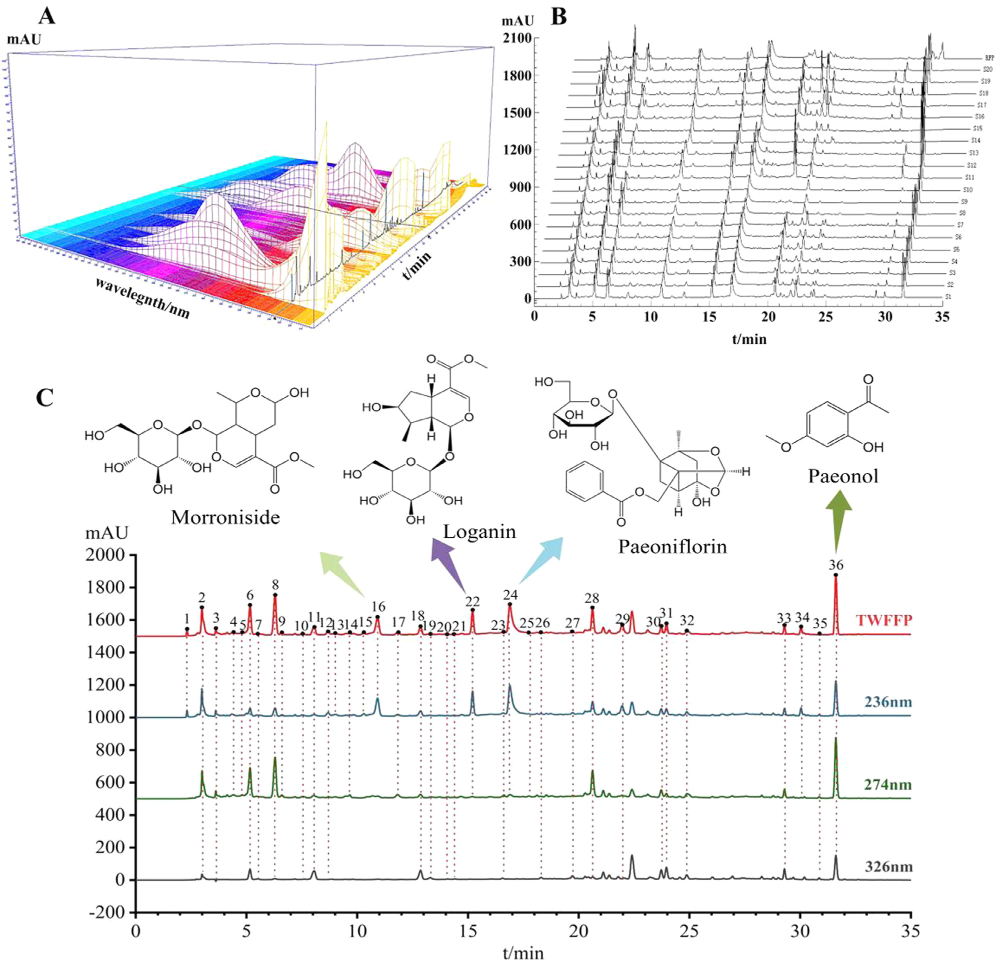

<!-- 方針: ほぼ全訳＋必要に応じた補足。原文構成に沿って訳出。「> 補足:」は訳者注。 -->

## 書誌情報

- 原題: High performance liquid chromatography three-wavelength fusion fingerprint combined with electrochemical fingerprint and antioxidant method to evaluate the quality consistency of Mingmu Dihuang Pill
- 著者・所属: Xiang Li, Dandan Gong, Guoxiang Sun（瀋陽薬科大学薬学院, 中国）、Hong Zhang（瀋陽薬科大学生命科学・生物薬剤学院, 中国）、Wanyang Sun（暨南大学薬学院, 中国広州）
- 掲載誌・巻号・DOI: *Journal of Chromatography A* 1681 (2022) 463448. https://doi.org/10.1016/j.chroma.2022.463448
- インパクトファクター: **3.8〜4.2程度**（*Journal of Chromatography A*, JCR 2024 / Clarivate。アグリゲータ間で3.8〜4.2の幅があり、Clarivate公式値は要確認）
- 受理経過: 受領 2022-04-24 / 改訂 2022-08-13 / 採録 2022-08-22 / オンライン公開 2022-08-28
- ライセンス: © 2022 Elsevier B.V. All rights reserved.

> 補足: MMDHP = 明目地黄丸(Mingmu Dihuang Pill、濃縮丸)。TWFFP = 三波長融合指紋。ECFP = 電気化学指紋。SQFM = 体系的定量指紋法(systematically quantified fingerprint method)。QAMS = 単一標準品による多成分同時定量法(quantitative analysis of multi-components by single marker)。MOR=モルロニシド、LOG=ロガニン、PAEF=パエオニフロリン、PAE=パエオノール。CCM=検量線法(calibration curve method)。本論文はケモメトリクス・分析法開発の研究論文。

## 要旨（Abstract）

本論文では、三波長融合指紋(TWFFP)と電気化学指紋(ECFP)、抗酸化法を組み合わせて明目地黄丸(MMDHP)の品質一貫性を共同で検討した。TWFFPは複数波長における最大紫外吸収特性を十分に示し、単一波長評価がもたらす欠陥を補った。ECFPを確立してより深く特徴パラメータを解析したところ、すべての試料が電気化学振動系に対して抑制効果を有していた。2,2-ジアザビス(3-エチルベンゾチアゾール-6-スルホン酸)（通称ABTS）を用いた抗酸化試験をECFPと組み合わせ、TWFFPのピーク面積との指紋-薬効相関を確立した。その結果、36の共通ピークのうち15ピークが両方の薬効相関に同時に重要な寄与を示した。TWFFPとECFPは体系的定量指紋法によって評価され、階層的クラスター分析(HCA)によりHPLCと電気化学の試料識別能力が検討された。含量百分率を導入し、マーカー成分と全体的な定量類似度との関係を計算した。マーカー成分の評価精度を分析するため、単一標準品による多成分定量分析法を検討した。本研究は、複雑な生薬複合製剤の品質一貫性管理のための包括的かつ信頼性の高い方法を提供するものである。

© 2022 Elsevier B.V. All rights reserved.

## 1. 序論（Introduction）

国内外で中医薬(TCM)への関心と認知が高まる中、TCMは臨床応用のプロセスにおいて大きな発展の機会を得ている。TCMの安全性と有効性は品質・応用価値に直結するため、その品質一貫性管理は広く研究の関心を集めてきた。本論文では明目地黄丸(MMDHP)を例に、適切かつ効果的な評価方法を論じることで、TCMの安全性・有効性確保のための参照と、さらなる思考の刺激を提供する。

高速液体クロマトグラフィー(HPLC)指紋技術、抗酸化技術、紫外(UV)・フーリエ変換赤外(FTIR)技術は、TCMの品質一貫性評価の分野で良好な応用の見込みを持つ。中でもHPLCはTCMおよびその複合製剤の包括的な定性・定量分析に利用できる。通常、異なる種類の化合物は異なる波長で最大紫外吸収を示すため、単一波長では試料の品質を十分に分析できない可能性がある[1,2]。そこで本論文では三波長融合指紋(TWFFP)を導入し、3波長における最大シグナル応答を持つピークを一つの新しいクロマトグラムに統合した。異なる波長の情報を総合的に利用することで、試料をより十分に評価できる[3–5]。

HPLCの高実験コストや複雑な前処理プロセスといった限界と比較して、本論文はシンプルで経済的、普及しやすい電気化学指紋(ECFP)技術を導入した[6]。ECFPは全成分指紋という特徴を持ち、実験調製が簡便で、試料は単純に粉砕するだけ、あるいは何ら処理を必要としない。TCMおよびその製剤の品質管理・評価にとって優れた分析方法である[7]。この結果はHPLCの評価結果と補完・比較され、MMDHPの品質一貫性を論じる。

MMDHPは地黄(rehmannia glutinosa)、山茱萸(cornus)、牡丹皮(peony bark)、白芍(white peony)、酒製山梔子(calcined cassia)など12種類の生薬から構成される。肝腎を滋養し視力を改善する効能を持ち、臨床的には肝腎不足・羞明・視力かすみの治療に用いられる[8]。このうち、モルロニシド(morroniside)とロガニン(loganin)は山茱萸中の主要な薬理成分であり、免疫調節・抗炎症・抗ショック作用を有する。パエオノール(paeonol)は牡丹皮の活性成分の一つで清熱散瘀の効果を持ち、パエオニフロリン(paeoniflorin)は抗心筋虚血・血小板凝集抑制・鎮痛・鎮静などの効果を有する[9–12]。中国薬局方およびこれら4化合物の性質を参考に、本研究ではこれらをMMDHPの定量分析における4つの品質マーカー(Q-marker)として採用した。

本論文では、抗酸化実験[13]、TWFFPおよびECFPと組み合わせて、MMDHPの化学成分と生物活性を包括的に評価した。複雑なMMDHP系を体系的定量指紋法(SQFM)および単一標準品による多成分同時定量法(QAMS)によって解析した。MMDHPの定性・定量スコアは、マクロ定性類似度(**S**m)とマクロ定量類似度(**P**m)の両方を用いて行われた。主成分分析(PCA)と階層的クラスター分析(HCA)を用いて、HPLCとECFPが試料バッチ間の差異を識別する能力を検証した。結論として、MMDHPの品質一貫性は客観的に評価され、TCMおよびその複合製剤全体の品質の定量的管理のための新しく実行可能な方法を提供した。

## 2. 材料と方法（Materials and Methods）

### 2.1 化学試薬

クロマトグラフィーグレードのメタノール、アセトニトリル、および分析グレードの濃硫酸(98%)はいずれも山東裕王河天下有限公司より購入した。リン酸(クロマトグラフィーグレード)は四川成都科隆化学試薬工場、ヘプタンスルホン酸ナトリウムは山東中美色譜有限公司、硫酸セリウムアンモニウム四水和物は天津博迪化学有限公司より購入した。マロン酸、塩化カリウム、臭素酸カリウムはいずれも天津大茂化学試薬工場製。実験を通じて脱イオン水を使用し、すべての試薬・化学物質は分析グレードであった。

モルロニシド(MOR、バッチNo. 25406-64-8、純度>98.0%)は成都アルファバイオテクノロジー有限公司(四川、中国)より購入。ロガニン(LOG、バッチNo. 111640-200503、純度>98.0%)、パエオノール(PAE、バッチNo. 110708-200506、純度>99.8%)は中国食品薬品検定研究院(北京、中国)より購入。パエオニフロリン(PAEF、バッチNo. 23180-57-6、純度>98.0%)は成都百菲バイオ化学製品有限公司より入手した。4種のQ-marker化合物の構造は図2(C)に示す。

20バッチのMMDHP試料(S1〜S20、濃縮丸)を薬局から収集した(S1〜S7はメーカーA、S8〜S10はメーカーB、S11〜S13はメーカーC、S14・S15はメーカーD、S16・S17・S19・S20はメーカーE、S18はメーカーFより)。

### 2.2 装置と条件

#### 2.2.1 HPLC分析

HPLC実験はAgilent 1100 HPLCシリーズ装置(Agilent Technologies, USA)で実施した。本装置ファミリーはオンライン脱気装置、低圧混合四元ポンプ、オートサンプラー、カラムオーブン、フォトダイオードアレイ検出器(DAD)を含む。データ取得・解析はOpenLAB CDS ChemStation(バージョンC.01.07, Agilent Technologies Limited社)で実施した。分離にはクロマトグラフィーカラムcosmsil C-18(250 mm × 4.6 mm, 5 μm)を使用し、カラム温度は35℃に保持した。移動相は5 mmol/Lヘプタンスルホン酸ナトリウム+0.2%(v/v)リン酸水溶液(A)(水相)、アセトニトリル-メタノール(9:1, v/v)(B)(有機相)とした。注入量は10 μL、流速は1.0 mL/minとした。グラジエント溶出プログラムは以下の通り: 94–88% A(0–8 min); 88–79% A(8–15 min); 79–72% A(15–22 min); 72–60% A(22–26 min); 60–50% A(26–30 min); 50–38% A(30–40 min); 38–94% A(40–45 min)。クロマトグラムは220 nm、236 nm、274 nm、280 nm、326 nmで抽出・処理した。

#### 2.2.2 電気化学振動分析

電気化学実験に用いた装置は次の通り: CHI760D電気化学ワークステーション(上海華辰計器有限公司)、DF-101S型コレクター定温加熱磁気撹拌器(上海力辰邦西計器技術有限公司)。作用電極は白金電極(CHI 115、上海華辰計器有限公司)、参照電極は飽和ダブル塩橋カロメル電極(雷磁217、上海儀電科学計器有限公司)を使用した。

測定方法は以下の通り: MMDHP均一微粉末0.15 gをセラミック反応装置に入れ、H2SO4溶液(3.0 mol/L)12 mL、CH2(COOH)2溶液(0.4 mol/L、0.2 mol/L H2SO4溶液で調製)6 mL、(NH4)4Ce(SO4)4溶液(0.02 mol/L、0.2 mol/L H2SO4溶液で調製)3 mLを加えた。次に電極を反応混合溶液に入れ、恒温水浴装置(35℃)にて400 r/minで3分間撹拌した。最後にKBrO3溶液(0.3 mol/L)3 mLを注入した。上記4種の溶液はブランクのB-Z振動系であり、電位振動が消失するまで試料の電位-時間(E-t)曲線を収集した。

### 2.3 試料および標準溶液の調製

MMDHPの丸剤8粒を秤量し、均一な小片に砕いた。破片を25 mLメスフラスコに入れ、35℃で20分間超音波浴中にて80%メタノールで抽出し、最後に有機フィルターを通してHPLC分析に供した。MMDHP試料8個を乳鉢で均一微粉末に十分に粉砕し、0.15 gを秤量して電気化学分析に用いた。

MMDHPの4種Q-markerを精密に秤量し、メタノールに溶解して原液を得た。最終的に、原液を一連の濃度に混合・希釈して検量線を作成した。

### 2.4 理論

#### 2.4.1 体系的定量指紋法（SQFM）[14,15]

SQFMはTCM指紋の全体的な定性・定量理論を代表する手法である。指紋試験において、試料指紋ベクトル(SFV)を X = (x1, x2…xn)、参照指紋ベクトル(RFV)を Y = (y1, y2…yn) とし、xi・yiは各指紋ピーク面積である。XとYのなす角のコサイン値を計算したものが定性類似度**S**Fである。**S**Fは含量分布比における試料と標準指紋の化学組成の類似性を明確に反映できるが、大きなピークが小さなピークを覆い隠す問題がある。RFV Yを P0=(1,1…1) とし、SFV Xを P0'=(x1/y1, x2/y2, … , xn/yn) としたときの、なす角のコサイン値が比率定性類似度**S**'Fであり、すべての指紋ピークに等しい重みを与えつつ大きなピークの変化に鈍感である。以上をまとめて、二重定性類似度(**S**Fと**S**'F)の平均**S**mをマクロ定性類似度と呼ぶ。

**C**は投影含量の類似度であり、X の Y への射影である。その特性は**S**Fと同様で、小さいピークが大きいピークに覆われて情報損失が生じやすい。異なる指紋ピーク面積には相互補償効果があり、類似度**S**Fを補正して定量類似度**P**が得られる。**P**はすべてのピーク積分値を等しく扱い、小さいピークに対応する化学成分の含量変化を正確に反映できる。以上をまとめて、二重定量類似度(**C**と**P**)の平均**P**mをマクロ定量類似度と呼ぶ。

SQFMは主に**S**mと**P**mから構成され、これらのパラメータの値に基づいて試料を8段階の品質グレード(G1–G8)に分類し(表1)、その後TCMの品質の定性・定量評価が実現される。

> 補足: 原文の数式(1)〜(6)はPDFからのテキスト抽出時にレイアウトが崩れており、正確な組版の再現はできない。本文中の説明に基づき、意味が損なわれない範囲で以下のように整理した。厳密な数式表記は原文（本文および図版）を参照されたい。
>
> - (1) **S**F = cosθ = Σ(xi·yi) / [√Σxi² · √Σyi²]
> - (2) **S**'F = Σ(xi/yi) / [√n · √Σ(xi/yi)²]
> - (3) **S**m = (**S**F + **S**'F) / 2
> - (4) **C** = [Σ(xi·yi) / Σyi²] × 100%
> - (5) **P** = [Σxi / (n·Σyi)] × **S**F × 100%
> - (6) **P**m = (**C** + **P**) / 2

#### 2.4.2 単一標準品による多成分同時定量法（QAMS）

TCMは組成が複雑であり、一部の標準物質は高価または希少であるため、一部成分の定量管理が困難である。本論文ではこの問題に対応するため、QAMSを適用して4種のQ-markerの含量を決定した。1つの成分(内部標準、安価または入手容易なもの)を測定することで、複数成分の同時定量が実現できる[16]。検出器のフローセルが一定であるという条件下で、一定の線形範囲内では主要指標成分の含量間に一定の関数関係がある。したがってQAMS法は補正係数を用いて化合物の濃度を計算し、含量を得ることが保証できる[17–19]。関連する計算式は以下の通り。

- (7) **f**si = fs/fi = (As/Cs) / (Ai/Ci)
- (8) **C**i = **f**si · Cs · (Ai/As)

**f**si: 補正係数
**A**s: 内部標準対照品(または供試サンプル)のピーク面積
**C**s: 内部標準対照品(または供試サンプル)の濃度
**A**i: 成分対照品(または供試サンプル)のピーク面積
**C**i: 成分対照品(または供試サンプル)の濃度

> 補足: 式(8)は原文のPDF抽出でレイアウトが崩れていたため、本文で定義された変数(fsi, As, Cs, Ai, Ci)の関係に基づき、QAMS法で一般に用いられる標準的な形に再構成した。

#### 2.4.3 B-Z振動系のメカニズム

本論文で検討した電気化学反応はB-Z振動反応系であり、酸化還元反応である。反応機構は、H2SO4溶液中でCe4+が触媒としてBrO3−を介してCH2(COOH)2を酸化するというものである[20]。反応式は図1に示す。

反応プロセス全体はBr−を中心に展開すると考えられる。反応中、Br−には臨界濃度([Br−]crit)が存在し、系内のBr−濃度が[Br−]critより高い場合は式(a)〜(d)に示す反応が生じ、逆にBr−が[Br−]critより低い場合は式(e)〜(g)に示す反応が生じる。このプロセス中、Br−の再生が誘発され、式(h)に示される。上記3つのプロセスが繰り返され、B-Z振動反応が生じたことを示す。

- [Br−] > [Br−]crit のとき:
  - (a) BrO3− + Br− + 2H+ → HBrO2 + HOBr
  - (b) HBrO2 + Br− + H+ → 2HOBr
  - (c) HOBr + Br− + H+ → Br2 + H2O
  - (d) Br2 + CH2(COOH)2 → BrCH(COOH)2 + H+ + Br−
- [Br−] < [Br−]crit のとき:
  - (e) BrO3− + HBrO2 + H+ → 2BrO2− + H2O
  - (f) BrO2− + Ce3+ + H+ → HBrO2 + Ce4+
  - (g) 2HBrO2 → BrO3− + HOBr + H+
- Br−の再生:
  - (h) 4Ce4+ + BrCH(COOH)2 + 2H2O + HOBr → 2Br− + 4Ce3+ + 3CO2 + 6H+

まとめると、B-Z反応は非平衡の閉鎖系である。散逸物質としてのCH2(COOH)2は式(d)で表される反応を遅くする。時宜を得て補充されなければ、系の反応速度を直接的または間接的に増加させ、最終的に反応は平衡に達する。生薬を加えた後、試料中の還元性成分がBrO3−と反応し、系の正常な運転を妨害し、巨視的には振動を抑制する現象を示す。活性成分含量の異なる試料は異なる抑制度をもたらし、その結果異なる電気化学指紋を示す。

#### 2.4.4 4種Q-markerの含量百分率（Pi%）

本論文では、各試料における4種Q-markerおよびその合計の含量百分率**P**i%を計算した。計算式は以下の通り。

- (9) **P**i% = mi / mRFPi
- (10) **P**i%(SUM) = mi(SUM) / mRFPi(SUM)

**m**i: 各試料中の各マーカーの含量
**m**RFPi: 生成されたRFP(参照指紋)中の各マーカーの含量
**m**i(SUM): 各試料における4マーカーの合計含量
**m**RFPi(SUM): 生成されたRFP中の4マーカーの合計含量

### 2.5 データ解析

クロマトグラフィー指紋の評価は、実験室が開発したソフトウェア「TCM spectral quantum fingerprint consistency digital evaluation system 4.0(TCMスペクトル量子指紋一貫性デジタル評価システム4.0)」を用いて行った。データ解析にはOrigin 95、SIMCA 14.1、IBM SPSS Statisticsソフトウェアを使用した。

## 3. 結果と考察（Results and Discussion）

### 3.1 方法バリデーション

検討したHPLC指紋の適用性を確保するため、精度(precision)と再現性(repeatability)をそれぞれ検討した。精度は同一試料溶液を連続6回分析して算出した。再現性は同一実験条件下で調製した6個の並行試料溶液を注入して検討した。

LOGピークを参照ピークとして、23の共通ピークの相対保持時間(RRT)と相対ピーク面積(RPA)の相対標準偏差(RSD)を計算し、精度と再現性を評価した。精度・再現性のRSD値は、4種Q-markerについてそれぞれRRTで1.46%未満、RPAで3.06%未満であった。標準添加法により回収率を求めて方法の正確性を評価した結果、4種Q-markerの平均回収率は94.0〜104.0%の間でRSDは1.0%未満であった。ピーク面積を従属変数(Y軸)、溶液濃度を独立変数(X軸)として、4種Q-markerの検量線を作成した。検量線を用いて4種の検出限界(LOD)と定量限界(LOQ)をそれぞれ推定した。4種Q-markerの直線性の結果、LOD、LOQを表2に示す。

**表2. MOR・LOG・PAEF・PAEの回帰式、直線性、LOD、LOQ**

| 化合物 | 回帰式 | r | 直線範囲 (μg/mL) | LOD (ng) | LOQ (ng) |
|---|---|---|---|---|---|
| MOR | y = 16608x + 15.458 | 0.9998 | 4.1–248 | 3.07 | 9.31 |
| LOG | y = 15475x − 27.968 | 0.9992 | 2.5–150.6 | 4.50 | 13.64 |
| PAEF | y = 13281x − 17.924 | 0.9998 | 6.5–390 | 5.66 | 17.16 |
| PAE | y = 26520x − 3.1866 | 1.0000 | 2.7–160 | 0.45 | 1.35 |

結果から、目標濃度範囲内においてピーク面積と成分濃度の間に良好な線形関係があり、相関係数r ≥ 0.999であることが示された。結論として、確立されたHPLC指紋は4種Q-markerの含量を正確に決定でき、この方法は正確かつ信頼できるものであった。

ECFPについては、試料(S8)を2.2.2節に記載の方法で6回測定し再現性を検証した。いくつかの特徴パラメータの相対標準偏差(RSD)を計算し、図1(A)に示した。その結果、誘導時間(**t**ind)、振動終了時間(**t**oe)、振動寿命(**t**ol)、ピークトップ電位(**E**pt)、振動開始電位(**E**os)、振動終了電位(**E**oe)、振動周期(**τ**op)、最大振幅(**E**max)のRSDはそれぞれ6.78%、4.50%、4.53%、0.68%、1.53%、0.33%、3.82%、3.69%であった。平均RSDは3.23%であり、良好な再現性を示した。総じて、本論文で確立したECFPは正確かつ信頼できるものであり、20試料の指紋分析に使用できた。

### 3.2 HPLC指紋分析

#### 3.2.1 三波長融合指紋分析

MMDHP中の目的分析対象の最大吸収に基づき、3Dスペクトログラム(図2(A))から、より多くの成分情報を得るために236 nm、274 nm、326 nmをモニタリング波長として選択した。図2(C)から、各波長で異なる吸収シグナルが示されることが分かり、表1にも異なる波長で試料グレードに明らかな差異があることが示された。これは、単一波長が表す情報が限定的であり、すべての化学情報の指紋を一般化できないことを示している。本研究ではTWFFPを用いて単一波長指紋の欠点を克服し、「TCMスペクトル量子指紋一貫性デジタル評価システム4.0」を用いて236 nm、274 nm、326 nmの3つの検出波長における最大スペクトルを構築した。各波長の最大応答を持つピークをTWFFPの新規ピークとして選択し、より包括的で豊富な試料情報を得た。過去の経験に基づき、融合時間ウィンドウを0.1分として、試料(S1)を代表する新しいクロマトグラムを得た。20のMMDHP試料は3波長でそれぞれ23(236 nm)、26(274 nm)、22(326 nm)ピークを含み、TWFFPは36ピークを含んでいた(図2(B))。単一波長のクロマトグラフィーと比較して、新たに生成されたTWFFPは不純物ピークの影響を低減しつつ有効なピーク情報を十分に保持できた。

#### 3.2.2 主成分分析（PCA）

TWFFPの品質識別能力を検証するため、多変量データ系の次元削減により試料と指紋ピークの相関を確立するPCA法を選択した[3,21]。20試料の36共通ピーク面積をOrigin software に取り込み、得られた最初の4主成分でデータ分散の80.55%を説明した。PC1とPC2をそれぞれ横軸・縦軸として、20観測値・36変数からなる二次元行列を構築した(図3(A))。これはカラフルなスコアプロットと青色のローディングプロットを含む。カラフルなスコアプロットから、本法は異なるメーカーの試料を明確に識別でき、同一メーカーの試料は良好な一貫性を示した。同一メーカーのS1〜S7は一つのクラスタにまとまり、PC1と負の相関、PC2と正の相関を示した。同一メーカーのS8〜S10、およびS14・S15はいずれもPC1・PC2両方と負の相関を示した。S11〜S13とS16〜S20はPC1と正の相関を示し、同時にS11〜S13とS16はPC2と負の相関、S17〜S20はPC2と正の相関を示した。青色のローディングプロットは、元の指紋ピークが複合変数に対して持つ寄与を直観的に理解する助けとなり、異なる化合物が全体に及ぼす影響能力の違いを定性的に分析し、それにより重要な変数が特定され、試料間の類似・相違点を識別する助けとなった。図3(C)によれば、定量的な観点から、異なる指紋ピークが表す物質は含量の違いにより異なる寄与値を持ち、試料に異なる分類傾向を示させた。したがって、上記2つの図を比較することで、確立されたPCAモデルが試料中の物質含量の違いに従って20試料を識別できることが分かる。

#### 3.2.3 TWFFPの体系的定量指紋法（SQFM）による評価

20バッチ試料のTWFFPを評価ソフトウェア「TCM Spectral Quantum Fingerprint Consistency Digital Evaluation System 4.0」に取り込み、平均法を用いて全試料の参照指紋(RFP)を生成した。これにより試料ピーク面積と含量の関係をさらに検証し、試料の定性・定量類似度を分析することができた。

**S**mと**P**m値はRFP(標準として)によって計算され、結果を表1に示す。表1から、全試料の**S**m値は0.899〜0.992の範囲にあり、すべての試料が類似の化学組成を含んでいることを示した。**P**m値は64.3%〜136.7%の間にあり、大きな差異があり、異なる試料間の化学成分の含量がかなり異なることを示した。図3(B)から、異なるメーカーの試料のグレードが5グレード(1〜5)に分かれることが分析された。同時に、S1〜S7など同一メーカーの試料は、**P**mの変化によりわずかなグレードの変動があった。全試料を通じて、**S**mは緩やかに変動し、**P**mは大きく変動しており、これが異なる試料のグレードに影響していた。明らかに、**P**mは全試料のグレード評価により大きく寄与しており、定量的組成が試料の分化に責任を負うのであって、定性的組成ではない。

**表1. SQFMによるTCM品質グレード分類基準ならびに236 nm・274 nm・326 nm・TWFFP・ECFP・IC50値に基づく20バッチMMDHPの評価結果**

グレード基準:

| Grade | G1 | G2 | G3 | G4 | G5 | G6 | G7 | G8 |
|---|---|---|---|---|---|---|---|---|
| **S**m ≥ | 0.95 | 0.90 | 0.85 | 0.80 | 0.70 | 0.60 | 0.50 | <0.50 |
| **P**m/% | 95–105 | 90–110 | 85–115 | 80–120 | 70–130 | 60–140 | 50–150 | 0〜∞ |

20バッチの評価結果(Sm/Pm%/Grade。ECFPはSm/Pm%のみ、原文にグレード表記なし。IC50は原文に単位表記なし):

| Sample | 236nm Sm | 236nm Pm% | 236nm G | 274nm Sm | 274nm Pm% | 274nm G | 326nm Sm | 326nm Pm% | 326nm G | TWFFP Sm | TWFFP Pm% | TWFFP G | ECFP Sm | ECFP Pm% | IC50 |
|---|---|---|---|---|---|---|---|---|---|---|---|---|---|---|---|
| 1 | 0.983 | 96.8 | 1 | 0.967 | 105.6 | 2 | 0.924 | 129.3 | 4 | 0.971 | 103.6 | 1 | 0.985 | 88.8 | 0.0679 |
| 2 | 0.984 | 88.7 | 2 | 0.985 | 82.3 | 3 | 0.953 | 92.7 | 2 | 0.985 | 87.1 | 2 | 0.964 | 68.9 | 0.1022 |
| 3 | 0.986 | 92.3 | 2 | 0.992 | 92.0 | 1 | 0.974 | 102.2 | 1 | 0.992 | 93.6 | 2 | 0.949 | 74.3 | 0.1101 |
| 4 | 0.984 | 89.0 | 2 | 0.995 | 83.2 | 3 | 0.960 | 95.0 | 1 | 0.992 | 87.5 | 2 | 0.959 | 51.1 | 0.1050 |
| 5 | 0.978 | 89.2 | 2 | 0.969 | 76.6 | 4 | 0.885 | 89.9 | 3 | 0.970 | 86.7 | 2 | 0.983 | 102.4 | 0.1001 |
| 6 | 0.991 | 95.6 | 1 | 0.991 | 95.2 | 1 | 0.955 | 105.4 | 2 | 0.989 | 96.8 | 1 | 0.962 | 75.9 | 0.0876 |
| 7 | 0.973 | 79.9 | 3 | 0.961 | 92.5 | 2 | 0.953 | 116.7 | 3 | 0.960 | 87.7 | 2 | 0.994 | 93.3 | 0.0876 |
| 8 | 0.948 | 72.8 | 4 | 0.884 | 90.1 | 3 | 0.799 | 73.7 | 5 | 0.899 | 79.5 | 4 | 0.997 | 117.0 | 0.1281 |
| 9 | 0.933 | 61.4 | 5 | 0.901 | 74.2 | 4 | 0.725 | 67.4 | 6 | 0.926 | 64.3 | 5 | 0.995 | 120.9 | 0.1811 |
| 10 | 0.945 | 62.2 | 5 | 0.918 | 75.4 | 4 | 0.823 | 59.9 | 7 | 0.922 | 66.6 | 5 | 0.995 | 108.7 | 0.1562 |
| 11 | 0.954 | 142.4 | 6 | 0.944 | 135.5 | 5 | 0.845 | 87.2 | 4 | 0.964 | 136.7 | 4 | 0.997 | 106.9 | 0.0884 |
| 12 | 0.960 | 132.0 | 5 | 0.941 | 130.6 | 5 | 0.867 | 77.0 | 5 | 0.959 | 129.0 | 4 | 0.991 | 92.3 | 0.0586 |
| 13 | 0.974 | 122.0 | 4 | 0.967 | 111.6 | 2 | 0.906 | 70.3 | 5 | 0.977 | 116.5 | 3 | 0.994 | 87.4 | 0.0713 |
| 14 | 0.944 | 77.8 | 4 | 0.950 | 81.8 | 3 | 0.934 | 95.4 | 2 | 0.944 | 78.4 | 4 | 0.995 | 109.9 | 0.1361 |
| 15 | 0.952 | 72.4 | 4 | 0.935 | 66.9 | 5 | 0.939 | 80.8 | 3 | 0.948 | 68.6 | 4 | 0.996 | 109.3 | 0.1391 |
| 16 | 0.980 | 115.3 | 3 | 0.985 | 113.6 | 2 | 0.928 | 143.2 | 7 | 0.990 | 114.1 | 2 | 0.997 | 122.7 | 0.1070 |
| 17 | 0.975 | 118.9 | 3 | 0.989 | 126.7 | 4 | 0.978 | 98.5 | 1 | 0.989 | 122.0 | 3 | 0.996 | 114.2 | 0.0914 |
| 18 | 0.975 | 130.2 | 5 | 0.949 | 111.9 | 3 | 0.772 | 145.0 | 7 | 0.958 | 116.7 | 3 | 0.998 | 107.6 | 0.0792 |
| 19 | 0.969 | 123.5 | 4 | 0.949 | 103.9 | 2 | 0.969 | 106.3 | 2 | 0.951 | 114.1 | 2 | 0.997 | 121.9 | 0.1290 |
| 20 | 0.950 | 118.4 | 3 | 0.945 | 107.4 | 2 | 0.929 | 66.9 | 6 | 0.964 | 115.3 | 2 | 0.994 | 122.0 | 0.1039 |

さらに、4マーカーの含量決定結果とSQFMで得られた**P**m値との関係を検討した。**P**i%と**P**mの相関を図3(D)に示し、結果はMOR、LOG、PAEF、PAEおよびその合計の相関係数がそれぞれ0.7310、0.6871、0.9702、0.6223、0.9392であることを示した。**P**i%と**P**mの間には一定の相関があることが分かった。加えて、PAEFおよび4Q-markerの合計の**P**i%は比較的高かった。したがって、SQFMは試料の含量を正確に分析できると結論づけた。

#### 3.2.4 TWFFPの階層的クラスター分析（HCA）[22]

**S**mと**P**mをSIMCAソフトウェアに取り込み、HCA法を用いてSQFM法が異なる試料の一貫性と差異を明確に識別できるか検討した。図4(A)に示す通り、本法はおおよそ試料を5カテゴリーに分類し、S8〜S10・S14・S15が1カテゴリーにクラスタリングされ、S1〜S7が1カテゴリーにクラスタリングされ、S19は単独で1カテゴリーとなり、第4カテゴリーはS11〜S13を含み、第5カテゴリーはS16〜S18、S20を含んでいた。これら5つの分類グループは各バッチのメーカーと良好に一致しており、SQFM法が試料の一貫性・差異を分析する上で信頼できることを示した。同時に、HCAが示す試料のクラスタリングはPCAモデルにおける試料間の相関結果と一致しており、両手法が試料特性と含量の相関を正確に記述できることを示した。まとめると、SQFMは各成分に起因する潜在的な差異と試料全体の品質一貫性を分析でき、TCMおよびその複合製剤全体の品質を管理するための包括的でシンプルかつ信頼できる方法として使用できる。

### 3.3 QAMSによる4種Q-marker含量の評価

本実験では4種Q-markerを検討して試料を定量し、QAMSが検量線法(CCM)に代わってMMDHPの含量を決定できるかを検証することを計画した。まず表2に示す線形回帰式を用いてCCM法によりMOR、LOG、PAEF、PAEの含量を計算した。次に、2.4.2節で述べたQAMSの計算方法に従い、PAEF(良好なピーク形状、高い信号強度、他ピークとの高い分離度)を内部標準として、他の3マーカーの含量を計算した。2つの方法で得られたマーカーの含量結果を比較し、QAMS法の信頼性を検証した。

CCMとQAMSで得られた含量の比(**r**C/Q)を計算し、表3に示した。**r**C/Qが1に近いほど、2つの方法の含量結果が類似していることを意味する。同時に**t**検定を用いて統計解析を行い、2つの分析方法で得られた含量値をSPSSソフトウェアに取り込んだ。その結果、他の3マーカーの**P**値はそれぞれ0.920、0.875、0.980であり、いずれも0.05より大きく、有意差はなかった。以上の結果はすべて、2つの方法の間に有意差がないことを示した。したがって、QAMSはMMDHP中の4マーカーの含量を同時かつ正確に決定できる。

**表3. CCM法とQAMS法によりそれぞれ計算された4種Q-marker含量、およびCCMとQAMSで得られた含量の比(rC/Q)**

| Sample | CCM MOR | CCM LOG | CCM PAEF | CCM PAE | QAMS MOR | QAMS LOG | QAMS PAEF | QAMS PAE | rC/Q MOR | rC/Q LOG | rC/Q PAE |
|---|---|---|---|---|---|---|---|---|---|---|---|
| S1 | 1.0461 | 1.1199 | 3.0369 | 0.9359 | 1.0400 | 1.1517 | 3.0369 | 0.9439 | 1.0059 | 0.9724 | 0.9915 |
| S2 | 1.1017 | 1.2471 | 2.8433 | 0.5970 | 1.0951 | 1.2868 | 2.8433 | 0.6017 | 1.0060 | 0.9691 | 0.9922 |
| S3 | 1.1341 | 1.3052 | 2.9445 | 0.7892 | 1.1265 | 1.3479 | 2.9445 | 0.7959 | 1.0067 | 0.9683 | 0.9916 |
| S4 | 1.1179 | 1.2624 | 2.8627 | 0.7506 | 1.1107 | 1.3031 | 2.8627 | 0.7569 | 1.0065 | 0.9688 | 0.9917 |
| S5 | 1.1687 | 1.2035 | 3.0992 | 0.4895 | 1.1598 | 1.2400 | 3.0992 | 0.4926 | 1.0077 | 0.9706 | 0.9937 |
| S6 | 1.0641 | 1.1785 | 2.9565 | 0.9718 | 1.0580 | 1.2138 | 2.9565 | 0.9805 | 1.0058 | 0.9709 | 0.9911 |
| S7 | 0.7403 | 0.8234 | 2.3889 | 0.8829 | 0.7422 | 0.8398 | 2.3889 | 0.8923 | 0.9974 | 0.9805 | 0.9895 |
| S8 | 0.7477 | 0.8964 | 2.2627 | 0.6660 | 0.7501 | 0.9174 | 2.2627 | 0.6729 | 0.9968 | 0.9771 | 0.9897 |
| S9 | 0.8239 | 0.7421 | 1.7942 | 0.6522 | 0.8278 | 0.7553 | 1.7942 | 0.6609 | 0.9953 | 0.9825 | 0.9868 |
| S10 | 0.5580 | 0.7496 | 1.8889 | 0.6229 | 0.5651 | 0.7631 | 1.8889 | 0.6306 | 0.9874 | 0.9823 | 0.9878 |
| S11 | 1.7502 | 1.9147 | 5.1323 | 1.8196 | 1.7274 | 1.9828 | 5.1323 | 1.8323 | 1.0132 | 0.9657 | 0.9931 |
| S12 | 1.5131 | 1.7720 | 5.5171 | 1.6476 | 1.4972 | 1.8293 | 5.5171 | 1.6587 | 1.0106 | 0.9687 | 0.9933 |
| S13 | 1.3284 | 1.6438 | 4.8681 | 1.0983 | 1.3165 | 1.6964 | 4.8681 | 1.1055 | 1.0090 | 0.9690 | 0.9935 |
| S14 | 1.4686 | 1.3228 | 2.2546 | 1.3078 | 1.4641 | 1.3660 | 2.2546 | 1.3258 | 1.0031 | 0.9684 | 0.9864 |
| S15 | 1.5077 | 1.2389 | 2.3546 | 1.1677 | 1.5021 | 1.2759 | 2.3546 | 1.1829 | 1.0037 | 0.9710 | 0.9872 |
| S16 | 1.4673 | 1.1057 | 4.1386 | 1.1645 | 1.4506 | 1.1333 | 4.1386 | 1.1728 | 1.0115 | 0.9756 | 0.9929 |
| S17 | 1.4166 | 0.8977 | 4.1605 | 1.0816 | 1.4012 | 0.9135 | 4.1605 | 1.0891 | 1.0110 | 0.9827 | 0.9931 |
| S18 | 1.3680 | 1.3673 | 4.5082 | 0.9917 | 1.3522 | 1.4095 | 4.5082 | 0.9979 | 1.0117 | 0.9701 | 0.9938 |
| S19 | 1.8199 | 1.1436 | 3.8965 | 1.0025 | 1.7957 | 1.1740 | 3.8965 | 1.0097 | 1.0135 | 0.9741 | 0.9929 |
| S20 | 2.0326 | 1.2004 | 4.1917 | 0.7706 | 2.0026 | 1.2337 | 4.1917 | 0.7753 | 1.0150 | 0.9730 | 0.9939 |

単位: いずれもmg/g。補正係数: fsi-MOR = 0.7773、fsi-LOG = 0.9006、fsi-PAE = 0.5024（PAEFを内部標準としたため、QAMSのPAEF値はCCM値と同一）。

### 3.4 電気化学指紋分析

表4はMMDHPのECFPの8つの特徴パラメータを記録したものである。このうち、**t**indは人為的な注入による主観的要因の影響を大きく受けた。**t**oe、**E**pt、**E**os、**E**oe、**τ**opのRSDはいずれも8未満であり、データから全バッチの5パラメータはあまり差異がなく、試料間の違いをうまく反映できないことも分かった。したがって、電気化学的な試料品質評価の主要な根拠として**t**olと**E**maxを用いた。

**表4. 20バッチ試料の特徴パラメータのまとめ**

| Sample | tind/s | toe/s | tol/s | Ept/V | Eos/V | Eoe/V | τop/s | Emax/V |
|---|---|---|---|---|---|---|---|---|
| 1 | 26.6 | 2322.6 | 2296 | 1.0260 | 0.8457 | 0.7065 | 23.9 | 0.2277 |
| 2 | 47.9 | 2380.9 | 2333 | 0.9260 | 0.8225 | 0.6397 | 25.2 | 0.1533 |
| 3 | 55.1 | 2425.2 | 2370 | 0.9180 | 0.8088 | 0.6431 | 23.2 | 0.1579 |
| 4 | 43.6 | 2373.6 | 2330 | 0.9295 | 0.8527 | 0.6518 | 25.2 | 0.1293 |
| 5 | 41.0 | 2365.0 | 2324 | 0.9741 | 0.8079 | 0.6641 | 24.9 | 0.2088 |
| 6 | 47.2 | 2473.2 | 2426 | 0.9509 | 0.8344 | 0.6544 | 26.2 | 0.1684 |
| 7 | 39.7 | 2599.8 | 2560 | 0.9852 | 0.8156 | 0.6734 | 25.1 | 0.2051 |
| 8 | 16.2 | 2482.2 | 2466 | 1.0340 | 0.8343 | 0.7084 | 26.5 | 0.2380 |
| 9 | 10.6 | 2502.6 | 2492 | 1.0600 | 0.8915 | 0.7557 | 23.0 | 0.2077 |
| 10 | 11.6 | 2460.7 | 2449 | 1.0620 | 0.8908 | 0.7605 | 24.1 | 0.2024 |
| 11 | 23.4 | 2489.4 | 2466 | 1.0545 | 0.8677 | 0.7416 | 22.3 | 0.2153 |
| 12 | 25.1 | 2295.2 | 2270 | 1.0513 | 0.8835 | 0.7498 | 26.7 | 0.2165 |
| 13 | 48.1 | 2538.1 | 2490 | 1.0226 | 0.8742 | 0.7594 | 27.2 | 0.1973 |
| 14 | 17.8 | 2281.8 | 2264 | 1.0494 | 0.8729 | 0.7541 | 25.9 | 0.2254 |
| 15 | 15.9 | 2388.0 | 2372 | 1.0632 | 0.8735 | 0.7510 | 23.7 | 0.2138 |
| 16 | 25.6 | 2856.6 | 2831 | 1.0424 | 0.8570 | 0.7214 | 24.1 | 0.2380 |
| 17 | 25.0 | 2790.1 | 2765 | 1.0528 | 0.8785 | 0.7387 | 28.1 | 0.2286 |
| 18 | 24.6 | 2291.6 | 2267 | 1.0404 | 0.8495 | 0.7245 | 23.6 | 0.2231 |
| 19 | 35.8 | 2799.9 | 2764 | 1.0348 | 0.8457 | 0.7918 | 24.5 | 0.2372 |
| 20 | 25.2 | 2851.3 | 2826 | 1.0318 | 0.8570 | 0.7249 | 23.6 | 0.2295 |
| RSD(%) | 44.34 | 7.51 | 8.25 | 4.84 | 3.08 | 6.42 | 6.17 | 14.92 |

電気化学データをさらに分析するため、「TCM spectral quantum fingerprint consistency digital evaluation system 4.0」を独創的に用いてECFPを積分してピーク面積を得て、**S**mと**P**mを求めた。図1(B)にMMDHP試料のB-Z振動系の非線形曲線と積分後の曲線をプロットした。電気化学が実際には試料中の活性成分がB-Z振動系に与える影響を反映していることは注目に値する。表1および図1(B)に対応して、**P**m値が大きいほど試料の**t**olは長く、すなわちB-Z振動系への影響が小さく、内部の活性成分含量が低いことを反映する。積分によって得られた結果が電気化学ソフトウェアの読み取りデータと一致するかを検証するため、**E**maxを**P**mに線形フィッティングしたところ、線形式は y = 0.0014x + 0.0701、**r** = 0.8962であった。2つの方法は良好に相関しており、ECFPを解析する本革新的方法は信頼できることが分かった。**t**olと**E**maxをSIMCAソフトウェアに取り込みHCA解析を行った結果を図4(B)に示す。HPLC法で得られたHCA結果とは一定の差異があった。理由としては、HPLCが特定の溶媒に溶解した試料の一部の成分の吸収特性を反映し、特定の溶出手順を経て特定の波長で検出しているのに対し、電気化学は試料中のすべての活性成分がB-Z振動反応系で化学反応に参加する能力を反映しているためと考えられる。

### 3.5 TWFFPの指紋-薬効相関分析

電気化学、HPLC、抗酸化実験[13]の間の関連性を検討し、試料の品質評価における3つの方法の信頼性を検証するため、TWFFPの36ピークを橋渡しとして、ピークとECFPの**P**mとの相関、およびピークとIC50値との相関を検討した。結果はピアソン相関係数(**r**)で表され、図4(C)(D)に示す。原理により、IC50値が小さいほど試料の抗酸化能力が強いことが分かっているため、ピーク-IC50は負の相関を示すはずである。同様に、試料中の活性成分が多いほどECFPの**P**m値は小さくなるため、ピーク-**P**mも負の相関を示す。ピーク-IC50のグラフでは、29ピークがIC50と負の相関(**r** < 0)を示しており、試料中のほとんどの化合物が抗酸化実験において役割を果たしていることを示している。ピーク-**P**mのグラフでは、16ピークが**P**mと負の相関(**r** < 0)を示し、これら16ピークのうち15ピークはIC50とも負の相関を示した。まとめると、電気化学と抗酸化法の評価結果は類似しており、互いに支持し合うことができ、MMDHP中の抗酸化成分を効果的に反映することができた。同時に、2つの指紋-薬効関係において負の相関を示すピークの割合は異なっており、これは電気化学法と抗酸化法の反応系の違いに起因する可能性がある。これはまた、両手法における共通ピークの寄与を客観的かつ包括的に示すものである。明らかに、本研究の結果はMMDHPの化学的性質と薬理活性に関する参照を提供できる。

## 4. 結論（Conclusion）

本論文では、20のMMDHPのTWFFPが成功裏に確立され、従来の単一波長分析の欠陥を克服し、試料の品質を包括的に分析できるようにした。PCAとSQFM法により、試料全体の品質を定性・定量両面から識別・評価した。次にHCAを行い、SQFM法の信頼性を検証するとともに、PCAの実用性を側面から反映した。SQFMとQAMSを組み合わせることで、MMDHP中の4種Q-markerの包括的かつ正確な定量決定を達成した。ECFPは複雑な前処理なしに構築され、TCM複合製剤に対して豊富かつ定量可能な情報を提供した。HCA解析は電気化学的特徴読み取り値を用いて行われ、ECFPが試料を識別する能力を検討した。ピーク-IC50およびピーク-**P**mの指紋-薬効関係図を作成し、上記2つの薬効結果を比較し、TWFFP指紋ピークがABTSおよびECFPの評価結果に及ぼす寄与を論じた。これらすべてが試料中の有効成分を予測する良好な能力を示し、生物活性化合物の予測に良い方向性を提供した。最も重要なことに、本研究で提案された方法はMMDHPの全体的な化学組成を定性的・定量的に評価できるだけでなく、TCMおよびその複合製剤の品質に対する革新的な電気化学統合方法も提供した。最終的にTCMの品質と薬効の二重管理を実現し、信頼できる考え方の道筋を提供した。

## 訳者補足（任意）

> 補足（実務的示唆）: 本研究は同じ研究グループが豨薟草(Siegesbeckiae Herba)などで展開している「多波長融合指紋(FWFFP/TWFFP)＋SQFM(体系的定量指紋法)＋抗酸化(指紋-薬効相関)」という一連の方法論を、明目地黄丸(複合生薬製剤)に適用した事例である。要点は次の3つ。(1) 単一波長(236/274/326 nm)ではグレード判定が波長ごとに食い違う（例: S9は236nmでG5、326nmでG6、TWFFPでG5など）ため、三波長融合により36ピークという単一波長を上回る情報量を確保している。(2) HPLCに比べ前処理が極めて簡便な電気化学指紋(ECFP、B-Z振動系)を独立した評価軸として導入し、HPLCと相互補完的に用いている点（HCAの結果はHPLCとECFPで完全には一致しないが、それぞれ異なる原理（分離検出 vs 全成分の酸化還元反応性）を反映しているためと解釈されている）。(3) TWFFPの36ピークを軸に、電気化学**P**mおよび抗酸化IC50の双方との相関を取ることで、15ピークが両薬効指標に共通して重要と同定された点は、実務上「指紋ピーク＝薬効関連成分」の絞り込みに使える考え方である。QAMSとCCMの一致(t検定で有意差なし)は、標準品コストの高いマーカー（本研究ではモルロニシド・ロガニン・パエオノールをパエオニフロリン基準で補正）についてQAMSが代替として妥当であることを支持しており、規格設定・日常検査でのコスト削減に直結する知見といえる。
