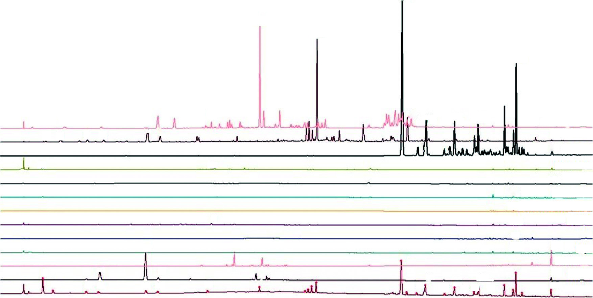
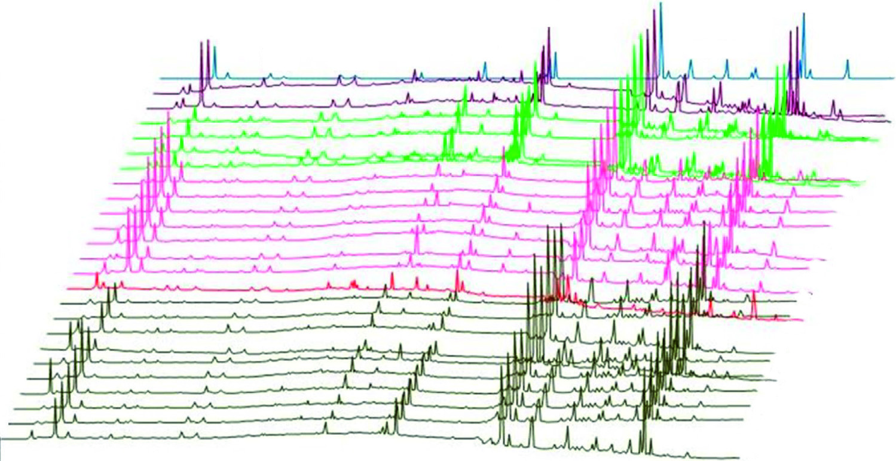
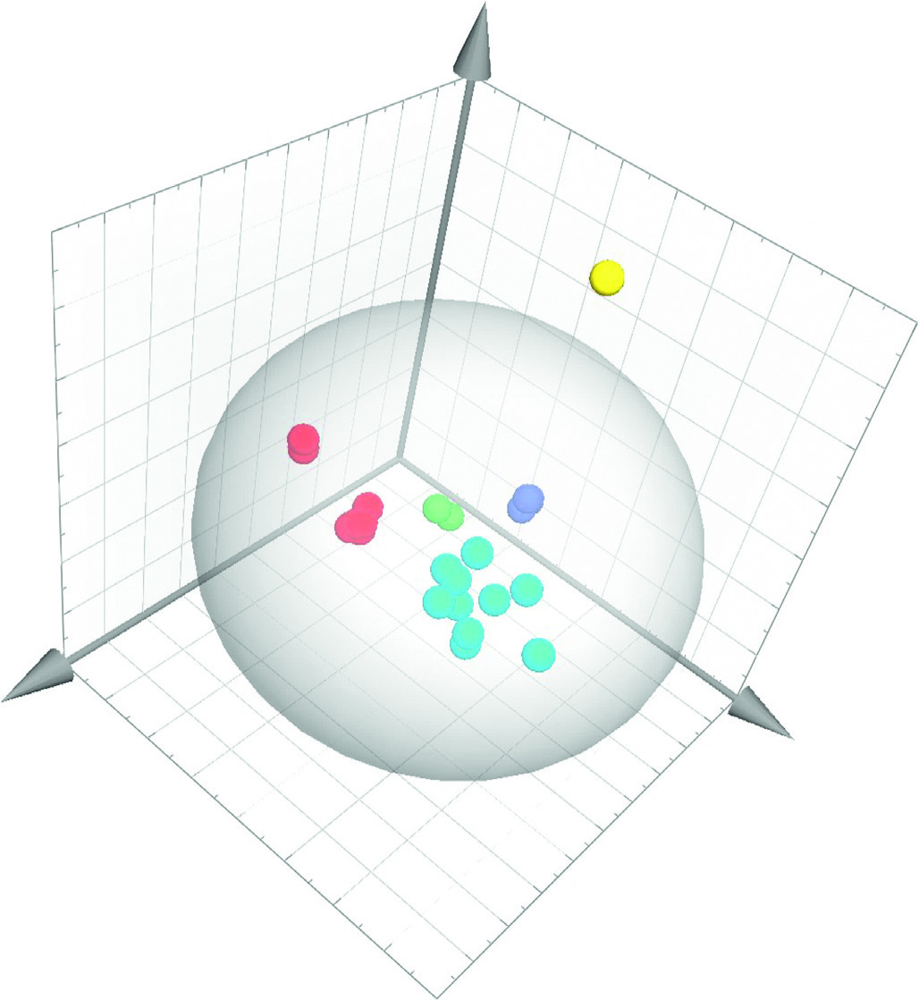

<!-- 方針: ほぼ全訳＋必要に応じた補足。原文構成に沿って訳出。「> 補足:」は訳者注。数式はKaTeXで表示。 -->

## 書誌情報

- 原題: Quality Evaluation of Traditional Chinese Medicine Prescription in Naolingsu Capsule Based on Combinative Method of Fingerprint, Quantitative Determination, and Chemometrics
- 著者: Lili Xu, Yang Jiao, Weiliang Cui, Bing Wang, Dongxiao Guo, Fei Xue, Xiangrong Mu, Huifen Li（責任著者）, Yongqiang Lin（責任著者）, Huibin Lin（山東中医薬大学／山東省食品薬品検定研究院ほか, 中国）
- 掲載: *Journal of Analytical Methods in Chemistry* 2022, Article ID 1429074. https://doi.org/10.1155/2022/1429074（オープンアクセス）
- インパクトファクター: **2.59**（*J. Anal. Methods Chem.*, 2022 / Hindawi）

> 補足: 脳霊素カプセル(Naolingsu Capsule, NLSC)は12種の生薬からなる中成薬。本研究はHPLC指紋・UHPLC-Q/TOF-MS同定・多成分定量・ケモメトリクスを組み合わせた総合的品質評価。

### 要旨 (Abstract)
* **背景 (Background):** 脳霊素カプセル（Naolingsu capsule, NLSC）は、中国でよく知られた中薬（TCM）処方である。これは、神経衰弱、不眠症、心血管・脳血管疾患、その他の疾患の治療に広く用いられている。しかし、その不可分な化学物質群についての研究は行われていない。
* **方法 (Methods):** 我々はまず、UHPLC-Q/TOF-MS/MSと組み合わせた指紋分析に基づく非標的型調査を確立した。第二に、HPLC-DADおよびLC-MS/MSに基づく定量方法を結びつけ、11種および14種のマーカー化合物の同期定量保証を行った。最後に、定量情報をSIMCA-Pで処理し、特徴的なサンプル群を識別して最も適切な化学マーカーをスクリーニングした。
* **結果 (Results):** 24バッチのNLSCサンプルのHPLC指紋類似度は0.645–0.992であった。合計で、37種のフラボノイド、21種の有機酸、22種のリグナン、13種のサポニン、および20種の他の化合物がUHPLC-Q/TOF-MS/MS法によってNLSC中で認識（同定）された。定量決定は、直線性、検出限界、正確性、再現性、安定性、および精密度の検証において承認された。主成分分析（PCA）および部分的最小二乗判別分析（PLS-DA）モデルにより、それぞれ5つの企業からのサンプルの優れた分類が達成された。Rehmannioside D（RD）、methylophiopogonanone A（MPA）、3,6′-disinapoyl sucrose（DS）、schisandrin B（SSB）、epimedin C（EC）、icariin（ICA）、およびjujuboside B（JB）が、NLSCの品質管理における潜在的な化学マーカーとみなされた。
* **結論 (Conclusion):** 実験結果は、この複合戦略が迅速な医薬品品質評価に有用であり、起源の区別、真偽の判定、および製剤の総合的な品質の評価に役立つ可能性を示した。

---

### 1. はじめに (Introduction)
中薬（TCM）、特に生薬複合製剤は、中国の伝統文化の不可欠な部分であり、世界の健康維持・医療ケア産業の基本的な部分である [1–4]。脳霊素カプセル（Naolingsu capsule, NLSC）は、神経衰弱、不眠症、心血管・脳血管疾患、虚血性脳卒中、およびその他の疾患の治療にTCMで用いられる複合処方であり、黄精（Polygonati Rhizoma）、淫羊藿（Epimedii Folium）、五味子（Schisandrae Chinensis Fructus）（君薬 / Monarch medicine）；蒼耳子（Xanthii fructus）、クコの実（Lycii fructus）、人参（Ginseng Radix et Rhizoma）、酸棗仁（Ziziphi Spinosae semen）、麦門冬（Ophiopogonis Radix）、亀板（Testudinis carapax et plastrum）、地黄（Rehmanniae Radix）（臣薬 / Minister medicine）；茯苓（Poria）、大棗（Jujubae fructus）、鹿茸（Cervi Cornu Pantotrichum）、鹿角膠（Cervi Cornus colla）（佐薬 / Adjuvants medicine）；および遠志（Polygalae Radix）（使薬 / Guide medicine）の15種類の薬用原料から構成されている。

しかし、NLSCの薬力学的物質基盤の検討および品質管理はこれまで行われておらず、その有効性と安全性の保証が臨床応用や詳細な研究を著しく制限している。したがって、NLSCの品質評価のために、信頼性が高く正確な品質基準が極めて強く求められている。

中薬製剤の品質は、一般的にその固有の化学物質が持つ包括的な生物学的影響の発現であり、これは「多成分、多有効性、および整合性」という含意特性を持つ [5, 6]。明らかに、1つまたは2つの品質管理項目のみを測定することによって中薬の品質を規制することは不十分であり [7]、試験結果が孤立した品質管理情報アイランドに分割され、それらを結合してモデル上の共同制約を作成することが不可能になる [8]。中薬製剤の本質的な化学物質群を包括的かつ客観的に反映することによって品質を評価および管理することが極めて重要になっている [9]。

指紋分析およびLC-MS技術は、国際的に認められた最先端の監視手段であり、中薬理論における全体的制御の実行可能なモードに適合するだけでなく、中薬の特性に合わせた国際的な品質基準フレームワークの構築における最先端の解析的革新の側面も反映している [10–13]。さらに、LC-MSは、HPLC-DADでは効果的な分離が困難な成分や、低含有量または発色団の欠如のために検出が困難な成分のアッセイに対して、より高い感度と選択性を提供する [14, 15]。過去数年間、化学パターン認識はデータ処理の分野で注目を集めており、中薬のバッチ間の一貫性を評価するための成功した戦略と見なされてきた [16, 17]。

これらすべての証拠に基づき、本研究は異なる製造業者からの24バッチのNLSCの包括的な品質評価を行うために設計された。我々はまず、UHPLC-Q/TOF-MS/MSと組み合わせた指紋分析に基づく非標的型調査を確立した。第二に、HPLC-DADおよびLC-MS/MSに基づく定量方法を結びつけ、11種および14種のマーカー化合物の同期定量保証を行った。最後に、SIMCA-P 14.1を用いて定量データを分析し、異なるサンプル群を識別して最も適切な化学マーカーをスクリーニングした。我々の知る限り、非標的型分析、定量決定、およびケモメトリクスに基づく包括的な品質評価戦略は、異なるメーカーのサンプル間の差異を比較し、NLSCの元の生薬に関連する成分を報告するために、初めて実施された。中薬処方の整合性を考慮すると、この戦略により、化学マーカーの複数の性質を視覚的かつ包括的に評価することが可能になり、従来の分析手法では化学マーカーの性質を効果的かつ全体的に評価できなかったという問題に対処できる。

---

### 2. 実験 (Experiment)

#### 2.1. 材料と試薬 (Materials and Reagents)
5つの企業（コードA〜E）から合計24サンプルのNLSC（A1-A2, B1-B4, C1-C7, D1, E1-E10）を入手した。規格は1カプセルあたり0.35 gであった。

デヒドロツムロシン酸（Dehydrotumulosic acid, DA）、ポリポレン酸C（Polyporenic acid C, PAC）、3-O-アセチルツムロシン酸（3-O-acetyltumulosic acid, ATA）、キサントシド（Xanthiside, XS）、キサンチアゾン（Xanthiazone, XZ）、メチルオフィオポゴナノンA（Methylophiopogonanone A, MPA）、ネオクロロゲン酸（Neochlorogenic acid, NA）、エピメディンA（Epimedin A, EA）、エピメディンB（Epimedin B, EB）、およびエピメディンC（Epimedin C, EC）は、成都普思生物科技有限公司（Chengdu Pusi Bio-Technology Co., Ltd.、中国・成都）から入手した。
ジュジュボシドA（Jujuboside A, JA）、ジュジュボシドB（Jujuboside B, JB）、レマニオシドD（Rehmannioside D, RD）、ジンセノシドRf（Ginsenoside Rf, GRF）、ジンセノシドRg1（Ginsenoside Rg1, GRG）、ジンセノシドRe（Ginsenoside Re, GRR）、ジンセノシドRb1（Ginsenoside Rb1, GRB）、ポリガラキサントンIII（Polygalaxanthone III, PX）、クロロゲン酸（Chlorogenic acid, CA）、3,6′-ジシナポイルスクロース（3,6′-disinapoyl sucrose, DS）、イカリイン（Icariin, ICA）、シサンドロールA（Schisandrol A, SA）、宝藿苷I（Baohuoside I, BSI）、シサンドリンA（Schisandrin A, SSA）、およびシサンドリンB（Schisandrin B, SSB）は、中国食品薬品検定研究院（China Institute for Food and Drug Control、中国・北京）から購入した。
これらの標準物質の純度は98.0%を超えていた。

HPLCグレードのアセトニトリル、メタノール、ギ酸はThermo Fisher Scientific（米国ニュージャージー州フェアローン）から購入した。その他の試薬および化学薬品は分析グレードであり、天津科密欧化学試薬有限公司（Tianjin Kemi O Chemical Reagent Co., Ltd、中国・天津）およびUltrapure Water（Millipore、米国マサチューセッツ州ミルフォード）から購入した。

> 補足: 原文の「.ermo」は「Thermo」の文字化け、「Kemi O」は「Kemiou」の文字化けと思われます。

#### 2.2. 装置および分析方法 (Apparatus and Analytical Methods)

##### 2.2.1. HPLC-DAD分析 (HPLC-DAD Analysis)
HPLC-DAD指紋は、PDAを装備したWaters e2695 HPLCシステム（Waters、米国）において、抽出溶媒、抽出方法、検出波長、移動相の組成および比率を検討することによって決定された。クロマトグラフィーカラムはThermo Hypersil Gold C18カラム（250 mm × 4.6 mm, 5 μm）を用い、アセトニトリル−0.1%リン酸水溶液を移動相として、流速1.0 mL・min−1でグラジエント溶出を行った。検出波長は、0〜40分は326 nm、40〜50分は268 nm、50〜85分は210 nmに設定した。カラム温度は30℃であった。注入量は10 μLであった。

##### 2.2.2. UHPLC-Q/TOF-MS分析 (UHPLC-Q/TOF-MS Analysis)
サンプルのクロマトグラフィー分離は、ESI源を備えたハイブリッド四重極直交飛行時間型（Q/TOF）タンデム質量分析計（島津製作所、日本）を接続したLC-30システム（島津製作所、日本）を使用し、ACQUITY UHPLC BEH C18カラム（2.1 × 100 mm, 1.7 μm, Waters, 米国マサチューセッツ州ミルフォード）で行った。移動相は、0.1%ギ酸水溶液（v/v、溶媒A）およびアセトニトリル（溶媒B）から構成された。流速は0.3 mL/minに設定され、線形溶出グラジエントプログラムは以下の通りであった：0〜3分、5% B；3〜10分、5–15% B；10〜15分、15–30% B；15〜40分、30–50% B；40〜45分、50–75% B；45〜50分、95% B。カラム温度は30℃に維持され、注入量は2.0 μLであった。

最適な分析条件は以下の通りであった：ポジティブモードおよびネガティブモードにおいて、ネブライザーガス流速は1.5 L/min、インターフェース電圧はポジティブイオンモードで4.5 kV、ネガティブイオンモードで2.5 kV、検出器電圧は1.61 kV、CDL（Desolvation Line）温度は200℃に設定され、ヒートブロック温度は200℃であった。フルスキャンMSデータは100〜1500 Daの質量範囲で収集され、MSデータは重心（セントロイド）モードで記録された。一方、データ収集中にデータ補正を行うため、ロックスプレーインターフェースを介してロイシンエンケファリンの200 pg/mL溶液を含む外部参照（Lock Spray™）を使用した。

##### 2.2.3. LC-MS/MS分析 (LC-MS/MS Analysis)
LC-MS/MS分析は、AB SCIEX 6500+高速液体クロマトグラフィー質量分析システム（Waters Corp.、米国マサチューセッツ州ミルフォード）で実施された。クロマトグラフィー分離は、Waters ACQUITY UHPLC HSS C18カラム（2.1 × 100 mm, 1.7 μm, アイルランド, Part NO. 186002352）を用いて行った。移動相は、(a) メタノール-アセトニトリル（1:1）および (b) 0.1%ギ酸含有水から構成された。溶媒は、流速0.3 mL/minで以下のグラジエント溶出プログラムによって展開された：0分 3% A、10分 85% A、15分 90% A。カラム温度は40℃に維持され、注入量は1.0 μLであった。

ESI源はネガティブモードで動作させ、カーテンガス（CUR）、ネブライザーガス（GS1）、およびターボガス（GS2）（すべて窒素）はそれぞれ30、50、50 psiに設定された。イオン源温度は500℃、イオン化電圧は−4500 Vであった。化合物依存的な装置パラメータは最適化され、表1にリストされている。

**表1: 14成分のMSパラメータ**
| 分析物 (Analytes) | $t_R$ (min) | 定量用イオン $m/z$ (quantification analyses) | 同定用イオン $m/z$ (identification analyses) | Dp (V) | Ce (eV) |
| :--- | :--- | :--- | :--- | :--- | :--- |
| DA | 11.32 | 482.4 | 437.6/421.0q | −235 | −54/−54 |
| PAC | 11.73 | 481.4 | 437.5/419.3q | −265 | −48/−48 |
| ATA | 12.60 | 527.4 | 465.2/405.4q | −300 | −54/−54 |
| XS | 4.30 | 400.2 | 238.2/161.2q | −40 | −19/−18 |
| XZ | 5.04 | 237.9 | 208.0/196.0q | −40 | −22/−21 |
| JA | 8.16 | 1205.7 | 1072.9/749.8q | −220 | −60/−75 |
| JB | 8.96 | 1042.7 | 911.7/749.7q | −220 | −50/−60 |
| MPA | 10.49 | 341.1 | 206.0/178.1q | −110 | −35/−40 |
| RD | 2.45 | 685.3 | 262.1/178.9q | −110 | −28/−33 |
| GRF | 8.14 | 799.6 | 637.7/475.4q | −220 | −37/−50 |
| GRG | 6.69 | 799.6 | 637.7/475.4q | −220 | −37/−50 |
| GRR | 6.69 | 945.6 | 799.7/637.6q | −220 | −44/−53 |
| GRB | 8.96 | 1107.7 | 945.6/782.5q | −220 | −60/−65 |
| PX | 5.04 | 567.2 | 417.2/297.1q | −100 | −41/−35 |

> 共通パラメータ: 噴霧ガス（Ion source GS1）: 50、加熱ガス（Ion source GS2）: 50、カーテンガス（Curtain gas CUR）: 30、衝突ガス（Collision gas CAD）: 8、EP: −14、CXP: −22。  
> 注: q は定量に用いたプロダクトイオンを示す。

#### 2.3. サンプル調製 (Sample Preparation)
サンプルの前処理は、10カプセル分の内容物をカプセル殻から取り出して均一に混合した。粉末サンプル1.0 gを精密に秤量し、メタノール/水（25 mL, 70:30, v/v）を用いて室温で30分間超音波抽出（出力250 W, 周波数40 kHz）し、ろ過（0.22 μmメンブランフィルター）し、分析前に避光下4℃で保存した。

#### 2.4. 標準物質溶液の調製 (Preparation of Reference Substance Solutions)
適量の25種類の標準物質を正確に秤量してメタノールに溶解することにより、HPLC-DAD用として濃度範囲0.12–0.44 mg/mLの11種類の標準物質ストック溶液を、LC-MS用として0.2–2.0 μg/mLの範囲の14種類の標準物質ストック溶液を調製した。

#### 2.5. データ分析 (Data Analysis)
24バッチのNLSCサンプルのHPLCクロマトグラムは、「中薬クロマトグラフィー指紋類似度評価システム」ソフトウェア（バージョン2012）を用いて分析した。ヒートマップはChiPlot（https://www.chiplot.online/）によって取得した。SIMCA-Pソフトウェア（バージョン14.1）を用いて、24バッチのNLSCにおける25種類の指標成分の含有量測定結果を標準化し、相関行列の固有値を分散寄与率として計算した。PCAおよびPLS-DA判別分析をそれぞれ実施した。

---

### 3. 結果と考察 (Results and Discussion)

#### 3.1. サンプル抽出およびHPLC-DAD条件の最適化 (Optimization of the Sample Extraction and HPLC-DAD Conditions)
シンプルで有用な戦略を用いながら、できるだけ多くのピークを得るために、抽出溶媒（水；50/50, 70/30 メタノール/水 (v/v)；およびエタノール）、サンプル対溶媒比（1:10, 1:25, および1:50）、超音波抽出時間（15, 30, 45, および60分）を含む、抽出収率を制御する3つの重要なパラメータを検討した。その結果、1.0 gに対し70%メタノール25 mLの組み合わせが最適であり、より多くのピークと高い相対ピーク強度が得られることが示された。抽出時間については、15分から30分にかけてピーク数とピーク面積が急速に増加したが、30分以降は抽出物中の成分量は著しく増加しなかった（図S1）。この結果は、サンプルが70%メタノールを用いた30分間の超音波抽出法によって理想的に抽出されたことを示唆している。クロマトグラフィーカラム、移動相組成（アセトニトリル/水、メタノール/水、アセトニトリル/0.1%リン酸水溶液）、検出波長（210, 254, 326, および268 nm、図S2）、およびカラム温度（25, 30, 35, および40℃）を含むいくつかのクロマトグラフィーパラメータが、有用な化学データと優れた分離を得るために最適化された。

3種類の異なるカラムをテストした。Thermo Hypersil Gold RP-C18カラムを使用することにより、ベースライン分離と対称的なピーク形状で、より多くの成分を溶出できることが判明した。一方、アセトニトリル-水に0.1% (v/v) のリン酸を添加することで、良好なベースラインピーク形状と測定が達成された。最終的に、セクション2.2.1に記載された波長切り替え条件下のグラジエント溶出によって、満足のいく分離が達成された。

#### 3.2. 指紋分析に基づく非標的型分析 (Nontargeted Analysis Based on Fingerprinting)

##### 3.2.1. NLSCサンプルおよび原料生薬のHPLC-DAD指紋分析 (HPLC-DAD Fingerprinting of NLSC Samples and Crude Herbs)
合計で24バッチのNLSCサンプルと12種類の生薬を分析した。代表的なNLSCサンプルおよび未精製の薬用原料の参照クロマトグラフィー指紋を図1に示す。鹿茸（Cervi Cornu Pantotrichum）、鹿角膠（Cervi Cornus Colla）、および人参（Ginseng Radix et Rhizoma）は、処方中の含有量が低いため、この条件では検出できなかった。指紋分析により、NLSCのクロマトグラムにおいて約25個の共通ピークの存在が明らかになった。すべての試験はおおむね安定したクロマトグラフィーパターンを示したが、ピーク強度には変動があった。イカリイン（ピーク12, RT = 45.30分）は中央に位置し、他の特徴的なピークの相対保持時間（RRT）および相対ピーク面積（RPA）を計算するための参照ピークとして選択された。計算されたNLSCの平均RRTおよびRPA値を表S1に示す。

##### 3.2.2. 24バッチ of NLSC のクロマトグラフィー指紋 (Chromatographic Fingerprints of 24 Batches of NLSC)
まず中央値データを用いて参照クロマトグラムを構築し、参照指紋中の25個 of 共通ピークを決定した（図2）。25サンプルの指紋を参照指紋とそれぞれ比較し、その類似度を相関係数で評価した（表S2）。24バッチのNLSCsの指紋類似度は0.645から0.993の範囲であった。しかし、類似度分析にはいくつかの限界があり、巨大なピークが小さなピークを覆い隠してしまい、これが基本的には文献 [18, 19] の結論と一致していた。

##### 3.2.3. NLSC中の成分の同定 (Identification of Components in NLSC)
NLSCの指紋をUHPLC-Q/TOF-MS/MS法を用いて分析した。成分の同定確認は、正確な質量データ、MS/MSフラグメント、および関連文献に基づいて行った。NLSCで認識（同定）された37種のフラボノイド、21種の有機酸、22種のリグナン、13種のサポニン、および20種の他の化合物のMSおよびMS2情報を表S3に詳細に示す。ピークは、その保持時間（RT）、PDAスペクトル、およびMSスペクトルに基づいて区別された。ピーク3, 5, 8, 9, 10, 11, 12, 13, 14, 21, および 23（図2）は、それぞれネオクロロゲン酸（neochlorogenic acid, NA）、クロロゲン酸（chlorogenic acid, CA）、3,6′-ジシナポイルスクロース（3,6′-disinapoyl sucrose, DS）、エピメディンA（epimedin A, EA）、エピメディンB（epimedin B, EB）、エピメディンC（epimedin C, EC）、イカリイン（icariin, ICA）、シサンドロールA（schisandrol A, SA）、宝藿苷I（baohuoside I, BSI）、シサンドリンA（schisandrin A, SSA）、およびシサンドリンB（schisandrin B, SSB）と同定された。これらは、以下のHPLC-DADの標的型分析における含有量測定成分として選択された。

#### 3.3. 標的型定量方法のバリデーション (Validation of the Targeted Quantitative Method)

##### 3.3.1. 特異性 (Specificity)
特異性は、陰性サンプルおよび参照標準における各分析物の保持時間を比較することによって実証された。図S3および図S4に示すように、25種類の分析物はすべて十分に分離され、良好な分離度を持つ対照手段によって区別された。

##### 3.3.2. 直線性、検出限界、および定量限界 (Linearity, Limit of Detection, and Limit of Quantification)
各化合物の標準物質ストック溶液の混合物を、正確に測定、混合し、70% (v/v) メタノールで希釈することによって調製した。検出限界（LOD）および定量限界（LOQ）は、それぞれ約3および10のS/N比（シグナル対ノイズ比）で決定された。すべての検量線は良好な直線性を示し、表2に要約されている。

**表2: 直線性、LOD、およびLOQの結果**
| 分析物 (Analytes) | 回帰方程式 (Regression equation) | $R^2$ | 直線範囲 (Linearity range) | LOD | LOQ |
| :--- | :--- | :--- | :--- | :--- | :--- |
| NA | $Y = 2813.2 X + 5551.7$ | 0.9998 | 1.26–31.44a | 0.12a | 0.39a |
| CA | $Y = 8076.8 X + 59.611$ | 0.9999 | 1.60–39.84a | 0.20a | 0.40a |
| DS | $Y = 60487 X + 3067.7$ | 0.9984 | 3.28–83.08a | 0.62a | 3.05a |
| EA | $Y = 20954 X - 2675.9$ | 0.9998 | 1.62–40.72a | 0.31a | 1.02a |
| EB | $Y = 1933.4 X + 275.56$ | 0.9996 | 1.41–35.20a | 0.26a | 0.88a |
| EC | $Y = 2069.6 X + 1373.4$ | 0.9985 | 3.42–60.72a | 0.23a | 0.76a |
| ICA | $Y = 2403.5 X - 1355.7$ | 0.9994 | 3.71–93.84a | 0.56a | 1.86a |
| SA | $Y = 6173.5 X - 39035$ | 1.0000 | 6.95–173.88a | 0.33a | 1.11a |
| BSI | $Y = 3948.1 X - 3623.4$ | 0.9999 | 3.13–53.44a | 0.20a | 0.67a |
| SSA | $Y = 6403.2 X + 7243.4$ | 0.9999 | 3.25–56.24a | 0.21a | 0.70a |
| SSB | $Y = 6033.1 X - 6940.4$ | 0.9998 | 3.62–65.44a | 0.26a | 0.82a |
| DA | $Y = 588999.9 X + 4708.6$ | 0.9999 | 9.84–984.0b | 0.74b | 3.46b |
| PAC | $Y = 851768.5 X + 2743.1$ | 1.0000 | 11.16–1115.5b | 1.67b | 5.58b |
| ATA | $Y = 1011728.6 X + 23676.4$ | 0.9992 | 9.14–1828.0b | 0.68b | 3.28b |
| XS | $Y = 4301803.3 X + 66681.2$ | 0.9997 | 5.10–2040.0b | 0.38b | 1.28b |
| XZ | $Y = 1995415.9 X + 4111.7$ | 0.9996 | 4.70–470.0b | 0.70b | 3.35b |
| JA | $Y = 66676.4 X + 443.4$ | 0.9997 | 24.74–989.4b | 0.92b | 3.09b |
| JB | $Y = 413733.2 X - 1959.0$ | 0.9999 | 11.11–2223.6b | 0.33b | 1.11b |
| MPA | $Y = 76150924.2 X + 467043.7$ | 0.9996 | 5.54–553.6b | 0.42b | 1.39b |
| RD | $Y = 1573616.0 X + 1385.3$ | 1.0000 | 5.36–2144.0b | 0.82b | 1.34b |
| GRF | $Y = 2067713.3 X + 1437.7$ | 0.9994 | 4.54–908.0b | 0.34b | 1.13b |
| GRG | $Y = 170999.5 X + 2739.7$ | 0.9991 | 5.06–2025.0b | 0.38b | 1.26b |
| GRR | $Y = 814033.2 X + 8867.3$ | 0.9998 | 11.39–2277.6b | 0.43b | 3.84b |
| GRB | $Y = 590146.2 X + 18529.1$ | 0.9978 | 11.14–2229.0b | 0.33b | 1.11b |
| PX | $Y = 8160645.4 X + 158355.3$ | 0.9996 | 11.09–2217.6b | 0.33b | 1.11b |

> 注記:  
> a: $\mu\text{g/mL}$（HPLC-DADによって取得されたデータ）。  
> b: $\text{ng/mL}$（LC-MS/MSによって取得されたデータ）。  
> 原文の回帰方程式の「ˆ」は「=」の文字化けとして修正した。

##### 3.3.3. 精密度、再現性、安定性、および回収率 (Precision, Repeatability, Stability, and Accuracy)
日内および日間精密度は、それぞれ3日連続で混合標準溶液を測定することによって検討された。RSDは3.12%未満であった（表S4）。本方法の再現性は独立したサンプル溶液を用いて分析され、RSD値は2.81%未満であった（表S4）。同一の試験溶液の安定性は、0、2、4、8、12、および24時間で測定された。安定性試験のRSD値は3.0%未満であった（表S4）。本方法の正確性は回収率によって評価され、回収率は既知の混合標準溶液を一定量のNLSCサンプルサプリメントに添加することにより行われた [19]。検討された24種類の化合物の回収率は80.11%から104.3%の範囲であり（表S4）、HPLC-DADおよびLC-MS/MSの組み合わせが、納得のいく回収率で正確かつ精密であることを示した。以上の結果から、開発された方法は正確で安定しており、高感度であることが証明された。

#### 3.4. NLSC中の25成分の定量分析 (Quantitative Analysis of 25 Components in NLSC)
本研究で開発された方法は、24バッチのNLSCサンプル中の25化合物の定量分析に適用された。HPLC-DAD法は、紫外線吸収があり、含有量が高い化合物を定量するために使用された。含有量が低い化合物、特に人参（Ginseng Radix et Rhizoma）、地黄（Rehmanniae Radix）、および茯苓（Poria）由来のもの、あるいは完全に分離することが困難な化合物については、定量のためにLC-MS/MSを使用した。候補成分は、以下の14の化学成分を含む関連生薬の文献に基づいて選択された：臣薬の蒼耳子（Xanthii fructus）由来のXSおよびXZ [21]；臣薬の酸棗仁（Ziziphi Spinosae Semen）由来 of JAおよびJB [22]；臣薬の麦門冬（Ophiopogonis Radix）由来のMPA [23]；臣薬の地黄（Rehmanniae Radix）由来のRD [24]；臣薬の人参（Ginseng Radix et Rhizoma）由来のGRF, GRG, GRR, およびGRB [25]；佐薬の茯苓（Poria）由来のDA, PAC, およびATA [26]；ならびに使薬の遠志（Polygalae Radix）由来のPX [27]。25化合物の化学構造を図S5に示す。

異なるバッチのNLSCサンプル間で、成分の含有量に顕著な変動が観察された。24バッチのNLSCにおける11成分のHPLC-DAD測定結果は、それぞれ0.044–0.168、0.068–0.220、0.056–0.759、0.015–0.152、0.023–0.548、0.074–0.681、0.109–1.114、0.232–1.185、0.018–0.151、0.019–0.422、および0.012–0.520 mg·g−1であった。

24バッチのNLSCにおける14成分のLC-MS/MS測定結果は、それぞれ5.18–43.82、5.65–26.52、5.57–79.60、4.10–43.04、0.56–5.93、0–19.36、0.62–26.86、0.05–1.62、0.72–24.04、0.02–3.82、0.07–37.80、0.20–46.83、1.04–118.36、および0.18–80.98 μg·g−1であった。

#### 3.5. 25種類の指標成分の化学統計学（ケモメトリクス）分析 (Stoichiometry Analysis of 25 Index Components)
> 補足: セクション見出しの「Stoichiometry Analysis」は化学量論分析の意味であるが、文脈上「Chemometrics（ケモメトリクス）分析」を指している。

##### 3.5.1. クラスターヒートマップ分析 (Cluster Heat Map Analysis)
分類器に対するすべてのピークの影響を調べるために、クロマトグラム全体を統計的構造に変換することにより、24バッチのNLSCをクラスターに分類するクラスターヒートマップ分析を実施した。横方向（サンプル）では、D1, C6, およびC7が1つのカテゴリーにクラスター化され、他のサンプルはそれらの製造業者に従って分類された。縦方向（特徴ピーク）のクラスタリングでは、特徴ピークが3つのカテゴリーに分類できることが示された（図3(a)）。この中で、SAおよびICAはクラスIにクラスター化され、ECおよびSSBはクラスIIにクラスター化され、他の成分はクラスIIIにクラスター化された。各サンプルを区別する強力な特徴ピークは、君薬の五味子（Schisandrae Chinensis Fructus）および淫羊藿（Epimedii Folium）由来のSA, SSB, ICA, およびECであった。

LC-MS/MS測定のクラスターヒートマップでは、GRFおよびMPAがクラスIにクラスター化され、XZおよびRDがクラスIIおよびIIIにクラスター化され、他の成分がクラスIVにクラスター化された。各サンプルを区別する強力な特徴ピークは、臣薬の人参（Ginseng Radix et Rhizoma）、麦門冬（Ophiopogonis Radix）、蒼耳子（Xanthii fructus）、および地黄（Rehmanniae Radix）由来のGRF, MPA, XZ, およびRDであった（図3(b)）。

##### 3.5.2. 主成分分析 (Principal Component Analysis: PCA)
PCAの本質は、最大の変動という指針に基づいて分析し、データの多変数因子から少量の主成分を抽出することである [28]。複雑なTCMフレームワークにおいて、最初の数個の重要な主成分は、化学推定情報の全体的な状況を特徴づけることがよくある [29]。SIMCA-P 14.1ソフトウェアを用いて、24バッチのNLSCにおける25指標成分の含有量測定結果を標準化し、相関行列の固有値を分散寄与率として計算した。最初の3つの主成分（PC）が抽出され、それぞれ全変動の34.8%、23.7%、および13.3%を説明した。第1主成分の情報は、主にEB, EA, NA, GRF, およびICAに由来し、第2主成分のデータは主にXS, SA, EC, およびCAに由来し、第3主成分の情報は主にSSB, SA, CA, およびMPAに由来していた。図4はサンプルの違いを視覚的に表示し、5つの企業からのサンプルの分布を示している。グループ化されたサンプルには、企業間および同一企業内で差異が存在する。E企業はサンプル間のばらつきが大きく、Dサンプルはグループの外側に分散している。

##### 3.5.3. 部分的最小二乗判別分析 (Partial Least-Squares Discriminant Analysis: PLS-DA)
グループ間の差異をよりよく観察するために、判別調査のためにPCAに基づいて監視モード（supervised mode）のPLS-DAを選択した。監視付きPLS-DAモデルは、優れた説明力と予測力（$R^2X = 0.980$, $R^2Y = 0.968$, $Q^2 = 0.698$）を有していた。PLS-DAスコアプロット（図5）から、A〜Eの企業は5つの象限に分布しており、化学組成に有意な差異があることが明らかになった。さらに、異なる企業間の主な差異ピークをスクリーニングするための基準として、投影重要度（Variable Importance in the Projection: VIP） > 1が利用された [30, 31]（図6）。RD, MPA, DS, SSB, EC, ICA, およびJBが主な差異の指標成分であった。これらの成分は、異なる企業におけるNLSCの異なるバッチを区別する上で重要な役割を果たしており、主要なランドマーク成分（品質マーカー）である。これは、人参（Ginseng Radix et Rhizoma）、麦門冬（Ophiopogonis Radix）、遠志（Polygalae Radix）、五味子（Schisandrae Chinensis Fructus）、および淫羊藿（Epimedii Folium）の仕入れおよび品質管理に重点を置くべきであることを示している。

本研究はNLSCの対応する化学マーカーの発見に成功したが、ネットワーク薬理学および現代の薬理学実験に基づいてさらなる検証を行う必要がある。

---

### 4. 結論 (Conclusions)
要約すると、我々はまず、HPLC指紋分析が異なるバッチの中薬製剤間の微細な差異を明らかにできることを確立した。一方、UHPLC-Q/TOF-MSによって得られたMS特性と既存の文献を比較することにより、113成分が同定された。さらに、HPLC-DADおよびLC-MS/MS法に基づく定量分析により、異なる製造業者およびバッチのサンプルの差異、物質特性、および組成特性を比較するために、初めて25成分を同時に定量した。

24バッチのNLSCサンプルのHPLC指紋の類似度は0.645–0.992であり、サンプル間に大きな差異があることが示された。最終的に、定量分析に基づき、PCAおよびPLS-DAモデルはそれぞれ5つの企業からのサンプルの優れた分類を達成した。RD, MPA, DS, SSB, EC, ICA（本文中の「IC」はICAの略記ミスと思われるため補正）, およびJBがNLSCの分類において極めて重要であり、品質評価のための化学マーカーとして選択され得た。これは、人参（Ginseng Radix et Rhizoma）、麦門冬（Ophiopogonis Radix）、遠志（Polygalae Radix）、五味子（Schisandrae Chinensis Fructus）、および淫羊藿（Epimedii Folium）の仕入れおよび品質管理に重点を置くべきであることを示唆している。

結論として、この手法は、既存の中薬製剤における脆弱な市販後再評価システム、単一かつ欠落した品質管理マーカー、不完全な基準体系などの問題に取り組むことで、中薬製剤の真偽を識別するための品質評価システムを改善した。これは、NLSCの品質管理および近代化のための科学的根拠を提供する [20]。

---

### 略語リスト (Abbreviations)
* **NLSC:** 脳霊素カプセル (Naolingsu capsule)
* **HPLC:** 高速液体クロマトグラフィー (High-performance liquid chromatography)
* **TCM:** 中薬 / 伝統中国医学 (Traditional Chinese medicine)
* **DA:** デヒドロツムロシン酸 (Dehydrotumulosic acid)
* **PAC:** ポリポレン酸C (Polyporenic acid C)
* **ATA:** 3-O-アセチルツムロシン酸 (3-O-Acetyltumulosic acid)
* **XS:** キサントシド (Xanthiside)
* **XZ:** キサンチアゾン (Xanthiazone)
* **JA:** ジュジュボシドA (Jujuboside A)
* **JB:** ジュジュボシドB (Jujuboside B)
* **MPA:** メチルオフィオポゴナノンA (Methylophiopogonanone A)
* **RD:** レマニオシドD (Rehmannioside D)
* **GRF:** ジンセノシドRf (Ginsenoside Rf)
* **GRG:** ジンセノシドRg1 (Ginsenoside Rg1)
* **GRR:** ジンセノシドRe (Ginsenoside Re)
* **GRB:** ジンセノシドRb1 (Ginsenoside Rb1)
* **PX:** ポリガラキサントンIII (Polygalaxanthone III)
* **NA:** ネオクロロゲン酸 (Neochlorogenic acid)
* **CA:** クロロゲン酸 (Chlorogenic acid)
* **DS:** 3,6′-ジシナポイルスクロース (3,6′-Disinapoyl sucrose)
* **EA:** エピメディンA (Epimedin A)
* **EB:** エピメディンB (Epimedin B)
* **EC:** エピメディンC (Epimedin C)
* **ICA:** イカリイン (Icariin)
* **SA:** シサンドロールA (Schisandrol A)
* **BSI:** 宝藿苷I (Baohuoside I)
* **SSA:** シサンドリンA (Schisandrin A)
* **SSB:** シサンドリンB (Schisandrin B)

---

### 補足資料 (Supplementary Materials)
* **図S1:** HPLC-DAD 抽出時間（15, 30, および 45分）
* **図S2:** HPLC-DAD 検出波長（210, 254, 326, および 268 nm）
* **表S1:** 24バッチのNLSCにおける共通ピークの相対ピーク面積（詳細は原文の補足資料参照）
* **表S2:** HPLC指紋類似度の結果（詳細は原文の補足資料参照）
* **表S3:** UHPLC-Q/TOF-MS/MS法による成分の同定（詳細は原文の補足資料参照）
* **図S3:** HPLC-DADの陰性サンプル溶液
* **図S4:** LC-MS/MSの陰性サンプル溶液
* **図S5:** NLSC中の25化合物の化学構造
* **表S4:** 精密度、再現性、安定性、および回収率のメソッドバリデーション結果（詳細は原文の補足資料参照）

## 図（原論文より）

> 以下は原論文から抽出した主要な図。キャプションは訳者による要約。Figure 5(PLS-DA)・Figure 6(VIP)はベクター図のため抽出できず割愛（原文参照）。

## 参考文献

> 原論文の参考文献。本文の引用 [N] に対応。各文献はDOIまたはGoogle Scholar検索へのリンク。

1. S. Vellasamy, D. Murugan, R. Abas, A. Alias, W. Y. Seng, and C. K. Woon, “Biological activities of paeonol in cardiovascular diseases: a review,” Molecules, vol. 26, no. 16, pp. 4976–4991, 2021. — [Google Scholarで探す](https://scholar.google.com/scholar?q=S.%20Vellasamy%2C%20D.%20Murugan%2C%20R.%20Abas%2C%20A.%20Alias%2C%20W.%20Y.%20Seng%2C%20and%20C.%20K.%20Woon%2C%20%E2%80%9CBiological%20activities%20of%20paeonol%20in%20cardiovascular%20diseases%3A%20a%20review%2C%E2%80%9D%20Molecules%2C%20vol.%2026%2C%20no.%2016%2C%20pp.%2049)
2. T. Zhu, L. Wang, L.-P. Wang, and Q. Wan, “.erapeutic targets of neuroprotection and neurorestoration in ischemic stroke: applications for natural compounds from medicinal herbs,” Biomedicine & Pharmacotherapy, vol. 148, pp. 112719–112737, 2022. — [Google Scholarで探す](https://scholar.google.com/scholar?q=T.%20Zhu%2C%20L.%20Wang%2C%20L.-P.%20Wang%2C%20and%20Q.%20Wan%2C%20%E2%80%9C.erapeutic%20targets%20of%20neuroprotection%20and%20neurorestoration%20in%20ischemic%20stroke%3A%20applications%20for%20natural%20compounds%20from%20medicinal%20herbs%2C%E2%80%9D%20B)
3. L.-L. Xu, Z.-P. Shang, T. Bo et al., “Rapid quantitation and identification of the chemical constituents in Danhong In- jection by liquid chromatography coupled with orbitrap mass spectrometry,” Journal of Chromatography A, vol. 1606, pp. 460378–460388, 2019. — [Google Scholarで探す](https://scholar.google.com/scholar?q=L.-L.%20Xu%2C%20Z.-P.%20Shang%2C%20T.%20Bo%20et%20al.%2C%20%E2%80%9CRapid%20quantitation%20and%20identi%EF%AC%81cation%20of%20the%20chemical%20constituents%20in%20Danhong%20In-%20jection%20by%20liquid%20chromatography%20coupled%20with%20orbitrap%20mass%20s)
4. Y.-L. Zhang, Y. Liang, and C.-W. He, “Anticancer activities and mechanisms of heat-clearing and detoxicating traditional Chinese herbal medicine,” Chinese Medicine, vol. 12, no. 1, pp. 20–34, 2017. — [Google Scholarで探す](https://scholar.google.com/scholar?q=Y.-L.%20Zhang%2C%20Y.%20Liang%2C%20and%20C.-W.%20He%2C%20%E2%80%9CAnticancer%20activities%20and%20mechanisms%20of%20heat-clearing%20and%20detoxicating%20traditional%20Chinese%20herbal%20medicine%2C%E2%80%9D%20Chinese%20Medicine%2C%20vol.%2012%2C%20no.%201%2C)
5. M. Y. Jiang, J.-L. Cao, C.-B. Zhang et al., “A comprehensive strategy for quality evaluation of Wushe Zhiyang Pills by integrating UPLC-DAD fingerprint and multi-ingredients rapid quantitation with UPLC-MS/MS technology,” Journal of Pharmaceutical and Biomedical Analysis, vol. 210, Article ID 153443, 2022. — [Google Scholarで探す](https://scholar.google.com/scholar?q=M.%20Y.%20Jiang%2C%20J.-L.%20Cao%2C%20C.-B.%20Zhang%20et%20al.%2C%20%E2%80%9CA%20comprehensive%20strategy%20for%20quality%20evaluation%20of%20Wushe%20Zhiyang%20Pills%20by%20integrating%20UPLC-DAD%20%EF%AC%81ngerprint%20and%20multi-ingredients%20rapid%20q)
6. L.-L. He, Y.-H. Liu, K.-F. Yang et al., “.e discovery of Q-markers of Qiliqiangxin Capsule, a traditional Chinese medicine prescription in the treatment of chronic heart failure, based on a novel strategy of multi-dimensional “radar chart” mode evaluation,” Phytomedicine, vol. 82, pp. 153443–215458, 2021. — [Google Scholarで探す](https://scholar.google.com/scholar?q=L.-L.%20He%2C%20Y.-H.%20Liu%2C%20K.-F.%20Yang%20et%20al.%2C%20%E2%80%9C.e%20discovery%20of%20Q-markers%20of%20Qiliqiangxin%20Capsule%2C%20a%20traditional%20Chinese%20medicine%20prescription%20in%20the%20treatment%20of%20chronic%20heart%20failure%2C%20b)
7. Q.-L. Xie, L.-M. Gong, F.-B. Huang et al., “A rapid and ac- curate 1HNMR method for the identification and quantifi- cation of major constituents in qishen yiqi dripping pills,” Journal of AOAC International, vol. 104, no. 2, pp. 506–514, 2020. — [Google Scholarで探す](https://scholar.google.com/scholar?q=Q.-L.%20Xie%2C%20L.-M.%20Gong%2C%20F.-B.%20Huang%20et%20al.%2C%20%E2%80%9CA%20rapid%20and%20ac-%20curate%201HNMR%20method%20for%20the%20identi%EF%AC%81cation%20and%20quanti%EF%AC%81-%20cation%20of%20major%20constituents%20in%20qishen%20yiqi%20dripping%20pills%2C%E2%80%9D%20Jour)
8. J.-D. Guo, L. Zhang, Y. Shang et al., “A strategy for intelligent chemical profiling-guided precise quantitation of multi- components in traditional Chinese medicine formulae- QiangHuoShengShi decoction,” Journal of Chromatography A, vol. 1649, pp. 462178–462196, 2021. — [Google Scholarで探す](https://scholar.google.com/scholar?q=J.-D.%20Guo%2C%20L.%20Zhang%2C%20Y.%20Shang%20et%20al.%2C%20%E2%80%9CA%20strategy%20for%20intelligent%20chemical%20pro%EF%AC%81ling-guided%20precise%20quantitation%20of%20multi-%20components%20in%20traditional%20Chinese%20medicine%20formulae-%20Qiang)
9. R.-J. Wu, J. Liang, Y.-H. Liang, and L. Xiong, “A spectrum- effect based method for screening antibacterial constituents in Niuhuang Shangqing Pill using comprehensive two-dimen- sional liquid chromatography,” Journal of Chromatography B, vol. 1191, pp. 123121–123135, 2022. — [Google Scholarで探す](https://scholar.google.com/scholar?q=R.-J.%20Wu%2C%20J.%20Liang%2C%20Y.-H.%20Liang%2C%20and%20L.%20Xiong%2C%20%E2%80%9CA%20spectrum-%20e%EF%AC%80ect%20based%20method%20for%20screening%20antibacterial%20constituents%20in%20Niuhuang%20Shangqing%20Pill%20using%20comprehensive%20two-dimen-%20si)
10. X. Li, F. Zhang, Y.-N. Shi, B. Bao, and G. Sun, “Assessing the quality consistency of Rong’e Yishen oral liquid by five- wavelength maximization profilings and electrochemical fingerprints combined with antioxidant activity analyses,” Analytica Chimica Acta, vol. 1192, pp. 339348–339359, 2022. — [Google Scholarで探す](https://scholar.google.com/scholar?q=X.%20Li%2C%20F.%20Zhang%2C%20Y.-N.%20Shi%2C%20B.%20Bao%2C%20and%20G.%20Sun%2C%20%E2%80%9CAssessing%20the%20quality%20consistency%20of%20Rong%E2%80%99e%20Yishen%20oral%20liquid%20by%20%EF%AC%81ve-%20wavelength%20maximization%20pro%EF%AC%81lings%20and%20electrochemical%20%EF%AC%81ngerp)
11. H.-Q. Pang, P. Zhou, X.-W. Meng et al., “An image-based fingerprint-efficacy screening strategy for uncovering active compounds with interactive effects in Yindan Xinnaotong soft capsule,” Phytomedicine, vol. 96, pp. 153911–153956, 2022. — [Google Scholarで探す](https://scholar.google.com/scholar?q=H.-Q.%20Pang%2C%20P.%20Zhou%2C%20X.-W.%20Meng%20et%20al.%2C%20%E2%80%9CAn%20image-based%20%EF%AC%81ngerprint-e%EF%AC%83cacy%20screening%20strategy%20for%20uncovering%20active%20compounds%20with%20interactive%20e%EF%AC%80ects%20in%20Yindan%20Xinnaotong%20soft%20capsu)
12. J.-L. Zhang, D.-D. Gong, L.-L. Lan et al., “Comprehensive evaluation of Loblolly fruit by high performance liquid chromatography four wavelength fusion fingerprint com- bined with gas chromatography fingerprinting and antioxidant activity analysis,” Journal of Chromatography A, vol. 1665, pp. 462819–462830, 2022. — [Google Scholarで探す](https://scholar.google.com/scholar?q=J.-L.%20Zhang%2C%20D.-D.%20Gong%2C%20L.-L.%20Lan%20et%20al.%2C%20%E2%80%9CComprehensive%20evaluation%20of%20Loblolly%20fruit%20by%20high%20performance%20liquid%20chromatography%20four%20wavelength%20fusion%20%EF%AC%81ngerprint%20com-%20bined%20with%20g)
13. X.-Y. Liu, H. Zhang, M. Su et al., “Comprehensive quality evaluation strategy based on non-targeted, targeted and bioactive analyses for traditional Chinese medicine: tianmeng oral liquid as a case study,” Journal of Chromatography A, vol. 1620, pp. 460988–461007, 2020. — [Google Scholarで探す](https://scholar.google.com/scholar?q=X.-Y.%20Liu%2C%20H.%20Zhang%2C%20M.%20Su%20et%20al.%2C%20%E2%80%9CComprehensive%20quality%20evaluation%20strategy%20based%20on%20non-targeted%2C%20targeted%20and%20bioactive%20analyses%20for%20traditional%20Chinese%20medicine%3A%20tianmeng%20oral)
14. F. Berkani, F. Dahmoune, M. L. Serralheiro et al., “New bioactive constituents characterized by LC–MS/MS in opti- mized microwave extract of jujube seeds (Zizyphus lotus L.),” Journal of Food Measurement and Characterization, vol. 15, no. 4, pp. 3216–3233, 2021. — [Google Scholarで探す](https://scholar.google.com/scholar?q=F.%20Berkani%2C%20F.%20Dahmoune%2C%20M.%20L.%20Serralheiro%20et%20al.%2C%20%E2%80%9CNew%20bioactive%20constituents%20characterized%20by%20LC%E2%80%93MS/MS%20in%20opti-%20mized%20microwave%20extract%20of%20jujube%20seeds%20%28Zizyphus%20lotus%20L.%29%2C%E2%80%9D%20Jour)
15. D.-D. Gong, J.-Y. Chen, Y. Sun, X. Liu, and G. Sun, “Multiple wavelengths maximization fusion fingerprint profiling for quality evaluation of compound liquorice tablets and related antioxidant activity analysis,” Microchemical Journal, vol. 160, pp. 105671–105680, 2021. — [Google Scholarで探す](https://scholar.google.com/scholar?q=D.-D.%20Gong%2C%20J.-Y.%20Chen%2C%20Y.%20Sun%2C%20X.%20Liu%2C%20and%20G.%20Sun%2C%20%E2%80%9CMultiple%20wavelengths%20maximization%20fusion%20%EF%AC%81ngerprint%20pro%EF%AC%81ling%20for%20quality%20evaluation%20of%20compound%20liquorice%20tablets%20and%20related%20a)
16. J.-L. Cao, T. Lei, S.-J. Wu et al., “Development of a com- prehensive method combining UHPLC-CAD fingerprint, multi-components quantitative analysis for quality evaluation of Zishen Yutai Pills: a step towards quality control of Chinese patent medicine,” Journal of Pharmaceutical and Biomedical Analysis, vol. 191, pp. 113570–113759, 2020. — [Google Scholarで探す](https://scholar.google.com/scholar?q=J.-L.%20Cao%2C%20T.%20Lei%2C%20S.-J.%20Wu%20et%20al.%2C%20%E2%80%9CDevelopment%20of%20a%20com-%20prehensive%20method%20combining%20UHPLC-CAD%20%EF%AC%81ngerprint%2C%20multi-components%20quantitative%20analysis%20for%20quality%20evaluation%20of%20Zishen)
17. N. Yang, A. Xiong, R. Wang, L. Yang, and Z. Wang, “Quality evaluation of traditional Chinese medicine compounds in xiaoyan lidan tablets: fingerprint and quantitative analysis using UPLC-MS,” Molecules, vol. 21, no. 2, pp. 83–94, 2016. — [Google Scholarで探す](https://scholar.google.com/scholar?q=N.%20Yang%2C%20A.%20Xiong%2C%20R.%20Wang%2C%20L.%20Yang%2C%20and%20Z.%20Wang%2C%20%E2%80%9CQuality%20evaluation%20of%20traditional%20Chinese%20medicine%20compounds%20in%20xiaoyan%20lidan%20tablets%3A%20%EF%AC%81ngerprint%20and%20quantitative%20analysis%20using)
18. S. Ding, T.-T. Duan, Z.-Y. Xu, D. Qiu, J. Yan, and Z. Mu, “Prediction of the active components and possible targets of Xanthii fructus based on network pharmacology for use in chronic rhinosinusitis,” Evidence-based Complementary and Alternative Medicine, vol. 2022, Article ID 4473231, 15 pages, 2022. — [Google Scholarで探す](https://scholar.google.com/scholar?q=S.%20Ding%2C%20T.-T.%20Duan%2C%20Z.-Y.%20Xu%2C%20D.%20Qiu%2C%20J.%20Yan%2C%20and%20Z.%20Mu%2C%20%E2%80%9CPrediction%20of%20the%20active%20components%20and%20possible%20targets%20of%20Xanthii%20fructus%20based%20on%20network%20pharmacology%20for%20use%20in%20chro)
19. J. Xu, R.-R. Zhou, L. Luo, Y. Dai, Y. Feng, and Z. Dou, “Quality evaluation of decoction pieces of gardeniae fructus based on qualitative analysis of the HPLC fingerprint and triple-Q-TOF-MS/MS combined with quantitative analysis of 12 representative components,” Journal of Analytical Methods in Chemistry, vol. 2022, 13 pages, 2022. — [Google Scholarで探す](https://scholar.google.com/scholar?q=J.%20Xu%2C%20R.-R.%20Zhou%2C%20L.%20Luo%2C%20Y.%20Dai%2C%20Y.%20Feng%2C%20and%20Z.%20Dou%2C%20%E2%80%9CQuality%20evaluation%20of%20decoction%20pieces%20of%20gardeniae%20fructus%20based%20on%20qualitative%20analysis%20of%20the%20HPLC%20%EF%AC%81ngerprint%20and%20triple)
20. Z.-T. Li, F.-X. Zhang, C.-L. Fan et al., “Discovery of potential Q-marker of traditional Chinese medicine based on plant metabolomics and network pharmacology: periplocae Cortex as an example,” Phytomedicine, vol. 85, Article ID 153535, 2021. — [Google Scholarで探す](https://scholar.google.com/scholar?q=Z.-T.%20Li%2C%20F.-X.%20Zhang%2C%20C.-L.%20Fan%20et%20al.%2C%20%E2%80%9CDiscovery%20of%20potential%20Q-marker%20of%20traditional%20Chinese%20medicine%20based%20on%20plant%20metabolomics%20and%20network%20pharmacology%3A%20periplocae%20Cortex%20as)
21. L.-Y. Tao, Q. Zhang, Y.-J. Wu, and X. Liu, “Quality evaluation of moluodan concentrated pill using high-performance liquid chromatography fingerprinting coupled with chemometrics,” Journal of Separation Science, vol. 39, no. 24, pp. 4673–4680, 2016. — [Google Scholarで探す](https://scholar.google.com/scholar?q=L.-Y.%20Tao%2C%20Q.%20Zhang%2C%20Y.-J.%20Wu%2C%20and%20X.%20Liu%2C%20%E2%80%9CQuality%20evaluation%20of%20moluodan%20concentrated%20pill%20using%20high-performance%20liquid%20chromatography%20%EF%AC%81ngerprinting%20coupled%20with%20chemometrics%2C%E2%80%9D%20)
22. F.-X. Zhang, M. Li, L.-R. Qiao et al., “Rapid characterization of Ziziphi Spinosae Semen by UPLC/Q tof MS with novel informatics platform and its application in evaluation of two seeds from Ziziphus species,” Journal of Pharmaceutical and Biomedical Analysis, vol. 122, pp. 59–80, 2016. — [Google Scholarで探す](https://scholar.google.com/scholar?q=F.-X.%20Zhang%2C%20M.%20Li%2C%20L.-R.%20Qiao%20et%20al.%2C%20%E2%80%9CRapid%20characterization%20of%20Ziziphi%20Spinosae%20Semen%20by%20UPLC/Q%20tof%20MS%20with%20novel%20informatics%20platform%20and%20its%20application%20in%20evaluation%20of%20two%20s)
23. M. Tan, J. Chen, C. Wang et al., “Quality evaluation of Ophiopogonis Radix from two different producing areas,” Molecules, vol. 24, no. 18, pp. 3220–3233, 2019. — [Google Scholarで探す](https://scholar.google.com/scholar?q=M.%20Tan%2C%20J.%20Chen%2C%20C.%20Wang%20et%20al.%2C%20%E2%80%9CQuality%20evaluation%20of%20Ophiopogonis%20Radix%20from%20two%20di%EF%AC%80erent%20producing%20areas%2C%E2%80%9D%20Molecules%2C%20vol.%2024%2C%20no.%2018%2C%20pp.%203220%E2%80%933233%2C%202019.)
24. M. Gu, Y.-P. Yuan, Z.-N. Qin et al., “A combined quality evaluation method that integrates chemical constituents, appearance traits and origins of raw Rehmanniae Radix pieces,” Chinese Journal of Natural Medicines, vol. 19, no. 7, pp. 551–560, 2021. — [Google Scholarで探す](https://scholar.google.com/scholar?q=M.%20Gu%2C%20Y.-P.%20Yuan%2C%20Z.-N.%20Qin%20et%20al.%2C%20%E2%80%9CA%20combined%20quality%20evaluation%20method%20that%20integrates%20chemical%20constituents%2C%20appearance%20traits%20and%20origins%20of%20raw%20Rehmanniae%20Radix%20pieces%2C%E2%80%9D%20Chi)
25. Z. Du, J. Li, X. Zhang, J. Pei, and L. Huang, “An integrated LC- MS-based strategy for the quality assessment and 10 Journal of Analytical Methods in Chemistry 1471, 2022, 1, Downloaded from https://onlinelibrary.wiley.com/doi/ — [DOI](https://doi.org/10.1155/2022/1429074)
26. J. Zhang, H.-M. Guo, F.-L. Yan et al., “An UPLC-Q-Orbitrap method for pharmacokinetics and tissue distribution of four triterpenoids in rats after oral administration of Poria cocos ethanol extracts,” Journal of Pharmaceutical and Biomedical Analysis, vol. 203, pp. 114237–114244, 2021. — [Google Scholarで探す](https://scholar.google.com/scholar?q=J.%20Zhang%2C%20H.-M.%20Guo%2C%20F.-L.%20Yan%20et%20al.%2C%20%E2%80%9CAn%20UPLC-Q-Orbitrap%20method%20for%20pharmacokinetics%20and%20tissue%20distribution%20of%20four%20triterpenoids%20in%20rats%20after%20oral%20administration%20of%20Poria%20coco)
27. R. Xu, F. Mao, Y. Zhao et al., “UPLC quantitative analysis of multi-components by single marker and quality evaluation of polygala tenuifolia wild. Extracts,” Molecules, vol. 22, no. 12, pp. 2276–2294, 2017. — [Google Scholarで探す](https://scholar.google.com/scholar?q=R.%20Xu%2C%20F.%20Mao%2C%20Y.%20Zhao%20et%20al.%2C%20%E2%80%9CUPLC%20quantitative%20analysis%20of%20multi-components%20by%20single%20marker%20and%20quality%20evaluation%20of%20polygala%20tenuifolia%20wild.%20Extracts%2C%E2%80%9D%20Molecules%2C%20vol.%2022%2C%20n)
28. C. Zheng, W.-T. Li, Y. Yao, and Y. Zhou, “Quality evaluation of atractylodis macrocephalae rhizoma based on combinative method of HPLC fingerprint, quantitative analysis of multi- components and chemical pattern recognition analysis,” Molecules, vol. 26, no. 23, pp. 7124–7135, 2021. — [Google Scholarで探す](https://scholar.google.com/scholar?q=C.%20Zheng%2C%20W.-T.%20Li%2C%20Y.%20Yao%2C%20and%20Y.%20Zhou%2C%20%E2%80%9CQuality%20evaluation%20of%20atractylodis%20macrocephalae%20rhizoma%20based%20on%20combinative%20method%20of%20HPLC%20%EF%AC%81ngerprint%2C%20quantitative%20analysis%20of%20multi-%20c)
29. L.-L. Li, Y. Wang, Y. Xiu, and S. Liu, “Chemical differentiation and quantitative analysis of different types of panax genus stem-leaf based on a UPLC-Q-exactive orbitrap/MS com- bined with multivariate statistical analysis approach,” Journal of Analytical Methods in Chemistry, vol. 2018, 16 pages, 2018. — [Google Scholarで探す](https://scholar.google.com/scholar?q=L.-L.%20Li%2C%20Y.%20Wang%2C%20Y.%20Xiu%2C%20and%20S.%20Liu%2C%20%E2%80%9CChemical%20di%EF%AC%80erentiation%20and%20quantitative%20analysis%20of%20di%EF%AC%80erent%20types%20of%20panax%20genus%20stem-leaf%20based%20on%20a%20UPLC-Q-exactive%20orbitrap/MS%20com-%20bin)
30. G.-Y. Tong, H.-L. Wu, T. Wang et al., “Analysis of active compounds and geographical origin discrimination of Atractylodes macrocephala Koidz. by using high performance liquid chromatography-diode array detection fingerprints combined with chemometrics,” Journal of Chromatography, A, vol. 1674, Article ID 463121, 2022. — [Google Scholarで探す](https://scholar.google.com/scholar?q=G.-Y.%20Tong%2C%20H.-L.%20Wu%2C%20T.%20Wang%20et%20al.%2C%20%E2%80%9CAnalysis%20of%20active%20compounds%20and%20geographical%20origin%20discrimination%20of%20Atractylodes%20macrocephala%20Koidz.%20by%20using%20high%20performance%20liquid%20chro)
31. Q.-X. Mu, Y. P. Zhang, Y. Cui et al., “Study on closely related citrus CMMs based on chemometrics and prediction of components-targets-diseases network by ingenuity pathway analysis,” Evidence-based Complementary and Alternative Medicine, vol. 2022, 11 pages, 2022. Journal of Analytical Methods in Chemistry 11 1471, 2022, 1, Downloaded from https://onlinelibrary.wiley.com/doi/ — [DOI](https://doi.org/10.1155/2022/1429074)
