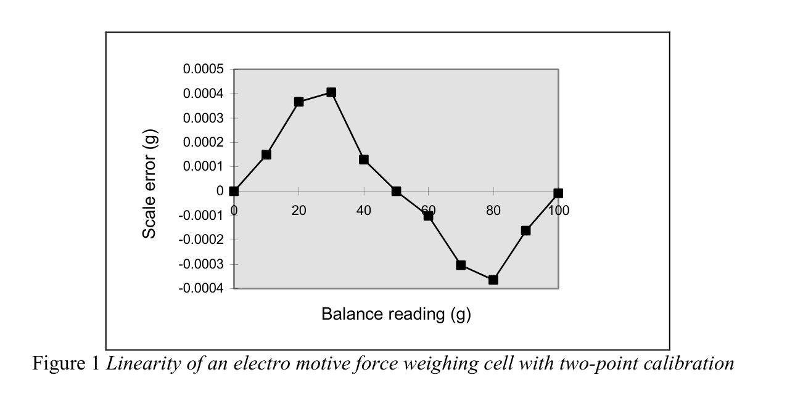
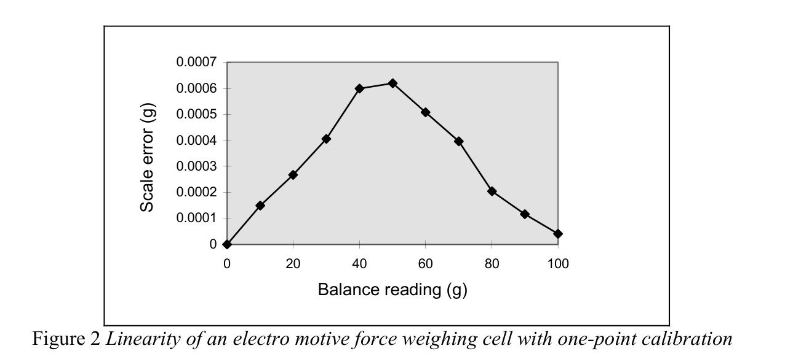
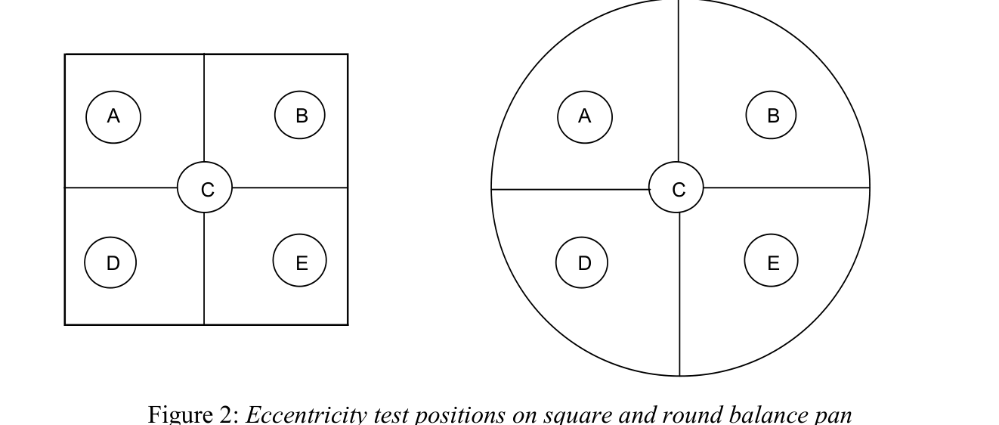
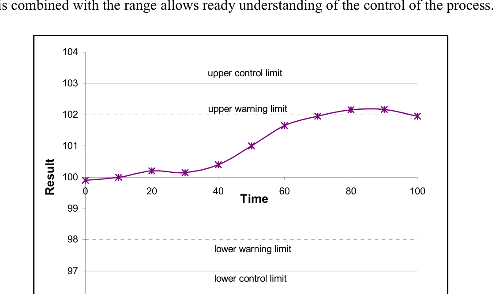
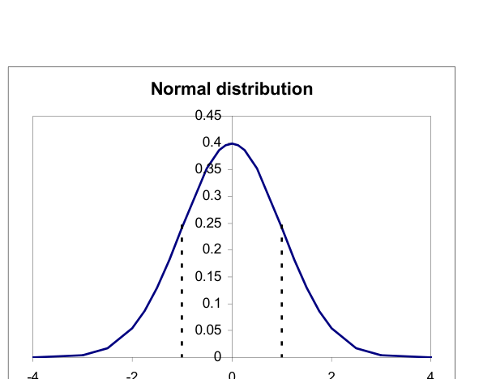
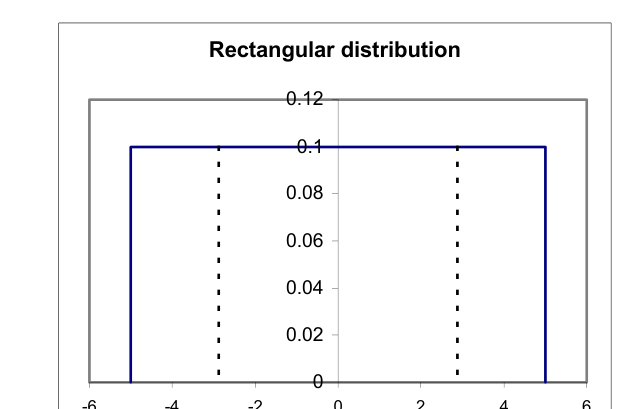
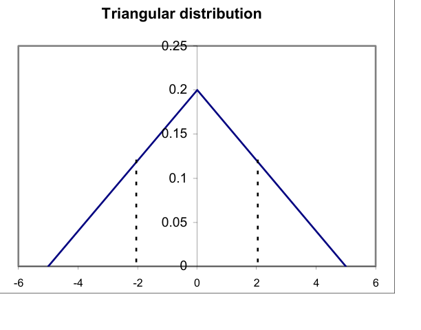
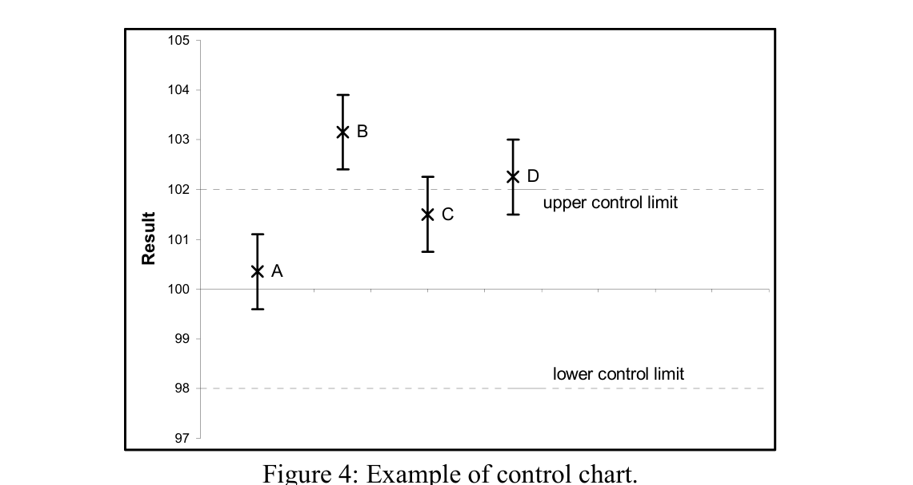

<!-- 方針: ほぼ全訳＋必要に応じた補足。原文は査読論文ではなく技術ガイドのため、書誌情報の「掲載誌」「インパクトファクター」は該当なし。原文の目次・節立てに沿って全訳する。 -->

## 書誌情報

- 標題（原題）: Measurement Good Practice Guide No. 70 — Weighing in the Pharmaceutical Industry
- 著者・所属: Ted Scorer（Scorer Consultancy）、Michael Perkin（National Physical Laboratory, NPL）、Mike Buckley（South Yorkshire Trading Standards Unit）
- 発行: 英国国立物理学研究所（National Physical Laboratory, NPL）、2004年6月、ISSN 1368-6550、© Crown Copyright 2004（Controller of HMSOの許可により複製）。英国貿易産業省(DTI) National Measurement System Directorateの資金支援を受けて作成。
- 種別・入手先: 査読誌論文ではなく、NPLが発行する実務者向け技術ガイド（Good Practice Guide）シリーズの第70号。NPL公式サイト（`https://www.npl.co.uk/gpgs/weighing-in-the-pharmaceutical-industry`）およびNPL電子出版リポジトリ（`https://eprintspublications.npl.co.uk/3027/1/mgpg70.pdf`）で無償公開。
- インパクトファクター: 該当なし（NPL技術ガイドであり、査読誌論文ではないためJCR等のIFは存在しない）。
- ライセンス: Crown Copyright（英国王室著作権）。HMSO長官の許可のもと複製。

> 補足: NAWI = Non-Automatic Weighing Instruments（非自動はかり）、USP = United States Pharmacopoeia（米国薬局方）、CFR = Code of Federal Regulations（連邦規則集）、MID = Measurement Instruments Directive（計量機器指令）、MCA = Medicines Control Agency（英国医薬品庁、当時。現MHRA）、EMF = Electro Motive Force（起電力）、OIML = International Organisation of Legal Metrology（国際法定計量機関）、GUM = Guide to the Expression of Uncertainty in Measurement（測定における不確かさの表現のガイド）、UKAS = United Kingdom Accreditation Service（英国認定機関）。本ガイドは2004年発行であり、記載される規制の年代・団体名（例: MCA、Orange Guide 2002年版）は当時のものである点に留意。

## 要旨（Abstract）

本文書は、医薬品産業における秤量を実施する際に採用すべきベストプラクティスのガイドとして意図されている。医薬品秤量に適用される現行規制の解説、一般的に使用されるはかりの種類・性能・バリデーションの記述、および使用され得る様々な秤量方式の紹介を含む。結びに、いくつかのデータ解析法と不確かさ計算法の記述がある。

## 1. 序論（Introduction）

医薬品産業は伝統的に、研究開発、一次工程（primary operations）、二次工程（secondary operations）の3部門に分かれてきた。

### 1.1 研究開発（Research and development）

研究開発の役割は次のとおりである。

- 新規の医薬活性化合物を発見する
- 既存化合物の新しい剤形を開発する
- 既存の製造工程を改善する

新規化合物の開発には、実験室規模で行われる生物学的・化学的工程が関わり、多くの場合mgスケールでの操作を伴う。新規化合物は薬理活性についてスクリーニングされ、大規模施設では年間数千化合物に及ぶ。最初のスクリーニングを通過した化合物は、実験室またはパイロットプラント規模でのさらなる生産・試験に供される。この段階を通過したごく少数の化合物が臨床試験の段階に入る。

臨床試験を通過し使用承認された化合物については、臨床試験によって治療に有効な最適な剤形・用量レベルが決定される。

### 1.2 一次工程（Primary operations）

一次工程は医薬活性化合物の生産を担う。生物学的・化学的、場合によっては滅菌工程を伴うことがある。工程は連続式またはバッチ式で操業される。製造対象の化合物により、バッチサイズは1トンを超え、容量10万リットルを超える容器を伴うこともある。

### 1.3 二次工程（Secondary operations）

二次工程は、患者が使用するのに適した剤形の調製を伴う。剤形には1つ以上の医薬活性化合物に加え、多数の他成分が含まれる。最も一般的な剤形は次のとおりである。

- 錠剤
- カプセル剤
- 注射剤
- クリーム剤
- 軟膏剤
- エアゾール剤
- 水性点鼻スプレー剤
- シロップ剤

選択される剤形は用途と最適な投与手段によって決まる。同一化合物が複数の剤形で生産されることもある。喘息治療では、同じ化合物が発作時の即時治療用エアゾール剤として、また発作予防用の錠剤として供給され得る。二次工程は通常、物理的工程でありバッチ工程として行われる。操業規模は予測販売量によって決まる。錠剤製造では100万錠を超えるバッチサイズが一般的であり、エアゾール剤・注射剤では10万個を超えるバッチサイズもあり得る。

剤形の処方には複数の成分が必要となり得る。これには次が含まれる。

- 1つ以上の医薬活性化合物
- 希釈剤
- 噴射剤
- 安定化剤
- 乾燥剤
- 結合剤
- 増量剤

錠剤の処方例として、パラセタモールとワルファリンという2つの一般的製品を挙げる。

パラセタモールは一般的な鎮痛薬で、通常500 mg錠として販売される。この「500 mg」は錠剤中に含まれる活性化合物の公称重量を指す。パラセタモール錠の重量は約525 mgとなり、追加分は製造工程での錠剤の結合を助ける化合物である。

ワルファリンは血液凝固を止める抗凝固薬の錠剤である。患者には0.5 mg、1 mg、2 mg、5 mgという各種の力価の錠剤が処方される。この「重量」も錠剤中に含まれる活性化合物の公称重量を指す。1 mgの錠剤を製造・取り扱うことは実務上困難なため、これらの錠剤にはデンプンのような不活性化合物である増量剤も含まれる。

小規模な製薬会社では、研究開発・一次・二次製造の3工程がすべて同一拠点に併設されることがある。大規模な会社では3工程が別々の拠点で行われ、多国籍企業では複数国にまたがることもある。

これらすべての工程において、幅広い種類のはかり・天びんを用いた多数の秤量が実施される。

## 2. 規制当局（Regulatory authorities）

すべての医薬品研究開発・製造は、多数の国内・国際規制団体によって管理される。英国では医薬品庁（Medicines Control Agency, MCA）が管轄当局であり、「医薬品製造業者・流通業者のための規則とガイダンス（Rules and Guidance for Pharmaceutical Manufacturers and Distributors）」、通称「オレンジガイド（The Orange Guide）」[1]を発行する。英国で販売する医薬品を製造するには、製品および製造施設がMCAの発行する許可（licence）を保有しなければならない。許可発行の過程で、製造業者はMCAの査察官による査察を受ける。施設が許可を得た後も、通常は年1回（大規模施設では年複数回に分割されることもある）の定期査察が継続して行われる。

オレンジガイドに加え、英国薬局方委員会事務局（British Pharmacopoeia Commission Secretariat）は英国薬局方（British Pharmacopoeia, BP）[2]を発行しており、特定の試験の実施方法や多数の一般試験・後発化合物の規格を詳細に定めるモノグラフを収載する。欧州薬局方モノグラフは明確に区別・相互参照されており、完全な索引により現行の法的拘束力を持つ英国規格に迅速にアクセスできる。製造業者が新規化合物やブランド版の後発化合物の許可を求める際は、実施する試験と適用する限度値を明記しなければならない。これらの試験・限度値がBPに規定されている場合、製造業者が設定する限度値はBP規定と同等以上でなければならない。

同様の規制当局はすべての欧州諸国に存在し、各国で製品を販売するには、各国当局が発行する個別の許可を取得するか、各国の要件を満たす欧州全域向けの許可を取得する必要がある。

英国の製造業者は欧州連合（EU）が発する一般指令にも従う。

米国で製品を販売するには、製品と製造施設の許可を食品医薬品局（Food and Drugs Agency, FDA）から取得しなければならない。FDAは連邦規則集第21篇（21 Code of Federal Regulations, 21 CFR）[3]を発行する。加えて米国薬局方協会（United States Pharmaceutical Convention）が米国薬局方（United States Pharmacopoeia, USP）[4]を発行しており、試験と規格を詳細に定めるモノグラフを収載する。FDAが発行する許可には、21CFRとUSPに基づいて実施されるFDA査察官による承認査察が伴う。

世界の多くの国が独自の機関・規制を有しており、欧州・米国当局の要件に対して追加的または修正的な要件を詳細に定めているものもある。

製造業者が製品を世界的に広く販売するには、すべての当局の要件を満たす必要がある。場合によっては、いずれかの当局の最高水準の基準で操業することでこれを達成できる。国によっては、その国の要件に特化してバッチを製造することでしか要件を満たせない場合もある。

## 3. 規制（Regulations）

医薬品産業でのはかりの使用を規律する規制には次が含まれる。

- 非自動はかり指令（The Non-Automatic Weighing Instruments Directive）[5]
- 米国薬局方モノグラフ41（United States Pharmacopoeia Monograph 41）
- 医薬品製造業者・流通業者のための規則とガイダンス（The Rules and Guidance for Pharmaceutical Manufacturers and Distributors）
- 連邦規則集21篇（21 Code of Federal Regulations）

### 3.1 非自動はかり指令（NAWI指令）

英国では計量法（Weights and Measures Legislation）が伝統的に、りんご1ポンド・石炭1ハンドレッドウェイトなど、重量売りの対象となる小売時点の取引を管轄してきた。EU域内では加盟国間の自由貿易を促進するため多数の指令が発せられ、指令90/384/EECは計量法の調和のために発行された。

指令90/384/EEC第1条(2)(a)は規制対象となる用途を次のように定義した。

- 商取引のための質量の決定
- 通行料・関税・税・賞与・違約金・報酬・補償その他これに類する支払の算定のための質量の決定
- 裁判手続における鑑定意見を含む、法令の適用のための質量の決定
- 監視・診断・治療目的で患者を秤量する、医療実務における質量の決定
- 薬局での処方箋調剤のための質量の決定、および医療・薬学実験室における分析での質量の決定
- 公衆への直接販売および事前包装品の計量のための、質量に基づく価格決定

非自動はかり（NAWI）指令は、法定文書 No. 1907「非自動はかり（EEC要件）規則1995（The Non-automatic Weighing Instruments (EEC Requirements) Regulations 1995）」として英国法に組み込まれた。この規則は1995年9月1日に発効したが、産業界が変更に適応する時間を確保するため10年間の適用猶予命令が課され、規則は2003年1月まで施行されなかった。

同規則の用途5「医療・薬学実験室で実施される分析における質量の決定」は、計量法の適用範囲を医薬品産業にまで拡張するものであった。西欧法定計量条約（Western European Legal Metrology Convention, WELMEC）の加盟団体が当初のNAWI指令を起草した。WELMECは本指令を補強する追加文書を発行し、「医薬品実験室とは、人体用医薬品の製造業者の品質管理実験室を指す。医薬品実験室には、これら医薬品の製造業者の研究開発実験室は含まれない」と定義した。

EU域内で販売される電気機器はすべて、低電圧・電磁両立性・無線周波数干渉などの適用可能なすべての規制に適合していることを示す「Conformance European（CE）」の刻印が必要である。2003年1月1日以前から医薬品産業で使用されていたはかりは無期限に使用を継続できる。2003年1月1日以降に規則の対象用途で使用するために購入されたはかりは、CEマークに加えて計量的に承認済み（M刻印）であることが必要である。

はかりが計量的承認を得るには、次の3段階を経る必要がある。

- 設計承認（Design approval）
- 第1段階検定（Stage 1 verification）
- 第2段階検定（Stage 2 verification）

設計承認は、はかりを規制で承認された許容仕様内に収まるよう設計し、提案する設計・製造工程について国の当局から承認を得ることを伴う。

第1段階検定は、はかりが承認済み設計に従って製造・試験されたことを確認することを伴う。

第2段階検定は顧客の設置場所での設置時に実施される。その内容ははかりの機種に依存し、製造業者が指定する。最低限必要な措置は、はかりの電源を入れて校正を実施することである。一部の機種では、製造業者が訓練したエンジニアによる設置・試験の実施が要求される。

NAWI指令は「実際の目量(actual scale interval, d)」と「検定目量(verification interval, e)」の2つの用語を組み込んでいる。NAWI指令はまた、はかりを4つの精度クラスに分類している。

- I 特級（Special）
- II 高級（High）
- III 中級（Medium）
- IIII 普通級（Ordinary）

これらのクラスの仕様を表1に示す。

| クラス | 検定目量（e） |
|---|---|
| I（特級） | 0.001 g ≤ e |
| II（高級） | 0.001 g ≤ e ≤ 0.05 g、または 0.1 g ≤ e |
| III（中級） | 0.1 g ≤ e ≤ 2 g、または 5 g ≤ e |
| IIII（普通級） | 5 g ≤ e |

表1: はかり精度クラスの仕様

補助表示装置を持たないすべての機器についてはd = eである。

補助表示装置を持つ機器には次の条件が適用される。

$$e = 1 \times 10^{k}\ \text{g（kはゼロまたは整数）} \qquad d < e \le 10d \tag{1}$$

ただし、d < 10⁻⁴ gであるクラス1の機器を除く。この場合e = 10⁻³ gとなる。

NAWI指令はまた、はかりを試験する際に許容される最大許容誤差を規定している。最大許容誤差ははかりの精度クラスと負荷される荷重に依存し、表2に示す。

| 負荷 Class I | 負荷 Class II | 負荷 Class III | 負荷 Class IIII | 最大許容誤差 |
|---|---|---|---|---|
| 0 ≤ m ≤ 50,000e | 0 ≤ m ≤ 5,000e | 0 ≤ m ≤ 500e | 0 ≤ m ≤ 50e | ± 0.5e |
| 50,000e < m ≤ 200,000e | 5,000e < m ≤ 20,000e | 500e < m ≤ 2,000e | 50e < m ≤ 200e | ± 1.0e |
| 200,000e < m | 20,000e < m ≤ 100,000e | 2,000e < m ≤ 10,000e | 200e < m ≤ 1,000e | ± 1.5e |

表2: 各はかり精度クラスの最大許容誤差

表に示す最大許容誤差は、はかりの設置時に行う原初試験に対して許容されるものである。設置後に実施する試験については、最大許容誤差は表2の値の2倍となる。

分解能0.0001 gで補助表示装置を装着したクラスIのはかりで、0.1 gの試料を正確に秤量するために使用する場合、最大許容誤差は±1.0e、すなわち±0.001 gである。補助表示装置付きはかりの最小検定目量(e)は0.001 gであるため、分解能0.01 mg・0.001 mg・0.0001 mgのはかりでも最大許容誤差は±0.001 gのままである。M刻印はかりでは、製造業者が非検定桁を陰影・着色などで強調して表示することで検定済み範囲を示す。M刻印はかりからの印字結果では、非検定桁は括弧付きまたは同様の強調手段で表示される。

法定はかりが小売時点で使用される場合、販売価格は検定済み桁のみに基づいて算定できる。例えば、分解能0.01 g・検定目量0.1 gのはかりで12.34 gという秤量値が表示された場合、販売記録は12.3 gとしなければならない。医薬品産業では最小許容検定目量0.001 gよりも高い精度での秤量が要求されるため、提供されるスケール分解能をすべて使用すべきである。補助表示装置付きクラス1のはかりでは、ユーザーは表2に規定された限度を超える社内限度を適用しなければならない。クラスII・III・IIIIのはかりでは、ユーザーが適用する限度は表2の規定値と同等以上でなければならない。

### 3.2 米国薬局方モノグラフ41（United States Pharmacopoeia Monograph 41）

米国薬局方モノグラフ41は、はかりの試験に用いるべき分銅クラスを規定し、はかりで秤量できる最小重量も規定している。これを次の抜粋に示す。

> 「薬局方試験・アッセイは、容量・感度・再現性の異なるはかりを要求する。特に指定のない限り、アッセイのために物質を『正確に秤量する』場合、その測定不確かさ（ランダム誤差と系統誤差の合計）が読み値の0.1%を超えない秤量装置で実施しなければならない。測定不確かさは、少なくとも10回の反復秤量の標準偏差の3倍を秤量量で除した値が0.001を超えない場合に満足のいくものとされる。特に指定のない限り、滴定量限度試験では、秤量は滴定剤濃度の有効数字の桁数に対応する分析対象重量の有効数字の桁数が得られるよう実施するものとする。」

表3は、分解能0.01 mgのはかりで実施した10 mgの分銅の10回反復秤量の結果を示す。この表に示すばらつきは、製造業者の仕様どおりに動作するほとんどの5桁天びんで典型的なものである。

| 反復 | 結果（g） |
|---|---|
| 1 | 0.01001 |
| 2 | 0.01002 |
| 3 | 0.01003 |
| 4 | 0.01004 |
| 5 | 0.01005 |
| 6 | 0.01001 |
| 7 | 0.01002 |
| 8 | 0.01003 |
| 9 | 0.01004 |
| 10 | 0.01005 |
| 平均 | 0.01003 |
| sd | 1.4907 × 10⁻⁵ |

表3: 10 mg分銅の10回反復秤量の結果

表3の結果について、モノグラフ41に従って計算した測定不確かさは次のとおりである。

$$\frac{3 \times 0.000014907}{0.01000} = 0.00447 \tag{2}$$

この値は0.001を上回るため、このはかりは10 mgの試料を正確に秤量するのに適さない。表4に、表3と同じ分散を持つ50 mg分銅のシミュレーション反復秤量結果を示す。

| 反復 | 結果（g） |
|---|---|
| 1 | 0.05001 |
| 2 | 0.05002 |
| 3 | 0.05003 |
| 4 | 0.05004 |
| 5 | 0.05005 |
| 6 | 0.05001 |
| 7 | 0.05002 |
| 8 | 0.05003 |
| 9 | 0.05004 |
| 10 | 0.05005 |
| 平均 | 0.05003 |
| sd | 1.4907 × 10⁻⁵ |

表4: 50 mg分銅の10回反復秤量の結果

表4の結果について、モノグラフ41に従って計算した測定不確かさは次のとおりである。

$$\frac{3 \times 0.000014907}{0.05000} = 0.000894 \tag{3}$$

この値は0.001未満であるため、このはかりは50 mgの試料を正確に秤量するのに適する。

### 3.3 医薬品製造業者・流通業者のための規則とガイダンス

2002年版「医薬品製造業者・流通業者のための規則とガイダンス（オレンジガイド）」には、はかり・秤量操作への直接・間接の言及が多数存在する。

これらの言及はすべて、製造を規律する第1部（Part 1）に由来する。多くの引用箇所では「should（すべきである）」という語が用いられているが、これらおよび他の部分において、ベストプラクティスの達成を目指す組織は「should」を「must（しなければならない）」と読み替えるべきである。はかりを校正しない、記録を保持しないといった判断が査察官に弁明できる状況は、いかなる状況でもほぼ想定し難い。

第4章はEUの製造ガイダンスを扱い、その3節（施設と設備）には3つの重要な言及がある。

> 3.13 出発原料の秤量は通常、その目的のために設計された別室の秤量室で実施すべきである。

第10.1章では、調剤室でのはかりの使用が論じられている。

> 3.40 生産・管理操作には適切な範囲・精度のはかりおよび計量機器が利用可能であるべきである。
>
> 3.41 計量・秤量・記録・管理機器は、定められた間隔で適切な方法により校正・点検されるべきである。かかる試験の適切な記録が維持されるべきである。

第10章は生産・実験室秤量工程で使用されるはかりを扱う。50 gまでを0.0001 g分解能で、200 gまでを0.001 g分解能で秤量する必要がある領域では、200 gを0.0001 g分解能で秤量できる単一のはかりを使う方が費用対効果が高いと判断されることがある。多くの場合、はかりメーカーは1台で組み合わせた要件を満たせるデュアルレンジのはかりも提供している。

第6節「品質管理」には、優良な品質管理実験室実務（Good Quality Control Laboratory Practice）の節に、秤量手順に非常によく適用される2つの一般規定がある。

> 6.15 分析法はバリデーションされるべきである。販売承認書に記載されたすべての試験操作は、承認された方法に従って実施されるべきである。
>
> 6.16 得られた結果は、相互に整合していることを確認するため批判的に点検されるべきである。すべての計算は批判的に検証されるべきである。

分析法は単純に秤量操作を伴うのみの場合（例: 第10.2章の重量均一性試験）もあれば、秤量操作が多段階工程の一部となる場合もある。分析法は品質管理実験室で実施されることもあれば、生産エリアでの工程内管理チェックの一部として実施されることもある。電子天びんを含む多くの分析機器では計算が実行されている。6.16の一部として、機器または関連するコンピュータソフトウェアで使用されている計算アルゴリズムを理解しておくことが不可欠である。ソフトウェアまたは機器の供給者がこのアルゴリズムの試験について十分なバリデーションを提供できない場合、ユーザーが機器の適格性評価工程の一部としてこのバリデーションを実施しなければならない。

附属書10「吸入用加圧式計量投与エアゾール製剤の製造」には次の言及がある。

> 8 2ショット充填工程を使用する場合、正しい組成を達成するために両方のショットが正しい重量であることを確認する必要がある。この目的のため、各段階での100%重量チェックがしばしば望ましい。

喘息治療用など多くの加圧式計量投与エアゾール製剤には、噴射剤混合物中の医薬活性成分の懸濁液が含まれることがある。製造を容易にするため、活性成分を添加する充填ヘッドと噴射剤を添加する第2の充填ヘッドを別々に使用することが決定される場合がある。この状況は附属書10の第8節で述べられており、両充填工程それぞれの後に100%チェックウェイングを実施することが推奨されている。両段階での100%チェックウェイングが実施できず統計的サンプリング戦略を用いる場合、2つの充填ヘッドの信頼できる性能がバリデーションによって実証されていることが不可欠である。

附属書15は適格性評価とバリデーションの原則を記述している。

附属書18「原薬（API）の適正製造基準（GMP）」には次の言及がある。

工程設備・校正の下で:

> 5.30 中間体・原薬の品質保証にとって重要な管理・秤量・計測・監視・試験機器は、文書化された手順と確立されたスケジュールに従って校正されるべきである。
>
> 5.31 機器の校正は、既存であれば認証標準にトレーサブルな標準を用いて実施されるべきである。
>
> 5.34 校正基準を満たさない機器は使用すべきでない。
>
> 5.35 重要機器の承認済み校正基準からの逸脱は、前回の校正合格以降にその機器を用いて製造された中間体・原薬の品質に影響を与えた可能性があるかどうかを判定するため調査されるべきである。

第9章ははかりの校正・試験の記述、および校正・性能試験に使用すべき分銅の議論を扱う。第9章はまた、はかりの性能試験を実施すべき最低頻度も記述する。第5.35節は、はかりが性能チェックに不合格となった場合、前回の合格校正チェック以降に実施されたすべての測定を評価しなければならないと定めている。これは重要な要因であり、次の例で論じる。

商業的判断により、優良実務に合致する再現性試験を最大頻度である週1回で実施することが決定された。これは、次の性能チェックではかりが規格外であることが判明した場合の組織へのコストと照らして判断されなければならない。その場合、規格外であった可能性のある週にそのはかりで実施したすべての結果を評価するコストと、無効と判断された試験を再実施するコストが発生する。

工程設備・コンピュータ化システムの下で:

> 5.40 GMP関連のコンピュータ化システムはバリデーションされるべきである。バリデーションの深度と範囲はコンピュータ化アプリケーションの多様性・複雑性・重要性に依存する。

プリンタを併用または単独で動作する現代の電子天びんは、コンピュータ化システムとみなされ得るため、システムの適切なバリデーションを実施しなければならない。最低限、これには校正・性能チェック、および使用される計算アルゴリズムを含む機能のバリデーションが含まれなければならない。

文書化と記録・実験室管理記録の下で:

> 6.61 次についても完全な記録が維持されるべきである。
> - 既存の分析法への変更
> - 実験室機器・装置・ゲージ・記録装置の定期校正
> - 原薬に対して実施したすべての安定性試験
> - 規格外（OOS）調査

校正の記録は維持されなければならない。自動内部校正機能を持つはかりについては、可能な限りプリンタを接続して自動校正を記録すべきである。

バリデーション・バリデーション方針の下で:

> 12.10 生産工程・洗浄手順・分析法・工程内管理試験手順・コンピュータ化システムのバリデーションを含む、会社全体の方針・意図・アプローチ、および各バリデーション段階の設計・レビュー・承認・文書化の責任者は文書化されるべきである。

バリデーション・分析法のバリデーションの下で:

> 12.80 使用する方法が関連薬局方または他の認められた標準参照文献に収載されている場合を除き、分析法はバリデーションされるべきである。それでも、使用されるすべての試験法の適合性は実際の使用条件下で検証され文書化されるべきである。
>
> 12.82 分析法のバリデーションに先立ち、分析機器の適切な適格性評価が検討されるべきである。

秤量操作を伴う分析法は、使用するはかりが事前に適格性評価バリデーションに合格しており、かつはかりの性能チェックが指定された間隔内ですべて正常に完了していない限り、バリデーションできない。

用語集では、コンピュータシステムを次のように定義している。

> 特定の機能または機能群を実行するために設計・組み立てられたハードウェアコンポーネントと関連ソフトウェアの群。

コンピュータ化システムは次のように定義される。

> データの入力、電子的処理、報告または自動制御に用いる情報の出力を含むシステム。
>
> コンピュータシステムと統合された工程または操作。

### 3.4 連邦規則集21篇（21 Code of Federal Regulations）

電子記録および電子署名

21 CFR第11部（21 CFR part 11）は、電子記録・電子署名の使用を規律する規制を詳述する。

21 CFR part 11は電子記録を、コンピュータシステムによって作成・変更・維持・保管・検索・配信される、テキスト・グラフィック・データ・音声・画像その他の情報表現の任意の組み合わせとして定義する。

21 CFR part 11の第10節は「電子記録の真正性・完全性、および適切な場合には機密性を確保するよう手順・管理を設計しなければならない」と規定している。第10節はまた、「電子記録を作成・変更・削除するオペレーターの入力・操作の日時を独立して記録する、安全な、コンピュータ生成のタイムスタンプ付き監査証跡の使用」を要求する。「記録の変更は、以前に記録された情報を不明瞭にしてはならない」。

はかりが、秤量データが保存され再処理のために利用可能なコンピュータシステムの一部として使用される場合、米国向けに製造される製品については21 CFR part 11に従ってソフトウェアと電子記録を管理しなければならない。秤量データがスプレッドシートプログラム（例: Microsoft Excel©）に保存される場合もこれらの規制に従うべきであり、複数の企業がExcel©使用時に21 CFR part 11要件を満たすためのソフトウェアパッケージを提供している。

21CFR part 11は英国の医薬品製造ガイドの一部ではない。しかし、電子記録を含む記録保持に関する一般的な欧州指令を満たす必要がある。コンピュータプログラムやスプレッドシートアプリケーションに保存される秤量データはすべて21CFR part 11の要件を満たすべきである。

多くの電子天びん・はかりには、その作業・操作環境に最適化するための広範な構成可能パラメータが含まれる。この構成は電子記録ではないが、電子的な生データとして扱われるべきである。はかりの設置バリデーション時に使用された構成は記録されなければならず、この構成への変更とその理由は文書化されるべきである。製造業者が構成可能パラメータを保護する機能を提供している場合は常に、構成への偶発的な変更を防ぐためこれらを使用しなければならない。これには、改ざん防止ラベルで覆うことができるジャンパースイッチのような機械的機能、またはパスワードの使用を要求するソフトウェアロックが含まれ得る。

### 3.5 計量機器指令（Measurement Instruments Directive, MID）

EUの規制調和を目指す継続的指令の一環として、計量機器指令（MID）は本節執筆時点でまさに承認されようとしている。MIDは自動はかりを含む幅広い測定機器を対象とする。

公布されると、MIDは当該機器の製造・使用・試験に関する節を含むことになる。

MIDを組み込む英国規則がその後発行され、MIDはその後英国法に組み込まれる見込みである。これまでの指令が英国法に組み込まれた際には、既存の設置は新要件から除外されてきた。しかし、英国規則で定められた日付以降に有効となる自動秤量機器の設置は、新規制を満たすことが要求される。

## 4. 秤量セル（Weighing cells）

医薬品産業で使用される秤量セルは次のように分類できる。

- ロードセル（Load cells）
- 起電力（Electro motive force, EMF）セル
- その他

### 4.1 ロードセル

ロードセルは、測定対象の試料をアームの先端に加えることで動作する。曲げ力がひずみゲージによって測定され、重量に変換される。ロードセルは非常に高い容量、非常に高い動作速度を持つが、分解能は比較的低い。

### 4.2 起電力（EMF）セル

これは医薬品産業のはかりで最も一般的に使用されるセルである。秤量対象の試料はプラットフォーム上に置かれ、一連のレバーが電磁石内に取り付けられた秤量セル内の基準点の変位を生じさせる。電磁石に電流を印加して基準点を初期のヌル位置に戻す。印加された電流が重量に変換される。EMFセルは容量が比較的低く動作速度も比較的遅いが、非常に高い分解能を持つ。現代のEMFセルは300万分の1を超える分解能を持つことがあり、これは300 gの範囲で0.0001 gの分解能を可能にする。

### 4.3 その他

一部の製造業者は振動ワイヤ式など他のいくつかの秤量セルを製造している。これらのセルはロードセルと同様の特性を持ち、医薬品産業では広くは使用されていない。

## 5. はかりの種類（Types of balance）

医薬品産業は幅広い秤量機器を使用する。これらは次のように分類できる。

- ロードセル
- 台はかり（Platform scales）
- 精密天びん（Precision balances）
- 分析用天びん（Analytical balances）
- セミミクロ天びん（Semi-micro balances）
- 微量天びん（Microbalances）

ロードセル以外のこれらすべてのカテゴリは、通常、起電力式秤量セルを使用する。

### 5.1 ロードセル

ロードセルは容量10 kgから数トンで、通常0.1 kg以上の分解能を持つ。製造操業では、バッチ生成時に加える原料の量を管理するため、生産容器がロードセルに搭載されることがある。

### 5.2 台はかり

台はかりは容量1,000 kg以上に達することがあり、分解能は0.1 g以上である。バッチに加える原料の量、または製造された製品の量を測定するため医薬品産業で広く使用される。ソフトウェア機能（例: 個数計数）を伴って運用される台はかりもあり、製品重量を単位数（例: 生産された錠剤数）として表示できる。

### 5.3 精密天びん

精密天びん、すなわちトップパン式天びんは、容量20 kgまでで分解能0.001 g以上を持つ。実験室・生産操業を通じて医薬品産業で非常に広く使用される。実験室では試薬調製時の原料秤量など一般的な秤量操作に使用される。生産エリアではバッチに加える少量の原料の秤量、または工程の品質管理の一部としてのチェックウェイング操作に使用され得る。

### 5.4 分析用天びん

分析用天びんは容量500 gまでで分解能0.1 mgまたは0.01 mgを持つ。これらの天びんには秤量室を形成する閉鎖型の風防が備わる。分析用天びんは主にアッセイ実施時の試料秤量のために実験室エリアで使用されるが、少量を秤量する生産エリアで精密天びんの代替として使用されることもある。

### 5.5 セミミクロ天びん

セミミクロ天びんは容量30 gまでで分解能0.001 mgまたは0.002 mgを持つ。これらの天びんは通常、製造業者の分析用天びんラインナップの拡張であり、分析用天びんより高精度な秤量が必要だが完全な微量天びんは正当化されない実験室秤量に使用される。

### 5.6 微量天びん

微量天びんは通常容量1 g未満で分解能少なくとも0.0001 mgを持つ。非常に精密な秤量が必要な実験室エリアで使用される。

いかなるはかりも、製造・試験段階で使用される前にバリデーションされなければならない。

## 6. はかりの設置場所（Location of a balance）

はかりを設置する秤量台は、振動の伝達を最小化し、秤量操作時にたわみが生じないよう設計されなければならない。台は静電気の蓄積を防ぐためアースされ、非磁性材料で作られていなければならない。最適なのは床置きで周囲の作業エリアから独立した研磨花崗岩製の台である。木製またはステンレス鋼製の台も使用され得るが、ステンレス鋼は最高等級以外はわずかな磁性を示すため、秤量台の表面として理想的ではない。

はかりを設置する部屋は温度・湿度が管理されていなければならない。分解能0.1 mgのはかりでは、環境温度の1℃の変化が100 gの分銅の読み値に0.1 mgの変化をもたらす。

はかりは空調装置やファン（コンピュータなどの電気機器の冷却ファンを含む）から離れた場所に設置すべきである。また、直射日光が当たらない場所に設置すべきである。日光は秤量室に局所的な温度変動を生じさせ得る。

一部の設置、特に生産環境では、はかりを理想的な場所に設置することができない場合がある。例えば、はかりを振動を発生する装置の近くに設置する必要がある場合や、通気による影響を受ける吸引キャビネット内に設置する必要がある場合がある。ただし、はかりのフィルタレベルを製造業者が設定してこれらの影響を最小化できる場合もある。

いかなる状況においても、はかりの性能を評価し、実施する作業に対して十分であることを実証しなければならない。

## 7. 校正用分銅（Calibration weights）

はかりの校正・性能チェックは、内部または外部の校正用分銅を使用して実施され得る。注: 計量的承認済みのはかりでは、校正調整は内部分銅の使用によってのみ実施できる。

### 7.1 内部分銅

多くの電子天びんでは、製造業者が1つまたは複数の内部校正分銅を装着している。これらの分銅は分銅の自動的な負荷・除荷を可能にするよう製造業者によって設計されており、通常ダンベル型である。製造業者は分銅の質量を正確に把握しており、これらの値ははかりのメモリ内に保存される。これらの分銅の設計・許容差は国際法定計量機関（OIML）の仕様[6]のいずれにも準拠しない。これらの分銅は次の場合に校正調整を実施するために使用できる。

- ユーザーによって選択された場合
- 製造業者が指定する温度変化（例: 1℃）が生じた場合
- 製造業者が指定する時間（例: 4時間）が経過した場合

内部校正は次を行う。

- はかりのゼロ点を調整する
- はかりの最大負荷を調整する
- 2つの分銅が使用される場合、はかりの直線性の中点を調整する

内部校正分銅を使用して性能チェックを実施することもできる。ユーザーは内部校正分銅の追加を選択できる。はかりの表示は製造業者間・同一製造業者の機種間で異なるが、次のいずれかを表示する。

- 校正分銅の真の質量
- 公称値に基づく校正分銅の補正値
- 校正分銅の測定値と記録値の差

一部のはかり機種では、内部校正分銅の反復追加によって再現性試験を実施できる。これらのはかりの一部について、製造業者が米国薬局方モノグラフ41（USP41）の最小重量計算を実施するアルゴリズムを提供していることがある。

内部校正分銅を用いて校正されるはかりについて、内部校正分銅を用いて性能チェックが実施される場合、これらの試験は適切なOIML仕様の外部分銅を用いた試験によって補完されなければならない。

最小重量要件を計算するアルゴリズムを含むはかりでは、通常はかりの公称容量の100%の分銅を反復追加することで標準偏差が計算される。この試験は、はかりの最小重量（例: 分解能0.01 mgのはかりでは50 mg）に適した分銅を用いて、少なくともはかりの初期設置時に手動で反復実施しなければならない。

### 7.2 外部分銅

OIMLは、はかりの校正調整・性能チェックに使用される分銅について多数のクラスを規定している。この仕様は各クラスの構成材料・形状・許容差を定めている。いくつかの分銅クラスには、再認証時に分銅を調整する手段が備わっている。

F1のような分銅セットでは、分銅がオーステナイト系（非磁性）ステンレス鋼で製造され、ねじキャップでアクセス可能な中空部を持つ。小さなステンレス鋼球を中空部に加除することで分銅を許容差内に戻すことができる。

100 g以上の鉄製分銅セットは、通常分銅の底部に穴が開けられており、鉛を加除することで許容差内に戻すことができる。

### 7.3 外部分銅の校正

すべての分銅セットは定期的に再校正されなければならない。クラスE2の分銅は2年ごと、クラスF1以下の分銅は毎年である。エンドユーザーは校正間のドリフトを監視し、各分銅について工程仕様を設定すべきである（同一クラス・サイズの分銅でも、使用方法・ドリフト率等に応じて異なる場合がある）。再校正は、英国認定機関（UKAS）の認定を受けISO 17025の標準に従って業務を行う実験室で実施されなければならない。

### 7.4 チェックウェイト

生産の一部エリアでは、はかりの性能をチェックするために分銅の使用が必要となるが、校正済み分銅セットの使用は妨げられる場合がある。例えば、無菌製造施設のクリーンルームでチェックウェイングに使用されるはかりである。クリーンルーム施設では、すべての材料は入室前に滅菌されなければならず、滅菌工程は校正証明書を無効化する。このような状況では、はかり試験の実施に低い基準のチェックウェイトを使用してよいが、これらの分銅に値・許容差を割り当てる適切な手順を開発しなければならない。滅菌が必要な場合、滅菌工程の影響を大きく受けない一体成型の分銅が推奨される。可能であれば、使用中に容易に識別できる（そして混同されない）よう、各分銅に識別番号を刻印すべきである。

### 7.5 分銅の保管と取扱い

すべての分銅は、汚染を防ぐため非常に清潔に保たれる裏張りされた容器に保管しなければならない。ガラスの下で保管することもできる。

すべての分銅は、リントフリーの布地または手袋（より良いタイプの1つはウィケットキーパー用の洗浄済みシャモア革の内側手袋）、または非金属端のピンセットを使用して取り扱わなければならない。ほとんどの分銅メーカーは、より大きな分銅を持ち上げるのに適した分銅フォークも提供している。

詳細はグッドプラクティスガイド「分銅の洗浄・取扱い・保管（Cleaning, Handling and Storage of Weights）」[7]を参照のこと。

## 8. はかりのバリデーション（Validation of a balance）

### 8.1 ユーザー要求仕様（User requirements specification）

バリデーションの初期段階は、はかりのユーザー要求仕様（URS）を作成することである。これは書式または文書として必ず記録されなければならない。これがバリデーション演習の残りの部分で実施される試験の基礎を形成するためである。注: 新規のはかりが同一目的で使用される既存はかりの追加ユニットである場合、既存はかりのURSを使用してよい。

URSは最小・最大秤量容量、はかりの分解能、および計量的承認モデルのはかりが必要かどうかを明記しなければならない。デュアルレンジのはかりを購入する場合、両レンジの容量・分解能を明記しなければならない。

URSにはさらに、はかりの使用に特有の詳細を含めてよい。これには次が含まれ得る。

- はかりに必要な特別な機能（例: 個数計数用か動物秤量用か）
- 秤量皿の形状・面積
- 秤量室の面積・高さ（例: 容器を秤量するか）
- 必要な電源（例: 115V、240V、または電池式）

URSが完成したら、その要求事項をはかり供給業者の担当者と協議したり、製造業者の資料やウェブサイトを確認したりしてよい。

### 8.2 設計時適格性確認（Design qualification, DQ）

設計時適格性確認（DQ）は、はかりの発注前に実施すべきである。DQ演習では、URSで規定された特徴と、購入が提案されているはかりの実際の値とを比較する。この時点で、実際の値が要求値より優れている場合（例: はかりの最大容量が150 gの要求に対し250 gである場合）もあれば、要求を満たさない場合（例: 実際容量250 gに対し要求300 gである場合）もある。

DQ演習で、提案されたはかりが1つ以上の要求事項を満たさないことが示された場合、代替のはかりを選定するか、選定したはかりを使用できるよう手順を改訂できるかを見るためURSの見直しを行うべきである。

DQ演習でURSへの変更が必要となった場合、これはDQ報告書またはURSの改訂において文書化されなければならない。

### 8.3 コンフィギュレーション（Configuration）

多くの電子天びんには、はかりをその操作環境・必要な作業に合わせて構成するための、ユーザーが選択可能な多数の値が含まれる。これには次が含まれ得る。

- 校正タイプ
- 振動アダプター
- 安定性検出器
- 重量単位
- スケール分解能
- 風防制御
- インターフェース構成
- 個数計数などの特殊機能

設置時適格性確認の開始前に、はかりは必要な設定に構成されなければならず、はかりの能力に応じて印字または手動で記録・保存されなければならない。はかりの構成をロックする手動または電子的な機能が提供されている場合、偶発的な構成変更が発生することを防ぐため、この時点で適用しなければならない。

設置・運転・性能適格性確認の実施後に、操作環境の変化の結果などによりはかりの構成を変更する必要がある場合、構成への変更とその理由は文書化・保存されなければならない。加えて、設置・運転・性能適格性確認の見直しを実施し、バリデーション試験を繰り返す必要性についてアウトカムを評価・文書化しなければならない。外部のサービスエンジニアがエンドユーザーの知らないうちにはかりの設定を変更しないよう注意を払わなければならない。

### 8.4 設置時適格性確認（Installation qualification, IQ）

設置時適格性確認（IQ）は、はかりの顧客への納入直後に、はかりの通常の操作環境で実施されなければならない。IQ演習には次のチェックを含めなければならない。

- 正しいモデルのはかりが納入されたこと
- 付属機器が納入されたこと
- はかりの電源投入時にエラーが報告されないこと
- はかりの校正が実施されていること
- はかりの性能チェックが正常に実施されていること

計量的承認済みのはかりでは、はかりの納入時に第2段階検定を実施する必要がある。はかりの製造業者は第2段階検定の要件を規定しており、これらはIQ演習の一部として実施されなければならない。はかりの機種によっては、第2段階検定は単に顧客がはかりの内部校正を実施することのみを要求する場合もあれば、エンジニアによる設置訪問を要求する場合もある。

ユーザーの手順に応じて、はかりの校正・性能チェックは、ユーザー・製造業者・サービス提供者の適切に訓練されたスタッフによって実施され得る。

### 8.5 運転時適格性確認（Operational qualification, OQ）

運転時適格性確認（OQ）には、URSで規定された各要素のうちIQ演習で試験されていないものすべてが試験されるよう、試験を含めなければならない。URSとはかりの機種に応じて、これらの試験には次の試験が含まれ得る。

- 風袋機能
- はかりの最大容量
- 自動校正機能
- 付属機器（例: プリンタ）の動作
- 個数計数などの専門機能

運転時適格性確認段階では、次のステップも実施しなければならない。

- はかりの標準操作手順の作成
- スタッフへのはかり使用の訓練
- はかりの保守手順の作成

### 8.6 性能適格性確認（Performance qualification, PQ）

上級スタッフまたはバリデーションの専門技能を持つスタッフが、設置・運転時適格性確認の試験を実施してよい。はかりを日常業務で使用するスタッフが性能適格性確認（PQ）を実施しなければならない。これは、はかりについて開発された運用手順とスタッフの訓練が満足のいくものであったことを実証するためである。

はかりが、依然として稼働している既存のはかりの直接的な置き換えとして設置される場合、PQには2台のはかりの結果の同等性を示す試験を含めなければならない。

PQにはまた、通常条件下で稼働している際にはかりがユーザー要求を完全に満たしていることを示すため、指定期間（例: 1か月）後にラインマネジメントによるはかりの性能レビューを含めなければならない。

## 9. 性能チェック（Performance checks）

性能・校正チェックは、はかりが引き続き許容範囲内で動作していることを確認するために実施される。性能チェックは、国および国際標準にトレーサブルな既知の値を持つ適切な分銅を用いて実施されなければならない。英国では、トレーサビリティは通常、テディントンの国立物理学研究所に保管される国家標準K18を通じて、さらにパリのセーブルにある国際度量衡局に保管される国際キログラム原器へと提供される。

すべてのはかり・スケールについて定期的に実施しなければならない日常的な性能チェックは次のとおりである。

- 再現性
- 直線性
- ヒステリシス
- 偏心

### 9.1 秤量セルのエクササイズ

はかりの性能チェックを開始する前に、秤量セルの温度が平衡に達するよう秤量セルを「エクササイズ」しなければならない。

はかりブラシを使用して、はかり容量の約50%の負荷が加わるまで秤量皿にそっと圧力を加えなければならない。加えた負荷はその後はかりから取り除き、直ちに試験を実施しなければならない。

### 9.2 再現性

再現性試験は次のように実施する。

1. はかりを風袋引きする。
2. はかりにチェック分銅を追加し、重量を記録する。
3. はかりから分銅を取り除く。
4. 同一のチェック分銅について少なくとも10回の秤量が実施されるまで手順1〜3を繰り返す。
5. 適切な統計ソフトウェアを用いて反復秤量の平均・標準偏差を計算する。
6. 指定されたすべてのチェック分銅を秤量するまで手順1〜5を繰り返す。

再現性試験は、はかり／レンジの通常容量、およびそのはかりで実施される秤量の大部分を代表する試験点で実施すべきである。加えて、デュアルレンジまたはポリレンジのはかりでは、再現性試験は微細・粗大の両方のスケール分解能で実施しなければならない。

再現性試験は最低週1回の間隔で実施しなければならない。

### 9.3 直線性

直線性試験は理想的には、操作秤量範囲全体に広がる少なくとも10点（例: 200 gのはかりで20 g間隔）で行うべきであるが、最低3点を使用できる。50%と100%の容量に内部校正分銅を2個持つ起電力式はかりでは、直線性は負荷の約25%・75%付近で理論線からの最大偏差を示すことが知られており、図1に示す。

100%容量に内部校正分銅1個を持つはかりでは、理論線からの最大偏差は容量の約50%付近で生じる。図2に示す。

したがって、内部校正分銅を2個持つはかりでは、直線性チェックを実施する適切な3点はフルロードの0%・25%・75%である。多くのはかりは公称最大負荷よりわずかに大きい容量を許容する（例: 公称容量200 gのはかりが実容量205 gを持つ場合がある）。直線性試験の試験点を選択する際は、使用する分銅の数を最小化する値を選ぶべきである。前述の例では、50 gの分銅と50 g・100 gの組み合わせを使用できるよう、50 gと150 gの試験点を選択すべきである。

直線性試験は最大1週間の間隔で実施しなければならない。

自動校正時に直線性を調整するために使用される2つ以上の内部校正分銅を含むはかりでは、この間隔を6か月に延長できる。

はかりが限定された範囲でのみ使用される場合（例: 200 gのはかりで100 gまで使用）、使用範囲でのみ直線性を試験すればよい。制限された試験範囲を示すラベルを恒久的かつ見やすくはかりに貼付すべきである。

デュアルレンジまたはポリレンジのはかりでは、再現性試験は微細スケール分解能で実施しなければならず、粗大スケールでも実施してよい。

### 9.4 ヒステリシス

ヒステリシスとは、同じ重量に上下から近づく際に生じる誤差である。ヒステリシスは、はかりの範囲をカバーする最低3点（例: 負荷の0%・50%・100%）で試験すべきである。直線性と同様、使用する分銅を最小限にできるよう試験点を選ぶべきである。直線性試験の例で示したはかりを使用すると、0 g・100 g・200 gの試験点を選ぶべきである。

1. はかりをゼロ表示になるよう風袋引きする。
2. 100 gの分銅を追加し、重量を記録する。
3. 2個目の100 gの分銅を追加し、重量を記録する。
4. 2個目の100 gの分銅を取り除き、重量を記録する。
5. 手順2と4の重量の差がヒステリシス誤差である。
6. 1個目の100 gの分銅を取り除き、重量を記録する。
7. ゼロからの差がヒステリシス誤差である。

ヒステリシス試験は最大6か月の間隔で実施しなければならない。

### 9.5 偏心

偏心は、試料が秤量皿上で物理的に中央に置かれていない状態で秤量が実施された場合に生じ得る。

デュアルレンジまたはポリレンジのはかりでは、偏心試験は粗大スケール分解能で実施しなければならない。

偏心試験は、はかり容量の約50%で実施すべきである。直線性の節で使用した例では、試験に100 gの分銅を使用する。分銅は秤量皿の中心Cに置かれ、はかりはゼロ重量を表示するよう風袋引きされる。その後、分銅は図2に示す試験点A、B、D、Eに順に移動され、ゼロからの偏差が記録される。

## 10. 生産工程での秤量方式（Production weighing styles）

生産での秤量方式は3つのカテゴリに分けられる。

- 調剤（ディスペンサリー）作業
- チェックウェイング
- リコンシリエーション（数量照合）

### 10.1 調剤（ディスペンサリー）作業

調剤作業は、ロードセルに搭載された容器に直接投入する方法で実施される。通常、容器を風袋引きし、成分1の必要量を追加し、容器を再度風袋引きし、成分2の必要量を追加し、すべての成分が追加されるまでこのサイクルを繰り返す。この手法は、すべての秤量の精度がロードセルに適切な場合に適する。

二次工程では、バッチの成分量が大きく変動し得る。軟膏バッチの調製では、次を秤量する必要があるかもしれない。

- 基剤100 kg（通常パラフィンワックス）
- 安定化剤1 kg
- 活性成分0.1 kg

この状況では、100 kgを秤量できる容量のスケールは、活性成分を必要な精度で測定できるスケール分解能を持たない。同様に、活性成分を正確に測定できるスケール分解能を持つはかりでは、必要な基剤量を秤量するのに多数回の反復秤量操作が必要となり、時間のかかるプロセスとなり、また反復されるディスペンス・移送操作によって不正確さが生じる。この操作の要件を満たすため、ディスペンサリーには複数のはかりが備わり、典型的には3台、すなわち分解能0.001 gの精密天びん、分解能0.1 gの大型精密天びん、容量50 kgを超える台はかりを備える。ディスペンサリーは、交差汚染のリスクなく異なる製品を調製できるよう、主生産エリアとは別室にすべきである。多くの医薬活性化合物を大量に取り扱う際は、オペレーターを化合物から保護するため厳格な予防措置を講じなければならない。これには、秤量機器を集塵吸引ブースまたは陰圧グローブボックス内に設置することが含まれ得る。このような状況では、はかりは完璧な環境で動作していないため、性能チェックは通常使用時の環境設定（つまり吸引システムを稼働させた状態）ではかりの性能チェックを実施することが不可欠である。このような状況では、性能チェックの試験限度は実施される作業と操作環境に適したものに設定しなければならない。

### 10.2 チェックウェイング

チェックウェイングは二次製造操業の重要な部分である。多くの医薬品化合物の規格には重量均一性試験が含まれる。バイアル・アンプルで供給される注射剤の一部については、これは最小抽出可能容量として規定されるが、体積を正確に測定するより重量を測定する方が簡単なため、この試験は重量によって実施される。

製品の品質管理の一環として、重量均一性試験は生産エリア内で定期的なオンラインまたはバイライン試験として実施され、重量の不利な変動を直ちに修正し、不合格材料の生産量を最小化できる。

オンラインチェックウェイングは通常、ボトルに充填される製品に対し、2つのインラインロードセルを用いて実施される。第1のロードセルは空容器の重量を測定し、第2のロードセルは充填済み容器の重量を測定する。重量の差が充填量を示す。充填機の速度に応じて、この操作はすべての容器で実施可能な場合もあれば、充填済み容器の一部のみを秤量する必要がある場合もある。この操作が有効であるためには、充填前後で同一の容器を秤量することが不可欠である。これを確実にするため、多くの市販のオンラインチェックウェイングシステムは空容器に印（例: 紫外線インクを使用）を付け、第2の秤量ステーションの直前に適切な読み取り装置を備える。ロードセルのスケール分解能が限られているため、ロードセルを用いたオンラインチェックウェイングシステムは、通常10 gを超える大きな充填量を持つ製品にのみ適用可能である。

一部の医薬品製造業者は、より小さな充填量の製品を秤量するため、2台の精密天びんからなる自動バイラインチェックウェイングシステムを使用する。精密天びんは安定化時間が、毎分数百容器の速度で稼働する多くの充填ラインに組み込むには長すぎるため、ロボットアームを使用して生産ラインから空容器・充填済み容器を取り出し・戻し、指定された頻度で必要な秤量を実施する。オンラインロードセルと同様、充填前後の秤量ステーションで同一の容器が秤量されることを確実にすることが不可欠である。

医薬品産業内で実施されるチェックウェイング操作の大部分は、オペレーターによって実施される手動バイラインシステムを使用する。様々な製品に対して多数の手法が開発されてきた。使用されるサンプルサイズは統計的に決定され、機械の充填ポート数にリンクされることがある。サンプリング頻度は、規制要件を満たすため、また工程が規格外となった事例による損失を低減するため、バッチ中に十分なサンプルが収集されることを確実にするよう決定される。

### 10.3 錠剤の秤量

通常、一定の間隔（例: 15分ごとに10錠）で複数の錠剤が秤量される。サンプルサイズとサンプリング期間は、圧縮機のポート数と機械の回転速度に基づく。

チェックウェイング操作は通常次のとおりである。

1. 容器をはかりに追加する。
2. はかりを風袋引きする。
3. 最初の錠剤を容器に追加する。
4. 重量を記録する。
5. はかりを風袋引きする。
6. 次の錠剤を容器に追加する。
7. 重量を記録する。

このサイクルはすべてのサンプルが秤量されるまで繰り返される。注: チェックウェイングがコンピュータ化システムで実施されている場合、2回目以降の風袋引き操作を省くことで工程を高速化できる。錠剤重量はその後、最初と最後の秤量の差として計算される。コンピュータ化システムでは、一部の製造業者が個々の錠剤を自動的にはかり皿に供給する振動テーブルを供給できる。

### 10.4 カプセルの秤量

ほとんどの医薬品製造業者は専門の供給業者からカプセルシェルを購入する。シェルは充填機に投入され、シェルの2つの部分を分離し、微粒顆粒をシェルに追加し、カプセルシェルの2つの部分を接合する。

カプセル製品では、重量均一性試験はシェル内の材料の重量に基づく。カプセルシェルの重量のばらつきは、充填量と比較して相対的に小さい。カプセル製品の典型的なチェックウェイング工程は、カプセルシェルの平均重量を計算し、その後錠剤製品と同様に秤量を実施する。充填重量はその後、カプセルの重量からシェルの平均重量を差し引いて計算される。

カプセルシェルの重量のばらつきは通常充填量と比較して小さいが、境界線上の合格・不合格が生じる状況もある（例: 低い充填重量と高いカプセルシェル重量が組み合わさる場合）。このような状況では、カプセルを秤量し、内容物を除去し、空のシェルを秤量して正確な充填重量を得るべきである。電子天びんでの手法は次のとおりである。

1. カプセルをはかりに追加する。
2. はかりを風袋引きする。
3. カプセルをはかりから取り除く。
4. カプセルから内容物を取り除く。
5. カプセルシェルをはかりに追加する。

表示される重量の負の値がカプセルの充填重量である。

### 10.5 充填量（破壊的方法）

この手法は、ボトル・バイアル・アンプル・シリンジ・チューブなどを含む幅広い包装タイプに使用できる。手法は次のとおりである。

1. 満杯の容器をはかりに追加する。
2. はかりを風袋引きする。
3. 容器をはかりから取り除く。
4. 容器から内容物を取り除く。
5. 空の容器をはかりに追加する。

表示される重量の負の値が容器の充填重量である。多くの製品では、この手法の精度は、容器内容物を取り除くオペレーターの技量に依存する。1 mL充填のバイアルまたはアンプルで、オペレーターが容器内に1滴の液体を残した場合、これは充填重量を数パーセント低く見せることがある。この手法は、試験の実施において製品が破壊されるため、会社にとって非常にコストがかかることもある。毎分300サンプルで稼働する生産ラインでは、15分ごとに10サンプルのチェックウェイングを実施すると、1時間あたり40サンプル、つまり生産の1%超の損失となる。1日12時間稼働する生産ラインでは、これは1日あたり480サンプル、週5日で2,400サンプルに相当する。年間45週稼働するエリアでは、失われるサンプルは108,000サンプルに達する。会社にとっての価値は充填される製品に依存し、1単位あたり数ペンスから数ポンドの範囲になり得る。より高価な製品については、非破壊的手法の使用、またはサンプル数・サンプリング頻度の削減を検討すべきである。

### 10.6 充填量（非破壊的方法）

この手法は通常、ボトル・アンプル・バイアルに充填される製品に適用される。手法は次のとおりである。

1. はかりを風袋引きする。
2. 空の容器を秤量する。
3. 容器に印を付ける。
4. 容器をはかりから取り除く。
5. 容器を充填機に通す。
6. はかりを風袋引きする。
7. 充填済みの容器を秤量する。

充填重量は充填済み重量から空の重量を引いて計算される。一部の工程では、充填機が充填工程中にポンプディスペンサーなどのトップまたはユニットを容器に追加することがある。この場合、追加された部品の平均重量も充填重量の計算から差し引かなければならない。これは、上記手順6ではかりを風袋引きする前に代表的な部品をはかりに追加することで達成できる。ほとんどの場合、複数のボトルが空・充填の両段階で秤量されるため、各段階で同一のボトルが秤量されることを確実にするようボトルに印を付けなければならない。これは、空段階でボトルの首に番号付きまたは色付きの襟を追加することで達成できる。

この秤量手法は、適切な管理が実施されていれば試験済みサンプルを生産ラインに戻せる点で破壊的方法に対する利点を提供する。この手法は、洗浄・滅菌された容器が充填機の直前で取り扱われない可能性がある無菌製品の試験には適用できない。

### 10.7 充填量（平均風袋法）

この手法は、容器の平均重量のばらつきが充填量に比べて小さい容器に充填される製品にのみ適用できる。通常、プラスチックボトルに充填される製品に適用される。手法は次のとおりである。

1. 平均容器重量を計算する。
2. 空の容器をはかりに追加する。
3. はかりを風袋引きする。
4. 空の容器を取り除く。
5. 充填済みの容器をはかりに追加する。

充填重量がはかりに表示される。

これは非破壊的試験方法であり、適切な管理が実施されていれば試験済みサンプルを生産ラインに戻すことができる。

### 10.8 リコンシリエーション（数量照合）

多くの工程では、工程から得られた製品を、加えられた原料の量と照合することが重要である。これは通常重量によって行われる。

一次工程では、製品は風袋重量が既知の1つ以上の容器に充填され、製品の収量を計算できる。これはその後、工程で使用された原料の重量と比較され得る。工程の操作限度を外れる不一致が生じた場合、その理由を判定する調査を実施しなければならない。同一製品の複数バッチのキャンペーンを伴う操業では、リコンシリエーションはキャンペーン終了時に実施されることがある。

二次工程では、リコンシリエーションは交差汚染の可能性を排除する重要な工程である。製品が容器（例: バイアル）に充填される工程では、最終製品を秤量することは実務上不可能である。このような状況では、チェックウェイング工程から得られた平均充填重量に、秤量された容器の総数を乗じて工程収量を得る。収量はその後投入重量と比較される。一次工程と同様、許容範囲外の不一致がある場合、その原因を判定する調査を実施しなければならない。同一製品の複数バッチのキャンペーンを伴う操業では、リコンシリエーションはキャンペーン終了時に実施されることがある。

## 11. 実験室での秤量方式（Laboratory weighing styles）

実験室での秤量は次の一部として実施される。

- チェックウェイング
- 定量分析
- その他の試験

### 11.1 チェックウェイング

実験室でのチェックウェイングは、生産エリアでのチェックウェイング操作の実施をオプションとして、または生産エリアからの結果を補完するために実施され得る。この操作はバッチ完了後に実施されるため、非破壊的試験方法は実験室環境には適用できない。チェックウェイングの結果はバッチ終了時にのみ得られるため、規格外の結果はバッチ全体の却下につながる。

### 11.2 定量分析

実験室で実施される多くの定量分析試験には「x gの試料を正確に秤量する」という記述が含まれる（xは必要な重量）。通常これは多段階工程の最初の段階であり、この段階で導入された誤差はアッセイ結果の精度に悪影響を及ぼす。秤量段階の精度と、その後の秤量容器への試料の移送の精度を向上させるため、多数の手法が開発されてきた。

### 11.3 添加秤量（Addition weighing）

この手法は主に粉体のディスペンスに使用される。

1. 秤量ボートをはかりに追加する。
2. はかりを風袋引きする。
3. 必要量の試料を秤量ボートに追加する。

はかりは採取された試料の重量を表示する。秤量ボートははかりから取り除かれ、適切な機器（例: メスフラスコ）に定量的に移送される。

### 11.4 ディスペンス秤量

この手法は主に、秤量ボートへの追加やその後の分析容器への正確な移送に適さない性質を持つクリーム・軟膏の秤量に適用される。

1. 必要量以上の試料をシリンジに移す。
2. 満たしたシリンジをはかりに追加する。
3. はかりを風袋引きする。
4. 必要量の試料をフラスコに移す。
5. シリンジをはかりに戻す。

表示される重量の負の値が採取された試料の重量である。

### 11.5 その他の試験

多くの試験が、製品開発・品質管理・品質保証工程の一部として、秤量操作を試験の主要部分として実施される。これらの試験には次が含まれる。

- 水蒸気透過性試験
- 加速安定性試験
- エアゾール1噴射量試験
- エアゾールバルブ漏れ試験
- 乾燥減量
- 灰分／硫酸灰分
- ふるい試験
- 摩損度試験

#### 11.5.1 水蒸気透過性試験

患者に供給されるすべての医薬品製品は一次包装材に入れて供給される。例として、プラスチックボトルに供給される錠剤や、ガラス瓶に供給される水性点鼻スプレーが挙げられる。各製品には、安定性試験に基づく貯法期限（最長5年）が割り当てられる。貯法期限内は倉庫または薬局の棚に保管されることがあり、温度・湿度は大きく変動し得る。この期間中、水蒸気が一次包装材から漏出または浸入しないことが不可欠である。これにより製品の劣化が生じ得るためである。

規制当局が一次包装の承認を与える前に、水蒸気透過性試験を含む多数の試験を満足に完了する必要がある。この試験は包装材の適合性を確認する。

水蒸気透過性試験の実施には、通常10個の複数の容器に、塩化カルシウムなどの吸湿性化合物を充填する。他の容器（通常2個）にはガラスビーズなどの不活性材料を対照として同重量充填する。容器は密封され、厳格に管理された温度・湿度の部屋で平衡化させた後、秤量される。容器はその後、温度・湿度管理環境（通常35℃／相対湿度75%）で14日間保管される。容器は室温に平衡化させた後、再秤量される。試験容器の重量変化を対照と比較し、試験結果をmg/日で算出する。

#### 11.5.2 加速安定性試験

新製品の開発中、加速安定性試験は製品の貯法期限を確立する手段として実施される。包装済み製品のサンプルは、様々な温度（通常4〜37℃）・湿度（通常25〜75%）の環境管理された部屋で保管される。1、3、6か月、1、2、3、5年を含み得る一連の試験点が設定される。製品に適した物理・化学試験は試験開始時に実施され、指定された試験点で反復される。過去のデータにより、高い温度・湿度の組み合わせで短期間保管したサンプルは、より低い温度・湿度で長期間保管したサンプルと同等であることが示されている。初期時点のデータを用いることで、製品への暫定貯法期限の適用が可能になる。後の試験点のデータにより、供給チェーンに追加された製品が重要な時点に近づく前に、この暫定期限を確認または修正できる。加速安定性試験の一部として、各サンプルは初期時点で秤量されることがある。各時点で、除去され試験される各サンプルとともに、対照として複数のサンプルが秤量される。対照と有意に異なる試験サンプルの重量変化は、試験対象の容器が損傷し水蒸気の侵入・逸出が生じていないことを確認するため調査されなければならない。水蒸気がサンプルから漏出または汚染した場合、製品の劣化につながり得る。記録された重量変化は、当該サンプルを安定性試験から除外する理由となる。

二次製造では、製品の貯法期限維持を確実にするため、各製品の包装済みバッチの一部が毎年加速安定性試験に供される。

包装済み医薬品製品の重量は数グラムから数百グラムまで変動し得る。この作業に選定するはかりの容量・スケール分解能は秤量される試料に適したものでなければならない。秤量に使用したはかりは記録されなければならない。この試験は数年にわたるため、最終秤量が実施される時点までに初期秤量に使用したはかりが交換されている場合がある。後の時点で使用するはかりは初期秤量で使用したものと同等の性能でなければならず、各時点でのすべての対照・試験サンプルの秤量には同一のはかりを使用しなければならない。

#### 11.5.3 エアゾール1噴射量試験

エアゾールに充填される製品は、通常患者が吸入することが要求される用途で使用され、主に喘息治療に使用される。この種の用途では、エアゾールバルブは各作動時に一定用量の製品を送達するよう設計されている。バルブの基本はチャンバー（通常23 µL）であり、バルブが閉じている際にはエアゾール内に含まれ、噴射剤・製品混合物で満たされる。患者がバルブを作動させると、このチャンバーはエアゾール本体から隔離され大気にさらされる。患者は作動と同時に吸入することが要求される。吸入と噴射剤の気化が相まって、微細な製品の懸濁液が患者の喉・肺腔に入ることを確実にする。バルブ作動時に放出される噴射剤の重量である噴射量が再現可能であることを確認する試験が要求される。

エアゾールには最大200回分の用量が含まれ得る。噴射量試験では、バルブを作動させるため複数回の噴射を実施する必要がある。エアゾールを秤量し、噴射剤・製品懸濁液が均等に維持されるよう振り、通常10回の噴射を放出し、容器を再秤量する。平均噴射量が計算され、指定された限度内でなければならない。さらに噴射を放出し、エアゾールが約半分満たされた状態とほぼ空の状態で試験を繰り返し、寿命を通じて噴射量が一貫していることを確認する。この試験は通常バッチあたり10個のエアゾールで実施される。

#### 11.5.4 エアゾールバルブ漏れ試験

患者が喘息に苦しんでいる場合、発作の症状を緩和するために使用する製品を含むエアゾール（または同等品）が与えられる。患者はこれを常時携帯しなければならず、通常はポケットまたはハンドバッグ内に入れ、いつでも使用できるようにする。エアゾールの携帯は、バルブが通常クロロフルオロカーボン化合物である加圧噴射剤と長期間接触した状態になることを意味する。エアゾールの寿命を通じて漏れが生じないことが不可欠であり、そのためエアゾールバルブ漏れ試験は各バッチで実施される。通常、バッチから100個のエアゾールが統計的にサンプリングされ、エアゾールが秤量され、逆さまの状態で1か月保管される。エアゾールはその後再秤量され、重量損失が判定される。エアゾールはその後さらに2か月逆さまの保管に戻され、再度秤量される。

この試験は通常、分解能0.1 mgまたは0.01 mgのはかりで実施される。エアゾールと内容物の重量が、より高いスケール分解能のはかりの容量を超えるためである。大規模なエアゾール部門を持つ施設では、1日に複数バッチがこの試験に供されることがある。初期・中間・最終の秤量が実施されるため、この試験だけで1日あたり1,000回を超える秤量を伴うことがある。この試験に関わる実験室では、おそらく同時に複数のはかりが使用される。実施される秤量の回数と、各時点間の相対的に長い時間により、異なる時点で異なるはかりが使用される結果となる場合がある。各秤量段階で使用したはかりは記録されなければならない。この試験では非常に小さな重量変化が有意である。実験室監督者は、この試験に使用するすべてのはかりの性能チェックが規格内であることを確認し、同一チェック分銅の結果におけるはかり間のばらつきを調査しなければならない。

#### 11.5.5 乾燥減量

この試験は多くの粉体に実施され、製造サイクル中に製品が正しく乾燥され、水分または溶媒残留物で汚染されていないことを確認するためのものである。約1 gの化合物がガラス容器に加えられ秤量される。容器はその後指定期間オーブンで保管され、その後デシケーターに移され容器が室温に平衡化する。容器はその後再秤量され、損失量が計算される。

この試験の誤差を最小化するため、初期・最終秤量に使用したはかりを記録し、可能な限り両方の秤量に同一のはかりを使用しなければならない。

#### 11.5.6 灰分／硫酸灰分

一次工程で生産される医薬品化合物のほとんどは有機化合物である。一次工程は通常、大型のステンレス鋼またはガラス内張り容器を伴い、加工には日常的に高出力の攪拌機またはインペラーが使用される。この加工中、摩耗や軽微な機械的故障の結果として製品に金属汚染が生じないことが不可欠である。これを確実にする1つの試験が灰分／硫酸灰分試験である。

坩堝が秤量され、約1 gの製品が坩堝に加えられ再秤量される。坩堝はその後、まずガスバーナーで、続いて数百度の温度管理された炉で灰化される。使用する実際の温度は製品に依存し、当初塩であった化合物にはより高い温度が必要となる。坩堝はその後デシケーターに移され室温に平衡化する。坩堝は再秤量され、残留物が計算される。注: 硫酸灰分の場合、製品はまず濃硫酸で処理される。

この試験の誤差を最小化するため、初期・最終秤量に使用したはかりを記録し、可能な限り両方の秤量に同一のはかりを使用しなければならない。

#### 11.5.7 ふるい試験

錠剤製品の製造中、成分は混合され顆粒に成形される。多くの製品では顆粒のサイズが重要である。粒子サイズが小さすぎると、製品が圧縮機内で効率的に流動しないことがあり、大きすぎると圧縮用の成形型に十分な製品が入らない結果となる可能性がある。

粒子サイズ分布を測定するために使用される1つの手法がふるい試験である。所定量の顆粒（通常100 g）を正確に秤量し、ふるいスタックの最上部セクションに追加する。各ふるいの正確な重量は試験前に記録されている。スタックは通常4つのふるいで構成され、最も粗いふるいを最上部に配置し、下部のふるいほど細かくなる。ふるいスタックの底部には振動テーブルがあり、スタック底部に真空を印加できる。

試験に指定された時間の後、電源が切られ各ふるいが秤量される。重量の増加により百分率分布が記録できる。4つのふるいのメッシュサイズが20、40、60、80メッシュであった場合、結果はa% > 20#、b% 20-40#、c% 40-60#、d% 60-80#、e% <80#の形式となる。この例で80#ふるいを通過した微粉の値は、投入試料重量から20、40、60、80メッシュのふるいに保持された材料の重量を差し引いて計算される。

この試験の秤量は精密天びんで実施される。

#### 11.5.8 摩損度試験

錠剤製造では、圧縮機からコアのバッチが生産される。ほとんどの製品では、コアを最終製品に加工するため、適切な噴霧混合物でコートされる。コーティング機は回転ドラムからなり、タンブリング動作を用いて製品にコーティングを均等に噴霧する。錠剤コアが、有意な重量損失や崩壊なくこの工程に耐えられることが重要である。錠剤コアがコーティング工程に耐えるのに許容できる品質であることを確認するため、摩損度試験が実施される。

所定重量の錠剤が摩損度試験機（friabulator）に加えられる。摩損度試験機はプラスチック製ドラムからなり、回転駆動軸に垂直に取り付けられている。ドラムには錠剤を垂直まで持ち上げてから自由落下させる固定湾曲プレートが含まれる。ユニットは指定時間実行するようプログラムされる。時間終了時に錠剤は再秤量され、重量損失が設定限度未満であれば加工に適合とされる。

この試験の秤量は精密天びんで実施される。

## 12. 問題のある試料（Problem samples）

実験室または生産環境で秤量を実施する際、特別な手順の適用が必要となる状況が生じることがある。

- 静電気
- 揮発性試料
- 潮解性試料
- 無菌秤量
- 生理活性化合物
- 動物秤量

これらの試料／秤量タイプに関する手順を以下に記述する。

### 12.1 静電気

秤量対象の粉体の多くは、取扱手順の結果として静電気を帯びている。これは正または負の電荷のいずれかであり得る。

静電荷を帯びた粉体をはかりの秤量容器に加えると、電荷の干渉により不正確な秤量結果が得られるか、電荷の環境への漏洩により不安定な読み値が得られる。静電荷を帯びた粉体を秤量しようとした際の最も一般的な症状は、秤量表示が急速かつ連続的に変化することである。静電荷を帯びた粉体を秤量する場合、この電荷を除去する手順に従わなければならない。

一部の現代の分析用天びんには、静電荷を検出し自動的に反対の電荷を発生させて粉体上の電荷を中和できる装置が装備されている。

その他のはかりでは、適切な正または負の電荷を発生させるスタティックガンを使用しなければならない。

### 12.2 揮発性試料

状況によっては、沸点の低い液体で秤量を実施しなければならない場合がある。この状況で開放容器内で秤量を実施すると、試料の一部が継続的に気化する。症状としては継続的に減少する重量が見られる。

揮発性試料を秤量する場合、実用的な最小断面積を持つ密閉秤量容器（例: コニカルフラスコ）で試料を秤量しなければならない。

### 12.3 潮解性試料

潮解性試料は周囲の空気から水蒸気を容易に吸収する。潮解性試料を開放容器で秤量した場合、症状としては継続的に増加する重量が見られる。これらの秤量を完全に乾燥した雰囲気で実施することは実用的でない。これは試料への静電荷の影響を悪化させ、秤量を実施するオペレーターにとって不快であるためである。

潮解性試料を秤量する場合、密閉秤量容器で試料を秤量しなければならない。

### 12.4 無菌秤量

一部の生物学的実験室では、無菌条件下での秤量操作（例: 無菌試験用の培地のディスペンス）が必要である。これらの操作は、キャビネットの上から下、前から後ろへ流れる気流を持つラミナーフローキャビネット内で実施される。この条件下では通常、風防を付けてはかりを操作することはできない。これはキャビネット内に必要なラミナーフローが維持されないエリアを生じさせるためである。

はかりへの気流の影響を最小化するため:

- 不安定な環境向けの操作パラメータを選択しなければならない
- はかりができるだけキャビネットの中央近くに位置するよう作業エリアを整理しなければならない
- オペレーターはできるだけはかりに対して中央の位置で作業しなければならない

### 12.5 生理活性化合物

医薬品産業内で秤量される粉体の多くは生理活性を持ち、多くは粒子サイズが小さい。これらの化合物は秤量操作中に容易に空気中に浮遊し得るため、皮膚接触または呼吸器接触の結果としてオペレーターに健康上の脅威をもたらし得る。

これらの操作でオペレーターを保護するため、はかりは前から後ろ、下から上への正の気流を持つ集塵キャビネットに設置される。風防を付けてはかりを操作することはできない。これは気流が維持されないエリアを生じさせ汚染が蓄積するためである。

はかりへの気流の影響を最小化するため:

- 不安定な環境向けの操作パラメータを選択しなければならない
- はかりができるだけキャビネットの中央近くに位置するよう作業エリアを整理しなければならない
- オペレーターはできるだけはかりに対して中央の位置で作業しなければならない

## 13. 実験室の自動化（Laboratory automation）

近年、ロボット・自動化機器のコストが低下し、信頼性・再現性が向上している。多くの実験室が、次の手段として自動化オプションを導入または検討している。

- スタッフの活用改善（例: 100個のエアゾール缶の手動秤量とロボットへの投入との比較）
- 試験ステップの再現性の改善（例: 噴射放出前にエアゾール缶を10回振る試験要件）

多くの実験室操作にははかりが関わるため、自動化要件の多くにもはかりが含まれる。

ほとんどの現代の電子天びんは人間のオペレーターによる使用を想定して設計されており、ロボット用ではない。はかりを自動化システムに組み込む場合、次の点を考慮しなければならない。注: 本節における「ロボット」という用語は、デカルト座標（XYZ）装置と6軸動作装置の両方をカバーするために使用される。

### 13.1 遮蔽（シールド）

ロボットアームが秒速1メートルを超える速度で動作可能な場合、オペレーターから遮蔽されなければならない。アームがより遅い速度で動作する場合でも、オペレーターとの接触が負傷を生じ得るほどの重量である場合は遮蔽を適用すべきである。

### 13.2 天びん風防

分解能0.0001 g以下のほとんどの電子天びんは風防を装着して供給される。多くの現代の天びんは、風防を開閉するために作動できるモーター駆動の回転式または直線式機構を備えて供給される。風防を備えた天びんでピック・アンド・プレース操作にロボットアームを使用する場合、次の点を考慮しなければならない。

- 提案するロボットアームは、風防が完全に開いた状態で秤量室に完全にアクセスできるか
- 風防がモーター駆動の場合、提案するロボットアームは駆動機構を作動できるか
- 風防が手動操作の場合、提案するロボットアームは風防を確実に開閉できるか
- システム全体を囲む安全遮蔽が設置されている場合、風防は必要か

### 13.3 天びん皿

ほとんどの電子天びんは円形または正方形の秤量皿を装着して供給される。一部の天びんでは、ベンチ下吊り下げ秤量を可能にするアダプターが供給される。ピック・アンド・プレース操作を伴う多くの自動化システムでは、供給される秤量皿より整形されたホルダーが望ましい。これにより試料の正確な配置・整列が確実になる。

改造した秤量皿が必要な場合、次の点を考慮しなければならない。

- 改造皿の重量が製造業者の許容範囲内であるか
- 使用する材料がアース連続性を維持できるか
- 使用する材料が、環境温度変化がはかりの動作に悪影響を及ぼさないことを確実にできるか

### 13.4 CEマーキング

EU域内で販売されるすべての秤量機器には、製造業者が当該ユニットがすべての関連EU指令に適合していることを試験したことを示すCE（Conformance Europenne）マークが付されなければならない。はかりについては、これは低電圧・無線周波数干渉指令を含むが、補助的なMマークを使用する非自動はかり指令（第3.1章）は含まない。

自動化システム（例: はかり・ロボット・分光光度計）が作成される場合、個々のユニットはそれぞれ製造業者からCEマーク付きで供給されるが、これによってシステムのCE承認が自動的に生成されるわけではない。

自動化システムが第三者供給業者を通じて提供される場合、システムのすべての適切な試験が実施され、適切な証明書が発行されていることを確実にするのは供給業者の責任である。個々のユニットが承認されていれば、システムが社内で構築される場合、現時点ではシステム自体がCE承認される必要はない。

## 14. 統計的工程管理（Statistical process control, SPC）

統計的工程管理（SPC）は1940年代に、規格外となった材料の生産による工程廃棄物を削減する手段として開発された。実施されたサンプリング測定の結果により、工程管理に関する有意義な判断が可能になった。

SPCの初期には、技術者が様々なグラフィカル表現（例: シューハート管理図）を用いて測定データをプロットしていた。データの視覚的表現により、技術者はデータの傾向を容易に把握し、この情報を工程の有意義な調整に利用できた。

今日では、データ収集の実施、適切な計算の実施、グラフィカル表現の生成を可能にする多くのソフトウェアパッケージが存在する。一部のソフトウェアパッケージでは、製造機械の自動調整が可能な場合もあれば、オペレーターに必要な変更の推奨を表示する場合もある。

医薬品産業ではSPCの使用は非常に少ない。これは歴史的な経緯によるもので、主な論点は、産業界での製造ラン規模が相対的に小さいこと、また多くの場合、異なる製品サイズ・タイプへの装置の定期的な交換であった。

医薬品産業は製造工程中に、合否判定のみに使用される非常に大量の測定データを生成する。データに含まれる製造工程の性能に関するその他の情報は無視される。シューハート管理図や工程能力測定などの単純なSPC手法を使用すれば、工程についてより多くの情報を理解できるようになる。

### 14.1 シューハート管理図

最も単純なシューハート管理図は、後続のサンプル群の平均のプロットであり、これを範囲と組み合わせることで工程の管理状況を容易に理解できる。

### 14.2 工程能力

工程能力（Process Capability, Cp）は、当初の工程値の1つであった。バッチについての値は次のように計算される。

$$Cp = \frac{UCL - LCL}{6\sigma} \tag{4}$$

ここで、Cp = 工程能力、UCL = 上方管理限界（Upper Control Limit）、LCL = 下方管理限界（Lower Control Limit）、σ = バッチ標準偏差である。

Cpは、バッチの平均が目標値に非常に近い場合に非常に有用な指標である。バッチの平均が目標値に対して中心化されていない場合、Cpk値を使用すべきであり、これは次の式から計算される。

$$A = \frac{UCL - \text{mean}}{3\sigma} \qquad B = \frac{\text{mean} - LCL}{3\sigma} \tag{5}$$

CpkはAとBのうち低い方の値である。

いかなる統計的サンプリングと同様、この工程はサンプル母集団が適切な分布に従う場合にのみ適用できる。工程能力測定は、サンプル分布が正規分布であることを前提とする。SPCの初期には、工程能力1が能力のある工程とみなされていた。製造・測定技術が向上するにつれ、能力のある工程の定義は1.3に増加し、これは3σ工程（1,000個中3個の不良率）に相当する。近年では、1,000,000個中1個の不良率を持つ6σ工程が究極の目標とみなされており、これは工程能力3に相当する。注: 真の工程能力値は上方・下方管理限界から計算される。工程許容限度を管理限界として使用してCp・Cpkを計算すると、非常に高いが無意味な値が得られることがある。管理限界は製造工程の能力から計算されるべきであり、通常は工程許容限度の十分内側に収まると想定される。

## 15. 測定の不確かさ（Uncertainty of measurement）

### 15.1 序論

測定を行う際には常に結果に不確かさの要素が存在する。「真の」値を知ることはできない――我々の知識や、使用する機器の性能には限界がある。したがって、測定は、それを取り巻く疑い（不確かさ）とその見積りに対する確信の程度の見積りなしには完結しない。本章では、用語法と不確かさの主要な要因の一部への導入、および不確かさと関連する信頼水準を計算する工程の簡単な要約を提供する。すべての計算は、GUM（Guide to the Expression of Uncertainty in Measurement）としても知られる測定における不確かさの表現のためのISOガイド[8]に従って実施される。

### 15.2 測定

おそらく自明な点ではあるが、開始前に測定が何を決定することを目的としているかを正確に確認しておく価値がある。次の点を考慮する必要がある。

- 質量値とその決定の不確かさを確立するために、どの測定・計算が必要か（例えば、空気密度を決定する必要があるか）。
- 何回の測定を行う必要があるか（測定回数が多いほど平均値がより代表的になるが、測定回数がある点を超えるとその利益は減少する。10回の測定は一般的な選択であり統計的に妥当だが、経済的理由などから必ずしも実用的でない場合がある。この問題に対処する1つの方法は、過去の測定からのデータを使ってはかりの性能を決定し、当該校正のために少数の測定を行うことである）。
- 測定をどのように行い質量値を計算するか。

電子天びんまたは他の機器で測定を行う際、表示された結果が真の値であると仮定するのは非常に容易である。実際には、すべての測定には関連する不確かさがある。すべての測定・測定工程は評価され、結果に不確かさが割り当てられるべきである。

測定不確かさを計算する際には、正しくはタイプAおよびタイプBとして知られる2種類を評価し合成しなければならない。

### 15.3 不確かさバジェット

質量値を決定したら、測定の不確かさの計算を開始する準備が整う。次の表は秤量の不確かさバジェットの典型的なレイアウトである。反復計算を容易にするためコンピュータのスプレッドシートの形式にすることもできるし、電卓を使って手作業で記入する紙の表でもよい。表の各列を以下でそれぞれ扱う。

| 記号 | 不確かさの要因 | 値 | 確率分布 | 除数 | 感度係数 | 標準不確かさ | vi または veff |
|---|---|---|---|---|---|---|---|
| （記入例） | | | | | | | |

#### 15.3.1 記号

入力量または影響要因を示すために使用する記号。

#### 15.3.2 不確かさの要因

不確かさの要因は、使用する測定工程・方程式に依存する――手順および実験室環境によって定義される。ここでは最も一般的な要因を考察する。

質量値を計算するために使用する測定方程式の各入力量には不確かさがある。例えば使用する方程式が次の場合、

$$Wx = Ws + \Delta W + Ab \tag{6}$$

ここでWxは未知の質量、Wsは標準の質量、ΔWははかり読み値の差、Abは空気浮力の補正である。

この場合、各入力量Ws、ΔW、Abに不確かさが伴う。ΔWの不確かさは他の影響要因による不確かさに依存する。

- コンパレータ読み値の丸め誤差（δId）
- 読み値の不完全な再現性による不確かさ（WR）
- コンパレータ直線性に関連する値（δC）

考慮すべきもう一つの影響要因は次のとおりである。

- 時間の経過に伴う標準のドリフト（Ds）

| 記号 | 不確かさの要因 |
|---|---|
| Ws | 質量標準の校正 |
| δC | コンパレータ直線性 |
| Ab | 空気浮力 |
| Ds | 標準の未補正ドリフト |
| δId | デジタル丸め誤差 |
| WR | 再現性 |

#### 15.3.3 値

不確かさの要因に関連する値は、測定・計算されるか、事前（過去）の知識に由来する。

本ガイドの例では次のとおりである。

| 記号 | 不確かさ要因 | 値 |
|---|---|---|
| Ws | 質量標準の校正 | 質量標準の不確かさは、その校正証明書から得られる。 |
| δC | コンパレータ直線性 | 手順に従い過去の測定から推定される。 |
| Ab | 空気浮力 | 空気浮力補正式、すなわち (Vs – Vx)(ρa – 1.2)（15.4節参照）に基づく計算された不確かさ。この例では体積は測定されておらず、体積差の不確かさはOIML勧告R111の値に基づく（体積が測定されていればより小さい不確かさとなり得る）が、空気密度の値は測定されている。 |
| Ds | 標準の未補正ドリフト | 質量標準の校正証明書に記載された不確かさには、その質量値のドリフトに対する寄与は含まれない。この影響の評価は通常、分銅の所有者の責任である。所有者が次回校正までの期間にわたり質量がどれだけ変化するかを評価する立場に最も近いためである。ドリフトは通常、特定の器物が直近の期間にどれだけ質量値を変化させたかを考慮し、その数値を次回校正までの期間に外挿することで決定される。この例では過去の校正知識は想定されておらず、現在の質量値校正の不確かさもドリフトの限度を見積もるために使用される。 |
| δId | デジタル丸め誤差 | 各読み値は丸め誤差の対象となる。これはコンパレータの分解能の半分と見なされる。このような誤差は標準質量と未知質量のコンパレータ読み値の両方で生じる。 |
| WR | 再現性 | これは反復読み値の「広がり」の尺度である不確かさ成分である。反復読み値の実験標準偏差（平均の）を決定することで推定される（さらなる読み物参照）。この例では、測定工程の再現性の過去の評価（質量標準と未知質量の間の10回の比較から）が使用され標準偏差0.00017 mgが確立され、これを現在の測定における読み値数nの平方根（この場合3）で除した。 |

#### 15.3.4 確率分布

確率分布とは、結果がどのようにふるまうかの統計的記述である。質量不確かさバジェットで一般に使用される分布は3種類ある。正規分布（ガウス分布とも呼ばれる）、矩形分布（一様分布とも呼ばれる）、三角分布である。次のグラフはこれらの分布を示しており、横軸のゼロ値は複数の読み値の平均値を、縦軸は特定の値が生じる確率を、破線は正負1標準偏差（k=1）――測定値の約68%（すなわち各曲線下面積の68%）を包含する――を表す。

**15.3.4.1 正規分布**: 値が平均値から離れた値よりも平均値に近い値をとる可能性が高い測定群を表す。反復測定はこのタイプの分布の一例である。グラフは平均値ゼロ、標準偏差±1の正規分布データを示す。

**15.3.4.2 矩形分布**: 値が2つの限界の間に均等に分散し、この限界を外れることのない測定群を表す。例として、（測定または計算された値ではなく）仮定された空気浮力補正を使用する場合が挙げられる。グラフは、平均値ゼロだが限界±5の矩形分布を示す。この場合、1標準偏差は±2.89である。

**15.3.4.3 三角分布**: これは2つの矩形分布を加算した場合に得られる分布である。例として丸め誤差による不確かさが挙げられる。グラフは、平均値ゼロ、限界±5の三角分布を示す。この場合、1標準偏差は±2.04である。

#### 15.3.5 除数

すべての個々の入力量を最終的に合算するには、同一の信頼水準で示す必要がある。これは、入力量の不確かさの値を除して1標準偏差に変換するために確立する数によって行われ、分布に依存する。次表に示す。

| 分布 | 除数 |
|---|---|
| 正規 | 1 または 2 |
| 矩形 | √3 |
| 三角 | √6 |

正規分布の除数は、示される値の信頼水準に応じて1または2のいずれかである。例えば、校正証明書上の不確かさは「k = 1」（約68%）または「k = 2」（約95%）として示されることがあり、この場合除数は「k」の数である。他の値が使用されることもある（例: k = 3）。

#### 15.3.6 感度係数（ci）

これは、入力量の値の不確かさを対応する出力量の不確かさに変換する乗数である（量――温度や圧力など――を質量に、また適切な単位に変換する必要がある場合もある）。ここで論じている例では、すべての入力量は既に質量という量で、サブ単位ミリグラムを使って表現されているため、感度係数は1である。

空気浮力補正の計算についての説明は15.4節にある。

#### 15.3.7 測定量の単位での標準不確かさ、ui(Wi)

すべての成分を合算するには同一の単位に揃える必要があり、この列の値は単純に次から計算される。

値 ÷ 除数 × 感度係数（ci）

#### 15.3.8 自由度 vi

自由度の数とは「…一般に、和の項数から和の項に対する制約の数を引いたもの」[8]である。これをさらに考察する前に、測定不確かさはタイプAおよびタイプBと呼ばれる2つのカテゴリのいずれかに分類されると理解する必要がある。

- タイプAの不確かさは統計的手法によって評価されるものである。例えば、測定の不完全な再現性による不確かさは、複数の測定から平均値を計算することで低減できる。
- タイプBの不確かさは他の手段によって評価される。測定回数を増やしても低減できない――校正証明書に記載された不確かさは、証明書を繰り返し読んでも低くできない！

個々の不確かさ寄与についての自由度viは次で与えられる。

| タイプ | 自由度 vi |
|---|---|
| タイプA | vi = n-1（nはタイプAの寄与の評価に用いた測定回数） |
| タイプB | 通常無限大とみなす |

#### 15.3.9 積み上げ（Adding it all up）

**15.3.9.1 合成標準不確かさ u(Wx)**: 未知の分銅の質量値Wxの不確かさを得るには、各成分を合算して合成標準不確かさを得なければならない。1回の測定においてすべての誤差が最大値であった可能性は低いため、これらを算術的に加算するのは不適切である。この問題に対処する認められた方法は、標準不確かさの二乗を算術的に加算し、その結果の平方根を取ることである――この工程は種々「二乗和平方根（root sum of the squares, RSS）」または「二乗和法（quadrature summation）」と呼ばれる。

本ガイドで考察している例では合算は次のとおりである。

$$u(Wx) = \sqrt{0.0250^2 + 0.0115^2 + 0.0216^2 + 0.0289^2 + 0.0020^2 + 0.0001^2} = 0.0454\ \text{mg} \tag{7}$$

得られる確率分布は、1つの矩形分布が他の成分よりはるかに大きい場合を除き、正規分布となる。

**15.3.9.2 有効自由度 veff**: 一般に、有効自由度veffは、タイプAの不確かさが合成標準不確かさの半分未満であり、タイプA成分が1つのみで、少なくとも3回の測定が行われている場合には計算する必要がない。そうでない場合は、kファクター2が実際に約95%の信頼水準を与えることを確実にするため、有効自由度を計算しなければならない。

合成標準不確かさの有効自由度は、タイプAの寄与の自由度のタイプBに対する相対的な大きさに依存する。タイプBの不確かさがすべて無限大の自由度を持つとみなされる場合、その関係は簡略化されたウェルチ・サタスウェイト式（Welch-Satterthwaite equation）を使って次のように示される。

$$v_{eff} = \frac{u_c^{4}(y)}{\sum \left(\dfrac{u_i^{4}(y)}{v_i}\right)} \tag{8}$$

ここで、u_c(y)は合成標準不確かさ、u_i(y)は個々のタイプAの不確かさ寄与、v_iはu_i(y)における自由度である。

したがって本ガイドの例では、

$$v_{eff} = \frac{0.0454^{4}}{\left(\dfrac{0.0001^{4}}{9}\right)}\ \ \text{より}\ \ v_{eff} = 3.8\text{E}{+}11 \tag{9}$$

この例ではveffは非常に大きな数であり、無限大とみなすことができる。この値が100未満であった場合、正規分布以外の分布からkファクターを計算する必要があったであろう。

**15.3.9.3 拡張不確かさ**: 拡張不確かさU(Wx)は、合成標準不確かさu(Wx)に、約95%の信頼水準を持つ不確かさ値を与えるkファクター（この場合2）を乗じたものである。

本ガイドの例における最終的な不確かさバジェットを次に示す。

| 記号 | 不確かさ要因 | 値 ±mg | 確率分布 | 除数 | 感度係数 | 標準不確かさ ±mg | vi または veff |
|---|---|---|---|---|---|---|---|
| Ws | 標準分銅の校正 | 0.0500 | 正規 | 2 | 1 | 0.0250 | ∞ |
| δC | コンパレータ直線性 | 0.0200 | 矩形 | √3 | 1 | 0.0115 | ∞ |
| Ab | 空気浮力 | 0.0216 | 正規 | 1 | 1 | 0.0216 | ∞ |
| Ds | 標準の未補正ドリフト | 0.0500 | 矩形 | √3 | 1 | 0.0289 | ∞ |
| δId | デジタル丸め誤差 | 0.0050 | 三角 | √6 | 1 | 0.0020 | ∞ |
| WR | 再現性 | 0.0001 | 正規 | 1 | 1 | 0.0001 | 9 |
| u(Wx) | 合成標準不確かさ | — | 正規 | — | — | 0.0454 | >500 |
| U(Wx) | 拡張不確かさ | — | 正規 k=2 | — | — | 0.0908 | >500 |

### 15.4 空気浮力の不確かさバジェット

主たる不確かさバジェットに入力する空気浮力補正の不確かさを計算するには、追加の不確かさバジェットを完成させる必要がある。空気浮力（Ab）は分銅の体積と空気密度に依存し、次の関係を持つ。

$$Ab = (Vs - Vx)(\rho_a - 1.2) \tag{10}$$

ここで(Vs - Vx)は標準と未知分銅の体積差、(ρa - 1.2)は測定された空気密度と標準空気密度の差である。

Abの不確かさ値を計算する方法は2通りあり、相対値で計算する方法と感度係数を直接計算する方法がある。本ガイドの例では体積は測定されていないため、(Vs - Vx)の値は、E2とF1の分銅を比較する際のOIML勧告[6]による可能な最大の差、すなわち1.3 cm³（不確かさ±1.3 cm³）とみなされる。この不確かさは、実際の値がこの限界内のどこにでも存在し得るため矩形分布として扱われ、したがって標準不確かさ（u(V)）は±(1.3 ÷ √3)に等しい。この例では空気密度ρaは1.22 kg/m³（不確かさ±10%）として測定されているため、(ρa – 1.2)の不確かさ、すなわちu(ρ)は±0.012 kg/m³である。したがって、

$$Ab = (1.3)(1.22 - 1.2) = 0.026 \tag{11}$$

**15.4.1.1 相対不確かさ**: 空気浮力の相対不確かさu(Ab)/Abは次で与えられる。

$$\frac{u(Ab)}{Ab} = \sqrt{\left(\frac{u(V)}{(Vx-Vs)}\right)^{2} + \left(\frac{u(\rho)}{(\rho_a - 1.2)}\right)^{2}} \tag{12}$$

値を代入すると、

$$u(Ab) = Ab\sqrt{\left(\frac{1.3 \div \sqrt3}{1.3}\right)^{2} + \left(\frac{0.012}{1.22-1.2}\right)^{2}}\ \ \text{より}\ \ u(Ab) = 0.0216 \tag{13}$$

この計算法は、演算子が乗算・除算のみである方程式でうまく機能する。

**15.4.1.2 偏微分**: もう一つの方法である偏微分は、より複雑に聞こえるが、この種の方程式では実際には非常に単純である。

同じ方程式 Ab = (Vs - Vx)(ρa - 1.2) と上記と同じ値を使用して、感度係数――ここではcm³で表されるu(V)とkg/m³で表されるu(ρ)の値を乗じて、グラムで表される出力量への影響を計算するための数値――を計算する。

単純な方程式（今考察しているようなもの）の偏微分は、単純に偏微分を計算したい項の乗数である。例えば、方程式がA = B × Cであれば、Bの偏微分はCであり、Cの偏微分はBである。

本ガイドの空気密度の問題では、(Vs - Vx)の偏微分は(ρa - 1.2)であり、(ρa - 1.2)の偏微分は(Vs - Vx)である。正しい用語法ではこれは次のように表される。

$$\frac{\partial(Ab)}{\partial(Vs-Vx)} = (\rho_a - 1.2) = 0.02 \qquad \frac{\partial(Ab)}{\partial(\rho_a-1.2)} = (Vs-Vx) = 1.3 \tag{14}$$

0.02と1.3の値は不確かさバジェットの感度係数列に直接入力され、残りの計算は主たる不確かさバジェットと同様である。

| 記号 | 不確かさの要因 | 値 | 確率分布 | 除数 | 感度係数 | 標準不確かさ ±mg | vi または veff |
|---|---|---|---|---|---|---|---|
| Vs – Vx | 体積差 | 1.3 | 矩形 | √3 | 0.02 | 0.0150 | ∞ |
| ρa – 1.2 | 空気密度差 | 0.012 | 正規 | 1 | 1.3 | 0.0156 | ∞ |
| — | 合成標準不確かさ | — | 正規 | — | — | 0.0216 | ∞ |

合成標準不確かさは前の方法と同じ値になる。

偏微分は方程式がより複雑になるほど困難になる。

### 15.5 結果の報告

一般に、計算は最終結果が算出されるまで丸めるべきではない。不確かさは有効数字2桁で示すべきであり、結果も同じ桁数の小数点以下桁数で示すべきである。本ガイドの実例では、結果は次の形式で報告される。

> 100.000 71 g ±0.10 mg

そして、不確かさとその信頼水準がどのように計算されたかを説明する記述が付随する。例えば次のとおりである。

> 「報告された拡張不確かさは、標準不確かさに包含係数k = 2を乗じたものに基づき、約95%の信頼水準を提供する。不確かさの評価はUKAS要件に従って実施された。」

この記述はUKAS文書[9]から引用されたものである。

不確かさは0.10 mgに丸められている。値が95%信頼限界内に留まることを確実にするため、不確かさは常に切り捨てではなく切り上げて丸めるべきである。

### 15.6 複数の単位

実験室分析では、秤量は測定工程のごく一部にすぎないことがある。工程には、分析用ガラス器具（メスフラスコやピペットなど）の使用、そして分光光度計を用いた最終測定も伴い得る。はかり・ガラス器具・分光光度計それぞれの影響は、g・mL・吸光度単位で評価され得る。不確かさ計算を実施する際に異なる単位を組み合わせることはできない。このような例では、全体の測定不確かさを計算する際に共通の単位を選択しなければならない。

### 15.7 結果に対する不確かさの影響

結果が図4のような典型的な管理図にグラフィカルに表示される場合、結果は測定値とその上に重ねられた測定不確かさをバーとして示す。測定の真の値は、バーの上限と下限の間のどこにでも存在し得る。

上のチャートでは、測定Aは目標値に近い値を示し、不確かさバーは結果を許容される上限・下限管理限界内に維持している。分析試験ではこのサンプルは満足のいくものとして分類される。測定Bは、上方管理限界を超える測定値と関連する不確かさを示す。分析試験ではこのサンプルは却下され不満足として分類される。

測定Cは上方・下方管理限界内にある測定値を示すが、関連する不確かさバーは上方管理限界を横切る。測定Dは上方管理限界を超える測定値を示すが、関連する不確かさバーは上方管理限界を横切る。不確かさバーなしで管理図がプロットされていた場合、測定Cは自動的に受け入れられ、測定Dは却下されていたであろう。しかし、真の値は不確かさバー内のどこにでも存在し得るため、測定CとDの結果はどのように分類すべきか。

医薬品産業では、計算された不確かさを持つ測定工程は非常に少ない。前述の例における測定CとDに関連する問題を克服するため、典型的な業界の解決策は、法令で要求されるよりも厳しい管理限界を工程に割り当てることである。これにより測定Cは満足、測定Dは却下として分類されることになる。測定Cの真の値が工程の上方管理限界を超えていても、製品の法的限度内には収まっている。測定Dは通常、追加の反復サンプルを用いて試験され、結果が依然として示された通りであれば製品は却下される。

### 15.8 測定プロセスの理解

測定不確かさの評価を実施することにより、測定工程についてのより深い理解を得ることができる。どの影響が全体の測定不確かさに最も大きな影響を与えるかを判定することで、工程改善の取り組みを的確に絞り込むことができる。上記の例では、はかりの測定再現性は、より優れた再現性を持つはかりを設置することで改善でき、実験室内の温度変動は低減でき、より高品質なガラス器具を購入できる。オペレーターが試料を完全に抽出しない例では、オペレーターの訓練と、管理された試料を用いたオペレーターの評価によって改善できる。

## 参考文献

[1] Rules and Guidance for Pharmaceutical Manufacturers and Distributors, The Stationary Office, 2002, ISBN 0-11-322559 8

[2] The British Pharmacopoeia, The Stationary Office Books, 2003, ISBN 0-11-322595 4, www.pharmacopeia.org.uk

[3] Code of Federal Regulations - Title 21 - Food and Drugs, United States Food and Drug Administration, www.fda.gov/cdrh/aboutcfr.html

[4] United States Pharmacopoeia 27 - National Formulary 21, The United States Pharmacopeial Convention Inc, 2003, ISBN 0-11-989190 5

[5] Statutory Instrument No. 1907, The Non-automatic Weighing Instruments (EEC Requirements) Regulations, 1995

[6] International Organisation of Legal Metrology (OIML), International Recommendation No 111:1994 Weights of classes E1, E2, F1, M1, M2, M3.

[7] Good Practice Guide, Cleaning, Handling and Storage of Weights, www.npl.co.uk/mass/guidance/handling.pdf

[8] Guide to the Expression of Uncertainty in Measurement, International Organisation for Standardisation, 1993, ISBN 92-67-10188-9

[9] The Expression of Uncertainty and Confidence in Measurement, UKAS publication M3003, 1997, www.ukas.com/Library/downloads/publications/M3003%20complete.pdf

## 訳者補足

> 補足: 本ガイドは2004年発行であり、記載されている英国の規制当局名（Medicines Control Agency, MCA）は当時のものである。MCAはその後、医療機器庁（Medical Devices Agency）と統合され、2003年に医薬品・医療製品規制庁（Medicines and Healthcare products Regulatory Agency, MHRA）となっている。「オレンジガイド」は現在も版を重ねて刊行が続いている。また、非自動はかり指令（NAWI指令 90/384/EEC）は後に指令2014/31/EUに置き換えられ、計量機器指令（MID）は指令2004/22/EC（後に2014/32/EU）として発効済みである。これらの制度改廃は本訳の対象である2004年時点の記述には反映していない（原文に忠実であることを優先し、現在の制度と異なる場合はこの補足で注記するにとどめた）。

> 補足: 本ガイドで示される秤量の不確かさバジェットの数値例（Ws, δC, Ab, Ds, δId, WRの各不確かさ成分と合成標準不確かさ0.0454 mg・拡張不確かさ0.0908 mg）は、GUM（ISO/IEC Guide 98-3, Guide to the Expression of Uncertainty in Measurement）に基づく標準的な質量計測の不確かさ評価手順の実例である。漢方・生薬のQC分析においても、原薬・標準品・試料の秤量は検量線作成やアッセイ値算出の起点となるため、本ガイドが示す再現性・直線性・ヒステリシス・偏心といった天びんの性能チェック体系や、USP41モノグラフに基づく最小秤量の考え方は、HPLC等の定量分析の不確かさ評価の土台として参照する価値がある。

> 補足: 原文中、表1（NAWI精度クラスの検定目量）はOCR上の行の対応がやや不明瞭であったため、OIML国際勧告R76の一般的な記載様式（各クラスに主要範囲と、それを超える場合の下限のみを示す2行構成）に基づいて解釈し、原文の数値をそのまま用いて再構成した。数値そのもの（0.001g、0.05g、0.1g、2g、5g等）は原文どおりであり、創作した値はない。
