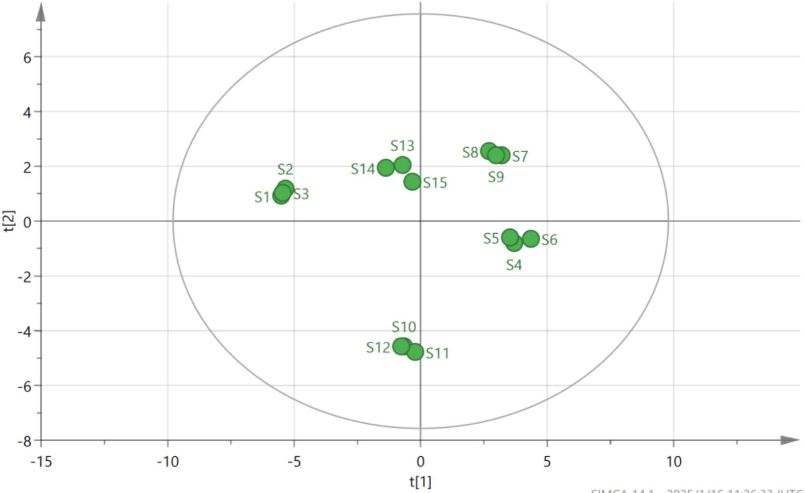

<!-- 方針: ほぼ全訳＋必要に応じた補足。原文構成（Abstract→Introduction→Experimental→Results→Discussion→Conclusion）に沿って訳出。「> 補足:」は訳者注。 -->

## 書誌情報

- 標題（原題）: Quality Evaluation of Qingwei Huanglian Pills Based on Fingerprint and Quantitative Analysis of Multi-Index Components Combined with Chemical Pattern Recognition Analysis
- 著者・所属: Xiaowei Shao¹, Nan Zhao²（責任著者）, Yuping Li¹, Hongming Wang¹, Xueli Xu¹, Shuyue Wang²（¹Binzhou Inspection and Testing Center, Bincheng, Binzhou, China／²Pharmacy Department of Binzhou Hospital of Traditional Chinese Medicine, Bincheng, Binzhou, China）
- 掲載誌・巻号・DOI: *Journal of Chromatographic Science*, 2025, 63(4), bmaf018. https://doi.org/10.1093/chromsci/bmaf018
- インパクトファクター: 要確認（検索した複数の指標サイトで1.3〜1.8と値が分かれ、公式JCRの数値を一意に確認できなかった。捏造を避けるため数値は明記しない）
- 受理経過 / ライセンス: 受領 2025-02-27 / 編集決定 2025-03-06。© The Author(s) 2025. Published by Oxford University Press. All rights reserved.

> 補足: QHP = 清胃黄連丸（Qingwei Huanglian Pills）。黄連(Coptis chinensis)・石膏・黄芩(Scutellaria baicalensis)・山梔子(Gardenia)・甘草など14種の生薬からなる水丸剤で、中国薬局方2020年版収載。口舌のただれ・歯齦腫脹・咽頭痛など「肺胃の熱」による症状に用いられる中成薬で、2023年の中国国内販売額は52億元超と記載されている。HCA=階層的クラスター分析、PCA=主成分分析、OPLS-DA=直交部分最小二乗判別分析、VIP=Variable Importance in Projection（変数重要度）。

## 要旨（Abstract）

清胃黄連丸(QHPs)は口舌のただれの治療に最も広く用いられる中成薬製剤の一つであるが、既存の品質評価基準には一定の不備・欠点がある。有効かつ科学的な品質評価法は医薬品の安全性確保に極めて重要な役割を果たす。本研究では、指紋分析と複数指標成分の定量分析に化学パターン認識解析を組み合わせ、QHPsの品質を総合的に評価した。15バッチのQHPsの指紋を作成し類似度を評価したところ、10本の特徴ピークが同定された。階層的クラスター分析(HCA)、主成分分析(PCA)、直交部分最小二乗判別分析(OPLS-DA)を用いて15バッチをクラスタリング・ランク付けするとともに、バッチ間差異の原因となる成分を同定した。QHPsのHPLC指紋と10成分の含量測定を確立した。28本の共通ピークが同定され、うち10成分が特定された。15バッチ間の類似度は0.983〜0.999であった。HCAとPCAによりそれぞれ15バッチのクラスター解析と総合スコアランキングを行い、OPLS-DAによりバッチ差異に影響する13の化学マーカーをスクリーニングした。本研究で確立した手法は、QHPsの品質評価および製品品質管理の参考となりうる。

## 1. 序論（Introduction）

中国における口腔潰瘍の発生率は25〜30%に及び、遺伝・環境・免疫機能など複数の要因が絡む複雑な病因を持つ。口舌のただれ、歯齦腫脹、咽頭痛などの症状は摂食・会話の困難を招き、患者のQOLに大きく影響する。QHPsは黄連(Coptis chinensis)、山梔子(Gardenia)、黄芩(Scutellaria baicalensis)、甘草を含む14種の生薬からなる伝統的中成薬製剤で、水丸剤(watery pan-pills)に加工されている。肺胃の熱による口舌のただれ、歯齦・咽頭の腫脹の治療に広く用いられる。清胃・瀉火・解毒・消腫の作用を持ち、歯周炎および口腔潰瘍に有効な治療薬である。2023年のQHPの販売額は52億元を超え、中医学における幅広い利用を示している。したがって、本製剤の全体的な品質を反映する評価法の確立が重要である。

QHPは中国薬局方2020年版(第一部)に収載されているが、現状では塩酸ベルベリン(berberine hydrochloride)のみが定量指標成分として用いられている。単一成分に依存した管理では製剤の品質を包括的に評価することは難しい。そのため、複方製剤の品質評価において複数指標成分の定量が近年の趨勢となっている。指紋分析は中医学において複方製剤の品質を客観的に評価する手法として広く応用されており、成分の特徴・トレーサビリティ・測定可能性を明らかにし、全体性・動態性・包括性という利点を提供する。化学パターン認識技術はさらに指紋情報を精緻化・解析するものであり、両者を組み合わせることで製剤品質をより直感的かつ正確に反映できる。

製品のバッチ間品質安定性は、臨床的な等価性と有効性を確保するうえで重要な因子である。本研究では、HPLCを用いてQHPs 15バッチの指紋プロファイルを確立し、10成分の含量を定量した。同時に、HCA・PCA・OPLS-DAといった化学パターン認識解析モードを組み合わせ、QHPsのバッチ間安定性を包括的・系統的に評価し、製剤の品質安定性と臨床有効性の一貫性に関する研究の視座を提供した。

## 2. 実験（Experimental）

### 2.1 機器・試薬

**機器・ソフトウェア**: Shimadzu LC-20AD高速液体クロマトグラフ、Mettler XS205Du電子天秤(Mettler)、Kunshan Shumei KQ-700 DV超音波洗浄機(Kunshan Ultrasonic Instrument Co., Ltd)。0.22 μmミクロ多孔性ろ過膜はTianjin Chromatography Science and Technology Co., Ltd製。解析に用いたソフトウェアは「中薬クロマトグラム指紋類似度評価システム」(Version A, 2004)、SIMCA 14.1、SPSS 27.0。

**医薬品・試薬**: ゲニポシド(Geniposide、Lot No. 110749-2011919、含量97.1%)、パエオニフロリン(Paeoniflorin、Lot No. 110736-202044、含量96.8%)、リクイリチン(Liquiritin、Lot No. 111610-201106、含量93.7%)、塩酸コプチシン(Coptisine hydrochloride、Lot No. 112026-201601、含量95.1%)、バイカリン(Baicalin、Lot No. 110715-201821、含量95.4%)、塩酸ベルベリン(Berberine hydrochloride、Lot No. 110713-201613、含量86.8%)、ウォゴノシド(Wogonoside、Lot No. 112002-201702、含量98.5%)、パエオノール(Paeonol、Lot No. 110708-200506、含量100.0%)、バイカレイン(Baicalein、Lot No. 111595-201808、含量97.9%)、ハンバイカリン(Hanbaicalin、Lot No. 111514-201706、含量100.0%)は、いずれも中国食品薬品検定研究院(National Institutes for Food and Drug Control)から入手した。メタノールおよびアセトニトリル(クロマトグラフィーグレード)はTEDIA Limitedから、リン酸(分析グレード)は天津科密化学試薬有限公司から購入した。実験には超純水を使用した。

15バッチのサンプルは5つのメーカーから収集した: S1〜S3はGansu Foren Pharmaceutical Science and Technology Co. Ltd、S4〜S6はShanxi Huakang Pharmaceutical Co. Ltd、S7〜S9はShandong Kongshengtang Pharmaceutical Co. Ltd、S10〜S12はBeijing Tongrentang Pharmaceutical Co. Ltd、S13〜S15はShanxi Wanglong Pharmaceutical Group Co.より入手した。詳細を表Iに示す。

**表I. 15バッチのサンプル情報**

| 番号 | ロット番号 | 製造日 | 有効期限（文書上） |
|---|---|---|---|
| S1 | 231201 | 2023-12-05 | 2025-11 |
| S2 | 230901 | 2023-09-05 | 2025-08 |
| S3 | 240402 | 2024-04-10 | 2026-03 |
| S4 | 20240503 | 2024-05-10 | 2027-04 |
| S5 | 20240210 | 2024-02-22 | 2027-01 |
| S6 | 20231102 | 2023-11-07 | 2026-10 |
| S7 | 24022014 | 2024-02-21 | 2026-02-20 |
| S8 | 23122014 | 2023-12-20 | 2025-12-19 |
| S9 | 23052012 | 2023-05-15 | 2025-05-14 |
| S10 | 22081124 | 2022-09-02 | 2026-08 |
| S11 | 22081121 | 2022-08-25 | 2026-07 |
| S12 | 24081365 | 2024-07-05 | 2028-06 |
| S13 | 20221109 | 2022-11-26 | 2025-10 |
| S14 | 20221005 | 2022-10-18 | 2025-09 |
| S15 | 20230807 | 2023-08-23 | 2026-07 |

### 2.2 クロマトグラフィー条件

クロマトグラフィー分離はInertSustain C18カラム(4.6 mm×250 mm, 5 μm)で行った。移動相はメタノール(A)、アセトニトリル(B)、0.2%リン酸溶液(C)からなり、以下のグラジエント溶出プログラムを用いた:

- 0〜40分: 5%A→5%A、5%B→20%B、90%C→75%C
- 40〜60分: 5%A→10%A、20%B→30%B、76%C→65%C
- 60〜80分: 10%A→5%A、30%B→55%B、60%C→40%C
- 80〜90分: 5%A→10%A、55%B→5%B、40%C→90%C

流速は1.0 mL/min、検出波長は254 nm、カラム温度は35℃に維持した。注入量は10 μL。

### 2.3 溶液の調製

**対照溶液の調製**: ゲニポシド、パエオニフロリン、リクイリチン、塩酸コプチシン、バイカリン、塩酸ベルベリン、ウォゴノシド、パエオノール、バイカレイン、ハンバイカリンの対照品を精密に秤量した。各標準品はメタノールに溶解しストック溶液とした。調製した溶液の濃度は以下の通り: ゲニポシド 106.810 μg/mL、パエオニフロリン 23.584 μg/mL、リクイリチン 10.051 μg/mL、塩酸コプチシン 10.375 μg/mL、バイカリン 136.335 μg/mL、塩酸ベルベリン 52.238 μg/mL、ウォゴノシド 31.878 μg/mL、パエオノール 12.361 μg/mL、バイカレイン 10.057 μg/mL、ハンバイカリン 11.727 μg/mL。

**検体溶液の調製**: QHP 1包を粉砕機で細かく粉砕した。約0.5 gの粉末を精密に秤量し、栓付き三角フラスコに移した。メタノール50 mLを加え、混合物を秤量後、超音波処理(300 W、45 kHz)を30分間行った。室温まで放冷後、フラスコを再度秤量し、目減り分をメタノールで補正した。よく振り混ぜた後0.22 μmミクロ多孔性膜でろ過し、ろ液を検体溶液とした。

### 2.4 指紋マッピング検討

15バッチのQHPsの指紋を測定し、クロマトグラムを「中薬クロマトグラム指紋類似度評価システム」(Version A, 2004)に取り込んで解析・評価した。サンプルS3のクロマトグラムを対照クロマトグラム(R)とし、時間窓幅は0.1とした。

### 2.5 化学パターン認識

**階層的クラスター分析**: 15バッチのQHPsのHCAは、28共通ピーク面積の標準化に基づき、群間平均連結法(inter-group join method)とユークリッド距離平方をサンプル類似度の尺度として、IBM SPSS Statistics(Version 27.0)を用いて実施した。

**主成分分析**: 15バッチの28共通ピークの正規化ピーク面積をSPSS 27.0に取り込み、データの適合性検定(KMO検定・Bartlett球面性検定)を行った。KMO値は0.895であり、1に近いほど変数間の相関が強いことを示す。Bartlett検定のp値は0.05未満であり、変数間に有意な相関があり主成分因子分析に適していることが確認された。

**直交部分最小二乗判別分析**: OPLS-DAは分類問題に対処するためよく用いられる教師あり判別分析法である。群内の変動が大きく群間差が小さい場合に特に有効であり、異なるカテゴリーのサンプルを判別する上でPCAより適している。QHPsの異なるメーカー・バッチ間の化学組成差をさらに検討するため、28共通ピークの標準化ピーク面積を従属変数、メーカーおよびバッチを独立変数として、SIMCA 14.1ソフトウェアに取り込みOPLS-DAで処理した。

### 2.6 複数指標成分の含量測定

**特異性**: 検体溶液と対照溶液を精密に量り取り、クロマトグラフィー条件下で分析した。

**直線範囲**: 各対照品ストック溶液を1、2.5、5、10、25 mLずつ25 mL容量フラスコ6本に精密に取り、メタノールで標線まで希釈し、よく振り混ぜて異なる濃度の混合対照溶液を調製した。溶液を高速液体クロマトグラフに注入し、クロマトグラフィー条件下で分析した。各成分のピーク面積(Y)を濃度(X)に対して直線回帰した。

**精度**: 対照溶液をクロマトグラフィー条件下で6回連続して注入した。

**再現性**: 6丸(ロット番号: 24022014)を精密に秤量し、検体溶液を調製してクロマトグラフィー条件下で分析した。

**添加回収試験**: QHPs(ロット番号24022014)6検体をそれぞれ約0.25 g精密に秤量した。対照品ストック溶液を各々異なる体積(2.2, 3.6, 3.6, 3.3, 2.5, 3.9, 2.3, 2.5, 1.6, 1.0 mL)添加した。検体溶液を調製し、クロマトグラフィー条件下で分析した。回収率は「回収率＝回収された量／添加量」の式で算出した。各成分について回収率を計算した。

**複数指標成分の含量測定**: クロマトグラフィー条件に従い、ゲニポシド、パエオニフロリン、リクイリチン、塩酸コプチシン、バイカリン、塩酸ベルベリン、ウォゴノシド、パエオノール、バイカレイン、ハンバイカリンの含量を15バッチのサンプルについて測定した。

## 3. 結果（Results）

### 3.1 指紋マッピング

指紋分析により合計28本の共通ピークが同定され、うちピーク18番(バイカリン)はピーク面積が大きく、保持時間が安定し、隣接ピークとの分離が良好という利点を示した。28共通ピークの保持時間のRSDは0.32%未満、ピーク面積のRSDは7.73〜44.72%であった。これらの結果は、15バッチにわたり28共通成分の保持時間は比較的安定している一方、バッチ間で含量にはある程度のばらつきがあることを示している。指紋プロファイルを図1に、対照品のクロマトグラムを図2に示す。保持時間と紫外吸収スペクトルの比較により、10成分が同定された。ピーク5番はゲニポシド、ピーク8番はパエオニフロリン、ピーク11番はリクイリチン(甘草配糖体)、ピーク15番は塩酸コプチシンに対応した。ピーク18番はバイカリン、ピーク19番は塩酸ベルベリン、ピーク22番はウォゴノシド、ピーク23番はパエオノール、ピーク24番はバイカレイン、ピーク26番はハンバイカリンとして同定された。

> 補足: 原文の本文記述では「ピーク18番＝バイカレイン、ピーク24番＝バイカレイン」のように同一名称の重複が見られる箇所があるが、直後の表Ⅳでは「ピーク18＝baicalin(バイカリン)」「ピーク24＝baicalein(バイカレイン)」と区別されており、本訳では表Ⅳの記載を優先し整合させた（原文の記述ゆれ。詳細は原文参照）。

15バッチのQHPsの指紋と対照指紋との類似度を算出した結果を表IIに示す。中国薬局方委員会の基準によれば、類似度が90%を超える場合に類似度評価要件を満たすとみなされる。15バッチの類似度は0.983〜0.999の範囲にあり、いずれも0.900を上回った。これは5つのメーカーのサンプルの品質が一貫して安定していたことを示す。類似度の高さは、製造プロセスがよく管理され、製剤全体の品質が高かったことも示唆している。

**表II. 15バッチのサンプルの類似度結果**

| 番号 | 類似度 | 番号 | 類似度 | 番号 | 類似度 |
|---|---|---|---|---|---|
| S1 | 0.992 | S6 | 0.986 | S11 | 0.983 |
| S2 | 0.992 | S7 | 0.996 | S12 | 0.983 |
| S3 | 0.993 | S8 | 0.995 | S13 | 0.999 |
| S4 | 0.987 | S9 | 0.997 | S14 | 0.997 |
| S5 | 0.985 | S10 | 0.984 | S15 | 0.996 |

### 3.2 階層的クラスター分析

結果を図3に示す。図3によれば、ユークリッド距離20〜25の間で15バッチのサンプルは2つのクラスに分類でき、S1〜S3が第1クラス、S4〜S15が第2クラスとなる。

### 3.3 主成分分析

固有値1超を選定基準として、4つの主成分因子が同定され、累積寄与率は97.859%であった（表III）。これは、4つの主成分因子がQHPsの28共通ピークの指紋プロファイルに含まれる本質的な特徴と大部分の情報を代表していることを示している。

**表III. PCA固有値と寄与率**

| 主成分 | 固有値 | 寄与率(%) | 累積寄与率(%) |
|---|---|---|---|
| 1 | 11.698 | 41.780 | 41.780 |
| 2 | 6.986 | 24.951 | 66.731 |
| 3 | 5.634 | 20.121 | 86.852 |
| 4 | 3.082 | 11.007 | 97.859 |

成分負荷行列は、4つの主成分と28共通ピークとの相関係数を示す。負荷量の絶対値が大きいほど主成分への寄与が大きいことを意味する。詳細な結果を表IVに示す。主成分負荷の絶対値0.6超を閾値として原変数と4主成分因子との相関を解析した結果、以下が判明した: 主成分1は主にピーク2, 4, 5, 8-9, 11, 14-16, 18, 20-22, 26, 28の情報を反映する。主成分2はピーク1, 5, 17, 24, 27を反映する。主成分3はピーク3, 6, 7, 10, 12, 13, 19に対応する。主成分4は主にピーク23と25を反映する。

**表IV. 15バッチの清胃黄連丸の成分負荷行列**

| ピーク番号 | 成分 | PC1 | PC2 | PC3 | PC4 | ピーク番号 | 成分 | PC1 | PC2 | PC3 | PC4 |
|---|---|---|---|---|---|---|---|---|---|---|---|
| 1 | 未同定 | 0.507 | 0.746 | 0.375 | 0.203 | 15 | 塩酸コプチシン | 0.740 | 0.452 | 0.300 | 0.393 |
| 2 | 未同定 | 0.711 | 0.478 | 0.045 | 0.494 | 16 | 未同定 | 0.754 | 0.238 | 0.560 | 0.170 |
| 3 | 未同定 | 0.411 | 0.452 | 0.625 | 0.483 | 17 | 未同定 | 0.113 | 0.953 | 0.062 | 0.114 |
| 4 | 未同定 | 0.933 | 0.203 | 0.158 | 0.162 | 18 | バイカリン | 0.942 | 0.264 | 0.135 | 0.132 |
| 5 | ゲニポシド | 0.701 | 0.685 | 0.063 | 0.143 | 19 | 塩酸ベルベリン | 0.322 | 0.491 | 0.663 | 0.452 |
| 6 | 未同定 | 0.183 | 0.497 | 0.793 | 0.295 | 20 | 未同定 | 0.870 | 0.310 | 0.269 | 0.267 |
| 7 | 未同定 | 0.580 | 0.213 | 0.774 | 0.069 | 21 | 未同定 | 0.867 | 0.448 | 0.127 | 0.167 |
| 8 | パエオニフロリン | 0.768 | 0.383 | 0.371 | 0.328 | 22 | ウォゴノシド | 0.964 | 0.110 | 0.015 | 0.231 |
| 9 | 未同定 | 0.624 | 0.630 | 0.457 | 0.049 | 23 | パエオノール | 0.443 | 0.173 | 0.480 | 0.723 |
| 10 | 未同定 | 0.428 | 0.305 | 0.754 | 0.373 | 24 | バイカレイン | 0.383 | 0.806 | 0.260 | 0.366 |
| 11 | リクイリチン | 0.666 | 0.450 | 0.414 | 0.376 | 25 | 未同定 | 0.529 | 0.371 | 0.264 | 0.713 |
| 12 | 未同定 | 0.557 | 0.516 | 0.583 | 0.286 | 26 | ハンバイカリン | 0.797 | 0.135 | 0.451 | 0.367 |
| 13 | 未同定 | 0.228 | 0.018 | 0.893 | 0.099 | 27 | 未同定 | 0.159 | 0.952 | 0.220 | 0.101 |
| 14 | 未同定 | 0.810 | 0.461 | 0.117 | 0.250 | 28 | 未同定 | 0.756 | 0.588 | 0.175 | 0.028 |

主成分負荷値からさらに4主成分のスコアを算出する線形モデルが導出された。F1〜F4はそれぞれ4主成分のスコアを表し、X1〜X28は標準化した28共通ピーク面積の結果を表す。4主成分スコアの算出式は以下の通り:

> F1 = 0.148X1+0.208X2+0.120X3+0.273X4+0.205X5−0.054X6−0.170X7+0.225X8+0.182X9+0.125X10+0.195X11+0.163X12+0.067X13+0.237X14+0.216X15+0.220X16+0.033X17+0.275X18+0.094X19+0.254X20+0.254X21+0.282X22+0.130X23−0.112X24+0.155X25−0.233X26−0.046X27−0.221X28
>
> F2 = −0.282X1+0.181X2+0.171X3+0.077X4+0.259X5−0.188X6+0.081X7+0.145X8−0.238X9+0.115X10−0.170X11−0.195X12−0.007X13−0.174X14−0.171X15−0.090X16+0.361X17+0.100X18−0.186X19+0.117X20+0.169X21+0.042X22+0.065X23−0.305X24−0.140X25−0.051X26+0.360X27+0.222X28
>
> F3 = 0.158X1−0.019X2+0.263X3−0.067X4−0.027X5+0.334X6+0.326X7−0.156X8−0.193X9+0.318X10+0.174X11+0.246X12−0.376X13+0.049X14−0.126X15−0.236X16−0.026X17−0.057X18−0.279X19+0.113X20−0.054X21+0.006X22+0.202X23−0.110X24+0.111X25−0.190X26−0.093X27−0.074X28
>
> F4 = 0.116X1+0.281X2+0.275X3−0.092X4+0.081X5−0.168X6+0.039X7−0.187X8+0.028X9+0.212X10−0.214X11−0.163X12−0.056X13−0.142X14+0.224X15+0.097X16+0.065X17−0.075X18+0.257X19−0.152X20−0.095X21−0.132X22+0.412X23+0.208X24+0.406X25+0.209X26+0.058X27+0.016X28

主成分スコア算出後、寄与率を用いて総合スコアを算出した。総合競争力Fsynthesisの合成式は Fsynthesis = (0.41780F1 + 0.24951F2 + 0.20121F3 + 0.11007F4) / 0.97859 であり、スコア結果を表Vに示す。

これらのスコアは各バッチのQHPsの品質を反映しており、スコアが高いほど品質が優れていることを示す。総合スコア1超の上位6バッチはS4〜S9であり、これらのバッチの品質が優れていることを示している。15バッチの28共通ピークのピーク面積をさらにSIMCA 14.1ソフトウェアでPCA解析し、PCAスコアプロットを図4に示す。

**表V. 15バッチの清胃黄連丸の主成分スコア・総合スコア・ランキング**

| 番号 | PC1 | PC2 | PC3 | PC4 | 総合スコア | 順位 |
|---|---|---|---|---|---|---|
| S1 | −5.48929 | 0.93338 | 2.52206 | 1.05860 | −1.46806 | 11 |
| S2 | −5.38857 | 1.16782 | 2.19646 | 0.97693 | −1.44141 | 10 |
| S3 | −5.46290 | 1.01380 | 2.38527 | 0.95344 | −1.47623 | 12 |
| S4 | 3.66742 | −0.79995 | 1.73430 | 0.18798 | 1.73953 | 3 |
| S5 | 3.53528 | −0.59377 | 1.91956 | 0.12516 | 1.76672 | 2 |
| S6 | 4.28406 | −0.66824 | 2.17210 | 0.18141 | 2.12566 | 1 |
| S7 | 2.91924 | 2.25444 | −0.02409 | −1.82123 | 1.61148 | 4 |
| S8 | 2.50562 | 2.48059 | 0.39154 | −1.72689 | 1.58862 | 5 |
| S9 | 2.75003 | 2.28490 | 0.14699 | −1.78857 | 1.58586 | 6 |
| S10 | −0.66127 | −4.58640 | −0.88289 | 0.34604 | −1.59435 | 14 |
| S11 | −0.26187 | −4.79580 | −1.29807 | 0.30410 | −1.56730 | 13 |
| S12 | −0.80801 | −4.59123 | −0.89566 | 0.36588 | −1.65863 | 15 |
| S13 | −0.60406 | 2.10024 | −3.92064 | 0.88983 | −0.42851 | 8 |
| S14 | −1.27559 | 2.02963 | −3.52378 | 1.19629 | −0.61717 | 9 |
| S15 | −0.34827 | 1.44787 | −3.91861 | 1.41342 | −0.42637 | 7 |

### 3.4 直交部分最小二乗判別分析

モデルの安定性パラメーターR2Yは0.997、モデルの予測パラメーターQ2は0.952であった。いずれも0.5を上回っており、OPLS-DAモデルが高い安定性と強い予測能力を有することを示す。図5(A)にOPLS-DAスコアプロットを示す。

モデルの過学習の有無を検証するため、データをランダムに200回並べ替える順列検定を実施した。結果は図5(B)に示す通り、R2回帰直線のY切片は0.359、Q2回帰直線のY切片は−0.919であり、いずれも元の値より小さかった。これは過学習が生じていないことを確認するものである。したがって、検証結果はモデルが有効かつ信頼できることを示しており、15バッチのQHPs間のバッチ間変動の解析に利用できる。

Variable Importance in Projection(VIP)値は差異成分の同定における主要指標であり、VIP値が高いほど対応する成分が群間の品質差異に及ぼす影響が大きいことを示す。サンプルバッチ間の差異の主要因となる成分を選定する基準としてVIP＞1の閾値を用いた。その結果、13本のクロマトグラフィーピークが有意であると同定され、図5(C)に示す。これらのピークはVIP値順に、23(パエオノール)、25、3、19(塩酸ベルベリン)、6、10、24(バイカレイン)、2、12、13、27、7、15(塩酸コプチシン)であった。これら13本のピークはバッチ間差異に寄与する主要な化学成分であり、品質変動の潜在的マーカーとなりうる。

### 3.5 複数指標成分の含量

特異性試験の結果、両溶液は同一保持時間で紫外吸収を示し、UV吸収スペクトルも一致した。さらに検体溶液中の各成分の分離は明瞭であり、本法が良好な特異性を有することを示した。10成分の直線性は良好であり、結果を表VIに示す。精度試験の結果、ゲニポシド、パエオニフロリン、リクイリチン、塩酸コプチシン、バイカリン、塩酸ベルベリン、ウォゴノシド、パエオノール、バイカレイン、ハンバイカリンのピーク面積のRSDはそれぞれ0.38%、0.47%、0.82%、0.71%、0.12%、0.97%、1.01%、0.76%、0.86%、0.94%であり、良好な機器精度を示した。再現性試験の結果、ゲニポシド、パエオニフロリン、リクイリチン、塩酸コプチシン、バイカリン、塩酸ベルベリン、ウォゴノシド、パエオノール、バイカレイン、ハンバイカリンのピーク面積のRSDはそれぞれ1.04%、0.89%、1.14%、1.11%、1.42%、0.78%、0.67%、1.02%、0.87%、0.68%であった。これらの結果は本法の良好な再現性を示す。添加回収試験の結果、ゲニポシド、パエオニフロリン、リクイリチン、塩酸コプチシン、バイカリン、塩酸ベルベリン、ウォゴノシド、パエオノール、バイカレイン、ハンバイカリンの平均回収率はそれぞれ99.44%、98.87%、97.89%、99.97%、100.03%、98.78%、100.10%、98.78%、100.23%、98.17%であった。対応するRSDはそれぞれ1.77%、1.60%、0.83%、1.95%、1.54%、1.45%、1.43%、0.90%、1.43%、1.55%であり、良好な回収精度を示した。

**表VI. 清胃黄連丸中10成分の直線関係の検討結果**

| 対照品 | 回帰式（原文表記のまま） | r | 直線範囲(μg/mL) |
|---|---|---|---|
| ゲニポシド | Y = 9637.9 + 48,282 | 0.9997 | 21.362〜534.05 |
| パエオニフロリン | Y = 2801.7 + 3142.7 | 0.9996 | 4.7168〜117.92 |
| リクイリチン | Y = 6882.0 + 1174.4 | 0.9997 | 2.0103〜50.257 |
| 塩酸コプチシン | Y = 36,611 + 8892.5 | 0.9998 | 2.0749〜51.873 |
| バイカリン | Y = 15,608 − 318.66 | 1.0000 | 27.267〜681.68 |
| 塩酸ベルベリン | Y = 17,832 + 1977 | 0.9998 | 10.448〜261.19 |
| ウォゴノシド | Y = 18,115 + 12,891 | 0.999 | 6.3756〜159.39 |
| パエオノール | Y = 12,440 + 1776.3 | 0.9999 | 2.4723〜61.807 |
| バイカレイン | Y = 57,515 + 10,007 | 0.9997 | 2.0114〜50.285 |
| ハンバイカリン | Y = 26,488 − 11,283 | 0.9998 | 2.3455〜58.636 |

> 補足: 表VIの回帰式は原文の記載順（数値1＋数値2）をそのまま転記した。原文ではY(ピーク面積)とX(濃度)の関係式であることは明記されているが、どちらの数値が傾き・切片に対応するかの表記が本文中で判然としない箇所があったため、数値を入れ替えるなどの解釈は行わず原文の並び順のまま記載している。正確な回帰式が必要な場合は原文の表VIを直接参照されたい。

複数指標成分の含量測定に関する結果として、15バッチのサンプルにおけるゲニポシド、パエオニフロリン、リクイリチン、塩酸コプチシン、バイカリン、塩酸ベルベリン、ウォゴノシド、パエオノール、バイカレイン、ハンバイカリンの含量測定結果を表VIIに示す。バッチ間における10成分のRSDはそれぞれ16.74%、15.79%、28.59%、27.17%、24.04%、14.15%、15.89%、12.34%、41.34%、14.67%であり、バッチ間で成分含量にばらつきがあることを示している。SPSS 27.0を用いて10成分の含量とPCA総合スコアとの相関を解析した。ピアソンの相関係数を用いた二変量相関分析を行い、両側検定で有意性を確認したところ、相関係数は0.752(P＜0.001)であった。この結果は、10種の指標成分とQHPsの総合品質との間に有意な相関があることを示しており、これら10成分が製品の品質評価に利用できることを示唆している。

**表VII. 清胃黄連丸中10成分の含量測定結果(mg/g)**

| サンプル | ゲニポシド | パエオニフロリン | リクイリチン | 塩酸コプチシン | バイカリン | 塩酸ベルベリン | ウォゴノシド | パエオノール | バイカレイン | ハンバイカリン |
|---|---|---|---|---|---|---|---|---|---|---|
| S1 | 6.80 | 2.42 | 1.23 | 0.62 | 7.30 | 6.11 | 2.03 | 0.97 | 0.82 | 0.59 |
| S2 | 6.53 | 2.58 | 1.23 | 0.63 | 7.33 | 6.27 | 2.06 | 1.01 | 0.81 | 0.58 |
| S3 | 6.58 | 2.55 | 1.24 | 0.62 | 7.30 | 6.12 | 2.04 | 0.97 | 0.82 | 0.59 |
| S4 | 8.27 | 3.68 | 2.19 | 1.22 | 14.46 | 7.00 | 3.23 | 0.99 | 0.51 | 0.40 |
| S5 | 8.31 | 3.68 | 2.15 | 1.22 | 14.49 | 7.04 | 3.23 | 0.98 | 0.51 | 0.40 |
| S6 | 8.50 | 3.65 | 2.66 | 1.22 | 14.56 | 7.03 | 3.27 | 1.03 | 0.51 | 0.40 |
| S7 | 9.58 | 3.45 | 1.46 | 1.39 | 13.90 | 8.10 | 2.94 | 1.26 | 0.64 | 0.49 |
| S8 | 9.87 | 3.42 | 1.42 | 1.37 | 13.85 | 8.03 | 2.89 | 1.18 | 0.56 | 0.51 |
| S9 | 9.83 | 3.52 | 1.46 | 1.39 | 13.91 | 8.10 | 2.92 | 1.22 | 0.62 | 0.51 |
| S10 | 6.28 | 2.78 | 1.67 | 1.49 | 9.75 | 9.24 | 2.45 | 0.99 | 1.43 | 0.59 |
| S11 | 6.33 | 2.83 | 1.75 | 1.50 | 9.82 | 9.30 | 2.46 | 0.99 | 1.44 | 0.60 |
| S12 | 6.25 | 2.74 | 1.67 | 1.48 | 9.69 | 9.19 | 2.43 | 1.00 | 1.44 | 0.59 |
| S13 | 8.03 | 3.77 | 1.23 | 1.08 | 12.19 | 7.83 | 2.64 | 0.86 | 0.71 | 0.57 |
| S14 | 8.40 | 3.43 | 1.04 | 1.07 | 12.36 | 8.30 | 2.66 | 0.85 | 0.73 | 0.58 |
| S15 | 8.41 | 3.86 | 1.26 | 1.07 | 12.37 | 8.31 | 2.66 | 0.85 | 0.73 | 0.58 |

## 4. 考察（Discussion）

QHPにおいて、黄連(Coptis chinensis)と石膏は君薬として機能し、清熱・燥湿・解毒の働きを担う。黄芩(Scutellaria baicalensis)と山梔子(Gardenia)は臣薬として、清熱・除湿・解毒を助ける。連翹(Forsythia suspensa)は清熱・解毒・消腫・散結の働きを持つ。知母(Anemarrhena asphodeloides)と黄柏(Phellodendron amurense)は体を冷やし、陰を養い、乾燥を潤す。玄参(Radix scrophulariae)、地黄(Rehmannia glutinosa)、牡丹皮(Peony bark)、赤芍(Red peony)は清熱・涼血・解毒・活血の働きを持ち、消腫・散瘀を助ける佐薬として含まれる。天花粉は陰を養い乾燥を潤し、清熱して津液の産生を促す佐薬として作用する。桔梗(Platycodon grandiflorus)は咽頭を解毒し薬効を上へ運ぶ働きを助け、甘草はすべての生薬の作用を調和させる使薬として働く。中医学における品質マーカー(quality marker)は、しばしば君薬に由来しつつ、臣薬・佐薬・使薬の役割も考慮して選定される。本研究では、黄連を君薬、黄芩・山梔子・牡丹皮・赤芍を佐薬、甘草を使薬として選定した。この選定はQHPの包括的な品質管理の基盤となるものである。

中国薬局方2020年版第一部によれば、ゲニポシドは波長238 nmで良好な吸収を示し、パエオニフロリンは230 nmで最大吸収、リクイリチンは237 nmで最大吸収を示す。塩酸ベルベリンと塩酸コプチシンは345 nmで最大吸収を示し、バイカリン、ウォゴノシド、バイカレイン、ハンバイカリンは280 nmで良好な吸収、パエオノールは274 nmで最大吸収を示す。本実験では、230 nm、237 nm、238 nm、254 nm、354 nmの各波長でピーク挙動を検討した。その結果、254 nmではピーク形状が優れ、感度が高く、分離度も良好で、かつ強い紫外吸収を示すことが判明した。したがって、254 nmを検出波長として選定した。

中薬の指紋分析は、真正性の確保、品質の一貫性評価、製品安定性の評価に有効な手法であり、中医学の品質管理分野で広く採用されている。米国食品医薬品局(FDA)は、生薬製品の申請資料にクロマトグラフィー指紋プロファイルを含めることを認めている。世界保健機関(WHO)も1996年の生薬評価ガイドラインにおいて、生薬の有効成分が明確に同定されていない場合、製品品質の一貫性を示すためにクロマトグラフィー指紋プロファイルを提供できると規定している。同様に、欧州共同体も生薬品質に関するガイドラインにおいて、単一の有効成分の測定のみに依拠した品質安定性評価は不十分であるとしている。これは、生薬とその製剤が全体として一つの活性物質として機能するためである。指紋プロファイルを中薬(天然薬物)エキスおよびその製剤の品質管理手法として用いることは、国際的なコンセンサスとなっている。中薬(天然薬物)特有の性質に適合したさまざまな指紋プロファイル管理技術体系の確立に向けて、研究開発が進められている。

## 5. 結論（Conclusion）

本研究では、指紋分析と多成分アッセイを用いて15バッチのQHPsの品質を解析した。結果はバッチ間変動が最小限であり、品質が安定かつ均質であることを示した。本研究はQHPsのHPLC指紋を確立し、10の主要成分を含む28本のピークを同定した。データはさらに化学パターン認識技術で解析され、QHPsの一貫性評価のための手法を提供するとともに、製品の包括的な品質管理の参考を提供した。

## 訳者補足

- QHPの中国薬局方における定量指標成分は現状「塩酸ベルベリン」の単一成分のみだが、本研究は指紋分析(28共通ピーク・類似度0.983〜0.999)＋10成分同時定量＋HCA/PCA/OPLS-DAという多層的アプローチにより、単一成分管理では見えないバッチ間・メーカー間の品質差を可視化した点が実務的な意義といえる。
- OPLS-DAで抽出されたVIP＞1の13ピーク(パエオノール・塩酸ベルベリン・塩酸コプチシン等を含む)は、必ずしも薬効との対応関係が本論文内で明示的に検証されているわけではなく、あくまで「バッチ間差異への寄与が大きい統計的マーカー」として位置づけられている点に留意されたい。
- 表VIの検量線式は原文の数値表記の並び順をそのまま転記しており、傾き・切片の対応関係を独自に解釈していない。定量計算に用いる場合は原文(Table VI)を直接参照することを推奨する。
- インパクトファクターは複数の指標サイトを確認したが1.3〜1.8の間で情報源により差があり、公式なJCR値を一意に確認できなかったため「要確認」としている。
