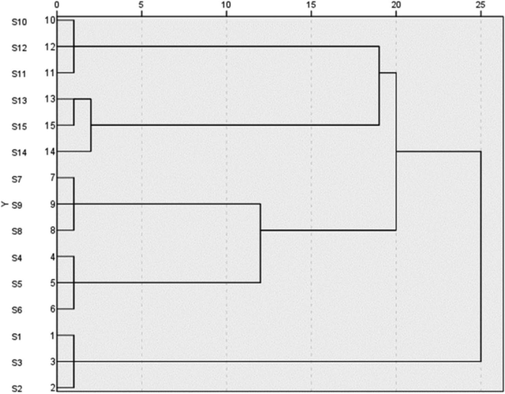
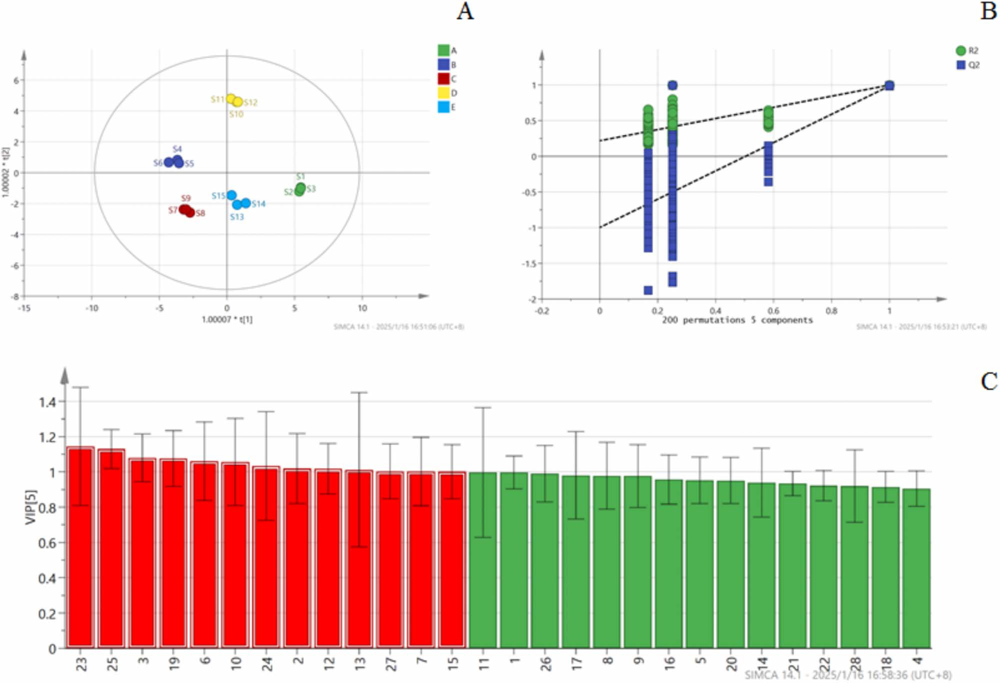

<!-- 方針: ほぼ全訳＋必要に応じた補足。原文構成に沿って訳出。「> 補足:」は訳者注。数値・条件は原文どおり。Table I の一部数値は抽出時に桁区切りカンマが混入していたため、後述の訳者注のとおり復元した。 -->

## 書誌情報

- 標題（原題）: Quality Evaluation of Qingwei Huanglian Pills Based on Fingerprint and Quantitative Analysis of Multi-Index Components Combined with Chemical Pattern Recognition Analysis
- 著者・所属: Xiaowei Shao¹、Nan Zhao²＊（責任著者）、Yuping Li¹、Hongming Wang¹、Xueli Xu¹、Shuyue Wang²
  ¹濱州検査検定センター（Binzhou Inspection and Testing Center、中国・山東省浜州市浜城区）
  ²浜州市中医医院 薬剤科（Pharmacy Department of Binzhou Hospital of Traditional Chinese Medicine、中国・山東省浜州市浜城区）
  ＊責任著者連絡先: 792103201@qq.com
- 掲載誌・巻号・DOI: *Journal of Chromatographic Science*, 2025, 63(4), bmaf018. Oxford University Press. DOI: https://doi.org/10.1093/chromsci/bmaf018
- 受理経過: 受付 2025年2月27日／編集上の受理決定 2025年3月6日。© The Author(s) 2025. Published by Oxford University Press. All rights reserved.
- インパクトファクター: **要確認**。第三者データベース間で数値が一致しない（例: ある集計では「IF 2023＝1.77（2024年発表）」、別の集計では最新値として「1.3」を提示、さらに別の要約では「1.8, Q3」とするなど、参照時期・算出方法が錯綜しており、Clarivate JCRの公式値をこの場で一意に確認できなかった）。捏造を避けるため本稿では数値を確定させず「要確認」とする。引用の際は発行元（Oxford University Press／Clarivate Journal Citation Reports）の一次情報で確認することを推奨する。
- 助成: 濱州医学院「中医薬特別」科学技術イノベーションプロジェクト（2023ZYZX014）

> 補足: QHP＝清胃黄連丸（Qingwei Huanglian Pills）。原文中の「Speciality」は文脈上「特異性（specificity）」の意で用いられている（原文ママ、綴りの揺れ）。

## 要旨（Abstract）

清胃黄連丸（Qingwei Huanglian Pills; QHP）は、口舌瘡（口内炎・舌の潰瘍）の治療に用いられる中成薬製剤の中で最もよく使われるものの一つであるが、既存の品質評価規格には一定の欠点・不備がある。有効かつ科学的な品質評価法は、服薬安全性において極めて重要な役割を果たす。本研究では、指紋分析と多指標成分の定量分析を化学的パターン認識解析と組み合わせ、QHPの品質を総合的に評価した。15バッチのQHPの指紋を作成し類似度を評価した結果、10本の特徴ピークが同定された。階層的クラスター分析（HCA）、主成分分析（PCA）、直交部分最小二乗判別分析（OPLS-DA）を用いて15バッチをクラスタリング・ランク付けするとともに、バッチ間差異の原因となる成分を同時に特定した。QHPのHPLC指紋と10成分の含量測定を確立した。28本の共通ピークが同定され、うち10成分が特定された。15バッチの試料間の類似度は0.983〜0.999の範囲であった。HCA・PCAによりそれぞれ15バッチのクラスター解析と総合得点ランキングを行い、OPLS-DAによりバッチ差異に影響する13種の化学マーカーをスクリーニングした。ここで確立した方法は、QHPの品質評価および製品品質管理の参考として役立ちうる。

## 1. 序論（Introduction）

中国における口内潰瘍（oral ulcer）の発生率は25%〜30%に及び、遺伝・環境・免疫機能などさまざまな要因が絡む複雑な病因を持つ（文献1、2）。口舌瘡、歯肉の腫脹、咽頭痛といった症状は摂食・発語の困難を招き、患者のQOLに著しい影響を与える（文献3、4）。QHPは、黄連（Coptis chinensis）、山梔子（Gardenia）、黄芩（Scutellaria baicalensis）、甘草など14種の生薬から作られる中成薬製剤で、水丸（watery pan-pills）に加工される。肺胃の熱による口舌瘡、歯肉・咽頭の腫脹の治療によく用いられる。本剤は胃熱を清し、火を降ろし、解毒・消腫する作用を持ち、歯周病や口内潰瘍に対する有効な治療薬となっている。2023年のQHP販売額は52億元を超え、中医薬におけるその広範な使用を示している。したがって、本製剤の全体的な品質を反映する評価法の確立は極めて重要である。安定的かつ信頼できる薬剤品質を確保するためには、品質を評価する管理法・指標の開発が不可欠である。

QHPは中国薬局方2020年版（第一部）に収載されているが（文献5）、現在は塩酸ベルベリン（berberine hydrochloride）のみが定量指標成分として用いられている。単一成分による管理だけでは、製剤の品質を包括的に評価することは難しい。そのため、複方製剤の品質評価においては多指標成分の定量が近年の潮流となっている（文献6、7）。指紋分析（フィンガープリンティング）は中医薬において複方製剤の品質を客観的に評価するために広く適用されており、成分の特徴・追跡可能性・測定可能性を明らかにし、全体性・動的・包括的という利点を提供する（文献8、9）。化学的パターン認識技術はさらに指紋情報を精緻化・解析するものであり、これらの手法を組み合わせることで、製剤の品質をより直感的かつ正確に反映できる。

製品のバッチ間の品質安定性は、臨床的な同等性・有効性を担保するうえで重要な要素である（文献10）。本研究では、HPLCを用いて15バッチのQHPの指紋プロファイルを確立し、10成分の含量を決定した。同時に、階層的クラスター分析（HCA）・主成分分析（PCA）・直交最小二乗判別分析（OPLS-DA）などの化学的パターン認識解析モードを組み合わせ、QHPのバッチ間安定性を包括的・体系的に評価した。これは、本製剤の品質安定性と臨床効果の一貫性に関する研究の着想を提供するものである。

## 2. 実験（Experimental）

### 2.1 装置・試薬

#### 装置・ソフトウェア

使用した機器は、島津製作所 LC-20 AD 高速液体クロマトグラフ、Mettler XS205Du 電子天秤（Mettler社）、昆山舒美 KQ-700 DV 超音波洗浄機（昆山超音波儀器有限公司）である。0.22 μm ミクロポーラスろ過膜は天津色譜科技有限公司から供給された。解析に用いたソフトウェアは、「中薬クロマトグラム指紋類似度評価システム」（バージョンA、2004年版）、SIMCA 14.1、SPSS 27.0である。

#### 薬物・試薬

対照品として、ゲニポシド（geniposide、ロット番号110749-2011919、含量97.1%）、パエオニフロリン（paeoniflorin、ロット番号110736-202044、含量96.8%）、リクイリチン（liquiritin、ロット番号111610-201106、含量93.7%）、コプチシン塩酸塩（coptisine hydrochloride、ロット番号112026-201601、含量95.1%）、バイカリン（baicalin、ロット番号110715-201821、含量95.4%）、ベルベリン塩酸塩（berberine hydrochloride、ロット番号110713-201613、含量86.8%）、ワゴノシド（wogonoside、ロット番号112002-201702、含量98.5%）、パエオノール（paeonol、ロット番号110708-200506、含量100.0%）、バイカレイン（baicalein、ロット番号111595-201808、含量97.9%）、ハンバイカリン（hanbaicalin、ロット番号111514-201706、含量100.0%）を、いずれも中国食品薬品検定研究院（National Institutes for Food and Drug Control）から入手した。クロマトグラフィーグレードのメタノール・アセトニトリルは TEDIA Limited 社から購入し、リン酸（分析グレード）は天津科密化学試薬有限公司から供給を受けた。実験には超純水を使用した。

15バッチの試料は、5社の製造元から収集した: S1〜S3は甘粛福仁医薬科技有限公司、S4〜S6は山西華康製薬有限公司、S7〜S9は山東孔聖堂製薬有限公司、S10〜S12は北京同仁堂製薬有限公司、S13〜S15は山西王竜製薬集団有限公司からそれぞれ入手した。15バッチの詳細情報は表I（本稿では表1）に示す。

> 補足（表I の数値について）: Drive経由のテキスト抽出時、ロット番号の一部（例: 231201, 20240503, 23052012 など）に3桁ごとの桁区切りカンマが誤って挿入されていた（例: 「231,201」「20,240,503」「23,052,012」）。本文中で桁区切りなしの生の番号（例: 「24022014」「23122014」）が別途言及されており、これと整合するようカンマを除去して以下に復元した。

#### 表1. 15バッチの試料情報

| 通し番号 | ロット番号 | 製造日 | 有効期限 |
| :--- | :--- | :--- | :--- |
| S1 | 231201 | 2023-12-05 | 2025年11月 |
| S2 | 230901 | 2023-09-05 | 2025年08月 |
| S3 | 240402 | 2024-04-10 | 2026年03月 |
| S4 | 20240503 | 2024-05-10 | 2027年04月 |
| S5 | 20240210 | 2024-02-22 | 2027年01月 |
| S6 | 20231102 | 2023-11-07 | 2026年10月 |
| S7 | 24022014 | 2024-02-21 | 2026-02-20 |
| S8 | 23122014 | 2023-12-20 | 2025-12-19 |
| S9 | 23052012 | 2023-05-15 | 2025-05-14 |
| S10 | 22081124 | 2022-09-02 | 2026年08月 |
| S11 | 22081121 | 2022-08-25 | 2026年07月 |
| S12 | 24081365 | 2024-07-05 | 2028年06月 |
| S13 | 20221109 | 2022-11-26 | 2025年10月 |
| S14 | 20221005 | 2022-10-18 | 2025年09月 |
| S15 | 20230807 | 2023-08-23 | 2026年07月 |

### 2.2 クロマトグラフィー条件

クロマトグラフィー分離は Inert-Sustain C18 カラム（4.6 mm × 250 mm, 5 μm）で行った。移動相はメタノール（A）、アセトニトリル（B）、0.2%リン酸水溶液（C）から構成され、以下のグラジエント溶出プログラムを用いた:

| 時間 (min) | A (%) | B (%) | C (%) |
| :--- | :--- | :--- | :--- |
| 0–40 | 5%→5% | 5%→20% | 90%→75% |
| 40–60 | 5%→10% | 20%→30% | 76%→65% |
| 60–80 | 10%→5% | 30%→55% | 60%→40% |
| 80–90 | 5%→10% | 55%→5% | 40%→90% |

流速は1.0 mL/min、検出波長254 nm、カラム温度35℃、注入量10 μLとした。

### 2.3 方法

#### 2.3.1 溶液の調製

**対照溶液の調製**: ゲニポシド、パエオニフロリン、リクイリチン、コプチシン塩酸塩、バイカリン、ベルベリン塩酸塩、ワゴノシド、パエオノール、バイカレイン、ハンバイカリンの対照品を精密に秤量した。各標準品をメタノールに溶解し、原液を調製した。調製した溶液の濃度は以下のとおり: ゲニポシド 106.810 μg/mL、パエオニフロリン 23.584 μg/mL、リクイリチン 10.051 μg/mL、コプチシン塩酸塩 10.375 μg/mL、バイカリン 136.335 μg/mL、ベルベリン塩酸塩 52.238 μg/mL、ワゴノシド 31.878 μg/mL、パエオノール 12.361 μg/mL、バイカレイン 10.057 μg/mL、ハンバイカリン 11.727 μg/mL。

**試験溶液の調製**: QHP 1袋を粉砕機で細かく粉砕した。粉末約0.5 gを精密に秤量し、栓付き三角フラスコに移した。メタノール50 mLを加えて秤量し、超音波処理（300 W, 45 kHz）を30分間行った。室温まで放冷後、フラスコを再度秤量し、目減り分をメタノールで補正した。よく振り混ぜた後、0.22 μm ミクロポーラス膜でろ過し、ろ液を試験溶液とした。

#### 2.3.2 指紋マッピング研究

15バッチのQHPの指紋を測定し、クロマトグラムを「中薬クロマトグラム指紋類似度評価システム」（バージョンA、2004年版）に取り込んで解析・評価した。試料S3のクロマトグラムを基準クロマトグラム（R）とし、時間窓幅は0.1とした。

#### 2.3.3 化学的パターン認識

**階層的クラスター分析（HCA）**: 15バッチのQHPの階層的クラスター分析は、群間結合法（inter-group join method）とユークリッド距離の二乗を試料類似度の尺度として、28本の共通ピーク面積の標準化に基づき、IBM SPSS Statistics（バージョン27.0）ソフトウェアを用いて実施した。

**主成分分析（PCA）**: 15バッチの試料から得た28本の共通ピークの正規化ピーク面積をSPSS 27.0ソフトウェアに取り込み、KMO検定・Bartlett球面性検定を含むデータ適合性の検証を行った。まずKMO検定・Bartlett球面性検定によりデータの適合性を評価した結果、KMO値は0.895であった（1に近いほど変数間の相関が強いことを示す）。Bartlett検定のp値は0.05未満であり、変数間に有意な相関があり主成分因子分析に適していることが確認された（文献11）。

**直交部分最小二乗判別分析（OPLS-DA）**: OPLS-DAは分類問題に対処するためによく用いられる教師あり判別分析法である。群内の変動が大きく群間の差異が小さい場合に特に有効であり、異なるカテゴリーの試料を判別する上でPCAより適している（文献12、13）。異なる製造元・バッチ間のQHPの化学組成の差異をさらに調べるため、28本の共通ピークの標準化ピーク面積を従属変数、製造元およびバッチを独立変数として、データをSIMCA 14.1ソフトウェアに取り込みOPLS-DAで処理した。

#### 2.3.4 多指標成分の含量測定

**特異性**: 試験溶液・対照溶液を精密に測定し、クロマトグラフィー条件下で分析した。

**直線範囲**: 直線範囲を確立するため、各対照原液1、2.5、5、10、25 mLを6本の25 mL容量フラスコにそれぞれ精密に採り、メタノールを標線まで加えてよく振り混ぜ、異なる濃度の混合対照溶液を調製した。溶液を高速液体クロマトグラフに注入し、クロマトグラフィー条件下で分析した。各成分のピーク面積(Y)を濃度(X)に対して線形回帰した。

**精度**: 対照溶液をクロマトグラフィー条件下で6回連続注入した。

**再現性**: 6丸剤（ロット番号: 24022014）を精密に秤量し、試験溶液を調製してクロマトグラフィー条件下で分析した。

**添加回収試験**: QHP 6試料（ロット番号24022014）をそれぞれ約0.25 g精密に秤量した。対照原液を種々の量（2.2, 3.6, 3.6, 3.3, 2.5, 3.9, 2.3, 2.5, 1.6, 1.0 mL）添加した。試験溶液を調製し、クロマトグラフィー条件下で分析した。回収率は次式で算出した: 回収率＝回収された量／添加した量。各成分について回収率を算出した。

**多指標成分の含量測定**: クロマトグラフィー条件に従い、ゲニポシド、パエオニフロリン、リクイリチン、コプチシン塩酸塩、バイカリン、ベルベリン塩酸塩、ワゴノシド、パエオノール、バイカレイン、ハンバイカリンの含量を15バッチの試料について測定した。

## 3. 結果（Results）

### 3.1 指紋マッピング

指紋分析により合計28本の共通ピークが同定され、ピーク番号18（バイカリン）は大きなピーク面積・安定した保持時間・隣接ピークからの良好な分離という利点を示した。28本の共有ピークの保持時間のRSDは0.32%未満であり、ピーク面積のRSDは7.73%〜44.72%の範囲であった。これらの結果は、15バッチにわたる28共有成分の保持時間が比較的安定していた一方、バッチ間の含量には一定の差異があったことを示す。指紋プロファイルを図1に示す。また対照品のクロマトグラムを図2に示す。保持時間と紫外吸収スペクトルの比較により、10成分が同定された。ピーク番号5がゲニポシド、ピーク番号8がパエオニフロリン、ピーク番号11がリクイリチン、ピーク番号15がコプチシン塩酸塩に対応した。ピーク番号18はバイカリンと同定され、ピーク番号19はベルベリン塩酸塩、ピーク番号22はワゴノシド、ピーク番号23はパエオノール、ピーク番号24はバイカレイン、ピーク番号26はハンバイカリンと同定された。

> 補足（原文の内部不整合について）: 原文の本結果パラグラフでは「Peak No. 18 was identified as baicalein」（ピーク18＝バイカレイン）と記載されているが、これは同論文の表IV（成分負荷行列）でピーク18が「baicalin（バイカリン）」と一貫して表記されていること、また図2のキャプション（1.ゲニポシド、2.パエオニフロリン、3.リクイリチン、4.コプチシン塩酸塩、5.バイカリン、6.ベルベリン塩酸塩、7.ワゴノシド、8.パエオノール、9.バイカレイン、10.ハンバイカリンの順）とも矛盾する。10成分の同定順序（ピーク5・8・11・15・18・19・22・23・24・26 → ゲニポシド・パエオニフロリン・リクイリチン・コプチシン塩酸塩・バイカリン・ベルベリン塩酸塩・ワゴノシド・パエオノール・バイカレイン・ハンバイカリン）と表IV・図2キャプションが完全に一致することから、本訳では「ピーク18＝バイカリン、ピーク24＝バイカレイン」を採用した（原文のこの1箇所のみ「baicalein」との表記ゆれ＝おそらく誤記があった）。

15バッチのQHPの指紋と基準指紋との類似度を算出し、結果を表IIに示す。中国薬局方委員会によれば、類似度が90%を超える場合に類似度評価の要件を満たすとみなされる。15バッチにわたる類似度は0.983〜0.999の範囲であり、いずれも0.900を上回った。これは、5社の製造元による試料の品質が一貫し安定していたことを示す。また高い類似度は、製造工程が良好に管理され、製剤の全体的な品質が高かったことも示唆する（文献14、15）。

#### 表2（原論文Table II）. 15バッチの類似度結果

| 通し番号 | 類似度 | 通し番号 | 類似度 | 通し番号 | 類似度 |
| :-: | :-: | :-: | :-: | :-: | :-: |
| S1 | 0.992 | S6 | 0.986 | S11 | 0.983 |
| S2 | 0.992 | S7 | 0.996 | S12 | 0.983 |
| S3 | 0.993 | S8 | 0.995 | S13 | 0.999 |
| S4 | 0.987 | S9 | 0.997 | S14 | 0.997 |
| S5 | 0.985 | S10 | 0.984 | S15 | 0.996 |

### 3.2 階層的クラスター分析

結果を図3に示す。図3によると、15バッチの試料はユークリッド距離が20〜25の間で2群にクラスタリングでき、S1〜S3が第1群、S4〜S15が第2群となる。

### 3.3 主成分分析

固有値が1を超えることを選択基準として、4つの主成分因子が同定され、累積寄与率は97.859%であった（表III）。これは、これら4つの主成分因子がQHPの28共通ピークの指紋プロファイルに含まれる本質的な特徴と大部分の情報を代表していることを示す。

#### 表3（原論文Table III）. PCA固有値と寄与率

| 主成分 | 固有値 | 寄与率(%) | 累積寄与率(%) |
| :-: | :-: | :-: | :-: |
| 1 | 11.698 | 41.780 | 41.780 |
| 2 | 6.986 | 24.951 | 66.731 |
| 3 | 5.634 | 20.121 | 86.852 |
| 4 | 3.082 | 11.007 | 97.859 |

成分負荷行列は、4つの主成分と28共有ピークとの相関係数を示す。負荷の絶対値が大きいほど、主成分への寄与が大きいことを意味する（文献16、17）。詳細な結果を表IVに示す。主成分負荷の絶対値が0.6を超えることを閾値として、元の変数と4つの主成分因子との相関を分析した結果、以下が明らかになった: 主成分1は主にピーク2、4、5、8-9、11、14-16、18、20-22、26、28の情報を反映する。主成分2はピーク1、5、17、24、27を反映する。主成分3はピーク3、6、7、10、12、13、19に対応する。主成分4は主にピーク23、25を反映する。

#### 表4（原論文Table IV）. 15バッチの成分負荷行列

| ピーク番号 | 同定成分 | PC1 | PC2 | PC3 | PC4 |
| :-: | :--- | :-: | :-: | :-: | :-: |
| 1 | 未同定 | 0.507 | 0.746 | 0.375 | 0.203 |
| 2 | 未同定 | 0.711 | 0.478 | 0.045 | 0.494 |
| 3 | 未同定 | 0.411 | 0.452 | 0.625 | 0.483 |
| 4 | 未同定 | 0.933 | 0.203 | 0.158 | 0.162 |
| 5 | ゲニポシド | 0.701 | 0.685 | 0.063 | 0.143 |
| 6 | 未同定 | 0.183 | 0.497 | 0.793 | 0.295 |
| 7 | 未同定 | 0.580 | 0.213 | 0.774 | 0.069 |
| 8 | パエオニフロリン | 0.768 | 0.383 | 0.371 | 0.328 |
| 9 | 未同定 | 0.624 | 0.630 | 0.457 | 0.049 |
| 10 | 未同定 | 0.428 | 0.305 | 0.754 | 0.373 |
| 11 | リクイリチン | 0.666 | 0.450 | 0.414 | 0.376 |
| 12 | 未同定 | 0.557 | 0.516 | 0.583 | 0.286 |
| 13 | 未同定 | 0.228 | 0.018 | 0.893 | 0.099 |
| 14 | 未同定 | 0.810 | 0.461 | 0.117 | 0.250 |
| 15 | コプチシン塩酸塩 | 0.740 | 0.452 | 0.300 | 0.393 |
| 16 | 未同定 | 0.754 | 0.238 | 0.560 | 0.170 |
| 17 | 未同定 | 0.113 | 0.953 | 0.062 | 0.114 |
| 18 | バイカリン | 0.942 | 0.264 | 0.135 | 0.132 |
| 19 | ベルベリン塩酸塩 | 0.322 | 0.491 | 0.663 | 0.452 |
| 20 | 未同定 | 0.870 | 0.310 | 0.269 | 0.267 |
| 21 | 未同定 | 0.867 | 0.448 | 0.127 | 0.167 |
| 22 | ワゴノシド | 0.964 | 0.110 | 0.015 | 0.231 |
| 23 | パエオノール | 0.443 | 0.173 | 0.480 | 0.723 |
| 24 | バイカレイン | 0.383 | 0.806 | 0.260 | 0.366 |
| 25 | 未同定 | 0.529 | 0.371 | 0.264 | 0.713 |
| 26 | ハンバイカリン | 0.797 | 0.135 | 0.451 | 0.367 |
| 27 | 未同定 | 0.159 | 0.952 | 0.220 | 0.101 |
| 28 | 未同定 | 0.756 | 0.588 | 0.175 | 0.028 |

主成分の負荷値をさらに計算し、4主成分の線形モデルを導出した。F1〜F4はそれぞれ4主成分の得点、X1〜X28はそれぞれ標準化された28共通ピーク面積の結果を表し、4主成分の得点の式は以下のとおりである:

F1 = 0.148X1 + 0.208X2 + 0.120X3 + 0.273X4 + 0.205X5 − 0.054X6 − 0.170X7 + 0.225X8 + 0.182X9 + 0.125X10 + 0.195X11 + 0.163X12 + 0.067X13 + 0.237X14 + 0.216X15 + 0.220X16 + 0.033X17 + 0.275X18 + 0.094X19 + 0.254X20 + 0.254X21 + 0.282X22 + 0.130X23 − 0.112X24 + 0.155X25 − 0.233X26 − 0.046X27 − 0.221X28

F2 = −0.282X1 + 0.181X2 + 0.171X3 + 0.077X4 + 0.259X5 − 0.188X6 + 0.081X7 + 0.145X8 − 0.238X9 + 0.115X10 − 0.170X11 − 0.195X12 − 0.007X13 − 0.174X14 − 0.171X15 − 0.090X16 + 0.361X17 + 0.100X18 − 0.186X19 + 0.117X20 + 0.169X21 + 0.042X22 + 0.065X23 − 0.305X24 − 0.140X25 − 0.051X26 + 0.360X27 + 0.222X28

F3 = 0.158X1 − 0.019X2 + 0.263X3 − 0.067X4 − 0.027X5 + 0.334X6 + 0.326X7 − 0.156X8 − 0.193X9 + 0.318X10 + 0.174X11 + 0.246X12 − 0.376X13 + 0.049X14 − 0.126X15 − 0.236X16 − 0.026X17 − 0.057X18 − 0.279X19 + 0.113X20 − 0.054X21 + 0.006X22 + 0.202X23 − 0.110X24 + 0.111X25 − 0.190X26 − 0.093X27 − 0.074X28

F4 = 0.116X1 + 0.281X2 + 0.275X3 − 0.092X4 + 0.081X5 − 0.168X6 + 0.039X7 − 0.187X8 + 0.028X9 + 0.212X10 − 0.214X11 − 0.163X12 − 0.056X13 − 0.142X14 + 0.224X15 + 0.097X16 + 0.065X17 − 0.075X18 + 0.257X19 − 0.152X20 − 0.095X21 − 0.132X22 + 0.412X23 + 0.208X24 + 0.406X25 + 0.209X26 + 0.058X27 + 0.016X28

主成分得点を算出後、寄与率を用いた総合評価として、総合競争力Fの総合式は F総合 = (0.41780F1 + 0.24951F2 + 0.20121F3 + 0.11007F4) / 0.97859 であり、得点結果を表Vに示す。

これらの得点は各バッチのQHPの品質を反映する。得点が高いほど品質が良いことを示す（文献4、18）。総合得点が1を超えた上位6バッチはS4〜S9であり、これらのバッチの品質が優れていることを示す。28共通ピークのピーク面積をさらにSIMCA 14.1ソフトウェアでPCA解析し、PCA得点プロットを図4に示す。

#### 表5（原論文Table V。主成分得点・総合得点・ランキング）

| 通し番号 | PC1 | PC2 | PC3 | PC4 | 総合得点 | 順位 |
| :-: | :-: | :-: | :-: | :-: | :-: | :-: |
| S1 | −5.48929 | 0.93338 | 2.52206 | 1.05860 | −1.46806 | 11 |
| S2 | −5.38857 | 1.16782 | 2.19646 | 0.97693 | −1.44141 | 10 |
| S3 | −5.46290 | 1.01380 | 2.38527 | 0.95344 | −1.47623 | 12 |
| S4 | 3.66742 | −0.79995 | 1.73430 | 0.18798 | 1.73953 | 3 |
| S5 | 3.53528 | −0.59377 | 1.91956 | 0.12516 | 1.76672 | 2 |
| S6 | 4.28406 | −0.66824 | 2.17210 | 0.18141 | 2.12566 | 1 |
| S7 | 2.91924 | 2.25444 | −0.02409 | −1.82123 | 1.61148 | 4 |
| S8 | 2.50562 | 2.48059 | 0.39154 | −1.72689 | 1.58862 | 5 |
| S9 | 2.75003 | 2.28490 | 0.14699 | −1.78857 | 1.58586 | 6 |
| S10 | −0.66127 | −4.58640 | −0.88289 | 0.34604 | −1.59435 | 14 |
| S11 | −0.26187 | −4.79580 | −1.29807 | 0.30410 | −1.56730 | 13 |
| S12 | −0.80801 | −4.59123 | −0.89566 | 0.36588 | −1.65863 | 15 |
| S13 | −0.60406 | 2.10024 | −3.92064 | 0.88983 | −0.42851 | 8 |
| S14 | −1.27559 | 2.02963 | −3.52378 | 1.19629 | −0.61717 | 9 |
| S15 | −0.34827 | 1.44787 | −3.91861 | 1.41342 | −0.42637 | 7 |

> 補足: 原文では表Vの見出しも表IVと同じ「Component Load Matrix of 15 Batches of Qingwei Huanglian Pills」となっているが、内容（各バッチのPC得点・総合得点・順位）から見て表IVとは別内容の表であることは明らかであり、原文の見出しの誤記と考えられる（本訳では内容に即した見出しを付した）。

### 3.4 直交部分最小二乗判別分析（OPLS-DA）

モデルの安定性パラメータR2Yは0.997、モデルの予測パラメータQ2は0.952であった。いずれも0.5を超えていることから、OPLS-DAモデルは高い安定性と強い予測能力を有することが示された。図5(A)のOPLS-DA得点プロットから確認できる。

モデルが過学習に陥っていないことを検証するため、データをランダムに200回並べ替える置換検定（permutation test）を実施した。結果を図5(B)に示す。R2回帰直線のY切片は0.359、Q2回帰直線のY切片は−0.919であり、いずれも元の値より小さかった。これは過学習が生じていないことを裏付ける（文献19）。したがって、検証結果はモデルが有効かつ信頼できることを示しており、15バッチのQHP間のバッチ間差異の解析に利用できる。

VIP（Variable Importance in Projection）値は差異成分を特定するための重要な指標であり、VIP値が高いほど、当該成分が群間の品質差異に及ぼす影響が大きいことを示す。試料バッチ間の差異に関わる主要成分を選択する閾値としてVIP > 1を用いた。結果、13本のクロマトグラフィーピークが有意なものとして同定され、図5(C)に示す。これらのピークは、VIP値順に、23（パエオノール）、25、3、19（ベルベリン塩酸塩）、6、10、24（バイカレイン）、2、12、13、27、7、15（コプチシン塩酸塩）であった。これら13本のクロマトグラフィーピークは、バッチ間差異に寄与する主要な化学構成成分であり、品質変動の潜在的マーカーとなりうる。

### 3.5 多指標成分の含量

特異性試験の結果、両溶液は同一の保持時間で紫外吸収を示し、UV吸収スペクトルも一致した。さらに試験溶液中の成分の分離は明瞭であり、本法が良好な特異性を有することを示した。10成分の直線性は良好であり、結果を表VIに示す。精度試験の結果、ゲニポシド、パエオニフロリン、リクイリチン、コプチシン塩酸塩、バイカリン、ベルベリン塩酸塩、ワゴノシド、パエオノール、バイカレイン、ハンバイカリンのピーク面積のRSDはそれぞれ0.38%、0.47%、0.82%、0.71%、0.12%、0.97%、1.01%、0.76%、0.86%、0.94%であり、装置精度が良好であることを示した。再現性試験の結果、ゲニポシド、パエオニフロリン、リクイリチン、コプチシン塩酸塩、バイカリン、ベルベリン塩酸塩、ワゴノシド、パエオノール、バイカレイン、ハンバイカリンのピーク面積のRSD値はそれぞれ1.04%、0.89%、1.14%、1.11%、1.42%、0.78%、0.67%、1.02%、0.87%、0.68%であった。これらの結果は本法の良好な再現性を示す。添加回収試験の結果、ゲニポシド、パエオニフロリン、リクイリチン、コプチシン塩酸塩、バイカリン、ベルベリン塩酸塩、ワゴノシド、パエオノール、バイカレイン、ハンバイカリンの平均回収率はそれぞれ99.44%、98.87%、97.89%、99.97%、100.03%、98.78%、100.10%、98.78%、100.23%、98.17%であった。対応するRSDはそれぞれ1.77%、1.60%、0.83%、1.95%、1.54%、1.45%、1.43%、0.90%、1.43%、1.55%であり、良好な回収精度を示した。

#### 表6（原論文Table VI）. QHP中10成分の直線関係の検討結果

| 対照品 | 回帰式（Y=ピーク面積、X=濃度） | r | 直線範囲 (μg/mL) |
| :--- | :--- | :-: | :-: |
| ゲニポシド | Y = 9637.9X + 48282 | 0.9997 | 21.362〜534.05 |
| パエオニフロリン | Y = 2801.7X + 3142.7 | 0.9996 | 4.7168〜117.92 |
| リクイリチン | Y = 6882.0X + 1174.4 | 0.9997 | 2.0103〜50.257 |
| コプチシン塩酸塩 | Y = 36611X + 8892.5 | 0.9998 | 2.0749〜51.873 |
| バイカリン | Y = 15608X − 318.66 | 1.0000 | 27.267〜681.68 |
| ベルベリン塩酸塩 | Y = 17832X + 1977 | 0.9998 | 10.448〜261.19 |
| ワゴノシド | Y = 18115X + 12891 | 0.999 | 6.3756〜159.39 |
| パエオノール | Y = 12440X + 1776.3 | 0.9999 | 2.4723〜61.807 |
| バイカレイン | Y = 57515X + 10007 | 0.9997 | 2.0114〜50.285 |
| ハンバイカリン | Y = 26488X − 11283 | 0.9998 | 2.3455〜58.636 |

> 補足: 原文の回帰式は「Y= 9637.9+ 48,282」のように桁区切りカンマを含む簡略表記であったため、通常の検量線式 Y = aX + b（aが傾き、bが切片）の形に復元して表記した。数値そのもの（傾き・切片・r・直線範囲）は原文の値を変更していない。

QHPの15バッチにおけるゲニポシド、パエオニフロリン、リクイリチン、コプチシン塩酸塩、バイカリン、ベルベリン塩酸塩、ワゴノシド、パエオノール、バイカレイン、ハンバイカリンの含量結果を表VIIに示す。これら10成分のバッチ間RSDはそれぞれ16.74%、15.79%、28.59%、27.17%、24.04%、14.15%、15.89%、12.34%、41.34%、14.67%であり、バッチ間で成分含量にばらつきがあることを示している。SPSS 27.0ソフトウェアを用い、10成分の含量とPCA総合得点との相関を解析した。ピアソンの相関係数を用いた二変量相関分析を行い、両側検定の結果、相関係数は0.752（P < 0.001）であった。この結果は、10種の指標成分とQHPの全体的な品質との間に有意な相関があることを示し、これら10成分が本製剤の品質評価に利用できることを示唆する。

#### 表7（原論文Table VII）. QHP中10成分の含量測定結果 (mg/g)

| 試料 | ゲニポシド | パエオニフロリン | リクイリチン | コプチシン塩酸塩 | バイカリン | ベルベリン塩酸塩 | ワゴノシド | パエオノール | バイカレイン | ハンバイカリン |
| :-: | :-: | :-: | :-: | :-: | :-: | :-: | :-: | :-: | :-: | :-: |
| S1 | 6.80 | 2.42 | 1.23 | 0.62 | 7.30 | 6.11 | 2.03 | 0.97 | 0.82 | 0.59 |
| S2 | 6.53 | 2.58 | 1.23 | 0.63 | 7.33 | 6.27 | 2.06 | 1.01 | 0.81 | 0.58 |
| S3 | 6.58 | 2.55 | 1.24 | 0.62 | 7.30 | 6.12 | 2.04 | 0.97 | 0.82 | 0.59 |
| S4 | 8.27 | 3.68 | 2.19 | 1.22 | 14.46 | 7.00 | 3.23 | 0.99 | 0.51 | 0.40 |
| S5 | 8.31 | 3.68 | 2.15 | 1.22 | 14.49 | 7.04 | 3.23 | 0.98 | 0.51 | 0.40 |
| S6 | 8.50 | 3.65 | 2.66 | 1.22 | 14.56 | 7.03 | 3.27 | 1.03 | 0.51 | 0.40 |
| S7 | 9.58 | 3.45 | 1.46 | 1.39 | 13.90 | 8.10 | 2.94 | 1.26 | 0.64 | 0.49 |
| S8 | 9.87 | 3.42 | 1.42 | 1.37 | 13.85 | 8.03 | 2.89 | 1.18 | 0.56 | 0.51 |
| S9 | 9.83 | 3.52 | 1.46 | 1.39 | 13.91 | 8.10 | 2.92 | 1.22 | 0.62 | 0.51 |
| S10 | 6.28 | 2.78 | 1.67 | 1.49 | 9.75 | 9.24 | 2.45 | 0.99 | 1.43 | 0.59 |
| S11 | 6.33 | 2.83 | 1.75 | 1.50 | 9.82 | 9.30 | 2.46 | 0.99 | 1.44 | 0.60 |
| S12 | 6.25 | 2.74 | 1.67 | 1.48 | 9.69 | 9.19 | 2.43 | 1.00 | 1.44 | 0.59 |
| S13 | 8.03 | 3.77 | 1.23 | 1.08 | 12.19 | 7.83 | 2.64 | 0.86 | 0.71 | 0.57 |
| S14 | 8.40 | 3.43 | 1.04 | 1.07 | 12.36 | 8.30 | 2.66 | 0.85 | 0.73 | 0.58 |
| S15 | 8.41 | 3.86 | 1.26 | 1.07 | 12.37 | 8.31 | 2.66 | 0.85 | 0.73 | 0.58 |

## 4. 考察（Discussion）

QHPにおいて、黄連（Coptis chinensis、文献20）と石膏（gypsum）は君薬（principal medicines）として、清熱・燥湿・解毒の作用を担う。黄芩（Scutellaria baicalensis）と山梔子（Gardenia）は臣薬（ministerial herbs）として、清熱・除湿・解毒を補助する（文献21、22）。連翹（Forsythia suspensa）は清熱・解毒・消腫・散結の作用を持つ（文献23）。知母（Anemarrhena asphodeloides）と黄柏（Phellodendron amurense）は身体を冷まし、陰を養い、燥を潤す（文献24、25）。玄参（Radix scrophulariae）、地黄（Rehmannia glutinosa）、牡丹皮（Peony bark）、赤芍（Red peony）は清熱・涼血・解毒・活血の作用を持ち、消腫・散瘀を助ける（文献26、27）。天花粉（Smallpox flour）は陰を養い燥を潤し、清熱して津液の産生を促し、佐薬（adjuvant）として働く。桔梗（Platycodon grandiflorus）は咽頭を解毒し、薬効を上部へ運ぶのを助け（文献28）、甘草（licorice）は諸薬の効果を調和させる使薬（enabler）として働く（文献29）。

中医薬の品質マーカーは、しばしば君薬に由来しつつ、臣薬・佐薬・使薬の役割も考慮して決定される。本研究では、黄連を君薬、黄芩・山梔子・牡丹皮・赤芍を佐薬、甘草を使薬として選定した。この選定が、QHPの包括的な品質管理の基盤を形成する。

中国薬局方2020年版第1巻によれば、ゲニポシドは波長238 nmで良好な吸収を示し、パエオニフロリンは230 nmで最大吸収を示し、リクイリチンは237 nmで最大吸収を示し、ベルベリン塩酸塩とコプチシン塩酸塩は345 nmで最大吸収を示し、バイカリン・ワゴノシド・バイカレイン・ハンバイカリンは280 nmで良好な吸収を示し、パエオノールは274 nmで最大吸収を示す。本実験では、230 nm、237 nm、238 nm、254 nm、354 nmの各波長でピーク性能を検討した結果、254 nmでピーク形状が優れ、高感度で分離度も高く、強い紫外吸収を示すことが判明した。したがって254 nmを検出波長として選択した。

中医薬の指紋分析は、真正性を確保し、品質の一貫性を評価し、製品の安定性を評価するための実行可能なアプローチであり、中医薬の品質管理の分野で広く採用されている。米国食品医薬品局（FDA）は、生薬健康製品の文書にクロマトグラフィー指紋プロファイルを含めることを認めている。世界保健機関（WHO）も、1996年の生薬評価ガイドラインにおいて、生薬の有効成分が明確に同定されていない場合、クロマトグラフィー指紋プロファイルによって製品品質の一貫性を示すことができると規定している。同様に、欧州共同体は生薬品質に関するガイドラインにおいて、特定の有効成分の測定のみに依拠して品質安定性を評価することは不十分であるとしている。これは生薬とその製剤が全体的な活性物質として機能するためである。指紋プロファイルを中医薬（天然薬物）の抽出物およびその製剤の品質管理法として用いることは、国際的なコンセンサスとなっている。中医薬（天然薬物）固有の特性に適合した多様な指紋プロファイル管理技術体系を確立するための研究開発が進行中である。

## 5. 結論（Conclusion）

本研究では、指紋分析と多成分アッセイを用いて15バッチのQHPの品質を分析した。結果はバッチ間の変動が最小限であり、品質は安定かつ均質であることを示した。本研究はQHPのHPLC指紋を確立し、28本のピーク（うち10成分を主要成分として含む）を同定した。データはさらに化学的パターン認識技術を用いて解析され、QHPの一貫性を評価する方法を提供するとともに、本製品の包括的な品質管理のための参考を提示した。

## 謝辞・著者貢献（原文要約）

本研究は、濱州医学院「中医薬特別」科学技術イノベーションプロジェクト（2023ZYZX014）の助成を受けた。著者貢献: Xiaowei Shao（形式解析・方法論・プロジェクト管理・ソフトウェア・バリデーション）、Nan Zhao（データキュレーション・資金獲得・原稿執筆／校閲）、Yuping Li（調査・方法論）、Hongming Wang（データキュレーション・形式解析・リソース）、Xueli Xu（方法論・プロジェクト管理・監督）、Shuyue Wang（プロジェクト管理・原稿執筆／校閲）。

> 補足: 原文には計29件の参考文献リストがあるが、本訳では紙面の都合により省略した。個別の文献情報が必要な場合は原文（DOI: https://doi.org/10.1093/chromsci/bmaf018）を参照のこと。

## 訳者補足（実務的示唆）

> 以下は原文の主張ではなく、実務者向けの整理（訳者注）。

- **単一指標→多成分＋指紋への移行例**: QHPは中国薬局方2020年版に収載済みだが、現行の定量指標はベルベリン塩酸塩1成分のみである。本研究は、①28共通ピークのHPLC指紋（うち10成分を同定）と②10成分の同時定量、③HCA／PCA／OPLS-DAによる化学的パターン認識、の三本立てで既存規格を補完する提案であり、単一マーカー規格を多成分規格へ拡張する際の実務的なモデルケースとして参照しやすい。
- **バッチ間差異の実務的な読み方**: HCAではS1〜S3（甘粛福仁医薬科技）が他の12バッチと明確に分離した。PCA総合得点ではS4〜S9（山西華康製薬・山東孔聖堂製薬）が上位、S10〜S12（北京同仁堂製薬）が下位という結果であり、製造元（原料生薬の産地・栽培条件の違い）がバッチ間差異の主因である可能性を示唆する。ただし本研究はこの差異の原因（産地・栽培・炮製条件等）そのものを直接検証したものではない点に注意（原文にもその点の直接的な検証データはない＝原文参照）。
- **VIP>1の13ピーク（パエオノール・ベルベリン塩酸塩・バイカレイン・コプチシン塩酸塩を含む）**は、バッチ間差異の主要因＝将来の追加指標成分候補として参照できる。ただし本研究はこれら成分の薬効・安全性との相関までは検証していない（Q-marker概念でいう「効能相関」の要件は満たされていない）。
- **表VIIの含量ばらつき**: 10成分中、バイカレインのバッチ間RSDが41.34%と際立って大きい。原料生薬（例えば黄芩由来のフラボノイド、または黄柏由来のバイカレイン量）のロット差・産地差が反映されている可能性があるが、原因の特定は原文に記載がなく「原文参照／今後の検討課題」となる。
- **IFの扱い**: 掲載誌 *Journal of Chromatographic Science*（Oxford University Press）のインパクトファクターは、参照するデータベース・年次によって1.3〜1.8程度とばらつきがあり、本稿では確定値を記載していない（「要確認」）。引用時はClarivate Journal Citation Reportsの一次情報での確認を推奨する。
