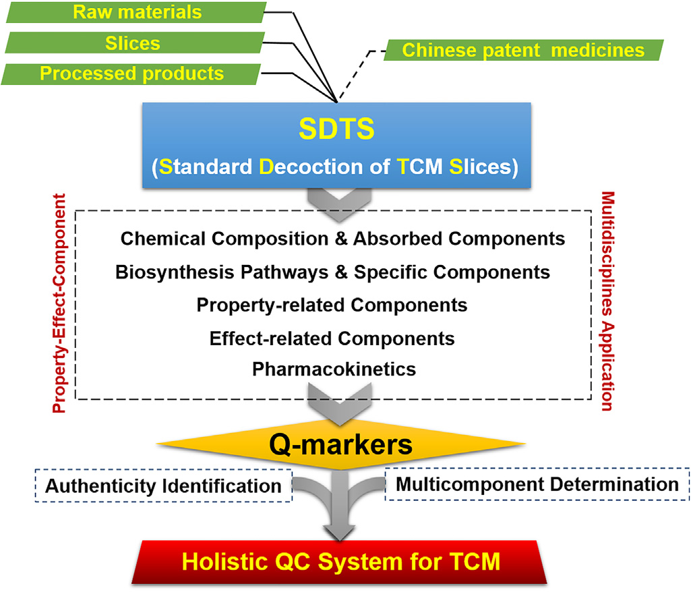

<!-- 方針: 総説の忠実訳。原文構成に沿う。「> 補足:」は訳者注。数式はKaTeXで表示。 -->

## 書誌情報

- 原題: Approaches to establish Q-markers for the quality standards of traditional Chinese medicines
- 著者: Wenzhi Yang, Yibei Zhang, Wanying Wu, Luqi Huang, Dean Guo（責任著者）, Changxiao Liu（責任著者）（上海薬物研究所 TCM標準化国家工程研究室／中国中医科学院／天津薬物研究院, 中国）
- 掲載: *Acta Pharmaceutica Sinica B* 2017, 7(4), 439–446. https://doi.org/10.1016/j.apsb.2017.04.012
- インパクトファクター: **13.8**（*Acta Pharm. Sin. B*, JCR 2024 / Clarivate。※本論文自体は2017年）
- 受領 2017-02-18 / 改訂 2017-04-19 / 採録 2017-04-20

> 補足: 本稿はQ-marker(品質マーカー)概念の基礎文献。責任著者のChangxiao Liu(劉昌孝)はQ-marker概念の提唱者。当サイトの多くの解説(Q-marker選定・多成分QC)の理論的な土台にあたる総説で、個別の分析データより「品質規格をどう設計するか」という枠組みを提示する。

## 抄録 (Abstract)
伝統中国医学（Traditional Chinese medicine, TCM）は、中国の人々の健康維持において極めて重要な役割を果たしてきており、現在では世界的な範囲で受け入れられつつある。しかし、TCMはその品質に関してますます多くの懸念に直面している。TCMに固有の「多成分・多標的（multicomponent and multitarget）」という特徴は、西洋医学とは異なる独自の品質および生物活性評価システムの確立を必要とする。しかし、TCMは本質的に「生薬（herbal medicine）」または「天然物（natural product）」として研究されており、薬局方の品質規格（quality monographs）は実際には化学マーカー（chemical markers）に基づいており、割り当てられた化学マーカーの一貫性は確保できるものの、ある程度はTCMの基本理論から逸脱している。「性-効-成分（property-effect-component）」理論に従って、「品質マーカー（quality marker, Q-marker）」の概念が提案されている。Q-markerの確立には、天然物化学、分析化学、バイオニクス、ケモメトリクス、薬理学、システム生物学、薬力学などの多分野の技術が統合されている。Q-markerに基づくフィンガープリントと多成分定量は、より科学的なTCM品質管理システムの構築に寄与する。本総説では、Q-markerの背景、定義、性質、およびその確立に適用される関連技術について概説する。Q-markerに基づくTCM品質管理システムを構築するための戦略とアプローチを提示し、いくつかのTCMの事例を挙げて強調する。

## 1. はじめに (Introduction)
伝統中国医学（TCM）は、疾患の予防と治療における極めて重要な役割により、世界的な範囲でますます注目を集め、受け入れられつつある。TCMには長い臨床実践の歴史があるにもかかわらず、その現代化とグローバル化を阻む主な障壁は、強固な科学的証拠の欠如である。すなわち、現代の生物医学ツールを用いて、化学組成を明確に解明し、明確な作用機序を明らかにし、「二重盲検」臨床試験によって有効性を検証し、安全性、有効性、一貫性を確保するための実用的な品質管理を可能にするデータが不足している。世界保健機関（WHO）は北京宣言を発表し、エビデンスに基づく伝統医学の国家医療システムへの統合を奨励し、伝統医学の適切、安全かつ効果的な使用を確保できる規制と基準を推進した[1]。中国の科学者たちは、TCMの「ブラックボックス」を解き明かそうと努力を重ねており、過去2十年間でTCMの現代化とグローバル化において、多分野の研究プラットフォームの確立、顕著な科学的成果、急成長するTCM産業、臨床評価、グローバル化および専門人材の育成など、大きな進歩を遂げてきた[2]。しかし、西洋医学とは完全に異なる独自の理論を持つTCMの研究は、現在も「百花斉放、百家争鳴」の時代にあり、標準化され、一般に受け入れられた研究戦略は未だ確立されていない。

TCMの「多成分・多標的」という性質は、治療の基盤研究のための新しい理論や評価システムを開発し、それによってTCMのより科学的な品質管理システムを確立する必要性を生じさせている。一方で、多次元クロマトグラフィーやLC-MSなどの分析技術の発展により、単一の生薬から500以上の成分を特性評価することや、TCM処方（方剤）から40以上の化合物を同時に定量すること[3-6]、さらには異なるTCM製剤から生薬を定性的に同定または定量的に評価することさえ可能になっている[7,8]。in silico データベースによる植物代謝物の自動アノテーションも実現可能である[9,10]。他方で、フィトミクスQC（phytomics QC）[11]、スペクトル-活性相関（spectrum-effect relationship）[12,13]、メタボロミクス/中薬メタボロミクス（metabolomics/chinmedomics）[14,15]、血清薬理学/血清薬化学[16,17]、バイオクロマトグラフィー[18]、アフィニティー限外濾過/LC-MSと in silico 分子ドッキングの結合[19,20]、および活性指数（activity index, AI）[21]やコンビネーションインデックス（combination index, CI）[22]など、多くの新しい理論/戦略や分析技術が、総合的な有効性を担う生物活性成分をスクリーニングし、複数成分の相乗効果を調査するために開発されてきた。ネットワーク薬理学は、標的ネットワークを解明し、創薬を促進するための強力なツールである[23]。しかし、これらの戦略では、TCMは本質的に「生薬」または「天然物」として研究されており、薬性（nature/flavor）や帰経（channel entry）などの重要なTCMの要素が無視されている。

基原、栽培/生産地の条件（道地性, geo-herbalism）、収穫、加工、輸送/貯蔵条件、抽出/精製、ADME（吸収、分布、代謝、排泄）、および多様な成分の相互作用など[24]、多くの要因がTCMの品質に影響を与える可能性があり、TCM品質の研究は系統的な取り組みとなっている。中国薬局方で採用されている品質管理システムは、一般的に化学マーカー志向である。TCM生薬材料、抽出物、製剤、および処方における化学組成とマーカーの含有量は、真偽鑑定や品質評価のために、UV、TLC、HPLC（またはUHPLC）、GC、LC-MS、またはGC-MSによって測定されている。しかし、現在の薬局方の品質規格には依然として著しい不十分さがあり、化学マーカーと総合的な有効性との関係について疑問が集中している。場合によっては、マーカーが非特異的であり、その検出だけでは、TCM処方において公定書に記載された正品種と非公定の代替品や偽造品を区別できないことがある。したがって、科学的なTCM品質管理システムは、薬性を包摂し、一般に受け入れられている分析技術によって、薬効に関連する特異的な化学マーカーを監視するべきである。

最近、品質基準と品質保証における課題を解決するために、TCMの品質に影響を与える要因を考慮した「Q-marker（品質マーカー）」の概念が提案された[24-26]。Q-markerに影響を与える可能性のあるパラメータと、多分野に基づくQ-marker確立のための戦略が提示された。従来の化学マーカーとは対照的に、Q-markerは特異的で、薬効に関連し、TCMの基本理論（薬性・帰経、および処方の構成原則）に合致している。したがって、Q-markerに基づくTCM品質管理は、より科学的であり、TCMの現代化とグローバル化の加速に有益であると考えられている。本総説では、この新しい概念であるQ-markerの背景、定義、および性質について詳細に描写する。中国薬局方、米国薬局方、および欧州薬局方におけるTCM品質規格の策定における実務経験に基づき、TCMの包括的な品質管理システムを構築するための実用的な戦略を提供する。Q-markerの概念が同業者の共感を呼び、共にTCMの現代化とグローバル化に貢献できることを期待している。

## 2. Q-markerの概念とTCMの品質管理における役割 (Concept of Q-marker and its role in quality control of TCM)

### 2.1. 背景 (Background)
TCMの品質に関する包括的な研究と品質規格の確立は、その極めて複雑な化学組成のために、複雑で系統的なタスクとみなされている。化学分析や生物活性評価に関連する多くの文献が存在するものの、異なる研究グループによって開発された戦略やアプローチは多様であり、時に矛盾することさえある。薬局方で使用されている化学マーカーが、TCM（生薬材料、抽出物、製剤、および多様な剤形の方剤製剤を含む）の臨床効果に関与し、直接的に関連しているかどうかは、しばしば疑問視される。中国薬局方（2015年版）に収録されている生薬種のおよそ1/3が2〜5の異なる植物基原（plant sources）を有していることから、TCM材料の真偽鑑定は品質規格を確立する上での重要な要因となる。複数の化学マーカー（特異的かつ管理可能）のフィンガープリントと含有量情報を捉えるための実用的な分析方法（定性的および定量的解析）の開発が、TCM品質管理の基礎である。Q-markerの概念は、TCMの基本理論、処方、調製技術、剤形、および方剤製剤の使用法などの複雑な要因を考慮して、TCM品質研究と品質規格策定を標準化し、品質の一貫性、制御可能性、および追跡可能性（トレーサビリティ）を向上させるために提案された。これは、TCM製品の製造工程管理および品質管理に貢献するものである。

### 2.2. Q-markerの定義 (Definition of Q-marker)
TCMのQ-markerとは、生薬材料およびTCM製品（飲片[decoction pieces]、煎剤[decoctions]、抽出物、および中成薬[Chinese patent medicines]を含む）に存在し、機能的特性に密接に関連する、固有のまたは加工・調製の結果として生じる化学物質であり、安全性と有効性を具現化するTCMの品質管理用指標として使用できるものである。しかし、生体内プロセス（ヒトの生体内代謝物、腸内酵素や微生物によって変換された化学物質など）の後に吸収または新たに生成された化学物質で、追加の構造解明を必要とするものは、この範囲外である。この定義から、Q-markerの基本特性は以下の4つの側面に要約できる：
1) TCM材料および製品に固有の化学成分であるか、または加工・調製の結果として生じるものである。
2) 明確な化学構造を持ち、機能的特性に関連している。
3) 定性的に特性評価でき、定量的に決定できる。
4) 処方（方剤）においては、配伍（compatibility）理論に従い、君薬（Monarch）を代表する物質が最優先で考慮され、臣薬（Minister）、佐薬（Assistant）、使薬（Guide）に由来する物質も考慮されるべきである。

Q-markerに影響を与える要因には、1) 細胞および組織特異性、2) 器官特異性、3) 生合成の発生段階特異性、4) 生育プロセスの外因的要因（生薬材料）、5) 調製要因（方剤製剤）が含まれる。Q-markerの確立においては、真正性を確保する成分（同一性マーカー/identity marker）、品質の差異を区別する成分（優劣マーカー/superiority/inferiority marker）、および道地性を特定する成分（道地性マーカー/geo-authentic marker）に特別な注意を払う必要がある。

### 2.3. Q-marker確立のアプローチ (Approaches for establishing Q-markers)
TCM飲片の標準煎液（Standard decoction of TCM slices, SDTS）は、臨床使用における標準的な形態であり、TCMの薬効を追跡するためのコアセグメントとなり得る[27]。したがって、SDTSを対照試料（reference sample）として使用した品質研究を実施してQ-markerを確立し、これを生薬材料や飲片（および加工製品）まで遡って追跡可能（traceable）にし、さらに方剤製剤（中成薬）へと拡張する。SDTSのQ-markerを確立するための戦略は、図1に示すように提案されている[24,25]。

1) 試料の要件：試料は代表的であり、TCM生薬材料および飲片に関する中国薬局方の要件に基づいて特定の種に同定（真偽鑑定）されている必要がある。従来の同定法とDNAバーコーディングを統合することができる[28]。
2) 飲片の加工：加工は、薬局方の要件、または道地（geo-authentic）の場所や主要生産地域で使用されているアプローチに従うべきである。
3) 煎液の品質検査：煎じる前に、マーカーの含有量、外観、検査項目、および水分含有量を検査する必要がある。
4) 試料量：推奨量は100 g、バッチ数は10以上。
5) 加水量：飲片量の体積比で6〜8倍。
6) 浸漬時間および煎じ回数：推奨浸漬時間は30分、煎じ回数は2回（それぞれ30分および20分）。
7) 濃縮方法：減圧下、50℃以下の温度での濃縮を推奨。最終容量は生薬重量 of 5倍とし、遮光下で低温保存する。
8) SDTSのフィンガープリント：ピーク数のカウントおよびピーク同定のために、HPLC、GC、LC-MS、およびGC-MSを推奨する。特異的であり、薬効に関連するピークがQ-markerとして選択される。フィンガープリントは、対照生薬（reference drug）または標準物質（reference standards）と比較することによって決定される。
9) マーカーの定量分析：HPLC、GC、LC-MS、およびGC-MSアプローチを推奨する。一成分多指標定量法（single standard to determine multicomponents, SSDMC）は、実用的な多成分定量法である[29,30]。

> 補足: 図1は、Q-markerに基づくTCMの包括的品質管理システムの構築に向けた一般的なフローチャートを示しています。（原文：Figure 1. A general flowchart for Q-marker-based establishment of holistic quality control system of TCM.）

「性-効-成分（property-effect-component）」の三元理論に従い、多分野に基づく戦略（天然物化学、分析化学、バイオニクス、コンピュータ支援設計、薬理学、システム生物学、および薬力学を含む）を統合して、TCMの基本理論に沿った効果関連マーカーを発見し、これらをQ-markerと見なすことが推奨される。

1) 化学組成の包括的分析と吸収成分の同定：植物化学的アプローチ（カラムクロマトグラフィー、分取HPLC、およびNMR）とLC-MS（高分解能MSを推奨）を組み合わせることで、化学組成を包括的にプロファイリングし特性評価する。吸収成分とその代謝物はLC-MSによって同定される。
2) 生合成経路と特異性の探索：特性評価された成分について、さらに生合成経路と特異性（属、種、器官、組織、ならびに生育および発育段階の間における特異性）を考慮し、どれが特異的成分であるかを識別する。
3) 薬性（property）関連成分の発見：電子鼻（electronic nose, EN）や電子舌（electronic tongue, ET）などのバイオニクス技術を、植物化学的分離（全抽出物、画分、および単一化合物）と組み合わせて使用し、TCMの五味（辛、甘、酸、苦、咸）に関連する成分をスクリーニングする[31-35]。分子ドッキング（苦味受容体：hTAS2R10、陽性リガンド：キニーネ；辛味受容体：OR7D4、陽性リガンド：カプサイシン；GPCR）は、薬性関連成分の発見にさらなる証拠を与えることができる。
4) 薬効（effect）関連成分の発見：抽出物および単一化合物を、主要な薬効に関連する複数のモデル（動物、摘出器官、細胞、酵素などを含む）でテストする。代表的な化合物のネットワーク薬理学分析を実行して、多標的の作用経路を予測する。メタボロミクスにより、治療効果に関連する代謝経路の発見が可能になる。
5) 薬物速度論（PK）研究：動物における抽出物（TCM生薬材料および処方）、単一生薬材料、および代表的な化合物の薬物速度論パラメータ（$C_{\text{max}}$, $t_{\text{max}}$, $AUC_{0-t}$, $AUC_{0-\infty}$, $V_d$, $t_{1/2}$, $MRT_{0-t}$, $CL$）を測定する。パラメータの変化は、化合物の配伍（相性・組み合わせ）の合理性を解明するのに寄与する。

## 3. 品質マーカー成分（Q-marker）確立の代表的事例 (Classic cases for the establishment of quality marker components (Q-markers))
Q-markerの概念と一致して、著者らはTCM生薬材料およびTCM処方の品質管理のための品質マーカー成分の確立において、20年以上にわたり実践してきた。ここでは代表的な事例を示す。

人参（Ginseng Radix et Rhizoma; Panax ginseng; Ren-Shen）の真正性を保証するQ-markerの確立は困難である。なぜなら、同属種（西洋人参 [Panax quinquefolius] や田七人参 [Panax notoginseng] など）間や異なる部位（根/根茎、茎/葉、花、果実、種子）間の化学的差異を解明する必要があるからである。P. ginsengの5つの異なる部位の同一性マーカー（identity markers）を探索するために、非標的メタボロミクスと人工ニューラルネットワーク（ANN）が用いられた[36]。さらに、固有の化学的差異を具現化する堅牢なマーカーを発見するために、「商業的-同起源（commercial-homophyletic）」比較誘導型のバイオマーカー検証戦略が提案された。生物活性と特異性を考慮し[37,38]、ジンセノシド（ginsenosides）が主に品質マーカーの確立に使用された。結果として、種子はジンセノシドをほとんど含んでおらず、他の4つの部位から容易に区別できる。11の堅牢なマーカー化合物（ginsenosides Re, Rg1, Rg2, Rc, Rf, F1, Ro, vina-R4, acetyl-Rh13/R19, floral-I/J、およびフラボノイド1種）は、P. ginsengの根/根茎、茎/葉、花、および果実の間を正確に同定するための診断指標となった。特に、中国薬局方（2015年版）において異なる薬性・帰経で記録されている根と葉は、ginsenosides Rf, F1, Rdにおいて異なる。同属の P. ginseng、P. quinquefolius、P. notoginseng の根におけるジンセノシド組成も解明された[39]。それらの区別のために、同一性マーカーと有意に異なる成分を含む17のサポニンが推出され、これらはTCM方剤製剤からそれらを同定するための診断指標にもなった。特に、新しい同一性マーカーであるRs1は、P. ginsengとP. quinquefoliusを区別するために使用できる。

延胡索（Corydalis Rhizoma; Corydalis yanhusuo; Yan-Hu-Suo）は、気の巡りを良くし痛みを和らげることができる有名なTCM生薬である。そのQ-markerは、安全性と有効性に関連する品質管理アプローチと品質規格を構築するための実証的研究として確立された[40]。第一に、酢製（vinegar-processed）延胡索の標準抽出物の化学成分のLC-MS分析により、28のアルカロイドが同定された。第二に、生合成、特異性、および含有量に基づき、tetrahydropalmatine, corydaline, coptisine, palmatine, dehydrocorydaline, D-tetrahydrojatrorrhizine, protopine が潜在的なQ-markerとして挙げられた。第三に、薬力学実験により、動物、摘出器官、および細胞モデルにおける60%エタノール抽出物およびtetrahydropalmatineの鎮痛効果が実証された。ネットワーク薬理学分析により、経路がホルモン調節、中枢鎮痛、痙攣緩解（spasmolysis）、炎症、および免疫調節に関連していることが明らかになった。したがって、tetrahydropalmatine, palmatine, D-glaucine, biflorine が主要な治療基盤であり、Q-markerと見なされる。分子ドッキング（苦味受容体：hTAS2R10およびGPCR）によるその後の薬物特性スクリーニング実験により、tetrahydropalmatineとprotopineが苦味および辛味特性に関連する物質であることが証明された。延胡索抽出物を経口投与したラットの血漿中には11のプロトタイプ（未変化体）アルカロイドと6つの代謝物が検出され、脳組織中には7つのプロトタイプアルカロイドが検出された。血液脳関門（BBB）を通過できる tetrahydropalmatine, corydaline, biflorine が鎮痛効果を発揮した。これらすべての証拠に基づき、最終的に7つのアルカロイド（corydaline, tetrahydropalmatine, coptisine, protopine, palmatine, dehydrocorydaline, D-tetrahydrojatrorrhizine）が延胡索のQ-markerとして選択された。

生薬材料に基づいて確立されたQ-markerがTCM処方に拡張できるかどうかを検証するため、元胡止痛滴丸（Yuanhu Zhitong Dropping Pill, YZDP）のQ-markerが調査された[41]。YZDPは、延胡索（酢製）と白芷（Angelicae Dahuricae Radix）から調製される。同様の研究戦略を適用することにより、YZDPから51の成分（28のアルカロイドと23のクマリンを含む）が特性評価され、ラット血漿中に26のプロトタイプ成分と14の代謝物が同定された。そのうち15のプロトタイプ成分がBBBを通過することができた。プロトベルベリン型アルカロイド（protoberberine alkaloids）は苦味の潜在的物質であり、tetrahydropalmatine, biflorine, imperatorin は辛味に関連する可能性のある物質である。痛経（dysmenorrhea）に対するYZDPの標的は、ピトシン（オキシトシン）受容体、M受容体、H1受容体、およびプロスタグランジンの合成である。YZDPの多標的作用機序は、ホルモン調節、中枢鎮痛、平滑筋の痙攣緩解、抗炎症、および免疫調節に関連しており、これは延胡索で発見されたものと同様である。グリセロリン脂質代謝、アミノ酸代謝、およびスフィンゴ脂質代謝のシグナル伝達経路が乱され、それによって痛経が効果的に緩和された。製剤化により、corydaline, tetrahydropalmatine, biflorine の吸収が促進され、imperatorin と isoimperatorin の吸収が遅延し、滞留時間が延長される。最終的に、5つの成分（corydaline, tetrahydropalmatine, biflorine, imperatorin, isoimperatorin）がYZDPのQ-markerとして確立され、そのうち前者の2つのアルカロイドは延胡索のQ-markerに含まれていた。TCM処方のQ-markerを確立するための選択基準は君薬（Monarch herb）を強調するが、臣薬（Minister）、佐薬（Assistant）、使薬（Guide）も考慮に入れられる。

## 4. Q-markerに基づくTCMの包括的品質管理システムの構築 (Construction of the holistic quality control system of TCM based on Q-markers)
「品質の一貫性、制御可能性、追跡可能性、および製造関連」のQ-markerが定義されれば、次に、実用的な分析アプローチでこれらのマーカーを監視することにより、TCMの包括的な品質管理システムを確立することができる。TCM品質管理システムの構築における核心的課題は、真偽鑑定（authenticity identification）、品質評価（quality assessment）、および外来物質管理（残留農薬、重金属、アフラトキシンなど）である。Q-markerは、移行可能な物質（transferable substances）として、TCM（生薬材料、抽出物、製剤、および配合方剤製剤を含む）の真偽鑑定および品質評価のプロセスにおいて極めて重要な役割を果たしており、そのためこれら2つの側面を強調する。

### 4.1. 真偽鑑定 (Authenticity identification)
品質管理を実施する主要な目標は、薬物の真正性を保証すること、すなわち、偽造品や代替品から正しい種を同定することである。経験、形態、顕微鏡観察、物理化学的性質、TLC、フィンガープリント、特徴的クロマトグラム、およびDNAシーケンシングに基づく多様な同定方法が、中国薬局方（2015年版）の同定項目で採用されている[1,42]。これらの中で、TLCとフィンガープリントは全体的な化学プロファイルを捉える能力があり[43-45]、特徴的クロマトグラムは、鑑定上の意義を持ち、Q-markerの物質的基礎でもある特徴的成分の組成情報を提供する。中国薬局方に収録されているTCMのおよそ1/3は複数の植物基原に由来するが、有効性と一貫性を確保するために、実行可能かつ科学的な品質基準を詳細に構築するための前提として、その種の発見と定義が必要である[46]。Q-markerの適用は、最良の臨床効果を有する高品質な種の選択に役立ち得る。代表的な例として、霊芝（Ganoderma / Ling-Zhi）は、中国薬局方に記録されているように、Ganoderma lucidum (Leyss. Ex Fr.) Karst および C. sinense Zhao, Xu et Zhang の乾燥子実体に由来する。しかし、C. sinense は C. lucidum とは異なり、治療効果に密接に関連する生物活性成分の重要なグループであるトリテルペン酸類（triterpenic acids）を極めて稀にしか含まないことが分かった[47-50]。米国薬局方の生薬コンペンディウム（Herbal Medicine Compendium）における Ganoderma lucidum Fruiting Body の品質基準モノグラフの策定において、最終的に C. lucidum が唯一の真正な種として選択された（https://hmc.usp.org/monographs/ganoderma-lucidum-fruiting-body-1-0）。

> 補足: 原文454行目の「Canoderma lucidum」は「Ganoderma lucidum」の誤記と考えられます。

### 4.2. 品質評価 (Quality assessment)
多成分同時定量は、TCMの品質を評価するためのゴールデンスタンダードとして一般に受け入れられている[51-53]。確立されたQ-markerの含有量測定は、ルーチンのHPLC、GC、およびLC-MSにより、科学的なTCM品質基準を確立するための重要な要因である。定量マーカーは、治療基盤の知見に応じて、一連 of 生物活性アナログまたは異なるサブタイプの成分を含むことができる。複数マーカーの同時定量は、一方では包括的な品質評価や、抽出物、製剤、および配合方剤製剤中の混入物の識別に有益であるが、他方では標準物質に対する厳しい要求を突きつける。より多くの標準物質の使用は、試験コストを大幅に増加させる可能性がある。「一成分多指標定量法（SSDMC）」の導入は、複数マーカーの監視の必要性を満たしつつ、容易に入手可能な単一の標準物質のみを利用する[29,30,54]。SSDMCは、米国薬局方および欧州薬局方のTCM品質規格の策定に採用されており、将来的には中国薬局方にも広く採用されることが期待されている。現在報告されているSSDMC法はHPLC-UV分析に基づいており、一般に10未満の定量マーカーを同時に測定できる。牛黄上清丸（Niuhuang Shangqing Pill）のように10以上の生薬材料を含む配合方剤製剤の包括的な品質評価を達成するには[5]、SSDMCの適用範囲をさらに拡大する必要があり、そこではクロマトグラフィー分離と偏りのない検出（unbiased detection）が2つの主要な課題である。多次元液体クロマトグラフィー（MDLC）は、TCM配合方剤製剤の多成分を分離および定量するための強力なツールである[8]。新しい汎用検出器として報告されているコロナ荷電粒子検出器/荷電エアロゾル検出器（charged aerosol detector, CAD）[55,56]は、SSDMCにおいて生薬代謝物（Q-markers）の異なるサブカテゴリーを決定するために利用される可能性がある。MDLCとCAD検出のハイブリッドがSSDMCアプローチの確立に適しているかどうかは、厳密な実験的検証を必要とする[29]。さらに、多成分定量とケモメトリクスの結合により、真偽鑑定と品質評価、Q-markerの発見、さらには薬用部位の特定を可視化することができる[57-59]。

## 5. Q-markerに基づく科学的品質規格策定の成功事例 (Successful cases of formulating scientific quality standards based on Q-markers)
人参（Ginseng）は、世界中で最も人気のある天然物の一つにランクされている[60]。Panax属の3種、P. ginseng（アジアン人参 / Asian ginseng）、P. quinquefolius（アメリカ人参 / American ginseng）、および P. notoginseng（田七人参 / Sanchi ginseng）は、ヘルスケア製品、サプリメント、および生薬として大量に消費されている[37]。これら同属の人参生薬の化学的差異に関する精査に基づき[39,61,62]、我々は米国薬局方の生薬コンペンディウム向けに、P. ginseng、P. quinquefolius、P. notoginseng、および紅参（red ginseng, P. ginsengの加工品）の品質規格モノグラフの策定または改善に成功した。これらは、Q-markerに基づく品質規格を確立した成功事例としてここに紹介する。異なる生育環境、樹齢（栽培年数）、および加工は品質に影響を与え、市場における人参生薬の多様な力価（strength）をもたらす。化学的類似性（ジンセノシド）があるため、品質規格モノグラフを策定する際に、偽造品や代替品から真正な種を同定できるQ-markerを監視することが特に重要である。

第一に、各生薬種（species）ごとに複数バッチのサンプルを含む人参のサンプルライブラリを構築する（通常は10バッチ以上[>10]）[57]。これらは購入チャネルと生産地に関する明確な情報を有しており、厳密に真偽鑑定されている。P. ginsengについては、野生と栽培、および異なる部位のサンプルを区別する必要がある。紅参のサンプルは、GMP認定メーカーから収集する必要がある。P. notoginsengのサンプルには、主根（taproot / 主根 [Zhugen]）、根茎（rhizome / 剪口 [Jiankou]）、側根（branching root / 筋条 [Jintiao]）、および細根（fibrous root / 鬚根 [Xugen]）が含まれる。

第二に、LC-MSフィンガープリントと多変量統計解析を組み合わせて、包括的な化学情報を取得し、差異成分を発見する。QTOFやLTQ-Orbitrapを含む高分解能質量分析は、UHPLCまたはオフラインの包括的2D-LCと結合することで、異なるPanax属および異なる部位由来のジンセノシドの高スループットまたは詳細な定性分析を容易にする[3,36,39,63,64]。

第三に、ジンセノシドQ-markerの検査に焦点を当て、種の識別を可能にする高性能TLC（HP-TLC）アプローチを確立する。自動サンプリングアプリケーターと温度・湿度制御可能な自動展開装置を用いて、HP-TLCシリカゲルプレート上で高感度かつ高解像度のTLCクロマトグラムを得る。P. ginseng、P. quinquefolius、P. notoginseng、および紅参のTLCクロマトグラムは、m-Rb1, m-Rc（またはm-Rd）, Rc, Rf を含むジンセノシドマーカーに対応する明確なスポットを示す。

さらに、特徴的クロマトグラムを構築するためにHPLC-UVフィンガープリント法が開発されている。9つのジンセノシド（noto-R1, Rg1, Re, Rf, Rb1, Ro, Rc, Rb2, Rd）の有無および相対強度は、P. ginseng、P. quinquefolius、P. notoginseng、および紅参の同定および区別のための診断指標となる。

第四に、品質評価にSSDMCを使用する。紅参の場合、ginsenoside Rg1が単一の標準物質として選択され、8つのジンセノシド（Rg1, Re, Rf, Rb1, Ro, Rc, Rb2, Rd）の含有量を測定する。P. notoginsengの品質評価の場合、5つの主要なサポニン（noto-R1, Rg1, Re, Rb1, Rd）を同時に測定できる5分間のUHPLCベースのSSDMC法が開発されている。他方で、UHPLC/QTOF-MSベースのメタボロミクスを用いて、類似する2つの田七人参総サポニン製品である血栓通（Xueshuantong）と血塞通（Xuesaitong）の特徴的成分を確立している[64]。

TCM配合方剤製剤（中成薬、CPMsとしても知られる）の品質管理に直面した際、分析効率と同定カバー率の向上を目指した新しい試みが行われている。「単一手法-異形マトリックス（monomethod-heterotrait matrix）」と呼ばれる新しい戦略が提案されており、これは単一のCPMからすべての構成生薬を同定すること、または異なるCPMからTCMを同定すること、および異なるCPMから（君薬由来の）Q-markerを定量することができる。代表的な例として、選択イオンモニタリング（SIM）とUHPLC分離の結合は、舒胸片（Shuxiong tablet）から三七（Notoginseng Radix et Rhizoma / San-Qi）、紅花（Carthami Flos / Hong-Hua）、および川芎（Chuanxiong Rhizoma / Chuang-Xiong）を同定することができ[65]、他方では、キノカルコンC-配糖体（quinochalcone C-glycosides）をQ-markerとして使用して、11の異なるCPMから紅花を同定することができる[7]。8つの異なるCPMにおける5つの主要な田七人参サポニン（君薬である P. notoginseng を代表する）の含有量は、マルチハートカット2D-LCアプローチによって測定される[8]。これらの事例は、効率と能力が大幅に向上したCPMの定性的および定量的分析における「単一手法-異形マトリックス」戦略の実現可能性を証明している。

> 補足: 原文586行目の「Carthumi Flos」は「Carthami Flos」の誤記と考えられます。

## 6. 結論 (Conclusions)
TCMの標準化技術における目覚ましい進歩に支えられ、TCMの現代化とグローバル化は圧倒的な潮流となっている。Q-markerの概念は、基本的なTCM理論に沿った品質研究を導くことができる合理的なシステムである。多分野の技術の応用は、Q-markerの発見に有益である。Q-markerに基づく品質規格は、TCM生薬材料、抽出物、製剤、および配合方剤製剤のより科学的な品質管理アプローチとみなされるだろう。また、生薬材料から中成薬製品に至るまでの漢方薬生産におけるQ-markerに基づく品質管理は、TCM生産プロセスにおける移行性（transitivity）と追跡可能性（traceability）に、より有益であるという一般的な概念でもある。

## 図（原論文より）

## 参考文献

> 原論文の参考文献。番号は本文の引用 [N] に対応。各文献はDOIまたはGoogle Scholar検索へのリンク。

1. Guo DA, Wu WY, Ye M, Liu X, Cordell GA. A holistic approach to the quality control of traditional Chinese medicine. Science 2015;347: S23–31. — [Google Scholarで探す](https://scholar.google.com/scholar?q=Guo%20DA%2C%20Wu%20WY%2C%20Ye%20M%2C%20Liu%20X%2C%20Cordell%20GA.%20A%20holistic%20approach%20to%20the%20quality%20control%20of%20traditional%20Chinese%20medicine.%20Science%202015%3B347%3A%20S23%E2%80%9331.)
2. Zhang BL, Zhang JH. Twenty years' review and prospect of modernization research on traditional Chinese medicine. China J Chin Mater Med 2015;40:3331–4. — [Google Scholarで探す](https://scholar.google.com/scholar?q=Zhang%20BL%2C%20Zhang%20JH.%20Twenty%20years%27%20review%20and%20prospect%20of%20modernization%20research%20on%20traditional%20Chinese%20medicine.%20China%20J%20Chin%20Mater%20Med%202015%3B40%3A3331%E2%80%934.)
3. Qiu S, Yang WZ, Shi XJ, Yao CL, Yang M, Liu X, et al. A green protocol for efficient discovery of novel natural compounds: char- acterization of new ginsenosides from the stems and leaves of Panax ginseng as a case study. Anal Chim Acta 2015;893:65–76. — [Google Scholarで探す](https://scholar.google.com/scholar?q=Qiu%20S%2C%20Yang%20WZ%2C%20Shi%20XJ%2C%20Yao%20CL%2C%20Yang%20M%2C%20Liu%20X%2C%20et%20al.%20A%20green%20protocol%20for%20ef%EF%AC%81cient%20discovery%20of%20novel%20natural%20compounds%3A%20char-%20acterization%20of%20new%20ginsenosides%20from%20the%20)
4. Qiao X, Lin XH, Ji S, Zhang ZX, Bo T, Guo DA, et al. Global profiling and novel structure discovery using multiple neutral loss/ precursor ion scanning combined with substructure recognition and statistical analysis (MNPSS): characterization of terpene-conjugated curcuminoids in Curcuma longa as a case study. Anal Chem 2016;88:703–10. — [Google Scholarで探す](https://scholar.google.com/scholar?q=Qiao%20X%2C%20Lin%20XH%2C%20Ji%20S%2C%20Zhang%20ZX%2C%20Bo%20T%2C%20Guo%20DA%2C%20et%20al.%20Global%20pro%EF%AC%81ling%20and%20novel%20structure%20discovery%20using%20multiple%20neutral%20loss/%20precursor%20ion%20scanning%20combined%20with%20subst)
5. Liang J, Wu WY, Sun GX, Wang DD, Hou JJ, Yang WZ, et al. A dynamic multiple reaction monitoring method for the multiple components quantification of complex traditional Chinese medicine preparations: niuhuang Shangqing pill as an example. J Chromatogr A 2013;1294:58–69. — [Google Scholarで探す](https://scholar.google.com/scholar?q=Liang%20J%2C%20Wu%20WY%2C%20Sun%20GX%2C%20Wang%20DD%2C%20Hou%20JJ%2C%20Yang%20WZ%2C%20et%20al.%20A%20dynamic%20multiple%20reaction%20monitoring%20method%20for%20the%20multiple%20components%20quanti%EF%AC%81cation%20of%20complex%20traditional%20Ch)
6. Wang Q, Song W, Qiao X, Ji S, Kuang Y, Zhang ZX, et al. Simultaneous quantification of 50 bioactive compounds of the tradi- tional Chinese medicine formula Gegen-Qinlian decoction using ultra- high performance liquid chromatography coupled with tandem mass spectrometry. J Chromatogr A 2016;1454:15–25. — [Google Scholarで探す](https://scholar.google.com/scholar?q=Wang%20Q%2C%20Song%20W%2C%20Qiao%20X%2C%20Ji%20S%2C%20Kuang%20Y%2C%20Zhang%20ZX%2C%20et%20al.%20Simultaneous%20quanti%EF%AC%81cation%20of%2050%20bioactive%20compounds%20of%20the%20tradi-%20tional%20Chinese%20medicine%20formula%20Gegen-Qinlian%20d)
7. Si W, Yang WZ, Guo DA, Wu J, Zhang JX, Qiu S, et al. Selective ion monitoring of quinochalcone C-glycoside markers for the simultaneous identification of Carthamus tinctorius L. in eleven Chinese patent medicines by UHPLC/QTOF MS. J Pharm Biomed Anal 2016;117:510–21. — [Google Scholarで探す](https://scholar.google.com/scholar?q=Si%20W%2C%20Yang%20WZ%2C%20Guo%20DA%2C%20Wu%20J%2C%20Zhang%20JX%2C%20Qiu%20S%2C%20et%20al.%20Selective%20ion%20monitoring%20of%20quinochalcone%20C-glycoside%20markers%20for%20the%20simultaneous%20identi%EF%AC%81cation%20of%20Carthamus%20tinctor)
8. Yao CL, Yang WZ, Wu WY, Da J, Hou JJ, Zhang JX, et al. Simultaneous quantitation of five Panax notoginseng saponins by multi heart-cutting two-dimensional liquid chromatography: method development and application to the quality control of eight notogin- seng containing Chinese patent medicines. J Chromatogr A 2015;1402:71–81. — [Google Scholarで探す](https://scholar.google.com/scholar?q=Yao%20CL%2C%20Yang%20WZ%2C%20Wu%20WY%2C%20Da%20J%2C%20Hou%20JJ%2C%20Zhang%20JX%2C%20et%20al.%20Simultaneous%20quantitation%20of%20%EF%AC%81ve%20Panax%20notoginseng%20saponins%20by%20multi%20heart-cutting%20two-dimensional%20liquid%20chromatog)
9. Ridder L, van der Hooft JJ, Verhoeven S, de Vos RC, Bino RJ, Vervoort J. Automatic chemical structure annotation of an LC–MSn based metabolic profile from green tea. Anal Chem 2013;85:6033–40. — [Google Scholarで探す](https://scholar.google.com/scholar?q=Ridder%20L%2C%20van%20der%20Hooft%20JJ%2C%20Verhoeven%20S%2C%20de%20Vos%20RC%2C%20Bino%20RJ%2C%20Vervoort%20J.%20Automatic%20chemical%20structure%20annotation%20of%20an%20LC%E2%80%93MSn%20based%20metabolic%20pro%EF%AC%81le%20from%20green%20tea.%20Anal%20)
10. Qiu F, Fine DD, Wherritt DJ, Lei ZT, Sumner LW. PlantMAT: a metabolomics tool for predicting the specialized metabolic potential of a system and for large-scale metabolite identifications. Anal Chem 2016;88:11373–83. — [Google Scholarで探す](https://scholar.google.com/scholar?q=Qiu%20F%2C%20Fine%20DD%2C%20Wherritt%20DJ%2C%20Lei%20ZT%2C%20Sumner%20LW.%20PlantMAT%3A%20a%20metabolomics%20tool%20for%20predicting%20the%20specialized%20metabolic%20potential%20of%20a%20system%20and%20for%20large-scale%20metabolit)
11. Tilton R, Paiva AA, Guan JQ, Marathe R, Jiang ZL, van Eyndhoven W, et al. A comprehensive platform for quality control of botanical drugs (PhytomicsQC): a case study of Huangqin Tang (HQT) and PHY906. Chin Med 2010;5:30. Wenzhi Yang et al. 444 — [Google Scholarで探す](https://scholar.google.com/scholar?q=Tilton%20R%2C%20Paiva%20AA%2C%20Guan%20JQ%2C%20Marathe%20R%2C%20Jiang%20ZL%2C%20van%20Eyndhoven%20W%2C%20et%20al.%20A%20comprehensive%20platform%20for%20quality%20control%20of%20botanical%20drugs%20%28PhytomicsQC%29%3A%20a%20case%20study%20of%20H)
12. Xu GL, Xie M, Yang XY, Song Y, Yan C, Yang Y, et al. Spectrum- effect relationships as a systematic approach to traditional Chinese medicine research: current status and future perspectives. Molecules 2014;19:17897–925. — [Google Scholarで探す](https://scholar.google.com/scholar?q=Xu%20GL%2C%20Xie%20M%2C%20Yang%20XY%2C%20Song%20Y%2C%20Yan%20C%2C%20Yang%20Y%2C%20et%20al.%20Spectrum-%20effect%20relationships%20as%20a%20systematic%20approach%20to%20traditional%20Chinese%20medicine%20research%3A%20current%20status%20and%20)
13. Qi J, Yu BY. A new methodology for the quality evaluation of traditional Chinese medicine-integrated spectrum-effect fingerprint research. Chin J Nat Med 2010;8:171–6. — [Google Scholarで探す](https://scholar.google.com/scholar?q=Qi%20J%2C%20Yu%20BY.%20A%20new%20methodology%20for%20the%20quality%20evaluation%20of%20traditional%20Chinese%20medicine-integrated%20spectrum-effect%20%EF%AC%81ngerprint%20research.%20Chin%20J%20Nat%20Med%202010%3B8%3A171%E2%80%936.)
14. Wang PC, Wang QH, Yang BY, Zhao S, Kuang HX. The progress of metabolomics study in traditional Chinese medicine research. Am J Chin Med 2015;43:1281–310. — [Google Scholarで探す](https://scholar.google.com/scholar?q=Wang%20PC%2C%20Wang%20QH%2C%20Yang%20BY%2C%20Zhao%20S%2C%20Kuang%20HX.%20The%20progress%20of%20metabolomics%20study%20in%20traditional%20Chinese%20medicine%20research.%20Am%20J%20Chin%20Med%202015%3B43%3A1281%E2%80%93310.)
15. Wang XJ, Zhang AH, Sun H, Han Y, Yan GL. Discovery and development of innovative drug from traditional medicine by inte- grated chinmedomics strategies in the post-genomic era. Trends Anal Chem 2016;76:86–94. — [Google Scholarで探す](https://scholar.google.com/scholar?q=Wang%20XJ%2C%20Zhang%20AH%2C%20Sun%20H%2C%20Han%20Y%2C%20Yan%20GL.%20Discovery%20and%20development%20of%20innovative%20drug%20from%20traditional%20medicine%20by%20inte-%20grated%20chinmedomics%20strategies%20in%20the%20post-genomi)
16. Yan GL, Sun H, Zhang AH, Han Y, Wang P, Wu XH, et al. Progress of serum pharmacochemistry of traditional Chinese medicine and further development of its theory and method. China J Chin Mater Med 2015;40:3406–12. — [Google Scholarで探す](https://scholar.google.com/scholar?q=Yan%20GL%2C%20Sun%20H%2C%20Zhang%20AH%2C%20Han%20Y%2C%20Wang%20P%2C%20Wu%20XH%2C%20et%20al.%20Progress%20of%20serum%20pharmacochemistry%20of%20traditional%20Chinese%20medicine%20and%20further%20development%20of%20its%20theory%20and%20method)
17. Wang YL, Li GQ, Zhou Y, Yin DK, Tao CL, Han L, et al. The difference between blood-associated and water-associated herbs of Danggui-Shaoyao San in theory of TCM, based on serum pharmaco- chemistry. Biomed Chromatogr 2016;30:579–87. — [Google Scholarで探す](https://scholar.google.com/scholar?q=Wang%20YL%2C%20Li%20GQ%2C%20Zhou%20Y%2C%20Yin%20DK%2C%20Tao%20CL%2C%20Han%20L%2C%20et%20al.%20The%20difference%20between%20blood-associated%20and%20water-associated%20herbs%20of%20Danggui-Shaoyao%20San%20in%20theory%20of%20TCM%2C%20based%20on)
18. Wang Y, Kong L, Hu LH, Lei XY, Yang L, Chou GX, et al. Biological fingerprinting analysis of the traditional Chinese prescrip- tion Longdan Xiegan Decoction by on/off-line comprehensive two- dimensional biochromatography. J Chromatogr B 2007;860:185–94. — [Google Scholarで探す](https://scholar.google.com/scholar?q=Wang%20Y%2C%20Kong%20L%2C%20Hu%20LH%2C%20Lei%20XY%2C%20Yang%20L%2C%20Chou%20GX%2C%20et%20al.%20Biological%20%EF%AC%81ngerprinting%20analysis%20of%20the%20traditional%20Chinese%20prescrip-%20tion%20Longdan%20Xiegan%20Decoction%20by%20on/off-line)
19. Song HP, Chen J, Hong JY, Hao HP, Qi LW, Lu J, et al. A strategy for screening of high-quality enzyme inhibitors from herbal medicines based on ultrafiltration LC–MS and in silico molecular docking. Chem Commun 2015;51:1494–7. — [Google Scholarで探す](https://scholar.google.com/scholar?q=Song%20HP%2C%20Chen%20J%2C%20Hong%20JY%2C%20Hao%20HP%2C%20Qi%20LW%2C%20Lu%20J%2C%20et%20al.%20A%20strategy%20for%20screening%20of%20high-quality%20enzyme%20inhibitors%20from%20herbal%20medicines%20based%20on%20ultra%EF%AC%81ltration%20LC%E2%80%93MS%20and%20i)
20. Wang F, Xiong ZY, Li P, Yang H, Gao W, Li HJ. From chemical consistency to effective consistency in precise quality discrimination of Sophora flower-bud and Sophora flower: discovering efficacy- associated markers by fingerprint-activity relationship modeling. J Pharm Biomed Anal 2017;132:7–16. — [Google Scholarで探す](https://scholar.google.com/scholar?q=Wang%20F%2C%20Xiong%20ZY%2C%20Li%20P%2C%20Yang%20H%2C%20Gao%20W%2C%20Li%20HJ.%20From%20chemical%20consistency%20to%20effective%20consistency%20in%20precise%20quality%20discrimination%20of%20Sophora%20%EF%AC%82ower-bud%20and%20Sophora%20%EF%AC%82ower%3A)
21. Wang SF, Wang HQ, Liu YN, Wang Y, Fan XH, Cheng YY. Rapid discovery and identification of anti-inflammatory constituents from traditional Chinese medicine formula by activity index, LC–MS, and NMR. Sci Rep 2016;6:31000. — [Google Scholarで探す](https://scholar.google.com/scholar?q=Wang%20SF%2C%20Wang%20HQ%2C%20Liu%20YN%2C%20Wang%20Y%2C%20Fan%20XH%2C%20Cheng%20YY.%20Rapid%20discovery%20and%20identi%EF%AC%81cation%20of%20anti-in%EF%AC%82ammatory%20constituents%20from%20traditional%20Chinese%20medicine%20formula%20by%20activi)
22. Long F, Yang H, Xu YM, Hao HP, Li P. A strategy for the identification of combinatorial bioactive compounds contributing to the holistic effect of herbal medicines. Sci Rep 2015;5:12361. — [Google Scholarで探す](https://scholar.google.com/scholar?q=Long%20F%2C%20Yang%20H%2C%20Xu%20YM%2C%20Hao%20HP%2C%20Li%20P.%20A%20strategy%20for%20the%20identi%EF%AC%81cation%20of%20combinatorial%20bioactive%20compounds%20contributing%20to%20the%20holistic%20effect%20of%20herbal%20medicines.%20Sci%20Re)
23. Hao DC, Xiao PG. Network pharmacology: a Rosetta stone for traditional Chinese medicine. Drug Dev Res 2014;75:299–312. — [Google Scholarで探す](https://scholar.google.com/scholar?q=Hao%20DC%2C%20Xiao%20PG.%20Network%20pharmacology%3A%20a%20Rosetta%20stone%20for%20traditional%20Chinese%20medicine.%20Drug%20Dev%20Res%202014%3B75%3A299%E2%80%93312.)
24. Liu CX, Chen SL, Xiao XH, Zhang TJ, Hou WB, Liao ML. A new concept on quality marker of Chinese materia medica: quality control for Chinese medicinal products. Chin Tradit Herbal Drugs 2016;47:1443–57. — [Google Scholarで探す](https://scholar.google.com/scholar?q=Liu%20CX%2C%20Chen%20SL%2C%20Xiao%20XH%2C%20Zhang%20TJ%2C%20Hou%20WB%2C%20Liao%20ML.%20A%20new%20concept%20on%20quality%20marker%20of%20Chinese%20materia%20medica%3A%20quality%20control%20for%20Chinese%20medicinal%20products.%20Chin%20Tradi)
25. Liu CX, Cheng YY, Guo DA, Zhang TJ, Li YZ, Hou WB, et al. A new concept on quality marker for quality assessment and process control of Chinese medicines. Chin Herbal Med 2017;9:3–13. — [Google Scholarで探す](https://scholar.google.com/scholar?q=Liu%20CX%2C%20Cheng%20YY%2C%20Guo%20DA%2C%20Zhang%20TJ%2C%20Li%20YZ%2C%20Hou%20WB%2C%20et%20al.%20A%20new%20concept%20on%20quality%20marker%20for%20quality%20assessment%20and%20process%20control%20of%20Chinese%20medicines.%20Chin%20Herbal%20Med)
26. Guo DA. Quality marker concept inspires the quality research of traditional Chinese medicines. Chin Herbal Med 2017;9:1–2. — [Google Scholarで探す](https://scholar.google.com/scholar?q=Guo%20DA.%20Quality%20marker%20concept%20inspires%20the%20quality%20research%20of%20traditional%20Chinese%20medicines.%20Chin%20Herbal%20Med%202017%3B9%3A1%E2%80%932.)
27. Chen SL, Liu A, Li Q, Toru S, Zhu GW, Sun Y, et al. Research strategies in standard decoction of medicinal slices. China J Chin Mater Med 2016;41:1367–75. — [Google Scholarで探す](https://scholar.google.com/scholar?q=Chen%20SL%2C%20Liu%20A%2C%20Li%20Q%2C%20Toru%20S%2C%20Zhu%20GW%2C%20Sun%20Y%2C%20et%20al.%20Research%20strategies%20in%20standard%20decoction%20of%20medicinal%20slices.%20China%20J%20Chin%20Mater%20Med%202016%3B41%3A1367%E2%80%9375.)
28. Chen SL, Pang XH, Yao H, Han JP, Luo K. Identification system and perspective for DNA barcoding traditional Chinese materia medica. World Sci Technol/Mod Tradit Chin Med Mater Med 2011;13:747–54. — [Google Scholarで探す](https://scholar.google.com/scholar?q=Chen%20SL%2C%20Pang%20XH%2C%20Yao%20H%2C%20Han%20JP%2C%20Luo%20K.%20Identi%EF%AC%81cation%20system%20and%20perspective%20for%20DNA%20barcoding%20traditional%20Chinese%20materia%20medica.%20World%20Sci%20Technol/Mod%20Tradit%20Chin%20Med%20M)
29. Hou JJ, Wu WY, Da J, Yao S, Long HL, Yang Z, et al. Ruggedness and robustness of conversion factors in method of simultaneous determination of multi-components with single reference standard. J Chromatogr A 2011;1218:5618–27. — [Google Scholarで探す](https://scholar.google.com/scholar?q=Hou%20JJ%2C%20Wu%20WY%2C%20Da%20J%2C%20Yao%20S%2C%20Long%20HL%2C%20Yang%20Z%2C%20et%20al.%20Ruggedness%20and%20robustness%20of%20conversion%20factors%20in%20method%20of%20simultaneous%20determination%20of%20multi-components%20with%20singl)
30. Hou JJ, Wu WY, Liang J, Yang Z, Long HL, Cai LY, et al. A single, multi-faceted, enhanced strategy to quantify the chromatographically diverse constituents in the roots of Euphorbia kansui. J Pharm Biomed Anal 2014;88:321–30. — [Google Scholarで探す](https://scholar.google.com/scholar?q=Hou%20JJ%2C%20Wu%20WY%2C%20Liang%20J%2C%20Yang%20Z%2C%20Long%20HL%2C%20Cai%20LY%2C%20et%20al.%20A%20single%2C%20multi-faceted%2C%20enhanced%20strategy%20to%20quantify%20the%20chromatographically%20diverse%20constituents%20in%20the%20roots%20o)
31. Sun YP, Zhang TJ, Cao H, Xu J, Gong SX, Chen CQ, et al. Expression of pungent-taste herbs and their applications in clinical compatibility. Chin Tradit Herbal Drugs 2015;46:785–90. — [Google Scholarで探す](https://scholar.google.com/scholar?q=Sun%20YP%2C%20Zhang%20TJ%2C%20Cao%20H%2C%20Xu%20J%2C%20Gong%20SX%2C%20Chen%20CQ%2C%20et%20al.%20Expression%20of%20pungent-taste%20herbs%20and%20their%20applications%20in%20clinical%20compatibility.%20Chin%20Tradit%20Herbal%20Drugs%202015%3B)
32. Zhang JY, Cao H, Gong SX, Xu J, Han YQ, Zhang TJ, et al. Expression of sweet-taste of Chinese materia medica and its applica- tion in clinical compatibility. Chin Tradit Herbal Drugs 2016;47:533– 9. — [Google Scholarで探す](https://scholar.google.com/scholar?q=Zhang%20JY%2C%20Cao%20H%2C%20Gong%20SX%2C%20Xu%20J%2C%20Han%20YQ%2C%20Zhang%20TJ%2C%20et%20al.%20Expression%20of%20sweet-taste%20of%20Chinese%20materia%20medica%20and%20its%20applica-%20tion%20in%20clinical%20compatibility.%20Chin%20Tradit%20)
33. Cao H, Zhang JY, Gong SX, Xu J, Zhang TJ, Liu CX. Expression of sour-taste properties of Chinese materia medica and their applications in clinical compatibility. Chin Tradit Herbal Drugs 2015;46:3617–22. — [Google Scholarで探す](https://scholar.google.com/scholar?q=Cao%20H%2C%20Zhang%20JY%2C%20Gong%20SX%2C%20Xu%20J%2C%20Zhang%20TJ%2C%20Liu%20CX.%20Expression%20of%20sour-taste%20properties%20of%20Chinese%20materia%20medica%20and%20their%20applications%20in%20clinical%20compatibility.%20Chin%20Tra)
34. Zhang JY, Cao H, Xu J, Han YQ, Gong SX, Zhang TJ, et al. Expression of bitter taste of Chinese materia medica and its application in clinical compatibility. Chin Tradit Herbal Drugs 2016;47:187–93. — [Google Scholarで探す](https://scholar.google.com/scholar?q=Zhang%20JY%2C%20Cao%20H%2C%20Xu%20J%2C%20Han%20YQ%2C%20Gong%20SX%2C%20Zhang%20TJ%2C%20et%20al.%20Expression%20of%20bitter%20taste%20of%20Chinese%20materia%20medica%20and%20its%20application%20in%20clinical%20compatibility.%20Chin%20Tradit%20H)
35. Zhang JY, Cao H, Gong SX, Xu J, Han YQ, Zhang TJ, et al. Expression of salt-taste herbs and their applications in clinical compatibility. Chin Tradit Herbal Drugs 2016;47:2797–802. — [Google Scholarで探す](https://scholar.google.com/scholar?q=Zhang%20JY%2C%20Cao%20H%2C%20Gong%20SX%2C%20Xu%20J%2C%20Han%20YQ%2C%20Zhang%20TJ%2C%20et%20al.%20Expression%20of%20salt-taste%20herbs%20and%20their%20applications%20in%20clinical%20compatibility.%20Chin%20Tradit%20Herbal%20Drugs%202016%3B47)
36. Qiu S, Yang WZ, Yao CL, Qiu ZD, Shi XJ, Zhang JX, et al. Nontargeted metabolomic analysis and “commercial-homophyletic” comparison-induced biomarkers verification for the systematic chemi- cal differentiation of five different parts of Panax ginseng. J Chromatogr A 2016;1453:78–87. — [Google Scholarで探す](https://scholar.google.com/scholar?q=Qiu%20S%2C%20Yang%20WZ%2C%20Yao%20CL%2C%20Qiu%20ZD%2C%20Shi%20XJ%2C%20Zhang%20JX%2C%20et%20al.%20Nontargeted%20metabolomic%20analysis%20and%20%E2%80%9Ccommercial-homophyletic%E2%80%9D%20comparison-induced%20biomarkers%20veri%EF%AC%81cation%20for%20the%20)
37. Yang WZ, Hu Y, Wu WY, Ye M, Guo DA. Saponins in the genus Panax L. (Araliaceae): a systematic review of their chemical diversity. Phytochemistry 2014;106:7–24. — [Google Scholarで探す](https://scholar.google.com/scholar?q=Yang%20WZ%2C%20Hu%20Y%2C%20Wu%20WY%2C%20Ye%20M%2C%20Guo%20DA.%20Saponins%20in%20the%20genus%20Panax%20L.%20%28Araliaceae%29%3A%20a%20systematic%20review%20of%20their%20chemical%20diversity.%20Phytochemistry%202014%3B106%3A7%E2%80%9324.)
38. Park JD, Rhee DK, Lee YH. Biological activities and chemistry of saponins from Panax ginseng C. A. Meyer. Phytochem Rev 2005;4:159–75. — [Google Scholarで探す](https://scholar.google.com/scholar?q=Park%20JD%2C%20Rhee%20DK%2C%20Lee%20YH.%20Biological%20activities%20and%20chemistry%20of%20saponins%20from%20Panax%20ginseng%20C.%20A.%20Meyer.%20Phytochem%20Rev%202005%3B4%3A159%E2%80%9375.)
39. Yang WZ, Qiao X, Li K, Fan JR, Bo T, Guo DA, et al. Identification and differentiation of Panax ginseng, Panax quinquefolium, and Panax notoginseng by monitoring multiple diagnostic chemical markers. Acta Pharm Sin B 2016;6:568–75. — [Google Scholarで探す](https://scholar.google.com/scholar?q=Yang%20WZ%2C%20Qiao%20X%2C%20Li%20K%2C%20Fan%20JR%2C%20Bo%20T%2C%20Guo%20DA%2C%20et%20al.%20Identi%EF%AC%81cation%20and%20differentiation%20of%20Panax%20ginseng%2C%20Panax%20quinquefolium%2C%20and%20Panax%20notoginseng%20by%20monitoring%20multiple%20)
40. Zhang TJ, Xu J, Han YQ, Zhang HB, Gong SX, Liu CX. Quality markers research on Chinese materia medica: quality evaluation and quality standards of Corydalis Rhizoma. Chin Tradit Herbal Drugs 2016;47:1458–67. — [Google Scholarで探す](https://scholar.google.com/scholar?q=Zhang%20TJ%2C%20Xu%20J%2C%20Han%20YQ%2C%20Zhang%20HB%2C%20Gong%20SX%2C%20Liu%20CX.%20Quality%20markers%20research%20on%20Chinese%20materia%20medica%3A%20quality%20evaluation%20and%20quality%20standards%20of%20Corydalis%20Rhizoma.%20Chin)
41. Zhang TJ, Xu J, Shen XP, Han YQ, Hu JF, Zhang HB, et al. Relation of “property-response-component” and action mechanism of Yuanhu Zhitong Dropping pills based on quality marker (Q-marker). Chin Tradit Herbal Drugs 2016;47:2199–211. — [Google Scholarで探す](https://scholar.google.com/scholar?q=Zhang%20TJ%2C%20Xu%20J%2C%20Shen%20XP%2C%20Han%20YQ%2C%20Hu%20JF%2C%20Zhang%20HB%2C%20et%20al.%20Relation%20of%20%E2%80%9Cproperty-response-component%E2%80%9D%20and%20action%20mechanism%20of%20Yuanhu%20Zhitong%20Dropping%20pills%20based%20on%20quality%20)
42. Liang YZ, Xie PS, Chan K. Quality control of herbal medicines. J Chromatogr B 2004;812:53–70. — [Google Scholarで探す](https://scholar.google.com/scholar?q=Liang%20YZ%2C%20Xie%20PS%2C%20Chan%20K.%20Quality%20control%20of%20herbal%20medicines.%20J%20Chromatogr%20B%202004%3B812%3A53%E2%80%9370.)
43. Zhong XK, Li DC, Jiang JG. Identification and quality control of Chinese medicine based on the fingerprint techniques. Curr Med Chem 2009;16:3064–75. — [Google Scholarで探す](https://scholar.google.com/scholar?q=Zhong%20XK%2C%20Li%20DC%2C%20Jiang%20JG.%20Identi%EF%AC%81cation%20and%20quality%20control%20of%20Chinese%20medicine%20based%20on%20the%20%EF%AC%81ngerprint%20techniques.%20Curr%20Med%20Chem%202009%3B16%3A3064%E2%80%9375.)
44. Tian RT, Xie PS, Liu HP. Evaluation of traditional Chinese herbal medicine: Chaihu (Bupleuri Radix) by both high-performance liquid chromatographic and high-performance thin-layer chromatographic fingerprint and chemometric analysis. J Chromatogr A 2009;1216:2150–5. — [Google Scholarで探す](https://scholar.google.com/scholar?q=Tian%20RT%2C%20Xie%20PS%2C%20Liu%20HP.%20Evaluation%20of%20traditional%20Chinese%20herbal%20medicine%3A%20Chaihu%20%28Bupleuri%20Radix%29%20by%20both%20high-performance%20liquid%20chromatographic%20and%20high-performance%20t)
45. Xie PS, Chen SB, Liang YZ, Wang XH, Tian RT, Upton R. Chromatographic fingerprint analysis–a rational approach for quality assessment of traditional Chinese herbal medicine. J Chromatogr A 2006;1112:171–80. — [Google Scholarで探す](https://scholar.google.com/scholar?q=Xie%20PS%2C%20Chen%20SB%2C%20Liang%20YZ%2C%20Wang%20XH%2C%20Tian%20RT%2C%20Upton%20R.%20Chromatographic%20%EF%AC%81ngerprint%20analysis%E2%80%93a%20rational%20approach%20for%20quality%20assessment%20of%20traditional%20Chinese%20herbal%20medicin)
46. Wu WY, Guo DA. Strategies for elaboration of comprehensive quality standard system on traditional Chinese medicine. China J Chin Mater Med 2014;39:351–6. — [Google Scholarで探す](https://scholar.google.com/scholar?q=Wu%20WY%2C%20Guo%20DA.%20Strategies%20for%20elaboration%20of%20comprehensive%20quality%20standard%20system%20on%20traditional%20Chinese%20medicine.%20China%20J%20Chin%20Mater%20Med%202014%3B39%3A351%E2%80%936.)
47. Da J, Wu WY, Hou JJ, Long HL, Yao S, Yang Z, et al. Comparison of two officinal Chinese pharmacopoeia species of Ganoderma based on chemical research with multiple technologies and chemometrics analysis. J Chromatogr A 2012;1222:59–70. — [Google Scholarで探す](https://scholar.google.com/scholar?q=Da%20J%2C%20Wu%20WY%2C%20Hou%20JJ%2C%20Long%20HL%2C%20Yao%20S%2C%20Yang%20Z%2C%20et%20al.%20Comparison%20of%20two%20of%EF%AC%81cinal%20Chinese%20pharmacopoeia%20species%20of%20Ganoderma%20based%20on%20chemical%20research%20with%20multiple%20technol)
48. Gill BS, Navgeet, Kumar S. Ganoderic acid targeting multiple receptors in cancer: in silico and in vitro study. Tumor Biol 2016;37:14271–90. — [Google Scholarで探す](https://scholar.google.com/scholar?q=Gill%20BS%2C%20Navgeet%2C%20Kumar%20S.%20Ganoderic%20acid%20targeting%20multiple%20receptors%20in%20cancer%3A%20in%20silico%20and%20in%20vitro%20study.%20Tumor%20Biol%202016%3B37%3A14271%E2%80%9390.)
49. Shi L, Ren A, Mu DS, Zhao MW. Current progress in the study on biosynthesis and regulation of ganoderic acids. Appl Microbiol Biotechnol 2010;88:1243–51. Approaches to establish Q-markers for TCM quality standards 445 — [Google Scholarで探す](https://scholar.google.com/scholar?q=Shi%20L%2C%20Ren%20A%2C%20Mu%20DS%2C%20Zhao%20MW.%20Current%20progress%20in%20the%20study%20on%20biosynthesis%20and%20regulation%20of%20ganoderic%20acids.%20Appl%20Microbiol%20Biotechnol%202010%3B88%3A1243%E2%80%9351.%20Approaches%20to%20es)
50. Sanodiya BS, Thakur GS, Baghel RK, Prasad GB, Bisen PS. Ganoderma lucidum: a potent pharmacological macrofungus. Curr Pharm Biotechnol 2009;10:717–42. — [Google Scholarで探す](https://scholar.google.com/scholar?q=Sanodiya%20BS%2C%20Thakur%20GS%2C%20Baghel%20RK%2C%20Prasad%20GB%2C%20Bisen%20PS.%20Ganoderma%20lucidum%3A%20a%20potent%20pharmacological%20macrofungus.%20Curr%20Pharm%20Biotechnol%202009%3B10%3A717%E2%80%9342.)
51. Qi LW, Yu QT, Li P, Li SL, Wang YX, Sheng LH, et al. Quality evaluation of Radix Astragali through a simultaneous determination of six major active isoflavonoids and four main saponins by high- performance liquid chromatography coupled with diode array and evaporative light scattering detectors. J Chromatogr A 2006;1134:162–9. — [Google Scholarで探す](https://scholar.google.com/scholar?q=Qi%20LW%2C%20Yu%20QT%2C%20Li%20P%2C%20Li%20SL%2C%20Wang%20YX%2C%20Sheng%20LH%2C%20et%20al.%20Quality%20evaluation%20of%20Radix%20Astragali%20through%20a%20simultaneous%20determination%20of%20six%20major%20active%20iso%EF%AC%82avonoids%20and%20four%20)
52. Yuan JP, Wang JH, Liu X, Kuang HC, Zhao SY. Simultaneous determination of free ergosterol and ergosteryl esters in Cordyceps sinensis by HPLC. Food Chem 2007;105:1755–9. — [Google Scholarで探す](https://scholar.google.com/scholar?q=Yuan%20JP%2C%20Wang%20JH%2C%20Liu%20X%2C%20Kuang%20HC%2C%20Zhao%20SY.%20Simultaneous%20determination%20of%20free%20ergosterol%20and%20ergosteryl%20esters%20in%20Cordyceps%20sinensis%20by%20HPLC.%20Food%20Chem%202007%3B105%3A1755%E2%80%939.)
53. He DX, Chen B, Tian QQ, Yao SZ. Simultaneous determination of five anthraquinones in medicinal plants and pharmaceutical prepara- tions by HPLC with fluorescence detection. J Pharm Biomed Anal 2009;49:1123–7. — [Google Scholarで探す](https://scholar.google.com/scholar?q=He%20DX%2C%20Chen%20B%2C%20Tian%20QQ%2C%20Yao%20SZ.%20Simultaneous%20determination%20of%20%EF%AC%81ve%20anthraquinones%20in%20medicinal%20plants%20and%20pharmaceutical%20prepara-%20tions%20by%20HPLC%20with%20%EF%AC%82uorescence%20detection.)
54. Da J, Cheng CR, Yao S, Long HL, Wang YH, Khan IA, et al. A reproducible analytical system based on the multi-component analysis of triterpene acids in Ganoderma lucidum. Phytochemistry 2015;114:146–54. — [Google Scholarで探す](https://scholar.google.com/scholar?q=Da%20J%2C%20Cheng%20CR%2C%20Yao%20S%2C%20Long%20HL%2C%20Wang%20YH%2C%20Khan%20IA%2C%20et%20al.%20A%20reproducible%20analytical%20system%20based%20on%20the%20multi-component%20analysis%20of%20triterpene%20acids%20in%20Ganoderma%20lucidum.%20)
55. Poplawska M, Blazewicz A, Bukowinska K, Fijalek Z. Application of high-performance liquid chromatography with charged aerosol detec- tion for universal quantitation of undeclared phosphodiesterase-5 inhibitors in herbal dietary supplements. J Pharm Biomed Anal 2013;84:232–43. — [Google Scholarで探す](https://scholar.google.com/scholar?q=Poplawska%20M%2C%20Blazewicz%20A%2C%20Bukowinska%20K%2C%20Fijalek%20Z.%20Application%20of%20high-performance%20liquid%20chromatography%20with%20charged%20aerosol%20detec-%20tion%20for%20universal%20quantitation%20of%20un)
56. Viinamäki J, Ojanperä I. Photodiode array to charged aerosol detector response ratio enables comprehensive quantitative monitoring of basic drugs in blood by ultra-high performance liquid chromatography. Anal Chim Acta 2015;865:1–7. — [Google Scholarで探す](https://scholar.google.com/scholar?q=Viinam%C3%A4ki%20J%2C%20Ojanper%C3%A4%20I.%20Photodiode%20array%20to%20charged%20aerosol%20detector%20response%20ratio%20enables%20comprehensive%20quantitative%20monitoring%20of%20basic%20drugs%20in%20blood%20by%20ultra-high%20p)
57. Liang YZ, Xie PS, Chau F. Chromatographic fingerprinting and related chemometric techniques for quality control of traditional Chinese medicines. J Sep Sci 2010;33:410–21. — [Google Scholarで探す](https://scholar.google.com/scholar?q=Liang%20YZ%2C%20Xie%20PS%2C%20Chau%20F.%20Chromatographic%20%EF%AC%81ngerprinting%20and%20related%20chemometric%20techniques%20for%20quality%20control%20of%20traditional%20Chinese%20medicines.%20J%20Sep%20Sci%202010%3B33%3A410%E2%80%9321.)
58. Wu WY, Guo DA. Several thoughts and suggestions on international quality standard system construction of traditional Chinese medicine. World Sci Technol/Mod Tradit Chin Med Mater Med 2014;16:496– 501. — [Google Scholarで探す](https://scholar.google.com/scholar?q=Wu%20WY%2C%20Guo%20DA.%20Several%20thoughts%20and%20suggestions%20on%20international%20quality%20standard%20system%20construction%20of%20traditional%20Chinese%20medicine.%20World%20Sci%20Technol/Mod%20Tradit%20Chin%20M)
59. Wang JR, Yau LF, Gao WN, Liu Y, Yick PW, Liu L, et al. Quantitative comparison and metabolite profiling of saponins in different parts of the root of Panax notoginseng. J Agric Food Chem 2014;62:9024–34. — [Google Scholarで探す](https://scholar.google.com/scholar?q=Wang%20JR%2C%20Yau%20LF%2C%20Gao%20WN%2C%20Liu%20Y%2C%20Yick%20PW%2C%20Liu%20L%2C%20et%20al.%20Quantitative%20comparison%20and%20metabolite%20pro%EF%AC%81ling%20of%20saponins%20in%20different%20parts%20of%20the%20root%20of%20Panax%20notoginseng.%20J%20)
60. Qi LW, Wang CZ, Yuan CS. Isolation and analysis of ginseng: advances and challenges. Nat Prod Rep 2011;28:467–95. — [Google Scholarで探す](https://scholar.google.com/scholar?q=Qi%20LW%2C%20Wang%20CZ%2C%20Yuan%20CS.%20Isolation%20and%20analysis%20of%20ginseng%3A%20advances%20and%20challenges.%20Nat%20Prod%20Rep%202011%3B28%3A467%E2%80%9395.)
61. Yang WZ, Ye M, Qiao X, Liu CF, Miao WJ, Bo T, et al. A strategy for efficient discovery of new natural compounds by integrating orthogo- nal column chromatography and liquid chromatography/mass spectro- metry analysis: its application in Panax ginseng, Panax quinquefolium and Panax notoginseng to characterize 437 potential new ginsenosides. Anal Chim Acta 2012;739:56–66. — [Google Scholarで探す](https://scholar.google.com/scholar?q=Yang%20WZ%2C%20Ye%20M%2C%20Qiao%20X%2C%20Liu%20CF%2C%20Miao%20WJ%2C%20Bo%20T%2C%20et%20al.%20A%20strategy%20for%20ef%EF%AC%81cient%20discovery%20of%20new%20natural%20compounds%20by%20integrating%20orthogo-%20nal%20column%20chromatography%20and%20liqu)
62. Shi XJ, Yang WZ, Qiu S, Yao CL, Shen Y, Pan HQ, et al. An in- source multiple collision-neutral loss filtering based nontargeted metabolomics approach for the comprehensive analysis of malonyl- ginsenosides from Panax ginseng, P. quinquefolius, and P. notogin- seng. Anal Chim Acta 2017;952:59–70. — [Google Scholarで探す](https://scholar.google.com/scholar?q=Shi%20XJ%2C%20Yang%20WZ%2C%20Qiu%20S%2C%20Yao%20CL%2C%20Shen%20Y%2C%20Pan%20HQ%2C%20et%20al.%20An%20in-%20source%20multiple%20collision-neutral%20loss%20%EF%AC%81ltering%20based%20nontargeted%20metabolomics%20approach%20for%20the%20comprehensiv)
63. Yang WZ, Zhang JX, Yao CL, Qiu S, Chen M, Pan HQ, et al. Method development and application of offline two-dimensional liquid chro- matography/quadrupole time-of-flight mass spectrometry–fast data directed analysis for comprehensive characterization of the saponins from Xueshuantong injection. J Pharm Biomed Anal 2016;128:322– 32. — [Google Scholarで探す](https://scholar.google.com/scholar?q=Yang%20WZ%2C%20Zhang%20JX%2C%20Yao%20CL%2C%20Qiu%20S%2C%20Chen%20M%2C%20Pan%20HQ%2C%20et%20al.%20Method%20development%20and%20application%20of%20of%EF%AC%82ine%20two-dimensional%20liquid%20chro-%20matography/quadrupole%20time-of-%EF%AC%82ight%20mas)
64. Yao CL, Yang WZ, Zhang JX, Qiu S, Chen M, Shi XJ, et al. UHPLC– Q-TOF-MS-based metabolomics approach to compare the saponin compositions of Xueshuantong injection and Xuesaitong injection. J Sep Sci 2017;40:834–41. — [Google Scholarで探す](https://scholar.google.com/scholar?q=Yao%20CL%2C%20Yang%20WZ%2C%20Zhang%20JX%2C%20Qiu%20S%2C%20Chen%20M%2C%20Shi%20XJ%2C%20et%20al.%20UHPLC%E2%80%93%20Q-TOF-MS-based%20metabolomics%20approach%20to%20compare%20the%20saponin%20compositions%20of%20Xueshuantong%20injection%20and%20Xue)
65. Yao CL, Yang WZ, Si W, Pan HQ, Qiu S, Wu J, et al. A strategy for establishment of practical identification methods for Chinese patent medicine from systematic multi-component characterization to selec- tive ion monitoring of chemical markers: shuxiong tablet as a case study. RSC Adv 2016;6:65055–66. Wenzhi Yang et al. 446 — [Google Scholarで探す](https://scholar.google.com/scholar?q=Yao%20CL%2C%20Yang%20WZ%2C%20Si%20W%2C%20Pan%20HQ%2C%20Qiu%20S%2C%20Wu%20J%2C%20et%20al.%20A%20strategy%20for%20establishment%20of%20practical%20identi%EF%AC%81cation%20methods%20for%20Chinese%20patent%20medicine%20from%20systematic%20multi-compo)
