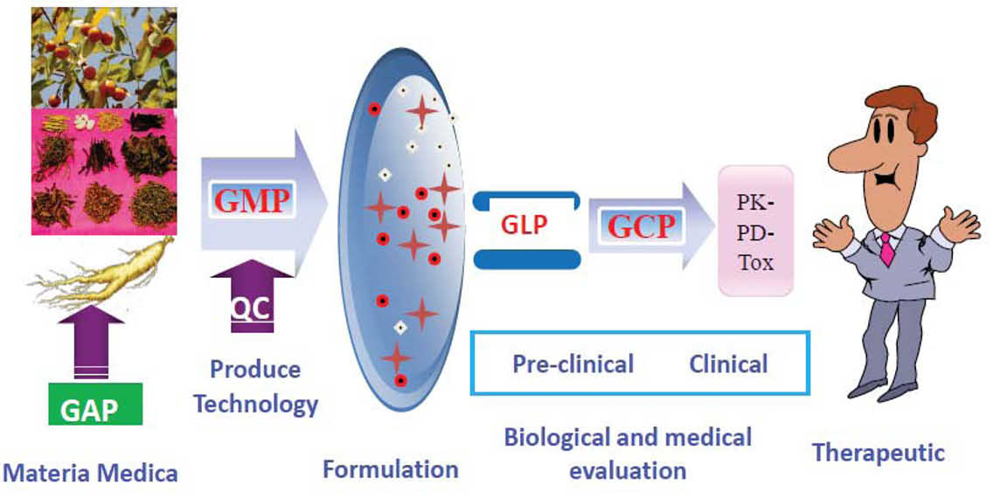
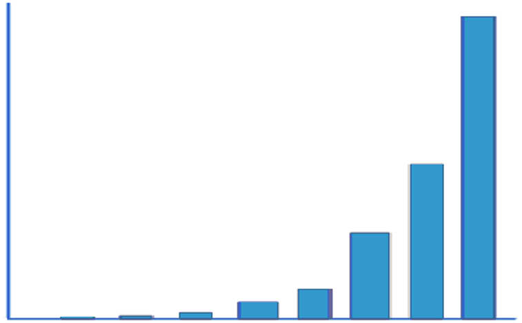
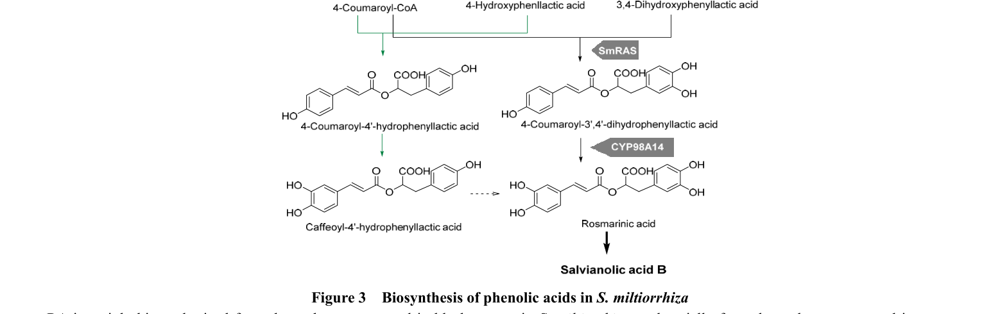
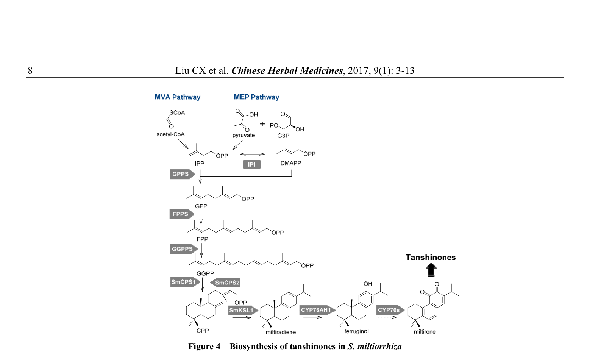
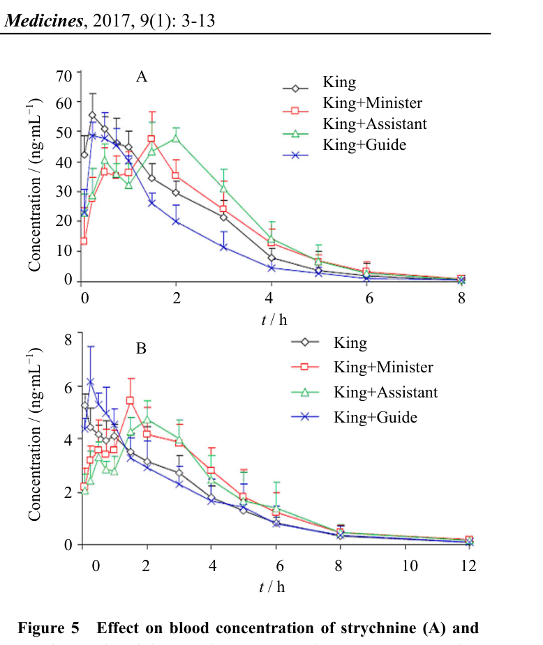
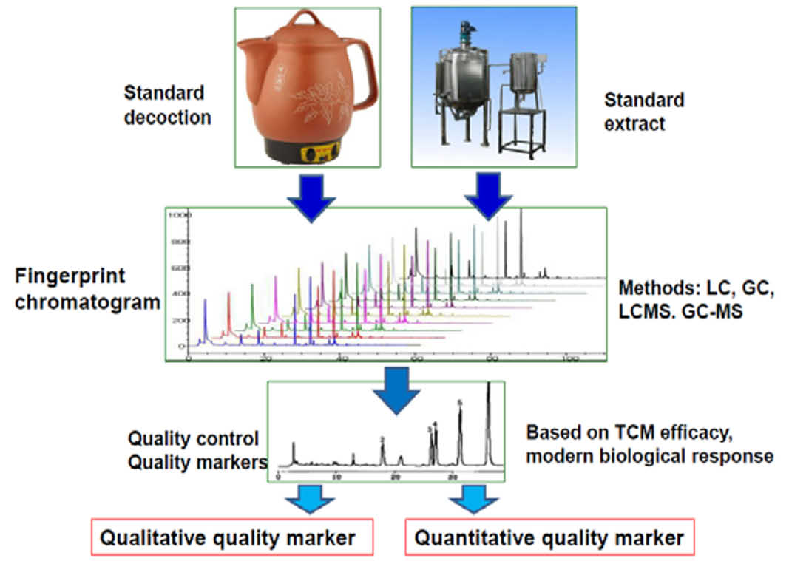
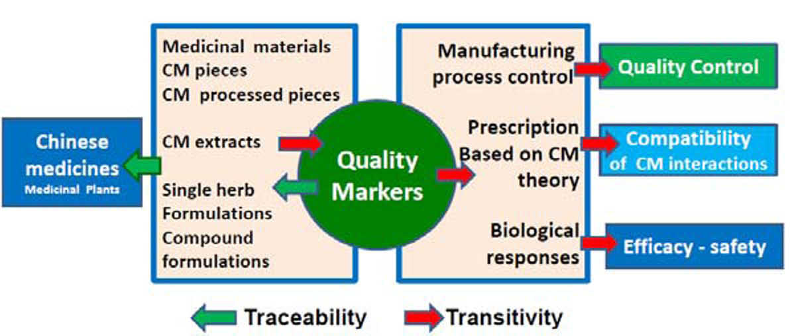

## 書誌情報

- 標題（原題）: A New Concept on Quality Marker for Quality Assessment and Process Control of Chinese Medicines
- 著者: Chang-xiao Liu, Yi-yu Cheng, De-an Guo, Tie-jun Zhang, Ya-zhuo Li, Wen-bin Hou, Lu-qi Huang, Hai-yu Xu
- 所属: 天津薬物研究所（新薬評価研究センター／現代中薬研究センター）、浙江大学、中国科学院上海薬物研究所、中国中医科学院中薬研究所ほか
- 掲載誌: Chinese Herbal Medicines (CHM), 2017, 9(1): 3–13
- DOI: 10.1016/S1674-6384(17)60070-4
- 助成: 国家自然科学基金（No. 81430096）

> 補足: 本稿は「Q-marker（品質マーカー）」という概念を提唱・体系化した原典的な総説である。以後の多数のQ-marker研究（本サイトの他の論文の多く）が、ここで定義された4条件・5原則を出発点にしている。

## 要旨（Abstract）

漢方薬（Chinese medicine; CM）は、あらゆる伝統医学・代替医療のなかでも最も典型的な伝統療法である。CMの活性成分は、植物の代謝酵素・生合成酵素によって生成される一次代謝産物あるいは二次代謝産物であり、環境ストレスから植物を守る役割を持つ。これらの代謝産物の特徴は多様・複雑かつ固有である。本稿では、品質評価の現行アプローチを広く総説したうえで、CMの品質評価のための新概念として品質マーカー（Q-marker）を提唱する。さらに、二次代謝産物の生合成経路と生物活性成分の由来に基づき、Q-markerの定義と関連手法を論じた。

Q-markerの研究設計は、伝達性（transitivity）と追跡性（traceability）を備えた、CM製品の品質評価・製造工程管理のための複雑系である。したがって、品質規制のためには、伝達性・追跡性を特徴とするシステムの確立が期待される。この概念のもとで、品質評価と製造工程管理における伝達性・追跡性を、原料・飲片・炮製・抽出・製造といった全工程にわたって強化できる。伝達性・追跡性は、原料から最終製品に至るCM製造のQ-markerの各段階について、「誰が・何を・どこで・いつ・なぜ（who, what, where, when, why）」の詳細に注意を払うことを必然的に要求する。確立された品質規格は、多様な伝達性・追跡性のソリューションを可能にする手段（enabler）であって、それ自体が解決策なのではない。すなわち、伝達性・追跡性システムは、製品間および国境を越えて品質を結びつけるものである。CM製品の品質評価の思考様式と研究手法に従い、我々は安全性・有効性・品質管理の観点から全工程に着目する。CMまたはCM湯液の標準調製物（standard preparation）は、Q-marker研究の基礎であるだけでなく、CM製品の品質の伝達・追跡の基礎でもある。

**キーワード**: 漢方薬（Chinese medicine）；方剤（formulation）；薬用資源（medicinal resource）；品質管理（quality administration）；品質マーカー（quality marker）；品質規格（quality standard）；定量分析（quantitative analysis）；二次代謝産物（secondary metabolites）

## 1. 序論（Introduction）

漢方薬（CM）は、他のあらゆる伝統・代替医療系と比べても最も典型的な伝統療法である。その由来に応じて、CMは中国における伝統薬・生薬（herbal medicine）・民間薬・植物薬（phytomedicine）を包含する。CMはその薬理作用でよく知られ、数千年にわたり広く用いられてきた。生薬の世界的な受容と利用の広がりは、その安全性と有効性を示唆している。したがってCMは、世界の公衆衛生において重要かつ不可欠な一部となっている。しかし、CMの新薬研究開発（R&D）に関しては、資金・倫理・製品の品質と標準化・研究設計・規制対応といった課題が依然として十分に取り組まれる必要がある。

先進国では、CMの規制の違いにより、医薬品R&Dにおいて製品・中間体・出発物質の適切な規格を確立するため、適正農業規範（GAP）・適正製造規範（GMP）・適正試験所規範（GLP）・適正臨床規範（GCP）の要件に従ってCMが生産・利用されていることはよく知られている。

文献によれば、CMの活性成分は、植物の代謝酵素・生合成酵素によって生成される一次または二次代謝産物であり、多様・複雑かつ固有の特徴を持つ。製薬産業の急速な発展を促し、薬局方規格などの品質規格体系や、中薬材料およびその製剤の製品品質規格を改善するため、品質評価の現行アプローチを分析し、CMおよびその製品の品質マーカー（Q-marker）という新概念が提唱された（Liu et al, 2016; Zhang et al, 2016a; 2016b; Xiong and Peng, 2016; Kang et al, 2014; Chen et al, 2016; Ding et al, 2016; 2017; Zhou et al, 2017）。以下の各節では、CMおよび二次代謝産物の品質に影響する因子、CMのQ-markerを定義するための品質規格と規制対応、ならびに応用評価の観点からの研究手法を論じる。

## 2. 漢方薬は複雑系である

### 2.1. 漢方薬は多成分系である

CM製品は多成分の複雑系であり（図1）、とくにその化学成分は未解明のままであることが多く、物質的基盤と化学的性質からCMの機能を定義することを難しくしている。化学的にみると、CMは多数の構成成分からなり、それらは生物学的変換（biotransformation）や化学的変化を受けうる。加えて、化学物質の含量は一般に複雑で変動し、製品の質的・量的基準の観点でCM開発の難しさを増す。たとえば、産地・栽培条件・収穫・薬用部位・製剤製造・臨床応用などである。CM製品の有効性・安全性を担保するために品質管理と規格を強化することは極めて重要である。伝統中医薬（TCM）の複雑さゆえに、多くの問題、とくに品質と関連規格は未解決のまま残っている（Liu, 2013; 2001; Li et al, 2015）。

### 2.2. CMの品質管理の難しさと課題

CM製品の品質評価の難しさは、次のように列挙できる。(1) 適正農業規範（GAP）・適正採取規範（GACP）・適正供給規範（GSP）に関わること；(2) 植物性原料の特定の生態地理的地域（eco-geographic regions; EGR）が特に重要であること；(3) 植物原料から製造工程までの変動をいかに低減するか；(4) よく知られた作用機序（MOA）とTCM理論に基づき、生物活性応答の効力評価が製造工程管理のうえで柔軟になること。以上を踏まえ、次のように示唆される。(1) CM製品は多数の化学成分（既知・未知の活性成分）と天然変動を伴う複雑系である；(2) 一般にCM製品は、生薬原料に由来する活性医薬成分（API）と非活性成分の混合物である；(3) CM製品は、化学薬品と同一の品質・安全性・有効性の要件を満たすことが非常に難しい；(4) TCM理論に基づく多味処方（multiple-flavor prescription）の原則は、西洋薬の化学組成の考え方とは大きく異なる。

## 3. 一次代謝産物と二次代謝産物

植物は化学構造の観点で多様な化合物を産生する。これらは一次代謝産物または二次代謝産物に分類でき、さまざまな組織・器官に広く分布する。これら天然産物は多様な生物学的変換経路を通じて植物内で合成され、植物の発生プログラム全体の不可欠な一部をなす。一次代謝産物は植物に遍在し必須の代謝的役割を果たす。一方、天然産物（二次代謝産物）は植物界に差次的に分布し、環境的制約に対する防御という適応上の意義において不可欠と考えられる、非常に幅広い生理的役割を担う（Caretto et al, 2015）。

中薬材料（薬用植物）および方剤中の二次代謝産物は、TCM理論の指導のもとでのCM研究とCM製品品質の実質的基盤である。これらの化合物は、CM製品の研究・製品品質管理・品質規格確立の基礎であるだけでなく、新薬発見の鍵となる資源でもある。近年、他の創薬アプローチが主要な治療領域でリード化合物を見いだせなかったことから、天然産物研究への関心が高まっている。

### 3.1. 一次代謝産物

一次代謝産物は、正常な成長・発生・生殖に直接関与する代謝産物であり、一般に生体内で生理機能（内在的機能）を果たす。エタノール・乳酸・一部のアミノ酸など、多くの生物や植物細胞に典型的に存在する。一方、二次代謝産物はこれらの過程に直接関与しないが、通常は重要な関連機能を持つ。二次代謝産物は分類学的に限られた一群の生物・細胞（植物・真菌・細菌）に典型的に存在し、たとえば麦角アルカロイド・ナフタレン類・ヌクレオシド・フェナジン・キノリン・テルペノイド・ペプチド・成長因子などがある。興味深いことに、植物成長調節物質は、植物の成長・発生における役割ゆえに一次・二次代謝産物の両方として認識されうる（Prins et al, 2010; Buchanan et al, 2015; Buchanan, 2012）。一部は一次代謝と二次代謝の中間体である（Seigler, 2012）。

### 3.2. 二次代謝産物

一次代謝産物と異なり、二次代謝産物が欠けても死のような有害な帰結は起こらないことがあるが、生物の生存性・繁殖力・美的形質の長期的な損なわれ、あるいは全く有意な変化がない場合もある。二次代謝産物はしばしば系統群内の狭い種セットに限られ、植食（herbivory）に対する植物の防御機構や種間防御に重要な役割を果たす。医薬・香味料・嗜好品として人間に利用される。

二次代謝産物は、1979年にAhmadによって最初に総説された（Ahmad, 1979）。過去数十年でその研究が進み、本課題を論じた総説論文は1242報が刊行された（図2）。

植物種の二次代謝産物研究の初期には生物学的試験はあまり考慮されなかったが、次第にこれら化合物の生物学的性質に焦点が当てられるようになった。二次代謝産物と生合成遺伝子の体系的な関係は、分子レベルの洞察を与えうる（Zhai et al, 2016）。

関心の対象となる代謝産物の多くは、その生合成経路に基づき二次代謝産物に分類される。現在、テルペン・フェノール・アルカロイド・ステロイド・配糖体などの多くの二次代謝産物が、伝統中薬や医薬品において疾病治療・品質管理・品質規格・創薬のリード化合物として用いられている（表1）。Berenbaumは著書のなかで、植物の二次代謝産物と生態・進化過程の相互作用を分析しており（Berenbaum, 2012）、特定の生態地理的地域（EGR）と植物性原料の品質の関係を調べるうえで有用である。

植物フェノール類は最も広く分布する天然産物である。ヒドロキシケイ皮酸のエステル・アミド・配糖体、フラボノイド、プロアントシアニジンなど、いくつかの種類のフェノール化合物が同定されている。リグニン・スベリン・メラニンなどの高分子フェノールも植物に見いだされている。ポリフェノール化合物は異なる生合成経路で産生される。解糖系とペントースリン酸経路がシキミ酸経路の前駆体を供給する。シキミ酸経路で生じるフェニルアラニンは、多様な特異的フラボノイド経路へ向かうフェニルプロパノイド代謝の前駆体である（Sofia et al, 2015）。

#### 表1. 二次代謝産物の主要な種類

| 化合物の種類 | 二次代謝産物 | 由来（例） |
| :--- | :--- | :--- |
| フラボノイド | rutin, quercetin, ginkwanin, sciadopitysin, gingetin, isogingetin | エンジュ *Sophora japonica* L.、イチョウ *Ginkgo biloba* L. |
| アルカロイド | hyoscyamine, atropine, cocaine, scopolamine, tetrodotoxin, codeine, morphine | *Datura stramonium* L.、ベラドンナ *Atropa belladonna* L.、コカ *Erythroxylon coca* L.、ナス科、フグ、サンショウウオ、ケシ *Papaver somniferum* L. |
| テルペノイド | azadirachtin, artemisinin, tetrahydrocannabinol | ニーム、クソニンジン *Artemisia annua* L.、大麻 |
| サポニン | saponins | オタネニンジン *Panax ginseng* C. A. Mey、三七 *Panax notoginseng* (Burk) F.H.Chen |
| ステロイド | steroids | *Chionographic japonica* (Willd.) Maxim.、*Hibiscus tiliaceus* L. |
| 配糖体 | 修飾された糖分子 | ジャノヒゲ *Ophiopogon japonicus* (Linn. f.) Ker-Gawl.、*Cynanchum atratum* Bunge、*Ginkgo biloba* L. |
| フェノール類 | stevia phenols, allylpyrocatechol, resveratrol | ステビア *Stevia rebaudiana* Bertoni、*Suaeda glauca* Bunge、イタドリ *Polygonum cuspidatum* Sieb. et Zucc |
| ビフェニル類 | ファイトアレキシン | *Polygonum cuspidatum* Sieb. et Zucc、*Vaccinium* spp.、*Reynoutria japonica* Houtt. |

### 3.3. 二次代謝産物の生合成経路

多くの二次代謝産物は植物中で常に低レベルである。異なる酵素系が生合成経路に関与するため、二次代謝産物は異なる経路で産生される。

#### 3.3.1. フラボノイドの生合成経路

フラボノイドは薬用植物に広く存在し、通常は配糖体の形で存在する。脂質代謝の調節・冠動脈拡張・血管脆弱性の低減などの薬理機能を発揮することが示されている。

フラボノイド生合成経路と酵素反応の研究は大きく進展した（Koes et al, 1994; Jung, 2000; Schijlen et al, 2004）。一般にフラボノイド化合物は2-フェニルクロマンと3-フェニルクロマンを含む。2-フェニルクロマン（フラボノイド）にはフラバノン・フラボン・フラボノール・フラバノール・アントシアニジンが、3-フェニルクロマン（イソフラボノイド）にはイソフラボン・イソフラバン・プテロカルパンが含まれる。

構造的に、フラボノイド生合成関連遺伝子は、酵素をコードする構造遺伝子と、調節のための遺伝子に分けられる。複数のフラボノイド代謝生合成経路が、これら化合物の多様性の基盤である。カルコン合成酵素（CHS）が本経路の最初の段階を触媒し、カルコン異性化酵素（CHI）が分子内環化反応を触媒する。イソフラボン合成酵素（IFS）は（2S）-フラバノン（5,7,4′-トリヒドロキシカルコン）または（2S）-5-デオキシフラバノン（7,4′-ヒドロキシカルコン）の合成を触媒し、B環のC-2位からC-3位へ転移する。フラバノン3-β-水酸化酵素（F3H）はCHI触媒による（2S）-フラバノンまたは（2S）-5-デオキシフラバノンのC-3水酸化を促し、フラバノノールを生成する。フラボノール合成酵素（FLS）はC-3水酸化を触媒して各種フラボノールを形成し、ジヒドロフラボノール4-還元酵素（DFR）はアントシアニンとフロバフェンの生合成における鍵酵素である（Schijlen et al, 2004）。

天然資源からの新薬発見は、今日、製薬産業において特に関心を集めている。天然産物は古来より新薬の源であり続けてきた。植物は有益な性質を持つ二次代謝産物の良い供給源である（Favela-Hernández et al, 2010）。丹参 *Salvia miltiorrhiza* Bunge は伝統中薬であり、tanshinone I・tanshinone IIA・cryptotanshinone・dihydrotanshinone I など40種類を超えるタンシノン類が単離されている。丹参は2種類の典型的な二次代謝産物（フェノール酸類とタンシノン類）を持つため、植物二次代謝経路解析のモデルとみなされている（Xu et al, 2016; Liu, 2016）。

#### 3.3.2. アルカロイドの生合成経路

ベルベリンの生合成過程では、植物中に存在するL-チロシンが出発物質となる。ベルベリンは2段階で産生される（Sato et al, 2001）。第1段階は細胞質で起こり、ノルコクラウリン合成酵素の存在下、ドパミンとアセトアルデヒドの縮合により4-ヒドロキシフェニル-ベンジルイソキノリンアルカロイド（ノルコクラウリン）が形成される。これがS-アデノシルメチオニンからメチル基を受け取り、数回のメチル化を経てレチクリンとなる。第2段階では、レチクリンが小胞体小胞へ輸送され、ベルベリンブリッジ酵素の作用で環を形成し、アルカロイド骨格スコウレリンを生成する。スコウレリンはS-アデノシルメチオニンからメチル基を得てテトラヒドロコルンバミンを形成し、カナジン合成酵素により触媒され、メチレンジオキシ環構造を経てカナジンとなる。最終段階はテトラヒドロベルベリンの酵素的酸化を経て、酸化的脱水素の基質として水素化を利用し、最終的にベルベリンが形成される。

*Corydalis yanhusuo*（延胡索）の生合成経路はBeaudoinとFacchiniにより研究された（Beaudoin and Facchini, 2014）。生合成経路の中間体・最終産物は既知だが、延胡索塊茎で同定されたものはわずかである。しかし、既知酵素はすべて延胡索塊茎のトランスクリプトームで同定され、異なる植物種の生合成が、とくに上流経路で大半の共通ステップを共有することを示している。たとえば（S）-レチクリンは、多様なベンジルイソキノリンアルカロイドの生合成における鍵となる分岐点中間体であり、多くの薬用植物にさまざまな存在量で見られる（Farrow et al, 2012）。生合成経路には reticuline 7-O-メチル転移酵素、norreticuline 7-O-メチル転移酵素、berbamunine 合成酵素、corytuberine 合成酵素、salutaridine 合成酵素、columbamine O-メチル転移酵素が含まれる。延胡索は伝統中薬に広く用いられ、これまでに乾燥塊茎から約60種のアルカロイドが同定されている（He et al, 2007; Sun et al, 2014; Zhan, 2014）。活性アルカロイドには tetrahydropalmatine, corydaline, protopine, columbamine, berberine, dehydrocorydaline, tetrahydrocolumbamine, palmatine が含まれる。これらはいずれもチロシンから生合成され、共通の基本ベンジルイソキノリン部分構造を持つ（Hagel and Facchini, 2013; Qing et al, 2015; Ahmad, 1979; Zhai et al, 2016）。

#### 3.3.3. フェノール類の生合成経路

丹参 *S. miltiorrhiza* には20種類以上のフェノール酸が存在する。フェノール酸前駆体の生合成には2つの経路が関与する。(1) フェニルプロパノイド経路と (2) チロシン由来経路である（図3）（Di et al, 2013）。フェニルプロパノイド経路では、フェニルアラニンアンモニアリアーゼ（PAL）、ケイ皮酸4-水酸化酵素（C4H）、4-クマル酸:CoAリガーゼ（4CL）により、フェニルアラニンが4-クマロイル-CoAへ変換される。チロシン由来経路では、チロシンアミノ基転移酵素（TAT）と4-ヒドロキシフェニルピルビン酸還元酵素（HPPR）により、チロシンが4-ヒドロキシフェニル乳酸へ代謝され、最終的に3,4-ジヒドロキシフェニル乳酸（DHPL）を形成する。

タンシノン類は主に丹参の根に蓄積するアビエタン型ノルジテルペノイドキノンである。タンシノン生合成経路は3段階に分けられる。(1) 全テルペノイドの前駆体形成、(2) タンシノン骨格の構築、(3) 骨格の後修飾（酸化・メチル化・脱炭酸・環化）による多様なタンシノンの生成である。この経路は20年以上探索され、タンシノン生合成に関与する遺伝子の多くがクローニングされている（図4）（Dong et al, 2011; Gao et al, 2014; Guo et al, 2013）。

丹参では、タンシノン類は主にMEP経路で合成され、MVA経路は細胞成長への関与として説明されうる。MVA経路では、2分子のアセチル-CoAからIPPが合成される。3-ヒドロキシ-3-メチルグルタリル-CoA還元酵素（HMGR）が、MVA経路の律速段階として3-ヒドロキシ-3-メチルグルタリル-CoA（HMG-CoA）をMVAへ変換する（Dai et al, 2011）。

### 3.4. 二次代謝産物の定量・定性分析

多くの二次代謝産物は、*Moringa oleifera* Lam.（ワサビノキ）などの植物により天然抗酸化物質として産生される。*Ocimum tenuiflorum* L.（カミメボウキ）は食品・製薬産業での幅広い応用で知られる。*M. oleifera* と *O. tenuiflorum* のフェノール・フラボノイド量を比較するため、分光光度法と紙クロマトグラフィーで含量が調べられた。*M. oleifera* の葉と花でより高いフェノール・フラボノイド量が観察された。*O. tenuiflorum* の花は、*M. oleifera* と比べフェノール含量が高くフラボノイドは低かった。ビフラボニル・フラボン・グリコシルフラボン・ケンフェロールなどのフラボノイドがクロマトグラフィーで同定された。フラボノイド・タンニン・サポニン・アルカロイド・還元糖・アントラキノンの植物化学分析は、両種の葉・花で陽性であった。本研究では、高いフェノール・フラボノイド含量が両種の天然抗酸化性を示し、その薬用上の重要性を示唆した（Sankhalkar et al, 2016）。植物化学成分の大群の定量については Thangaraj により記述されている（Thangaraj, 2015）。

## 4. CMの二次代謝産物に由来する品質マーカーの基礎

薬用植物は漢方薬の主要な供給源である。生物的・非生物的因子により形成される植物二次代謝産物は、活性成分と作用機序の実質的基盤であり、とくに創薬の重要な源である。(1) 多くの二次代謝産物は一次代謝産物に由来し、構造は多様である。一般に二次代謝産物にはアルカロイド・フラボノイド・テルペノイド・アントラキノン・クマリン・リグナン類が含まれる。異なる種類の化合物はそれぞれ独自の由来（科・属・種・亜種・変種など）を持ち、生物学的・医学的応用において重要な価値を持つ。(2) 漢方薬の化学成分の生合成経路は、化学的基盤と遺伝学研究の生物学的基盤に基づく。アルカロイド・フラボノイド・テルペノイド・アントラキノン・クマリン・リグナンといった二次代謝産物は化学構造が異なる。多因子（遺伝・成長分化・環境因子）のもとでさまざまな部分構造を持つ化合物が、植物における異なる二次代謝産物の多様性と特異性を形成する。(3) その多様性と特異性に基づいて、漢方薬成分の違いを識別できる。特定の活性化学成分の違いは、CMの品質管理のマーカーとして反映される。

## 5. 品質マーカー（Quality markers）

### 5.1. CMの品質マーカーとは何か

CMの品質マーカー（Q-marker）は化学構成成分であり、次の4つの基本条件に従って定義できる。(1) 品質マーカーは、生薬・飲片・エキス・単味製剤または複方製剤に存在する；(2) 品質マーカーは定性・定量のいずれかのアプローチで分析できる；(3) TCMの多味処方の原則（君・臣・佐・使）およびTCMと現代薬理学研究との適合性に基づき、薬効（有効性・安全性）が同定された品質マーカーと関連することが示されるべきである；(4) 品質マーカーは、生産・製剤の過程で伝達可能（transferable）かつ追跡可能（traceable）な化学物質である。

### 5.2. 延胡索（Corydalis Rhizoma）の品質マーカー決定と品質規格

Q-markerの概念に基づく規格と研究モデルを示すため、ここでは延胡索を例に取る。化学組成の特異的生合成経路解析、ならびに効力・効能・薬力学・薬物動態・ネットワーク薬理解析を通じて、化学成分の生物活性が確認された。延胡索の化学構成成分は、高速液体クロマトグラフィー/エレクトロスプレーイオン化四重極飛行時間型質量分析（HPLC/ESI-Q-TOFMS）で同定された。化学構成成分の由来と特異性は、生合成経路と成分特異性の解析により確認された。延胡索11バッチの試料の定性同定・定量分析、類似度解析、主成分分析（PCA）を通じて、指紋管理法が確立された。最終的に、tetrahydropalmatine, corydaline, coptisine, palmatine, dehydrocorydaline, tetrahydrojatrorrhizine, protopine の7つのアルカロイド化合物がQ-markerとして選定され、同時に多成分定量と指紋の品質管理法が確立された。

### 5.3. 異なる植物由来の生合成に基づく品質マーカーの決定

たとえば、*Coptis chinensis* Franch（黄連）と *Phellodendron amurense* Rupr（黄柏）の品質マーカー解析は、ベンジルイソキノリンアルカロイドが薬用植物の重要な二次代謝産物であることを示唆した。図3に示すように、生合成過程はいくつかの関連アルカロイドを形成した。(1) norcoclaurine は *Aconitum japonicum* Thunb、*Nelumbo nucifera* Gaertn、*Gnetum parvifolium* に存在；(2) reticuline は *Annona reticulata* L.、*Annona squamosa* L.、*Nelumbo nucifera* Gaertn、*Magnolia officinalis* Rehd. et Wils に；(3) scoulerine は *Gueldenstaedtia multiflora* Bunge に；(4) tetrahydrocolumbamine は *Jatrorrhiza palmata* (DC.) Miers と黄連 *C. chinensis* の根に；(5) canadine は *C. chinensis*・*P. amurense*・*Berberis pruinosa* Franch に；(6) berberine と coptisine は *C. chinensis* に；(7) sanguinarine は *Chelidonium majus* L.・*Corydalis mucronifera* Maxim.・*Macleaya cordata*・*Eomecon chionantha* Hance に存在する。*C. chinensis* と *P. amurense* はいずれも berberine・jatrorrhizine・palmatine を含む。coptisine は *C. chinensis* に特有のアルカロイドであり、phellodendrine は *P. amurense* のみに存在する。したがって、これらの違いはアルカロイドの由来から識別できる（表2）。

#### 表2. 異なる薬用植物におけるベンジルイソキノリンアルカロイドの多様性

（記号 + は当該植物にその化合物が存在することを示す。Berb: berberine、Cand: canadine、Copt: coptisine、Jatr: jatrorrhizine、Norc: norcoclaurine、Palm: palmatine、Phel: phellodendrine、Retc: reticuline、Sang: sanguinarine、Scol: scoulerine、Tetc: tetrahydrocolumbamine）

| 植物 | Berb | Cand | Copt | Jatr | Norc | Palm | Phel | Retc | Sang | Scol | Tetc |
| :--- | :-: | :-: | :-: | :-: | :-: | :-: | :-: | :-: | :-: | :-: | :-: |
| *Aconitum japonicum* | | | | | + | | | | | | |
| *Annona reticulata* | | | | | | | | + | | | |
| *Annona squamosa* | | | | | | | | + | | | |
| *Berberis pruinosa* | | + | | | | | | | | | |
| *Chelidonium majus* | | | | | | | | | + | | |
| *Coptis chinensis*（黄連） | + | + | + | + | | + | | | | | + |
| *Corydalis mucronifera* | | | | | | | | | + | | |
| *Eomecon chionantha* | | | | + | | + | | | + | | |
| *Gnetum parvifolium* | | | | | + | | | | | | |
| *Gueldenstaedtia multiflora* | | | | | | | | | | + | |
| *Jatrorrhiza palmata* | | | | | | | | | | | + |
| *Macleaya cordata* | | | | + | | | | | + | | |
| *Magnolia officinalis* | | | | | | | | + | | | |
| *Nelumbo nucifera* | | | | | + | | | + | | | |
| *Phellodendron amurense*（黄柏） | + | + | | | | | + | | | | |

### 5.4. CM複方製剤の品質マーカー

TCMでは、「君・臣・佐・使（king-minister-assistant-guide）」の4要素がCMの個別化治療における基本的な処方原則である。TCM医師は疾病を診断し、生薬同士の相互作用を分析して、生薬を減らしたり加えたりして処方する。CMの複雑な方剤については、化学研究を薬理・毒性研究、および新興の薬物動態研究と組み合わせることが、CMの近代化において鍵となり、複方製剤の科学的基盤を説明しCMの国際的認知を促進する新たなアプローチを提供する。CM複方製剤の薬物動態を研究するため、2008年に薬物動態マーカー（PK-marker）という新概念が提唱された。PK-markerは次のように定義される。(1) PK-markerは効能に関連しなければならない；(2) PK-markerは生体試料に存在し、分析法で測定できる；(3) PK-markerは濃度と時間の関係を反映すべきである（Liu, 2013; Xiao et al, 2008; Lu et al, 2008）。

たとえば「痺気カプセル（Bi-qi capsule）」の薬物動態研究は、成分の配合性理解における薬物動態（PK）の機能を示すために行われた。ラットに、痺気カプセルの君薬であるブルシンとストリキニーネ、および同用量の痺気カプセル全成分を経口投与した後、「君・臣・佐・使」薬の薬物動態パターンを比較し、4種の薬のPK相互作用を検討した。得られたデータは、薬物動態パラメータの観点で、ブルシンとストリキニーネの間には「君薬」としても単一化合物としても有意差がないことを示唆した。しかし、ブルシンとストリキニーネの最高血中濃度到達時間は遅延し、最高濃度も低下した。循環中の有効濃度は著しく延長したが全体の吸収は変わらず、非「君」薬がラットにおけるストリキニーネとブルシンの薬物動態挙動、とくに吸収過程を変化させうることを示唆した（Xu et al, 2009）（図5AおよびB）。

痺気カプセルの薬理・毒性相互作用の研究は、「君」薬中のブルシンとストリキニーネが鍵となる生物活性成分であり、非「君」薬が毒性を低減し効能を高めることを示した。PKおよびPD研究に基づき、品質マーカーの定義と合わせて、ブルシンとストリキニーネは品質指標の同定マーカーとみなされた。本研究の結果は、現在、中国薬局方2015年版に採用されている。

### 5.5. 品質マーカーの決定プロセス

Q-markerを決定する4段階のプロセスと、CMの品質を改善する経路を図6に示す。これは、調製、指紋/規格から湯液エキスの規格確立、定量・定性のための生物学的効果指向の品質マーカーまでを網羅する。

品質マーカーの定義に関しては、次の基本原則を考慮すべきである。(1) CMのQ-markerは、原料・飲片・湯液・エキス・単味製剤または複方製剤に存在する化学物質である；(2) Q-markerは効能および/または特定の生物活性（有効性・安全性）に関連すべきである；(3) Q-markerは、薬用原料・飲片・炮製品・湯液・複方製剤の品質管理のため、定性または定量分析法で測定できるべきである；(4) TCM理論（処方の配合性、たとえば君・臣・佐・使）の指導に基づき、Q-markerは伝統的処方に関連すべきである；(5) Q-markerは「資源→飲片→炮製→エキス」から製品に至る品質管理過程で追跡可能であるべきである。これにより、提唱されたQ-markerを通じて、さらなる研究によってTCMの品質評価システムを改善できる（図7）。

2016年3月4日、中国国務院は製薬産業の健全な発展を促進する法的文書を発し、中国薬局方が国家医薬品規格の中核として機能し、基本的な品質規格を強化すべきことを示した。規格の科学的合理性と運用可能性を改善し、とくに伝統薬・生薬・民間薬とその製品の品質管理規格の仕様について規格の地位を強化するため、品質マーカーという新概念が提唱された。

中国薬局方は医薬品の品質管理における基本的な典籍であるため、製薬産業は薬局方の要件に準拠し、圃場から製造・市場までの製造過程を監視して、国家医薬品の戦略的安全性を確保すべきである。これは、とくにCM製品の持続可能な発展を改善するために不可欠な責務である。

CMのQ-markerという新概念を論じた。CM製造の全工程における品質管理・追跡システムの確立が不可欠となる。Q-markerは伝統中医薬を基盤とする生物の生合成に由来し、炮製・製剤化の過程で生物学的変換と化学変化を受け、最終的に複雑な製剤の形での薬物送達を通じて臨床的機能を発揮する。

## 6. CM製品の品質評価と製造工程管理のための品質マーカー研究の設計と意義

### 6.1. 研究設計

Q-markerの研究設計は複雑系であり、とくに複雑な材料・多技術産業・長いサプライチェーンを市場へつなぐなかで、伝達性・追跡性を備えたCM製品の品質評価・製造工程管理の設計である。

伝達性・追跡性は、原料から最終製品に至るCM製造のQ-markerの各段階について「何を・どこで・いつ・なぜ（4W）」の詳細に注意を払うことを必然的に要求する。確立された品質規格は、多様な伝達性・追跡性ソリューションを可能にする手段であって、それ自体が解決策なのではない。すなわち、伝達性・追跡性システムは、製品間および国境を越えて品質を結びつける。

工程管理の伝達性・追跡性システムを設計するには、第一段階として高次の目標と工程範囲を確立する。範囲は、全マーカー成分の調達から最終製品単位の描写までを含むべきであり、伝達性・追跡性過程の全マーカーを特定する。

第二段階は、伝達・追跡の対象となるCM製品に関連する薬効・安全性その他のリスクを評価することであり、工程管理の相応の位置に品質管理プログラムが既に存在すべきである。これにより、製造ロット・最終製品について取得・保存すべき品質データの水準に関する重要な意思決定がなされる。

第三段階は、伝達性・追跡性の情報を報告することである。情報には、製造連鎖における原料・飲片・炮製品・エキス・中間体・最終製品のQ-markerの同定が含まれ、「何を・どこで・いつ・なぜ」の問いに答える。

### 6.2. 研究の意義

CM製品の品質評価には、原料・飲片・湯液・製剤製品、および品質規格や製造工程の品質管理といった基本的品質要素が含まれる。Q-markerを決定する科学的研究は、CM製品の品質規格と管理において重要な役割を果たす。すなわち、(1) 原料の明確な由来の真正性を評価する；(2) 炮製手順の規格を評価する；(3) 合理的な再現に基づく標準的な製剤工程管理を評価する；(4) 原料から最終製品までの規制を評価する；(5) 同定されたQ-markerがCM製品の安全性・有効性に関連するかを評価する、という役割である。

CM製品の品質評価に関する思考様式と研究手法に従い、我々は安全性・有効性・品質管理の観点から全工程に着目する。CMまたはCM湯液の標準調製物は、Q-marker研究の基礎であるだけでなく、生薬→飲片→炮製→エキス→中間体を網羅するCM製品の品質の伝達・追跡の基礎でもある。伝達・追跡を特徴とする新しいシステムが、CM品質の規制のために確立されることが期待される。

> 補足（訳者・実務的示唆）: 本稿の要点は、①Q-markerを「効能・安全性に関連し（bioactivity相関）、定性・定量でき、君臣佐使など処方理論に整合し、原料から製剤まで伝達・追跡できる」化学成分として4条件で定義したこと、②その科学的根拠を二次代謝産物の生合成経路と由来（どの科・属・種に由来するか）に置いたこと、③延胡索（7アルカロイド）・痺気カプセル（ブルシン/ストリキニーネ→薬局方採用）の実例で示したこと。以後のQ-marker研究（指紋＋ケモメトリクス＋ネットワーク薬理＋体内動態を組み合わせる各論文）は、この定義と5原則を共通の枠組みとしている。

## 利益相反

著者らは利益相反がないことを宣言する。
