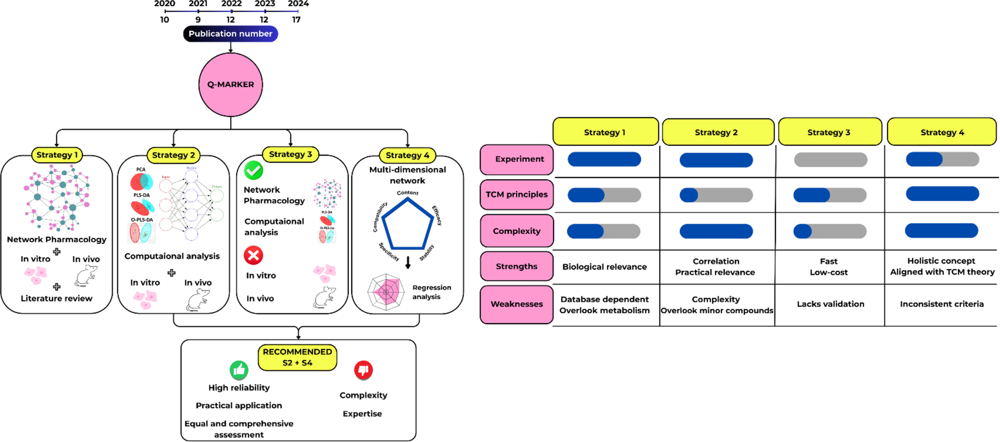
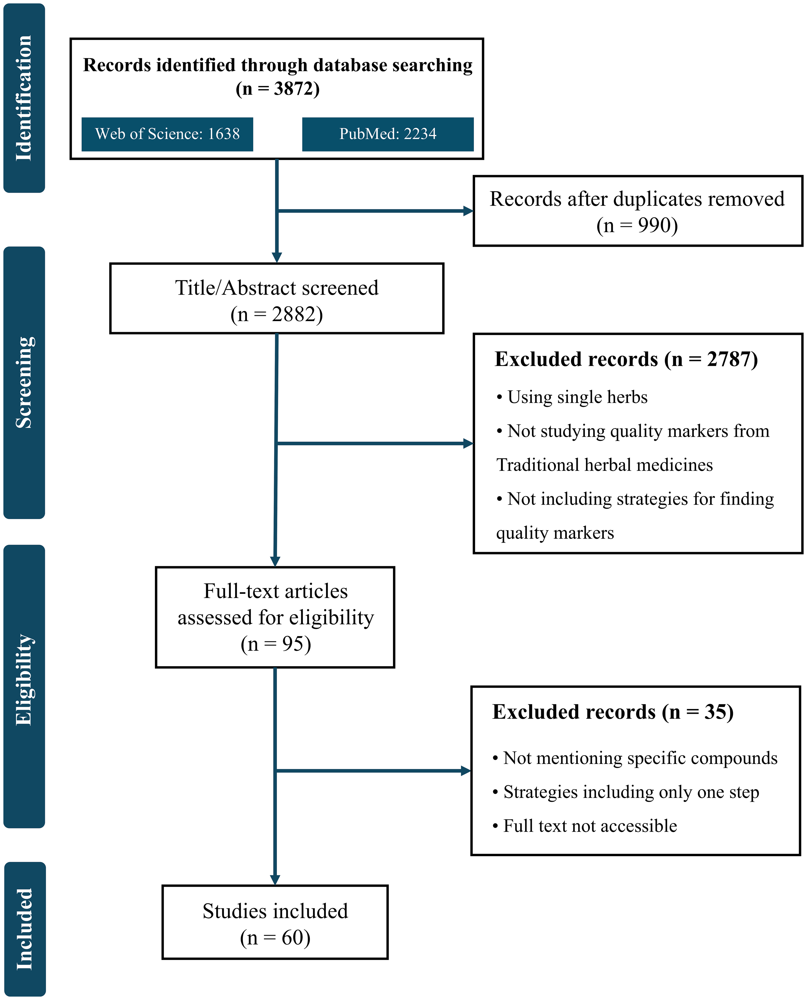
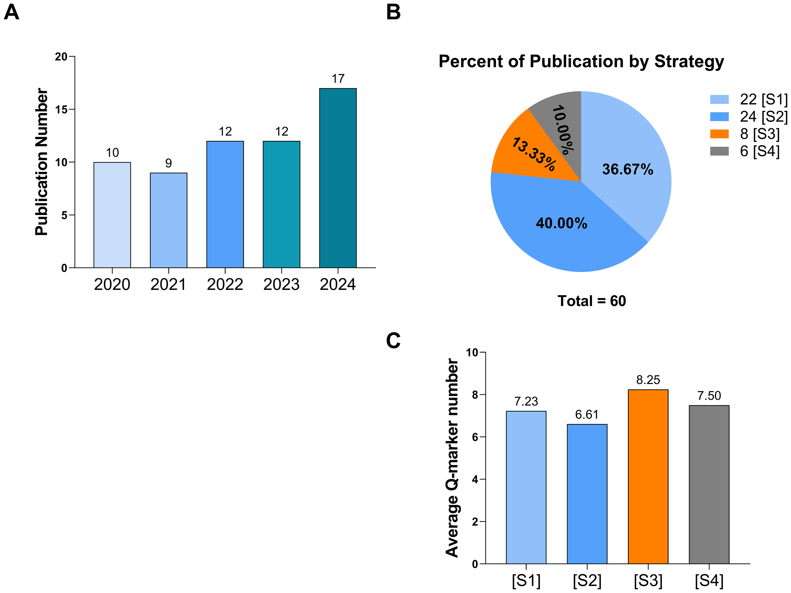
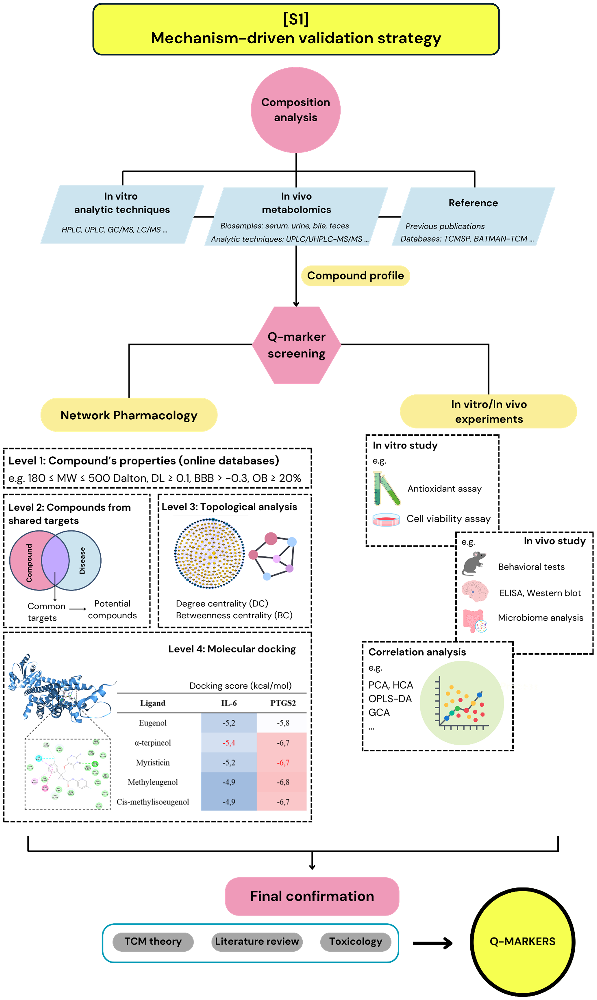
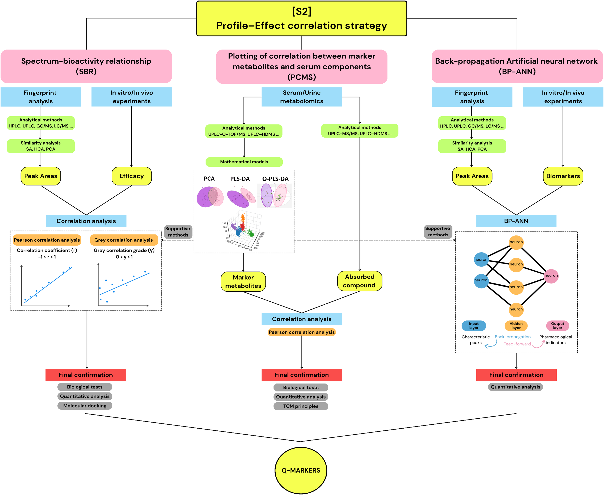
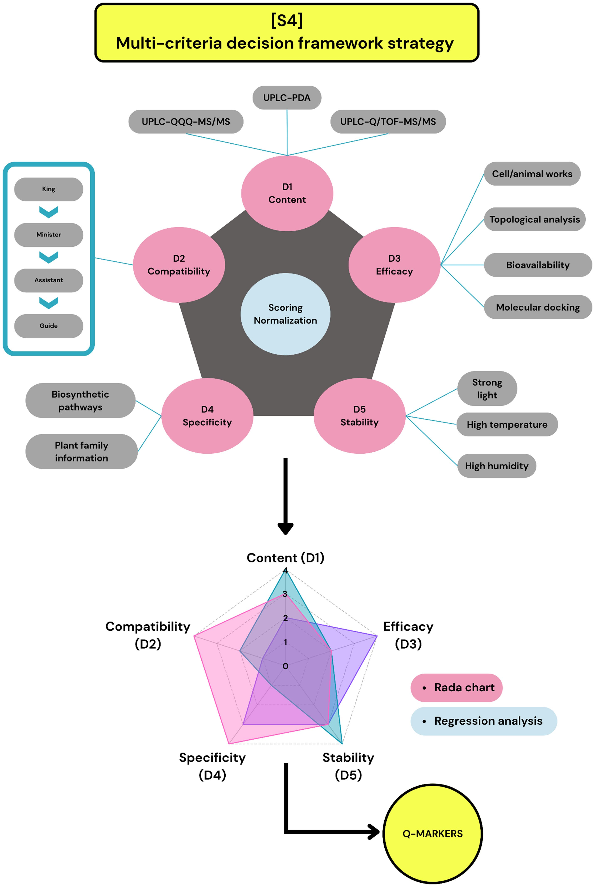
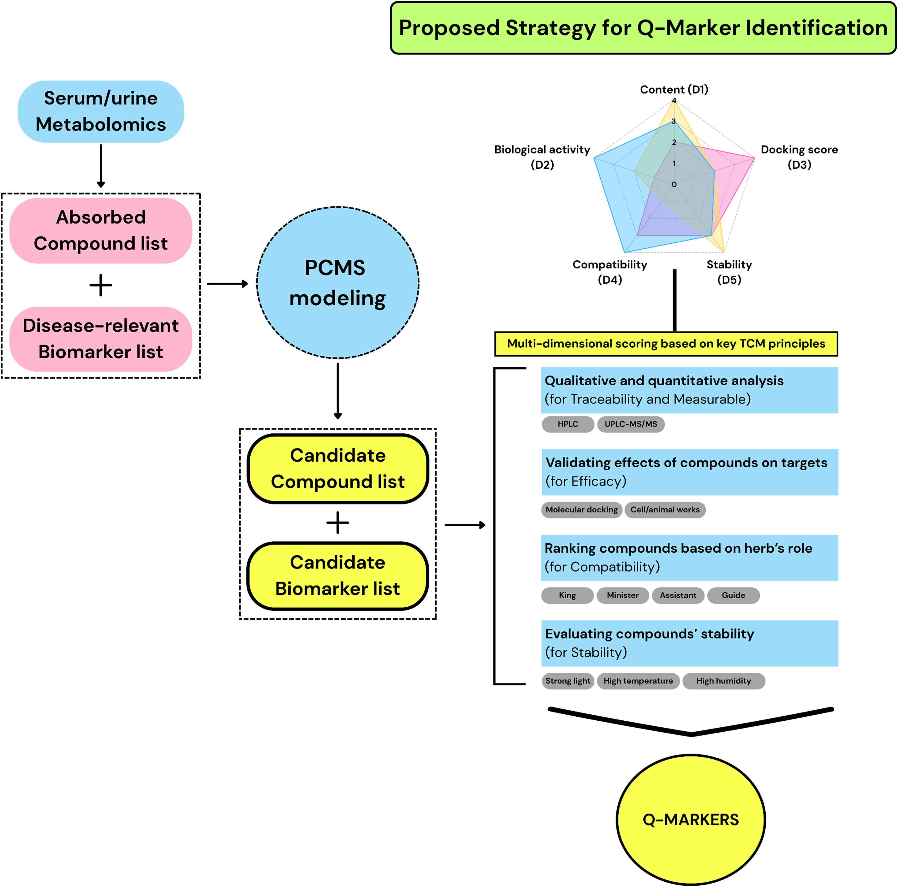

<!-- 方針: 総説につき要点重視の忠実訳。4戦略の枠組み・比較表・長所短所・結論は完全訳。「> 補足:」は訳者注。数式はKaTeXで表示。 -->

## 書誌情報

- 原題: Q-marker identification strategies in traditional Chinese medicines: a systematic review of research from 2020 to 2024
- 著者: Khoa Nguyen Tran, Gia Linh Mac, Yeasmin Akter Munni, In-Jun Yang（責任著者）（東国大学校韓医科大学 生理学教室, 韓国・慶州）
- 掲載: *Frontiers in Medicine* 2025. https://doi.org/10.3389/fmed.2025.1709969
- インパクトファクター: **約3.0**（*Frontiers in Medicine*, JCR系・Q1。集計元により2.96〜3.6の幅）

> 補足: 本稿は個別処方の分析法ではなく、「Q-marker(品質マーカー)をどう選ぶか」という方法論そのものを2020–2024年の60研究から俯瞰した系統的レビュー。当サイトで既に解説している柴芩承気湯(CQCQD)・脈絡疏通丸(MLSTP)・当帰建中湯(DGJZ)なども事例として引用されている。

## 抄録 (Abstract)

* **背景 (Background)**:
  伝統的な生薬製剤の評価と標準化における限界に対処するための重要な解決策として、「品質マーカー（Q-marker）」の概念が登場した。様々なQ-marker同定戦略が導入されているにもかかわらず、方法論的な不一致や標準化の欠如が依然として課題となっている。
* **目的 (Objectives)**:
  本レビューの目的は、過去5年間に発表されたQ-marker選定戦略を系統的に整理・評価し、それらの長所と限界の比較分析に基づいて最適なアプローチを提案することである。
* **方法 (Methods)**:
  Web of ScienceおよびPubMedを対象に、2020年1月から2024年12月までに発表された伝統中薬処方のQ-marker同定に関する文献を、関連するキーワードを用いて網羅的に検索した。重複の排除および関連性のスクリーニング後、適格な研究について系統的レビューを行った。処方名、治療標的、Q-marker選定の方法論的ステップ、および最終的に同定されたQ-markerを含む主要情報を抽出し、要約表に整理した。この分析に基づき、各戦略の長所と限界を評価した。
* **結果 (Results)**:
  適格な研究は、以下の4つの代表的な戦略に分類された。
  * **[S1] 機序駆動型検証（mechanism-driven validation）戦略**: ネットワーク薬理学とバイオアッセイを用いて、化合物と疾患経路を関連付ける（22例、36.67%）。
  * **[S2] プロファイル-効果相関モデリング（profile–effect correlation modeling）戦略**: 統計学および機械学習ツールを用いて、化学組成と薬力学的結果をリンクさせる（24例、40.00%）。
  * **[S3] in silico事前フィルタリング（in silico preliminary filtering）戦略**: 実験的検証を行わずに、計算機予測を用いて候補化合物を迅速にスクリーニングする（8例、13.33%）。
  * **[S4] 多基準意思決定フレームワーク（multi-criteria decision framework）戦略**: 処方の階層構造（君臣佐使）、薬効、および化学的性質を統合的なスコアリングモデルに統合する（6例、10.00%）。
  
  各戦略における同定されたQ-marker of interestの平均数は、それぞれ7.23、6.61、8.25、7.50であった。それぞれの戦略には独自の分析上の強みがあるものの、単独で適用された場合には一貫性や再現性に欠けることが多い。これを克服するため、我々は以下のステップを統合した段階的なアプローチ（統合モデル）を推奨する：(1) 生体利用能（バイオアベイラビリティ）に基づく化合物選定、(2) 疾患関連バイオマーカーの選定、(3) 相関モデリング、(4) 伝統中医学（TCM）の原則に基づく多基準スコアリングフレームワーク。この統合モデルは、化合物のバイオアベイラビリティ、特異性、処方における役割を考慮しており、低含有量成分を含む、機能的に関連のあるQ-markerの同定を可能にする。
* **結論 (Conclusion)**:
  本レビューは、伝統的生薬製剤の今後の研究開発、特に品質管理や革新的創薬の文脈において、貴重な知見を提供するものである。提案されたフレームワークは生物学的関連性と実用的な適用性を向上させ、多成分生薬システムや複雑な薬理学的処方の品質評価のためのスケーラブルなモデルとして機能する可能性がある。

* **キーワード (Keywords)**:
  BP-ANN、メタボロミクス、多次元ネットワーク、ネットワーク薬理学、Q-marker、戦略

---

## 1 イントロダクション (Introduction)

伝統的生薬処方（THP）の価値は、複雑な天然化合物を通じて治療上の利点を提供する能力にある。THPは、複数化合物のブレンドと多標的作用機序という固有の複雑さを有しており、一貫した品質管理と標準化を達成する上で大きな課題となっている。さらに、土壌の質、気候、収穫時期、収穫後の加工技術などの要因により、THPの組成は大きく変動する。

これまでのTHPの開発戦略は、分析の容易さ、規制要件、既知の慣行、経済的要因などから、主に高含有量の活性成分に焦点を当ててきた。しかし、このアプローチは処方内の様々な成分間の複雑な相互作用（処方の全体的な有効性に不可欠なもの）を見落としているため、治療効果と直接相関しないことが多い。

これらの限界に対処するため、劉（Liu）らは2016年に「品質マーカー（Q-marker）」の概念を提案した。主要成分や単なる活性成分のみに焦点を当てていた従来のアプローチとは異なり、Q-markerは伝統医学理論の基本原則に基づき、生物活性、吸収率、安定性、特異性、定量性、および適合性を包括的に考慮する。この革新的な概念は、品質管理、有効性評価、新薬開発において大きな進歩をもたらした。

Q-markerの同定には、計算科学的アプローチ（オンラインデータベース、予測ツール、数学モデル）と、ウェットラボでの実験（吸収、安定性、生物活性の試験）を含む多様な技術が開発されてきた。しかし、この多様性は方法論の曖昧さや評価原則の不一致をもたらしている。現在、特定の研究文脈において最も適切で信頼性の高い戦略を選択するための包括的なガイドラインが不足している。本研究は、過去5年間に発表されたQ-marker同定アプローチを系統的にレビューし、将来の研究に適した戦略を提案することで、THPの品質管理と標準化に貢献する。

---

## 2 材料および方法 (Materials and methods)

> 補足: 文献検索手続きを要約して示します。数値および適格条件は原文通りです。

本系統的レビューは、PRISMA 2020（Preferred Reporting Items for Systematic Review and Meta-Analyses 2020）のガイドラインに従って実施された。Web of ScienceおよびPubMedデータベースを用いて、2020年から2024年まで（2025年1月1日まで）に発表された関連文献を以下の検索式で検索した：
`[(q-marker) OR (quality marker)] AND [(herbal) OR (traditional Chinese medicine) OR (extract) OR (prescription)] NOT (review)`

### 選定・除外基準
* **選定基準**: (1) 伝統的処方（方剤）を使用していること、(2) 伝統的生薬製剤に関連する品質マーカーを研究していること、(3) 品質マーカーを選定するための具体的な「マルチステップ戦略」を提供していること。
* **除外基準**: (1) 具体的な品質マーカーの化合物名が明記されていない研究、(2) 単一ステップのみの戦略（例：HPLC指紋図譜のみ、またはネットワーク薬理学のみ）、(3) フルテキストにアクセスできない研究。
* ネットワーク薬理学と分子ドッキングの組み合わせのみで、実験（バイオアッセイ、血中吸収、クロマトグラフィー検証など）を一切伴わない研究は「単一ステップ（ネットワーク薬理学のみ）」とみなして除外した。含まれるすべての研究は、計算科学的スクリーニングと実験的検証、あるいはクロマトグラフィー分析、統計モデリング、バイオアッセイなど、2つ以上の異なる分析手順を統合したマルチステップ戦略を採用している。

### スクリーニング結果
* Web of Scienceから1,638件、PubMedから2,234件の計3,872件のレコードを収集。
* 重複レコード990件を排除。
* 残る2,882件の抄録をスクリーニングし、適格基準を満たさない2,787件を除外。
* 残る95件のフルテキスト評価において、具体的な化合物名が不明、単一ステップの戦略、フルテキスト入手不可の理由で35件を除外。
* 最終的に60件の研究を本レビューの対象として選定した。

---

## 3 結果 (Results)

選定された60件の研究のうち、2020〜2021年に19件、2022〜2023年に24件、そして2024年に最も多い9件が発表された（図2A）。これらの研究は、その中核となる方法論的特徴に基づいて、以下の4つの戦略に分類された（図2B、表1）：
1. **[S1] 機序駆動型検証戦略 (Mechanism-driven validation strategy)**: 22例（36.67%）
2. **[S2] プロファイル-効果相関戦略 (Profile–Effect correlation strategy)**: 24例（40.00%）
3. **[S3] in silico事前フィルタリング戦略 (In silico preliminary filtering strategy)**: 8例（13.33%）
4. **[S4] 多基準意思決定フレームワーク戦略 (Multi-criteria decision framework strategy)**: 6例（10.00%）

同定されたQ-markerの平均数は、S1で7.23個、S2で6.61個、S3で最も多く8.25個、S4で7.50個であった（図2C）。

### 表1: 4つの研究戦略の分類基準 (Classification criteria for the four research strategies)
| 戦略 | 分類基準 (Classification criteria) |
| :--- | :--- |
| **戦略 1 [S1]** | 疾患-化合物-標的ネットワークの構築と、それらの関係を実験的に検証し、関与する生物学的メカニズムを理解することに依存するアプローチ。 |
| **戦略 2 [S2]** | 素材の組成と効果の関係分析に依存し、主に計算科学的/統計的モデル（例：スペクトル-活性相関（SBR）、マーカー代謝物と血中成分の相関プロッティング（PCMS）、バックプロパゲーション人工ニューラルネットワーク（BP-ANN））とラボ実験を適用するアプローチ。 |
| **戦略 3 [S3]** | 実験的検証を一切行わず、in silico解析（データベースマイニングや分子ドッキングなど）のみに依存するアプローチ。 |
| **戦略 4 [S4]** | 伝統中薬（TCM）の「5つの原則」に基づく多次元評価フレームワークを適用し、回帰面積（RA）や網掛け面積（QMI）などのスコアリングシステムを通じてすべての次元を統合するアプローチ。 |

---

### 3.1 戦略 1: 機序駆動型検証戦略 (Mechanism-driven validation strategy) (22例)

この戦略は、抽出物の組成分析、メタボロミクス、ネットワーク薬理学、分子ドッキング、および細胞または動物ベースの検証実験を含む幅広い方法を統合する。ネットワーク薬理学は22件すべての研究で採用されたが、研究デザインに応じて適用段階や目的は異なる（図3）。

#### 3.1.1 組成分析 (Composition analysis)
生薬抽出物の化合物プロファイルを同定することは、Q-marker決定戦略の最初のステップである。組成分析は主に以下の3つのアプローチで実施された：
1. **直接分析**: HPLC、UPLC、GC-MS、LC-MS等を用いて抽出液を直接分析する。
2. **間接分析**: 投与後の尿、血漿、血清などの生体試料を用いた体内吸収分析（メタボロミクス）。
3. **データベース参照**: オンラインデータベースや既出文献から化合物データを取得する。

クロマトグラフィーや質量分析（HPLC-DAD、UPLC-QToF-MS/MS、UHPLC-Q-Exactive-Orbitrap-MSなど）から得られたフィンガープリントは化学プロファイルとして機能し、定性的および半定量的な組成を反映する。

生体試料中の小分子代謝物をプロファイリングするメタボロミクス分析は、経口投与後に生体に吸収されて全身に曝露される化合物をスクリーニングするための強力なフィルターとして機能する。例えば、研究A17では、固腸止瀉丸（Guchang Zhixie Pills）の初期化学分析で198化合物が検出されたが、メタボロミクスプロファイリングの後、血漿中で検出された十分に吸収されている17化合物のみがさらなる検討のためのQ-marker候補として選択された。

データベースマイニング（TCMSP、TCMID、HIT、BATMAN-TCMなど）は、4つの研究で採用された。例えば、連花清瘟カプセル（Lianhua Qingwen Capsule、研究A06）は13の生薬を含み、データベースから合計538個の化合物が収集された。大承気湯（Da-Cheng-Qi Decoction、研究A02）では、272個の潜在的構成成分がデータベースから同定された。

#### 3.1.2 ネットワーク薬理学 (Network pharmacology)
ネットワーク薬理学は、化合物と生物学的ネットワーク間の相互作用を探索するために広く使用された（表2に示すオンラインデータベースを使用）。分析は以下の4つの階層レベルで適用された。
1. **薬物動態パラメータによるフィルタリング**: 分子量（MW）、薬物らしさ（DL）、血液脳関門（BBB）透過性、および経口バイオアベイラビリティ（OB）に基づいてフィルタリングする（例：TCMSPの標準基準は $180 \le \text{MW} \le 500\text{ Da}$, $\text{DL} \ge 0.1$, $\text{BBB} > -0.3$, $\text{OB} \ge 20\%$）。研究A01（Guan-Xin-Jing Capsule [寛心飲カプセル]）では、検出された148化合物のうち、調整されたスクリーニング基準（OB > 30%, DL > 0.18）を満たす46化合物が保持された。
2. **重複標的の同定**: 生薬化合物と疾患関連遺伝子の共通標的を同定する。研究A07（Xinkeshu Tablets [心可舒片]）では、62化合物が519個の予測標的にリンクされ、疾患標的（275個）との共通標的として62個の重複標的が得られ、44化合物が選択された。
3. **トポロジー分析**: 化合物-標的ネットワークのトポロジー分析（Cytoscapeソフトウェアを使用）を行い、次数中心性（DC）、介在中心性（BC）、近接中心性（CC）などの指標を用いて重要ノード（ハブ化合物）を同定する。閾値の設定には標準化されたものはなく、中央値を超えるもの（研究A02, A03, A12, A15など）や、スコア上位（研究C05は上位6個、C01は上位8個）を優先するなどのバリエーションがあった。
4. **分子ドッキングによる検証**: 化合物とターゲットタンパク質との結合親和性（結合エネルギー）を予測し、予測された化合物-標的相互作用を検証する（S1中6/22件で実施）。例えば、研究A13（Simiao Yong’an Decoction [四妙勇安湯]）では、93化合物が5つの予測ターゲット（IL-17A, C3, C5a, VEGFR2, STAT3）に対してドッキングされ、glycyrrhizic acidがIL-17Aに対して強い結合（-9.2 kcal/mol）を示した。

#### 3.1.3 in vitro/in vivo研究 (In vitro/in vivo studies)
実験的検証は、生体、細胞、組織、または生化学的アッセイにおける化合物の活性に関する直接的な証拠を提供する。
S1では、6/22件が初期段階（バイオアベイラビリティや吸収の確認：Caco-2細胞透過性試験など）で実験を導入し、12/22件が中間段階（予測の確認、作用機序の探索）、7/22件が最終段階（効能や安全性の最終検証）で実験を実施した。
例えば、研究A08（The Shuangshen Pingfei Formula [双参平肺方]）では、9つのQ-marker候補をブレオマイシン誘発マクロファージ（in vitro）でテストし、すべての化合物が炎症性マーカーのCCL2およびCCR2発現を抑制することを確認した。研究A04（Qingzao Jiufei [清燥救肺湯]）では、20個の候補化合物のうち、in vivo薬物動態試験で検出されなかった（生体利用能が極めて低い）2化合物が排除され、18化合物のみが保持された。研究A02では、抽出物中の濃度に基づいて11化合物をブレンドした活性化合物複合体（ACC）を調製し、in vitro（STC-1細胞）およびin vivo（ビンクリスチン誘発性麻痺性イレウスラットモデル）において、ACCが元の抽出物と同等の腸管運動改善および抗炎症効果を示すことを証明し、Q-markerとしての妥当性を実証した。

#### 3.1.4 文献レビュー (Literature review)
S1の6/22件は、伝統医学（TCM）理論、毒性プロファイル、薬物動態特性など、追加の文献ベースの基準をQ-marker選定に統合した。多くの研究がQ-marker決定の「5つの原則」（トレーサビリティ、特異性、有効性、測定可能性、適合性）に言及しているが、適用の程度は異なった。例えば、研究A08、B09、B10、D02では最終選定において「適合性（Jun-Chen-Zuo-Shi：君臣佐使理論）」のみが考慮された。研究A07（Xinkeshu Tablets [心可舒片]）では、分析プロセスを経て9つの候補化合物が残ったが、5つの原則を適用した結果、低濃度で定量不可能な4化合物（salvianolic acid D, ononin, quinic acid, biochanin A）が除外され、君薬由来成分（danshensu, salvianolic acid A, salvianolic acid B）および臣薬由来成分（puerarin, daidzein）の計5化合物が最終的なQ-markerとして選定された。

---

### 表2: 戦略 1 [S1] の代表事例要約 (Summary of Strategy 1 cases)
| コード | 公表年 | 処方名 (英語/日本語) | 対象疾患/標的 | プロセス (Step 1〜5) | 最終同定Q-marker | 文献 |
| :--- | :--- | :--- | :--- | :--- | :--- | :--- |
| **A01** | 2020 | Guan-Xin-Jing Capsule [寛心飲カプセル] | 心血管疾患 (Cardiovascular diseases) | **Step 1:** UHPLC-QTOF-MS/MS **Step 2:** 選定基準: ピーク強度 > 10,000, OB > 30%, DL > 0.18 **Step 3:** 標的予測: SwissTargetPrediction (化合物), OMIM, TTD, GAD, PharmGkb (疾患) **Step 4:** 薬局方定量指標、薬物動態パラメータ、標的類似性に基づく選定 **Step 5:** UHPLC-QTOF-MS/MS + PCA + PLS-DA | 3-n-butylphthalide, salvianolic acid G, ginsenoside Rg1, albiflorin, cryptotanshinone, paeoniflorin, tanshinone IIA, ligustilide, tanshinone IIB, tokinolide B, and salvianolic acid H | (57) |
| **A02** | 2020 | Da-Cheng-Qi Decoction (大承気湯) | 腸閉塞 (Intestinal obstruction) | **Step 1:** ネットワーク薬理学 (化合物/標的: TCMID, TCMSP, HIT; 疾患標的: GAD, DisGeNET, STITCH; 測定可能アッセイ: LC–MS, GC–MS, HPLC-SPD; 重要性アッセイ: C-Tネットワーク中の次数中心性 > 平均値; 有効性アッセイ: 文献レビュー) **Step 2:** 検証アッセイ - in vitro: 腸損傷修復、腸管運動、抗炎症 - in vivo: ビンクリスチン誘発性麻痺性イレウスラットモデル | Emodin, physcion, aloe-emodin, rhein, chrysophanol, gallic acid, magnolol, honokiol, naringenin, tangeretin, and nobiletin | (13) |
| **A03** | 2020 | Wu Ji Bai Feng Pill [烏鶏白鳳丸] | 原発性月経困難症 (Primary dysmenorrhea) | **Step 1:** 双方向輸送研究 + UPLC–MS/MS **Step 2:** ネットワーク薬理学 (化合物標的: TCMSP, SwissTargetPrediction; 疾患標的: TTD, DrugBank, NCBI Gene, DisGeNet, GeneCards) **Step 3:** 分子ドッキング | Formononetin, ferulic acid, isoliquiritigenin, neocryptotanshinone, and senkyunolide A | (15) |
| **A04** | 2020 | Qingzao Jiufei [清燥救肺湯] | 急性肺損傷 (Acute lung injury) | **Step 1:** UHPLC-ESI-Q/TOF-MS **Step 2:** ネットワーク薬理学 (標的: SwissTargetPrediction, SEA, TTD, DrugBank) **Step 3:** 血漿メタボロミクス + PCA **Step 4:** 5つの決定原則 | Chlorogenic acid, methylophiopogonanone A, methylophiopogonanone B, sesamin, ursolic acid, amygdalin, liquiritin apioside, liquiritigenin, and isoliquiritin | (22) |
| **A05** | 2021 | Chaiqin Chengqi Decoction [柴琴承気湯] | 急性膵炎 (Acute pancreatitis) | **Step 1:** UHPLC-Q Orbitrap/MS + 主成分分析 + 階層的クラスター解析 **Step 2:** 血漿メタボロミクス **Step 3:** ネットワーク薬理学 (化合物標的: ETCM, STITCH, Swiss; 疾患標的: NCBI, DisGeNet, HPO, OMIM) **Step 4:** in vitro研究 (膵腺房細胞壊死) + ピアソン相関分析 | Emodin, rhein, aloe emodin, magnolol, hesperidin, synephrine, baicalein, and geniposide | (58) |
| **A06** | 2021 | Lianhua Qingwen Capsule (連花清瘟カプセル) | インフルエンザ (Influenza) | **Step 1:** ネットワーク薬理学 (化合物: TCMSP, TCM Database@Taiwan; 化合物標的: TCMSP, Pharmmapper; 疾患標的: OMIM) **Step 2:** UPLC分析 **Step 3:** 相関分析: スペクトル-効果相関 **Step 4:** 検証: 抗炎症活性試験 | Chlorogenic acid, isochlorogenic acid B, and isochlorogenic acid C | (43) |
| **A07** | 2022 | Xinkeshu Tablets [心可舒片] | 心血管疾患 (Cardiovascular diseases) | **Step 1:** HPLC–MS/MS **Step 2:** in vivo (ゼブラフィッシュモデル) + OSC–PLS **Step 3:** ネットワーク薬理学 (化合物標的: Swiss, PubChem, STITCH; 疾患標的: OMIM, DrugBank, PharmGKB, KEGG) **Step 4:** 血漿メタボロミクス + UHPLC/MS–MS **Step 5:** 5つの決定原則 | Danshensu, salvianolic acid A, salvianolic acid B, daidzein, and puerarin | (12) |
| **A08** | 2022 | The Shuangshen Pingfei Formula [双参平肺方] | 特発性肺線維症 (Idiopathic pulmonary fibrosis) | **Step 1:** UHPLC-ESI-QTOF-MS/MS **Step 2:** ネットワーク薬理学 (化合物標的: DrugBank; 疾患標的: TTDおよび文献) **Step 3:** in vitro: マクロファージ; in vivo: 肺線維症ラットモデル **Step 4:** 血漿メタボロミクス + UPLC-MS/MS **Step 5:** 確認: 「君臣佐使」理論 + 品質移行および追跡可能性 | Mangiferin, salvianolic acid B, tanshinone IIA, naringin, and glycyrrhizic acid | (21) |
| **A09** | 2022 | A Herbal Pair [丹参-川芎薬対] | 心血管疾患 (Cardiovascular disease) | **Step 1:** 化合物情報: TCMSP, TCMID, CAS化学データベース; 化合物標的: TCMSP, PubChem, SEA **Step 2:** 化学クラスター (CC) ネットワーク + 機能モジュール (FM) ネットワーク + BMCTネットワーク **Step 3:** ネットワーク解析: 「2ステップ」アルゴリズム (CC-FMリンケージ) **Step 4:** in vitro: トロンビン阻害活性アッセイ **Step 5:** 含有量検証: HPLC | Tanshinone I, tanshinone IIA, cryptotanshinone, salvianolic acid B, ferulic acid, salvianolic acid A, rosmarinic acid, chlorogenic acid, and coniferyl ferulate | (42) |
| **A10** | 2022 | Tongsaimai Tablet [通塞脈片] | 動脈硬化 (Atherosclerosis) | **Step 1:** 血清メタボロミクス + UPLC-Q-Exactive Orbitrap/MS **Step 2:** ネットワーク薬理学 (化合物標的: ChemSpider, PubChem, SwissTargetPrediction; 疾患標的: GeneCards) **Step 3:** ネットワーク次数中心性、専門知識、文献検証に基づく選定 | Ferulic acid, liquiritin, senkyunolide I, luteolin and glycyrrhizic acid | (59) |
| **A11** | 2022 | Kaihoujian Spray [開喉剣スプレー] | 炎症 (Inflammation) | **Step 1:** HPLC/Q-TOF-MS/MS **Step 2:** in vitro: RAW264.7細胞試験 **Step 3:** 灰色相関分析: HPLC-DAD **Step 4:** ネットワーク薬理学 (化合物標的: SwissTargetPrediction, TCMSP, DrugBank, UniProt; 疾患標的: DigSee) | Bergenin, sophocarpidine, sophocarpine, and trifolirhizin | (60) |
| **A12** | 2023 | Danlou Tablet [丹lou片] | 冠性心疾患 (Coronary heart disease) | **Step 1:** メタボロミクス (生体試料) + UHPLC-Q-TOF/MS, UHPLC-TQ-MS **Step 2:** ネットワーク薬理学 (PKマーカー: NCBI PubChem, SwissTargetPrediction; 疾患標的: DrugBank, OMIM, GeneCards) **Step 3:** in vitro: H9c2心筋細胞試験 | Puerarin, alisol A, daidzein, paeoniflorin, and tanshinone IIA | (9) |
| **A13** | 2023 | Simiao Yong’an Decoction (四妙勇安湯) | 敗血症 (Sepsis) | **Step 1:** 血清メタボロミクス + Linear-Trap-LC/MS^n **Step 2:** ネットワーク薬理学 (化合物標的: TCMSP, SwissTargetPrediction, 文献, 中国薬局方; 疾患標的: GeneCards, OMIM) **Step 3:** 分子ドッキング | Sweroside, chlorogenic acid, angoroside C, harpagide, ferulic acid, and glycyrrhizic acid | (19) |
| **A14** | 2023 | Xiaoer Chaige Tuire Oral Liquid [小児柴葛退熱経口液] | インフルエンザ (Influenza) | **Step 1:** in vitro: 代謝モデル、Caco-2細胞透過性試験 + HPLC-DAD **Step 2:** 血清メタボロミクス + UPLC-QExactive-HF-x-Orbitrap-MS **Step 3:** in vitro: 抗炎症試験 **Step 4:** ネットワーク薬理学 (化合物標的: TCMSP; 疾患標的: GeneCards, OMIM) **Step 5:** 分子ドッキング | Puerarin, daidzein, benzoic acid, baicalin, baicalein, wogonoside, wogonin, oroxylin A, 3′-methoxypuerarin, paeoniflorin, scopoletin, and liquiritigenin | (61) |
| **A15** | 2023 | Dachaihu Decoction (大柴胡湯) | 炎症 (Inflammation) | **Step 1:** HPLC分析 **Step 2:** ネットワーク薬理学 (化合物標的: TCMSP; 疾患標的: GeneCards, CTD, DisGeNET) **Step 3:** 分子ドッキング **Step 4:** 有効性アッセイ: RT-qPCR (炎症遺伝子), in vitro RAW264.7細胞, in vivo 胆嚢炎モデル | Naringin, hesperidin, neohesperidin, baicalin, wogonoside, baicalein, and saikosaponin B2 | (20) |
| **A16** | 2023 | Suanzaoren Decoction (酸棗仁湯) | 慢性拘束ストレス (Chronic restraint stress) | **Step 1:** UHPLC-Q-TOF-MS **Step 2:** 血清メタボロミクス + UHPLC-Q-TOF-MS + PCA + OPLS-DA **Step 3:** ネットワーク薬理学 (化合物標的: TCMIP, TCMSP, SwissTargetPrediction; 疾患標的: TTD, DisGeNET, GeneCards, OMIM) **Step 4:** 分子ドッキング | Coclaurine, magnoflorine, spinosin, JuA, JuB, betulinic acid, timosaponin BIII, Z-ligustilide, liquiritin, glycyrrhizic acid, and liquiritigenin | (62) |
| **A17** | 2024 | Guchang Zhixie Pills [固腸止瀉丸] | 過敏性腸症候群 (Irritable bowel syndrome) | **Step 1:** UHPLC-Q-Exactive-Orbitrap-MS **Step 2:** 血漿メタボロミクス **Step 3:** ネットワーク薬理学 (化合物標的: PubChem, TCMSP, SwissTargetPrediction; 疾患標的: PharmGKB, GeneCards, DisGeNET, TTD) **Step 4:** 指紋図譜分析: HPLC, HCA, PCA, OPLS-DA | 5-HMF, magnoflorine, chlorogenic acid, tetrahydropalmatine, narcotine hydrochloride, corydaline, and berberine hydrochloride | (63) |
| **A18** | 2024 | Qishen Yiqi Dripping pills [芪参益気滴丸] | 心筋虚血 (Myocardial ischemia) | **Step 1:** UHPLC-Q Orbitrap HRMS **Step 2:** 血清メタボロミクス + GC/MS **Step 3:** ネットワーク薬理学 (化合物標的: SwissTargetPrediction, PharmMapper, TCMSP; 疾患標的: DrugBank, OMIM, DisGeNET, GeneCards) **Step 4:** トポロジー分析 | Astragaloside IV, ononin, calycosin, formononetin, rosmarinic acid, cryptotanshinone, salvianolic acid A, tanshinol, ginsenoside Rb1, ginsenoside Rg1, nerolidol, and santalol | (64) |
| **A19** | 2024 | Pitongshu [脾痛舒] | 機能性ディスペプシア (Functional dyspepsia) | **Step 1:** 血清メタボロミクス + LC-QTOF-MS **Step 2:** ネットワーク薬理学 (化合物標的: TCMSP, SwissTargetPrediction; 疾患標的: GeneCards, OMIM) **Step 3:** トポロジー分析 **Step 4:** 分子ドッキング | Hesperidin, neohesperidin, naringin, paeoniflorin, magnolol, and honokiol | (65) |
| **A20** | 2024 | Mailuoshutong Pill [脈絡舒通丸] | 閉塞性血栓血管炎 (Thromboangiitis obliterans) | **Step 1:** 血清メタボロミクス + UHPLC-Q-Orbitrap HRMS **Step 2:** ネットワーク薬理学 (化合物標的: TCMSP, SwissTargetPrediction, PharmMapper; 疾患標的: OMIM, TTD, GeneCards, DisGeNET) **Step 3:** UPLC分析 | Chlorogenic acid, paeoniflorin, liquiritin, calycosin-7-glucoside, berberine, and formononetin | (66) |
| **A21** | 2024 | Zhishi-Xiebai-Guizhi Decoction (枳実薤白桂枝湯) | 冠性心疾患 (Coronary heart disease) | **Step 1:** UHPLC-Q/TOF-MSおよびUHPLC-TQ-MS **Step 2:** メタボロミクス (生体試料) + UHPLC-Q/TOF-MS **Step 3:** ネットワーク薬理学 (化合物標的: SwissTargetPrediction; 疾患標的: DrugBank, GeneCards, OMIM) **Step 4:** トポロジー分析 **Step 5:** in vitro: 心筋保護活性評価 | Honokiol, magnolol, naringenin, magnoflorine, hesperidin, hesperetin, naringin, neohesperidin, and narirutin | (67) |
| **A22** | 2024 | Jiuwei Jiangtang Oral Liquid [九味降糖経口液] | 2型糖尿病 (Type 2 diabetes mellitus) | **Step 1:** ネットワーク薬理学 (生薬成分: TCMSP, ETCM, HERB; 化合物標的: SwissTargetPrediction; 疾患標的: GeneCards) **Step 2:** トポロジー分析 **Step 3:** 指紋図譜分析: HPLC, CA, PCA, PLS-DA **Step 4:** in vitroブドウ糖消費活性およびα-グルコシダーゼ阻害活性 | Puerarin, ellagic acid, and calycosin | (68) |

---

### 3.2 戦略 2: プロファイル-効果相関戦略 (Profile–Effect correlation strategy) (24例)

この戦略では、組成分析と実験は行うものの、ネットワーク薬理学は使用せず、代わりに化学統計学（ケモメトリックス）や数学的モデルを用いてQ-markerを特定する。24件の研究は、以下の4つのサブ戦略に分類される（図4）：
1. **スペクトル-活性相関（SBR）アプローチ**: 8例（33.4%）
   クロマトグラフ指紋図譜のピークをX変数、生物活性の測定値をY変数とし、統計的相関分析を行う。
2. **マーカー代謝物と血中成分の相関（PCMS）モデル**: 11例（45.8%）
   体内に吸収された血清・尿中成分をX変数、疾患バイオマーカーやメタボロミクスの変動をY変数とし、相関係数を算出する。
3. **人工ニューラルネットワーク（ANN）モデル**: 3例（12.5%）
   入力層（化学/クロマトグラフデータ）、中間層（隠れ層）、出力層（生物活性反応）からなるニューラルネットワークを用い、誤差逆伝播（BP）などのアルゴリズムで学習を行う。
4. **その他**: 2例（8.3%）

#### 3.2.1 スペクトル-活性相関（SBR）戦略
クロマトグラフ指紋図譜分析（HPLC、UPLC、2DLC-LTQ-Orbitrap-MSなど）によって得られた化学プロファイル（第1入力データ）と、in vitroまたはin vivoアッセイによる生物活性データ（抗酸化、抗炎症、抗菌活性などの第2入力データ）との間で相関分析を行う。
ピアソン相関分析や灰色相関分析（GCA）を適用し、生物活性と強く相関するピークを同定する。相関係数（r）が高いピークをQ-marker候補とする。また、多変量統計モデルである偏最小二乗（PLS）や部分最小二乗回帰（PLSR）、直交偏最小二乗判別分析（OPLS-DA）が、8例中5例でサポートとして使用された。投影重要度（VIP）スコア > 1かつ有意差（p < 0.05）を示す化合物を重要成分として選択する。
例えば、研究B06では、開心散（Kai-Xin-San）の12バッチのHPLC指紋図譜から25個の共通ピークを得た（X変数）。各バッチのDPPHラジカル消去活性（Y変数）との間でピアソン相関分析を行い、$r > 0.7$ の13ピークを選択した。さらにOPLS-DAにより $\text{VIP} > 1$ の13ピークを検出し、両分析で重複した7ピークを開心散のQ-markerとして同定した。

#### 3.2.2 マーカー代謝物と血中成分の相関（PCMS）モデル
投与後に体内に吸収された成分と、疾患関連バイオマーカーとの相関関係を評価する。
11例の研究はすべて、尿または血清のメタボロミクス分析（PCAやOPLS-DAを利用）から疾患バイオマーカー（Y変数）を収集し、一方で投与後の血中移行成分（X変数）を質量分析により同定した。次に、ピアソン相関分析を用いて血中成分と疾患バイオマーカー間の相関係数（r）を計算し、rの高い化合物をQ-marker候補とする。
検証ステップとして、11例中6例は文献レビューとTCMの原則（特異性、適合性、追跡可能性など）に基づいて最終決定を行い、4例は定量分析、RT-qPCR、ウエスタンブロット、細胞生存率アッセイなどのin vitro検証を行った。
例えば、研究B13（Baoyin Jian [保陰煎]）では、異常子宮出血（AUB）モデルラット尿中メタボロミクスからOPLS-DAで $\text{VIP} > 1, p < 0.05$ の32個のバイオマーカー（第1変数）を同定した。一方で投与ラット血清中から59個の吸収成分（第2変数）を検出し、ピアソン相関分析を行った結果、$r > 0.7$ で少なくとも5つのバイオマーカーと相関した7成分が最終的なQ-markerとして同定された。

#### 3.2.3 バックプロパゲーション人工ニューラルネットワーク（BP-ANN）モデル
脳の神経ネットワークを模した計算モデルを用いて、入力変数（生薬の含有量・ピーク面積など）から出力（生物活性）を予測する。3例すべてでバックプロパゲーション（誤差逆伝播）アルゴリズムが用いられた。
入力層にクロマトグラフピーク面積（独立変数）、出力層に生物活性（従属変数）を置き、モデルを学習させ、各成分の平均影響値（MIV）や影響度（ID）を算出する。
例えば、研究B20（Chuanxiong Rhizoma and Cyperi Rhizoma [川芎-香附子薬対]）では、HPLCで検出された18ピークを入力層（18ニューロン）、中間層（8ニューロン）、出力層に片頭痛モデルラットの6つの薬力学指標（5-HT, CGRP, β-EP, VIP, NOSなど：6ニューロン）を配置したBP-ANNを構築した。感度分析により $\text{ID} > 5\%$ の18成分を候補とし、さらにPLSRモデルとの共通成分である8化合物を最終的なQ-markerとして選定した。

---

### 表3: 戦略 2 [S2] の代表事例要約 (Summary of Strategy 2 cases)
| コード | 公表年 | 処方名 (英語/日本語) | 対象疾患/標的 | プロセス (Step 1〜5) | 最終同定Q-marker | 文献 |
| :--- | :--- | :--- | :--- | :--- | :--- | :--- |
| **SBR** | | | | | | |
| **B01** | 2020 | Suhuang antitussive Capsule [蘇黄止咳カプセル] | 咳異型喘息 (Cough variant asthma) | **Step 1:** 指紋図譜分析: HPLC **Step 2:** 類似性解析: SA + HCA + PCA **Step 3:** 半定量分析: HPLC-PDA **Step 4:** 安定性試験 (温度、湿度) **Step 5:** in vitro RAW264.7細胞による抗炎症活性評価 | Praeruptorin A, schisandrin, arctiin and pseudoephedrine | (69) |
| **B02** | 2020 | Hugan Qingzhi Formula [護肝清脂方] | 非アルコール性脂肪肝 (NAFLD) | **Step 1:** UHPLC-QQQ-MS/MS **Step 2:** in vitro: LO2細胞脂質低下モデル **Step 3:** SBR: ピアソン相関分析 **Step 4:** 検証: 遊離脂肪酸(FFA)誘発LO2細胞試験 | Typhaneoside, isoquercitrin, and alisol B 23-acetate | (70) |
| **B03** | 2021 | Guizhi Fuling Prescription (桂枝茯苓丸) | 子宮内膜症 (Endometriosis) | **Step 1:** UPLC/Q-TOF-MS/MS **Step 2:** in vivo: 子宮内膜症モデルラット試験 **Step 3:** SBR: 灰色相関分析 (GCA) **Step 4:** 分子ドッキング | Amygdalin, paeoniflorin, pentagalloyl glucose, cinnamic acid, and paeonol | (71) |
| **B04** | 2022 | Naoxintong Capsules [脳心通カプセル] | 血栓症 (Thrombosis) | **Step 1:** 指紋図譜分析: UHPLC-PDA **Step 2:** in vitro: トロンビン/FXa阻害アッセイ **Step 3:** SBR: ピアソン相関 + GCA + OPLS-DA **Step 4:** 検証: 凝固阻害および抗凝固活性 **Step 5:** 定量分析: UHPLC–MS/MS (MRMモード) | Paeoniflorin, 3,5-dicaffeoylquinic acid, rosmarinic acid, lithospermic acid, salvianolic acid B, and Z-ligustilide | (72) |
| **B05** | 2022 | Bushen Huoxue Prescription [補腎活血方] | 糖尿病網膜症 (Diabetic retinopathy) | **Step 1:** 指紋図譜分析: HPLC-UV-ELSD **Step 2:** 類似性解析: SA + HCA **Step 3:** 成分分析: UPLC-Q-Exactive Orbitrap-MS **Step 4:** in vivo: 高脂肪食(HFD)ラットモデル試験 **Step 5:** SBR: PLSR + 典型相関分析(CCA) 検証: 網膜Müller初代培養細胞試験 | Puerarin, daidzin, salvianolic acid B and ginsenoside Rb1 | (73) |
| **B06** | 2023 | Kai-Xin-San (開心散) | 健忘症 (Amnesia) | **Step 1:** 指紋図譜分析: HPLC-UV-ELSD **Step 2:** 類似性解析: SA + HCA **Step 3:** 成分分析: UPLC-Q-Exactive Orbitrap-MS **Step 4:** in vitro: ラジカル消去活性評価 **Step 5:** SBR: ピアソン相関 + GCA + OPLS-DA 検証: SH-SY5Y細胞酸化ストレスモデル | Sibiricose A6, ginsenoside Rg1, and other 5 unknown compounds (その他5つの未知化合物) | (27) |
| **B07** | 2023 | Zishen Yutai Pill [滋腎育胎丸] | 切迫流産 (Threatened abortion) | **Step 1:** 品質管理指標の確立 **Step 2:** 成分分析: 2DLC-LTQ-Orbitrap-MS **Step 3:** in vitro (HTR-8/SVneo細胞の酸化損傷・移動モデル) および in vivo (マウス子宮内膜受容能障害モデル、マウス卵巣予備能低下モデル) **Step 4:** SBR: PLS + PCA | 4,5-Dicaffeoylquinic acid, hederagenin, malonyl-ginsenoside Rd., syringaresinol-O-β-D-glucopyranoside, 3-hydroxy-propionic acid tridecyl ester, dipsacus saponin R, 3,5-dicaffeoylquinic acid, foetidissimoside A isomer... | (74) |
| **B08** | 2024 | Nao An Capsules [脳安カプセル] | 脳卒中 (Stroke) | **Step 1:** 指紋図譜分析: ALQFM + HPLC **Step 2:** 類似性解析: HCA **Step 3:** in vitro: 抗酸化活性評価 **Step 4:** SBR: PLS + PCA **Step 5:** 文献レビュー | Chlorogenic acid, hydroxysafflor yellow A, ferulic acid, ginsenoside Rc, ginsenoside Rb2 | (75) |
| **PCMS** | | | | | | |
| **B09** | 2020 | Sijunzi Decoction (四君子湯) | 脾気虚証 (Spleen qi deficiency syndrome) | **Step 1:** バイオマーカー収集: 血清/尿メタボロミクス + UPLC-Q-TOF/MS + PCA + OPLS-DA **Step 2:** 吸収成分の同定: 血清メタボロミクス + UPLC-MS/MS + PCA **Step 3:** PCMS: ピアソン相関分析 **Step 4:** TCM原則（特異性、適合性）の考慮 | Malonyl-ginsenoside Rb2, ginsenoside Ro, dehydrotumulosic acid, dihydroxy lanostene-triene-21-acid, glycyrrhizic acid, isoglabrolide, glycyrrhetinic acid, 2-atractylenolide | (23) |
| **B10** | 2022 | Wenxin Formula [穏心方] | 心筋虚血 (Myocardial ischemia) | **Step 1:** バイオマーカー収集: 血清メタボロミクス + UPLC-HDMS + PCA + OPLS-DA **Step 2:** 吸収成分の同定: UPLC-G2-Si-MS/MS + Progenesis QIによる解析 **Step 3:** PCMS: ピアソン相関分析 **Step 4:** TCM原則（適合性、追跡可能性）の考慮 | Ginsenoside Rb1, cinnamic acid, paeoniflorin, and berberine | (24) |
| **B11** | 2022 | Wutou Decoction (烏頭湯) | 関節リウマチ (Rheumatoid arthritis) | **Step 1:** バイオマーカー収集: 血清/尿メタボロミクス + UPLC-Q/TOF-MS + PCA + OPLS-DA **Step 2:** 吸収成分の同定: 血清メタボロミクス + UPLC-Q/TOF-MS + UNIFI **Step 3:** PCMS: ピアソン相関分析 | Aconitine, L-ephedrine, L-methylephedrine, quercetin, albiflorin, paeoniflorigenone, astragaline A, astragaloside II, glycyrrhetic acid, glycyrrhizic acid, licurazide, and isoliquiritigenin | (52) |
| **B12** | 2022 | Mailuoshutong pill [脈絡舒通丸] | 閉塞性血栓血管炎 (Thromboangiitis obliterans) | **Step 1:** バイオマーカー収集: 血清メタボロミクス + UHPLC-Q-Orbitrap HRMS + PCA + OPLS-DA **Step 2:** 吸収成分の同定: 血清メタボロミクス + UHPLC-Q-Orbitrap HRMS **Step 3:** PCMS: ピアソン相関分析 **Step 4:** 定量分析: UPLC-MS/MS | Sweroside, chlorogenic acid, calycosin-7-glucoside, formononetin, paeoniflorin, liquiritigenin, and 3-butylidenephthalide | (76) |
| **B13** | 2023 | Baoyin Jian [保陰煎] | 異常子宮出血 (Abnormal uterine bleeding) | **Step 1:** バイオマーカー収集: 尿メタボロミクス + PCA + OPLS-DA **Step 2:** 吸収成分の同定: 血清メタボロミクス + 高分解能UPLC-G2-Si/MSE **Step 3:** PCMS: ピアソン相関分析 **Step 4:** TCM原則（追跡可能性）の考慮 | Catalpol, rehmannioside D, phellodendrine, paeoniflorin, liquiritin, baicalin, berberine, asperosaponin VI, and glycyrrhetinic acid | (30) |
| **B14** | 2023 | Bushen Huoxue Prescription [補腎活血方] | 糖尿病網膜症 (Diabetic retinopathy) | **Step 1:** バイオマーカー収集: 尿メタボロミクス + UPLC-Q-Exactive Orbitrap MS + PCA + OPLS-DA **Step 2:** 吸収成分の同定: 血清メタボロミクス + UPLC-Q-Exactive Orbitrap MS **Step 3:** PCMS: ピアソン相関分析 **Step 4:** TCM原則（特異性、追跡可能性）の考慮 | Ajugol, protocatechuic acid, tanshinone IIA, panaxatriol and puerarin | (51) |
| **B15** | 2023 | Danggui Jianzhong Decoction (当帰建中湯) | 原発性月経困難症 (Primary dysmenorrhoea) | **Step 1:** バイオマーカー収集: 血清メタボロミクス + UPLC–HDMS + PCA + OPLS-DA **Step 2:** 吸収成分の同定: 血清メタボロミクス + UPLC–HDMS **Step 3:** PCMS: 相関分析 **Step 4:** TCM原則（特異性）の考慮 | Ferulic acid, zizyphusin, and cinnamic acid | (77) |
| **B16** | 2024 | Danning Tablet [胆寧片] | 胆汁鬱滞 (Cholestasis) | **Step 1:** バイオマーカー収集: 血清/肝臓メタボロミクス + LC/MS + PCA + OPLS-DA **Step 2:** 吸収成分の同定: 血清/肝臓メタボロミクス + LC/MS **Step 3:** PCMS: ピアソン相関分析 **Step 4:** 定量分析: HPLC | Luteolin, kaempferol, apigenin, emodin, luteolin-7-glucoside, and 5,4′-dihydroxy-3,6,7,8,3′-pentamethoxyflavone | (78) |
| **B17** | 2024 | Danggui Buxue Decoction (当帰補血湯) | 血虚証 (Blood deficiency) | **Step 1:** バイオマーカー収集: 血清/尿メタボロミクス + UPLC-Q/TOF-MS + UPLC-MS + PCA + OPLS-DA **Step 2:** 吸収成分の同定: 血清メタボロミクス + UPLC-G2-Si/MSE **Step 3:** PCMS: ピアソン相関分析 **Step 4:** TCM原則（安定性、入手容易性、測定可能性）の考慮 | Calycosin-7-glucoside, ferulic acid, ligustilide, and astragaloside IV | (79) |
| **B18** | 2024 | Zhi-Zi-Hou-Po Decoction (梔子厚朴湯) | 肝腎毒性 (Hepatorenal toxicity) | **Step 1:** バイオマーカー収集: 血漿メタボロミクス + UHPLC-Q-Exactive Orbitrap-MS + PCA + OPLS-DA **Step 2:** 吸収成分の同定: 血清メタボロミクス + UHPLC-Q-Exactive Orbitrap-MS **Step 3:** PCMS: ピアソン相関分析 **Step 4:** ネットワーク薬理学 + 分子ドッキング **Step 5:** 検証: リアルタイムqPCRによる発現変動評価 | Naringin, hesperidin, neohesperidin, geniposide, genipin-1-β-D-gentiobioside, honokiol, magnolol, chlorogenic acid, and crocetin | (80) |
| **B19** | 2024 | Qifu Decoction [参附湯] | 心不全 (Heart failure) | **Step 1:** バイオマーカー収集: 血清、尿、心筋ミトコンドリアのメタボロミクス + UHPLC-Q-TOFMS + PCA + PLS-DA/OPLS-DA **Step 2:** 吸収成分の同定: 血清メタボロミクス + UHPLC-Q-TOFMS + SUSプロット解析 **Step 3:** PCMS: ピアソン相関分析 **Step 4:** 検証: 細胞生存率、ウエスタンブロット | Calycosin, neoline | (81) |
| **BP-ANN** | | | | | | |
| **B20** | 2020 | Chuanxiong Rhizoma and Cyperi Rhizoma [川芎-香附子薬対] | 片頭痛 (Migraine) | **Step 1:** 指紋図譜分析: HPLC-ESI-Q-TOF-MS/MS + SA + HCA + PCA **Step 2:** バイオマーカー選定: in vivo ニトログリセリン誘発片頭痛ラットモデル **Step 3:** BP-ANN + PLSRによる相関モデリング **Step 4:** 定量分析: UPLC-MS/MS | Ferulic acid, senkyunolide A, 3-n-butylphthalide, Z-ligustilide, Z-3-butylidenephthalide, cyperotundone, nookatone, and α-cyperone | (34) |
| **B21** | 2020 | ShengMai Formula (生脈散) | 気陰両虚証 (Qi-Yin deficiency) | **Step 1:** 指紋図譜分析: HPLC + SA + HCA + PCA **Step 2:** バイオマーカー選定: in vitro マクロファージ貪食能アッセイ **Step 3:** BP-ANN + 灰色関連度(GRA) + PLSR **Step 4:** 定量分析: HPLC-UV | Schisandrol A, schisandrol B, methylophiopogonanone A, schisandrin B, ginsenoside Rf, ginsenoside Rb1, ginsenoside Rg2, and ginsenoside Rb2 | (82) |
| **B22** | 2021 | Jinqi Jiangtang [金芪降糖] | 2型糖尿病 (Type 2 diabetes) | **Step 1:** 指紋図譜分析: UPLC-LTQ-Orbitrap + PCA **Step 2:** バイオマーカー選定: in vitro ブドウ糖消費、α-グルコシダーゼ阻害、ブドウ糖取り込みアッセイ **Step 3:** ReliefFによる特徴量ランキング + BP-ANNモデルによるスクリーニング | Berberine, palmatine, columbamine, jatrorrhizine, coptisine, epiberberine, berberubine, ononin, 1-O-caffeoylquinic acid, and demethyleneberberine | (35) |
| **その他** | | | | | | |
| **B23** | 2023 | Yiqi Tongluo Capsule [益気通絡カプセル] | 心筋虚血 (Myocardial ischemia) | **Step 1:** UPLC-QTOF-MS分析 **Step 2:** 血清メタボロミクス + UPLC-QTOF-MS **Step 3:** in vitro: H9c2細胞モデル試験 **Step 4:** 文献レビューに基づく選定 | Paeoniflorin, ferulic acid, calycosin, senkyunolide A, N-butylphthalide, Z-ligustilide, levistilide A, and astragaloside IV | (83) |
| **B24** | 2024 | Shengjiang Xiexin Decoction (生姜瀉心湯) | 下痢 (Diarrhea) | **Step 1:** 血漿メタボロミクス + UHPLC-Q-Orbitrap HRMS **Step 2:** HCA, PCA分析 **Step 3:** 分子ドッキング **Step 4:** in vitro 結合親和性検証試験 | Baicalin, baicalein, wogonoside, wogonin, liquiritigenin, isoliquiritigenin, norwogonin, oroxylin A, dihydrobaicalin, chrysin, glycyrrhizic acid, glycyrrhetinic acid, oroxylin A 7-O-glucuronide, liquiritin, and isoliquiritin | (84) |

---

### 3.3 戦略 3: in silico事前フィルタリング戦略 (In silico preliminary filtering strategy) (8例)

この戦略に分類された研究は、2〜3ステップの非常にシンプルな方法論を採用している。オンラインデータベース、in vitroでの化合物同定、および計算機ツールのみに依存してQ-markerを特定し、細胞や動物を用いたウェットラボでの検証実験は行わない。
8件すべての研究でHPLC-MSやUPLC-MSなどの直接的な分析技術により化学成分を特定した。その後、ネットワーク薬理学（7/8件）、分子ドッキング（2/8件）、または主成分分析（PCA）・直交偏最小二乗判別分析（OPLS-DA）（3/8件）を用いて候補成分を抽出している。

---

### 表4: 戦略 3 [S3] の代表事例要約 (Summary of Strategy 3 cases)
| コード | 公表年 | 処方名 (英語/日本語) | 対象疾患/標的 | プロセス (Step 1〜3) | 最終同定Q-marker | 文献 |
| :--- | :--- | :--- | :--- | :--- | :--- | :--- |
| **C01** | 2021 | Jie-Geng decoction (桔梗湯) | 気道炎症と咳嗽 (Airway inflammation and cough) | **Step 1:** ネットワーク薬理学 (化合物: TCMSP, BATMAN-TCM; 化合物標的: TCMSP, BATMAN-TCM, DrugBank, TTD, CTD; 疾患標的: GeneCards, HPO, CTD) **Step 2:** HPLC-ELSD指紋図譜分析 **Step 3:** HCAおよびOPLS-DA分析 | Glycyrrhizic acid, liquiritin, and platycodin D | (85) |
| **C02** | 2021 | Huo-Xue-Jiang-Tang Yin [活血降糖飲] | 2型糖尿病 (Type 2 diabetes mellitus) | **Step 1:** HPLC-MS分析 **Step 2:** ネットワーク薬理学 (化合物標的: TCMIP, SwissTargetPrediction; 疾患標的: OMIM, GeneCards) | Gallic acid, rhmannioside D, hydroxysafflor yellow A, calycosin-7-O-β-D-glucoside, calycosin, astragaloside IV, astragaloside III, ophiopojaponin C, astragaloside II, isoastragaloside II, astragaloside I, and isoastragaloside I | (16) |
| **C03** | 2021 | Tangshen Formula [糖腎方] | 糖尿病腎症 (Diabetic nephropathy) | **Step 1:** UHPLC-Q-Orbitrap HRMSによる成分同定 **Step 2:** ネットワーク薬理学 (化合物標的: TCMSP, symmap, PubMed, 文献; 疾患標的: DisGeNet, GeneCards) | Naringin, daidzein, genistein, formononetin, chlorogenic acid, aloe-emodin, nobiletin, tangeritin, ginsenoside Rg1, hesperetin, hesperidin, rhein, and limonin | (17) |
| **C04** | 2022 | San-Jiu-Wei-Tai Granules [三九胃泰顆粒] | 慢性胃炎 (Chronic gastritis) | **Step 1:** UPLC-QE-Orbitrap-MS分析 **Step 2:** ネットワーク薬理学 (化合物標的: SwissTargetPrediction; 疾患標的: OMIM, GeneCards) **Step 3:** 分子ドッキングによる結合評価 | 2,6-Bis(4-ethylphenyl) perhydro-1,3,5,7-tetraoxanaphth-4-ylethane-1,2-diol, murrangatin, Meranzin hydrate, paeoniflorin, and albiflorin | (86) |
| **C05** | 2023 | Danggui Shaoyao San (当帰芍薬散) | 原発性月経困難症 (Primary dysmenorrhea) | **Step 1:** UPLC–Q-TOF–MSによる成分同定 **Step 2:** ネットワーク薬理学 (化合物標的: TCMSP, SwissTargetPrediction; 疾患標的: OMIM, GeneCards, TTD) **Step 3:** 分子ドッキング | Polyporenic acid C, senkyunolide P, alisol B 23-acetate, naringenin, gallic acid, ferulic acid, and albiflorin | (18) |
| **C06** | 2024 | Dajianzhong Decoction (大建中湯) | 術後イレウス (Postoperative ileus) | **Step 1:** UPLC-QExactive-Orbitrap-MSによる成分同定 **Step 2:** 指紋図譜分析: HPLC-TSQ-MS, HCA, PCA, OPLS-DA **Step 3:** ネットワーク薬理学 (化合物標的: PubChem, TCMSP, SwissTargetPrediction; 疾患標的: OMIM, GeneCards, DisGeNET, GenCLiP3, TTD) | 6-Gingerol, hydroxy-α-sanshool, hydroxy-β-sanshool, gingerenone A, ginsenoside Rb1, ginsenoside Rb2, ginsenoside Rb3, ginsenoside Rc, ginsenoside Rd., ginsenoside Re, ginsenoside Rf, and ginsenoside Rg1 | (87) |
| **C07** | 2024 | Banxia-Houpo Decoction (半夏厚朴湯) | 梅核気 (Globus hystericus) | **Step 1:** UHPLC-QTOF-MSによる成分同定 **Step 2:** ネットワーク薬理学 (化合物標的: SwissTargetPrediction, TCMSP; 疾患標的: GeneCards) **Step 3:** トポロジー分析 | Honokiol, magnolol, magnoflorine, 6-gingerol, rosmarinic acid, and adenosine | (88) |
| **C08** | 2024 | Qianggan Capsule [強肝カプセル] | 品質管理 (Quality control) | **Step 1:** UHPLC-Q-TOF-MS/MSによる分析 **Step 2:** LC-sMRM + PCA + OPLS-DAによる多変量統計解析 | Stachyose, paeoniflorin, gallic acid, lithospermic acid B, salvianolic acid, chlorogenic acid, danshensu, and albiflorin | (89) |

---

## 3.4 戦略 4: 多基準意思決定フレームワーク戦略 (Multi-criteria decision framework strategy) (6例)

伝統中薬（TCM）品質マーカーの「5つの原則」（トレーサビリティ、適合性、有効性、特異性、測定可能性）に基づき、Q-markerを決定する。
この戦略では、Q-markerに必要な主要特性データを集めて各次元の「変数」とし、分析誤差を避けるために「0〜1スケール」または「1〜4スケール」に標準化して「多次元ネットワーク」を構築する。その後、回帰分析を行ってネットワークの特徴的な指標（回帰面積 [RA: Regression Area] または網掛け面積 [QMI: Quality Marker Index]）を計算する。このスコアが高い化合物を最終的なQ-markerとして選定する（図5）。

* **含有量（測定可能性・追跡可能性）次元**:
  定量分析（UPLC-PDAやUPLC-MS/MSなど）に基づき、生薬中の含有量を正規化する。研究D03では、経口投与後に血中へ移行する19化合物の含有量を測定し、最高含有量のsinapine thiocyanate（2,363.13 μg/g）のスコアを4.0とし、最低レベルの化合物を1.0へとスケーリングした。
* **安定性次元**:
  公式の5原則ではないが、6例中4例で採用された。強光、高温、高湿度などのストレス条件下で化合物の相対含有量の変動を測定する。ただし解釈に不一致が見られ、D01およびD04では高安定性の化合物を優先し、D02では「不安定な化合物ほど製剤の品質変化を鋭敏に反映する」として、変動が大きい化合物を優先した。
* **適合性次元**:
  生薬処方の階層（君・臣・佐・使）における役割に基づいてスコアを付与する。通常、君薬由来の成分は4点、臣薬は3点、佐薬は2点、使薬は1点のように割り当てる。
* **薬効次元**:
  in vitroやin vivoでの活性評価（例えば酵素阻害率、細胞保護活性、あるいはD05で行われたマウスin vivo鎮痛効果試験）に加え、ネットワーク次数中心性や分子ドッキングの結合エネルギーを統合して評価する。
* **特異性次元**:
  研究D05のみで適用された。生合成経路を考慮し、存在する植物科の数が少ない希少な化合物ほど、生薬の真偽鑑別の観点から高得点（高特異性）を付与する。

例えば、研究D03（Qiliqiangxin Capsule [芪藶強心カプセル]）では、血中に移行する19化合物について、含有量、適合性（君臣佐使の役割：君薬由来は4、佐薬由来は2など）、薬効（H9c2心筋細胞における抗心不全活性、次数中心性、TCMSP予測バイオアベイラビリティ）をすべて1〜4のスケールに標準化し、各成分の回帰面積（RA）と変動係数（CV）を計算した。その結果、基準（$\text{RA} \ge 0.8 \times \text{RA}_{\text{max}}$ かつ $\text{CV} \le 1.2 \times \text{CV}_{\text{avg}}$）を満たす7化合物がQ-markerとして選定された。

---

### 表5: 戦略 4 [S4] の代表事例要約 (Summary of Strategy 4 cases)
| コード | 公表年 | 処方名 (英語/日本語) | 対象疾患/標的 | 評価次元 (Content / Compatibility / Efficacy / Specificity / Stability) | 回帰・面積解析 | 最終同定Q-marker | 文献 |
| :--- | :--- | :--- | :--- | :--- | :--- | :--- | :--- |
| **D01** | 2020 | Xuefu Zhuyu Capsule (血府逐瘀カプセル) | 品質管理 (Quality control) | **Content:** UPLC-PDA **Compatibility:** N/A **Efficacy:** in vitro 抗酸化および抗炎症活性 **Specificity:** N/A **Stability:** 強光、高温、高湿度における含有量変化 | QMI（網掛け面積スコア） | Naringin, isoliquiritin, paeoniflorin, protocatechuic acid, neohesperidin, and ferulic acid | (36) |
| **D02** | 2021 | Shenqi Jiangtang Granule (参芪降糖顆粒) | 2型糖尿病 (Type 2 diabetes) | **Content:** UPLC-QQQ-MS/MS **Compatibility:** 君・臣・佐・使の役割 **Efficacy:** in vitro 阻害率、特異的結合係数 **Specificity:** トポロジー次数中心性、分子ドッキングスコア **Stability:** 高温、高湿度における含有量変化 | RA（回帰面積） | Ginsenoside Re, ginsenoside Rd., ginsenoside Rg1, calycosin, ginsenoside Rb1, formononetin, astragaloside IV, ginsenoside Rf, ginsenoside Rc, notoginsenoside Fe, schisandrol A, and gomisin D | (25) |
| **D03** | 2021 | Qiliqiangxin Capsule (芪藶強心カプセル) | 慢性心不全 (Chronic heart failure) | **Content:** UHPLC-Q/TOF-MS/MS **Compatibility:** 君・臣・佐・使の役割 **Efficacy:** in vitro 抗心不全活性評価 **Specificity:** トポロジー次数中心性、予測体内バイオアベイラビリティ **Stability:** N/A | RA（回帰面積）およびCV（変動係数） | Songorin, calycosin-7-O-β-D-glucopyranoside, astragaloside, tanshinone IIA, ginsenoside Re, hesperidin, and alisol A | (37) |
| **D04** | 2022 | Hedan Tablet [荷丹片] | 肝毒性評価 (Hepatotoxicity) | **Content:** UPLC-PDA **Compatibility:** N/A **Efficacy:** in vitro 抗酸化活性 **Specificity:** N/A **Stability:** 強光、高温、高湿度における含有量変化 | QMI（網掛け面積スコア） | Salvianolic acid B, quercetin-3-O-glucuronide, isoquercitrin, hyperoside, psoralen, isopsoralen, psoralenoside, and isopsoralenoside | (38) |
| **D05** | 2024 | Tianshu Capsule [天舒カプセル] | 片頭痛 (Migraine) | **Content:** HPLC-Q-TOF/MS **Compatibility:** 君・臣・佐・使の役割 **Efficacy:** in vivo マウス鎮痛効果、次数中心性、分子ドッキング **Specificity:** 生合成経路に基づく植物科内の特異性評価 **Stability:** 高温、高湿度、および調製液中での含有量変化 | RA（回帰面積）およびCV（変動係数） | Gastrodin, senkyunolide I, senkyunolide A | (40) |
| **D06** | 2024 | Bu-Zhong-Yi-Qi-Tang (補中益気湯) | 品質管理 (Quality control) | **Content:** UPLC-QqQ-MS/MS **Compatibility:** N/A **Efficacy:** in vitro 免疫調節効果 **Specificity:** 血漿および腸管内容物(SIC)中のin vivo曝露量 ($AUC_{0-t}/\text{dose}$) **Stability:** N/A | RA（回帰面積） | Hesperidin, astragaloside IV, ononin, 18β-glycyrrhizic acid, narirutin, calycosin, cimigenoside, astragaloside II, and liquiritin | (90) |

---

## 4 考察 (Discussion)

過去5年間で、伝統中薬製剤におけるQ-markerの研究は急速に増加しているが、依然として学術分野全体の方法論的な一貫性は著しく欠如しており、断片化された状態にある。これまでに発表された多くの総説がナラティブ（記述的）な形式にとどまっていたのに対し、本研究はPRISMA 2020ガイドラインに準拠した初めての系統的レビューであり、2020年1月から2024年12月までに発表された60報の原著論文から、方法論的な詳細を構造的に抽出し、比較評価した点に大きな進歩がある。また、メタボロミクス（SA, HCA, PCA）、相関分析（GCA, CCA, ピアソン相関）、さらには多変量統計や機械学習（PLSR, OPLS-DA, BP-ANN）といった最新のモデルを網羅している。

### 各戦略の方法論的課題と評価
* **機序駆動型検証戦略 [S1] の限界**:
  ネットワーク薬理学を主軸とするが、使用される閾値（OB、DL、中心性スコアなど）の設定は恣意的であり、経験的あるいは統計的に定義された標準がない。また、公開データベースの多くは静的なネットワークを反映しており、時間依存的な遺伝子発現や疾患進行に伴う動的な変化を捉えられない。データベースの更新が遅れていることや、誤情報（偽陽性・偽陰性）がそのまま引き継がれる問題もある。分子ドッキングにおいては、「強い結合」を定義するための普遍的なドッキングスコアの閾値（カットオフ値）が存在せず、研究ごとに基準値が異なる。実験的検証の配置（事前スクリーニングに使うか、最終確認に使うか）も不一致であり、再現性を損なう要因となっている。
* **プロファイル-効果相関モデリング戦略 [S2] の限界**:
  データ駆動型の推論に重点を置くが、SBRのようなクロマトグラフピーク面積の統計処理は高含有量成分に偏る傾向があり、低含有量であるものの高活性な成分を見落とすリスクが高い。BP-ANNのような機械学習は非線形パターンのモデリングに適しているが、過学習（オーバーフィッティング）のリスクがあり、ブラックボックスであるため解釈可能性（説明性）に制限がある。また、何をもって「高い相関」とするかの基準値（例：ある研究では $|r| \ge 0.6$ または $\ge 0.7$、別の研究では $|r| \ge 0.8$）が不統一であることも課題である。PCMSは体内に吸収される血中移行成分を追跡する点で優れるが、検出限界を下回る極微量の有効成分や、選択した特定の疾患バイオマーカーとは相関しない他の治療効果成分を切り捨てる可能性がある。
* **in silico事前フィルタリング戦略 [S3] の限界**:
  実験検証を伴わず、計算科学的予測のみで完結するため、最も簡便で迅速である反面、予測された結果の信頼性は極めて低い。体内での生体利用能、代謝変換、複数化合物の相互作用といった創薬・生薬薬理学に不可欠な次元を十分に考慮できないため、独立したQCモデルとしての採用は困難であり、パイプライン初期の事前フィルタリングの用途に限定すべきである。
* **多基準意思決定フレームワーク戦略 [S4] の限界**:
  5原則（測定可能性、適合性、有効性、特異性、安定性）を点数化して統合するスコアリングモデルは、低含有量・高活性の成分も救い出すことができ、配合シナジーも反映できるため非常に強力である。しかし、各次元のスコアリング基準や重み付けは標準化されておらず、主観的に定義されることが多い。特に「安定性」の解釈が研究間で矛盾しており、製剤中の化学的安定性を重視して安定性の高いものをQ-markerに選ぶ研究と、品質変化を敏感に示す指標としてあえて不安定なものを選ぶ研究がある。しかし、WHO標準や医薬品QC of interestの観点からは、Q-markerは一定の保存条件下で化学的に安定でなければならず、不安定な成分を指標とするとバッチ間の一貫性の担保や毒性分解物の発生監視といった実務上の品質管理に支障をきたす。

### Q-marker同定数の比較
各戦略により特定されたQ-marker数の平均値を見ると、in silico事前フィルタリング（S3）が最も高い平均数（8.25個）を示した。これは、実験的検証を伴わない大規模な計算科学的スクリーニングに依存しているため、広範な仮説生成にとどまっていることを示唆している。一方、プロファイル-効果相関戦略（S2）は最も少ない平均数（6.61個）であり、これは厳格な統計的相関のフィルタリングが効いていることを反映している。機序駆動型検証（S1, 平均7.23個）および多基準意思決定（S4, 平均7.50個）は、生物学的解釈と実験的確認のバランスをとっているため、中程度の数に収束している。

### レビューが提案する最適アプローチ（推奨する統合戦略）
これらの長所と限界を統合し、我々は以下の4つのステップからなる段階的な統合戦略（Figure 6参照）を提案する：
1. **バイオアベイラビリティに基づく候補化合物の選定**:
   生体（in vivo）に投与された後の血清または尿中に実際に検出される（血中移行が確認される）生体利用可能な成分のみを、第1段階の候補として絞り込む。
2. **疾患関連バイオマーカーの特定**:
   疾患に関わる臨床マーカーまたはメタボロミクスによって有意に変調するバイオマーカーを定義する。
3. **PCMS（相関モデリング）によるスクリーニング**:
   上記で同定された血中移行成分と疾患バイオマーカー間の相関を、PCMSモデル（ピアソン相関分析等）を用いて定量的に評価し、治療効果に関与する活性成分と関連バイオマーカーを絞り込む。
4. **伝統医学（TCM）原則に基づく多次元スコアリング**:
   以下の4つの次元を用いて、候補成分を定量的に評価・重み付けして最終選定する。
   * **測定可能性（Measurability）**: HPLC、UPLC-MS/MSなどによる実務的な検出・定量可能性。
   * **有効性（Efficacy）**: in vitro/in vivo実験データおよび候補バイオマーカーに対する分子ドッキングの結合親和性。
   * **適合性（Compatibility）**: 処方配合における「君・臣・佐・使」の階層での重要度（君薬由来のスコアを高く設定）。
   * **安定性（Stability）**: 強光、高温、高湿の条件下における製剤としての化学的安定性（QC標準に基づき、安定性の高いマーカーを選択）。

この提案戦略に近い実例として、研究B10（穏心方 [Wenxin Formula]）がある。著者らはまず、投与後血清から37個の生薬由来成分（生体利用可能な成分）を同定した。次にUPLC-HDMSを用いて心筋虚血（MI）の25個のバイオマーカーを特定し、両者間の相関モデリング（ピアソン相関）を通じて治療に関連する8つの活性成分を抽出した。最終的に、代謝物に由来する成分（生薬自体には元々含まれないもの）を除外し、君・臣・佐・使の配合（薬対の構成）を反映した4化合物（ginsenoside Rb1, cinnamic acid, paeoniflorin, berberine）をQ-markerとして選定した。

我々が提案するこのモデルは、メタボロミクスや相関モデリング（S2）の強みを活つつ、TCMの処方配合規則や安定性といった実務的なQCパラメータ（S4）を定量的に統合することで、高含有量成分への偏りを防ぎ、品質管理の実効性を大幅に向上させることができる。これは、中国薬局方（2020年版）およびWHOガイドラインの「化学的一貫性と生物学的有効性を同時に保証する」という国際的規制要件にも高度に合致している。

### 本レビューの限界
本研究の検索は英語文献データベースに限定されているため、中国国内のローカルデータベースにのみ存在する詳細な方法論や論文が除外されている可能性がある。将来的なレビューでは、地域データベースや中国語文献をも対象に含めることで、さらに包括的な評価が可能になるだろう。

---

## 5 結論 (Conclusion)

2020年から2024年の間に発表された伝統中薬処方のQ-marker同定に関する60件の適格文献のレビューにより、この分野の研究活動は年々活発化しており、2024年にピークに達した。特定された4つの主要戦略のうち、プロファイル-効果相関（S2）と機序駆動型検証（S1）が過半数を占め、in silico事前フィルタリング（S3）と多基準意思決定フレームワーク（S4）がそれに続いた。同定されたQ-marker数は方法論ごとに異なり、S2の平均6.61個からS3の平均8.25個まで分布していた。

単一の戦略のみに依存することは、選定基準の一貫性を欠き、再現性を制限する。そのため、将来の研究では、(1) バイオアベイラビリティに基づく化合物選定、(2) 疾患関連バイオマーカーの同定、(3) 相関モデリング、(4) 伝統医学の原則に基づく多基準スコアリングシステムを統合した、より一貫性のある段階的アプローチを採用すべきである。この統合戦略は、伝統医学の品質管理を高度化し、実用的かつ再現可能な基盤を提供する。

---

## 6 各戦略の特徴・長所・短所の比較要約 (Table 6)

> 補足: 原文のTable 6を完全に訳出した比較要約表です。

| 戦略 | 使用頻度 (Frequency) | 主要な特徴 (Key characteristics) | 長所 (Advantages) | 短所 (Limitations) | 平均マーカー数 | 推薦されるユースケース (Recommended use cases) |
| :--- | :--- | :--- | :--- | :--- | :--- | :--- |
| **[S1] 機序駆動型検証戦略** | 22/60例 (36.7%) | ネットワーク薬理学を用いて化合物-標的-疾患リンクを推測し、in vitroまたはin vivoアッセイで検証する。 | <ul><li>生物学的メカニズムの解釈を強力にサポートする。</li><li>複数標的に対するマルチターゲット分析に有用である。</li></ul> | <ul><li>不完全または古い外部データベースに依存する。</li><li>前提条件の単純化により、複雑な生体内システムを完全に反映できない。</li><li>動的な生物学的変化を見落とす。</li></ul> | 7.23 | <ul><li>作用機序の解明</li><li>経路（パスウェイ）の確認</li><li>伝統医学的根拠の検証</li><li>初期パイロットスクリーニング</li></ul> |
| **[S2] プロファイル-効果相関戦略** | 24/60例 (40.0%)   (SBR: 33.4%, PCMS: 45.8%, ANN: 12.5%, その他: 8.3%) | 統計モデルや機械学習モデル（例：SBR, PCMS, ANN）を用いて、生薬の化学プロファイルと薬理効果の定量的関連性を解析する。 | <ul><li>実務的な治療効果との直接的な関連性を提供する。</li><li>結果の信頼性が高い。</li></ul> | <ul><li>複雑な統計解析や高度な計算ツールを必要とする。</li><li>含有量の少ない（微量な）活性成分を見落とす可能性がある。</li></ul> | 6.61 | <ul><li>機能的スクリーニング</li><li>薬効の予測</li><li>処方配合（製剤処方）の最適化</li></ul> |
| **[S3] in silico事前フィルタリング戦略** | 8/60例 (13.3%) | データベースマイニング、基準フィルタリング、分子ドッキングを実施し、実験的検証は行わない。 | <ul><li>極めて迅速かつ簡便である。</li><li>初期段階の優先順位付けに適している。</li></ul> | <ul><li>実験的な実証（ウェットラボの証拠）を欠く。</li><li>信頼性が低い。</li></ul> | 8.25 | <ul><li>パイロットスクリーニング</li><li>仮説の生成</li><li>初期段階における候補化合物の絞り込み</li></ul> |
| **[S4] 多基準意思決定フレームワーク戦略** | 6/60例 (10.0%) | 伝統医学の5大原則（追跡可能性、適合性、有効性、特異性、測定可能性）を、RAやQMIなどの指標を用いてスコアリングモデルに統合する。 | <ul><li>処方全体を包括的（ホリスティック）に評価できる。</li><li>Q-marker評価において伝統医学の理論と高度に一致する。</li><li>信頼性が非常に高い。</li></ul> | <ul><li>モデルのスケーリング（標準化）や重み付けの割り当てが複雑である。</li><li>スコアリング基準が一貫しておらず、明確なガイドラインが不足している。</li></ul> | 7.50 | <ul><li>医薬品の品質管理（QC）</li><li>規制当局への申請・ベンチマーク評価</li><li>複雑な生薬処方の包括的評価</li></ul> |

## 図（原論文より）

> 以下は原論文の主要な図。キャプションは訳者による要約。

## 参考文献

> 原論文の参考文献(90件)。本文の引用は (N) 形式。各文献はDOIまたはGoogle Scholar検索へのリンク。

1. Wang, H, Chen, Y, Wang, L, Liu, Q, Yang, S, and Wang, C. Advancing herbal medicine: enhancing product quality and safety through robust quality control practices. Front Pharmacol. (2023) 14:1265178. — [DOI](https://doi.org/10.3389/fphar.2023.1265178)
2. Hubert, C, Tsiaparas, S, Kahlert, L, Luhmer, K, Moll, MD, Passon, M, et al. Effect of different postharvest methods on essential oil content and composition of three Mentha genotypes. Horticulturae. (2023) 9. — [DOI](https://doi.org/10.3390/horticulturae9090960)
3. Barbouchi, M, Benzidia, B, and Choukrad Mb. Chemical variability in essential oils isolated from roots, stems, leaves and flowers of three Ruta species growing in Morocco. J King Saud Univ Sci. (2021) 33:101634. — [DOI](https://doi.org/10.1016/j.jksus.2021.101634)
4. Liu, C-x, Cheng, Y-y, Guo, D-a, Zhang, T-j, Li, Y-z, Hou, W-b, et al. A new concept on quality marker for quality assessment and process control of Chinese medicines. Chin Herb Med. (2017) 9:3–13. — [DOI](https://doi.org/10.1016/S1674-6384(17)
5. Wang, Z, Chang, H, Zhao, Q, Gou, W, Li, Y, Tu, Z, et al. Mass spectrometry imaging for unearthing and validating quality markers in traditional Chinese medicines. Chin Herb Med. (2024) 17:31–40. — [DOI](https://doi.org/10.1016/j.chmed.2024.04.005)
6. Dai, X-m, Cui, D-n, Wang, J, Zhang, W, Zhang, Z-j, and Xu, F-g. Systems pharmacology based strategy for Q-markers discovery of Huangqin decoction to attenuate intestinal damage. Front Pharmacol. (2018) 9. — [DOI](https://doi.org/10.3389/fphar.2018.00236)
7. Ren, J-l, Zhang, A-H, Kong, L, Han, Y, Yan, G-L, Sun, H, et al. Analytical strategies for the discovery and validation of quality-markers of traditional Chinese medicine. Phytomedicine. (2020) 67:153165. — [DOI](https://doi.org/10.1016/j.phymed.2019.153165)
8. Page, MJ, McKenzie, JE, Bossuyt, PM, Boutron, I, Hoffmann, TC, Mulrow, CD, et al. The Prisma 2020 statement: an updated guideline for reporting systematic reviews. BMJ. (2021) 372:n71. — [DOI](https://doi.org/10.1136/bmj.n71)
9. Wang, Q, Chen, G, Chen, X, Liu, Y, Qin, Z, Lin, P, et al. Development of a three- step-based novel strategy integrating Dmpk with network pharmacology and bioactivity evaluation for the discovery of Q-markers of traditional Chinese medicine prescriptions: Danlou tablet as an example. Phytomedicine. (2023) 108:154511. — [DOI](https://doi.org/10.1016/j)
10. Parmar, I, Rathod, H, and Shaik, S. A review: recent trends in analytical techniques for characterization and structure elucidation of impurities in the drug substances. Indian J Pharm Sci. (2021) 83:789. — [DOI](https://doi.org/10.36468/pharmaceutical-sciences.789)
11. Li, L, Yang, L, Yang, L, He, C, He, Y, Chen, L, et al. Network pharmacology: a bright guiding light on the way to explore the personalized precise medication of traditional Chinese medicine. Chin Med. (2023) 18:146. — [DOI](https://doi.org/10.1186/s13020-023-00853-2)
12. Wei, Y, Nie, L, Gao, L, Zhong, L, Sun, Z, Yang, X, et al. An integrated strategy to identify and quantify the quality markers of Xinkeshu tablets based on spectrum-effect relationship, network pharmacology, plasma pharmacochemistry, and pharmacodynamics of zebrafish. Front Pharmacol. (2022) 13. doi: 10.3389/ fphar.2022.899038 — [Google Scholarで探す](https://scholar.google.com/scholar?q=Wei%2C%20Y%2C%20Nie%2C%20L%2C%20Gao%2C%20L%2C%20Zhong%2C%20L%2C%20Sun%2C%20Z%2C%20Yang%2C%20X%2C%20et%20al.%20An%20integrated%20strategy%20to%20identify%20and%20quantify%20the%20quality%20markers%20of%20Xinkeshu%20tablets%20based%20on%20spectrum-effect%20relations)
13. Li, D, Lv, B, Wang, D, Xu, D, Qin, S, Zhang, Y, et al. Network pharmacology and bioactive equivalence assessment integrated strategy driven Q-markers discovery for Da-Cheng-Qi decoction to attenuate intestinal obstruction. Phytomedicine. (2020) 72:153236. — [DOI](https://doi.org/10.1016/j.phymed.2020.153236)
14. Zhang, L, Shi, X, Huang, Z, Mao, J, Mei, W, Ding, L, et al. Network pharmacology approach to uncover the mechanism governing the effect of Radix Achyranthis Bidentatae on osteoarthritis. BMC Complement Med Ther. (2020) 20:121. doi: 10.1186/ s12906-020-02909-4 — [Google Scholarで探す](https://scholar.google.com/scholar?q=Zhang%2C%20L%2C%20Shi%2C%20X%2C%20Huang%2C%20Z%2C%20Mao%2C%20J%2C%20Mei%2C%20W%2C%20Ding%2C%20L%2C%20et%20al.%20Network%20pharmacology%20approach%20to%20uncover%20the%20mechanism%20governing%20the%20effect%20of%20Radix%20Achyranthis%20Bidentatae%20on%20osteoarth)
15. Duan, S, Niu, L, Yin, T, Li, L, Gao, S, Yuan, D, et al. A novel strategy for screening bioavailable quality markers of traditional Chinese medicine by integrating intestinal absorption and network pharmacology: application to Wu Ji Bai Feng pill. Phytomedicine. (2020) 76:153226. — [DOI](https://doi.org/10.1016/j.phymed.2020.153226)
16. Chen, Q, Zhao, Y, Li, M, Zheng, P, Zhang, S, Li, H, et al. Hplc-Ms and network pharmacology analysis to reveal quality markers of Huo-Xue-Jiang-Tang Yin, a Chinese herbal medicine for type 2 diabetes mellitus. Evid Based Complement Alternat Med. (2021) 2021:1072975. — [DOI](https://doi.org/10.1155/2021/1072975)
17. Wang, X, Zhou, W, Wang, Q, Zhang, Y, Ling, Y, Zhao, T, et al. A novel and comprehensive strategy for quality control in complex Chinese medicine formula using Uhplc-Q-Orbitrap Hrms and Uhplc-Ms/Ms combined with network pharmacology analysis: take Tangshen formula as an example. J Chromatogr B Anal Technol Biomed Life Sci. (2021) 1183:122889. — [DOI](https://doi.org/10.1016/j.jchromb.2021.122889)
18. Li, Z, Xiong, H, Li, N, Zhao, L, Liu, Z, Yu, Y, et al. Integrated Uplc-Q-Tof-Ms and network pharmacology approach-driven quality marker discovery of Danggui Shaoyao san for primary dysmenorrhea. Biomed Chromatogr. (2023) 37:e5608. doi: 10.1002/ bmc.5608 — [Google Scholarで探す](https://scholar.google.com/scholar?q=Li%2C%20Z%2C%20Xiong%2C%20H%2C%20Li%2C%20N%2C%20Zhao%2C%20L%2C%20Liu%2C%20Z%2C%20Yu%2C%20Y%2C%20et%20al.%20Integrated%20Uplc-Q-Tof-Ms%20and%20network%20pharmacology%20approach-driven%20quality%20marker%20discovery%20of%20Danggui%20Shaoyao%20san%20for%20primary)
19. Cai, Z, He, J, Jiang, J, Zhao, Z, and Shu, Y. Systematic investigation of the material basis, multiple mechanisms and quality control of Simiao yong'an decoction combined with antibiotic in the treatment of Sepsis. Phytomedicine. (2023) 116:154910. — [DOI](https://doi.org/10.1016/j.phymed.2023.154910)
20. Bi, S, Liu, Y, Lv, T, Ren, Y, Liu, K, Liu, C, et al. Preliminary exploration of method for screening efficacy markers compatibility in Tcm prescriptions based on Q-markers: anti-inflammatory activity of Dachaihu decoction as an example. J Ethnopharmacol. (2023) 312:116539. — [DOI](https://doi.org/10.1016/j.jep.2023.116539)
21. Yeqing, C, Xinsheng, F, Liping, Z, Fangyuan, H, and Pengli, W. Screening and evaluation of quality markers from Shuangshen Pingfei formula for idiopathic pulmonary fibrosis using network pharmacology and Pharmacodynamic, phytochemical, and pharmacokinetic analyses. Phytomedicine. (2022) 100:154040. — [DOI](https://doi.org/10.1016/j.phymed.2022.154040)
22. Wang, T, Lin, S, Li, H, Liu, R, Liu, Z, Xu, H, et al. A stepwise integrated multi- system to screen quality markers of Chinese classic prescription Qingzao Jiufei decoction on the treatment of acute lung injury by combining 'network pharmacology- metabolomics-Pk/Pd Modeling'. Phytomedicine. (2020) 78:153313. — [DOI](https://doi.org/10.1016/j)
23. Zhao, Q, Gao, X, Yan, G, Zhang, A, Sun, H, Han, Y, et al. Chinmedomics facilitated quality-marker discovery of Sijunzi decoction to treat spleen Qi deficiency syndrome. Front Med. (2020) 14:335–56. — [DOI](https://doi.org/10.1007/s11684-019-0705-9)
24. Wang, Z-w, Liu, C, Zhang, A-h, Yan, G-l, Sun, H, Han, Y, et al. Discovery of Q-markers of Wenxin formula based on a Chinmedomics strategy. J Ethnopharmacol. (2022) 298:115576. — [DOI](https://doi.org/10.1016/j.jep.2022.115576)
25. Zhang, H, Chen, R, Xu, C, Zhang, G, Guan, Y, Feng, Q, et al. An integrated approach to discriminate the quality markers of traditional Chinese medicine preparation based on multi-dimensional characteristic network: Shenqi Jiangtang granule as a case. J Ethnopharmacol. (2021) 278:114277. — [DOI](https://doi.org/10.1016/j.jep.2021.114277)
26. Lin, W-S, Yang, C-M, and Kuo, B-J. Classifying cultivars of rice (Oryza sativa L.) based on corrected canopy reflectance spectra data using the orthogonal projections to latent structures (O-Pls) method. Chemom Intell Lab Syst. (2012) 115:25–36. — [DOI](https://doi.org/10.1016/j.chemolab.2012.04.005)
27. Shan, X, Yang, X, Li, D, Zhou, L, Qin, S, Li, J, et al. Research on the quality markers of antioxidant activity of Kai-Xin-san based on the Spectrum-effect relationship. Front Pharmacol. (2023) 14:1270836. — [DOI](https://doi.org/10.3389/fphar.2023.1270836)
28. Hu, C, and Xu, G. Metabolomics and traditional Chinese medicine. TrAC Trends Anal Chem. (2014) 61:207–14. — [DOI](https://doi.org/10.1016/j.trac.2014.06.007)
29. Tang, H, Guo, KX, Huang, KE, Li, YF, Chen, W, Wei, HY, et al. An assessment of the antihyperlipidemic ingredients of Qi Ge decoction based on metabolomics combined with serum pharmacochemistry. Biomed Chromatogr. (2024) 38:e5922. — [DOI](https://doi.org/10.1002/bmc.5922)
30. Li, Q, Ren, J, Yang, L, Sun, H, Zhang, X, Yan, G, et al. Parsing the Q-markers of Baoyin Jian to treat abnormal uterine bleeding by high-throughput chinmedomics strategy. Pharmaceuticals (Basel). (2023) 16. — [DOI](https://doi.org/10.3390/ph16050719)
31. Deng, Y, Zhou, X, Shen, J, Xiao, G, Hong, H, Lin, H, et al. New methods based on Back propagation (Bp) and radial basis function (Rbf) artificial neural networks (Anns) for predicting the occurrence of Haloketones in tap water. Sci Total Environ. (2021) 772:145534. — [DOI](https://doi.org/10.1016/j.scitotenv.2021.145534)
32. Hou, L, Zhang, Q, and Du, Y. Width estimation of hidden cracks in tunnel lining based on time-frequency analysis of Gpr data and back propagation neural network optimized by genetic algorithm. Autom Constr. (2024) 162:105394. — [DOI](https://doi.org/10.1016/j)
33. Lin, S, Zhou, Y, Hu, J, Sun, Z, Zhang, T, and Wang, M. Exploration for a Bp-Ann model for gas identification and concentration measurement with an ultrasonically radiated catalytic combustion gas sensor. Sensors Actuators B Chem. (2022) 362:131733. — [DOI](https://doi.org/10.1016/j.snb.2022.131733)
34. Guo, L, Gong, M, Wu, S, Qiu, F, and Ma, L. Identification and quantification of the quality markers and anti-migraine active components in chuanxiong Rhizoma and Cyperi Rhizoma herbal pair based on Chemometric analysis between chemical constituents and pharmacological effects. J Ethnopharmacol. (2020) 246:112228. — [DOI](https://doi.org/10.1016/j.jep.2019.112228)
35. Yang, L, Xue, Y, Wei, J, Dai, Q, and Li, P. Integrating metabolomic data with machine learning approach for discovery of Q-markers from Jinqi Jiangtang preparation against type 2 diabetes. Chin Med. (2021) 16:30. — [DOI](https://doi.org/10.1186/s13020-021-00438-x)
36. Zhang, J, Wang, D, Zhang, X, Yang, J, Chai, X, and Wang, Y. Application of “spider- web” mode in discovery and identification of Q-markers from Xuefu Zhuyu capsule. Phytomedicine. (2020) 77:153273. — [DOI](https://doi.org/10.1016/j.phymed.2020.153273)
37. He, L, Liu, Y, Yang, K, Zou, Z, Fan, C, Yao, Z, et al. The discovery of Q-markers of Qiliqiangxin capsule, a traditional Chinese medicine prescription in the treatment of chronic heart failure, based on a novel strategy of multi-dimensional "radar chart" mode evaluation. Phytomedicine. (2021) 82:153443. — [DOI](https://doi.org/10.1016/j.phymed.2020.153443)
38. Wang, D, Ding, J, Feng, X, Chai, X, Yang, J, Liu, C, et al. Identification of Q-markers from Hedan tablet by employing “spider-web” mode and taking compounds’ hepatotoxicity into account. Chin Herb Med. (2022) 14:612–21. — [DOI](https://doi.org/10.1016/j)
39. Liu, Y, Li, X, Chen, C, Ding, N, Ma, S, and Yang, M. Exploration of compatibility rules and discovery of active ingredients in Tcm formulas by network pharmacology. Chin Herb Med. (2024) 16:572–88. — [DOI](https://doi.org/10.1016/j.chmed.2023.09.008)
40. Gu, X, Li, Z, Feng, Y, Hu, Y, Xie, K, Shang, J, et al. A mathematical multiple- dimensional strategy for Q-markers identification based on “five principles”: Tianshu capsule for migraine treatment as an example. J Ethnopharmacol. (2025) 337:118848. — [DOI](https://doi.org/10.1016/j.jep.2024.118848)
41. Noor, F, Tahir ul Qamar, M, Ashfaq, UA, Albutti, A, Alwashmi, ASS, and Aljasir, MA. Network pharmacology approach for medicinal plants: review and assessment. Pharmaceuticals. (2022) 15. — [DOI](https://doi.org/10.3390/ph15050572)
42. Zhang, DY, Peng, RQ, Wang, X, Zuo, HL, Lyu, LY, Yang, FQ, et al. A network pharmacology-based study on the quality control markers of antithrombotic herbs: using Salvia Miltiorrhiza - Ligusticum chuanxiong as an example. J Ethnopharmacol. (2022) 292:115197. — [DOI](https://doi.org/10.1016/j.jep.2022.115197)
43. Zhou, Y, Niu, M, Zhang, D, Liu, Z, Wu, Q, Chen, J, et al. Screening for anti- inflammation quality markers of Lianhua Qingwen capsule based on network pharmacology, Uplc, and biological activity. Front Pharmacol. (2021) 12:648439. doi: — [Google Scholarで探す](https://scholar.google.com/scholar?q=Zhou%2C%20Y%2C%20Niu%2C%20M%2C%20Zhang%2C%20D%2C%20Liu%2C%20Z%2C%20Wu%2C%20Q%2C%20Chen%2C%20J%2C%20et%20al.%20Screening%20for%20anti-%20inflammation%20quality%20markers%20of%20Lianhua%20Qingwen%20capsule%20based%20on%20network%20pharmacology%2C%20Uplc%2C%20and%20biolo)
44. Li, X, Ren, J, Zhang, W, Zhang, Z, Yu, J, Wu, J, et al. Ltm-Tcm: a comprehensive database for the linking of traditional Chinese medicine with modern medicine at molecular and phenotypic levels. Pharmacol Res. (2022) 178:106185. — [DOI](https://doi.org/10.1016/j)
45. Yue, R, and Dutta, A. Computational systems biology in disease Modeling and control, review and perspectives. NPJ Syst Biol Appl. (2022) 8:37. doi: 10.1038/ s41540-022-00247-4 — [Google Scholarで探す](https://scholar.google.com/scholar?q=Yue%2C%20R%2C%20and%20Dutta%2C%20A.%20Computational%20systems%20biology%20in%20disease%20Modeling%20and%20control%2C%20review%20and%20perspectives.%20NPJ%20Syst%20Biol%20Appl.%20%282022%29%208%3A37.%20doi%3A%2010.1038/%20s41540-022-00247-4)
46. Fan, M, Jin, C, Li, D, Deng, Y, Yao, L, Chen, Y, et al. Multi-level advances in databases related to systems pharmacology in traditional Chinese medicine: a 60-year review. Front Pharmacol. (2023) 14:1289901. — [DOI](https://doi.org/10.3389/fphar.2023.1289901)
47. Xu, H, Zhang, Y, Wang, P, Zhang, J, Chen, H, Zhang, L, et al. A comprehensive review of integrative pharmacology-based investigation: a paradigm shift in traditional Chinese medicine. Acta Pharm Sin B. (2021) 11:1379–99. — [DOI](https://doi.org/10.1016/j.apsb.2021.03.024)
48. Zafeiris, D, Rutella, S, and Ball, GR. An artificial neural network integrated pipeline for biomarker discovery using Alzheimer's disease as a case study. Comput Struct Biotechnol J. (2018) 16:77–87. — [DOI](https://doi.org/10.1016/j.csbj.2018.02.001)
49. Liu, M, Qiu, Z, Zhao, X, Sun, L, Wang, L, Ren, X, et al. Assessing the quality of calyx of Physalis alkekengi L. var. franchetii based on quantitative analysis of Q-marker combined with chemometrics and machine learning algorithms. J Chem. (2021) 2021:8502929. — [DOI](https://doi.org/10.1155/2021/8502929)
50. Chu, J, Liu, X, Zhang, Z, Zhang, Y, and He, M. A novel method overcomeing overfitting of artificial neural network for accurate prediction: application on thermophysical property of natural gas. Case Stud Therm Eng. (2021) 28:101406. — [DOI](https://doi.org/10.1016/j.csite.2021.101406)
51. Wang, J, Wei, F, Wang, Y, Liu, Q, He, R, Huang, Y, et al. Exploring the quality markers and mechanism of Bushen Huoxue prescription in prevention and treatment of diabetic retinopathy based on Chinmedomics strategy. J Ethnopharmacol. (2023) 306:116131. — [DOI](https://doi.org/10.1016/j.jep.2022.116131)
52. Li, T, Wu, F, Zhang, A, Dong, H, Ullah, I, Lin, H, et al. High-throughput Chinmedomics strategy discovers the quality markers and mechanisms of Wutou decoction therapeutic for rheumatoid arthritis. Front Pharmacol. (2022) 13:13. doi: — [Google Scholarで探す](https://scholar.google.com/scholar?q=Li%2C%20T%2C%20Wu%2C%20F%2C%20Zhang%2C%20A%2C%20Dong%2C%20H%2C%20Ullah%2C%20I%2C%20Lin%2C%20H%2C%20et%20al.%20High-throughput%20Chinmedomics%20strategy%20discovers%20the%20quality%20markers%20and%20mechanisms%20of%20Wutou%20decoction%20therapeutic%20for%20rheu)
53. Perricone, M, Arace, E, Corbo, MR, Sinigaglia, M, and Bevilacqua, A. Bioactivity of essential oils: a review on their interaction with food components. Front Microbiol. (2015) 6:76. — [DOI](https://doi.org/10.3389/fmicb.2015.00076)
54. Vaou, N, Stavropoulou, E, Voidarou, CC, Tsakris, Z, Rozos, G, Tsigalou, C, et al. Interactions between medical plant-derived bioactive compounds: focus on antimicrobial combination effects. Antibiotics (Basel). (2022) 11:1014. doi: 10.3390/ antibiotics11081014 — [Google Scholarで探す](https://scholar.google.com/scholar?q=Vaou%2C%20N%2C%20Stavropoulou%2C%20E%2C%20Voidarou%2C%20CC%2C%20Tsakris%2C%20Z%2C%20Rozos%2C%20G%2C%20Tsigalou%2C%20C%2C%20et%20al.%20Interactions%20between%20medical%20plant-derived%20bioactive%20compounds%3A%20focus%20on%20antimicrobial%20combination)
55. Organization WH. Who guidelines for assessing quality of herbal medicines with reference to contaminants and residues. Geneva: World Health Organization (2007). — [Google Scholarで探す](https://scholar.google.com/scholar?q=Organization%20WH.%20Who%20guidelines%20for%20assessing%20quality%20of%20herbal%20medicines%20with%20reference%20to%20contaminants%20and%20residues.%20Geneva%3A%20World%20Health%20Organization%20%282007%29.)
56. China PotPsRo, editor. Pharmacopoeia Commission of the Ministry of Health of the People’s Republic of China. 2020 edition ed: Beijing: China Medical Science Press (2020). — [Google Scholarで探す](https://scholar.google.com/scholar?q=China%20PotPsRo%2C%20editor.%20Pharmacopoeia%20Commission%20of%20the%20Ministry%20of%20Health%20of%20the%20People%E2%80%99s%20Republic%20of%20China.%202020%20edition%20ed%3A%20Beijing%3A%20China%20Medical%20Science%20Press%20%282020%29.)
57. Zhang, G, Wang, Q, Liu, X, Wang, X, Xie, W, Liu, K, et al. An integrated approach to uncover quality markers of traditional Chinese medicine underlying chemical profiling, network target selection and metabolomics approach: Guan-Xin-Jing capsule as a model. J Pharm Biomed Anal. (2020) 190:113413. — [DOI](https://doi.org/10.1016/j)
58. Liang, G, Yang, J, Liu, T, Wang, S, Wen, Y, Han, C, et al. A multi-strategy platform for quality control and Q-markers screen of Chaiqin Chengqi decoction. Phytomedicine. (2021) 85:153525. — [DOI](https://doi.org/10.1016/j.phymed.2021.153525)
59. Cheng, Y, Xiao, M, Chen, J, Wang, D, Hu, Y, Zhang, C, et al. Quality assessment and Q-markers discovery of Tongsaimai tablet by integrating serum Pharmacochemistry and network pharmacology for anti-atherosclerosis benefit. Chin Med. (2022) 17:103. — [DOI](https://doi.org/10.1186/s13020-022-00658-9)
60. Chen, J, Liu, Y, Gai, X, Ye, Q, Zhou, S, Tian, C, et al. Studies on quality markers of Kaihoujian spray for anti-inflammation based on Gray correlation analysis strategy. Evid Based Complement Alternat Med. (2022) 2022:1–26. — [DOI](https://doi.org/10.1155/2022/1273066)
61. Liu, S, Ding, P, Wu, M, Zhu, Z, Tao, J, Wang, J, et al. Screening quality markers (Q-markers) of Xiaoer chaige tuire oral liquid by in vitro sequential metabolism and in vivo biopharmaceutical analysis. Phytomedicine. (2023) 116:154844. — [DOI](https://doi.org/10.1016/j)
62. Yan, Y, Li, J, Zhang, Y, Wang, H, Qin, X, Zhai, K, et al. Screening the effective components of Suanzaoren decoction on the treatment of chronic restraint stress induced anxiety-like mice by integrated Chinmedomics and network pharmacology. Phytomedicine. (2023) 115:154853. — [DOI](https://doi.org/10.1016/j.phymed.2023.154853)
63. Zhang, Y, Qu, Q, Lei, X, Zhao, X, Zhang, X, Wei, X, et al. Quality markers of Guchang Zhixie pills based on multicomponent qualitative and quantitative analysis combined with network pharmacology and Chemometric analysis. J Pharm Biomed Anal. (2024) 240:115934. — [DOI](https://doi.org/10.1016/j.jpba.2023.115934)
64. Liu, L-W, Tang, M, Zhang, Z-B, Zhou, P-P, Xue, L-P, Jia, Q-Q, et al. A stepwise integrated strategy to explore quality markers of Qishen Yiqi dripping pills against myocardial ischemia. Phytomedicine. (2024) 135:156182. — [DOI](https://doi.org/10.1016/j)
65. Chen, S-H, Wu, H-S, Jiang, X-F, Zhou, C, Bian, X-R, He, X, et al. Bioinformatics and Lc-Qtof-Ms based discovery of Pharmacodynamic and Q-markers of Pitongshu against functional dyspepsia. J Ethnopharmacol. (2024) 329:118096. — [DOI](https://doi.org/10.1016/j)
66. Chu, Y, Zhang, X, Zuo, L, Wang, X, Shi, Y, Liu, L, et al. Establishment of a multi- strategy platform for quality control and quality markers screen of Mailuoshutong pill. J Pharm Biomed Anal. (2024) 243:116070. — [DOI](https://doi.org/10.1016/j.jpba.2024.116070)
67. Wang, Q, Wang, Q, Huang, Q, Zhang, X, Qin, Z, Yu, Y, et al. Five-layer-funnel filtering mode discovers effective components of Chinese medicine formulas: Zhishi- Xiebai-Guizhi decoction as a case study. Phytomedicine. (2024) 129:155678. — [DOI](https://doi.org/10.1016/j.phymed.2024.155678)
68. Li, Q, Pei, J, Wang, L, Li, J, Qin, D, Mo, H, et al. Study on pharmacodynamic substances and quality control of Jiuwei Jiangtang oral liquid based on network pharmacology, fingerprint and in vitro experiment. Nat Prod Commun. (2024) 19:1934578X241280871. — [DOI](https://doi.org/10.1177/1934578X241280871)
69. Wu, X, Liu, Q, Chen, D, Qin, W, Lu, B, Bi, Q, et al. Identification of quality control markers in Suhuang antitussive capsule based on Hplc-Pda fingerprint and anti- inflammatory screening. J Pharm Biomed Anal. (2020) 180:113053. — [DOI](https://doi.org/10.1016/j)
70. He, F, Xiao, CX, Wang, CJ, Liang, J, Cheng, QQ, Zhang, L, et al. Discovery of quality markers in Hugan Qingzhi formula by integrating a lipid-lowering bioassay with Uhplc-Qqq-Ms/Ms. Evid Based Complement Alternat Med. (2020) 2020:1594350. — [DOI](https://doi.org/10.1155/2020/1594350)
71. Chen, J, Gai, X, Xu, X, Liu, Y, Ren, T, Liu, S, et al. Research on quality markers of Guizhi Fuling prescription for endometriosis treatment based on gray correlation analysis strategy. Front Pharmacol. (2020) 11:588549. — [DOI](https://doi.org/10.3389/fphar.2020.588549)
72. Du, K-z, Cui, Y, Chen, S, Yang, R, Shang, Y, Wang, C, et al. An integration strategy combined progressive multivariate statistics with anticoagulant activity evaluation for screening anticoagulant quality markers in Chinese patent medicine. J Ethnopharmacol. (2022) 287:114964. — [DOI](https://doi.org/10.1016/j.jep.2021.114964)
73. Yu, Y, Zhu, Z, Xie, M, Deng, L, Xie, X, and Zhang, M. Investigation on the Q-markers of Bushen Huoxue prescriptions for Dr treatment based on Chemometric methods and Spectrum-effect relationship. J Ethnopharmacol. (2022) 285:114800. — [DOI](https://doi.org/10.1016/j.jep.2021.114800)
74. Wu, S, Huang, Q, Sheng, F, Zhang, L, Zou, L, Yang, L, et al. Identification of potential quality markers of Zishen Yutai pill based on Spectrum-effect relationship analysis. Front Pharmacol. (2023) 14:1211304. — [DOI](https://doi.org/10.3389/fphar.2023.1211304)
75. Song, C, Zhang, S, Yun, P, Dong, X, Yang, M, Sun, G, et al. A novel evaluation mode of Nao an capsules using multi-wavelength fusion fingerprint combined with quantitative analysis of multi-components by a single marker method and antioxidant activity. Microchem J. (2024) 206:111409. — [DOI](https://doi.org/10.1016/j)
76. Chu, Y-j, Wang, M-l, Wang, X-b, Zhang, X-y, Liu, L-w, Shi, Y-y, et al. Identifying quality markers of Mailuoshutong pill against thromboangiitis obliterans based Chinmedomics strategy. Phytomedicine. (2022) 104:154313. — [DOI](https://doi.org/10.1016/j)
77. Wang, Y, Yang, L, Zhang, X, Sun, Y, Sun, H, Yan, G, et al. Quality marker discovery of Danggui Jianzhong decoction for treating primary dysmenorrhoea based on Chinmedomics strategy. Phytomedicine. (2023) 115:154724. — [DOI](https://doi.org/10.1016/j)
78. Yu, J-J, Wang, Y, Yan, X, Yan, X, Zhang, Y, Wei, J-J, et al. An integrated strategy to discover the quality control markers of herbal formulae of Danning tablet with anti- cholestasis applications. Arab J Chem. (2024) 17:105640. — [DOI](https://doi.org/10.1016/j)
79. Zhang, Y, Yang, Y, Ren, J, Yan, G, Yang, L, Wu, X, et al. Chinmedomics strategy for elucidating the effects and effective constituents of Danggui Buxue decoction in treating blood deficiency syndrome. Front Mol Biosci. (2024) 11:1376345. doi: 10.3389/ fmolb.2024.1376345 — [Google Scholarで探す](https://scholar.google.com/scholar?q=Zhang%2C%20Y%2C%20Yang%2C%20Y%2C%20Ren%2C%20J%2C%20Yan%2C%20G%2C%20Yang%2C%20L%2C%20Wu%2C%20X%2C%20et%20al.%20Chinmedomics%20strategy%20for%20elucidating%20the%20effects%20and%20effective%20constituents%20of%20Danggui%20Buxue%20decoction%20in%20treating%20blood%20)
80. Wan, S, Xie, X, Yang, G, and Feng, F. Discovery of the toxicity-related quality markers and mechanisms of Zhi-Zi-Hou-Po decoction based on Chinmedomics combined with differentially absorbed components and network pharmacology. J Ethnopharmacol. (2024) 320:117408. — [DOI](https://doi.org/10.1016/j.jep.2023.117408)
81. Zhang, X, Liao, W, Ding, X, Zhang, Y, Long, C, Zhou, Q, et al. Multiple-matrices metabolomics combined with serum pharmacochemistry for discovering the potential targets and active constituents of Qifu decoction against heart failure. J Pharm Biomed Anal. (2024) 244:116114. — [DOI](https://doi.org/10.1016/j.jpba.2024.116114)
82. Zheng, Y, Fan, C, Liu, M, Chen, Y, Lu, Z, Xu, N, et al. Overall quality control of the chemical and bioactive consistency of Shengmai formula. J Pharm Biomed Anal. (2020) 189:113411. — [DOI](https://doi.org/10.1016/j.jpba.2020.113411)
83. Li, M, Tang, D, Xu, R, Zhang, S, Chen, Y, and Peng, W. Uncovering quality markers of Yiqi-Tongluo capsule against myocardial ischemia and optimization of its extraction process. J Chromatogr B. (2023) 1230:123926. — [DOI](https://doi.org/10.1016/j.jchromb.2023.123926)
84. Guan, H, Wang, Q, Mei, Y, Ran, J, Zeng, F, Cai, H, et al. A multistep approach for exploring quality markers of Shengjiang Xiexin decoction by integrating plasma pharmacochemistry-pharmacokinetics-pharmacology. J Pharm Biomed Anal. (2024) 241:115999. — [DOI](https://doi.org/10.1016/j.jpba.2024.115999)
85. Fan, Z, Han, X, Xia, L, Xu, X, Xie, J, Zhang, Q, et al. Screening of quality markers of Jie-Geng decoction based on integration of multiple methods. Trop J Pharm Res. (2022) 20. — [DOI](https://doi.org/10.4314/tjpr.v20i4.24)
86. Yu, G, Zhang, T, Xu, H, Bi, Y, Feng, X, Wang, J, et al. Investigating the active substance and mechanism of san-Jiu-Wei-tai granules via Uplc-Qe-Orbitrap-Ms and network pharmacology. Evid Based Complement Alternat Med. (2022) 2022:1487903. — [DOI](https://doi.org/10.1155/2022/1487903)
87. Xu, Y, Liu, RR, Yu, XJ, Liu, XN, Zhang, X, Jiang, ZH, et al. Quality markers of Dajianzhong decoction based on multicomponent qualitative and quantitative analysis combined with network pharmacology and chemometric analysis. Phytochem Anal. (2024) 35:146–62. — [DOI](https://doi.org/10.1002/pca.3281)
88. Wang, L, Wu, W, Li, G, Chen, H, Fan, Y, Chen, W, et al. An integrated approach to identify the Q-markers of Banxia-Houpo decoction based on nontargeted multicomponent profiling, network pharmacology, and chemometrics. Phytochem Anal. (2024) 36:832–45. — [DOI](https://doi.org/10.1002/pca.3471)
89. Zhu, X, Lin, M, Chi, Y, Li, X, Jiang, Z, Jian, X, et al. Qualitative and quantitative analysis of chemical components in Qianggan capsule by Uhplc-Q-Tof-Ms/Ms and Lc- Smrm. J Chromatogr A. (2024) 1728:465020. — [DOI](https://doi.org/10.1016/j.chroma.2024.465020)
90. Hu, L, Chen, G, Chen, J, Zou, Z, Qiu, Y, Du, J, et al. Quantitative ternary network- oriented discovery of Q-markers from traditional Chinese medicine prescriptions: Bu- Zhong-Yi-Qi-Tang as a case study. Phytomedicine. (2024) 133:155918. — [DOI](https://doi.org/10.1016/j)
