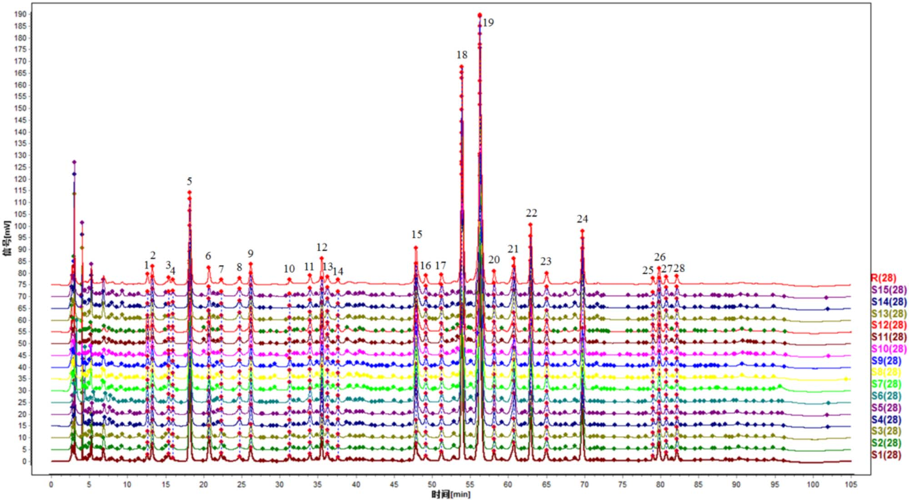
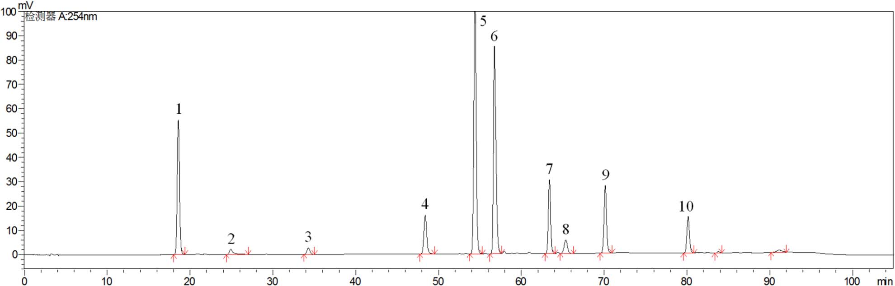
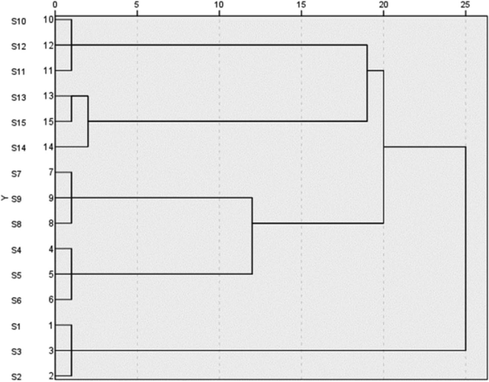

<!-- 方針: ほぼ全訳＋必要に応じた補足。原文構成に沿って訳出。「> 補足:」は訳者注。 -->

## 書誌情報

- 原題: Quality Evaluation of Qingwei Huanglian Pills Based on Fingerprint and Quantitative Analysis of Multi-Index Components Combined with Chemical Pattern Recognition Analysis
- 著者: Xiaowei Shao¹、Nan Zhao²＊、Yuping Li¹、Hongming Wang¹、Xueli Xu¹、Shuyue Wang²（¹濱州検査検測センター〔Binzhou Inspection and Testing Center〕、²濱州市中医医院 薬剤科〔Pharmacy Department of Binzhou Hospital of Traditional Chinese Medicine〕、いずれも中国・濱州市）＊責任著者
- 掲載: *Journal of Chromatographic Science*, 2025, 63(4), bmaf018. https://doi.org/10.1093/chromsci/bmaf018
- インパクトファクター: **1.3**（*Journal of Chromatographic Science*、JCR 2024 / Clarivate。複数の二次情報源（Journal Metrics等）による集計値。前年〔JCR2023〕は約1.8〜1.77とされ、経年で低下傾向）
- 受理経過: 受領 2025-02-27／編集判定 2025-03-06。© The Author(s) 2025. Published by Oxford University Press. All rights reserved.
- 助成: 濱州医学院「中医薬専項」科技創新プロジェクト（2023ZYZX014）

> 補足: QHP = 清胃黄連丸（Qingwei Huanglian Pills）。HCA = 階層的クラスター分析。PCA = 主成分分析。OPLS-DA = 直交部分最小二乗判別分析。VIP = Variable Importance in Projection（変数重要度）。本論文はフィンガープリント＋多成分定量＋ケモメトリクスを組み合わせた中成薬(中国伝統医薬の既製製剤)の品質評価研究。

## 要旨（Abstract）

清胃黄連丸(QHPs)は口内炎・舌瘡の治療に最も広く用いられる中成薬の一つであるが、既存の品質評価基準には一定の不備・欠陥がある。有効かつ科学的な品質評価法は、服薬安全性において重要な役割を果たす。本研究では、フィンガープリントおよび多指標成分の定量分析にケミカルパターン認識解析を組み合わせ、QHPsの品質を総合的に評価した。15ロットのQHPsについてフィンガープリントを作成し類似度評価を行い、10本の特徴ピークを同定した。階層的クラスター分析(HCA)、主成分分析(PCA)、直交部分最小二乗判別分析(OPLS-DA)を用いて15ロットをクラスタリング・ランキングするとともに、ロット間差異の原因となる成分を同定した。QHPsのHPLCフィンガープリントと10成分の含量測定法を確立した。28本の共通ピークを同定し、うち10成分を特定した。15ロットのサンプル間の類似度は0.983〜0.999であった。HCAとPCAによりそれぞれ15ロットのクラスター分析と総合スコアランキングを行い、OPLS-DAによりロット間差異に影響する13の化学マーカーをスクリーニングした。本研究で確立した方法は、QHPsの品質評価および製品の品質管理の参考となり得る。

## 1. 序論（Introduction）

中国における口内炎の発症率は25〜30%に及び、遺伝・環境・免疫機能など複数の要因が絡む複雑な病因を持つ(1, 2)。口内・舌の瘡、歯肉腫脹、咽頭痛などの症状は摂食・発話の困難を招き、患者のQOLに大きな影響を与える(3, 4)。QHPsは黄連(Coptis chinensis)、山梔子(Gardenia)、黄芩(Scutellaria baicalensis)、甘草など14種の生薬から作られる中医薬製剤で、水丸(水を用いた丸剤)に加工される。肺胃の熱による口内・舌の瘡、歯肉・咽頭の腫脹の治療に広く用いられる。本剤は清胃瀉火・解毒消腫の効能を持ち、歯周炎や口内炎に有効な治療薬である。2023年のQHP販売額は52億元を超え、中医薬における広範な使用実態を示している。したがって、本製剤の全体的な品質を反映する評価法の確立は極めて重要である。品質を評価するための管理法・指標の開発は、薬効の安定性・信頼性を確保する上で不可欠である。

QHPは『中国薬典』2020年版(第一部)に収載されているが(5)、現行では塩酸ベルベリンのみが定量指標成分として用いられている。単一成分による管理では、製剤の品質を包括的に評価することが難しい。そのため、複方製剤の品質評価において多指標成分定量が近年の趨勢となっている(6, 7)。フィンガープリント法は中医薬の分野で複方製剤の品質を客観的に評価する手法として広く応用されており、成分の特徴・トレーサビリティ・測定可能性を明らかにし、全体的・動的・包括的という利点を持つ(8, 9)。ケミカルパターン認識技術はフィンガープリント情報をさらに精緻化・解析するものであり、これらの手法を組み合わせることで、製剤の品質をより直感的かつ正確に反映できる。

製品のロット間品質安定性は、臨床的同等性と有効性を確保する上で重要な要素である(10)。本研究では、HPLCを用いて15ロットのQHPsのフィンガープリントプロファイルを確立するとともに、10成分の含量を測定した。同時に、階層的クラスター分析(HCA)、主成分分析(PCA)、直交部分最小二乗判別分析(OPLS-DA)などのケミカルパターン認識解析モードを組み合わせ、QHPsのロット間安定性を包括的・系統的に評価し、製剤の品質安定性および臨床薬効の一貫性に関する研究アイデアを提供した。

## 2. 実験（Experimental）

### 2.1 機器・試薬

**装置・ソフトウェア**: 島津LC-20 AD高速液体クロマトグラフ、Mettler XS205Du電子天秤(Mettler社)、昆山舒美KQ-700 DV超音波洗浄機(昆山超音波儀器有限公司)。0.22 μmミクロ孔ろ過膜は天津色譜科技有限公司より供給。解析に用いたソフトウェアは「中薬クロマトグラム類似度評価システム」(バージョンA、2004年版)、SIMCA 14.1、SPSS 27.0。

**薬物・試薬**: ゲニポシド(Lot No.: 110749–2011919、含量97.1%)、ペオニフロリン(Lot No.: 110736–202044、含量96.8%)、リクイリチン(Lot No.: 111610–201106、含量93.7%)、塩酸コプチシン(Lot No.: 112026–201601、含量95.1%)、バイカリン(Lot No.: 110715–201821、含量95.4%)、塩酸ベルベリン(Lot No.: 110713–201613、含量86.8%)、ウォゴノシド(Lot No.: 112002–201702、含量98.5%)、パエオノール(Lot No.: 110708–200506、含量100.0%)、バイカレイン(Lot No.: 111595–201808、含量97.9%)、ハンバイカリン(Lot No.: 111514–201706、含量100.0%)は、いずれも中国食品薬品検定研究院(National Institutes for Food and Drug Control)より入手した。メタノール・アセトニトリル(クロマトグラフィーグレード)はTEDIA Limited社より、リン酸(分析グレード)は天津科密化学試薬有限公司より購入した。実験には超純水を使用した。

15ロットのサンプルは5社の製造元から収集した: S1〜S3は甘粛佛仁製薬科技有限公司、S4〜S6は山西華康製薬有限公司、S7〜S9は山東孔聖堂製薬有限公司、S10〜S12は北京同仁堂製薬有限公司、S13〜S15は山西王竜製薬集団有限公司から。15ロットの詳細情報を表Iに示す。

**表I. 15ロットのサンプル情報**

| 通し番号 | ロット番号 | 製造元 | 製造日 | 有効期限(文書上) |
|---|---|---|---|---|
| S1 | 231201 | 甘粛佛仁製薬科技 | 2023-12-05 | 2025-11 |
| S2 | 230901 | 甘粛佛仁製薬科技 | 2023-09-05 | 2025-08 |
| S3 | 240402 | 甘粛佛仁製薬科技 | 2024-04-10 | 2026-03 |
| S4 | 20240503 | 山西華康製薬 | 2024-05-10 | 2027-04 |
| S5 | 20240210 | 山西華康製薬 | 2024-02-22 | 2027-01 |
| S6 | 20231102 | 山西華康製薬 | 2023-11-07 | 2026-10 |
| S7 | 24022014 | 山東孔聖堂製薬 | 2024-02-21 | 2026-02-20 |
| S8 | 23122014 | 山東孔聖堂製薬 | 2023-12-20 | 2025-12-19 |
| S9 | 23052012 | 山東孔聖堂製薬 | 2023-05-15 | 2025-05-14 |
| S10 | 22081124 | 北京同仁堂製薬 | 2022-09-02 | 2026-08 |
| S11 | 22081121 | 北京同仁堂製薬 | 2022-08-25 | 2026-07 |
| S12 | 24081365 | 北京同仁堂製薬 | 2024-07-05 | 2028-06 |
| S13 | 20221109 | 山西王竜製薬集団 | 2022-11-26 | 2025-10 |
| S14 | 20221005 | 山西王竜製薬集団 | 2022-10-18 | 2025-09 |
| S15 | 20230807 | 山西王竜製薬集団 | 2023-08-23 | 2026-07 |

### 2.2 クロマトグラフィー条件

クロマトグラフィー分離はInertSustain C18カラム(4.6 mm×250 mm、5 μm)を用いて実施した。移動相はメタノール(A)、アセトニトリル(B)、0.2%リン酸水溶液(C)からなり、以下のグラジエント溶出プログラムを用いた:

- 0–40 min: A 5%→5%、B 5%→20%、C 90%→75%
- 40–60 min: A 5%→10%、B 20%→30%、C 76%→65%
- 60–80 min: A 10%→5%、B 30%→55%、C 60%→40%
- 80–90 min: A 5%→10%、B 55%→5%、C 40%→90%

流速1.0 mL/min、検出波長254 nm、カラム温度35℃、注入量10 μLに設定した。

### 2.3 方法

**対照溶液の調製**: ゲニポシド、ペオニフロリン、リクイリチン、塩酸コプチシン、バイカリン、塩酸ベルベリン、ウォゴノシド、パエオノール、バイカレイン、ハンバイカリンの対照標準品をそれぞれ精密に秤量した。各標準品をメタノールに溶解しストック溶液を調製した。調製溶液の濃度は以下の通り: ゲニポシド 106.810 μg/mL、ペオニフロリン 23.584 μg/mL、リクイリチン 10.051 μg/mL、塩酸コプチシン 10.375 μg/mL、バイカリン 136.335 μg/mL、塩酸ベルベリン 52.238 μg/mL、ウォゴノシド 31.878 μg/mL、パエオノール 12.361 μg/mL、バイカレイン 10.057 μg/mL、ハンバイカリン 11.727 μg/mL。

**供試品溶液の調製**: QHP 1袋分を粉砕機で細かく粉砕した。約0.5 gの粉末を精密に秤量し、栓付き三角フラスコに移した。メタノール50 mLを加えて秤量し、超音波処理(300 W、45 kHz)を30分間行った。室温まで放冷後、フラスコを再度秤量し、重量減少分をメタノールで補正した。よく振り混ぜた後、0.22 μmミクロ孔膜でろ過し、ろ液を供試品溶液とした。

**フィンガープリントマッピング**: 15ロットのQHPsのフィンガープリントを測定し、得られたクロマトグラムを「中薬クロマトグラム類似度評価システム」(バージョンA、2004年版)に取り込み解析・評価した。サンプルS3のクロマトグラムを参照クロマトグラム(R)とし、時間窓幅0.1で設定した。

**ケミカルパターン認識**

- *階層的クラスター分析(HCA)*: 15ロットのQHPsのHCAは、28本の共通ピーク面積を標準化したうえで、群間平均連結法(inter-group join method)とユークリッド距離の二乗をサンプル類似度の尺度として用い、IBM SPSS Statistics(バージョン27.0)ソフトウェアで実施した。
- *主成分分析(PCA)*: 15ロットのサンプルから得られた28本の共通ピークの標準化ピーク面積をSPSS 27.0ソフトウェアに取り込み、データの適合性検定(KMO検定、Bartlettの球面性検定)を実施した。KMO値は0.895であり、1に近いほど変数間の相関が強いことを示す。Bartlett検定のp値は0.05未満であり、変数間に有意な相関があることが確認され、主成分因子分析への適合性が示された(11)。
- *直交部分最小二乗判別分析(OPLS-DA)*: OPLS-DAは分類問題に対処するためによく用いられる教師あり判別分析法である。群内変動が大きく群間差が小さい場合に特に有効であり、異なるカテゴリーのサンプルを判別する上でPCAより適している(12, 13)。QHPsの製造元・ロット間の化学組成の差異をさらに検討するため、28本の共通ピークの標準化ピーク面積を従属変数、製造元・ロットを独立変数としてSIMCA 14.1ソフトウェアに取り込み、OPLS-DAで処理した。

**多指標成分の含量測定**

- *特異性*: 供試品溶液と対照溶液を精密に量り、クロマトグラフィー条件下で解析した。
- *直線範囲*: 各対照ストック溶液1、2.5、5、10、25 mLを25 mLメスフラスコ6本にそれぞれ精密に移した。メスアップまでメタノールを加えよく振り混ぜ、異なる濃度の混合対照溶液を調製した。これらの溶液をHPLCに注入し、クロマトグラフィー条件下で解析した。各成分のピーク面積(Y)を濃度(X)に対して線形回帰した。
- *精度*: 対照溶液をクロマトグラフィー条件下で連続6回注入した。
- *繰り返し性*: 6丸(ロット番号: 24022014)を精密に秤量し、供試品溶液を調製してクロマトグラフィー条件下で解析した。
- *サンプル回収率試験*: QHPsのサンプル(ロット番号24022014)6検体をそれぞれ約0.25 g精密に秤量した。対照ストック溶液の様々な体積(2.2、3.6、3.6、3.3、2.5、3.9、2.3、2.5、1.6、1.0 mL)を添加した。供試品溶液を調製しクロマトグラフィー条件下で解析した。回収率は「回収率＝回収された量／添加量」の式で算出した。各成分の回収率を算出した。

> 補足: 回収率試験で示された10個の添加体積(2.2〜1.0 mL)は原文の記載通りだが、どの体積がどの成分・どのサンプルに対応するかの詳細な対応関係は原文に明記されていない。原文参照。

- *多指標成分の含量測定*: 上記クロマトグラフィー条件に従い、ゲニポシド、ペオニフロリン、リクイリチン、塩酸コプチシン、バイカリン、塩酸ベルベリン、ウォゴノシド、パエオノール、バイカレイン、ハンバイカリンの含量を15ロットのサンプルについて測定した。

## 3. 結果（Results）

### 3.1 フィンガープリントマッピング

フィンガープリント解析により合計28本の共通ピークが同定され、ピーク No.18(バイカリン)はピーク面積が大きく、保持時間が安定しており、隣接ピークとの分離が良好であるという利点を示した。28本の共通ピークの保持時間のRSDは0.32%未満であり、ピーク面積のRSDは7.73%〜44.72%の範囲であった。この結果は、15ロット間で28共通成分の保持時間が比較的安定している一方、ロット間で含量に一定の差異があることを示している。フィンガープリントプロファイルを図1に、対照品のクロマトグラムを図2に示す。





保持時間および紫外吸収スペクトルの比較により、10成分が同定された。ピーク No.5はゲニポシドに、ピーク No.8はペオニフロリンに、ピーク No.11はリクイリチンに、ピーク No.15は塩酸コプチシンに対応した。ピーク No.18はバイカレインと同定され、ピーク No.19は塩酸ベルベリン、ピーク No.22はウォゴノシド、ピーク No.23はパエオノール、ピーク No.24はバイカレイン、ピーク No.26はハンバイカリンと同定された。

> 補足: 原文のこの一文では「ピーク No.18はバイカレインと同定」「ピーク No.24もバイカレインと同定」と、バイカレインが2回登場し、バイカリンへの言及が抜けている。しかし同じ原文内の別箇所(フィンガープリントマッピング冒頭「ピーク No.18(バイカリン)」)および後述の表IV(成分負荷行列)では、ピーク No.18＝バイカリン、ピーク No.24＝バイカレインと明記されており、10成分の内訳（ゲニポシド・ペオニフロリン・リクイリチン・塩酸コプチシン・バイカリン・塩酸ベルベリン・ウォゴノシド・パエオノール・バイカレイン・ハンバイカリン)とも整合する。したがって上記の「ピーク No.18＝バイカレイン」という記載は原文自体の誤記（バイカリンの誤り）である可能性が高い。原文の記載をそのまま訳出したうえで、この不整合を明示する。

15ロットのQHPsのフィンガープリントと参照フィンガープリントとの類似度を算出した結果を表IIに示す。薬典委員会の基準によれば、類似度が90%を超えれば類似度評価の要件を満たすとされる。15ロット間の類似度は0.983〜0.999の範囲であり、いずれも0.900を上回った。このことは、5社のサンプルの品質が一貫して安定していたことを示している。高い類似度は、製造工程が良好に管理されており、製剤全体の品質が高かったことも示唆している(14, 15)。

**表II. 15ロットのサンプルの類似度結果**

| ロット | 類似度 | ロット | 類似度 | ロット | 類似度 |
|---|---|---|---|---|---|
| S1 | 0.992 | S6 | 0.986 | S11 | 0.983 |
| S2 | 0.992 | S7 | 0.996 | S12 | 0.983 |
| S3 | 0.993 | S8 | 0.995 | S13 | 0.999 |
| S4 | 0.987 | S9 | 0.997 | S14 | 0.997 |
| S5 | 0.985 | S10 | 0.984 | S15 | 0.996 |

### 3.2 階層的クラスター分析(HCA)

結果を図3に示す。図3によれば、ユークリッド距離20〜25の間で15ロットのサンプルは2つのクラスに分類でき、S1〜S3が第1クラス、S4〜S15が第2クラスとなる。



> 補足: 図3のデンドログラムを見ると、上記の大分類の内部でも、製造元ごとにおおむね対応するサブクラスター(例: S10・S11・S12、S13・S15とS14、S7・S8・S9、S4・S5・S6、S1・S2・S3など)が形成されている様子が視覚的に確認できる。ただしこれらサブクラスターの結合距離の具体的な数値は原文本文中に明記されていないため、図3を参照されたい。

### 3.3 主成分分析(PCA)

固有値1超を選択基準として、4つの主成分因子が同定され、累積寄与率は97.859%であった(表III)。これは、これら4つの主成分因子がQHPsの28共通ピークのフィンガープリントプロファイルに含まれる本質的な特徴と大部分の情報を代表していることを示す。

**表III. PCA固有値と寄与率**

| 主成分 | 固有値 | 寄与率 (%) | 累積寄与率 (%) |
|---|---|---|---|
| 1 | 11.698 | 41.780 | 41.780 |
| 2 | 6.986 | 24.951 | 66.731 |
| 3 | 5.634 | 20.121 | 86.852 |
| 4 | 3.082 | 11.007 | 97.859 |

成分負荷行列は、4つの主成分と28本の共通ピークとの相関係数を示す。負荷の絶対値が大きいほど、当該主成分への寄与が大きいことを意味する(16, 17)。詳細な結果を表IVに示す。主成分負荷の絶対値0.6超を閾値として、原変数と4つの主成分因子との相関を解析した結果、以下が明らかになった: 主成分1は主にピーク2, 4, 5, 8–9, 11, 14–16, 18, 20–22, 26, 28の情報を反映する。主成分2はピーク1, 5, 17, 24, 27を反映する。主成分3はピーク3, 6, 7, 10, 12, 13, 19に対応する。主成分4は主にピーク23, 25を反映する。

**表IV. 清胃黄連丸15ロットの成分負荷行列(全28共通ピーク)**

| ピーク番号 | 成分 | PC1 | PC2 | PC3 | PC4 |
|---|---|---|---|---|---|
| 1 | 未同定 | 0.507 | 0.746 | 0.375 | 0.203 |
| 2 | 未同定 | 0.711 | 0.478 | 0.045 | 0.494 |
| 3 | 未同定 | 0.411 | 0.452 | 0.625 | 0.483 |
| 4 | 未同定 | 0.933 | 0.203 | 0.158 | 0.162 |
| 5 | ゲニポシド | 0.701 | 0.685 | 0.063 | 0.143 |
| 6 | 未同定 | 0.183 | 0.497 | 0.793 | 0.295 |
| 7 | 未同定 | 0.580 | 0.213 | 0.774 | 0.069 |
| 8 | ペオニフロリン | 0.768 | 0.383 | 0.371 | 0.328 |
| 9 | 未同定 | 0.624 | 0.630 | 0.457 | 0.049 |
| 10 | 未同定 | 0.428 | 0.305 | 0.754 | 0.373 |
| 11 | リクイリチン | 0.666 | 0.450 | 0.414 | 0.376 |
| 12 | 未同定 | 0.557 | 0.516 | 0.583 | 0.286 |
| 13 | 未同定 | 0.228 | 0.018 | 0.893 | 0.099 |
| 14 | 未同定 | 0.810 | 0.461 | 0.117 | 0.250 |
| 15 | 塩酸コプチシン | 0.740 | 0.452 | 0.300 | 0.393 |
| 16 | 未同定 | 0.754 | 0.238 | 0.560 | 0.170 |
| 17 | 未同定 | 0.113 | 0.953 | 0.062 | 0.114 |
| 18 | バイカリン | 0.942 | 0.264 | 0.135 | 0.132 |
| 19 | 塩酸ベルベリン | 0.322 | 0.491 | 0.663 | 0.452 |
| 20 | 未同定 | 0.870 | 0.310 | 0.269 | 0.267 |
| 21 | 未同定 | 0.867 | 0.448 | 0.127 | 0.167 |
| 22 | ウォゴノシド | 0.964 | 0.110 | 0.015 | 0.231 |
| 23 | パエオノール | 0.443 | 0.173 | 0.480 | 0.723 |
| 24 | バイカレイン | 0.383 | 0.806 | 0.260 | 0.366 |
| 25 | 未同定 | 0.529 | 0.371 | 0.264 | 0.713 |
| 26 | ハンバイカリン | 0.797 | 0.135 | 0.451 | 0.367 |
| 27 | 未同定 | 0.159 | 0.952 | 0.220 | 0.101 |
| 28 | 未同定 | 0.756 | 0.588 | 0.175 | 0.028 |

主成分の負荷値をさらに用いて、4つの主成分の得点を求める線形モデルを導出した。ここでF1〜F4はそれぞれ4つの主成分の得点、X1〜X28は28本の共通ピーク面積をそれぞれ標準化した結果を表し、4つの主成分得点の計算式は以下の通りである(原文に記載の係数をそのまま転記):

```
F1 = 0.148X1 + 0.208X2 + 0.120X3 + 0.273X4 + 0.205X5 − 0.054X6 − 0.170X7 + 0.225X8
   + 0.182X9 + 0.125X10 + 0.195X11 + 0.163X12 + 0.067X13 + 0.237X14 + 0.216X15
   + 0.220X16 + 0.033X17 + 0.275X18 + 0.094X19 + 0.254X20 + 0.254X21 + 0.282X22
   + 0.130X23 − 0.112X24 + 0.155X25 − 0.233X26 − 0.046X27 − 0.221X28

F2 = −0.282X1 + 0.181X2 + 0.171X3 + 0.077X4 + 0.259X5 − 0.188X6 + 0.081X7 + 0.145X8
   − 0.238X9 + 0.115X10 − 0.170X11 − 0.195X12 − 0.007X13 − 0.174X14 − 0.171X15
   − 0.090X16 + 0.361X17 + 0.100X18 − 0.186X19 + 0.117X20 + 0.169X21 + 0.042X22
   + 0.065X23 − 0.305X24 − 0.140X25 − 0.051X26 + 0.360X27 + 0.222X28

F3 = 0.158X1 − 0.019X2 + 0.263X3 − 0.067X4 − 0.027X5 + 0.334X6 + 0.326X7 − 0.156X8
   − 0.193X9 + 0.318X10 + 0.174X11 + 0.246X12 − 0.376X13 + 0.049X14 − 0.126X15
   − 0.236X16 − 0.026X17 − 0.057X18 − 0.279X19 + 0.113X20 − 0.054X21 + 0.006X22
   + 0.202X23 − 0.110X24 + 0.111X25 − 0.190X26 − 0.093X27 − 0.074X28

F4 = 0.116X1 + 0.281X2 + 0.275X3 − 0.092X4 + 0.081X5 − 0.168X6 + 0.039X7 − 0.187X8
   + 0.028X9 + 0.212X10 − 0.214X11 − 0.163X12 − 0.056X13 − 0.142X14 + 0.224X15
   + 0.097X16 + 0.065X17 − 0.075X18 + 0.257X19 − 0.152X20 − 0.095X21 − 0.132X22
   + 0.412X23 + 0.208X24 + 0.406X25 + 0.209X26 + 0.058X27 + 0.016X28
```

> 補足: F1の式のX19の係数は原文で「0.094.X19」という表記(ピリオドの混入)になっており、印字上のノイズ(OCR起因の可能性)と判断して「0.094X19」として転記した。それ以外の係数は原文の数値をそのまま転記している。

主成分得点を算出したのち、寄与率で重み付けした総合スコアを算出した。総合競争力Fの合成式はF合成＝(0.41780F1 ＋ 0.24951F2 ＋ 0.20121F3 ＋ 0.11007F4)／0.97859であり、スコアの結果を表Vに示す。

これらのスコアは各ロットのQHPsの品質を反映しており、スコアが高いほど品質が良いことを示す(4, 18)。総合スコア1超の上位6ロットはS4〜S9であり、これらのロットは優れた品質を示した。15ロットの28共通ピークのピーク面積についてさらにSIMCA 14.1ソフトウェアを用いてPCAを実施し、PCAスコアプロットを図4に示す。

**表V. 清胃黄連丸15ロットの主成分スコアと総合ランキング**

| ロット | PC1 | PC2 | PC3 | PC4 | 総合スコア | 順位 |
|---|---|---|---|---|---|---|
| S1 | −5.48929 | 0.93338 | 2.52206 | 1.05860 | −1.46806 | 11 |
| S2 | −5.38857 | 1.16782 | 2.19646 | 0.97693 | −1.44141 | 10 |
| S3 | −5.46290 | 1.01380 | 2.38527 | 0.95344 | −1.47623 | 12 |
| S4 | 3.66742 | −0.79995 | 1.73430 | 0.18798 | 1.73953 | 3 |
| S5 | 3.53528 | −0.59377 | 1.91956 | 0.12516 | 1.76672 | 2 |
| S6 | 4.28406 | −0.66824 | 2.17210 | 0.18141 | 2.12566 | 1 |
| S7 | 2.91924 | 2.25444 | −0.02409 | −1.82123 | 1.61148 | 4 |
| S8 | 2.50562 | 2.48059 | 0.39154 | −1.72689 | 1.58862 | 5 |
| S9 | 2.75003 | 2.28490 | 0.14699 | −1.78857 | 1.58586 | 6 |
| S10 | −0.66127 | −4.58640 | −0.88289 | 0.34604 | −1.59435 | 14 |
| S11 | −0.26187 | −4.79580 | −1.29807 | 0.30410 | −1.56730 | 13 |
| S12 | −0.80801 | −4.59123 | −0.89566 | 0.36588 | −1.65863 | 15 |
| S13 | −0.60406 | 2.10024 | −3.92064 | 0.88983 | −0.42851 | 8 |
| S14 | −1.27559 | 2.02963 | −3.52378 | 1.19629 | −0.61717 | 9 |
| S15 | −0.34827 | 1.44787 | −3.91861 | 1.41342 | −0.42637 | 7 |

> 補足: 表Vの原文の表題は表IV(成分負荷行列)と同じ「Component Load Matrix」となっているが、内容は主成分スコア・総合ランキング表であり、原文自体の表題の誤記(重複)と考えられる。ここでは内容に即した表題に置き換えて訳出した。


### 3.4 直交部分最小二乗判別分析(OPLS-DA)

モデルの安定性パラメータR2Yは0.997、モデルの予測パラメータQ2は0.952であった。いずれも0.5を超えており、OPLS-DAモデルが高い安定性と強い予測能力を持つことを示す。図5(A)にOPLS-DAスコアプロットを示す。

モデルの過学習が生じていないことを検証するため、データを200回ランダムに並べ替える置換検定を実施した。図5(B)に示す結果によれば、R2回帰直線のY軸切片は0.359、Q2回帰直線のY軸切片は−0.919であり、いずれも元の値より小さかった。これは過学習が生じていないことを裏付けている(19)。したがって検証結果は、本モデルが有効かつ信頼性があり、15ロットのQHPs間のロット間変動の解析に利用できることを示している。


VIP(Variable Importance in Projection)値は差異成分を同定するための重要な指標であり、VIP値が高いほど当該成分が群間の品質差異に与える影響が大きいことを示す。VIP値>1を閾値として、ロット間差異の原因となる主要成分を選定した。その結果、13本のクロマトグラフィーピークが有意であると同定され、図5(C)に示す。これらのピークはVIP値の高い順に、23(パエオノール)、25、3、19(塩酸ベルベリン)、6、10、24(バイカレイン)、2、12、13、27、7、15(塩酸コプチシン)であった。これら13本のピークは、ロット間差異の主要な原因となる化学成分であり、品質変動の潜在的マーカーとなり得る。

### 3.5 多指標成分の含量測定

特異性試験の結果、両溶液とも同一の保持時間で紫外吸収を示し、UV吸収スペクトルも一致していた。さらに供試品溶液中の成分の分離は明瞭であり、本法が良好な特異性を有することが示された。10成分の直線性は良好であり、結果を表VIに示す。

**表VI. 清胃黄連丸中10成分の直線関係の検討結果**

| 成分 | 回帰式 | r | 直線範囲 (μg/mL) |
|---|---|---|---|
| ゲニポシド | Y = 9637.9X + 48282 | 0.9997 | 21.362〜534.05 |
| ペオニフロリン | Y = 2801.7X + 3142.7 | 0.9996 | 4.7168〜117.92 |
| リクイリチン | Y = 6882.0X + 1174.4 | 0.9997 | 2.0103〜50.257 |
| 塩酸コプチシン | Y = 36611X + 8892.5 | 0.9998 | 2.0749〜51.873 |
| バイカリン | Y = 15608X − 318.66 | 1.0000 | 27.267〜681.68 |
| 塩酸ベルベリン | Y = 17832X + 1977 | 0.9998 | 10.448〜261.19 |
| ウォゴノシド | Y = 18115X + 12891 | 0.999 | 6.3756〜159.39 |
| パエオノール | Y = 12440X + 1776.3 | 0.9999 | 2.4723〜61.807 |
| バイカレイン | Y = 57515X + 10007 | 0.9997 | 2.0114〜50.285 |
| ハンバイカリン | Y = 26488X − 11283 | 0.9998 | 2.3455〜58.636 |

> 補足: 回帰式は原文で「Y= 9637.9+ 48,282」のように印字されており、標準的な検量線表記(Y=傾きX＋切片)に合わせ、脱落していたと考えられる「X」を補って「Y = 9637.9X + 48282」の形で転記した。係数自体の数値は原文の記載通り。

精度試験の結果、ゲニポシド、ペオニフロリン、リクイリチン、塩酸コプチシン、バイカリン、塩酸ベルベリン、ウォゴノシド、パエオノール、バイカレイン、ハンバイカリンのピーク面積のRSDはそれぞれ0.38%、0.47%、0.82%、0.71%、0.12%、0.97%、1.01%、0.76%、0.86%、0.94%であり、良好な機器精度を示した。

繰り返し性試験の結果、ゲニポシド、ペオニフロリン、リクイリチン、塩酸コプチシン、バイカリン、塩酸ベルベリン、ウォゴノシド、パエオノール、バイカレイン、ハンバイカリンのピーク面積のRSDはそれぞれ1.04%、0.89%、1.14%、1.11%、1.42%、0.78%、0.67%、1.02%、0.87%、0.68%であり、本法の良好な再現性を示した。

サンプル回収率試験の結果、ゲニポシド、ペオニフロリン、リクイリチン、塩酸コプチシン、バイカリン、塩酸ベルベリン、ウォゴノシド、パエオノール、バイカレイン、ハンバイカリンの平均回収率はそれぞれ99.44%、98.87%、97.89%、99.97%、100.03%、98.78%、100.10%、98.78%、100.23%、98.17%であった。対応するRSDはそれぞれ1.77%、1.60%、0.83%、1.95%、1.54%、1.45%、1.43%、0.90%、1.43%、1.55%であり、良好な回収精度を示した。

**多指標成分の含量測定結果**: 15ロットのサンプルにおけるゲニポシド、ペオニフロリン、リクイリチン、塩酸コプチシン、バイカリン、塩酸ベルベリン、ウォゴノシド、パエオノール、バイカレイン、ハンバイカリンの含量測定結果を表VIIに示す。10成分の異なるロット間でのRSDはそれぞれ16.74%、15.79%、28.59%、27.17%、24.04%、14.15%、15.89%、12.34%、41.34%、14.67%であり、ロット間で成分含量にばらつきがあることを示している。SPSS 27.0ソフトウェアを用いて、10成分の含量とPCA総合スコアとの相関を解析した。ピアソン相関係数を用いた2変量相関分析を実施したところ、両側検定で相関係数0.752(P<0.001)が示された。この結果は、10指標成分の含量とQHPsの全体品質との間に有意な相関があることを示しており、これら10成分が製品の品質評価に利用できることを示唆している。

**表VII. 清胃黄連丸中10成分の含量測定結果 (mg/g)**

| サンプル | ゲニポシド | ペオニフロリン | リクイリチン | 塩酸コプチシン | バイカリン | 塩酸ベルベリン | ウォゴノシド | パエオノール | バイカレイン | ハンバイカリン |
|---|---|---|---|---|---|---|---|---|---|---|
| S1 | 6.80 | 2.42 | 1.23 | 0.62 | 7.30 | 6.11 | 2.03 | 0.97 | 0.82 | 0.59 |
| S2 | 6.53 | 2.58 | 1.23 | 0.63 | 7.33 | 6.27 | 2.06 | 1.01 | 0.81 | 0.58 |
| S3 | 6.58 | 2.55 | 1.24 | 0.62 | 7.30 | 6.12 | 2.04 | 0.97 | 0.82 | 0.59 |
| S4 | 8.27 | 3.68 | 2.19 | 1.22 | 14.46 | 7.00 | 3.23 | 0.99 | 0.51 | 0.40 |
| S5 | 8.31 | 3.68 | 2.15 | 1.22 | 14.49 | 7.04 | 3.23 | 0.98 | 0.51 | 0.40 |
| S6 | 8.50 | 3.65 | 2.66 | 1.22 | 14.56 | 7.03 | 3.27 | 1.03 | 0.51 | 0.40 |
| S7 | 9.58 | 3.45 | 1.46 | 1.39 | 13.90 | 8.10 | 2.94 | 1.26 | 0.64 | 0.49 |
| S8 | 9.87 | 3.42 | 1.42 | 1.37 | 13.85 | 8.03 | 2.89 | 1.18 | 0.56 | 0.51 |
| S9 | 9.83 | 3.52 | 1.46 | 1.39 | 13.91 | 8.10 | 2.92 | 1.22 | 0.62 | 0.51 |
| S10 | 6.28 | 2.78 | 1.67 | 1.49 | 9.75 | 9.24 | 2.45 | 0.99 | 1.43 | 0.59 |
| S11 | 6.33 | 2.83 | 1.75 | 1.50 | 9.82 | 9.30 | 2.46 | 0.99 | 1.44 | 0.60 |
| S12 | 6.25 | 2.74 | 1.67 | 1.48 | 9.69 | 9.19 | 2.43 | 1.00 | 1.44 | 0.59 |
| S13 | 8.03 | 3.77 | 1.23 | 1.08 | 12.19 | 7.83 | 2.64 | 0.86 | 0.71 | 0.57 |
| S14 | 8.40 | 3.43 | 1.04 | 1.07 | 12.36 | 8.30 | 2.66 | 0.85 | 0.73 | 0.58 |
| S15 | 8.41 | 3.86 | 1.26 | 1.07 | 12.37 | 8.31 | 2.66 | 0.85 | 0.73 | 0.58 |

## 4. 考察（Discussion）

QHPsにおいて、黄連(20)と石膏は君薬として機能し、清熱・燥湿・解毒の役割を担う。黄芩と山梔子は臣薬として、清熱・除湿・解毒を補助する(21, 22)。連翹は清熱解毒・消腫散結の作用を持つ(23)。知母と黄柏は体を冷やし陰を養い乾燥を潤す(24, 25)。玄参、地黄、牡丹皮、赤芍は清熱涼血・解毒活血を担い、消腫・散瘀を助ける(26, 27)。天花粉(原文表記「Smallpox flour」)は養陰潤燥・清熱生津の佐薬として作用する。桔梗は咽頭を解毒し薬効を上部へ運ぶのを助け(28)、甘草は諸薬の効果を調和する使薬として働く(29)。中医薬の品質マーカーは、補助薬・佐薬・使薬の役割を考慮しつつ、君薬に由来することが多い。本研究では、君薬として黄連を、臣薬・佐薬として黄芩・山梔子・牡丹皮・赤芍を、使薬として甘草を選定した。この選定が、QHPsの包括的な品質管理の基礎となっている。

> 補足: 「Smallpox flour」は原文の英訳表記をそのまま転記した。中医薬の文脈・配合薬味から見て天花粉(トウカラスウリの根、Trichosanthes root)を指すと考えられるが、これは訳者による推定であり原文に明示的な学名等の記載はない。

『中国薬典』2020年版第一部によれば、ゲニポシドは波長238 nmで良好な吸収を示し、ペオニフロリンは230 nmで最大吸収、リクイリチンは237 nmで最大吸収を示す。塩酸ベルベリンと塩酸コプチシンは345 nmで最大吸収を示し、バイカリン、ウォゴノシド、バイカレイン、ハンバイカリンは280 nmで良好な吸収を、パエオノールは274 nmで最大吸収を示す。本実験では、230 nm、237 nm、238 nm、254 nm、354 nmの波長でピーク性能を検討した。その結果、254 nmにおいてピーク形状が優れ、感度が高く、分離能に優れ、強い紫外吸収を示すことが判明した。したがって254 nmを検出波長として選定した。

中医薬のフィンガープリント法は、真正性の確保、品質の一貫性評価、製品安定性の評価のための実行可能なアプローチである。中医薬の品質管理分野で広く採用されてきた。米国食品医薬品局(FDA)は、生薬健康製品の申請資料にクロマトグラフィーフィンガープリントプロファイルを含めることを認めている。世界保健機関(WHO)も1996年の生薬医薬品評価ガイドラインにおいて、生薬医薬品の有効成分が明確に同定されていない場合には、製品品質の一貫性を示すためにクロマトグラフィーフィンガープリントプロファイルを提供できると規定している。同様に欧州共同体(European Community)は、生薬医薬品の品質に関するガイドラインにおいて、特定の活性成分の測定のみに依拠して品質安定性を評価することは不十分であるとしている。これは、生薬医薬品とその製剤が全体として一体の活性物質として機能するためである。フィンガープリントプロファイルを中医薬(天然薬物)の抽出物およびその製剤の品質管理法として用いることは、国際的なコンセンサスとなっている。中医薬(天然薬物)固有の特性に適合した様々なフィンガープリントプロファイル管理技術体系の確立に向けた研究開発が進められている。

## 5. 結論（Conclusion）

本研究では、15ロットのQHPsの品質を解析するため、フィンガープリント法と多成分アッセイを用いた。結果は、ロット間変動が最小限であり、品質が安定・均質であることを示した。本研究は、28本のピーク(うち10の主要成分を含む)を同定するQHPsのHPLCフィンガープリントを確立した。データはさらにケミカルパターン認識技術を用いて解析され、QHPsの一貫性を評価する方法を提供し、製品の包括的な品質管理の参考を示した。

## 訳者補足

- 本研究は、既存の単一指標(塩酸ベルベリンのみ)による品質管理の限界を克服するため、①HPLCフィンガープリント(28共通ピーク・類似度評価)、②10成分の同時定量(検量線・精度・繰り返し性・回収率をバリデーション済み)、③ケモメトリクス(HCA・PCA・OPLS-DA)によるロット間差異解析、という3層構造で品質を評価する枠組みを提示している点が実務上の要点である。実務的には、単一マーカー規格に留まらず「フィンガープリント類似度＋複数指標成分の含量規格」を組み合わせる規格設計の一例として参考になる。
- OPLS-DAで抽出されたVIP値1超の13ピーク(パエオノール、塩酸ベルベリン、塩酸コプチシンを含む)は、原料生薬の産地・配合比・製造工程の違いを反映するロット間差異マーカー候補であり、今後の規格化・原料選定の議論に活用しうる。ただし、これら13ピークのうち構造未同定のものが多く(表IVでは28ピーク中10ピークのみ既知成分に帰属)、マーカーとしての実装には成分同定を進める追加研究が必要である。
- 5社・15ロットのPCA総合スコア(表V)およびOPLS-DAスコアプロット(図4/図5A)では、製造元ごとに明確なクラスターが形成されており、含量(表VII)も製造元間でまとまった傾向差(例: バイカリン含量は山西華康製薬のS4〜S6で14 mg/g台と高く、甘粛佛仁製薬科技のS1〜S3では7 mg/g台)を示す。これは処方由来の生薬原料や製造工程の違いがロット間品質差の主因である可能性を示唆するが、原因の特定(原料産地・炮製法など)は本研究の範囲外であり原文に記載がない。
- **限界**: 本研究は15ロット・5社という限られたサンプル数での解析であり、より多くの製造元・より長期間のロットを対象とした検証が今後望まれる。また、含量のロット間RSDはバイカレインで41.34%と特に大きく、指標成分としての妥当性や許容規格幅の設定には追加的検討が必要と考えられる(この評価は訳者による所見であり、原文に明記された結論ではない)。
