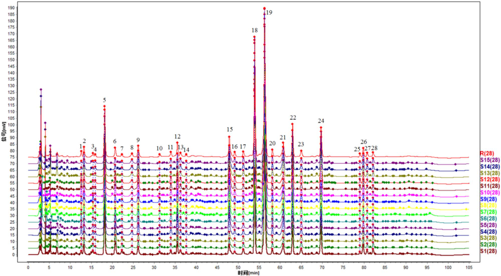
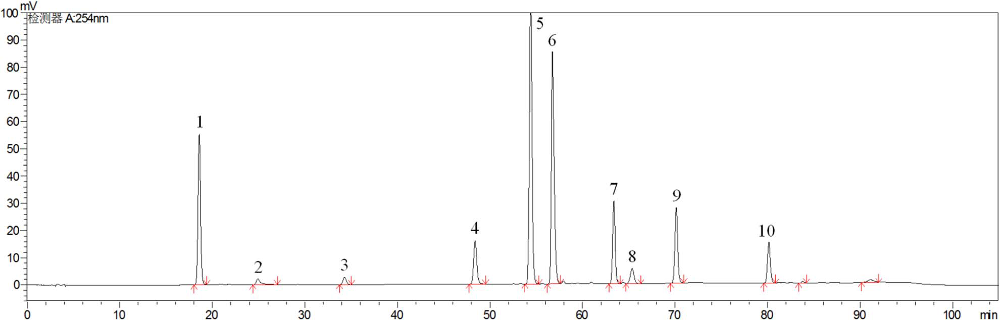
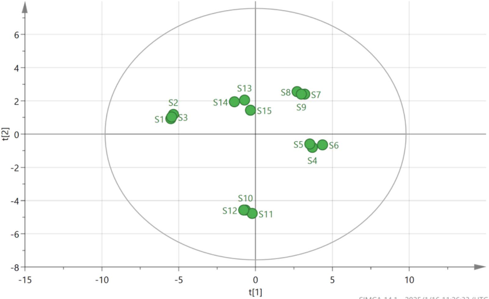

<!-- 方針: ほぼ全訳＋必要に応じた補足。原文構成（Introduction→Experimental→Results→Discussion→Conclusion）に沿って訳出。「> 補足:」は訳者注。 -->

## 書誌情報

- 標題（原題）: Quality Evaluation of Qingwei Huanglian Pills Based on Fingerprint and Quantitative Analysis of Multi-Index Components Combined with Chemical Pattern Recognition Analysis
- 著者・所属: Xiaowei Shao¹, Nan Zhao²（責任著者）, Yuping Li¹, Hongming Wang¹, Xueli Xu¹, Shuyue Wang²（¹浜州検査検定センター〔中国・浜州市〕／²浜州市中医医院 薬剤科〔中国・浜州市〕）
- 掲載誌・巻号・DOI: *Journal of Chromatographic Science*, 2025, 63(4), bmaf018. https://doi.org/10.1093/chromsci/bmaf018
- インパクトファクター: **1.3**（*J. Chromatogr. Sci.*, JCR 2024 / Clarivate。本誌は他の同誌掲載論文と同一値を採用）
- 受理経過 / ライセンス: 受理 2025-02-27／編集決定 2025-03-06／© The Author(s) 2025. Published by Oxford University Press. All rights reserved.

> 補足: 清胃黄連丸(Qingwei Huanglian Pills, QHPs)は黄連（Coptis chinensis）・山梔子（Gardenia）・黄芩（Scutellaria baicalensis）・甘草（licorice）など14生薬からなる中成薬（水丸剤）で、口内炎・舌瘡・歯肉腫痛・咽頭痛（肺胃の熱による）に用いられる。中国薬典2020年版に収載されているが、現行の定量指標は塩酸ベルベリン1成分のみであり、単一成分管理では製剤全体の品質を十分に評価できないという課題がある。2023年の同薬の売上高は52億元超と記されている。

## 要旨 (Abstract)

清胃黄連丸(QHPs)は口内炎・舌瘡の治療に最も一般的に使用される中成薬（中薬製剤）の一つであるが、既存の品質評価基準には一定の欠点や不十分な点が存在する。効果的かつ科学的な品質評価方法は、医薬品の安全性確保において極めて重要な役割を果たす。本研究では、指紋分析および多指標成分の定量分析に化学パターン認識分析を組み合わせて、QHPsの品質を包括的に評価した。15バッチのQHPsの指紋図譜を作成し類似度を評価したところ、10個の特徴ピークが同定された。階層的クラスター分析（HCA）、主成分分析（PCA）、直交部分最小二乗判別分析（OPLS-DA）を用いて15バッチをクラスタリング・順位付けし、同時にバッチ間差異の原因となる成分を特定した。QHPsのHPLC指紋図譜、および10成分の含量測定を確立した。28個の共通ピークが同定され、うち10成分が特定された。15バッチのサンプル間の類似度は0.983〜0.999であった。HCAおよびPCAによりそれぞれ15バッチのクラスター分析と総合スコア順位付けを行い、OPLS-DAによりバッチ間差異に影響する13個の化学マーカーをスクリーニングした。本研究で確立した手法は、QHPsの品質評価および製品の品質管理の参考となり得る。

---

## 1. 序論 (Introduction)

中国における口内炎（口腔潰瘍）の罹患率は25〜30%に達し、遺伝、環境、免疫機能などさまざまな要因が絡む複雑な病因を有する (1, 2)。口内炎・舌瘡、歯肉腫痛、咽頭痛といった症状は、摂食・発話困難を引き起こし、患者のQOLに著しい影響を与える (3, 4)。QHPsは、黄連（Coptis chinensis）、山梔子（Gardenia）、黄芩（Scutellaria baicalensis）、甘草（licorice）を含む14生薬から製造される伝統的な中成薬であり、水丸剤に加工されている。肺胃の熱による口内炎・舌瘡、歯肉・咽頭の腫脹の治療に一般的に用いられる。本剤は胃熱を清し、火を降ろし、解毒・消腫の作用を有し、歯周炎や口腔潰瘍に対する有効な治療薬となっている。2023年、QHPsの売上高は52億元を超え、伝統中国医学における本剤の広範な使用が示されている。したがって、本製剤全体の品質を反映する方法の確立が極めて重要である。安定的で信頼性の高い医薬品品質を確保するためには、品質管理の手法および指標の開発が不可欠である。

QHPsは中国薬典2020年版（第一部）(5) に収載されているが、現在は塩酸ベルベリンのみが定量指標成分として用いられている。単一成分による管理のみでは製剤の品質を包括的に評価することは困難である。そのため、複方製剤の品質評価においては、多指標成分の定量が近年の潮流となっている (6, 7)。指紋分析（フィンガープリンティング）は、複方製剤の品質を客観的に評価するために漢方薬分野で広く応用されている。これは成分の特徴・トレーサビリティ・測定可能性を明らかにし、全体的・動的かつ包括的な利点を提供する (8, 9)。化学パターン認識技術はさらに指紋情報を精緻化・解析するものであり、これらの手法を組み合わせることで、製剤の品質をより直感的かつ正確に反映することができる。

製品のバッチ間品質の安定性は、臨床的な同等性と有効性を確保するうえで重要な要素である (10)。本研究では、HPLC法を用いて15バッチのQHPsの指紋プロファイルを確立するとともに、10成分の含量を測定した。同時に、階層的クラスター分析（HCA）、主成分分析（PCA）、直交部分最小二乗判別分析（OPLS-DA）などの化学パターン認識解析モードを組み合わせ、QHPsのバッチ間品質安定性を包括的かつ体系的に評価した。本研究は、本製剤の品質安定性および臨床効果の一貫性に関する研究の着想を提供するものである。

---

## 2. 実験 (Experimental)

### 2.1 機器・試薬 (Instrumentation and reagents)

#### 2.1.1 装置・ソフトウェア (Instruments and software)
使用した装置は、島津製作所製 LC-20AD 高速液体クロマトグラフ、Mettler XS205Du 電子天秤（メトラー社）、崑山舒美 KQ-700 DV 超音波洗浄機（崑山超音波機器有限公司）である。0.22 μm微孔ろ過膜は天津色譜科技有限公司から供給された。解析に用いたソフトウェアは、「中薬クロマトグラフィー指紋図譜類似度評価システム」（バージョンA, 2004）、SIMCA 14.1、SPSS 27.0である。

#### 2.1.2 医薬品・試薬 (Drugs and reagents)
ゲニポシド (geniposide)（ロット番号: 110749-2011919, 含量97.1%）、ペオニフロリン (paeoniflorin)（ロット番号: 110736-202044, 含量96.8%）、リキリチン (liquiritin)（ロット番号: 111610-201106, 含量93.7%）、塩酸コプチシン (coptisine hydrochloride)（ロット番号: 112026-201601, 含量95.1%）、バイカリン (baicalin)（ロット番号: 110715-201821, 含量95.4%）、塩酸ベルベリン (berberine hydrochloride)（ロット番号: 110713-201613, 含量86.8%）、ウォゴノシド (wogonoside)（ロット番号: 112002-201702, 含量98.5%）、パエオノール (paeonol)（ロット番号: 110708-200506, 含量100.0%）、バイカレイン (baicalein)（ロット番号: 111595-201808, 含量97.9%）、ハンバイカリン (hanbaicalin)（ロット番号: 111514-201706, 含量100.0%）は、いずれも中国食品薬品検定研究院（National Institutes for Food and Drug Control）から入手した。メタノールおよびアセトニトリル（クロマトグラフィーグレード）はTEDIA社より、リン酸（分析グレード）は天津科密化学試薬有限公司より購入した。実験には超純水を使用した。

15バッチのサンプルは5社の製造元から収集した：S1〜S3は甘粛佛仁製薬科技有限公司、S4〜S6は山西華康製薬有限公司、S7〜S9は山東孔聖堂製薬有限公司、S10〜S12は北京同仁堂製薬有限公司、S13〜S15は山西王竜製薬集団有限公司より入手した。15バッチの詳細情報を表Iに示す。

**表I. 15バッチのサンプル情報**
| No. | バッチ番号 | 製造日 | 有効期限 |
| :--- | :--- | :--- | :--- |
| S1 | 231201 | 2023-12-05 | 2025-11 |
| S2 | 230901 | 2023-09-05 | 2025-08 |
| S3 | 240402 | 2024-04-10 | 2026-03 |
| S4 | 20240503 | 2024-05-10 | 2027-04 |
| S5 | 20240210 | 2024-02-22 | 2027-01 |
| S6 | 20231102 | 2023-11-07 | 2026-10 |
| S7 | 24022014 | 2024-02-21 | 2026-02-20 |
| S8 | 23122014 | 2023-12-20 | 2025-12-19 |
| S9 | 23052012 | 2023-05-15 | 2025-05-14 |
| S10 | 22081124 | 2022-09-02 | 2026-08 |
| S11 | 22081121 | 2022-08-25 | 2026-07 |
| S12 | 24081365 | 2024-07-05 | 2028-06 |
| S13 | 20221109 | 2022-11-26 | 2025-10 |
| S14 | 20221005 | 2022-10-18 | 2025-09 |
| S15 | 20230807 | 2023-08-23 | 2026-07 |

> 補足: 原文のバッチ番号は表組みのため数字にカンマが混入していたが（例: "231,201"）、本来は連続した数字コードであるため、上表ではカンマを除いた形で記載した。

### 2.2 クロマトグラフィー条件 (Chromatographic conditions)
分離にはInertSustain C18カラム（4.6 mm×250 mm, 5 μm）を用いた。移動相はメタノール(A)、アセトニトリル(B)、0.2%リン酸水溶液(C)からなり、以下のグラジエント溶出プログラムを用いた：0–40分：5%A→5%A、5%B→20%B、90%C→75%C；40–60分：5%A→10%A、20%B→30%B、76%C→65%C；60–80分：10%A→5%A、30%B→55%B、60%C→40%C；80–90分：5%A→10%A、55%B→5%B、40%C→90%C。流速は1.0 mL/min、検出波長は254 nm、カラム温度は35℃に維持した。注入量は10 μLとした。

### 2.3 方法 (Methods)

#### 2.3.1 溶液の調製 (Preparation of solutions)

**対照溶液の調製**
ゲニポシド、ペオニフロリン、リキリチン、塩酸コプチシン、バイカリン、塩酸ベルベリン、ウォゴノシド、パエオノール、バイカレイン、ハンバイカリンの対照標準品を精密に秤量した。各標準品はメタノールに溶解し、原液を調製した。調製した溶液の濃度は以下の通りである：ゲニポシド 106.810 μg/mL、ペオニフロリン 23.584 μg/mL、リキリチン 10.051 μg/mL、塩酸コプチシン 10.375 μg/mL、バイカリン 136.335 μg/mL、塩酸ベルベリン 52.238 μg/mL、ウォゴノシド 31.878 μg/mL、パエオノール 12.361 μg/mL、バイカレイン 10.057 μg/mL、ハンバイカリン 11.727 μg/mL。

**供試溶液の調製**
QHPs 1袋を粉砕機で細かく粉砕した。粉末約0.5 gを精密に秤量し、栓付き三角フラスコに移した。メタノール50 mLを加え、秤量後、30分間超音波処理（300 W, 45 kHz）した。室温まで冷却後、フラスコを再度秤量し、減少した重量をメタノールで補正した。混合液をよく振り混ぜ、0.22 μm微孔ろ過膜でろ過し、ろ液を供試溶液とした。

#### 2.3.2 指紋図譜作成の検討 (Fingerprint mapping study)
15バッチのQHPsの指紋図譜を測定し、クロマトグラムを「中薬クロマトグラフィー指紋図譜類似度評価システム」（バージョンA, 2004）に取り込んで解析・評価した。サンプルS3のクロマトグラムを参照クロマトグラム（R）とし、時間窓幅は0.1とした。

#### 2.3.3 化学パターン認識 (Chemical pattern recognition)

**階層的クラスター分析 (HCA)**
15バッチのQHPsの階層的クラスター分析は、IBM SPSS Statistics（バージョン27.0）ソフトウェアを用い、28個の共通ピーク面積の標準化値に基づき、群間平均連結法とユークリッド距離の2乗をサンプル類似度の尺度として実施した。

**主成分分析 (PCA)**
15バッチのサンプルにおける28個の共通ピークの正規化されたピーク面積をSPSS 27.0ソフトウェアに取り込み、データ適合性の検証（KMO検定・Bartlettの球面性検定を含む）を行った。まずKMO検定とBartlettの球面性検定によりデータの適合性を評価した。KMO値は0.895であり、1に近いほど変数間の相関が強いことを示す。Bartlett検定のp値は0.05未満であり、変数間に有意な相関があること、および主成分因子分析に適していることが確認された (11)。

**直交部分最小二乗判別分析 (OPLS-DA)**
OPLS-DAは分類問題に対処するために用いられる教師あり判別分析手法である。特に群内変動が大きく群間差異が小さい場合に有効であり、異なるカテゴリのサンプルを識別する上でPCAより適している (12, 13)。異なる製造元・バッチ間のQHPsの化学組成の差異をさらに検討するため、28個の共通ピークの標準化されたピーク面積を従属変数、製造元およびバッチを独立変数として、SIMCA 14.1ソフトウェアに取り込みOPLS-DA処理を行った。

#### 2.3.4 多指標成分含量の測定 (Determination of the content of multi-indicator components)

**特異性 (Speciality)**
供試溶液および対照溶液をそれぞれ精密に測定し、上記のクロマトグラフィー条件下で分析した。

**直線範囲 (Linear range)**
直線範囲を確立するため、各対照原液1, 2.5, 5, 10, 25 mLをそれぞれ25 mLの容量フラスコ6本に精密に量り取った。メタノールを標線まで加え、よく振り混ぜて異なる濃度の混合対照溶液を調製した。溶液を高速液体クロマトグラフに注入し、クロマトグラフィー条件下で分析を行った。各成分のピーク面積（Y）を濃度（X）に対して線形回帰した。

**精密さ (Precision)**
対照溶液をクロマトグラフィー条件下で連続6回注入した。

**再現性 (Repeatability)**
6つの丸剤（バッチ番号: 24022014）を精密に秤量し、供試溶液を調製してクロマトグラフィー条件下で分析した。

**添加回収試験 (Sample recovery test)**
QHPsの6検体（ロット番号24022014）をそれぞれ約0.25 g精密に秤量した。対照原液を（2.2, 3.6, 3.6, 3.3, 2.5, 3.9, 2.3, 2.5, 1.6, 1.0 mL）の各量で添加した。供試溶液を調製し、クロマトグラフィー条件下で分析した。回収率は「回収率＝回収量／添加量」の式で算出した。各成分の回収率を算出した。

**多指標成分含量の測定**
クロマトグラフィー条件に従い、ゲニポシド、ペオニフロリン、リキリチン、塩酸コプチシン、バイカリン、塩酸ベルベリン、ウォゴノシド、パエオノール、バイカレイン、ハンバイカリンの含量を15バッチのサンプルにわたり測定した。

---

## 3. 結果 (Results)

### 3.1 指紋図譜作成 (Fingerprint mapping)
指紋分析により計28個の共通ピークが同定され、そのうちピーク18（バイカリン）はピーク面積が大きく、保持時間が安定しており、隣接ピークとの分離が良好であるという利点を有していた。28個の共通ピークの保持時間のRSDは0.32%未満であり、ピーク面積のRSDは7.73%〜44.72%の範囲であった。これらの結果は、15バッチにおける28共通成分の保持時間が比較的安定していた一方、バッチ間の含量には一定の差異があったことを示している。指紋プロファイルを図1に示す。また対照品のクロマトグラムを図2に示す。保持時間と紫外吸収スペクトルの比較により、10成分が同定された。ピーク5がゲニポシド、ピーク8がペオニフロリン、ピーク11がリキリチン、ピーク15が塩酸コプチシンに対応した。ピーク18はバイカリン、ピーク19は塩酸ベルベリン、ピーク22はウォゴノシド、ピーク23はパエオノール、ピーク24はバイカレイン、ピーク26はハンバイカリンとして同定された。

> 補足: 原文の該当段落では「ピーク18はバイカレインとして同定された（Peak No. 18 was identified as baicalein）」という記載があり、後段のピーク24（baicalein）と成分名が重複していた。表IV（成分負荷行列）およびピーク18に関する他の記述（「ピーク面積が大きく、保持時間が安定」等、規格中の基準ピークとしての性質）と整合させると、ピーク18はバイカリン(baicalin)の誤記と判断されるため、本訳では表IVの帰属（ピーク18=バイカリン、ピーク24=バイカレイン）に統一した。また原文はピーク11の成分名を「liquiritin glycyrrhizin」としているが、表IVでは単に「liquiritin」とされているため、同様に「リキリチン」で統一した。

15バッチのQHPs指紋図譜と参照指紋図譜との類似度を算出し、結果を表IIに示す。中国薬典委員会の基準によれば、類似度が90%を超える場合に類似度評価要件を満たすとされる。15バッチにわたる類似度は0.983〜0.999であり、すべて0.900を上回った。これは5社製造元のサンプルの品質が一貫して安定していたことを示している。また高い類似度は製造プロセスがよく管理され、製剤全体の品質が高かったことを示唆している (14, 15)。

**表II. 15バッチのサンプルの類似度結果**
| バッチ | 類似度 | バッチ | 類似度 | バッチ | 類似度 |
| :--- | :---: | :--- | :---: | :--- | :---: |
| S1 | 0.992 | S6 | 0.986 | S11 | 0.983 |
| S2 | 0.992 | S7 | 0.996 | S12 | 0.983 |
| S3 | 0.993 | S8 | 0.995 | S13 | 0.999 |
| S4 | 0.987 | S9 | 0.997 | S14 | 0.997 |
| S5 | 0.985 | S10 | 0.984 | S15 | 0.996 |

### 3.2 階層的クラスター分析 (Hierarchical cluster analysis)
結果を図3に示す。図3によれば、ユークリッド距離が20〜25の間で15バッチのサンプルは2つのクラスに分類でき、S1〜S3が第1クラス、S4〜S15が第2クラスとなった。

### 3.3 主成分分析 (Principal component analysis)
固有値が1を超えることを選択基準として、4つの主成分因子が同定され、累積寄与率は97.859%であった（表III）。これは、これら4つの主成分因子がQHPsの28共通ピークの指紋プロファイルに含まれる本質的な特徴および大部分の情報を表していることを示している。

**表III. PCAの固有値と寄与率**
| 主成分 | 固有値 | 寄与率 (%) | 累積寄与率 (%) |
| :---: | :---: | :---: | :---: |
| 1 | 11.698 | 41.780 | 41.780 |
| 2 | 6.986 | 24.951 | 66.731 |
| 3 | 5.634 | 20.121 | 86.852 |
| 4 | 3.082 | 11.007 | 97.859 |

成分負荷行列は、4主成分と28共通ピークとの相関係数を示す。負荷の絶対値が大きいほど、当該主成分への寄与が大きいことを意味する (16, 17)。詳細な結果を表IVに示す。主成分負荷の絶対値>0.6を閾値として、元の変数と4主成分因子との相関を分析したところ、以下のことが明らかになった：主成分1は主にピーク2, 4, 5, 8–9, 11, 14–16, 18, 20–22, 26, 28の情報を反映する。主成分2はピーク1, 5, 17, 24, 27を反映する。主成分3はピーク3, 6, 7, 10, 12, 13, 19に対応する。主成分4は主にピーク23と25を反映する。

**表IV. 15バッチの清胃黄連丸における成分負荷行列**
| ピーク番号 | 帰属 | PC1 | PC2 | PC3 | PC4 |
| :---: | :--- | :---: | :---: | :---: | :---: |
| 1 | 未同定 | 0.507 | 0.746 | 0.375 | 0.203 |
| 2 | 未同定 | 0.711 | 0.478 | 0.045 | 0.494 |
| 3 | 未同定 | 0.411 | 0.452 | 0.625 | 0.483 |
| 4 | 未同定 | 0.933 | 0.203 | 0.158 | 0.162 |
| 5 | ゲニポシド (Geniposide) | 0.701 | 0.685 | 0.063 | 0.143 |
| 6 | 未同定 | 0.183 | 0.497 | 0.793 | 0.295 |
| 7 | 未同定 | 0.580 | 0.213 | 0.774 | 0.069 |
| 8 | ペオニフロリン (Paeoniflorin) | 0.768 | 0.383 | 0.371 | 0.328 |
| 9 | 未同定 | 0.624 | 0.630 | 0.457 | 0.049 |
| 10 | 未同定 | 0.428 | 0.305 | 0.754 | 0.373 |
| 11 | リキリチン (Liquiritin) | 0.666 | 0.450 | 0.414 | 0.376 |
| 12 | 未同定 | 0.557 | 0.516 | 0.583 | 0.286 |
| 13 | 未同定 | 0.228 | 0.018 | 0.893 | 0.099 |
| 14 | 未同定 | 0.810 | 0.461 | 0.117 | 0.250 |
| 15 | 塩酸コプチシン (Coptisine hydrochloride) | 0.740 | 0.452 | 0.300 | 0.393 |
| 16 | 未同定 | 0.754 | 0.238 | 0.560 | 0.170 |
| 17 | 未同定 | 0.113 | 0.953 | 0.062 | 0.114 |
| 18 | バイカリン (Baicalin) | 0.942 | 0.264 | 0.135 | 0.132 |
| 19 | 塩酸ベルベリン (Berberine hydrochloride) | 0.322 | 0.491 | 0.663 | 0.452 |
| 20 | 未同定 | 0.870 | 0.310 | 0.269 | 0.267 |
| 21 | 未同定 | 0.867 | 0.448 | 0.127 | 0.167 |
| 22 | ウォゴノシド (Wogonoside) | 0.964 | 0.110 | 0.015 | 0.231 |
| 23 | パエオノール (Paeonol) | 0.443 | 0.173 | 0.480 | 0.723 |
| 24 | バイカレイン (Baicalein) | 0.383 | 0.806 | 0.260 | 0.366 |
| 25 | 未同定 | 0.529 | 0.371 | 0.264 | 0.713 |
| 26 | ハンバイカリン (Hanbaicalin) | 0.797 | 0.135 | 0.451 | 0.367 |
| 27 | 未同定 | 0.159 | 0.952 | 0.220 | 0.101 |
| 28 | 未同定 | 0.756 | 0.588 | 0.175 | 0.028 |

主成分の負荷値をさらに算出し、4つの主成分の線形モデルを導出した。ここで$F_1$〜$F_4$はそれぞれ4主成分のスコア、$X_1$〜$X_{28}$は28共通ピーク面積の標準化値である。4主成分のスコア算出式は以下の通り：

$$F_1 = 0.148X_1 + 0.208X_2 + 0.120X_3 + 0.273X_4 + 0.205X_5 - 0.054X_6 - 0.170X_7 + 0.225X_8 + 0.182X_9 + 0.125X_{10} + 0.195X_{11} + 0.163X_{12} + 0.067X_{13} + 0.237X_{14} + 0.216X_{15} + 0.220X_{16} + 0.033X_{17} + 0.275X_{18} + 0.094X_{19} + 0.254X_{20} + 0.254X_{21} + 0.282X_{22} + 0.130X_{23} - 0.112X_{24} + 0.155X_{25} - 0.233X_{26} - 0.046X_{27} - 0.221X_{28};$$

$$F_2 = -0.282X_1 + 0.181X_2 + 0.171X_3 + 0.077X_4 + 0.259X_5 - 0.188X_6 + 0.081X_7 + 0.145X_8 - 0.238X_9 + 0.115X_{10} - 0.170X_{11} - 0.195X_{12} - 0.007X_{13} - 0.174X_{14} - 0.171X_{15} - 0.090X_{16} + 0.361X_{17} + 0.100X_{18} - 0.186X_{19} + 0.117X_{20} + 0.169X_{21} + 0.042X_{22} + 0.065X_{23} - 0.305X_{24} - 0.140X_{25} - 0.051X_{26} + 0.360X_{27} + 0.222X_{28};$$

$$F_3 = 0.158X_1 - 0.019X_2 + 0.263X_3 - 0.067X_4 - 0.027X_5 + 0.334X_6 + 0.326X_7 - 0.156X_8 - 0.193X_9 + 0.318X_{10} + 0.174X_{11} + 0.246X_{12} - 0.376X_{13} + 0.049X_{14} - 0.126X_{15} - 0.236X_{16} - 0.026X_{17} - 0.057X_{18} - 0.279X_{19} + 0.113X_{20} - 0.054X_{21} + 0.006X_{22} + 0.202X_{23} - 0.110X_{24} + 0.111X_{25} - 0.190X_{26} - 0.093X_{27} - 0.074X_{28};$$

$$F_4 = 0.116X_1 + 0.281X_2 + 0.275X_3 - 0.092X_4 + 0.081X_5 - 0.168X_6 + 0.039X_7 - 0.187X_8 + 0.028X_9 + 0.212X_{10} - 0.214X_{11} - 0.163X_{12} - 0.056X_{13} - 0.142X_{14} + 0.224X_{15} + 0.097X_{16} + 0.065X_{17} - 0.075X_{18} + 0.257X_{19} - 0.152X_{20} - 0.095X_{21} - 0.132X_{22} + 0.412X_{23} + 0.208X_{24} + 0.406X_{25} + 0.209X_{26} + 0.058X_{27} + 0.016X_{28};$$

主成分スコアの算出後、分散寄与率を用いた総合スコアリングを組み合わせ、総合競争力$F_\text{合成}$の合成式は
$$F_\text{合成} = (0.41780F_1 + 0.24951F_2 + 0.20121F_3 + 0.11007F_4) / 0.97859$$
であり、スコア結果を表Vに示す。

これらのスコアは各バッチのQHPsの品質を反映している。スコアが高いほど品質が良好であることを示す (4, 18)。総合スコアが1を超えた上位6バッチはS4〜S9であり、これらのバッチが優れた品質を有することを示した。15バッチの28共通ピークのピーク面積についてさらにSIMCA 14.1ソフトウェアを用いてPCAを実施し、PCAスコアプロットを図4に示した。

**表V. 15バッチの清胃黄連丸の主成分スコアと総合スコア**
| バッチ | PC1 | PC2 | PC3 | PC4 | 総合スコア | 順位 |
| :--- | :---: | :---: | :---: | :---: | :---: | :---: |
| S1 | −5.48929 | 0.93338 | 2.52206 | 1.05860 | −1.46806 | 11 |
| S2 | −5.38857 | 1.16782 | 2.19646 | 0.97693 | −1.44141 | 10 |
| S3 | −5.46290 | 1.01380 | 2.38527 | 0.95344 | −1.47623 | 12 |
| S4 | 3.66742 | −0.79995 | 1.73430 | 0.18798 | 1.73953 | 3 |
| S5 | 3.53528 | −0.59377 | 1.91956 | 0.12516 | 1.76672 | 2 |
| S6 | 4.28406 | −0.66824 | 2.17210 | 0.18141 | 2.12566 | 1 |
| S7 | 2.91924 | 2.25444 | −0.02409 | −1.82123 | 1.61148 | 4 |
| S8 | 2.50562 | 2.48059 | 0.39154 | −1.72689 | 1.58862 | 5 |
| S9 | 2.75003 | 2.28490 | 0.14699 | −1.78857 | 1.58586 | 6 |
| S10 | −0.66127 | −4.58640 | −0.88289 | 0.34604 | −1.59435 | 14 |
| S11 | −0.26187 | −4.79580 | −1.29807 | 0.30410 | −1.56730 | 13 |
| S12 | −0.80801 | −4.59123 | −0.89566 | 0.36588 | −1.65863 | 15 |
| S13 | −0.60406 | 2.10024 | −3.92064 | 0.88983 | −0.42851 | 8 |
| S14 | −1.27559 | 2.02963 | −3.52378 | 1.19629 | −0.61717 | 9 |
| S15 | −0.34827 | 1.44787 | −3.91861 | 1.41342 | −0.42637 | 7 |

### 3.4 直交部分最小二乗判別分析 (Orthogonal partial least squares-discriminant analysis)
モデルの安定性パラメータ$R^2Y$は0.997、モデルの予測パラメータ$Q^2$は0.952であった。両値とも0.5を超えていることから、OPLS-DAモデルが高い安定性と強い予測能力を有することが示された。図5(A)のOPLS-DAスコアプロットより。

> 補足: 原文もこの段落を「From the OPLS-DA score plot in Fig. 5(A).」という文で唐突に終えており、スコアプロットから読み取れる具体的な内容（群分離の様子など）についての記述が続かないまま次段落（置換検定）に移っている。これは原論文自体の編集上の欠落と考えられるため、本訳も原文の構成通り、内容を補わずそのまま訳出した。

モデルが過学習を起こしていないことを検証するため、データを200回無作為に並べ替える置換検定を実施した。図5(B)に示す結果では、$R^2$回帰直線のY軸切片は0.359、$Q^2$回帰直線のY軸切片は−0.919であり、いずれも元の値より小さかった。これにより過学習が生じていないことが確認された (19)。したがって、検証結果はモデルが有効かつ信頼性が高いことを示しており、15バッチのQHPs間のバッチ間差異の分析に使用可能である。

変数重要度（VIP値）は差異成分を識別するための重要な指標であり、VIP値が高いほど当該成分が群間の品質差異に与える影響が大きいことを示す。VIP > 1を閾値として、サンプルバッチ間の差異の原因となる主要成分を選定した。その結果、図5(C)に示すように13個のクロマトグラフィーピークが有意であることが同定された。これらのピークはVIP値の高い順に、23（パエオノール）、25、3、19（塩酸ベルベリン）、6、10、24（バイカレイン）、2、12、13、27、7、15（塩酸コプチシン）であった。これら13個のクロマトグラフィーピークはバッチ間差異をもたらす主要な化学成分であり、品質変動のマーカー候補となり得る。

> 補足: 原文の図5キャプションは「OPLS-DAスコア(A)、置換検定(B)、VIP値(C)、負荷散布図(D)」の4パネル構成と記載されているが、原論文のPDFに実際に配置されている画像はA・B・Cの3パネルのみであり、D（負荷散布図）に相当する画像は収録されていなかった（原文PDFの制作上の欠落と考えられる）。上図はPDFに実際に含まれる範囲（A〜C）をそのまま抽出したものである。

### 3.5 多指標成分の含量 (The content of multi-indicator components)
特異性試験の結果、両溶液は同一の保持時間で紫外吸収を示し、UV吸収スペクトルも一致していた。さらに、供試溶液中の成分分離は明瞭であり、本法が良好な特異性を有することが示された。10成分の直線性は良好であり、結果を表VIに示す。精密さ試験の結果、ゲニポシド、ペオニフロリン、リキリチン、塩酸コプチシン、バイカリン、塩酸ベルベリン、ウォゴノシド、パエオノール、バイカレイン、ハンバイカリンのピーク面積のRSDはそれぞれ0.38%、0.47%、0.82%、0.71%、0.12%、0.97%、1.01%、0.76%、0.86%、0.94%であり、装置の精密さが良好であることを示した。再現性試験の結果、同10成分のピーク面積のRSD値はそれぞれ1.04%、0.89%、1.14%、1.11%、1.42%、0.78%、0.67%、1.02%、0.87%、0.68%であり、方法の再現性が良好であることを示した。添加回収試験の結果、ゲニポシド、ペオニフロリン、リキリチン、塩酸コプチシン、バイカリン、塩酸ベルベリン、ウォゴノシド、パエオノール、バイカレイン、ハンバイカリンの平均回収率はそれぞれ99.44%、98.87%、97.89%、99.97%、100.03%、98.78%、100.10%、98.78%、100.23%、98.17%であり、対応するRSDはそれぞれ1.77%、1.60%、0.83%、1.95%、1.54%、1.45%、1.43%、0.90%、1.43%、1.55%であり、回収の精度が良好であることを示した。

**表VI. 清胃黄連丸中10成分の直線関係検討結果**
| 対照品 | 回帰方程式 | 相関係数 (r) | 線形範囲 (μg/mL) |
| :--- | :--- | :---: | :--- |
| ゲニポシド | $Y = 9637.9X + 48282$ | 0.9997 | 21.362–534.05 |
| ペオニフロリン | $Y = 2801.7X + 3142.7$ | 0.9996 | 4.7168–117.92 |
| リキリチン | $Y = 6882.0X + 1174.4$ | 0.9997 | 2.0103–50.257 |
| 塩酸コプチシン | $Y = 36611X + 8892.5$ | 0.9998 | 2.0749–51.873 |
| バイカリン | $Y = 15608X - 318.66$ | 1.0000 | 27.267–681.68 |
| 塩酸ベルベリン | $Y = 17832X + 1977$ | 0.9998 | 10.448–261.19 |
| ウォゴノシド | $Y = 18115X + 12891$ | 0.999 | 6.3756–159.39 |
| パエオノール | $Y = 12440X + 1776.3$ | 0.9999 | 2.4723–61.807 |
| バイカレイン | $Y = 57515X + 10007$ | 0.9997 | 2.0114–50.285 |
| ハンバイカリン | $Y = 26488X - 11283$ | 0.9998 | 2.3455–58.636 |

> 補足: 原文の回帰式は「Y= 9637.9+ 48,282」のようにXの表記が省略された形で記載されていたが、通常の検量線表記（Y = 傾き×X + 切片）に合わせ、数値は変えずに「X」を補って表記した。

### 3.6 多指標成分含量の測定結果 (Determination of the content of multi-indicator components)
ゲニポシド、ペオニフロリン、リキリチン、塩酸コプチシン、バイカリン、塩酸ベルベリン、ウォゴノシド、パエオノール、バイカレイン、ハンバイカリンの含量測定結果を、15バッチのサンプルについて表VIIに示す。これら10成分のバッチ間RSDはそれぞれ16.74%、15.79%、28.59%、27.17%、24.04%、14.15%、15.89%、12.34%、41.34%、14.67%であり、バッチ間で成分含量にばらつきがあることを示している。SPSS 27.0ソフトウェアを用いて、10成分の含量とPCA総合スコアとの相関を分析した。Pearsonの相関係数による2変量相関分析を行い、両側検定による有意性検定の結果、相関係数は0.752（P<0.001）であった。この結果は、10種の指標成分の含量とQHPsの全体品質との間に有意な相関があることを示しており、これら10成分を製品の品質評価に用いることができることを示唆している。

**表VII. 清胃黄連丸中10成分の含量測定結果 (mg/g)**
| サンプル No. | ゲニポシド | ペオニフロリン | リキリチン | 塩酸コプチシン | バイカリン | 塩酸ベルベリン | ウォゴノシド | パエオノール | バイカレイン | ハンバイカリン |
| :--- | :---: | :---: | :---: | :---: | :---: | :---: | :---: | :---: | :---: | :---: |
| S1 | 6.80 | 2.42 | 1.23 | 0.62 | 7.30 | 6.11 | 2.03 | 0.97 | 0.82 | 0.59 |
| S2 | 6.53 | 2.58 | 1.23 | 0.63 | 7.33 | 6.27 | 2.06 | 1.01 | 0.81 | 0.58 |
| S3 | 6.58 | 2.55 | 1.24 | 0.62 | 7.30 | 6.12 | 2.04 | 0.97 | 0.82 | 0.59 |
| S4 | 8.27 | 3.68 | 2.19 | 1.22 | 14.46 | 7.00 | 3.23 | 0.99 | 0.51 | 0.40 |
| S5 | 8.31 | 3.68 | 2.15 | 1.22 | 14.49 | 7.04 | 3.23 | 0.98 | 0.51 | 0.40 |
| S6 | 8.50 | 3.65 | 2.66 | 1.22 | 14.56 | 7.03 | 3.27 | 1.03 | 0.51 | 0.40 |
| S7 | 9.58 | 3.45 | 1.46 | 1.39 | 13.90 | 8.10 | 2.94 | 1.26 | 0.64 | 0.49 |
| S8 | 9.87 | 3.42 | 1.42 | 1.37 | 13.85 | 8.03 | 2.89 | 1.18 | 0.56 | 0.51 |
| S9 | 9.83 | 3.52 | 1.46 | 1.39 | 13.91 | 8.10 | 2.92 | 1.22 | 0.62 | 0.51 |
| S10 | 6.28 | 2.78 | 1.67 | 1.49 | 9.75 | 9.24 | 2.45 | 0.99 | 1.43 | 0.59 |
| S11 | 6.33 | 2.83 | 1.75 | 1.50 | 9.82 | 9.30 | 2.46 | 0.99 | 1.44 | 0.60 |
| S12 | 6.25 | 2.74 | 1.67 | 1.48 | 9.69 | 9.19 | 2.43 | 1.00 | 1.44 | 0.59 |
| S13 | 8.03 | 3.77 | 1.23 | 1.08 | 12.19 | 7.83 | 2.64 | 0.86 | 0.71 | 0.57 |
| S14 | 8.40 | 3.43 | 1.04 | 1.07 | 12.36 | 8.30 | 2.66 | 0.85 | 0.73 | 0.58 |
| S15 | 8.41 | 3.86 | 1.26 | 1.07 | 12.37 | 8.31 | 2.66 | 0.85 | 0.73 | 0.58 |

---

## 4. 考察 (Discussion)

QHPsにおいては、黄連（Coptis chinensis） (20) と石膏が君薬として、清熱・燥湿・解毒の作用を担う。黄芩（Scutellaria baicalensis）と山梔子（Gardenia）は臣薬として清熱・除湿・解毒を補助する (21, 22)。連翹（Forsythia suspensa）は清熱解毒・消腫散結の作用を有する (23)。知母（Anemarrhena asphodeloides）と黄柏（Phellodendron amurense）は体を冷やし、陰を養い、乾燥を潤す (24, 25)。玄参（Radix scrophulariae）、地黄（Rehmannia glutinosa）、牡丹皮、赤芍は清熱涼血・解毒・活血の作用を有し、消腫・散瘀を助ける (26, 27)。天花粉は養陰潤燥・清熱生津の佐薬として働く。桔梗（Platycodon grandiflorus）は咽を解毒し薬効を上部へ運ぶ役割を担い (28)、甘草は全生薬の作用を調和する使薬として働く (29)。漢方薬のQ-marker（品質マーカー）は、君薬に由来しつつ、臣薬・佐薬・使薬の役割も考慮して選定されることが多い。本研究では、黄連を君薬、黄芩・山梔子・牡丹皮・赤芍を佐薬、甘草を使薬として選定した。この選定が、QHPsの包括的な品質管理の基盤を形成している。

中国薬典2020年版第一部によれば、ゲニポシドは238 nmで良好な吸収を示し、ペオニフロリンは230 nmで最大吸収、リキリチンは237 nmで最大吸収、塩酸ベルベリンと塩酸コプチシンは345 nmで最大吸収、バイカリン・ウォゴノシド・バイカレイン・ハンバイカリンは280 nmで良好な吸収、パエオノールは274 nmで最大吸収を示す。本実験では、230 nm、237 nm、238 nm、254 nm、354 nmの各波長でピーク性能を検討した。その結果、254 nmではピーク形状が優れ、感度が高く、分離能に優れ、強い紫外吸収を示すことが判明した。そのため254 nmを検出波長として選択した。

漢方薬の指紋分析は、真正性の確保、品質一貫性の評価、製品安定性の評価にとって実行可能なアプローチであり、漢方薬の品質管理分野で広く採用されている。米国食品医薬品局（FDA）は、生薬製品の申請資料にクロマトグラフィー指紋プロファイルを含めることを認めている。世界保健機関（WHO）も1996年の生薬評価ガイドラインにおいて、生薬の有効成分が明確に特定されていない場合、製品品質の一貫性を示すためにクロマトグラフィー指紋プロファイルを提供できると規定している。同様に、欧州共同体は生薬品質に関するガイドラインの中で、単一の有効成分の測定のみに依拠して品質安定性を評価することは不十分であるとし、生薬製剤は全体として活性物質として機能するとしている。生薬（天然薬物）抽出物およびその製剤の品質管理手法として指紋プロファイルを用いることは、国際的なコンセンサスとなっている。漢方薬（天然薬物）固有の特性に合致した様々な指紋プロファイル管理技術体系の研究開発が進められている。

---

## 5. 結論 (Conclusions)

本研究では、指紋分析と多成分アッセイを用いて15バッチのQHPsの品質を分析した。その結果、バッチ間の差異は最小限であり、品質は安定的かつ均一であることが示された。本研究ではQHPsのHPLC指紋図譜を確立し、10個の主要成分を含む28ピークを同定した。データはさらに化学パターン認識技術を用いて解析され、QHPsの一貫性を評価する手法を提供するとともに、本製品の包括的な品質管理の参考資料を提供した。

---

## 訳者補足

- 本研究は中成薬「清胃黄連丸(QHPs)」（黄連・山梔子・黄芩・甘草など14生薬からなる水丸剤）を対象に、HPLC指紋分析＋10成分の多指標定量＋化学パターン認識（HCA/PCA/OPLS-DA）を組み合わせて5社15バッチの品質を評価したものである。姉妹論文（`qzxf-fingerprint-qams`, `dgjz-uplc-qtof-fingerprint` など）と同様、単一成分（本剤の場合は塩酸ベルベリン）のみに依拠した現行の中国薬典規格を、多成分・多変量解析で補強しようとする一連の研究の一つと位置づけられる。
- 注意点として、本研究は原題に "Quantitative Analysis of Multi-Index Components" とあるように**複数成分をそれぞれ独立に外部標準法（検量線）で定量する方式**であり、姉妹論文で扱われる QAMS（一マーカー多成分定量、内部基準物質の相対補正係数から他成分濃度を換算する手法）とは手法が異なる。本文中にも「QAMS」「相対補正係数（RCF）」といった記述は登場しないため、タグは「QAMS」ではなく「多成分定量」としている。
- 図5についてはキャプション上「A・B・C・D」の4パネル構成とされているが、原論文PDFに実際に配置された画像はA〜Cの3パネルのみであり、D（負荷散布図）は原文PDF自体に欠落していた（本文中でも「補足」として明記した）。
- ハンバイカリン(hanbaicalin)は本文中の英語表記をそのまま音写したものであり、一般的な和名が確認できなかったため原語のカタカナ表記とした。

## 参考文献

> 原論文の参考文献。本文の引用は (N) 形式。各文献はDOIまたはGoogle Scholar検索へのリンク。

1. Nazareth, T., Hart, E.M., Ronnebaum, S.M., Mehta, S., Patel, D.A., Kötter, I.; Comparability of European league against rheumatology-recommended pharmacological treatments of oral ulcers associated with Behçet's disease: A systematic literature review of randomized controlled trials; Open access rheumatology: research and reviews, (2020); 12: 323–335. — [Google Scholarで探す](https://scholar.google.com/scholar?q=Comparability%20of%20European%20league%20against%20rheumatology-recommended%20pharmacological%20treatments%20of%20oral%20ulcers%20associated%20with%20Beh%C3%A7et%27s%20disease)
2. Wang, Y.T., Yue, H.Y., Jiang, Y.Z., Huang, Q.M., Shen, J., Hailili, G., et al.; Oral microbiota linking associations of dietary factors with recurrent oral ulcer; Nutrients, (2024); 16(10): 1519. — [Google Scholarで探す](https://scholar.google.com/scholar?q=Oral%20microbiota%20linking%20associations%20of%20dietary%20factors%20with%20recurrent%20oral%20ulcer)
3. Wu, Z.X., Lin, W.M., Yuan, Q., Lyu, M.; A genome-wide association analysis: m6A-SNP related to the onset of oral ulcers; Frontiers in Immunology, (2022); 13: 931408. — [Google Scholarで探す](https://scholar.google.com/scholar?q=A%20genome-wide%20association%20analysis%3A%20m6A-SNP%20related%20to%20the%20onset%20of%20oral%20ulcers)
4. Li, S.M., Huang, Y., Zhang, F., Ao, H., Chen, L.; Comparison of volatile oil between the Ligusticum sinese Oliv. And Ligusticum jeholense Nakai et Kitag. Based on GC-MS and chemical pattern recognition analysis; Molecules, (2022); 27(16): 5325. — [Google Scholarで探す](https://scholar.google.com/scholar?q=Comparison%20of%20volatile%20oil%20between%20the%20Ligusticum%20sinese%20Oliv.%20And%20Ligusticum%20jeholense%20Nakai%20et%20Kitag)
5. National Pharmacopoeia Committee; Pharmacopoeia of the People's Republic of China. China Pharmaceutical Science and Technology Press, Beijing China, (2020), pp. 500–501.
6. Chen, L.B., Zhao, F., Li, W.Z., Chen, Z.Q., Pan, J.Y., Xiong, D.F., et al.; Evaluation of a multiple and global analytical indicator of batch consistency: Traditional Chinese medicine injection as a case study; RSC Advances, (2020); 10(17): 10338–10351. — [Google Scholarで探す](https://scholar.google.com/scholar?q=Evaluation%20of%20a%20multiple%20and%20global%20analytical%20indicator%20of%20batch%20consistency)
7. Bai, B.W., Wang, X.J., Yang, L., Song, H.W., Yan, G.L., Han, Y., et al.; Quantitative multicomponent analysis of a single marker-based simultaneous determination and quality assessment of nucleoside analogs from qi Zhi capsules; Biomedical Chromatography, (2022); 37(3): 5560. — [Google Scholarで探す](https://scholar.google.com/scholar?q=Quantitative%20multicomponent%20analysis%20of%20a%20single%20marker-based%20simultaneous%20determination%20and%20quality%20assessment%20of%20nucleoside%20analogs%20from%20qi%20Zhi%20capsules)
8. Xu, L.L., Jiao, Y., Cui, W.L., Wang, B., Guo, D.X., Xue, F., et al.; Quality evaluation of traditional Chinese medicine prescription in Naolingsu capsule based on combinative method of fingerprint, quantitative determination, and Chemometrics; Journal of Analytical Methods in Chemistry, (2022); 2022: 1429074–1429011. — [Google Scholarで探す](https://scholar.google.com/scholar?q=Quality%20evaluation%20of%20traditional%20Chinese%20medicine%20prescription%20in%20Naolingsu%20capsule)
9. Jiang, Y.Y., Wu, H.F., Ho, P.C.L., Tang, X.M., Ao, H., Chen, L., et al.; GC-MS fingerprinting combined with chemical pattern-recognition analysis reveals novel chemical markers of the medicinal seahorse; Molecules, (2023); 28(23): 7824. — [Google Scholarで探す](https://scholar.google.com/scholar?q=GC-MS%20fingerprinting%20combined%20with%20chemical%20pattern-recognition%20analysis%20reveals%20novel%20chemical%20markers%20of%20the%20medicinal%20seahorse)
10. Wei, X.C., Cao, B., Luo, C.H., Huang, H.Z., Tan, P., Xu, X.R., et al.; Recent advances of novel technologies for quality consistency assessment of natural herbal medicines and preparations; Chinese Medicine, (2020); 15(1): 56. — [DOI](https://doi.org/10.1186/s13020-020-00337-5)
11. Ryan, M.C., Stucky, M., Wakefield, C., Melott, J.M., Akbani, R., Weinstein, J.N., et al.; Interactive clustered heat map builder: An easy web-based tool for creating sophisticated clustered heat maps; F1000Research, (2019); 8: 1750. — [Google Scholarで探す](https://scholar.google.com/scholar?q=Interactive%20clustered%20heat%20map%20builder)
12. Song, B.H., Wang, W., Liu, R.P., Cai, J.J., Jiang, Y.Y., Tang, X.M., et al.; Geographic differentiation of essential oil from rhizome of cultivated Atractylodes lancea by using GC-MS and chemical pattern recognition analysis; Molecules, (2023); 28(5): 2216. — [Google Scholarで探す](https://scholar.google.com/scholar?q=Geographic%20differentiation%20of%20essential%20oil%20from%20rhizome%20of%20cultivated%20Atractylodes%20lancea)
13. Sufriadi, E., Idroes, R., Meilina, H., Munawar, A.A., Lelifajri, Indrayanto, G.; Partial least squares-discriminant analysis classification for patchouli oil adulteration detection by Fourier transform infrared spectroscopy in combination with Chemometrics; ACS Omega, (2023); 8(13): 12348–12361. — [Google Scholarで探す](https://scholar.google.com/scholar?q=Partial%20least%20squares-discriminant%20analysis%20classification%20for%20patchouli%20oil%20adulteration%20detection)
14. Zheng, C., Li, W.T., Yao, Y., Zhou, Y.; Quality evaluation of Atractylodis Macrocephalae Rhizoma based on combinative method of HPLC fingerprint, quantitative analysis of multi-components and chemical pattern recognition analysis; Molecules, (2021); 26(23): 7124. — [DOI](https://doi.org/10.3390/molecules26237124)
15. Hu, J.N., Feng, Y., Li, B.L., Wang, F.X., Qian, Q., Tian, W., et al.; Identification of quality markers for Cyanotis arachnoidea and analysis of its physiological mechanism based on chemical pattern recognition, network pharmacology, and experimental validation; PeerJ, (2023); 11: 15948. — [Google Scholarで探す](https://scholar.google.com/scholar?q=Identification%20of%20quality%20markers%20for%20Cyanotis%20arachnoidea)
16. Liu, K.S., Jin, Y.B., Gu, L.F., Li, M.F., Wang, P., Yin, G., et al.; Classification and authentication of Lonicerae Japonicae Flos and Lonicerae Flos by using 1H-NMR spectroscopy and chemical pattern recognition analysis; Molecules, (2023); 28(19): 6860. — [Google Scholarで探す](https://scholar.google.com/scholar?q=Classification%20and%20authentication%20of%20Lonicerae%20Japonicae%20Flos%20and%20Lonicerae%20Flos)
17. Liu, X.X., Chen, Z.J., Wang, X., Luo, W.R., Yang, F.D.; Quality assessment and classification of Codonopsis Radix based on fingerprints and Chemometrics; Molecules, (2023); 28(13): 5127. — [Google Scholarで探す](https://scholar.google.com/scholar?q=Quality%20assessment%20and%20classification%20of%20Codonopsis%20Radix%20based%20on%20fingerprints%20and%20Chemometrics)
18. Cobzac, S.C.A., Olah, N.K., Casoni, D.; Application of HPTLC multiwavelength imaging and color scale fingerprinting approach combined with multivariate Chemometric methods for medicinal plant clustering according to their species; Molecules, (2021); 26(23): 7225. — [Google Scholarで探す](https://scholar.google.com/scholar?q=Application%20of%20HPTLC%20multiwavelength%20imaging%20and%20color%20scale%20fingerprinting%20approach)
19. Ma, D.D., Wang, L.J., Jin, Y.B., Gu, L.F., Yu, X.A., Xie, X.Q., et al.; Application of UHPLC fingerprints combined with chemical pattern recognition analysis in the differentiation of six Rhodiola species; Molecules, (2021); 26(22): 6855. — [Google Scholarで探す](https://scholar.google.com/scholar?q=Application%20of%20UHPLC%20fingerprints%20combined%20with%20chemical%20pattern%20recognition%20analysis%20in%20the%20differentiation%20of%20six%20Rhodiola%20species)
20. Yang, Y.N., Lu, W.Y., Zhang, X.P., Wu, C.M.; Gut fungi differentially response to the antipyretic (heat-clearing) and diaphoretic (exterior-releasing) traditional Chinese medicines in Coptis chinensis-conditioned gut microbiota; Frontiers in Pharmacology, (2022); 13: 1032919. — [Google Scholarで探す](https://scholar.google.com/scholar?q=Gut%20fungi%20differentially%20response%20to%20the%20antipyretic%20traditional%20Chinese%20medicines%20in%20Coptis%20chinensis-conditioned%20gut%20microbiota)
21. Yin, B.S., Li, W., Qin, H.Y., Yun, J.Y., Sun, X.Z.; The use of Chinese skullcap (Scutellaria baicalensis) and its extracts for sustainable animal production; Animals (Basel), (2021); 11(4): 1039. — [Google Scholarで探す](https://scholar.google.com/scholar?q=The%20use%20of%20Chinese%20skullcap%20%28Scutellaria%20baicalensis%29%20and%20its%20extracts%20for%20sustainable%20animal%20production)
22. Chen, J.R., Tang, W.Z., Li, C.Y., Kuang, D., Xu, X.J., Gong, Y., et al.; Multi-omics analysis reveals the molecular basis of flavonoid accumulation in fructus of gardenia (Gardenia jasminoides Ellis); BMC Genomics, (2023); 24(1): 588. — [Google Scholarで探す](https://scholar.google.com/scholar?q=Multi-omics%20analysis%20reveals%20the%20molecular%20basis%20of%20flavonoid%20accumulation%20in%20fructus%20of%20gardenia)
23. Chao, L.M., Lin, J., Zhou, J., Du, H.L., Chen, X.L., Liu, M.J., et al.; Polyphenol rich Forsythia suspensa extract alleviates DSS-induced ulcerative colitis in mice through the Nrf2-NLRP3 pathway; Antioxidants, (2022); 11(3): 475. — [Google Scholarで探す](https://scholar.google.com/scholar?q=Polyphenol%20rich%20Forsythia%20suspensa%20extract%20alleviates%20DSS-induced%20ulcerative%20colitis%20in%20mice)
24. Chu, Y.C., Yang, C.S., Cheng, M.J., Fu, S.L., Chen, J.J.; Comparison of various solvent extracts and major bioactive components from Unsalt-fried and salt-fried rhizomes of Anemarrhena asphodeloides for antioxidant, anti-α-glucosidase, and anti-acetylcholinesterase activities; Antioxidants (Basel), (2022); 11(2): 385. — [Google Scholarで探す](https://scholar.google.com/scholar?q=Comparison%20of%20various%20solvent%20extracts%20and%20major%20bioactive%20components%20from%20Unsalt-fried%20and%20salt-fried%20rhizomes%20of%20Anemarrhena%20asphodeloides)
25. Choi, J., Moon, M.Y., Han, G.Y., Chang, M.S., Yang, D., Cha, J.; Phellodendron amurense extract protects human keratinocytes from PM2.5-induced inflammation via PAR-2 Signaling; Biomolecules, (2020); 11(1): 23. — [Google Scholarで探す](https://scholar.google.com/scholar?q=Phellodendron%20amurense%20extract%20protects%20human%20keratinocytes%20from%20PM2.5-induced%20inflammation)
26. Lu, F., Zhang, N., Yu, D.H., Zhao, H.W., Pang, M., Fan, Y., et al.; An integrated metabolomics and 16S rRNA gene sequencing approach exploring the molecular pathways and potential targets behind the effects of radix Scrophulariae; RSC Advances, (2019); 9(57): 33354–33367. — [Google Scholarで探す](https://scholar.google.com/scholar?q=An%20integrated%20metabolomics%20and%2016S%20rRNA%20gene%20sequencing%20approach%20exploring%20the%20molecular%20pathways%20behind%20the%20effects%20of%20radix%20Scrophulariae)
27. Li, Y., Chen, Q., Sun, H.J., Zhang, J.H., Liu, X.; The active ingredient Catalpol in Rehmannia glutinosa reduces blood glucose in diabetic rats via the AMPK pathway; Diabetes Metabolic Syndrome and Obesity, (2024); 17: 1761–1767. — [Google Scholarで探す](https://scholar.google.com/scholar?q=The%20active%20ingredient%20Catalpol%20in%20Rehmannia%20glutinosa%20reduces%20blood%20glucose%20in%20diabetic%20rats)
28. Ji, M.Y., Bo, A., Yang, M., Xu, J.F., Jiang, L.L., Zhou, B.C., et al.; The pharmacological effects and health benefits of Platycodon grandiflorus-a medicine food homology species; Food, (2022); 9(2): 142. — [Google Scholarで探す](https://scholar.google.com/scholar?q=The%20pharmacological%20effects%20and%20health%20benefits%20of%20Platycodon%20grandiflorus)
29. Tibenda, J.J., Du, Y.H., Huang, S.C., Chen, G.Q., Ning, N., Liu, W.J., et al.; Pharmacological mechanisms and adjuvant properties of Licorice Glycyrrhiza in treating gastric cancer; Molecules, (2023); 28(19): 6966. — [Google Scholarで探す](https://scholar.google.com/scholar?q=Pharmacological%20mechanisms%20and%20adjuvant%20properties%20of%20Licorice%20Glycyrrhiza%20in%20treating%20gastric%20cancer)
