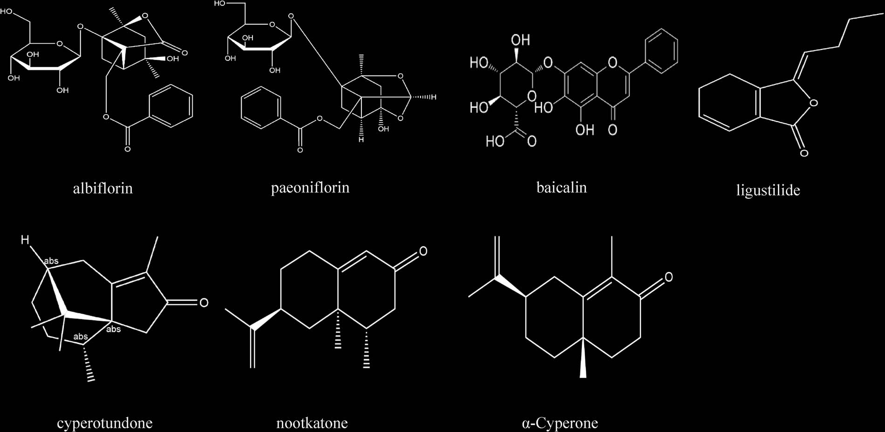
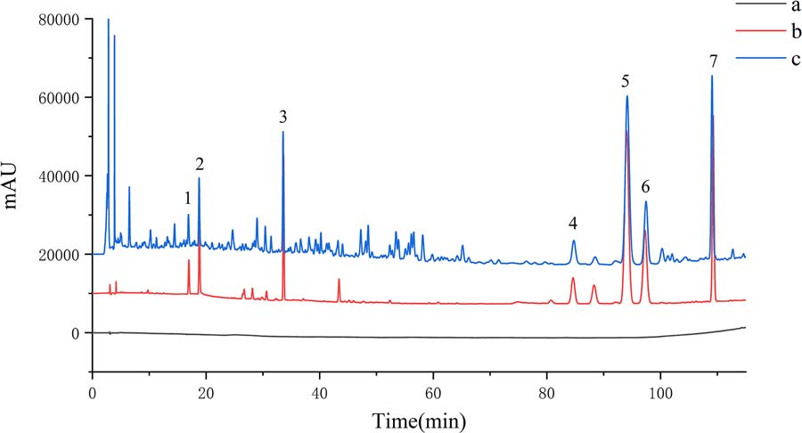
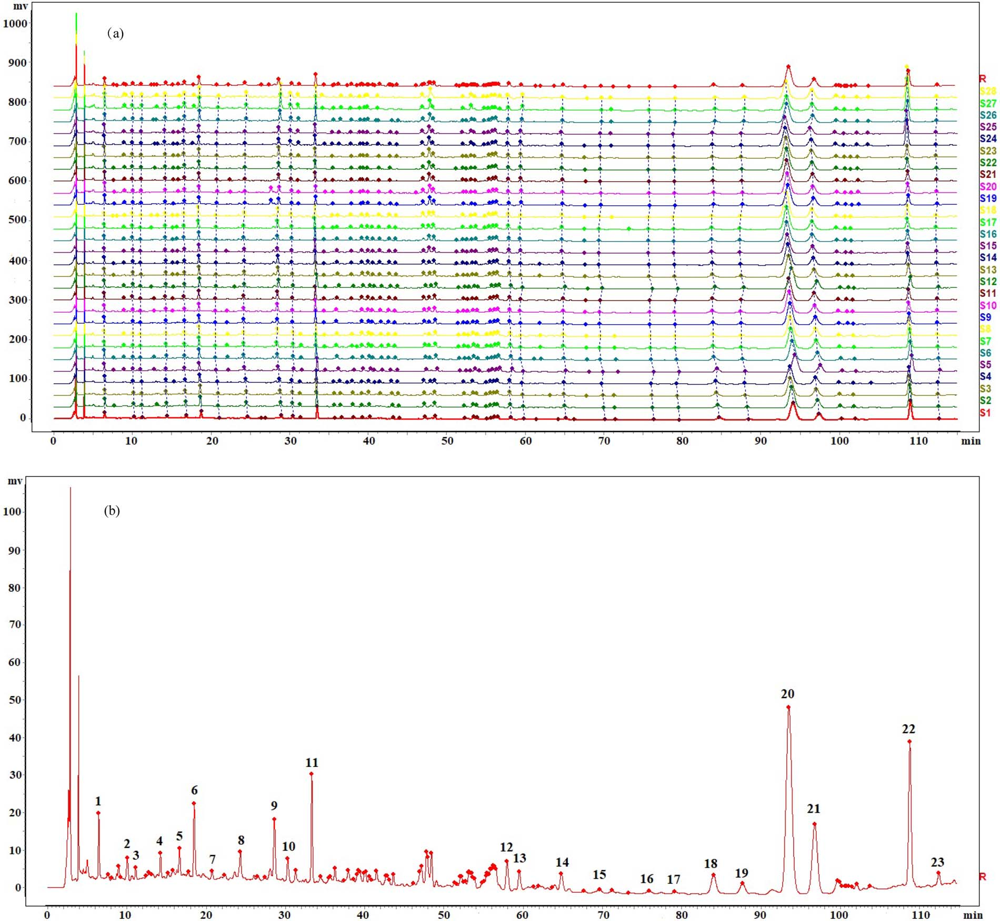
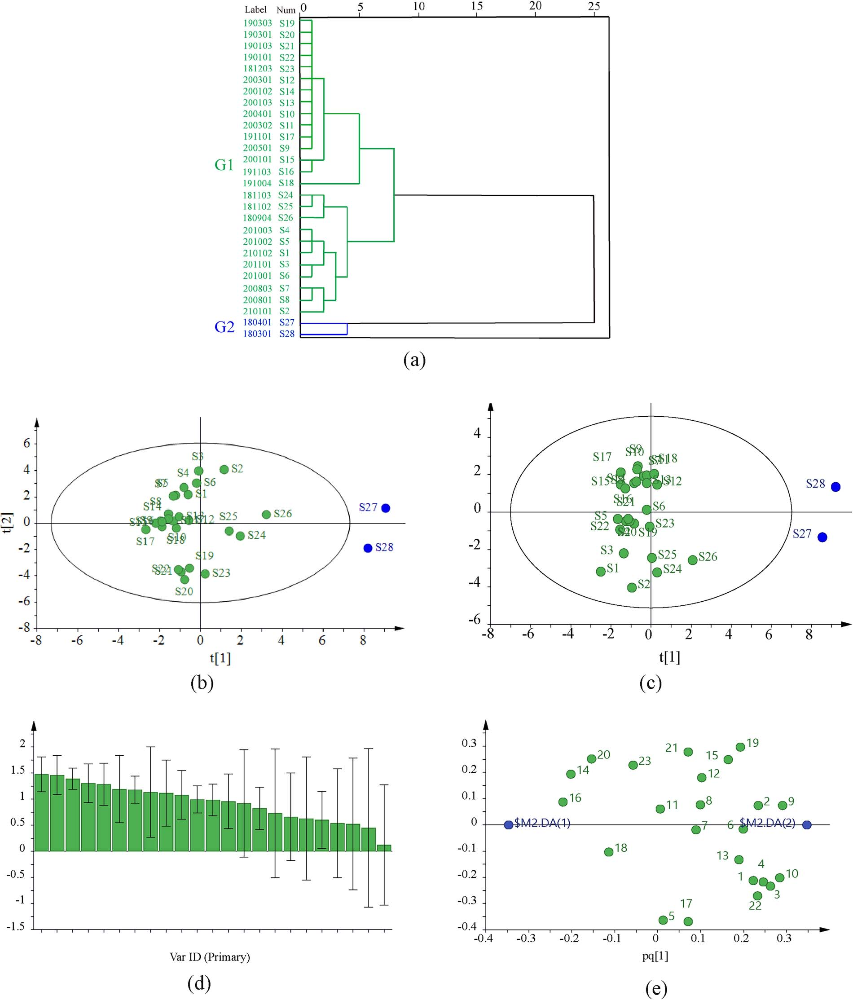

<!-- 方針: ほぼ全訳＋必要に応じた補足。原文構成に沿って訳出。「> 補足:」は訳者注。数式はKaTeXで表示。 -->

## 書誌情報

- 原題: New Quality Evaluation of Qizhi Xiangfu Pills Based on Fingerprint with Chemometric Analysis and Quantitative Analysis of Multi-Components by Single Marker
- 著者: Xiaoli Xu, Lin Yang, Dezhang Zhao, Yiwu Wang, Lei Dai, Shuya Li, Dan He（責任著者）（重慶医科大学薬学院ほか, 中国）
- 掲載: *Journal of Chromatographic Science* 2024, 62(9), 854–863. https://doi.org/10.1093/chromsci/bmae005
- インパクトファクター: **1.3**（*J. Chromatogr. Sci.*, JCR 2024 / Clarivate）

> 補足: 七制香附丸（Qizhi Xiangfu Pills, QZXFPs）は香附子・地黄・当帰・白芍・黄芩など22生薬からなる中成薬で、気滞血瘀・血虚による月経困難症・月経過少・無月経に用いられる。中国薬典2020年版ではペオニフロリン1成分のみが定量指標。本研究は指紋＋QAMSで多成分評価に拡張した。

## 概要 (Abstract)
七制香附丸(QZXFPs)は、月経困難症の治療に最も一般的に使用される中成薬（中薬製剤）の一つであるが、既存の品質評価基準には一定の欠点や不十分な点が存在する。安全な薬物治療において、効果的かつ科学的な品質評価方法の確立は極めて重要な役割を果たす。本研究では、七制香附丸(QZXFPs)の品質を包括的に評価するため、HPLC指紋図譜（フィンガープリント）にケモメトリクス分析および一マーカー多成分定量（QAMS）法を組み合わせた手法を用いた。28バッチのサンプルの指紋図譜を確立し、23個の共通ピークを識別した。そのうち7個のピークを、アルビフロリン(albiflorin)、ペオニフロリン(paeoniflorin)、バイカリン(baicalin)、リグスチリド(ligustilide)、シペロツンドン(cyperotundone)、ヌートカトン(nootkatone)、および$\alpha$-シペロン($\alpha$-cyperone)と同定した。これら7つの活性成分の含有量をQAMS法によって同時に定量したところ、QAMS法と外部標準法（ESM）の間に有意な差は認められなかった。さらに、類似度分析（SA）、階層的クラスター分析（HCA）、主成分分析（PCA）、および直交部分最小二乗判別分析（OPLS-DA）を適用して28バッチのサンプルを分類し、バッチ間の品質差異をもたらす主な要因である成分を探索した。結論として、確立された方法は異なるバッチ間の品質の一貫性を包括的に評価することができ、七制香附丸(QZXFPs)の安全かつ効果的な臨床応用を保証するための製剤品質評価の参考資料を提供できる。

---

## 1. はじめに (Introduction)
七制香附丸(QZXFPs)は、香附子（Cyperi Rhizoma）、地黄（Rehmanniae Radix）、当帰（Angelicae Sinensis Radix）、白芍（Paeoniae Radix Alba）、黄芩（Scutellariae Radix）など22種の生薬を含む中成薬である。これは女性用の代表的な医薬品の一つであり、主に気滞血瘀および血虚によって引き起こされる月経困難症、月経過少、および無月経の治療に用いられている (1)。現代の薬理学的研究により、アルビフロリン(albiflorin)、ペオニフロリン(paeoniflorin)、バイカリン(baicalin)、リグスチリド(ligustilide)、シペロツンドン(cyperotundone)、ヌートカトン(nootkatone)、および$\alpha$-シペロン($\alpha$-cyperone)が強い薬理活性を有することが示されている。シペロツンドン(cyperotundone)は強い鎮痛効果を有し (2)、ペオニフロリン(paeoniflorin)とアルビフロリン(albiflorin)は補血効果を有する (3)。また、ペオニフロリン(paeoniflorin) (4) およびヌートカトン(nootkatone) (5) は神経保護作用、$\alpha$-シペロン($\alpha$-cyperone) (6) とリグスチリド(ligustilide) (7) は抗炎症活性、バイカリン(baicalin) (8) は炎症およびアポトーシス抑制効果を有することが報告されている。これらの化合物は七制香附丸(QZXFPs)の生物学的作用に関連している可能性があり、七制香附丸(QZXFPs)の品質マーカー（Q-markers）として用いることができる。上述の化合物の構造を図1に示す。

中華人民共和国薬典（中国薬典、2020年版）においては、高速液体クロマトグラフィー（HPLC）によって測定されるペオニフロリン(paeoniflorin)の含有量のみが、七制香附丸(QZXFPs)の品質管理指標として採用されている。現在、七制香附丸(QZXFPs)中の活性成分をHPLCによって定量した報告はわずかに存在するのみであり (9–13)、QAMSおよび指紋図譜に関する研究はまだ行われていない。中成薬は複雑な成分を含み、複数の生薬の相乗効果を通じて治療効果を発揮することが多いため、単一成分の定量のみでは七制香附丸(QZXFPs)全体の品質を科学的に評価することは困難である (14, 15)。したがって、七制香附丸(QZXFPs)の品質をより適切に評価し、安全性と有効性を確保するためには、七制香附丸(QZXFPs)の包括的な品質評価研究を行うことが必要である。

指紋図譜は、現代の分析技術と結合して、物質的基盤の観点から生薬や製剤の品質を代表する特徴的な共通ピークを得るものであり、中成薬の固有品質を評価するために使用できる (16)。指紋図譜は、より多くの化学情報を示し、バッチ間の品質の一貫性を分析できるため、漢方薬の品質評価および管理に広く用いられている。ケモメトリクス分析と組み合わせることで、指紋図譜はバッチ間のサンプルの差異を引き起こす主なマーカーをスクリーニングし、品質管理の参考とすることができる (17–20)。一マーカー多成分定量（QAMS）法は、簡便で入手しやすい活性成分を内部標準として用い、他の複数の成分の含有量を同時に計算する方法であり、対照標準品の不足、分離の困難さ、および高コストという現在の課題を解決できる (21, 22)。定性的および定量的分析のために指紋図譜とQAMS法を組み合わせる手法 (23–27) は、シンプルで実施しやすく経済的であるというQAMS法の利点を発揮するだけでなく、全体的かつ包括的な観点から指紋図譜の利点を反映する。これは、中国の生薬および製剤の品質評価において広く応用されている。

本研究では、HPLC法を用いて28バッチの七制香附丸(QZXFPs)の指紋図譜を確立し、化学パターン認識分析を用いてサンプルを分類し、バッチ間の品質差を引き起こす主要なマーカーを探索した。また、QAMS法を実施して、七制香附丸(QZXFPs)中の7つの生物活性成分の含有量を同時に測定した。本研究は、定性および定量分析に指紋図譜とQAMS法を組み合わせることで、七制香附丸(QZXFPs)の品質評価のための包括的、科学的かつ経済的な方法を確立し、七制香附丸(QZXFPs)の品質評価に参考資料を提供した。

---

## 2. 実験 (Experimental)

### 2.1 試料、試薬および材料 (Materials, chemicals and reagents)
本研究で用いた28バッチの七制香附丸(QZXFPs)（バッチ番号: 210102、210101、201101、201003、201002、201001、200803、200801、200501、200401、200302、200301、200103、200102、200101、191103、191101、191004、190303、190301、190103、190101、181203、181103、181102、180904、180401、180301；それぞれS1〜S28と命名）は、河南宛西製薬股份有限公司（中国、河南省）によって製造された。

対照標準品として、アルビフロリン(albiflorin)（ロット番号: DSTDS007102）、バイカリン(baicalin)（ロット番号: DSTDH002301）、ヌートカトン(nootkatone)（ロット番号: DST200601-019）は成都徳思特生物技術有限公司（中国、成都市）から購入した。ペオニフロリン(paeoniflorin)（ロット番号: MUST-21051210）およびリグスチリド(ligustilide)（ロット番号: wkq21012908）は四川維克奇生物技術有限公司（中国、四川省）から入手した。シペロツンドン(cyperotundone)（ロット番号: P16D11S134523）および$\alpha$-シペロン($\alpha$-cyperone)（ロット番号: 110748-202016）は中国食品薬品検定研究院（中国、北京市）から購入した。すべての対照標準品の純度は98%以上であった。

HPLCグレードのメタノールおよびアセトニトリルは成都科竜化工有限公司（中国、成都市）から提供された。分析グレードのメタノールおよびリン酸は重慶川東化工集団有限公司（中国、重慶市）から提供された。脱イオン水はMilli-Q超純水装置（Millipore社、米国マサチューセッツ州ミルフォード）を用いて調製した。

### 2.2 装置およびクロマトグラフィー条件 (Instruments and chromatographic conditions)
七制香附丸(QZXFPs)中の成分分析には、島津製作所製LC-20AT HPLCシステム（日本、京都）およびWaters製e2695 HPLCシステム（米国マサチューセッツ州ミルフォード）を用いた。分離用カラムとして、InertSustain C18（4.6 mm × 250 mm, 5 μm）、Thermo Hypersil GOLD C18（4.6 mm × 250 mm, 5 μm）、およびAgilent 5 TC-C18（4.6 mm × 250 mm, 5 μm）を比較検討した。移動相は0.2%リン酸水溶液（A）とアセトニトリル（C）で構成された。グラジエント溶出プログラムは以下の通りとした：0–50分、10–43% (C)；50–90分、43–45% (C)；90–115 min、45–70% (C)。検出波長は240 nmに設定し、カラム温度は30℃とした。注入量は10 μL、流速は1.0 mL/minとした。

### 2.3 標準溶液および試料溶液の調製 (Preparation of the standard and sample solutions)
7種の対照標準品を精密に秤量し、メタノールに溶解して、アルビフロリン(albiflorin) 120.6 μg/mL、ペオニフロリン(paeoniflorin) 196.8 μg/mL、バイカリン(baicalin) 254.4 μg/mL、リグスチリド(ligustilide) 2992 μg/mL、シペロツンドン(cyperotundone) 676.3 μg/mL、ヌートカトン(nootkatone) 201.6 μg/mL、および$\alpha$-シペロン($\alpha$-cyperone) 289.8 μg/mLを含む混合標準液を調製した。この混合標準液をそれぞれメタノールで希釈し、一連の段階希釈標準溶液を得た。

28バッチの七制香附丸(QZXFPs)サンプルを粉砕して細かい粉末とした。粉末2.0 gを精密に秤量し、50-mLの三角フラスコに入れ、メタノール20 mLを加えた。30分間超音波抽出を行った後、室温まで冷却し、揮散した重量をメタノールで補った。すべての試料溶液は、使用前に0.22-μmのフィルターメンブレンを用いてろ過した。

### 2.4 データ分析 (Data analysis)
「中薬クロマトグラフィー指紋図譜超類似度評価システム」（バージョン2012A）を用いて指紋図譜を確立し、28バッチの七制香附丸(QZXFPs)サンプル間の類似度を分析した。階層的クラスター分析（HCA）にはSPSS 23.0統計ソフトウェアを適用した。主成分分析（PCA）および直交部分最小二乗判別分析（OPLS-DA）にはSIMCA 14.1ソフトウェアを使用した。

---

## 3. 結果 (Results)

### 3.1 方法の妥当性確認 (Method validation)

#### 3.1.1 システム適合性および特異性の検討 (Investigation of system applicability and specificity)
セクション2.2で最適化された測定条件に従い、ブランク溶液、混合標準溶液、および試料溶液をそれぞれ測定した。クロマトグラムを図2に示す。目的物質の各ピークは、分離度が1.5以上と良好に分離されており、理論段数はすべて5000以上であった。対称係数は分析要件に適合していた。確立された方法は、満足のいくシステム適合性と特異性を有していることが示された。

#### 3.1.2 直線性 (Linearity)
一連の混合標準溶液をそれぞれ測定した。各ピーク面積（$Y$）を縦軸とし、7種の標準溶液の濃度（$X$）を横軸として検量線を作成した。S/N比＝3およびS/N比＝10を基準として、検出限界（LOD）および定量限界（LOQ）をそれぞれ決定した。その結果、一連のグラジエント濃度の相関係数（$r$）は0.9997以上であり、良好な直線関係が得られた（表I）。

**表I. 7成分の回帰方程式、LODおよびLOQ**
| 分析物 | 回帰方程式 | 相関係数 ($r$) | 線形範囲 ($\mu\text{g/mL}$) | 検出限界 (LOD, $\text{ng/mL}$) | 定量限界 (LOQ, $\text{ng/mL}$) |
| :--- | :--- | :--- | :--- | :--- | :--- |
| アルビフロリン (Albiflorin) | $Y = 7957.8X + 4195.8$ | 0.9998 | 2.412–24.12 | 0.35 | 1.2 |
| ペオニフロリン (Paeoniflorin) | $Y = 11,321X + 12,808$ | 0.9999 | 3.936–39.36 | 0.26 | 0.86 |
| バイカリン (Baicalin) | $Y = 15,080X + 21,491$ | 0.9998 | 5.088–50.88 | 0.18 | 0.59 |
| リグスチリド (Ligustilide) | $Y = 891.74X + 12,500$ | 0.9999 | 59.84–598.4 | 11 | 39 |
| シペロツンドン (Cyperotundone) | $Y = 30,481X + 129,256$ | 0.9999 | 13.53–135.3 | 0.38 | 1.3 |
| ヌートカトン (Nootkatone) | $Y = 41,435X + 49,052$ | 0.9999 | 4.032–40.32 | 0.26 | 0.88 |
| $\alpha$-シペロン ($\alpha$-Cyperone) | $Y = 33,737X + 63,128$ | 0.9999 | 5.796–57.96 | 0.15 | 0.50 |

#### 3.1.3 精密さ、安定性、再現性および回収率 (Precision, stability, repeatability and accuracy)
開発したHPLC法の実行可能性を検証するため、分析方法のバリデーション実験を行った。精密さは、混合標準溶液を連続6回注入分析して評価した。試料溶液（S1）を室温で0、2、4、8、12、および24時間静置し、それぞれ測定することで安定性を検討した。再現性は、6つの併行試料溶液（S1）を調製して測定することにより評価した。正確さは、試料（S1）に対して各標準溶液を1:0.8、1:1、1:1.2の濃度比でそれぞれ添加する回収率試験によって試験した。7つの成分の回収率は98.16%から101.0%の範囲にあり、相対標準偏差（RSD）は2%未満であった。以上の実験結果から、このHPLC法は七制香附丸(QZXFPs)の定量分析において信頼性が高いことが示された（表II）。

**表II. 7成分測定における精密さ、安定性、再現性および回収率のRSD ($n=6$)**
| 分析物 | 精密さ RSD (%) | 安定性 RSD (%) | 再現性 RSD (%) | 回収率 平均 (%) | 回収率 RSD (%) |
| :--- | :---: | :---: | :---: | :---: | :---: |
| アルビフロリン (Albiflorin) | 1.09 | 1.85 | 1.77 | 101.0 | 1.21 |
| ペオニフロリン (Paeoniflorin) | 0.55 | 1.00 | 1.34 | 100.2 | 0.56 |
| バイカリン (Baicalin) | 0.69 | 1.93 | 0.99 | 99.03 | 0.32 |
| リグスチリド (Ligustilide) | 0.66 | 1.63 | 1.11 | 100.5 | 1.05 |
| シペロツンドン (Cyperotundone) | 0.68 | 1.25 | 0.68 | 100.0 | 0.21 |
| ヌートカトン (Nootkatone) | 0.73 | 1.04 | 0.42 | 98.16 | 0.89 |
| $\alpha$-シペロン ($\alpha$-Cyperone) | 0.66 | 0.66 | 0.36 | 99.62 | 0.76 |

### 3.2 HPLC指紋図譜の確立と分析 (Establishment and analysis of HPLC fingerprint)
28バッチの七制香附丸(QZXFPs)試料溶液をセクション2.3に従って調製し、セクション2.2の測定条件で分析した。その後、「中薬クロマトグラフィー指紋図譜超類似度評価システム」（バージョン2012A）ソフトウェアを用いて、28バッチの七制香附丸(QZXFPs)の指紋図譜を処理した。HPLC指紋図譜および参照指紋図譜（R）を生成し（図3a）、計23個の共通ピークを識別した。そのうち、ピーク5、6、11、18、20、21、および22がそれぞれ、アルビフロリン(albiflorin)、ペオニフロリン(paeoniflorin)、バイカリン(baicalin)、リグスチリド(ligustilide)、シペロツンドン(cyperotundone)、ヌートカトン(nootkatone)、および$\alpha$-シペロン($\alpha$-cyperone)と同定された（図3b）。

#### 3.2.1 類似度分析 (Similarity analysis)
HPLC指紋図譜の確立に基づき、28バッチの七制香附丸(QZXFPs)サンプル間の類似度を分析した。S1サンプルを参照クロマトグラムとして選択し、サンプル間の類似度を算出した。その結果、各共通ピークの保持時間のRSDはすべて1%未満であったが、ピーク面積のRSDには大きな差が見られた。28バッチのサンプル間の類似度は0.916から1の範囲にあった（表III）。これは類似度が要件を満たしており、各サンプル中の化学成分が基本的に一致していることを示しているが、成分の含有量はバッチ間で大きく異なっていた。七制香附丸(QZXFPs)の固有品質をより正確に分析するため、28バッチのサンプルにおける一貫性と変動を評価するためにケモメトリクス分析を実施すべきである。

**表III. 28バッチの七制香附丸(QZXFPs)の類似度分析結果**
| バッチ | 類似度 | バッチ | 類似度 |
| :--- | :---: | :--- | :---: |
| S1 | 1.000 | S15 | 0.964 |
| S2 | 0.997 | S16 | 0.962 |
| S3 | 0.994 | S17 | 0.962 |
| S4 | 0.990 | S18 | 0.959 |
| S5 | 0.991 | S19 | 0.959 |
| S6 | 0.993 | S20 | 0.958 |
| S7 | 0.991 | S21 | 0.958 |
| S8 | 0.988 | S22 | 0.958 |
| S9 | 0.965 | S23 | 0.960 |
| S10 | 0.964 | S24 | 0.975 |
| S11 | 0.966 | S25 | 0.978 |
| S12 | 0.973 | S26 | 0.977 |
| S13 | 0.969 | S27 | 0.916 |
| S14 | 0.968 | S28 | 0.943 |

#### 3.2.2 階層的クラスター分析 (Hierarchical cluster analysis: HCA)
HCAは、サンプルの類似度を利用する多変量解析の実用的な手法である。多次元空間において、類似するサンプル間の距離は小さく、非類似のサンプル間の距離は大きくなることで、分類の目的を達成する。28バッチの七制香附丸(QZXFPs)における23個の共通ピークのピーク面積を変数として用い、SPSS 23.0データ分析ソフトウェアにインポートした。群間連結法およびユークリッド距離を選択してHCAを実行し、七制香附丸(QZXFPs)の類似性と差異を評価した（図4a）。分類距離が5のとき、28バッチの七制香附丸(QZXFPs)サンプルは2つのクラスターに分割された。S27とS28が1つのクラスターに分類され、残りのサンプルは別のクラスターに分類された。S27およびS28のバッチを除き、残りの26バッチの一貫性は良好であり、七制香附丸(QZXFPs)の品質は概ね一貫しており類似していることが示された。これら2つのクラスター間の差異は、生薬原料の産地や製造時期の違いに起因している可能性がある。

#### 3.2.3 主成分分析 (Principal component analysis: PCA)
PCAは非監視型のパターン認識手法である。次元削減の考え方に基づき、データマトリクスを簡略化して次元数を減らすことで、複数の指標を元の情報の大部分を含むいくつかの独立した総合指標（主成分）へと変換する。同時に、元の変数と密接に関連するいくつかの主成分を見つけ出し、主要な化学情報の抽出を容易にする (28)。28バッチのサンプルにおける23個の共通ピークのピーク面積をSIMCA 14.1ソフトウェアにインポートしてPCAを実行した（図4b）。S1〜S26のプロットはすべて楕円（95%信頼限界）の内部に分布しており、化学組成が類似していることを示していた。一方、S27およびS28は楕円の外側に分布しており、化学組成に大きな違いがあることが示された。この結果は、S27とS28が同一グループに分類され、残りが別のグループに集まるという、HCAの結果と一致していた。

#### 3.2.4 直交部分最小二乗判別分析 (Orthogonal partial least squares discriminant analysis: OPLS-DA)
サンプル群間のばらつきをより明確に説明し、群間の差異に大きく貢献している共通ピークを見つけ出すため、HCAおよびPCAの結果に基づいて、2つのサンプル群のデータに対して監視型のOPLS-DAパターン認識分析を適用した。28バッチのサンプルの23個の共通ピークのピーク面積をSIMCA 14.1ソフトウェアにインポートしてOPLS-DA分析を行った。モデル評価の3つの重要なパラメータ、すなわちスコア散布図（図4c）、変数重要度（VIP）プロット（図4d）、およびローディング散布図（図4e）をそれぞれ得た。

その結果、モデルパラメータは $R^2X = 0.468$、$R^2Y = 0.894$、および $Q^2 = 0.742$ であり、このモデルが七制香附丸(QZXFPs)のHPLC指紋図譜のパターン認識手法として適していることが示された。図4cに示すように、S1〜S26バッチは95%信頼区間内に収まっており、このメーカーが製造した七制香附丸(QZXFPs)の品質が安定している傾向にあり、化学組成が類似していることが示唆された。一方で、S27およびS28は95%信頼区間の外側に分布しており、サンプルの品質に一定の変動があることが示された。図4dに示すように、異なるバッチの七制香附丸(QZXFPs)の組成に差異をもたらす主要なマーカー成分がスクリーニングされた。VIP値が1より大きく、エラーバーの範囲がゼロより大きい（$X > 0$）成分を、寄与度の大きい成分として選択した。これにより、VIP値 > 1かつエラーバーが $X > 0$ であるスクリーニング基準に基づき、10個の化合物が寄与の大きい成分として同定され、その影響の大きさは高い順に、ピーク10、ピーク9、ピーク3、ピーク4、ピーク22（$\alpha$-シペロン）、ピーク1、ピーク2、ピーク19、ピーク16、およびピーク14であった。図4eに示すように、原点から離れるほどウェイト値が大きくなり、その成分の変動がサンプルのバッチの識別に大きな影響を及ぼしていることを表している。したがって、これら10個の化学成分の変数は原点から離れており、これらの成分がバッチ間の組成の差異を引き起こす主要な化合物であることを示している。

### 3.3 一マーカー多成分定量（QAMS）法 (QAMS)

#### 3.3.1 相対補正係数の算出 (Calculation of relative correction factors)
バイカリン(baicalin)は、安定で、安価かつ容易に入手可能であり、かつ隣接するピークと良好に分離されているため、内部参照物質として選択された。相対補正係数（RCF, $f_{si}$）は式(1)を用いて算出され、測定対象成分の含有量は式(2)を用いて以下のように算出された：

$$f_{si} = \frac{f_s}{f_i} = \frac{A_s \times C_i}{A_i \times C_s} \tag{1}$$

$$C_i = f_{si} \times C_s \times \frac{A_i}{A_s} \tag{2}$$

ここで、$f_{si}$ は測定対象成分のRCFである。$A_s$ および $C_s$ はそれぞれ内部参照物質（バイカリン）のピーク面積および濃度を表す。$A_i$ および $C_i$ はそれぞれ、その他の測定対象成分のピーク面積および濃度を表す。

異なる濃度の混合標準溶液シリーズ（番号1〜7）をセクション2.2の測定条件に従って分析した。その後、バイカリン（c）を内部参照物質とし、アルビフロリン(albiflorin)（a）、ペオニフロリン(paeoniflorin)（b）、リグスチリド(ligustilide)（d）、シペロツンドン(cyperotundone)（e）、ヌートカトン(nootkatone)（f）、および$\alpha$-シペロン($\alpha$-cyperone)（g）のRCFをそれぞれ算出した（表IV）。その結果、すべてのRCFのRSDは2%未満であり、分析実験の要件を満たしていた。

**表IV. RCF測定結果 ($n=3$)**
| 標準溶液 | アルビフロリン (a) | ペオニフロリン (b) | リグスチリド (d) | シペロツンドン (e) | ヌートカトン (f) | $\alpha$-シペロン (g) |
| :--- | :---: | :---: | :---: | :---: | :---: | :---: |
| I | 0.5212 | 0.7674 | 0.0564 | 2.0722 | 2.7786 | 2.3168 |
| II | 0.5093 | 0.7433 | 0.0581 | 2.0430 | 2.7536 | 2.2665 |
| III | 0.5196 | 0.7568 | 0.0590 | 2.0489 | 2.7719 | 2.2733 |
| IV | 0.5173 | 0.7472 | 0.0584 | 2.0261 | 2.7446 | 2.2451 |
| V | 0.5242 | 0.7531 | 0.0588 | 2.0299 | 2.7523 | 2.2492 |
| VI | 0.5262 | 0.7513 | 0.0589 | 2.0281 | 2.7524 | 2.2472 |
| 平均 | 0.5196 | 0.7532 | 0.0583 | 2.0414 | 2.7589 | 2.2663 |
| RSD (%) | 1.05 | 1.11 | 1.70 | 0.86 | 0.48 | 1.20 |

> 補足: 表中の標準溶液のI〜VIは段階希釈系列に対応する。

#### 3.3.2 相対補正係数の頑健性の検証 (Durability investigation of RCFs)
RCFの安定性を検討するため、異なる装置、カラム温度、クロマトグラフィーカラム、および流速の条件下において、バイカリンを内部参照物質として6成分のRCFをそれぞれ測定した（表V）。その結果、すべてのRCFのRSDは5%未満であり、RCFが良好な頑健性を有することが示された。

**表V. 異なる条件下におけるRCFの測定結果 ($n=3$)**
| 条件 | アルビフロリン (a) | ペオニフロリン (b) | リグスチリド (d) | シペロツンドン (e) | ヌートカトン (f) | $\alpha$-シペロン (g) |
| :--- | :---: | :---: | :---: | :---: | :---: | :---: |
| **装置およびカラム** | | | | | | |
| Shimadzu LC-20AT | | | | | | |
| - InertSustain C18 | 0.5274 | 0.7655 | 0.0591 | 2.0519 | 2.7731 | 2.2885 |
| - Thermo GOLD C18 | 0.5765 | 0.7651 | 0.0602 | 2.0573 | 2.8371 | 2.1290 |
| - Agilent 5 TC-C18 | 0.5686 | 0.7774 | 0.0609 | 2.0988 | 2.8626 | 2.3023 |
| Waters e2695 | | | | | | |
| - InertSustain C18 | 0.5634 | 0.7650 | 0.0569 | 2.0396 | 2.8266 | 2.2616 |
| - Thermo GOLD C18 | 0.5566 | 0.7299 | 0.0599 | 2.0997 | 2.8935 | 2.1225 |
| - Agilent 5 TC-C18 | 0.5543 | 0.7711 | 0.0587 | 2.0563 | 2.8277 | 2.2468 |
| 平均 | 0.5578 | 0.7623 | 0.0593 | 2.0673 | 2.8368 | 2.2251 |
| RSD (%) | 3.04 | 2.18 | 2.38 | 1.24 | 1.42 | 3.57 |
| **カラム温度** | | | | | | |
| 28℃ | 0.5354 | 0.7729 | 0.0594 | 2.0593 | 2.7857 | 2.2943 |
| 30℃ | 0.5361 | 0.7678 | 0.0588 | 2.0503 | 2.7779 | 2.2884 |
| 32℃ | 0.5326 | 0.7691 | 0.0594 | 2.0664 | 2.7968 | 2.2891 |
| 平均 | 0.5347 | 0.7699 | 0.0592 | 2.0587 | 2.7868 | 2.2906 |
| RSD (%) | 0.34 | 0.34 | 0.59 | 0.39 | 0.34 | 0.14 |
| **流速** | | | | | | |
| 0.8 mL/min | 0.5302 | 0.7779 | 0.0589 | 2.1230 | 2.8120 | 2.3432 |
| 1.0 mL/min | 0.5361 | 0.7678 | 0.0588 | 2.0503 | 2.7779 | 2.2884 |
| 1.2 mL/min | 0.5583 | 0.7668 | 0.0594 | 2.0585 | 2.8048 | 2.2525 |
| 平均 | 0.5415 | 0.7708 | 0.0590 | 2.0773 | 2.7982 | 2.2947 |
| RSD (%) | 2.74 | 0.80 | 0.51 | 1.92 | 0.64 | 1.99 |

#### 3.3.3 分析物のクロマトグラフィーピークの位置決定 (Location of the chromatographic peaks of analytes)
標的ピークの確実な位置特定は、QAMS法を適用するための前提条件である。実際の分析においては、バイカリンの保持時間に基づいて、他の6成分の定性・定量分析のための保持時間を決定することができる。したがって、セクション2.2で用いた異なるカラムおよび装置を用いて、アルビフローリン(albiflorin)、ペオニフロリン(paeoniflorin)、リグスチリド(ligustilide)、シペロツンドン(cyperotundone)、ヌートカトン(nootkatone)、および$\alpha$-シペロン($\alpha$-cyperone)の相対保持時間（RRT）をそれぞれ算出した（表VI）。その結果、異なる装置およびカラムにおける各成分のRRTのRSDは5.0%未満であり、RRTが標的ピークの位置特定に利用可能であることが示された。本研究で開発されたQAMS法は、七制香附丸(QZXFPs)の定量分析に適用可能である。

**表VI. 異なる装置およびカラムで測定された相対保持時間 ($t_R$)**
| 装置 | カラム | 相対保持時間（RRT, $t_R$） | | | | | |
| :--- | :--- | :---: | :---: | :---: | :---: | :---: | :---: |
| | | $t_R(a/c)$ | $t_R(b/c)$ | $t_R(d/c)$ | $t_R(e/c)$ | $t_R(f/c)$ | $t_R(g/c)$ |
| **Shimadzu LC-20AT** | | | | | | | |
| | InertSustain C18 | 0.50 | 0.55 | 2.52 | 2.80 | 2.90 | 3.26 |
| | Thermo GOLD C18 | 0.45 | 0.51 | 2.35 | 2.62 | 2.66 | 3.02 |
| | Agilent 5 TC-C18 | 0.50 | 0.56 | 2.34 | 2.66 | 2.76 | 3.15 |
| **Waters e2695** | | | | | | | |
| | InertSustain C18 | 0.48 | 0.54 | 2.59 | 2.92 | 3.02 | 3.40 |
| | Thermo GOLD C18 | 0.45 | 0.49 | 2.32 | 2.63 | 2.76 | 3.15 |
| | Agilent 5 TC-C18 | 0.49 | 0.54 | 2.42 | 2.78 | 2.89 | 3.30 |
| **平均** | | 0.48 | 0.53 | 2.42 | 2.74 | 2.83 | 3.21 |
| **RSD (%)** | | 4.81 | 4.69 | 4.51 | 4.36 | 4.55 | 4.16 |

> 注: $t_R(a/c) = t_R(a) / t_R(c)$ として定義される（原文では $t_R(a/c) = t_R(a)$ と記載されているが一般的な定義に基づく）。a：アルビフロリン、b：ペオニフロリン、c：バイカリン（基準）、d：リグスチリド、e：シペロツンドン、f：ヌートカトン、g：$\alpha$-シペロン。

#### 3.3.4 QAMS法と外部標準法（ESM）の比較 (Comparison of QAMS method and external standard method)
28バッチの七制香附丸(QZXFPs)サンプル中の分析物含量を、外部標準法（ESM）およびQAMS法によってそれぞれ定量した（表VII）。両手法で得られた結果を相対誤差（RE）によって比較し、QAMS法の妥当性を検証した。その結果、REは5%以下であり、2つの方法で測定された6つの生物活性成分の含有量に明らかな差は認められなかった。このことから、QAMS法は七制香附丸(QZXFPs)の多成分品質評価において正確かつ実行可能であることが示された。

**表VII (1/3). 外部標準法（ESM）とQAMS法による定量結果の比較 (mg/g)（バイカリン、アルビフロリン、ペオニフロリン）**
| バッチ | バイカリン (ESM) | アルビフロリン (ESM) | アルビフロリン (QAMS) | アルビフロリン (RE %) | ペオニフロリン (ESM) | ペオニフロリン (QAMS) | ペオニフロリン (RE %) |
| :--- | :---: | :---: | :---: | :---: | :---: | :---: | :---: |
| S1 | 0.2221 | 0.1082 | 0.1083 | 0.09 | 0.1729 | 0.1725 | -0.21 |
| S2 | 0.2708 | 0.1419 | 0.1419 | 0.07 | 0.2328 | 0.2312 | -0.71 |
| S3 | 0.2795 | 0.1150 | 0.1163 | 1.06 | 0.2236 | 0.2228 | -0.37 |
| S4 | 0.2229 | 0.0786 | 0.0801 | 1.86 | 0.1895 | 0.1881 | -0.72 |
| S5 | 0.2241 | 0.0752 | 0.0769 | 2.18 | 0.1928 | 0.1913 | -0.79 |
| S6 | 0.2462 | 0.0915 | 0.0929 | 1.53 | 0.2240 | 0.2217 | -1.02 |
| S7 | 0.2316 | 0.0896 | 0.0908 | 1.30 | 0.2179 | 0.2152 | -1.23 |
| S8 | 0.2138 | 0.0802 | 0.0814 | 1.47 | 0.1984 | 0.1960 | -1.23 |
| S9 | 0.2232 | 0.0839 | 0.0852 | 1.46 | 0.1875 | 0.1863 | -0.66 |
| S10 | 0.2097 | 0.0802 | 0.0813 | 1.35 | 0.1784 | 0.1770 | -0.75 |
| S11 | 0.2385 | 0.0893 | 0.0906 | 1.49 | 0.2057 | 0.2041 | -0.77 |
| S12 | 0.2448 | 0.0885 | 0.0900 | 1.69 | 0.2110 | 0.2094 | -0.76 |
| S13 | 0.2451 | 0.0859 | 0.0875 | 1.87 | 0.2022 | 0.2011 | -0.53 |
| S14 | 0.2342 | 0.0767 | 0.0784 | 2.32 | 0.1839 | 0.1834 | -0.26 |
| S15 | 0.2183 | 0.0727 | 0.0744 | 2.25 | 0.1649 | 0.1649 | -0.02 |
| S16 | 0.2204 | 0.0820 | 0.0833 | 1.52 | 0.1786 | 0.1778 | -0.45 |
| S17 | 0.1954 | 0.0750 | 0.0760 | 1.31 | 0.1794 | 0.1772 | -1.25 |
| S18 | 0.2077 | 0.0843 | 0.0851 | 0.98 | 0.2237 | 0.2192 | -2.01 |
| S19 | 0.1419 | 0.0839 | 0.0823 | -1.90 | 0.1493 | 0.1455 | -2.56 |
| S20 | 0.1155 | 0.0754 | 0.0729 | -3.28 | 0.1331 | 0.1281 | -3.73 |
| S21 | 0.1455 | 0.0838 | 0.0824 | -1.68 | 0.1560 | 0.1518 | -2.63 |
| S22 | 0.1470 | 0.0869 | 0.0854 | -1.80 | 0.1599 | 0.1556 | -2.71 |
| S23 | 0.1472 | 0.0864 | 0.0849 | -1.75 | 0.1633 | 0.1587 | -2.83 |
| S24 | 0.1643 | 0.0977 | 0.0962 | -1.50 | 0.1760 | 0.1718 | -2.39 |
| S25 | 0.1545 | 0.0866 | 0.0854 | -1.35 | 0.1620 | 0.1582 | -2.37 |
| S26 | 0.2238 | 0.1037 | 0.1041 | 0.33 | 0.2463 | 0.2414 | -1.99 |
| S27 | 0.2234 | 0.1025 | 0.1029 | 0.38 | 0.2671 | 0.2609 | -2.34 |
| S28 | 0.1958 | 0.0765 | 0.0774 | 1.19 | 0.2359 | 0.2297 | -2.64 |

**表VII (2/3). 外部標準法（ESM）とQAMS法による定量結果の比較 (mg/g)（リグスチリド、シペロツンドン）**
| バッチ | リグスチリド (ESM) | リグスチリド (QAMS) | リグスチリド (RE %) | シペロツンドン (ESM) | シペロツンドン (QAMS) | シペロツンドン (RE %) |
| :--- | :---: | :---: | :---: | :---: | :---: | :---: |
| S1 | 2.8785 | 2.8773 | -0.04 | 0.6707 | 0.6635 | -1.07 |
| S2 | 3.7736 | 3.7713 | -0.06 | 0.8216 | 0.8127 | -1.08 |
| S3 | 3.7224 | 3.7277 | 0.14 | 0.7136 | 0.7123 | -0.19 |
| S4 | 4.0049 | 3.9518 | -1.33 | 0.6852 | 0.6771 | -1.18 |
| S5 | 4.0714 | 4.0164 | -1.35 | 0.6836 | 0.6758 | -1.13 |
| S6 | 4.0478 | 4.0155 | -0.80 | 0.7587 | 0.7498 | -1.17 |
| S7 | 2.5723 | 2.5918 | 0.76 | 0.7909 | 0.7773 | -1.72 |
| S8 | 2.3224 | 2.3417 | 0.83 | 0.7801 | 0.7635 | -2.13 |
| S9 | 2.0795 | 2.1163 | 1.77 | 0.8601 | 0.8400 | -2.34 |
| S10 | 1.9931 | 2.0261 | 1.66 | 0.8360 | 0.8144 | -2.58 |
| S11 | 2.1134 | 2.1569 | 2.06 | 0.8826 | 0.8642 | -2.08 |
| S12 | 1.9601 | 2.0131 | 2.71 | 0.8168 | 0.8039 | -1.57 |
| S13 | 2.5253 | 2.5551 | 1.18 | 0.8419 | 0.8275 | -1.71 |
| S14 | 2.6830 | 2.6993 | 0.61 | 0.8147 | 0.8000 | -1.81 |
| S15 | 1.7896 | 1.8375 | 2.67 | 0.7286 | 0.7167 | -1.64 |
| S16 | 1.8271 | 1.8742 | 2.58 | 0.7671 | 0.7528 | -1.86 |
| S17 | 1.7761 | 1.8115 | 2.00 | 0.8779 | 0.8493 | -3.26 |
| S18 | 2.0033 | 2.0345 | 1.56 | 0.9773 | 0.9449 | -3.32 |
| S19 | 1.7302 | 1.7241 | -0.36 | 0.7576 | 0.7199 | -4.98 |
| S20 | 1.5998 | 1.5710 | -1.80 | 0.5196 | 0.4954 | -4.67 |
| S21 | 1.4553 | 1.4739 | 1.28 | 0.7890 | 0.7498 | -4.97 |
| S22 | 1.5298 | 1.5442 | 0.94 | 0.7974 | 0.7581 | -4.94 |
| S23 | 1.6392 | 1.6455 | 0.39 | 0.7970 | 0.7578 | -4.92 |
| S24 | 1.7354 | 1.7505 | 0.87 | 0.7206 | 0.6952 | -3.53 |
| S25 | 1.7320 | 1.7386 | 0.38 | 0.6860 | 0.6603 | -3.74 |
| S26 | 1.4320 | 1.4991 | 4.69 | 0.7296 | 0.7187 | -1.50 |
| S27 | 1.9174 | 1.9619 | 2.32 | 0.5484 | 0.5499 | 0.27 |
| S28 | 1.2730 | 1.3361 | 4.96 | 0.6686 | 0.6562 | -1.85 |

**表VII (3/3). 外部標準法（ESM）とQAMS法による定量結果の比較 (mg/g)（ヌートカトン、$\alpha$-シペロン）**
| バッチ | ヌートカトン (ESM) | ヌートカトン (QAMS) | ヌートカトン (RE %) | $\alpha$-シペロン (ESM) | $\alpha$-シペロン (QAMS) | $\alpha$-シペロン (RE %) |
| :--- | :---: | :---: | :---: | :---: | :---: | :---: |
| S1 | 0.1562 | 0.1573 | 0.68 | 0.2931 | 0.2893 | -1.31 |
| S2 | 0.1881 | 0.1892 | 0.57 | 0.3553 | 0.3508 | -1.28 |
| S3 | 0.1768 | 0.1788 | 1.10 | 0.3040 | 0.3031 | -0.29 |
| S4 | 0.1738 | 0.1738 | -0.02 | 0.2602 | 0.2588 | -0.54 |
| S5 | 0.1739 | 0.1739 | 0.02 | 0.2523 | 0.2515 | -0.30 |
| S6 | 0.1948 | 0.1945 | -0.13 | 0.2787 | 0.2775 | -0.42 |
| S7 | 0.2071 | 0.2054 | -0.82 | 0.2894 | 0.2865 | -0.99 |
| S8 | 0.1984 | 0.1963 | -1.06 | 0.2744 | 0.2713 | -1.14 |
| S9 | 0.2015 | 0.1997 | -0.88 | 0.1541 | 0.1604 | 4.06 |
| S10 | 0.1922 | 0.1903 | -1.00 | 0.1485 | 0.1545 | 4.09 |
| S11 | 0.2067 | 0.2053 | -0.64 | 0.1653 | 0.1714 | 3.70 |
| S12 | 0.1978 | 0.1973 | -0.25 | 0.1690 | 0.1751 | 3.62 |
| S13 | 0.2065 | 0.2055 | -0.48 | 0.1751 | 0.1808 | 3.26 |
| S14 | 0.1990 | 0.1980 | -0.53 | 0.1723 | 0.1777 | 3.16 |
| S15 | 0.1815 | 0.1807 | -0.41 | 0.1409 | 0.1479 | 4.97 |
| S16 | 0.1925 | 0.1912 | -0.70 | 0.1475 | 0.1541 | 4.48 |
| S17 | 0.2158 | 0.2113 | -2.09 | 0.1594 | 0.1639 | 2.80 |
| S18 | 0.2293 | 0.2247 | -1.99 | 0.1767 | 0.1806 | 2.16 |
| S19 | 0.2078 | 0.1988 | -4.34 | 0.1516 | 0.1528 | 0.78 |
| S20 | 0.1620 | 0.1541 | -4.87 | 0.1531 | 0.1510 | -1.39 |
| S21 | 0.2104 | 0.2016 | -4.19 | 0.1567 | 0.1577 | 0.65 |
| S22 | 0.2153 | 0.2063 | -4.22 | 0.1606 | 0.1614 | 0.47 |
| S23 | 0.2129 | 0.2040 | -4.15 | 0.1798 | 0.1787 | -0.63 |
| S24 | 0.1858 | 0.1812 | -2.52 | 0.4067 | 0.3864 | -4.98 |
| S25 | 0.1760 | 0.1713 | -2.68 | 0.3617 | 0.3438 | -4.94 |
| S26 | 0.1874 | 0.1865 | -0.45 | 0.3334 | 0.3268 | -1.99 |
| S27 | 0.1694 | 0.1696 | 0.17 | 0.5243 | 0.5039 | -3.89 |
| S28 | 0.2417 | 0.2353 | -2.62 | 0.4945 | 0.4722 | -4.50 |

> 注: 相対誤差 $\text{RE (\%)} = \frac{\text{QAMS} - \text{ESM}}{\text{ESM}} \times 100\%$ として算出。

---

## 4. 考察 (Discussion)

### 4.1 抽出条件の最適化 (Optimization of extraction conditions)
七制香附丸(QZXFPs)サンプルの抽出に関して、水蒸気蒸留法と超音波抽出法をそれぞれ検討したところ、超音波抽出法の方がより効果的であることが示された。次いで、7つの成分の含有量を評価指標として、単因子試験により、抽出溶媒（メタノール、エタノール、水）、抽出時間（15、30、45分）および溶媒量（10、20、30 mL）を最適化した。最終的に、試料の抽出溶媒にはメタノール、超音波抽出時間は30分、溶媒量は20 mLと決定した。この条件下において、各成分の抽出はより完全となり、抽出効率が高くなった。

### 4.2 クロマトグラフィー条件の最適化 (Optimization of chromatographic conditions)
本実験では、移動相としてメタノール、アセトニトリル、および異なる濃度のリン酸水溶液を検討した。各ピークの理論段数、分離度、および対称係数に基づいて、アセトニトリル-0.2%リン酸水溶液を移動相システムとして選択した。同様に、カラム温度、流速、および検出波長についてもそれぞれ検討を行った。最終的に、検出波長は240 nm、カラム温度は30℃、流速は1.0 mL/minとした。これらのクロマトグラフィー条件下において、クロマトグラムは対称的なピーク形状、良好な分離、および高いカラム効率を示した。

### 4.3 化学パターン認識と品質管理への意義 (Chemical pattern recognition and significance for quality control)
本研究におけるPCAおよびHCAの結果から、S27とS28が同一グループに分類され、残りのバッチは別のグループにまとめられることが示された。この結果は、大部分のバッチにおける一貫性と類似性が依然として極めて満足のいくものであることを明確に示している。しかしながら、製剤の異なるバッチ間には依然としていくつかの差異が存在した。OPLS-DAにより、七制香附丸(QZXFPs)の異なるバッチ間の組成差異を引き起こす主要な成分がスクリーニングされた。これは主に生薬原料の産地の違いや製造プロセスのばらつきに起因すると考えられ、製造業者が七制香附丸(QZXFPs)を製造する際に生薬原料の品質を管理すべきであることを示唆している。

---

## 5. 結論 (Conclusions)
要約すると、HPLC法により28バッチの七制香附丸(QZXFPs)の指紋図譜を確立し、SA（類似度分析）、HCA、PCA、およびOPLS-DA分析によって分類を行うことで、バッチ間の品質差を引き起こす主要な成分を見出した。また、QAMS法を実施して七制香附丸(QZXFPs)の7つの生物活性成分の含有量を測定し、ESM（外部標準法）と比較した。その結果、2つの方法による測定結果の間に有意な差は認められず、QAMS法が多成分の品質評価において正確かつ実行可能であることが証明された。本研究は、包括的、科学的、信頼性があり、かつ経済的な品質評価方法を確立した。これは七制香附丸(QZXFPs)の品質評価のみならず、他の中成薬の品質評価にとっても参考となるものである。

## 参考文献

> 原論文の参考文献。本文の引用は (N) 形式。各文献はDOIまたはGoogle Scholar検索へのリンク。

1. Wei, B.; Clinical observation on modified Qizhi Xiangfu pill in the treatment of qi stagnation and blood stasis syndrome of ovarian cyst; Guide of China Medicine, (2017); 15(03): 183–184. — [Google Scholarで探す](https://scholar.google.com/scholar?q=Wei%2C%20B.%3B%20Clinical%20observation%20on%20modified%20Qizhi%20Xiangfu%20pill%20in%20the%20treatment%20of%20qi%20stagnation%20and%20blood%20stasis%20syndrome%20of%20ovarian%20cyst%3B%20Guide%20of%20China%20Medicine%2C%20%282017%29%3B%2015%2803%29%3A%20183%E2%80%93184.)
2. Guo, H.L., Dong, N.F., Hu, L.J., Zhao, X.J., Hu, Z.F., Luo, Y.X., et al.; Recognition of main anti-dysmenorrhea effect components in Cyperi Rhizoma based on constituents knock-out strategy; Chinese Journal of Experimental Traditional Medical Formulae, (2017); 23(10): 7–11. — [Google Scholarで探す](https://scholar.google.com/scholar?q=Guo%2C%20H.L.%2C%20Dong%2C%20N.F.%2C%20Hu%2C%20L.J.%2C%20Zhao%2C%20X.J.%2C%20Hu%2C%20Z.F.%2C%20Luo%2C%20Y.X.%2C%20et%20al.%3B%20Recognition%20of%20main%20anti-dysmenorrhea%20effect%20components%20in%20Cyperi%20Rhizoma%20based%20on%20constituents%20knock-out%20strategy%3B%20Chinese%20Jo)
3. Zhang, J.J., Huang, Y.F., Wang, L.L., Li, W., Wang, J.X., Wang, C., et al.; Comparative study on effects of blood enriching on mouse model of blood deficiency syndrome induced by compound method of bleeding, starved feeding and exhausting of Paeoniae Radix Alba and Paeoniae Radix Rubra, paeoniflorin and albiflorin; China Journal of Chinese Materia Medica, (2013); 38(19): 3358–3362. — [Google Scholarで探す](https://scholar.google.com/scholar?q=Zhang%2C%20J.J.%2C%20Huang%2C%20Y.F.%2C%20Wang%2C%20L.L.%2C%20Li%2C%20W.%2C%20Wang%2C%20J.X.%2C%20Wang%2C%20C.%2C%20et%20al.%3B%20Comparative%20study%20on%20effects%20of%20blood%20enriching%20on%20mouse%20model%20of%20blood%20deficiency%20syndrome%20induced%20by%20compound%20method%20of%20bl)
4. Wang, D., Wong, H.K., Feng, Y.B., Zhang, Z.J.; Paeoniflorin, a natural neuroprotective agent, modulates multiple anti-apoptotic and pro-apoptotic pathways in differentiated PC12 cells; Cellular and Molecular Neurobiology, (2013); 33(4): 521–529. https:// doi.org/10.1007/s10571-013-9914-y. — [Google Scholarで探す](https://scholar.google.com/scholar?q=Wang%2C%20D.%2C%20Wong%2C%20H.K.%2C%20Feng%2C%20Y.B.%2C%20Zhang%2C%20Z.J.%3B%20Paeoniflorin%2C%20a%20natural%20neuroprotective%20agent%2C%20modulates%20multiple%20anti-apoptotic%20and%20pro-apoptotic%20pathways%20in%20differentiated%20PC12%20cells%3B%20Cellular%20and%20Mo)
5. Wang, Y., Wang, M., Xu, M., Li, T., Fan, K., Yan, T., et al.; Nootkatone, a neuroprotective agent from Alpiniae Oxyphyllae Fructus, improves cognitive impairment in lipopolysaccharide- induced mouse model of Alzheimer’s disease; International Immunopharmacology, (2018); 62: 77–85. https://doi.o rg/10.1016/j.intimp.2018.06.042. — [Google Scholarで探す](https://scholar.google.com/scholar?q=Wang%2C%20Y.%2C%20Wang%2C%20M.%2C%20Xu%2C%20M.%2C%20Li%2C%20T.%2C%20Fan%2C%20K.%2C%20Yan%2C%20T.%2C%20et%20al.%3B%20Nootkatone%2C%20a%20neuroprotective%20agent%20from%20Alpiniae%20Oxyphyllae%20Fructus%2C%20improves%20cognitive%20impairment%20in%20lipopolysaccharide-%20induced%20mouse%20m)
6. Zhang, H., Li, S., Lu, J., Jin, J., Zhu, G., Wang, L., et al.; α- Cyperone (CYP) down-regulates NF-κB and MAPKs signaling, attenuating inflammation and extracellular matrix degradation in chondrocytes, to ameliorate osteoarthritis in mice; Aging (Albany NY), (2021); 13(13): 17690–17706 — [DOI](https://doi.org/10.18632/aging.203259)
7. Xie, Q., Zhang, L., Xie, L., Zheng, Y., Liu, K., Tang, H., et al.; Z- ligustilide: A review of its pharmacokinetics and pharmacology; Phytotherapy Research, (2020); 34(8): 1966–1991. https://doi.o rg/10.1002/ptr.6662. — [Google Scholarで探す](https://scholar.google.com/scholar?q=Xie%2C%20Q.%2C%20Zhang%2C%20L.%2C%20Xie%2C%20L.%2C%20Zheng%2C%20Y.%2C%20Liu%2C%20K.%2C%20Tang%2C%20H.%2C%20et%20al.%3B%20Z-%20ligustilide%3A%20A%20review%20of%20its%20pharmacokinetics%20and%20pharmacology%3B%20Phytotherapy%20Research%2C%20%282020%29%3B%2034%288%29%3A%201966%E2%80%931991.%20https%3A//doi.o%20rg/)
8. Lin, M., Li, L., Li, L., Pokhrel, G., Qi, G., Rong, R., et al.; The protective effect of baicalin against renal ischemia-reperfusion injury through inhibition of inflammation and apoptosis; BMC Complementary and Alternative Medicine, (2014); 14(1): 1–9 — [DOI](https://doi.org/10.1186/1472-6882-14-19)
9. Wang, X.Y.; Simultaneous determination of three ingredients in Qizhi Xiangfu pills by HPLC; Chinese Journal of Rational Drug Use, (2020); 17(12): 95–98. — [Google Scholarで探す](https://scholar.google.com/scholar?q=Wang%2C%20X.Y.%3B%20Simultaneous%20determination%20of%20three%20ingredients%20in%20Qizhi%20Xiangfu%20pills%20by%20HPLC%3B%20Chinese%20Journal%20of%20Rational%20Drug%20Use%2C%20%282020%29%3B%2017%2812%29%3A%2095%E2%80%9398.)
10. Wang, L.Q., Zhu, L.L.; Determination of α-cyperone in Xiangfu preparations by HPLC; Strait Pharmaceutical Journal, (2020); 32(1): 83–85. — [Google Scholarで探す](https://scholar.google.com/scholar?q=Wang%2C%20L.Q.%2C%20Zhu%2C%20L.L.%3B%20Determination%20of%20%CE%B1-cyperone%20in%20Xiangfu%20preparations%20by%20HPLC%3B%20Strait%20Pharmaceutical%20Journal%2C%20%282020%29%3B%2032%281%29%3A%2083%E2%80%9385.)
11. Lv, X., Gou, Q.X., Li, C.B., Tian, Y.Q., Ding, P.; Content determina- tion of α-cyperone in Qizhi Xiangfu pills by HPLC; China Pharm, (2011); 22(16): 1507–1508. — [Google Scholarで探す](https://scholar.google.com/scholar?q=Lv%2C%20X.%2C%20Gou%2C%20Q.X.%2C%20Li%2C%20C.B.%2C%20Tian%2C%20Y.Q.%2C%20Ding%2C%20P.%3B%20Content%20determina-%20tion%20of%20%CE%B1-cyperone%20in%20Qizhi%20Xiangfu%20pills%20by%20HPLC%3B%20China%20Pharm%2C%20%282011%29%3B%2022%2816%29%3A%201507%E2%80%931508.)
12. Liu, F.; Determination of paeoniflorin and baicalin in Qizhi Xiangfu pills by HPLC; Journal of Pharmacy Research, (2013); 32(8): 449–451. — [Google Scholarで探す](https://scholar.google.com/scholar?q=Liu%2C%20F.%3B%20Determination%20of%20paeoniflorin%20and%20baicalin%20in%20Qizhi%20Xiangfu%20pills%20by%20HPLC%3B%20Journal%20of%20Pharmacy%20Research%2C%20%282013%29%3B%2032%288%29%3A%20449%E2%80%93451.)
13. Jiang, H.Q., Yan, Z.Y.; Simultaneous determination of seven con- stituents in Qizhi Xiangfu wan by HPLC gradient elution method; Modern Chinese Medicine, (2021); 23(1): 141–146. — [Google Scholarで探す](https://scholar.google.com/scholar?q=Jiang%2C%20H.Q.%2C%20Yan%2C%20Z.Y.%3B%20Simultaneous%20determination%20of%20seven%20con-%20stituents%20in%20Qizhi%20Xiangfu%20wan%20by%20HPLC%20gradient%20elution%20method%3B%20Modern%20Chinese%20Medicine%2C%20%282021%29%3B%2023%281%29%3A%20141%E2%80%93146.)
14. Zhang, Q., Han, X.X., Mao, C.Q., Xie, H., Chen, L.H., Mao, J., et al.; Opportunities and challenges in development of compound preparations of traditional Chinese medicine: problems and coun- termeasures in research of ancient classical prescriptions; China Journal of Chinese Materia Medica, (2019); 44(19): 4300–4308 — [DOI](https://doi.org/10.19540/j.cnki.cjcmm.20190630.305)
15. Zhou, X., Seto, S.W., Chang, D., Kiat, H., Razmovski-Naumovski, V., Chan, K., et al.; Synergistic effects of chinese herbal medicine: A comprehensive review of methodology and current research; Fron- tiers in Pharmacology, (2016); 7: 201 — [DOI](https://doi.org/10.3389/fphar.2016.00201)
16. Liu, X., Jiang, W., Su, M., Sun, Y., Liu, H., Nie, L., et al.; Quality evaluation of traditional Chinese medicines based on fingerprint- ing; Journal of Separation Science, (2020); 43(1): 6–17. https:// doi.org/10.1002/jssc.201900365. — [Google Scholarで探す](https://scholar.google.com/scholar?q=Liu%2C%20X.%2C%20Jiang%2C%20W.%2C%20Su%2C%20M.%2C%20Sun%2C%20Y.%2C%20Liu%2C%20H.%2C%20Nie%2C%20L.%2C%20et%20al.%3B%20Quality%20evaluation%20of%20traditional%20Chinese%20medicines%20based%20on%20fingerprint-%20ing%3B%20Journal%20of%20Separation%20Science%2C%20%282020%29%3B%2043%281%29%3A%206%E2%80%9317.%20https%3A)
17. Huang, Y., Wang, T., Yin, G., Wang, J., Jiang, K., Tu, J.; High- performance liquid chromatography-based fingerprint analysis with chemical pattern recognition for evaluation of Mahonia bealei (Fort.) Carr; Journal of Separation Science, (2020); 43(18): 3625–3635 — [DOI](https://doi.org/10.1002/jssc.201901219)
18. Zheng, C., Li, W., Yao, Y., Zhou, Y.; Quality evaluation of Atracty- lodis Macrocephalae Rhizoma based on combinative method of New Quality Evaluation of Qizhi Xiangfu Pills 863 HPLC fingerprint, quantitative analysis of multi-components and chemical pattern recognition analysis; Molecules, (2021); 26(23): 7124 — [DOI](https://doi.org/10.3390/molecules26237124)
19. Cao, X., Sun, L., Li, D., You, G., Wang, M., Ren, X.; Quality eval- uation of Phellodendri Chinensis Cortex by fingerprint chemical pattern recognition; Molecules, (2018); 23(9): 2307. https://doi.o rg/10.3390/molecules23092307. — [Google Scholarで探す](https://scholar.google.com/scholar?q=Cao%2C%20X.%2C%20Sun%2C%20L.%2C%20Li%2C%20D.%2C%20You%2C%20G.%2C%20Wang%2C%20M.%2C%20Ren%2C%20X.%3B%20Quality%20eval-%20uation%20of%20Phellodendri%20Chinensis%20Cortex%20by%20fingerprint%20chemical%20pattern%20recognition%3B%20Molecules%2C%20%282018%29%3B%2023%289%29%3A%202307.%20https%3A//doi.o%20r)
20. Cao, X., You, G., Li, H., Li, D., Wang, M., Ren, X.; Comparative investigation for Rotten Xylem (kuqin) and Strip Types (tiaoqin) of Scutellaria baicalensis Georgi based on fingerprinting and chemical pattern recognition; Molecules, (2019); 24(13): 2431. https://doi.o rg/10.3390/molecules24132431. — [Google Scholarで探す](https://scholar.google.com/scholar?q=Cao%2C%20X.%2C%20You%2C%20G.%2C%20Li%2C%20H.%2C%20Li%2C%20D.%2C%20Wang%2C%20M.%2C%20Ren%2C%20X.%3B%20Comparative%20investigation%20for%20Rotten%20Xylem%20%28kuqin%29%20and%20Strip%20Types%20%28tiaoqin%29%20of%20Scutellaria%20baicalensis%20Georgi%20based%20on%20fingerprinting%20and%20chemical)
21. Zhu, C., Li, X., Zhang, B., Lin, Z.; Quantitative analysis of multi- components by single marker-a rational method for the internal quality of Chinese herbal medicine; Integrative Medicine Research, (2017); 6(1): 1–11 — [DOI](https://doi.org/10.1016/j.imr.2017.01.008)
22. Xu, R., Mao, F., Zhao, Y., Wang, W., Fan, L., Gao, X., et al.; UPLC quantitative analysis of multi-components by single marker and quality evaluation of polygala tenuifolia wild. extracts; Molecules, (2017); 22(12): 2276 — [DOI](https://doi.org/10.3390/molecules22122276)
23. Zhao, C., Cheng, J., Li, C., Li, S., Tian, Y., Wang, T., et al.; Quality evaluation of Acanthopanax senticosus via quantitative analysis of multiple components by single marker and multivariate data analysis; Journal of Pharmaceutical and Biomedical Analysis, (2021); 201: 114090 — [DOI](https://doi.org/10.1016/j.jpba.2021.114090)
24. Wang, Y., Yu, Y., Sun, G., Guo, Y.; Quality evaluation of pow- dered poppy capsule extractive by systematic quantified fin- gerprint method combined with quantitative analysis of multi- components by single marker method; Journal of Pharmaceuti- cal and Biomedical Analysis, (2020); 185: 113247. https://doi.o rg/10.1016/j.jpba.2020.113247. — [Google Scholarで探す](https://scholar.google.com/scholar?q=Wang%2C%20Y.%2C%20Yu%2C%20Y.%2C%20Sun%2C%20G.%2C%20Guo%2C%20Y.%3B%20Quality%20evaluation%20of%20pow-%20dered%20poppy%20capsule%20extractive%20by%20systematic%20quantified%20fin-%20gerprint%20method%20combined%20with%20quantitative%20analysis%20of%20multi-%20components%20by%20)
25. Li, Y., Zhang, Y., Zhang, Z., Hu, Y., Cui, X., Xiong, Y.; Quality evaluation of gastrodia elata tubers based on HPLC fingerprint analyses and quantitative analysis of multi-components by single marker; Molecules, (2019); 24(8): 1521 — [DOI](https://doi.org/10.3390/molecules24081521)
26. Yao, Z., Yu, J., Tang, Z., Liu, H., Ruan, K., Song, Z., et al.; Multi-evaluating strategy for Siji-kangbingdu mixture: Chemical profiling, fingerprint characterization, and quantitative analysis; Molecules, (2019); 24(19): 3545 — [DOI](https://doi.org/10.3390/molecules24193545)
27. Zhang, R.T., Qing, W.W., Yang, L., Zou, J.J., Shi, Y.T., Xu, X.L., et al.; Fingerprint combining with quantitative analysis of multi- components by single marker for quality control of Chenxiang Huaqi tablets; Phytochemical Analysis, (2022); 33(3): 335–343 — [DOI](https://doi.org/10.1002/pca.3090)
28. Xiang, G., Yang, H.Y., Yang, L., Zhang, X., Cao, Q., Miao, M.M.; Multivariate statistical analysis of tobacco of different origin, grade and variety according to polyphenols and organic acids; Micro- chemical Journal, (2010); 95(2): 198–206 — [DOI](https://doi.org/10.1016/j.microc.2009.12.001)
