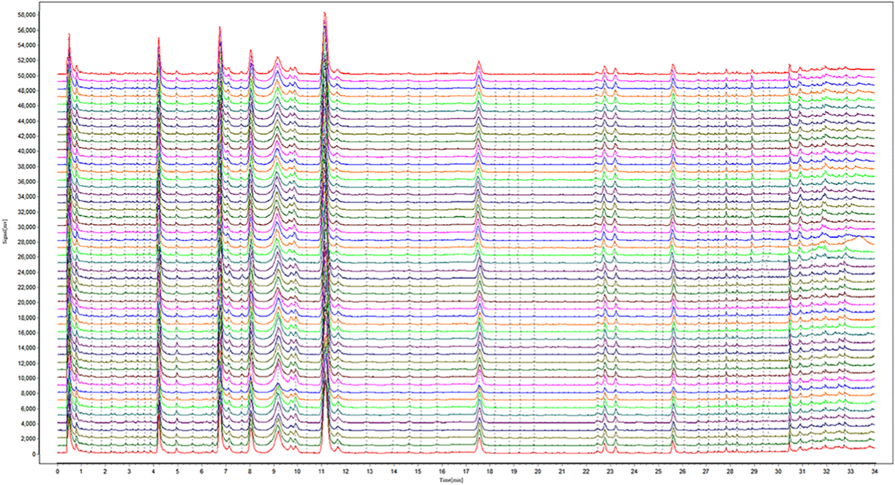
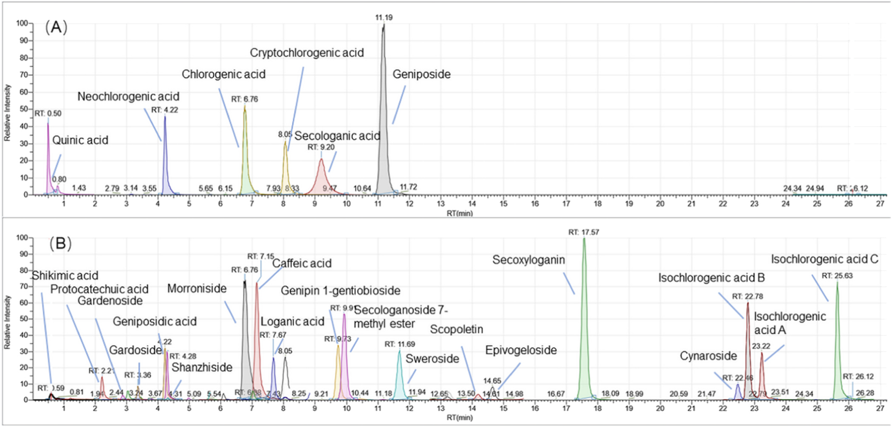
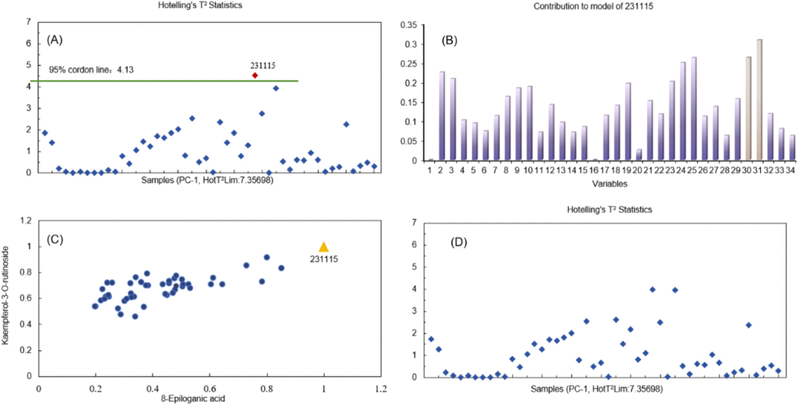
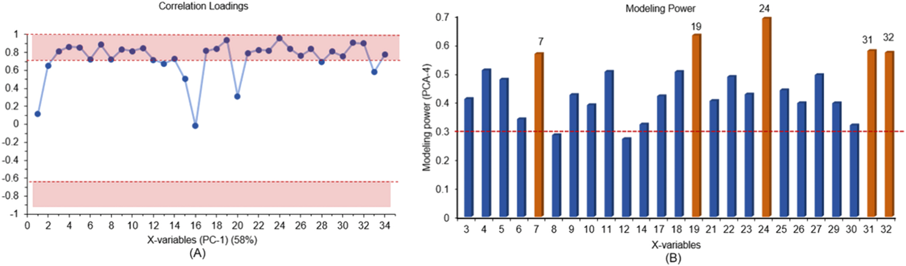
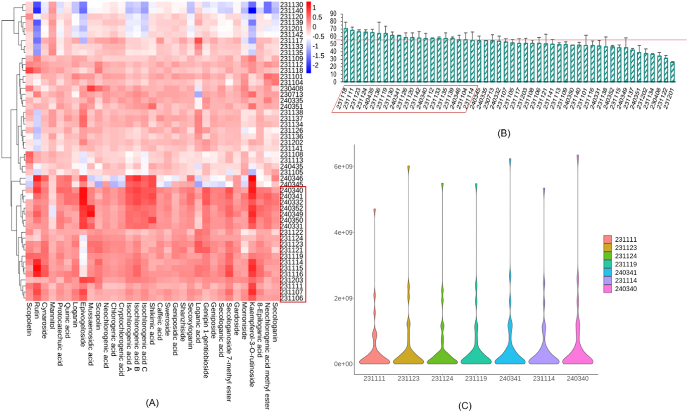
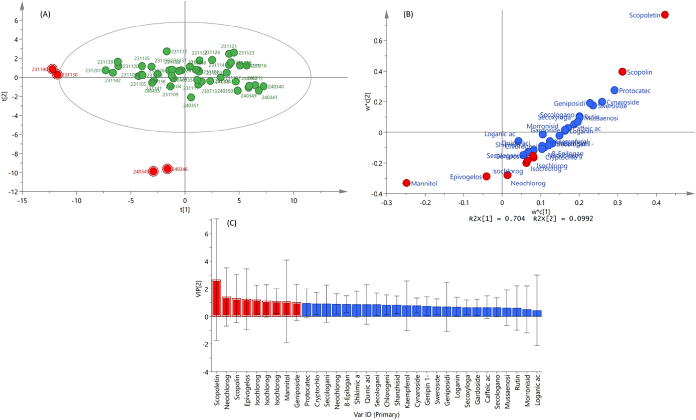

<!-- 方針: ほぼ全訳＋必要に応じた補足。原文構成に沿って訳出。「> 補足:」は訳者注。数式はKaTeXで表示。 -->

## 書誌情報

- 原題: A comprehensive quality evaluation strategy for ReDuNing injection by integrating UPLC-Orbitrap MS/MS profile and biological potency combined with multivariate statistical analysis
- 著者: Mengyu Qian, Liang Cao, Jing Wang, Jingqiu Gu, Guoqing Ren, Rongrong He, Xialin Chen（責任著者）, Zhenzhong Wang, Wei Xiao（江蘇康縁薬業／南京中医薬大学, 中国）
- 掲載: *Journal of Pharmaceutical and Biomedical Analysis*. https://doi.org/10.1016/j.jpba.2024.116407
- インパクトファクター: **3.6**（*J. Pharm. Biomed. Anal.*, JCR 2024 / Clarivate）

> 補足: 熱毒寧注射液（ReDuNing injection, RDN）は**青蒿（Artemisiae Annuae Herba）・金銀花（Lonicerae Japonicae Flos）・山梔子（Gardeniae Fructus）**の3生薬からなる中薬注射剤で、風熱感冒・高熱・上気道感染に用いられる。本研究は化学分析(UPLC-Orbitrap)と生物学的力価(COX-2)を統合した品質評価が主眼。

## 要旨（Abstract）

熱毒寧注射液（ReDuNing injection, RDN）は、臨床で広く使用されている中薬注射剤である。本研究では、UPLC-Orbitrap MS/MSを用いてRDNの定性および定量分析を同時に実施した。RDNにおいて合計118の化合物が同定され、34の化合物が定量された。バリデーションを完了した定量法により、本法の高い感度と効率性が証明され、RDN中の化合物定量に適用された。多変量統計解析手法により、RDNの含量一貫性に影響を与える11の重要変数が選定された。COX-2（シクロオキシゲナーゼ-2）酵素活性アッセイにより、高い生物学的力価を示す20バッチがスクリーニングされた。スペクトル-効果関係（spectrum-effect relationship）解析と多変量統計解析の結果、総合的な品質評価を経て7バッチが高品質バッチとして選抜され、9つの化合物がその選抜における重要な指標であることが示された。フィンガープリント、定性分析、多成分定量を含む本戦略は、RDNの現代的な品質評価に極めて有効に適用可能であり、他の中薬（伝統的中国医学製剤）のさらなる品質管理にとっても価値のあるものである。

---

## 1. イントロダクション（Introduction）

RDN注射液は、青蒿（Artemisiae Annuae Herba [Artemisia carvifolia Buch. - Ham. ex Roxb.]）、金銀花（Lonicerae Japonicae Flos [Lonicera japonica Thunb.]）、および山梔子（Gardeniae Fructus [Gardenia jasminoides Ellis]）から構成されており、多成分かつ多標的（マルチターゲット）という特徴を有している。本製剤は主に、風熱による感冒、高熱、咳嗽、および上気道感染症に使用されている [1]。臨床的には、迅速な解熱作用と顕著な解毒作用を示す。RDNの化学成分は通常、多様な地理的起源、含まれる複数の基原植物種、および異なる前処理方法の影響を受ける [2]。現在、クロロゲン酸（chlorogenic acid）などの有機酸成分や、ゲニポシド酸（geniposidic acid）などのイリドイド配糖体成分を含む、RDNの13成分がHPLCによって品質管理されており、同時に液体クロマトグラフィーフィンガープリントを作成して類似度を計算し、注射液の安定性と均一性を評価している [3]。しかし、中薬の複雑さから、既存の品質規格評価法は、関連規制の段階的に厳しくなる品質管理要求を満たすにはもはや十分ではなく、潜在的な活性成分に焦点を当てた、より包括的な方法が必要とされている。今日まで、中薬の化学的プロファイルを特徴づけるために、UPLC-DAD [4]、液体クロマトグラフィー-質量分析法（UPLC-MS） [5]、ガスクロマトグラフィー-質量分析法（GC-MS） [6]、定量的核磁気共鳴法（QNMR） [7]など、様々な多成分分析技術が採用されてきた。近年、Orbitrapは、その高分解能、高感度、および複雑な系の分析における独自の優位性により、中薬中の化学化合物の迅速同定に不可欠なツールとなっている [8,9]。

現在、中薬の品質規格は主に含量測定に依存しており、これでは効能を総合的に体現することはできない。品質管理のために1つまたは少数のマーカー化合物を採用することは、これらのマーカーが中薬製剤の臨床効果と直接相関しないことや、その総合的な有効性を完全に代表していないことが多いため、不十分であることが頻繁にある [10]。この限界に対処するためには、品質管理プロセスに生物活性アッセイ（生物学的力価試験）を取り入れることが不可欠である。米国食品医薬品局（FDA）は、植物由来製剤の開発に関するガイドラインを発行しており、品質管理における中薬および植物由来薬の生物学的力価測定の重要性を強調している [11]。生物活性アッセイを中薬の品質管理および評価システムに統合することは、中薬の品種や品質の同定と、治療効果の評価の両方を可能にする。このアプローチは、RDNのような複雑な中薬製剤において特に価値がある。なぜなら、従来の物理化学的手法では、その成分含量を包括的に特徴づけたり、完全な生物活性や臨床効果を反映させたりすることに限界があるからである。したがって、中薬の品質管理を強化するために、生物学的力価を組み合わせた迅速かつ包括的な分析法を開発することが必要である。

RDNの品質管理を強化するため、本論文では、UPLC-Orbitrap MS/MSを用いた30分以内の迅速かつ安定した同時定性・定量決定法を開発した。さらに化学成分データベースを構築し、その薬効の物質的基礎の評価と品質管理の向上に向けた基礎を築いた。本方法は、HPLCと比較して、条件の最適化においてより単純で簡便であった。定性的結果に基づいて定量的手法を直接確立することができ、同定される特徴的なピークの数を向上させることができた。明らかに、本方法は定量成分の数を著しく増加させ、中薬中の明確な含量を有する成分のカバー率を向上させた。生物学的力価アッセイの要件に従って、シクロオキシゲナーゼ-2（COX-2）に対する注射液の阻害率を決定することにより、抗炎症力価を予備的に確立した。従来のフィンガープリントによる品質評価法に生物学的力価の手法を統合し、多変量統計解析を通じて品質評価の完全性をさらに高めた。これは、RDNの標準化生産における品質管理向上のための科学的裏付けを提供することが期待される。

---

## 2. 実験方法（Experimental）

### 2.1. 試薬および化学物質（Reagents and chemicals）
RDN 50バッチは、Kanion Pharmaceutical Co., Ltd.（中国）より入手した。LC-MSグレードのアセトニトリルおよびメタノールはMerck社（ドイツ、ダルムシュタット）から、ギ酸はFisher Scientific社（米国、ペンシルベニア州ピッツバーグ）から購入した。

スコポレチン（scopoletin）、ルチン（rutin）、シナロシド（cynaroside）、スコパロン（scoparone）、スコポリン（scopolin）、ケンフェロール-3-O-ルチノシド（kaempferol-3-O-rutinoside）、エスクレチン（esculetin）、ネオクロロゲン酸（neochlorogenic acid）、イソクロロゲン酸C（isochlorogenic acid C）、シキミ酸（shikimic acid）、プロトカテク酸（protocatechuic acid）、キナ酸（quinic acid）、スウェロサイド（sweroside）、セコキシロガニン（secoxyloganin）、モロニシド（morroniside）、ゲニピン-1-ゲンチオビオシド（genipin 1-gentiobioside）、ゲニポシド（geniposide）、シャンジシドメチルエステル（shanzhiside methyl ester）の標準品は、中国食品薬品検定研究院（北京、中国）により製造された。

クロロゲン酸（chlorogenic acid）、クリプトクロロゲン酸（cryptochlorogenic acid）、イソクロロゲン酸A（isochlorogenic acid A）、イソクロロゲン酸B（isochlorogenic acid B）、カフェイン酸メチル（methyl caffeate）、ネオクロロゲン酸メチルエステル（neochlorogenic acid methyl ester）、ゲニポシド酸（geniposidic acid）、ロガニン（loganin）、スウェルチアマリン（swertiamarine）、ガルデノシド（gardenoside）、セコロガノシド-7-メチルエステル（secologanoside 7-methyl ester）、エピボゲロシド（epivogeloside）、ガルドシド（gardoside）、ムセノシド酸（mussaenosidic acid）、3-O-カフェオイルキナ酸メチルエステル（3-O-caffeoylquinic acid methyl ester）、カフェイン酸（caffeic acid）、8-エピロガン酸（8-epiloganic acid）、フェルラ酸（ferulic acid）、マンニトール（mannitol）、シャンジシド（shanzhiside）、ロガン酸（loganic acid）、セコロガニン（secologanin）は、上海源葉生物科技有限公司（上海、中国）より供給された。

シクロオキシゲナーゼ-2（COX-2）阻害剤スクリーニングキットは、碧雲天生物技術（Beyotime Biotechnology、上海、中国）から購入した。

### 2.2. 試料調製（Sample preparation）
RDN注射液を50%メタノールで1:100（v/v）の比率で希釈し、その後、溶液を12000 rpmで10分間遠心分離し、上澄み液を0.22 µmのメンブランフィルターでろ過した。すべての試料溶液は分析前まで4℃で保存した。一方で、混合標準品原液をメタノールまたは水で調製し、その後、混合標準品原液をメタノールで希釈して一連の適切な濃度にした。標準溶液は分析まで4℃で保存した。

### 2.3. UPLC-Orbitrap-MS/MS分析条件（UPLC-Orbitrap-MS/MS analysis conditions）
RDN中の化学成分は、Vanquish HPLCシステム、Orbitrap 120質量分析計、およびESIイオン源（Thermo Fisher Scientific Inc.、米国マサチューセッツ州）から構成されるThermo UPLC-Orbitrap-MS/MSシステムを使用して分析・同定された。

カラムには、ZORBAX Eclipse Plus C18カラム（2.1 × 50 mm, 1.8 µm, Agilent, 米国カリフォルニア州）を使用し、注入量は1 µL、カラム温度は30℃、オートサンプラーは6℃に維持された。移動相は、A（0.1%ギ酸水溶液）とB（メタノール:アセトニトリル = 97:3）で構成された [12]。流速は0.3 mL/minに設定された。線形グラジエント条件は以下の通りとした：
- 0–2分: 4%–10% B
- 2–3分: 10%–13% B
- 3–4分: 13%–14% B
- 4–9分: 14%–16% B
- 9–15分: 16%–22% B
- 15–17分: 22%–24% B
- 17–25分: 24%–38% B
- 25–26.5分: 38%–70% B
- 26.5–30分: 70%–95% B

ESI-MSは、正負両イオン化モードで同時にデータを取得し、キャピラリー電圧は3300 V/2000 V（正/負極性）、シースガス40 arb、補助ガス10 arb、スイープガス1 arb、イオン転送チューブ温度350℃、気化温度（vaporizer temp）400℃に設定した。

MSスキャン条件：フルスキャンモード、分解能60000、スキャン範囲 m/z 100–800、RFレンズ70%、AGC Target標準（standard）モード、ダイナミック排除の強度閾値は5.0e4に設定した。

MS/MSスキャン条件：ターゲット質量（target mass）モードを使用し、分解能15000、フラグメンテーション電圧は10 V、20 V、40 Vに設定した。

### 2.4. COX-2酵素活性（COX-2 enzyme activity）
RDN 1 μLをDMSOを用いて10 mLのメスフラスコに加え、試料を調製した。対照（コントロール）ウェル、100%酵素活性ウェル、陽性阻害剤ウェル、および試料ウェルを設定した。キットの要求に従い、測定用バッファー、Cofactor用働液（振盪したもの）、試料溶液、陽性阻害剤、およびCOX-2用働液（振盪したもの）を各ウェルに加え、37℃で10分間インキュベートした。次に、Probe用働液およびSubstrate用働液を各ウェルに添加した（操作は低温環境下で実施し、振盪した）。試料を37℃で5分間インキュベートし、励起波長560 nm、蛍光波長（発光波長）590 nmで蛍光を直ちに測定した。各試料ウェルおよび対照ウェルの平均蛍光値を計算し、それぞれ $RFU_{\text{control}}$、$RFU_{\text{100\% enzyme activity}}$、$RFU_{\text{positive inhibitor}}$、および $RFU_{\text{sample}}$（RFU：相対蛍光ユニット）として記録した。各試料の阻害率（%）を算出した。計算式は以下の通りである：

$$\text{Inhibition Percentage}\ (\%) = \frac{RFU_{\text{100\% enzyme activity}} - RFU_{\text{sample}}}{RFU_{\text{100\% enzyme activity}} - RFU_{\text{control}}} \times 100\%$$

### 2.5. データ解析（Data analysis）
フィンガープリントの解析には、「中薬色譜指紋図譜相似度評価システム」（国家薬典委員会、2004A）を使用した。すべてのMSデータは、RDNの定性解析のためにCompound Discovery 3.3およびTrace Finder（Thermo Fisher Technologies）で処理され、同時に含量計算のためにXcalibur（Thermo Fisher Technologies）にインポートされた。定量結果は、Hotellingの $T^2$ 統計量および主成分分析（PCA）のために、Unscrambler Xソフトウェア（CAMO、米国）およびSIMCA 14.0ソフトウェア（Umetrics、スウェーデン、ウメオ）にインポートされた。

---

## 3. 結果および考察（Results and discussion）

### 3.1. フィンガープリント解析（Fingerprint analysis）

#### 3.1.1. RDN 50バッチの質量分析フィンガープリント（Mass spectrometry fingerprint of 50 batchs of RDN）
50バッチのRDNのフィンガープリントをテキスト形式に変換し、「中薬色譜指紋図譜相似度評価システム」にインポートして評価した。結果に基づいて、RDNの質量分析フィンガープリントと参照フィンガープリントが得られ、Fig. 1に示された（詳細は原文の図1参照）。

#### 3.1.2. 類似度解析（Similarity analysis (SA)）
上記のRDN参照フィンガープリントに基づき、質量分析フィンガープリントの49の共通ピークが決定された。そして、これらのフィンガープリントの相関係数を計算することにより類似度をマッチングさせ、結果をそれぞれTable S1（詳細は原文の補足資料参照）に示した。見ての通り、50バッチすべてのRDN試料のフィンガープリントは参照フィンガープリントと類似していた。相関係数は0.93から0.99の範囲にあり、これはこれらの試料の高い一貫性と安定性を示していた。

### 3.2. 定性分析（Qualitative analysis）
最適化されたUPLC-Orbitrap MS/MS条件の下で得られた、RDN抽出物の正および負のイオン化モードにおける全イオンクロマトグラム（TIC）をFig. S1（詳細は原文の補足資料参照）に示す。関連する文献やウェブサイトを参照し、化合物の同定および構造解明のために、山梔子（Gardeniae Fructus）、金銀花（Lonicerae Japonicae Flos）、および青蒿（Artemisiae Annuae Herba）を含む中薬質量分析データベースを構築した。RDNから合計118成分が分離・検出され、これには45のイリドイド化合物、16の有機酸、9のフラボノイド、7のリグナン、4のセスキテルペン、3のクマリン、およびその他の化合物が含まれていた（Table S2、詳細は原文の補足資料参照） [13]。これらのうち34成分は、保持時間、正確な分子量、およびMS/MS生成物フラグメントを標準品と比較することにより、明確に同定された。

#### 3.2.1. イリドイド配糖体（Iridoid glycosides）
天然に存在するイリドイド化合物は、糖と結合してイリドイド配糖体を形成していることが多い [14]。RDNに含まれるイリドイド配糖体は、主に金銀花と山梔子に由来する。イリドイド化合物の母核は、5員環とイリドイド環から構成される。C4-CH3は $-CH_2OH$、$-CH_2OR$、$-COOH$、$-COOR$ などに酸化されやすい。C-1位には水酸基やメトキシ基などの多くの置換基が存在する。C-1位の水酸基は主に糖と配糖体を形成し、通常は $\beta\text{-D-}$グルコシドであり、その多くはモノグリコシドである。グルコースのC-6位の水酸基は、もう1分子のグルコースと結合して特殊なジグリコシドを形成する [15,16]。二次フラグメンテーションの断片は主に配糖体（アグリコン等）であり、$CO_2$ や水分子などのフラグメントイオンピークも観察された。

シャンジシド（shanzhiside）の開裂プロセスを例として説明すると、陰イオンモードにおける擬分子イオンピークは $m/z\ 391.1242\ [M-H]^-$ であり、陰イオンモードにおいて $m/z\ 229.0719\ [M-H-C_6H_{10}O_5]^-$、$m/z\ 185.0819\ [M-H-C_6H_{10}O_5-CO_2]^-$、$m/z\ 167.0715\ [M-H-C_6H_{10}O_5-CO_2-H_2O]^-$、$m/z\ 149.0606\ [M-H-C_6H_{10}O_5-CO_2-H_2O-H_2O]^-$ などの $MS^2$ イオンが観察された。まず1分子のグルコース基が脱離し、次に1分子の $CO_2$ が脱離し、その後水分子が連続的に脱離した。標準品の保持時間および二次質量分析と比較して、これはシャンジシドと同定された（Fig. S2A、詳細は原文の補足資料参照）。

#### 3.2.2. 有機酸（Organic acid）
有機酸は、山梔子および金銀花の主要成分の一つである。構造中に水酸基、カルボキシ基、および特徴的な官能基を有するため、質量スペクトルにおいて $CO$、$CO_2$、$-COOH$、水分子を失いやすく、フラグメントイオンピークを生じる [17]。RDN中の有機酸の多くはカフェオイルキナ酸（caffeoylquinic acids）であり、これらはキナ酸と異なる数のカフェイン酸がエステル結合によって形成されたものである [18]。

ネオクロロゲン酸（neochlorogenic acid）の開裂プロセスを例として説明する。ネオクロロゲン酸はカフェイン酸部分とキナ酸部分を失い、$m/z\ 179.0348\ [M-H-C_7H_{10}O_5]^-$ および $m/z\ 191.0560\ [M-H-C_9H_6O_3]^-$ のフラグメントイオンを与え、さらに1分子の水分子を失って $m/z\ 161.0246\ [M-H-C_7H_{10}O_5-H_2O]^-$ および $m/z\ 173.0451\ [M-H-C_9H_6O_3-H_2O]^-$ のフラグメントイオンを与えた。また、$m/z\ 179.0348$ のフラグメントイオンからさらに1分子の $CO_2$ を失ってフラグメントイオン $m/z\ 135.0451\ [M-H-C_7H_{10}O_5-CO_2]^-$ を与えることもある。標準品の保持時間および二次質量分析との比較により、これはネオクロロゲン酸と同定された（Fig. S2B、詳細は原文の補足資料参照）。

#### 3.2.3. クマリン類およびフラボノイド類（Coumarins and flavonoids）
その他の化合物には、主にクマリン化合物やフラボノイドなどが含まれる。このうちクマリン化合物は同一の母核を有しており、開裂プロセスにおいて主に $CO$ や $CH_3$ などの基が脱離する [19]。

スコポレチン（scopoletin）の開裂プロセスを例として説明すると、陽イオンモードにおける擬分子イオンピークは $m/z\ 193.0496\ [M+H]^+$ であった。1分子の $CH_3$、1分子の $CO$、および1分子の $CO_3$ を失うことにより、$m/z\ 178.0260\ [M+H-CH_3]^+$、$m/z\ 165.0550\ [M+H-CO]^+$、および $m/z\ 133.0284\ [M+H-CO_3]^+$ のフラグメントイオンが得られた。標準品の保持時間および二次質量分析と比較することにより、これはスコポレチンと同定された（Fig. S3A、詳細は原文の補足資料参照）。

> 補足: 原文に「one molecule of CO3」とありますが、開裂パターンから想定されるニュートラルロスに関する表記上の誤りの可能性があります。翻訳にあたっては原文に忠実に「1分子のCO3」としています。

フラボノイド化合物は通常、フラボノイドアグリコンと糖を含むフラボノイド配糖体を含んでいる。フラボノイド配糖体は、一般に配糖体基（糖）を失ったアグリコンのフラグメントイオンや、環開裂によって生じるフラグメントを示す [20]。

シナロシド（cynaroside）を例にとると、陰イオンモードにおけるエキシマー（擬分子）イオンピークは $m/z\ 447.0934\ [M-H]^-$ であり、1分子のグルコースを失いやすく、その後さらに1分子の $CO$ を失って $m/z\ 285.0405\ [M-H-C_6H_{10}O_5]^-$ および $m/z\ 256.0378\ [M-H-C_6H_{10}O_5-CO-H]^-$ のフラグメントイオンを与える。アグリコンフラグメントはRDA開裂も起こしやすく、$m/z\ 151.0040\ [M-H-C_6H_{10}O_5-C_8H_6O_2]^-$ および $m/z\ 133.0297\ [M-H-C_6H_{10}O_5-C_7H_4O_4]^-$ のフラグメントイオンを生成した。標準品の保持時間および二次質量分析との比較により、これはシナロシドと同定された（Fig. S3B、詳細は原文の補足資料参照）。

### 3.3. 定量分析（Quantitative analysis）

#### 3.3.1. 方法バリデーション（Method validation）
34の標的分析物の検量線（すべて相関係数 $r \ge 0.990$）を作成し、その詳細をTable 1に示した。定量下限（LLOQ）は 0.004〜3.349 μg/mL、検出下限（LLOD）は 0.002〜1.25 μg/mL の範囲で決定された。以上の結果は、本法が信頼性が高く、高感度であることを示していた。

再現性（repeatability）は、6回の並行分析によって評価した。精度（precision）については、同一試料を連続して6回試験した。結果は、各標準化合物のピーク面積のRSD（相対標準偏差）として示した。試料を調製して10℃で保存し、0、3、6、9、12、15、18、および24時間で注入して安定性（stability）を評価した。精度の面では、4.69%以内のRSDが決定された。再現性のRSDは1.07%から17.5%の範囲であった。すべての化合物は24時間以内に安定であった。

試料回収率試験の目的は、開発した方法の正確性を評価することであった。これは、34の既知の標準品を既知の量だけ試料溶液に添加することにより実施された。スパイクされた試料はその後、前述の方法に従って抽出、処理、および定量された。スパイク回収率は以下の式（1）を用いて計算された：

$$\text{Recovery}\ (\%) = \frac{\text{測定量} - \text{初期量}}{\text{添加量}} \times 100\% \quad (1)$$

現在の中国薬典のスパイク回収率の限界に関する新しい規定によると、RDN注射液中の各成分のスパイク回収率の限界は規定を満たしている。Table 1に示すように、すべての分析物の総合的な平均回収率は許容範囲内であり、80.29%から114.24%の範囲であった。これらの結果はすべて、確立された方法がRDNの定量分析において正確かつ高感度であることを示していた。

##### Table 1. RDNにおける34の標的分析物の検量線、範囲、LLOD、LLOQ、回収率、精度、再現性、および安定性
| No. | 分析物 (Analyte) | 検量線式 (Calibration curve) | 相関係数 ($r$) | 範囲 (Range, $\mu\text{g/mL}$) | LLOQ ($\mu\text{g/mL}$) | LLOD ($\mu\text{g/mL}$) | 回収率 (Recovery, $\%$, $n=6$) | 精度 (Precision, RSD $\%$) | 安定性 (Stability, RSD $\%$) | 再現性 (Repeatability, RSD $\%$) |
|---|---|---|---|---|---|---|---|---|---|---|
| **C1** | スコポレチン (Scopoletin) | $y=4.07669 \times 10^6+(7.24123 \times 10^8)x$ | 0.9969 | 0.030–1.011 | 0.012 | 0.006 | 97.840 | 0.70 | 8.96 | 8.69 |
| **C2** | ルチン (Rutin) | $y=15473.4+(3.74873 \times 10^7)x$ | 0.9992 | 0.030–1.010 | 0.005 | 0.008 | 94.850 | 0.97 | 1.44 | 10.33 |
| **C3** | シナロシド (Cynaroside) | $y=995472+(8.04345 \times 10^7)x$ | 0.9990 | 0.150–4.940 | 0.030 | 0.060 | 92.570 | 0.32 | 0.74 | 9.96 |
| **C4** | スコポリン (Scopolin) | $y=-130122+(3.88213 \times 10^7)x$ | 0.9984 | 0.040–1.240 | 0.010 | 0.002 | 107.890 | 1.62 | 3.54 | 7.99 |
| **C5** | ネオクロロゲン酸 (Neochlorogenic acid) | $y=2.33204 \times 10^7+(3.02662 \times 10^7)x$ | 0.9908 | 4.150–66.330 | 0.215 | 0.104 | 95.530 | 1.58 | 1.46 | 7.31 |
| **C6** | クロロゲン酸 (Chlorogenic acid) | $y=2.84536 \times 10^7+(3.11403 \times 10^7)x$ | 0.9906 | 4.280–68.490 | 0.420 | 0.350 | 86.730 | 0.34 | 2.42 | 6.68 |
| **C7** | クリプトクロロゲン酸 (Cryptochlorogenic acid) | $y=1.84971 \times 10^7+(3.48278 \times 10^7)x$ | 0.9922 | 4.110–65.700 | 0.103 | 0.015 | 89.700 | 0.85 | 0.83 | 7.89 |
| **C8** | イソクロロゲン酸A (Isochlorogenic acid A) | $y=-173070+(4.7359 \times 10^7)x$ | 0.9954 | 2.020–32.390 | 0.052 | 0.022 | 91.240 | 0.24 | 1.41 | 10.42 |
| **C9** | イソクロロゲン酸B (Isochlorogenic acid B) | $y=3.07023 \times 10^7+(4.24304 \times 10^7)x$ | 0.9905 | 3.640–58.210 | 0.079 | 0.034 | 92.140 | 0.68 | 1.21 | 10.59 |
| **C10** | イソクロロゲン酸C (Isochlorogenic acid C) | $y=3.72596 \times 10^7+(5.04781 \times 10^7)x$ | 0.9910 | 3.180–50.960 | 0.081 | 0.025 | 96.330 | 0.24 | 0.72 | 10.27 |
| **C11** | マンニトール (Mannitol) | $y=9.53238 \times 10^6+(2.3654 \times 10^7)x$ | 0.9929 | 0.937–58.054 | 0.011 | 0.005 | 107.720 | 1.87 | 0.80 | 8.52 |
| **C12** | シキミ酸 (Shikimic acid) | $y=227255+(1.25261 \times 10^7)x$ | 0.9900 | 0.090–1.410 | 0.020 | 0.005 | 88.520 | 1.26 | 1.82 | 1.07 |
| **C13** | プロトカテク酸 (Protocatechuic acid) | $y=-870700+(4.22306 \times 10^7)x$ | 0.9988 | 0.240–3.850 | 0.020 | 0.005 | 96.990 | 0.50 | 1.80 | 8.88 |
| **C14** | カフェイン酸 (Caffeic acid) | $y=1.43395 \times 10^7+(8.17086 \times 10^7)x$ | 0.9938 | 1.600–25.550 | 0.800 | 0.042 | 103.180 | 0.89 | 2.77 | 8.24 |
| **C15** | キナ酸 (Quinic acid) | $y=1.24411 \times 10^7+(3.20135 \times 10^7)x$ | 0.9962 | 3.750–29.640 | 0.060 | 0.013 | 91.801 | 1.79 | 1.43 | 7.08 |
| **C16** | スウェロサイド (Sweroside) | $y=1.16596 \times 10^7+(7.53272 \times 10^7)x$ | 0.9955 | 0.630–5.520 | 0.140 | 0.065 | 100.300 | 0.80 | 0.69 | 9.40 |
| **C17** | ゲニポシド酸 (Geniposidic acid) | $y=5.86865 \times 10^6+(3.28595 \times 10^7)x$ | 0.9911 | 1.590–51.010 | 0.587 | 0.026 | 80.290 | 0.89 | 1.53 | 6.88 |
| **C18** | シャンジシド (Shanzhiside) | $y=-138941+(3.56778 \times 10^7)x$ | 0.9976 | 0.770–24.570 | 0.298 | 0.149 | 96.140 | 0.66 | 1.54 | 8.97 |
| **C19** | セコキシロガニン (Secoxyloganin) | $y=1.2079 \times 10^7+(6.06917 \times 10^7)x$ | 0.9944 | 1.820–58.360 | 0.466 | 0.023 | 99.210 | 0.52 | 2.06 | 9.01 |
| **C20** | ロガン酸 (Loganic acid) | $y=-39094.8+(4.15477 \times 10^7)x$ | 0.9997 | 0.160–5.200 | 0.074 | 0.037 | 106.430 | 0.72 | 4.04 | 9.91 |
| **C21** | ゲニピン-1-ゲンチオビオシド (Genipin 1-gentiobioside) | $y=396705+(2.39506 \times 10^7)x$ | 0.9981 | 3.310–105.938 | 0.456 | 0.228 | 94.540 | 0.79 | 1.87 | 9.64 |
| **C22** | ゲニポシド (Geniposide) | $y=6.82478 \times 10^8+(4.66946 \times 10^7)x$ | 0.9901 | 25.000–221.000 | 3.349 | 1.250 | 103.610 | 0.52 | 1.09 | 8.97 |
| **C23** | ロガニン (Loganin) | $y=-257038+(6.89231 \times 10^7)x$ | 0.9995 | 0.170–5.590 | 0.054 | 0.027 | 114.240 | 0.57 | 2.75 | 9.36 |
| **C24** | セコロガン酸 (Secologanic acid) | $y=6.65145 \times 10^7+(3.92005 \times 10^7)x$ | 0.9902 | 9.380–150.000 | 0.396 | 0.198 | 107.360 | 0.33 | 4.96 | 8.47 |
| **C25** | セコロガノシド-7-メチルエステル (Secologanoside 7-methyl ester) | $y=1.3492 \times 10^8+(7.76752 \times 10^7)x$ | 0.9911 | 1.360–43.380 | 0.046 | 0.023 | 82.590 | 0.73 | 1.91 | 17.5 |
| **C26** | エピボゲロシド (Epivogeloside) | $y=-2.09159 \times 10^6+(4.5133 \times 10^7)x$ | 0.9999 | 0.774–24.796 | 0.048 | 0.024 | 97.110 | 0.89 | 2.99 | 13.05 |
| **C27** | ガルドシド (Gardoside) | $y=-397021+(3.0797 \times 10^7)x$ | 0.9995 | 0.250–4.010 | 0.026 | 0.013 | 90.990 | 1.38 | 1.99 | 11.55 |
| **C28** | ムセノシド酸 (Mussaenosidic acid) | $y=-593319+(4.04235 \times 10^7)x$ | 0.9989 | 0.160–2.550 | 0.025 | 0.010 | 90.300 | 0.58 | 1.89 | 8.63 |
| **C29** | モロニシド (Morroniside) | $y=1503460+(6.4459 \times 10^7)x$ | 0.9941 | 0.090–4.810 | 0.050 | 0.096 | 99.460 | 2.56 | 2.01 | 12.05 |
| **C30** | ケンフェロール-3-O-ルチノシド (Kaempferol-3-O-rutinoside) | $y=-5578300+(4.18915 \times 10^7)x$ | 0.9912 | 0.020–4.030 | 0.010 | 0.020 | 98.610 | 1.23 | 1.86 | 13.44 |
| **C31** | 8-エピロガン酸 (8-Epiloganic acid) | $y=5.23634 \times 10^6+(2.33928 \times 10^7)x$ | 0.9955 | 0.270–6.710 | 0.134 | 0.268 | 99.600 | 3.15 | 1.74 | 13.98 |
| **C32** | スウェルチアマリン (Swertiamarine) | $y=3996210+(4.568 \times 10^8)x$ | 0.9923 | 0.010–5.630 | 0.005 | 0.010 | 100.420 | 4.80 | 3.27 | 7.19 |
| **C33** | ネオクロロゲン酸メチルエステル (Neochlorogenic acid methyl ester) | $y=-1865560+(5.31859 \times 10^7)x$ | 0.9945 | 0.010–4.070 | 0.004 | 0.008 | 103.430 | 2.36 | 2.05 | 5.68 |
| **C34** | セコロガニン (Secologanin) | $y=4.07669 \times 10^6+(7.24123 \times 10^8)x$ | 0.9969 | 1.250–20.060 | 0.100 | 0.200 | 93.360 | 4.69 | 2.19 | 3.87 |

> 補足: 検量線の式において、C1（スコポレチン）とC34（セコロガニン）で同一の式が記載されていますが、これは原文の通りの表記としています。また、原文の「e+007」「e+008」等の指数表記は、可読性向上のため「\times 10^7」「\times 10^8」などのLaTeX数式表記に変換しています。

#### 3.3.2. RDN 50バッチにおける34成分の定量決定（Quantitative determination of 34 components in 50 batches of RDN）
開発された方法は、RDNの34の標的成分を同時に測定するために適用された。サンプルの結果はTable S3（詳細は原文の補足資料参照）に示されている。結果は、製剤中でゲニポシド（geniposide）の平均含有量が最も高く、平均 9.2 mg/mL であり、ネオクロロゲン酸メチルエステル（neochlorogenic acid methyl ester）の含有量が最も低く、約 0.004 mg/mL であることを示した（Fig. 2、詳細は原文の図2参照）。

### 3.4. 多変量統計解析に基づく品質評価（Analysis of quality based on multivariate statistical analysis）

#### 3.4.1. 異常バッチ（特異点）の同定（Anomaly identification）
50バッチのRDNについて、max-min（最大-最小）正規化処理法を用いて解析を行い、34の成分を教師なし識別による次元削減で分類し、クリフ実施図によって異なる次元に分類した。PC-1（差異の寄与率 58%）、PC-2（16%）、PC-3（6%）、PC-4（5%）であり、累積分散寄与率は合計で 85% であった。これら4つのレベルにおいて50バッチのRDNに対してHotellingの $T^2$ 統計解析を実施し、95%警告線（cordon line）と99%管理線（control line）を設定した。

PC-1における異常点（外れ値）の判別により、バッチ231115が警告線を超え、ケンフェロール-3-O-ルチノシド（kaempferol-3-O-rutinoside）と8-エピロガン酸（8-epiloganic acid）がバッチ間の分散に最も高く寄与していた。バッチの散布図は、これら2つの成分のばらつき（分散度）が最も高いことを示しており、これらを除外した後は、バッチのばらつきの程度は警告線以下に低下した（Fig. 3、詳細は原文の図3参照）。PC-2においては、すべてのバッチが警告線以下であった。PC-3における異常点の判別により、バッチ230408が警告線を超え、ムセノシド酸（mussaenosidic acid）とモロニシド（morroniside）がバッチ間の分散に最も高く寄与していた。PC-4における異常点の判別により、バッチ231129が警告線を超え、キナ酸（quinic acid）とスウェロサイド（sweroside）がバッチ間の分散に最も高く寄与していた。

> 補足: 原文の「cliff implementation diagram」は、主成分分析（PCA）におけるスクリープロット（Scree plot）あるいは固有値や累積寄与率のプロットを指していると推測されますが、原文の表記に忠実に「クリフ実施図」としています。

一部の成分は、PC-1およびPC-2の修正ローディング（correction loading）において大きなばらつきを示した。これらの成分の相関解析により、イソクロロゲン酸B（isochlorogenic acid B）はイソクロロゲン酸C（isochlorogenic acid C）の増加に伴って増加し、強い正の相関を示した。一方、スウェロサイド（sweroside）はロガン酸（loganic acid）の増加に伴って減少し、ある程度の負の相関を示した（Fig. S4、詳細は原文の補足資料参照）。この結果は、RDNにおける特定の成分含量の変化が互いに関連しており、いくつかの重要な変数の変化からより多くの成分の変動傾向を推測できることを示唆しており、これはRDNの変動傾向を管理するための方向性と根拠を提供し得る。

#### 3.4.2. 各次元における重要変数（Key variables in different dimensions）
PC-1の相関ローディング解析を通じて、差異の寄与が大きい領域が赤色で強調された（Fig. 4A、詳細は原文の図4参照）。しかし、その領域には複数の成分が存在したため、重要変数を選別するためにはさらなる解析が必要であった。0.3を境界値とするモデリングパワー（modeling power）の計算解析に基づき、分散への寄与が最も高いC7（クリプトクロロゲン酸）、C19（セコキシロガニン）、C24（セコロガン酸）、C31（8-エピロガン酸）、C32（スウェルチアマリン）がPC-1の重要変数として得られた（Fig. 4B、詳細は原文の図4参照）。これらの成分は、相関ローディングの検証によって最もばらつき（離散性）が大きいことが明らかになった。同様に、PC-2ではC1（スコポレチン）、C16（スウェロサイド）、およびC20（ロガン酸）が、PC-3ではC13（プロトカテク酸）およびC29（モロニシド）が、そしてPC-4ではC15（キナ酸）が重要変数であった。

これらの結果から、すべてのバッチが合格品であり、質量分析フィンガープリントにおいて良好な類似性を示したものの、多変量統計解析によって品質の均一性に影響を与える異常なバッチや重要変数を選別できることが明らかになった。この解析法は、品質管理ポイントをより正確に予測し、異なるプロセスポイントにおけるパラメータの調整を方向づけるものであり、RDNの安定性向上のための参考となる。

### 3.5. 生物学的力価に基づく品質評価（Quality evaluation based on biological potency）
異なるバッチの生物学的力価の3回の測定の計算結果を Fig. 5B に示し、具体的なデータは Table S4（詳細は原文の補足資料参照）に示されている。すべてのバッチが品質検査に合格した。したがって、RDNバッチ間での酵素活性阻害率の差は有意ではなかった。バッチ間の差異を増幅するために、サンプルおよび酵素の濃度を調整し、酵素活性阻害率が阻害率曲線の急上昇期に位置するようにして比較解析を行った。赤枠で囲まれた20バッチは、生物学的力価が 55 より大きい高品質（高生物学的力価）バッチと見なされ、生物学的力価が 55 未満のバッチは満足のいくバッチ（標準バッチ）と見なされた。

Fig. 5A のヒートマップは、RDN 50バッチにおける34成分の含有量の違いを示している。このうち、240345より下位の19バッチ（※並び順におけるバッチ240345以下の19個）は、他のバッチと比較して高い含有量を示した。これらのバッチは、品質において高い均一性と類似性を有していた。231111、231123、231124、231119、240341、240340、231114 の7バッチは、含有量ヒートマップと生物学的力価を組み合わせることで得られた高品質バッチであり、バイオリンプロット（Fig. 5C、詳細は原文の図5参照）は、これらのバッチが個々の成分含有量分布において高い類似性を有していることを示した。

これらのサンプルをさらに分析して区別するために（Fig. 5C）、SIMCA 14.0 を用いてPCA（主成分分析）を実施し、有意な差を示す特徴的な成分を見出した。PCAのスコアプロットを Fig. 6A に示す。RDNの4バッチ、すなわち 231140、231130、240345、および 240346 は、明らかにデータ凝集領域の外側に位置していることがわかった。これらのバッチは異常データと見なされ、以降の解析からは除外された。

外れ値バッチを除去した後、残りの46バッチに対して、PLS（部分的最小二乗）解析（Fig. 6B、詳細は原文の図6参照）により、生物学的力価と連携した教師あり識別を行った。さらに、各変数のVIP（Variable Importance in Projection）値を算出し、VIP > 1は高品質バッチの生物学的力価への高い寄与を示した（Fig. 6C）。スコポレチン（C1, VIP 2.681）、ネオクロロゲン酸メチルエステル（C33, VIP 1.148）、スコポリン（C4, VIP 1.303）、エピボゲロシド（C26, VIP 1.263）、イソクロロゲン酸A（C8, VIP 1.205）、イソクロロゲン酸B（C9, VIP 1.13）、イソクロロゲン酸C（C10, VIP 1.110）、マンニトール（C11, VIP 1.083）、およびゲニポシド（C22, VIP 1.031）は、これら2つのグループ（高生物学的力価グループと標準グループ）の間で有意な差を示した。

また、化合物 C1、C4、C8、C9、C10、C11 は主に山梔子および青蒿に由来し、これらはすべて良好な抗炎症活性を示すことが知られている [21,22]。化合物 C33 は主に金銀花に由来する。化合物 C22 およびその異性体 C26 は山梔子の主要成分である。化合物 C22（ゲニポシド）は中華人民共和国薬典に引用されている品質管理成分であり [23]、TLR4/NF-κBシグナル伝達経路を調節することにより発熱ラットにおいて解熱効果を発揮する [24]。これらの結果は、これら9つの化合物が高品質バッチを特定する能力を有しており、将来的にRDNの重要な品質管理パラメータとして使用できることを示唆している。

---

## 4. 結論（Conclusion）

本研究は、筆者らが調べた範囲で初めて、フィンガープリント、化学プロファイリング、多成分定量と多変量統計解析および生物学的力価を組み合わせることにより、熱毒寧注射液（RDN）の総合的な品質評価戦略を提供するものである。

その結果、50バッチのRDNは化学成分において類似しており、類似度解析を通じて規格基準を満たしていた。118の化学成分が同定され、バリデーションされた定量法により34の標的化合物が定量され、系統的な品質管理と薬効研究の基盤が築かれた。次いで、定量データと教師なし識別分析の組み合わせにより、バッチの一貫性に影響を与える11の重要変数が同定された。これらの成分のモニタリングを強化することにより、RDNのバッチ間一貫性の向上が達成できる。

さらなる品質評価のために、合格した50バッチのRDNから、優れた品質均一性と生物学的力価を有する7バッチが高品質バッチとして選定された。スペクトル-効果関係（spectrum-effect relationship）解析により、COX-2酵素活性に関連する合計9つの潜在的生理活性化合物がスクリーニングされた。これは、これらの成分の含有量がRDNの活性を間接的に反映し、その生物学的力価に影響を与える可能性があることを意味する。高品質バッチを選別するための基準を設定し、これらの成分のモニタリングを増やすことは、RDNの生物学的力価の一貫性を向上させるのに有効であると考えられる。

本研究は、UPLC-Orbitrap MS/MSを用いて30分以内での定性・同時定量検出法を確立した。これは、様々な中薬の品質規格の確立に広く使用できる。本手法は、Orbitrapの高分解能という利点を活用し、イオン対（ion-pair）の最適化を省略し、低分解能に起因するイオンの共溶出による定量への干渉を回避した。これにより、トリプル四重極型と比較して、より包括的な定量成分、迅速な速度、および簡便なプロセスを実現した。さらに、異なるバッチの活性は、COX-2酵素活性を通じて予備的に評価された。多変量統計解析により、活性に大きく寄与する潜在的な成分をスクリーニングすることができ、包括的な品質評価のためのより多くの根拠を提供した。

本研究は、注射液が安全性を保証するために経口製剤よりも厳しい基準を持つべきであることから、中薬注射剤の品質評価においては、含有量の変化に注意を払うだけでなく、その活性の評価も含めるべきであることを示唆している。全体の化学的プロファイルを反映し、代表的な成分を評価する包括的かつ系統的な品質評価戦略は、臨床における良好な安全性と有効性を保証するために不可欠である。結論として、本研究で開発されたスマートな戦略は、RDNの品質評価において包括的かつ効果的であり、中薬の品質評価の向上に向けた実用的な参考資料および提案を提供し得る。

## 図（原論文より）

> 以下は原論文の主要な図。キャプションは訳者による要約。詳細な補足図(Fig. S1–S4)は原文の補足資料参照。

## 参考文献

> 原論文の参考文献。番号は本文の引用 [N] に対応（クリックで該当文献へジャンプ）。各文献はDOIまたはGoogle Scholar検索へのリンク。

1. H. Liu, Y. Yu, Z. Wang, W. Xiao, X. Yao, Research on antiviral constituents in Re- Du-Ning Injection(I), J. Chin. Tradit. 45 (2014) 1682–1688, https://doi.org/ 10.7501/j.issn.0253-2670.2014.12.005. — [DOI](https://doi.org/10.7501/j.issn.0253-2670.2014.12.005)
2. Z. Ling, R. Zeng, X. Zhou, F. Chen, Q. Fan, D. Sun, X. Chen, M. Wei, R. Wu, W. Luo, Component analysis using UPLC-Q-exactive orbitrap-HRMS and quality control of Kudingcha (Ligustrum robustum (Roxb.) Blume), Food Res. Int. 162 (Pt A) (2022) 111937 — [DOI](https://doi.org/10.1016/j.foodres.2022.111937)
3. Z. Shang, L. Xu, Y. Kuang, Y. Lin, S. Liu, L. Sun, T. Bo, M. Ye, X. Qiao, Simultaneous determination of 35 constituents and elucidation of effective constituents in a multi-herb Chinese medicine formula Xiaoer-Feire-Kechuan, J. Pharm. Anal. 11 (2021) 717–725 — [DOI](https://doi.org/10.1016/j.jpha.2021.01.003)
4. L. Lan, W. Sun, Q. Chang, G. Sun, Comprehensive evaluation of Licorice extract by five-dimensional quantitative profiling, J. Chromatogr. A 1644 (2021) 462105 — [DOI](https://doi.org/10.1016/j.chroma.2021.462105)
5. J. Zhang, J. Wang, L. Yang, Y. Wang, W. Jin, J. Li, Z. Zhang, Comprehensive quality evaluation of polygonatum cyrtonema and its processed product: chemical fingerprinting, determination and bioactivity, Molecules 28 (2023) 4341, https:// doi.org/10.3390/molecules28114341. — [DOI](https://doi.org/10.3390/molecules28114341)
6. S. Fu, R. Cheng, Z. Deng, T. Liu, Qualitative analysis of chemical components in Lianhua Qingwen capsule by HPLC-Q exactive-orbitrap-MS coupled with GC-MS, J. Pharm. Anal. 11 (2021) 709–716 — [DOI](https://doi.org/10.1016/j.jpha.2021.01.004)
7. Z. Wang, Z. Wang, M. Jiang, J. Yang, Q. Meng, J. Guan, M. Xu, X. Chai, Qualitative and quantitative evaluation of chemical constituents from shuanghuanglian injection using nuclear magnetic resonance spectroscopy, J. Anal. Methods Chem. 3 (7) (2022) 763207–7763218 — [DOI](https://doi.org/10.1155/2022/7763207)
8. M. Dong, Z. Tian, Y. Ma, Z. Yang, Z. Ma, X. Wang, Y. Li, H. Jiang, Rapid screening and characterization of glucosinolates in 25 Brassicaceae tissues by UHPLC-Q- exactive orbitrap-MS, Food Chem. 365 (2021) 130493 — [DOI](https://doi.org/10.1016/j)
9. M. Jiang, J. Cao, C. Zhang, B. Su, S. Wang, N. Ning, T. Lei, P. Li, A comprehensive strategy for quality evaluation of Wushe Zhiyang Pills by integrating UPLC-DAD fingerprint and multi-ingredients rapid quantitation with UPLC-MS/MS technology, J. Pharm. Biomed. Anal. 210 (2021) 114556, https://doi.org/ 10.1016/j.jpba.2021.114556. — [DOI](https://doi.org/10.1016/j.jpba.2021.114556)
10. Z. Liu, Z. Shi, T. Can, H. Zhang, D. Gao, C. Li, Q. He, R. Li, Y. Guo, M. Niu, C. Zhang, Y. Ren, H. Zhen, J. Wang, X. Xiao, An activity-calibrated chemical standardization approach for quality evaluation of salvia miltiorrhiza bge, RSC Adv. (9) (2017) 5331–5339 — [DOI](https://doi.org/10.1039/c6ra26281c)
11. F. D. A. U.S. Department of Health and Human Services, Botanical Drug Development Guidance for Industry (DRAFT GUIDANCE), 2015, pp. 1–49. — [Google Scholarで探す](https://scholar.google.com/scholar?q=F.%20D.%20A.%20U.S.%20Department%20of%20Health%20and%20Human%20Services%2C%20Botanical%20Drug%20Development%20Guidance%20for%20Industry%20%28DRAFT%20GUIDANCE%29%2C%202015%2C%20pp.%201%E2%80%9349.)
12. G. He, S. Yang, Y. Wang, An integrated chemical characterization based on FT-NIR, and GC–MS for the comparative metabolite profiling of 3 species of the genus Amomum, 341869-341869, Anal. Chim. Acta 1280 (2023), https://doi.org/ 10.1016/J.ACA.2023.341869. — [DOI](https://doi.org/10.1016/J.ACA.2023.341869)
13. H. Wang, X. Xiao, W. Dai, R. Peng, J. Le, Y. Feng, S. Wang, Rapid LC-MS/MS Detect. 25-Hydroxyvitamin D. Dried Blood Spots Anal. Chim. Acta 1283 (2023) — [DOI](https://doi.org/10.1016/J.ACA.2023.341964)
14. Y. Kong, B. Yang, Y. Hu, C. Dong, Research advance on structural modification and structure-activity relationship of iridoid glycosides, Nat. Prod. Res. 33 (2021) 1236–1250 — [DOI](https://doi.org/10.16333/j.1001-6880.2021.7.019)
15. F. Wang, Y. Zhang, X. Zheng, Z. Dai, B. Liu, S. Ma, Res. Prog. Struct. Biol. Act. Iridoid Glycosides Compd. Chin. Pharm. Aff. 33 (2019) 323–330, https://doi.org/ 10.16153/j.1002-7777.2019.03.014. — [DOI](https://doi.org/10.16153/j.1002-7777.2019.03.014)
16. L. Tian, S. Bilamjian, L. Liu, C. Akiki, D.J. Cuthbertson, T. Anumol, S. Bayen, Development of a LC-QTOF-MS based dilute-and-shoot approach for the botanical discrimination of honeys, Anal. Chim. Acta 1304 (2024) 342536, https://doi.org/ 10.1016/J.ACA.2024.342536. — [DOI](https://doi.org/10.1016/J.ACA.2024.342536)
17. M. Liu, A. Zhang, W. Feng, L. Niu, T. Duan, J. Zhao, F. Yan, W. Gao, Comparation and analysis of three kinds of components in angelicae sinensis radix pieces and danggui jianzhong decoction by UHPLC-Q-TOF-MS, Chin, Pharm. J. 57 (2022) 613–622 — [DOI](https://doi.org/10.11669/cpj.2022.08.005)
18. M. Jiang, L. Yang, L. Zou, L. Zhang, S. Wang, Z. Zhong, Y. Wang, P. Li, A comprehensive quality evaluation for Huangqi Guizhi Wuwu decoction by integrating UPLC-DAD/MS chemical profile and pharmacodynamics combined with chemometric analysis, J. Ethnopharmacol. 319 (2023) 117325, https://doi. org/10.1016/j.jep.2023.117325. — [DOI](https://doi.org/10.1016/j.jep.2023.117325)
19. G. Li, M. Chen, J.M. Chen, Y. Shang, X. Lian, P. Wang, H. Lei, Q. Ma, Chemical composition analysis of pomegranate seeds based on ultra-high-performance liquid chromatography coupled with quadrupole-Orbitrap high-resolution mass spectrometry, J. Pharm. Biomed. Anal. 187 (2020) 113357, https://doi.org/ 10.1016/j.jpba.2020.113357. — [DOI](https://doi.org/10.1016/j.jpba.2020.113357)
20. Y. Tan, S. Xu, H. Zhang, H. Tang, Z. Wang, J. Li, N. Tan, A comprehensive quality evaluation strategy of Mailuoning oral liquid based on fingerprint, qualitative and quantitative analyses, J. Pharm. Biomed. Anal. 234 (1) (2023) 15497, https://doi. org/10.1016/j.jpba.2023.115497. — [DOI](https://doi.org/10.1016/j.jpba.2023.115497)
21. L. Chen, Y. Zhu, Y. Wang, Z. Li, Z. Wang, Y. Miao, H. Du, D. Liu, The water-soluble subfraction from Artemisia argyi alleviates LPS-induced inflammatory responses via multiple pathways and targets in vitro and in vivo, J. Ethnopharmacol. 319 (2023) 117364 — [DOI](https://doi.org/10.1016/j.jep.2023.117364)
22. A. Wubuli, R. Abdulla, J. Zhao, T. Wu, H.A. Aisa, Exploring anti-inflammatory and antioxidant-related quality markers of Artemisia absinthium L. based on spectrum- effect relationship, Phytochem. Anal. 22 (2024) 3350 — [DOI](https://doi.org/10.1002/)
23. Chinese Pharmacopoeia Commission, Pharmacopoeia of the People’s Republic of China, Chinese Medical Science and Technology Press, Beijing, 2015, pp. 259–260. — [Google Scholarで探す](https://scholar.google.com/scholar?q=Chinese%20Pharmacopoeia%20Commission%2C%20Pharmacopoeia%20of%20the%20People%E2%80%99s%20Republic%20of%20China%2C%20Chinese%20Medical%20Science%20and%20Technology%20Press%2C%20Beijing%2C%202015%2C%20pp.%20259%E2%80%93260.)
24. M. Li, S. Chen, K. Luo, X. Li, R. Wang, J. Yang, T. Peng, Y. Gao, Geniposide from gardeniae fructus exerts antipyretic effect in febrile rats through modulating the TLR4/NF-KB signaling pathway, J. Ethnopharmacol. 326 (2024) 117934, https:// doi.org/10.1016/j.jep.2024.117934. — [DOI](https://doi.org/10.1016/j.jep.2024.117934)

