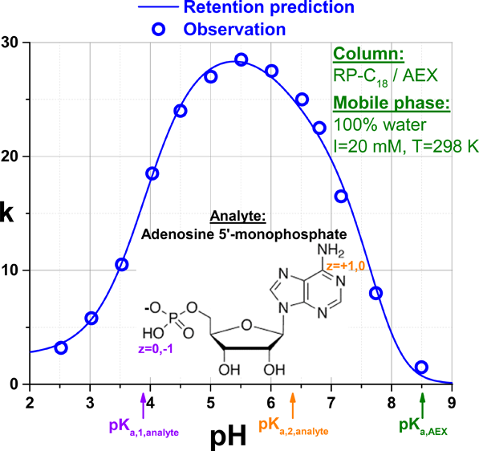
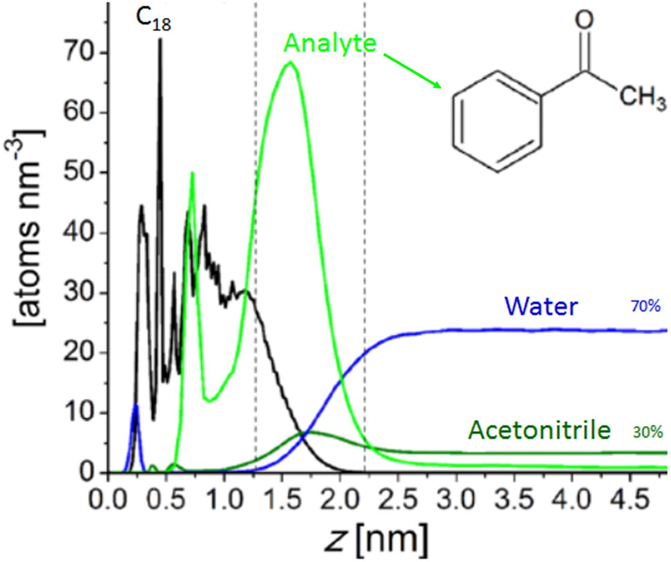
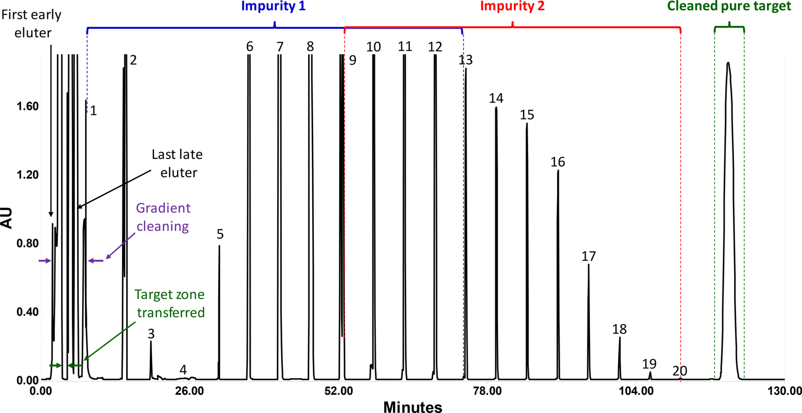
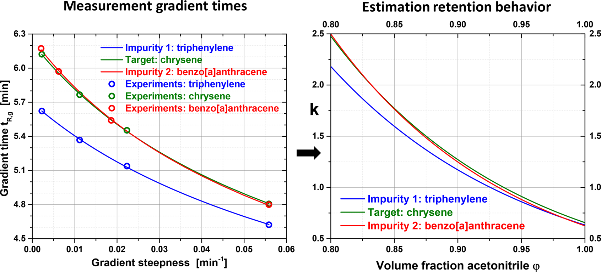
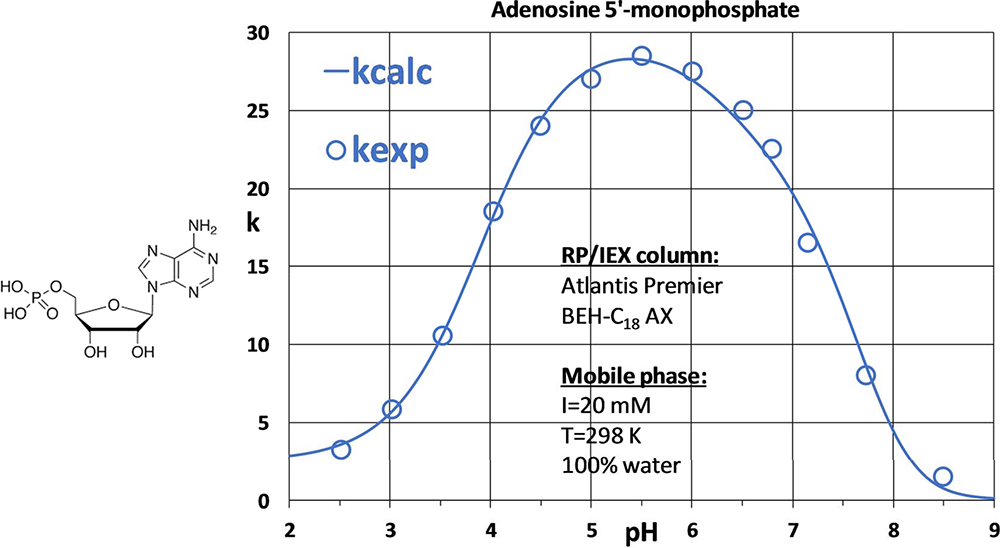
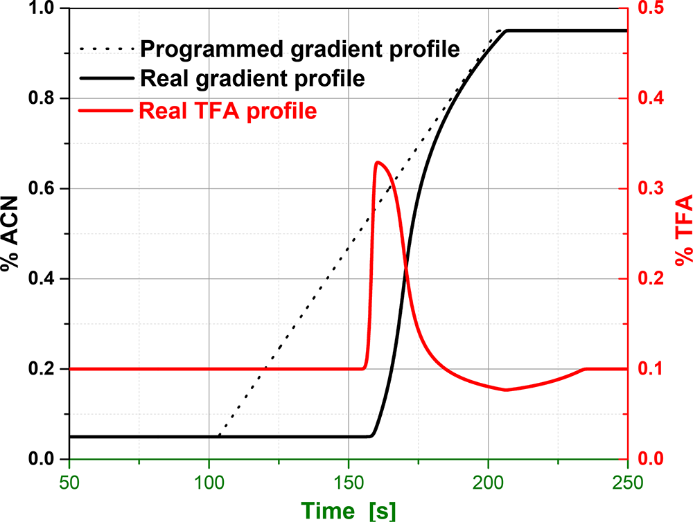
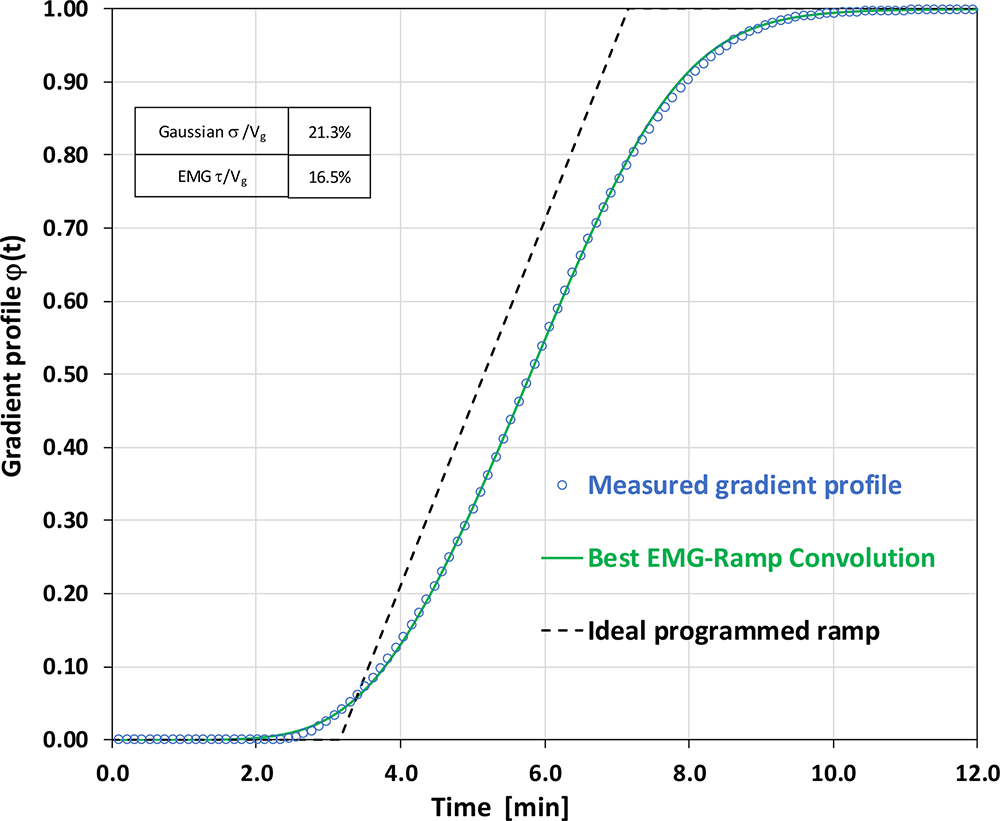
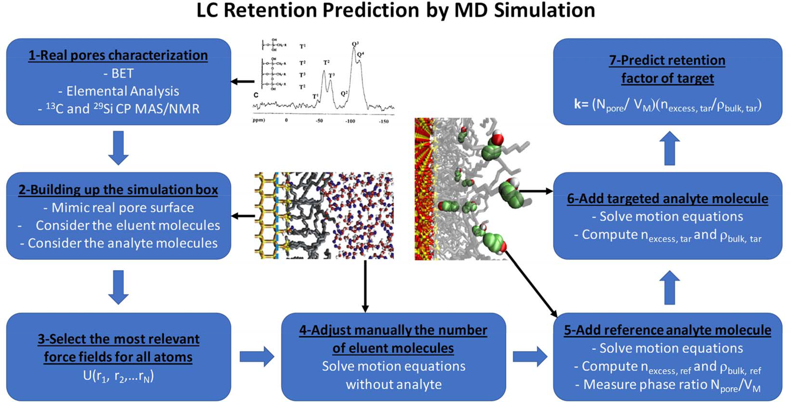

<!-- 方針: 12ページのAnal. Chem. Perspective(展望)の全訳密度版。原文構成(序論→1保持の基礎→2逆法→3直接法→4構造ベース(LSER/QSRR/AI/MD)→5結論)に忠実。数式(式1-3)と具体例・数値を保持。数式は元PDFのOCRが崩れていたため標準形で再掲。専門的なためlevel=researcher。「> 補足:」は訳者注。 -->

## 書誌情報

- 標題（原題）: Perspective on the Future Approaches to Predict Retention in Liquid Chromatography
- 著者・所属: Fabrice Gritti*（Waters Corporation。LC 保持理論の第一人者）
- 掲載誌・巻号・DOI: Anal. Chem. 2021, 93, 5653–5664. https://doi.org/10.1021/acs.analchem.0c05078
- インパクトファクター: 7.3（Analytical Chemistry, Q1・2024 JCR）
- 受理経過 / ライセンス: Received 2020-12-03 / Accepted 2021-03-22 / Published 2021-04-02。ACS（Perspective）
- **原本PDF**: Driveへ自動アップロードできず、ユーザーに返却済み（`perspectiveonthefutureapproachestopredictretentioninliquidchromatography.pdf`）

> 補足（この論文の位置づけ）: LC の**保持時間をどう予測するか**を、理論と実務の両面から総括した権威ある展望（Perspective）。本サイトの保持モデリング総説（`retention-modeling-lc-review`）・in silico HPLC（`insilico-hplc-qspr-lser-lss-retention`）・LC×LCベイズ最適化（`lcxlc-bayesian-optimization-method-development`）・ベイズD最適設計（`rphplc-bayesian-doptimal-design-retention-prediction`）の“親”に当たる俯瞰で、「逆法／直接法／構造ベース（LSER・QSRR・AI）／分子動力学」の全系統を一望できる。生薬の多成分HPLC法開発でも、カラムスクリーニング・条件最適化・装置間の方法移管・LC/MSでの成分同定という4つの実務課題は共通で、その各々にどの予測法が向くかが整理されている。（本PDFは Tsumura が入手したもの。）

## 要旨（Abstract）

迅速なカラムスクリーニング・計算機支援の法開発と方法移管・LC/MSによる明確な化合物同定への需要が、分析者に保持時間の正確な予測のための実験プロトコルとソフトの採用を促してきた。本展望は、過去30年に使われた古典的アプローチを論じ、精度向上のための今後の要件を提案する。

第一に、**逆法（inverse methods）**は主にスクリーニングと勾配法最適化で使われる——最小数の実験（DoE）でモデル（純統計的、またはLCの原理に基づく）を単なる当てはめで校正する。真のカラム空隙容積 V0、装置ドウェル容積 Vdwell（勾配溶出時）、分析対象の保持挙動（k と強溶媒含量 φ・温度 T・pH・イオン強度 I の関係）の正確な知識を要さない。相対精度はしばしば数%以下で優秀。統計法は混合モードクロマト（MMC）のような非常に複雑な保持挙動を扱うのに最も魅力的。LCの原理に基づく法開発には、MMC で φ・I・pH・T の同時影響を扱う**基本的に正しい保持モデル**が必要。

第二に、**直接法（direct methods）**はあるカラム/系構成から別の構成への正確な方法移管に理想的——固液吸着と勾配クロマトの第一原理に基づくQbD法である。モデル校正は不要だが、真の保持因子（1<k<30）を実験変数（φ・T・pH・I）と真のカラム/系パラメータ（V0、Vdwell、勾配プロファイルの分散容積σ・緩和容積τ）の関数として正確に測定する**普遍的規約**が要る。

最後に、分析対象の分子構造が既知/仮定できる場合、保持予測は主に **LSER（線形溶媒和エネルギー相関）と QSRR（定量的構造-保持相関）**という統計的アプローチで行われてきたが、その精度は 10–30% に留まる。分子類似性アプローチ（保持モデルを標的分析対象に構造の似た化合物で校正）や AI アルゴリズムと組み合わせて精度を <10% に改善してきた。本展望は、固液吸着過程の詳細を考える**より厳密で基礎的なアプローチ**の採用を提言する——**モンテカルロ（MC）や分子動力学（MD）シミュレーション**は、経験的/統計的保持モデルでは記述しきれない複雑な保持データを説明・解釈する有望なツールである。

## 1. LCにおける保持の基礎

### 1.1 従来の保持因子

気固/気液クロマトと違い、固液クロマトでは移動相と固定相の境界が本質的に曖昧で、カラムの空隙（死）容積 V0 の決定に**規約**が要る。規約が定まれば従来の保持因子 kconv は 式(1) kconv = (VR − V0)/V0（VR=等溶媒条件での溶出容積）。

この曖昧さは、バルク移動相（分析対象・溶離液成分の濃度が均一）と不透過性固体表面（メソ多孔シリカ骨格表面）を隔てる**界面領域が厚く細孔内に深く広がる**ことに由来する。その構造は極めて不均一（剛直界面領域と拡散界面領域から成る）で、保持が起こるこの領域では濃度を定義できず、局所的にしか分子密度を定義できない。この厚い界面領域は RPLC・HILIC で MC/MD により再構成されている（Fig. 1）。よって分析者は固定相と移動相の正確な境界（Gibbs の分割面）を一義的に決められず、**測定法の数だけ V0 が存在**し、kconv はラボ間で不一致となり真の保持因子とは必然的に異なる。

### 1.2 真の・正しい保持因子

この曖昧さを解消するため、1970年代に Riedo & Kovats、Knox & Kaliszan が**熱力学的死容積 VM**（総溶離液容量）を導入。界面・バルク両領域を含む全溶離液成分が占める容積で、質量保存則から標識化合物の溶出容積で最もよく測定される: 式(2) VM = Σ_{i=1}^N x_i · V_i\*（x_i=溶離液成分iの組成、V_i\*=標識成分iの溶出容積）。正確な VM 測定には同位体溶媒（重水・重アセトニトリル等）と MS/RI 検出が要る（同位体効果なし・純溶媒のモル体積がバルクと界面で同一を仮定）。等溶媒条件での**真の保持因子** ktrue は移動相容積を VM として 式(3) ktrue = (VR − VM)/VM。

## 2. 保持予測：逆法（Inverse Methods）

### 2.1 逆法の原理

製薬・生物・食品産業でのカラムスクリーニングと法開発の速度は増し続けている（より速い装置、より短いカラム＝2 cm 級まで）。逆法では、まず DoE で勾配モデルを校正し、in silico で (1) 任意選択した保持モデルの最良パラメータと (2) 最重要ペアをベースライン分離する最適条件を決める。in silico 技術は純統計的か、クロマトの基礎に基づく（LSS、Neue-Kuss、二次モデル 等の経験式＋勾配クロマトの基礎関係）。統計的アプローチは基礎原理から自由で、明確な解析モデルの無い複雑問題に好適。原理ベースは頑健で RPLC の勾配保持時間予測に好適。

### 2.2 従来の勾配保持予測

逆法の主な限界は、**保持モデルの数式を事前検証なしに仮定する**こと。RP・HILIC・IEX・SEC やそれらの混合モードの全機構に、検証なしに単一モデルは使えない。利点は、保持モデル k=f(φ)・V0・Vdwell・カラム入口の実勾配プロファイル・カラム内での勾配変形に対する近似に関わらず**頑健**なこと（最良パラメータはこれら測定量に内在的に結びつくが、その値は実務者には無関係で、in silico 予測の最適条件だけが問題）。ソフトは溶離液強度・温度・圧力・pH・イオン強度の範囲をカバーする最小数の勾配ランで校正される。限界は、複数因子（温度・圧力・組成）と相互作用（分散・イオン・極性等）を**別々に**扱う点——例えば混合モードカラムは RP と IEX 相互作用を同時に含む。

### 2.3 逆法の展望

**2.3.1 曲線保持モデル＋少数スカウティング勾配**: 勾配保持予測には k 対 φ プロットの正確な決定が要る。例として**勾配リサイクルクロマト**（複雑混合物中の標的を近接共溶出不純物から分離）では、多数サイクルでの標的・不純物の保持挙動の極めて正確な予測が要る。曲線 **Neue-Kuss モデル**が推奨される（(1) LSS より観測に合い、(2) 3経験パラメータの関数として勾配溶出時間の解析式を与える）。精度のため、有意に異なる4つの勾配時間 tg（t0 の 2・6・18・54 倍の幾何級数）で4ランを記録すると頑健性が優秀。応用例（多環芳香族 PAH 混合物からクリセンを単離）: 流速 2.5 mL/min、t0=1.79 min、tD=0.66 min、φ0=0.8（水中ACN）、勾配振幅 0.2。クリセンと benzo[a]anthracene がほぼ共溶出するため、勾配洗浄（3回切替）＋等溶媒リサイクルで**最低20サイクル**要してベースライン分離（Fig. 2, 3）。同技術はミルク栄養食中のビタミンD2/D3 分離にも適用。

**2.3.2 混合モード（MMC）の適切な保持モデル開発**: 異なる分子間相互作用（分散＋イオン）が関わる系では、複数パラメータ（φ・pH・イオン強度・温度・圧力）を含むハイブリッド保持モデルが有望。RP/IEX MMC では、Stählberg & Hägglund のイオンペアクロマト静電理論モデルが、表面電位 <40 mV のとき kRP/IEX の予測に物理的に適する。IEX 配位子・分析対象が pH 依存で完全荷電でない場合や、多数 pKa・多数 AEX/CEX 配位子の場合にも拡張可能。例（Atlantis Premier BEH-C18 AX MMC カラム、アデノシン5′-一リン酸、pKa1=3.9・pKa2=6.3、電荷 0/−1/−2）: pH を 2.5→8.5 に +0.5 刻み、I=20 mM 固定、純水移動相、298 K。保持因子は pH 5.5 で最大→高pHで急減（二価陰イオンCがC18と弱相互作用 K0,RP,A=4.8>K0,RP,B=1.83>K0,RP,C=0.0434、かつ第三級アルキルアミン配位子が脱荷電）。固定相アミンの pKa,AEX は 8.5 と推定。ただしイオン強度（5→50 mM）変化は本モデルで適切に説明できず（傾向のみ）、**イオン化化合物の保持機構の MD シミュレーションによる精緻化**の必要性を示す。

## 3. 保持予測：直接法（Direct Methods）

### 3.1 基本的に正しい勾配保持予測

逆法の主な欠点3つ: (1) 保持モデルの最良パラメータが V0・Vdwell の測定規約に縛られる、(2) 保持モデルを検証なしに任意選択、(3) カラム入口の実勾配プロファイルと一部溶離液成分の固定相親和性を系統的に無視（勾配は厳密に線形・非保持・非変形、添加剤は非保持と仮定）。よって逆法は、装置変更（ドウェル容積・入口勾配の変化）・カラム寸法変更（空隙率変化）・勾配プログラム変更（勾配形状変化）を伴う**方法移管には厳密には使えない**。古典的保持モデル（LSS・二次・Neue-Kuss）は吸着の基礎を持たない経験式にすぎない。これを克服する偏りのない**直接法**には、以下の普遍的規約が要る。

- **3.1.1 真のカラム空隙容積**: 単一溶媒溶離液で標識溶媒（純メタノール中の重メタノール-d1 を RI で検出）の溶出時間を測るのが最も正確で簡便。2溶媒混合なら両標識溶媒の溶出時間を測り式(2)で VM を算出。「非保持」マーカーからの推定は誤差が大きく、特に2元混合で顕著（RPLC-C18 でチオ尿素の保持は、ほぼ純水か ACN リッチ溶離液かで**±30%変動**——シリカ-C18表面が厚いACNリッチ層で覆われチオ尿素がほぼ不溶なため）。HILIC でもベンゼン/トルエンは純ACNか30%水含有かで±10%変動。
- **3.1.2 真の系ドウェル容積**: カラムを短いキャピラリー制限器（50 µm i.d.×10 cm）に置換し、ACN 75%→55% のステップ変化（27℃）を与えて測る。カラムを残すなら同じ線形ACN勾配を用いる。
- **3.1.3 真の強溶媒吸着**: **最小擾乱法（MDM）**で強溶媒の過剰吸着等温線を測定（RI/UV で平衡プラトーの微小擾乱を検出）。強溶媒等温線は、カラム入口の線形勾配の保持・変形を扱うのに必要（RPLC で水リッチ・HILIC で ACN リッチから始まり、勾配容積/空隙容積 <約3 のとき起こる）。
- **3.1.4 真の分析対象保持モデル**: 勾配溶出時のカラム出口保持因子は約1で、それより小さい k のデータは不要。分析対象ゾーンは k が約30を下回るまでほぼ入口で停止。よって **1<k<30 の範囲**で等溶媒的に真の k 対組成関係を正確に決めればよい。当てはまりが優秀なら**保持モデルの数学形（LSS/二次/Neue-Kuss）は勾配保持予測精度に無関係**。

- **3.1.5 カラム入口の勾配プロファイル**: 大きなドウェル容積が勾配形状を歪める。カラムをゼロ死容積ユニオンに置換して測定。観測プロファイルは指数修飾ガウス（EMG、標準偏差 σ・緩和容積 τ）で近似（Fig. 5）。ミキサー容積が勾配容積に匹敵すると差が顕著。

- **3.1.6 強溶媒・添加剤の保持の影響**: 荷電分析対象の保持は強溶媒・添加塩濃度に依存。勾配容積 Vg が空隙容積 V0 に匹敵すると、強溶媒の濃度ショックで勾配が歪む。また添加剤濃度一定の仮定も、添加剤が保持され強溶媒濃度に依存する場合は成り立たない。**代表例: 0.1% TFA を ACN/水に加えた場合**（Fig. 6）——勾配プロファイルが保持・歪み、TFA が ACN に固定相から移動相へ置換され、初期に TFA 過剰・後に TFA 欠損（勾配終了後も持続）。分析対象保持が TFA 濃度依存なら、古典モデルで大きな予測誤差。結論として、勾配容積が空隙容積に匹敵するときは強溶媒/添加剤の弱吸着を考慮し、MDM で等温線を測り、質量収支方程式を数値的に解く（平衡分散モデルを有限差分法で）必要がある。

## 4. 既知化合物の保持予測：分子記述子（構造ベース）

### 4.1 従来の統計的手法

**4.1.1 LSER（線形溶媒和エネルギー相関）**: Abraham らが溶媒効果の相関・予測に開発、Carr らが LC の分配係数/保持因子に拡張。全記述子の寄与を独立に扱い、固定相・移動相を2つの分離した均一相と仮定する。第1の仮定は数学的簡略化、第2の仮定は界面相・多重吸着サイトの存在ゆえ固液吸着では成り立たない（Fig. 1 の分子シミュレーションが確認）。よって予測と実測の一致は「良い」が「優秀」は稀で、**平均相対残差は RPLC で ±20% 程度**。LSER はカラムを支配的相互作用で分類する強力なツール（1D-LCの選択性、2D-LCの直交条件選定に必須）だが、訓練セットに無い既知化合物の保持時間の正確な予測は大きな誤差を伴う。

**4.1.2 QSRR（定量的構造-保持相関）**: 原理は LSER に近い（既知構造の訓練セットで保持時間を記録→分子記述子を計算→重回帰でモデル構築→試験セットで検証）。40年の適用を経てなお**法開発には精度不十分**。そこで訓練/試験セット間の**分子類似性**が精度向上に強く推奨される。分子類似性と記述子-保持相関を組み合わせた**二重フィルタ QSRR** で、HILIC の保持時間予測 RMSE を約50%→10%に低減。従来 QSRR は物理的意味のない数千記述子を計算するが、**量子力学的記述子**（溶媒和エネルギー・イオン化ポテンシャル・双極子モーメント）は <10% 精度と包括的相互作用解析の可能性を示す。ただし最重要ペアの勾配条件最適化にはなお不十分。

### 4.2 展望

**4.2.1 人工知能（AI）**: 多層アルゴリズムを大量データで訓練。ニューラルネット/遺伝的アルゴリズムで、LCの原理や分子レベルの機構複雑性から自由に保持予測。従来の重回帰/PLS を置換でき、イオンクロマトや HILIC の保持・ピーク幅予測に実装。**分子類似性**（訓練/試験セットの構造差を最小化）と組み合わせると利点が3つ: (1) 近似保持モデルも複雑勾配関係も不要、(2) 構造の異なる標的への外挿リスク低減、(3) 相対誤差を主に <10% に保つ。ただし適切な実験空間と訓練セットの探索に膨大な計算を要し、最適分離条件の最適化はなお難題。

**4.2.2 分子動力学（MD）による保持予測**: 固液クロマトの保持機構は、分析対象の構造・記述子が既知でも保持因子の正確予測が極めて困難。LSER/QSRR/QSRR-AI はこの複雑性を無視し、精度は訓練セット選択に依存。**MC/MD シミュレーション**は、解析的/統計的モデルでは解釈しきれない複雑な測定を解釈する最後の手段。RPLC・HILIC・SEC の保持機構は過去20年の MC/MD で分子レベルで理解され、保持が界面から異なる z 位置での分析対象分子の蓄積を含む（＝単純な解析/統計モデルでは記述不能）ことを証明した。MD 適用の主課題: (1) シミュレーションボックスの現実的構築、(2) 最も正確な力場（特に荷電表面・イオン化分析対象/添加剤）の決定、(3) 高い計算資源。長距離静電相互作用が力場でうまく記述されないため IEX/HILIC/MMC への適用は魅力的だが困難。QM（正確）/MM（高速）ハイブリッドも QM-MM 界面の最適化が難題。現状 MD は等溶媒溶出に限られる（勾配は複数組成での連続 MD が要る）。力場は各原子（シリカの Si/O、C18 の C/H、溶媒）に対し選択・検証が必要で、パラメータは X線/中性子回折・振動分光・ab initio 量子計算から決める。ニュートン運動方程式の数値積分で全原子の軌道を計算。

**Fig. 7 の手順**: 実固定相の深部表面の特性評価（BET＝平均細孔径、元素分析＝配位子被覆率、²⁹Si CP-MAS NMR＝遊離シラノール表面濃度）→ 実細孔表面を模したシミュレーションボックス構築 → シリカ・配位子・溶離液・分析対象の各原子の検証済み力場選択 → 運動方程式を数値解 → 溶離液分子を目標バルク組成に合わせて導入 → 保持参照分析対象（k>2）で未知のカラム相比（N_pore/VM）を実測値と MD 計算値を一致させて決定 → 標的分析対象を導入し保持因子を MD で直接予測。

## 5. 結論：保持予測の将来展望

保持予測は LC 法のスループット向上と LC/MS の同定化合物数向上に不可欠。適用手法は解く分析問題（カラムスクリーニング・法開発・方法移管・LC/MS同定）による。

1. **カラムスクリーニング・法最適化（同一カラム/装置）**: 最重要ペアを解くには勾配保持時間の正確予測が肝心で、計算法を校正する DoE の選択に依存。最適化パラメータが DoE 空間内に留まる限り、真のドウェル容積・入口勾配プロファイル・強溶媒親和性・熱力学的死容積を正確に測る必要はなく、真の等溶媒保持モデルを厳密に決める必要もない（RPLC の大半で任意の3パラメータ経験モデルで十分、非保持・非変形勾配の仮定で足りる）。勾配保持過程は準ブラックボックスと見なせる。よって**純統計ソフトも原理ベースソフトと同等に効率的で、予測相対精度は常に数%以内**。特に MMC カラムでは統計モデルが原理ベースより成功しやすい（pH・イオン強度・温度・溶離液強度の同時効果を扱う簡単な保持モデルが現状無い）。
2. **方法移管（カラム/装置構成の変更）**: ドウェル容積・空隙容積・勾配パラメータが変わるため、両カラム（空隙容積）・両系（ドウェル容積・分散）・分析対象（等溶媒保持挙動）の関連パラメータを正確に測り、最も精緻な勾配クロマトモデル（勾配の不忠実・遅延・歪みを考慮）を用いることが肝心。特に勾配容積が空隙容積・ドウェル容積に匹敵する高スループット LC で重要。**普遍的規約**が要る（空隙容積＝単一溶媒＋標識溶媒注入の動的法、ドウェル容積＝75/25→55/45 ACN-水線形勾配25℃でカラム設置のまま、保持挙動＝1<k<30 の等溶媒ラン）。MMC カラムの方法移管はなお課題（健全な保持モデルが未整備）。
3. **既知標的分析対象の保持予測**: 従来の統計法（無作為訓練の LSER/QSRR＋重回帰/PLS）は健全で定性的な情報を与えるが、正確な予測は ±10–30% に留まる。改善は訓練セットの選択（分子類似性）と、重回帰/PLS を広範な訓練セットの AI アルゴリズムに置換することで得られるだろう。だが AI の統計的性質と固液界面吸着の基礎欠如が精度を必然的に制限する。**根本からの解決＝MC/MD シミュレーション**。過去20年で中性表面・分析対象について RPLC/HILIC 機構を解明してきたが、今後の課題は**イオン化系の力場の検証**と計算資源の増強。これが LC 保持予測を、固液吸着平衡の基礎を取り込んだ次の水準に引き上げ、現行統計法の予測誤差リスクを大きく減らす。

## 参考文献

1. Mattrey, F. T.; Makarov, A. A.; Regalado, E. L.; Bernardoni, F.; Figus, M.; Hicks, M. B.; Zheng, J.; Wang, L.; Schafer, W.; Antonucci, V.; Hamilton, S. E.; Zawatzky, K.; Welch, C. J. TrAC 2017, 95, 36−46.

2. Molnar, I. J. Chromatogr. A 2002, 965, 175−194.

3. Snyder, L.; Kirkland, J.; Glach, J. Practical HPLC Method Development, 2nd ed.; John Wiley and Sons: New York, 1997.

4. Schmidt, A.; Molnar, I. J. Chromatogr. A 2002, 948, 51−63.

5. Euerby, M. R.; Scannapieco, F.; Rieger, H.-J.; Molnar, I. J. Chromatogr. A 2006, 1121, 219−227.

6. Fekete, S.; Fekete, J.; Molnar, I.; Ganzler, K. J. Chromatogr. A 2009, 1216, 7816−7823.

7. Krul, I.; Turpin, J.; Lukulay, P. H.; Verseput, R.; Swartz, M. LCGC North America 2008, 26, 1190−1197.

8. Porter, S. C.; Verseput, R. P.; Cunningham, C. R. Pharm. Technol. 1997, 21, 1−7.

9. Sahu, P. K.; Ramisetti, N. R.; Cecchi, T.; Swain, S.; Patro, C. S.; Panda, J. J. Pharm. Biomed. Anal. 2018, 147, 590−611.

10. Pirok, B. W. J.; Pous-Torres, S.; Ortiz-Bolsico, C.; Vivo-Truyols, G.; Schoenmakers, P. J. Chromatogr. A 2016, 1450, 29−37.

11. Pirok, B. W. J.; Gargano, A. F. G.; Schoenmakers, P. J. Sep. Sci. 2018, 41, 68−98.

12. USP Chromatography. In Physical Tests; The United States Pharmacopeial Convention, 2012; Chapter 621; https://www. d r u g f u t u r e . c o m / P h a r m a c o p o e i a / u s p 3 5 / P D F / 0 2 5 8 - 0265%20%5B621%5D%20CHROMATOGRAPHY.pdf.

13. Mazzeo, J. R.; Neue, U. D.; Kele, M.; Plumb, R. S. Anal. Chem. 2005, 77, 460A−467A.

14. Dong, M. W.; Zhang, K. TrAC, Trends Anal. Chem. 2014, 63, 21− 30.

15. Kormany, R.; Fekete, J.; Guillarme, D.; Fekete, S. J. Pharm. Biomed. Anal. 2014, 94, 188−195.

16. Asberg, D.; Samuelsson, J.; Lesko, M.; Cavazzini, A.; Kaczmarski, K.; Fornstedt, T. J. Chromatogr. A 2015, 1401, 52−59.

17. Asberg, D.; Samuelsson, J.; Fornstedt, T. J. Chromatogr. A 2016, 1457, 97−106.

18. Kostka, J.; Gritti, F.; Kaczmarski, K.; Guiochon, G. J. Chromatogr. A 2010, 1217, 4704−4712.

19. Gritti, F.; Guiochon, G. J. Chromatogr. A 2014, 1340, 50−58.

20. Gritti, F.; Guiochon, G. J. Chromatogr. A 2014, 1344, 66−75.

21. Gritti, F.; Guiochon, G. J. Chromatogr. A 2014, 1356, 96−104.

22. Boswell, P. G.; Schellenberg, J. R.; Carr, P. W.; Cohen, J. D.; Hegeman, A. D. J. Chromatogr. A 2011, 1218, 6732−6741.

23. Taft, R. W.; Abboud, J.-L. M.; Kamlet, M. J.; Abraham, M. A. J. Solution Chem. 1985, 14, 153−186.

24. Sadek, P. C.; Carr, P. W.; Doherty, R. M.; Kamlet, M. J.; Taft, R. W.; Abraham, M. A. Anal. Chem. 1985, 57, 2971−2978.

25. Wang, A.; Tan, L. C.; Carr, P. W. J. Chromatogr. A 1999, 848, 21− 37.

26. Wang, A.; Carr, P. W. J. Chromatogr. A 2002, 965, 3−23.

27. Vitha, M.; Carr, P. W. J. Chromatogr. A 2006, 1126, 143−194.

28. Kaliszan, R. Chem. Rev. 2007, 107, 3212−3246.

29. Kaliszan, R. J. Chromatogr. A 1993, 656, 417−435.

30. Gorynski, K.; Bojko, B.; Nowaczyk, A.; Bucinski, A.; Pawliszyn, J.; Kaliszan, R. Anal. Chim. Acta 2013, 797, 13−19.

31. Ng, B. K.; Tan, T. T. Y.; Shellie, R. A.; Dicinoski, G. W.; Haddad, P. R. TrAC, Trends Anal. Chem. 2016, 80, 625−635.

32. Taraji, M.; Haddad, P. R.; Amos, R. I. J.; Talebi, M.; Szucs, R.; Dolan, J. W.; Pohl, C. A. J. Chromatogr. A 2017, 1507, 53−62.

33. Haddad, P. R.; Taraji, M.; Szücs, R. Anal. Chem. 2021, 93, 228− 256.

34. Witting, M.; Böcker, S. J. Sep. Sci. 2020, 43, 1746−1754.

35. Taraji, M.; Haddad, P. R.; Amos, R. I. J.; Talebi, M.; Szücs, R.; Dolan, J. W.; Pohl, C. A. Anal. Chim. Acta 2018, 1000, 20−40.

36. Amos, R. I. J.; Haddad, P. R.; Szücs, R.; Dolan, J. W.; Pohl, C. A. TrAC 2018, 105, 352−359.

37. Moruz, L.; Kall, L. Mass Spectrom. Rev. 2017, 36, 615−623.

38. Abraham, M.; Acree, W. J. Chromatogr. A 2016, 1430, 2−14.

39. Tyteca, E.; Veuthey, J.-L.; Desmet, G.; Guillarme, D.; Fekete, S. Analyst 2016, 141, 5488−5501.

40. Tarasova, I.; Masselon, C.; Gorshkov, A.; Gorshkov, M. Analyst 2016, 141, 4816−4832.

41. Sykora, D.; Vozka, J.; Tesarova, E. J. Sep. Sci. 2016, 39, 115−131.

42. Krokhin, O. V.; Spicer, V. Curr. Protoc. Bioinform. 2010, 31, 13.14.1−13.14.15.

43. Liu, C.; Wang, H.; Fu, Y.; Yuan, Z.; Chi, H.; Wang, L.; Sun, R.; He, S. Sepu 2012, 28, 529−534.

44. Kaliszan, R.; Baczek, T. Proteomics 2009, 9, 835−847.

45. Baczek, T. Curr. Pharm. Anal. 2008, 4, 151−161.

46. Shinoda, K.; Sugimoto, M.; Tomita, M.; Ishihama, Y. Proteomics 2008, 8, 787−798.

47. Put, R.; Vander Heyden, Y. Anal. Chim. Acta 2007, 602, 164− 172.

48. Garcia-Alvarez-Coque, M.C.; Torres-Lapasio, J.R.; Baeza-Baeza, J.J. Anal. Chim. Acta 2006, 579, 125−145.

49. Lochmüller, C.; Reese, C.; Aschman, A.; Breiner, S. Anal. Chim. Acta 1993, 656, 3−18.

50. Hanai, T. J. Chromatogr. A 1991, 550, 313−324.

51. Baba, Y. J. Chromatogr. A 1989, 485, 143−168.

52. Zuvela, P.; Skoczylas, M.; Jay Liu, J.; Baczek, T.; Kaliszan, R.; Wong, M.; Buszewski, B. Chem. Rev. 2019, 119, 3674−3729.

53. Wen, Y.; Amos, R. I. J.; Talebi, M.; Szücs, R.; Dolan, J. W.; Pohl, C. A.; Haddad, P. R. Anal. Chem. 2018, 90, 9434−9440.

54. Lindsey, R.; Rafferty, J.; Eggimann, B.; Siepmann, J.; Schure, M. J. Chromatogr. A 2013, 1287, 60−82. Analytical Chemistry pubs.acs.org/ac Perspective https://doi.org/10.1021/acs.analchem.0c05078 Anal. Chem. 2021, 93, 5653−5664 5663

55. Rybka, J.; Höltzel, A.; Melnikov, S.; Seidel-Morgenstern, A.; Tallarek, U. Fluid Phase Equilib. 2016, 407, 177−187.

56. Braun, J.; Fouqueau, A.; Bemish, R. J.; Meuwly, M. Phys. Chem. Chem. Phys. 2008, 10, 4765−4777.

57. El Hage, K.; Bemish, R.; Meuwly, M. Phys. Chem. Chem. Phys. 2018, 20, 18610−18622.

58. El Hage, K.; Gupta, P.; Bemish, R.; Meuwly, M. J. Phys. Chem. Lett. 2017, 8, 4600−4607.

59. Riedo, F.; Kovats, E. J. Chromatogr. 1982, 239, 1−28.

60. Knox, J.; Kaliszan, R. J. Chromatogr. 1985, 349, 211−234.

61. Alhedai, A.; Martire, D. E.; Scott, R. P. W. Analyst 1989, 114, 869−875.

62. Rybka, J.; Höltzel, A.; Tallarek, U. J. Phys. Chem. C 2017, 121, 17907−17920.

63. Trebel, N.; Höltzel, A.; Steinhoff, A.; Tallarek, U. J. Chromatogr. A 2021, 1640, 461958.

64. Melnikov, S. M.; Höltzel, A.; Seidel-Morgenstern, A.; Tallarek, U. Anal. Chem. 2011, 83, 2569−2575.

65. Melnikov, S. M.; Höltzel, A.; Seidel-Morgenstern, A.; Tallarek, U. Angew. Chem., Int. Ed. 2012, 51, 6251−6254.

66. Melnikov, S. M.; Höltzel, A.; Seidel-Morgenstern, A.; Tallarek, U. J. Phys. Chem. C 2013, 117, 6620−6631.

67. Smith, R.; Nieass, C.; Wainwright, M. J. Liq. Chromatogr. 1986, 9, 1387−1430.

68. Rimmer, R. J.; Simmons, C. S.; Dorsey, J. G. J. Chromatogr. A 2002, 965, 219−232.

69. Gritti, F.; Kazakhevich, Y. V.; Guiochon, G. J. Chromatogr. A 2007, 1161, 157−169.

70. McCormick, R.; Karger, B. J. Chromatogr. 1980, 199, 259−273.

71. McCormick, R.; Karger, B. Anal. Chem. 1980, 52, 2249−2257.

72. Kazakevich, Y. V.; McNair, H. M. J. Chromatogr. Sci. 1993, 31, 317−322.

73. Kazakevich, Y. V.; McNair, H. M. J. Chromatogr. Sci. 1995, 33, 321−327.

74. Felinger, A.; Cavazzini, A.; Guiochon, G. J. Chromatogr. A 2003, 986, 207−225.

75. Cavazzini, A.; Felinger, A.; Guiochon, G. J. Chromatogr. A 2003, 1012, 139−149.

76. Guiochon, G.; Felinger, A.; Katti, A.; Shirazi, D. Fundamentals of Preparative and Nonlinear Chromatography, 2nd ed.; Academic Press: Boston, MA, 2006.

77. Snyder, L. High Performance Liquid Chromatography - Advances and Perspectives; Elsevier: Amsterdam, 1980; Vol. 1.

78. Neue, U. Chromatographia 2006, 63, S45−S53.

79. Schoenmakers, P.; Billiet, H. A. H.; Tussen, R.; Galan, L. D. J. Chromatogr. A 1978, 149, 519−537.

80. Snyder, L.; Dolan, J.; Gant, J. J. Chromatogr. 1979, 165, 3−30.

81. Neue, U.; Kuss, H.-J. J. Chromatogr. A 2010, 1217, 3794−3803.

82. Jandera, P.; Hajek, T.; Sromova, Z. J. Chromatogr. A 2018, 1543, 48−57.

83. Neue, U.; Phoebe, C.; Tran, K.; Cheng, Y.; Lu, Z. J. Chromatogr. A 2001, 925, 49−67.

84. Neue, U.; Tran, K. V.; Mendez, A.; Carr, P. J. Chromatogr. A 2005, 1063, 35−45.

85. Gritti, F. J. Chromatogr. A 2019, 1597, 119−131.

86. Mendez, A.; Bosch, E.; Roses, M.; Neue, U. J. Chromatogr. A 2003, 986, 33−44.

87. Stählberg, J.; Hägglund, I. Anal. Chem. 1988, 60, 1958.

88. Neue, U. D.; Tran, K.; Mendez, A.; Carr, P. W. J. Chromatogr. A 2005, 1063, 35−45.

89. Kiani, F.; Rahmaini, H.; Bahadori, A.; Koohyar, F. Cont. J. Biol. Sci. 2014, 7, 1−29.

90. Gritti, F. J. Chromatogr. A 2015, 1410, 90−98.

91. McCalley, D.; Neue, U. J. Chromatogr. A 2008, 1192, 225−229.

92. Gritti, F.; Guiochon, G. J. Chromatogr. A 2007, 1155, 85−99.

93. Gritti, F.; Sehajpal, J.; Fairchild, J. J. Chromatogr. A 2017, 1489, 95−106.

94. Kazakevich, Y. J. Chromatogr. A 2006, 1126, 232−243.

95. Rustamov, T.; Farcas, I.; Ahmed, F.; Chan, F.; LoBrutto, R.; McNair, H.; Kazakevich, Y. J. Chromatogr. A 2001, 913, 49−63.

96. Wang, M.; Mallette, J.; Parcher, J. F. J. Chromatogr. A 2008, 1190, 1−7.

97. Gilar, M.; Hill, J.; McDonald, T.; Gritti, F. J. Chromatogr. A 2020, 1613, 460690.

98. Gritti, F. J. Chromatogr. A 2020, 1633, 461605.

99. Kaczmarski, K. J. Chromatogr. A 2007, 1176, 57−68.

100. Gritti, F.; Guiochon, G. Anal. Chem. 2003, 75, 5726−5738.

101. Gritti, F.; Guiochon, G. Anal. Chem. 2005, 77, 4257−4272.

102. Gritti, F.; Guiochon, G. J. Chromatogr. A 2005, 1099, 1−42.

103. Rybka, J.; Höltzel, A.; Trebel, N.; Tallarek, U. J. Phys. Chem. C 2019, 123, 21617−21628.

104. Zuvela, P.; Liu, J. J.; Macur, K.; Baczek, T. Anal. Chem. 2015, 87, 9876−9883.

105. Zuvela, P.; Macur, K.; Jay Liu, J.; Baczek, T. J. Pharm. Biomed. Anal. 2016, 127, 94−100.

106. Taraji, M.; Haddad, P. R.; Amos, R. I.J.; Talebi, M.; Szucs, R.; Dolan, J. W.; Pohl, C. A. Anal. Chim. Acta 2018, 1000, 20−40.

107. Johnson, M. A.; Maggiora, G. M. Concept and applications of molecular similarity; John Wiley and Sons: New York, 1990.

108. Walczak-Skierska, J.; Szultka-Mlynska, M.; Pauter, K.; Buszewski, B. J. Pharm. Biomed. Anal. 2020, 184, 113187.

109. Bolanca, T.; Cerjan-Stefanovica, S.; Regelja, M.; Regelja, H.; Loncaric, S. J. Chromatogr. A 2005, 1085, 74−85.

110. Heberger, K. J. Chromatogr. A 2007, 1158, 273−305.

111. Gonzalez, M. A. Collection SFN 2011, 12, 169−200.

112. Zhang, L.; Rafferty, J.; Siepmann, J.; Chen, B.; Schure, M. J. Chromatogr. A 2006, 1126, 219−231.

113. Rafferty, J.; Zhang, L.; Siepmann, J.; Schure, M. Anal. Chem. 2007, 79, 6551−6558.

114. Rybka, J.; Höltzel, A.; Steinhoff, A.; Tallarek, U. J. Phys. Chem. C 2019, 123, 3672−3681.

115. Gritti, F.; Höltzel, A.; Tallarek, U.; Guiochon, G. J. Chromatogr. A 2015, 1376, 112−125.

116. Gritti, F. J. Chromatogr. Sep. Tech. 2015, 6, 1000309.

117. Gritti, F.; Hochstrasser, J.; Svidryski, A.; Hlushkou, D.; Tallarek, U. J. Chromatogr. A 2020, 1620, 460991.

118. Mountain, R. D. J. Phys. Chem. C 2013, 117, 3923−3929. Analytical Chemistry pubs.acs.org/ac Perspective https://doi.org/10.1021/acs.analchem.0c05078 Anal. Chem. 2021, 93, 5653−5664 5664

## 訳者補足（実務者向けの読みどころ）

> 以下は原文に無い、実務観点の補足である（本文の訳と混ぜない）。

- **保持予測法の“使い分け”地図**（この論文の一番の実用価値）:
  - **同じカラム・装置で条件最適化する**なら → 逆法（DoEでモデルを当てる）で十分。V0やドウェル容積を厳密に測る必要すらなく、予測精度は数%。市販ソフト（統計ベースでも原理ベースでも）でOK。
  - **カラムや装置を替える（方法移管）**なら → 直接法。V0・ドウェル容積・強溶媒吸着を“普遍的規約”で正確に測る必要がある（さもないと勾配の歪みで予測が外れる）。
  - **構造だけ分かっている未知/既知化合物の保持を当てる**なら → LSER/QSRR（±10-30%）、分子類似性＋AIで<10%。将来はMD。
- **生薬QCへの含意**: 生薬の多成分HPLCで「別のカラム/装置に載せ替えたら分離が崩れた」という経験は、この論文が言う**方法移管時の V0・ドウェル容積・勾配歪みの未考慮**が原因のことが多い。高速化（短カラム・小勾配容積）ほど勾配歪みが効く、という指摘は実務的に重要。
- **“保持因子の真値問題”**: 非保持マーカー（チオ尿素等）で空隙容積を測ると±30%もぶれる——同じカラムでもラボや溶媒条件で保持因子が食い違う根本原因。規格の再現性を突き詰めるときの落とし穴として知っておくと良い。
- **TFA添加剤の勾配歪み**: 「0.1% TFAを入れているのにピーク位置が理論とずれる」のは、TFA自体が勾配中に保持・置換されて濃度が一定でなくなるため。生薬の酸性添加剤を使う勾配法でも起こりうる。
- **用語**: 逆法=少数実験でモデルを当てはめて予測、直接法=物性を直接測って第一原理で予測、V0=カラム空隙(死)容積、VM=熱力学的死容積、ドウェル容積=装置の勾配遅れ容積、LSER=線形溶媒和エネルギー相関(Abrahamパラメータ)、QSRR=定量的構造-保持相関、MMC=混合モードクロマト、MDM=最小擾乱法(吸着等温線測定)、Neue-Kuss=曲線保持モデル、MD/MC=分子動力学/モンテカルロ、力場=原子間ポテンシャルの関数。
