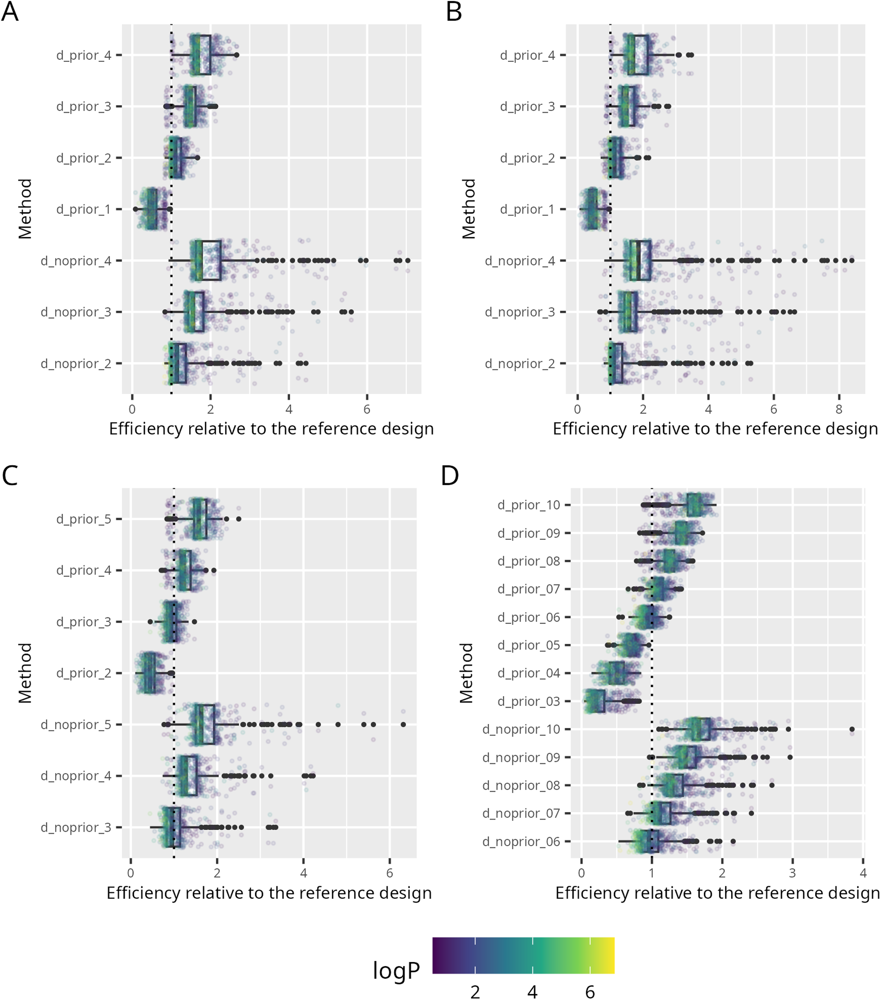
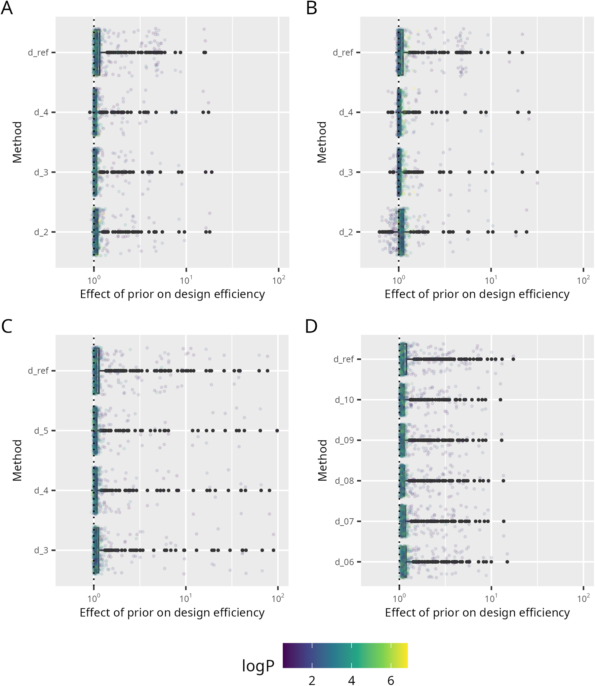
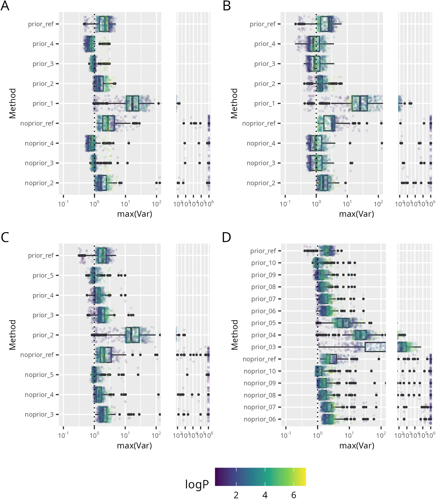
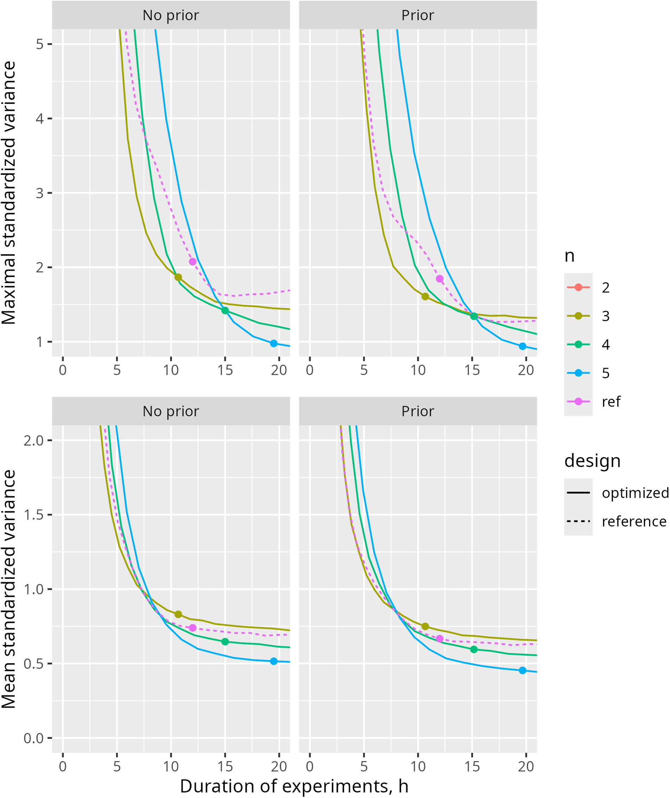

<!-- 方針: 9ページのJ. Chromatogr. A 方法論論文(単著)の全訳密度版。原文構成(序論→理論→技術→結果と考察→結論)に忠実。数式(FIM式2・D最適式3・効率式4・等溶媒式7-9・勾配式10-11)と数値を保持。数式は元PDFのOCRが崩れていたため意味に基づき標準形で再掲。統計的にやや専門的なためlevel=researcher。「> 補足:」は訳者注。2026-07-16 品質監査で密度不足のため原文をPyMuPDFで再取得し、Table1(D-optimal設計の全データ)とFig.2S言及部分(目標達成確率の議論)を追加、各節の説明を原文に沿って拡充。 -->

## 書誌情報

- 標題（原題）: Leveraging prior knowledge for improved retention prediction in reversed-phase HPLC
- 著者・所属: Paweł Wiczling（グダニスク医科大学 生物薬剤学・薬力学教室、ポーランド）
- 掲載誌・巻号・DOI: J. Chromatogr. A, 2025, 1746, 465787. https://doi.org/10.1016/j.chroma.2025.465787
- インパクトファクター: 4.0（Journal of Chromatography A, Q1・2024 JCR）
- 受理経過 / ライセンス: Received 2024-12-31 / Accepted 2025-02-15。Elsevier
- データ公開: R/Stan コードとデータは GitHub 公開（github.com/wiczling/optimal-design）
- 利益相反: 著者は開示すべき利益相反なし。計算の一部はグダニスク工科情報学センター(CI TASK)の計算クラスタで実行
- **原本PDF**: Driveへ自動アップロードできず、ユーザーに返却済み（`1s2.0S0021967325001359main.pdf`）

> 補足（この論文の位置づけ）: 「保持予測モデルを当てはめるための**予備実験（スカウティング実験）を、どう設計すれば最少の実験で最大の情報が得られるか**」を、ベイズ実験計画（D最適設計）＋多階層モデルで論じた、やや理論寄りの単著論文。生薬に限らないが、本サイトの保持モデリング総説（`retention-modeling-lc-review`）・in silico HPLC（`insilico-hplc-qspr-lser-lss-retention`）・LC×LCベイズ最適化（`lcxlc-bayesian-optimization-method-development`）・黄連QbD設計空間（`coptis-alkaloids-qbd-bayesian-design-space`）と一続きで、「実験計画の“計画”自体をベイズで最適化する」最上流の話。**単一の分析対象でなく、性質の異なる多数の分析対象（酸・塩基、親水〜親油）に一括で効く固定設計**を作る点が新しい。

## 要旨（Abstract）

分析対象の保持に関する事前情報は、しばしば暗黙のうちに法開発ワークフローに取り込まれている。この事前知識は、分析対象の構造・性質・既存文献・分析者の経験など様々な源に由来する。あるいは、事前情報をベイズ推論で法開発に**形式的に**統合することもできる。その場合、事前情報はモデル構造・共変量関係（例: 定量的構造-保持相関 QSRR）・多階層モデル等に由来する**集団レベル（population-level）パラメータ**として表現できる。集団レベルパラメータは、ある分析対象集団に属する各分析対象で共通であり、どんな予備データからでも個別（分析対象固有）パラメータの予測を助ける。事前情報と多階層モデリングの枠組みを使うことで、広範な条件・多様な分析対象集団にわたって望ましい予測精度に至る実験計画を作れる。これは単一または典型的な分析対象向けに条件を最適化するより高い正確性をもたらす。本研究では、ベイズ **D最適性基準**の最大化により、多様な分析対象集団（親油性の幅広い酸・塩基）に対する最適な実験セットを同定した。事前情報を取り込む利点を強調し、最近開発された機構モデルに基づくシミュレーションで、最適設計理論・多階層モデル・事前情報を組み合わせて逆相HPLCのより効率的な実験計画を得られることを検証した。

**キーワード**: 多階層モデル；事前情報；D最適設計；実験計画

## 1. 序論（Introduction）

クロマトの法開発は、最適条件を選ぶ前に分析対象の保持を十分理解しようとする探索型アプローチをとることが多く、これは文献で広く検討されている通り、Quality by Design原則に沿った理論的・統計的モデルに基づく[1-4]。予備（スカウティング）実験でデータを集め、適切なモデルで記述し、その予測で最適分離を同定する。

理論モデルの発展[5-8]や最適化ソフトウェアの進歩[9]といった近年の進歩がこの過程を大きく助けてきた。しかし、ベイズに基づく多階層モデルの導入と事前情報の取り込みにより、さらなる改善が可能である。事前情報はモデル構造・共変量関係（定量的構造-保持相関 QSRR）・多階層モデル等に由来する集団レベルパラメータで表現できる。集団パラメータはある分析対象集団（セット）に属する各分析対象で共通であり、そのため個別（分析対象固有）パラメータについての有用な事前情報を提供する。さらに、多階層モデルの予測は多様な分析対象に一般化できるため、広範な条件・分析対象集団にわたってクロマト予測の望ましい精度を達成する実験計画の同定が可能になる。これは結果として、クロマト法開発の効率を高める。

最適設計の探索は **D最適性基準**によって導くことができる。これはモデルパラメータについての情報を最大限に引き出しつつ実験労力を最小化することを目指し、**Fisher情報行列の行列式を最大化**（同義的に、パラメータ推定値の分散共分散行列の行列式を最小化）することで達成される。この結果、パラメータ推定値は可能な限り精密（不確実性最小）になる。D最適設計は通常、事前定義されたモデル・設計水準の指定範囲・独立誤差の仮定に基づいて構築される。最適設計の背後にある理論は統計文献で十分に確立されている[10]。様々なクロマト条件に関する分析対象の保持を記述する統計モデル（1次・2次応答曲面モデルなど）について、既に広範な研究が行われてきた[11-15]。実験室実践で遭遇する様々なクロマト・分析上の問題（抽出最適化や分離度向上など）にD最適設計理論を適用する取り組みも、十分にレビューされている[16,17]。最適設計は、様々な臨床試験における最適サンプリング計画の構築にも広く使われてきており[18,19]、これは最適クロマト条件を見出す問題といくらか類似性を持つ。より広く見れば、D最適設計理論は効用に基づくベイズ実験計画への一つのアプローチであり、これと他の手法論はここで十分にレビューされている[20]。

最適設計の理論は通常、RP HPLCモデルとモデルパラメータの推測値が事前に既知である**特定の分析対象**に適用される。近年開発された、ベイズ多階層フレームワーク内のHPLCモデル[21-23]は、予測保持時間の漸近分散の、事前分布にわたる平均を最小化することで、**分析対象の範囲にわたるベイズD最適設計**の決定を可能にする（漸近性は、D最適設計の仮定、特に事後分布を正規分布で近似しその分散をFisher情報行列の逆行列として与えるという仮定に由来する）。これにより、研究対象の分析対象と類似した性質を持つ、多様な分析対象に適用可能な実験計画を開発できる。

本研究では、有機溶媒に関して、文献で現在推奨される設計——勾配時間が主に約3倍異なる2つの広い有機溶媒勾配[24]——より優れた設計が存在しうると仮説を立てた。本研究はまた、事前知識の導入と予備実験数の違いによって得られる効率向上を評価し、得られた最適設計について勾配予測分散を図示することも目的とする。

## 2. 理論（Theoretical）

適用したモデルの詳細は補足資料および先行研究[22]に記載されている。簡潔に述べると、実験計画Djの下で観測された化合物iの保持時間 t_{R,obs,ij} の統計モデルは次式で与えられる: t_{R,obs,ij} = f(D_j, R_i) + ε_{ij}。ここでR_iは個別パラメータのpベクトル（Neueモデルの logkw, S1, S2 を含む）、D_jは分析対象の保持に影響する調整可能な全システムパラメータ（有機溶媒の種類・含量、勾配時間、pH等）のnベクトル、ε_{ij}は残差誤差である。本研究では、平均0・分散σ²の等分散性（homoscedasticity）を仮定する。個別（分析対象固有）パラメータR_iは、分析対象のlogP・有機溶媒の種類・分析対象の形態に依存し、先行研究[22]で記述した通り多変量正規分布に従う。本研究では、XBridge Shield RP18カラム（Waters Ltd., Milford, MA, 3 mm × 50 mm, 2.5 μm）について推定された値[22,25]に基づきパラメータ値を設定した。計算を簡略化するため、温度の効果は考慮せず、分析対象のpKaは既知と仮定した。

分析対象iについて、そのパラメータの事後分布は（比例定数を除いて）次式[26]で計算できる:

$$p(R_i \mid t_{R,i}, D) \propto p(t_{R,i} \mid R_i, D)\, p(R_i) \tag{1}$$

ここでt_{R,i}は、実験セット（D）の下での分析対象iについての一連の保持時間測定値を表す。データが与えられた場合のR_iの条件付き分布（p(R_i|t_{R,i},D)）は事後分布を表す。p(t_{R,i}|R_i,D)は保持時間の分布であり、R_iが既知であるとしてモデルパラメータの関数として見た場合には尤度関数となる。p(R_i)は、いかなるデータも観測する前のR_iについての知識を反映する事前分布を表す。本研究ではp(R_i)は、先行研究[22]で以前に推定された集団レベルパラメータを指す。事前分布は多階層モデルを用いて以前に推定されたものであるため、このようなアプローチは**経験ベイズ（Empirical Bayes）**推定に該当する。

推定パラメータおよび予測の標準誤差を最小化する最適設計を同定するには、データとモデルパラメータの関数に基づく基準を用いる必要がある。最も一般的に用いられるのは**Fisher情報行列**FIM(R,D)である:

$$FIM(R,D) = J^T V^{-1} J + \Omega^{-1} \tag{2}$$

ここでJはヤコビアンでJ = ∂t_r/∂R（成分は J_ij = ∂t_r/∂R_ji）、Ω⁻¹はR_iについての事前情報の分散共分散行列の逆行列（ここでは分析対象間のモデルパラメータのばらつきに対応する精度行列）、Vは残差誤差の分散に対応する成分を持つ対角行列（V = σ²I_N、I_Nは単位行列）である。対数尤度が良好にふるまうなら、Fisher情報行列は最尤推定（MLE）または最大事後確率推定（MAP）におけるヘッセ行列（対数尤度の2階微分の負値）としても計算できる。Cramér–Rao不等式によれば、パラメータ推定時の期待分散共分散行列は、可能な限り低い漸近下限を持つ。D最適設計では、Fisher情報行列の行列式|FIM(R,D)|を最大化する。これは、パラメータの同時漸近信頼領域の体積（一般化分散）を最小化することと等価である。実験計画DがD最適であるとは、それがFisher情報行列を最大化することをいう[9]:

$$D^* = \operatorname*{argmax}_D |FIM(R, D)| \tag{3}$$

異なる設計は、次の相対効率Eを指標として比較できる:

$$E = \left(\frac{|FIM(R,D_1)|}{|FIM(R,D_2)|}\right)^{1/p} \tag{4}$$

ここでpは推定すべきパラメータ数、D1・D2は2つの異なる実験計画である[10]。これは実験計画の質と資源使用のトレードオフを評価する実務的指標であり、例えばD1設計の相対効率が50%であるとは、D2設計と同じ精度を得るのに2倍の実験数が必要であることを意味する。

## 3. 技術（Technical）

計算はStan/cmdstanrソフトウェア（RStudioと統合）を用いて実行した[27]。ヘッセ行列は、最大事後確率（MAP）推定点においてStan関数により計算した。推論にはLaplace法を用いた。これは、MCMCによる厳密なベイズ推論より計算負荷が小さい。Laplace法は、事後分布の最頻値（この研究ではMAP推定値に対応）を中心とする正規近似からサンプルを生成する。これらのサンプルから、パラメータおよび予測の事後分布の平均・標準偏差の推定値が得られた。

局所D最適設計は、修正Fedorov交換アルゴリズム[28,29]を用いて、次の設計領域について探索した: 勾配時間グリッド 10, 20, …, maxtg = 270 min の全組合せ、MeOHおよびACNについての初期有機溶媒含量グリッド 0.05, 0.10, 0.15, 0.20、移動相pHの単一値または2値。最終有機溶媒含量は0.8と仮定した。この条件により、全ての試料分析対象の溶出を確保しつつ、広範なクロマト条件の探索が可能になる。さらに、事前定義グリッド内で勾配時間をスケーリングすることにより、様々な勾配時間、ひいては実験全体の所要時間についても検討した。

このFedorov交換アルゴリズムは、あらかじめ定義された候補設計の集合から選んだより最適な点（平均log|FIM|をより高める点）で、設計点を1つずつ反復的に置き換える。各反復で、平均log|FIM|を増加させる新たなサンプリング点のベクトルを作成することを目指し、最終的に最適設計を導く。各ステップで、平均log|FIM|の比を最大化するよう設計点を別の点と交換する。この比がゼロ（または許容誤差）に近づいた時点で、現在の設計を最適解とみなす。

シミュレーションは、次の分布から無作為抽出した**n = 500分析対象**（logPは0.5〜7の範囲に制約、分析対象の種別=酸・塩基）を対象とした:

$$\log P_i \sim \text{normal}(2, 2.2) \tag{5}$$

$$\text{Analyte}_i \sim \text{categorical}(A=0.5,\ B=0.5) \tag{6}$$

シナリオA・Bでは、MeOHまたはACNのいずれかで単一pHにおいて実施した実験に基づき、500分析対象について2パラメータ（logkw, S1）を推定した。シナリオCでは、MeOHとACNの両方、単一pHでの実験を用いて500分析対象について3パラメータ（logkw, S1, dS1。dS1はMeOH中のS1に対するACNの効果を表す）を推定した。シナリオDでは、MeOHとACNの両方、2つのpH値での実験を通じて500分析対象について6パラメータ（logkw, S1, dS1, dlogkw, dS1, ddS1。dlogkw・dS1・ddS1は解離がlogkw・S1・dS1に与える効果を表す）を推定し、各分析対象が中性形またはイオン形のいずれかであることを保証した。シナリオA〜Cでは、分析対象の形態分布は中性40%・酸性30%・塩基性30%とした。

次のステップでは、分析対象固有パラメータを事前分布 R_i = MNV(θ̂ + β·(logP_i − 2.2), Ω) から抽出した。ここでθ̂はlogP=2.2の分析対象についての平均値、Ωは分散共分散行列（分析対象間ばらつき）を表す。これらのパラメータはさらに「真値」として扱った。続いて、上述のFedorov交換アルゴリズムを用いて、事前分布を計算に取り込む場合と取り込まない場合、および様々な予備実験数について、分析対象にわたる平均log|FIM|を最大化する設計を探索した。事前情報を除外したシナリオでは、Ω⁻¹を100倍にスケールし、実質的に無情報の事前分布とした。比較に用いた「典型設計」は、有機溶媒含量0.05〜0.8の90分・270分の2つの勾配から成る。シナリオCではこの設計をMeOHとACNの両方に用い（n=4実験）、シナリオDではMeOHとACNの両方、かつ2つのpH値に用いた（n=8実験）。得られた最適設計はさらに、本研究で検討する勾配設計領域における予測の不確実性を求めることで評価した。

一部の計算は、CI TASK（グダニスク工科大学 情報学センター Tricity Academic Supercomputer and Network）の計算クラスタ上で実行した。

## 4. 結果と考察（Results and discussion）

D最適設計は、有機溶媒含量のみを設計変数とする等溶媒（isocratic）条件について、エレガントな解を持つ。このシナリオでは、保持時間と有機溶媒含量の関係は、Snyder–Soczewinskiモデル[30]で近似的に記述できる:

$$t_{R,j} = t_0 \times (1 + 10^{logkw - S1 \cdot \varphi_j}) \tag{7}$$

ここでlogkwとS1はlogk対φ関係の切片と傾き、t0はホールドアップ（デッド）時間である。このクロマトモデルでは、Fisher情報行列の行列式は次の明示形を持つ:

$$|FIM| = 10^{-2S1(\varphi_1+\varphi_2)} \times (\varphi_1 - \varphi_2)^2 \times \text{Constant} \tag{8}$$

制約 φ0 ≤ φj ≤ 1 の下で|FIM|が最大となるのは:

$$\varphi_1 = \varphi_0, \quad \varphi_2 = \varphi_0 + 0.434/S1 \tag{9}$$

これは、最良の実験計画が、可能な限り小さいφ0で実施する1回目の実験と、それより0.434/S1だけ大きい値で実施する2回目の実験から成ることを意味する。したがって**最も情報量の多い実験は低有機溶媒含量の領域にあり**、メタノール（S1=5〜4）では約9〜10%の含量差を持つ2実験が最適となる。

有機溶媒の勾配条件についても同様の推論ができる。ドウェル時間ゼロを仮定すると、保持時間は次式[31]で与えられる:

$$t_{R,j} = t_0 + \frac{t_{g,j}}{S1 \cdot \Delta\varphi} \ln\left(2.3 \times 10^{logkw - S1\varphi_0} \times t_0 \cdot S1 \cdot \Delta\varphi / t_{g,j} + 1\right) \tag{10}$$

ここでΔφ = φf − φ0は有機溶媒含量変化の範囲（φfは最終、φ0は初期の有機溶媒含量）、tgは勾配時間である。明示解を導くため、i) 対数内の「+1」を無視し、ii) φ0をゼロと仮定して式を簡略化した。この仮定は強く保持される分析対象に対応し、この場合Fisher情報行列の行列式は次式で与えられる:

$$|FIM| = t_{g,1}^2 \times t_{g,2}^2 \times (\ln(t_{g,1}/t_{g,2}))^2 \times \text{Constant} \tag{11}$$

式(11)より、制約 0 < tg,j ≤ tg,max の下で、勾配時間はその比を約3に近づけつつ最大化すべきである。具体的にはtg,2 = tg,maxかつtg,1 = tg,max/2.7である。この結果は文献で報告される推奨[24]とよく一致する。低保持の分析対象・長い勾配では、勾配方程式が（ln(x+1)≈xと仮定して）等溶媒方程式に簡略化される点に注意すべきである。このシナリオでは|FIM|はtgに依存しなくなり、φ0の値を変えて実験を行うことで効率を得る方が望ましくなる。しかし、性質が広範に異なる分析対象の混合物を扱う場合、状況はさらに複雑になる。このような場合、最適設計を達成するには、勾配時間（tg）と初期有機溶媒含量φ0の両方を変える実験が必要である。この知見を検証するため、シナリオA〜Dについて500分析対象を対象に様々な最適設計を同定した。

**Table 1. シナリオA〜Dについて、事前情報の有無に基づき同定されたD最適実験計画**（原論文注記: Tables 1S–4Sにより詳細な要約がある。所与のnに対するD最適設計を求めるには、各ケーススタディについて不等式n≥…を満たす全ての行を考慮する。例外は表注で説明。tg=勾配時間(分)、φ0=初期有機溶媒含量、溶媒=MeOHまたはACN、pH=単一または2値(pHN=中性形、pHI=イオン形)）

**A・B: p=2（MeOHまたはACN、単一pH。中性・酸性・塩基性いずれの形態も同一設計）**

| 設計 | tg(分) | φ0 | 溶媒 | pH |
|---|---|---|---|---|
| 参照設計(n=2) | 90 ／ 270 | 0.05 ／ 0.05 | MeOH または ACN | – |
| n≥1 | 270 | 0.05 | MeOH または ACN | – |
| n≥2 | 90(100³)／100(110¹) [n=2のとき] | 0.2(0.15³)／0.2(0.15²) [n=2のとき] | MeOH または ACN | – |
| n≥3 | 270 | 0.2 | MeOH または ACN | – |
| n≥4 | 260 | 0.05 | MeOH または ACN | – |

**C: p=3（MeOHとACNの両方、単一pH。中性・酸性・塩基性いずれの形態も同一設計）**

| 設計 | tg(分) | φ0 | 溶媒 | pH |
|---|---|---|---|---|
| 参照設計(n=4) | 90 ／ 270 | 0.05 ／ 0.05 | MeOHとACN | – |
| n≥2 | 270 ／ 270 | 0.05 ／ 0.05(0.1 [n=2のとき]) | MeOH ／ ACN | – |
| n≥3 | 100(90⁴) [n=3のとき] | 0.2(0.2 [n=3のとき]) | MeOH | – |
| n≥4 | 270 | 0.2 | MeOH | – |
| n≥5 | 270 | 0.1 | ACN | – |

**D: p=6（MeOHとACNの両方、2つのpH→中性形とイオン形）**

| 設計 | tg(分) | φ0 | 溶媒 | pH |
|---|---|---|---|---|
| 参照設計(n=8) | 90 ／ 270 | 0.05 ／ 0.05 | MeOHとACN | pHNとpHI |
| n≥3 | 270 ／ 270 ／ 270 | 0.05 | MeOH ／ ACN ／ MeOH | pHN ／ pHN ／ pHI |
| n≥4 | 270 | 0.05(0.1 [n=8のとき]) | ACN | pHI |
| n≥5 | 100／110(100⁴) [n=7,6のとき]／110 [n=5のとき] | 0.2 | MeOH | pHI |
| n≥6 | 100(90⁴)／90 [n=8,7のとき] | 0.2 | MeOH | pHN |
| n≥7 | 270 | 0.2 | MeOH | pHN |
| n≥8 | 270 | 0.2 | MeOH | pHI |
| n≥9 | 270 | 0.2 | ACN | pHN |
| n≥10 | 270 | 0.1 | ACN | pHI |

（表注: 1) ACN・事前情報あり。2) ACN・事前情報なし。3) ACN・事前情報あり かつ ACN・事前情報なし。4) 事前情報なし。n=実験数、p=推定パラメータ数）

> 補足: このTable 1は原論文の表を、括弧書きの代替値（脚注1〜4で条件付けられた例外値）も含めて可能な限りそのまま転記したものである。原論文自身が「所与のnに対するD最適設計を求めるには、各ケーススタディについて不等式n≥…を満たす全行を考慮する」という累積的な読み方を指定しており、本文で述べる「4ステップの標準設計」（後述）はこの表の主要な行を要約したものである。

**500分析対象の最適設計**: シナリオ間でほぼ一貫しており、事前情報の使用有無にほとんど依存しない（Table 1）。シナリオCおよびDについて、各分析対象形態に対する推定された最適設計（全ての仮定を前提として）は次の4ステップから成る:

1. 最大勾配時間（maxtg、例270分）・初期有機溶媒濃度（φ0）0.05の勾配実験を、MeOHとACNの両方で実施。
2. MeOHでmaxtgの約1/3（例100分）の勾配時間、より高いφ0（約0.2）の実験。
3. MeOHでmaxtg（例270分）の勾配時間、φ0約0.2の実験。
4. ACNでmaxtg（例270分）の勾配時間、φ0約0.1の実験。

シナリオA・Bでは、上記全ステップにおいてMeOHまたはACNのいずれかを移動相として用いるべきである。これらの結果は上記の理論計算と一致し、初期有機溶媒濃度を高めた実験を実施する必要性を裏づける。当然のことながら、大半の実験では最長の勾配時間（本研究では270分）で最高の精度が得られる。

Fig.1は、各シナリオ・様々な予備実験数・事前情報の包含有無について、各分析対象にわたる設計効率とその要約（参照設計に対する相対値）を示す。予想通り、より多くの実験を行うほど効率は増加する。また、同じ実験数を考える場合、最適化された設計は参照設計より高い効率をもたらす。これは、文献で現在推奨される設計よりも効率的な設計を提案できることを裏づける。

設計効率は、Fig.2に示す通り、事前情報を推定に取り込んだ場合にも高くなる。非常に長い実験時間が許容される場合、効率の中央値の増加は比較的小さいが、平均の増加はかなり大きい（**約2倍**）。これは、事前情報の包含によってパラメータ推定値が大きく影響を受ける分析対象の割合が相当あるためである。興味深いことに、実験時間が制約される場合ほど事前情報がはるかに重要になる。例えば、最大許容勾配時間を30分に制約すると、事前情報の取り込みにより設計は平均で**約3倍**効率的になる（Fig.1S）。本研究で事前情報を用いずに得た結果は、保持時間モデルとS2パラメータの値が既知であるという仮定に依然として依拠しているため、楽観的なものとみなすべきである。現実の「事前情報なし」シナリオでは、S2やモデル自体の追加推定に、さらなる実験労力が必要となる。

**大域最適性**: 勾配設計領域内での予測保持時間の標準化分散（σ²でスケールした分散）をFig.3に示す。この図は、推定された設計の大域的最適性を評価するのに使え、期待最大標準化分散が1未満であるときに達成される。本研究の場合、これはシナリオA・Bで**3実験**、シナリオCで**5実験**、シナリオDで**10実験**で達成される。したがって、単一の分析対象に比べ、多様な分析対象集団を考慮する場合には、精密な推定値を得るためにより多くの実験が必要となる。

これは、ベイズに基づく設計が持つ性質——事前分布がより広がっているほど選択される実験数が増加し、しばしば推定パラメータ数を上回る[10]——から予想される。しかし、これらの実験数を必ず実施しなければならないことを意味するわけではない。近似的な保持時間予測のみで十分な場合は、より少数の実験（例えばシナリオCではわずか2実験）で足りることがある。それでも、性質の異なる分析対象集団について高精度なパラメータ推定値を得るには、より多くの実験が必要である。全ての分析対象が事前定義された精度水準を達成することを保証したい場合は、Figure 2Sに示すようにさらなる実験が必要である。**この図は目標達成確率——勾配設計領域内で最大標準化分散が1・2・3以下となる分析対象の割合として定義される——を示す。全シナリオにわたり、大半の分析対象で最大標準化分散を3未満に達成するには、各分析対象について推定されるパラメータ数より多くの実験が必要である。大半の分析対象で最大標準化分散を1未満に達成するには、さらに多くの実験が必要となる。**

実験の所要時間は、法開発において考慮すべき重要な因子である。一連の270分実験の実施は明らかに時間を要し、法開発手順を短縮するためには何らかの修正が必要な場合がある。実務的な解決策は、より少ない実験数を用いる、および／または勾配時間を一定の係数でスケールし、より現実的な実験計画を作ることである。しかしこれらの調整にはトレードオフが伴い、実験数の減少や勾配時間の短縮は予測分散を増加させ効率を低下させる。式(11)より、設計効率は勾配時間のスケーリング係数に比例して低下すると予想される。推定された設計についての同様の計算では、Fig.3Sに示す通りさらに大きな効率低下が見られる。maxtg=270分の実験系列とmaxtg=30分の実験系列を比較し、実験所要時間で効率を補正すると（30分の場合で約9倍低い）、270分の実験は、事前情報を用いた場合で2倍、事前情報を用いない場合で約4倍、高い効率を持つ。これは、最も精密なパラメータ推定値を得るには、実現可能な範囲で最長の勾配時間と事前情報の利用が重要であることを裏づける。Fig.4は、最大・平均標準化分散と実験所要時間の関係を示し、実験数とスケーリング係数が予測分散に与える複合的な効果を表す。提案された設計は参照設計よりも精密な予測をもたらす。実験所要時間が10時間未満に制約される場合は3実験（maxtgをそれに応じて調整）が最適、10〜15時間の場合は4実験が最適、それ以上の所要時間では5実験が最適で、最大標準化分散を最小化する。予想通り、クロマト条件全体にわたる平均標準化分散ははるかに低く（Fig.4）、大半の勾配条件で一般により低い不確実性が期待できることを示す。

本研究は、性質が広範に異なる分析対象群にわたる一般化分散を最小化する、固定された実験計画を得るアプローチを提示する。この手順は固定設計が必要な場合には適切と考えられるが、モデルベースの法開発戦略で逐次的に設計を更新する方が、より高い効率をもたらすことに留意すべきである。このようなアプローチでは、新たな実験データのセットが得られるたびにモデルパラメータを更新でき、それ以降の全ステップについて最も情報量の多い実験の同定が可能になる[32,33]。ただし逐次手順は計算負荷が著しく大きく、常に実行可能とは限らない。この場合、提案した設計は法開発における良い出発点となり、新しいデータが収集されるたびに設計を修正できる柔軟性を提供する。本研究で提案した設計は、異なる問題や性質の異なる分析対象の混合物を検討する場合には、再評価されるべきである。

## 5. 結論（Conclusions）

本研究は、逆相高性能液体クロマトグラフィーにおいて、広範な分析対象についてパラメータ推定値の平均一般化分散を最小化する最適実験計画を決定する方法論を提示した。この設計は近年開発された多階層モデルに基づいて構築され、中性形・イオン形の両方をとりうる酸性・塩基性分析対象を含む、かなり一般的な分析上の問題を扱う。提案する最適設計は次から成る: 可能な限り最長の勾配時間（maxtg）とφ0=0.05を用いた勾配実験をMeOH・ACN両方で；MeOHでmaxtg/3の勾配実験（φ0≈0.2）；MeOHでmaxtgの勾配実験（φ0≈0.2）；ACNでmaxtgの勾配実験（φ0≈0.1）——異なるpH値を考慮する場合は各分析対象形態について同様に。この設計は、実験所要時間の制約に応じて、異なる実験数を用いる、または勾配時間をスケールするよう修正できる。事前情報は、大半の分析対象についてパラメータ推定値のより高い正確性を得る上で相当な利益をもたらす。本研究で用いたアプローチは汎用性が高く、他のクロマト法や技術にも容易に適用できる。また、複雑なクロマトデータの有用な要約を提供し、シミュレーションを通じて最適設計戦略の指針となる多階層モデルの開発の重要性も示している。

## CRediT authorship contribution statement

Paweł Wiczling: Writing – review & editing, Writing – original draft, Validation, Methodology, Investigation, Formal analysis, Conceptualization.

## Declaration of competing interest

著者は、本論文で報告した研究に影響を与えたと見なされうる、既知の競合する金銭的利害関係や個人的関係を有していないと宣言する。

## 参考文献

1. I. Molnár, H.J. Rieger, R. Kormány, Modeling of HPLC methods using QbD principles in HPLC, in: E. Grushka, N. Grinberg (Eds.), Advances in Chromatography, Volume 53, CRC Press, 2016.

2. R. Cela, E.Y. Ordóñez, J.B. Quintana, R. Rodil, Chemometric-assisted method development in reversed-phase liquid chromatography, J. Chromatogr. A 1287 (2013) 2–22, https://doi.org/10.1016/j.chroma.2012.07.081.

3. D.B. Hibbert, Experimental design in chromatography: a tutorial review, J. Chromatogr. B 910 (2012) 2–13, https://doi.org/10.1016/j.jchromb.2012.01.020.

4. J.R. Torres-Lapasió, S. Pous-Torres, J.J. Baeza-Baeza, M.C. García-Álvarez-Coque, Optimal experimental designs in RPLC at variable solvent content and pH based on prediction error surfaces, Anal. Bioanal. Chem. 400 (2011) 1217–1230, https://doi.org/10.1007/s00216-011-4709-9.

5. P. Nikitas, A. Pappa-Louisi, Retention models for isocratic and gradient elution in reversed-phase liquid chromatography, J. Chromatogr. A 1216 (2009) 1737–1755, https://doi.org/10.1016/j.chroma.2008.09.051.

6. M. Rosés, X. Subirats, E. Bosch, Retention models for ionizable compounds in reversed-phase liquid chromatography: effect of variation of mobile phase composition and temperature, J. Chromatogr. A 1216 (2009) 1756–1775, https://doi.org/10.1016/j.chroma.2008.12.042.

7. M.J. den Uijl, P.J. Schoenmakers, B.W.J. Pirok, M.R. van Bommel, Recent applications of retention modelling in liquid chromatography, J. Sep. Sci. 44 (2021) 88–114, https://doi.org/10.1002/jssc.202000905.

8. M.C. García-Alvarez-Coque, J.J. Baeza-Baeza, G. Ramis-Ramos, Reversed Phase Liquid Chromatography, in: Analytical Separation Science, John Wiley & Sons, Ltd, 2015, pp. 159–198, https://doi.org/10.1002/9783527678129.assep008.

9. I. Molnar, Computerized design of separation strategies by reversed-phase liquid chromatography: development of DryLab software, J. Chromatogr. A 965 (2002) 175–194, https://doi.org/10.1016/S0021-9673(02)00731-8.

10. A.C. Atkinson, A.N. Donev, Optimum Experimental Designs, Oxford University Press, Oxford, New York, 1992.

11. P.F. de Aguiar, B. Bourguignon, M.S. Khots, D.L. Massart, R. Phan-Than-Luu, D-optimal designs, Chemomet. Intell. Lab. Syst. 30 (1995) 199–210, https://doi.org/10.1016/0169-7439(94)00076-X.

12. J.W. Dolan, L.R. Snyder, M.A. Quarry, Computer simulation as a means of developing an optimized reversed-phase gradient-elution separation, Chromatographia 24 (1987) 261–276, https://doi.org/10.1007/BF02688488.

13. E. Tyteca, G. Desmet, A universal comparison study of chromatographic response functions, J. Chromatogr. A 1361 (2014) 178–190, https://doi.org/10.1016/j.chroma.2014.08.014.

14. P. Peiró-Vila, J.R. Torres-Lapasió, M.C. García-Alvarez-Coque, Global retention models in reversed-phase liquid chromatography. A tutorial, J. Chromatogr. Open 6 (2024) 100192, https://doi.org/10.1016/j.jcoa.2024.100192.

15. J.A. Navarro-Huerta, A. Gisbert-Alonso, J.R. Torres-Lapasió, M.C. García-Alvarez-Coque, Testing experimental designs in liquid chromatography (I): development and validation of a method for the comprehensive inspection of experimental designs, J. Chromatogr. A 1624 (2020) 461180, https://doi.org/10.1016/j.chroma.2020.461180.

16. A.C. Atkinson, R.D. Tobias, Optimal experimental design in chromatography, J. Chromatogr. A 1177 (2008) 1–11, https://doi.org/10.1016/j.chroma.2007.11.045.

17. P.K. Sahu, N.R. Ramisetti, T. Cecchi, S. Swain, C.S. Patro, J. Panda, An overview of experimental designs in HPLC method development and validation, J. Pharm. Biomed. Anal. 147 (2018) 590–611, https://doi.org/10.1016/j.jpba.2017.05.006.

18. S.B. Duffull, F. Mentré, L. Aarons, Optimal design of a population pharmacodynamic experiment for ivabradine, Pharm Res. 18 (2001) 83–89, https://doi.org/10.1023/a:1011035028755.

19. M.G. Dodds, A.C. Hooker, P. Vicini, Robust population pharmacokinetic experiment design, J. Pharmacok. Pharmacodyn. 32 (2005) 33–64, https://doi.org/10.1007/s10928-005-2102-z.

20. K. Chaloner, I. Verdinelli, Bayesian Experimental Design: a review, Stat. Sci. 10 (1995) 273–304, https://doi.org/10.1214/ss/1177009939.

21. P. Wiczling, Analyzing chromatographic data using multilevel modeling, Anal. Bioanal. Chem. 410 (2018) 3905–3915, https://doi.org/10.1007/s00216-018-1061-3.

22. P. Wiczling, A. Kamedulska, Comparison of chromatographic stationary phases using a Bayesian-based multilevel model, Anal. Chem. 96 (2024) 1310–1319, https://doi.org/10.1021/acs.analchem.3c04697.

23. A. Kamedulska, Ł. Kubik, J. Jacyna, W. Struck-Lewicka, M.J. Markuszewski, P. Wiczling, Toward the general mechanistic model of liquid chromatographic retention, Anal. Chem. 94 (2022) 11070–11080, https://doi.org/10.1021/acs.analchem.2c02034.

24. D. Stoll, Initiating method development with scouting gradients—Where to begin and how to proceed? LCGC North Am. 41 (2023) 160–165, https://doi.org/10.56530/lcgc.na.jc4676g7.

25. Ł. Kubik, J. Jacyna, W. Struck-Lewicka, M.J. Markuszewski, P. Wiczling, LC-TOF-MS data collected for 300 small molecules. XBridge Shield RP18 column, Osf.Io/1 (2022) 1. https://doi.org/10.17605/OSF.IO/ZQTJ7.

26. A. Gelman, J.B. Carlin, H.S. Stern, D.B. Dunson, A. Vehtari, D.B. Rubin (2013). Bayesian data analysis. In Chapman and Hall/CRC eBooks. https://doi.org/10.1201/b16018.

27. B. Carpenter, A. Gelman, M.D. Hoffman, D. Lee, B. Goodrich, M. Betancourt, M.A. Brubaker, J. Guo, P. Li, A. Riddell, Stan: a probabilistic programming language, J. Stat. Softw. 76 (2017) 1, https://doi.org/10.18637/jss.v076.i01.

28. V. Fedorov, Theory of optimal Experiments designs, 1972.

29. K. Ogungbenro, G. Graham, I. Gueorguieva, L. Aarons, The use of a modified Fedorov exchange algorithm to optimise sampling times for population pharmacokinetic experiments, Comput. Methods Programs Biomed. 80 (2005) 115–125, https://doi.org/10.1016/j.cmpb.2005.07.001.

30. L.R. Snyder, J.J. Kirkland, J.L. Glajch, Practical HPLC Method Development, 2nd ed, Wiley, New York, 1997.

31. L.R. Snyder, J.W. Dolan, J.R. Gant, Gradient elution in high-performance liquid chromatography: I. Theoretical basis for reversed-phase systems, J. Chromatography. A 165 (1979) 3–30, https://doi.org/10.1016/S0021-9673(00)85726-X.

32. P. Wiczling, Evaluation of sequential Bayesian-based method development procedures for chromatographic problems involving one, two, and three analytes, Separat. Sci. Plus 1 (2018) 63–75, https://doi.org/10.1002/sscp.201700037.

33. E. Bosten, M. Pardon, K. Chen, V. Koppen, G. Van Herck, M. Hellings, D. Cabooter, Assisted active learning for model-based method development in liquid chromatography, Anal. Chem. 96 (2024) 13699–13709, https://doi.org/10.1021/acs.analchem.4c02700.

## 訳者補足（実務者向けの読みどころ）

> 以下は原文に無い、実務観点の補足である（本文の訳と混ぜない）。

- **「実験計画の計画」を最適化する話**: 通常のQbD/DoEは「分析条件を最適化する」が、本論文は一段上流で「**保持モデルを当てるための予備実験セット自体を最適化する**」。Fisher情報行列の行列式を最大化＝「同じ実験本数で最も精密にモデルパラメータが決まる実験の組」を選ぶ、という発想。
- **実務的な持ち帰り（数式を使わなくても効く指針）**:
  - 勾配スキャンは「勾配時間の異なる2本（比は約3、例 90分と270分）」が定石だが、本論文は **初期有機溶媒 φ0 を上げた実験も混ぜる**ことで効率が上がると示す。
  - **できるだけ長い勾配時間**を使うほど精密（時間が許せば）。
  - **似た化合物の過去データ（事前情報）を使う**と、必要実験数を減らせる（時間が厳しいほど効果大＝最大3倍）。
  - 多様な化合物群を一度に扱うほど、必要実験数は増える（単一化合物なら少なくて済む）。
  - 全分析対象に一定の精度を保証したい場合はさらに実験数が必要（目標達成確率の議論、Fig.2S）——「平均的にはよく当たる」設計と「全員に外れなく効く」設計は要求実験数が違う。
- **生薬QCへの含意**: 生薬は多成分＝性質の異なる化合物の集団。本論文の「集団（population）に一括で効く固定設計」は、多成分HPLC法のスカウティング設計にそのまま当てはまる。似た生薬の過去の保持データを事前分布として使えば、新規生薬の法開発を高速化できる。
- **用語**: D最適設計＝Fisher情報行列の行列式(det)を最大化する実験計画（パラメータ推定を最も精密にする）、Fisher情報行列(FIM)＝データがパラメータについて持つ情報量の行列、多階層(multilevel/population)モデル＝集団共通のパラメータと個体固有パラメータを階層的に扱うモデル、経験ベイズ＝事前分布をデータから推定して使うベイズ、Neueモデル＝logk と有機溶媒比φの関係を表す保持モデル(logkw, S1, S2)、φ0＝初期有機溶媒含量、tg＝勾配時間、相対効率E＝2設計の情報量比のp乗根。
