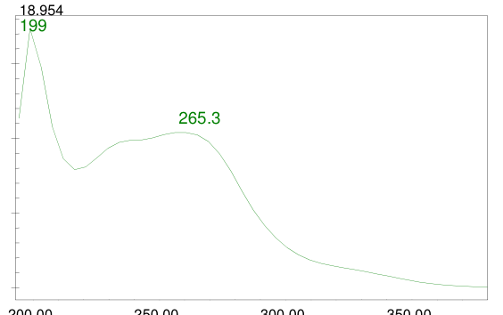
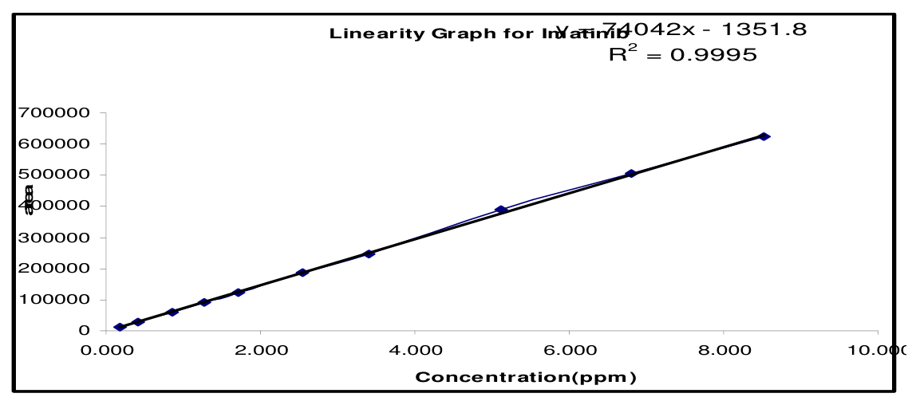
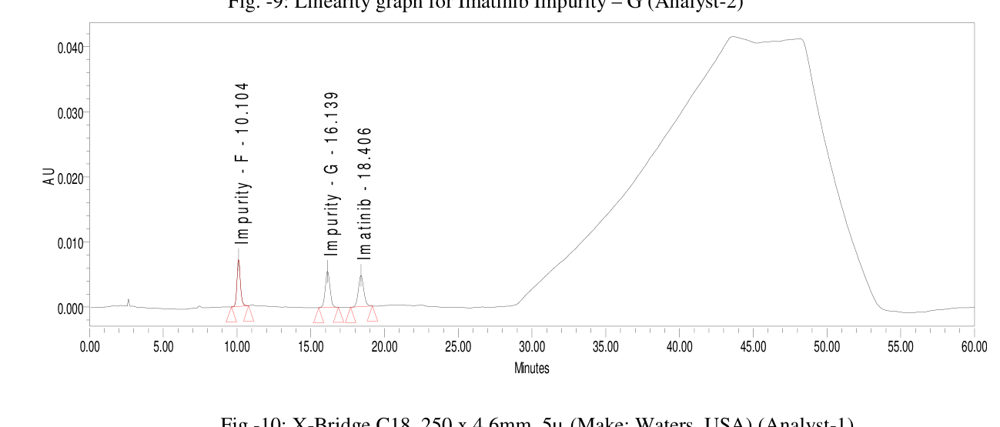
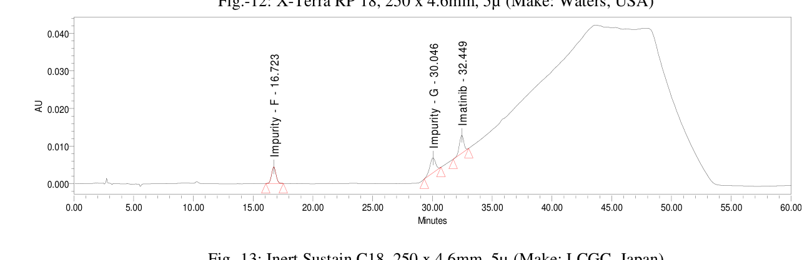

<!-- 方針: ほぼ全訳＋必要に応じた補足。原文構成に沿って訳出。表・数値を保持。本文の[N]は原文の番号引用に対応し末尾の参考文献にリンクする。図は代表的なもの（構造・検量線・クロマトグラム）を原本から抽出。「> 補足:」は訳者注。 -->

## 書誌情報

- 原題: The Role of Relative Response Factor in Related Substances Method Development by High Performance Liquid Chromatography (HPLC)
- 著者: V. Kalyana Chakravarthy, G. Kishore Babu, R. Lakshmana Dasu, P. Prathyusha, G. Aparna Kiran（Natco Pharma Limited 分析研究開発部, ハイデラバード, インド）
- 掲載: *Rasayan Journal of Chemistry*, Vol. 4, No. 4 (2011), 919–943. ISSN 0974-1496
- インパクトファクター: **該当なし**（*Rasayan J. Chem.* はオープンアクセスのインド化学系誌でJCR収載外。IF指標なし）

> 補足: **RRF（relative response factor, 相対応答係数）** ＝不純物と主成分（API）の検出器応答の差を補正する係数。標準品が入手できない不純物を、主成分の応答から換算して定量するために使う。本論文は分析法バリデーションの実務書として、①RRFを傾き法でどう確立するか、②確立したRRFがHPLC条件（カラム・温度・流速など）を少し変えるだけでどれだけ揺れるか、を抗がん剤 **イマチニブ（Imatinib）** の2不純物で実証した実験報告。対象不純物は **Impurity F（デスメチル体）** と **Impurity G（異性体）**。

## 要旨（Abstract）

高速液体クロマトグラフィー（HPLC）のクロマトグラフ条件——異なるHPLCカラム・流速・pH・温度・緩衝液濃度・検出波長・異なる検出器（UV・PDA）・異なる溶媒グレード——を変えて相対応答係数（RRF）の研究を行い、確立したRRFの変動を観測した。著者らは堅牢性パラメータとHPLCカラムを変えてRRFへの影響を調べ、全結果を比較した。比較研究は、方法条件のわずかな変動でも確立したRRF値に影響が観測されることを示した。

**キーワード:** RRF、相対応答係数、補正係数、応答係数、RRFの推定。

## 序論（Introduction）

相対応答係数（RRF）は、原薬・製剤中の不純物/分解物を管理するためクロマトグラフ手順で用いられる分析パラメータである。RRFは不純物と被検物ピークの検出器応答差を補正するのに使われ、線形範囲の溶液を用いた傾き法（slope method）で確立される。各薬局方はRRFという用語を異なる形で参照する。**米国薬局方（USP）** では、相対応答係数は等量の不純物と原薬の応答の比[1]で、USPはRRFを補正係数（Correction factor）・応答係数（Response factor）・相対応答係数のいずれでも呼ぶ。**欧州薬局方（Ph.Eur）** では、相対検出器応答係数（一般に応答係数と呼ぶ）は所与物質に対する検出器の感度を標準物質に対して表し、補正係数は応答係数の逆数[2]。**英国薬局方（BP）** では、応答係数は試験記載条件下での等重量の一方の物質の応答を他方に対して表す相対的な用語[3]である。

RRFの確立が必要なのは、標準の安定性問題を避ける、不純物標準の調製・維持コストを減らす、不純物標準の入手困難・合成/単離の困難、利便性・時間短縮のためである。RRFは第1相〜第4相試験、薬物純度試験、物質収支試験、限度試験、安定性指示法など様々な段階で使われる。

## 実験（Experimental）

イマチニブ錠[5]について正確・精密な関連物質（RS）法を開発し、RRF値を確立した。実験薬物としてイマチニブメシル酸塩、Impurity F（デスメチル不純物）、Impurity G（異性体不純物）を用い、分析法に従いクロマトグラフ条件を設定。HPLCカラム（同一固定相・異なるメーカー）・検出波長・検出器・カラム温度・流速・pH・緩衝液濃度・溶媒グレードを変えてRRF値の変動を観測した。

### RRFの推定（傾き法）

RRFは傾き法で推定する：(1) 試験法に従いブランク・分離能溶液・標準溶液を注入しシステム適合性を確立。(2) 試験濃度に対し0.1%〜1.0%（例：0.1・0.2・0.3・0.5・0.7・0.8・1.0%）の濃度範囲で、不純物と原薬を各7点以上調製し個別に注入（または規格レベルの上下各3点＋LOQ超を含む7点以上）。(3) 標準・不純物混合溶液も同様に調製・注入。(4) 標準・不純物の濃度対応答をプロット（ゼロ点は含めない）、最小二乗回帰で y=mx+c の直線を作り各傾きを決定。相関係数は標準・不純物とも0.995以上。

**有用な式:**

$$\text{API/不純物濃度} = \dfrac{\text{重量(mg)}}{\text{希釈(mL)}} \times \dfrac{\text{塩基の分子量}}{\text{塩の分子量}} \times \text{純度}$$

$$\text{RRF（不純物）} = \dfrac{\text{不純物溶液の傾き}}{\text{標準溶液の傾き}}$$

> 補足: 不純物の傾きが分子にあるとき、RRF値は不純物定量式で「除数（割る係数）」として現れる。逆に標準の傾きを分子にした RRF＝(標準の傾き)/(不純物の傾き) を使う場合、RRF値は「乗数（掛ける係数）」として現れる（式のどちらに置くかは本サイトの `correction-factors-impurity-content-rrf-epshtein` 参照）。

### 回収試験

確立したRRFが正しいことを確認するため回収試験は必須である。まず不純物の力価（potency）を、原薬・製剤の規格に記載のとおり算出する（遊離塩基は塩基として、塩は塩として、錯体は錯体として）。APIが塩や金属錯体で存在する場合は塩・錯体を含めて力価を算出する。不純物と原薬が同じ形（ともに塩基、ともに同じ塩形など）なら通常どおり算出する。不純物が塩基塩形で原薬が塩基形なら試験濃度に対し不純物に重量補正をかける。不純物が遊離塩基で原薬が塩基塩形なら原薬に重量補正をかける。両者が異なる形なら両方に重量補正をかける。

次に非添加・添加試料を調製・注入し、RRF値を用いて非添加・添加試料の各既知不純物の%を算出、回収率を求める。回収率は95〜105%であるべきで、範囲外なら誤差要因を除いて再実験する。範囲内ならRRFを既知個別不純物の%算出に組み込む。構造類似性に基づきAPIに対するRRFを比較し、構造差で説明できない大きなRRF差があれば調査する。外部（薬局方標準を除く）から入手した不純物にはLC-MS・クロマトグラフ純度・TGA（熱重量分析）の確認が必要である。不純物量に制約がある場合は、原薬・製剤の規格レベルと、その上下のレベルでRRF確立を行う。RRFは2回目でも確認すべきである。

本研究の回収試験（アナリスト1＝表7、アナリスト2＝表12）は、遠心分離および親水性PVDF（Millipore Millex-HV 0.45 µm）・ナイロン（Millipore Millex-HN 0.45 µm）ろ過での回収率を評価した。

### 表7・表12. 回収率（%）

| 前処理 | Impurity F（A1） | Impurity G（A1） | Impurity F（A2） | Impurity G（A2） |
|---|---|---|---|---|
| 遠心分離 | 99.7 | 99.8 | 99.6 | 99.7 |
| 親水性PVDFろ過 | 99.9 | 102.1 | 100.1 | 102.0 |
| ナイロンろ過 | 99.0 | 104.1 | 99.1 | 103.9 |

いずれも95〜105%の許容範囲内で、確立したRRF（F=0.83、G=0.93）が妥当であることを確認した。

### RRFに影響するパラメータ[4]

(i) カラム変更（同一固定相・異なるメーカー）、(ii) カラム粒子径変更、(iii) 検出波長変更、(iv) 検出器変更、(v) 溶媒グレード変更、(vi) 緩衝液濃度変更、(vii) カラム温度変更、(viii) 流速変更、(ix) pH変動。

### 分析法

イマチニブメシル酸塩（分子式 C29H31N7O·CH3SO3H、分子量589.7 g/mol、抗腫瘍薬）の錠剤製剤を対象とし、2既知不純物 Impurity F（デスメチル）・Impurity G（異性体）を含む。装置は Waters 2695ポンプ＋2487 UV検出器＋Empower2[5]。カラムは X-Bridge C18（250×4.6 mm, 5 µm, Waters）。緩衝液：リン酸二水素ナトリウム二水和物3.0 gを水1000 mLに溶かしトリエチルアミンでpH 8.0±0.05に調整。溶媒混合：メタノール/アセトニトリル600:400。移動相A：緩衝液/溶媒混合550:450。移動相B：溶媒混合。カラム温度30℃、流速1.0 mL/min、注入量20 µL、UV 230 nm、実行時間60分（グラジエントは表1）。

### 表1. グラジエントプログラム

| 時間(分) | 流速(mL/min) | 移動相A(%) | 移動相B(%) |
|---|---|---|---|
| 0.0 | 1.0 | 100 | 0 |
| 25.0 | 1.0 | 100 | 0 |
| 40.0 | 1.0 | 65 | 35 |
| 45.0 | 1.0 | 65 | 35 |
| 50.0 | 1.0 | 100 | 0 |
| 60.0 | 1.0 | 100 | 0 |

### 表2. 各既知不純物の相対保持時間（RRT）とRRF（既存法）

| No. | 成分 | RRT | RRF |
|---|---|---|---|
| 1 | Imatinib | 1.00 | 1.00 |
| 2 | Impurity-F | 0.54 | 0.83 |
| 3 | Impurity-G | 0.87 | 0.93 |

※イマチニブの保持時間は約18.5分。

## RRFの確立（アナリスト1）と確認（アナリスト2）

イマチニブメシル酸塩・Impurity F・Impurity G を約5 mgずつ100 mLに秤取し、試験濃度に対し0.02%〜1.00%の濃度系列に希釈。検量線（濃度対面積）の相関係数はイマチニブ0.999・Impurity F 1.000・Impurity G 0.999。ストック溶液濃度の算出例：

- イマチニブメシル酸塩：[5.002/100][99.0/100][493.6/589.7]×1000 = 41.45 ppm（係数493.6/589.7＝イマチニブ塩基/メシル酸塩の分子量比）
- Impurity F：[4.978/100][94.8/100]×1000 = 47.19 ppm
- Impurity G：[5.029/100][92.3/100]×1000 = 46.42 ppm

**RRF算出**（= 不純物の傾き / 活性成分の傾き）：
- Impurity F：61754.05/74167.65 = **0.83**
- Impurity G：68661.27/74167.65 = **0.93**

アナリスト2（別秤量・別調製）でも相関係数0.999〜1.000、同じRRF（F=0.83、G=0.93）を再現。回収試験（表7・表12）はImpurity F・Gとも遠心/親水性PVDF/ナイロンろ過で99.0〜104.1%と良好であった。

### 表4–6. 検量線データ（アナリスト1、抜粋）

| 濃度(%) | イマチニブ 面積 | Impurity F 面積 | Impurity G 面積 |
|---|---|---|---|
| 0.02 | 12416 | 10913 | 14473 |
| 0.10 | 59047 | 57650 | 62950 |
| 0.20 | 122994 | 117962 | 123825 |
| 0.40 | 244259 | 232984 | 254276 |
| 0.80 | 487411 | 465288 | 511777 |
| 1.00 | 610344 | 581793 | 637268 |
| **傾き** | **74167.65** | **61754.05** | **68661.27** |
| 相関係数 | 0.999 | 1.000 | 0.999 |

## RRF変動の研究

確立したRRFに影響するパラメータを変え、RRF値の逸脱を可視化した。

### (1) カラム変更（同一固定相・異なるメーカー15種）

X-Bridge C18・X-Terra RP-18・Inert Sustain C18・Cosmicsil BDS/Aster/Agate・Purosphere star・Hypersil BDS・Kromasil 100・X-Bridge Shield・YMC Pack ODS AQ・Atlantis T3・X-Bridge C18(3.5µ)・Develosil ODS MG-5・Sunfire C18 の15カラム。イマチニブと不純物の保持時間が大きく変わり、RRF値に有意な変動が観測された。各メーカーのシリカが異なり、同一の保持挙動を示すカラムは2つとない（PQRIアプローチ[6]）。各カラムは相対保持・疎水性・立体相互作用・水素結合酸性/塩基性・相対シラノールイオン化/陽イオン交換能が異なりうる。

### 表13. カラム変更によるRRF変動

| カラム | RRF F | RRF G | 変動% F | 変動% G |
|---|---|---|---|---|
| X-Bridge C18（基準） | 0.83 | 0.93 | — | — |
| X-Terra RP-18 | 0.84 | 0.98 | −1.2 | −5.4 |
| Inert Sustain C18 | 0.82 | 0.97 | 1.2 | −4.3 |
| **Cosmicsil BDS C18** | **0.59** | 0.99 | **28.9** | −6.5 |
| Purosphere Star C18 | 0.69 | 0.94 | 16.9 | −1.1 |
| Cosmicsil Aster C18 | 0.75 | 0.97 | 9.6 | −4.3 |
| Cosmicsil Agate C18 | 0.94 | 1.13 | −13.3 | −21.5 |
| Hypersil BDS C18 | 0.76 | 0.99 | 8.4 | −6.5 |
| Kromasil 100-5 C18 | 0.74 | 0.94 | 10.8 | −1.1 |
| X-Bridge Shield RP-18 | 0.80 | 0.94 | 3.6 | −1.1 |
| YMC Pack ODS AQ | 0.88 | 1.04 | −6.0 | −11.8 |
| Atlantis T3 C18 | 0.86 | 0.94 | −3.6 | −1.1 |
| Develosil ODS MG-5 | 0.81 | 0.98 | 2.4 | −5.4 |
| Sunfire C18 | 0.75 | 0.94 | 9.6 | −1.1 |

> 補足: カラム変更でImpurity FのRRFが0.83から最大0.59（Cosmicsil BDS、変動28.9%）まで動く。同じ「C18」でもメーカーが違えばRRFが3割変わりうる——これがRRFを移す際の最大の落とし穴。

### 各カラムでの保持時間（原論文 図10–25より）

RRFが揺れる根本原因は、カラムごとに保持時間（分）が大きく変わることにある。原論文の各クロマトグラム（図10–25）から読み取った保持時間を一覧化する。X-Bridge基準では Impurity F 約10分・Impurity G 約16分・Imatinib 約18分だが、カラムによっては Imatinib が40分超まで遅れ、Kromasil では溶出順が逆転（Impurity G が F より先に溶出）する。

| カラム | Impurity F | Impurity G | Imatinib |
|---|---|---|---|
| X-Bridge C18（基準・A1） | 10.104 | 16.139 | 18.406 |
| X-Bridge C18（A2） | 10.305 | 16.472 | 18.761 |
| X-Terra RP-18 | 11.740 | 17.956 | 19.445 |
| Inert Sustain C18 | 16.723 | 30.046 | 32.449 |
| Cosmicsil BDS C18 | 28.183 | 31.733 | 33.266 |
| Purosphere star C18 | 20.108 | 33.500 | 35.425 |
| Cosmicsil Aster C18 | 19.551 | 32.153 | 34.187 |
| Cosmicsil Agate C18 | 33.883 | 38.183 | 39.181 |
| Hypersil BDS C18 | 11.418 | 16.728 | 18.664 |
| Kromasil 100-5 C18（溶出順逆転） | 27.693 | 16.799 | 30.801 |
| X-Bridge Shield RP-18 | 13.959 | 20.492 | 22.659 |
| YMC Pack ODS AQ | 35.108 | 40.385 | 41.290 |
| Atlantis T3 C18 | 23.409 | 36.261 | 37.420 |
| X-Bridge C18（3.5µ） | 10.853 | 17.668 | 20.030 |
| Develosil ODS MG-5 | 33.833 | 40.449 | 41.367 |
| Sunfire C18 | 18.371 | 31.800 | 33.896 |

### 各堅牢性条件での保持時間（原論文 図26–39より）

| 条件 | Impurity F | Impurity G | Imatinib |
|---|---|---|---|
| 低流速 0.8 mL | 12.630 | 20.341 | 23.184 |
| 高流速 1.2 mL | 8.568 | 13.820 | 15.737 |
| 低温 25℃ | 10.773 | 17.602 | 20.209 |
| 高温 35℃ | 9.814 | 15.669 | 17.701 |
| 低波長 227 nm | 10.347 | 16.606 | 18.951 |
| 高波長 233 nm | 10.344 | 16.609 | 18.950 |
| 低pH 7.8 | 9.140 | 14.604 | 16.637 |
| 高pH 8.2 | 9.906 | 15.111 | 17.206 |
| UV 2487検出器 | 10.104 | 16.139 | 18.406 |
| PDA 2998検出器 | 10.344 | 16.604 | 18.947 |
| 低緩衝液濃度 18 mM | 10.584 | 17.044 | 19.412 |
| 高緩衝液濃度 22 mM | 10.305 | 16.472 | 18.761 |
| 溶媒 HPLCグレード | 9.863 | 15.710 | 17.933 |
| 溶媒 グラジエントグレード | 10.104 | 16.139 | 18.406 |

> 補足: 流速・温度・pHの変更でも保持時間は動くが、その範囲は数分以内でRRFへの影響は数%に留まる（表15–21）。対してカラム変更は保持時間を2倍以上動かし（Imatinib 18分→41分）、RRFを最大29%動かす。「RRFはカラムに最も敏感」という結論が、この保持時間の動きから直感的に理解できる。

### (2) 堅牢性試験（8項目）

粒子径（30%変動）・流速（1.0±0.2 mL）・温度（30±5℃）・波長（230±3 nm）・pH（±0.2）・検出器（UV 2487 vs PDA 2998）・緩衝液濃度（±10%）・溶媒グレード（HPLC vs グラジエント）。

### 表15–21. 堅牢性各項目のRRF変動（基準 F=0.83／G=0.93）

| 項目 | 条件 | RRF F | RRF G | 変動% F | 変動% G |
|---|---|---|---|---|---|
| 粒子径 | 3.5µ | 0.85 | 0.95 | −2.4 | −2.2 |
| 流速 | 0.8 mL | 0.86 | 0.96 | −3.6 | −3.2 |
| 流速 | 1.2 mL | 0.84 | 0.96 | −1.2 | −3.2 |
| 温度 | 25℃ | 0.90 | 0.99 | −8.4 | −6.5 |
| 温度 | 35℃ | 0.79 | 0.97 | 4.8 | −4.3 |
| 波長 | 227 nm | 0.82 | 0.94 | 1.2 | −1.1 |
| 波長 | 233 nm | 0.83 | 0.92 | 0.0 | 1.1 |
| pH | 7.8 | 0.84 | 0.95 | −1.2 | −2.2 |
| pH | 8.2 | 0.85 | 0.96 | −2.4 | −3.2 |
| 検出器 | PDA 2998 | 0.83 | 0.92 | 0.0 | 1.1 |
| 緩衝液 | 18 mM | 0.84 | 0.94 | −1.2 | −1.1 |
| 緩衝液 | 22 mM | 0.82 | 0.93 | 1.2 | 0.0 |
| 溶媒グレード | HPLC | 0.86 | 0.93 | −3.6 | 0.0 |

## 結果と考察（Results and discussion）

各種HPLCカラムと堅牢性パラメータでRRFへの影響を調べた。**カラム間変動**（同一固定相・異なるメーカー）では、イマチニブと不純物の保持時間が劇的に変わるため、RRF値に有意な変動が観測された。HPLCカラムのシリカはメーカーごとに異なり、同一の保持挙動を示すカラムは2つとない（PQRIアプローチ[6]）。USBアプローチ[6]ではC18カラム評価にNIST標準物質SRM 870（Uracil・toluene・ethylbenzene・quinizarin・amitriptylineの5化合物混合）を用いる。**カラム温度と流速** の変更でも有意な変動が観測された。**検出器・溶媒グレード・波長・粒子径・移動相pH・緩衝液濃度** の変更では軽微な変動であった。検出器ランプエネルギーもRRFに影響する。

米国薬局方フォーラム[7]は、RRFをいつ1.0に丸めてよいか示していない。スポンサーにより0.80–1.2、0.90–1.1、0.95–1.05の範囲で1.0に丸めるなど扱いが分かれる。RRF値は各条で、1.0以上なら小数第1位、1.0未満なら小数第2位（＝有効数字2桁）で記載する。ICH Q3A(R)は不純物結果を1.0以上なら小数第1位、1.0未満なら小数第2位で報告するとする。USPではRRFを記号「F」で表す。Ph.Eur[2]はRRFが0.8–1.2以外なら各条に含めることを要求する。BP[3]は応答係数0.2未満または5超は使わないとし、不純物と被検物の応答差がこの限度外なら、別の検出波長や別の可視化法など異なる決定法を用いる。

## 結論（Conclusion）

相対応答係数（RRF）は多くのクロマトグラフ手順で頻用される一般的な分析パラメータである。対応する標準品が入手できない場合が多いため、不純物の定量・限度試験に決定的に重要である。RRFパラメータは実験パラメータに敏感で、クロマトグラフ条件を逸脱すると値が変わる。RRFを確立する際は、原法条件から逸脱せず正確に従うべきである。

> 補足（実務的示唆）: 本論文は「RRFは条件に敏感で、少しの逸脱で揺れる」ことを、イマチニブ2不純物×（カラム15種＋堅牢性8項目）で網羅的に実測した実務データ集。要点は——①**カラムが最大の揺れ要因**（同じC18でもメーカーが違えばRRF最大29%変動、保持時間が大きく動くため）、②次いで**温度（±5℃で最大8.4%）・流速**、③**波長・pH・緩衝液・検出器・溶媒グレードは軽微**（数%以内）。したがってRRFを規格に載せるなら、カラムの銘柄・温度・流速まで含めて原法条件を固定し、移設時は回収試験（95–105%）で必ず再確認すべき。本サイトの `correction-factors-impurity-content-rrf-epshtein`（RRF/補正係数の正しい決め方＝切片aの有意性など）、`ssdmc-conversion-factor-ruggedness-salvia`（生薬での変換係数の実験室間ばらつき、統計計画で分解）、`rrf-multidetector-extractables-leachables-uncertainty-factor`（RRF変動を検出器の使い分けで回避）と併読すると、「RRFの揺れ」を定義・実測・回避の3面から理解できる。本論文はEpshtein 2019（`correction-factors-...`）の参考文献[10]として引用されている。

## 参考文献（References）

1. United States Pharmacopeia USP 34-NF 29, Chapter 621, 2011.
2. European Pharmacopoeia 7.0, Section 2.2.46 Chromatographic Separation Techniques, 2010.
3. British Pharmacopoeia, Control of Impurities, A530 Supplementary Chapter I A, 2008.
4. ICH Guidelines on Validation of Analytical Procedure: Text and Methodology Q2(R1), 2011.
5. L. R. Snyder, J. J. Kirkland, J. I. Glajch, *Practical HPLC Method Development*, 2nd ed., 1997.
6. HPLC Column Classification, B. Bindlingmeyer et al. (PQRI/USP Approach), *Pharmacopoeial Forum*, Vol. 32 (March–April 2005).
7. L. Bhattacharyya, H. Pappa, K. A. Russo, E. Sheinin, R. Williams, The Use of Relative Response Factors to Determine Impurities, *Pharmacopeial Forum*, 31(3), May–June 2005.
