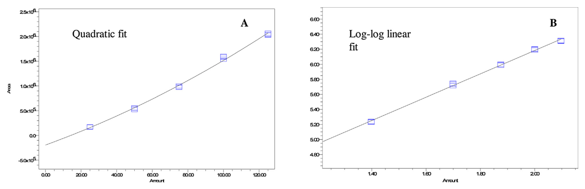
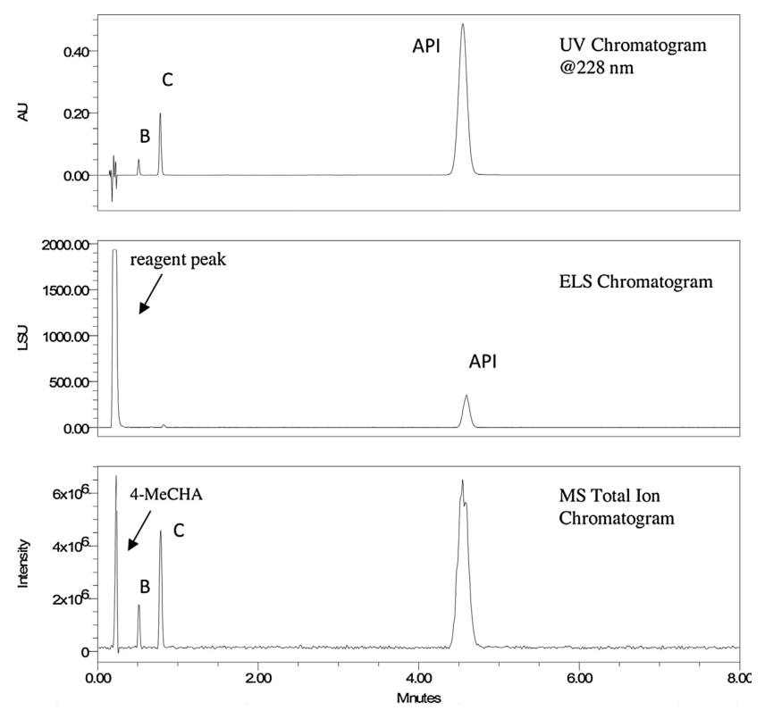
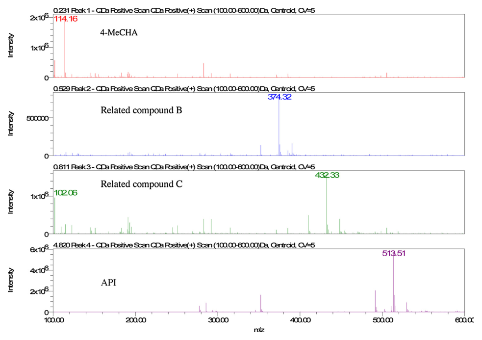
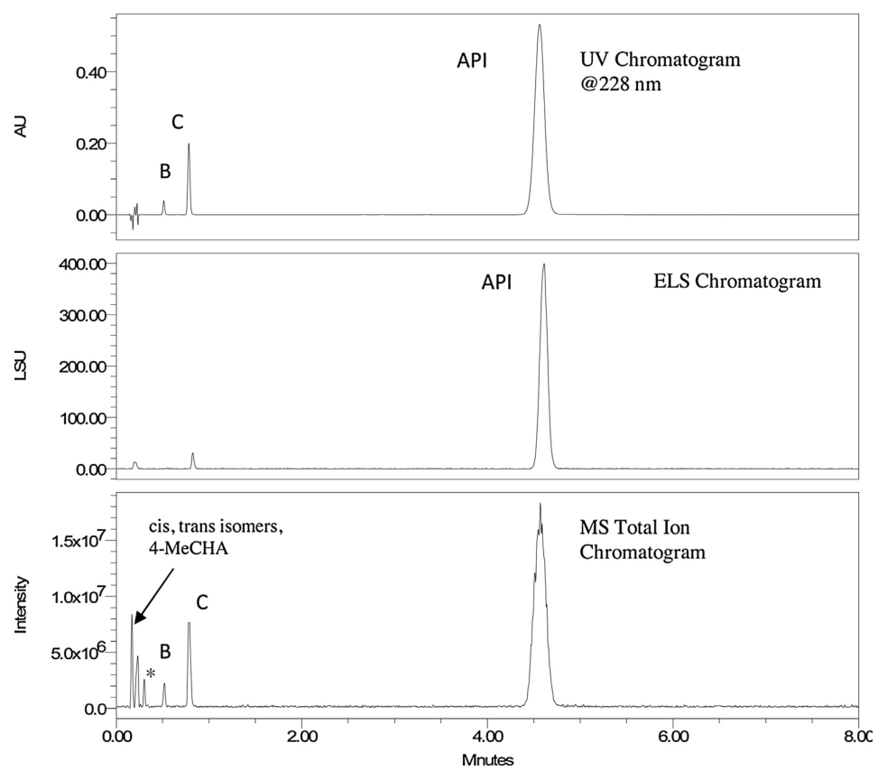
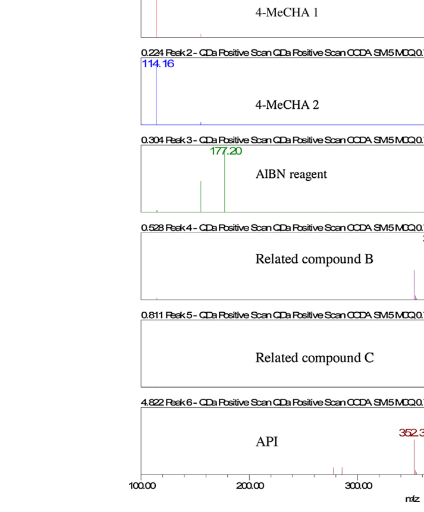
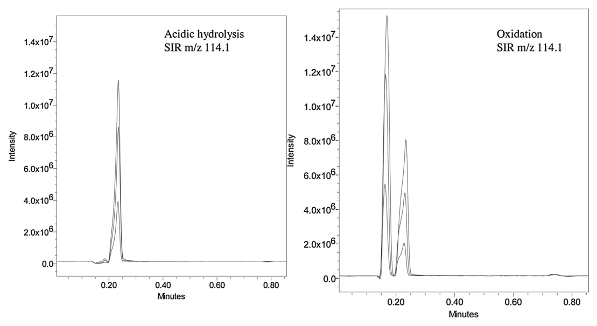
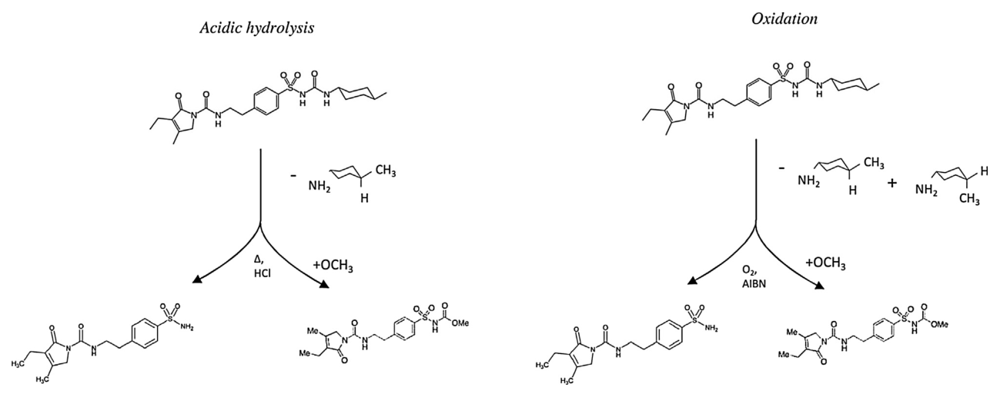

<!-- 方針: ほぼ全訳＋必要に応じた補足。原文構成に沿って訳出。表・数値・数式を保持。本文の[N]は原文の番号引用に対応し末尾の参考文献にリンクする。図はPyMuPDFで原本から抽出。「> 補足:」は訳者注。 -->

## 書誌情報

- 原題: Study of relative response factors and mass balance in forced degradation studies with liquid chromatography/photo-diode array detector/evaporative light scattering detector/mass spectrometry system
- 著者: Paula Hong, Aaron D. Phoebe, Michael D. Jones（Waters Corporation, Milford, MA, 米国）
- 掲載: *Journal of Chromatography A*, 1512 (2017) 61–70. https://doi.org/10.1016/j.chroma.2017.07.001（第31回国際クロマトグラフィーシンポジウム ISC2016 選抜論文）
- インパクトファクター: **約4.1**（*J. Chromatogr. A*, JCR 2024 / Clarivate）
- 受理経過: 受領 2016-12-19 / 改訂 2017-06-27 / 採録 2017-07-01 / オンライン公開 2017-07-04

> 補足: **RRF（relative response factor, 相対応答係数）** ＝不純物と原薬（API）の応答係数の比。不純物を「面積÷RRF」で補正して定量する。**mass balance（物質収支）** ＝分解前の原薬量と、分解後の（残存原薬＋分解物）量の一致度。100%からズレると「未説明の質量損失」＝見えない分解物や定量誤差を示唆する。**ELSD（蒸発光散乱検出器）** は発色団を持たない化合物も検出できる「質量感応」検出器だが応答が非線形。**直交検出（orthogonal detection）** ＝原理の異なる検出器（UVは吸光度、ELSDは質量）を組み合わせ、標準品なしでRRFを推定する手法。対象は経口血糖降下薬 **glimepiride**。

## 要旨（Abstract）

フォトダイオードアレイ検出（PDA）を蒸発光散乱（ELS）検出・質量分析（MS）と組み合わせたケーススタディを行い、原薬 glimepiride の強制分解試験における物質収支（mass balance）と相対応答係数（RRF）の両方を評価した。RRF値（不純物の応答係数と原薬の応答係数の比）を、まず標準品の検量線で決定した。この従来法を、PDAとELS検出器でUVピーク面積と（ELS測定に基づく）濃度を1回の分析で同時に求める第二のマルチ検出法と比較した。得たRRF値を glimepiride 原薬の強制分解試験（酸加水分解・酸化）に適用し、物質収支と不純物定量を評価した。不純物RRF値を適用する影響を評価したところ、より高い分解レベルで、定量される不純物%と物質収支計算に有意な影響を及ぼすことがわかった。加えて、MSを用いて非発色団の副生成物を定量し、物質収支への影響を評価した。MS検出による強制分解試験の分析は、新たな知見とともに分解経路の確認も与えた。具体的にはMSにより分解過程の立体選択性の違いが明らかになった。酸加水分解による分解は trans 副生成物を生じる立体選択的反応、酸化による分解は cis/trans 両異性体を生じる非立体選択的反応であった。

**キーワード:** 強制分解、相対応答係数、物質収支、蒸発光散乱、質量分析。

## 1. 序論（Introduction）

医薬品業界では、患者の安全性・品質・有効性を評価するため、原薬・製剤の安定性試験が求められる[1,2]。目的はこれら成分の分解過程を理解することであり、したがって強制分解・加速安定性試験・実時間安定性試験が分析の不可欠な一部となる。特に強制分解試験は、原薬・製剤を通常遭遇しうるより過酷な環境条件（熱・光・酸化）に曝すことを要する[3,4]。強制分解は、有効成分（API）の分解経路理解の最初の評価を与える。さらにこれら試験の物質収支の早期・概算の決定は、長期試験で生じうる予測的問題への洞察を与えうる。

物質収支は、大半の原薬・製剤でPDA付き液体クロマトグラフィー（LC）で評価されるのが典型である[5,6]。しかし、薬物や不純物が正確に定量されないと物質収支は影響を受ける。この不正確な定量は、未説明の質量損失や、予想より高い物質収支をもたらしうる。LC-PDA/UV法では、全被検物の分離が不十分、顕著な発色団を持たない化合物、不純物と製剤の応答差、などの場合にこの定量の食い違いが生じうる[7,8]。さらにUVでの限定的・低レベル不純物の存在も、検出限界と応答差の影響で正確な定量が損なわれ、物質収支に影響しうる。

米国薬局方などの規制当局は、不純物を主成分の応答に基づいて定量することを認めている[9]。このアプローチは、より正確な定量のため、不純物をAPIに対して定量するRRF値の使用を可能にする。RRF値を測定する最も一般的な手法は、UV-vis または PDA検出器で測定した不純物とAPIの検量線の傾きの比を用いる（式1）[10]:

$$\mathrm{RRF} = \dfrac{\text{不純物の検量線の傾き}}{\text{APIの検量線の傾き}} \tag{1}$$

このアプローチはよく確立されているが、標準品一式の調製とその入手可能性を前提とする。多くの場合これら標準品は入手できず、特定のストレス条件下で未知不純物が現れると特有の課題を生む。

この課題に対処するため、質量感応検出をPDA/UV検出と組み合わせる手法がRRF値決定のツールとして提案されてきた[8,11,12]。このアプローチは、応答と被検物濃度の両方を1回の分析で得るため、質量ベース検出をLC-UVと組み合わせて分析する。UV/PDA検出では、化合物の応答はBeer則で定義される濃度・量に関係する（式2）:

$$A = \varepsilon l c \tag{2}$$

ここでAは面積、εはモル吸光係数、lは光路長、cは被検物モル濃度。したがって二重検出器の応答を組み合わせると、不純物のRRFは次式で表せる:

$$\mathrm{RRF} = \dfrac{\text{ピーク面積}_\text{不純物}/\text{濃度}_\text{不純物}}{\text{ピーク面積}_\text{API}/\text{濃度}_\text{API}} \tag{3}$$

あるいは文献で提案されているとおり、UV検出器の被検物応答とモル質量感応検出器の応答の比でRRF値を決定できる:

$$\mathrm{RRF} = \dfrac{\text{UV面積}_\text{不純物}/\text{濃度検出器面積}_\text{不純物}}{\text{UV面積}_\text{API}/\text{濃度検出器面積}_\text{API}} \tag{4}$$

いくつかの調整を加え、このアプローチは荷電化エアロゾル検出器（CAD）[8,11]や化学発光窒素検出器（CLND）[13]でのRRF推定に示されてきた。加えて、この方法論はUV/PDA検出と組み合わせた蒸発光散乱（ELS）検出でも提唱されてきた。これら代替検出法は、限定的な線形ダイナミックレンジや揮発性移動相の必要性などの制約をもちうると研究が示している[14]。それでも、標準品がない状況で相対応答比を得る課題は、直交検出法を適切なRRF値決定の魅力的な実験アプローチにする。

不純物RRFの評価法によらず、追加の検出法は物質収支決定を支援できる。MSやELSのような検出器は、UVで観測できない非発色団化合物の同定・定量を可能にする。特にMSは強制分解試験で、同定だけでなく定量にもより一般的に使われるようになった[15]。直交検出法は、分解経路への洞察と、物質収支計算で非発色団化合物を勘定する能力を与える。

## 2. 方法と材料（Methods and materials）

### 2.1 試薬

glimepiride、関連化合物B（3-Ethyl-4-methyl-2-oxo-N-(4-sulfamoylphenethyl)-2,5-dihydro-1H-pyrrole-1-carboxamide）、関連化合物C（methyl carbamate 体）は米国薬局方（Rockville, MD）から購入。glimepiride 原薬は Alibaba.com（上海）から入手。アセトニトリル・4-メチルシクロヘキシルアミン（4-MeCHA）・NaOH・メタノールは Thermo-Fisher、AIBN・ギ酸・HClは Sigma-Aldrich、精製水は EMD Millipore Milli-Q から得た。

### 2.2 装置

クロマトグラフ系は ACQUITY UPLC H-Class（四元送液・フロースルーニードルオートサンプラー・カラムマネージャ、Waters）。検出はPDA（ACQUITY UPLC PDA）・蒸発光散乱検出器（ACQUITY UPLC ELSD）・質量検出器（ACQUITY QDa）。カラムからの流路は三方スタティックティー（1:10 分流）で分割し、一部をPDA、続いて直列でELS検出器へ、最終部を検出器プローブ経由でMSへ導いた。データ系は Empower 3 FR3。

### 2.3 分析条件

glimepiride と関連化合物B・Cの分離は ACQUITY UPLC HSS T3 C18カラム（2.1×50 mm, 1.8 µm）でアイソクラティック条件で達成。移動相は 0.1%ギ酸を含む水/アセトニトリル(60:40)、流速0.8 mL/min、カラム温度30℃、注入量4 µL。PDAは228 nm・20点/秒。ELSDはガス圧25 psi・ネブライザー冷却モード・ドリフト管温度55℃・ゲイン100・10点/秒。メイクアップポンプで0.1%ギ酸メタノールをカラム後添加（0.3 mL/min）しMSへ。MSは正イオンESI（ESI+）・コーン電圧5 V・キャピラリー電圧1.4 kV・5点/秒・質量範囲100–600 Da。加えてm/z 114.1・374.3・432.4・513.5のSIRチャンネルを同時取得。

### 2.4 試料調製

**RRF決定用標準（LC-PDA）:** glimepiride と各関連不純物をメタノールで0.4 mg/mLに個別調製。作業標準は水/メタノール(25:75)で希釈。glimepiride（API）は試料濃度0.250 mg/mLに対し0.05〜100%（10点）、関連化合物B・Cは0.05〜40%（9点）で各3重に調製。glimepiride の表示純度99.6%、各関連化合物100%。**RRF決定用標準（LC-PDA-ELS）:** 3化合物すべてを含む作業標準を10・20・30・50%で3重に調製。**強制分解:** glimepiride 原薬をメタノールで0.75 mg/mL。酸加水分解は最終0.1 M HCl、酸化は最終AIBN 5.7 mg/mL。全試料・対照を40℃水浴で加熱。1・3・5・7日で2 mL採取し希釈（酸化）またはNaOH中和（酸加水分解）。目標はAPI総分解10–20%。最終試料濃度0.250 mg/mL（水/メタノール25:75）。**MS定量用4-MeCHA標準:** 0.4 mg/mLストックを希釈し0.04〜5%で3重調製。表示純度99.7%。

## 3. 結果と考察（Results and discussion）

### 3.1 手法開発と最適化

glimepiride の強制分解分析を評価する手法を開発。UV・ELS・MS検出との適合性を確保するため、揮発性移動相のアイソクラティック法を開発。アイソクラティック条件はELS検出でクロマトグラム全体の応答を揃え、揮発性移動相はMSでの成分同定を可能にした。カラム固定相は極性不純物をより保持しつつ不純物の定量限界（0.05%）を満たすよう選択。関連化合物Bのk'は2.5、Cは4.5。0.05%不純物でのS/NはBが61、Cが44。

### 3.2 UV検出の直線検量線によるRRF決定

USP定義のRRF（不純物のAPIに対する応答）[9]をLC-UVで決定するため、不純物とAPIの検量線傾きの比を用いた。強制分解試験では典型的にAPIの0.05%を不純物報告閾値として10–15%分解を目指す[9]。したがって不純物は0.05〜20%、APIは0.05〜100%の範囲で標準を試験。glimepiride と関連不純物の検量線は1/x重み付けで相関係数R²>0.995（表1）。最低検量点のS/Nは10超でUSP定義の定量限界を満たした。式(1)によりRRFを算出したところ、関連化合物Bで1.32、Cで1.15を得た（表1）。

### 表1. glimepiride と関連化合物のPDA検量線とRRF

| 化合物 | n | 適合 | 重み | y切片 | 傾き(b) | R² | RRF |
|---|---|---|---|---|---|---|---|
| Glimepiride | 10 | 線形 | 1/x | 3530 | 16088 | 0.999391 | 1.00 |
| 関連化合物B | 9 | 線形 | 1/x | −110 | 21421 | 0.999167 | 1.32 |
| 関連化合物C | 9 | 線形 | 1/x | 1550 | 18534 | 0.999315 | 1.15 |

### 3.3 直交UV-ELS検出によるRRF推定

直交検出法の実現可能性を評価するため、glimepiride と関連化合物を含む作業標準を直列接続のUV-ELS系で分析。検量標準は10・20・30・40・50%で3重調製。ELS検出の感度制約からUV/PDA単独（3.2節）より高濃度の標準が必要[8,16]。得た検量線はELSで非線形応答を示した（関連化合物Bにつき図1A）。これはELS検出器の応答が次の関数に基づくため予想された[17]:

$$A = a \times m^{b} \tag{5}$$

ここでAは面積、mは質量、a・bは検出器特性・移動相条件・光散乱粒子のサイズと形状などに依存する係数。この関数はlog-log関数でも表せる:

$$\log A = b \log m + \log a \tag{6}$$

このlog-log変換で直線検量線が引ける（図1B）。適用の結果、glimepiride と関連不純物でR²>0.995の直線検量線を得た（表2）。

### 表2. glimepiride と関連化合物のELS検量線（log-log適合）

| 化合物 | n | 適合 | 重み | y切片(log a) | 傾き(b) | a | R² |
|---|---|---|---|---|---|---|---|
| Glimepiride | 5 | log-log線形 | なし | 2.33 | 1.69 | 213 | 0.996650 |
| 関連化合物B | 5 | log-log線形 | なし | 3.08 | 1.55 | 1202 | 0.998007 |
| 関連化合物C | 5 | log-log線形 | なし | 2.90 | 1.57 | 794 | 0.996128 |

一方の検出器を吸光度ベース、もう一方を相対モル量ベースとする二重直交検出でRRFを決定する当初の概念に戻ると、RRFは次式で表せる:

$$\mathrm{RRF} = \dfrac{\text{UV面積}_\text{不純物}/\text{ELS面積}_\text{不純物}}{\text{UV面積}_\text{API}/\text{ELS面積}_\text{API}} \tag{7}$$

ただしELS検出は広い検量範囲で非線形応答を示すため、式(7)はUV・ELS双方の線形関係を仮定する。したがってAPIと不純物のELSピーク面積間に直線関係を得るため、log-log変換原理を適用し、ELSピーク面積をlog関数で置き換える:

$$\mathrm{RRF} = \dfrac{\text{UV面積}_\text{不純物}/\text{ELS}\log(\text{面積}_\text{不純物})}{\text{UV面積}_\text{API}/\text{ELS}\log(\text{面積}_\text{API})} \tag{8}$$

この関数を用い、10–50%(w/w)の標準で関連化合物B・CのRRFを決定（表3）。3.2節の値と比較すると手法間の高い相関が観測された。PDA-ELS検出で得た平均RRFは関連化合物B 1.25・C 1.11、PDA検量線傾きでは B 1.32・C 1.15であり、本アプローチの有用性を示した。

### 表3. UVピーク面積とELS log面積関数の比で決定したRRF

| 標準濃度(w/w) | 試料番号 | RRF 関連B | RRF 関連C |
|---|---|---|---|
| 10% | 1–3 | 1.26 / 1.23 / 1.25 | 1.13 / 1.11 / 1.11 |
| 20% | 4–6 | 1.26 / 1.23 / 1.23 | 1.11 / 1.09 / 1.10 |
| 30% | 7–9 | 1.26 / 1.25 / 1.26 | 1.10 / 1.11 / 1.11 |
| 40% | 10–12 | 1.24 / 1.24 / 1.24 | 1.10 / 1.10 / 1.11 |
| 50% | 13–15 | 1.29 / 1.26 / 1.25 | 1.17 / 1.11 / 1.11 |
| **平均** | | **1.25** | **1.11** |
| SD / %RSD | | 0.017 / 1.34 | 0.018 / 1.65 |

LC-PDA-ELSによる不純物RRF推定は有用なツールを提供するが、制約もある。関連不純物がELS検出に十分な量で存在する必要がある[18]。また原薬・製剤の強制分解では、モル質量ベース検出での定量に必要なAPI・不純物の濃度を達成するのが難しいことがある。さらに原薬・製剤中の非発色団種がELS検出の分離・定量に影響しうるため、他のAPIで分析する際は考慮すべき。最後に、非常に異なるサイズの粒子形成はAPIと関連不純物の関係に影響しうる。粒子のサイズと形状は光散乱機構（Rayleigh-Debye・Mie・屈折反射）に影響する[19]ため、極端にサイズの異なる粒子は本解析に必要な比較可能な応答・相対応答を与えないことがある。

### 3.4 酸加水分解・酸化条件での分解分析と物質収支

glimepiride（1-[[4-[2[(3-ethyl-4-methyl-2-oxo-3pyrroline-1-carboxamido)ethyl]phenyl]-sulphony]-3-trans-(4-methylcyclohexyl)urea]）は、酸・酸化条件下でカルボキサミド結合とスルホニル尿素架橋での反応を受けやすい。この反応性を評価するため、原薬を酸安定性試験に0.1N HCl、酸化安定性試験にAIBNで曝露。目標はUV定量で10–20%分解。試料を2日間隔で試験し、UV-ELS・MS検出で分析。所望の分解レベル達成には酸・酸化条件への7日曝露を要した。PDA・ELS検出で分析を監視、MSで同定・ピーク追跡した。

glimepiride の酸加水分解（図2）は2つの不純物ピーク（関連化合物B・C）を生じ、MSで確認された。酸分解条件下、関連化合物B・Cおよび glimepiride でMSにナトリウム付加体が観測された（図3）。ELS検出器は関連化合物Bの直前に溶出する追加ピークも示した。このピークは対照試料にも存在し、一部は試薬に帰属できる。glimepiride の分解経路は既報[15]で記述され、関連化合物B・C双方の形成時に4-MeCHAの脱離があり、MSで確認された（図3）。

酸化条件下でも、UV検出で酸条件と同様のクロマトグラフプロファイルが観測され関連化合物B・Cが形成された（図4）。ただしマススペクトルはUVクロマトグラムに比べ3つの追加ピークを示した。0.30分のピークはAIBN対照にも存在（m/z 177.2 Da）し試薬に帰属（図5）。主要m/z 114.1 Daの4-MeCHAに対応する2ピークも観測され、4-MeCHA標準との比較からcis-・trans-異性体であった。

両分解試験で物質収支とRRF値の影響を検討した。物質収支は多様な算出・報告法があるが、本研究ではUV測定ピーク面積で算出:

$$\text{Mass Balance} = \dfrac{\sum \text{Area}_{i,x}}{\sum \text{Area}_{R,0}} \times 100 \tag{9}$$

ここで Area_{R,0} は参照試料のピーク面積合計（総質量）、Area_{i,x} は分解試料のそれ。総ピーク面積の0.10%超の全ピークを合計。参照試料は分解試料と同時に試験し、手法・条件・装置の日間変動を低減。%不純物もピーク面積で算出。

この方法で、酸・酸化分解の%分解と物質収支を7日間2日毎に分析。7日終了時、酸加水分解はAPI約20%分解を生じた。同期間の見かけ物質収支は99.16–103.52%（表4）。時間経過での変化は最小だが、7日で最大の物質収支103.52%が観測された。

前述のとおり不純物とAPIの応答差は不純物定量と物質収支決定に影響しうる。物質収支の精度と分解の程度（%不純物）を決めるため、RRF値を用いた計算も行った。各不純物のピーク面積を次で補正:

$$\text{Corrected Area}_i = \dfrac{\text{Area}_i}{\mathrm{RRF}_i} \tag{10}$$

ここでRRF_iはUV-ELS検出で実験的に決定した値（表3、関連B 1.25・C 1.11）。本研究の両関連不純物はRRF>1.0のため、補正面積は各不純物の（未補正）ピーク面積より小さくなる。補正面積を物質収支計算に用いた:

$$\text{Corrected Mass Balance} = \dfrac{\sum \text{Corrected Area}_{1,x}}{\sum \text{Corrected Area}_{R,0}} \tag{11}$$

$$\sum\text{Corrected Area} = \text{Area}_\text{API} + \text{Corrected Area}_{i,1} + \text{Corrected Area}_{i,2} + \cdots \tag{12}$$

これらの応答調整で、酸加水分解の%不純物・物質収支補正値を決定した（表4）。酸加水分解条件下で不純物（関連B・C）のピーク面積補正により、7日で%不純物が面積のみ使用時の19.55%から16.69%へ3%低下。補正物質収支も7日でRRF未調整の見かけ収支103.52%から100.19%へ3–4%低下した。

### 表4. 酸加水分解原薬のRRF補正前後の物質収支（UV/ELS法）

| 時間(日) | 不純物面積 | 総面積 | %不純物 | 見かけ収支(%) | 不純物補正面積 | 総補正面積 | %不純物(補正) | 補正収支(%) | 総量(µg/mL) |
|---|---|---|---|---|---|---|---|---|---|
| 参照 | 25053 | 4064121 | 0.62 | – | 21606 | 4059339 | 0.53 | – | 250.0 |
| 1 | 96855 | 4045552 | 2.39 | 99.20 | 85347 | 4028733 | 2.11 | 98.76 | 246.9 |
| 3 | 256914 | 4172795 | 6.16 | 102.37 | 227262 | 4129162 | 5.14 | 101.37 | 253.4 |
| 5 | 391055 | 4043862 | 9.67 | 99.16 | 345596 | 3977081 | 8.69 | 97.64 | 244.1 |
| 7 | 826352 | 4225907 | 19.55 | 103.52 | 726832 | 4080914 | 16.69 | 100.19 | 250.5 |

同じ解析を酸化分解でも実施。酸化条件では同期間により穏やかな分解が起こり、7日で約10%のAPI分解（表5）。この例では分解レベルは見かけ物質収支に有意な影響を与えず、97.60〜100.99%が観測された。応答差を勘定した%不純物・補正物質収支も決定（表5）。RRF値使用で、酸化条件下でも酸加水分解と同様の傾向：補正面積使用で7日に%不純物・物質収支とも1–1.5%低下。これはRRF調整なしでは%不純物・物質収支が過大報告されることを示す。さらに分解の程度が大きいほど影響も大きく、最も有意な差は7日で生じた。

### 表5. 酸化分解原薬のRRF補正前後の物質収支（UV/ELS法）

| 時間(日) | 不純物総面積 | 総面積 | %不純物 | 見かけ収支(%) | 不純物補正面積 | 総補正面積 | %不純物(補正) | 補正収支(%) | 総量(µg/mL) |
|---|---|---|---|---|---|---|---|---|---|
| 参照 | 28102 | 4139644 | 0.7 | – | 24414 | 4118924 | 0.6 | – | 250 |
| 1 | 73491 | 4184298 | 1.75 | 100.99 | 64589 | 4109561 | 1.57 | 100.7 | 251.8 |
| 3 | 203294 | 4210333 | 4.83 | 97.70 | 180076 | 4006617 | 4.49 | 97.00 | 242.5 |
| 5 | 320295 | 4192747 | 7.64 | 98.40 | 284040 | 3871958 | 6.28 | 96.92 | 242.3 |
| 7 | 425910 | 4250339 | 10.13 | 97.60 | 377805 | 4132242 | 9.14 | 96.10 | 240.3 |

RRF差の補正あり/なしの回収率への影響は、高%分解でより顕著。APIピーク面積は不変のため、式(11)の不純物ピーク面積補正は%分解およびRRFの1からの偏差の双方に正比例する。分解生成物の量(%)が大きいほど補正物質収支の変化が大きく、RRFが1から離れるほど不純物定量の変化が大きい。応答が大きく異なる化合物や高い分解量では影響が有意となる。全例で%不純物と回収率は同様に影響されたが、%不純物への含意はより大きい。不純物の報告・同定・確認閾値は0.05%程度でも影響されうるためである[20]。

### 3.5 MS検出による分解経路の確認と物質収支の調整

glimepiride の分解経路は既報[15]で記述され、関連化合物B・C双方の形成時に4-MeCHAの脱離がある。glimepiride は4-MeCHA官能基をtrans-異性体として含み、関連化合物Aはcis-異性体を含む。MS検出で4-MeCHAの単一イオン記録（SIR）チャンネルによる定量は、全イオンチャンネル（TIC）に比べ感度・特異性を改善した。SIR分析は分解反応での副生成物存在を確認し、酸・酸化分解双方で時間とともに増加を観測（図6）。ただし前述のとおり酸分解では単一ピーク、酸化条件では2ピークが観測された。これは幾つかの可能性を示唆する。例えば原薬がglimepirideのcis-異性体または関連化合物A[21]（酸化条件でのみ分解）を含む、あるいはラジカル発生剤AIBNによる酸化中に4-MeCHAがtrans-からcis-異性体へ変換される、など。いずれにせよ、酸加水分解反応は立体選択的、ラジカル発生剤による酸化は非立体選択的と考えられる（図7）。

分解中の4-MeCHA定量には、市販試薬で検量線を決定。作業標準(n=5)を0.04〜10%(0.1–25 µg/mL)で調製。標準はcis-・trans-幾何異性体の混合物として存在し、部分分離するため異性体の合計を検量線に用いた。検量線は重みなしで二次適合、定量範囲でlog-log適合により線形化（傾き0.835・y切片6.77・R²0.997563）。最低検量点のS/Nは10超。

7日間の酸化分解で、4-MeCHA定量は不純物形成に伴う副生成物レベルの増加を示した（表6）。1日で4-MeCHAは1.48 µg/mL（原薬の0.59%）、7日で13.69 µg/mL（5.48%）へ増加。4-MeCHAは関連化合物B・C形成の副生成物として生じるため、面積は分解の程度に直接関係する。API 1グラムが関連化合物B・Cへ分解すると4-MeCHAが0.23%形成される。例えば5日でAPI 15.7 µg/mL（6.28%）が分解し、4-MeCHA 6.70 µg/mL（2.68%）を伴い、予想値内であった。

µg/mL単位の4-MeCHA量を表5の補正物質収支値に加算し、副生成物定量が物質収支に及ぼす影響を評価。7日の物質収支は4-MeCHAなしの97.21%（補正物質収支）から4-MeCHA込みの101.6%（最終物質収支）へ増加（表6）。一般に高い分解レベルでは4-MeCHAの損失がより影響し、より正確な物質収支を与える。

### 表6. 酸化条件での4-MeCHA定量と物質収支への影響

| 時間(日) | 4-MeCHA µg/mL(%) | 総量(µg/mL) | 量+4-MeCHA | 参照量(µg/mL) | 補正収支(%)(4-MeCHA除く) | 最終収支(%)(4-MeCHA込) |
|---|---|---|---|---|---|---|
| 1 | 1.48 (0.59%) | 251.8 | 253.3 | 250.0 | 100.7 | 101.3 |
| 3 | 4.02 (1.61%) | 242.5 | 246.5 | 250.0 | 97.00 | 98.60 |
| 5 | 6.70 (2.68%) | 242.3 | 249.0 | 250.0 | 96.92 | 99.60 |
| 7 | 13.69 (5.48%) | 240.3 | 254.0 | 250.0 | 97.21 | 101.6 |

## 4. 結論（Conclusions）

PDA/UV・ELS・MSを含むマルチ検出の使用は、RRF決定と物質収支計算の双方に追加手法を可能にする。UV検出単独がこれら解析に一般的だが、UV検出器とELSのような質量感応検出器の組み合わせでRRF値を1回の分析で推定できる。ELS検出器の感度制約により、ELSで類似応答をもつ化合物が等量存在するとき従来法との相関が最も高い。医薬品の強制分解試験へのマルチ検出法の適用は、分解経路の監視と、非発色団化合物を含む全生成物の定量能力を与える。本例では特にMSを非発色団副生成物の定量に用い、酸加水分解・酸化分解の物質収支のより包括的な理解を得た。酸・酸化分解反応の立体特異性の違いもMSで示された。さらに非発色団成分の加算は、特に大規模な分解が起こりうる場合に、より包括的な物質収支評価を与える。

> 補足（実務的示唆）: 本論文の実務価値は3点。①**標準品がなくてもRRFを推定できる**——UV（吸光度）とELSD（質量感応）を直列につなぎ、ELSDの非線形をlog-log変換で線形化すれば、1回の分析で不純物のRRFが得られる（従来の検量線傾き比とよく一致）。②**RRF補正は「効くときに効く」**——分解率が高くRRFが1から離れるほど、%不純物と物質収支の過大報告が大きくなる（酸加水分解7日で収支103.5→100.2%）。低分解なら差は小さい。③**MSで「見えない分解物」を勘定して収支を閉じる**——UVで見えない非発色団副生成物（4-MeCHA）をMSで定量し物質収支に加算、さらに立体選択性（酸=trans選択的／酸化=非選択的）まで判明。本サイトの `correction-factors-impurity-content-rrf-epshtein`（RRF/補正係数の正しい決め方）や `ssdmc-conversion-factor-ruggedness-salvia`（RRFの実験室間ばらつき）と同じ「RRFを正しく扱う」系統で、規制対応（強制分解・不純物プロファイル）の実務として読める。

## 参考文献（References）

1. ICH harmonised tripartite guideline, Q1A(R2) Stability Testing of New Drug Substances and Products, ICH, Geneva, 2003.
2. 2016 U.S. Pharmacopoeia-National Formulary [USP 39 NF 34], 〈1086〉 Impurities in Drug Substances and Drug Products, USP Convention, 2016, p. 1176–1179.
3. R. Maheswaran, Scientific considerations of forced degradation studies in ANDA submissions, *J. Valid. Technol.* 18 (2016) 92–96.
4. S.W. Baertschi, Analytical methodologies for discovering and profiling degradation-related impurities, *TrAC Trends Anal. Chem.* 25 (2006) 758–767.
5. M. Blessy, R.D. Patel, P.N. Prajapati, Y.K. Agrawal, Development of forced degradation and stability indicating studies of drugs—a review, *J. Pharm. Anal.* 4 (2014) 159–165.
6. D. Jain, P.K. Basniwal, Forced degradation and impurity profiling: recent trends in analytical perspectives, *J. Pharm. Biomed. Anal.* 86 (2013) 11–35.
7. S.W. Baertschi, B.W. Pack, C.S. Hoaglund Hyzer, M.A. Nussbaum, Assessing mass balance in pharmaceutical drug products: new insights into an old topic, *TrAC Trends Anal. Chem.* 49 (2013) 126–136.
8. M.A. Nussbaum, A. Kaerner, P.J. Jansen, Role of mass balance in pharmaceutical stress testing, in: Pharmaceutical Stress Testing, CRC Press, 2011, pp. 233–253.
9. 2016 U.S. Pharmacopoeia-National Formulary [USP 39 NF 34], 〈621〉 Chromatography, USP Convention, 2016, p. 459–471.
10. M.Y. Iqbal, K.M.V.N. Rao, G. Sridhar, P.P. Raju, G.R. Deshpande, J.M. Babu, Characterization and relative response factor determination of process related impurity in Naproxen by NMR, *J. Pharm. Biomed. Anal.* 56 (2011) 484–490.
11. P. Sun, X. Wang, L. Alquier, C.A. Maryanoff, Determination of relative response factors of impurities in paclitaxel with HPLC equipped with UV and charged aerosol detectors, *J. Chromatogr. A* 1177 (2008) 87–91.
12. M.A. Nussbaum, S.W. Baertschi, P.J. Jansen, Determination of relative UV response factors for HPLC by use of a chemiluminescent nitrogen-specific detector, *J. Pharm. Biomed. Anal.* 27 (2002) 983–993.
13. S. Lane, B. Boughtflower, I. Mutton, C. Paterson, D. Farrant, N. Taylor, Z. Blaxill, C. Carmody, P. Borman, Toward single-calibrant quantification in HPLC. A comparison of three detection strategies: ELS, chemiluminescent nitrogen, and proton NMR, *Anal. Chem.* 77 (2005) 4354–4365.
14. B. Zhang, X. Li, B. Yan, Advances in HPLC detection-towards universal detection, *Anal. Bioanal. Chem.* 390 (2008) 299–301.
15. G. Bansal, M. Singh, K.C. Jindal, S. Singh, LC–UV–PDA and LC–MS studies to characterize degradation products of glimepiride, *J. Pharm. Biomed. Anal.* 48 (2008) 788–795.
16. J.P. Hutchinson, J. Li, W. Farrell, E. Groeber, R. Szucs, G. Dicinoski, P.R. Haddad, Comparison of the response of four aerosol detectors used with UHPLC, *J. Chromatogr. A* 1218 (2011) 1646–1655.
17. I.A. Fowlis, R.P.W. Scott, A vapour dilution system for detector calibration, *J. Chromatogr. A* 11 (1963) 1–10.
18. N. Vervoort, D. Daemen, G. Török, Performance evaluation of ELS detection and charged aerosol detection in RP-LC, *J. Chromatogr. A* 1189 (2008) 92–100.
19. J.M. Charlesworth, Evaporative analyzer as a mass detector for liquid chromatography, *Anal. Chem.* 50 (1978) 1414–1420.
20. ICH harmonised tripartite guideline, Q3A(R2) Impurities in New Drug Substances, ICH, Geneva, 2006.
21. Y. Song, L. Niu, D. Wang, Y. Hu, D. Hou, Direct separation and quantitative determination of glimepiride isomers by HPLC, *J. Sep. Sci.* 26 (2003) 1595–1597.
