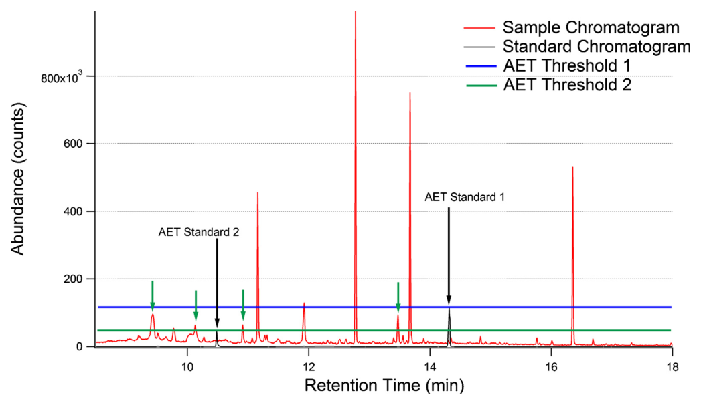
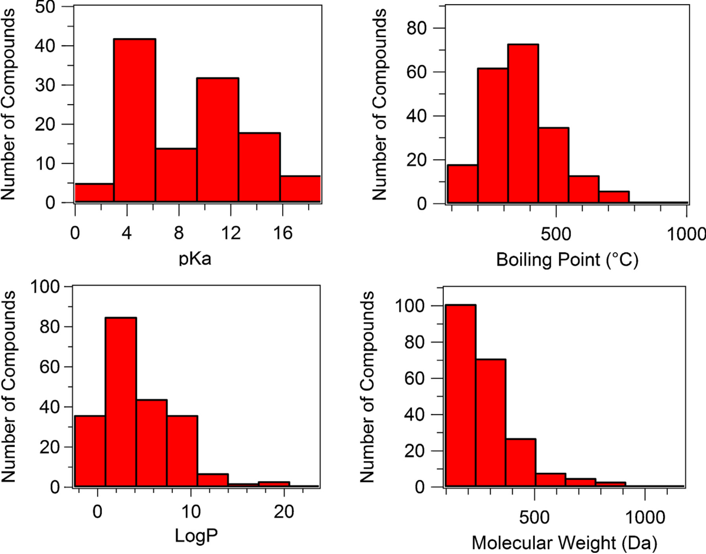
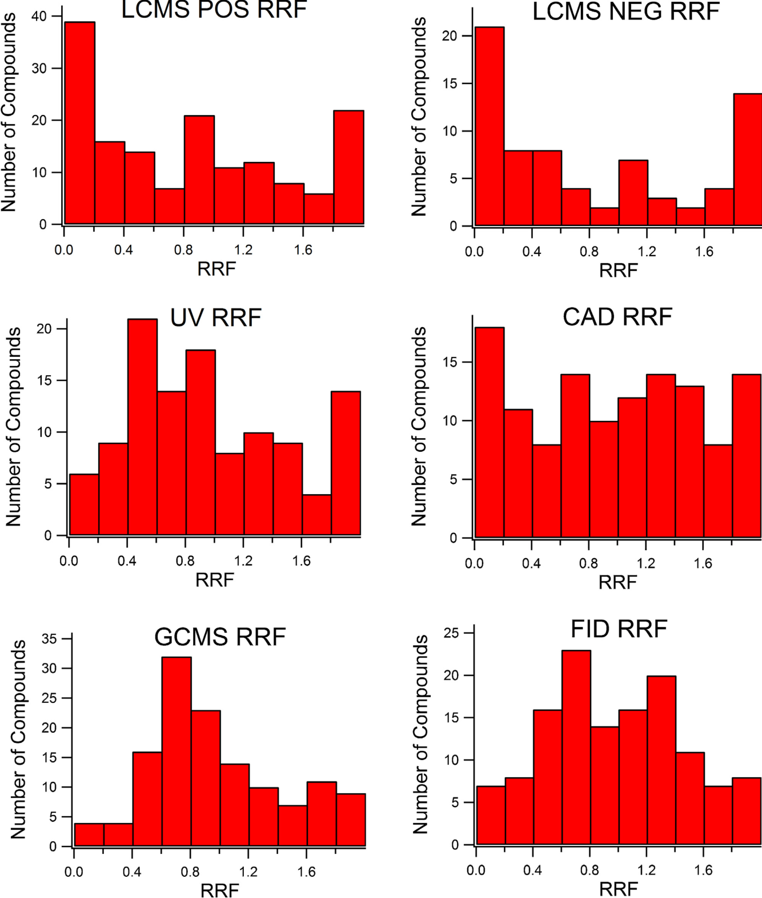
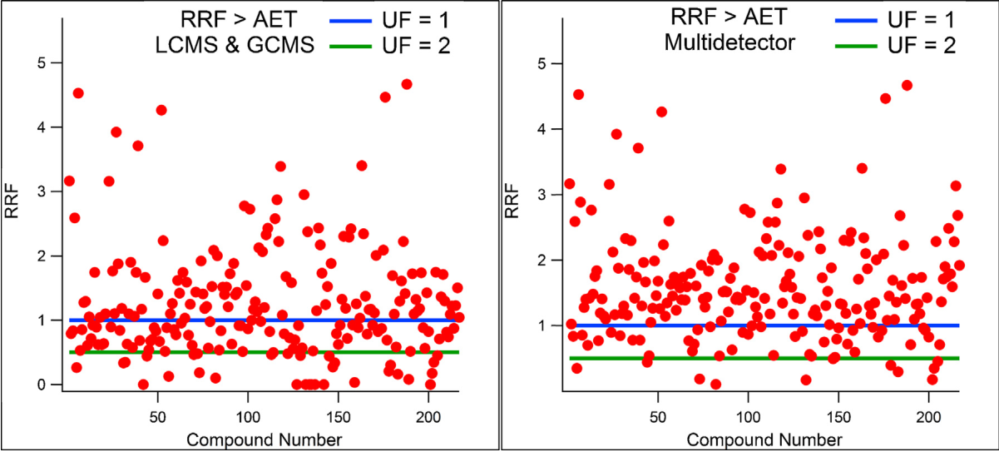
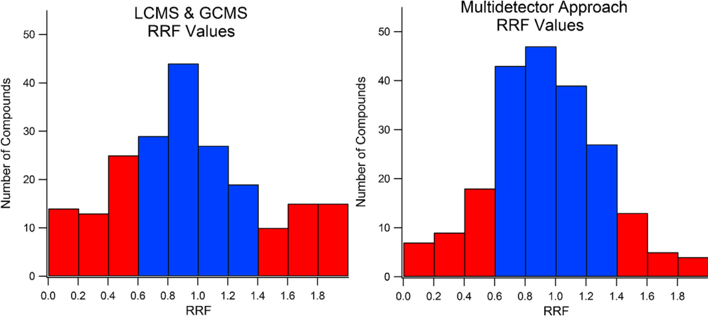
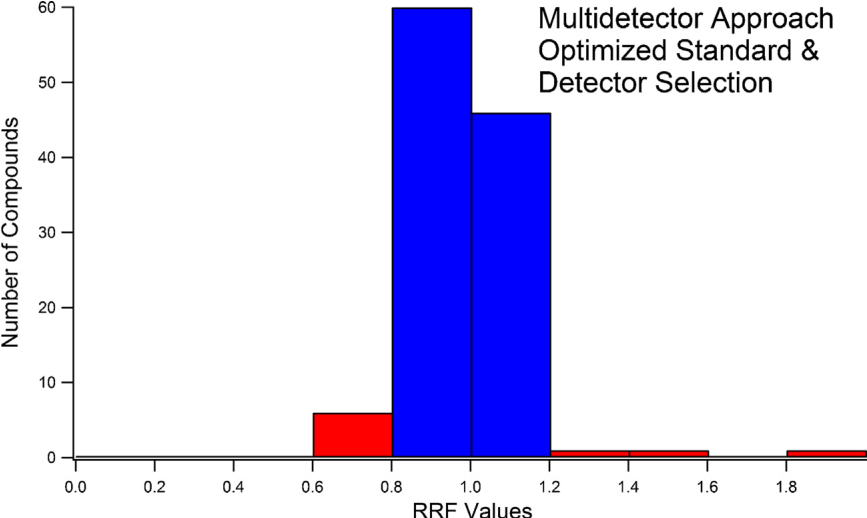

<!-- 方針: ほぼ全訳＋必要に応じた補足。原文構成に沿って訳出。表・数値・数式を保持。本文の[N]は原文の番号引用に対応し末尾の参考文献にリンクする。図はPyMuPDFで原本から抽出。CC-BYオープンアクセス。「> 補足:」は訳者注。 -->

## 書誌情報

- 原題: Reducing relative response factor variation using a multidetector approach for extractables and leachables (E&L) analysis to mitigate the need for uncertainty factors
- 著者: Mark Anderson Jordi, Kevin Rowland, Weixi Liu, Xingluan Cao, Jie Zong, Yuan Ren, Zhu Liang, Xiao Zhou, Michael Louis, Kaitlin Lerner（Jordi Labs, Mansfield, MA, 米国）
- 掲載: *Journal of Pharmaceutical and Biomedical Analysis*, 186 (2020) 113334. https://doi.org/10.1016/j.jpba.2020.113334（CC-BY オープンアクセス）
- インパクトファクター: **約3.4**（*J. Pharm. Biomed. Anal.*, JCR 2024 / Clarivate）
- 受理経過: 受領 2020-02-20 / 改訂 2020-04-17 / 採録 2020-04-22 / オンライン公開 2020-05-01

> 補足: **E&L（extractables and leachables, 抽出物・浸出物）** ＝医薬品包装・医療機器・食品接触材から医薬品や患者へ移行しうる化合物。**抽出物**は過酷条件で出る潜在的リスト、**浸出物**は実使用条件で実際に移行する物。**AET（analytical evaluation threshold, 分析評価閾値）** ＝これを超える化合物は同定・報告すべき、という毒性学的に妥当な閾値濃度。**RF（response factor, 応答係数）** ＝単位濃度あたりの信号（検量線の傾き）。**RRF（relative response factor）** ＝対象化合物のRFを代替標準（surrogate standard）のRFで割った値。**UF（uncertainty factor, 不確実性係数）** ＝RF変動を見込んでAETを下げる保守係数。**代替標準（surrogate standard）** ＝未知のE&Lを定量するため代わりに使う既知標準。**CAD（荷電化エアロゾル検出器）・FID（水素炎イオン化検出器）** ＝発色団を要さない質量／炭素感応の検出器。

## 要旨（Abstract）

抽出物・浸出物（E&L）の特性評価は、医薬品・医療機器・食品接触材といった重要分野の製品品質の重要な側面である。E&L試験の主目的は、医薬品を収容する包装材から浸出しうる、あるいは医療機器・食品接触材から直接浸出して患者曝露を招きうる化学種の同定と定量である。観測される化学種の多様性の大きさと標準品の不足から、代替標準（surrogate standard）を用いた相対定量を行うのが一般的である。正確なE&L結果を得る上での鍵となる問題は、応答係数（RF）の変動に起因する。同じ濃度でも化合物ごとに信号強度が異なり、したがってRF値が異なる。この問題は試験品質の2つの鍵となる側面に影響する。第一に、毒性学的に妥当な閾値（分析評価閾値, AET）を超える化合物数の評価に影響する（**RF問題1：AET過小報告**）。第二に、毒性学的評価の基礎となる安全域（MOS）計算の信頼性を低下させる定量精度に影響する（**RF問題2：定量誤差**）。RFデータベースがこれら問題の主要な解決策として提案されてきたが、根底のRF変動を減らさず、データベースに含まれない化合物の定量誤差に対処する範囲を欠く。他の解決策がない中、AET計算に大きな不確実性係数（UF）を適用してRF問題1に対処してきた。これらUF値はGCMSで4、LCMSで最大10と設定されてきた。大きなUFは、分析前の大量の試料濃縮（>10倍）を要して化合物損失・分解やマトリックス効果の増大を招くなど、多くの意図せぬ悪影響をもつ。これらの問題を克服するため、本稿は、四重極飛行時間型LC/MS（QTOF-LCMS）・荷電化エアロゾル検出器（CAD）・紫外可視検出器（UV）を組み合わせたHPLC系と、Polyarcリアクター系＋水素炎イオン化検出（FID）による二重検出GC/MS系を用いる **マルチ検出アプローチ** を実証する。この手法の組み合わせにより、幅広い化学的性質（Mw・logP・pKa・沸点）にわたる **217種の固有の抽出物** の検出と正確な代替標準定量を可能にした。最適な検出器選択と適切な標準選択の組み合わせは、**UFわずか2** を用いてAETレベルで化合物の94%の陽性検出と高い定量精度（85%が±20%以内、91%が±40%以内）を提供することが検証された。RFデータベース法と異なり、マルチ検出アプローチはデータベースに含まれる化合物に限定されず、大半の抽出物に適用可能である。

**キーワード:** 抽出物、浸出物、E&L、不確実性係数、分析評価閾値、応答係数データベース。

## 1. 序論（Introduction）

抽出物・浸出物（E&L）の特性評価は製品品質の重要な側面である。医薬品包装・医療機器・食品接触材からの浸出物は、製品の安定性・有効性・患者安全に悪影響を及ぼしうる。浸出物は、使用条件下で医薬品包装から医薬品へ、あるいは医療機器から直接・間接に患者へ移行する化合物・元素不純物である[5]。抽出物は、想定使用条件より一般に過酷な条件下で移行する化合物で、潜在的浸出物の誇張リストを提供することを意図する[4]。悪影響の例には、プレフィルドシリンジから浸出したアクリル酸と治療用タンパク質の反応、細胞増殖に極めて有害と判明した酸化防止剤Irgafos 168の分解物（bDtBBP）の浸出がある[15,16]。

E&L試験設計の鍵となる品質側面には、適切な抽出条件の選択、適切な試料前処理手順（E&L損失防止・検出向上・マトリックス干渉除去）、全抽出E&Lの同定・定量に対する分析法の適合性が含まれる。質量分析（MS）検出器は高感度・広い適用性から同定・定量の双方に広く用いられる[12–14]。個々の浸出物・抽出物の同定は、揮発性・半揮発性化合物にGC/MS、半揮発性・不揮発性化合物にLC/MSを組み合わせて行うのが一般的である。LC/GCの二次検出器も一部で使われるが、その役割は通常強調されない。例にはLCのUV/ELSD検出、GCのFID検出がある[14]。

本稿の目的は、どの抽出物がAETを超えるかを確認し正確な定量を提供する上での、マルチ検出アプローチの適合性と利点を実証することである。分析法は、バリデーション時に決定される性能特性に基づき、意図した目的に適すると判断される[1,2]。E&Lスクリーニング試験の目的は、抽出液中に毒性学的に妥当なレベルを超えて存在する全E&Lの完全なリストを提供し、その後の毒性学的評価のためにそれらの関連濃度を正確に決定することである。理想的な分析法は、同定のための高い選択性・普遍的検出性・高感度と、定量のための広いダイナミックレンジ・高い精度（普遍的応答係数）を提供する必要がある。しかし残念ながら、全潜在的E&L被検物についてこれらを満たす単一検出器技術は現存しない。これはUSP〈1663〉でも「科学に知られる有機・無機の抽出可能化学種すべての発見・同定・定量が可能な分析技術や技術の組み合わせは存在しないのが現実である[4]」と述べられている。しかし、意図した目的（同定か定量か）に最も適した検出法の賢明な適用と、適切な代替標準選択を通じて、定量誤差を減らし同定可能性を最大化することは可能である。

抽出物・浸出物の特性評価ガイダンスは医薬品包装[3–5]・医療機器[6–8]で発行されている。DNA反応性不純物（変異原性不純物）の管理はICH M7(R1)ガイダンス[9]が提供する。同文書は毒性学的懸念閾値（TTC、生涯曝露で1.5 µg/日〜生涯未満曝露で120 µg/日）を「発がん性その他の毒性作用の無視できるリスクをもたらす、未試験化学物質の許容摂取量」と定義する。TTCなどの安全閾値はE&L試験で、毒性学的に妥当な同定閾値（この濃度を超える化合物を同定・報告すべき）を定めるAET値の計算に広く使われてきた[10]。医療機器に関する最新のAETはISO 10993-18:2020で次のように定義される[8]:

$$\text{AET (µg/mL)} = \text{DBT} \times \dfrac{A}{B \times C \times D} \times \dfrac{1}{\text{UF}}$$

ここでDBTはTTCなどの用量ベース閾値、Aは抽出したデバイス数、Bは抽出液量、Cは患者1人あたり使用デバイスの最大数/質量、Dは希釈または濃縮係数、UFはRF変動を勘定する不確実性係数で、以前は UF = 1/(1−RSD)（RSDは応答係数データベースの相対標準偏差）と定義された。医薬品包装ではPQRIが同様の式を示した[10]。現行ISO 10993-18はUFを mean/[1−(t×std)] と定義するが、著者らはこの定義が 1/(1−RSD) と等価でなく、場合によりUF<1になり、また控えめなRF変動でも不当に大きなUFを与えるため不適切と考える。

E&Lスクリーニングでは、AETレベルの標準を分析してAET値を検出器応答に関連づける必要がある。この段階でE&L化合物の同定はまだ済んでいない。実際のE&L化合物を標準に使うのは非現実的である：1) 同定未了、2) 抽出物の多くはポリマー系のオリゴマーや副生成物で市販されない、3) E&Lの数が多く時間・費用がかかりすぎる。このため、AETレベルの応答決定に代替標準を用いるのが一般的だが、この慣行は応答係数変動によりE&L試験に有意な誤差を持ち込む可能性がある[11,17]。

化合物のRFは単位濃度あたりの信号量であり、所与の分析条件・特定検出器での被検物の検量線の傾きと定義できる[18]。加えて、相対応答係数（RRF）を対象化合物の検量線の傾きを代替化合物の検量線の傾きで割ったものと定義するのが分析上便利である[18,21]。RRFは検出器ドリフトや感度変化を含む経時変動を勘定するためRFより好まれる。傾きをRFの尺度に使うとき検出器の直線性を仮定する（非直線性は濃度の関数としてのRF変動になる）。RRFが1に近いと等濃度で等応答を意味する。RRFが1未満なら対象化合物濃度は過小評価され、実際はAETを超える化合物がE&L試験から除外されうる（**RF問題1：AET過小報告**）。図1は、AETに関連するピーク高が単一値でなく、全E&L化合物のRF値に基づく分布であることを明示する。RF変動の程度は、用いる手法（分析条件）と適用検出器系（装置選択）の双方の関数である。

RF変動により第二の重大な問題も生じる。化合物が毒性学的に妥当なレベル以上と判定された後、その後の毒性学的評価のため化合物の同定と定量が必要になる。代替標準に対するE&L化合物のRF差は定量精度に悪影響しうる（**RF問題2：定量誤差**）[18,21]。RF値が代替標準より小さいと、RF差を補正しない限り対象化合物濃度は過小評価される。各対象化合物の濃度は安全域（MOS）値の計算に使われる。過小評価された濃度は膨張したMOS値を招き、生体適合性評価の精度に悪影響し毒性学的リスクを過小評価しうる。逆にRF値が大きいと濃度は過大評価され、過小なMOS値を招いて安全なデバイスが生体適合性なしと判断されうる。

RF問題1を緩和するためAET式にUFが導入された。GCMSで4、LCMSで10のUFが提案されている[17]。TTCを用いる試験では、関連AET値は典型的に中〜低ppb（ng/mL）の検出限界を要する。例：表面積30 cm²・1デバイス使用・濃縮係数1の長期接触デバイスで、最も保守的なTTC 1.5 µg/日と表面積/抽出液量比3 cm²/mL（ISO-10993-12由来）を用いると、UF適用前のAETは150 ng/mL。RF変動を勘定するUF 10を適用すると15 ng/mLに下がる:

$$\text{AET} = 1.5\,\text{µg/day} \times \dfrac{1}{30/3 \times 1 \times 1} \times \dfrac{1}{10} = 15\ \text{ng/mL}$$

大量の抽出液を要する分析（大容量注射剤100–5000 mL、透析器など高溶媒量デバイス）ではこの値はサブppbになりうる。この感度は現行分析技術がスクリーニング（非標的）で達成できる限界に近づくか超える。またAETにUFを含めてもRF問題2（定量誤差）は解決しない。したがってRF変動と、それに伴う大きなUF値の必要性を緩和することが強く望まれる。

MS検出は同定・定量に広く使われるが、異なる化合物のRFがMS検出で大きく異なることは文献上よく知られる[19–21,23]。これは特にLCMSで顕著だが、イオン化手段の違いによりGCMSでもより小さい程度で見られる。Blanzらの報告（132の構造多様な薬物候補と233代謝物のLCMS分析）では、27代謝物がRF<0.2、7つがRF>2を示した[21]。LCMSでは応答がさらにマトリックス効果（イオン抑制・増強）に影響され、単一化合物でも試料マトリックスや移動相組成の関数でRFが異なる[19,29]。低波長UV検出は現在、薬物不純物スクリーニングの相対定量で圧倒的に選ばれる手法である[20,22,23]。UVのRFはモル吸光係数（発色団の種類）の違いで変わりうるが、一貫した発色団をもつ化合物ではマトリックス効果を受けない利点からMS相対定量より一般に好まれる。質量ベース検出器のCADとELSDは発色団を要さず、個々の被検物の性質への依存が少ない信号を与えるためUVを補う目的で適用された[26,28]。両質量ベース検出器には（他法よりやや低感度などの）限界があるが、CADは幅広い化学種で応答変動が小さく特に有望であった。

本稿の目的は、大きなUFなしに、広範な抽出物集合（217抽出物）の包括的かつ正確な定量を代替標準定量で得るための、マルチ検出アプローチの適合性を実証することである。分析した抽出物は潜在的抽出物の宇宙を代表するよう選ばれ、非常に広い性質範囲（Mw・logP・pKa・沸点）をカバーし、分析困難とされる化合物（特に有機酸42・アミン38）を多く含んだ。マルチ検出アプローチはQTOF-LCMS-UV-CADのHPLC系とGCMS-FID（Polyarcリアクター系）の二重検出系からなる。QTOF-LCMSはAET超え化合物の同定のみに、CADとUVはHPLCでの定量に、GCMSとFIDは同定・定量に用いる（FIDの主利点は定量の頑健性、GCMSは同定能力）。

## 2. 材料と方法（Materials and methods）

### 2.1 試薬・材料

相対定量に使う標準（表2）とRF決定用の217化合物の抽出物標準は高純度で市販品から入手。純度は分析中にQTOF-LCMS-UV-CADとGCMS-FID分析で有意な不純物ピークの不在を確認して検証。標準の大半はSigma-Aldrich・TCI America・Alfa Aesarから購入。LC/MSグレードのメタノール・イソプロパノール・アセトニトリル・水酸化アンモニウム・ギ酸はHoneywell、DCM・THFは分析グレード。抽出物の化学的性質（Mw・沸点・logP・pKa）はPubChem・ChemSpider・ChemSRC・ChemAxonから取得。

### 2.2 標準調製

RF決定用標準のストック溶液は各1 mg/mLで個別に溶解調製。ストックの一部を標準群の作業溶液に合わせ、分析用に5・10・25 µg/mLに希釈。QTOF-LCMS-UV-CAD用はメタノール、GCMS-FID用はDCMで溶解。

### 2.3 GCMS-FID分析

各抽出物の検量線の傾き（RF値）を質量選択検出器（MSD）と水素炎イオン化検出器（FID）で決定。Agilent 7890B GC（5975 MSDとFIDの二重検出、フロースプリッターで同時検出）。カラムスプリッター後・FID前にPolyarc触媒リアクター（全有機分子をメタンに変換しFID検出）を接続。MSは電子イオン化（EI）モード、質量範囲29–500 amu。HP-5MSカラム（30 m×0.25 mm×0.25 µm）。GCオーブンは28→270℃を15℃/分で昇温し270℃で10分保持。

### 2.4 QTOF-LCMS-UV-CAD分析

各抽出物の検量線の傾き（RF値）をAgilent 6545 QTOF（正負両イオンモードのDual Agilent Jet Stream ESI源）・Agilent 1260 DAD UV検出器・Corona Veo RS CAD（Thermo Fisher）＋Agilent 1290 HPLCで決定。QTOFパラメータ：ガス温度350℃・VCap 3500 V・ネブライザー15 psi・乾燥ガス12 L/min・シースガス8 L/min・シースガス温度400℃・質量範囲m/z 80–3200。UVは230 nm・バンド幅4 nm。CADはガス圧58 PSI・蒸発温度35℃・荷電電圧2.37 kV。Agilent Zorbax Eclipse Plus C-8（1.8 µm, 2.1×50 mm, 45℃）。移動相：溶媒A（0.05%ギ酸/0.03%水酸化アンモニウム/5%メタノール水溶液）・溶媒B（0.05%ギ酸メタノール）・溶媒C（イソプロパノール）を0.65 mL/min。グラジエント：初期A 100%を0.3分、5.3分でB:C 80%/20%、8.3分でB:C 50%/50%、10.54分でB:C 50%/50%。実行時間10.54分＋後時間1.5分。

### 2.5 データ処理

MassHunter Qualitative Analysis B.10で処理。GCMSは全イオンクロマトグラム（TIC）、QTOF-LCMSは化合物クロマトグラム（全化合物関連イオンの合計）で面積決定。UV(230 nm)・CAD・FIDは追加処理なしで積分。各抽出物のRF値は5・10・25 µg/mLの2重注入で線形回帰により傾きを決定。QTOF-LCMS-UV-CADのRRF決定にはIrganox 245、GCMS-FIDにはDecaneを代替標準に使用。各検出器の全RRF値を各分布の平均RRFで正規化し、代替標準の選択が最終値に影響しないようにした。

## 3. 結果と考察（Results and discussion）

### 3.1 相対応答係数の分布

RF問題1・2の大きさを理解するには、各検出器系での抽出物宇宙のRF分布を理解する必要がある。抽出物宇宙を推定するため、揮発性・半揮発性・不揮発性を含む広い化学的性質の217抽出物を分析。高揮発性有機化合物（HVOC、20℃で蒸気圧80 mmHg超）はヘッドスペースGCMS向きのため除外。分子量93–1177 amu・logP −2.38〜25.156・沸点102〜>600℃・pKa −0.83〜18.9をカバーし、アミン・酸・アルコール・フェノールや硫黄・ケイ素・リン含有種など多様な官能基を含む（表2は多様性を示す部分リスト）。

マルチ検出はQTOF-LCMS-UV-CADの三重検出系とGCMS-FIDの二重検出系を組み合わせる。QTOF-LCMSは正負両イオンモードで動作するため、各抽出物で計6信号（LCMS正・LCMS負・UV・CAD・GCMS・FID）を取得。RRF値は各検出器の全分布の平均RRFで正規化（値1が各分布の平均RRFに等しく、1超が強応答、1未満が弱応答を示す）。表1に各検出器のRRF分布結果、図3に6検出器のRRF分布プロットを示す。ある検出器で応答した化合物のみをその分布に含める（応答しない化合物は測定されず別法で検出すべき）。分析した217抽出物すべてが1つ以上の検出器で応答し、本戦略の広い適用性を示した。

6検出器の分布は、RRF変動と、カバーする化合物の幅・種類の点で大きく異なった。これは各検出器の原理の違いを反映する。**LCMS正/負** はそれぞれ全抽出物の72%・34%を検出し、LCMS正モードが化合物カバー率で最も包括的な単一検出器であった。しかしLCMS正/負分布は非常に広いRRF範囲を示し、0–0.2に最大数、次いで>1.8に多く、非常に大きな%RSD（LCMS正108%・負119%）を反映。これは平均（RRF=1）と比べ非常に弱いか非常に強い応答を示す化合物が不均衡に多いことを示す。標準最適化なしにRRF 0.6–1.4（実濃度の±40%）に入るのはLCMS正で33%・負で22%のみ。単一内部標準でのLCMS相対定量はしばしば非常に大きな定量誤差を招く。LCMSは化合物のイオン化能に基づき検出し、イオン化は試料化学（酸性/塩基性のヘテロ原子を含む化合物が有利、含まない化合物は不利）で大きく変わる[21]。この問題はQTOFに限らず、同じイオン化過程に依存する三連四重極系でも観測される。

対照的に **UVとCAD** はより対称的なRRF分布を示し、分布の中心に近い最大をもつ傾向があった。これはRF問題2の低減に有意な好影響がある（大半の化合物がRRF=1に近いとき誤差が最小化）。LCMSと比べUV・CADの%RSDは60%・65%で、より多くの化合物が妥当な定量精度範囲に入る。LCMSをUV・CADに置き換えるだけで（標準・検出器最適化なしでも）定量精度の有意な改善が期待できる。UV・CADはそれぞれ抽出物の52%・56%、合計74%を検出し、LCMS検出化合物の80%を含み高い重複を示した。標準最適化なしにRRF 0.6–1.4に入るのはUVで44%・CADで41%。CADは化合物の沸点と強く相関し、沸点400℃超でより一貫した検出を示し、オリゴマー・ポリマー種に優れた検出器である。UVは発色団の種類と存在に依存し、芳香族構造（ヒンダードフェノール等の重要な酸化防止剤）は強吸収、単一の弱発色団（アクリルモノマー等、GC検出向き）は弱応答であった。

**GCMSとFID** は非常に類似したRRF分布を示し、全検出器中で最もガウス的で、大半の化合物が中心（RRF=1）付近の値を示した。GCMS・FIDの%RSDは51%・53%で、LCMS（108/119%）よりはるかに多くの化合物が妥当な定量精度範囲に入る（他研究のGCMS 50.9%・FID 44%とも整合[17]）。LCMSとGCMS双方で検出される化合物では、標準最適化なしでもGCMS値の方が一般に信頼できる。標準最適化なしにRRF 0.6–1.4に入るのはGCMSで61%・FIDで56%。GCMS-FID分布はUV/CADよりやや狭い（%RSD 51–53% 対 61–66%）。GCMS・FIDは抽出物の60%を検出。抽出物の50%がQTOF-LCMS-UV-CADとGCMS-FID双方で検出され、手法間の高い重複を示した。最後の67化合物追加で分布のRSDが15%未満しか変わらなかったことは、本データが抽出物宇宙（HVOC除く）の推定に十分であることを示す。

### 表1. 正規化相対応答係数の分布統計

| 検出器 | LCMS正 | LCMS負 | UV 230 nm | CAD | GCMS | FID |
|---|---|---|---|---|---|---|
| 平均 | 1.0 | 1.0 | 1.0 | 1.0 | 1.0 | 1.0 |
| RSD | 108% | 119% | 60% | 65% | 52% | 54% |
| 最小 | 0.0013 | 0.0065 | 0.0364 | 0.0336 | 0.0318 | 0.0098 |
| 最大 | 6.1140 | 7.9816 | 2.8493 | 2.6467 | 2.8401 | 3.1218 |
| 検出率 | 72% | 34% | 52% | 56% | 59% | 59% |
| RRF 0.6–1.4 の割合 | 33% | 22% | 44% | 41% | 61% | 55% |

### 表2. 分析した217抽出物の部分リスト（各検出器の正規化RRF値、ND=検出されず）

| 名称 | 分子式 | CAS | LCMS正 | LCMS負 | UV | CAD | GCMS | FID |
|---|---|---|---|---|---|---|---|---|
| Bis(2-ethylhexyl) phthalate | C24H38O4 | 117-81-7 | 1.921 | ND | 0.622 | 0.802 | 1.706 | 1.855 |
| 4-Chlorobenzene sulfonic acid | ClC6H4SO3H | 98-66-8 | ND | ND | ND | ND | 0.081 | 0.034 |
| Dibenzyl phosphate | C14H15O4P | 1623-08-1 | 0.134 | 2.266 | ND | 1.411 | ND | ND |
| Caprolactam | C6H11NO | 105-60-2 | 1.045 | ND | ND | ND | 0.658 | 1.200 |
| Hexadecylamine | C16H35N | 143-27-1 | 1.514 | ND | ND | 2.009 | 0.543 | 0.387 |
| 5-Amino-1-pentanol | C5H13NO | 2508-29-4 | 0.126 | ND | ND | 2.597 | 0.095 | 0.663 |
| Irganox 245（LC代替標準） | C34H50O8 | 36443-68-2 | 1.705 | 1.744 | 0.550 | 1.570 | ND | ND |
| Irganox 1035 | C38H58O6S | 41484-35-9 | 4.529 | 1.263 | 0.508 | 1.354 | ND | ND |
| Bisphenol A | C15H16O2 | 80-05-7 | ND | ND | 1.655 | 1.822 | 2.579 | 1.449 |
| Citric acid | C6H8O7 | 77-92-9 | 0.058 | 0.212 | ND | 1.463 | ND | ND |
| 1,3,5-Triphenylbenzene | C24H18 | 612-71-5 | 0.001 | ND | 1.976 | 0.819 | ND | ND |
| Decane（GC代替標準） | C10H22 | 124-18-5 | ND | ND | ND | ND | 0.741 | 2.502 |

> 補足: 表2は原論文の部分リストからの抜粋。同じ化合物でも検出器ごとにRRFが大きく異なり（例：Irganox 1035はLCMS正4.529・UV 0.508）、単一検出器では正確に定量できないことがひと目でわかる。「ND」の多さは各検出器のカバー範囲の違いを示す。

### 3.2 RF問題1（AET過小報告）へのマルチ検出という解

E&L試験品質の最重要側面の一つは、どのピークを毒性学的に妥当なレベル以上として同定・報告するかの決定である。化合物が試験に含まれるには2条件を満たす必要がある：第一に検出される（少なくとも1検出器で測定可能な応答）、第二に代替標準で設定した閾値以上のRRFをもつ。代替標準の応答がAET閾値の位置を定める（図1）。RRF=1の代替標準を選ぶと、RRF≥1の全化合物を同定・報告する必要がある。AET閾値設定では、代替標準は分布の中心（正規化RRF=1）にあることが好ましく、UFを分布中心から適用できる。RRF<1の標準を選ぶと保守性が増し（より包括的）、RRF>1では保守性が減る（安全性の保護が弱まる）。代替標準選択とUFは連動し、RRF 0.5の代替標準はRRF 1の代替標準にUF 2を使うのと等価（RRF/UF=½）である。

適切な代替標準を選んでも、単一検出器系で全化合物を検出できないのが実情である。しかし完全なカバーに全化合物を全検出器で検出する必要はない。マルチ検出では、化合物が少なくとも1検出器で十分な信号を示せばよい。本マルチ検出（QTOF-LCMS-UV-CAD＋GCMS-FID）は5つの異なる検出機構（LCMSのイオン化能・UVの光吸収・CADの荷電粒子・GCMSの電子イオン化・Polyarc FIDの荷電イオン検出）を提供する。試験に含まれるには、化合物が1) これら5機構のいずれかで検出され、2) いずれかの検出器でAET閾値超の信号を示せばよい。

図4は各化合物の最大RRF値をGCMS＋LCMSのみ vs マルチ検出で比較する。UF 1でLCMS・GCMSのみだと54%の化合物が毒性学的閾値超と判定されるが、マルチ検出では76%。UF 2ならLCMS・GCMSで85%、マルチ検出で94%に大幅改善。UF 10ではLCMS・GCMSで95%、マルチ検出で99%。したがってマルチ検出＋UF 2は、LCMS・GCMSのみのUF 10と同等に保護的（差1%）であった。両戦略が同等に包括的でも、マルチ検出は大きなUF（>4）より複数の利点がある。第一に、複数検出器で同時に干渉信号がピークを覆う可能性は低く、信号重なりによる過小報告を減らせる。第二に装置感度は無限でなく、大きなUFはしばしば大量の試料濃縮（>10倍）を要し、化合物損失・分解・マトリックス干渉増大（まさに避けたい過小報告を招く）・より多くの原抽出液（デバイス/包装増でコスト・時間増）・汚染や背景不純物濃縮による偽陽性増などの悪影響がある。塩含有試料では塩溶解度により濃縮係数が限られ、大きなUFでAETに達せられないことも多い。

AET閾値が非常に低い（低ng/mL）分析では、個々の検出器の感度が不十分でフルマルチ検出が不可能なこともある。CAD検出はLCMS・UVほど高感度でない。QTOF-LCMS-UV＋GCMS-FIDでUF 2なら91%のカバーとなり、低・サブppbで全未知種を検出する難しさを考えれば高い確実性である。過度な試料濃縮（>10倍）の悪影響を考えると、CADがAETに達せなくても91%カバーが安全面で最も保護的な選択肢でありうる。

マルチ検出の潜在的欠点は過大報告の可能性である。この段階での試験含有は化合物が実際に毒性学的レベルにあることを意味しない。特定検出器でRRF>1（過大評価）だと、実濃度が閾値未満でも閾値超と判断される（偽陽性）。過小報告より深刻でないが、製造者のコスト・時間増は患者にも悪影響しうる。このため化合物定量後の第2回AET評価を推奨する。この初期段階での含有は、化合物が実際の同定・濃度についてさらなる精査を受けるべきことを意味するだけである。定量後、より多くの情報（最適な代替標準・検出器選択）に基づき第2回AET評価で最終判断する。

戦略によらず、試料分析時にAET閾値での検出限界（LOD）を検証する必要性を強調する。感度が実証されず仮定された試験をしばしば見てきた。装置清浄度（LCMSイオン源は特に脆弱）などの一過性条件でLODは日々変わるため、システム適合性の一部としての検証が不可欠。理想的には、正規化平均が1に近く方法固有E&Lデータベースの分布を代表する、RRF範囲をもつ標準群をAET濃度で分析して行う。UV・CAD・FIDはMSより一般に頑健で、E&L分析でしばしば見られる高マトリックス背景による感度損失を受けにくいことが、マルチ検出の最後の利点である。

### 3.3 RF問題2（定量誤差）へのマルチ検出・標準選択という解

E&L試験品質の第二の鍵は定量精度である。代替標準定量の精度は、代替標準と抽出物のRRF差に直接関係する。RRF 0.2の抽出物をRRF 1の化合物で定量すると報告濃度は実値の20%、RRF 2の化合物をRRF 1で定量すると200%になる。図3・表1は、GCMS以外の全検出器で40%超の誤差が最も一般的な結果であることを示す（GCMSでも39%の化合物が>40%誤差）。毒性学的リスク評価（MOS計算）にこの誤差を勘定する仕組みは現状なく、分析不確実性を勘定する追加UFの議論もあるが、MOS値が1に近い試験が多く、追加UFは不必要な製品拒否を招く深刻な悪影響がある。したがって定量精度向上法の同定が強く望まれる。

図3・表1から、抽出物宇宙に高精度定量を提供する十分に普遍的な単一検出器はない。幸い、マルチ検出で定量精度を向上する2機構がある：1) 適切な検出器選択、2) 適切な代替標準選択。各検出器の応答は互いに独立なので、RRFが1に最も近い検出器を選ぶと定量精度を大幅に改善できる。

図5は最適検出器選択でのGCMS/LCMS vs マルチ検出（UV-CAD＋GCMS-FID）の定量精度を比較する。マルチ検出ではLCMSのRF変動が極端に大きく適切な代替標準選択が困難なため意図的にLCMSを除外した。LCMS/GCMSでは最適検出器でも±20%以内33%・±40%以内55%のみ。対照的にマルチ検出は±20%以内40%・±40%以内72%。LCMS/GCMSでは12%の化合物が有意に過小報告（実値の<40%）だがマルチ検出では7%のみ。これは代替標準最適化なし・LCMS除外で達成された。LCMS/GCMSでは6化合物が定量する信号を持たなかったが、マルチ検出でUV-CADやGCMS-FIDで信号なしの5化合物はLCMSで応答したため、少なくともデータは存在した。LCMS/GCMSで見逃された6化合物は主に高Mw（平均527 amu）でイオン化しにくい官能基が少ない化合物であった。E&L抽出液はLCMS・GCMSで信号を示さないがCADで検出可能なオリゴマーピーク（500–2000 amu）を多く含むことがしばしばある。マルチ検出で定量信号なしの5化合物のうち2つは高揮発性（HGCMS向き）、残り3つは高極性揮発性酸で、酸性種（pKa<5）が不得手なわけではない（試験した44酸性種中42が定量可能）。

第二の戦略は適切な代替標準選択である。抽出物のRRFに近い/等しいRRF値の代替標準を選べば定量誤差を最小化・排除できる。本研究では10のLC・GC代替標準を分析（表2下部）。多様な化学と溶出時間範囲を提供するよう選び、各検出器で最低4化合物が応答するよう10種を選定。抽出物のRRFに最も近いRRF値の標準を代替標準とし、RRFが1に最も近い検出器でさらに最適化した（図6）。この手法で化合物の85%が±20%以内、91%が±40%以内となった。これはマルチ検出が、妥当な数の代替標準の追加で正確な定量に必要なデータを含むことの明確な実証である。±40%以内の精度は食品移行試験（関連分野）の公表規制期待[30]に沿う。本解析で各検出器が最適応答を与えた抽出物の割合（UV・CAD・GCMS・FIDの順）は22.6・28.3・33.5・15.6%で、最適定量精度に4検出器すべてが必要であることを示した。

アナリストが最適検出器・代替標準を選べるかという批判はありうるが、UV・CAD・GCMS・FIDの分布はLCMSより狭く、完璧な検出器選択の負担を減らす。これら4検出器はLCMSより高い割合の化合物で±40%精度を示すため、相対定量にはLCMS以外の検出器が強く好まれる。異なる検出器応答（UV vs CAD vs GCMS vs FID）の比較で、ある検出器が強く過小評価していないか評価できる。さらに検出器・代替標準選択は、同定後の抽出物の化学評価で妥当に導ける（例：二重結合当量DBEはUV相対定量の信頼性、分子量はCAD応答の妥当な予測子）。GCMS/FID値はUV/CADと別に算出・報告され、安全評価が個々の抽出物濃度を過小評価しない確実性を高める。したがって、抽出物分析の定量精度を大幅に改善するのに毎回最適検出器・標準選択を達成する必要はない。

十分な代替標準があればLCMSを有効に使えるか、という問いには、LCMSが一見似た化学の化合物で大きく異なるRRF値を出すのが著者らの経験である。例：Bisphenol A diglycidyl ether を bisphenol A を代替標準に定量する場合、Bisphenol A は負モードのみ、diglycidyl ether は正モードのみでイオン化し相対定量が不可能。また5つの非常に似たヒンダードフェノール酸化防止剤（Irganox 245・3114・1076・1035・1024）は類似構造・溶出時間・元素組成にもかかわらず、2つは負モードで全く応答せず、LCMS正/負のRRFのRSDは106%・96%。同じフェノール官能基でもこの一見ランダムなRRF値は、LCMSでの合理的な代替標準選択を非常に困難にする。CADとUVではRRFのRSDが36%・32%のみで、代替標準選択に妥当な信頼を許す。

### 3.4 RFデータベースとマルチ検出戦略

最近の複数の刊行物がRF問題1・2の解としてRFデータベースを提案している[24,25]。RF問題1について、包括的データベースは過小報告回避に十分保護的なUF値の決定を可能にするが、RF変動を減らさず、UFの必要性や不確実性を緩和しない。大きなUFで下がったAETに達するにはしばしば追加濃縮（>10倍）が必要で化合物損失・マトリックス効果を増す。大きなUFは閾値未満だが高RFの化合物の過大報告リスクも増す。連想データベースで「潜在的欠落の警告」を提供する提案[25]もあるが、著者らも「データベースの力は収載物質数に由来する」と認めており、非収載・非関連化合物の捕捉には役立たず追加の標的作業を要する。対照的にマルチ検出は事前知識を要さず、RF変動を減らしてUFの必要性自体を減らす。

同様に、RRFデータベースがRF問題2を改善する能力は、対象抽出物がデータベースにある前提に基づく。現在最大の商用データベースは1500化合物程度（Agilent E&Lデータベース）、一部ベンダーは2500超を報告する[25]。抽出物宇宙の総数は未知だが、国内会議では1万〜10万以上と提案されることが多い。著者らの研究室でも4000超の抽出物を独自データベースに追加したが、日々多くの新規化合物を検出している。この問題は市販標準品の不足でさらに悪化する（頻出抽出物の多くは酸化防止剤の分解物やポリマー化の副生成物で市販されない）。新ポリマー系・添加剤が生まれるたびデータベース法は遅れをとる。最も広範なデータベース（著者ら自身を含む）でも抽出物宇宙の25%未満で、市販されない頻出抽出物の多くを欠く。したがってE&L RRFデータベースの主用途は、標準選択支援・同定促進・最頻出の市販抽出物の一部の正確定量のための方法のRF分布定義にある。各E&L法の適格性確認では、データベース収載化合物だけでなく、非収載化合物にも代替標準相対定量で定量精度が得られることを実証すべき（著者らは非収載の多様な化合物の>90%で±40%、>90%のカバーを提案）。マルチ検出はRF変動を減らすため、各化合物の標準品を要さず広く適用できる。

## 4. 結論（Conclusions）

抽出物・浸出物の正確な定量は、抽出物の多様性の大きさと普遍的検出器の欠如により有意な分析的課題である。相対定量にLCMSとGCMSを使う一般戦略は、主にLCMS結果に内在する広いRRF変動により、解決困難な重大問題をもつ。217抽出物（HVOC除く）で誤差の大きさを推定したところ、±20%以内は33%のみ、±40%以内は55%のみであった。最適代替標準選択でのLCMS誤差補正も、抽出物の化学に基づく容易に予測可能な論理的傾向を示さなかった。対照的に、マルチ検出（適切な検出器選択）＋最適代替標準選択（10標準）は85%の化合物で±20%以内、91%で±40%以内の正確値を生み、RF問題2を大幅に低減した。マルチ検出は初期探索段階での化合物見逃しの保証を有意に高め、RF問題1も低減した。これはUF値でなく、RF変動の低減と検出器間の相乗効果によって達成される。

E&L分析の品質保証改善への一歩として、分析時にAET濃度で、平均RRFが方法のRRF分布中心（正規化でRRF≈1）に近く、1/UFに約等しいRRF値の標準も含む代替標準群を用いて方法感度を検証することを推奨する。代替標準のRRF分布はRF問題2の補正を許すのに十分広くすべきである。各研究室は方法固有RFデータベースを開発し、その主目的を同定支援・頻出E&Lの定量精度向上・標準のRRF値が分布の適切な位置にあることの確認とすべきである。RFデータベースは根底のRF変動を減らさず、RF問題1・2の解として範囲が限られる。本研究は、マルチ検出＋UF 2が全被検抽出物の94%をカバーし、LCMS・GCMSのみのUF 10と同等に保護的（差1%）であることを実証した。

> 補足（実務的示唆）: 本論文の核心は「**LCMS一辺倒をやめる**」こと。E&L（抽出物・浸出物）は種類が膨大で標準品がなく、代替標準で相対定量せざるを得ないが、LCMSは化合物ごとの応答差（RRF）が極端（RSD 108/119%）で、①閾値超えの見落とし（RF問題1）と②定量誤差（RF問題2）を生む。従来は巨大な不確実性係数UF（LCMSで10）で対処したが、これはAETを下げて過剰な試料濃縮（>10倍）を強い、化合物損失・マトリックス効果という本末転倒を招く。本研究の答えは——検出原理の異なる6検出器（LCMS±/UV/CAD/GCMS/FID）を束ね、**検出は「どれか1つで捉えればよい」（網羅性）、定量は「RRFが1に近い検出器＋近い代替標準を選ぶ」（精度）** という適材適所。結果、UF 2で94%網羅（LCMSのUF 10相当）・±40%で91%精度を、RFデータベース（収載化合物にしか効かない）に頼らず実現した。本サイトの `rrf-mass-balance-forced-degradation-pda-elsd-ms`（同じJordiグループでなくWatersだがUV×ELSD直交検出でRRF推定、本論文の参考文献[28]）や `correction-factors-impurity-content-rrf-epshtein`（RRF/補正係数の正しい決め方）、`ssdmc-conversion-factor-ruggedness-salvia`（RRFの実験室間ばらつき）と併読すると、「RRFの困難をどう工学的に回避するか」の実務地図になる。

## 参考文献（References）

1. International Conference on Harmonisation, Q2(R1) Validation of Analytical Procedures: Text and Methodology, 2020.
2. Food and Drug Administration, Guidance for Industry: Q2B Validation of Analytical Procedures: Methodology, 1996.
3. United States Pharmacopeia, USP 〈661.2〉 Plastic Packaging Systems for Pharmaceutical Use, 2020.
4. USP 40 General Chapter 〈1663〉 Assessment of Extractables Associated With Pharmaceutical Packaging/Delivery Systems, USP Convention, Rockville, MD, 2017, pp. 2020–2035.
5. USP 40 General Chapter 〈1664〉 Assessment of Drug Product Leachables Associated With Pharmaceutical Packaging/Delivery Systems, USP Convention, 2017, pp. 2035–2047.
6. International Organization for Standardization, Biological Evaluation of Medical Devices, Part 12: Sample Preparation and Reference Materials, ISO 10993-12, 2012.
7. International Organization for Standardization, Biological Evaluation of Medical Devices, Part 17: Establishment of Allowable Limits for Leachable Substances, ISO 10993-17, 2002.
8. International Organization for Standardization, Biological Evaluation of Medical Devices, Part 18: Chemical Characterization of Medical Device Materials Within a Risk Management Process, ISO 10993-18, 2020.
9. International Conference on Harmonisation, M7(R1) Assessment and Control of DNA Reactive (Mutagenic) Impurities in Pharmaceuticals, 2020.
10. D. Norwood, L. Nagao, The Analytical Evaluation Threshold (AET), Product Quality Research Institute, 2015.
11. M. Jordi, S. Khera, K. Rowland, et al., Qualitative assessment of extractables from single-use components and the impact of reference standard selection, *J. Pharm. Biomed. Anal.* 150 (2018) 368–376.
12. D. Jenke, Moving forward towards standardized analytical methods for extractables and leachables profiling studies, *PDA J. Pharm. Sci. Technol.* 69 (2015) 471–476.
13. Y. Gao, N. Allison, Extractables and leachables issues with the application of single use technology in the biopharmaceutical industry, *J. Chem. Technol. Biotechnol.* 91 (2016) 289–295.
14. K. Li, G. Rogers, Y. Nashed-Samuel, et al., Creating a holistic extractables and leachables (E&L) program for biotechnology products, *PDA J. Pharm. Sci. Technol.* 69 (2015) 590–619.
15. L. Marghitoiu, J. Liu, H. Lee, et al., Extractables analysis of single-use flexible plastic biocontainers, *PDA J. Pharm. Sci. Technol.* 69 (2015) 49–58.
16. M. Hammond, H. Nunn, G. Rogers, et al., Identification of a leachable compound detrimental to cell growth in single-use bioprocess containers, *PDA J. Pharm. Sci. Technol.* 67 (2013) 123–134.
17. D. Jenke, A. Odufu, Utilization of internal standard response factors to estimate the concentration of organic compounds leached from pharmaceutical packaging systems…, *J. Chromatogr. Sci.* 50 (2012) 206–212.
18. M. Iqbal, K. Rao, G. Sridhar, et al., Characterization and relative response factor determination of process related impurity in naproxen by NMR, *J. Pharm. Biomed. Anal.* 56 (2011) 484–490.
19. M. Sargent et al. (Eds.), Guide to achieving reliable quantitative LC-MS measurements, RSC Analytical Methods Committee, 1st ed., 2013.
20. E. Adams, M. Rafiee, E. Roets, J. Hoogmartens, Liquid chromatographic analysis of streptomycin sulfate, *J. Pharm. Biomed. Anal.* 24 (2000) 219–226.
21. J. Blanz, G. Williams, J. Dayer, et al., Evaluation of relative MS response factors of drug metabolites for semi-quantitative assessment of chemical liabilities in drug discovery, *J. Mass Spectrom.* 52 (2017) 210–217.
22. P. Sun, X. Wang, L. Alquier, C. Maryanoff, Determination of relative response factors of impurities in paclitaxel with HPLC equipped with UV and charged aerosol detectors, *J. Chromatogr. A* 1177 (2008) 87–91.
23. S. Baertschi, Analytical methodologies for discovering and profiling degradation-related impurities, *Trends Anal. Chem.* 25 (2006) 758–767.
24. M. Rozio, A. Rosato, L. Iadarola, S. Carrara, Compounds Relative Response Factor, a Reliable Quantification Within Extractables Testing, White Paper, Eurofins, 2019.
25. P. Christiaens, J. Beusen, P. Verlinde, J. Baeten, D. Jenke, Identifying and mitigating errors in screening for organic extractables and leachables: part 1, *PDA J. Pharm. Sci. Technol.* 74 (2020) 90–107.
26. O. Wahl, U. Holzgrabe, Impurity profiling of ibandronate sodium by HPLC–CAD, *J. Pharm. Biomed. Anal.* 114 (2015) 254–264.
27. M. Nussbaum, S. Baertschi, P. Jansen, Determination of relative UV response factors for HPLC by use of a chemiluminescent nitrogen-specific detector, *J. Pharm. Biomed. Anal.* 27 (2002) 983–993.
28. P. Hong, A. Phoebe, M. Jones, Study of relative response factors and mass balance in forced degradation studies with LC/PDA/ELSD/MS system, *J. Chromatogr. A* 1512 (2017) 61–70.
29. S. Gustavsson, J. Samskog, K. Markides, B. Långström, Study of signal suppression in LC-ESI-MS using volatile ion-pairing reagents, *J. Chromatogr. A* 937 (2001) 41–47.
30. Guidance for Industry, Preparation of Premarket Submissions for Food Contact Substances: Chemistry Recommendations, FDA, 2020.
