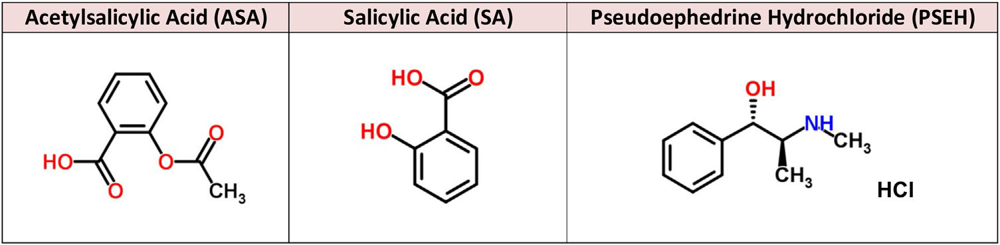
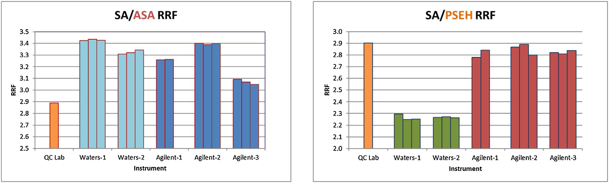
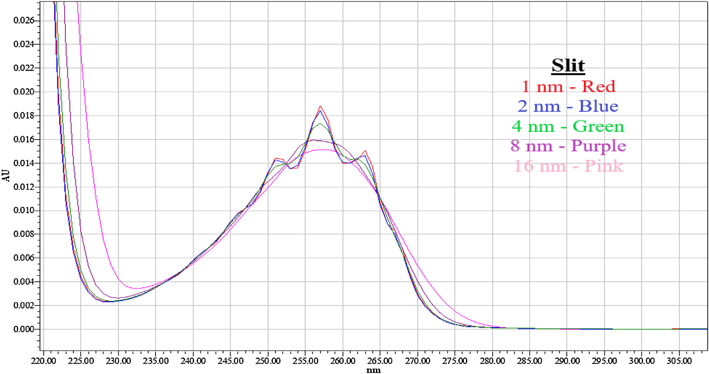
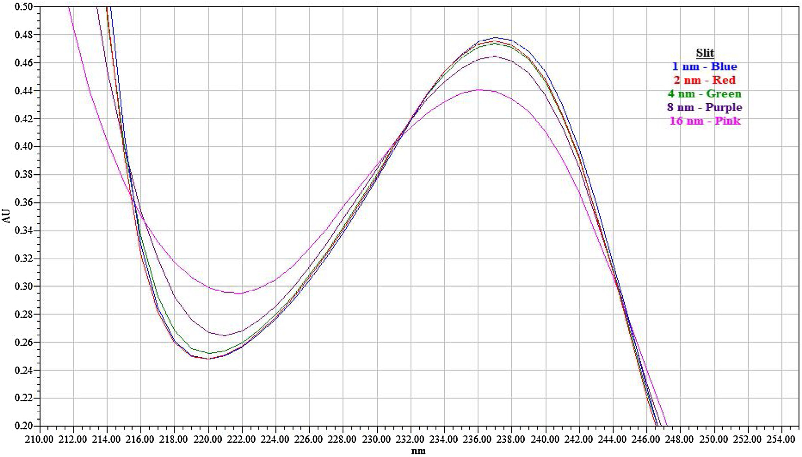
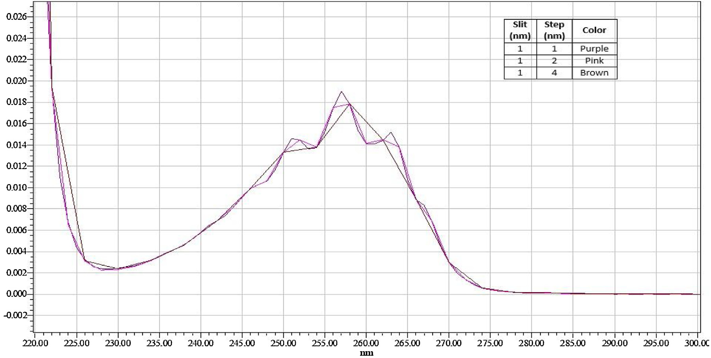
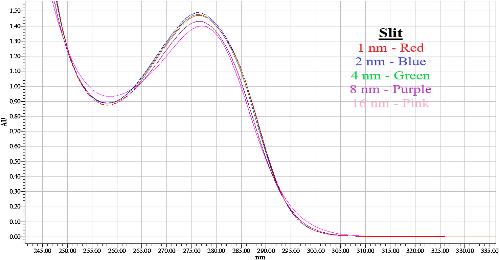

<!--
Liu L(S), Mouallem A, Xiao KP, Meisel J. Assay of active pharmaceutical ingredients
in drug products based on relative response factors: Instrumentation insights and
practical considerations. Journal of Pharmaceutical and Biomedical Analysis 194
(2021) 113760. doi:10.1016/j.jpba.2020.113760（CC BY-NC-ND）の全訳密度日本語版。
図は原著PDFから抽出。
-->

> **補足（本サイトでの位置づけ）:** 本論文は当サイトの「多成分定量・メソッド開発」テーマの実務的な要注意点を扱う。**相対応答係数（RRF）**は「1本の参照標準で複数成分を定量する」ための係数で、生薬・漢方製剤の多成分力価試験（＝当サイトで頻出する QAMS／単一標準多マーカー法 SAM と同じ発想）でも広く使われる。本論文は、RRF を不純物試験から**力価（含量）試験**へ広げるとき、力価に要求される高精度（誤差<2%）ゆえに RRF のわずかな変動が致命的になること、そして従来ほとんど誰も気にしない **UV検出器の内部設定（スリット幅・ステップ幅・バンド幅・3D/2Dデータ収集）** が RRF を最大20%も動かすことを、実データで突きつける。生薬の QAMS/SAM で「装置や施設を変えたら定量値がずれた」という失敗を避けるための一次資料。原著は実際にRRF力価試験の代表例として**生薬製剤**を挙げている。**IF:** J. Pharm. Biomed. Anal. = 3.1（JCR2024・Q2）。

---

# 書誌情報

- **原題:** Assay of active pharmaceutical ingredients in drug products based on relative response factors: Instrumentation insights and practical considerations
- **著者:** Lisa (Song) Liu（責任著者）, Ariel Mouallem, Kang Ping Xiao, Jerry Meisel
- **所属:** Bayer Consumer Health, Global R&D Product Development Center, Morristown, NJ, USA
- **掲載誌:** Journal of Pharmaceutical and Biomedical Analysis 194 (2021) 113760
- **DOI:** 10.1016/j.jpba.2020.113760（2020年8月7日受付／10月30日改訂受付／11月6日受理／11月12日オンライン）
- **ライセンス:** © 2020 The Authors. Elsevier B.V.（CC BY-NC-ND 4.0・オープンアクセス）
- **キーワード:** HPLC 相対応答係数（RRF）、力価試験、スリット幅、ステップ幅、バンド幅、3D/2Dデータ収集モジュール

---

# 要旨（Abstract）

相対応答係数（RRF）は、ある化合物を別の化合物に対して定量するのに使え、医薬品の不純物分析で広く用いられるが、力価（含量）試験への応用は限られている。本論文の広範な検討から、「RRF法」を力価試験に用いることは、力価分析に要求される**はるかに厳しい基準**のため、不純物分析に比べて格段に難しいと結論できる。現行のHPLC分析法開発・品質出荷試験でほとんど議論・認識されない**装置設定の影響**を論じる。これらの因子は、一般に認識される他のHPLCパラメータと同じくらいRRFに影響する。UV検出器設定——**スリット幅・ステップ幅・バンド幅・データ収集モジュール**——の影響を探索した。この現象を3化合物を用いて実証し、大きなRRF変動による定量への影響を観察した。最後に、RRF変動を減らす原則を論じ、RRFの方法開発・方法移管への応用における実務上の留意点を提供する。

---

# 1. 序論

## 1.1 力価試験と参照標準

製品開発・製造工程評価・市販品の出荷/安定性試験において、分析ラボはHPLCで医薬品有効成分（API）の力価を測定する広範な分析を行う [1–7]。定量は通常、製品試料溶液中のAPIのUV応答と、外部参照標準溶液中の同一APIのUV応答の比較に基づく。製剤に複数のAPIがある場合、外部参照標準溶液には通常、各対応APIの参照標準が含まれる [1–3]。同様に、複数の既知不純物・分解物を分析する場合、各不純物の定量には別々の参照標準が必要となる。本稿ではこのアプローチを「**同一API参照標準法（Identical API reference standard methodology）**」と呼ぶ。

しかし、この「同一参照標準」の実践には状況により課題がある [9–26]：(1) 公式参照標準が、寄贈不足や合成/単離の技術的困難で市場に入手できないことがある [9,10,12,20]。(2) 代替の単一標準が使えれば、標準購入コスト・時間・保守を減らせる [11,12]。(3) 長いHPLCシーケンス中に、試料/標準溶液中のAPI分子（力価試験）や不純物分子（不純物試験）の安定性が損なわれることがある [11]。(4) ラボのスループット上、全参照標準を含む同じ標準溶液を頻繁に調製するのは避けたい。

そこで、**単一化合物を参照標準として製品中の全APIを定量**する（同様に、単一化合物〔通常はAPI〕で原薬/製品中の全不純物を定量する）ことが魅力的になる。これには**相対応答係数（RRF）**が論理的選択となる。RRFは、選んだ分子の応答係数（RF）を別の分子のRFで割った比として定義され、本稿ではこのアプローチを「**RRF法**」と呼ぶ。

## 1.2 RRF法の適用範囲の拡大

RRF法は、ICHガイドラインや公定書モノグラフが述べるとおり、医薬品分析の不純物/分解物試験で最も頻用される [1,2,4–8]。不純物は、RRF値と要求補正精度に応じて、RRF補正の有無で活性量または参照標準に対して定量される。一般的な不純物分析を超えて、RRF法は**複数のAPIを含む製品の力価試験**にも拡張され、最も一般的な研究は**生薬製剤（herbal medicine products）**である [12–18]。近年、RRFによる化合物力価測定は、医薬品開発における**抽出物・浸出物（extractables and leachables）**分析にも拡張された [19–22]。真正な参照標準の非存在下でのRRF決定は、特に生薬製品・抽出物定量で現実的になっている。

本稿では、市場でますます人気の複数API含有製品（OTC製品など）の力価試験に、広く使われるRRF法を拡張することを試みる。参照標準として選ぶ分子は必ずしもAPIの一つではなく、化学的安定性・高水溶性・低コスト・取扱いやすさなど有利な特性をもちうる。この用法の実現可能性を実証し、不純物定量・生薬活性成分分析・抽出物/浸出物分析での用法と比較する。

## 1.3 本研究の焦点：UV検出器設定

しかし、ある化合物を別の化合物に対して定量するRRFは変動が大きく、一貫した実装が難しいことが長く観察されてきた。特にHPLCでUV検出器を使うと大きな変動が生じうる。Olsen と Argentine [23] のRRF頑健性の初期研究以来、この変動問題の多くの側面（装置変動・UV波長選択最適化・HPLC条件・方法バリデーション〔頑健性〕など）が詳しく研究されてきた [11,12,14,15,20,24,26]。しかし、UV検出器に関わる**重要な因子のいくつかがまだ研究されておらず、RRF変動への影響が調べられていない**ことを我々は観察した。本稿ではこれらの重要因子を提示する。

化合物のUV応答は分子構造に固有で、溶解する溶媒/溶液に影響される。希釈液や試料マトリックスの吸収を適切な背景補正で最小化/除去すれば、ある化合物の応答係数は1つのUV検出器上で線形範囲内で一定である。本稿では議論を簡素化するため、通常使用中のUV検出器の劣化の影響は除外した。異なるUV検出器が同じ化合物に異なるRFを生むことは知られているが、**同じUV検出器上で決めた2化合物間のRRFは普遍定数として、どの検出器を使っても（異なるラボでも）適用される**——これがRRF法を可能にする基本的仮定である。

## 1.4 例示製品：ASA + PSEH（参照にSA）

本研究の例示製品は「**アセチルサリチル酸（ASA）500 mg**」と「**プソイドエフェドリン塩酸塩（PSEH）30 mg**」を含む。**サリチル酸（SA）**も使用し、ASAの関連化合物として本研究で重要な役割を果たす。目的は、1つの試験法でASAとPSEHの力価を同一製品で測定すること。

**なぜSAを参照標準にするか:** ASAは低pHの水に難溶だがpH>5で可溶になる一方、pH上昇でASAは速やかに連続的に加水分解してSAを生じる。そのため長いHPLCシーケンスでのASA定量の正確性は、オートサンプラーの温度制御があっても管理が難しい。対照的にSAは水に可溶で広いpH範囲で安定。この好ましい特性からASAでなく**SAを参照標準**とし、SA→ASAのRRFを適切に決めればSAでASAを定量できる。もう一つのAPIであるPSEHは化学的に安定だが、米国DEAが定める規制物質（List I）で [27]、使用ごとに正確な文書化が要求され、非規制・安定なSAに比べ文書作業が膨大。これも**SAをRRF参照標準として両API（ASA・PSEH）を定量**する動機となる。本稿ではSA/ASAとSA/PSEHのRRF値の変動を徹底的に調べる。

---

# 2. 実験

## 2.1 試薬・材料

3主要成分の化学構造を図1に示す。ASA（純度100%、Bayer La Felguera site、スペイン）、サリチル酸（純度99.8%、RTC / Sigma-Aldrich）、PSEH（純度100%、Siegfried、ドイツ）。炭酸水素ナトリウム（Fluka、ACSグレード）、アセトニトリル（Fisher、HPLCグレード）、トリフルオロ酢酸（TFA、Thermo Scientific、HPLCグレード）、Milli-Q水。

## 2.2 装置

RRFの変動を調べるため、**2メーカー・5台のHPLC**を使用：(1) Waters Alliance e2695 [29]、(2) Agilent 1200 Infinity と 1290 Infinity [30]。具体的には Waters-1、Waters-2（いずれも e2695）、Agilent-1、Agilent-2（1200 Infinity）、Agilent-3（1290 Infinity）（表1）。各系は四元送液・オンライン脱気・温調オートサンプラー・温調カラム室・ダイオードアレイ検出器（DAD）＋Waters Empower 2/3 ソフト。カラムは同型だがロット違い、移動相もバッチ違い（これらは UV検出器・その設定の影響に比べ非臨界〜無視できる影響とみなす）。同一装置での実験日は1〜38日に広げ、日間の差を観察。

**表1. HPLC装置モジュールとUV設定（抜粋）**

| メーカー | 系 | 機種 | スリット(nm) | 分解能(nm) | ステップ(nm) | バンド幅(nm) |
|---|---|---|---|---|---|---|
| Waters | 1・2 | e2695 | N/A¹ | 1.2 | N/A¹ | 1.2 |
| Agilent | 1・2 | 1200 Infinity | 1 | N/A¹ | 2（または1） | 4 |
| Agilent | 3 | 1290 Infinity | 1 | N/A¹ | 2 | 4 |

¹ Waters UV系にはスリット・ステップ設定がなく「分解能（Resolution）」を用いる。Agilent UV系には分解能設定がなくスリット・ステップ設定を用いる（3.2節）。

## 2.3 クロマト条件・検出器設定

カラム：YMC-Triart C18（3.0 mm ID×75 mm、1.9 µm）。移動相A＝0.15% TFA水、B＝0.15% TFAアセトニトリル。グラジエント溶出。カラム温度40℃、オートサンプラー4℃。初期既定として検出波長 **230 nm（SA）・257 nm（PSEH）・295 nm（ASA）**、バンド幅4 nm（Agilent）・分解能1.2 nm（Waters）、参照波長なし。UVスペクトルは毎回190〜400 nmで収集。ASAは16倍高濃度（ASA 500 mg vs PSEH 30 mg＝濃度差16倍）のため、1試験法で両成分を測るにはASAに低吸収の波長（295 nm）を選ぶのが実務的。

## 2.4 溶液調製

希釈液＝6.5 mg/mL炭酸水素ナトリウムの水:メタノール(90:10)（ASAの水系溶解性を上げるため炭酸水素Naとメタノールを使用）。SA原液5 mg/mLを希釈液で調製し段階希釈。ASA/PSEH原液は PSEH 30 mg・ASA 500 mg・炭酸水素Na 650 mg を250 mLメスフラスコに溶解。ASA含有溶液は溶液安定性最大化のため直ちに4℃で冷蔵/HPLC試料室に保管。

## 2.5 RRF計算式

RRFは、参照標準(S)のRFをAPI化合物(A)のRFで割って算出（RF＝ピーク面積/濃度、式1）：

$$RRF_{S/A} = \frac{RF_S}{RF_A} = \frac{(Area/Conc)_S}{(Area/Conc)_A} \tag{1}$$

$$RRF_{PSEH} = RF_{SA}/RF_{PSEH} \tag{2}$$

$$RRF_{ASA} = RF_{SA}/RF_{ASA} \tag{3}$$

## 2.6 力価計算式

「同一API標準」法での力価は式4、「RRF法」での力価は式5：

$$\%Assay = \frac{Area_{A\,in\,Sample}}{RF_{A\,in\,Standard}}\times\frac{DF}{LC}\times100 \tag{4}$$

$$\%Assay = \frac{Area_{A\,in\,Sample}}{RF_{S\,in\,Standard}}\times RRF_{S/A}\times\frac{DF}{LC}\times100 \tag{5}$$

DF＝試料溶液の標準溶液に対する希釈係数、LC＝製品中の活性成分の表示量（例：100 mg/錠）。

---

# 3. 結果と考察

## 3.1 RRF値は大きく変動する

次の実験変更を調べた：(a) 異なる装置メーカー（Waters・Agilent）、(b) 同一メーカーの異なる機種/系、(c) 同一装置の異なる測定日、(d) 異なる施設。RRFは 2.0 mg/mL ASA・0.12 mg/mL PSEH・0.12 mg/mL SA のUV応答（それぞれ295・257・230 nm監視）から算出。これらの波長は元々「同一参照標準」法の力価法で使われ、同法では分析上の問題は示さなかった。しかしRRF法を適用すると予期しない差が観察され、本研究の発端となった。実験は非連続の複数日（Day-I/II/III、間隔2〜38日）に、2か月にわたり実施。結果を図2・表2にまとめる。

**主な知見：**

1. **装置メーカー:** 全く同じHPLCパラメータでも、SA/ASAは約3.1〜3.4、SA/PSEHは約2.3〜2.9で、Waters vs Agilent 間で変動。
2. **施設間:** RRF値は施設間で大きく変動。SA/ASAは Lab A（2.889）が Lab B（3.069〜3.430）より低い一方、SA/PSEHは Lab A（2.901）が Lab B の Waters（2.266〜2.267）より高い（Lab A も Agilent 使用のため Agilent 間では類似）。
3. **同一メーカーの異なる機種:** 同一メーカーでも機種/系で有意に変動。Waters（同型e2695）は SA/PSEH で ほぼ一定（2.266）だが、Agilent の SA/ASA は機種間（1200 vs 1290 Infinity）で 3.069〜3.396。
4. **同一装置の異なる日:** 日間変動は最小だがRRFは同一系でも固定値でない。日間RSD は SA/ASA で 0.17〜0.72%、SA/PSEH で 0.2〜1.6%。

**表2. 施設・装置・測定日によるRRF変動のまとめ（抜粋）**

| | Lab A(QC)¹ | Lab B Waters-1 | Waters-2 | Agilent-1 | Agilent-2 | Agilent-3 |
|---|---|---|---|---|---|---|
| **SA/ASA 平均** | 2.889 | 3.430 | 3.324 | 3.262 | 3.396 | 3.069 |
| RSD(%) | — | 0.17 | 0.54 | — | 0.17 | 0.72 |
| 施設間差(%) | — | 18.7 | 15.1 | 12.9 | 17.6 | 6.2 |
| **SA/PSEH 平均** | 2.901 | 2.266 | 2.267 | 2.810 | 2.852 | 2.823 |
| RSD(%) | — | 1.14 | 0.20 | — | 1.64 | 0.54 |
| 施設間差(%) | — | −21.6 | −21.5 | −2.7 | −1.3 | −2.3 |

¹ 別サイトのQCラボのデータ（単一測定）。施設間差は各装置の平均RRFをQCラボのRRFに対して算出（例：Waters-1 vs QCラボ＝(2.266−2.901)/2.901×100=−21.6%）。

同じカラム・カラム温度・UV波長・移動相調製が定義済みなので、上記の観察は主に**異なる装置パラメータ**によると考えられる。これは貴重だがやや残念な知見で、力価分析（通常<2%の測定不確かさを要求）にRRF法を使うとき、RRF決定の頑健性を機種・系・施設・日など様々な角度から徹底評価する必要があることを示す。観察された最大の相対変動は SA/ASA で18.7%、SA/PSEH で21.6%。こうした大きな変動は施設間で移管できない。同一施設内でも、有効期間支持や傾向分析の安定性試験で異なる時点に異なるHPLC系を使うと、製品の化学ではなく**分析装置の設定**により力価結果が誤解を招く/矛盾しうる。実際、大半のHPLC利用者は既定設定を「結果に影響しない」と一般的に仮定して使い、分析手順に装置設定のような「ありふれた」詳細を書かないのが通例。しかし本研究は、力価RRF法では**装置設定がデータ精度と方法移管性に決定的役割**を果たすことを示す。

## 3.2 UV検出器設定がRRF値に影響する

化合物はUV/可視光を吸収する限りUV-vis検出器で検出・定量できる。HPLCのUV検出器はVWD（可変波長検出器）かDAD（ダイオードアレイ検出器、PDA）。VWDは1〜2の既定波長で照射、DADは選択波長範囲（例190〜400 nm）でUVスキャンを得る。DADは特性UVスペクトルに加え、スキャン範囲内の任意単一波長の吸光度を抽出できる。UV波長以外にも、データ取得前に選ぶべきUV検出器設定が複数ある。本研究はR&Dの方法開発・バリデーション・移管で一般的な**DAD**に焦点を当てる（DADはVWDより設定選択肢が多く複雑）。Waters と Agilent は設定パラメータが異なり、Agilent はスリット・ステップ・バンド幅の3つ、Waters は「分解能（Resolution）」1つのみ（Watersによれば分解能はスリットとバンド幅の組合せ）。本研究は選択肢の多い Agilent 系に注目。

### 3.2.1 スリット幅（Slit width）

スリット幅が広いとUVスペクトルの光学分解能が下がる。DADの3D UV収集で異なるスリット幅の影響を比較。図4のとおり、PSEHの特性的な「三叉（trident）」形スペクトル（頂点257 nm）はスリット幅1〜2 nmで明瞭だが、4 nm超で三叉が消え始める。最大吸収波長での定量はスリット幅で大きく変わる。PSEH・SA・ASAの最大吸収強度はスリット幅変動で大きく変わる（SA・ASAはスペクトル形状はほぼ不変）。

同一クロマトシーケンス内で試料と同一分析種の標準を比較する定量なら問題ないが、**RRF法では異なる化合物のUV吸収を比較**するため、スリット幅由来の変動が定量の不整合を生む。例：バリデーション時のRRFはスリット幅1 nmで得た値なのに、日常分析はスリット幅4 nmで行う——**RRFは必ずしも普遍定数でない**。

**表3. UV検出器設定の影響――スリット幅（3D収集・指定波長で取得）**

| スリット設定 | 1 nm | 2 nm | 4 nm | 8 nm | 16 nm | 最大差(%) |
|---|---|---|---|---|---|---|
| PSEH – 257 nm | 870016 | 850935 | 797118 | 727103 | 694657 | 79.8 |
| ASA – 295 nm | 685376 | 659002 | 670054 | 727238 | 831078 | 126.1 |
| SA – 230 nm | 41814092 | 41972207 | 42151734 | 42577643 | 42783208 | 102.3 |

スリット幅1→16 nmで、**PSEHのピーク面積は79.8%に低下（−20.2%）、ASAは+26.1%増加、SAは+2.3%とほぼ不変**。この非対称な変化がSA/PSEH・SA/ASAのRRFに大きな変動を生む（PSEH/SAのピーク面積比は1 nmで約0.02、16 nmで約0.016＝20%差）。

**緩和策:** スリット幅で最も変化の少ない波長を選ぶ。ただしこの選択は自明でなく試行錯誤が要る（最も変化が小さい領域＝最も平坦な領域とは限らない。例：SAは237 nmで1→16 nmで0.48→0.44 AUと変わるが、230 nmでは0.38→0.39 AUと0.01 AU差。ASAは頂点277 nmで大きく変わるが264 nmでは小さい）。単一波長で変化最小を狙うなら個別実験が必要。あるいは**スリット幅（例1 nm）を方法に明記**して日常分析の一貫性を最大化する。図2のとおり、メーカーや機種も分析法に明記する必要がありうる。さもなくばRRFは大きく変動する。

### 3.2.2 ステップ幅（Step setting）

Agilent UV検出器の「Step」はスペクトル設定群にあり、**3D UV収集のみ**に適用され、化合物の全UVスペクトル収集後のデータ取得に使う。取得を異なるステップ間隔で設定でき、例えばスキャン範囲190〜400 nmでステップ4 nmなら、吸光度データは190・194・198・…・396・400 nmで「取得」される。取得点間（例191〜193 nm）の吸光度は、190 nmと194 nmの実データから線形式で「**数学的に計算**」される。つまり193 nmの吸光度は「計算値」。よく使う値は1・2・4 nmで、計算値はステップ間隔で変わる。例（図7）：257 nmで、1 nmステップはPSEHの実測値を与えるが、4 nmステップ（254 nmの次が258・262・266 nm…）では257 nmは計算値になる。

具体的には、スリット幅1 nm条件下でPSEHの257 nmの吸光度は、1 nmステップの実測値では0.019 AU、2 nmステップの「計算値」では0.018 AU（実測より約5%小さい）、4 nmステップの「計算値」では0.017 AU（実測より約10%小さい）となる。すなわち、同一量のPSEHを注入しても、ステップ間隔設定が違うだけで、HPLCピーク面積は力価分析で一般に許容される2%変動をはるかに超えて変わりうる。表4に示すとおり、スリット幅1 nmでPSEHのピーク面積は、ステップ間隔1・2・4 nmでそれぞれ864,330 → 811,231 → 770,312と減少する。

**表4. ステップ設定による応答（ピーク面積）変動の比較（3D収集・指定波長で取得）**

| | スリット4 nm・Step 1 nm | Step 2 nm | Step 4 nm | スリット1 nm・Step 1 nm | Step 2 nm | Step 4 nm |
|---|---|---|---|---|---|---|
| PSEH – 257 nm | 798879 | 778240 | 747741 | 864330 | 811231 | 770312 |
| ASA – 295 nm | 670074 | 689612 | 726773 | 713412 | 729887 | 765224 |
| SA – 230 nm | 42731223 | 42538769 | 42498878 | 42235219 | 42217942 | 42087377 |

スリット幅とステップ間隔がUV吸光度に与える複合効果をさらに示すため、原著の図8はスリット幅4 nm・ステップ間隔1/2/4 nmで得たPSEHのUVスペクトルを示す。3.2.1節で述べたとおり、スリット幅が広いとUV分解能が下がり、PSEHの場合は三叉形が失われる。257 nmの実際のUV吸光度は減少し、1 nmステップの実データと2/4 nmステップの「計算値」との差は、4 nmスリットで三叉形が不明瞭になるぶん小さくなる。比較すると、**スリット4 nm条件下**ではステップ1 nm（798,879）とステップ4 nm（747,741）の差は約6%だが、**スリット1 nm条件下**ではステップ1 nm（864,330）とステップ4 nm（770,312）の差は10%超になる。ここから導かれる重要な結論は、**スリット幅とステップ間隔は、別個でありながら相互に関連する形で応答係数に影響する**こと、そして「万能の一律設定は存在しない（no one-size-fits-all）」ことである。あるスリット幅・ステップ間隔の組合せが同一試料のUV吸光度を増やすか減らすかは、化合物と波長に依存する（表4参照）。なお、ステップ設定は**3D収集のみ**に影響し、データ収集時にUV波長を事前設定する2D結果には影響しない。Waters系にはステップ/スリットの機能はなく、代わりに「分解能（resolution）」パラメータが使われる（図3のWaters列参照）。その効果はAgilent系と同じと推測される（両者を直接比較する実験は本研究では実施していない）。

（注：原著の図8「スリット幅4 nm条件下でのステップ設定のPSEHへの影響」は、元PDFが利用者へ返却済みのため画像を抽出・埋め込みできていない。上記の本文で図8が示す内容は文章で記述した。）

### 3.2.3 バンド幅（Band width）

Agilent では「Signals」セクション、Waters では「分解能」に組み込まれる。バンド幅は、指定UV波長の**近傍の小範囲の吸光度を平均**する設定で、DADの単一波長データ収集（**2D法**、3.2.4節）に使う。例：波長257 nm・バンド幅4 nmなら、257 nmの吸光度は実際には**255〜259 nmの吸光度の平均**（ステップの「計算値」とは異なり、実吸光度の平均で、監視波長が範囲の中央）。バンド幅が広いほど平均する範囲が広がる。

バンド幅の影響を表5に示す。バンド幅を2 nmから18 nmまで広げると、化合物により応答が大きく変わる。特にASAは応答（ピーク面積）が195%も増加し（スリット1 nm時）、PSEHは逆に減少（最大差76.7%＝BW18 nmはBW2 nmの76.7%）、FSA（SA）はほぼ不変（99.1%）。この非対称な挙動が、バンド幅設定によりRRFを大きく動かす。

**表5. UV検出器設定の影響――バンド幅（BW）の影響（応答＝ピーク面積）**

| | BW 2 nm | BW 4 nm | BW 8 nm | BW 10 nm | BW 14 nm | BW 18 nm | 最大差(%)¹ |
|---|---|---|---|---|---|---|---|
| **スリット1 nm** PSEH(257 nm) | 52597 | 49038 | 45224 | 44588 | 43714 | 40335 | 76.7 |
| ASA(295 nm) | 692508 | 712651 | 908930 | 985305 | 1165202 | 1352538 | 195.3 |
| FSA(230 nm) | 1349353 | 1364984 | 1364792 | 1359124 | 1344567 | 1337578 | 99.1 |
| **スリット4 nm** PSEH(257 nm) | 50481 | 48306 | 44839 | 44301 | 42919 | 40318 | 79.9 |
| ASA(295 nm) | 691927 | 715256 | 811707 | 877428 | 1033692 | 1340014 | 193.7 |
| FSA(230 nm) | 1379025 | 1383290 | 1359818 | 1361858 | 1354310 | 1340359 | 97.2 |

¹ 最大差(%)は、同一化合物・同一スリット条件で、BW18 nmの応答をBW2 nmの応答に対する百分率差として算出。

### 3.2.4 データ収集モジュール（3D／2D）

DADのデータ収集には2方式がある。**3D収集**は全UVスペクトル（例190〜400 nm）をまず収集し、後から任意波長の吸光度を取り出す（ステップ設定が効く）。**2D収集**は指定単一波長のみを収集し、その際バンド幅で近傍を平均する。同じ化合物・同じ監視波長でも、3D（ステップ補間）と2D（バンド幅平均）でRF値が異なりうるため、**どちらのモジュールを使うかでRRFが変わる**。したがって方法には収集モジュールも明記が必要。

表6は、同一スリット設定（1〜16 nm）で、2D信号チャネルで得たピーク面積と3Dスキャンから抽出したピーク面積を比較したもの。PSEHでは、スリット1 nmで2D（763,224）と3D（870,016）の差が13.1%に達するが、スリット16 nmでは差が0.7%まで縮まる。ASA・SAでは差はより小さい。

**表6. 応答比較――2D信号チャネル vs 3Dスキャンからの抽出（ピーク面積）**

| | スリット1 nm | 2 nm | 4 nm | 8 nm | 16 nm |
|---|---|---|---|---|---|
| PSEH(257) 2D | 763224 | 764860 | 749720 | 721433 | 689844 |
| PSEH(257) 3D | 870016 | 850935 | 797118 | 727103 | 694657 |
| 差(%) | 13.1 | 10.7 | 6.1 | 0.8 | 0.7 |
| ASA(295) 2D | 683937 | 677490 | 691884 | 764641 | 890140 |
| ASA(295) 3D | 685376 | 659002 | 670054 | 727238 | 831078 |
| 差(%) | 0.2 | 2.8 | 3.2 | 5.0 | 6.9 |
| SA(230) 2D | 41909547 | 42598313 | 42682970 | 42573478 | 42813659 |
| SA(230) 3D | 41814092 | 41972207 | 42151734 | 42413110 | 43071765 |
| 差(%) | 0.2 | 1.5 | 1.3 | 0.4 | 0.6 |

（2D＝事前設定したUV波長から得たピーク面積応答、3D＝全スペクトル収集後に指定波長で取り出した応答）

表7は、ステップ設定の違いによる2Dと3Dの応答比較。PSEHでは、スリット1 nm・ステップ1 nmで2D（765,078）と3D（864,330）の差が12.2%に達する。

**表7. 応答係数比較――「ステップ」設定差による2D vs 3D収集**

| | スリット4 nm Step1 | Step2 | Step4 | スリット1 nm Step1 | Step2 | Step4 |
|---|---|---|---|---|---|---|
| PSEH(257) 2D | 750171 | 749673 | 748427 | 765078 | 770016 | 767664 |
| PSEH(257) 3D | 798879 | 778240 | 747741 | 864330 | 811231 | 770312 |
| 差(%) | 6.3 | 3.7 | 0.1 | 12.2 | 5.2 | 0.3 |
| ASA(295) 2D | 691811 | 690312 | 690384 | 711568 | 710090 | 709248 |
| ASA(295) 3D | 670074 | 689612 | 726773 | 713412 | 729887 | 765224 |
| 差(%) | 3.2 | 0.1 | 5.1 | 0.3 | 2.7 | 7.6 |
| SA(230) 2D | 43293280 | 43117024 | 43085586 | 42357361 | 42273753 | 42197055 |
| SA(230) 3D | 42731223 | 42538769 | 42498878 | 42235219 | 42217942 | 42087377 |
| 差(%) | 1.3 | 1.4 | 1.4 | 0.3 | 0.1 | 0.3 |

3つの影響因子のうち、**ステップ間隔は2D収集に影響せず、バンド幅は3D収集に影響しない**。この比較データが原著の図9・図10にプロットされている。ステップ間隔は、単一波長ではなく「定義されたUV間隔で収集したデータに対する数学的計算」なので、2D（単一波長）収集機構には適用されない（図9に見られる小さな変動は注入ごとのばらつきによる）。対照的に、バンド幅の変化は2D法には大きな影響を与え、3D法には影響しない（図10）。これはAgilent HPLC検出器の装置設定に関連すると説明でき、他メーカーのHPLC系では結果が異なりうる。方法開発時に個別に検討することが推奨される。

（注：原著の図9「ステップ幅の2D/3Dへの影響」・図10「バンド幅の2D/3Dへの影響」、および図3「UV検出器の装置設定画面（Waters・Agilent）」は、元PDFが利用者へ返却済みのため画像を抽出・埋め込みできていない。各図が示す内容は本文中に文章で記述した。）

## 3.3 力価アッセイへのRRF法適用のまとめ

### 3.3.1 力価アッセイ試験におけるRRF法の限界

前節までで、UV検出器設定とデータ収集手順が引き起こすRRF変動を論じた。同様の変動は力価アッセイと不純物試験の両方に生じるが、**その影響の大きさは試験の性質によって大きく異なる**。RRF適用の比較を表8にまとめる。この比較が示すとおり、分析法に最も厳しい要件が課されるのは**医薬品の力価アッセイ**である。

**表8. RRF変動と各種試験への影響（10%変動を例に）**

| 試験・対象製品 | 一般的な量域・例 | 分析法の一般的正確性要件 | RRF変動（例：10%）の試験への影響 |
|---|---|---|---|
| **各APIの力価**（複数APIを含む医薬品） | 有効成分の表示量100% | 正確性：100%±2〜3% | 10%変動は許容誤差を大きく超過（真値の90〜110%に相当） |
| **各有効成分の含量**（複数の同定済み薬効成分を含む**生薬医薬品**） | 有効成分の表示量100% | 正確性：100%±5〜10% | 10%は許容誤差を超過またはかろうじて満たす |
| **抽出物・溶出物（E/L）の分析**（抽出物/溶出物で汚染された包装医薬品） | 通常ppm〜µg/mLレベル | 正確性：100%±20〜30%（例：5 ppm±1〜1.5 ppm） | 10%は一般的許容範囲内（例：真値5 ppmに対し4.5〜5.5 ppm） |
| **不純物・分解物（I/D）の試験**（原薬・製剤） | 例：表示量の0.2% | 正確性：100%±20〜30%（例：0.2%±0.04〜0.06%） | 10%は一般的許容範囲内（例：真値0.2%に対し0.18〜0.22%） |

（脚注：E/Lの許容幅は薬の1日用量・安全性懸念閾値（SCT、例0.15 µg/日TDI）・分析評価閾値（AET）・試験法（標準/試料溶液濃度）などに依存。I/Dは報告閾値・確認閾値・安全性確認閾値などに関連。）

**この表の含意（生薬にとって特に重要）:** 表8は、**生薬医薬品（複数の同定済み薬効成分を含む）の含量分析には ±5〜10% の正確性が求められる**ことを明示している。すなわち、RRF変動が10%あると、生薬の含量分析では許容誤差を超えるか、かろうじて満たす程度でしかない。不純物試験（±20〜30%許容）なら10%変動は許容範囲だが、生薬の主要成分の定量にRRF/相対補正係数を使う場合、UV設定に起因する20%規模の変動は致命的になりうる。

### 3.3.2 実務指針

RRF法を力価/含量試験に使う場合の方法開発・移管の実務指針として、(i) UV波長を、スリット/ステップ/バンド幅の変動に対し応答変化が最小となるよう選ぶ、(ii) スリット幅・ステップ幅・バンド幅・データ収集モジュールを数値で方法に明記する、(iii) 可能なら参照標準と分析種のUV特性が近い波長域を選ぶ、(iv) 施設間移管では移管先でRRFを完全に再検証する、等が挙げられる。

---

# 4. 結論

RRF法は不純物分析で普及しているが、施設間・装置間のRRF変動は大きくなりうる。これらの変動は本稿で検討・議論した**装置設定**から生じる。RRF法を**力価試験**に使うことは、医薬品の力価分析に求められるはるかに厳しい正確性基準のため、不純物試験に比べ難しい。

大きな変動を生む影響因子を徹底探索し、分析法手順にしばしば未記載のUV検出器設定パラメータが極めて重要で、方法に明記しないとRFひいてはRRFに大差を生みうることを実証した。UV検出器設定の記載がないと、力価RRF法は十分に頑健でなく、他施設への方法移管が失敗しうる。結果として、安定性データが大きくばらつく・出荷試験が規格外/傾向外になる等の帰結を招きうる。重要パラメータは**スリット幅・ステップ幅・バンド幅・データ処理/取得モジュール**。観察された最大変動は約20%（＝真値100%が80〜120%と分析されうる）。理想的にはRRFを規定値の**±2%以内**に制御すべき。

したがって、UV設定（スリット・ステップ・バンド幅の数値、データ収集モジュール設定）は力価試験結果への潜在的影響ゆえ方法に明確に指定しなければならない。本稿はRRF方法開発でUV波長選択を最適化して変動を減らす提案も示した。**RRF法を力価/含量分析に使うなら、方法移管は厳格に行い、移管先でRRFを完全に検証して同じ値が再現できることを確認する。できなければ移管先で改訂RRF値を確立・使用すべき**である。

---

# 訳者補足

- **なぜ生薬QCに効くか:** 生薬の QAMS（一標準多成分定量）や SAM（単一標準多マーカー法）は、まさに本論文の「RRF法」と同じ原理——1本の標準で複数成分を定量する。生薬では正規の対照品が入手困難な成分が多く、RRF/相対補正係数への依存が高い。本論文の教訓「装置・施設・UV設定でRRFが最大20%動く」は、生薬 QAMS/SAM で「別の装置・別のラボで定量値がずれた」という再現性トラブルの直接の原因になりうる。
- **不純物試験 vs 力価試験の違い:** 不純物は微量（例0.1%）なので、その定量が20%ぶれても製品全体の判定への影響は小さい（0.1%が0.08〜0.12%）。しかし力価（含量）は主成分そのものなので、20%のぶれは「100%が80〜120%」となり致命的。だからRRFを力価に使うハードルは桁違いに高い（要求精度<2%）。
- **UV設定の3つ＋1つ:** ①スリット幅（光学分解能／スペクトル形状。狭いほど鋭い）、②ステップ幅（3D収集で取得点間を線形補間する「計算値」の粗さ）、③バンド幅（2D収集で監視波長近傍を実測平均する幅）、④データ収集モジュール（3D全スペクトル vs 2D単一波長）。これらは分析法に数値で書かれないことが多いが、RRFを使うなら必ず明記せよ、というのが本論文の核心。
- **数値・表の扱い:** 原文の表1〜8はすべて日本語化して収載（表4〜8を今回追加）。数値は原文から転記し、原文にない数値は加えていない。実データはCC BY-NC-NDのオープンアクセス原著を参照可。
- **図について（重要）:** 原著には図1〜10がある。本稿は図1・2・4・5・6・7の6点を抽出・埋め込み済み。**図3（Waters/Agilentの設定画面スクショ）・図8（スリット4 nm下のステップ影響）・図9（ステップの2D/3D影響）・図10（バンド幅の2D/3D影響）の4点は、元PDFが利用者へ返却済みのため画像を抽出できていない**。ただし各図が示す内容（データ・傾向）は本文・表4〜7に文章と数値で反映済み。PDFを再アップロードいただければ PyMuPDF で残り4点を抽出し該当箇所に埋め込む。
