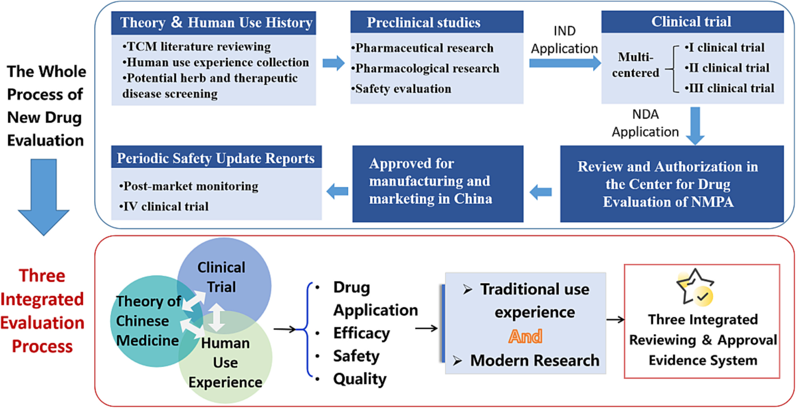
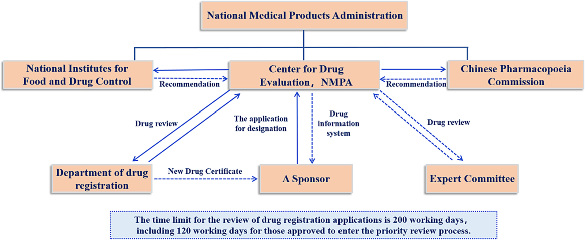
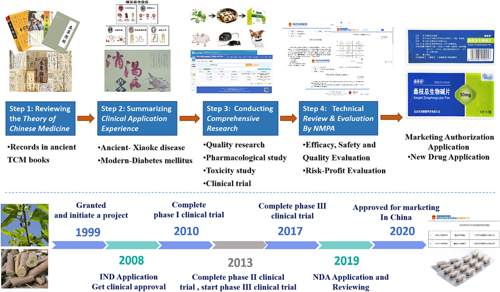

<!-- 方針: 規制的視点のレビューの忠実訳。原文構成に沿う。「> 補足:」は訳者注。 -->

## 書誌情報

- 原題: Ramulus Mori (Sangzhi) alkaloids tablets for diabetes mellitus: A regulatory perspective
- 著者: Xiaoye An, Xiaoxiong Yang, Xueli Ding, Shanshan Ju, Bing Zhang, Zhijian Lin（責任著者）（北京中医薬大学 中薬学院, 中国）
- 掲載: *Fitoterapia* 166 (2023) 105444. https://doi.org/10.1016/j.fitote.2023.105444（オープンアクセス）
- インパクトファクター: **2.95**（*Fitoterapia*, JCR 2024 / Clarivate, Q2）

> 補足: 桑枝アルカロイド錠（桑枝総生物鹼片, Ramulus Mori alkaloids tablets）は桑の枝（桑枝）由来のアルカロイド（DNJ＝1-デオキシノジリマイシン等のα-グルコシダーゼ阻害成分）を有効成分とする、世界初の植物由来天然血糖降下薬。本稿は分析QCでなく、中薬新薬の**薬事・登録制度（NMPAの「三結合」審査承認エビデンス体系）**の視点からその承認過程を論じる。

## 概要 (ABSTRACT)
中薬（TCM）の審査承認制度改革は、新たな登録分類の導入と審査承認エビデンス体系の構築に伴い、継続的に推進されている。この新たな登録プロセスは、「中薬理論＋ヒト使用経験＋臨床試験」を組み合わせた革新的な審査承認エビデンス体系（「三結合」審査承認エビデンス体系）を確立した。桑枝（Ramulus Mori, Sangzhi）アルカロイド錠（桑枝総生物鹼片）は全く新しい新薬である。これは世界初の植物由来天然血糖降下薬であり、現代的な研究を通じて中薬審査承認エビデンス体系の新たなモデルが段階的に構築されてきた。本論文では、「三結合審査承認制度」下における中薬新薬の登録プロセスについて議論し、桑枝アルカロイド錠の開発プロセスを振り返り、「三結合」エビデンス体系下で遭遇した機会と課題を論じることで、中薬開発および世界の植物薬（botanical drugs）開発に対する実現可能な戦略と参照モデルを提供する。

## 1. 導入 (Introduction)
国際糖尿病連合（IDF）の世界糖尿病アトラス（第10版、2021年）によると、2021年時点で世界には約5億3700万人の成人の糖尿病患者が存在し、2019年と比較して16%増加しており、2021年には約670万人が糖尿病または糖尿病合併症により死亡し、全死因の12.2%を占めている [1]。糖尿病は人類の健康を深刻に脅かす公衆衛生問題となっており、中国は糖尿病患者数が最も多く、その90%が2型糖尿病患者である [2]。糖尿病はしばしば高血圧、心血管疾患、肝機能・腎機能異常などの他疾患を合併する [3]。食後血糖値の上昇を効果的に制御することは、糖尿病およびその合併症の発生を予防する上で有益である。α-グルコシダーゼは炭水化物消化における鍵となる酵素であり、食後血糖の制御における重要な標的（ターゲット）である。経口血糖降下薬の一種であるα-グルコシダーゼ阻害剤（α-glucosidase inhibitors）は、ヒト小腸粘膜の刷子縁に存在するα-グルコシダーゼによる二糖類またはオリゴ糖の 1 → 4-配糖体結合（1 → 4-glycosidic bonds）の加水分解を阻害し、これにより食後血糖値を効果的に低下させ、2型糖尿病において良好な有効性を示す [4]。現在、臨床で一般的に使用されている薬剤には acarbose、voglibose、miglitol などがある。これらの薬剤は標的が明確で強力な薬理活性を有するものの、胃腸障害、アレルギー反応、肝障害などの重大な有害作用を伴う [5]。中薬は、単一標的（シングルターゲット）のコンセプトで設計された化学合成医薬品と比較して、長期使用における安全性が優れている。中薬の有効部位（active part）に基づけば、「物質的基礎の明確化、作用機序の明確化、品質の制御」を達成できるだけでなく、中薬のマルチターゲット（多標的）の利点をも保持することができ、糖尿病などの代謝性疾患の治療においてより高い可能性を秘めている。

「桑枝アルカロイド錠（Ramulus Mori alkaloids tablet）」は、中国医学科学院（Chinese Academy of Medical Sciences）による21年間にわたる独自の研究成果である。これは中国で過去10年間に承認された糖尿病治療用の中薬新薬としては初のものであり、中国初のオリジナルの血糖降下天然薬である。現代科学技術の支援のもと、本剤は明確な物質的基礎と作用機序を有し、2型糖尿病の治療に使用される。腸管でのグルコース生成の減少およびグルコース吸収の遅延に加え、糖脂質代謝の調節、腸内マイクロエコロジーの改善、GLP-1分泌の促進、膵島β細胞の保護など、マルチターゲットの薬理作用（multiple pharmacological effects）を有する [6]。伝統的な中薬と比較して、「桑枝アルカロイド錠」は、生薬粗製剤（crude Chinese medicine preparations）にみられる物質的基礎の不明確さ、品質管理の困難さ、不確実な治療効果、用量反応関係（dose-effect relationship）の欠如という欠陥を克服している。

近年、中国国家薬品監督管理局（NMPA）は、中薬自体の特性に基づき、中薬の審査承認のための新たなエビデンス体系を提案している。すなわち、中薬新薬の研究開発は、中薬理論（TCM theory）に導かれ、伝統的な経験と臨床実践を尊重し、現代の科学技術を用いた研究とイノベーションを推奨すべきである。中薬の審査承認に関する新政策は、中薬理論、ヒト使用経験（human use experience）、臨床試験（clinical trials）の「三結合」審査承認エビデンス体系（"Three integrated reviewing and approval evidence system"）が中薬の審査承認を支持するエビデンス体系を構成すべきであると提案しており、これは医薬品の安全性と有効性を明らかにし、確認する上で極めて重要である [7]。本論文では、中薬審査承認制度の改革、「三結合」審査承認制度下における中薬新薬の開発プロセス、桑枝アルカロイドの展開の歴史、および「三結合」エビデンス体系下における機会と課題について論じる。

## 2. 中国NMPAにおける中薬の規制承認プロセス (China NMPA regulatory approval process for Chinese medicine)
臨床における疾患治療の需要を解決し保証するという根本的な目的は、祖国の医学の宝庫を探索し、伝統中医学の真髄を継承・革新し、科学技術革新によって中薬の研究開発と産業発展を推進し、「有効かつ高品質な」新しい中薬を開発することである。国家機関および制度の改革、科学技術革新と基礎研究への重点化、ならびに人材の育成および導入制度の最適化に伴い、中国の製薬産業は発展の歩みを速めている。新しい中薬の研究開発申請は一般的に以下のいくつかの段階に分けられる：
(1) 中薬文献のレビュー、潜在的生薬素材（herbal medications）および治療対象疾患のスクリーニング；
(2) 前臨床（臨床前）研究開発；
(3) 臨床試験（Clinical trial）；
(4) NMPAによる審査および認可（Review and Authorization）；
(5) 中国での製造および販売承認（Approved for manufacturing and marketing in China）。

1963年、『薬品管理に関する若干の規定（Several Provisions on Drug Administration）』の公布により、中国における新薬の研究開発、登録、承認が始まった。『薬品管理条例（1978）』、『新薬管理弁法（試行）（1980）』、『薬品承認弁法（1985）』、『新薬承認弁法（1999）』などの行政規則の変遷を経て、中薬は新薬登録分類において独立したカテゴリーとなった。2002年、国家薬品監督管理局は『薬品登録管理弁法（Measures for the Administration of Drug Registration）』を策定し、2005年、2007年、2020年にさらに標準化および改善を行った。

### 2.1. 中国の医薬品登録の概要 (Introduction to China's drug registration)
現在、中国における中薬の登録は4つのカテゴリーに分類され、最初の3つのカテゴリーが新薬である。

**第1類（Category 1）**は、中薬革新薬（innovative drugs of traditional Chinese medicine）であり、国家薬品規格（national drug standards）、薬品登録規格、および国家中医療薬管理部門が発行した『古代経典名方目録（Catalogue of Ancient Classic and Famous Prescriptions）』に収録されておらず、臨床的価値を有し、海外で上場されていない新しい処方製剤を指す。これには以下が含まれる：
- **類別1.1 (Category 1.1)**：「多種生薬の飲片または抽出物から構成される複方製剤（compound preparations composed of multi-flavor decoction pieces or extracts）」
- **類別1.2 (Category 1.2)**：「単一の植物、動物、鉱物その他の物質から抽出された抽出物およびその製剤（extracts and preparations extracted from single plants, animals, minerals and other substances）」
- **類別1.3 (Category 1.3)**：「新しい薬用素材およびその製剤（new medicinal materials and preparations）」

**第2類（Category 2）**は、中薬改良型新薬（improved new drugs of traditional Chinese medicine）であり、上場済みの中薬の投与経路や剤形を変更し、臨床適用上の利点や特徴を有するか、あるいは機能主治（効能・効果、functional indications）を追加した製剤を指す。以下の4つのケースがある：
- **類別2.1 (Category 2.1)**：「上場済み中薬の投与経路を変更する製剤（Preparations that change the way of administration of listed traditional Chinese medicine）」
- **類別2.2 (Category 2.2)**：「上場済み中薬の剤形を変更する製剤（Preparations that change the dosage form of listed traditional Chinese medicine）」
- **類別2.3 (Category 2.3)**：「中薬の機能主治を増加させるもの（Indications for increasing the function of traditional Chinese medicine）」
- **類別2.4 (Category 2.4)**：「上場済み中薬の製造プロセスまたは賦形剤の変更により、薬用物質の基礎または医薬品の吸収・利用に重大な変化が生じるもの（Changes in the production process or excipients of listed traditional Chinese medicine cause significant changes in the basis of medicinal substances or drug absorption and utilization）」

**第3類（Category 3）**は、古代経典名方中薬複方製剤（ancient classic and famous traditional Chinese medicine compound prescriptions）であり、『中華人民共和国中医療法』の規定に適合し、古代の中医薬文献に記録された処方に由来し、現在も広く使用され、明確な治療効果と顕著な特徴・利点を有する中薬複方製剤を指す。さらに以下のように細分化される：
- **類別3.1 (Category 3.1)**：「古代経典名方目録に沿って管理される中薬複方製剤（traditional Chinese medicine compound preparations managed according to the ancient classic famous recipe catalogue）」
- **類別3.2 (Category 3.2)**：「古代経典名方に由来するその他の中薬複方製剤（other traditional Chinese medicine compound preparations derived from ancient classic famous recipes）」

**第4類（Category 4）**は、上場済みの中薬と同名同方薬（drugs with the same name and common name）を指し、処方、剤形、機能主治、用法・用量、1日用量がすでに上場されている中薬と同一であり、安全性、有効性、および品質管理においてそれらに劣らないものをいう。

### 2.2. 「三結合」審査承認エビデンス体系 (The three integrated reviewing and approval evidence system)
近年、中国は中薬（TCM）の活動を指導するための一連政策文書を発行し、新しい中薬の創出を中薬発展における重要任務の一つとして明確に位置づけている。2017年に発行された『医薬品医療機器審査承認制度改革の深化によるイノベーション推奨に関する意見（Opinions on Deepening the Reform of the Review and Approval System to Encourage Innovation in Pharmaceuticals and Medical Devices）』では、中薬の特性に合致した登録管理制度および技術評価体系を確立・整備することが明確に提案され、中薬を革新薬、古典名方薬、天然薬に分類した [8]。2019年10月に発表された中共中央・国務院の『中医療の継承と革新的発展の促進に関する意見（Opinions on Promoting the Inheritance and Innovative Development of Chinese medicine）』では、中薬の登録管理の改革と改善、および中薬の特性に合った安全性・有効性評価の方法と技術規格の確立・整備が提案された。中薬の登録分類をタイムリーに改善し、中薬の審査承認に関する規定を策定し、臨床的価値に基づく優先審査承認制度を実施する。中薬理論、ヒト使用経験、臨床試験を組み合わせた中薬登録審査エビデンス体系の構築を加速する。新たな登録プロセスは中薬の特性を強調し、斬新なエビデンス体系である「『三結合』審査承認エビデンス体系（"Three integrated reviewing and approval evidence system"）」を確立した [9]。2020年末、NMPAは『中医療の継承と革新的発展の促進に関するNMPAの実施意見』を発行し、この奨励策をさらに強化した。この改革は主に以下の4つのコンセプトに従っている [10]：
- 中薬研究の法則を尊重し、中薬の特性を際立たせる；
- 臨床志向（臨床定位）を堅持し、中薬の革新的な研究開発を奨励する；
- 古代古典医籍の精髄の整理と発掘を強化し、中薬の伝統の発展を促進する；
- ライフサイクル全体の管理を改善し、中薬の二次開発（二次研究開発）を奨励する。

この中薬審査承認制度の改革は、新しい中薬の継承と革新に対してより高い基準と要件を提示すると同時に、新しい中薬の研究開発に歴史的な機会をもたらした。2021年1月22日、国務院総局は『中医療の特色ある発展の加速に関する若干の政策措置（Several Policies and Measures on Accelerating the Development of the Characteristics of Traditional Chinese Medicine）』を発行し、中薬理論、ヒト経験、臨床試験の組み合わせに基づく中薬の登録および評価のエビデンス体系を確立する必要性を明確に指摘した。

中薬の特性、研究開発のルール、および実践に基づき、中薬理論、ヒト使用経験、臨床試験を有機的に組み合わせることで、中薬の有効性と安全性を支持するエビデンスが形成される。これが「三結合」審査承認エビデンス体系と呼ばれるものである。ヒト使用経験については、現代の臨床実践を強調しており、臨床的な必要性を満たすために長期の臨床実践に基づいて蓄積され、一定 of 規則性と再現性を有する中薬の臨床知識の一般的な総括である [11]（図1参照）。

> 補足: 原文の図1（Fig. 1. The process of new drug authorization and the “Three integrated review and approval evidence system”.）は、新薬の認可プロセスおよび「中薬理論＋ヒト使用経験＋臨床試験」がどのように連動して承認エビデンス体系を構成するかを示した概念図である。

### 2.3. 「三結合」審査承認エビデンス体系下における中薬承認の現状 (Current situation of traditional Chinese medicine authorization under the “three integrated” reviewing and approval evidence system)
中国は審査承認制度の改革を深化させ続けており、改革の恩恵が徐々に現れている。2021年、医薬品登録申請数は前年比 12.81% 増加し、各種医薬品の登録申請数は前年比 18.50% 増加した。期限内の審査承認完了率は 98.93% に達し、歴史的な突破口を開いた [12]。

NMPAの医薬品審査センター（CDE）は、緊急審査の成功経験をまとめ、『革新的医薬品の上場申請審査の加速化に関する手順（Procedures for Accelerating the Review of Innovative Drug Listing Applications）』を起草し、革新的医薬品に対して「早期介入（early intervention）」などのサービスを提供した。これにより、外部に対しては申請者が提出資料の品質を向上させ、遠回りを減らすのを支援し、内部に対しては審査タスク管理の監督を強化して、革新的な成果がより早く患者に利益をもたらすことを保証している [13]。2021年、中国で受理および結了した革新的医薬品の登録数は過去5年間で最高を記録し、年間に 47 品の革新的医薬品が承認され、過去最高を更新した。そのうち 45 品が販売承認され、2020年の 20 品と比較して新たな飛躍を遂げた [14, 15]。

## 3. NMPA承認プロセスの課題 (The challenges of the NMPA approval process)
中国の医薬品登録スケジュールは、長期にわたり「時間制限がなく、長すぎる」と批判されてきた。近年、中国政府は医薬品登録、医療サービス、医療保険という相互に関連する3つのセグメントを網羅する医薬品規制枠組みの改革に注力してきた。中国の医薬品登録改革は、医薬品審査承認の品質と透明性の向上、医薬品登録のバックログ（滞留）の解消、ジェネリック医薬品の品質向上、および新薬の研究開発の推奨にかかっている。国家薬品監督管理局の医薬品審査センター（CDE）は、かつて医薬品登録の審査と承認に約 900 日を要していた。この手続きは2019年には約 300 日に短縮された。この短縮の直接的な理由は、CDEのスタッフが2015年の 100 人から2020年には約 1000 人に増加したことにある。『薬品登録管理弁法（2020年改訂版、「2020年薬品登録弁法」）』は、審査と承認を原則として 200 営業日以内に完了することをさらに求めている。新たな構造的課題が、医薬品のイノベーションを促進するという戦略的ビジョンを損なう可能性がある。中国の国家薬品監督管理局は、「中薬理論、ヒト使用経験、臨床試験の統合」に基づく中薬の登録および評価に関するエビデンス体系のガイドラインを発行している。

### 3.1. 中薬理論と医薬品の臨床的位置づけとの整合 (The interface between traditional Chinese medicine theory and clinical positioning of medicines)
未充足の臨床ニーズ（Unmet clinical needs）に焦点を当て、革新的な中薬の研究開発は、中薬理論のもとで科学的な臨床志向（臨床定位）を堅持しなければならない。桑枝アルカロイド錠を例にとると、『本草綱目（Compendium of Chinese Materia Medica）』には、桑の葉（桑葉）、桑の根皮（桑白皮）、およびカイコの糞（蚕砂）が「消渇（Xiaoke）」の治療に使用できることが記録されている。古代の用語である「消渇」は、現代医学の用語で「糖尿病」を指す。現代医学における多くの研究を経て、糖尿病治療の処方を記載した古典籍に記録されている100以上の生薬に対して予備的な活性スクリーニングが行われ、桑枝（桑の枝）が強力な配糖体酵素（グルコシダーゼ）阻害効果を有することが初めて発見された。この研究結果は、桑植物を消渇の現代医学的治療に使用するための明確な理論的基礎を提供し、これによりクワの生薬に基づく新たな血糖降下薬開発の研究方向が確立された。桑枝アルカロイド錠およびその製剤の研究は、祖国の古代中医薬文献の真髄に基づき、現代医学のコンセプトに従って開発された天然薬（natural medicine）である。

### 3.2. ヒト使用経験データの標準化された収集 (A standardized collection of human use medication experiences)
「三結合」審査承認制度は、中薬の安全性と有効性を支持する上でのヒト使用経験の役割をさらに強調しており、ヒト使用経験に関する情報を収集・要約して、評価に使用できる高品質なデータとエビデンスを形成することが、中薬のヒト使用経験研究における重要な側面である [16]。

単一の生薬処方（単味製剤）は、ヒト使用経験から得られやすく、比較的標準化されている。例えば、桑枝アルカロイド錠は天然の桑枝に由来する。同様に、2022年1月に販売承認された「淫羊藿軟カプセル（Epimedium soft capsule）」は、革新的な小分子免疫調節薬であり、そのコア成分は伝統的な中薬である淫羊藿（Epimedium、仙霊脾や剛前とも呼ばれ、古典籍の『神農本草経』や『本草綱目』に収録され、臨床で一般的に使用されている生薬）から抽出・精製されたイカリイン（icariin）である [17]。明確な化学構造式と明確な臨床作用機序は、伝統的な天然植物薬に基づいており、西洋薬の開発思想と完全に融合している。

しかし、中薬（TCM）における個別化医療（弁証論治）とエビデンスに基づく治療の臨床的重視は、臨床的介入と評価においてその特異性と複雑性を有している [18]。患者一人ひとりに異なる処方が適用され、処方が固定されていない場合、どのようにしてヒトの薬物使用経験を得ることができるのだろうか。リアルワールド研究（RWS）の核心的な考え方は、実際の臨床症例から直接エビデンスを取得することであり、その最終目標は実際の医療行為を反映することである。患者が実際の診療現場で治療を受けるからこそ、患者の実際の状況に応じて薬を投与すべきであり、これは中薬の「弁証論治」という治療特性に合致し、中薬の臨床的特徴を反映することができる [19]。これはヒト使用経験に対する強力な臨床研究手法であり、古代の古典的中薬処方の新薬申請に対する科学的エビデンスを提供するものである [20]。古代の古典的処方とヒト使用のリアルワールド・エビデンスに基づき、2021年3月に「清肺排毒顆粒（Qingfei Paidu Granules）」が販売承認された。

### 3.3. 標準化された臨床試験 (Standardized clinical trials)
臨床試験は、新薬の有効性と安全性を確認するために不可欠なステップであると同時に、研究者自身の育成、医学の進歩の促進、および世界中での学術交流の推進において、代替不可能な重要性を果たしている。

2017年、中国NMPAは日米EU医薬品規制調和国際会議（ICH）に加盟し、これにより中薬の研究開発および医薬品臨床試験の国際化が加速した [21]。中国における臨床試験機関の建設においては、共同倫理審査（中央倫理審査）モデルの導入、被験者のリモート募集プラットフォームの構築、およびリモートモニタリングと品質管理の実施など、新たな進歩が見られる。さらに、中国の臨床試験機関数は近年増加し続けており、機関内の専従職員数も増加し続け、機関の審査と実施の効率は段階的に向上している [22]。桑枝アルカロイド錠の臨床試験は、中国医学科学院北京協和医院（Peking Union Medical College Hospital）で実施され、臨床登録番号は ChiCTR2000034289 である。

同時に、中国の医薬品臨床研究は世界の先進レベルと徐々に整合しつつある。「複方丹参滴丸（Compound Danshen Dripping Pills、米国FDA研究申請コード：T89）」は、1996年から米国FDAに対して臨床研究および試験の申請を行っており、20年以上の詳細な研究を経て、2016年12月にFDAフェーズIII臨床認証に合格し、世界で初めてFDAフェーズIII臨床試験を完了した中薬複方製剤となった [23]。また、中薬品種である「地奥心血康カプセル（DiAo Xinxuekang Capsule）」は、オランダ保健環境検査局（Dutch Health Protection Inspectorate）への治療用医薬品としての登録（登録番号：RVG102142）に成功して同国で販売が承認され、中国の中成薬品種として初めて治療用医薬品として欧州連合（EU）医薬品市場に参入した品種となった [24]。

### 3.4. 「三結合」審査承認エビデンス体系下における一部の研究項目の免除 (Partially exempt research projects under the “Three integrated reviewing and approval evidence system”)
ヒト使用経験の強固な実証的エビデンスに基づき、新しい中薬の登録審査に関する関連要件に従って、薬力学試験（薬効薬理試験）の免除およびフェーズII臨床試験の免除が承認される場合がある [25]。これにより、研究開発サイクルの短縮、研究開発コストの削減、研究開発成功率の向上、および新しい中薬の上場加速が図られる（図2参照）。

> 補足: 原文の図2（Fig. 2. The application process of attributes-definition of drug in China.）は、人用経験（ヒト使用経験）のデータ品質や実証レベルに応じて、非臨床薬力学試験や臨床フェーズII試験の免除などの簡素化された申請ルートが適用されるプロセスを説明した図である。

## 4. 「三結合」エビデンス体系下における桑枝アルカロイド錠の審査と評価 (The review and evaluation of Ramulus Mori alkaloids tablet under the “three integrated” evidence system)
臨床的価値を重視する中薬審査エビデンス体系は、「中薬理論＋ヒト使用経験＋臨床試験」の「三結合」を構築し、中薬の臨床的位置づけと適合し、その特徴と利点を反映した有効性評価基準の確立を促進し、「現代の言語」を用いて中薬を解釈する。

2020年3月17日、中国医学科学院北京協和医学院薬物研究所（Institute of Materia Medica, Chinese Academy of Medical Sciences、以下「薬物所」）が21年間の研究開発を経て開発した「桑枝アルカロイド錠（Ramulus Mori alkaloids tablet）」が、NMPAにより販売承認された。これは中国で過去10年以上に承認された初の革新的な中薬であり、糖尿病治療の分野における唯一 of 天然薬の有効成分（有効部位）製剤である [26]。桑枝アルカロイド錠の開発成功は、「真髄を継承し、正道を維持し、革新する（伝承精華、守正創新）」という中薬の開発コンセプトの典型的な例である。

### 4.1. 古代文献における桑枝の応用 (The application of mulberry branch in ancient literature)
継承と革新的発展は、伝統中医学の不変のテーマである。臨床薬物投与の重要な基礎として、伝統中医学の理論は機能主治の合理性の解釈である。実践の発展とともに伝統中医学理論の継続的な発展と革新を推進し、中薬新薬の研究開発に対する持続可能な原動力とすることで、源流からの中薬新薬の転換を促進する。

中国は世界で最も早く養蚕のためにクワ（桑）を栽培した国であり、桑の栽培において長い歴史を有している。シルク生産のためのカイコの飼育に加え、クワは伝統的な中薬でもあり、樹木の異なる部位が中国薬典（Chinese Pharmacopoeia）に収録されている [27]。消渇は、隋代の甄立言（Zhen Liyan）による『古今録験方（Ancient and Modern Recorded Experimental Formulae）』において初めて記載され、現在は糖尿病として知られている。血糖降下活性に関して初期に報告された研究の多くは、桑の葉（桑葉）、桑の根皮（桑白皮）、または桑の実（桑椹）に焦点を当てており、これらは『本草綱目』に記録されている [28]。桑枝（Sangzhi）は、クワ科（Moraceae）の植物であるクワ（Morus alba L.）の幼い枝であり、味は苦・平、肝経に属し、晩春から初夏にかけて収穫される。これは『図経本草（Illustrated Classics of Materia Medica）』に最初に掲載され [29]、その主な効果は「袪風湿、利関節、行水気（風湿を除き、関節の動きを滑らかにし、陽気を温めて利尿を促す）」とされ、風湿痺痛（風湿による麻痺や痛み）に使用された。消渇に対する使用ではなかったものの、『図経本草』には桑枝が「全身の風痒および乾燥、足菌、四肢の拘攣、上気、目眩、肺気の咳を治療し、食を消し、小便を利し、長く服すれば身を軽くし、耳目を聡明にし、口を滑らかにし、また口乾を治す」ことも言及されている。『中華薬典（Dictionary of Chinese Pharmacology）』 [30] にも、桑枝が「癰疽の口乾および口渇を治す」と記録されている。文献からわかるように、桑枝は風寒および湿痺に使用されるだけでなく、「生津（津液を生じる）」、「治口乾（口の乾燥を治す）」、「養腎水（腎水を養う）」ためにも使用されるため、口渇（糖尿病の症状）の治療にも使用することができる。

### 4.2. 桑枝のヒト使用経験 (Human use experience of mulberry branch)
中薬のヒト使用経験とは、臨床的ニーズを満たすために長期の臨床実践において蓄積され、一定の規則性と再現性を有する中薬に関する臨床の診断・治療の理解の一般的な総括を指す [31]。これは臨床的価値に基づく新しい中薬の選択のための重要な基礎、製品の臨床的有効性を検証するためのエビデンスであるだけでなく、研究開発戦略を最適化し、初期の研究開発をサポートするための基礎でもある。ヒト使用経験のデータ収集は、医療倫理原則を前提とし、実際の医療環境で得られた科学的データであるべきであり、これは中薬の安全性、有効性、および臨床的価値を評価するための強力なエビデンスとなる。

**桑枝の処方への応用**：消渇の治療における桑枝の使用は、古くから多くの中国医学書や処方に記録されてきた。近年、桑枝は糖尿病の治療に使用され、満足のいく結果を得ている。童小林（Tong Xiaolin）教授 [32] は、長年の臨床経験に基づき、桑の葉（桑葉）、桑の枝（桑枝）、および桑の根皮（桑白皮）の3つの生薬を選択し、「三桑」処方を合成した。これは清熱・降糖（熱を下げ血糖を下げる）において、また糖代謝疾患の予防と治療において良好な結果を達成している。この処方は、糖尿病の初期の「熱勢」をターゲットにするだけでなく、経絡に浸透し、同時に標的状態を調節するため、清熱・降糖の代表的な処方となっている。国医大師である呂仁和（Lv Renhe）教授 [33]（> 補足: 原文は"Lu Renhe"）は、「枝をもって四肢を治療する（以枝治肢）」ことを提唱し、糖尿病性末梢神経障害によって引き起こされる四肢の痛み、冷え、およびしびれを治療するために桑枝を適用した。徐明（Xu Ming） [34] は、桑寄生（Mulberry parasite）、桑椹（Mulberries）、および桑枝に基づく処方（三桑三藤湯）を用いて糖尿病性末梢神経障害 38 例を治療し、総有効率 86.8% を得た。糖尿病性関節症および末梢神経障害の臨床治療において、桑枝は中医学でしばしば使用され、血糖値を著しく低下させ、症状を緩和することができる。

**桑枝顆粒の臨床応用**：桑枝顆粒は、陰を補って津液を生じさせ、血を巡らせて経絡を通じさせることができる。陰虚内熱および瘀血阻絡（瘀血が経絡を阻むこと）による消渇に使用される。その顕著な予防および治療効果により、桑枝顆粒は臨床医や患者の間で人気があり、軽度から中等度の2型糖尿病の治療における重要な薬剤となっている [35]。郭宝栄（Guo Baorong）らの研究では、桑枝顆粒が糖尿病患者の空腹時および食後血糖値、24時間尿糖定量、および糖化ヘモグロビン（HbA1c）を低下させるだけでなく、高脂血症の改善にも効果的であることが示された [36]。

### 4.3. 桑枝アルカロイド錠の臨床試験 (Clinical trials of Ramulus Mori alkaloids tablet)
医薬品の安全性と有効性を評価するためのゴールドスタンダードとして、ランダム化比較臨床試験（RCT）は依然として検証的臨床試験のための最も重要な研究デザイン手法である。ヒト使用経験は医薬品の臨床的位置づけを定義し、臨床試験の精密な設計と成功のための基礎を築いた。中薬の臨床的位置づけと適合し、その機能的特徴と利点を反映した有効性評価基準の確立、ならびに有効性と安全性の包括的、客観的かつ科学的な評価は、中薬の研究開発の成功率を向上させ、高品質な中薬の発展へと進むための重要なイノベーションの経路でもある。

2008年9月に臨床試験が承認された全く新しい薬剤である桑枝アルカロイド錠は、2017年に国家薬品監督管理局医薬品審査センター（CDE）へ上場申請が正式に提出されるまで、10年間にわたる臨床試験を経た。北京協和医院（Peking Union Medical College Hospital）の主導のもと、国際的に認められた糖化ヘモグロビン（HbA1c）のゴールドスタンダードを用いて、プラセボとの比較および第一選択の化学合成医薬品との直接比較（ヘッド・トゥ・ヘッド比較）を含む数千例のランダム化ダブルブラインド臨床研究が完了し、血糖降下における中薬の臨床評価の新たなコンセプトが確立された。厳格な臨床試験の結果、桑枝アルカロイド錠は、単独療法（単剤療法）としても、メトホルミン（metformin）で血糖管理不十分な症例に対する併用療法としても、良好な糖化ヘモグロビン（HbA1c）低下効果を示し、有害事象（副作用）の発現頻度は対照薬のアカルボース（acarbose）と比較して有意に低く、中薬は血糖値低下の補助療法としてしか使用できないという従来の状況を変化させた。さらに、桑枝アルカロイド錠は、「内熱」や「湿熱困脾（湿熱が脾を阻むこと）」の症状を著しく改善し、脂質代謝を調節し、体重をコントロールすることができ、化学合成対照薬よりも有意に高い安全性プロファイルを示した [37]。本剤は、化学合成医薬品のように糖化ヘモグロビンを低下させることと、中薬のようにTCMの症状を改善することの複合的な利点を併せ持っている。

### 4.4. 桑枝アルカロイド錠の品質管理性 (Quality controllability of Ramulus Mori alkaloids tablet)
桑枝の血糖降下における有効部位は桑枝の総アルカロイド（total alkaloids of mulberry）であり [38]、主に 1-deoxynojirimycin (1-DNJ)、fagopyrin (FAG)、および 1, 4 dideoxy-1,4- imino- d-arabinosol (DAB) から構成されている [39]（> 補足: 原文の fagopyrin は fagomine、arabinosol は arabinitol の誤記と思われる）。桑枝血糖降下薬の開発成功の鍵は、複雑な抽出物におけるアルカロイド組成と含有量の正確な分析である。薬用素材における総アルカロイドの含有量は極めて低く、水溶性で極性が高く、特徴的なUV（紫外線）吸収を持たない。また、抽出物には多糖類、アミノ酸、フラボノイド、無機塩などの様々な成分が含まれているため、品質管理が困難であった [40]。多分野の共同研究、多様な現代分析手法の適用、および数多くの試験と探索を通じて、薬物研究所はついに微量水溶性アルカロイドの分離と精製という高度な技術障壁を打ち破り、アルカロイドの含有量を抽出物の 0.1% 未満から 50% 以上に向上させた。さらに、有効成分の化学構造が同定されたことで、複雑な系における正確な品質管理が可能となった [41]。

### 4.5. 桑枝アルカロイド錠の薬理・毒性研究 (Pharmacological-toxicological studies of Ramulus Mori alkaloids tablet)
薬物研究所は、現代の医薬品技術を採用し、in vitro（試験管内）酵素学、動物個体（whole animal）、in vitro細胞、および分子生物学など、多次元的かつ多レベルから桑枝アルカロイド錠のマルチターゲット薬理作用を解明している。in vitro酵素実験では、桑枝アルカロイド錠が二糖類分解酵素（disaccharidase）に対して明らかな阻害効果を有することが確認され、その効果はアカルボース（Acarbose）と同等またはそれ以上であることが判明した。動物実験では、多様なラットおよびマウスのモデルを用いてその抗糖尿病効果が検証された。その結果、複数回投与後、糖尿病マウスにおけるデンプンまたは二糖類の負荷後の血糖値が有意に低下し、長期投与により糖尿病体における糖脂質代謝異常および腎臓の病態が改善されることが見出された。単離細胞レベル（isolated cells）では、桑枝アルカロイド錠がグルコース刺激によるインスリン分泌機能を増加させることが見出された [42]。プロテオミクス研究（Proteomic studies）は、桑枝アルカロイド錠が回腸（Ileal）組織における脂質吸収関連タンパク質および炎症性サイトカイン（pro-inflammatory factors）を有意に抑制し、腸管での脂質吸収を阻害し、腸管および腸間膜マクロファージの活性化状態と体内炎症を低下させることを示した [43]。天然薬として、桑枝アルカロイド錠は糖脂質代謝の良好な調節を示すだけでなく、膵島機能や腸内マイクロエコロジーの改善といった多様な薬理効果を有しており、糖尿病などの代謝性疾患の治療においてより包括的なベネフィットの可能性を秘めている。

反復投与毒性試験において、ラットに総アルカロイドを 125, 250, 500 mg/kg で26週間連続経口投与したところ、500 mg/kg で雌ラットに緩やかな体重増加抑制が見られたが、250 mg/kg（臨床推奨用量の8.1倍に相当）では有害作用は見られなかった。イヌに 75, 150, 300 mg/kg の桑枝アルカロイドを39週間連続経口投与したところ、300 mg/kg および 150 mg/kg で緩やかな体重増加抑制が見られたが、75 mg/kg（臨床推奨用量の8.3倍に相当）の用量では有害作用は見られなかった。これらの試験結果は、桑枝アルカロイド錠の臨床用量が安全かつ信頼できるものであることを示している。

### 4.6. 要約 (Summary)
「三結合」審査承認エビデンス体系は、中薬の研究開発の法則と特性を尊重し、中薬の状況に適した新たな考え方と取り組みを提案している。将来的には、安全性、有効性、および品質管理の基本要件を、中薬の継承と革新的発展という独自の理論体系および実践的特性と統合し続け、中薬の登録および監督に関する政策とメカニズムを継続的に革新し改善することで、中薬の発展を促進する必要がある（図3参照）。

> 補足: 原文の図3（Fig. 3. The practice of the “Three Integrated Review Evidence System” for Ramulus Mori alkaloids tablet.）は、桑枝アルカロイド錠が「中薬理論」「人用経験」「臨床試験」の三要素をどのように統合・調和させて現代科学的な承認エビデンス体系を実践したかを要約した図である。

## 5. 結びの言葉 (Concluding remarks)
中薬の資源の宝庫を開発し、現代科学の言語を用いて中薬の有効性を説明する。桑枝アルカロイド錠の研究は、中薬（TCM）に基づきつつ現代の天然薬（modern natural drugs）に焦点を当て、中薬登録審査のエビデンス体系における突破口として「中薬理論＋ヒト使用経験＋臨床試験」の「三結合」を採用し、審査戦略を最適化し、「西洋薬の基準で中薬を管理する（以西律中）」評価手法を打破し、最終的に安全性、有効性、および品質管理を達成した。マルチコンポーネント（多成分）天然薬として、桑枝アルカロイド錠は、中薬における活性成分の不明確さや単一の化学成分という限界を打ち破り、明確な活性成分、明確な作用機序、およびマルチターゲットの薬理作用を備えた新しいオリジナルの天然血糖降下薬となった。特に、米や麺などのデンプン質の食事を主とする中国人およびアジア人の食事構造において、食後血糖の上昇を抑制する上でより優れた効果を発揮することができ、多くの糖尿病患者に朗報をもたらした。さらに、桑枝（クワの枝）は養蚕プロセスにおけるクワの木管理の副産物である。桑枝資源は養蚕産業において生物学的に豊富であり、1エーカーあたり年間最大 1.0 〜 1.5 トン（1 to 1.5 tons per acre/acre/year）発生するが、畑に廃棄されるかその場で焼却され、深刻な環境汚染の原因となっていた。桑枝を宝物へと転換することは、グリーン開発（緑色発展）のコンセプトに合致し、新薬開発の新たな道を切り拓くものであり、重要な実証的・指導的役割と顕著な社会的便益を有している。桑枝アルカロイド錠は伝統から出発し、現代の研究を経ている。これは、中薬の真髄を継承し、正道を維持して革新するという鮮やかな実践である。この医薬品開発モデルは参考に値するものであり、新しい中薬の開発を大いに鼓舞するものである。医薬品の研究開発に対する実現可能な戦略と参照モデルを提供する。

## 図（原論文より）

## 参考文献

> 原論文の参考文献。番号は本文の引用 [N] に対応。各文献はDOIまたはGoogle Scholar検索へのリンク。

1. International Diabetes Federation, IDF Diabetes Atlas, 10th ed., 2021. https://dia betesatlas.org/idfawp/resource-files/2021/07/IDF_Atlas_10th_Edition_2021. Accessed April 1, 2022. — [Google Scholarで探す](https://scholar.google.com/scholar?q=International%20Diabetes%20Federation%2C%20IDF%20Diabetes%20Atlas%2C%2010th%20ed.%2C%202021.%20https%3A//dia%20betesatlas.org/idfawp/resource-files/2021/07/IDF_Atlas_10th_Edition_2021.%20Accessed%20Apri)
2. Diabetes Branch of Chinese Medical Association, Guidelines for the prevention and treatment of type 2 diabetes in China(2020 edition)[J], Chin. J. Diabetes 13 (04) (2021) 315–409. — [Google Scholarで探す](https://scholar.google.com/scholar?q=Diabetes%20Branch%20of%20Chinese%20Medical%20Association%2C%20Guidelines%20for%20the%20prevention%20and%20treatment%20of%20type%202%20diabetes%20in%20China%282020%20edition%29%5BJ%5D%2C%20Chin.%20J.%20Diabetes%2013%20%2804%29%20%282021%29)
3. W. Ma, T. Zhong, J. Chen, X. Ke, H. Zuo, Q. Liu, Exogenous H2S reverses high glucose-induced endothelial progenitor cells dysfunction via regulating autophagy, Bioengineered. 13 (1) (2022) 1126–1136. — [Google Scholarで探す](https://scholar.google.com/scholar?q=W.%20Ma%2C%20T.%20Zhong%2C%20J.%20Chen%2C%20X.%20Ke%2C%20H.%20Zuo%2C%20Q.%20Liu%2C%20Exogenous%20H2S%20reverses%20high%20glucose-induced%20endothelial%20progenitor%20cells%20dysfunction%20via%20regulating%20autophagy%2C%20Bioenginee)
4. B. Usman, N. Sharma, S. Satija, M. Mehta, M. Vyas, G.L. Khatik, N. Khurana, P. M. Hansbro, K. Williams, K. Dua, Recent developments in alpha-glucosidase inhibitors for management of type-2 diabetes: an update, Curr. Pharm. Des. 25 (23) (2019) 2510–2525. — [Google Scholarで探す](https://scholar.google.com/scholar?q=B.%20Usman%2C%20N.%20Sharma%2C%20S.%20Satija%2C%20M.%20Mehta%2C%20M.%20Vyas%2C%20G.L.%20Khatik%2C%20N.%20Khurana%2C%20P.%20M.%20Hansbro%2C%20K.%20Williams%2C%20K.%20Dua%2C%20Recent%20developments%20in%20alpha-glucosidase%20inhibitors%20for%20ma)
5. Y.M. Wang, G.J. Wang, S.L. Zhang, X.H. Tao, Adverse drug reactions of antidiabetic drugs and the preventive strategies, Chin. Hosp. Pharm. J. (2015), 24.19. — [Google Scholarで探す](https://scholar.google.com/scholar?q=Y.M.%20Wang%2C%20G.J.%20Wang%2C%20S.L.%20Zhang%2C%20X.H.%20Tao%2C%20Adverse%20drug%20reactions%20of%20antidiabetic%20drugs%20and%20the%20preventive%20strategies%2C%20Chin.%20Hosp.%20Pharm.%20J.%20%282015%29%2C%2024.19.)
6. S.N. Liu, Q. Liu, Y.L. Liu, M.Z. Xie, Z.F. Shen, The road to the innovation of mulberry total alkaloid tablets[J], Chin. J. Pharmacol. Toxicol. 35 (10) (2021) 746. — [Google Scholarで探す](https://scholar.google.com/scholar?q=S.N.%20Liu%2C%20Q.%20Liu%2C%20Y.L.%20Liu%2C%20M.Z.%20Xie%2C%20Z.F.%20Shen%2C%20The%20road%20to%20the%20innovation%20of%20mulberry%20total%20alkaloid%20tablets%5BJ%5D%2C%20Chin.%20J.%20Pharmacol.%20Toxicol.%2035%20%2810%29%20%282021%29%20746.)
7. Z.J. Lin, H.N. Wang, The opportunity and challenge for the pharmacists of traditional Chinese medicine in new drug development under the new regulatory policy[J], Chin. J. New Drugs 31 (09) (2022) 832–835. — [Google Scholarで探す](https://scholar.google.com/scholar?q=Z.J.%20Lin%2C%20H.N.%20Wang%2C%20The%20opportunity%20and%20challenge%20for%20the%20pharmacists%20of%20traditional%20Chinese%20medicine%20in%20new%20drug%20development%20under%20the%20new%20regulatory%20policy%5BJ%5D%2C%20Chin.%20J)
8. General Office of the State Council, Opinions on Deepening the Reform of the Review and Approval System and Encouraging the Innovation of Drugs and Medical Devices. https://www.nmpa.gov.cn/xxgk/fgwj/gzwj/gzwjyp/2017100 9164201907.html.Accessed, 2023. April 15, 2022. — [Google Scholarで探す](https://scholar.google.com/scholar?q=General%20Office%20of%20the%20State%20Council%2C%20Opinions%20on%20Deepening%20the%20Reform%20of%20the%20Review%20and%20Approval%20System%20and%20Encouraging%20the%20Innovation%20of%20Drugs%20and%20Medical%20Devices.%20https)
9. General Office of the State Council, Opinions on Promoting the Inheritance, Innovation and Development of Traditional Chinese Medicine. https://www.nmpa. gov.cn/xxgk/fgwj/qita/20191026120001870.html. Accessed April 15, 2023. , 2022. — [Google Scholarで探す](https://scholar.google.com/scholar?q=General%20Office%20of%20the%20State%20Council%2C%20Opinions%20on%20Promoting%20the%20Inheritance%2C%20Innovation%20and%20Development%20of%20Traditional%20Chinese%20Medicine.%20https%3A//www.nmpa.%20gov.cn/xxgk/fgwj)
10. General Office of the State Council, Implementation Opinions of the State Food and Drug Administration on Promoting the Inheritance, Innovation and Development of Traditional Chinese Medicine. https://www.nmpa.gov.cn/xxgk/fgwj/gzwj/gzw jyp/20201225163906151.html, 2023. Accessed April 15, 2022. — [Google Scholarで探す](https://scholar.google.com/scholar?q=General%20Office%20of%20the%20State%20Council%2C%20Implementation%20Opinions%20of%20the%20State%20Food%20and%20Drug%20Administration%20on%20Promoting%20the%20Inheritance%2C%20Innovation%20and%20Development%20of%20Traditi)
11. H.N. Wang, Reform of evaluation and approal system of traditional Chinese medicine and the registration classification[J], Chin. J. New Drugs 30 (03) (2021). — [Google Scholarで探す](https://scholar.google.com/scholar?q=H.N.%20Wang%2C%20Reform%20of%20evaluation%20and%20approal%20system%20of%20traditional%20Chinese%20medicine%20and%20the%20registration%20classification%5BJ%5D%2C%20Chin.%20J.%20New%20Drugs%2030%20%2803%29%20%282021%29.)
12. F.P. Kong, Deepen reform of review and approval system, promote high-quality development of pharmaceuticals[J], China Food Drug Adm. Mag. 02 (2022) 14–23. — [Google Scholarで探す](https://scholar.google.com/scholar?q=F.P.%20Kong%2C%20Deepen%20reform%20of%20review%20and%20approval%20system%2C%20promote%20high-quality%20development%20of%20pharmaceuticals%5BJ%5D%2C%20China%20Food%20Drug%20Adm.%20Mag.%2002%20%282022%29%2014%E2%80%9323.)
13. N. Luo, J. Fu, The drug review reform has blossomed for the first time, and the review and approval have achieved fruitful results[N], Zhong Guo Yi Yao Bao 2022-06-15 (003) (2023). — [Google Scholarで探す](https://scholar.google.com/scholar?q=N.%20Luo%2C%20J.%20Fu%2C%20The%20drug%20review%20reform%20has%20blossomed%20for%20the%20first%20time%2C%20and%20the%20review%20and%20approval%20have%20achieved%20fruitful%20results%5BN%5D%2C%20Zhong%20Guo%20Yi%20Yao%20Bao%202022-06-15%20%2800)
14. National Medical Products Administration, Annual Drug Evaluation Report. 2020. Accessed April 15, 2022. Fig. 3. The practice of the “Three Integrated Review Evidence System” for Ramulus Mori alkaloids tablet. X. An et al. — [Google Scholarで探す](https://scholar.google.com/scholar?q=National%20Medical%20Products%20Administration%2C%20Annual%20Drug%20Evaluation%20Report.%202020.%20Accessed%20April%2015%2C%202022.%20Fig.%203.%20The%20practice%20of%20the%20%E2%80%9CThree%20Integrated%20Review%20Evidence%20Syst)
15. National Medical Products Administration, Annual Drug Evaluation Report. 2021. Accessed April 15, 2022. — [Google Scholarで探す](https://scholar.google.com/scholar?q=National%20Medical%20Products%20Administration%2C%20Annual%20Drug%20Evaluation%20Report.%202021.%20Accessed%20April%2015%2C%202022.)
16. S. Feng, J. Hu, H.N. Zhang, J.L. Cheng, T.Y. Wang, LI B., Exploration and reflection on evaluation methodology of human use experience for new Chinese drug development[J], Chin. J. Chin. Mate. Med. 47 (06) (2022) 1700–1704. — [Google Scholarで探す](https://scholar.google.com/scholar?q=S.%20Feng%2C%20J.%20Hu%2C%20H.N.%20Zhang%2C%20J.L.%20Cheng%2C%20T.Y.%20Wang%2C%20LI%20B.%2C%20Exploration%20and%20reflection%20on%20evaluation%20methodology%20of%20human%20use%20experience%20for%20new%20Chinese%20drug%20development%5BJ%5D)
17. L.L. Zeng, The original innovative Chinese medicine icariin soft capsule was approved for marketing[N], Econ. Ref. Newsp. (2023), 2022.000203. — [Google Scholarで探す](https://scholar.google.com/scholar?q=L.L.%20Zeng%2C%20The%20original%20innovative%20Chinese%20medicine%20icariin%20soft%20capsule%20was%20approved%20for%20marketing%5BN%5D%2C%20Econ.%20Ref.%20Newsp.%20%282023%29%2C%202022.000203.)
18. W.A. Yuan, L.L. Zhu, Y.H. Hu, J. Tang, P. Peng, J. Jiang, Some thoughts on clinical efficacy evaluation of traditional Chinese medicine[J], Modern. Tradit. Chin. Med. Mater. Med. World Sci. Technol. 15 (04) (2013) 743–745. — [Google Scholarで探す](https://scholar.google.com/scholar?q=W.A.%20Yuan%2C%20L.L.%20Zhu%2C%20Y.H.%20Hu%2C%20J.%20Tang%2C%20P.%20Peng%2C%20J.%20Jiang%2C%20Some%20thoughts%20on%20clinical%20efficacy%20evaluation%20of%20traditional%20Chinese%20medicine%5BJ%5D%2C%20Modern.%20Tradit.%20Chin.%20Med.%20Mat)
19. Z.Q. Yang, H.M. Tang, Y.Q. Tang, Gao R. Du YP, S.Y. Hu, W.A. Yuan, C. Zou, H. Ding, Y.L. Zhao, Application of real world study and human use experience in research and development of new traditional Chinese medicine drugs, Zhongguo Zhong Yao Za Zhi 46 (22) (2021) 5987–5991. — [Google Scholarで探す](https://scholar.google.com/scholar?q=Z.Q.%20Yang%2C%20H.M.%20Tang%2C%20Y.Q.%20Tang%2C%20Gao%20R.%20Du%20YP%2C%20S.Y.%20Hu%2C%20W.A.%20Yuan%2C%20C.%20Zou%2C%20H.%20Ding%2C%20Y.L.%20Zhao%2C%20Application%20of%20real%20world%20study%20and%20human%20use%20experience%20in%20research%20and%20de)
20. A. Li, B. Liu, X.Y. Zong, Z.Y. Gong, W.G. Bai, Y.X. Tian, X.M. Wang, Y.P. Wang, N. N. Shi, Research and development strategy of new medicine of ancient classical prescriptions and the registration example of Qingfei Paidu granules[J], J. Tradit. Chin. Med. 62 (21) (2021) 1890–1894. — [Google Scholarで探す](https://scholar.google.com/scholar?q=A.%20Li%2C%20B.%20Liu%2C%20X.Y.%20Zong%2C%20Z.Y.%20Gong%2C%20W.G.%20Bai%2C%20Y.X.%20Tian%2C%20X.M.%20Wang%2C%20Y.P.%20Wang%2C%20N.%20N.%20Shi%2C%20Research%20and%20development%20strategy%20of%20new%20medicine%20of%20ancient%20classical%20prescrip)
21. N. Ni, R.R. Cui, Y. Zheng, H.Z. Deng, B. Zhou, Positive effect of review and approval system reform on clinical trials[J], Chin. J. New Drugs 30 (20) (2021). — [Google Scholarで探す](https://scholar.google.com/scholar?q=N.%20Ni%2C%20R.R.%20Cui%2C%20Y.%20Zheng%2C%20H.Z.%20Deng%2C%20B.%20Zhou%2C%20Positive%20effect%20of%20review%20and%20approval%20system%20reform%20on%20clinical%20trials%5BJ%5D%2C%20Chin.%20J.%20New%20Drugs%2030%20%2820%29%20%282021%29.)
22. H. Fang, Q.Y. Tang, J. He, Y. Shen, Q. Fan, H.Y. Huang, D.W. Wu, C. Sun, S. H. Wang, W. Tao, Y. Fang, LI N, Tang Y., Comparison of the management mode and project initiation efficiency of clinical trial institutions between China and the U.S [J], Chin. J. New Drugs 31 (12) (2022). — [Google Scholarで探す](https://scholar.google.com/scholar?q=H.%20Fang%2C%20Q.Y.%20Tang%2C%20J.%20He%2C%20Y.%20Shen%2C%20Q.%20Fan%2C%20H.Y.%20Huang%2C%20D.W.%20Wu%2C%20C.%20Sun%2C%20S.%20H.%20Wang%2C%20W.%20Tao%2C%20Y.%20Fang%2C%20LI%20N%2C%20Tang%20Y.%2C%20Comparison%20of%20the%20management%20mode%20and%20project%20initiat)
23. X.Z. Liu, Y. Yang, K. Tian, Q.F. Liu, The enlightenment of compound Danshen dripping pills completing FDA phase III clinical certification to the internationalization of traditional Chinese medicine[J], Lishizhen Med. Mater. Med. Res. 28 (09) (2017) 2298–2300. — [Google Scholarで探す](https://scholar.google.com/scholar?q=X.Z.%20Liu%2C%20Y.%20Yang%2C%20K.%20Tian%2C%20Q.F.%20Liu%2C%20The%20enlightenment%20of%20compound%20Danshen%20dripping%20pills%20completing%20FDA%20phase%20III%20clinical%20certification%20to%20the%20internationalization%20of%20)
24. G.X. Dong, W.W. Li, R.Z. Wang, W.J. Zou, Z.D. Zhong, B.G. Li, Xinxuekang regulates reverse cholesterol transport by improving high-density lipoprotein synthesis, maturation, and catabolism, J. Cardiovasc. Pharmacol. 28 (44) (2012) 24. — [Google Scholarで探す](https://scholar.google.com/scholar?q=G.X.%20Dong%2C%20W.W.%20Li%2C%20R.Z.%20Wang%2C%20W.J.%20Zou%2C%20Z.D.%20Zhong%2C%20B.G.%20Li%2C%20Xinxuekang%20regulates%20reverse%20cholesterol%20transport%20by%20improving%20high-density%20lipoprotein%20synthesis%2C%20maturati)
25. Z.Q. Yang, Y.Q. Tang, H.M. Tang, B. Li, J.Y. Tang, C. Zou, W.A. Yuan, L. Zhang, H. Ding, Y.L. Zhao, Datacollection, quality and evidence formation for human use experience of traditional Chinese medicine[J], Chin. J. Chin. Mate. Med. 46 (07) (2021) 1681–1685. — [Google Scholarで探す](https://scholar.google.com/scholar?q=Z.Q.%20Yang%2C%20Y.Q.%20Tang%2C%20H.M.%20Tang%2C%20B.%20Li%2C%20J.Y.%20Tang%2C%20C.%20Zou%2C%20W.A.%20Yuan%2C%20L.%20Zhang%2C%20H.%20Ding%2C%20Y.L.%20Zhao%2C%20Datacollection%2C%20quality%20and%20evidence%20formation%20for%20human%20use%20experienc)
26. Y.M. Chen, C.F. Lian, Q.W. Sun, T.T. Wang, Y.Y. Liu, J. Ye, L.L. Gao, Y.F. Yang, S. N. Liu, Z.F. Shen, Y.L. Liu, Ramulus Mori (Sangzhi) alkaloids alleviate high-fat diet- induced obesity and nonalcoholic fatty liver disease in mice, Antioxidants (Basel) 41 (04) (2020) 14. — [Google Scholarで探す](https://scholar.google.com/scholar?q=Y.M.%20Chen%2C%20C.F.%20Lian%2C%20Q.W.%20Sun%2C%20T.T.%20Wang%2C%20Y.Y.%20Liu%2C%20J.%20Ye%2C%20L.L.%20Gao%2C%20Y.F.%20Yang%2C%20S.%20N.%20Liu%2C%20Z.F.%20Shen%2C%20Y.L.%20Liu%2C%20Ramulus%20Mori%20%28Sangzhi%29%20alkaloids%20alleviate%20high-fat%20diet-)
27. Chinese Pharmacopoeia Commission, Beijing: China Medical Science and Technology Press. Pharmacopoeia of the People's Republic of China, 2020, 1088p. — [Google Scholarで探す](https://scholar.google.com/scholar?q=Chinese%20Pharmacopoeia%20Commission%2C%20Beijing%3A%20China%20Medical%20Science%20and%20Technology%20Press.%20Pharmacopoeia%20of%20the%20People%27s%20Republic%20of%20China%2C%202020%2C%201088p.)
28. L.I. Shizhen (ming dynasty). The Peoples Medical Publishing House. The Dictionary of Chinese Pharmacology, 1982, 1464p. — [Google Scholarで探す](https://scholar.google.com/scholar?q=L.I.%20Shizhen%20%28ming%20dynasty%29.%20The%20Peoples%20Medical%20Publishing%20House.%20The%20Dictionary%20of%20Chinese%20Pharmacology%2C%201982%2C%201464p.)
29. S.U. Song (song dynasty). Anhui Science & Technology Publishing House. The Illustrated Classics of Materia Medica, 1994, pp. 960–1279. — [Google Scholarで探す](https://scholar.google.com/scholar?q=S.U.%20Song%20%28song%20dynasty%29.%20Anhui%20Science%20%26%20Technology%20Publishing%20House.%20The%20Illustrated%20Classics%20of%20Materia%20Medica%2C%201994%2C%20pp.%20960%E2%80%931279.)
30. Jiangsu New Medical School Mmade Up, Shanghai People's Publishing House. The Dictionary of Chinese Pharmacology, 1977, 1072p. — [Google Scholarで探す](https://scholar.google.com/scholar?q=Jiangsu%20New%20Medical%20School%20Mmade%20Up%2C%20Shanghai%20People%27s%20Publishing%20House.%20The%20Dictionary%20of%20Chinese%20Pharmacology%2C%201977%2C%201072p.)
31. X. Chen, L. Shen, D. Bai, Key issues and thoughts on development of innovative Chinese medicines from hospital preparations based on experience of use in clinic [J], Chin. J. New Drugs 29 (16) (2020) 1830–1835. — [Google Scholarで探す](https://scholar.google.com/scholar?q=X.%20Chen%2C%20L.%20Shen%2C%20D.%20Bai%2C%20Key%20issues%20and%20thoughts%20on%20development%20of%20innovative%20Chinese%20medicines%20from%20hospital%20preparations%20based%20on%20experience%20of%20use%20in%20clinic%20%5BJ%5D%2C%20Chin)
32. H. Wang, C.J. Gu, X.L. Tong, Mulberry leaves, mulberry branches and cortex mori in the treatment of diabetes——three prescription by Professor TONG Xiaolin[J], Jilin J. Chin. Med. 39 (11) (2019) 1463–1465. — [Google Scholarで探す](https://scholar.google.com/scholar?q=H.%20Wang%2C%20C.J.%20Gu%2C%20X.L.%20Tong%2C%20Mulberry%20leaves%2C%20mulberry%20branches%20and%20cortex%20mori%20in%20the%20treatment%20of%20diabetes%E2%80%94%E2%80%94three%20prescription%20by%20Professor%20TONG%20Xiaolin%5BJ%5D%2C%20Jilin%20J.%20Ch)
33. Y.C. Shi, Q. Fu, S.D. Wang, Z.J. Chen, S.Y. Wang, W.X. Luo, Y. Zhang, Y.H. Xiao, Clinical experience of treating diabetes and its complications with mulberry plants by Chinese medicine master lv Ren-he[J], J. Hainan Med. Univ. 27 (13) (2021) 1028–1031. — [Google Scholarで探す](https://scholar.google.com/scholar?q=Y.C.%20Shi%2C%20Q.%20Fu%2C%20S.D.%20Wang%2C%20Z.J.%20Chen%2C%20S.Y.%20Wang%2C%20W.X.%20Luo%2C%20Y.%20Zhang%2C%20Y.H.%20Xiao%2C%20Clinical%20experience%20of%20treating%20diabetes%20and%20its%20complications%20with%20mulberry%20plants%20by%20Ch)
34. M. Xu, Study on 38 cases of diabetic peripheral neuropathy treated by Sansang Santeng decoction[J], Jilin J. Chin. Med. 12 (2003) 16–17. — [Google Scholarで探す](https://scholar.google.com/scholar?q=M.%20Xu%2C%20Study%20on%2038%20cases%20of%20diabetic%20peripheral%20neuropathy%20treated%20by%20Sansang%20Santeng%20decoction%5BJ%5D%2C%20Jilin%20J.%20Chin.%20Med.%2012%20%282003%29%2016%E2%80%9317.)
35. D.J. Xing, S.Z. Su, G.Y. Li, Y.Q. Sun, Y.M. Liu, A reasearch on the applications of Mori granules in treating diabetic rats[J], J. Liaoning Univ. Tradit. Chin. Med. 11 (10) (2009) 166–167. — [Google Scholarで探す](https://scholar.google.com/scholar?q=D.J.%20Xing%2C%20S.Z.%20Su%2C%20G.Y.%20Li%2C%20Y.Q.%20Sun%2C%20Y.M.%20Liu%2C%20A%20reasearch%20on%20the%20applications%20of%20Mori%20granules%20in%20treating%20diabetic%20rats%5BJ%5D%2C%20J.%20Liaoning%20Univ.%20Tradit.%20Chin.%20Med.%2011%20%281)
36. B.R. Guo, Q.L. Zhao, Q.H. Qian, Y.Z. Cun, Y.H. Yin, Mou SM.40 cases of type II diabetes treated with Sangzhi granules[J], J. Shandong Univ. Tradit. Chin. Med. (01) (1999) 47–48. — [Google Scholarで探す](https://scholar.google.com/scholar?q=B.R.%20Guo%2C%20Q.L.%20Zhao%2C%20Q.H.%20Qian%2C%20Y.Z.%20Cun%2C%20Y.H.%20Yin%2C%20Mou%20SM.40%20cases%20of%20type%20II%20diabetes%20treated%20with%20Sangzhi%20granules%5BJ%5D%2C%20J.%20Shandong%20Univ.%20Tradit.%20Chin.%20Med.%20%2801%29%20%281999%29)
37. L. Qu, X. Liang, G. Tian, G. Zhang, Q. Wu, X. Huang, Y. Cui, Y. Liu, Z. Shen, C. Xiao, Y. Qin, H. Miao, Y. Zhang, Z. Li, S. Ye, X. Zhang, J. Yang, G. Cao, Y. Li, G. Yang, J. Hu, X. Wang, Z. Li, Y. Li, X. Zhang, G. Zhang, L. Chen, W. Hua, M. Yu, C. Lu, X. Zhang, H. Jiang, Efficacy and safety of mulberry twig alkaloids tablet for the treatment of type 2 diabetes: a multicenter, randomized, double-blind, double- dummy, and parallel controlled clinical trial, Diabetes Care 44 (6) (2021) 1324–1333. — [Google Scholarで探す](https://scholar.google.com/scholar?q=L.%20Qu%2C%20X.%20Liang%2C%20G.%20Tian%2C%20G.%20Zhang%2C%20Q.%20Wu%2C%20X.%20Huang%2C%20Y.%20Cui%2C%20Y.%20Liu%2C%20Z.%20Shen%2C%20C.%20Xiao%2C%20Y.%20Qin%2C%20H.%20Miao%2C%20Y.%20Zhang%2C%20Z.%20Li%2C%20S.%20Ye%2C%20X.%20Zhang%2C%20J.%20Yang%2C%20G.%20Cao%2C%20Y.%20Li%2C%20G.%20Yang%2C)
38. F. Ye, Z.F. Shen, F.X. Qiao, D.Y. Zhao, M.Z. Xie, Experimental treatment of complications in alloxan diabetic rats with α-glucosidase inhibitor from the Chinese medicinal herb Ramulus Mori[J], Acta Pharm. Sin. 02 (2002) 108–112. — [Google Scholarで探す](https://scholar.google.com/scholar?q=F.%20Ye%2C%20Z.F.%20Shen%2C%20F.X.%20Qiao%2C%20D.Y.%20Zhao%2C%20M.Z.%20Xie%2C%20Experimental%20treatment%20of%20complications%20in%20alloxan%20diabetic%20rats%20with%20%CE%B1-glucosidase%20inhibitor%20from%20the%20Chinese%20medicinal)
39. H.Y. Li, H.Q. He, Q. Li, Effect of Sangzhi alkaloids on glucose and lipid metabolism [J], Chin. J. Diabetes 30 (02) (2022) 154–158. — [Google Scholarで探す](https://scholar.google.com/scholar?q=H.Y.%20Li%2C%20H.Q.%20He%2C%20Q.%20Li%2C%20Effect%20of%20Sangzhi%20alkaloids%20on%20glucose%20and%20lipid%20metabolism%20%5BJ%5D%2C%20Chin.%20J.%20Diabetes%2030%20%2802%29%20%282022%29%20154%E2%80%93158.)
40. X.J. Xia, R.Y. Wang, Y.L. Liu, Determination of mulberry twig alkaloids by RP- HPLC with pre-column derivatization[J], Chin. J. New Drugs 17 (23) (2008) 2044–2047. — [Google Scholarで探す](https://scholar.google.com/scholar?q=X.J.%20Xia%2C%20R.Y.%20Wang%2C%20Y.L.%20Liu%2C%20Determination%20of%20mulberry%20twig%20alkaloids%20by%20RP-%20HPLC%20with%20pre-column%20derivatization%5BJ%5D%2C%20Chin.%20J.%20New%20Drugs%2017%20%2823%29%20%282008%29%202044%E2%80%932047.)
41. Y.L. Liu, R.Y. Wang, X.J. Xia, Review of the research and development of Ramulus Mori(Sangzhi) alkaloids(I) : technical barriers and large-scale development challenges in pharmaceutical research[J], Chin. J. Diabetes 28 (07) (2020) 555–560. — [Google Scholarで探す](https://scholar.google.com/scholar?q=Y.L.%20Liu%2C%20R.Y.%20Wang%2C%20X.J.%20Xia%2C%20Review%20of%20the%20research%20and%20development%20of%20Ramulus%20Mori%28Sangzhi%29%20alkaloids%28I%29%20%3A%20technical%20barriers%20and%20large-scale%20development%20challenges%20in)
42. L. Lei, Y. Huan, Q. Liu, C. Li, H. Cao, W. Ji, X. Gao, Y. Fu, P. Li, R. Zhang, Z. Abliz, Y. Liu, S. Liu, Z. Shen, Morus alba L. (Sangzhi) alkaloids promote insulin secretion, restore diabetic β-cell function by preventing dedifferentiation and apoptosis, Chin. J. Pharmacol. Toxicol. 33 (09) (2019) 666–667. — [Google Scholarで探す](https://scholar.google.com/scholar?q=L.%20Lei%2C%20Y.%20Huan%2C%20Q.%20Liu%2C%20C.%20Li%2C%20H.%20Cao%2C%20W.%20Ji%2C%20X.%20Gao%2C%20Y.%20Fu%2C%20P.%20Li%2C%20R.%20Zhang%2C%20Z.%20Abliz%2C%20Y.%20Liu%2C%20S.%20Liu%2C%20Z.%20Shen%2C%20Morus%20alba%20L.%20%28Sangzhi%29%20alkaloids%20promote%20insulin%20secret)
43. S.N. Liu, Q. Liu, Y.L. Liu, Z.F. Shen, Review of the research and development of Ramulus Mori(Sangzhi) alkaloids(II): modern pharmacological concepts interpret the characteristics of pharmacological effects and mechanisms of traditional Chinese medicines[J], Chin. J. Diabetes 28 (08) (2020) 635–640. X. An et al. — [Google Scholarで探す](https://scholar.google.com/scholar?q=S.N.%20Liu%2C%20Q.%20Liu%2C%20Y.L.%20Liu%2C%20Z.F.%20Shen%2C%20Review%20of%20the%20research%20and%20development%20of%20Ramulus%20Mori%28Sangzhi%29%20alkaloids%28II%29%3A%20modern%20pharmacological%20concepts%20interpret%20the%20charac)
