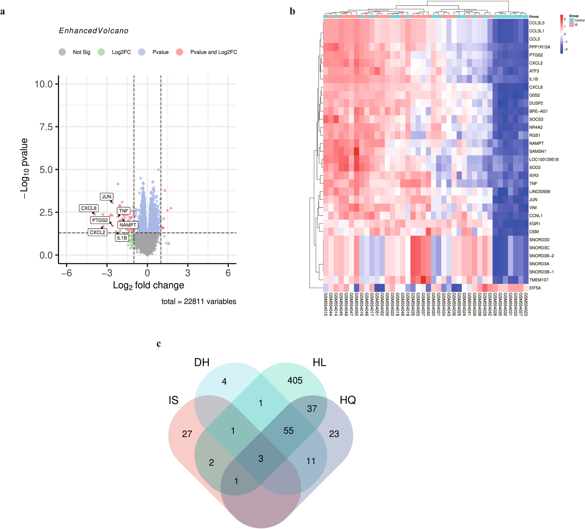
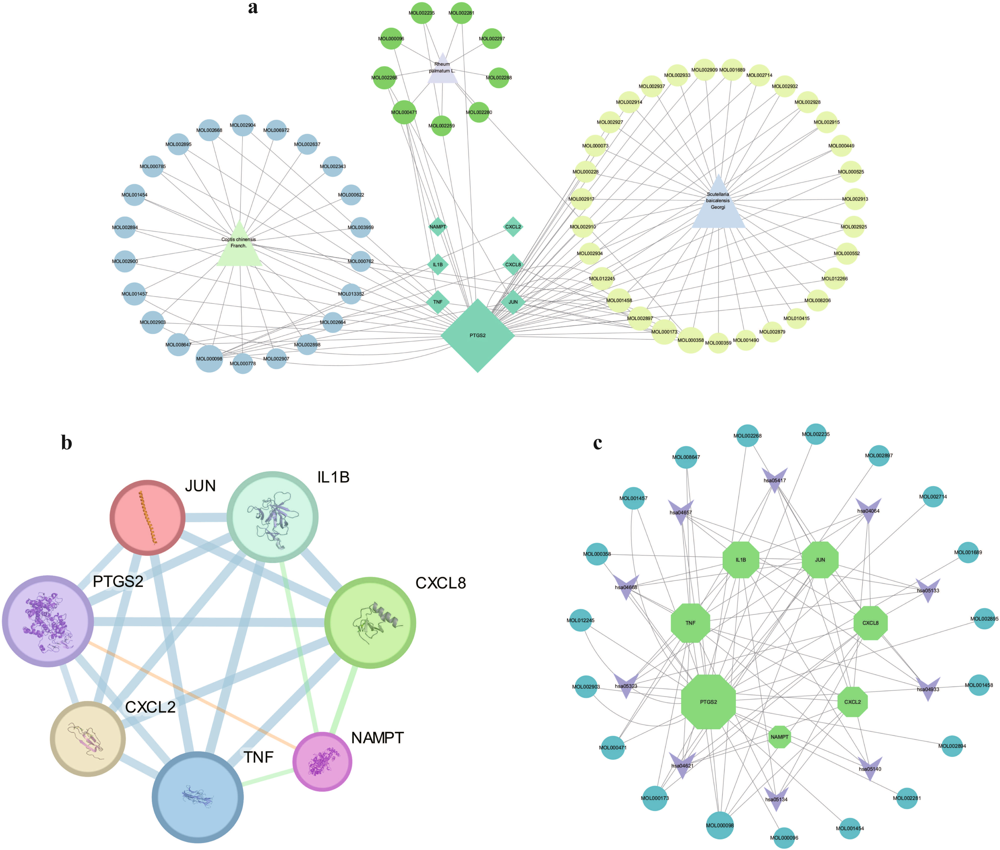
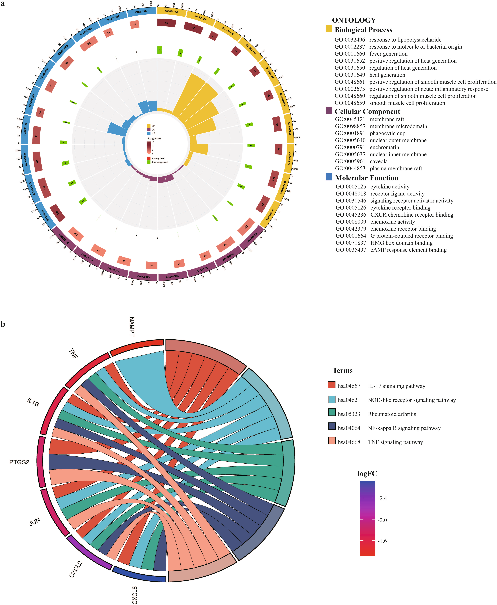
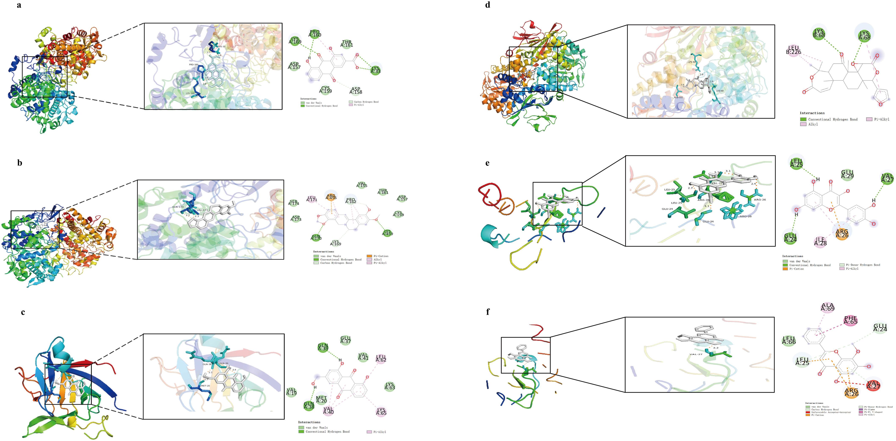
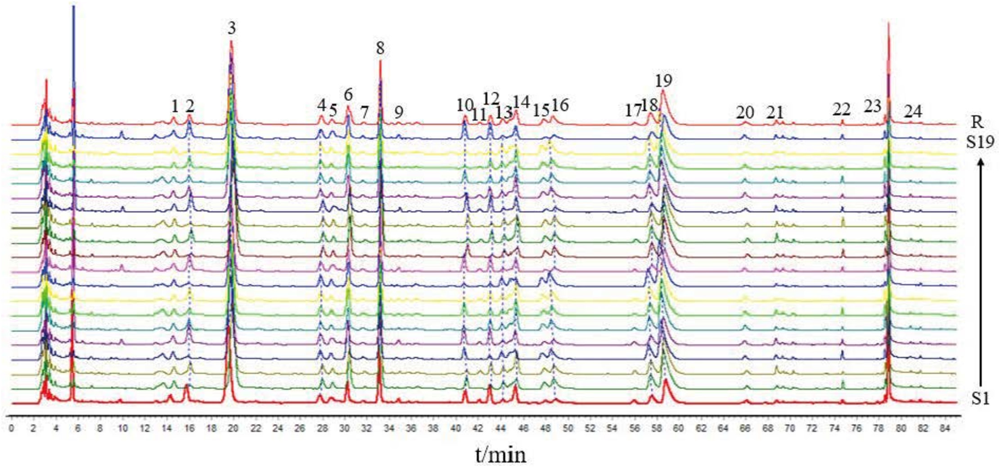
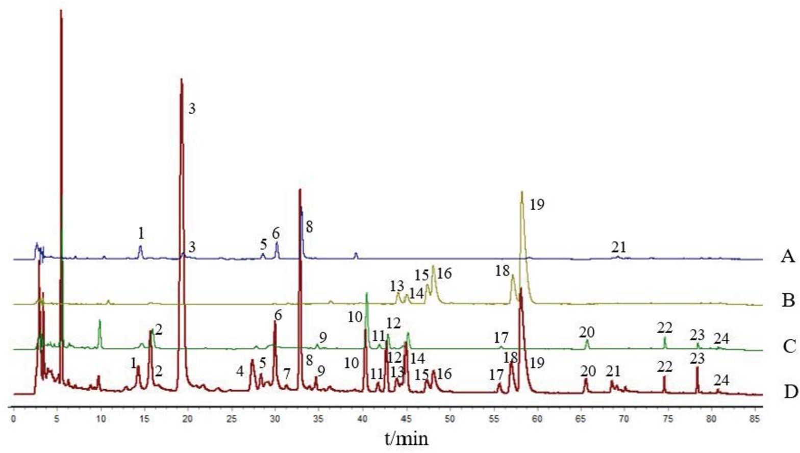
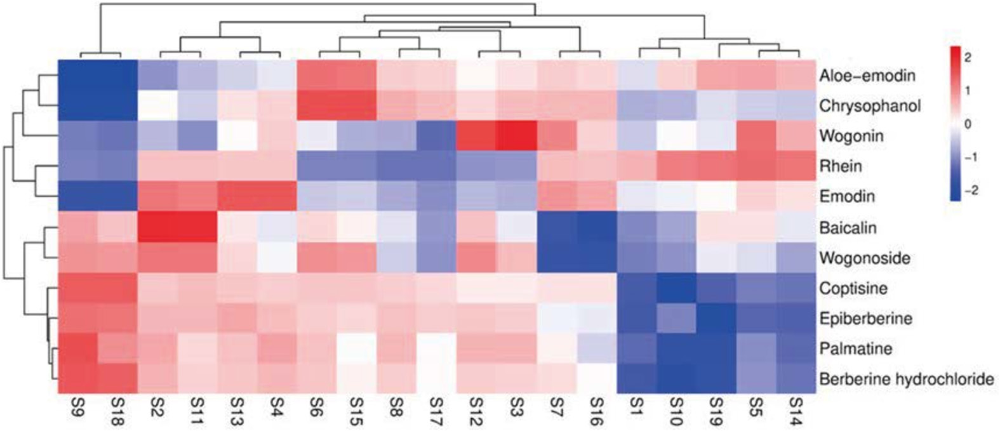
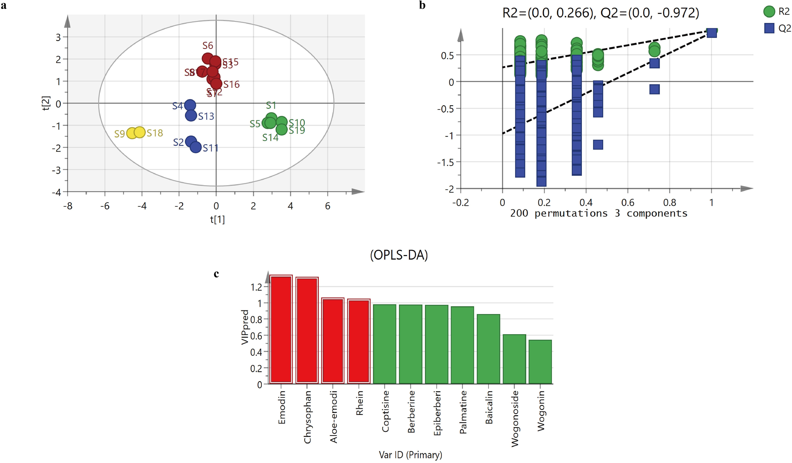
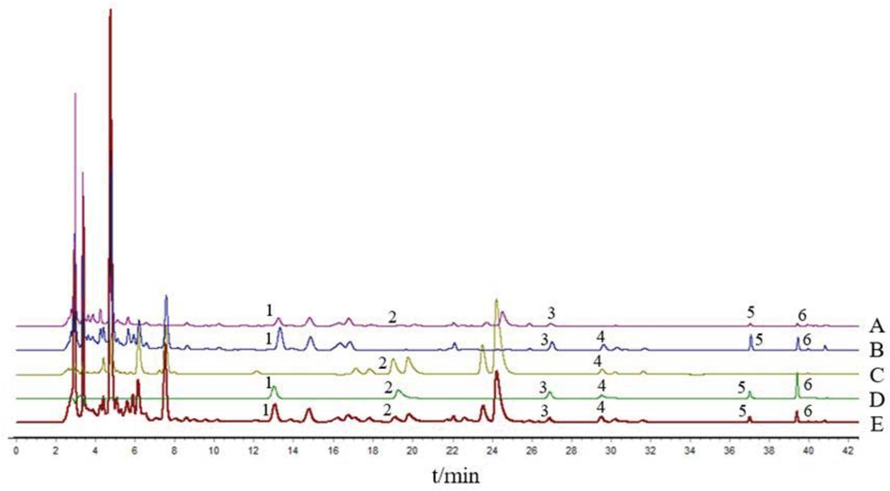

<!--
Fu et al., Biomedical Chromatography 2026; 40:e70477 の全訳密度日本語版。
漢方方剤QCの実験論文。practitioner レベル。表1（バッチ産地）・表2（ドッキング）・表4（直線性）・表5（含量）を保持。
表3（19×19類似度マトリクス）は全数値が膨大なため代表値と要約で示す。図（Fig.1–9）は原文参照。
-->

## 書誌情報

- 標題（原題）: Fingerprint Analysis and Quality Marker Identification of Sanhuang Xiexin Decoction Based on Integrated Phytochemical and Chemometric Approaches
- 著者: Jingju Fu, Xinyi Li, Yukun Wang, Xue Dong（責任著者）
- 所属: 山東省中医薬研究院（中国・済南）
- 掲載誌・巻号・DOI: Biomedical Chromatography, 2026; 40:e70477. DOI: 10.1002/bmc.70477
- インパクトファクター: 1.9（Biomedical Chromatography, JCR 2024 / Clarivate。Q3）
- 受理経過: 2026年3月12日受領／4月10日改訂／4月21日受理。© 2026 John Wiley & Sons Ltd
- 資金: 山東省自然科学基金／山東省中医薬科技プロジェクト
- データ公開: 責任著者へ合理的な要請で提供

> 補足: 三黄瀉心湯（さんおうしゃしんとう、Sanhuang Xiexin Decoction, SHXXD）は『金匱要略』に記載される古典的な漢方方剤で、**大黄（Rheum palmatum）・黄連（Coptis chinensis）・黄芩（Scutellaria baicalensis）**の3味から成る。日本でもツムラなどが医療用漢方製剤として製造する。本論文は、この多成分方剤の「バッチ間の化学的一貫性」をHPLC指紋分析＋ケモメトリクスで評価し、品質マーカー（Q-marker）を科学的に絞り込む方法を確立したもの。なお本文にツムラ（Tsumura And Co.）からのダウンロード記録があり、漢方メーカーの品質管理での直接的関心を示す。

## 要旨（Abstract）

三黄瀉心湯（SHXXD）は長い臨床応用の歴史を持つ古典的な伝統中医薬（TCM）処方である。しかし、SHXXDの系統的な植物化学的特性評価と信頼できる品質評価戦略は依然として不十分である。本研究は、SHXXDの指紋ベースの品質評価アプローチを確立し、植物化学分析とケモメトリクス法の統合を通じて代表的な品質マーカー（Q-marker）を同定することを目的とした。

高速液体クロマトグラフィー（HPLC）指紋分析をケモメトリクス解析と組み合わせ、異なるバッチ間のSHXXDの化学的一貫性を評価した。潜在的Q-markerを、クロマト挙動・特異性・相対存在量に基づいてスクリーニングした。再現性のあるHPLC指紋が得られ、バッチ間で高い類似度が明らかになった。6つの代表成分が潜在的Q-markerとして同定され、良好なクロマト分離と安定した定量プロファイルを示した。ケモメトリクス解析は、全体的な化学的特徴に寄与する特徴ピークを効果的に区別した。確立したHPLC指紋とQ-markerスクリーニングの組み合わせは、SHXXDの品質管理と標準化に実用的で信頼できる分析戦略を提供する。

**キーワード**: ケモメトリクス解析、クロマトグラフィー指紋、Q-marker、品質管理、三黄瀉心湯

## 1. 序論（Introduction）

三黄瀉心湯（SHXXD）は『金匱要略』に記載される古典的伝統中医薬（TCM）処方で、大黄（Rheum palmatum L.、タデ科）・黄連（Coptis chinensis Franch.、キンポウゲ科）・黄芩（Scutellaria baicalensis Georgi、シソ科）から成る。長い臨床応用の歴史により、SHXXDはますます研究関心を集めている。しかし、この多生薬方剤の複雑な化学組成は、系統的植物化学特性評価と堅牢な品質管理に大きな課題を提起する。

バッチ間の化学的一貫性は、複雑な生薬製剤の再現可能な品質と安全性の確保に不可欠である。HPLC指紋分析とケモメトリクス解析の組み合わせは、伝統生薬の全体的化学プロファイルの特性化と本質的品質特性の評価に広く用いられてきた。最近の研究は、SHXXDや関連する瀉心系製剤にクロマト指紋分析と高分解能質量分析を適用している。例えば、UPLC-MSがSHXXDの化学成分の特性化と品質評価の支援に広く使われ、高分解能HPLC-ESI-QTOF-MS/MS解析がSHXXD中の多数の化合物の迅速同定に用いられてきた。加えて、UPLCベースの分析戦略がSHXXDの主要生物活性成分と薬理活性の調査に、血漿薬物化学・薬物動態・薬理を組み合わせた統合戦略が関連瀉心湯の潜在的Q-marker探索に提案されてきた。しかし、これらアプローチの系統的で包括的な要約はまだ欠けており、SHXXDのより統合的で標準化された品質管理戦略の確立が残されている。

単一成分定量と比べ、指紋分析は全体論的化学情報を強調し、複方生薬処方の品質評価の中核手法となった。Q-markerの概念は、測定可能で・特異的で・所与の製剤の本質的特徴を代表する成分を強調する、TCM品質管理の体系的枠組みとして提案されてきた。Q-markerの合理的スクリーニングには、信頼できる分析検出と、複雑な化学系から代表成分を優先する科学的に正当化された戦略が必要である。この文脈で、クロマト指紋と多変量統計解析の統合は、全体的化学プロファイルに大きく寄与する特徴ピークの同定に強力なツールを提供する。

システム生物学とネットワークベース解析アプローチも、特徴成分の合理的選択を助ける補助ツールとしてますます適用されている。公開データベース・分子相互作用ネットワーク・バイオインフォマティクス解析を統合することで、これらアプローチは多成分製剤内の候補成分の関連性と代表性に関する貴重な情報を提供する。植物化学分析と併用すると、実験的化学的証拠を置き換えることなくQ-markerスクリーニングの客観性を高めうる。

本研究では、HPLC指紋とケモメトリクス解析を組み合わせた統合分析戦略を確立し、異なるバッチ間のSHXXDの化学プロファイルを包括的に特性化した。類似度評価と直交部分最小二乗判別分析（OPLS-DA）で共通・判別クロマトピークを同定。候補Q-markerをクロマト挙動・測定可能性・一貫性に基づいてさらに優先した。公開データベースと分子ドッキング解析を、主要証拠としてではなく代表成分の合理的選択を促進するために用いた。

## 2. 材料と方法（Materials and Methods）

### 2.1 装置と試薬

HPLC分析は Thermo U3000 システムで実施。試料調製に超音波洗浄機（JAC-300）・電子分析天秤（AE 240, Mettler Toledo）・恒温加熱マントル（HDM-250B）・ロータリーエバポレーター（RE-2000E）・真空凍結乾燥機（Alpha1-4 LSCplus, CHRIST）を使用。

標準品（レイン、アロエエモジン、ウォゴニン、エピベルベリン、コプチシン、パルマチン、塩酸ベルベリン、エモジン、純度≥98%）は上海源葉生物から購入。アセトニトリル・メタノール（HPLCグレード, Fisher）、酢酸・アンモニア溶液（HPLCグレード, 天津大茂）を溶媒に使用。精製水は Watsons Water。

### 2.2 生薬材料とSHXXDの調製

本研究では19の分析試料を使用。S1–S10は異なる原料生薬から調製した独立バッチ、S11–S19はそれぞれS2–S10に対応する反復調製品で、分析法の再現性・安定性評価のために含めた。したがって計19試料は10独立バッチ＋9反復調製を反映し、原料の19独立バッチではない。全材料はHuibin Lin博士（山東省中医薬研究院）が鑑定し、証拠標本（SHXXD-001〜019）を同院標本室に保管。方剤は大黄の乾燥根・根茎、黄連の乾燥根茎、黄芩の乾燥根から成る。

**Table 1. 19バッチのSHXXD生薬材料の産地情報（抜粋）**

| No. | 大黄 産地 | 黄連 産地 | 黄芩 産地 |
|---|---|---|---|
| S1 | 青海 | 四川 | 山西 |
| S2 | 甘粛 | 四川 | 山東 |
| S3 | 山東 | 山東 | 山東 |
| S4 | 甘粛 | 四川 | 内モンゴル |
| S5 | 四川 | 安徽 | 山西 |
| S6 | 四川 | 四川 | 陝西 |
| S7 | 甘粛 | 四川 | 山東 |
| S8 | 重慶 | 河北 | 陝西 |
| S9 | 四川 | 四川 | 山西 |
| S10 | 四川 | 四川 | 山東 |

（S11〜S19はS2〜S10と同一原料の反復調製）

### 2.3 データベースとソフトウェア

TCMSP、SwissTargetPrediction、UniProt、STRING、PubChem、PDB、DrugBank、GeneCards、CTD、TTD、NCBI、MicroBioinformaticsプラットフォームを使用。ネットワーク可視化・トポロジー解析にCytoscape（v3.10.1）を使用。

### 2.4 倫理声明

本研究はGEOデータベース（GSE22255）の公開・完全匿名化データの二次解析を含む。倫理承認は不要で、山東省中医薬研究院倫理委員会が免除と判断。

### 2.5 Q-marker優先化のための補助的ネットワーク解析

代表的Q-markerのスクリーニングを助けるためネットワーク薬理解析を実施。大黄・黄連・黄芩の化学成分をTCMSPから取得し、経口バイオアベイラビリティ（OB≥30%）と薬物様性（DL≥0.18）でフィルタ。これら成分の既知標的をTCMSPから直接取得。TCMSPに標的情報がない成分は、SMILES文字列をPubChemから取得しSwiss Target Predictionに投入して潜在標的を予測。全予測・既知標的を統合・重複除去して最終候補標的セットを形成。

GSE22255データセット（Affymetrix Human Genome U133Aプラットフォーム、健常対照20＋虚血性脳卒中20試料）をGEOから取得。プローブレベルデータを遺伝子にアノテートし、Rパッケージ limma で群間差次発現解析。差次発現遺伝子（DEG）を |log2FC|≥1.5・p<0.05 で同定。虚血性脳卒中（IS）関連標的を複数の公開DB（DrugBank・GeneCards・CTD・TTD・NCBI）から「ischemic stroke」で検索。DEGとIS関連標的の交差をMicroBioinformaticsで同定しVenn図で可視化。化合物-標的ネットワークをCytoscapeで構築し、次数中心性などのトポロジーパラメータを算出してコア標的・鍵化合物を認識。なお上記in silico解析はQ-marker選択の予備的証拠を提供するのみで、後続の実験的植物化学的検証（HPLC定量）を置き換えられない。

### 2.6 機能アノテーション

代表成分の推定標的をWeishengxinプラットフォームでGO・KEGG濃縮解析（有意水準 p<0.05）。結果は主要証拠ではなく成分優先化の支援を意図。

### 2.7 分子ドッキング

選択代表成分とアノテート標的の結合親和性を調べるため分子ドッキングを実施。タンパク質構造をPDBから取得。水分子除去・極性水素付加の標準的受容体・リガンド準備後、AutoDockでドッキングシミュレーション。

### 2.8 標準溶液の調製

標準品（レイン、エピベルベリン、コプチシン、パルマチン、塩酸ベルベリン、アロエエモジン、ウォゴニン、エモジン、ヤトロリジン、バイカリン、ウォゴノシド、クリソファノール、フィスシオン）を正確に秤量しメタノールに溶解。定量分析用に、レイン（16.40 μg/mL）・エピベルベリン（20.60）・アロエエモジン（8.16）・ウォゴニン（8.68）・エモジン（5.16）・クリソファノール（11.48 μg/mL）を含む混合標準溶液を調製。

### 2.9 試料溶液の調製

SHXXDを処方比（大黄50 g・黄連25 g・黄芩25 g）に従って調製。粗生薬を洗浄・粉砕し、8倍量の蒸留水に30分浸漬、還流で2時間抽出。濾過後、残渣を6倍量水で再度2時間還流抽出。2つの濾液を合わせ70℃・0.08–0.09 MPaで減圧濃縮。

濃縮抽出物を−80℃で8時間予備凍結。真空凍結乾燥機で凍結乾燥（一次乾燥: 系圧0.08 mbar、棚温を−35℃から−25℃へ1–2℃/hで上昇、コンデンサ−50℃、約24時間；二次乾燥（脱着相）: ≤0.03 mbar、棚温25℃、コンデンサ−50℃、6時間）。最終凍結乾燥粉末の水分含量≤3.0%。得た凍結乾燥物を≤25℃で粉砕、80メッシュ篩過、混合してSHXXD凍結乾燥粉末を得た。

凍結乾燥SHXXD粉末約0.2 gを正確に秤量し、25 mLメタノールで30分超音波抽出。室温冷却後メタノールで重量損失を補償し濾過。個別生薬抽出物と陰性対照（一度に1生薬を除いて調製）も同手順で処理。

### 2.10 SHXXDのHPLC指紋分析

Hypersil ODS2カラム（250×4.6 mm, 5 μm）で分離。移動相はアセトニトリル（A）と0.5%酢酸・0.2%アンモニア含有水（B）。勾配溶出: 0–20分 15%A；20–30分 15→22%A；30–60分 22→30%A；60–80分 30→80%A；80–90分 80%A。流速1.0 mL/min、カラム温度25℃、検出波長260 nm。

指紋確立・類似度評価にTCM色譜指紋類似度評価システム（Ver. 2012.130723）を使用。参照指紋を構築しSHXXD試料の共通特徴プロファイルを特性化、確立アルゴリズムで試料間類似度を定量評価。

続いて選択共通ピークに多変量統計解析を適用。階層クラスタリングで試料間の組成差を可視化（ピーク選択基準: 信号存在量・再現性・安定性・試料判別への寄与）。OPLS-DAで異なるバッチのSHXXDの相対ピーク面積（RPA）を解析。OPLS-DAは、クラス判別に関連する予測変動を応答変数に無関係な直交変動から効果的に分離しモデル解釈性を高めるため、従来のPLS回帰の代わりに選択。過学習リスクを最小化するため、モデル適合度（R²X, R²Y）と予測能（Q²）を評価し、200回並べ替え検定でモデル頑健性を示唆。

### 2.11 Q-marker定量のHPLC条件

6つのQ-markerの定量はHypersil ODS2カラム（250×4.6 mm, 5 μm）で実施。移動相 A（アセトニトリル）・B（0.5%酢酸・0.2%アンモニア含有水）、勾配: 0–12分 23.5%A；12–18分 23.5→32%A；18–30分 32→40%A；30–40分 40→90%A。流速1.0 mL/min、カラム温度28℃、検出波長260 nm、注入量10 μL。ピーク同定は標準品との保持時間・UVスペクトル比較で支持、定量は外部標準検量線で実施。

## 3. 結果（Results）

### 3.1 成分優先化のための補助的ネットワーク解析

**3.1.1 差次遺伝子発現解析**: limmaで群間差次発現解析。DEGを p<0.05・|log2FC|≥1.5 で同定し、火山図（Fig.1a）・ヒートマップ（Fig.1b）で可視化。計34の下方制御遺伝子を同定。これらは後続の成分優先化の参照情報としてのみ使用。

**3.1.2 成分-標的関連ネットワークの構築**: 潜在的成分-標的関連をVenn図（Fig.1c）で可視化。CytoscapeでネットワークをFig.2aに構築。

**3.1.3 タンパク質-タンパク質相互作用（PPI）ネットワーク**: 大黄・黄連・黄芩の候補成分に対応する計543の潜在標的を34の参照遺伝子にマッピングし、7つの高連結標的（PTGS2, JUN, TNF, IL1B, CXCL8, CXCL2, NAMPT）を得た。STRINGで生成したPPIネットワークは7ノード・19エッジ、平均ノード次数5.4（Fig.2b）。

**3.1.4 機能アノテーションとパスウェイ濃縮**: GO濃縮解析で845項目（生物学的過程815・細胞成分8・分子機能22）、KEGGで64パスウェイ（Fig.3）。候補成分の生物学的関連性の補助情報として使用し、品質評価の主要証拠とはみなさない。

**3.1.5 成分-標的-パスウェイ関連の概観**: 統合「代表成分-標的-上位パスウェイ」ネットワーク（Fig.2c）を構築。レイン・アロエエモジン・エモジン・クリソファノール・ウォゴニン・エピベルベリンがネットワーク内で高連結性を示し、さらなる植物化学評価の代表成分として優先。

**3.1.6 分子ドッキング**: 選択代表成分とアノテート標的の相互作用ポテンシャルを評価。ドッキングスコア <−5.0 kcal/mol が良好な結合親和性を示す（Table 2）。これらは候補優先化を支持するが実験的クロマト証拠を置き換えない。

**Table 2. SHXXD活性成分と主要標的タンパク質の分子ドッキング結果（抜粋）**

| 標的（PDB ID） | 化合物 | 結合エネルギー（kcal/mol） |
|---|---|---|
| PTGS2 (5F19) | レイン | −5.53 |
| | エピベルベリン | −5.02 |
| | コプチシン | −4.98 |
| | アロエエモジン | −4.95 |
| | バイカレイン | −4.92 |
| | ウォゴニン | −4.87 |
| IL1B (8RYS) | アロエエモジン | −5.58 |
| | ケルセチン | −4.5 |
| CXCL8 (4XDX) | ウォゴニン | −7.52 |
| | ケルセチン | −6.82 |
| NAMPT (2E5D) | オバクノン | −6.62 |

### 3.2 HPLC指紋法のバリデーション

- **精度**: 参照試料（S5）6連続注入。ピーク10（レイン）を参照ピークとし、相対保持時間（RRT）・相対ピーク面積（RPA）のRSDを算出。RPAのRSD<3%、RRTのRSD<2%で良好な装置精度。
- **安定性**: 試料溶液を0, 2, 4, 8, 12, 24時間で分析。RPAのRSD<3%、RRTのRSD<0.5%で24時間安定。
- **再現性**: S5の独立調製6試料を分析。RPAのRSD<3%、RRTのRSD<0.5%で満足な再現性。

### 3.3 SHXXDのHPLC指紋分析

**3.3.1 指紋確立と類似度評価**: 19バッチのSHXXD参照試料のHPLC指紋データをTCM色譜指紋類似度評価システムに取り込み。S1を参照指紋とし、時間窓幅0.5分・メジアン正規化で多点校正・全ピーク自動マッチングして試料指紋と参照指紋（R）を生成（Fig.5）。

計24の特徴クロマトピークを標識し、うち13を標準品比較で同定: ピーク3（バイカリン）・8（ウォゴノシド）・10（レイン）・14（ヤトロリジン）・15（エピベルベリン）・16（コプチシン）・18（パルマチン）・19（塩酸ベルベリン）・20（アロエエモジン）・21（ウォゴニン）・22（エモジン）・23（クリソファノール）・24（フィスシオン）。

参照指紋（R）との類似度は19バッチでそれぞれ 0.927, 0.975, 0.975, 0.971, 0.967, 0.975, 0.971, 0.981, 0.973, 0.952, 0.967, 0.972, 0.962, 0.959, 0.980, 0.975, 0.980, 0.964, 0.955、**平均0.967・RSD1.3%**（Table 3）。19バッチの指紋類似度は高く、異なる産地・バッチ間で主要成分プロファイルの変動が小さく、一貫した信頼できる調製工程を示唆。

**3.3.2 共通指紋ピークの帰属**: 試料溶液と大黄・黄連・黄芩の個別生薬溶液を分析し、24共通ピークを各生薬起源に帰属（Fig.6）。**黄芩由来**: ピーク1・3（バイカリン）・5・6・8（ウォゴノシド）・21（ウォゴニン）。**黄連由来**: ピーク13・14（ヤトロリジン）・15（エピベルベリン）・16（コプチシン）・18（パルマチン）・19（塩酸ベルベリン）。**大黄由来**: ピーク2・9・10（レイン）・11・12・17・20（アロエエモジン）・22（エモジン）・23（クリソファノール）・24（フィスシオン）。ピーク14は黄連と大黄の共有成分。

**3.3.3 クラスターヒートマップ解析**: 24共通ピークのうち11を階層クラスタリングとOPLS-DA構築に選択（選択基準: ①高いピーク存在量、②良好なバッチ間再現性〔19バッチでピーク面積・保持時間のRSD<5%〕、③良好な信号安定性、④多変量解析での試料群判別への高い寄与）。11ピークの面積データで階層クラスタリングし、バッチを4群に分割: 群I（S9, S18）；群II（S2, S4, S11, S13）；群III（S3, S6, S7, S8, S12, S15, S16, S17）；群IV（S1, S5, S10, S14, S19）。バッチ間でレイン・エモジン・ウォゴニンなどの含量に有意な変動。S6・S15・S17はアロエエモジン・レイン・バイカリンが比較的高く、S12はウォゴニンが有意に高い。S9・S18はアロエエモジン・クリソファノール・バイカリンが総じて低い。S1・S16はコプチシン・エピベルベリン・パルマチン・塩酸ベルベリンが比較的低い。

**3.3.4 指紋データに基づくOPLS-DA**: 校正済み11共通ピークのRPAを変数にSIMCA 14.1でOPLS-DA。**R²X=0.989、R²Y=0.944、Q²=0.899**（>0.5が許容）で満足なモデル適合・予測性能。200回並べ替え検定（Fig.8b）で並べ替えモデルのQ²が負となり過学習でないことを支持。異なるバッチはおよそ4群にクラスター（Fig.8a）。バッチ差に寄与する鍵成分を同定するためVIP値を解析（Fig.8c）、**VIP>1の4ピーク（ピーク10・20・22・23）** を同定——対応化合物（レイン・アロエエモジン・エモジン・クリソファノール、いずれも大黄由来）がSHXXDバッチを区別する主要マーカー成分となりうる。

### 3.4 Q-markerの同定と定量評価

**3.4.1 Q-markerの選択**: 化学指紋・ケモメトリクス・補助バイオインフォマティクス（ネットワーク薬理・分子ドッキング）と定量含量測定を組み合わせた段階的統合戦略でスクリーニング。ネットワーク薬理の根拠は伝統的効能と現代病態機序の統合にある: 虚血性脳卒中（IS）は酸化ストレス・炎症カスケード（IL-6・TNF-α上昇）・アポトーシス・血液脳関門破綻を伴い、SHXXDの伝統的機能「清熱解毒」「活血」に対応する。黄芩のバイカリン・ウォゴニンはISモデルで強い抗酸化・抗炎症、黄連のベルベリンはNF-κBなど炎症経路阻害で虚血傷害を保護、大黄のアントラキノン（レイン含む）は酸化ストレス・アポトーシス・フェロトーシスを調節。

この統合アプローチで、まずバイオインフォマティクスにより4候補（レイン・エピベルベリン・アロエエモジン・ウォゴニン、ドッキング結合エネルギー<−5 kcal/mol、含量測定で支持）を同定。次にクロマト指紋のOPLS-DAがVIP>1の4ピークを同定（バッチ判別に重要）。2化合物（レイン・アロエエモジン）が両戦略で重複。ドッキングで予測された一部（ケルセチン・オバクノン）はHPLC指紋で検出されず（生薬・凍結乾燥粉末中の低存在量による）最終候補から除外。6候補Q-marker（レイン・エピベルベリン・アロエエモジン・ウォゴニン・エモジン・クリソファノール）の同一性をHPLC-DADで標準品比較して支持。**5つのQ-marker原則（妥当性・特異性・測定可能性・伝達可能性・効能相関）に沿い、6成分をQ-marker候補として提案**。

**3.4.2 システム適合性**: 最適条件下で6標的成分が優れた分離と明確な保持時間を示した（Fig.9）。

**3.4.3 直線性**: 混合標準を1, 2, 3, 5, 7, 10, 15 μLで注入。ピーク面積を注入質量（ng）に対しプロット（Table 4）。

**Table 4. 6成分の直線関係**

| 成分 | 回帰式 | r | 直線範囲（ng） |
|---|---|---|---|
| レイン | y = 0.0790x − 0.0382 | 1.0000 | 16.40–246.00 |
| エピベルベリン | y = 0.0524x + 0.0205 | 0.9999 | 20.60–309.00 |
| アロエエモジン | y = 0.0746x − 0.0243 | 0.9999 | 8.16–122.40 |
| ウォゴニン | y = 0.0572x − 0.0986 | 0.9997 | 8.68–130.20 |
| エモジン | y = 0.0635x − 0.0079 | 0.9999 | 5.16–77.40 |
| クリソファノール | y = 0.0856x − 0.6042 | 0.9996 | 11.48–172.20 |

**3.4.4 精度・安定性・再現性**: S5の6連続注入で全6成分のピーク面積RSD<2%（優れた装置精度）。0–24時間で全標的のRSD<2%（24時間安定）。独立調製6試料でピーク面積・含量ともRSD<2%（高い再現性）。

**3.4.5 回収率**: 標準品既知量をS5（各約0.1 g）に添加。全6成分の平均回収率94–102%、RSD<2%（正確性を検証）。

**3.4.6 19バッチの定量分析**: 標準化前処理・最適条件で19バッチを分析、6 Q-markerをピーク面積定量（Table 5）。

**Table 5. 19バッチのQ-marker定量結果（mg/g、抜粋）**

| 試料 | レイン | エピベルベリン | アロエエモジン | ウォゴニン | エモジン | クリソファノール |
|---|---|---|---|---|---|---|
| S1 | 1.703 | 1.231 | 0.434 | 0.577 | 0.280 | 0.554 |
| S5 | 2.527 | 1.285 | 0.512 | 1.001 | 0.386 | 0.595 |
| S9 | 0.449 | 3.397 | 0.151 | 0.508 | 0.068 | 0.382 |
| S12 | 0.439 | 2.288 | 0.470 | 1.236 | 0.199 | 0.732 |
| S18 | 0.461 | 3.400 | 0.156 | 0.504 | 0.082 | 0.384 |
| **平均** | **1.281** | **2.176** | **0.488** | **0.758** | **0.358** | **0.706** |

（レインは0.40〜2.53、エピベルベリンは0.97〜3.40 mg/gと産地間で大きく変動）

## 4. 考察（Discussion）

本研究では、クロマト指紋とケモメトリクスに基づきSHXXDの化学プロファイルを特性化し潜在的Q-markerをスクリーニングする統合分析戦略を確立した。薬効検証ではなく、化学的一貫性・組成特性・再現可能な品質評価枠組みの確立を強調した——これらは複雑な植物製剤の植物化学分析の中心的関心事である。この統合分析系はTCM複方の日常品質管理に実用的価値があり、バッチ間一貫性評価・複雑生薬方剤の標準化・工業生産中の品質監視に技術的支援を提供する。

本研究ではSHXXD抽出物をメタノール抽出前に凍結乾燥した。煎じ液・濃縮液の直接分析と比べ、凍結乾燥は抽出物を安定な固体に変え、溶媒蒸発・成分分解・微生物汚染による変動を減らす。加えて凍結乾燥粉末は正確な秤量と長期保存を容易にし分析再現性を高める。メタノールは、黄連由来アルカロイドや黄芩由来フラボノイドなどSHXXDの主要小分子成分に効率的な溶解性を提供するため抽出溶媒に選択。多糖などの高分子・高極性成分はメタノール溶解性が低いが、現行クロマト条件で応答が弱く指紋への寄与が少ないため、メタノール抽出は主にクロマト検出に適した小〜中極性化合物を濃縮し、安定で代表的な指紋情報を得るのに役立つ。

HPLC指紋分析は複数バッチで安定・再現可能なプロファイルを示し、確立した調製条件下で満足なバッチ間化学的一貫性を示唆。類似度評価（類似度>0.95）は、指紋ベースアプローチでSHXXDの全体的化学組成を効果的に管理できることを示し、実生産のバッチ間一貫性評価に重要。指紋類似度解析は組成が大きく逸脱した異常バッチを迅速に同定でき、生産パラメータの適時調整で品質安定を確保できる。

さらにOPLS-DAはバッチ変動に最も寄与する特徴ピークの同定を可能にし、目視だけでは明らかでない微妙な組成差を明らかにする多変量統計法の価値を強調。SHXXDの化学プロファイルを決めるコア特徴ピークとQ-markerを明確化することで、この古典方剤の統一品質基準の策定基盤を築き、異なる製造業者間の品質基準不一致問題の解決とTCM複方の標準化開発を促進する。

植物化学的観点から、SHXXDで同定された特徴成分は主にアントラキノン（レイン・アロエエモジン・エモジン・クリソファノール）とイソキノリンアルカロイド（エピベルベリン等）。これらは方剤の主要生薬由来で構造的に特徴的・化学的に豊富な成分。明確なクロマト分離・安定な保持挙動・異なるバッチ間で一貫した検出性を示し、日常品質評価のマーカー化合物としての適性を支持。確立HPLC指紋法と定量Q-markerは製薬企業の日常品質検査プロセス（原料検査から最終製品試験まで）に容易に統合でき、生産中の主要成分のリアルタイム監視を可能にする。

システム生物学的アプローチ（ネットワーク解析・分子ドッキング）は化学的に代表的な成分の優先化を助ける補助ツールとして用い、決定的な薬理検証ではなく、主要化学成分と文献で頻繁に報告される生物経路を結ぶ文脈的証拠を提供。Q-marker概念に従い、適切なマーカーは特異性・測定可能性・処方への関連性を満たすべきで、これに基づきレイン・アロエエモジン・エモジン・クリソファノールを明確な植物起源・構造代表性・良好なクロマト性能から優先。これらは単一クロマトランで同時監視でき、方法の実用性・効率を高める。

## 5. 限界（Limitations）

(1) クロマト指紋は化学的一貫性の堅牢な情報を提供するが、煎じ過程で起きうる動的化学変換を完全には捉えない。(2) 選択Q-markerは強い分析適性を示すが、臨床効能との定量関係は扱っていない（植物化学分析の主要範囲外）。(3) 反応性・変換関連成分を代謝物レベルで系統的に特性化しておらず、方剤の複雑性のより包括的理解には関連しうる。

## 6. 結論（Conclusions）

本研究はHPLC指紋とケモメトリクスに基づきSHXXDの包括的植物化学評価戦略を確立した。SHXXDの化学的一貫性と特徴成分プロファイルを系統的に特性化し、分析安定性と構造代表性からレイン・アロエエモジン・エモジン・クリソファノールなど複数の代表化合物を潜在的Q-markerとして提案。クロマト指紋と多変量統計解析の統合により、伝統生薬方剤の品質評価の方法論的枠組みを提供。このアプローチはSHXXDと関連製剤の証拠ベースの標準化・近代化を促進し、複雑な植物製剤のより厳密な品質管理を支援しうる。

## 訳者補足

- **三黄瀉心湯（さんおうしゃしんとう）とは**: 大黄・黄連・黄芩の3味から成る古典漢方方剤で、日本でも医療用漢方製剤として広く使われる（清熱・瀉火・止血の作用）。名の「三黄」は3つの生薬名（大黄・黄連・黄芩）に「黄」が入ることに由来。本論文はこの方剤を「産地・バッチが違っても中身が一定か」をHPLC指紋で確かめ、品質の目印（Q-marker）を科学的に選んだ研究。

- **Q-marker（品質マーカー）の選び方**: 単に「量が多い成分」を選ぶのではなく、①妥当性②特異性③測定可能性④伝達可能性⑤効能相関の5原則を満たす成分を選ぶ。本研究は「化学指紋（何がどれだけあるか）＋OPLS-DA（バッチ差の主因は何か）＋ネットワーク薬理・ドッキング（効能に効きそうか）」を三重に組み合わせて、レイン・エピベルベリン・アロエエモジン・ウォゴニン・エモジン・クリソファノールの6つに絞り込んだ。

- **OPLS-DAが示したこと**: バッチ差の主因（VIP>1）は大黄由来の4アントラキノン（レイン・アロエエモジン・エモジン・クリソファノール）だった。つまり三黄瀉心湯の品質のばらつきは主に「大黄」の質・量に左右されやすい、と読める（実際、レイン含量は0.40〜2.53 mg/gと6倍以上ばらついた）。

- **ネットワーク薬理の使い方に注意**: 本論文は虚血性脳卒中（IS）のデータで解析したが、著者自身「ISはSHXXDの主要適応ではない」と断り、あくまでQ-marker選択の補助（成分と生物経路の関連づけ）として使い、HPLC定量という実験的証拠を主軸に置いている。この「in silicoは補助・化学が主」という姿勢は、ネットワーク薬理を濫用しないための良い作法。

- 図（Fig.1〜9）と19×19類似度マトリクス（Table 3全体）の詳細は原文参照。データは責任著者へ要請で入手可能。
