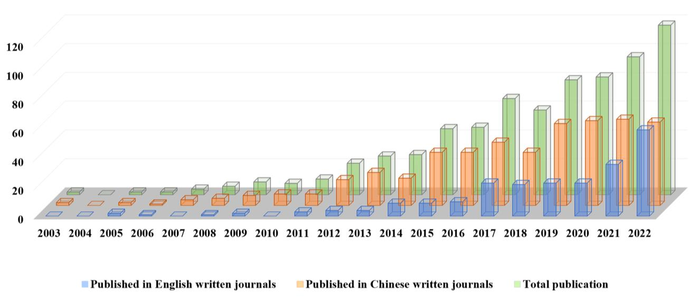

<!-- 方針: ほぼ全訳＋必要に応じた補足。原文構成に沿って訳出。「> 補足:」は訳者注。 -->

## 書誌情報

- 原題: Spectrum–Effect Relationships as an Effective Approach for Quality Control of Natural Products: A Review
- 著者: Peiyu He, Chunling Zhang（共同筆頭）, Yaosong Yang, Shuang Tang, Xixian Liu, Jin Yong, Teng Peng（責任著者）（成都中医薬大学 薬学院, 中国）
- 掲載: *Molecules* 2023, 28, 7011. https://doi.org/10.3390/molecules28207011（レビュー論文, オープンアクセス CC BY 4.0）
- インパクトファクター: **4.6**（*Molecules*, JCR 2024 / Clarivate。MDPI公式発表「2024 Journal Impact Factors Released」および複数の集計サイトで確認）
- 受理経過: 受領 2023-09-05 / 改訂 2023-10-05 / 採録 2023-10-06 / 公開 2023-10-10
- 資金: 四川省科学技術庁重点プロジェクト（2021YFN0015, 2022YFS0444）、四川省中医薬管理局プロジェクト（2023MS432）、成都市科学技術局技術革新研究開発プロジェクト（2021-YF05-02298-SN）

> 補足: 本論文は実験報告ではなく **「スペクトル・エフェクト関係（spectrum–effect relationships）」研究のレビュー**。原語のニュアンスとしては「フィンガープリント（指紋）－薬効の相関関係」に近く、以下 **SER** と略記する。TCM = Traditional Chinese Medicine（中医学・漢方薬・生薬）。QAMS = Quantitative Analysis of Multi-components by Single Marker（単一マーカーによる多成分定量）。本文中の化学計量学手法の略号: GRA(グレー関連分析)・BCA(二変量相関分析)・HCA(階層的クラスター分析)・ANN(人工ニューラルネットワーク)・MLR(重回帰分析)・PLSR(部分最小二乗回帰)・CCA(正準相関分析)・PCA(主成分分析)・OPLS(-DA)(直交部分最小二乗判別分析)。

## 要旨（Abstract）

天然物として生物活性をもつTCM（中医学・漢方薬・生薬）の品質は、その臨床応用の鍵である。TCM中の化学成分の種類・含量に基づくフィンガープリント（指紋）は国際的に認知された品質評価法だが、化学成分と薬効の相関を無視している。化学計量学的手法を通じて、TCMの化学成分を代表するフィンガープリントとその薬理活性の結果を相関させることで、TCMの**スペクトル・エフェクト関係（SER）**が得られ、これにより薬効成分に関する情報を明らかにし、TCMにおける化学成分研究と薬効研究が分断されている限界を解決できる。SER提唱から20周年にあたり、本総説はフィンガープリントの確立、薬効評価法、化学計量学的手法、およびTCM領域における実用例を含め、その研究の進展をレビューする。さらに、近年のSER研究における新戦略も論じ、本技術の応用展望を考察する。

**キーワード**: spectrum–effect relationships; fingerprints; efficacy; chemometric methods; natural products; traditional Chinese medicine

## 1. 序論（Introduction）

アジアなど各地域で、TCMに代表される天然物由来の生物活性化合物は広範な生物活性をもつ。歴代の理論と実践に基づき、TCMは疾患の臨床治療で優れた治療効果を上げ、世界的に注目されている。TCM産業の近代化・国際化の進展に伴い、TCM品質管理モデルの研究は、外観の単純な観察から顕微鑑定、さらに薄層同定・内在成分の定量検出へと段階的に発展してきた[1]。しかし単味であれ複合製剤であれ、TCMの治療効果は多成分・多標的・多経路の協働作用の結果であり、1つまたは数個の化学成分の定性・定量検出だけでTCMの品質管理を実現するのは困難である。現在、TCMフィンガープリント技術は世界で広くTCMの品質と均一性・安定性を評価する有効な方法として用いられているが、TCMの薬効との相関は依然不明確である[2]。生物活性ガイド分離法やオンラインスクリーニング技術は生理活性化合物の探索に有効だが、作業量の多さと厳格な実験機器条件のためTCMでの高スループット応用が制限され、TCMの汎用的品質管理法としての採用が難しい[3–6]。

TCMの物質的基盤と薬効を結び付けた品質評価モデルを確立するため、2002年にLiらは、特徴的ピークフィンガープリント中の化学成分の変化と薬効を関連付けることでTCMの「スペクトル・エフェクト関係」を確立することを提案した[7]。SERの研究モデルは次の通り：差異のある試料をもとにその化学フィンガープリントを確立し、薬理モデルと適切な薬効指標を設定する。得られた化学情報と薬効データをデータ処理法によって最大限相関・解析し、TCMの品質管理を実現しうる薬効物質的基盤を明らかにする。この研究モデルにより、化合物のみに着目し薬効を無視してきた従来の品質評価モデルの欠点を補い、フィンガープリントと薬効研究を有機的に結合してフィンガープリントと薬効の一貫性を高め、SERに基づくTCMの品質評価という目的を達成できる。

TCMなど天然物の複雑なマトリックス中の活性成分の薬理学的情報はSERによって正確に反映できるため、過去20年間、SER研究はTCMの品質評価、製剤プロセスの最適化、服薬血清の探索に広く用いられてきた。博士・修士論文および PubMed、SciFinder、ScienceDirect、Scopus、Web of Science、Google Scholar、中国知網（CNKI）等のオンライン科学データベースを対象に過去20年間のSER関連論文を検索し、重複を除いた結果、**計716報**（英語誌230報、中国語誌486報）が抽出された。発表論文数は年々増加傾向にある（Figure 1）。

> 補足: 本文の集計期間は「2002〜2022年」だが、原文Figure 1のグラフ自体は2003年から描かれている（原文のまま）。

近年、研究の初期にはSER研究をレビューし研究対象やデータ処理法を解説した報告もあったが[8–10]、主に概念の説明に偏り、応用面での実践的な手引きに乏しかった。特に近年は機器の発達と研究体系の成熟に伴い、より高度な分析技術・薬理モデルを用いたSER研究が進み、単量体化合物・成分ノックアウトによる薬効検証、ネットワーク薬理学・分子ドッキングに基づく機構解明、化学計量学的手法に基づく薬効予測、QAMS（単一マーカーによる多成分定量）に基づく多成分品質評価など新戦略も適用されてきた。本レビューはSERモデル確立のプロセスに沿って、フィンガープリントの確立（試料選定、適切な分析技術の選択）、薬理モデルの確立（動物モデルの選択）、化学計量学に基づくデータ処理法の選択を詳述する。TCMの品質評価・製剤プロセス最適化・服薬血清探索におけるSER研究の最新応用を、具体的・実践的な視点からレビューする。さらに、SERに適用される最先端戦略をまとめ、SER研究の現在の課題と将来動向を論じる。同時に、本レビューはこの研究モデルの手引きを読者に提供し、TCM品質管理分野におけるSER研究のさらなる応用への参考を目指す。

## 2. スペクトル・エフェクト関係の確立プロセス（The Establishment Process of Spectrum–Effect Relationships）

TCMの化学組成は、植物種・採取時期・栽培地域・保管条件・加工法などの要因により大きく変動し、品質の均一性に影響しうる。TCMの化学組成情報に基づく包括的・定量的な識別法であるフィンガープリントは、天然薬物の品質管理に最も有効な国際的に認知された方法となっており、TCMの特性によく適合し品質管理・分析を実現できる。フィンガープリント確立後、対象とする活性成分群に基づく薬効評価をどう完了するかが、TCMのSER研究のもう一つの鍵となる。現在、特定疾患モデルの薬効研究には動物・臓器・細胞・分子など様々な薬理モデルがしばしば用いられる。次に適切な化学計量学的手法によって、TCMの化合物情報を代表するフィンガープリントと薬効指標を代表する薬効情報を組み合わせることで、SERの確立が完了する。したがって本節は主に、①差異のある試料、②フィンガープリントの確立、③薬効評価に基づく評価、④化学計量学的手法に基づく関連付け——の4点を扱う。

### 2.1 差異のある試料（Samples with Differences）

公表文献の解析から、単味生薬がSER研究対象の70%超を占め、最大の研究ホットスポットであることが分かった（Figure 2）。

現在のTCM SER研究では、試料は多くの場合異なるロット・栽培地域・製造者に由来し、同一起源の試料もその後の差異処理を容易にするために用いられる。起源の異なる試料では、組成・薬効の差異ゆえに、通常は同一の方法で各試料を個別に処理すれば十分である。例えばArtemisia frigida Willd.（茵陳蒿の一種）[11]やSaposhnikoviae Radix（防風）[12]の異なるロット・産地は同一手法で前処理される。試料前処理過程では、有効部位を選び有効成分を最大限保持することが最終目標である[13]。さらに、単一起源の試料では、前処理は主に意図的な成分差異の作出を目的とする。例えば抽出法・加工法の違いで差異のある試料を調製し、両者のスペクトル・エフェクト関係の差異を探すことで活性成分スクリーニングを完了する[14,15]。

TCMの処方・製剤のSERでは、処方から生薬（群）を段階的に除去し、残った生薬の薬効を検討することで除去した生薬の処方全体への寄与を得る手法があり、これにより処方・製剤中の単一生薬の相互作用や複数生薬の最良の組み合わせを探索できる。例えばLanらは処方分解解析によって梔子金花丸（Zhizi Jinhua丸）中の8種の生薬の定性・定量的寄与を明らかにした[16]。また異なるロットの処方・製剤のSER研究を通じて、主要活性成分も議論できる。同様の研究は半夏白朮天麻湯[17]、複方甘草片[18]、天夢口服液[19]でも行われている。

さらに、投与後の血清こそが真の薬効をもつ「製剤」である可能性がある。投与形態によらず、作用する成分は主に体内の血液循環に入るものであり、これらの成分は生薬の原型成分・代謝物質・生理活性物質を含む薬効の物質的基盤である可能性がある。TCMの血清薬化学（serum pharmacochemistry）研究は早くも2002年に報告されている[20]。服薬血清のSER研究では、多くの場合、投与後の異なる採血時点、異なる用量、または異なる製剤投与後同一時点での採血によって成分特性の異なる試料が得られる[21,22]。血清試料は通常単一の方法で前処理される。動物血清試料には血中成分検出を著しく妨げる各種内因性タンパク質が含まれるため、アセトニトリル・メタノールなどの有機溶媒を直接加えてタンパク質を沈殿させることが多い。さらに検出感度向上のため抽出による精製・濃縮もよく用いられる。個体差を減らすため、異なる個体の血清試料を混合することもある。

### 2.2 フィンガープリントの確立（Establishment of Fingerprints）

試料前処理完了後、TCM中の対象成分の分析法選択が特に重要となる。TCMフィンガープリント確立の主な分析法は、（超）高速液体クロマトグラフィー（HPLC/UHPLC）、ガスクロマトグラフィー（GC）、キャピラリー電気泳動（CE）、薄層クロマトグラフィー（TLC）、紫外分光（UV）、赤外分光（IR）等である。中でもクロマトグラフィーが主流であり、HPLCは最も標準的な分析法として認知されている。高い分離効率・選択性・検出感度・迅速な分析速度・広い適用範囲という特徴から、大半のTCM成分がHPLCで分析・検出でき、TCMフィンガープリント確立の第一選択法となっている。TCM成分の複雑性・多様性ゆえ、SER研究では適切な分析法の選択が特に重要である。

HPLCに異なる種類の検出器（UV／ダイオードアレイ検出器(DAD)／蒸発光散乱検出器(ELSD)）を接続することで異なる種類の化合物を検出でき[23,24]、複数種の検出器を直列接続すれば複数種の化合物を検出できる。そのため小・大分子化合物の検出に最も広く用いられている。GC-炎光化検出器(FID)は高い分離能・感度・選択性、少ない試料消費という利点をもち[25,26]、分解しにくい揮発性化合物の分離分析に適する。HPLCと比較し、CE-UVはHPLCで分析困難な大分子化合物も、より速く・少ない溶媒消費で分析できる[27,28]。TLCは入手・操作が容易で迅速・安価だが、データ取得が目視に依存し試料のSER構築には不向きなため応用例は多くない[29–31]。クロマト分析法と比べ、UV[32]スペクトルは主に不飽和結合・共役構造をもつ化合物の全体品質を反映し、IR[33]スペクトルは主に各成分の官能基情報を反映する。分光分析法を通じて、試料間の全体成分情報の差異は分かるが、個々の成分を正確に特徴づけられない欠点がある。以上を踏まえ、よく用いられる分析法（検出器を含む）の基本情報（利点・限界）をTable 1に簡潔にまとめる。

**Table 1. スペクトル・エフェクト関係研究における各種分析法の比較**

| 分析法 | 利点 | 限界 |
| --- | --- | --- |
| H/UHPLC-UV/DAD | 大半の化合物に適用可、操作が簡便、特異性が高く再現性良好、感度高く直線範囲広く低コスト | 分析時間が長く溶媒消費が多い。UV－可視吸収をもたない化合物は検出不可 |
| H/UHPLC-ELSD | 移動相より揮発性の低い多様な試料を検出できる汎用検出器 | 感度が低く、特にUV吸収をもつ化合物で顕著。移動相条件への要求が高い |
| H/UHPLC-MS | ハイスループット検出、未知化合物の構造解析、高い安定性・感度・再現性 | 機器が高価、イオン源が汚染されやすく操作が複雑 |
| GC-FID | 破壊型の汎用質量検出器で直線範囲が広く、分離効率が高く分析速度が速く、試料使用量が少なく検出感度が高い | 分析時間が長く、定性分析には既知化合物が必要 |
| GC-MS | 定性の信頼性が高く感度が高い。大半の揮発性化合物に適する | 機器が高価で、熱不安定な化合物の分析には不向き |
| CE-UV | 分析時間が短く溶媒消費・試料需要が少なく低コスト。発色・蛍光染色不要 | 芳香族分子または共役構造をもちUV吸収する化合物のみ検出可能 |
| UV | 非破壊分析、迅速、低コスト | 再現性が低く、スペクトル重複が著しく精度が低い |
| IR | 迅速、溶媒不要、試料前処理不要、低コスト | 定量精度が低く特異性が低い |
| TLC | 操作が簡便、機器要件が低く分析速度が速い | 定量が難しく、高分子化合物の分離が悪い |
| ICP-MS | 複数元素の同時検出に適し検出限界が低い | システムが高価、自動化が低く信号ドリフトが顕著 |
| 組み合わせ法（複数法併用） | 異なる機器分析法・検出条件で反映される化学組成情報がより包括的になる | ― |

分析機器の発達に伴い、より高いフラックス・感度・化合物構造アノテーション機能をもつ高分解能質量分析(MS)を上記技術、特にHPLC-MS[34,35]、GC-MS[36,37]、誘導結合プラズマ(ICP)-MS[38,39]と組み合わせることで、TCM内在成分のより包括的・正確な定性・定量分析が可能になる。さらに、二次元クロマトグラフィーはより高いピーク容量と強力な分離・分析能をもち、TCMの複雑な有効成分の分析・スクリーニングで際立った成果を上げている[40]。

分析機器の発展に加え、複雑な物質系の全体的化学特性を完全に特徴づけることを目指し、従来技術に基づく革新的概念も提案されている。TCMの組成は複雑なため、単一の検出器・単一の分析法で確立された単一の化学フィンガープリントではその化学組成特性を正確に表現しにくい。そこでTCMの「多次元フィンガープリント」概念が提案された[41]。異なる試料前処理法、異なる機器分析法・検出器を用いて複数のフィンガープリントを得ることで情報の相補性を実現し、より多くの完全な試料情報を得て、最終的にTCMの化学特性を効果的に代表できるフィンガープリントを得られる。また、HPLC-UVの利用では、単一検出波長で確立したフィンガープリントが試料の全体的化学組成情報を包括的・体系的に反映できない場合がある。この場合、**多波長融合フィンガープリント法**がこの限界を補い、より包括的な試料分析を実現できる[42]。一般に、異なる試料はできる限りマッチするフィンガープリントを見つけ、より詳細な化学成分の特徴づけを確保し試料の重要情報の欠落を避ける必要がある。適切な生薬試料分析技術を選択した後、原データの適切な前処理（ピーク比較・類似度解析・データ変換等）がさらなるデータ解析の前提となる[43,44]。SER確立の第一段階として、包括的・詳細なフィンガープリントは真の活性成分スクリーニングの確固たる基盤となる。

### 2.3 薬効評価に基づく評価（Evaluation Based on Pharmacodynamics）

TCMの生体への作用・機序は複雑で、多成分・多標的・多経路の相乗効果ゆえ、適切な薬効評価法を見出すことは容易ではない。適切な薬効評価法の確立は次のように要約できる：追試験のため、安定性・再現性が高く適切かつ迅速で認知された薬理モデルと薬効指標を選ぶこと。動物モデルや in vitro 臓器はしばしば薬物の直感的薬効の観察に用いられる。細胞培養・生化学実験は通常作用機序の研究に用いられる。ここでは、過去20年間のSER研究における異なる種類の薬理モデル・薬効指標の適用を要約する（Figure 3）。

現在の薬効研究は主に動物・臓器・細胞・分子等の薬理モデルに基づく。動物の全体レベルと比較し、他の3種の研究はTCMの体への全体的調節や、TCMの体内吸収・代謝・分布という複雑な過程を考慮していない。加えて、全体レベルの動物は「補腎壮陽」[24]、「活血化瘀」[45]、「健脾消腫」[46]のような伝統的薬効に応答する際により代表性が高い。そのため現在、多数のSER研究がラット・マウス・ゼブラフィッシュなどの全動物モデルを採用している。このモデルの利点は、身体の完全性と外界との正常な接触環境を確保できる点にある。同時に、このモデルはその後の臨床研究とも整合しやすい。Figure 3に示す通り、SER研究における薬理モデルの割合は**動物モデルが約38.41%**で、臓器モデルの1.96%、細胞モデルの27.22%、分子モデルの24.58%より高い（内訳: マウス動物モデル20.81%・ラット動物モデル16.90%・分子モデル24.58%・細胞モデル27.22%・臓器モデル1.96%・ウイルスモデル1.68%・ゼブラフィッシュ動物モデル0.70%・複数モデル併用4.19%・その他モデル1.96%）。しかしin vivoモデルの欠点は、コストが高く時間を要し、研究対象の疾患の病因機序が複雑な場合ヒト疾患プロトタイプの全特性を備えた動物モデルの確立が難しいことである。

臓器・細胞・分子レベルの in vitro 実験は、対象部位を複雑な in vivo 環境から分離できるため、TCMの薬効活性を直接反映できる。また薬効検出の低スループット問題を緩和できる。これらの in vitro 薬効法は、低コスト・短時間・良好な再現性・完璧な実験データを得やすいという理由から多くの場面で応用されている。例: 抗炎症活性測定の一酸化窒素(NO)阻害アッセイ[37]、抗菌活性判定のMTTアッセイ[47]、抗酸化活性評価のDPPH・ABTS・FRAPアッセイ[48]。これはSER研究における抗酸化効果の応用が**18.58%**（Figure 3参照。本文中の記載は18.28%とやや異なるが、原文のまま両方記す）と高い理由の一つと考えられる。とはいえ、これら単一モデルも身体の全体的役割を切り離しており、多くの病態モデルにはなお限界がある。血清薬理学の発展により、上記モデルに加え、in vivo/in vitro服薬血清の一連の実験もSER研究のホットトピックである。実験動物にTCMまたは処方を1回以上投与し、一定時間後に血液試料を採取する[49]。血清は化学分析に直接用いるか、単離してTCM・処方の粗抽出物の代わりにin vitro薬理実験に用いられる。これにより服薬血清は、生体内環境で薬物が薬理効果を生じる過程を客観的に模擬できる[8]。同時に、服薬血清の包括的分析に基づき薬効実験を行い真の活性成分を特定し、活性成分の動的代謝を探索できる。しかし服薬血清研究には多くの課題があり、試料前処理過程が比較的複雑で成分の損失や実験結果の偏差を生じやすい。また大量の血液を消費し小動物には不向きで、動物モデルへの影響評価が難しく大きな誤差を招く可能性がある[49]。

薬効指標はTCMの薬効を測る重要な基準である。現在、SER評価には1つまたは複数の薬効指標が用いられる。Figure 3(b)の通り、SER研究でよく用いられる薬効指標は**抗酸化(18.58%)・抗炎症(9.64%)・抗腫瘍(9.08%)・制菌(6.01%)**等である（原文は「抗腫瘍活性6.01%」ともとれる記載だが、Figure 3(b)の数値では制菌活性6.01%・抗腫瘍活性9.08%であり、本文の記載にはやや揺れがある。数値の対応は図3(b)を正とする）。さらに薬効の包括性を担保するため、一部の研究者は多指標薬効をSER研究に組み込むことを提案している[41,50]。なお、複数の薬効指標は相互補完・裏付けができる一方、時に相反する結果を導くことに留意すべきである。TCMの疾患治療過程の違いを踏まえると、疾患の標治・本治における各成分の現れ方は異なりうるため、疾患の病因を明確にし薬物の機序・標的を明らかにすることが正しく適切な薬効指標の選択に資する。一般に、TCMの主要な薬効を代表しうる標的化された指標を選ぶことが鍵である。

### 2.4 化学計量学的手法に基づく関連付け（Association Based on Chemometric Methods）

得られたTCMのフィンガープリントと薬効情報の相関を実現し、そこから求める情報を掘り起こすことは、SER研究のもう一つの重要な環である。現在、GRA(グレー関連分析)・BCA(二変量相関分析)・HCA(階層的クラスター分析)・ANN(人工ニューラルネットワーク)・MLR(重回帰分析)・PLSR(部分最小二乗回帰分析)・CCA(正準相関分析)・PCA(主成分分析)など、様々な化学計量学的手法がSER研究に応用されている。

異なる化学計量学的手法にはそれぞれ重点の方向性がある。適切なデータ解析法を選ぶことで、複雑なTCMマトリックス中の薬効機序をより効果的に正確に解析できる。同時に解析結果の正確性を確保するため、多くの研究者は2つ以上の化学計量学的手法を組み合わせて包括的解析効果を得ている。各データ解析法の特徴・利点・欠点をTable 2にまとめる。さらにこれらの手法は、①各成分と薬効の相関を予測する手法、②各成分の薬効への寄与を明らかにする手法、③データ構造を単純化して主要活性成分を見出す手法——の3カテゴリに大別できる[51]。

**Table 2. スペクトル・エフェクト関係に適用される化学計量学的手法の比較**

| 手法 | 特徴 | 利点 | 欠点 |
| --- | --- | --- | --- |
| GRA（グレー関連分析） | 変数間の発展傾向の形状の類似度・相違度を測ることで変数間の相関を測定 | 既知情報から未知情報を推定でき、必要データが少ない | 各ピークに対応する成分の全体的寄与を記述しにくい |
| BCA（二変量相関分析） | 試料の原データを用いて2変数間の相関度を解析 | 2変数間の関係の性質・密接さを研究できる（最も一般的なのはPearson相関係数で、相関度と正負の方向を反映） | 全体性を無視し、各ピークの薬効への相乗効果を説明できない |
| HCA（階層的クラスター分析） | 「類は友を呼ぶ」原理に基づき、類似度により試料・変数を分類する教師なし分析法 | 実際のモデリング前の予備解析として直感的・簡潔 | フィンガープリントピークと薬効指標間の相関の大きさ・方向を反映できない |
| ANN（人工ニューラルネットワーク） | 動物神経網の信号伝達様式を模した数理モデリングアルゴリズム | 既存フィンガープリント中の化学成分シグナルを変換・圧縮し複雑な情報を効果的抽出、対応する薬効指標との曖昧写像関数関係を確立できる | モデル訓練時間が長く収束が遅くメモリシステムが不安定。小サンプルデータで過学習の恐れ、ブラックボックスモデルで機序理解が困難 |
| MLR（重回帰分析） | 複数の独立変数と単一変数で回帰モデルを確立し、各独立変数が従属変数へ与える影響を評価 | スペクトルと生物活性の関係を定量化する有用な手法 | 独立変数間に多重共線関係がある場合や試料数が少ない場合、モデルの精度・信頼性を保証しにくい |
| PLSR（部分最小二乗回帰分析） | 内部変数の線形相関が高い場合により有効。試料数が変数数より少ない問題をよりよく解決できる | データ情報を最大限活用でき、計算量が小さく予測精度が高い | 潜在変数の定義ゆえ結果の解釈が難しい |
| CCA（正準相関分析） | 2群の変数から最も代表的な2つの総合変数（正準変数）を抽出 | 2つの正準変数間の相関を用いて2群の指標間の全体的相関を反映できる | 次元削減がデータ内容を減らす。1変数対1変数の相関のみ考慮し、変数群内部の相関は考慮できない |
| PCA（主成分分析） | 次元削減技術で元の複数変数を少数の総合変数（主成分）に置き換え、元の変数の情報の大半を保持（一般に累積寄与率>85%かつ固有値λi≥1が適切） | 複雑なデータを単純化し、線形相関の度合いを定量的に記述できる | 主成分の意味が曖昧で解釈性に乏しく、次元削減によりデータ損失の恐れ |

#### 2.4.1 各成分と薬効の相関を予測する手法（Methods to Predict the Correlation between Each Component and Efficacy）

薬効指標とクロマトピークの相関はGRA・BCA・HCA・ANN法で計算でき、活性成分の予測を可能にする。GRAは変数間の曲線の幾何学的形状の類似度に基づき変数間の相関を判定し、情報量の少ない複雑な変数に特に適する[52]。またGRAで得られる情報は未取得情報の予測に利用できるが、各ピークに対応する成分の全体的寄与を記述するのは難しい。

BCAはSER研究で最も広く用いられる相関化学計量学的手法である。2変数間の相関係数を計算し、ある変数と別の変数の関係の性質・密接さを研究する[53]。最も一般的な相関係数はPearson相関係数で、2変数間の相関度とその正負の方向を反映する。ただしTCMの全体性を無視し、各ピークの薬効への相乗効果を説明できない欠点がある。

HCAは「類は友を呼ぶ」原理に基づき、クラスター分析で最も広く用いられるデータ解析法として[54]、異なる試料のフィンガープリントを解析し、その結果に基づき適切な試料群を選択し、他の化学計量学的手法と組み合わせてSERを研究する際によく用いられる。ただしHCAはフィンガープリントピークと薬効指標間の相関の大きさ・方向を反映できないため、通常は実際のモデリング前の予備解析として用いられる。

ANNは動物神経網の信号伝達様式を模した数理モデリングアルゴリズムで、情報処理を行う。中でも逆伝播(BP)ANNは、SER研究においてBPアルゴリズムに基づく多層フィードフォワードネットワークとして最も広く用いられる。既存フィンガープリント中の化学成分シグナルを利用し、変換・圧縮により複雑な情報を効果的抽出し、これらのシグナルと対応する薬効指標間の曖昧写像関数関係を確立できる。ただしその原理は経験リスク最小化に基づくため、小サンプルデータでは過学習のリスクがある[55]。

#### 2.4.2 各成分の薬効への寄与を明らかにする手法（Methods to Clarify the Contribution of Each Component to Efficacy）

上記4つの化学計量学的手法では、フィンガープリント中の各成分の薬効への寄与率を記述しにくい。回帰分析法により各ピークと薬効データの回帰モデルを確立し、活性成分の薬効データへの寄与率を測定できる。中でもMLRとPLSRがよく用いられる2手法である。

MLRは複数独立変数と単一変数の回帰モデルを確立することで、各独立変数が従属変数に与える影響のパラメータ評価を行い、スペクトルと生物活性の関係を定量化する有用な手法である[33]。従属変数と独立変数の線形関係を確立する際、計算の複雑さを単純化するため段階的回帰による独立変数の選別がよく採用されるが、モデルに選ばれなかったクロマトピークの薬効相関は無視されてしまう。また独立変数間に多重線形関係がある場合や試料数が少ない場合、MLRは確立したスペクトル・エフェクトモデルの精度・信頼性を保証できず、その場合はPLSRが利用できる[56]。

内部変数の線形相関が高い場合、PLSRはより有効で、試料数が変数数より少ないという問題をよりよく解決できる。データ情報を最大限活用するだけでなく、計算量が小さく予測精度が高く定性解釈も容易という利点をもつ[57]。さらに直交射影潜在構造(OPLS)では、共分散が最大となる方向に定義された表現変数の線形結合を用いて第1潜在変数が計算される。以降の潜在変数は第1潜在変数周辺の残差分散（共分散でなく）の方向に定義される。化学組成発現と試料クラス間の判別分析(OPLS-DA)モデルは、試料クラスの予測を実現するために用いられ、2群の試料間の分離や差異変数の掘り起こしに適する。モデルへの変数の寄与はVIP値（変数重要度）によって探索できる。VIP値が大きいほど（一般に1.0超）寄与が大きい[58,59]。異なる化合物のVIP値をスクリーニングすることで、薬理指標との相関係数が高い活性化合物を容易に見出せる。

#### 2.4.3 データ構造の単純化により主要活性成分を見出す手法（Methods to Find the Main Active Component by Simplifying Data Structure）

TCMの化学組成の複雑性ゆえ、多くの複雑な変数が相互に関連しており、重要な有効成分を見出すのは容易ではない。CCAとPCAはいずれも次元削減の考え方を用い、元の複数の指標情報を少数の総合指標に統合して解析し、総合指標に基づき元の変数の相関度を判断する。要するに、元の多次元データを2次元または3次元データに削減して解析し、データ単純化の目的を達成できる[51]。2群の変数から抽出される最も代表的な2つの総合変数（2変数群における変数の線形結合）を正準変数と呼ぶ。CCAは2つの正準変数間の相関を用いて2群の指標間の全体的相関を反映できる。ただし複雑なデータを単純化する一方、次元削減後のデータ情報も減少する[60]。

PCAは次元削減技術を用いて元の複数変数を少数の総合変数（主成分, PCs）に置き換え、元の変数の情報の大半を保持する。一般に主成分数は累積寄与率と固有値の大きさで決定され、累積寄与率>85%かつ固有値λi≥1が適切とされる。ただしPCAは数理モデルを通じて変数間の相関を定量的に解析できないため、SER研究ではクラスター分析・相関分析・回帰分析など他の化学計量学的手法と組み合わせられることが多い[22]。PCAとCCAはいずれも元の変数の適切な線形結合を構築することで異なる情報を抽出するが、PCAは1群の変数の相互依存性のみを扱うのに対し、CCAは2群の変数の相互依存性に拡張され、2群間の関係の強さを測る。

以上の化学計量学的手法の分類から、各手法にはそれぞれの特徴があることが分かる。これらの手法に共通するのは、薬効と相関する成分を見出そうとする努力である。各データ解析技術の利点・欠点とその特徴を踏まえ、これらの手法を包括的に適用・相互検証することがTCMのSER研究を推進する目的にかなう。

## 3. スペクトル・エフェクト関係の応用（Applications of Spectrum–Effect Relationships）

### 3.1 TCMの品質評価（Quality Evaluation of TCM）

TCMやその複合製剤に含まれる薬効成分をSERによって正確に分析することで、天然物の品質を科学的に評価できる（Table 3）。大半のTCMは野生または栽培由来の天然物であり、形状・色・匂い・味などの伝統的経験基準により異なる規格等級に分けられる。生薬の商品規格等級はTCMの品質を代表する指標であるだけでなく、流通・取引における価格根拠の一つでもある[61]。Anらはこの手法を用いてSennae Folium（センナ葉）の規格の異なる3等級を分析し、最上級が緑葉、次いで黄葉、病葉の順であることを見出し、6種のセンノシドが in vitro 抗菌活性の物質的基盤かつ等級判別マーカーとなりうることを同定した[58]。同様の手法は、12種の異なる商品規格をもつNotoginseng（三七）[62]や3種の商業規格をもつNotopterygii Rhizoma（羌活）[63]のSER研究にも成功裏に応用されている。異なる規格間のSER研究は、TCM商品規格の分類の参照に資する。

植物の遺伝子型・特有の生態環境・栽培措置の共同作用の下で、産地による道地薬材が形成される[64]。多産地栽培は生薬の特徴の一つであり、SER研究は異なる産地由来のTCMの品質管理に利用できる。中国4産地由来10ロットのSaposhnikoviae Radix（防風）を用いて、1-phenyl-3-methyl-5-pyrazolone(PMP)-HPLC・フーリエ変換赤外分光(FT-IR)・高速サイズ排除クロマトグラフィー(HPSEC)フィンガープリントと多糖の抗アレルギー活性のSERが研究され、内モンゴル産の材料が最良の抗アレルギー活性を示すことが確認された[12]。加えてJiangらは、中国各地由来49試料の化学組成と抗DPPH活性の相関を研究し、産地の異なる中国プロポリスの品質評価法を開発した[56]。さらにTCMには多様な種があり、同一植物にも複数の薬用部位がある。これら異なる品種・薬用部位の化学フィンガープリント特性は概ね類似するが、その薬効的基盤はSERによりさらに特定できる。近年、研究者はRhizoma Coptidis（黄連）の異なる種[65]、Chrysanthemum morifolium（菊花）[66]、紫草[67]のSERをそれぞれ研究し、またMorus alba L.（桑）[68]やTrichosanthis Semen（栝楼仁）[69]の異なる薬用部位の物質的基盤・活性も探索している。

単一生薬の品質評価に加え、SERはTCMの処方・製剤における主要活性物質を特定し、その主要活性物質に着目して品質を評価する手法としても利用できる。処方・製剤のSER研究の難しさは、複合フィンガープリントの高スループット化と伝統的薬効に基づく薬理モデルの選択にある。分析機器・薬理モデルの発展に伴い、過去5年間で処方・製剤間のSER研究の報告が増加している。中薬の薬対（herbal pair）とは、処方における比較的固定した最小の処方単位として2種のTCMを併用することを指す。中でも Salvia miltiorrhiza（丹参）と Carthamus tinctorius（紅花）からなる丹参－紅花薬対は、活血作用をもつTCMの組み合わせとして心血管疾患の治療に広く用いられている[70]。近年、SERにより丹参－紅花薬対の抗血管性認知症[71]、チロシナーゼ阻害[72]、活血作用[73]が体系的に研究されている。

より多くの種類のTCMを含む処方でも、SERは半夏白朮天麻湯[17]、半夏瀉心湯[74]、四君子湯[75]など様々な化合物の薬効成分の発見に成功裏に応用されている。Qi-Yu-San-Long湯(QYSLD)は非小細胞肺癌(NSCLC)の臨床治療に主に用いられる10種の生薬からなるTCM処方である[76]。Huangらは GRA・PLSR・BPANN の3つの化学計量学的手法を用いてQYSLDのUHPLC-Q/TOF-MSフィンガープリントを確立し、処方の抗酸化・抗NSCLC効果と相関させ、異なる活性に関連する異なる物質的基盤を見出した。最終的に、未スクリーニング成分と比較して、SERで得た候補活性成分は確認実験でより良い薬効を示した[55]。処方に加え、SER研究は現代中成薬の品質評価システム確立の指針としても利用できる。Lanらは SER に基づく知的モデルを確立し、梔子金花丸中の8種の単味生薬の寄与を解析した[16]。複数の抗酸化活性成分を組み合わせ、フィンガープリント輪郭管理に基づく品質モニタリング法を実現した。また、ある研究ではミクログリア介在性神経炎症を抑制する銀丹心脳通軟カプセルを用い、画像ベースのフィンガープリント－薬効スクリーニング戦略を確立した[77]。タンシノン類とフラボノイド類が製剤中の潜在的抗神経炎症化合物であることが見出された。さらに、心可舒錠[78]、栄額益腎口服液[79]など他のTCM製剤の品質評価でもSERにより多くの成果が上がっている。

**Table 3. TCM品質評価におけるスペクトル・エフェクト関係の応用例**（原文Table 3の要約訳。文献番号は原文参照）

| 分類 | 対象TCM | フィンガープリント法 | 薬効評価 | 化学計量学 | 見出された成分 | 文献 |
| --- | --- | --- | --- | --- | --- | --- |
| 等級 | Sennae Folium（センナ葉） | UHPLC-Q-TOF/MS | 瀉下作用（リパーゼ阻害活性） | PCA, OPLS-DA | センノシド・アントラキノン類8種、フラボノイド11種、ベンゾフェノン類3種 | [58] |
| 等級 | Notoginseng（三七, 12規格） | HPLC | 止血効果（ラット血漿再石灰化試験・胃出血試験） | PLSR | ジンセノサイド類(Rg1・Re等)・ノトギンセノシド類を含む複数成分（原文表記が不明瞭な箇所あり、詳細は原文参照） | [62] |
| 等級 | Notopterygii Rhizoma（羌活, 3規格） | HPLC | 抗炎症活性（マウス耳浮腫モデル・LPS刺激RAW264.7モデル） | GRA | クロロゲン酸・フェルラ酸・イソインペラトリンを含む17成分 | [63] |
| 産地 | Saposhnikoviae Radix（防風） | PMP-HPLC, FT-IR, HPSEC | 抗アレルギー活性（RBL-2H3細胞MTTアッセイ） | GRA | 単糖2種(ラムノース・ガラクトース)、多糖画分(Mn=8.67×10⁶〜9.56×10⁶ Da)、FT-IR吸収892 cm⁻¹ | [12] |
| 産地 | 中国プロポリス | HPLC | 抗酸化活性（DPPHアッセイ） | PCA, MLR | イソフェルラ酸・カフェ酸・カフェ酸フェネチルエステル・3,4-ジメトキシケイ皮酸・クリシン・アピゲニン | [56] |
| 種 | Rhizoma Coptidis（黄連） | UHPLC/QqQ-MS | アルツハイマー病治療（抗アセチルコリンエステラーゼ活性） | ランダムフォレスト, Boruta, Pearson相関 | コルンバミン・ベルベリン・パルマチン | [65] |
| 種 | Chrysanthemum morifolium（菊花） | HPLC | 抗酸化活性（DPPH・OH・ABTSアッセイ） | PCA | クロロゲン酸・3,5-O-ジカフェオイルキナ酸・未知ピーク1・4,5-O-ジカフェオイルキナ酸・カエンフェロール-3-O-ルチノシド | [66] |
| 種 | 紫草（Zicao） | UHPLC-QTRAP-MS/MS | 抗腫瘍活性（HeLa細胞） | OPLS | シコニン類・シコノフラン類・β,β-ジメチルアクリルシコニンを含む27成分 | [67] |
| 薬用部位 | Morus alba L.（桑） | HPLC | 抗糖尿病活性（α-グルコシダーゼ阻害活性） | OPLS | モリン・サンゲノンC・クワノンG・モルシン・カエンフェロール・ケルセチン・ルチン・イソケルシトリン・1-デオキシノジリマイシン | [68] |
| 薬用部位 | Trichosanthis Semen（栝楼仁） | HPLC | 抗凝固活性（マウスのプロトロンビン時間・活性化部分トロンボプラスチン時間） | Dengの関連度 | アデニン・ウラシル・ヒポキサンチン・キサンチン・アデノシン | [69] |
| 処方 | 丹参－紅花薬対 | HPLC | 血管性認知症への治療効果（フェニルヒドラジン誘発血栓緩和・ビスフェノールF/ポナチニブ誘発ゼブラフィッシュ脳損傷改善） | PLSR | ダンシェンス・ヒドロキシサフロールイエローA・カエンフェロール-3-O-ルチノシド・ロスマリン酸・リトスペルミン酸・サルビアノール酸B/A・ジヒドロタンシノンI・クリプトタンシノン・タンシノンI/IIA | [71] |
| 処方 | 半夏白朮天麻湯 | UHPLC | 抗酸化・抗炎症活性（活性酸素種・高感度CRPモデル） | HCA, BCA | ガストロジン・リクイリチン・ヘスペリジン・イソリクイリチン・イソリクイリチゲニン | [17] |
| 処方 | 四君子湯 | UPLC | 抗増殖効果（PC9細胞） | HCA, CCA | ジンセノサイドRo・ジンセノサイドRg1 | [75] |
| 処方 | Qi-Yu-San-Long湯 | UHPLC-Q/TOF-MS | 抗酸化活性（DPPH・FRAPアッセイ）／A549細胞の増殖・遊走・浸潤能の抑制 | GRA, PLSR, BPANN | 8・9・6・22・5・12成分がそれぞれ6種の薬効に対応 | [55] |
| 製剤 | 梔子金花丸 | HPLC | 抗酸化活性（マウス血清SOD・MDA、DPPH・ABTSアッセイ） | OPLS | フィンガープリント30ピーク中24ピーク | [16] |
| 製剤 | 銀丹心脳通軟カプセル | LC-MS, GC-MS | 抗神経炎症活性（ミクログリア介在性神経炎症抑制） | Pearson相関分析 | スクテラリン・アピゲニン-7-O-グルクロニド・スクテラレイン・アピゲニン・プレゼワキノンA・ジヒドロタンシノンI・タンシノンI・クリプトタンシノン・タンシノンIIA・ミルチロン | [77] |
| 製剤 | 心可舒錠 | HPLC | 抗不整脈効果（ゼブラフィッシュ幼生の心拍回復率） | OPLS | ダンシェンス・サルビアノール酸A/B・ダイゼイン・プエラリン | [78] |
| 製剤 | 栄額益腎口服液 | HPLC＋電気化学フィンガープリント | 抗酸化活性（ABTS） | PLSR, BCA | 48共有ピーク中15成分 | [79] |

### 3.2 TCM製剤プロセスの最適化（Pharmaceutical Process Optimization of TCM）

SERはTCM・複合製剤の品質評価だけでなく、TCM製剤プロセス最適化の評価システムも提供できる。SER研究を通じて活性成分の発見・追跡を実現し、製薬技術の最適化プロセスを指導することで、活性成分を最大限保護し潜在的毒性物質を減らし、TCMの臨床効果を最大化する目的を達成できる。実用面では、活性成分の性質に応じて有効画分・抽出プロセスをスクリーニング・最適化できる（Table 4）。Aurantii Fructus（枳殻）は中国でよく用いられる理気生薬で、消化管運動障害(GMD)治療に広く用いられる。Qiaoらは石油エーテル・クロロホルム・酢酸エチル・n-ブタノール・水の5画分の効果を正常マウスとGMDラットで系統的に比較し、SERを通じて理気作用が最も強い酢酸エチル画分を見出し、うち9化合物が主要な理気成分であることを明らかにした[80]。しかし研究者らはAurantii Fructusに強い燥性があり体液に有害な可能性があることを見出した[81]。Aurantii Fructusの異なる画分の燥性とその物質的基盤をさらに探るため、上記研究に基づき、SERはモデルラットにおいて酢酸エチル・石油エーテル画分が燥性効果の主な由来であることを明らかにした[82]。さらに一部の研究者はCallicarpa nudiflora（紫珠）[83]、Radix Hedysari（紅芪）[84]、プロポリス[85]など様々なTCMのSERを研究し、主要画分の活性成分の所在を特定した。単一因子実験と組み合わせ、異なる抽出条件下でのAngelica dahurica（白芷）のフリーラジカル消去能を比較し最適抽出条件を得た[86]。この結果はAngelica dahuricaの抗酸化成分の有効利用の参考となる。新しい抽出技術の登場に伴い、従来の抽出法に比べ有効物質の抽出効率に改善の余地がある場合がある。SERに基づきNigella glandulifera Freyn（ニゲラ）の抗糖尿病活性成分のマイクロ波支援抽出法が開発された[87]。従来の抽出法と比べ、この方法は時間が短く、収率が高く、生物活性も高い。

加工（炮製）はTCM理論の指導のもと、特定の臨床ニーズに応じて生薬の使用を促進する中国独自の製薬技術である[88]。TCMの加工後、薬効を高め毒性を下げることができる——例えば塩加工後に強化される続断（Radix Dipsaci）の抗骨粗鬆症効果[89]、Polygonum multiflorum Thunb.（何首烏）の加工後の毒性低減[90]。加工前後の試料のSER研究により、薬効変化に関連する物質を正確に見出すことができ、TCMの加工前後の薬効変化を説明できる。Yangらは、生および蜂蜜炮製の款冬花(Farfarae Flos)試料についてUPLCに基づく鎮咳・去痰・抗炎症活性のSERを初めて確立し、生・炮製ともに鎮咳・抗炎症効果をもつが、去痰効果は加工後にのみ現れることを証明した[91]。ある報告では、異なる蒸し加工パラメータ下でのPanax Notoginseng（三七）の化学的性質と神経保護／抗酸化活性を組み合わせ、SERに基づき加工中のTCM成分変化を解析する手法を確立した[92]。さらに、生三七と蒸し三七のSERについても、抗炎症・抗凝固・抗酸化活性の観点から系統的に研究されている[93,94]。

**Table 4. TCM製剤プロセス最適化におけるスペクトル・エフェクト関係の応用例**（原文Table 4の要約訳。文献番号は原文参照）

| 分類 | 対象TCM | フィンガープリント法 | 薬効評価 | 化学計量学 | 最適化結果 | 文献 |
| --- | --- | --- | --- | --- | --- | --- |
| 抽出画分 | Aurantii Fructus（枳殻） | UHPLC-Q-TOF/MS | 消化管運動促進活性（正常マウス・GMDモデルラット） | PCA, BCA, OPLS | 酢酸エチル画分が主要活性画分 | [80] |
| 抽出画分 | Callicarpa nudiflora（紫珠） | HPLC | 抗炎症効果（炎症ラットの足浮腫） | Pearson解析, OPLS | 抽出物1・2・3・5が対照群より高い抑制効果 | [83] |
| 抽出画分 | Radix Hedysari（紅芪） | HPLC | 骨粗鬆症治療（ラットの最大骨量増加） | GRA | Radix Hedysari全抽出物が最も有効 | [84] |
| 抽出画分 | プロポリス | UHPLC-MS | 抗酸化活性（DPPH・ABTS）／抗菌活性（グラム陽性・陰性菌、真菌） | PLSR | 50%エタノール抽出物が良好な抗酸化能。全抽出物が抗菌・抗真菌活性を示す | [85] |
| 抽出条件 | Angelica dahurica（白芷） | GC-MS | 抗酸化活性（DPPH・FRAP・ABTS） | HCA, PCA, PLSR | 超音波抽出、80%メタノール、液固比20:1(mL/g)、抽出時間30分 | [86] |
| 抽出条件 | Nigella glandulifera Freyn | HPLC | 抗糖尿病効果（in vitro抗酸化活性、アルドース還元酵素・PTP1Bアッセイ） | GRA | マイクロ波支援抽出：固液比1:20 g/mL、エタノール濃度70%、抽出温度66℃、抽出時間35.00分 | [87] |
| 加工条件 | 款冬花（Farfarae Flos） | UPLC | 鎮咳（アンモニア誘発マウス咳）・去痰（フェノールレッド腹腔内投与）・抗炎症（キシレン誘発マウス耳浮腫） | GRA, PLSR | 蜂蜜炮製後のみ去痰効果が発現 | [91] |
| 加工条件 | Panax notoginseng（三七） | HPLC | 抗アルツハイマー活性（PC12細胞のAβ1-42細胞毒性軽減、酸素ラジカル吸収能） | PLSR | 蒸し時間が短く蒸し温度が高いほど抗アルツハイマー・抗酸化効果が良好 | [92] |
| 加工条件 | Polygonum multiflorum（何首烏） | UPLC-Q-TOF-MS | 肝毒性（L02・HepG2肝細胞） | GRA, OPLS, BPANN | エモジンジアントロン類・エモジン-8-O-β-D-グルコピラノシド・PM 14-17を毒性マーカーとして利用可能 | [90] |
| 加工条件 | Morinda officinalis（巴戟天） | HPLC | 生殖系酸化ストレス損傷への保護効果（シクロホスファミド誘発雄性マウス） | GRA | F-フルクトフラノシルニストース・ニストース・1-ケストース・イヌリンオリゴ糖・イヌロオリゴ糖が加工品のQ-markerたりうる | [14] |
| 処方・製剤プロセス | 秦金化痰湯 | UHPLC | 抗炎症活性（キシレン誘発マウス耳浮腫モデル） | GRA, PLSR, 冗長性分析 | エタノール抽出物1が良好な抗炎症活性を発揮 | [95] |
| 処方・製剤プロセス | 何首烏－牛膝配合 | HPLC | 抗骨粗鬆症効果（レチノイン酸誘発マウス） | MLR | 各画分の活性順：石油エーテル＞水＞エタノール＞酢酸エチル＞メタノール＞アセトン | [96] |
| 処方・製剤プロセス | 牛黄上清丸 | 2D-LC | 抗菌成分（抗肺炎球菌） | PCA, OPLS, OPLS-DA | 全画分が異なる程度の抗肺炎球菌効果を示し、60%エタノール画分が最強 | [40] |
| 処方・製剤プロセス | 元胡止痛方 | UPLC | 抗アルコール性胃潰瘍（無水エタノール誘発マウス胃病変） | GRA, PLSR | 酢炮製した延胡索（Corydalis Rhizoma）を用いた元胡止痛方が最強の効果 | [97] |
| 成分配合 | 利冲勝随飲 | HPLC | 抗卵巣癌活性（in vitro腫瘍抑制実験・担癌ヌードマウスの生存延長率） | 回帰分析(ENTER法・STEPWISE法), 相関分析 | 第3群と第9群の組み合わせが抗卵巣癌活性をもつ | [98] |
| 成分配合 | 丹参－川芎薬対 | HPLC | トロンビン阻害活性（THR・第Xa因子阻害アッセイ） | CCA | 丹参：川芎＝1:1が最強の阻害効果 | [99] |
| 成分配合 | 莪朮－三稜配合 | HPLC | 抗腫瘍活性（A549・HepG2・Hela・BGC-823・MCF-7細胞） | ランダムフォレスト | 80%エタノール溶出画分が強い抗腫瘍効果 | [100] |
| 成分配合 | 朱砂安神丸 | HPLC | 鎮静催眠効果（マウスの自発運動量・ペントバルビタール誘発睡眠試験） | MLR, GRA | Hg2+の代わりにFe2+を用いた鉄霜安神方を創出 | [101] |

### 3.3 TCM服薬血清の探索（Exploration of Drug-Containing Serum of TCM）

血清フィンガープリントの直接分析法は、体内代謝がTCMに与える影響を排除でき、製剤の薬効的物質基盤をよりよく反映できるため、薬効的物質基盤を決定するより有効な手段である（Table 5）。黒参は人参の加工品である。ラットに黒参抽出物を胃内投与し服薬血清を得た。前立腺癌細胞の増殖抑制効果をMMTアッセイで検出し、SERにより黒参の抗前立腺癌有効成分を確認した[102]。Zhangらは中大脳動脈閉塞ラットに養陰通脳顆粒を投与し、異なる時点での血漿フィンガープリントをHPLCで測定した。異なる時点の服薬血漿中の炎症因子レベルの変化を検出し、SER研究により6成分が炎症指標と相関することを見出した[103]。服薬血清のSERに基づく戦略は、防已黄耆湯の糸球体保護効果[21]や大黄䗪虫丸の抗肝癌効果[104]の有効成分スクリーニングにも用いられる。加えて、SERは薬物安全性の観点からTCMの毒性・副作用関連成分の研究にも応用でき、それによりTCMの品質を管理できる。双黄連注射液は急性呼吸器感染症治療に有効なTCMだが、多くの重篤なアナフィラキシー反応を引き起こす。製剤をラットの尾静脈に注射して in vivo で血清試料を得て、SERが研究された[105]。クロロゲン酸等の成分が製剤中のアナフィラキシー様反応成分として同定され、他のTCM製剤におけるアレルギー成分スクリーニングの指針となった。

**Table 5. TCM服薬血清探索におけるスペクトル・エフェクト関係の応用例**（原文Table 5の要約訳。文献番号は原文参照）

| 対象TCM | フィンガープリント法 | 薬効評価 | 動物 | 化学計量学 | 見出された成分 | 文献 |
| --- | --- | --- | --- | --- | --- | --- |
| 黒参 | HPLC | 抗癌活性（前立腺癌細胞DU145のMTTアッセイ） | ラット | BCA, GRA | 抗前立腺癌活性成分は主にジンセノサイドRg5・S-Rg3・R-Rg3・Rk1・S-Rg2 | [102] |
| 養陰通脳顆粒 | HPLC | 炎症因子（TNF-α・IL-18） | 脳虚血再灌流障害ラット | GRA, MLR, PLSR | 6成分 | [103] |
| 防已黄耆湯 | UHPLC-ESI-Q-TOF-MS | 抗アドリアマイシン腎症効果（シスタチンC・血中尿素窒素・血清クレアチニン） | ラット | CCA | テトランドリン・N-メチルファンチノリン・テトランドリン-M2/M3/M4・ファンチノリン・クリン・リコリコン-M1・リコカルコンB-M3・フェンファンジンF-M2・グリチルレチン酸 | [21] |
| 大黄䗪虫丸 | UPLC | 抗肝癌効果（HepG2・HUVEC細胞） | ジエチルニトロソアミン誘発肝硬変・肝細胞癌ラット | PLSR | アラントイン・ヒポキサンチン・サリドロシド・ヒドロキシパエオニフロリン・リクイリチン・イソリクイリチン等26成分 | [104] |
| 双黄連注射液 | UPLC | アナフィラキシー様成分スクリーニング（RBL-2H3細胞） | ラット | 回帰分析, CCA | クロロゲン酸・シリンジン・イソフェルラ酸・5-ヒドロキシ-7,3′,4′,5′-テトラメトキシフラボン・カフェ酸メチルエステル | [105] |

## 4. スペクトル・エフェクト関係研究における新戦略（Novel Strategy in Spectrum–Effect Relationships）

SER研究の継続的発展に伴い、その研究体系はさらに拡張され、TCM品質評価モデルの新戦略が次々と開発されてきた。一部の研究はSER基準で得られた活性化合物だけでは満足せず、初期結果の化合物の薬理活性をさらに検証し最終結果の正確性を確保しようとする。さらに、SERとネットワーク薬理学・分子ドッキング技術の組み合わせにより得られた活性化合物の作用機序を解明でき、その後の薬効機序研究の方向性を示せる。またQAMS技術は現行の研究戦略と組み合わせることで活性化合物の定量分析にも貢献できる。

### 4.1 単量体化合物と成分ノックアウトによる薬効検証（Efficacy Verification by Monomeric Compound and Component Knock-Out）

SER研究では、化学量論的手法により薬効活性をもつクロマトピークがスクリーニングされ、研究者は標準物質の保持時間・質量分析同定などの技術で化合物の定性分析を行い、結果の正確性を検証することが多い。しかしクロマトピークの構造同定に至らない場合もあり、これはSER結果にとって欠陥となる。構造が決定された活性成分については、選択した単一または複数成分を再構成して薬効試験を再度行い、候補活性成分と原TCM間に生物活性等価性があるかを検証でき、既存報告を参照できる[106,107]。近年では「ノックアウト」法に基づく別の薬効検証戦略もSER研究に応用されている。TCMの薬効物質を決定した後、成分「ノックアウト」によりTCMから活性物質を除去し、薬効物質除去後のTCMの薬効変化を調べる[108,109]。これによりTCM中で薬効特性をもつ化合物の薬効的役割がさらに明らかになり、SER研究における活性成分検証の補完ともなる。

### 4.2 ネットワーク薬理学・分子ドッキングに基づく機序解明（Mechanism Exploration Based on Network Pharmacology and Molecular Docking）

「多成分・多標的・多経路」パラダイムに基づくネットワーク薬理学は、薬物・標的・代謝経路間の関係をネットワークモデル構築により解析する新しい創薬研究パターンである[110]。ネットワーク薬理学とSER研究の組み合わせにより、活性成分の薬物－標的－経路ネットワークを確立し、これら活性成分がいくつかの主要標的とその経路に与える影響を予測して薬効機序を探索できる。例えば、Curcuma wenyujin Y. H. Chen et C. Ling（莪朮）の駆瘀血作用の薬効物質的基盤を探るため、血漿中10成分の標的部位・代謝経路がネットワーク薬理学により予測された[111]。ネットワーク予測では10成分に密接に関連する80標的が示され、うち48標的がアラキドン酸代謝・スフィンゴ脂質シグナル伝達経路・リノール酸代謝など159の代謝経路に関連することが分かった。ただしネットワーク薬理学は「成分－標的－経路」の関連を示すものの、実験的な相関検証を欠くことが多い。

分子ドッキングは受容体標的タンパク質の特性と受容体標的タンパク質・化合物の相互作用様式に基づく化合物スクリーニング法で、化合物と結合する受容体の逆スクリーニングにも利用できる[112]。これはリガンドと受容体など分子間相互作用の理論的シミュレーションであり、その結合様式・親和性を予測する[113]。SER研究では、分子ドッキング技術は活性化合物の範囲をさらに絞り込み、構造－活性相関のレベルから活性化合物の機序を明らかにするためによく用いられる。SER解析と分子ドッキング戦略を組み合わせた解析により、ZhuらはSceptridium ternatum由来のケルセチン3-O-ラムノシド-7-O-グルコシドがインターロイキン-6に結合し高い抗炎症活性をもつことを示した[114]。この戦略は、Glechomae Herba（連銭草）の抗尿路結石活性成分とCaSR受容体との分子ドッキング[115]や、Uncariae Rammulus Cum Uncis（釣藤鈎）の抗糖尿病成分とα-グルコシダーゼとの分子ドッキング[116]にも成功裏に応用されている。

### 4.3 化学計量学的手法に基づく薬効予測（Pharmacodynamic Prediction Based on Chemometric Methods）

SERはTCMのフィンガープリントと実際の薬効を関連づける特性をもち、TCMの薬効予測にも利用できる。化学量論的手法により、複数試料のピーク情報と薬効情報を関連付けたスペクトル・エフェクトモデルを訓練できる。このモデルを通じて、既知試料のピーク情報を用いて対応する薬効を予測できる。現在、抗酸化[27]・止血[117]・免疫活性[118]の薬効予測に成功裏に用いられている。ただしこの戦略の適用にはモデルの試料数の厳格な管理が必要である。試料数が少なく入力情報が少ないと、モデルの頑健性・予測精度が損なわれる。

### 4.4 QAMSに基づく多成分の品質評価（Evaluation of the Quality of Multi-Components Based on QAMS）

2006年、Wangらは初めてQAMS法をTCMの多成分品質評価に用いることを提案し、参照物質不足による多成分定量分析の制限問題を解決した[119]。多指標定量分析において、QAMS法はある成分（対応する参照供給元をもつ）を内部標準とし、この成分と他成分の間に相対補正係数(RCF)を確立し、RCFを通じて他成分の含量を計算する。現行の多指標成分定量法と比較し、QAMSは経済性と正確性という特徴をもち、広く普及・応用されてきた。QAMS法とSER研究を組み合わせることで、生薬の活性成分をSERにより特定し、見出された化学成分をQAMS法で包括的に評価できる[120]。例えば、スコポレチンを内部標準としてPorana sinensis Hemsl.のQAMS品質管理評価モデルが確立され[121]、クロロゲン酸を内部標準としてBlumea riparia（艾納香）の止血活性主要4成分の包括的定量が完了している[122]。

## 5. 結論と展望（Conclusions and Future Perspectives）

TCMの品質管理の有効なアプローチとして、SER研究はフィンガープリントと薬効を化学計量学的手法により関連付け、TCMで治療的役割を果たす生物活性成分を探索し、薬効的・内在的品質をより包括的・正確に反映する。約20年の探索を経て、TCMの品質評価・製薬プロセス最適化・服薬血清探索など興味深い成果が得られてきた。さらに、単量体化合物・成分ノックアウトによる薬効検証、ネットワーク薬理学・分子ドッキングに基づく機序解明、化学計量学的手法に基づく薬効予測、QAMSに基づく多成分品質評価など新戦略もSER研究に応用されている。20年間の継続的な更新・発展にもかかわらず、本包括的レビューを通じて、SER研究にはなお進歩の余地があることが分かる。処方・商業化された複合製剤いずれの最小成分単位も単味生薬であり、これが現在の研究対象の大半が単味生薬に集中している理由と考えられる。しかし今後のSER研究では、「君臣佐使」のような複合製剤・処方内の異なるTCM間の相互作用を主要な研究課題として解決すべきである。現在の臨床治療過程では単一の中薬のみで疾患を治療することは稀だからである。同様に、一部成分の生物学的利用能が低いことから、服薬血清研究は研究者を真の生物活性化合物に近づける可能な方法として注目されるべきである。ただしそのような実験は複雑になりがちで、より多くのリソースを要する。複雑な基質をもつ天然物の化学組成は極めて複雑である。フィンガープリント中の多くの成分は含量が低いにもかかわらず、TCMの薬効活性に決定的な役割を果たすことがあり、これは研究者にしばしば見過ごされる。したがって、フィンガープリント中の化学成分を正確に選択する方法は解決すべき課題である。現在、H/UHPLCはSER研究でフィンガープリント確立に最もよく用いられる方法である。検出限界・分離度・化合物同定の要求から、H/UHPLCとMS検出器の組み合わせは未知の活性化合物の構造同定を実現できる。加えて、極性・分子量・官能基の異なる化合物は、異なる分析法で検出することで包括的な化学プロファイル情報を得られる。

さらに、TLCはSER研究にあまり用いられていないが、フィンガープリント分析において無視できない利点をもつ。近年の新しいクロマトプレート[123]、より自動化された機器[124]、高度な画像解析技術、さらにはスマートフォン[125,126]の発展に伴い、より精密・迅速なスポット定量が可能になっている。TLCは他の技術とも組み合わせられ、例えば抗酸化活性をもつ活性成分のスクリーニングのためのフィンガープリント[127]や、レーザーアブレーション支援リアルタイム直接分析質量分析法(DART-MS)による天然物中の生物活性化合物の直接分析[128]がある。TLCの改良に伴い、この技術はSER研究によりいっそう適するようになるだろう。

現在、より多くの分子・細胞モデルが薬効研究に用いられており、薬効の早期ハイスループットスクリーニングに大きな利便性をもたらしている。しかし、全体観に基づき薬効を反映するTCMについては、SER研究結果の正確性・適用性を確保するため、より理想的な in vivo モデルを考慮する必要があることに留意すべきである。客観的に見て、in vivo モデリングにも厄介な問題がある。臨床では中医学は弁証論治を重視する。証や体の状態が異なれば、TCMの疾患治療における考慮も異なりうる。その結果、疾患の代表的モデルを完全に再現するのは難しい。加えて、現在の研究では伝統的薬効に基づく現代的薬効評価法の利用に関する報告が少なく、これはSER研究が薬効物質的基盤の探索にとどまらず、「薬性」「薬味」などTCMの伝統的性質の潜在的物質的基盤の研究にもさらなる発展の展望をもつことを示唆する。また、薬理指標の評価において、Molinspiration・Swiss Target Prediction・SuperPredなどのソフトウェアプログラムも化合物の活性スクリーニングと標的予測に利用でき、SER研究をより効率的・深化させうる。

多変量統計手法は数理モデルを通じてTCMのSERを確立するのに利用できる。しかし単量体化合物で予測結果を検証した研究はわずかであり、結果のさらなる検証が必要である。統計解析について、大半の研究はGRAとPLSを用いてSERモデルを確立しており、どのデータ解析法を用いるべきかについて統一的な規定はない。多くの後続研究者は先行研究者を模倣し同じデータ解析法を採用している。同時に、現在の大半の研究は単一のデータ解析法のみでSERモデルを確立している。単一手法によるモデリング結果には限界がある可能性がある。今後の研究では、複数の統計解析法を組み合わせ、複数の視点からモデル中の有効情報を探索すべきである。

SER研究はTCMの品質評価・製薬プロセス最適化・服薬血清探索において成功裏に応用されてきた。SER研究は現在確立された方法・技術にとどまらず、オンライン分析技術・オンライン活性検出のボトルネックを突破する必要もある。例えば、オンライン抗酸化活性測定とSERの組み合わせにより、フィンガープリントと薬効の同時検出を完了し活性化合物のハイスループットなオンライン測定を実現でき、SERの革新的発展に新たな着想を提供できる。

要するに、分析機器・分析技術の急速な発展、全体観に適合する薬理モデル・薬効指標の継続的成熟、データ処理法の段階的な標準化・多様化に伴い、TCMの品質管理の有効な手段としてのSERは、TCMの品質管理標準とプロセス最適化により包括的な参照を提供できるようになるだろう。

---

## 訳者補足（実務向けメモ）

> 以下は原文には無い、QC実務向けの整理（訳者注）。

- 本論文は**手法・研究動向のレビュー**であり、特定生薬の分析法バリデーションデータ（検量線・LOD/LOQ・回収率等）は含まれない。実務での活用は「自社のQC対象生薬・処方についてSER研究の先行事例（Table 3〜5）があるか確認する」「無ければ本文2章の確立プロセス（試料設計→フィンガープリント→薬効評価→化学計量学）をチェックリストとして自前でSER研究を設計する」という2方向が考えられる。
- **化学計量学的手法の選び方の勘所**: まず HCA・PCA で予備的に試料・成分を俯瞰し、次に GRA/BCA で個々の成分と薬効の相関を粗く見て、最終的に PLSR/OPLS(-DA) で寄与度（VIP値、一般に閾値1.0）を定量する、という段階的な組み合わせが本文でも繰り返し推奨されている（単一手法のみでは限界があるとの指摘、5章）。
- **QAMSとの接続**が実務的に重要（4.4節）。SERで活性成分を絞り込んだ後、標準品調達が難しい・高価な成分についてはQAMS（本サイトの別解説「単一マーカーによる多成分定量（QAMS）レビュー」参照）で内部標準1つ＋RCFにより定量する、という2段構えの品質管理設計が示唆されている。
- **限界の裏返しが実務上の留意点**: ①研究対象は単味生薬に偏っており（77.52%）、処方・製剤（合わせて約19.55%）や服薬血清（2.93%）はまだ少ない。複合処方のQC設計では先行事例が乏しい前提で臨む必要がある。②動物モデル(約38%)中心で、証・体質差を反映した弁証論治的な薬効評価はまだ発展途上。③大半の研究がGRA・PLSのみで、複数手法の相互検証を経ていない研究も多いため、他施設が公表したSERの成分リストをそのまま採用する際は相関の強さ・検証手法を確認したい。
- Table 3〜5の「見出された成分」欄は原文の記載に基づくが、一部（三七のNotoginseng行など）は原文のOCR起因で成分名の対応関係が不明瞭な箇所がある。正確な成分名・番号付けが必要な場合は原文Table 2（3ではなくオリジナル番号）を参照されたい。
- Figure 1〜3は原論文のビブリオメトリック集計図（対象716論文の内訳）であり、特定TCMの分析データではない。研究動向の把握には有用だが、個別の規格値・分析条件としては使えない点に留意。
