<!-- 方針: ほぼ全訳＋必要に応じた補足。原文（英語・J. Pharm. Biomed. Anal. 原著）の節構成に沿って訳出。図1〜図16は原本PDFから PyMuPDF で埋め込み画像を xref 抽出（xref の並び順とキャプション順が一致しないため、キャプション矩形の直上にある画像を位置から対応づけて再マッピング）し Read で内容確認のうえ全訳キャプションで埋め込んだ。表1〜表10のうち本文の論旨に直結するものを全数値転記し、PDFテキスト層の抽出が壊れている箇所・原文の数値が内部で矛盾する箇所は訳注で明示した。「> 補足:」は訳者注。 -->

## 書誌情報

- 原題: Harmonization of strategies for the validation of quantitative analytical procedures: A SFSTP proposal — **Part IV. Examples of application**
- 著者: **Ph. Hubert\*** ᵃ・J.-J. Nguyen-Huu ᵇ・B. Boulanger ᶜ・E. Chapuzet ᵈ・N. Cohen ᵉ・P.-A. Compagnon ᶠ・W. Dewé ᵍ・M. Feinberg ʰ・M. Laurentie ⁱ・N. Mercier ᵈ・G. Muzard ʲ・L. Valat ᵏ・**E. Rozet** ᵃ
  - ᵃ リエージュ大学 薬学部 分析化学研究室・バイオ分析化学研究ユニット（ベルギー リエージュ）
  - ᵇ サノフィ・アベンティス（フランス Vitry sur Seine）／ᶜ UCB Pharma SA（ベルギー Braine-L'alleud）
  - ᵈ Qualilab（フランス Olivet／オルレアン）／ᵉ Expanscience（フランス Epernon）
  - ᶠ **フランス保健製品安全庁（AFSSAPS）**（フランス St Denis）
  - ᵍ GlaxoSmithKline Biologicals（ベルギー Rixensart）／ʰ **フランス国立農学研究所（INRA）** Met@risk（フランス パリ）
  - ⁱ **フランス食品安全庁（AFSSA）** LERMDV（フランス Fougères）
  - ʲ Merck-Theramex（モナコ）／ᵏ Manufacturing（フランス Mérignac）
- 責任著者: Ph. Hubert（Tel +32 4 366 43 16／ph.Hubert@ulg.ac.be）
- 掲載: *Journal of Pharmaceutical and Biomedical Analysis* **48** (2008) 760–771. DOI: 10.1016/j.jpba.2008.07.018
- 受理: 2008年6月23日受付／7月21日受理／7月30日オンライン公開
- キーワード: バリデーション／総合誤差（Total error）／正確性プロファイル（Accuracy profile）／液体クロマトグラフィー／ELISA

> 補足: **SFSTP（Société Française des Sciences et Techniques Pharmaceutiques、フランス製薬科学技術協会）** の委員会がまとめた4部作の最終巻である。著者13名の顔ぶれが特徴的で、**アカデミア（リエージュ大学、INRA）・製薬企業（サノフィ・アベンティス、UCB、GSK、Merck-Theramex）・受託分析会社（Qualilab）・そして規制当局（AFSSAPS＝フランス版FDA、AFSSA＝フランス食品安全庁）** が同じテーブルについている。産官学が合意した「実務の作法」という性格をもつ。
>
> 4部作の構成は次のとおり。
>
> | パート | 内容 | 掲載 |
> |---|---|---|
> | I | 方法論と概念、用語の定義 | *J Pharm Biomed Anal* **36** (2004) 579–586 |
> | II | 最小限の実験計画（V1〜V4プロトコル） | *J Pharm Biomed Anal* **45** (2007) 70–81 |
> | III | 統計とアルゴリズム、全計算式 | *J Pharm Biomed Anal* **45** (2007) 82–96 |
> | **IV（本稿）** | **7つの実データ適用例** | *J Pharm Biomed Anal* **48** (2008) 760–771 |
>
> 本サイトには、同じ「総合誤差」の考え方を**β含有許容区間**として定式化した [Hoffman & Kringle（2007）] の全訳も収録している。本稿の **β期待許容区間**との違いは、そちらのページの総括で表にまとめてある。

## 要旨（Abstract）

分析手順のバリデーションに関する SFSTP 委員会によって、**正確性プロファイル（accuracy profile）に基づく分析法バリデーションの調和されたアプローチ**が導入された。**この第4の、そして最後の文書は、この方法論と用いられる統計を例示すること**を目的とする。そのため、**医薬品の品質管理・原薬中の不純物の定量・バイオ分析・栄養素の測定**といった実際の事例における分析法のバリデーションを提示する。さらに、提案アプローチが**液体クロマトグラフィー（LC-UV、LC–MS）・分光光度法・ELISA** といった広範な手法に適用可能であることを実証するため、**異なる種類の分析法**を用いる。

## 1. 緒言（Introduction）

本刊行物は、**分析法バリデーション（施設内）の新しい調和された全体的アプローチ**を記述しようとするガイドの最終部にあたる。

**最初の2部**は、このアプローチの**方法論的・概念的側面**を提示することを目的としており、その中心点は**判断ツールとしての正確性プロファイル**である。その用語法、および適用可能な最小限の実験計画を規定した [1, 2]。**第3部**は本アプローチの**統計的・アルゴリズム的側面**を提示し、実務上の実装に不可欠なすべての計算式を読者に提供する [3]。

**この第4部**は、**医薬品管理・原材料中の不純物定量・生物学的分析・食品分析**という様々な分野における、**すでに実運用されている一連の適用例**を提示する。**各例は、分析者が古典的に直面する特定の状況を例示するために選ばれている。**

すべての例は同じ方法で提示される。

1. 分析手順の簡潔な要約により、用いた分析技術の種類と達成すべき目標を示す
2. 一般に、生データと適用した実験計画の種類を、**検量データとバリデーションデータを表す図**で示す
3. 次に**正確性プロファイル**を別の図で示し、分析法バリデーションに関する解釈と意思決定を可能にする
4. 最後に、対応する**真度・精度・正確性のデータ、および許容区間の上下限**を図表にまとめる

必要な場合には、**定量限界**を計算した。ただし、提案アプローチでは許されているものの [1–3]、**検出限界は評価していない**。

**回収率が低いために補正係数を適用する必要があった場合**には、直線性の直線がその係数をどう求めたかを理解させ、**第2の正確性プロファイル**が補正後にその方法をバリデートできるかどうかを示す。実際、様々な事例において、**弱すぎる回収率を補償するために補正係数を適用することが不可欠**であることが判明した。**適用範囲全体について一貫した補正係数を決定できるという可能性が、本アプローチの威力を示している。**

さらに今から述べておくべきこととして、**データを補正すると、測定の不確かさが非常に目に見える形で増大する**。これは不確かさの計算の背後にある計量学の理論と完全に整合している。加えて、**測定の不確かさが許容区間の幅から容易に導出できる**ことが実証されている。関心のある読者は Feinberg ら [4]、González と Herrador [5, 6] の仕事を参照されたい。

本刊行物は、**SFSTP委員会が提案する調和されたアプローチが、実験室にとって——バリデートしなければならない分析手順が何であれ——重要な進歩となることを、よりよく理解する助けとなる一連のケーススタディを分析者に提供すること**を目的とする。

ただし、この**普遍性への野心は、ISO 17025 規格の §5.4.3 項に掲げられた注記4** ——「**バリデーションは常にコスト・リスク・技術的可能性の間のバランスである**」——を思い出すことによって、いくらか抑制されなければならない。提示された統計ツールが、リスク計算においてどれほど有効であろうと、**分析者は常にバリデーションの経済的・実務的側面を考慮しなければならない。**

したがって、ある文書が同日に10回の試行を実施することを推奨していても、その方法の技術的制約がそれを許さない場合、それはいかなるバリデーションも不可能であることを意味しない。**いくつかの例を通じて、誤った結果を得るリスクが——たとえ大きくとも——許容可能である限り、全体的アプローチを適用することは常に可能である**ことを示そうとした。

> 補足: 緒言の最後の一段落は、この論文の性格をよく表している。**「理想的な実験計画が組めなくても、リスクを承知のうえでなら適用できる」** と明言している。ISO 17025 の「バリデーションはコスト・リスク・技術的可能性のバランス」を引いてくるあたり、規制当局（AFSSAPS）が著者に入っていることの効果だろう。
>
> **正確性プロファイル（accuracy profile）** の考え方を先に一言で説明しておく。横軸に濃度をとり、各濃度レベルで「**将来の測定値の β%（例えば95%）がこの範囲に入る**」という**β期待許容区間**を計算する。その上限を結んだ線と下限を結んだ線を描き、事前に決めた**受容限界（例えば ±5%）** の帯と重ねる。**許容区間が受容限界の内側に完全に収まっていれば有効、はみ出せば無効**——判定はこれだけである。
>
> 従来法は「真度（バイアス）」と「精度（RSD）」を別々に検定するので、片方だけ合格という宙ぶらりんな結果が起こる。正確性プロファイルは両者を1枚に統合するので、そういう事態が起きない。これが本手法の最大の売りである。

## 2. 1992年 STP Pharma Pratiques のデータ

### 2.1 目的と背景

**1992年に公表されたこの例のデータ**は、当時提案されたバリデーション手順を例示するために用いられたものである [7]。したがって、**正確性プロファイルにつながる2003年の新しいバリデーションアプローチ [1–3] を適用し、両者で得られる結論を比較する**ために、これらを再訪することは興味深い。この比較は特に、**真度（1992年には accuracy と呼ばれていた）と精度（併行精度と室内再現精度）の基準について得られる結果**に関わる。

結果は製剤開発部門から得られたもので、**医薬品中の有効成分を定量することを目的とした高速液体クロマトグラフィー（HPLC）法のバリデーション**中に得られた。

### 2.2 実験計画

2003年の最近のバリデーションアプローチ [2] で提案されたプロトコルを参照すると、1992年の論文で実施・例示された試行は **V4プロトコル**に近いが、いくつかの特殊性がある。最も重要なのは**検量試行に反復がないこと**である。

**計画 P1**——マトリックスなしの検量標準（1992年の用語では「有効成分単独の試料」）:

- 試験する製剤の公称値の **60〜140% に分布する5濃度レベル**
- 室内再現精度条件下で実施した**3系列**（すなわち3つの異なる日）
- これらの測定は**反復なし**で実施

**計画 P2**——マトリックス中の検量標準、1992年の用語では「再構成試料」:

- **60〜140% に分布する5濃度レベル**
- 室内再現精度条件下で実施した**3系列**
- これらの測定は**反復なし**で実施

**計画 P3**——マトリックス中のバリデーション標準:

- **公称値の100%における単一濃度レベル**
- 室内再現精度条件下で実施した**3系列**
- 系列あたり**6回の独立した反復**

P1・P2 計画は、**応答関数（特に1992年の用語での直線性）・行列効果の有無・バイアスの評価**を確認することを意図し、**P3 計画は精度の評価**を可能にした。

これらの実験計画を考慮すると、**室内再現精度の分散の計算は公称濃度（100%）でしか行えず、バリデーション範囲全体では行えない**ことを指摘しておかねばならない。しかもこれは、後に **ICH Q2A（現 ICH Q2(R1) [8]）** が発行されたときに要求事項となった点である。**図1**にこれらの実験計画の全体像を示す。

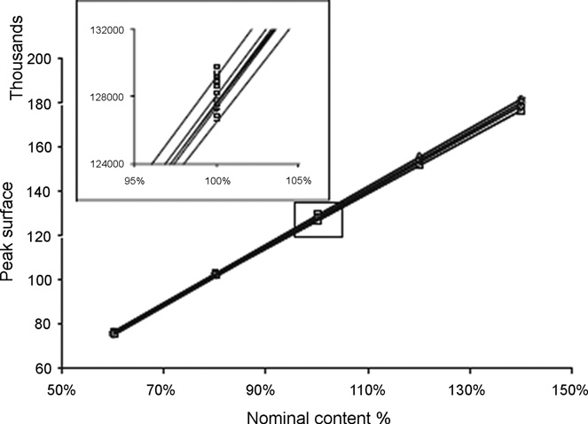

### 2.3 結果

P3 実験計画に由来するデータの活用法として、2通りが用いられた。**第一は検量に単一濃度レベルのみを使う方法、第二は5レベルすべてを保持する方法**である。ただし、バリデーション標準が単一濃度レベルしか含まないため、**どちらの正確性プロファイルも公称濃度100%のレベルでしか描けない**。

**受容限界は任意に ±3% に設定**され、**許容区間に含まれるべき将来の結果の割合は 95%** とした。**表1**に、図2で例示される各種統計量を示す。

**表1　1992年 SFSTP データ（mg 表示）——2通りの検量関数（1レベルまたは5レベル）による バリデーション結果**

| バリデーション基準 | 検量1レベル | 検量5レベル |
|---|---|---|
| レベル（公称濃度の %） | 100 | 100 |
| 導入濃度の平均 | 162.10 | 162.10 |
| β許容限界 下限 | 161.80 | 161.70 |
| β許容限界 上限 | 165.10 | 165.20 |
| 相対β許容限界 下限（%） | −0.18 | −0.24 |
| 相対β許容限界 上限（%） | 1.84 | 1.90 |
| 併行精度 標準偏差 | 0.41 | 0.41 |
| 室内再現精度 標準偏差 | 0.60 | 0.62 |
| 併行精度 R.S.D.（%） | 0.26 | 0.25 |
| 室内再現精度 R.S.D.（%） | 0.37 | 0.38 |
| 予測濃度 | 163.40 | 163.40 |
| 絶対バイアス | 1.35 | 1.34 |
| 相対バイアス（%） | 0.83 | 0.83 |
| 回収率（%） | 100.80 | 100.80 |

R.S.D.: 相対標準偏差。

**1992年の方法論によれば**、併行精度の相対標準偏差（R.S.D.）が **0.25%**、室内再現精度の R.S.D. が **0.37%** であったため、**その方法の精度は非常に良好とみなされた**。この計算は公称値でしか行えなかったことを再度想起されたい。

**しかしながら、1992年のプロトコルによれば、真度は満足のいくものには見えなかった。** 平均回収率の信頼区間が **100.7〜100.9%** の間に位置し、したがって**目標値100%を含まなかった**からである。この幾分か曖昧な結論については、文献 [1] で既に広く議論されている。

**図2**——2003年に提案されたアプローチを適用して得られたもの——では、**どちらの正確性プロファイルも、用いた検量データ（1濃度レベルまたは5濃度レベル）にかかわらず、その方法が有効と宣言できたはずであることを実証している**。どちらの場合も、**許容区間は受容限界の内側に完全に含まれている**。

1992年のデータを使うことはいささか人為的である。当然ながら、用いられた実験計画は2003年アプローチで開発されたものとは合致しないからである。しかし、**両アプローチの間の連続性を示すために、この演習を行うことは興味深かった**。

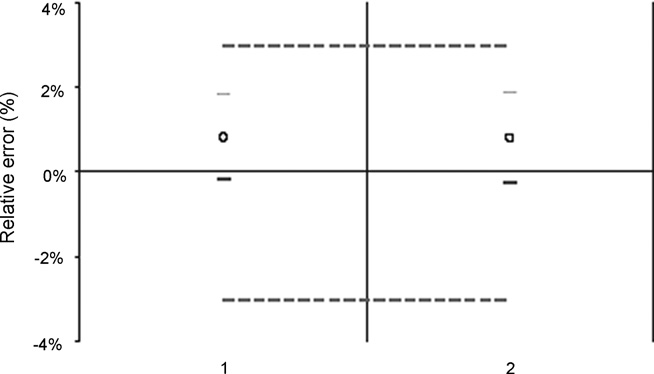

> 補足: **第1例が本稿でいちばん重要**かもしれない。同じデータについて、
>
> - **1992年の旧法**: 「精度は非常に良好。しかし**真度は不合格**」——平均回収率の信頼区間 100.7〜100.9% が 100% を含まないから
> - **2003年の新法**: 「**有効**」——許容区間が ±3% の内側に完全に収まっているから
>
> と正反対の結論が出る。旧法の何がまずいのか。**信頼区間はサンプル数を増やせばいくらでも狭くなる**ので、真のバイアスがどれほど小さくても、データを十分に取れば「100%を含まない」＝有意なバイアスあり、という結論が必ず出てしまう。この例の相対バイアスはわずか **0.83%** で、実務上まったく問題にならない大きさである。
>
> 正確性プロファイルは「バイアスがゼロか」ではなく「**将来の測定値が受容限界に収まるか**」を問うので、この罠にかからない。統計的有意性と実務的重要性を取り違えない設計になっている。

## 3. 錠剤中の有効成分のHPLC定量

### 3.1 装置と方法

この例は、錠剤あたり数 mg の有効成分を含む**2つの有効成分 A と B の、錠剤中での定量**に関する。定量は**外部検量による HPLC-UV** で行い、両物質を同時に定量できる。

操作手順は、**錠剤をアセトニトリルと水の混合溶液に溶解し、注入前にこの溶液をろ過する**ことからなる。検量は、**公称濃度（レベル100%）における有効成分標準物質の2つの独立した溶液**で行う。

### 3.2 実験計画

バリデーション計画は **3日 × 3レベル × 3反復（3×3×3）、すなわち 27試行**からなる。これは **V1プロトコル** [2] である。選ばれた濃度レベルは**公称濃度の 70・100・130%** で、**錠剤の含量均一性の規制管理に対応する濃度範囲、すなわち公称含量の 75〜125%（±25%）** をカバーするためである。

検量データについては、**検量関数は100%の単一点をもつ直線**である。この選択は、**100%より高い濃度の予測が外挿によって行われる**ことを含意する。製品Aに関するデータを**図3**に示す。化合物Bも同じプロトコルに従う。

加えてこの図は、**溶液が独立した秤量から独立して調製された**ことを示している。同一の「レベル」について、応答が垂直に整列していないことが観察されるからである。**提案するバリデーションアプローチには、存在する場合にこれら参照濃度のわずかな差を補償するための「再整列（realignment）」の段階が含まれる** [3] ことを想起されたい。

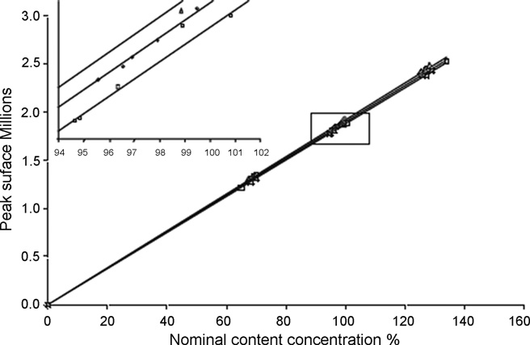

### 3.3 結果

これらのデータを [3] に記載の手順に従って処理することで、両分析物について各濃度レベルでの全性能基準を含む**表2**を構築できる。これら基準の大半は**絶対値と相対値の両方**で表される。相対値によって**図4と図5**を構築できる。

**表2　両ホルモンについて得られたバリデーション結果（公称含量の % 表示）**

| バリデーション基準 | ホルモンA レベル1 | A レベル2 | A レベル3 | ホルモンB レベル1 | B レベル2 | B レベル3 |
|---|---|---|---|---|---|---|
| 導入濃度の平均 | 68.21 | 97.27 | 127.60 | 70.47 | 100.50 | 131.50 |
| β許容限界 下限 | 67.52 | 95.36 | 126.90 | （抽出崩れ・原文参照） | 98.74 | 122.80 |
| β許容限界 上限 | 68.83 | 98.97 | 129.80 | 71.37 | （抽出崩れ・原文参照） | 137.80 |
| 相対β許容限界 下限（%） | −1.02 | −1.97 | −0.58 | −1.91 | −1.70 | −6.64 |
| 相対β許容限界 上限（%） | 0.90 | 1.74 | 1.69 | 1.28 | 1.27 | 4.80 |
| 併行精度 標準偏差 | 0.27 | 0.61 | 0.59 | 0.46 | 0.38 | 1.63 |
| 室内再現精度 標準偏差 | 0.27 | 0.69 | 0.59 | 0.46 | 0.51 | 2.41 |
| 併行精度 R.S.D.（%） | 0.39 | 0.63 | 0.46 | 0.65 | 0.38 | 1.24 |
| 室内再現精度 R.S.D.（%） | 0.39 | 0.71 | 0.46 | 0.65 | 0.51 | 1.84 |
| 予測濃度 | 68.17 | 97.16 | 128.30 | 70.24 | （抽出崩れ・原文参照） | 130.30 |
| 絶対バイアス | 0.00 | −0.11 | 0.71 | −0.22 | −0.22 | −1.21 |
| 相対バイアス（%） | 0.0 | −0.1 | 0.6 | −0.3 | −0.2 | −0.9 |
| 回収率（%） | 99.9 | 99.9 | 100.6 | 99.7 | 99.8 | 99.1 |

> 補足: 表2の**ホルモンB の一部のセルは、原本PDFのテキスト層が壊れており正確に読み取れない**。具体的には、B レベル1 の「β許容限界 下限」が `612` として抽出される（相対下限 −1.91% と導入濃度 70.47 から逆算すると **69.1程度**になるはずで、`69.12` の頭が欠けたものと推測される）。また B レベル2 の「β許容限界 上限」「予測濃度」がレベル3 の値と重複して抽出される。**推測値を本文に書き込むことはせず、「抽出崩れ・原文参照」と明記した。** 相対値の行（相対β許容限界・相対バイアス・回収率）はすべてクリーンに抽出できており、図4・図5 の判読と整合している。

**化合物Aの正確性プロファイル**は、**±5% の受容限界**を設定すれば、**その方法が有効であると結論できる**（**図4**）。これらの受容限界を、プロファイル計算に用いた将来の結果の割合（すなわち95%の許容区間）と混同してはならないことを想起されたい。念のため——**将来の測定値の期待される95%の割合が、許容区間の内側に含まれるとされている。**

**逆に物質Bについては、公称値の120%を超えると、許容区間はもはや ±5% の受容限界の内側にない**ことが観察できる（**図5**）。**受容限界と許容区間の交点をとることで、上限定量限界を計算できる**。この場合、それは**製品公称値の 121%** に等しい。結果として、**この方法は検討した全範囲では有効でないが、60〜121% の間ではその目的を達成している**と結論できる。

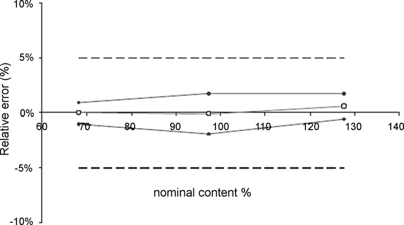

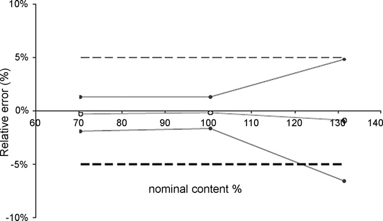

**100%を超える範囲で許容区間が広がること**は、検量の実験計画に対してなされた選択によって合理的に解釈できる。実際、**100%の単一レベルを使うと、より高いレベルの逆予測値を外挿によって計算せざるをえない**。しかし、この方法が予測の品質を劣化させる傾向があることはよく知られている [9]。

この状況から抜け出す1つの解決策は、**90%の確率を選ぶこと**であろう。これは許容区間を狭める結果になるが、**日常の測定が受容限界を超えるリスクも増やす**。同等の効果をもつ別の可能性は、**すべての結果を2つ以上の独立した結果の平均として報告すること**である。この場合、室内再現精度の分散が減少する。

医薬品中の有効成分濃度の管理を目的としたこの分析法バリデーションの例は、**新しい提案アプローチの柔軟性をよく例示している**。正確性プロファイルの「潜在力（potentiality）」とさえ言ってよい。**一枚の図の中に一連の性能指標を統合する**という意味においてである。

> 補足: **「有効／無効」の二択ではなく「どこまで有効か」を数値で返せる**——これが実務上いちばん効く。物質Bは「不合格」ではなく「**60〜121% の範囲で有効**」と言える。錠剤の含量均一性試験が要求する範囲は 75〜125% なので、この方法では**上端がわずかに足りない**ことになる。改善するか、範囲を限定して使うか、という具体的な議論に進める。
>
> なお、上限が足りない原因が「**100%の1点だけで検量したので、それより上は外挿になっている**」と特定されている点も重要である。次の第4例（ヒドロコルチゾン）は、まさにこの「検量点をどこに置くか」を系統的に比較している。

## 4. 検量プロトコルが正確性プロファイルに与える影響——軟膏中ヒドロコルチゾンのHPLC-UV定量

### 4.1 装置と方法

**ヒドロコルチゾン 0.1% の軟膏の品質管理**の一環として、方法が開発・バリデートされた。定量は **HPLC-UV** で行う。操作手順は、**有効成分を抽出して移動相に溶解する**ことからなる。検量は有効成分標準物質の独立した標準で行う。**検量範囲は軟膏 0.8〜1.2 mg/g** に及ぶ。

### 4.2 実験計画

該当する実験計画（**表3**）は **V4プロトコル** [2] であり、**3濃度レベル・レベルあたり2反復を3日間、すなわち合計18試行（3×2×3）** で適用した。

**検量標準はマトリックス中とマトリックス外の両方で調製**された。行列効果の存在と、単一の検量レベルで有効成分を定量できる可能性について、**情報が得られていなかった**。その結果、試行数の点では**最も安全だが最も重い選択肢**が採られた。

バリデーション標準は**3レベル・3反復を3日間、すなわち27試行**を含んだ。**すべてのバリデーション標準（9個）は分析の各日に独立して調製された。**

**表3　ヒドロコルチゾン定量に用いた実験計画の詳細**

| 試料の種類 | レベル | ヒドロコルチゾン濃度（mg/g） | 1日あたりの反復数 | バリデーション3日間の試行数 |
|---|---|---|---|---|
| 検量標準（マトリックス外） | SE1 | 0.8 | 2 | 6 |
| | SE2 | 1 | 2 | 6 |
| | SE3 | 1.2 | 2 | 6 |
| 検量標準（マトリックス中） | SE1 | 0.8 | 2 | 6 |
| | SE2 | 1 | 2 | 6 |
| | SE3 | 1.2 | 2 | 6 |
| バリデーション標準 | SV1 | 0.8 | 3 | 9 |
| | SV2 | 1 | 3 | 9 |
| | SV3 | 1.2 | 3 | 9 |
| **合計** | | | | **63** |

### 4.3 結果

収集したデータを V4 プロトコルに従って処理することで、**異なる検量モデルを適用して様々なプロファイルを構築できる**。実際、検量データを用いて次の回帰モデルを計算できる。

- **(A) 公称濃度の 80〜120% の間**
- **(B) この濃度の 100% において**
- **(C) 120% において**

そして各場合について、**マトリックス中またはマトリックス外で調製した検量標準から得たデータ**を使える。合計で、**6つの検量関数に基づく6つの正確性プロファイル**を提案できることになる。すべての場合において、保持された検量モデルは**直線**である。

**図6**はこれらの図をまとめ、**最も効率的な結果を提供するものを選択することを可能にする**。最終的に、**最もよく適合したプロファイルは、マトリックス外で調製した120%レベルのみで検量するもの**であることが判明する。

**表4**は、検量モデルが公称値の120%の単一濃度レベルで構築される場合について、各濃度レベルでのこれら方法の性能基準をすべて含む。

**医薬品製剤中の有効成分濃度を管理することを意図した、この古典的な方法のバリデーション例は、提案アプローチの柔軟性を再び例示している。** それは、**日常での最適な性能を確保するために、操作手順をどのように確定し検量手順を選択できるか**を表現している。

> 補足: **図6が本稿でいちばん実践的な図**である。同じデータから **6通りの検量方法**でプロファイルを描き、並べて見比べて最良を選ぶ。「検量線をどう引くか」が結果の合否を直接左右することが、視覚的に一目で分かる。
>
> 直感に反するのは、**3点（80/100/120%）で検量するより、120%の1点だけで検量するほうが良かった**という結果である。点数が多いほど良いとは限らない——これは前ページの [Hoffman & Kringle] にもあった「D最適計画」の議論と通じる。線形モデルなら両端2点、二次モデルなら両端＋中央が最適で、闇雲に点を増やすことが最善ではない。
>
> また **「マトリックス中で検量したほうが悪かった」** というのも面白い。行列効果を打ち消すためにマトリックス中で検量するのが定石だが、この事例ではマトリックス調製に伴うばらつきのほうが効いてしまったと読める。

## 5. 豚血漿中アクリルアミドの LC–MS 定量

### 5.1 装置と方法

**アクリルアミド**は、一部の食品を調理する際に新たに生成する物質である。**単糖（グルコース）とアスパラギンなどのアミノ酸が結合するメイラード反応**に由来する。

食品中のアクリルアミド濃度は様々な研究で文書化されているものの、**摂取後のアクリルアミド吸収を定量できた研究はほとんどない**。豚で実施される薬物動態研究により、**アクリルアミドのバイオアベイラビリティを決定できる**可能性がある。それに先立ち、**豚血漿中のアクリルアミド濃度を定量する分析法が必要**である。

このアッセイを実施するために選択された方法は、**HPLC と質量分析検出器を組み合わせたもの（LC–MS）** を用いる。バリデーションは、**10〜5000 mg/L に及ぶ非常に広い範囲**で実施される。食品摂取後に観察されうる血漿レベルについて情報が不足しているためにこの範囲が選ばれた。

参照物質がないため、**対照豚血漿への添加（スパイク）量**を用いることとした。**検量標準とスパイクした血漿試料（バリデーション標準）** の2組の標準を調製した。検量範囲は、**ギ酸で pH 6 に調整した 0.01 M 酢酸アンモニウム溶液**中で作成する。

**試料前処理**は次のとおり——血漿 200 μL に、飽和 ZnSO₄ 溶液 100 μL、アセトニトリル 1000 μL、次いで内部標準として用いる **D5標識アクリルアミド** 100 μL を加える。撹拌・遠心後、上清を蒸発させる。残渣を酢酸アンモニウム 200 μL（0.001 M、pH 6）で再処理する。

**注入量 50 μL**。用いた分析条件は、**流速 0.2 mL/min**、クロマトグラフィーカラムは **Hypercarb カラム（50 mm × 2.0 mm i.d.、粒子径 5 μm）**、MS検出は**アクリルアミドの分子イオン m/z 72** で実施する。

### 5.2 実験計画

実験計画は **5日 × 6濃度レベル × 2反復（5×6×2）、すなわち検量標準とバリデーション標準について60実験**からなる。提案された類型では、[2] に従えば **V2プロトコル**であるが、**反復数（3ではなく2）と濃度レベル数（3ではなく6）が変更**されている。**図7**はこの実験計画と、検量標準およびスパイクしたバリデーション標準について得られた応答の全体を示す。

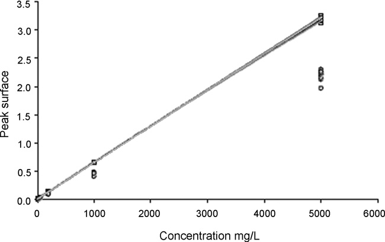

### 5.3 結果

データは**3段階**で処理した。

- **生データの解析と正確性プロファイルの作図**
- **回収率からマトリックス補正係数を決定する解析**
- **濃度補正後の正確性プロファイルの計算**

#### 5.3.1 生データの解析

この例では、濃度と応答の関係を記述するのに**最も適切な応答関数は、重み係数 1/X による重み付き二次回帰**である（X は導入濃度）。**図8**は、この回帰モデルと 95% 許容区間を用いて得られた正確性プロファイルを表す。

この図は、**正確性プロファイルと ±25% に設定した受容限界の間に隔たり**があることを示している。**この隔たりは行列効果によるものである。**

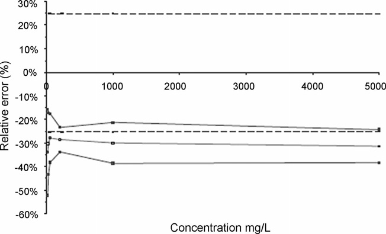

#### 5.3.2 補正係数の計算

**この行列効果を補正するため、導入した理論濃度（ConcAdded）と、逆予測によって計算した回収濃度（ConcReco）を結ぶ直線性の式の傾きから補正係数を計算した。** 適用する補正係数は、**バリデーション標準で得られた傾きの逆数**に対応する。**図9**にこれらの計算を示す。直線の式は

$$
\mathrm{ConcReco} = 1.9829 + 0.686 \times \mathrm{ConcAdded}
$$

したがって適用すべき**補正係数（Fc）は 1/0.686、すなわち 1.457** である。

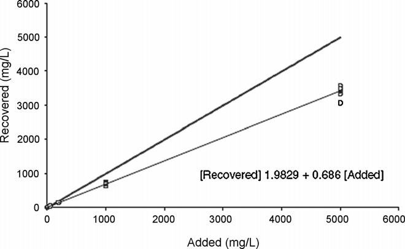

#### 5.3.3 補正後の正確性プロファイルの計算

**補正係数を考慮して新しい正確性プロファイルの計算を行う。** 補正はバリデーションデータに対して実施する。**図10**にこの新しい正確性プロファイルを示す。

補正係数を適用した後に得られた正確性プロファイルで例示されるとおり、**この方法は検討した適用範囲の一部でのみ有効**である。実際、**濃度レベル 10 mg/L において、正確性プロファイルの下限が ±25% に設定した受容限界を超えている**。

下限・上限定量限界の計算は、それぞれ **14.05 と 5000 mg/L** を与える。したがって**この方法は、定量限界が通常遭遇する濃度と適合しているため、定義された目的に適切に合致している**。**表5**に、全濃度レベルについて得られた結果をまとめる。

**この研究は、重み付き二次回帰モデルを用いる場合、14.05〜5000 μg/mL に設定された適用範囲で方法が完全に有効であることを実証した。** また、**行列効果は系統的であり、それを補正するために 1.457 の補正係数を適用しなければならない**ことも示された。

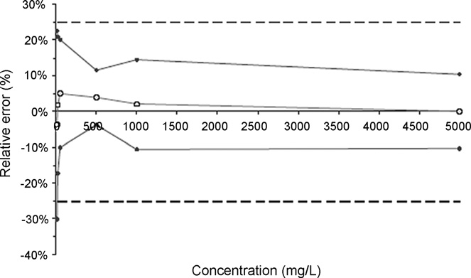

**表5　生データ補正後のアクリルアミド（mg/L）定量について得られたバリデーション結果**

| バリデーション基準 | レベル1 | レベル2 | レベル3 | レベル4 | レベル5 | レベル6 |
|---|---|---|---|---|---|---|
| 導入濃度の平均 | 10 | 20 | 50 | 500 ※ | 1000 | 5000 |
| β許容限界 下限 | 6.98 | 16.52 | 44.93 | 192.50 | 894.80 | 4482.00 |
| β許容限界 上限 | 12.26 | 24.16 | 60.07 | 223.00 | 1145.00 | 5515.00 |
| 相対β許容限界 下限（%） | −30.2 | −17.4 | −10.1 | −3.8 | −10.5 | −10.4 |
| 相対β許容限界 上限（%） | 22.6 | 20.8 | 20.2 | 11.5 | 14.5 | 10.3 |
| 併行精度 標準偏差 | 0.61 | 0.43 | 1.62 | 5.78 | 32.26 | 136.70 |
| 室内再現精度 標準偏差 | 0.99 | 1.31 | 2.81 | 6.32 | 48.01 | 199.20 |
| 併行精度 R.S.D.（%） | 6.1 | 2.1 | 3.3 | 2.9 | 3.2 | 2.7 |
| 室内再現精度 R.S.D.（%） | 9.9 | 6.6 | 5.6 | 3.2 | 4.8 | 4.0 |
| 予測濃度 | 9.62 | 20.34 | 52.50 | 207.70 | 1020.00 | 4999.00 |
| 絶対バイアス | −0.38 | 0.34 | 2.50 | 7.73 | 19.78 | −1.35 |
| 相対バイアス（%） | −3.8 | 1.7 | 5.0 | 3.9 | 2.0 | 0.0 |
| 回収率（%） | 96.2 | 101.7 | 105.0 | 103.9 | 102.0 | 100.0 |

> 補足: **※ レベル4 の「導入濃度の平均 500」は、原文の他のセルと矛盾する。** 同じ列の値で検算すると——
>
> - 許容限界下限 192.50 ÷ **200** = 96.25% → 相対下限 **−3.8%** ✓（原文と一致）
> - 許容限界上限 223.00 ÷ **200** = 111.5% → 相対上限 **+11.5%** ✓
> - 予測濃度 207.70 ÷ **200** = 103.85% → 回収率 **103.9%** ✓
>
> いずれも **200** で割ったときにのみ他のセルと整合する。したがってこのセルは **200 の誤り**である可能性が高い（濃度レベルの並びも 10・20・50・**200**・1000・5000 なら等比的で自然）。ただし**原文の表記をそのまま転記し、検算結果を注記するにとどめる**。原文に無い数値に書き換えることはしない。
>
> なお本文は「14.05〜5000 **mg/L**」と「14.05〜5000 **μg/mL**」を両方使っているが、mg/L = μg/mL なので**数値としては同じ**である（単位表記の揺れ）。

## 6. ELISA試験による神経疾患バイオマーカータンパク質の定量

### 6.1 目的と方法

**神経疾患関連の治療プロジェクトに用いられる、バイオマーカーとなりうるタンパク質を正確に定量するため、「サンドイッチ」型 ELISA 試験が開発された。**

ELISA 試験は、目的のタンパク質を捕捉するために、**特異抗体をコーティングしたプレート上で試料をインキュベート**することからなる。この段階に続いて、**結合酵素によるタンパク質特異的結合の免疫学的検出と、光学濃度測定による発色産物の測定**が行われる。

この試験をバリデートするため、**検量標準とバリデーション標準は、タンパク質ストック溶液から段階希釈によって適切なマトリックス中に調製された** [10]。

### 6.2 実験計画

この手順は、**4日間にわたり、試行あたり2プレートで、4つの独立した系列**で実施された。**すべての試行——検量標準・バリデーション標準のいずれも——は3重で実施**された。

### 6.3 結果

データに（試行ごと・プレートごとに）**最尤法により4パラメータロジスティック回帰（4-PL）** を当てはめた。重み付けには**観測レベルの指数関数（POM, power of the mean）** を用いた。

$$
Y = \alpha + \frac{\delta - \alpha}{1 + (\gamma / X)^{\beta}}
$$

ここで **δ・α・γ・β** はそれぞれ、**上側漸近線・下側漸近線・曲線の変曲点に対応する濃度・その点における傾き**である。

4日間で実施した一連の測定について、検量曲線は**図11**のように現れる。バリデーション標準の推定濃度は、**応答関数を逆に解く**ことによって計算した。すなわち

$$
x_{ijk,\text{calc}} = \frac{\hat{\gamma}_i}{\left( \left( (\hat{\delta}_i - \hat{\alpha}_i) / (y_{ijk} - \hat{\alpha}_i) \right) - 1 \right)^{1/\hat{\beta}_i}}
$$

希釈により試料の理論含量が既知であるため、**バリデーション標準の各濃度レベルについて真度・精度・許容区間を計算した**（**表6**）。正確性プロファイルを**図12**に示す。

**95%許容区間は、すべての濃度レベルにおいて ±30% の受容限界の内側に含まれている。**

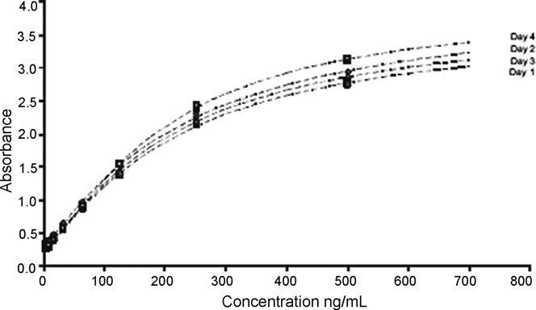

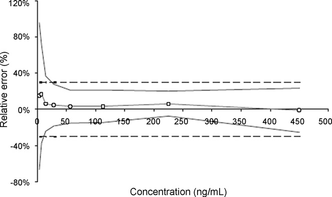

**表6　ELISAアッセイで得られたバリデーション結果（ng/mL）**（原文 Table 6 のうちテキスト層がクリーンに抽出できた行）

| バリデーション基準 | Lv1 | Lv2 | Lv3 | Lv4 | Lv5 | Lv6 | Lv7 | Lv8 |
|---|---|---|---|---|---|---|---|---|
| レベル | 3.5 | 7 | 14.1 | 28 | 56 | 113 | 225 | 450 |
| 導入濃度の平均 | 3.5 | 7 | 14.1 | 28 | 56 | 113 | 225 | 450 |
| 予測濃度の平均 | 4.019 | 8.184 | 14.98 | 29.3 | 57.82 | 116.6 | 239.2 | 445.6 |
| 絶対バイアス | 0.5187 | 1.184 | 0.877 | 1.301 | 1.818 | 3.607 | 14.16 | −4.367 |
| 相対バイアス（%） | 14.82 | 16.91 | 6.225 | 4.647 | 3.246 | 3.192 | 6.294 | −0.9705 |
| 回収率（%） | 114.8 | 116.9 | 106.2 | 104.6 | （以下は原文参照） | | | |

> 補足: 表6 の下半分（回収率のレベル5以降、および許容限界・精度の各行）は、原本PDFのテキスト層で列の対応が崩れており、**正確な転記ができないため「原文参照」とした**。上半分は図12 の正確性プロファイルと整合している（低濃度側でバイアスが +15〜17% と大きく、濃度が上がるにつれ 0% に近づく）。
>
> **ELISAは検量線が非線形（S字型）** なので、直線回帰を前提とする従来のバリデーション手法がそのままでは使えない。本稿の結論（第3項）が「**検量関数の直線性仮定は完全に放棄できる**」と強調するのは、まさにこの例が根拠である。受容限界が ±30% と緩いのも、リガンド結合アッセイの慣行（FDAガイダンスも大分子には ±20〜30% を認める）に沿っている。

## 7. 医薬品中の不純物のHPLC-UV定量

### 7.1 目的と方法

**バッチ出荷を目的とした品質管理**の一環として、**有効成分の濃度レベルが異なる2つの医薬品製剤中の不純物レベルを定量する方法**が開発された。この方法は、**259 nm の波長で動作するUV検出器と結合した逆相高速液体クロマトグラフィー**に基づく。**不純物は保持時間によって同定される。**

試料前処理は次のとおり——**錠剤20錠を粉砕した残渣から有効成分 20 mg を抽出**し、**メタノール 20 mL に溶解**する。次いで、**アセトニトリル・酢酸アンモニウム・氷酢酸からなる移動相**を加える。**注入量は 40 μL**。

このバリデーション研究は、**95%の場合において結果が真値の ±10% 未満であることを保証する**ことを目的とする。さらに、このバリデーションは**定量限界の評価**を可能にすべきである。

### 7.2 実験計画

このバリデーションでは、**作業者・装置・日**という異なる変動要因を考慮した。**各要因について2水準**を考えると、**完全要因計画は8通りの組み合わせ**を含む。**分割実施要因計画（fractional factorial design）** が選択され、**表7**に記述される。

各系列について検量標準とバリデーション標準を調製した。**検量標準はマトリックス外で、4濃度レベル——0.05%（100 ng/mL）・0.50%（1000 ng/mL）・1.25%（2500 ng/mL）・2.00%（4000 ng/mL）——で、各濃度レベルにつき2つの独立した調製**で作成した。

**不純物も賦形剤も純品として入手できなかった**ため、バリデーション標準は**有効成分単独から、5濃度レベル——0.01%（20 ng/mL）・0.05%・0.25%（500 ng/mL）・0.50%・1.25%——で、各濃度レベルにつき3つの独立した調製**で作成した。

したがって**不純物は有効成分と類似の応答をもつと仮定された**。試料は、実際の未知試料に見出されうる **0.50% の不純物レベル**（有効成分の理論量に対して）をシミュレートするため、医薬品製剤から調製した。試料調製は、**一定数の錠剤を粉砕し、必要な濃度レベルを得るために希釈する一定量を抽出する**ことからなる。**この例は実務的というより教育的な目的で実施された。**

**表7　医薬品製剤中の不純物のバリデーションに用いた実験計画**

| 系列 | 日 | 作業者 | 装置 |
|---|---|---|---|
| 1 | 1 | 1 | 1 |
| 2 | 1 | 2 | 2 |
| 3 | 2 | 1 | 2 |
| 4 | （原文参照） | | |

### 7.3 結果

検討した様々なモデルのうち、**原点を通る線形回帰**が目的に適合する結果を提供したものである。したがってこのタイプの回帰モデルが、**検量曲線として 2% の単一濃度レベル**を考慮して、各系列について当てはめられた。バリデーション標準の推定濃度は、**信号を系列の回帰直線の推定傾きで単純に割ること**によって計算した。

試料の理論濃度が既知であるため、**各濃度レベルについて真度・精度・許容区間を計算した**（**表8**）。正確性プロファイルを**図13**に示す。

**表8　医薬品製剤中の不純物の定量に関するバリデーション結果（ng/mL）**

| バリデーション基準 | レベル1 | レベル2 | レベル3 | レベル4 | レベル5 |
|---|---|---|---|---|---|
| レベル（%） | 0.01 | 0.05 | 0.25 | 0.50 | 1.25 |
| 導入濃度の平均 | 20.15 | 100.8 | 503.6 | 1008 | 2519 |
| 予測濃度の平均 | 26.83 | 102.3 | 507.6 | 1004 | 2480 |
| 絶対バイアス | 6.674 | 1.488 | 4.036 | −4.098 | −39.1 |
| 相対バイアス（%） | 33.12 | 1.48 | 0.80 | −0.41 | −1.55 |
| 回収率（%） | 133.10 | 101.50 | 100.80 | 99.59 | 98.45 |
| 併行精度 標準偏差 | 4.644 | 1.546 | 6.713 | 7.764 | 18.74 |
| 室内再現精度 標準偏差 | 5.214 | 1.758 | 6.713 | 9.803 | 20.87 |
| 併行精度 R.S.D.（%） | 23.04 | 1.534 | 1.333 | 0.7704 | 0.7439 |
| 室内再現精度 R.S.D.（%） | 25.87 | （以下は原文参照） | | | |

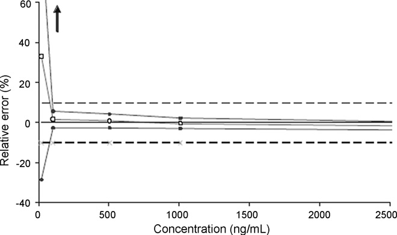

> 補足: 表8 の**レベル1（0.01%、20 ng/mL）だけが際立って悪い**——相対バイアス **+33.12%**、併行精度 R.S.D. **23.04%**。これは典型的な**定量下限付近の挙動**である。他の4レベルは相対バイアス 1.5% 以内、R.S.D. 1.5% 以内と極めて良好なので、この方法の実用的な下限は 0.05%（100 ng/mL）付近ということになる。
>
> 不純物試験でこの「下限がどこか」を数値で押さえられるのは大きい。ICH Q3A/Q3B の報告閾値・同定閾値・限度閾値を満たせるかどうかが、直接判断できる。

## 8. 比色法による血漿リン酸の定量

### 8.1 目的と方法

**リン酸二水素ナトリウム**は、pH を中性に保ち凝固因子を安定化するため、一部の治療用血漿に添加される。しかし、**高リン酸血症を避けるため、リン酸濃度は 5 mmol/L 前後に留まらなければならない**。そこで、この管理を可能にすることを目的として、**可視光における分光光度法による定量法**が開発された。

測定は、**塩化スズ(II)で還元したリンモリブデン錯体**について **710 nm** で行う。タンパク質は事前に**トリクロロ酢酸沈殿と遠心**によって除去される。**検量範囲は 0.28〜0.70 μmol/mL** に及ぶ。

### 8.2 実験計画

プロトコルは3日間で実施した **V4プロトコル** [2] である。検量標準は**4レベル・2反復を、マトリックス中とマトリックス外でそれぞれ、すなわち24試行**を含む。バリデーション標準は**3レベル・3反復、すなわち27試行**を含む（**表9**）。

**各日、すべての検量標準（8個）とバリデーション標準（9個）は独立している。** 検量標準について光学濃度（OD）単位で表した応答を**図14**に示す。

**行列効果は事実上観察されず**、各データセットについて計算した回帰式は非常に近い。加えて、**応答が完全には整列していない**ことも観察できる。これは濃度レベル間の差によるもので、添加溶液と標準溶液が**正確な秤量（独立した試料）** によって得られているためである。**線形内挿によるデータ再整列の段階**により、[3] で提案されているとおり、これらのわずかな差を補償できる。

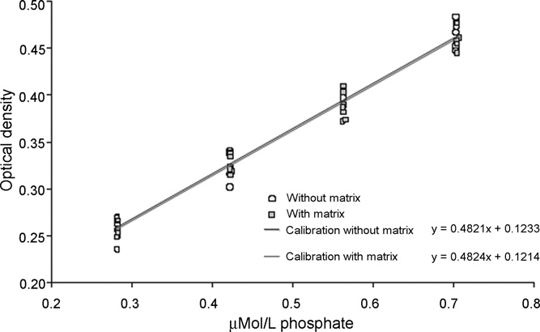

### 8.3 結果

最も適切な応答関数は、**重み係数 1/X で重み付けした線形回帰**である。重み付き線形逆関数によってバリデーション標準から予測された濃度は、**わずかな行列効果があること**を示す。実際、導入濃度（ConcAdded）と回収濃度（ConcReco）の関係から得られる直線性の式は、それぞれ次のとおりである。

- **マトリックスなしの検量**: $\mathrm{ConcReco} = 0.9589 \times \mathrm{ConcAdded} + 5.901$
- **マトリックスありの検量**: $\mathrm{ConcReco} = 0.9671 \times \mathrm{ConcAdded} + 5.359$

**しかし、図15・図16 に示すとおり無用であることが判明したため、補正係数を適用しないことが決定された。** これら2つの正確性プロファイルは、**±15% の受容限界と 90% の許容区間**を用いて得られた。

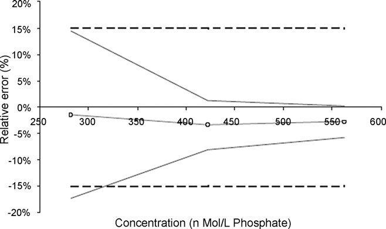

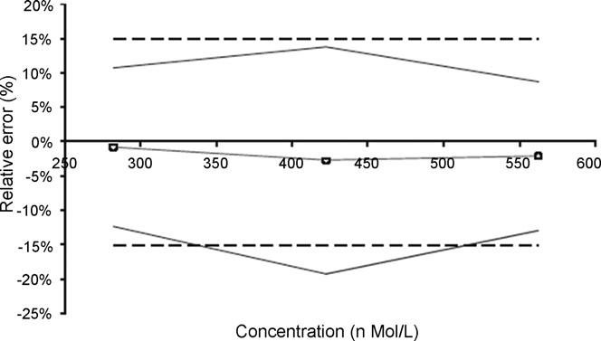

**表10（抜粋）——血漿リン酸定量のバリデーション結果**（原文 Table 10 のうちテキスト層がクリーンに抽出できた行）

| バリデーション基準 | レベル1 | レベル2 | レベル3 |
|---|---|---|---|
| 室内再現精度 R.S.D.（%） | 5.9 | 2.4 | 1.5 |
| 予測濃度 | 277.40 | 407.50 | 546.50 |
| 絶対バイアス | −4.19 | −14.39 | −15.75 |
| 相対バイアス（%） | −1.5 | −3.4 | −2.8 |
| 回収率（%） | 98.5 | 96.6 | 97.2 |

> 補足: この例の教訓は **「補正係数は、必要なときだけ使う」** である。回帰の傾きが 0.9589／0.9671 と 1 から約 3〜4% ずれており、機械的に考えれば補正したくなる。しかし正確性プロファイルを描いてみると、**補正しなくても許容区間が ±15% の内側に収まっている**ので、補正は不要と判断された。
>
> 補正は「ただ」ではない。緒言にあるとおり **補正すると測定の不確かさが増える**（補正係数自体に不確かさがあるため、それが結果に伝播する）。だから**必要でなければ補正しないほうが良い**。第5例（アクリルアミド、回収率69%）のように補正が不可欠な場合と対比すると、判断基準がはっきりする。

## 9. 結論（Conclusions）

SFSTP 委員会が開発した**調和されたバリデーションアプローチは、既に多くの適用**がなされている。他の適用例は文献に見出せる——**UV・蛍光・質量分析といった様々な検出器を用いる液体クロマトグラフィー法** [12–29]、**赤外分光光度法** [30–32]、**比色法** [32, 33]、**ラマン法** [34]、**キャピラリー電気泳動** [35, 36]、**高速薄層クロマトグラフィー** [37]、**ガスクロマトグラフィー** [38] など。

本稿では、**分析者が日常的に遭遇しうる様々な状況に応じて選んだ一連の適用例**を提示した。これらの研究からいくつかの結論を引き出せる。

**1.** 大局的に見て、**ISO 17025 規格が示すバリデーションの定義**——すなわち「**バリデーションとは、予見された特定の利用に関する個別の規定が満たされていることを、検査と有効な証拠によって確認すること**」——を考えるなら、**新しく提案されたアプローチはこの定義に極めて正確に合致する**。実際、我々は次を行わなければならない。(1) **受容限界の観点から達成すべき目標を明確に設定することから始める**、(2) 様々な実験計画のおかげで**有効な証拠を収集する**、そして最後に (3) **データを検査して、統計的かつ図的に方法の妥当性を確認あるいは反証する**。

**2.** **正確性プロファイルを確立するために性能指標をレベルごとに計算すること**により、**非常に広い濃度範囲をカバーできる**。したがって、適用範囲が数桁に及びうる方法にも本アプローチは適用可能である。そして、**濃度レベルによって分散が均一でない方法もバリデートできる**。この点は非常に重要である。他の多くのアプローチでは、**適用領域全体での分散の均一性の仮定が不可欠**だからである。**濃度と不確かさのこの依存関係は一般的な現象**であり、その証拠は Horwitz と Albert によって明確に示され、モデル化されている [39]。

**3.** **異なる、さらには非線形の検量モデル——4パラメータロジスティック関数のような——も使用できる。** 実際、このアプローチによれば、**バリデーションを行う際に検量関数の直線性仮定は完全に放棄できる**。加えて、**重み付き回帰の技法も使用でき**、ここでも分散が均一でないデータを処理できる。同様に、**公称値の 80〜120% で原薬を管理するというごく古典的な例において、最良の回帰モデルをどう選ぶか**を見ることができた。

**4.** **真度と精度の対立は単純に解決できる。** 古典的なバリデーションアプローチは一般に**真度と精度を別々に扱う**。このため、**2つの基準のうち片方だけが満足である場合に曖昧な結論**につながりうる。**正確性プロファイル法は、同じ1枚のグラフ上に両基準（あるいはこれらの基準の組み合わせ）を同時に表現することを可能にする。** この理由で、本アプローチははるかに柔軟であり、**常に真度と精度を組み合わせなければならない不確かさと正確性の定義に合致する**。

**5.** 典型的に、**古典的なバリデーションアプローチは、性能基準の参照値への適合性を検定すること**からなる。統計的に言えば、これはこれらのパラメータについて**帰無仮説を検定するだけ**である。逆に、**提案アプローチは、結果をエンドユーザーに提供される形のまま直接扱う**。これは「**顧客満足**」を強調する新しい品質保証ガイドラインの要求により良く対応する。

正確性プロファイルは、**事前に設定された受容限界の間に収まらなければならない将来の結果の最小期待割合を設定すること**からなる。ただし、**これらの統計的基礎の上に顧客リスクを計算するという補完的アプローチも可能**であろう。**このリスクは、受容限界の外側の結果を得る可能性として表現できる**ことを想起されたい。

**6.** 提示した例から、**平均回収率の逆数から導出されうる補正係数を計算することが可能であった**ことが際立っている。この点は、特に環境分析の分野で、**回収率が 100% から大きく異なる場合に測定値を補正すべきか否か**を知るために、多くの議論を呼んできた。

**正確性プロファイルが提供する答えは明確である——回収率は考慮されてよく、かつ考慮されなければならない。** 加えて、**これを考慮することが不確かさの増大につながる**ことを実験的に実証できた。これは計量学者の推奨と完全に調和している。

### 残された課題

正確性プロファイル法が提供する数多くの実践的な答えにもかかわらず、いくつかは**未解決のまま**である。

例えば、**食品衛生や臨床生物学で多用される微生物学的計数にどこまで適用できるか**。加えて、**代替法を「参照」法と比較することでバリデートすること**は、認定を受けた実験室に対する古典的な要求である。この場合、**理論値が不確かさをもって知られているという事実も計算に考慮に入れなければならない**。したがって、**正確性プロファイル法の普遍性をより良く主張するには、さらに多くの適用を実施する必要がある**。

最後に、**バリデーションは常に方法の開発の後に行われなければならない**ことを想起することが不可欠と思われる。**まだよく分かっていない方法で試行を行おうとすれば、おそらく深刻な失望につながり、その方法が無効であるという結論を導きかねない。**

> 補足: 結論の第5項が、この手法の思想を最もよく表している。
>
> **古典的アプローチ**: 「バイアスはゼロと言えるか？」「RSDは基準以下と言えるか？」——**パラメータについての仮説検定**。
> **正確性プロファイル**: 「エンドユーザーが受け取る**結果そのもの**が、受容限界に収まるか？」——**将来の測定値についての予測**。
>
> 前者は統計学者の問い、後者は使う人の問いである。「顧客満足」という言葉を持ち出しているのは、ISO 9000系の品質保証の文脈を意識しているのだろう。
>
> そして最後の一文——**「バリデーションは方法開発の後に行う。まだよく分かっていない方法で試行しても失望するだけ」**——は当たり前のようでいて、実務では驚くほど守られない。バリデーションを「開発の一部」として使ってしまい、失敗して方法自体を捨ててしまう、という失敗はよくある。QbD（Quality by Design）の考え方が後年に強調することを、2008年時点で端的に述べている。

## 訳者による総括

本稿は「理論の説明」ではなく「**やってみせる**」ことに徹した論文である。SFSTP 4部作のうち、I・II が概念と実験計画、III が計算式を扱い、本稿 IV がそれを7つの実データで回してみせる。**手を動かす人にとって最も価値があるのは、たぶんこの巻**である。

7例の性格を整理しておく。

| 例 | 手法 | この例が教えること |
|---|---|---|
| 1. 1992年データの再解析 | HPLC | **旧法で「真度不合格」だったものが新法では「有効」** ——統計的有意性と実務的重要性の取り違えを避けられる |
| 2. 錠剤中2成分 | HPLC-UV | **「どこまで有効か」が出せる** ——成分Bは 60〜121% で有効、上限定量限界を交点から算出 |
| 3. ヒドロコルチゾン軟膏 | HPLC-UV | **検量線の引き方が合否を決める** ——6通りを並べて最良を選ぶ（意外にも1点校正が最良） |
| 4. 豚血漿アクリルアミド | LC–MS | **回収率69%を補正係数1.457で救済** ——ただし範囲は 14.05〜5000 mg/L に限定される |
| 5. バイオマーカーELISA | ELISA | **非線形（4-PL）検量線でも扱える** ——直線性仮定は不要 |
| 6. 医薬品中不純物 | HPLC-UV | **分割実施要因計画で作業者・装置・日を織り込む**／定量下限付近の挙動が明瞭に出る |
| 7. 血漿リン酸 | 可視分光 | **補正が不要なら補正しない** ——補正は不確かさを増やすコストを伴う |

実務者として持ち帰るべき原則は3つに絞れる。

**第一に、受容限界を先に決めること。** 結論の第1項が ISO 17025 の定義に沿って述べるとおり、手順は「①目標（受容限界）を設定 →②証拠を集める →③確認する」の順である。データを取ってから基準を考えるのでは、バリデーションの意味がない。

**第二に、真度と精度を別々に検定しないこと。** 第1例が示すとおり、真度の検定は「バイアスがゼロか」を問うが、実務が知りたいのは「結果が使えるか」である。バイアス 0.83% で不合格になる基準は、基準のほうがおかしい。

**第三に、補正は必要なときだけ、範囲を明示して。** 第4例（補正が不可欠）と第7例（補正が不要）の対比が明快である。そして「補正すると不確かさが増える」という代償を、著者らは繰り返し注意している。

限界として著者ら自身が挙げているのは、**微生物計数への適用可能性**と、**参照法との比較（理論値自体に不確かさがある場合）** の2点である。前者は計数データが正規分布しないこと、後者は真値が不確かであることが、いずれも本手法の前提を崩す。

なお本稿には、表2・表5・表6・表8・表10 に **原本PDFのテキスト層の抽出崩れ**があり、一部のセルは正確に読み取れなかった（本文中の訳注で該当箇所を明示した）。また表5 レベル4 の「導入濃度 500」は、同じ列の他のセルと検算が合わず **200 の誤り**と思われるが、**原文の表記のまま転記して検算結果を注記するにとどめた**。

## 参考文献

原文 References（全39件のうち、本文で直接参照される 1〜11 番を全訳し、12〜39 番は適用例の出典一覧として原文の書誌のまま掲げる）

1. Ph. Hubert, J.-J. Nguyen-Huu, B. Boulanger, E. Chapuzet, P. Chiap, N. Cohen, P.-A. Compagnon, W. Dewe, M. Feinberg, M. Lallier, M. Laurentie, N. Mercier, G. Muzard, C. Nivet, L. Valat, *J. Pharm. Biomed. Anal.* **36** (2004) 579–586.（**SFSTP パートI**）
2. Ph. Hubert, J.J. Nguyen-Huu, B. Boulanger, E. Chapuzet, P. Chiap, N. Cohen, P.A. Compagnon, W. Dewé, M. Feinberg, M. Lallier, M. Laurentie, N. Mercier, G. Muzard, C. Nivet, L. Valat, E. Rozet, *J. Pharm. Biomed. Anal.* **45** (2007) 70–81.（**SFSTP パートII**）
3. Ph. Hubert, J.-J. Nguyen-Huu, B. Boulanger, E. Chapuzet, N. Cohen, P.-A. Compagnon, W. Dewé, M. Feinberg, M. Laurentie, N. Mercier, G. Muzard, L. Valat, E. Rozet, *J. Pharm. Biomed. Anal.* **45** (2007) 82–96.（**SFSTP パートIII**）
4. M. Feinberg, B. Boulanger, W. Dewé, Ph. Hubert, *Anal. Bioanal. Chem.* **380** (2004) 502–514.
5. A.G. González, M.Á. Herrador, *TrAC Trends Anal. Chem.* **26** (2007) 227–238.
6. A.G. González, M.Á. Herrador, *Talanta* **70** (2006) 896–901.
7. J. Caporal-Gautier, J.M. Nivet, P. Algranti, M. Guilloteau, M. Histe, L. Lallier, J.J. N'Guyen-Huu, R. Russotto, *STP Pharma Pratiques* **2** (1992) 227–239.（**1992年の旧バリデーション手順**）
8. International Conference on Harmonization (ICH), Topic Q2 (R1): Validation of Analytical Procedures: Text and Methodology, Geneva, 2005.
9. J.S. Hunter, *J. AOAC* **64** (1981) 574–583.
10. A. da Silva, E.M. Quagliato, C. Lucio Rossi, *Microb. Infect. Dis.* **37** (2000) 87–92.
11. Guidance for Industry: Bioanalytical Method Validation, US FDA, CDER/CBER, Rockville, May 2001.
12. M.A. Bimazubute, E. Rozet, I. Dizier, P. Gustin, Ph. Hubert, J. Crommen, P. Chiap, *J. Chromatogr. A* **1189** (2008) 456–466.
13. E. Chéneau, J. Henri, Y. Pirotais, J.-P. Abjean, B. Roudaut, P. Sanders, M. Laurentie, *J. Chromatogr. B* **850** (2007) 15–23.
14. E. Rozet, R. Morello, F. Lecomte, G.B. Martin, P. Chiap, J. Crommen, K.S. Boos, Ph. Hubert, *J. Chromatogr. B* **844** (2006) 251–260.
15. R.D. Marini, P. Chiap, B. Boulanger, S. Rudaz, E. Rozet, J. Crommen, Ph. Hubert, *Talanta* **68** (2006) 1166–1175.
16. O. Rbeida, B. Christiaens, Ph. Hubert, D. Lubda, K.-S. Boos, J. Crommen, P. Chiap, *J. Pharm. Biomed. Anal.* **36** (2005) 947–954.

> 補足: 文献 17〜39 は、本文9節で列挙される各種分析技術（IR分光・ラマン・キャピラリー電気泳動・HPTLC・GC など）への適用例および Horwitz–Albert の分散モデル（文献39）の出典である。原本PDFの参考文献欄はテキスト層の抽出が途中で切れているため、**17番以降の完全な書誌は原文を参照されたい**。捏造を避けるため、確認できた範囲のみを掲げた。
