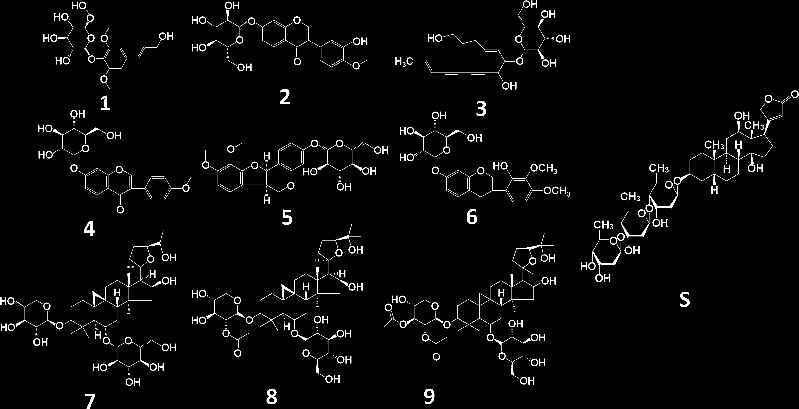
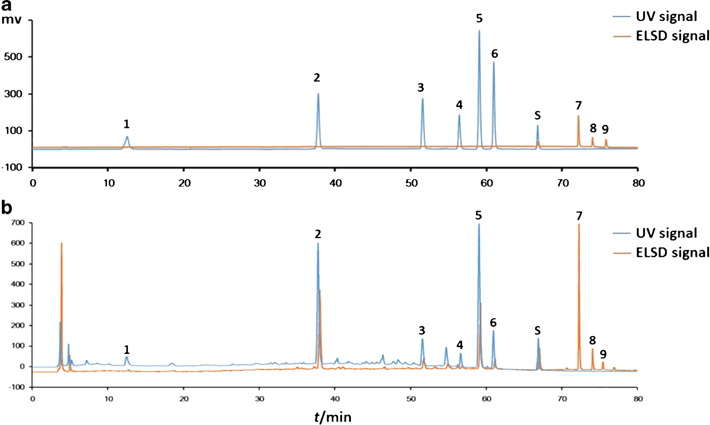
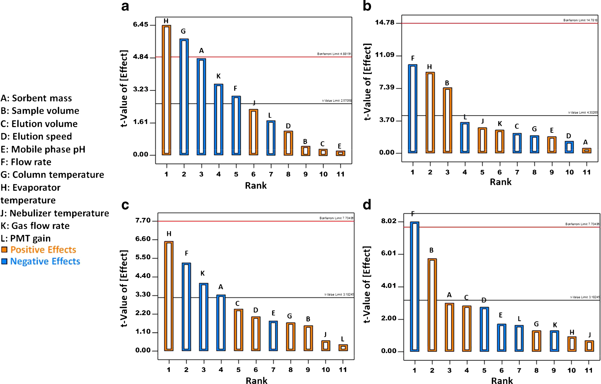
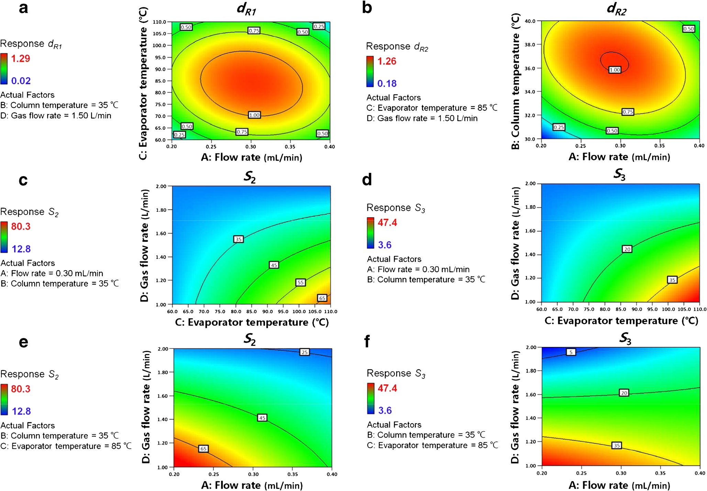
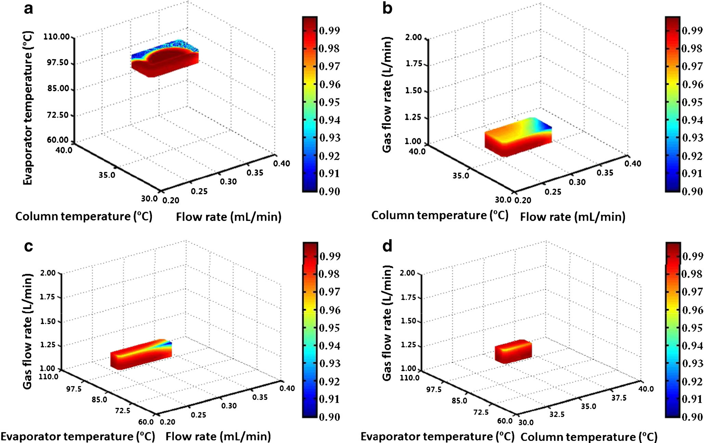

<!--
Wang L, Qu HB. Development and optimization of SPE-HPLC-UV/ELSD for simultaneous
determination of nine bioactive components in Shenqi Fuzheng Injection based on
Quality by Design principles. Anal Bioanal Chem (2016) 408:2133-2145.
DOI 10.1007/s00216-016-9316-3 の全訳密度日本語版。
-->

> **補足（本サイトでの位置づけ）:** 本論文は漢方・生薬そのものの品質評価論文ではなく、**分析法そのものの開発・最適化に QbD（Quality by Design）を適用する方法論**を、党参（トウジン）と黄芪（オウギ）から作られる中成薬注射剤「参芪扶正注射液」を題材に示したチュートリアル的研究である。生薬・漢方製剤は「多成分・複雑マトリックス」であり、単一の純粋化合物と違って分析条件のわずかな変動に定量結果が敏感に反応する。本論文が示す「リスクアセスメント→スクリーニング設計（Plackett-Burman）→応答曲面設計（Box-Behnken）→モンテカルロによる分析デザインスペース（MODR）構築」という枠組みは、当サイトが扱う生薬QC・指紋分析・多成分定量のメソッド開発すべてに直結する基盤技術である。とくに **SPE 前処理・HPLC 分離・UV/ELSD 検出という「異なる工程」を切り離さず一体で最適化する**という発想は、複雑マトリックス試料の頑健なメソッド開発における要点であり、後続の AQbD/ICH Q14 系の議論の実践例として読める。

---

# 書誌情報

- **原題:** Development and optimization of SPE-HPLC-UV/ELSD for simultaneous determination of nine bioactive components in Shenqi Fuzheng Injection based on Quality by Design principles
- **和題（本稿）:** QbD原理に基づく参芪扶正注射液（SFI）9成分同時定量のためのSPE-HPLC-UV/ELSD法の開発と最適化
- **著者:** Lu Wang, Haibin Qu（王璐・瞿海斌）
- **所属:** 浙江大学 薬学院 製薬情報学研究所（Pharmaceutical Informatics Institute, College of Pharmaceutical Sciences, Zhejiang University, 杭州 310058, 中国）
- **責任著者:** Haibin Qu（quhb@zju.edu.cn）
- **掲載誌:** Analytical and Bioanalytical Chemistry（Anal Bioanal Chem）2016年, 408巻, 2133–2145頁
- **DOI:** 10.1007/s00216-016-9316-3
- **投稿/改訂/受理:** 2015年10月25日投稿 / 2015年12月24日改訂 / 2016年1月5日受理 / 2016年1月29日オンライン公開
- **© Springer-Verlag Berlin Heidelberg 2016**
- **キーワード:** 高速液体クロマトグラフィー（HPLC）／固相抽出（SPE）／Quality by Design（QbD）／デザインスペース／メソッド頑健性
- **電子補足資料（ESM）:** オンライン版に補足資料あり（doi:10.1007/s00216-016-9316-3）。本文中の Table S1・Table S2 は ESM に収載。
- **雑誌インパクトファクター:** 4.19（Analytical and Bioanalytical Chemistry・JCR2024・Q2。出典により2025年値を 3.8 と記載するものもある。要確認）

---

# 要旨（Abstract）

固相抽出（solid phase extraction, SPE）、高速液体クロマトグラフィー（high performance liquid chromatography, HPLC）、および紫外・蒸発光散乱検出（ultraviolet/evaporative light scattering detection, UV/ELSD）を組み合わせた手法（SPE-HPLC-UV/ELSD）を、Quality by Design（QbD）原理に従って開発し、植物薬（botanical drug）である参芪扶正注射液（Shenqi Fuzheng Injection, SFI）中の9つの生物活性化合物の定量に用いた。

**リスクアセスメント**と **Plackett–Burman 設計** を用い、クロマトグラフィーピークの分離度（resolution）とシグナル対ノイズ比（signal-to-noise, S/N）に対する **11因子** の影響を評価した。多重回帰分析と Pareto ランキング分析の結果、吸着剤量（sorbent mass）、試料量（sample volume）、流速（flow rate）、カラム温度（column temperature）、蒸発器温度（evaporator temperature）、ガス流量（gas flow rate）が統計的に有意（p < 0.05）であることが示された。

さらに **Box–Behnken 設計** と **応答曲面分析（response surface analysis）** を組み合わせ、SPE-HPLC-UV/ELSD 分析の品質と4つの有意因子（流速、カラム温度、蒸発器温度、ガス流量）との関係を検討した。次に、**モンテカルロ確率（Monte Carlo probability）** の計算によって SPE-HPLC-UV/ELSD の **分析デザインスペース（analytical design space）** を構築した。

提示した手法では、試料前処理・クロマトグラフィー分離・化合物検出の操作パラメータを同時に検討した。選定した作業点（working point）において、システム適合性試験、メソッド頑健性/堅牢性（robustness/ruggedness）、感度、精度、併行精度（repeatability）、直線性、真度、安定性の **8項目のメソッドバリデーション** を実施した。

これらの結果は、複雑マトリックス中の試料に対する分析法開発において QbD 原理が有用であることを明らかにした。また、分析品質とメソッド頑健性は分析デザインスペースによって検証された。本手法は、複雑マトリックス中の試料に対する頑健で QbD 準拠の定量法を開発するためのチュートリアルを提供する。

---

# 序論（Introduction）

分析法（analytical procedures）は、医薬品の研究開発だけでなく医薬品製造においても決定的な役割を果たす[1]。分析法は、詳細な基礎知識、工業的製造のノウハウ、そして医薬品製品の品質保証を提供する。特定の分析法を科学的に応用する前には、バリデーション手順が必要である[2, 3]。

**メソッド頑健性（method robustness）** は、メソッド開発に続く分析法バリデーションにおける重要なステップであり、試料材料・被験物質・保存・試料前処理条件などを含む実験条件の変化に対する分析プロセスの感受性（susceptibility）として定義される[4]。従来、頑健性試験はメソッド開発の最後、あるいはメソッドバリデーションの最初に実施されてきた。メソッド頑健性やバリデーション結果が不十分な場合には、パラメータ範囲の絞り込み、適応（adaptation）、メソッドの再開発などが通常採られる対応である[5]。さらに、多数の実験が必要となるため、頑健性試験は時間と消耗品を非常に多く要求する。したがって、メソッド頑健性を改善するには、**リスクアセスメントをメソッド開発に統合**し、メソッド最適化の過程で分析品質を作り込む（built during）ことが不可欠である。

**Quality by Design（QbD）** の取り組みは米国食品医薬品局（FDA）によって開始され、医薬品開発・製造における重要なパラダイムとなった。それ以降、同様のアプローチに従った分析法開発の機会が探究されてきた[6–8]。QbD を用いたメソッド開発における重要な手順は、測定の不確かさ（measurement uncertainty）が問題となる場合でも分析品質が保証される **分析デザインスペース（analytical design space）** を導出することである[9, 10]。さらに、分析デザインスペースはメソッド頑健性の尺度でもあり、適切なシステム適合性パラメータで検証できる[11]。

分析デザインスペースを工程（プロセス）のデザインスペースと区別するために、多くの科学者が **メソッド操作可能デザイン領域（method operable design region, MODR）** という用語を作り出して間もなく[12]、MODR は規制当局によって認知されるに至った[13]。QbD 原理を分析測定に適用した多数の論文が報告されている[14–16]。

一方、化学薬品（合成医薬品）は通常、単純な構造・低分子量・高純度をもち、さらには定量的構造–保持相関（quantitative structure–retention relationship, QSRR）モデルによる裏付けもあるため、これら既知化合物のクロマトグラフィー保持はかなり予測可能である[17]。結果として、化学薬品のクロマトグラフィー分離に関する公表手法の圧倒的多数は高速/超高速液体クロマトグラフィー（HPLC/UPLC）を用いてきた[18]。しかし、**複雑マトリックス中の試料に対する QbD 準拠の定量分析** に関する研究は依然として不足している。

天然物から作られる植物薬（botanical drugs）は、多成分・多素材の製剤であり、構造や性質が不明な多数の組成をもつことでよく知られている。満足なクロマトグラフィー性能を得るには、任意の試料に対して、液–液抽出（LLE）、固相抽出（SPE）、濃縮、沈殿などの **頑健な試料前処理法** が必要である[19, 20]。すべての成分の化学的性質が異なる結果として、より多くの化合物情報を捉えるために、紫外（UV）、蒸発光散乱検出（ELSD）、質量分析（MS）など様々な検出手法も適用されてきた[21]。化学薬品と比較して、植物製剤中の生物活性化合物の同定は、類似構造の不純物によって常に複雑化する。多くの場合、こうした天然試料の分析法の性能は実験条件に極めて敏感であり、したがってメソッド頑健性の改善が重要である。

本研究では、植物薬中の9つの生物活性成分を同時定量する QbD 準拠の SPE-HPLC-UV/ELSD 法を開発する戦略を提示する。リスクアセスメントと Plackett–Burman 実験計画を用いて因子をスクリーニングする[7]。続いて応答曲面分析と Box–Behnken 実験計画を組み合わせて、実験条件とメソッド性能との関係を理解する[14]。最終的にモンテカルロ確率マップを用いて SPE-HPLC-UV/ELSD 法の分析デザインスペースを導出する[9]。

---

# 材料と方法（Materials and methods）

## 試薬と化学物質（Reagents and chemicals）

HPLC グレードのアセトニトリル、メタノール、ギ酸は Merck（Darmstadt, ドイツ）から供給された。超純水は Milli-Q 水精製システム（Molsheim, フランス）を用いて実験室で製造した。

標準物質として、以下の9成分と内標準1成分を用いた（Shanghai Winherb Medical Technology Co., Ltd（上海, 中国）より購入）：

1. **シリンギン（syringin）**（成分1）
2. **カリコシン-7-O-β-D-グルコピラノシド（calycosin-7-O-β-D-glucopyranoside）**（成分2）
3. **ロベチオリン（lobetyolin）**（成分3）
4. **オノニン（ononin）**（成分4）
5. **9,10-ジメトキシプテロカルパン-3-O-β-D-グルコピラノシド（9,10-dimethoxyptercarpan-3-O-β-D-glucopyranoside）**（成分5）
6. **2'-ヒドロキシ-3',4'-ジメトキシイソフラバン-7-O-β-D-グルコピラノシド（2'-hydroxy-3',4'-dimethoxyisoflavan-7-O-β-D-glucopyranoside）**（成分6）
7. **アストラガロシド IV（astragaloside IV）**（成分7）
8. **アストラガロシド II（astragaloside II）**（成分8）
9. **アストラガロシド I（astragaloside I）**（成分9）
- 内標準（internal standard）：**ジゴキシン（digoxin, S）**

10種の標準物質の化学構造は原著 Fig. 1 に示されている。すべての標準物質は 50% メタノール/水（v/v）に溶解し、分析前は 4 °C で保存した。

> **訳者補足:** 成分1・3（シリンギン、ロベチオリン）は党参（Radix Codonopsis, RC）由来のマーカー、成分2・4–9（カリコシン配糖体、オノニン、プテロカルパン/イソフラバン配糖体、アストラガロシド類）は黄芪（Radix Astragali, RA）由来のマーカーである。とくにアストラガロシド類（7–9）は **紫外吸収をほとんど持たないトリテルペンサポニン** であり、UV では検出しにくいため ELSD（蒸発光散乱検出：溶媒を蒸発させて残った溶質粒子に光を当て散乱光を測る、発色団のない化合物も検出できる万能型検出器）を併用する。これが本論文で UV と ELSD を **同一クロマトグラム上で切り替え併用** する理由である。

## 試料前処理（Sample preparation）

本研究を通じて用いた試料は、参芪扶正注射液（Shenqi Fuzheng Injection, SFI）という液状生薬製剤である。SFI は良好な **免疫賦活作用（immuno-enhancement）** と **抗腫瘍活性（anticancer activity）** をもつ[22, 23]。SFI は一般に **党参（Dangshen, Radix Codonopsis, RC）** と **黄芪（Huangqi, Radix Astragali, RA）** の水抽出物から製造される。近年、SFI の各生薬の主要成分が研究されてきた。党参にはシリンギンとロベチオリン（成分1と3）が、黄芪には主として各種のイソフラボノイドとトリテルペンサポニン（成分2および4–9）が含まれる[22]。

医薬品製剤は Livzon Pharmaceutical Group Inc.（広東, 中国）より提供された。Oasis HLB 抽出カラム（30 μm, 1 mL/10 mg または 60 μm, 3 mL/60 mg; Waters Corporation, Milford, Massachusetts, 米国）を用い、メタノールと水で順次洗浄した。

SPE-HPLC 工程を開始する前に、100 μL の内標準（ジゴキシン, 0.27 mmol/L）を 10 mL（または 5 mL）の SFI に添加した。混合溶液を抽出カラムに注入し、0.2 または 1.0 mL/min の固定流速で 10 mL の水で洗浄した。続いて、抽出カラムを 1.0 または 2.0 mL のメタノールで溶出した。溶出液を回収し、SpeedVac 濃縮システム（SPD121P-115, Thermo Scientific, Waltham, Massachusetts, 米国）で室温にて 3 時間置いた。乾燥した抽出物を 1 mL の水に再溶解し、分析前は 4 °C で保存した。

## 装置とクロマトグラフィー条件（Instrumentation and chromatographic conditions）

HPLC-UV/ELSD 分析は、Agilent 1260 Infinity シリーズ HPLC システム（Agilent Technologies, Palo Alto, California, 米国）を用いて実施した。システムは以下から構成される：

- G1311B シリーズ 四元ポンプ（quaternary pump）
- G1367E シリーズ 恒温自動注入装置（thermostated automated injector）
- G1316A シリーズ 恒温カラムコンパートメント（thermostated column compartment）
- G1314F シリーズ UV 検出器
- G4260B ELSD システム

クロマトグラフィー分離は Zorbax Eclipse Plus C18 分析カラム（1.8 μm, 4.6 × 100 mm, Agilent Technologies）で達成した。データ収集と解析は ChemStation ソフトウェア（Agilent Technologies）で行った。

移動相は、溶媒 A（水 または 0.1% ギ酸/水）と溶媒 B（アセトニトリル または 0.1% ギ酸/アセトニトリル）からなるグラジエント溶出系を用いた。溶媒グラジエントは以下の通り：

| 時間（min） | B% |
|---|---|
| 0–5 | 10% B |
| 5–15 | 10→11% B |
| 15–45 | 11→23% B |
| 45–60 | 23→32% B |
| 60–65 | 32→40% B |
| 65–70 | 40→60% B |
| 70–80 | 60→70% B |

UV 検出波長は以下の通り設定した：0–42 min は 270 nm、42–80 min は 220 nm。

実験計画に従い、各因子は以下の水準で変化させた：
- **流速（flow rate）:** 0.20, 0.30, または 0.40 mL/min
- **カラム温度（column temperature）:** 30, 35, 37, または 40 °C
- **ELSD 蒸発器温度（evaporator temperature）:** 60.0, 85.0, 100.0, または 110.0 °C
- **ネブライザー温度（nebulizer temperature）:** 50.0 または 80.0 °C
- **N₂ ガス流量（gas flow rate）:** 1.00, 1.10, 1.50, または 2.00 L/min
- **ELSD の PMT ゲイン（PMT gain）:** 2 または 4

同定されたすべての化合物は、標準物質と内標準に対する検量線を参照して定量した。同定された生物活性成分と混合標準溶液のそれぞれのクロマトグラムは原著 Fig. 2 に示されている。

---

# 方法（Methods）

## 重要メソッド特性（CMA）とモデル化した応答（responses）

**重要メソッド特性（critical method attributes, CMA）**、たとえば分離度（resolution, R）または分離基準（separation criteria, S）、シグナル対ノイズ比（S/N）、分析の実行時間（run time）、精度（precision）は、開発された分析法の性能を評価するために測定される応答である。クロマトグラフィー法では、CMA はメソッドの選択性（selectivity）、感度（sensitivity）、真度（accuracy）に関連づけられる[24]。既存の論文では、通常の主要 CMA は臨界ペア（critical pair）の分離度（R）であり、本稿では **R = 1.5 を良好な選択性の主要指標** とする。

さらに、ELSD をアストラガルスサポニン（黄芪サポニン）の検出に用いたので、指定したクロマトグラフィーピークの S/N も検討した。したがって、以下がモデル化した応答（responses）である：

- 各クロマトグラフィーピークとその隣接クロマトグラフィーシグナルの分離度（**R1–R6**）
- アストラガロシド IV の S/N（**S1**）
- アストラガロシド II の S/N（**S2**）
- アストラガロシド I の S/N（**S3**）

R には **Derringer の望ましさ関数（desirability function）** を導入して、望ましい値と許容値を割り当てた[25]。望ましさ（desirability）のスケールは、完全に不満足な応答に対する d = 0 から、極めて望ましい応答に対する d = 1 までの範囲をとり、以下の式に従う：

$$
d_{R_i} =
\begin{cases}
0 & R_i \le 1.0 \\[4pt]
\dfrac{R_i - 1.0}{1.5 - 1.0} & 1.0 < R_i < 1.5 \\[4pt]
1 & R_i \ge 1.5
\end{cases}
\tag{1}
$$

ここで $R_i$ はクロマトグラム中の i 番目の化合物とその隣接クロマトグラフィーシグナルの分離度、1.0 は R の最小許容値、1.5 はこれを超えると R の改善がもはや重要でなくなる値である。

> **訳者補足:** 望ましさ関数は、「分離度 1.0 未満はダメ（d=0）」「1.5 以上は十分（d=1）」「その間は線形に評価」という形で、複数の応答を 0–1 の共通スケールに正規化する道具である。これにより、単位の異なる応答（分離度と S/N など）を統一的に扱い、多目的最適化に載せられる。

## リスクアセスメントと因子分析（Risk assessment and factorial analysis）

試料の精製と濃縮も分析法開発における2つの重要な工程であるため、**試料前処理とクロマトグラフィー分離を組み合わせて検討**した。原著 Table 1 は、試料前処理・分離手順のメソッド開発において検討した潜在的因子をまとめている。これらの因子のリスクは、事前に実施した予備実験と関連データを組み合わせて決定した。

次に、**Plackett–Burman 実験計画** を用いて、モデル化した応答に対する **11 個の独立因子**（Table 1 で太字）の影響を推定した。11 因子の範囲は予備実験で定め、Plackett–Burman 設計で用いた水準と因子は Table 2 に示す。多重回帰と Pareto ランキング分析はいずれも Design-Expert v8.0.6 ソフトウェア（Minnesota, 米国）で実施した。

### 原著 Table 1：試料前処理・分離手順のメソッド開発とリスクアセスメントで検討した潜在的因子

**影響（Impact）** は各因子がメソッド特性に及ぼす影響、**リスク（Risk）** は「–（有意な効果なし）」「+（わずかな効果）」「++（有意な効果）」を表す。Plackett–Burman 設計に用いた11個の独立因子を **太字**（★印）で示す。

| 工程 | 因子 | 影響 | リスク |
|---|---|---|---|
| SPE | 吸着剤の種類（Sorbent type） | 回収率 | – |
| SPE | 吸着剤の製造元（Sorbent manufacturer） | 回収率 | + |
| SPE | ★吸着剤量（Sorbent mass） | 回収率, 分離度 | ++ |
| SPE | ★試料の質量または量（Sample mass or volume） | 回収率, 分離度 | ++ |
| SPE | 洗浄溶媒（Wash solvent） | 回収率 | – |
| SPE | ★溶出量（Elution volume） | 回収率, 分離度 | ++ |
| SPE | ★溶出速度（Elution speed） | 回収率, 分離度 | + |
| SPE | 蒸発温度（Evaporation temperature） | 回収率 | + |
| SPE | 試料の pH（pH of sample） | 回収率 | – |
| SPE | 溶媒中緩衝成分の pH（pH of buffer constituents in solvent） | 回収率 | + |
| HPLC-UV/ELSD | 移動相成分（Mobile phase constituents） | 分離度 | + |
| HPLC-UV/ELSD | ★移動相 pH（Mobile phase pH） | 分離度, S/N | ++ |
| HPLC-UV/ELSD | 有機修飾剤%（Organic modifier %） | 分離度 | + |
| HPLC-UV/ELSD | 緩衝剤濃度・塩濃度・イオン強度 | 分離度 | – |
| HPLC-UV/ELSD | 添加剤（イオンペア試薬）の濃度 | 分離度 | – |
| HPLC-UV/ELSD | ★移動相の流速（Flow rate of mobile phase） | 分離度, S/N | ++ |
| HPLC-UV/ELSD | ★カラム温度（Column temperature） | 分離度, S/N | ++ |
| HPLC-UV/ELSD | カラム固定相（Column stationary phase） | 分離度 | + |
| HPLC-UV/ELSD | カラム製造元（Column manufacturer） | 分離度 | + |
| HPLC-UV/ELSD | UV 検出波長（Wavelength of UV detection） | ピーク1–6のS/N | + |
| HPLC-UV/ELSD | ★ELSD 蒸発器温度（Evaporator temperature of ELSD） | ピーク7–9のS/N | ++ |
| HPLC-UV/ELSD | ★ELSD ネブライザー温度（Nebulizer temperature of ELSD） | ピーク7–9のS/N | ++ |
| HPLC-UV/ELSD | ★ELSD ガス流量（Gas flow rate of ELSD） | ピーク7–9のS/N | ++ |
| HPLC-UV/ELSD | ELSD の PMT ゲイン（PMT gain of ELSD） | ピーク7–9のS/N | + |

（注：★＝Plackett–Burman 実験計画で用いた11個の独立因子。ただし後述のとおり、Plackett–Burman 設計の Table 2 では因子 F1–F11 として、吸着剤量・試料量・溶出量・溶出速度・移動相ギ酸%・流速・カラム温度・蒸発器温度・ネブライザー温度・ガス流量・PMT ゲインの11因子が割り付けられている。）

## 応答曲面分析（Response surface analysis）

3つの中心点（center points）をもつ **Box–Behnken 設計** を用いて、有意因子とモデル化した応答との関係を理解した。水準と選定因子は原著 Table 3 にまとめている。その他の副次的な条件パラメータは一定に保った。実験計画と応答曲面分析も Design-Expert v8.0.6 ソフトウェア（Minnesota, 米国）で実施した。

## 分析デザインスペースとメソッドバリデーション（Analytical design space and method validation）

SPE-HPLC-UV/ELSD 法の分析デザインスペースは、応答曲面分析の結果と、Matlab 8.3 ソフトウェア（Massachusetts, 米国）で計算した **モンテカルロ確率マップ（Monte Carlo probability map）** から導出した[26]。

モンテカルロシミュレーションでは、各操作パラメータのステップ長（step length）を 0.05 とした。すべての実験結果について、モデル化した応答の相対標準偏差（relative standard deviations, RSD）は中心点の RSD 値と同じとみなした。各シミュレーションで正規分布に従う乱数データを生成し、これらのシミュレーションを **10,000 回繰り返して**、各作業点が分析基準を満たす確率を計算した。分析デザインスペースの許容確率水準は **0.90** に設定した。

最後に、1つの操作作業点（operating work point）において、8項目のメソッドバリデーション、すなわち **システム適合性試験、メソッド頑健性/堅牢性、分析精度、直線性、感度、併行精度、真度、安定性** を実施した。

> **訳者補足:** モンテカルロ法とは、乱数で条件のばらつきを何万回も仮想的に振って「どのくらいの確率で規格を満たすか」を数値的に求める手法。ここでは、応答曲面モデル（後述の式2–5）が予測する分離度や S/N に、実測で見られた程度のばらつき（RSD）を乱数で加えたうえで、その作業点が「dR1・dR2 > 1.0、S2 > 50、S3 > 30」という基準を満たす確率を1万回試行で推定する。確率が 0.90 以上の領域が **分析デザインスペース（MODR）** ＝「条件が多少ぶれても品質が保証される安全な操作範囲」となる。

---

# 結果と考察（Results and discussion）

## Plackett–Burman 実験計画

すべての測定応答について多重回帰分析を実施した。**dR1、dR2、S2、S3 のモデルが統計的に有意**であり、その他は有意でなかった。これらの応答のうち：
- **dR1**：シリンギンとその隣接クロマトグラフィーシグナルの分離度について計算した望ましさ
- **dR2**：カリコシン-7-O-β-D-グルコピラノシドとその隣接シグナルの分離度について計算した望ましさ
- **S2**：クロマトグラム中のアストラガロシド II の S/N
- **S3**：クロマトグラム中のアストラガロシド I の S/N

原著 Fig. 3a–d は、それぞれ応答 dR1、dR2、S2、S3 の Pareto チャートを示す。

- **dR1**（Fig. 3a）：蒸発器温度、カラム温度、吸着剤量、ガス流量、移動相流速 が統計的に有意な因子（p < 0.05）。
- **dR2**（Fig. 3b）：移動相流速、蒸発器温度、試料量 がモデル応答に有意な影響（p < 0.05）。
- **S2**（Fig. 3c）：蒸発器温度、移動相流速、ガス流量、吸着剤量 が統計的に有意な因子（p < 0.05）。
- **S3**（Fig. 3d）：移動相流速、試料量 が統計的に有意な因子（p < 0.05）。

4つのモデルの決定係数 R² はそれぞれ 0.92、0.98、0.95、0.98 と計算され、調整済み R²（adjusted R²）はそれぞれ 0.86、0.93、0.85、0.92 であった。

### 各因子の物理的解釈

**溶出速度（elution speed）:** 様々な溶出速度の下でクロマトグラムに大きな差は認められなかった。この知見は、溶出速度の低下が被験物質と吸着剤の接触・相互作用を増加させる一方、低い溶出速度は SPE 工程を長時間化させることを示す。溶出速度、洗浄溶媒、SPE の移送時間（transfer time）は実験計画（DoE）によって最適化され、分散分析（ANOVA）は溶出速度が被験物質の回収に有意な影響を及ぼさないことを示した[27]。被験物質の保持と回収は SPE カートリッジを流れる試料量に依存し、溶出溶媒は標的化合物をすべて溶出できるほど強くあるべきことが認められている[28, 29]。本研究では、溶出溶媒の因子は有意でなかったが、これはおそらく完全抽出（complete extraction）によるものと推察される。

**移動相 pH:** 様々な移動相 pH 値は、イオン性化合物のクロマトグラフィーピークの改善に有効であると報告されている[30, 31]。しかし、測定したすべての化合物が配糖体（glycosides）であったため、移動相 pH はクロマトグラムに有意な影響を及ぼさなかった。

**ネブライザー温度:** 移動相の噴霧化（nebulization）は ELSD の第1段階で生じ、ネブライザーは移動相の流速に合わせて設計されるべきである。低流速では小さな液滴が形成できるため、低温でも移動相の蒸発に十分である[32]。本研究では移動相流速が現状 0.30 mL/min のみであるため、ネブライザー温度は有意な因子ではない。

**ELSD の PMT ゲイン:** 検出シグナルの高感度に影響する。PMT ゲインを増加させるとシグナルは有意に増加するが、ノイズも同時に増加する。望ましい感度を得るには低ゲインが有効である[32]。報告されている観察結果は今回の実験結果とよく一致する。

**結論として**、SPE-HPLC-UV/ELSD のメソッド性能に影響した因子のうち、有意因子は **吸着剤量、試料量、流速、カラム温度、蒸発器温度、ガス流量** であった。HLB カートリッジのサイズは離散変数（discontinuous variable）であるため、応答曲面分析では吸着剤量を一定に保った。

### 原著 Table 2：Plackett–Burman 実験計画（応答 dR1・dR2・S2・S3 を伴う）

因子：F1 吸着剤量（mg）、F2 試料量（mL）、F3 溶出量（mL）、F4 溶出速度（mL/min）、F5 移動相中ギ酸（%）、F6 移動相流速（mL/min）、F7 カラム温度（°C）、F8 蒸発器温度（°C）、F9 ネブライザー温度（°C）、F10 ガス流量（L/min）、F11 PMT ゲイン。

| Run | F1 | F2 | F3 | F4 | F5 | F6 | F7 | F8 | F9 | F10 | F11 | dR1 | dR2 | S2 | S3 |
|---|---|---|---|---|---|---|---|---|---|---|---|---|---|---|---|
| 1 | 60 | 10 | 1 | 1.0 | 0.1 | 0.40 | 30 | 60.0 | 50.0 | 2.00 | 2 | 0.81 | 1.00 | 18.0 | 10.5 |
| 2 | 10 | 5 | 2 | 0.2 | 0.1 | 0.40 | 30 | 110.0 | 80.0 | 2.00 | 2 | 0.99 | 1.00 | 12.2 | 8.2 |
| 3 | 60 | 10 | 1 | 0.2 | 0 | 0.40 | 30 | 110.0 | 80.0 | 1.00 | 4 | 0.11 | 0.83 | 56.1 | 29.1 |
| 4 | 10 | 10 | 1 | 1.0 | 0.1 | 0.20 | 40 | 110.0 | 80.0 | 1.00 | 2 | 0.23 | 1.00 | 43.7 | 20.8 |
| 5 | 60 | 5 | 1 | 0.2 | 0.1 | 0.20 | 40 | 110.0 | 50.0 | 2.00 | 4 | 0.00 | 1.00 | 24.3 | 13.5 |
| 6 | 60 | 5 | 2 | 1.0 | 0.1 | 0.20 | 30 | 60.0 | 80.0 | 1.00 | 4 | 0.80 | 0.73 | 29.8 | 11.1 |
| 7 | 10 | 5 | 1 | 1.0 | 0 | 0.40 | 40 | 60.0 | 80.0 | 2.00 | 4 | 0.96 | 0.29 | 15.6 | 9.0 |
| 8 | 60 | 5 | 2 | 1.0 | 0 | 0.40 | 40 | 110.0 | 50.0 | 1.00 | 2 | 0.00 | 1.00 | 42.0 | 22.8 |
| 9 | 10 | 10 | 2 | 0.2 | 0.1 | 0.40 | 40 | 60.0 | 50.0 | 1.00 | 4 | 0.36 | 0.00 | 41.1 | 14.7 |
| 10 | 10 | 5 | 1 | 0.2 | 0 | 0.20 | 30 | 60.0 | 50.0 | 1.00 | 2 | 0.96 | 0.66 | 34.4 | 19.3 |
| 11 | 60 | 10 | 2 | 0.2 | 0 | 0.20 | 40 | 60.0 | 80.0 | 2.00 | 2 | 0.49 | 1.00 | 60.1 | 37.9 |
| 12 | 10 | 10 | 2 | 1.0 | 0 | 0.20 | 30 | 110.0 | 50.0 | 2.00 | 4 | 0.57 | 0.53 | 49.0 | 28.1 |

## Box–Behnken 設計と応答曲面分析

因子分析の結果に基づき、**吸着剤量は SPE-HPLC-UV/ELSD 性能と負の相関** をもっていた。したがって、応答曲面分析における SPE 手順は吸着剤量 10 mg を用いて実施した。加えて、被験物質の保持・回収に有意な影響が示されなかったため、SPE 手順における試料量は、同定成分のクロマトグラフィー応答を増加させるために 10 mL に設定した。

望ましい分析効率と経済性のため、溶出速度を除く他の有意でない因子はすべて低水準に固定した。結果として、SPE-HPLC-UV/ELSD は以下の条件で操作した：試料 10 mL、Oasis HLB 抽出カラム 30 μm・1 mL/10 mg、溶出量 1 mL、溶出速度 1.0 mL/min、移動相は水とアセトニトリル、ネブライザー温度 50.0 °C、PMT ゲイン 2。

一方、移動相流速（**A**）、カラム温度（**B**）、蒸発器温度（**C**）、ガス流量（**D**）を応答曲面法（response surface methodology, RSM）を用いて最適化した。

多重回帰分析を導入した後、4つの二次多項式（second-order polynomial）フィット式が得られた。原著 Table 4 は、有意でない項を除去して調整した回帰モデルの係数に関する有意性検定結果をまとめている。単純化した二次多項式モデルへの当てはまりの良さは、モデルの決定係数 R² で評価した。モデルの「適合性（fitness）」は確率値（p = 0.0000 < 0.05）と適合欠如検定（lack-of-fit test, p > 0.05）で評価し、応答変数を正確に予測するのに適切なモデルであることが示された。

コード化データ（coded data）に対する単純化二次多項式モデルは以下の通り：

$$
d_{R_1} = 2.88 + 0.15B - 0.26AC - 0.80A^2 - 1.47B^2 - 1.10C^2 - 1.08D^2 \tag{2}
$$

$$
d_{R_2} = 2.46 + 0.40B - 0.35AB - 0.46AD - 0.69A^2 - 0.72B^2 - 0.82C^2 - 0.51D^2 \tag{3}
$$

$$
S_2 = 16.09 - 4.57A + 4.81C - 5.88D + 3.75AD - 5.03CD \tag{4}
$$

$$
S_3 = 9.25 + 3.09C - 3.68D + 2.05AD + 1.82BC - 3.05CD + 1.45B^2 \tag{5}
$$

（A＝流速、B＝カラム温度、C＝蒸発器温度、D＝ガス流量）

### 応答曲面（等高線プロット）の解釈

二次多項式モデルの2つの独立変数間の平面等高線プロット（planar contour plots）は原著 Fig. 4 に示される。

- **Fig. 4a**：流速と蒸発器温度の相互作用がシリンギンとその隣接シグナルの分離度に有意な影響。流速が 0.20→0.30 mL/min、蒸発器温度が 60.0→85.0 °C に増加すると、**dR1 は急速に増加**。しかし、流速と蒸発器温度がそれぞれ 0.30 mL/min と 85.0 °C を同時に超えると、dR1 は下降傾向に転じる。
- **Fig. 4b**：流速とカラム温度の相互作用がカリコシン-7-O-β-D-グルコピラノシドとその隣接シグナルの分離度に有意な影響。流速が 0.20→0.30 mL/min、カラム温度が 30→37 °C に増加すると **dR2 は急速に増加**。しかし、カラム温度が 37 °C、流速が 0.30 mL/min を超えると dR2 は有意に下降。
- **Fig. 4c・4d**：蒸発器温度が 60.0→110.0 °C に増加し、ガス流量が 2.00→1.00 L/min に減少すると、**S2・S3 はそれぞれ急速に増加**。
- **Fig. 4e・4f**：移動相流速と N₂ ガス流量を同時に減少させると S2・S3 が増加。

**物理的解釈:** 低いカラム温度では固定相からの被験物質の脱離（desorption）が遅く、逆に高すぎる温度では類似被験物質の分離が不十分になる[33]。より速い流速は脱離とクロマトグラフィー分離の動的過程を加速し、被験物質の定量を助ける[34]。水系移動相を適用すると、高い蒸発器温度と低いガス流量が噴霧化液滴からの移動相除去を促進し、それによってクロマトグラフィーシグナルの高い S/N（感度）に到達できる[35]。

### 原著 Table 3：Box–Behnken 実験計画（応答 dR1・dR2・S2・S3 を伴う）

因子：A 流速（mL/min）、B カラム温度（°C）、C 蒸発器温度（°C）、D ガス流量（L/min）。

| Run | A | B | C | D | dR1 | dR2 | S2 | S3 |
|---|---|---|---|---|---|---|---|---|
| 1 | 0.20 | 35 | 85.0 | 1.00 | 0.84 | 1.00 | 79.1 | 42.6 |
| 2 | 0.30 | 35 | 85.0 | 1.50 | 1.00 | 1.00 | 27.8 | 19.1 |
| 3 | 0.40 | 35 | 60.0 | 1.50 | 1.00 | 0.76 | 20.0 | 13.8 |
| 4 | 0.20 | 35 | 110.0 | 1.50 | 0.80 | 1.00 | 57.3 | 23.9 |
| 5 | 0.30 | 30 | 85.0 | 2.00 | 0.13 | 0.99 | 25.1 | 13.6 |
| 6 | 0.20 | 35 | 85.0 | 2.00 | 0.89 | 1.00 | 31.5 | 14.3 |
| 7 | 0.40 | 30 | 85.0 | 1.50 | 0.67 | 0.90 | 37.0 | 25.5 |
| 8 | 0.30 | 40 | 85.0 | 2.00 | 1.00 | 1.00 | 19.1 | 12.7 |
| 9 | 0.30 | 35 | 85.0 | 1.50 | 1.00 | 1.00 | 38.2 | 22.5 |
| 10 | 0.30 | 40 | 85.0 | 1.00 | 0.50 | 1.00 | 52.2 | 35.0 |
| 11 | 0.30 | 35 | 110.0 | 2.00 | 0.61 | 0.86 | 28.1 | 17.3 |
| 12 | 0.30 | 30 | 85.0 | 1.00 | 0.06 | 0.54 | 58.4 | 33.1 |
| 13 | 0.20 | 40 | 85.0 | 1.50 | 0.69 | 1.00 | 49.2 | 21.9 |
| 14 | 0.40 | 40 | 85.0 | 1.50 | 1.00 | 0.83 | 29.9 | 20.7 |
| 15 | 0.30 | 35 | 110.0 | 1.00 | 0.94 | 0.89 | 68.8 | 42.3 |
| 16 | 0.20 | 35 | 60.0 | 1.50 | 0.80 | 1.00 | 42.3 | 16.3 |
| 17 | 0.30 | 30 | 110.0 | 1.50 | 0.04 | 0.77 | 53.6 | 27.1 |
| 18 | 0.40 | 35 | 85.0 | 2.00 | 1.00 | 0.67 | 19.8 | 13.6 |
| 19 | 0.30 | 35 | 60.0 | 1.00 | 0.91 | 1.00 | 15.9 | 8.7 |
| 20 | 0.40 | 35 | 110.0 | 1.50 | 0.53 | 0.60 | 39.1 | 29.2 |
| 21 | 0.30 | 35 | 60.0 | 2.00 | 0.93 | 0.87 | 21.4 | 11.7 |
| 22 | 0.40 | 35 | 85.0 | 1.00 | 0.70 | 1.00 | 32.9 | 23.0 |
| 23 | 0.30 | 40 | 110.0 | 1.50 | 0.41 | 1.00 | 59.1 | 38.9 |
| 24 | 0.30 | 30 | 60.0 | 1.50 | 0.09 | 0.56 | 40.3 | 23.9 |
| 25 | 0.20 | 30 | 85.0 | 1.50 | 0.61 | 0.29 | 45.3 | 23.9 |
| 26 | 0.30 | 40 | 60.0 | 1.50 | 0.29 | 1.00 | 33.4 | 18.9 |
| 27 | 0.30 | 35 | 85.0 | 1.50 | 0.46 | 1.00 | 32.9 | 20.7 |

### 原著 Table 4：応答曲面二次モデルの分散分析（ANOVA）

（DF＝自由度、Seq SS＝逐次平方和、Adj MS＝調整済み平均平方、A 流速・B カラム温度・C 蒸発器温度・D ガス流量）

**応答 dR1**（モデルの決定係数 R² = 0.95）：

| Source | DF | Seq SS | Adj MS | F 値 | p 値 |
|---|---|---|---|---|---|
| Model | 6 | 15.5 | 2.58 | 56.33 | 0.0000 |
| B | 1 | 0.27 | 0.27 | 5.89 | 0.0248 |
| AC | 1 | 0.28 | 0.28 | 6.09 | 0.0227 |
| A² | 1 | 3.45 | 3.45 | 75.31 | 0.0000 |
| B² | 1 | 11.45 | 11.45 | 249.72 | 0.0000 |
| C² | 1 | 6.43 | 6.43 | 140.09 | 0.0000 |
| D² | 1 | 6.22 | 6.22 | 135.57 | 0.0000 |
| Residual | 20 | 0.92 | 0.046 | | |
| Lack of fit | 18 | 0.89 | 0.050 | 4.17 | 0.2108 |

**応答 dR2**（モデルの決定係数 R² = 0.83）：

| Source | DF | Seq SS | Adj MS | F 値 | p 値 |
|---|---|---|---|---|---|
| Model | 7 | 8.65 | 1.24 | 10.40 | 0.0000 |
| B | 1 | 1.90 | 1.90 | 15.96 | 0.0008 |
| AB | 1 | 0.49 | 0.49 | 4.12 | 0.0565 |
| AD | 1 | 0.86 | 0.86 | 7.25 | 0.0144 |
| A² | 1 | 2.54 | 2.54 | 21.36 | 0.0002 |
| B² | 1 | 2.74 | 2.74 | 23.05 | 0.0001 |
| C² | 1 | 3.60 | 3.60 | 30.32 | 0.0000 |
| D² | 1 | 1.38 | 1.38 | 11.65 | 0.0029 |
| Residual | 19 | 2.26 | 0.12 | | |
| Lack of fit | 17 | 2.23 | 0.13 | 8.88 | 0.1058 |

**応答 S2**（モデルの決定係数 R² = 0.88）：

| Source | DF | Seq SS | Adj MS | F 値 | p 値 |
|---|---|---|---|---|---|
| Model | 5 | 1100.31 | 220.06 | 24.59 | 0.0000 |
| A | 1 | 250.25 | 250.25 | 27.96 | 0.0000 |
| C | 1 | 277.44 | 277.44 | 31.00 | 0.0000 |
| D | 1 | 415.36 | 415.36 | 46.42 | 0.0000 |
| AD | 1 | 56.25 | 56.25 | 6.29 | 0.0205 |
| CD | 1 | 101.00 | 101.00 | 11.29 | 0.0030 |
| Residual | 21 | 187.93 | 8.95 | | |
| Lack of fit | 19 | 177.80 | 9.36 | 1.85 | 0.4092 |

**応答 S3**（モデルの決定係数 R² = 0.86）：

| Source | DF | Seq SS | Adj MS | F 値 | p 値 |
|---|---|---|---|---|---|
| Model | 6 | 358.77 | 59.79 | 20.00 | 0.0000 |
| C | 1 | 114.70 | 114.70 | 38.37 | 0.0000 |
| D | 1 | 162.80 | 162.80 | 54.47 | 0.0000 |
| AD | 1 | 16.81 | 16.81 | 5.62 | 0.0279 |
| BC | 1 | 13.32 | 13.32 | 4.46 | 0.0475 |
| CD | 1 | 37.21 | 37.21 | 12.45 | 0.0021 |
| B² | 1 | 13.92 | 13.92 | 4.66 | 0.0433 |
| Residual | 20 | 59.78 | 2.99 | | |
| Lack of fit | 18 | 58.65 | 3.26 | 5.78 | 0.1574 |

（すべてのモデルで適合欠如検定 p > 0.05＝適合欠如が有意でない＝モデルは妥当。）

## 分析デザインスペース（Analytical design space）

先行研究で、**dR1・dR2 が 1.0 超、S2 が 50 超、S3 が 30 超** であれば優れた SPE-HPLC-UV/ELSD 性能が得られることが認められている。モンテカルロ確率マップと分析法の操作性を組み合わせ、SPE-HPLC-UV/ELSD の分析デザインスペース（原著 Fig. 5）を以下のように確立した：

- **流速：0.26 〜 0.34 mL/min**
- **カラム温度：35 〜 37 °C**
- **蒸発器温度：98.5 〜 102.5 °C**
- **ガス流量：1.02 〜 1.12 L/min**

生成した分析デザインスペースの真度と頑健性を検査するために検証試験を実施した[36]。分析デザインスペースの **内側の点** と **外側の点** について、それぞれ3反復を実行した。2つの作業点の計算モンテカルロ確率は、それぞれ **0.94** と **0.57** であった。

- **デザインスペース内側:** 各測定化合物とその隣接シグナルの分離度は 1.54 超、アストラガロシド II（S2）と I（S3）の S/N はそれぞれ 60.2 と 31.7。
- **デザインスペース外側:** カリコシン-7-O-β-D-グルコピラノシドとその隣接シグナルの分離度は 1.33（R2）、ロベチオリンとその隣接シグナルの分離度は 1.26（R3）、アストラガロシド II の S/N（S2）は 18.5、アストラガロシド I の S/N（S3）は 6.3。

これらの検証結果は、導出した分析デザインスペースが SPE-HPLC-UV/ELSD 分析に良好な分析品質保証を提供することを示す。

## 作業点の選定とメソッドバリデーション（Working point selection and method validation）

構築した分析デザインスペースには通常、多数の潜在的作業点が含まれる。分析の柔軟性のため、本研究では分析デザインスペースの中間点（intermediate point）を作業点として選定した。SPE-HPLC-UV/ELSD は以下に調整した：カラム温度 35 °C、流速 0.30 mL/min、蒸発器温度 100.0 °C、ガス流量 1.10 L/min。この点の計算モンテカルロ確率は **0.92** であった。

### システム適合性試験（System-suitability tests）

システム適合性試験のため、混合標準溶液と SFI の6反復を SPE-HPLC-UV/ELSD 法で分析した。分離度値、理論段数（theoretical plates）、テーリング係数（tailing factors）などのパラメータを計算した。これらパラメータの信頼区間（α = 0.05）は原著 Table 5 にまとめている。示されるとおり：
- 各ピークの分離度値は 1.50 超
- 各ピークのテーリング係数は 1.00〜1.50 の範囲
- 各ピークの理論段数は 1.20 × 10⁴ より高い
- 6回注入で生成したピーク面積と保持時間の RSD は 2.00% 未満

### 原著 Table 5：システム適合性パラメータの信頼区間（α = 0.05）と相対標準偏差（n = 6）

成分：1 シリンギン、2 カリコシン-7-O-β-D-グルコピラノシド、3 ロベチオリン、4 オノニン、5 9,10-ジメトキシプテロカルパン-3-O-β-D-グルコピラノシド、6 2'-ヒドロキシ-3',4'-ジメトキシイソフラバン-7-O-β-D-グルコピラノシド、7 アストラガロシド IV、8 アストラガロシド II、9 アストラガロシド I。

| No. | 理論段数 | 分離度（前ピーク） | 分離度（次ピーク） | テーリング係数 | RSD% ピーク面積 | RSD% 保持時間 |
|---|---|---|---|---|---|---|
| 1 | 1.20×10⁴–1.22×10⁴ | 1.65–1.81 | 1.82–1.99 | 1.48–1.52 | 0.84 | 0.34 |
| 2 | 1.37×10⁵–1.38×10⁵ | 2.24–2.36 | 2.55–2.69 | 1.13–1.14 | 0.23 | 0.15 |
| 3 | 1.81×10⁵–1.81×10⁵ | 1.53–1.64 | 1.83–1.88 | 1.18–1.21 | 0.72 | 0.07 |
| 4 | 3.56×10⁵–3.62×10⁵ | 2.04–2.78 | 2.67–2.75 | 1.16–1.17 | 0.93 | 0.06 |
| 5 | 3.27×10⁵–3.30×10⁵ | 1.82–1.89 | 2.18–2.22 | 1.10–1.12 | 1.09 | 0.06 |
| 6 | 3.89×10⁵–3.95×10⁵ | 2.21–2.28 | 2.33–2.53 | 1.11–1.14 | 0.98 | 0.05 |
| 7 | 1.61×10⁶–1.64×10⁶ | 6.80–6.87 | 7.92–8.17 | 1.28–1.30 | 1.74 | 0.03 |
| 8 | 1.56×10⁶–1.58×10⁶ | 7.92–8.17 | 3.99–4.07 | 1.27–1.29 | 2.20 | 0.02 |
| 9 | 1.41×10⁶–1.48×10⁶ | 2.41–2.45 | – | 1.28–1.30 | 1.40 | 0.03 |

### メソッド頑健性/堅牢性（Method robustness/ruggedness）

次に、実験条件の微小変化に対する開発メソッドの非感受性（insensitivity）を検討した。同一ベンダーの異なる C18 クロマトグラフィーカラム、同一サイズの HLB 抽出カラム、異なる保存条件の試料バッチを用い、実験計画を原著 Table 6 に示す。SFI の1バッチを分析してシステム適合性パラメータを評価した。

これらの実験条件で生成した同定化合物の保持時間と相対ピーク面積の RSD は **3.00% 以内** であった。さらに、標的クロマトグラフィーピークの分離度と S/N は分析基準とよく一致した。テーリングや理論段数などのシステム適合性パラメータは規定限界内であった。各クロマトグラフィーピークとその隣接シグナルの分離度（R1–R6）とアストラガルスサポニンの S/N（S1–S3）は ESM の Table S1 に示される。加えて、2つのそれぞれの HPLC システムでのメソッド性能を比較し、すべての同定クロマトグラフィーシグナルのピーク面積・分離度・S/N に有意差は認められなかった。これらの結果は、開発した SPE-HPLC-UV/ELSD 法が実験条件の微小変化に対して頑健であることを示す。

### 原著 Table 6：分析デザインスペース内でのメソッド頑健性を試験する実験計画

（因子：試料バッチ、HLB カラム、試料量、溶出速度、溶出量、C18 カラム、カラム温度、流速、蒸発器温度、ネブライザー温度、ガス流量。試料 1/2＝SFI（Lot: 1305413）を室温／4 °C で別々に保存。HLB カラムは同一サイズの2つの異なるパッケージ。C18 カラムのシリアル番号は 504＝USUYD02504、445＝USUYD02445。）

| Run | 試料 | HLB | 試料量(mL) | 溶出速度(mL/min) | 溶出量(mL) | C18 | カラム温(°C) | 流速(mL/min) | 蒸発器温(°C) | ネブライザー温(°C) | ガス流量(L/min) |
|---|---|---|---|---|---|---|---|---|---|---|---|
| 1 | 2 | 2 | 8 | 1.2 | 1.2 | 504 | 35 | 0.26 | 98.5 | 52.0 | 1.02 |
| 2 | 1 | 1 | 12 | 0.8 | 1.2 | 504 | 35 | 0.34 | 102.5 | 52.0 | 1.02 |
| 3 | 2 | 2 | 8 | 0.8 | 0.8 | 504 | 35 | 0.34 | 102.5 | 48.0 | 1.12 |
| 4 | 1 | 2 | 8 | 1.2 | 1.2 | 445 | 37 | 0.34 | 102.5 | 48.0 | 1.02 |
| 5 | 2 | 1 | 8 | 0.8 | 1.2 | 445 | 37 | 0.34 | 98.5 | 52.0 | 1.12 |
| 6 | 2 | 1 | 12 | 1.2 | 1.2 | 445 | 35 | 0.26 | 102.5 | 48.0 | 1.12 |
| 7 | 1 | 1 | 8 | 1.2 | 0.8 | 504 | 37 | 0.26 | 102.5 | 52.0 | 1.12 |
| 8 | 2 | 1 | 12 | 1.2 | 0.8 | 504 | 37 | 0.34 | 98.5 | 48.0 | 1.02 |
| 9 | 1 | 2 | 12 | 0.8 | 1.2 | 504 | 37 | 0.26 | 98.5 | 48.0 | 1.12 |
| 10 | 1 | 1 | 8 | 0.8 | 0.8 | 445 | 35 | 0.26 | 98.5 | 48.0 | 1.02 |
| 11 | 2 | 2 | 12 | 0.8 | 0.8 | 445 | 37 | 0.26 | 102.5 | 52.0 | 1.02 |
| 12 | 1 | 2 | 12 | 1.2 | 0.8 | 445 | 35 | 0.34 | 98.5 | 52.0 | 1.12 |

### 精度（Precision）

SPE-HPLC-UV/ELSD 法の分析精度は、日内（intraday）と日間（interday）の精度を別々にサンプリングして試験し、6回注入で生成した相対ピーク面積の RSD で調べた。すべての同定化合物の分析精度は ESM の Table S2 にまとめている。RSD の大部分は 3.00% 以内であり、分析法の満足な精度を示す。

### 真度（Accuracy）

SPE-HPLC-UV/ELSD 法の真度は、同定成分の回収率（recovery）を測定して評価した。混合標準溶液を、試料濃度の 80〜120% の3水準で試料に添加した（n = 9）。各成分の回収率のそれぞれの RSD と信頼区間（α = 0.05）は ESM の Table S2 に示される。すべての回収率は **95.85 〜 105.51%** の範囲であり、開発メソッドの優れた真度を示す。

### 直線性と感度（Linearity and sensitivity）

直線性試験のため、異なる濃度の混合標準溶液を調製した（n = 7）。クロマトグラム中の成分 1–6 については、相対ピーク面積を濃度に対してプロットして得た検量線が直線関係を示した。一方、クロマトグラム中の成分 7–9 については、相対ピーク面積の自然対数と濃度の自然対数から直線関係を導いた。

ESM の Table S2 は、開発した SPE-HPLC-UV/ELSD 法で行った9つの測定化合物の範囲・回帰式・相関係数を示す。決定係数 r > 0.9995 は、検討した化合物の濃度とその相対クロマトグラフィーピーク面積の間の適切な相関を示した。さらに、成分 1–6 の検出限界（LOD）と定量限界（LOQ）はそれぞれ 0.233 ng 未満と 0.665 ng 未満、成分 7–9 の LOD と LOQ はそれぞれ 95.4 ng 未満と 190.8 ng 未満であった。これらの結果は、開発メソッドが SFI の定量分析に高感度であることを示唆する。

> **訳者補足:** 成分 7–9（アストラガロシド類）で対数–対数の検量線を用いるのは、ELSD の応答が濃度に対して非線形（べき乗則的）だからである。ELSD の応答は一般に A = a·mᵇ（m は溶質質量、b はおよそ 1 前後の指数）で表され、両辺の対数をとると ln A = ln a + b·ln m と直線化される。UV 検出の成分 1–6 が通常の線形検量線でよいのと対照的で、UV と ELSD を併用する多成分定量に特有の扱いである。

### 併行精度と安定性（Repeatability and stability）

開発メソッドの併行精度は、指定試料を用いた SPE-HPLC-UV/ELSD 分析の6反復で検証した。安定性試験は、試料が 4 ± 1 °C で保存したとき 24 時間安定であることを示した。併行精度・安定性試験の結果は ESM の Table S2 に示される。含量測定データの RSD はいずれも許容値 3.00% 以内であり、開発メソッドの良好な安定性と併行精度を示した。

---

# 結論（Conclusion）

植物注射剤の9つの生物活性成分を定量するための SPE-HPLC-UV/ELSD の分析デザインスペースを定義する体系的戦略を提示した。QbD 原理の導入によってメソッドを開発し、分析品質とメソッド頑健性を大幅に改善した。

この手法では、試料前処理・クロマトグラフィー分離・化合物検出の操作パラメータを **同時に検討** した。リスクアセスメントと因子分析を用いて、クロマトグラフィーピークの分離度と S/N に最大の効果をもつ因子のスクリーニングに成功した。**6因子** がメソッド性能への効果の点で統計的に有意であり、そのうち **4因子（カラム温度、流速、蒸発器温度、ガス流量）** を Box–Behnken 設計と応答曲面分析でさらに検討した。モンテカルロ確率マップを適用して SPE-HPLC-UV/ELSD の分析デザインスペースを構築し、分析品質への保証を提供した。

選定作業点での検証・頑健性評価は、開発メソッドが選択性と感度の点で優れた性能をもつことを示した。QbD 原理が、分析法開発だけでなく、複雑マトリックス中の試料に対する分析品質の改善においても大きな応用可能性をもつことが実証された。

---

# 謝辞・利益相反（Acknowledgments / Compliance with ethical standards）

本研究は中国国家重点基礎研究発展計画（National Key Basic Research Program of China, No. 2012CB518405）の財政的支援を受けた。**利益相反:** 著者らは利益相反がないことを宣言する。

---

# 参考文献（References）

1. Raman NVVSS, Mallu UR, Bapatu HR. J Chem. 2015;2015:8. doi:10.1155/2015/435129.
2. ICH (2005) ICH harmonised tripartite guideline. Validation of analytical procedures: text and methodology Q2(R1). International Conference on Harmonisation.
3. Bonfilio R, Cazedey ECL, Araújo MB, Salgado HRN. Crit Rev Anal Chem. 2012;42:87–100.
4. Karageorgou E, Samanidou V. J Chromatogr A. 2014;1353:131–9.
5. Dejaegher B, Heyden YV. Acta Chromatogr. 2009;21:161–201.
6. Borman P, Chatfield M, Nethercote P, Thompson D, Truman K. Pharm Tech. 2007;31:142–52.
7. Vogt FG, Kord AS. J Pharm Sci. 2011;100:797–812.
8. Pohl M, Smith K, Schweitzer M, Hanna-Brown M, Larew J, Hansen G, et al. Pharm Technol. 2010;34:52–9.
9. Rozet E, Lebrun P, Debrus B, Boulanger B, Hubert P. TRAC-Trend Anal Chem. 2013;42:157–67.
10. Wang L, Chen T, Zeng SS, Qu HB. J Am Soc Mass Spectrom. 2014;25:278–85.
11. Ermer J, Nethercote P. Pharm Technol. 2012;36:74–9.
12. Hanna-Brown M, Borman P, Bale S, Szucs R, Roberts J, Jones C. Sep Sci. 2010;2:12–20.
13. European Medicines Agency (2013) Human medicines development and evaluation.
14. Orlandini S, Pinzauti S, Furlanetto S. Anal Bioanal Chem. 2013;405:443–50.
15. Debrus B, Lebrun P, Ceccato A, Caliaro G, Rozet E, Nistor I, et al. Anal Chim Acta. 2011;691:33–42.
16. Borman PJ, Roberts J, Jones C, Hanna-Brown M, Szucs R, Bale S. Sep Sci. 2010;2:2–8.
17. Muteki K, Morgado JE, Reid GL, Wang J, Xue G, Riley FW, et al. Ind Eng Chem Res. 2013;52:12269–84.
18. Debrus B, Lebrun P, Kindenge JM, Lecomte F, Ceccato A, Caliaro G, et al. J Chromatogr A. 2011;1218:5205–15.
19. Wang Y, Gao S, Zang X, Li J, Ma J. Anal Chim Acta. 2012;716:112–8.
20. Shamsipur M, Fattahi N, Assadi Y, Sadeghi M, Sharafi K. Talanta. 2014;130:26–32.
21. Tan T, Lai CJS, Zeng SL, Liu EH, Li P. Anal Bioanal Chem. 2014;406:4921–9.
22. Liu MH, Tong X, Wang JX, Zou W, Gao H, Su WW. J Pharmaceut Biomed Anal. 2013;74:141–55.
23. Wang J, Tong X, Li P, Liu M, Peng W, Cao H, et al. J Ethnopharmacol. 2014;155:405–15.
24. Rozet E, Lebrun P, Michiels JF, Sondag P, Scherder T, Boulanger B. J Biopharm Stat. 2015;25:260–8.
25. Jimidar M, Bourguignon B, Massart DL. J Chromatogr A. 1996;740:109–17.
26. Gong XC, Li Y, Guo ZT, Qu HB. Sep Purif Technol. 2014;132:126–37.
27. Liu L, Wen YB, Liu KN, Sun L, Wu M, Han GF, et al. J Chromatogr B. 2013;923–924:8–15.
28. Kouzayha A, Iskandarani MA, Mokh S, Rabaa AR, Budzinski H, Jaber F. J Agric Food Chem. 2011;59:7592–600.
29. Zander Å, Findlay P, Renner T, Sellergren B. Anal Chem. 1998;70:3304–14.
30. Cavazzini A, Marchetti N, Guzzinati R, Pasti L, Ciogli A, Gasparrini F, et al. Anal Chem. 2014;86:4919–26.
31. Wu AB, Huang MC, Ho HO, Yeh GC, Sheu MT. Biomed Chromatogr. 2004;18:443–9.
32. Froehlich P, Pennanec R (2004) American Laboratory.
33. Afsah-Hejri L, Jinap S, Arzandeh S, Mirhosseini H. Food Control. 2011;22:381–8.
34. Sistla R, Tata VSSK, Kashyap YV, Chandrasekar D, Diwan PV. J Pharmaceut Biomed Anal. 2005;39:517–22.
35. Wan JB, Li P, Li S, Wang Y, Dong TTX, Tsim KWK. J Sep Sci. 2006;29:2190–6.
36. Monks K, Molnár I, Rieger HJ, Bogáti B, Szabó E. J Chromatogr A. 2012;1232:218–30.

## 参考文献

1. Raman NVVSS, Mallu UR, Bapatu HR. J Chem. 2015;2015:8. doi:10.1155/2015/435129.

2. ICH (2005) ICH harmonised tripartite guideline. Validation of analytical procedures: text and methodology Q2(R1). International Conference on Harmonisation of Technical Requirements for Registration of Pharmaceuticals for Human Use.

3. Bonfilio R, Cazedey ECL, Araújo MB, Salgado HRN. Crit Rev Anal Chem. 2012;42:87–100.

4. Karageorgou E, Samanidou V. J Chromatogr A. 2014;1353:131–9.

5. Dejaegher B, Heyden YV. Acta Chromatogr. 2009;21:161–201.

6. Borman P, Chatfield M, Nethercote P, Thompson D, Truman K. Pharm Tech. 2007;31:142–52.

7. Vogt FG, Kord AS. J Pharm Sci. 2011;100:797–812.

8. Pohl M, Smith K, Schweitzer M, Hanna-Brown M, Larew J, Hansen G, et al. Pharm Technol. 2010;34:52–9.

9. Rozet E, Lebrun P, Debrus B, Boulanger B, Hubert P. TRAC-Trends Anal Chem. 2013;42:157–67.

10. Wang L, Chen T, Zeng SS, Qu HB. J Am Soc Mass Spectrom. 2014;25:278–85.

11. Ermer J, Nethercote P. Pharm Technol. 2012;36:74–9.

12. Hanna-Brown M, Borman P, Bale S, Szucs R, Roberts J, Jones C. Sep Sci. 2010;2:12–20.

13. European Medicines Agency (2013) Human medicines development and evaluation.

14. Orlandini S, Pinzauti S, Furlanetto S. Anal Bioanal Chem. 2013;405:443–50.

15. Debrus B, Lebrun P, Ceccato A, Caliaro G, Rozet E, Nistor I, et al. Anal Chim Acta. 2011;691:33–42.

16. Borman PJ, Roberts J, Jones C, Hanna-Brown M, Szucs R, Bale S. Sep Sci. 2010;2:2–8.

17. Muteki K, Morgado JE, Reid GL, Wang J, Xue G, Riley FW, et al. Ind Eng Chem Res. 2013;52:12269–84.

18. Debrus B, Lebrun P, Kindenge JM, Lecomte F, Ceccato A, Caliaro G, et al. J Chromatogr A. 2011;1218:5205–15.

19. Wang Y, Gao S, Zang X, Li J, Ma J. Anal Chim Acta. 2012;716:112–8.

20. Shamsipur M, Fattahi N, Assadi Y, Sadeghi M, Sharafi K. Talanta. 2014;130:26–32.

21. Tan T, Lai CJS, Zeng SL, Liu EH, Li P. Anal Bioanal Chem. 2014;406:4921–9.

22. Liu MH, Tong X, Wang JX, Zou W, Gao H, Su WW. J Pharmaceut Biomed Anal. 2013;74:141–55.

23. Wang J, Tong X, Li P, Liu M, Peng W, Cao H, et al. J Ethnopharmacol. 2014;155:405–15.

24. Rozet E, Lebrun P, Michiels JF, Sondag P, Scherder T, Boulanger B. J Biopharm Stat. 2015;25:260–8.

25. Jimidar M, Bourguignon B, Massart DL. J Chromatogr A. 1996;740:109–17.

26. Gong XC, Li Y, Guo ZT, Qu HB. Sep Purif Technol. 2014;132:126–37.

27. Liu L, Wen YB, Liu KN, Sun L, Wu M, Han GF, et al. J Chromatogr B. 2013;923–924:8–15.

28. Kouzayha A, Iskandarani MA, Mokh S, Rabaa AR, Budzinski H, Jaber F. J Agric Food Chem. 2011;59:7592–600.

29. Zander Å, Findlay P, Renner T, Sellergren B. Anal Chem. 1998;70:3304–14.

30. Cavazzini A, Marchetti N, Guzzinati R, Pasti L, Ciogli A, Gasparrini F, et al. Anal Chem. 2014;86:4919–26.

31. Wu AB, Huang MC, Ho HO, Yeh GC, Sheu MT. Biomed Chromatogr. 2004;18:443–9.

32. Froehlich P, Pennanec R (2004) American Laboratory.

33. Afsah-Hejri L, Jinap S, Arzandeh S, Mirhosseini H. Food Control. 2011;22:381–8.

34. Sistla R, Tata VSSK, Kashyap YV, Chandrasekar D, Diwan PV. J Pharmaceut Biomed Anal. 2005;39:517–22.

35. Wan JB, Li P, Li S, Wang Y, Dong TTX, Tsim KWK. J Sep Sci. 2006;29:2190–6.

36. Monks K, Molnár I, Rieger HJ, Bogáti B, Szabó E. J Chromatogr A. 2012;1232:218–30.

