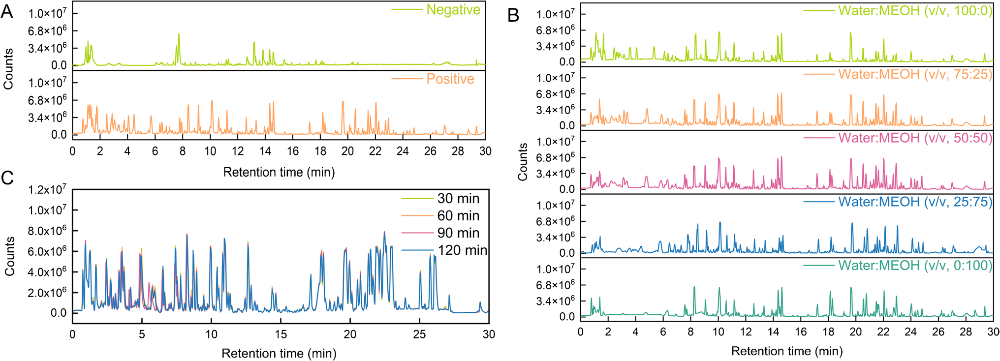
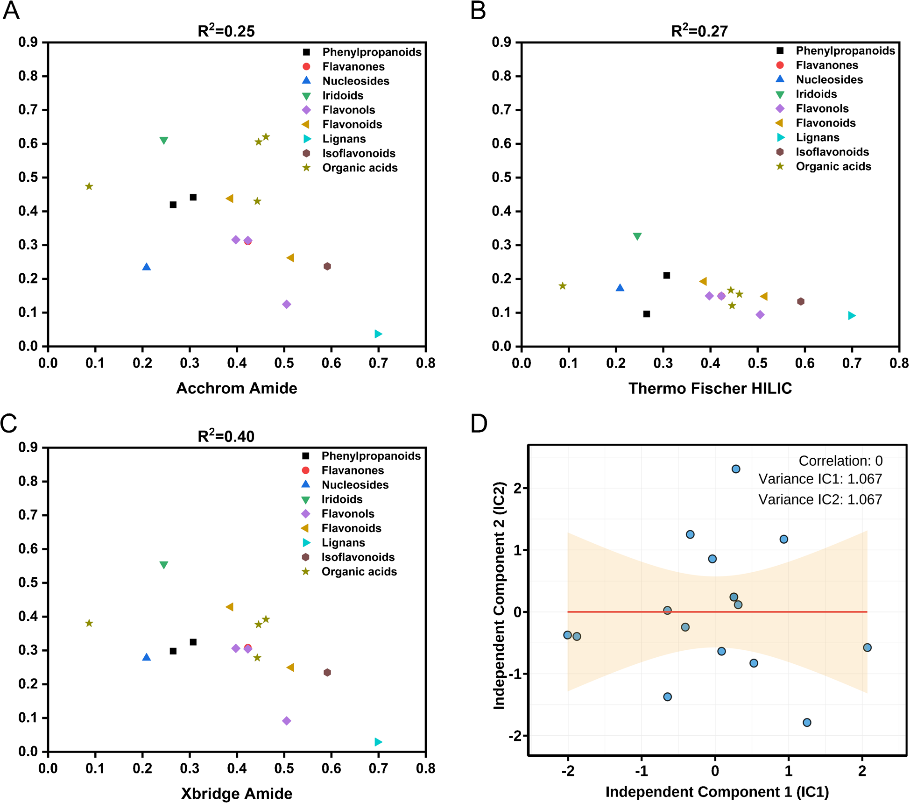
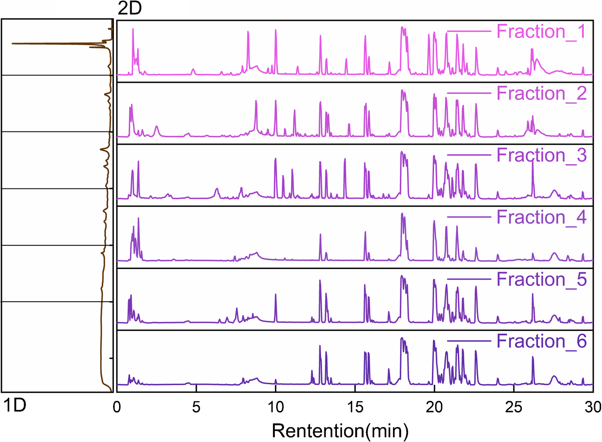
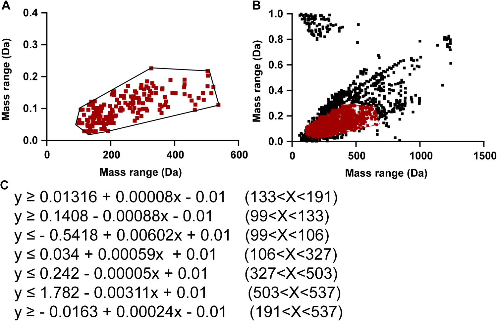
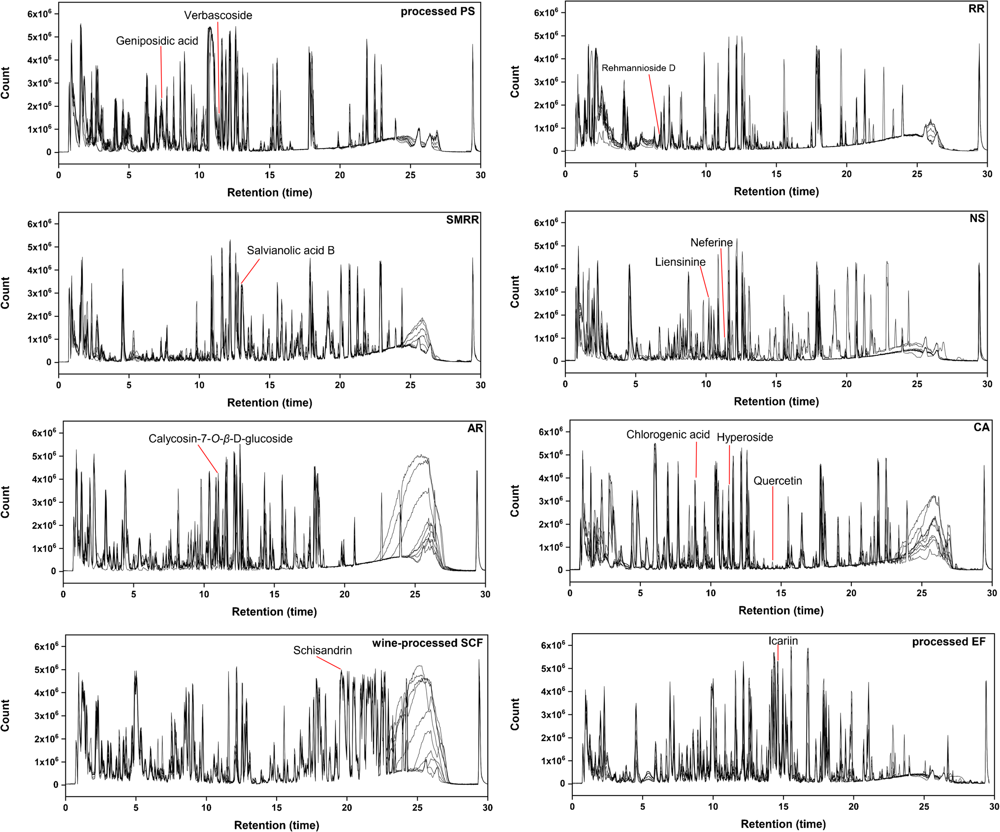
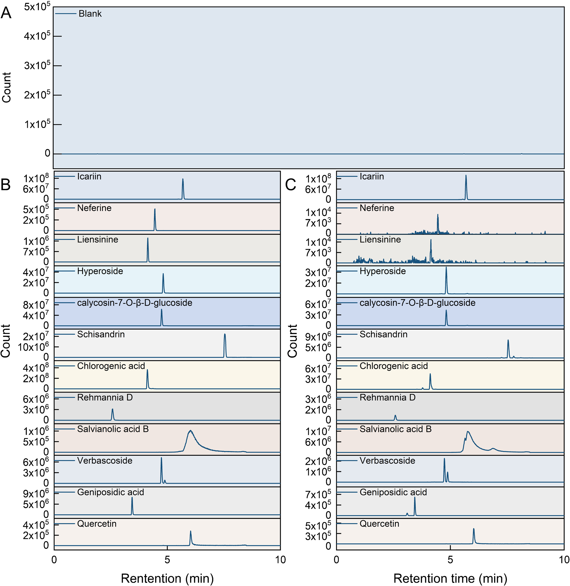

<!--
Gao J, Li J, Wang J, et al. Comprehensive chemical profiling and quality marker
discovery in Shenxiao granules via orthogonal HILIC×RP 2D-LC/MS and mass defect
filtering algorithm. Analytical and Bioanalytical Chemistry (2025) 417:6915-6931.
doi:10.1007/s00216-025-06180-9 の全訳密度日本語版（ネイティブ抽出テキストを基に再構成）。
図は削除済み重複版から復旧。
-->

> **補足（本サイトでの位置づけ）:** 腎消顆粒（シェンシャオ顆粒／Shenxiao granules, SXG）は糖尿病腎症（DN）に20年以上使われる天津の院内製剤で、菟絲子・五味子（酒製）・地黄・黄耆・淫羊藿（炮製）・蓮子・丹参・車前子の8生薬からなる。本研究（天津中医薬大学、Anal. Bioanal. Chem. 2025）は、当サイトが扱う「複雑TCM方剤の徹底的な化学プロファイリングとQ-marker発見」の到達点を示す論文。核心は3つの技術統合：(1) 極性幅が極端に広い8生薬を分けるための **オフライン直交HILIC×RP 二次元LC**（ピーク容量7161＝1次元の58倍）、(2) 構造既知成分の「質量欠損」を使って狙った化合物クラスだけ濃縮する **質量欠損フィルタ（MDF）** ＋MS-DIAL＋GNPS分子ネットワーク（260成分を注釈）、(3) 薬局方適合・腎保護薬理・共通指紋の3軸で選ぶ **3次元Q-marker枠組み**（12成分）。院内製剤ゆえ薬局方の公式規格がない方剤に、科学的な品質規格をゼロから設計する好例。**IF:** Anal. Bioanal. Chem. = 4.19（JCR2024・Q2）。

---

# 書誌情報

- **原題:** Comprehensive chemical profiling and quality marker discovery in Shenxiao granules via orthogonal HILIC×RP 2D-LC/MS and mass defect filtering algorithm
- **著者:** Jian Gao・Jia Li（共同筆頭）, Jinyan Wang, Yang Wang, Dake Yang, Zixin Zhang, Zhifei Fu, Fengchao Wang, Liming Wang（責任著者）, Shiwei Chai（責任著者）, Lifeng Han（責任著者）
- **所属:** 天津中医薬大学 組分中薬国家重点実験室／天津市中薬化学・分析重点実験室、天津中医薬大学第一附属医院 薬学部、現代中薬海河実験室
- **掲載誌:** Analytical and Bioanalytical Chemistry (2025) 417:6915–6931
- **DOI:** 10.1007/s00216-025-06180-9（2025年7月29日受付／9月12日改訂受付／10月4日受理／11月18日オンライン）
- **© The Author(s), Springer-Verlag GmbH DE part of Springer Nature 2025**

---

# 要旨（Abstract）

腎消顆粒（SXG）は中国で糖尿病腎症の治療に臨床使用される有効なTCMだが、複雑な多生薬組成と生物活性成分の広い極性範囲から品質管理に複数の課題がある。これに対し、**オフライン直交HILIC×RP 二次元液体クロマトグラフィー（理論ピーク容量7161）**・高分解能四重極飛行時間型質量分析（Q-TOF-MS）・**質量欠損フィルタリング（MDF）** ベースのデータ取得アルゴリズムを統合した新規で包括的な分析プラットフォームを開発した。この戦略により **260成分** を系統的に特性化（うち36を標準品で確認）し、SXGの史上最も包括的な化学プロファイルを構築した。さらに **薬局方適合・腎保護への薬理関連・共通指紋ピーク** を包含する3次元評価枠組みで **12の重要な品質マーカー（Q-marker）** を同定した。厳密なバリデーションで手法の頑健性を実証（精度RSD<5%、LOD 0.02〜6.56 ng/mL、回収率84〜119%）。確立した「多次元分離-計算注釈-階層的Q-markerスクリーニング」アプローチは、SXGの包括的化学プロファイリングとQ-marker発見を提供するだけでなく、複雑TCM方剤の品質標準化に優れた設計図を提供する。

---

# 序論

糖尿病腎症（DN）は糖尿病の重要な細小血管合併症で、世界の糖尿病患者の約40%が罹患する [1,2]。うち20〜30%が末期腎不全（ESRD）へ進行し [3]、DNは世界の腎不全の主要原因である。現行の薬物治療は主に血糖調節・高血圧管理・レニン-アンジオテンシン-アルドステロン系（RAAS）抑制に焦点を当てる。ACE阻害薬・ARBは腎障害を減らせるが、長期使用で高カリウム血症・腎機能急速低下など重篤な副作用を生じうる [4]。重要なのは、これら治療が糸球体硬化・間質線維化などの根本的病理過程に対処しないこと [5]。したがってDNの発症機序を変えうる新規多標的治療戦略の発見が急務である [6]。

TCMは全体観と多成分・多標的・多経路の相乗機序 [7] により、糸球体過剰濾過改善・酸化ストレス抑制・免疫微小環境調節に有意な利点を示す [8,9]。SXGは20年以上臨床応用される広く使われる院内製剤で、菟絲子（CS）・酒製五味子（wine-processed SCF）・地黄（RR）・黄耆（AR）・炮製淫羊藿（processed EF）・蓮子（NS）・丹参（SMRR）・炮製車前子（PS）の8生薬からなる。伝統的治療原則に基づき設計され、補腎・固精・活血・化瘀・清湿の相乗効果を発揮する。多生薬方剤の膨大な複雑さからSXG自体の包括的特性化は系統的に報告されてこなかったが、個々の構成生薬の薬理活性と化学成分は広く記録されている。例：黄耆はフラボノイド（カリコシン・ホルモノネチン）とサポニン（アストラガロシドIV）に富み抗炎症・抗酸化ストレス作用で知られる [10–12]。丹参はフェノール酸（サルビアノール酸B）とジテルペノイドキノン（タンシノンIIA）に富み腎微小循環改善・線維化改善で有名 [13]。地黄・車前子はイリドイド・フェネチルアルコール配糖体の供給源で免疫調節に寄与 [14,15]、五味子はリグナン（シザンドリン）を含み肝腎保護・抗酸化性をもつ [16]。SXGの推定治療効果はこれら多様な生物活性成分の相乗結果と考えられる。SXGはDNを効果的に治療できるが、極性プロファイルが著しく異なる多様な成分を含み [17,18]、品質管理が極めて困難である。

クロマト技術・分析法の進歩にもかかわらず、現行のTCM方剤の品質管理は依然として限られたマーカー化合物の定量に主に依存する。一部の方剤は多成分分析やクロマト指紋を採用するが、薬理関連・品質恒常性・製造頑健性を統合する系統的Q-marker枠組みを欠くことが多い [19,20]。この限界がTCM方剤の複雑で動的な化学プロファイルの包括的特性化を妨げ、再現性・バッチ間安定性・世界的受容に影響する。

従来の一次元液体クロマトグラフィー（1D-LC）はピーク容量が限られ（通常<1000）、TCM方剤の多数の活性成分（特に高極性・低存在量）を効果的に分離するのが難しい [21]。対照的に **二次元液体クロマトグラフィー（2D-LC）** は直交分離モード（HILIC×RPなど）を用いてピーク容量を大幅に高め（理論上 n1×n2 に到達）、複雑試料分析の強力なツールとなる [22,23]。HILIC×RP 2D-LCはこの直交分離機構により複雑多生薬方剤に必要な広い極性スペクトルの分解に有効だが、包括的特性化への完全実装には大幅な手法カスタマイズが必要。広い極性分布と複雑組成に対応する系統的最適化戦略の不在が鍵の課題である。さらに頑健な品質管理系には、最適化された多次元分離・高度な計算同定・規制適合/治療関連/クロマト代表性を統合する系統的Q-marker選定枠組みが必要である。

これらの課題に対し、本研究はSXGの品質管理に焦点を当て、多次元分離と計算支援同定を組み合わせた統合戦略を開発した。オフラインHILIC×RP 2D-LCとQ-TOF-MSを結合したシステムを確立し、**260成分**を系統的に同定。さらに薬局方適合・薬理関連・共通指紋ピークを統合した3次元Q-marker選定枠組みを開発し、**12の重要Q-marker**を同定した。

---

# 材料と方法

## 試薬・材料

全標準品は認証純度≥98%。標準品：L-アルギニン・L-グルタミン・D-ガラクトース・α-ゲンチオビオース・L-プロリン・L-ピログルタミン酸・D-リンゴ酸・オレアノール酸・アデニン・L-ヒスチジン・キヌレン酸・没食子酸・レーマンニオシドD・ゲニポシド酸・クロロゲン酸・ネオクロロゲン酸・ルチン・イソクエルシトリン・ハイペロシド・ベルバスコシド・trans-フェルラ酸・ロスマリン酸・アゼライン酸・シコニン・サルビアノール酸B・アストラガロシドA/B/C・ケルセチン・イカリイン・エキナコシド・カリコシン-7-O-β-D-グルコシド・ネフェリン・リエンシニン・シザンドリン・7-エトキシクマリン。中国食品薬品検定研究院・上海源葉・成都瑞芬から購入。

**9バッチのSXG** を天津市西青区中医医院から入手。原料生薬は安徽協和成製薬・安国普天和飲片から調達、天津中医薬大学の張麗娟教授が鑑定（ラテン名は補足表S1）。

## 標準・内標液の調製

12標準（クロロゲン酸・ゲニポシド酸・シザンドリン・カリコシン-7-O-β-D-グルコシド・ハイペロシド・イカリイン・ネフェリン・レーマンニオシドD・サルビアノール酸B・ベルバスコシド・ケルセチン・リエンシニン）を各1 mg/mLでメタノール調製、6濃度に段階希釈して検量線用に。内標（IS）**7-エトキシクマリン** を1 mg/mLメタノールで調製し50%メタノールで50 µg/mLに。ISはマトリックス効果・装置変動の補正用。7-エトキシクマリンは正負両イオンモードで安定なイオン化と予測可能な挙動、中程度の極性、保持時間7.90分（多くの分析種に近い）からISに選択。

## 試料調製

**定性用:** SXG粉末70 mgに超純水1 mLを加え室温30分浸漬、2分ボルテックス、40分超音波（500 W、40 kHz）、13,200×gで20分遠心、上清を0.22 µm膜濾過。

**指紋分析用（個別生薬）:** 8構成生薬を各5.0 g、超純水20 mLで30分浸漬・40分超音波抽出、冷却後に減量分を水で補い濾過、UHPLC-Q-TOF-MS指紋分析と成分起源帰属に。

**定量用:** 各9バッチのSXG粉末50.0 mgにIS作業液50 µL（7-エトキシクマリン50 µg/mL）と超純水4.95 mLを添加、上記手順で処理し上清5 µLをWaters XEVO TQS三連四重極MSに注入。

## 2D-LCシステムの構築

HILICとRPLCを組み合わせたオフライン2D-LCで直交分離を達成。

**第1次元（HILIC）:** Waters e2695 HPLC、Acchrom XAmideカラム（4.6×150 mm、3.5 µm）、25℃。移動相A＝10 mM酢酸アンモニウム水、B＝アセトニトリル、1.0 mL/min。グラジエント：0–5分95→90%B；5–10分90→82%B；10–20分82→67%B；20–29分67→50%B；29–30分50%B等度；30–31分50→95%B；31–40分95%B再平衡。254 nm検出。保持時間で溶出を5分間隔の6画分（Fr.1–Fr.6）に分割し広い極性範囲をカバー。カラム過負荷回避のため、SXG液（70 mg/mL）10 µLを20回並行注入し、同一保持窓の画分をプール・窒素乾固・50%メタノール200 µLで再溶解・濾過して第2次元へ。

**第2次元（RPLC）:** Agilent 1290 Infinity II UHPLC＋Agilent 6546 Q-TOF高分解能MS。Waters ACQUITY UPLC HSS T3カラム（2.1×100 mm、1.8 µm）、40℃。移動相A＝0.1%ギ酸水、B＝アセトニトリル。グラジエント：0–3分2%B；3–18分2→50%B；18–24分50→85%B；24–26分85→100%B；26–28分100%B等度；28–28.5分100→5%B；28.5–30分5%B再平衡。0.3 mL/min、注入3 µL。ESI正負切替、ガス温350℃・乾燥ガス11 L/min・ネブライザー40 psi・シースガス400℃/11 L/min・キャピラリー±3.5 kV・フラグメンター110 V。CIDは段階エネルギー（10/20/30 V）、走査範囲 m/z 50–1250、auto MS/MS。

## 質量欠損フィルタリング（MDF）解析

段階的戦略でSXG成分を同定。**第1段階:** MS-DIAL（v4.9.221218）＋植物化学DB（ReSpect・MassBank）で予備同定。注釈は精密質量（誤差<5 ppm）とMS/MSスペクトル類似度（>80%）に基づく。同定成分でプロトタイプライブラリを構築。**第2段階:** プロトタイプ成分の質量欠損値 **[(精密質量−公称質量)×10⁶]** を用い、20 mDa許容の多角形MDF窓を生成。フラボノイド・有機酸など構造関連クラスを濃縮。**第3段階:** 精製した第2次元LC-MSデータをMS-DIALで包括的同定（最小ピーク高3000・質量精度0.1 Da・デコンボリューションσ窓0.5・MS1許容0.01 Da・MS2許容0.05 Da・同定スコア>80%）。並行してGNPS分子ネットワーク（前駆イオン許容±0.02 Da・断片0.2 Da・共有断片2つ以上）。MDF誘導＋ネットワークで構造注釈カバレッジを高め微量成分発見を促進。

## 定量分析（UPLC-MS/MS）

MRMモードのWaters ACQUITY H-Class UPLC＋Waters Xevo TQ-S三連四重極MS。Waters ACQUITY Premier HSS T3カラム（2.1×100 mm、1.8 µm）、30℃。移動相A＝0.1%ギ酸水、B＝アセトニトリル。グラジエント：0–1.5分5%B；1.5–5.5分→50%B；5.5–7.5分→95%B；7.5–8.0分95%B；8.0–9.5分→5%B；9.5–10.0分5%B。0.3 mL/min、注入5 µL。ESI正負切替、キャピラリー±3.5 kV・コーン69 V・脱溶媒500℃・脱溶媒ガス（窒素）1000 L/h。各分析種のコーン電圧・衝突エネルギーは個別最適化（**表1**）。ICH準拠でバリデーション（検量線はピーク面積比〔分析種/IS〕対濃度比、6水準、LOD/LOQはS/N=3/10）。

**表1. UPLC-MS/MS（MRM）パラメータ（12 Q-marker＋IS）**

| 分析種 | RT(分) | プリカーサー(m/z) | プロダクト(m/z) | CE(V) | モード |
|---|---|---|---|---|---|
| レーマンニオシドD | 2.43 | 730.81 | 262.93 | 24 | [M+H]⁺ |
| クロロゲン酸 | 4.13 | 354.94 | 162.97 | 10 | [M+H]⁺ |
| リエンシニン | 4.15 | 611.70 | 206.20 | 28 | [M−H]⁻ |
| ネフェリン | 4.46 | 625.40 | 206.00 | 32 | [M+H]⁺ |
| ベルバスコシド | 4.75 | 623.10 | 161.12 | 40 | [M−H]⁻ |
| カリコシン-7-O-β-D-グルコシド | 4.76 | 446.90 | 284.92 | 14 | [M+H]⁺ |
| ハイペロシド | 4.83 | 464.68 | 302.88 | 10 | [M+H]⁺ |
| イカリイン | 5.70 | 677.01 | 530.84 | 14 | [M+H]⁺ |
| ケルセチン | 6.04 | 300.88 | 151.07 | 22 | [M−H]⁻ |
| サルビアノール酸B | 6.20 | 717.05 | 519.14 | 18 | [M−H]⁻ |
| シザンドリン | 7.54 | 432.93 | 383.93 | 20 | [M+H]⁺ |
| ゲニポシド酸 | 7.64 | 376.05 | 57.13 | 42 | [M+H]⁺ |
| 7-エトキシクマリン(IS) | 7.90 | 191.09 | 163.13 | 12 | [M+H]⁺ |

---

# 結果と考察

## 抽出・条件・直交固定相の最適化

**抽出溶媒・時間:** 正負イオンモードのベースピーククロマト（BPC）を比較（図1A）、正イオンモードが検出フィーチャー数・信号強度・化学カバレッジで優れ、以降は正モードで最適化。5溶媒（水・25/50/75%メタノール・純メタノール）を比較（図1B）、**水抽出**が最広の化学カバレッジ・明瞭なピーク・最小の信号抑制を示し、他溶媒比で分解ピークが15.9%増（図S1）。糖・アミノ酸・配糖体など親水成分の抽出に優れ、非極性不純物の共抽出も最小化。超音波時間30/60/90/120分を比較（図1C）、**30分**で抽出平衡に達し延長の利益なし。最終条件＝超純水で30分超音波抽出。

**直交固定相の選択:** 第2次元RP候補（HSS T3・CSH C18・BEH C18）を比較し、**HSS T3** がシャープで対称なピーク・最多フィーチャー（特に18–26分の溶出窓）で優れ第2次元に選択。第1次元は極性分離を優先しRPとの直交性を確保。3 HILIC（BEH Amide・XBridge Amide・Acchrom XAmide）を16代表成分で評価、各HILICとHSS T3の相対保持時間の線形回帰で、**Acchrom XAmide** がRPと最弱の相関（**R²=0.25**）＝最高の相補的選択性。よって Acchrom XAmide（1D）＋HSS T3（2D）の直交ペアを選択。

**1D HILIC条件:** 3水系移動相（超純水・0.1%ギ酸・10 mM酢酸アンモニウム）を比較、**酢酸アンモニウム**が最良のピーク形状・感度（図S4）。カラム温度25/35/45℃で**25℃**がピーク幅最小・最良分解能（図S5）。

**2D RPLC条件:** 3移動相系（アセトニトリル-水／0.1%酢酸／0.1%ギ酸）で**0.1%ギ酸**が最良（図S6–S7）。ギ酸濃度0.05/0.1/0.2%で**0.1%**が最適（図S8–S9）。温度20/30/40℃で**40℃**が18–26分窓の分解能最大（図S10–S11）。

## 直交性とピーク容量の評価

2次元間の独立性を線形回帰とICA（独立成分分析）で評価。16代表分析種の相対保持時間（表S3・S4）で、Acchrom XAmide-HSS T3間の**R²=0.25**（低相関＝高直交性）。ICAで相対保持時間行列を2つの統計的独立成分（IC）に分解、Pearson相関係数**ゼロ**（図2D）で完全独立を確認。IC分散分布が均衡し両次元が独自・非冗長な情報に寄与。理論ピーク容量は次式で算出：

$$n_{grd} = t_G / W_b \tag{1}$$

$$n_{2D} = n^1_{grd} \times n^2_{grd} \tag{2}$$

tGは有効グラジエント時間、Wbは平均ベースラインピーク幅。平均ピーク幅は0.51分（HILIC）・0.23分（RPLC）、グラジエント30分・28分で、ピーク容量 **59（1D）・122（2D）、理論2Dピーク容量7161**。従来1D-LC比 **58倍** の分離能で、SXGの化学的多様な成分の分解能力を大幅に向上。

## Q-TOF-MSパラメータ最適化

11代表成分（サルビアノール酸B〔有機酸〕・ケルセチン〔フラボノイド〕・ゲニポシド酸〔イリドイド配糖体〕・イカリイン・アデノシン〔ヌクレオシド〕・クロロゲン酸〔フェニルプロパノイド〕・カリコシン-7-O-β-D-グルコシド〔イソフラボノイド〕・シザンドリン〔リグナン〕・リエンシニン/ネフェリン〔アルカロイド〕・ギンコリド〔テルペン〕）をモデルに、AJS-ESI源パラメータを最適化。**キャピラリー3.5 kV**（図S12）、**ネブライザー温350℃**（図S13）、**シースガス400℃**（図S14）。MS2は段階衝突エネルギー（10/20/30 V、図S15）：10 Vで分子イオン優勢、20 Vで部分断片化、30 Vで豊富な診断的プロダクトイオン。前駆イオン保持と断片多様性の最適バランスを達成。

## バリデーション（2D-LC/Q-TOF-MS）

第1次元HPLC-UV：5代表分析種で日内・日間RSDともに<5%（優れた短期再現性・長期安定性）。第2次元UHPLC-Q-TOF-MS：日内精度1.80–3.84%、日間RSD 2.16–4.16%（一貫した信頼できる性能）。

## 260成分の包括的特性評価

最適化2D-LC/Q-TOF-MS＋MDF戦略でSXGを系統的にプロファイリング。試料を第1次元HILICで6画分に分画し、各画分を第2次元RPLC-Q-TOF-MSで定性分析（図3）。

プロトタイプ成分の質量欠損特性に基づく区分線形MDFモデル（質量範囲99–537 Da、図4A）を構築。MDF適用で規定化学空間内の信号を有意に濃縮し、背景ノイズ・非標的干渉を約**89%**削減（図4B）。モデルは7つの区分線形不等式（図4C）＋動的質量許容±0.01 Daで選択性と高スループットを両立。MDF＋直交2D分離で低存在量成分のS/Nを高め、高存在量成分によるイオン抑制を軽減し、注釈の深さと精度を大幅改善。

MDF最適化MSデータをMS-DIALでピーク抽出・MS/MSマッチング、GNPS分子ネットワークで構造クラスタリング・相補注釈。**計260成分を注釈**。MS-DIALが250成分同定（135は高品質MS/MS類似度で暫定注釈〔前駆イオン誤差<5 ppm・診断断片2つ以上〕、うち36を標準品で確認）。115フィーチャーは既存ライブラリに確信的マッチせずMDF窓内（Δm/z≤0.01 Da）で新規・生物活性化合物の可能性。GNPSは38成分注釈（28がMS-DIALと重複、10がGNPS独自）。両プラットフォーム統合で注釈カバレッジを大幅改善（特に低存在量・構造多様成分）。詳細は補足表S9、GNPSネットワークは図S16。

主要成分の開裂経路を解明（信頼性の高い同定に重要）。**カリコシン-7-O-β-D-グルコシド（成分207、tR 11.20分）**：[M+H]⁺ m/z 447.12950、MS2で m/z 285.07724 [M+H-Glu]⁺。**サルビアノール酸B（成分224、tR 13.13分）**：[M-H]⁻ m/z 717.14247、MS2で 519.09174・493.11402・321.03913・295.05994。**イカリイン（成分243、tR 14.62分）**：[M+H]⁺ m/z 677.24342、MS2で 531.18615 [M+H-Glu]⁺・369.13326 [M+H-2Glu]⁺・313.07066。**シザンドリン（成分256、tR 19.33分）**：[M+H]⁺ m/z 433.22208、MS2で 415.21262 [M+H-H₂O]⁺ 等の一連の断片。いずれも標準品で確認。

## 指紋分析によるQ-markerスクリーニング

SXGは薬局方に公式品質評価基準がない院内製剤のため、各構成生薬の特性指紋と腎症治療に有効と報告される生物活性成分に基づき、標的的で科学的根拠のある品質管理系を確立（図5）。提案Q-markerは、原料のバッチ間恒常性を保証する **薬局方指定成分**、腎保護効果が実証された **文献支持の生物活性成分**、バッチ間で共有される **共通指紋ピーク** を包含する。

**薬局方Q-marker（7成分）:** 菟絲子のクロロゲン酸（抗炎症・抗酸化・免疫調節で腎間質線維化を改善 [24–26]）、酒製五味子のシザンドリン（酸化ストレス緩和・アポトーシス抑制で尿細管機能保護 [27]）、地黄のレーマンニオシドD（水電解質代謝調節 [28]）、黄耆のカリコシン-7-O-β-D-グルコシド（腎線維化シグナル抑制 [29,30]）、炮製淫羊藿のイカリイン（抗炎症・抗腎線維化 [31,32]）、丹参のサルビアノール酸B（腎間質線維化抑制 [33]・血管内皮保護 [34]）、車前子のゲニポシド酸（アクアポリン調節・利尿・抗炎症 [35]）。**追加5成分:** 菟絲子のケルセチン・ハイペロシド（メサンギウム増殖抑制 [36,37]・糸球体炎症緩和 [38,39]）、蓮子のリエンシニン・ネフェリン、車前子のベルバスコシド（抗線維化 [40]・腎保護 [41,42]）。選定は3原則（原料の品質可制御性・薬理関連活性物質・多成分の相乗効果）を厳守。

## 12 Q-markerの定量

最適化条件下で12 Q-markerとISがベースライン分離、干渉なし（図6：空溶媒・混合標準・試料の比較）。直線性は広い濃度範囲でR²>0.999、LOD 0.02–6.59 ng/mL、LOQ 0.07–21.9 ng/mL。日内・日間RSD<5%、正確性誤差<5%、安定性RSD<4%。回収率は **84.73–119.09%**（RSD 0.93–4.66%）。9バッチの定量結果（**表2**）で、大半の主要成分（クロロゲン酸・ゲニポシド酸・カリコシン-7-O-β-D-グルコシド・ハイペロシド・イカリイン・ネフェリン・レーマンニオシドD・ベルバスコシド・ケルセチン・リエンシニン）はバッチ間で比較的一定（原料・製造の有効な管理を示唆）。しかし **サルビアノール酸Bは顕著なバッチ間変動**（丹参の産地・収穫条件・バッチ固有の抽出効率の差に起因しうる）。

**表2. 9バッチのSXG中12 Q-markerの定量（µg/10 mg、n=3、代表バッチ抜粋）**

| バッチ | クロロゲン酸 | ゲニポシド酸 | シザンドリン | カリコシン配糖体 | ハイペロシド | イカリイン | サルビアノール酸B |
|---|---|---|---|---|---|---|---|
| 231201 | 0.096 | 0.088 | 0.971 | 1.111 | 1.372 | 6.755 | **14.793** |
| 230202 | 0.110 | 0.088 | 1.264 | 1.156 | 1.435 | 6.921 | 11.925 |
| 230802 | 0.109 | 0.084 | 1.116 | 1.147 | 1.418 | 6.846 | 8.157 |
| 231203 | 0.104 | 0.081 | 0.923 | 1.094 | 1.331 | 6.333 | 5.085 |
| 230201 | 0.102 | 0.073 | 0.666 | 1.090 | 1.345 | 5.453 | **2.926** |

（全9バッチ・全12成分は原文表2参照。サルビアノール酸Bは2.93〜14.79 µg/10 mgと最大約5倍変動する一方、イカリイン〔約6.0〜6.9〕やカリコシン配糖体〔約1.0〜1.16〕は安定。）

---

# 結論

本研究は、直交HILIC×RP分離・区分線形MDFスクリーニング・3次元Q-marker同定の統合戦略に基づくSXGの三位一体品質評価枠組みを確立した。このプラットフォームは包括的化学プロファイリングを可能にし、薬局方関連性と実験的に検証された腎保護活性を併せもつ12の重要Q-markerを同定。直交2D（R²=0.25）＋計算誘導MDFで微量成分の検出感度・分解能を大幅改善し、理論ピーク容量7161を達成。この分析パラダイムはTCM方剤の化学的複雑性と曖昧な品質属性という長年の課題に頑健で移転可能な解を提供する。今後は親油性・低存在量成分のカバレッジ拡大、Q-markerの薬力学的検証強化、製造工程最適化（QbD原則・スペクトル-効果相関）によるバッチ間変動低減が、SXGの標準化生産・品質保証・世界的展開を支える。

---

# 訳者補足

- **なぜ2次元LCが要るか:** SXGは8生薬で、糖・アミノ酸（超親水性）からリグナン・テルペン（親油性）まで極性が桁違いに幅広い。1次元RPカラムだけでは親水成分が全部溶出口付近に固まって分離できない。そこで **HILIC（親水性で保持）→ RP（疎水性で保持）** を直交に組み合わせ、ピーク容量を59×122≈7161（理論上58倍）に拡張する。直交性の指標が R²=0.25（低いほど良い＝2軸が別の情報を見ている）。
- **MDF（質量欠損フィルタ）とは:** 元素組成が似た化合物は「精密質量の小数部（質量欠損）」が近い値に固まる。既知成分の質量欠損を基準に窓を作り、そこから外れる夾雑シグナルを捨てると、フラボノイドや有機酸など狙ったクラスだけ濃縮できる（ノイズ89%減）。MS-DIAL（ライブラリ照合）＋GNPS（分子ネットワークで構造類似をクラスタ化）と組み合わせ260成分を注釈。
- **3次元Q-marker枠組み:** ①薬局方適合（原料の恒常性）②薬理関連（腎保護のエビデンス）③共通指紋ピーク（クロマト代表性）の3軸で12成分を選ぶ。院内製剤で公式規格がない方剤に、この3軸で「守るべき成分」を科学的に決めるのが要点。当サイトの他のQ-marker論文（鵝不食草・三黄瀉心湯）と同じ思想。
- **実務上の要注意点:** サルビアノール酸B（丹参のフェノール酸）が2.9〜14.8 µg/10 mgと約5倍もばらつく。丹参の産地・収穫期・アルコール沈殿濃度・乾燥法でフェノール酸が沈殿/分解しやすいため。ここがSXGの品質管理の弱点で、原料・工程の標準化が課題と本論文は指摘する。
- **数値の扱い:** 図S1–S17と補足表S1–S11は原文参照。図1–6は削除済み重複版から復旧して統合した。表1・2は主要値を転記、全バッチ・全成分は原文表参照。原文にない数値は加えていない。

## 参考文献

1. Ahmad J. Management of diabetic nephropathy: recent progress and future perspective. Diabetes Metab Syndr. 2015;9:343–58.

2. Li J, Guo K, Qiu J, Xue S, Pi L, Li X, et al. Epidemiological status, development trends, and risk factors of disability-adjusted life years due to diabetic kidney disease: a systematic analysis of global burden of disease study 2021. Chin Med J. 2025;138:568–78.

3. Merid F, Getahun F, Esubalew H, Gezahegn T. Incidence and predictors of diabetic nephropathy among type 2 diabetes mellitus patients, southern Ethiopia. J Nutr Metab. 2024;1:6976870.

4. Palmer BF. Managing hyperkalemia caused by inhibitors of the renin–angiotensin–aldosterone system. N Engl J Med. 2004;351:585–92.

5. Shen Y, Miao N, Xu J, Gan X, Xu D, Zhou L, et al. N-acetylcysteine alleviates angiotensin II-mediated renal fibrosis in mouse obstructed kidneys. Acta Pharmacol Sin. 2016;37:637–44.

6. Hu L, Yu L, Cao Z, Wang Y, Zhu C, Li Y, et al. Integrating transcriptomics, metabolomics, and network pharmacology to investigate multi-target effects of sporoderm-broken spores of Ganoderma lucidum on improving HFD-induced diabetic nephropathy rats. J Pharm Anal. 2024;14:101105.

7. Huang M, Yu S, Shao Q, Liu H, Wang Y, Chen H, et al. Comprehensive profiling of Lingzhihuang capsule by liquid chromatography coupled with mass spectrometry-based molecular networking and target prediction. Acupunct Herbal Med. 2022;2:58–67.

8. Zhang GB, Li QY, Chen QL, Su SB. Network pharmacology: a new approach for Chinese herbal medicine research. Evid-Based Compl Alt. 2013;1:621423.

9. Qin T, Wu L, Hua Q, Song Z, Pan Y, Liu T. Prediction of the mechanisms of action of Shenkang in chronic kidney disease: a network pharmacology study and experimental validation. J Ethnopharmacol. 2020;246:112128.

10. Zhang N, Guan C, Liu ZY, Li C, Yang C, Xu L, et al. Calycosin attenuates renal ischemia/reperfusion injury by suppressing NF-κB mediated inflammation via PPARγ/EGR1 pathway. Front Pharmacol. 2022;13:828061.

11. Yu L, Zhang YY, Chen Q-Q, He Y, Zhou HF, Wan HT, et al. Formononetin protects against inflammation associated with cerebral ischemia-reperfusion injury in rats by targeting the JAK2/STAT3 signaling pathway. Biomed Pharmacother. 2022;149:112836.

12. Liang YT, Chen BQ, Liang D, Quan XX, Gu RL, Meng ZY, et al. Pharmacological effects of astragaloside IV: a review. Molecules. 2023;28(16):6118.

13. Hsu YC, Shih YH, Ho C, Liu CC, Liaw CC, Lin HY, et al. Ethyl acetate fractions of Salvia miltiorrhiza Bunge (Danshen) crude extract modulate fibrotic signals to ameliorate diabetic kidney injury. Int J Mol Sci. 2024;25(16):8986.

14. Huang Y, Jiang CM, Hu YL, Zhao XJ, Shi C, Yu Y, et al. Immunoenhancement effect of rehmannia glutinosa polysaccharide on lymphocyte proliferation and dendritic cell. Carbohydr Polym. 2013;96(2):516–21.

15. Lan JP, Xue YF, Pu JY, Ding Y, Gan ZY, Yang YB, et al. Plantaginis semen ameliorates diabetic kidney disease via targeting the sphingosine kinase 1/sphingosine-1-phosphate pathway. J Ethnopharmacol. 2024;331:118221.

16. Ehambarampillai D, Wan MLY. A comprehensive review of Schisandra chinensis lignans: pharmacokinetics, pharmacological mechanisms, and future prospects in disease prevention and treatment. Chin Med. 2025;20(1):47.

17. Li Y, Lin Z, Wang Y, Ju S, Wu H, Jin H, et al. Unraveling the mystery of efficacy in Chinese medicine formula: new approaches and technologies for research on pharmacodynamic substances. Arab J Chem. 2022;15:104302.

18. Liu Y, Li X, Chen C, Ding N, Ma S, Yang M. Exploration of compatibility rules and discovery of active ingredients in TCM formulas by network pharmacology. Chin Herbal Med. 2024;16:572–88.

19. Dou M, Huang J, Yu M, Li H, Song Y, Peng Z, et al. HPLC combined with chemometrics for quality control of huamoyan granules or capsules. Chin Herb Med. 2024;16:449–56.

20. Yan M, Zhang Z, Liu Y. Difference analysis of different parts of chicory based on HPLC fingerprint and multi-component content determination. Chin Herb Med. 2022;14:317–23.

21. Abdulhussain N, Nawada S, Schoenmakers P. Latest trends on the future of three-dimensional separations in chromatography. Chem Rev. 2022;121:12016–34.

22. Barros de Souza A, Ali I, van de Goor T, Dewil R, Cabooter D. Comprehensive two-dimensional liquid chromatography with high resolution mass spectrometry to investigate the photoelectrochemical degradation of environmentally relevant pharmaceuticals and their degradation products in water. J Environ Manage. 2024;351:120023.

23. Wang Y, Zhou L, Chen T, You L, Shi X, Liu X, et al. Screening strategy for 1210 exogenous chemicals in serum by two-dimensional liquid chromatography-mass spectrometry. Environ Pollut. 2023;331:121914.

24. Arfian N, Wahyudi DAP, Zulfatina IB, Citta AN, Anggorowati N, Multazam A, et al. Chlorogenic acid attenuates kidney ischemic/reperfusion injury via reducing inflammation, tubular injury, and myofibroblast formation. BioMed Res Int. 2019;2019:5423703.

25. Jiao H, Zhang M, Xu W, Pan T, Luan J, Zhao Y, et al. Chlorogenic acid alleviates kidney fibrosis through regulating TLR4/NF-κB mediated oxidative stress and inflammation. J Ethnopharmacol. 2024;335:118693.

26. Zhou X, Zhang B, Zhao X, Lin Y, Zhuang Y, Guo J, et al. Chlorogenic acid prevents hyperuricemia nephropathy via regulating TMAO-related gut microbes and inhibiting the PI3K/AKT/mTOR pathway. J Agric Food Chem. 2022;70:10182–93.

27. Wang P, Lan Q, Huang Q, Zhang R, Zhang S, Yang L, et al. Schisandrin A attenuates diabetic nephropathy via EGFR/AKT/GSK3β signaling pathway based on network pharmacology and experimental validation. Biology. 2024;13:597.

28. Zhou T, Tian N, Li L, Yu R. Iridoids modulate inflammation in diabetic kidney disease: a review. J Integr Med. 2023;22(3):210–22.

29. Gong F, Qu R, Li Y, Lv Y, Dai J. Astragalus mongholicus: a review of its anti-fibrosis properties. Front Pharmacol. 2022;13:976561.

30. Elsherbiny NM, Said E, Atef H, Zaitone SA. Renoprotective effect of calycosin in high fat diet-fed/STZ injected rats: effect on IL-33/ST2 signaling, oxidative stress and fibrosis suppression. Chem-Biol Interact. 2020;315:108897.

31. Qi M, He Y, Cheng Y, Fang Q, Ma R, Zhou S, et al. Icariin ameliorates streptozocin-induced diabetic nephropathy through suppressing the TLR4/NF-κB signal pathway. Food Funct. 2021;12:1241–51.

32. Yao W, Tao R, Xu Y, Chen ZS, Ding X, Wan L. AR/RKIP pathway mediates the inhibitory effects of icariin on renal fibrosis and endothelial-to-mesenchymal transition in type 2 diabetic nephropathy. J Ethnopharmacol. 2024;320:117414.

33. Cao W, Guo X, Zheng H, Li D, Jia G, Wang J. Current progress of research on pharmacologic actions of salvianolic acid B. Chin J Integr Med. 2012;18:316–20.

34. Zhang ZY, Miao LF, Qian LL, Wang N, Qi MM, Zhang YM, et al. Molecular mechanisms of glucose fluctuations on diabetic complications. Front Endocrinol. 2019;10:640.

35. Titko T, Perekhoda L, Drapak I, Tsapko Y. Modern trends in diuretics development. Eur J Med Chem. 2020;208:112855.

36. Liu X, Sun N, Mo N, Lu S, Song E, Ren C, et al. Quercetin inhibits kidney fibrosis and the epithelial to mesenchymal transition of the renal tubular system involving suppression of the sonic hedgehog signaling pathway. Food Funct. 2019;10:3782–97.

37. Liu J, Zhang Y, Sheng H, Liang C, Liu H, Moran Guerrero JA, et al. Hyperoside suppresses renal inflammation by regulating macrophage polarization in mice with type 2 diabetes mellitus. Heliyon. 2023;476:e16849.

38. Lu H, Wu L, Liu L, Ruan Q, Zhang X, Hong W, et al. Quercetin ameliorates kidney injury and fibrosis by modulating M1/M2 macrophage polarization. Biochem Pharmacol. 2018;154:203–12.

39. Zhang K, Li M, Yin, Wang M, Dong Q, Miao Z, Guan Y, Wu Q, Zhou Y. Hyperoside mediates protection from diabetes kidney disease by regulating ROS-ERK signaling pathway and pyroptosis. Phytother Res. 2023;37:5871–5882.

40. Ren HL, Zhang JH, Xiao JH. Benzylisoquinoline alkaloids inhibit lung fibroblast activation mainly via inhibiting TGF-β1/Smads and ERK1/2 pathway proteins. Heliyon. 2023;9:e16849.

41. Zhao Y, Song JY, Feng R, Hu JC, Xu H, Ye ML, et al. Renal health through medicine–food homology: a comprehensive review of botanical micronutrients and their mechanisms. Nutrients. 2024;16:3530.

42. Li X, Liu Z, He Z, Wang X, Li R, Wang J, et al. Acteoside protects podocyte against apoptosis through regulating AKT/GSK-3β signaling pathway in db/db mice. BMC Endocr Disord. 2023;23:230.

43. Li MH, Chen JM, Peng Y, Wu Q, Xiao PG. Investigation of Danshen and related medicinal plants in China. J Ethnopharmacol. 2008;120:419–26.

44. Kum KY, Kirchhof R, Luick R, Heinrich M. Danshen (Salvia miltiorrhiza) on the global market: what are the implications for products' quality? Front Pharmacol. 2021;12:621169.

45. Tai Y, Shen J, Luo Y, Qu H, Gong X. Research progress on the ethanol precipitation process of traditional Chinese medicine. Chin Med. 2022;15:84.

