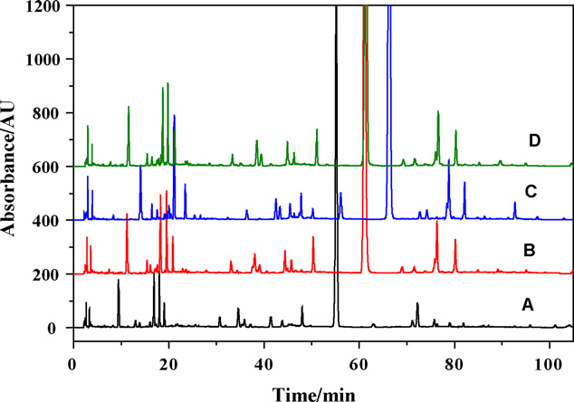
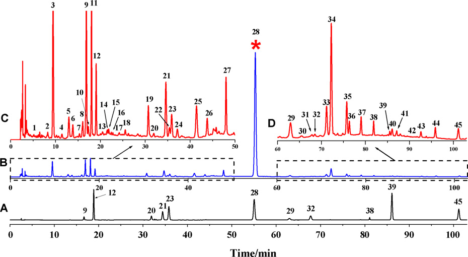
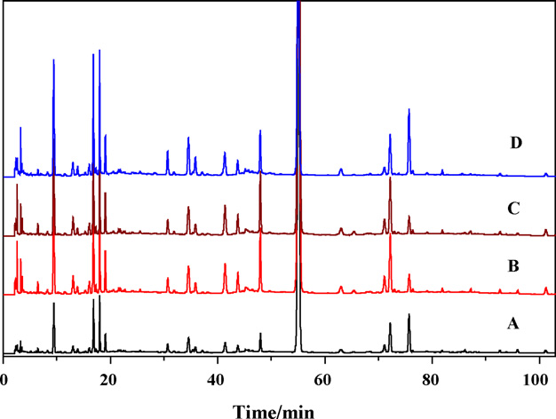

<!-- 方針: ほぼ全訳＋必要に応じた補足。原文構成に沿って訳出。「> 補足:」は訳者注。 -->

## 書誌情報

- 原題: Development of a novel method combining HPLC fingerprint and multi-ingredients quantitative analysis for quality evaluation of traditional chinese medicine preparation
- 著者: Dong-Zhi Yang, Yi-Qiang An, Xiang-Lan Jiang, Dao-Quan Tang（責任著者）, Yuan-Yuan Gao, Hong-Tao Zhao, Xiao-Wen Wu（徐州医学院 薬物分析学教室ほか, 中国江蘇省徐州）
- 掲載: *Talanta* 85 (2011) 885–890. https://doi.org/10.1016/j.talanta.2011.04.059
- インパクトファクター: **6.1**（*Talanta*, JCR 2024 / Clarivate, Q1。分析化学分野の代表的国際誌）
- 受領 2011-01-25 / 改訂 2011-04-12 / 採録 2011-04-21 / オンライン公開 2011-05-19

> 補足: 双黄連口服液（Shuang-huang-lian oral liquid, SHL）は、**金銀花（Flos Lonicerae／忍冬の花）・黄芩（Radix Scutellariae）・連翹（Fructus Forsythiae）**の3生薬からなる中国の伝統処方で、急性上気道感染・急性気管支炎・肺炎などに用いられる。本論文は 2011 年の研究で、化学指紋（フィンガープリント）と多成分同時定量を初めて組み合わせて SHL 口服液の品質を評価した報告。

## 要旨

高速液体クロマトグラフィー（HPLC）の指紋分析と、複数の活性成分の同時定量を組み合わせた新しい品質評価法を、伝統中薬製剤の一つである「双黄連口服液（SHL）」について開発・バリデーションした。指紋分析では、複数の製造業者から収集した SHL 口服液の製品間の類似度を評価するため、**45 本のピークを共通ピーク**として選定した。加えて、**クロロゲン酸・カフェ酸・ルチン・フォルシチアシド・スクテラリン・バイカリン・フォルシチン・ルテオロシド・アピゲニン・バイカレイン・ウォゴニンの 11 成分**の同時定量を行った。得られたデータの統計解析により、本法が望ましい直線性・精度・正確性を達成していることを示した。最後に、中国の異なる製造業者が製造した SHL 口服液中のこれら 11 成分の濃度を測定した。これらの結果は、HPLC クロマト指紋と多成分の同時定量の組み合わせが、SHL 口服液製剤の品質評価に有効かつ信頼できるアプローチであることを示している。

## 1. 序論

双黄連（SHL）は中国の伝統処方であり、その製剤は**金銀花（Flos Lonicerae）・黄芩（Radix Scutellariae）・連翹（Fructus Forsythiae）**の3生薬を含む。SHL 製剤は各種の剤形で、急性上気道感染・急性気管支炎・肺炎の治療に一般的に用いられる。とりわけ SHL 口服液は有効な臨床治療薬として広く使われてきた。これら3生薬に関する従来の研究では、フェニルプロパノイド類とフラボノイド類の存在が明らかにされており、これらの成分が SHL 製剤の主要な生理活性成分と考えられている。しかし、栽培地域や気候条件などの様々な要因により、これらの成分量は SHL 口服液製剤ごとに大きく変動しうる。したがって、品質評価のための包括的かつ体系的な品質基準が不可欠である。実際、SHL 製剤に関する研究は過去にも報告されており、中国薬典（Ch. P）にも SHL 口服液の品質評価法が収載されている。

しかし、伝統中薬（TCM）の品質管理は通常、単一成分あるいはごく限られた成分にしか着目していない。合成医薬品とは異なり、生薬とその製剤は一般に複数の活性成分と、それらが作用する多標的の相乗効果を通じて治療効果を発揮することはよく知られている。私たちは、SHL 口服液のより有効かつ信頼できる品質管理法は、単一成分やごく一部の活性種ではなく、主要な活性成分のセットの定量を含むべきだと考えている。本研究はこの目標のために着手された。

さらに私たちは、生薬の理想的な化学的品質管理法は次の二つの側面から構成されるべきだと提案する。一つは複数の主要成分の定性・定量分析であり、もう一つは化学指紋の分析である。化学指紋は、世界保健機関（WHO）、中国国家食品薬品監督管理局（SFDA, 2000）その他の当局によって、生薬の品質評価戦略として導入・採用されてきた。従来の分析手法と比較して、指紋技術は複雑系を定量的な信頼性を伴って総合的に特徴づける点を重視する。この手法により、複雑な構成成分をもつ特定の生薬製剤を、他の近縁種と識別・区別できる。生薬試料を同定・品質管理する新しいアプローチとして、クロマト指紋技術は生薬製剤の品質評価に最も合理的で強力な手法の一つとみなされている。とりわけ HPLC 指紋は、高い分離効率と高い検出感度により、近年広く受け入れられ注目を集めている。

クロマト指紋は TCM 中の全成分を俯瞰でき、様々な試料間の「同一性」と「差異」の両方をうまく示せる。ただし一つの欠点として、あらかじめ選んだマーカー化合物を基準とした相対値に基づく類似度しか示せず、非常に似たクロマトグラム間の微小な差は識別できないことがある。したがって、生薬の分類を合理的に定義するには、多成分定量分析のような化学パターン認識法も併せて考慮すべきである。

これまでに SHL 製剤に対しいくつかの手法が開発されてきた。Cao らの研究は製剤の指紋と原生薬の指紋の相関に着目した。Yan らの研究は FTIR による SHL 粉針剤の定性・定量分析を扱った。しかし、いずれの研究もバイカリンとクロロゲン酸の2成分の定量情報しか与えず、生薬品質の理想的な包括的評価とは言えなかった。より多くの成分をマーカーとして同定し、クロマト指紋と多成分定量を組み合わせた手法を確立して SHL 口服液の品質を効果的に評価することが望まれる。

上述のとおり、SHL 口服液製剤の主要な生理活性成分はフェニルプロパノイド類とフラボノイド類である。そこで、**クロロゲン酸・カフェ酸・ルチン・フォルシチン・フォルシチアシド**と、フラボノイドである**スクテラリン・バイカリン・ルテオロシド・アピゲニン・バイカレイン・ウォゴニン**の 11 化合物を、SHL 口服液の分析・評価対象に選定した。私たちの知る限り、これら 11 成分を HPLC で同時定量する手法は存在しなかった。私たちは、HPLC とダイオードアレイ検出（DAD）を組み合わせて、SHL 口服液の品質評価のためのクロマト指紋プロファイルと 11 化合物の同時定量を戦略的に確立した。加えて、手法の有効性を示すため、異なる製造業者の4試料中の 11 成分の含量を測定した。

## 2. 材料と方法

### 2.1. 試薬・試剤

クロロゲン酸・カフェ酸・ルチン・フォルシチアシド・スクテラリン・バイカリン・フォルシチン・ルテオロシド・アピゲニン・バイカレイン・ウォゴニン（いずれも純度 ≥98.0%、Fig. 1 参照）は、中国薬品生物製品検定所（NICPP, 北京）より購入した。HPLC グレードのメタノールは Fisher Scientific（米国）製。精製水は Milli-Q システム（Millipore, 米国）を用いた。

市販品として、**SHL-A**（ロット番号 09110451, 09111021, 09121417, 09122431, 09123117, 10012371, 10012412, 10020473, 10020724, 10032454）、**SHL-B**（ロット番号 100510）、**SHL-C**（ロット番号 09122124）、**SHL-D**（ロット番号 20100201）を、それぞれ三精製薬（哈爾濱）、新生製薬（南陽）、泰龍製薬（鄭州）、長征-新凱（蘇州）から購入した。その他の試薬はすべて分析用グレード。クロマト条件の検討とその後の手法バリデーションには SHL-A（ロット 09110451）を用いた。水溶液はすべて脱イオン水で調製した。11 化合物の標準ストック溶液はメタノールで調製し、褐色バイアルに入れて 4 ℃ で保存した。使用前にメタノール–水（50:50, v/v）で所定濃度に希釈した。

### 2.2. クロマトグラフィーシステム

分析装置は、DGU-20As デガッサー、SIL-20A オートサンプラー、CTO-20AC カラムオーブン、SPD-M20A UV–vis ダイオードアレイ検出器を備えた島津 20A 分離モジュール（島津製作所, 日本）。システム制御とデータ解析には LCsolution ソフトウェア（島津）を用いた。

クロマトグラフィーには、Agilent Zorbax SB-C18、Kromasil C18、Sepax GP-C18、Grace BDS C18 の各種カラムを用いた。移動相はアセトニトリルと 0.1% ギ酸からなり、グラジエント溶出モードで用いた。移動相の流速は 1.0 mL/min に保ち、アセトニトリルの容量比は以下のように変化させた：

| 時間（min） | アセトニトリル比 |
|---|---|
| 0–7 | 7% |
| 7–10 | 7 → 10% |
| 10–15 | 10 → 14% |
| 15–20 | 14 → 15% |
| 20–35 | 15 → 16% |
| 35–40 | 16 → 20% |
| 40–58 | 20% |
| 58–75 | 20 → 28% |
| 75–90 | 28 → 37% |
| 90–105 | 37% |

カラムからの溶出液はダイオードアレイ検出器で検出し、検出波長は 278 nm に設定した。カラム温度は 35 ℃ に保ち、試料注入量は 10 µL とした。

### 2.3. 試料前処理

LC 手順では、SHL 口服液 2.00 mL を分取し、10 mL メスフラスコ中でメタノール–水（50:50, v/v）に希釈したのち、超音波水浴で 30 分間前処理した。上清を 0.45 µm ナイロンフィルター膜でろ過し、そのうち 10 µL を HPLC システムに注入した。

### 2.4. データ解析

クロマト指紋のデータ解析には、SFDA が推奨する専用ソフトウェア「伝統中薬クロマト指紋類似度評価システム（Similarity Evaluation System for Chromatographic Fingerprint of Traditional Chinese Medicine, Version 2004A）」を用いた。このソフトを用いて試料の相関係数を算出し、試験した試料間の平均クロマトグラムと各クロマトグラムの類似度を比較した。

## 3. 結果と考察

### 3.1. クロマト条件の最適化

できるだけ多くのピークを短時間で良好に分離するため、カラムの種類・移動相組成・グラジエント溶出手順・移動相流速・カラム温度をそれぞれ最適化した。Agilent Zorbax SB-C18（5 µm, 250 mm × 4.6 mm）、Kromasil C18（同）、Sepax GP-C18（同）、Grace BDS C18（同）の4種のカラムを評価した。4種とも類似したクロマト挙動を示し（Fig. 2 参照）、背圧はいずれも 10.5–12.4 MPa の範囲にあった。他のカラムより保持時間が比較的短かったため、Agilent Zorbax SB-C18 を選定した。

移動相については、メタノール–水、アセトニトリル–水、メタノール–0.1% リン酸、アセトニトリル–0.1% リン酸、アセトニトリル–0.1% ギ酸、アセトニトリル–0.2% ギ酸を用いた数回の試行の結果、**アセトニトリル–0.1% ギ酸**が最適な溶離液として選ばれた。最適化した直線グラジエントモードでは、105 分以内に十分多数のピークが得られた。温度と流速の影響を検討し、**35 ℃・1 mL/min** が最適パラメータであることを見出した。

化合物の UV スペクトルは、クロマト条件下でダイオードアレイ検出器により 220・254・278・320・360 nm で取得した。その結果、220 nm と 254 nm では他の波長より多くのピークが検出されたが、干渉も多く観測された。フラボノイド類は 320・360 nm でより高いシグナル応答を示すものの、フォルシチアシドなどの一部のエステル配糖体は約 278 nm でしか検出できなかった。より多くの共通ピークを検出しつつ 11 成分を精確に検出するため、最適波長を **278 nm** に設定した。

### 3.2. クロマト指紋分析

標準化のプロセスには、クロマトグラム中の「共通ピーク」の選定と、全共通ピークの保持時間の正規化が含まれる。さらに、共通ピークの総面積は 1 クロマトグラム中の全面積の 90% 超でなければならない。本法を用いて、同一業者の異なる SHL 口服液試料の HPLC-DAD クロマトグラムを取得した。10 バッチの平均クロマトグラムを標準化された特徴的指紋とみなした。これらの成分のうち、**バイカリンは高含量かつ安定した含量を示すため、基準ピーク**に選ばれた。

Fig. 3 に示すように、全試料に共通して **45 本の共通ピーク**が認められた。全共通ピークの相対保持時間（RRA）と相対ピーク面積（RPA）を、この物質（バイカリン）を基準として求めた。RRA の相対標準偏差（RSD）値は **1.1% 未満**であり、HPLC による指紋分析の良好な安定性・再現性を示した。類似度システム理論に基づいて算出した 10 試料の類似度指数は **0.997 超**で、共通ピークが良好に相関していることを意味する。一方、異なる製造業者の SHL 口服液4試料のクロマト指紋も測定した。これらは類似したクロマトパターンを共有し、類似度指数は **0.959 超**であった。ただし、同一業者から収集した上記 10 バッチ試料の RPA の RSD 値は非常に高かった（**12.6–72.7%**）。RSD のばらつきは、産地・製造工程・保存条件・環境の違い・採取時期の違いなど多くの要因によると考えられる。

> 補足: 「相対保持時間（RRA）はよく揃う（RSD<1.1%）＝ピークの並び順（＝定性的な指紋パターン）は安定」だが、「相対ピーク面積（RPA）のばらつきは大きい（RSD 12.6–72.7%）＝各成分の量は大きく変動」という対比が要点。パターンは同じでも量が揃わない、という生薬の典型的な問題を示しており、次節の多成分定量の必要性につながる。

SHL 口服液のより包括的な評価を得るには、多成分の定量をクロマト指紋と組み合わせる必要があった。既に述べたように、フラボノイド類とフェニルプロパノイド類が SHL 口服液の主要かつ有効な成分である。そこで、フェニルプロパノイド類（クロロゲン酸・カフェ酸・フォルシチアシド・フォルシチン）とフラボノイド類（ルチン・スクテラリン・バイカリン・ルテオロシド・アピゲニン・バイカレイン・ウォゴニン）を分析した。標準品との比較により、これら 11 化合物が前述の条件下で良好に分離できることを示した。

### 3.3. 定量分析

本 HPLC 法を、直線性・定量下限/検出限界・分析対象物の同定と定量・併行精度・精度・安定性・回収率を定めることでバリデーションした。

#### 3.3.1. 直線性・定量下限・検出限界

11 化合物からなる一連の標準溶液をメタノール–水（50:50, v/v）で用時調製し、分析対象物の直線範囲の決定に用いた。検量の結果を Table 1 にまとめる。試験範囲内で、ピーク面積（y）と被験化合物濃度（x）の間に良好な相関（**r > 0.9995**）が認められた。Table 1 に示す各化合物の検出限界（LOD）と定量下限（LLOQ）は、本分析法が優れた感度をもち許容できることを明確に示した。

**Table 1. 11 化合物の検量線・LOD・LLOQ。**

| 化合物 | 直線範囲（µg/mL） | 検量線 y = a + bx | LLOQ（µg/mL） | LOD（µg/mL） | 相関係数 r |
|---|---|---|---|---|---|
| クロロゲン酸 | 0.04–5.98 | y = 1.0×10⁶x − 42034 | 0.02 | 0.006 | 0.9997 |
| カフェ酸 | 0.05–2.40 | y = 3.0×10⁶x − 13945 | 0.03 | 0.009 | 1 |
| ルチン | 0.12–1.80 | y = 8.2×10⁵x − 4240.1 | 0.06 | 0.02 | 0.9995 |
| フォルシチアシド | 0.24–3.62 | y = 1.0×10⁶x − 4049.8 | 0.1 | 0.03 | 1 |
| スクテラリン | 0.04–1.64 | y = 4.0×10⁶x − 11753 | 0.03 | 0.006 | 0.9996 |
| バイカリン | 0.21–31.44 | y = 3.0×10⁶x − 93674 | 0.1 | 0.04 | 0.9999 |
| フォルシチン | 0.12–1.76 | y = 6.5×10⁵x − 3918 | 0.10 | 0.02 | 0.9998 |
| ルテオロシド | 0.03–0.91 | y = 3.0×10⁶x − 13095 | 0.02 | 0.008 | 0.9999 |
| アピゲニン | 0.003–0.10 | y = 3.0×10⁶x − 137.67 | 0.003 | 0.0006 | 0.9996 |
| バイカレイン | 0.01–1.86 | y = 6.0×10⁶x − 23659 | 0.01 | 0.003 | 0.9999 |
| ウォゴニン | 0.06–1.00 | y = 6.0×10⁶x + 14739 | 1.5 | 0.5 | 0.9998 |

（y・x はそれぞれ分析対象物のピーク面積と濃度（µg/mL）。LLOQ は S/N 比が 10、LOD は S/N 比が 3 となる濃度として定義。）

> 補足: 原文の表見出しは単位が「(g/ml)」と表記されているが、LOD が 0.0006 などの値であることから µg/mL（マイクログラム/mL）の誤植・記号欠落と判断し µg/mL とした。なお**ウォゴニン**だけは LLOQ 1.5・LOD 0.5 と、直線範囲下限 0.06 より大きく整合しない値が原文に記載されている（原文ママ。おそらく単位や桁の誤記だが、本稿では改変せずそのまま転記）。

#### 3.3.2. 併行精度・精度・安定性

本法の併行精度は、同じ調製手順で 6 つの異なる試料を分析して求めた。11 化合物の成分含量と保持時間の RSD 値はいずれも **2.0% 未満**で、定量分析の基準を満たした。

精度の評価には日内・日間変動を用いた。前述のとおり調製した6つの試料溶液と、11 化合物の低・中・高濃度の混合標準溶液を、1 日（n = 6）および連続 5 日にわたってそれぞれ分析した。3 群の濃度は直線範囲に基づいて選び、低濃度は LLOQ の 2 倍、中・高濃度はそれぞれ定量上限（ULOQ）の半分と 90% とした。結果として、保持時間とピーク面積の日内 RSD 平均値はそれぞれ **0.2% 未満・0.9% 未満**、日間 RSD 平均値はそれぞれ **0.3% 未満・1.1% 未満**であった。

安定性試験では、試料溶液中の 11 化合物（原文は "twelve compounds" と表記）の保持時間とピーク面積を 0・2・4・8・16・32・48 時間に分析した。11 化合物の保持時間とピーク面積の RSD 値はそれぞれ **0.3% 未満・2.0% 未満**であった。これらの結果は、試料を 2 日以内に分析することが可能であることを示唆した。

> 補足: 安定性試験の記述で原文は "twelve compounds"（12 成分）と書いているが、本論文の分析対象は一貫して 11 成分であり、11 の誤記と判断される（原文ママを併記）。

#### 3.3.3. 正確性

本法の正確性は、標準添加法による回収率測定でバリデーションした。11 種の標準品を既知量（低・中・高）で試料に添加し、「試料前処理」の節に従って抽出した。抽出液を本 HPLC 法で分析し、各成分の量を対応する検量線を用いて求めた。各試料セットは 3 回分析した。RSD 値は **0.9–4.8%** の範囲、分析対象物の回収率は **96.0–101.1%** の範囲であった。以上の結果は、これら構成成分の測定における信頼性と正確性を示した。

### 3.4. SHL 口服液の 11 成分同時定量

SHL 製剤の品質管理は、中国薬典 2010 年版ではバイカリン・クロロゲン酸・フォルシチンの含量測定によって行われている。前述のとおり、この SHL 製剤は金銀花・黄芩・連翹の生薬から作られる。バイカリン・クロロゲン酸・フォルシチンのほかにも多くの活性成分があり、したがってクロマト指紋と組み合わせた複数活性成分の定量分析が望まれる。

上記の結果から、私たちの提案手法は十分・妥当・適用可能であると確信している。開発した手法を、中国の各省に所在する異なる製造業者から入手した4つの SHL 口服液試料中の、クロロゲン酸・カフェ酸・ルチン・フォルシチアシド・スクテラリン・バイカリン・フォルシチン・ルテオロシド・アピゲニン・バイカレイン・ウォゴニンの同時定量に適用した（Fig. 4）。各試料は3連で測定し、クロマトグラム中のピークは標準品の保持時間とオンライン UV スペクトルとの比較によって同定した。Table 2 に示すとおり、4試料中の 11 成分の含量について、各分析対象物の濃度は試料ごとに大きく変動した。これはおそらく、原生薬の生育条件・気候・加工の違いによる。したがって、単一または少数成分の検出では SHL 口服液の品質を効果的に管理できない。クロマト指紋と多成分同時定量の組み合わせが不可欠であることは明らかである。

**Table 2. SHL 口服液試料中の 11 化合物の濃度。**（mg/mL、平均 ± S、n = 3。A：三精製薬、B：新生製薬、C：泰龍製薬、D：長征-新凱）

| 化合物 | A（三精） | B（新生） | C（泰龍） | D（長征） |
|---|---|---|---|---|
| クロロゲン酸 | 10.31 ± 0.10 | 19.00 ± 0.11 | 21.65 ± 0.15 | 20.85 ± 0.05 |
| カフェ酸 | 1.50 ± 0.05 | 3.45 ± 0.15 | 2.85 ± 0.10 | 2.70 ± 0.05 |
| ルチン | 1.10 ± 0.12 | 1.65 ± 0.11 | 2.15 ± 0.05 | 1.85 ± 0.05 |
| フォルシチアシド | 5.70 ± 0.11 | 9.81 ± 0.35 | 11.15 ± 0.50 | 10.86 ± 0.13 |
| スクテラリン | 0.55 ± 0.05 | 1.05 ± 0.15 | 1.10 ± 0.05 | 1.00 ± 0.11 |
| バイカリン | 66.50 ± 0.65 | 114.00 ± 0.84 | 154.45 ± 1.72 | 151.45 ± 0.63 |
| フォルシチン | 3.15 ± 0.15 | 6.05 ± 0.10 | 6.15 ± 0.11 | 5.85 ± 0.21 |
| ルテオロシド | 0.18 ± 0.03 | 0.21 ± 0.04 | 0.32 ± 0.08 | 0.28 ± 0.03 |
| アピゲニン | 0.19 ± 0.04 | 0.27 ± 0.02 | 0.47 ± 0.06 | 0.37 ± 0.05 |
| バイカレイン | 0.14 ± 0.03 | 0.09 ± 0.04 | 0.09 ± 0.04 | 0.10 ± 0.03 |
| ウォゴニン | 0.19 ± 0.04 | 0.49 ± 0.07 | 0.42 ± 0.04 | 0.39 ± 0.03 |

> 補足: バイカリンは4業者で 66.5〜154.5 mg/mL と 2 倍以上の開きがあり、他成分（クロロゲン酸 10.3〜21.7、フォルシチアシド 5.7〜11.2 など）も業者間で大きく変動している。薬典が定量対象とする3成分（バイカリン・クロロゲン酸・フォルシチン）だけを見ても業者差が大きく、「どの成分をいくつ測るか」で品質評価の結論が変わりうることを示す実例。なお含量の単位は原文表記の mg/mL をそのまま転記している。

## 4. 結論

私たちの知る限り、本研究は HPLC-DAD による SHL 口服液製剤のクロマト指紋分析と 11 種の活性化合物の同時定量を報告した最初の例である。この新しい評価アプローチは、従来法の欠点を克服し、同一または異なる製造業者に由来する試料構成成分の複雑さと相乗効果を明らかにできる。いかなる単一の評価よりも多くの定性情報を提供する。4つの SHL 口服液試料のデータ解析から、11 化合物の濃度は中国の産地によって有意に変動することが示された。提案手法は、SHL 口服液試料の単純・高感度・正確・信頼できる品質管理手順であることが明らかにされた。

> 補足（本稿の位置づけ）: 本論文は 2011 年の比較的初期の研究で、方法論としては「HPLC 指紋（定性的な全体像）＋複数マーカーの個別標準品による絶対定量（定量的な裏付け）」という二本立ての品質評価の典型例。近年主流の QAMS（一点校正多成分定量）やケモメトリクス（PLS-DA/OPLS-DA 等）による判別までは踏み込んでおらず、あくまで「単一成分QCの限界を、指紋＋多成分定量で補う」ことを実データで示した点に意義がある。多成分処方（3生薬）の製剤ロット間・業者間の含量ばらつきの大きさを具体的な数値で提示している資料としても有用。
