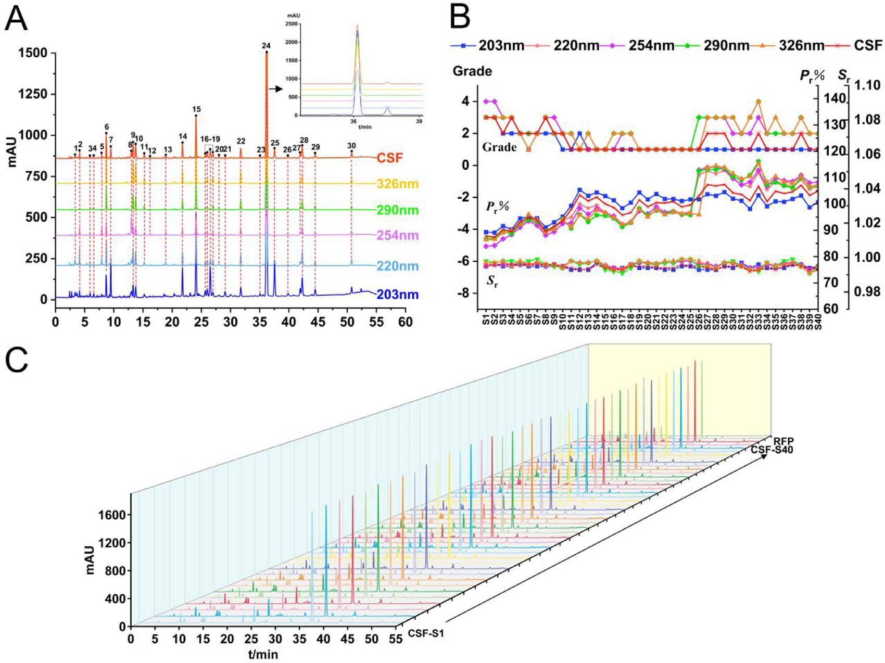
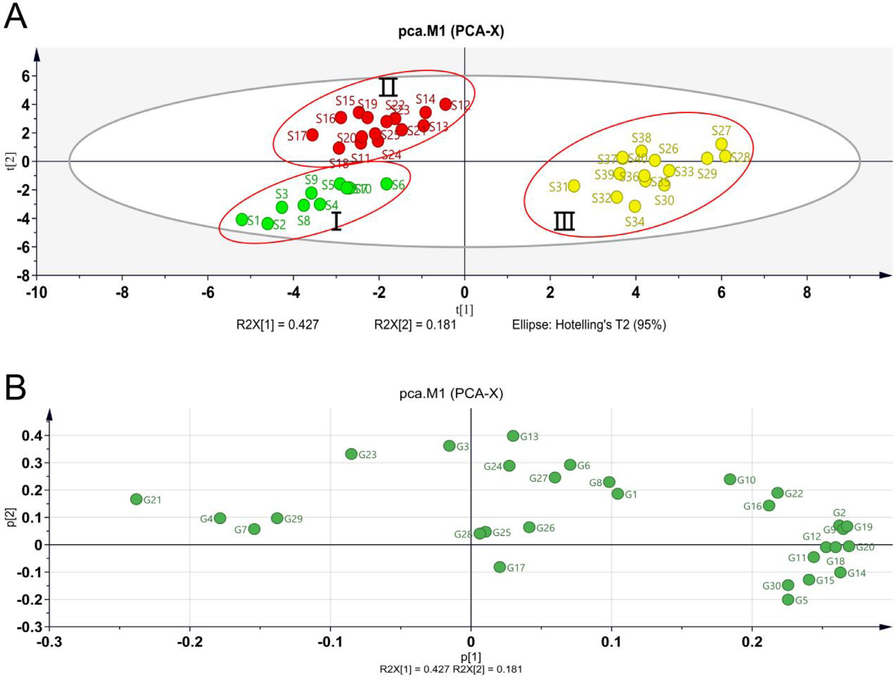
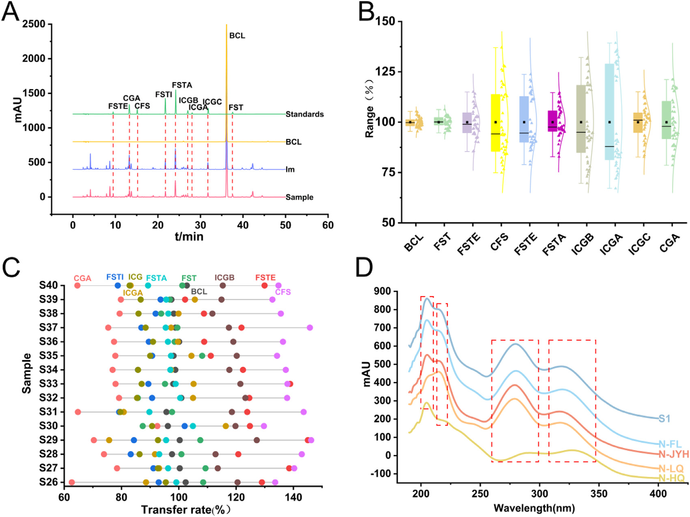
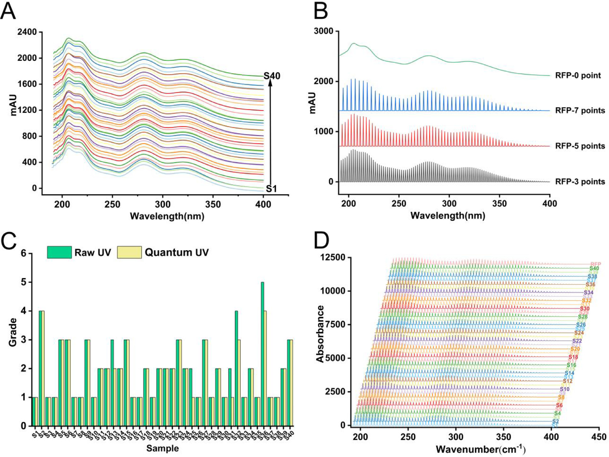
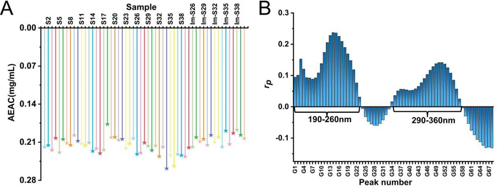
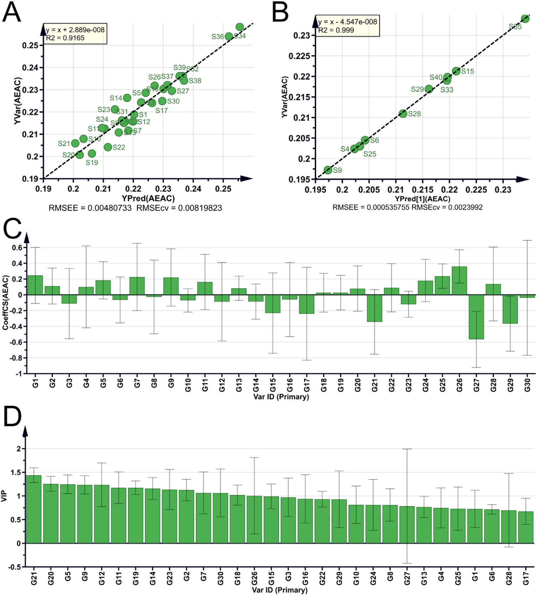

<!-- 方針: ほぼ全訳＋必要に応じた補足。原文（英語・Journal of Chromatography A 原著）の節構成に沿って訳出。図1〜図6は原本PDFからPyMuPDFで埋め込み画像を xref 抽出し Read で内容確認のうえ全訳キャプションで埋め込んだ。表1・表2（全41行・全44列）・表3（全40行・全12列）は全数値を転記。補足表（Table S1〜S6）と補足図（Fig. S1〜S4）は本文に添付されておらず参照不可のため 本文中の記述に基づく範囲でのみ言及する。「> 補足:」は訳者注。 -->

## 書誌情報

- 原題: Thorough evaluation of the Chinese medicine preparations and intermediates using high performance liquid chromatography fingerprints and ultraviolet quantum fingerprints along with antioxidant activity: Shuanghuanglian oral solution as an example
- 著者: Pengyue Wang（王鵬悦）ᵃ・Xinyi Wang（王欣怡）ᵃ・Yifang Li ᵇ・Rongrong He ᵇ・Jin Gao ᶜ・Chengyu Chen ᵈ・Huiqing Dai ᵈ・Zhiming Cao ᵉ・**Lili Lan（藍麗麗）\*** ᵃ・**Guoxiang Sun（孫国祥）\*** ᵃ・**Wanyang Sun\*** ᵇ
- 所属:
  - ᵃ 瀋陽薬科大学 薬学院（遼寧省瀋陽 110016, 中国）
  - ᵇ 暨南大学 薬学院・広東省中医薬与疾病易感性工程研究センター（広東省広州 510632, 中国）
  - ᶜ 広東省エアロゾル吸入製剤工程研究センター（珠海 519000, 中国）
  - ᵈ 嘉恒医薬科技有限公司（珠海 519000, 中国）
  - ᵉ 河南福森薬業有限公司（南陽 473000, 中国）
- 掲載: *Journal of Chromatography A* **1705** (2023) 464196. DOI: 10.1016/j.chroma.2023.464196
- 受理: 2023年5月3日受付／7月2日改訂／7月3日受理／7月4日オンライン公開
- キーワード: 中医薬（TCM）／HPLCフィンガープリント／UV量子フィンガープリント／MAML（単一直線法による多標準物質測定）／抗酸化活性
- 助成: 中国国家自然科学基金（82274403・81703696・81573586）／広州市基礎与応用基礎研究基金（202102020001）
- 利益相反: 著者らは申告なし
- データ提供: 「使用したデータは機密である（The data that has been used is confidential.）」

> 補足: **双黄連口服液（SHL）** は、中国で最も広く使われている呼吸器感染症向けの漢方経口液剤である。処方は **金銀花（きんぎんか、*Lonicera japonica*）・連翹（れんぎょう、*Forsythia suspensa*）・黄芩（おうごん、*Scutellaria baicalensis*）** の3生薬で、解熱・抗菌・抗ウイルス作用をうたい、発熱・咳・咽頭痛に用いられる。中国薬典（2020年版）に品質規格が収載されており、**バイカリン（黄芩由来）・フォルシチン（連翹由来）・クロロゲン酸（金銀花由来）** の3成分が指標成分に指定されている。
>
> 本論文が挑んでいるのは、その「3成分・単一波長」という現行規格の限界を越えることである。日本の漢方エキス製剤のQCに引き寄せて読むと、①指標成分を増やしたいが標準品コストが跳ね上がる、②フィンガープリントを取るとき波長をどう選ぶか、③製剤だけでなく「エキス（中間体）」の段階で品質を止めたい——という、実務でそのまま直面する3つの問題に、それぞれ具体的な解を出した論文と読める。

## 要旨（Abstract）

伝統中医薬（TCM）の世界的な普及が進むにつれ、TCM製品の品質管理への関心が高まっている。双黄連口服液（Shuanghuanglian Oral Liquid, SHL）は、呼吸器感染症の治療に広く用いられるTCM処方である。本研究では、SHLとその中間体の品質に対する**総合的な評価法**を提示する。我々は、SHL試料40ロットおよび中間体15ロットの**多波長融合高速液体クロマトグラフィー（HPLC）フィンガープリント**を通じて品質を評価した。同時に、**MAML（multi-markers assay by monolinear method, 単一直線法による多標準物質測定）** と呼ぶ新しい手法を導入してSHL中の10成分を定量し、中間体から製剤への10成分の**品質伝達（quality transmitting）** を明らかにした。この情報により、中間体の品質管理システムを構築し、その品質の一貫性を確保できるようになった。さらに、HPLCフィンガープリントによる品質評価に対する**直交的な補完**として、**UV量子フィンガープリント**を提案した。フィンガープリントと抗酸化能との関係も構築した。総じて本研究は、TCM製品の品質評価に対する新規かつ統合的なアプローチを提示し、消費者にとってのTCM製品の安全性と有効性を確保するための有用な情報を提供するものである。

## 1. 緒言（Introduction）

伝統中医薬（Traditional Chinese Medicine, TCM）とその各種製剤は、中国で数千年にわたって利用されてきており、新型コロナウイルス感染症（COVID-19）の管理に対する顕著な貢献によって国際社会からも広く認知されるに至った [1–4]。TCM製剤は**複雑系**である。品質管理のための正確かつ効率的な手法を開発する能力は、いまなお継続中の課題である。TCM製剤の品質が確保されて初めて、その臨床応用の安全性と有効性が保証される。したがって本研究は、TCM製剤の品質を評価する良い手法を開発することを目的とした。

**フィンガープリント法（指紋図譜）** は絶えず進化・改良されており、TCM領域の品質管理において重要な役割を果たしている [5–7]。この技術はTCM産業における品質管理の本質的な側面であり、主としてTCMおよび関連する半製品の**真正性（authenticity）・優良性（superiority）・安定性（stability）・一貫性（consistency）** を評価するために用いられる [8]。TCM製品に固有の化学的な特徴、すなわち「フィンガープリント」を解析することで機能し、これはTCMの**全体性（integrity）と曖昧性（ambiguity）** という性質と整合している。

> 補足: 原文の "integrity and ambiguity of TCM"（TCMの全体性と曖昧性）は、中医薬品質研究の分野で使われる決まり文句である。**全体性（整体性）** ＝ 有効性は個々の成分ではなく成分群全体で発現する、**曖昧性（模糊性）** ＝ どの成分がどれだけ効いているかを一意に特定できない、という2つの性質を指す。「だから単一成分の定量ではなく、クロマトグラム全体の形を見るフィンガープリント法が向いている」という論法の前提になっている。

フィンガープリントの取得には、クロマトグラフィー [9, 10] やスペクトロスコピー [11] といった技術が使える。中でも**高速液体クロマトグラフィー（HPLC）フィンガープリント法**は、国内外を問わず品質管理に最もよく使われる手法の1つである [12]。しかしながら、**単一波長のフィンガープリント法に依拠すると偏った結果を生じうる**。化合物ごとに紫外吸収極大波長が異なるためである。異なる波長のスペクトルを1つのスペクトルに**融合（merging）** することは、この問題を解決する有効な方法と考えられる。融合クロマトグラムは、多波長フィンガープリントに含まれる豊富な情報を示すことによって、試料をより徹底的かつ有用に評価できる。

加えて、品質管理の重要な側面として、フィンガープリント中の**既知成分の定量分析**がある。TCMの化学組成は複雑であり、検出コストも高いため、TCMにおける多成分定量の実装は困難である。この困難は、**QAMS（quantitative analysis of multi-components by single marker, 一標多測）** [13] の提案によって緩和されうる。しかしQAMSには**直線範囲についての検討が欠けており、高濃度・低濃度の物質に対して計算誤差が大きい**という問題がある。この問題を解くため、複数物質の分析には **MAML（multi-markers assay by monolinear method）** が推奨される。両者の最大の違いは、**MAMLの相対補正係数が複数の検量線のパラメータから算出され、かつ信頼性解析の理論をもつ**という点にある。MAMLは、QAMSが低濃度・高濃度の物質で大きな計算誤差を生じるという問題を解決し、化合物含量の正確かつ迅速な推定に対する参照を提供する。

> 補足: **QAMS（一標多測）** は、日本でも「相対感度係数（RRF）法」として同じ発想が知られている。標準品を1つだけ買い、他の成分は「その標準品に対する相対的な応答比（補正係数）」で換算する。標準品コストが劇的に下がる一方、補正係数は「検量線が原点を通る」ことを暗黙に前提にしているため、切片が無視できない低濃度域や、検量線が直線から外れる高濃度域で誤差が膨らむ。
>
> **MAML** はここを直接叩く。後述の式(4)〜(9)にあるとおり、傾き $b$ だけでなく**切片由来の誤差 $b_a = a/C$ を明示的に足し込んだ「絶対補正係数 $f$」** を定義し、その比として相対補正係数 $f_{si}$ を作る。さらに「この換算はどれくらい信用してよいか」を示す**信頼性 $R$** を、検量線誤差・ピーク面積のRSD・秤量のRSDから合成して与える。つまり MAML ＝ **QAMS ＋ 切片補正 ＋ 誤差伝播** と理解しておけばよい。

複雑なTCM試料において、**紫外（UV）スペクトル**は各種成分の吸収特性を包括的に把握できる。**フローインジェクション分析（FIA）** [14] 法を利用すると試料のUVスペクトルが得られ、成分の不飽和吸収帯や、化学物質の共役系・芳香族系に関する情報を明らかにできる [15]。しかし、生スペクトルから抽出できる情報は限られており、試料の特徴を十分には反映しない。加えて、試料同士のスペクトログラムは互いに極めて類似しているため、ロット間の差異を識別する手法を開発する必要がある。そこで、**スペクトル量子フィンガープリント法（spectral quantum fingerprinting）** [16] という技術——各波数におけるスペクトル吸光度を量子化することでUV量子フィンガープリントピークを得る手法——が、複雑試料のスペクトルフィンガープリントに対する定性・定量両面の解析の可能性を与えた。

**等重み比率定量フィンガープリント法（equal-weighted ratio quantitative fingerprinting method, EWRQFM）** は、クロマトグラフィー・スペクトル双方のフィンガープリントについて、収集したデータの完全な品質評価を可能にする。

双黄連口服液（SHL）は *Lonicera japonica*（金銀花）・*Forsythia suspensa*（連翹）・*Scutellaria baicalensis*（黄芩）から構成される。解熱・抗菌・抗微生物特性のため、発熱・咳・咽頭痛の治療に頻用されてきた [17]。現行の品質規格は**中国薬典（2020年版）** によって導入されており、その主要活性成分すなわち**バイカリン（baicalin, BCL）・クロロゲン酸（chlorogenic acid, CGA）・フォルシチン（forsythin, FST）** が重要な品質管理指標となっている。SHLの品質に関する従来研究は、少数成分の定性または定量研究に集中する傾向があり、開発されたフィンガープリントプロファイルは**しばしば単一波長**であって、限界があった [18–20]。したがって、SHLの包括的な品質検査を実施するためのアプローチを確立しなければならない。

加えて、TCM製剤の**中間体（intermediates）** の品質研究も考慮されるべきである。製品を製造する際、メーカーはコスト削減のため、しばしば中間体を経由して製造する。中間体はSHL製剤を作る前工程の鍵となる製品であり、製剤の品質は中間体の品質から直接的な影響を受ける。SHL中間体の品質管理に関する研究はほとんどなく、本研究はこの空白を埋める良い方法である。

本研究では、**SHLのUV量子フィンガープリントを初めて確立**した。さらにこれを、EWRQFMを用いた多波長融合HPLCフィンガープリントと組み合わせ、SHLの品質一貫性の**全体的（holistic）** な評価を得た。10化合物の正確な定量は、MAMLとHPLCフィンガープリント解析の組み合わせによって実施した。中間体15ロットの5波長融合フィンガープリントプロファイルを確立し、それらと製剤との相関を研究した。加えて、中間体と製剤の間における定量対象10物質の**品質伝達**を探索し、中間体の品質管理に対する新しい着想を提供した。

SHLの3生薬はいずれも抗酸化活性を有し [21–27]、その抗炎症生理活性の一部は活性物質の抗酸化能・ラジカル捕捉能に帰せられる。以上の情報を踏まえ、我々はSHLの抗酸化活性を探索することとした。SHLのラジカル捕捉能は **2,2-ジフェニル-1-ピクリルヒドラジル（DPPH）法** [28] を用いて検討した。クロマトグラフィーおよびスペクトルの化学的フィンガープリント特性と抗酸化活性の関係は、**OPLS（Orthogonal Projections to Latent Structures, 直交部分最小二乗法）** モデルおよび**ピアソン相関係数**を用いてさらに構築した。

結論として、本論文は製剤および中間体の品質評価に対する、厳密かつ科学的な戦略の開発を目的とする。SHLおよび他の生薬関連製品の品質一貫性研究に、新しい視点を提供するものである。

## 2. 材料と方法（Materials and methods）

### 2.1 試薬・薬品

SHL試料、中間体、および**4種の陰性対照液**は河南福森薬業有限公司から入手した。4種の陰性対照溶液は、それぞれ **黄芩（*Scutellaria baicalensis*）を欠く（N–HQ）・金銀花（*Lonicera japonica*）を欠く（N-JYH）・連翹（*Forsythia suspensa*）を欠く（N-LQ）・賦形剤を欠く（N-FL）** ものである。

HPLCグレードのアセトニトリル・メタノール・無水エタノールはいずれも禹王実業有限公司（山東, 中国）より、**1-ヘプタンスルホン酸ナトリウム**は中美化工廠（山東, 中国）より入手した。リン酸は科密欧化学試剤有限公司（天津, 中国）より入手した。

BCL（>98%）・CGA（>98%）・FST（>98%）・**カフェ酸（caffeic acid, CFS）**（98%）・**フォルシチアシドA（forsythoside A, FSTA）**（>98%）・**フォルシチアシドE（forsythoside E, FSTE）**（>98%）・**フォルシチアシドI（forsythoside I, FSTI）**（>98%）は成都恒瑞（Chengdu Herb Substance Co., Ltd, 成都, 中国）から購入した。**イソクロロゲン酸A（isochlorogenic acid A, ICGA）**（98%）・**イソクロロゲン酸B（ICGB）**（98%）・**イソクロロゲン酸C（ICGC）**（98%）は中国食品薬品検定研究院（北京, 中国）から購入した。DPPH（>97%）および L-アスコルビン酸（AsA, 99.0%）は、それぞれ東京化成工業（TCI）および天津大茂化学試剤有限公司から購入した。

> 補足: 定量対象10成分の生薬帰属を整理しておくと理解しやすい。
>
> | 成分 | 略号 | 由来生薬 | 化学クラス |
> |---|---|---|---|
> | バイカリン | BCL | 黄芩 | フラボノイド配糖体 |
> | クロロゲン酸 | CGA | 金銀花 | カフェオイルキナ酸 |
> | イソクロロゲン酸A/B/C | ICGA/ICGB/ICGC | 金銀花 | ジカフェオイルキナ酸 |
> | カフェ酸 | CFS | 金銀花・連翹 | フェニルプロパノイド |
> | フォルシチン | FST | 連翹 | リグナン配糖体 |
> | フォルシチアシドA/E/I | FSTA/FSTE/FSTI | 連翹 | フェニルエタノイド配糖体 |
>
> **陰性対照液**とは「その生薬だけを抜いて同じ工程で作った液」のことで、どのピーク・どの吸収帯がどの生薬に由来するかを帰属するために使う。日本の漢方エキス製剤のTLC/HPLC確認試験で「欠品エキス」を作るのと同じ考え方である。

### 2.2 試料溶液・標準溶液の調製

各標準品は精密に別々に秤量し、メタノールに溶解した。混合標準溶液はメタノールで希釈し、検量線作成用に一連の濃度を得た。すべての標準溶液は分析まで4 °Cで保存した。

経口液剤 2.5 mL を精密に採り、20 mL メスフラスコに入れ、水を標線まで加えてHPLC分析に供した。中間体および陰性対照溶液も製剤と同じ方法で調製した。試料溶液・標準溶液は、HPLC分析前に **0.45 μm メンブレンフィルター**でろ過した。

### 2.3 装置と分析条件

#### 2.3.1 HPLC分析

HPLC実験には **Agilent 1100 HPLCシリーズ**（Agilent Technology, USA）を用いた。オートサンプラー・オンラインデガッサー・低圧混合四元ポンプ・カラムオーブン・**ダイオードアレイ検出器（DAD）** から構成される。システム制御とデータ取得は Agilent Chemstation（Agilent, USA）で行った。

- カラム: **COSMOSIL C18（250 mm × 4.6 mm, 5 μm）**
- カラム温度: **35 °C**
- 移動相: (A) **アセトニトリル–メタノール（9:1, v/v）**、(B) **0.2%（v/v）リン酸水溶液中 5 mmol/L 1-ヘプタンスルホン酸ナトリウム**
- 流速: **1.0 mL/min**
- 注入量: **5 μL**
- 検出波長（DAD）: **203, 220, 254, 290, 326 nm**（うち **220 nm と 326 nm** を定量モニタリング波長とした）

グラジエント溶出プログラムは以下のとおり（A液の比率）。

| 時間（min） | A液 (%) |
|---|---|
| 0–5 | 6 → 10 |
| 5–10 | 10 → 12 |
| 10–12 | 12 → 15 |
| 20–25 | 15 → 20 |
| 25–30 | 20 → 21 |
| 30–45 | 21 → 25 |
| 5–10 | 25 → 32 |
| 45–50 | 32 → 45 |
| 50–55 | 45 → 4 |

> 補足: このグラジエント表は原文（Section 2.3.1）の記載をそのまま転記したものだが、**原文の記載自体に時間区間の重複・欠落がある**（12–20 min の区間が抜け、「25–32% A (5–10 min)」が2度目の 5–10 min として現れる）。おそらく「12–20 min」および「45 min 付近」の誤植と思われるが、**原文に無い数値を補って修正することはしない**。実際に再現する場合は原著者への確認、または補足資料（Supplementary）の参照が必要である。
>
> なお移動相Bに入っている **1-ヘプタンスルホン酸ナトリウム**はイオンペア試薬で、カフェオイルキナ酸類（CGA・ICGA/B/C）やフェニルエタノイド配糖体のような酸性・極性の高い化合物の保持と分離を改善するために加えられている。

#### 2.3.2 UVスペクトル分析

試料調製法は 2.2 節と同じだが、**80倍希釈**を適用した点のみ異なる。UVスペクトルデータは、DAD検出器と**中空PEEKチューブ（5000 mm × 0.12 mm）** を装着した Agilent 1100 HPLCシステム（Agilent, USA）で取得した。**フローインジェクション分析の原理**に基づき、検出は **190–400 nm の波長範囲・波長間隔 0.5 nm** で行った。試料溶液は、**メタノール–水（80:20, v/v）** をキャリアとして、**35 °C・0.8 mL/min** でPEEKチューブに注入した。

> 補足: ここでやっているのは「カラムを外して、代わりに長い細管（PEEKチューブ）をつないだHPLC」である。分離せずに試料をそのままDADに通し、**混合物のまま190〜400 nmのUVスペクトルを1本取る**。1試料あたり1分未満で終わるので、HPLC（55分）とは桁違いに速い。ただし当然ながらピーク分離の情報はゼロで、得られるのは「全成分の吸収の重ね合わせ」だけ——ここが次節の「量子化」の必要性につながる。

#### 2.3.3 抗酸化活性分析

試料調製法は 2.2 節と同一だが、**60倍希釈**を適用した点のみ異なる。抗酸化試験は Agilent 1100 HPLCシステムを用い、移動相 **エタノール–水（A）（85:15, V/V）・流速 0.4 mL/min** で実施した。DPPH は別のクロマトグラフィーシステムを通じて移動相Aと **0.3 mL/min** で混合され、**35 °C の PEEKチューブ（5000 mm × 0.12 mm）** を流れる。チューブ内での反応後、混合物の吸光度を **517 nm** でUV–vis DAD検出器により検出した。注入試料の容量は **2.5, 5, 7.5, 10, 15 μL** とした。

試料がDPPHと反応するとDPPHの濃度が減少して吸光度が低下し、**負のピーク**が形成される。抗酸化活性は負ピークのピーク面積に比例し、ピーク面積が大きいほど抗酸化能が強い。**AsA（L-アスコルビン酸）** を陽性対照溶液として用い、AsA検量線の濃度範囲は **0.21〜2.64 mg/mL** とした。等量のDPPHを消費するときのAsA量と試料量の比を **AEAC（AsA equivalent antioxidant capacity, アスコルビン酸等価抗酸化能, mg AEs/mL sample）** として算出する。

> 補足: 通常のDPPH法は「試験管で混ぜて30分後にプレートリーダーで読む」バッチ法だが、ここではオンラインの**フローインジェクション型DPPH法**を組んでいる。試料流路とDPPH流路を合流させ、反応コイル（PEEKチューブ）を通した後の517 nm吸光度を見る。DPPHが消費された分だけ吸光度が下がるので、ベースラインに対して**下向きのピーク**が出る。その面積が抗酸化能に比例する、という仕組みである。AEACは「この試料1 mLは、アスコルビン酸 何 mg 分の抗酸化力に相当するか」という換算値。

### 2.4 データ解析

スペクトル量子プロファイリングおよびクロマトグラフィーフィンガープリントの定性・定量類似度は、独自開発ソフトウェア「**中薬スペクトル量子プロファイリング一貫性デジタル評価システム 4.0**（Software certificate No. 7037415, 中国）」および「**中薬スペクトルフィンガープリント一貫性デジタル評価システム 4.0**（Software certificate No. 0407573, 中国）」を用いて算出した。統計解析および作図には **IBM SPSS Statistics 22.0**・**Origin Pro 2021**・**SIMCA-P 14.1**（Umetrics, Umea, Sweden）を用いた。

## 3. 理論（Theory）

### 3.1 EWRQFM（等重み比率定量フィンガープリント法）

試料フィンガープリントベクトル $\vec{X} = (x_1, x_2, \cdots, x_n)$ と標準製剤フィンガープリントベクトル $\vec{Y} = (y_1, y_2, \cdots, y_n)$ について考える。ここで $x_i$、$y_i$ はそれぞれ試料および標準フィンガープリントのピーク面積である。$\vec{X}$ と $\vec{Y}$ のなす角 $\theta$ のベクトル余弦が**定性類似度**として定義される。

しかし、小さいピークに対する減衰効果を軽減するため、ベクトル $\overrightarrow{P_s} = (x_1/y_1, x_2/y_2, \cdots, x_n/y_n)$ と $\overrightarrow{P_0} = (1, 1, \cdots, 1) = (100\%, 100\%, \cdots, 100\%)$ を定義し、両者のなす角 $\theta'$ の余弦を**等重み比率定性類似度（$S_r$、式(1)）** と定義する。$S_r$ はフィンガープリントの**カテゴリ属性**を判定するために用いる。

**等重み比率定量類似度（$P_r$、式(2)）** は、EWRQFMの全体的な定量属性をモニターするために用いる。**変動係数（$\alpha$、式(3)）** は、フィンガープリントの均質化の差異を制御するために用いる。$S_r$・$P_r$・$\alpha$ に基づいてTCMの品質を評価する手法を **EWRQFM** と呼ぶ。分類の基準を**表1**に示す。**最終的な品質等級は、最も悪い等級によって決定される。**

$$
S_r = \cos\theta' = \frac{\sum_{i=1}^{n} \dfrac{x_i}{y_i}}{\sqrt{n \sum_{i=1}^{n}\left(\dfrac{x_i}{y_i}\right)^{2}}}
\tag{1}
$$

$$
P_r = \frac{\dfrac{1}{n}\sum_{i=1}^{n}\dfrac{x_i}{y_i}}{S_r} \times 100\%
\tag{2}
$$

$$
\alpha = \left| 1 - S_r \right|
\tag{3}
$$

> 補足: EWRQFMの発想を平たく言うと次のとおり。
>
> - **$S_r$（定性類似度）**: 試料と標準の各ピークの「比の並び」が、全部1（＝完全一致）というベクトルとどれだけ同じ向きを向いているか。**成分の構成比が揃っているか**を見る。単純なピーク面積ベクトルの余弦だと大きいピークに支配されて小さいピークの差が消えるので、**比を取ってから余弦を取る**（等重み化）のがこの手法の肝である。
> - **$P_r$（定量類似度）**: 比の平均を $S_r$ で割ったもの。**全体としての含量水準が標準の何%か**を見る。100%なら標準と同量、90%なら1割少ない。
> - **$\alpha$（変動係数）**: $|1-S_r|$。$S_r$ が1からどれだけ離れているかを直接見る指標。
>
> そして**最も悪い等級を採る**（worst-case）ので、3指標のどれか1つでも崩れれば等級が落ちる。安全側に倒した設計である。

**表1　EWRQFMによるTCM品質等級区分**

| 等級 | 1 | 2 | 3 | 4 | 5 | 6 | 7 | 8 |
|---|---|---|---|---|---|---|---|---|
| $S_r$ | ≥0.95 | ≥0.9 | ≥0.85 | ≥0.80 | ≥0.70 | ≥0.60 | ≥0.50 | ≤0.50 |
| $P_r$ (%) | 95〜105 | 90〜110 | 85〜115 | 80〜120 | 70〜130 | 60〜140 | 50〜150 | 0〜∞ |
| $\alpha$ | ≤0.05 | ≤0.10 | ≤0.15 | ≤0.20 | ≤0.30 | ≤0.40 | ≤0.50 | >0.50 |
| 品質 | 最良（Best） | 良好（Better） | 良（Good） | 佳（Fine） | 中等（Moderate） | 普通（Common） | 不良（Defective） | 劣（Inferior） |

### 3.2 MAML [29]

まず、1つの被測定物質（$S$）と複数の被評価物質（$i$）の検量線を、式(4)・式(5)のとおり確立する。$S$ と $i$ の**絶対補正係数 $f_i$** を検量線から算出する（式(6)・式(7)）。$b_{as} = a_s / C_s$、$b_{ai} = a_i / C_i$ は、1つの被測定物質および複数の被評価物質の**切片と傾きの絶対誤差**である。傾きの式を用いた**相対補正係数 $f_{si}$** の直接計算を式(8)に示す。

加えて、相対補正係数の誤差（**本手法の信頼性 $R$** と呼ぶ）を式(9)で導入する。$R$ は、**秤取誤差（RSD$_{Cs}$）・検量線誤差（$b_{as}/b_s$）・標準物質の相対ピーク面積誤差（RSD$_{As}$）・他の活性化合物の相対ピーク面積誤差（RSD$_{Ai}$）** を含む。

$$
A_s = b_s C_s + a_s
\tag{4}
$$

$$
A_i = b_i C_i + a_i
\tag{5}
$$

$$
f_s = A_s / C_s = b_s + a_s / C_s = b_s + b_{as}
\tag{6}
$$

$$
f_i = A_i / C_i = b_i + a_i / C_i = b_i + b_{ai}
\tag{7}
$$

$$
f_{si} = f_s / f_i = \frac{b_s + b_{as}}{b_i + b_{ai}}
\tag{8}
$$

$$
R = 1 - \mathrm{RSD}_{ci} = 1 - \sqrt{\left(\frac{b_{as}}{b_s}\right)^{2} + \left(\frac{b_{ai}}{b_i}\right)^{2} + \mathrm{RSD}^{2}_{Ai} + \mathrm{RSD}^{2}_{As} + \mathrm{RSD}^{2}_{Cs}}
\tag{9}
$$

> 補足: 式(6)がMAMLの本質である。通常の相対感度係数（QAMS）は $f = A/C$ を「傾き $b$ そのもの」とみなすが、実際の検量線は $A = bC + a$ であり切片 $a$ がある。$A/C = b + a/C$ と展開すれば、**切片は「濃度に反比例して効く誤差項 $b_a = a/C$」として現れる**。つまり濃度が低いほど $a/C$ が大きくなり、QAMSの前提（$f \approx b$）が崩れる——これが「QAMSは低濃度で誤差が大きい」の数学的正体である。MAMLはこの $b_a$ を明示的に足し込むことで、その崩れを補正する。
>
> 式(9)の $R$ は誤差の**二乗和平方根（RSS）伝播**で、独立な誤差源を合成する標準的なやり方。$R$ が1に近いほど、その相対補正係数を信用してよいことになる。

### 3.3 実験条件の最適化

HPLC実験において、移動相組成・グラジエント溶出プログラム（GEP）・希釈溶媒は、**フィンガープリント情報量指数 $I_{nrt}$**（式(10)）によって最適化した。$I_{nrt}$ は、フィンガープリント信号の大きさ・信号分布の均一性・情報量の多さを明らかにする。$I_{nrt}$ の値が高いほど、選択した条件は良い。異なる条件下での $I_{nrt}$ 値を比較することにより（補足図 Fig. S1）、本研究では 2.3.1 節で述べた最適条件を選択した。

$$
I_{nrt} = -\sum_{i=1}^{n} p_i \ln p_i \left| \ln\left( \frac{N_i \, A_i}{A_r \, r_i} \right) \right| \sum_{i=1}^{n} S_i \left| \ln\left( \frac{N_i \, \ell_i}{r_i} \right) \right|
\tag{10}
$$

記号の意味は以下のとおり。

- $p_i$: 面積正規化値
- $r_i$: 保持時間とピーク番号の相関係数
- $A_i$: ピーク面積
- $S_i$: 情報エントロピー
- $N_i$: 理論段数
- $\ell_i$: 第 $i$ ピークのピークボディ指数（peak body index）
- $A_r$、$r$: 参照フィンガープリントのピーク面積とピークボディ指数

> 補足: 式(10)は原文PDFのテキスト層から抽出したもので、**分数の入れ子や絶対値記号の範囲が原文レイアウトから完全には確定できない**（PDFの数式は組版情報が失われやすい）。ここでは抽出できた要素をそのまま並べているが、厳密な式形は原著の該当箇所を参照されたい。意図としては「シャノンエントロピー型の情報量 × カラム効率（理論段数）とピーク面積の対数項」を掛け合わせ、**ピークがたくさんあり・大きく・均等に分布し・カラム性能が高いほど大きくなる**スカラー指標を作っている。条件検討の際に「どのグラジエントが一番情報の多いクロマトグラムを与えるか」を1つの数値で比べられるようにする道具である。

## 4. 結果と考察（Results and discussion）

### 4.1 分析法バリデーション

HPLC法について、**精度（precision）・併行精度（repeatability）・真度（accuracy）・安定性（stability）・直線性（linearity）・検出限界（LOD）・定量限界（LOQ）** をバリデートした（補足表 Table S1）。

- 精度・併行精度・安定性のRSD: すべて **3.00%未満**
- 構築した検量線: 検討したすべての化合物について、目的濃度範囲で許容できる直線性（**$r \geq 0.999$**）
- 平均回収率: **99.39%〜104.26%**（$n = 6$）、RSDはすべて **1.50%未満**

バリデーション結果によれば、本法は定量に対して極めて高感度かつ正確であった。

### 4.2 SHLフィンガープリントの開発と評価

#### 4.2.1 5波長融合フィンガープリントの確立と類似度評価

試料の全UV帯域における吸収特性を**3次元スペクトル**（補足図 Fig. S2）で観察したところ、**203, 220, 254, 290, 326 nm** で明瞭なUV吸収が認められた。単一波長の偏りを避けるため、異なる波長からの試料信号を統合して**クロマトグラフィー合成フィンガープリント（chromatographic synthetic fingerprints, CSF）** を作る流れがある。

2.4 節で述べたソフトウェアを用い、5本のクロマトグラム上の各ピークの**平均UV吸収特性**を、新しい1本のクロマトグラムに反映させた（**図1A**）。試料の融合クロマトグラムを**図1C**に示す。

40試料の品質はEWRQFMによって評価した。単一波長評価の結果を融合波長の結果と比較したところ（**図1B**）、**融合評価の結果のほうが代表性が高い**ことが判明した。例えば **S38** の等級は、203, 220, 254, 290, 326 nm でそれぞれ **1, 2, 3, 3, 3** であったのに対し、融合後の評価等級は **2** であった（補足表 Table S2）。

- **等級3**: S1, S2, S4, S8
- **等級2**: S3, S5–S7, S9–S10, S27–S29, S33, S38
- **等級1**: 残りすべて

各試料の $S_r$ はすべて **0.990超**、$P_r$% は **80〜120** の範囲であり、化学組成と分布比の高い一貫性を示した。補足表 Table S2 から、**$S_r$ と $\alpha$ の値の変動は小さいのに対し、$P_r$% はより顕著に変化する**ことが見て取れた。$P_r$% を考慮せず $S_r$ と $\alpha$ のみで試料を評価すると、いずれも等級1になる。$P_r$% と組み合わせて評価すると、試料は等級3に分類された。このことは、**$P_r$% がSHLの品質評価にとって有効かつ重要なパラメータ**であり、3つのパラメータの組み合わせによってSHLの品質をより正確かつ包括的に評価できることを、さらに示している。

> 補足: 図1Bが本節の主張の核である。単一波長では、その波長で吸収の強い成分が過大評価され、吸収の弱い成分が過小評価される。S38 の例（203 nmでは等級1＝最良だが、254/290/326 nmでは等級3）は、**「どの波長で見るかによって合否が変わってしまう」** という単一波長フィンガープリントの根本的な脆さを端的に示している。5波長を等重みで平均すれば、特定成分への偏りが均されて等級2という中庸で安定した判定に落ち着く。
>
> 実務上の含意ははっきりしている。単一波長のフィンガープリント規格を採用するなら、**その波長選択の妥当性（なぜその波長か、他の波長ではどうなるか）を説明できなければならない**、ということである。

#### 4.2.2 中間体と製剤の相関

多くのメーカーは、しばしば中間体を経由して製剤を製造する。これは便利で迅速であるだけでなく、費用も節約できる。**中間体の品質を評価することで、どの中間体が次工程の生産に進めてよいかを事前に予測できる。** 中間体の品質を管理して初めて、合格する製剤を作ることができる。

中間体15ロットの測定は、製剤と同一の実験条件で行った。スペクトルは製剤の5波長融合と同じ方法で処理し、**製剤と同一の30ピーク**を得た。各ピークは中間体のクロマトグラム上で追跡でき、高い帰属性を示した（補足図 Fig. S3）。このことは、**中間体中のほぼすべての化合物が製剤へ移行している**ことを示している。

中間体の品質は、対応する製剤15ロットから生成した**参照フィンガープリント（reference fingerprint, RFP）** を用いて評価した（補足表 Table S3）。中間体の $S_r$ はすべて **0.90超**、$P_r$% は **87.9〜105.2** の範囲で変動し、$\alpha$ はすべて **0.20未満**であった。**等級は1から5まで**に分かれ、中間体の品質もまた実質的に変動することを示した。

この解析手法は中間体品質の管理を可能にし、中間体と製剤の品質一貫性を確保する重要な方法である。品質の劣る中間体が次の生産工程に入るのを防ぎ、ひいては劣悪な製品が市場に出るのを防いだ。

> 補足: ここは本論文でいちばん実務的な部分である。製剤で等級1〜3に収まっていても、**その原料である中間体は等級1〜5まで散らばっていた**。つまり製剤工程（希釈・調製）が中間体のばらつきをある程度吸収してしまっている。裏を返せば、**製剤だけを見ていては上流のばらつきに気づけない**。中間体の段階でEWRQFM判定を入れ、等級4・5のロットを次工程に流さないという運用が、品質一貫性の確保にはより効く——という主張である。
>
> 日本の漢方エキス製剤で言えば「エキス粉末の段階でフィンガープリント規格を持つか、最終製剤だけで見るか」という話に対応する。

#### 4.2.3 主成分分析（PCA）

SHL試料では、試料の最終品質等級の区別は $P_r$ に強く影響されていた。そこで、$P_r$ の品質識別能力を検証するためにPCAを選択した。多変量データ系の次元削減により、試料とフィンガープリントピークの相関を確立した。

40試料の**共有フィンガープリントピーク30本**のピーク面積を SIMCA-P ソフトウェアに取り込んだところ、得られた**第1〜第5主成分でデータの分散の 84.72% を説明**した。PC1 と PC2 をそれぞれ横軸・縦軸として、**40観測 × 36変数**の2次元行列を構築した。

**スコアプロット（図2A）** は、試料が明確な境界をもって**3つのカテゴリ**にはっきり分かれることを示した。**ローディングプロット（図2B）** は、元のフィンガープリントピークが合成変数にどれだけ寄与しているかを見るのに使える。共有ピークが原点から遠いほど寄与が大きく、試料がどのように変動し、また類似しているかを見やすくする。例えば **G25（FST）と G28 は全体への寄与が小さく**、一方 **G3, G23, G21 は第2のタイプの試料に大きく寄与**していた。

分類結果を試料のHPLC評価の $P_r$%（表3）と比較すると、**PCAの分類結果は $P_r$% の変動範囲と高い一致**を示した。$P_r$% の範囲は、

- カテゴリ **I**: **87.4〜94.7**
- カテゴリ **II**: **95.8〜102.6**
- カテゴリ **III**: **100.9〜107.4**

であった。このことは、PCAが化学組成の変動を初期的に識別できること、そして $P_r$ もまたこの点で優れた識別能力をもつことを証明した。したがって、EWRQFMによるSHLの全体的定量は客観的かつ正確であった。

> 補足: PCAは「教師なし」の手法で、$P_r$ を一切使わずにピーク面積だけから試料をグルーピングする。それが $P_r$% の値域ときれいに対応した（I → 87〜95%、II → 96〜103%、III → 101〜107%）ということは、**$P_r$ という1つのスカラーが、多変量のPCAとほぼ同じ情報を持っている**ことの傍証になる。EWRQFMの $P_r$ を品質指標として使う正当化として、この検証は効いている。
>
> なお図2Aで PC1（t[1]）の左側にカテゴリI・II、右側にカテゴリIIIが分かれており、R2X[1]=0.427、R2X[2]=0.181 と表示されている（第1・第2主成分で計60.8%）。

### 4.3 定量分析

#### 4.3.1 10成分の定量

同一メーカー由来の40ロットの試料を同時に測定し、定量対象として10化合物を同定した（**図3A**）。各試料は平均して以下の含量を含んでいた。

| 成分 | 平均含量（mg/mL） |
|---|---|
| BCL（バイカリン） | 12.73 |
| FSTA（フォルシチアシドA） | 2.09 |
| CGA（クロロゲン酸） | 0.83 |
| FSTE（フォルシチアシドE） | 0.64 |
| FSTI（フォルシチアシドI） | 0.57 |
| FST（フォルシチン） | 0.39 |
| ICGC（イソクロロゲン酸C） | 0.35 |
| ICGB（イソクロロゲン酸B） | 0.24 |
| ICGA（イソクロロゲン酸A） | 0.09 |
| CFS（カフェ酸） | 0.05 |

SHL 10成分の含量は次の順に分布した:

**BCL > FSTA > CGA > FSTE > FSTI > FST > ICGC > ICGB > ICGA > CFS**

このうち **BCL・FST・CGA はいずれも中国薬典2020年版の規格に適合**していた。

**図3B**は10成分の箱ひげ図を示す。このうち **BCL と FST は箱が狭く、含量が安定していて変動が小さく、平均値と中央値が非常に近い**ことが見て取れた。**CFS・FSTE・ICGB・ICGA** など他の成分は箱が長く、含量の振れが大きいことを含意した。示された中央値は箱の下部に位置し、**右に歪んだ（right-skewed）状態**を示しており、含量の低い試料がより多いことを示している。

しかし、複数物質を同時にモニターするには、より多くの労力と物的資源が必要である。そこで本論文では、新規の多成分定量アプローチ **MAML** を提案する。少量の標準物質から、他の一連の物質の含量を得ることができる。

> 補足: BCL（バイカリン）が 12.73 mg/mL と圧倒的に多く、次点の FSTA（2.09）の6倍、最少の CFS（0.05）の 250倍以上ある。この**3桁近いダイナミックレンジ**こそが、後述するQAMS／MAMLの精度差が問題になる場面そのものである。単一の標準物質から補正係数で換算する以上、標準物質の濃度から遠い成分ほど誤差が乗りやすい。MAMLが切片誤差 $b_a = a/C$ を明示的に扱うのは、まさにこのレンジ幅への対処である。

#### 4.3.2 MAMLによる定量解析

提案するMAMLの妥当性を評価するため、まず**標準法（ESM＝external standard method, 外部標準法）** で試料中10化合物の定量を行った。続いて **MAML** と **QAMS** を用いて化合物の含量を測定した。

QAMSでは構造の似た分子ほど含量計算が正確になるため、主要化合物を**2群**に分けた。

- **クラスI**: CGA, ICGB, ICGA, ICGC ——いずれも**カフェオイルキナ酸類**。**被測定物質は ICGC**。
- **クラスII**: FST, FSTA, FSTE, FSTI, BCL, CFS ——主に**フェニルプロパノイド類**。**被測定物質は FSTI**。

MAMLでは **FSTI を被測定物質**として選択し、他の物質の濃度はそれぞれの $f_{si}$ の導出によって得られた。結果を**表2**および補足表 Table S4 に示す。

ESM法とMAML法の相対誤差を計算したところ、**ICGB（やや高く 3.17%）を除き、すべて 1.50%未満**であった。ESMとQAMSの相対誤差を計算すると、絶対値は **0.36%〜4.56%** であった。QAMSとMAMLの相対誤差を比較すると、**ほとんどの場合でMAMLの相対誤差の絶対値がQAMSより有意に小さい**ことが見て取れ、MAMLの結果のほうがQAMSより信頼でき、化学構造の影響を受けにくいことを示した。

MAMLとESMの結果について **$t$ 検定**による統計解析を行ったところ、**すべての $P$ 値が 0.05 より大きい**ことが判明した。加えて相関解析を構築したところ、**ピアソン相関係数（Pearson's $r$）はすべて 0.90 超**であり、両手法の間に強い相関があることが明らかになった。

以上から、**MAMLはESMの役割を代替しつつ、コストを下げながら正しい解析結果を出しうる**ことが明らかであり、SHLの品質管理規格に新しい発想を提供する。

> 補足: 表2の列構成について。**ICGC は QAMS のクラスI基準物質**なので、QAMSでは定義上ESMと一致する——だから ICGC には QAMS 列と $\delta Q$ 列が無く、ESM / MAML / $\delta M$ の3列だけになっている。同様に **FSTI は QAMS のクラスII基準物質かつ MAML の唯一の基準物質**なので、ESM 列しか存在しない。$\delta Q$ ＝ QAMSのESMに対する相対誤差（%）、$\delta M$ ＝ MAMLのESMに対する相対誤差（%）である。

**表2　ESM・QAMS・MAMLによるSHL中10化合物の含量（mg/mL）**

以下は原文 Table 2（全41行・全44列）の全数値である。見やすさのため成分ごとに5つの表に分割した。ESM ＝ 外部標準法、QAMS ＝ 一標多測、MAML ＝ 単一直線法による多標準物質測定、δQ ＝ QAMSの相対誤差(%)、δM ＝ MAMLの相対誤差(%)。

**表2-1　バイカリン（BCL）とフォルシチアシドA（FSTA）　単位 mg/mL、δ は % **

| 試料 | BCL ESM | BCL QAMS | BCL MAML | BCL δQ | BCL δM | FSTA ESM | FSTA QAMS | FSTA MAML | FSTA δQ | FSTA δM |
|---|---|---|---|---|---|---|---|---|---|---|
| S1 | 12.40 | 11.88 | 12.50 | −4.15 | 0.78 | 1.95 | 2.00 | 1.96 | 2.67 | 0.82 |
| S2 | 12.52 | 11.97 | 12.59 | −4.38 | 0.54 | 2.03 | 2.08 | 2.04 | 2.51 | 0.66 |
| S3 | 12.61 | 12.07 | 12.69 | −4.32 | 0.61 | 2.01 | 2.07 | 2.03 | 2.58 | 0.73 |
| S4 | 12.38 | 11.86 | 12.47 | −4.20 | 0.73 | 1.95 | 2.00 | 1.97 | 2.62 | 0.77 |
| S5 | 12.15 | 11.63 | 12.23 | −4.24 | 0.69 | 2.01 | 2.06 | 2.02 | 2.58 | 0.73 |
| S6 | 12.69 | 12.13 | 12.75 | −4.48 | 0.44 | 2.08 | 2.13 | 2.09 | 2.47 | 0.63 |
| S7 | 12.39 | 11.86 | 12.47 | −4.33 | 0.60 | 2.03 | 2.08 | 2.04 | 2.54 | 0.69 |
| S8 | 12.47 | 11.92 | 12.54 | −4.37 | 0.55 | 2.03 | 2.08 | 2.04 | 2.51 | 0.66 |
| S9 | 12.37 | 11.84 | 12.45 | −4.28 | 0.65 | 2.01 | 2.06 | 2.02 | 2.57 | 0.72 |
| S10 | 12.88 | 12.28 | 12.91 | −4.66 | 0.25 | 2.13 | 2.18 | 2.15 | 2.35 | 0.50 |
| S11 | 12.56 | 12.02 | 12.64 | −4.26 | 0.67 | 1.90 | 1.94 | 1.91 | 2.55 | 0.70 |
| S12 | 13.20 | 12.59 | 13.24 | −4.56 | 0.36 | 2.04 | 2.09 | 2.05 | 2.45 | 0.60 |
| S13 | 12.85 | 12.27 | 12.90 | −4.51 | 0.41 | 2.02 | 2.07 | 2.03 | 2.43 | 0.58 |
| S14 | 13.22 | 12.62 | 13.27 | −4.49 | 0.42 | 1.97 | 2.02 | 1.98 | 2.47 | 0.62 |
| S15 | 13.37 | 12.79 | 13.45 | −4.32 | 0.60 | 1.86 | 1.90 | 1.87 | 2.59 | 0.74 |
| S16 | 13.14 | 12.60 | 13.25 | −4.10 | 0.84 | 1.76 | 1.81 | 1.78 | 2.71 | 0.86 |
| S17 | 12.76 | 12.26 | 12.89 | −3.97 | 0.97 | 1.73 | 1.78 | 1.74 | 2.75 | 0.89 |
| S18 | 12.82 | 12.25 | 12.88 | −4.43 | 0.49 | 2.00 | 2.05 | 2.02 | 2.49 | 0.64 |
| S19 | 13.05 | 12.48 | 13.12 | −4.43 | 0.49 | 2.00 | 2.05 | 2.01 | 2.53 | 0.68 |
| S20 | 12.91 | 12.33 | 12.96 | −4.49 | 0.43 | 2.05 | 2.10 | 2.06 | 2.48 | 0.64 |
| S21 | 13.14 | 12.52 | 13.17 | −4.66 | 0.25 | 2.14 | 2.19 | 2.15 | 2.39 | 0.54 |
| S22 | 12.89 | 12.33 | 12.96 | −4.37 | 0.55 | 2.00 | 2.05 | 2.01 | 2.57 | 0.72 |
| S23 | 12.78 | 12.23 | 12.86 | −4.31 | 0.62 | 1.97 | 2.02 | 1.98 | 2.59 | 0.74 |
| S24 | 12.49 | 11.95 | 12.57 | −4.31 | 0.61 | 1.99 | 2.04 | 2.00 | 2.55 | 0.70 |
| S25 | 12.58 | 12.04 | 12.66 | −4.30 | 0.62 | 1.97 | 2.02 | 1.99 | 2.56 | 0.71 |
| S26 | 12.76 | 12.14 | 12.76 | −4.91 | −0.02 | 2.25 | 2.30 | 2.26 | 2.12 | 0.28 |
| S27 | 12.83 | 12.20 | 12.83 | −4.92 | −0.02 | 2.29 | 2.34 | 2.30 | 2.15 | 0.31 |
| S28 | 12.62 | 11.99 | 12.61 | −4.94 | −0.04 | 2.30 | 2.35 | 2.31 | 2.09 | 0.25 |
| S29 | 12.77 | 12.13 | 12.76 | −5.02 | −0.13 | 2.38 | 2.43 | 2.38 | 2.07 | 0.23 |
| S30 | 12.69 | 12.05 | 12.67 | −5.05 | −0.16 | 2.39 | 2.44 | 2.40 | 2.03 | 0.19 |
| S31 | 12.32 | 11.74 | 12.34 | −4.75 | 0.15 | 2.16 | 2.20 | 2.16 | 2.16 | 0.31 |
| S32 | 12.85 | 12.22 | 12.84 | −4.91 | −0.01 | 2.22 | 2.27 | 2.23 | 2.12 | 0.28 |
| S33 | 13.41 | 12.72 | 13.38 | −5.11 | −0.22 | 2.35 | 2.40 | 2.36 | 2.07 | 0.23 |
| S34 | 12.28 | 11.68 | 12.28 | −4.88 | 0.02 | 2.30 | 2.35 | 2.30 | 2.09 | 0.25 |
| S35 | 12.49 | 11.88 | 12.50 | −4.87 | 0.02 | 2.21 | 2.26 | 2.22 | 2.09 | 0.25 |
| S36 | 12.71 | 12.08 | 12.70 | −4.93 | −0.03 | 2.24 | 2.28 | 2.24 | 2.09 | 0.25 |
| S37 | 12.65 | 12.04 | 12.66 | −4.84 | 0.06 | 2.18 | 2.22 | 2.18 | 2.14 | 0.30 |
| S38 | 12.68 | 12.07 | 12.69 | −4.84 | 0.06 | 2.19 | 2.24 | 2.20 | 2.16 | 0.32 |
| S39 | 12.54 | 11.94 | 12.55 | −4.81 | 0.09 | 2.18 | 2.23 | 2.19 | 2.15 | 0.31 |
| S40 | 12.99 | 12.36 | 12.99 | −4.90 | 0.00 | 2.19 | 2.24 | 2.20 | 2.15 | 0.30 |
| 平均 | 12.73 | 12.15 | 12.78 | −4.56 | 0.35 | 2.09 | 2.14 | 2.10 | 2.38 | 0.53 |

**表2-2　フォルシチン（FST）とフォルシチアシドE（FSTE）　単位 mg/mL、δ は %**

| 試料 | FST ESM | FST QAMS | FST MAML | FST δQ | FST δM | FSTE ESM | FSTE QAMS | FSTE MAML | FSTE δQ | FSTE δM |
|---|---|---|---|---|---|---|---|---|---|---|
| S1 | 0.39 | 0.41 | 0.40 | 4.58 | 1.42 | 0.68 | 0.70 | 0.69 | 3.93 | 1.19 |
| S2 | 0.39 | 0.41 | 0.40 | 4.36 | 1.21 | 0.61 | 0.63 | 0.61 | 3.50 | 0.77 |
| S3 | 0.40 | 0.42 | 0.40 | 4.46 | 1.30 | 0.69 | 0.72 | 0.70 | 3.82 | 1.08 |
| S4 | 0.39 | 0.41 | 0.39 | 4.52 | 1.36 | 0.62 | 0.65 | 0.63 | 3.72 | 0.99 |
| S5 | 0.40 | 0.42 | 0.41 | 4.46 | 1.31 | 0.67 | 0.70 | 0.68 | 3.77 | 1.04 |
| S6 | 0.40 | 0.42 | 0.41 | 4.31 | 1.16 | 0.61 | 0.63 | 0.61 | 3.44 | 0.72 |
| S7 | 0.40 | 0.41 | 0.40 | 4.40 | 1.25 | 0.65 | 0.67 | 0.66 | 3.66 | 0.93 |
| S8 | 0.40 | 0.41 | 0.40 | 4.37 | 1.22 | 0.62 | 0.65 | 0.63 | 3.55 | 0.83 |
| S9 | 0.39 | 0.40 | 0.39 | 4.42 | 1.27 | 0.71 | 0.74 | 0.72 | 3.86 | 1.13 |
| S10 | 0.40 | 0.42 | 0.40 | 4.14 | 1.00 | 0.65 | 0.67 | 0.66 | 3.40 | 0.68 |
| S11 | 0.38 | 0.40 | 0.39 | 4.48 | 1.32 | 0.64 | 0.66 | 0.64 | 3.73 | 1.00 |
| S12 | 0.41 | 0.43 | 0.42 | 4.33 | 1.18 | 0.61 | 0.63 | 0.62 | 3.44 | 0.72 |
| S13 | 0.40 | 0.41 | 0.40 | 4.29 | 1.14 | 0.63 | 0.66 | 0.64 | 3.51 | 0.78 |
| S14 | 0.40 | 0.42 | 0.41 | 4.38 | 1.23 | 0.64 | 0.66 | 0.64 | 3.59 | 0.87 |
| S15 | 0.39 | 0.40 | 0.39 | 4.56 | 1.40 | 0.65 | 0.68 | 0.66 | 3.84 | 1.11 |
| S16 | 0.38 | 0.40 | 0.39 | 4.76 | 1.60 | 0.63 | 0.65 | 0.64 | 3.99 | 1.25 |
| S17 | 0.37 | 0.39 | 0.38 | 4.80 | 1.64 | 0.61 | 0.63 | 0.61 | 3.98 | 1.25 |
| S18 | 0.38 | 0.40 | 0.39 | 4.33 | 1.18 | 0.58 | 0.60 | 0.59 | 3.42 | 0.70 |
| S19 | 0.39 | 0.41 | 0.39 | 4.39 | 1.24 | 0.70 | 0.73 | 0.71 | 3.81 | 1.08 |
| S20 | 0.38 | 0.40 | 0.39 | 4.29 | 1.15 | 0.62 | 0.65 | 0.63 | 3.51 | 0.79 |
| S21 | 0.40 | 0.41 | 0.40 | 4.18 | 1.03 | 0.60 | 0.61 | 0.60 | 3.27 | 0.55 |
| S22 | 0.39 | 0.41 | 0.39 | 4.43 | 1.28 | 0.71 | 0.74 | 0.72 | 3.86 | 1.13 |
| S23 | 0.39 | 0.41 | 0.39 | 4.47 | 1.32 | 0.74 | 0.77 | 0.75 | 3.98 | 1.24 |
| S24 | 0.38 | 0.40 | 0.39 | 4.40 | 1.25 | 0.66 | 0.69 | 0.67 | 3.73 | 1.00 |
| S25 | 0.39 | 0.40 | 0.39 | 4.43 | 1.28 | 0.69 | 0.72 | 0.70 | 3.84 | 1.11 |
| S26 | 0.38 | 0.39 | 0.38 | 3.78 | 0.64 | 0.66 | 0.68 | 0.66 | 3.13 | 0.41 |
| S27 | 0.39 | 0.40 | 0.39 | 3.82 | 0.69 | 0.73 | 0.75 | 0.73 | 3.29 | 0.58 |
| S28 | 0.38 | 0.40 | 0.39 | 3.75 | 0.61 | 0.59 | 0.61 | 0.59 | 2.87 | 0.16 |
| S29 | 0.40 | 0.41 | 0.40 | 3.71 | 0.58 | 0.70 | 0.72 | 0.70 | 3.10 | 0.39 |
| S30 | 0.39 | 0.41 | 0.39 | 3.65 | 0.52 | 0.64 | 0.66 | 0.64 | 2.90 | 0.19 |
| S31 | 0.37 | 0.38 | 0.37 | 3.85 | 0.72 | 0.74 | 0.76 | 0.74 | 3.40 | 0.68 |
| S32 | 0.37 | 0.38 | 0.37 | 3.77 | 0.64 | 0.55 | 0.57 | 0.55 | 2.79 | 0.09 |
| S33 | 0.39 | 0.40 | 0.39 | 3.71 | 0.58 | 0.66 | 0.68 | 0.67 | 3.03 | 0.32 |
| S34 | 0.38 | 0.40 | 0.39 | 3.74 | 0.61 | 0.55 | 0.57 | 0.55 | 2.72 | 0.02 |
| S35 | 0.37 | 0.39 | 0.37 | 3.76 | 0.63 | 0.66 | 0.68 | 0.66 | 3.12 | 0.41 |
| S36 | 0.38 | 0.40 | 0.38 | 3.77 | 0.64 | 0.66 | 0.68 | 0.66 | 3.10 | 0.39 |
| S37 | 0.38 | 0.39 | 0.38 | 3.85 | 0.71 | 0.60 | 0.61 | 0.60 | 3.00 | 0.29 |
| S38 | 0.38 | 0.39 | 0.38 | 3.85 | 0.71 | 0.62 | 0.64 | 0.62 | 3.08 | 0.37 |
| S39 | 0.37 | 0.38 | 0.37 | 3.83 | 0.70 | 0.58 | 0.60 | 0.58 | 2.95 | 0.24 |
| S40 | 0.38 | 0.39 | 0.38 | 3.84 | 0.70 | 0.62 | 0.64 | 0.62 | 3.06 | 0.35 |
| 平均 | 0.39 | 0.40 | 0.39 | 4.18 | 1.04 | 0.64 | 0.67 | 0.65 | 3.44 | 0.72 |

**表2-3　イソクロロゲン酸C（ICGC）とカフェ酸（CFS）　単位 mg/mL、δ は %**

| 試料 | ICGC ESM | ICGC MAML | ICGC δM | CFS ESM | CFS QAMS | CFS MAML | CFS δQ | CFS δM |
|---|---|---|---|---|---|---|---|---|
| S1 | 0.29 | 0.28 | −2.28 | 0.05 | 0.04 | 0.05 | −0.99 | 0.57 |
| S2 | 0.29 | 0.29 | −2.41 | 0.04 | 0.04 | 0.04 | −1.48 | 0.08 |
| S3 | 0.30 | 0.29 | −2.16 | 0.05 | 0.05 | 0.05 | −1.11 | 0.45 |
| S4 | 0.32 | 0.31 | −1.67 | 0.04 | 0.04 | 0.04 | −1.17 | 0.40 |
| S5 | 0.33 | 0.32 | −1.55 | 0.05 | 0.04 | 0.05 | −1.13 | 0.44 |
| S6 | 0.34 | 0.33 | −1.50 | 0.04 | 0.04 | 0.04 | −1.49 | 0.07 |
| S7 | 0.33 | 0.32 | −1.62 | 0.04 | 0.04 | 0.04 | −1.25 | 0.31 |
| S8 | 0.31 | 0.30 | −2.00 | 0.04 | 0.04 | 0.04 | −1.51 | 0.04 |
| S9 | 0.31 | 0.31 | −1.86 | 0.05 | 0.04 | 0.05 | −1.12 | 0.44 |
| S10 | 0.31 | 0.31 | −2.15 | 0.04 | 0.04 | 0.04 | −1.68 | −0.12 |
| S11 | 0.32 | 0.32 | −1.61 | 0.04 | 0.04 | 0.04 | −1.18 | 0.39 |
| S12 | 0.34 | 0.34 | −1.36 | 0.04 | 0.04 | 0.04 | −1.43 | 0.12 |
| S13 | 0.34 | 0.33 | −1.45 | 0.04 | 0.04 | 0.04 | −1.46 | 0.10 |
| S14 | 0.35 | 0.35 | −1.12 | 0.04 | 0.04 | 0.04 | −1.38 | 0.18 |
| S15 | 0.37 | 0.36 | −0.72 | 0.04 | 0.04 | 0.04 | −1.14 | 0.42 |
| S16 | 0.37 | 0.36 | −0.53 | 0.04 | 0.04 | 0.04 | −0.85 | 0.72 |
| S17 | 0.36 | 0.36 | −0.53 | 0.04 | 0.04 | 0.04 | −0.85 | 0.72 |
| S18 | 0.35 | 0.34 | −1.27 | 0.04 | 0.04 | 0.04 | −1.60 | −0.04 |
| S19 | 0.35 | 0.35 | −1.16 | 0.05 | 0.05 | 0.05 | −1.10 | 0.46 |
| S20 | 0.35 | 0.34 | −1.25 | 0.04 | 0.04 | 0.04 | −1.42 | 0.14 |
| S21 | 0.37 | 0.37 | −1.04 | 0.04 | 0.04 | 0.04 | −1.74 | −0.18 |
| S22 | 0.35 | 0.35 | −1.12 | 0.05 | 0.05 | 0.05 | −1.02 | 0.54 |
| S23 | 0.35 | 0.35 | −1.06 | 0.05 | 0.05 | 0.05 | −0.92 | 0.64 |
| S24 | 0.36 | 0.36 | −0.97 | 0.04 | 0.04 | 0.04 | −1.20 | 0.36 |
| S25 | 0.36 | 0.35 | −0.99 | 0.05 | 0.05 | 0.05 | −1.08 | 0.49 |
| S26 | 0.39 | 0.39 | −1.02 | 0.06 | 0.06 | 0.06 | −1.31 | 0.26 |
| S27 | 0.40 | 0.40 | −0.89 | 0.07 | 0.07 | 0.07 | −1.20 | 0.36 |
| S28 | 0.39 | 0.39 | −1.05 | 0.06 | 0.06 | 0.06 | −1.36 | 0.20 |
| S29 | 0.39 | 0.39 | −1.17 | 0.06 | 0.06 | 0.06 | −1.40 | 0.16 |
| S30 | 0.38 | 0.38 | −1.35 | 0.05 | 0.05 | 0.05 | −1.60 | −0.04 |
| S31 | 0.35 | 0.34 | −1.63 | 0.06 | 0.06 | 0.06 | −1.21 | 0.36 |
| S32 | 0.37 | 0.36 | −1.37 | 0.05 | 0.05 | 0.05 | −1.45 | 0.11 |
| S33 | 0.38 | 0.38 | −1.28 | 0.06 | 0.06 | 0.06 | −1.46 | 0.10 |
| S34 | 0.37 | 0.37 | −1.36 | 0.06 | 0.06 | 0.06 | −1.44 | 0.11 |
| S35 | 0.36 | 0.36 | −1.49 | 0.05 | 0.05 | 0.05 | −1.46 | 0.10 |
| S36 | 0.36 | 0.36 | −1.49 | 0.05 | 0.05 | 0.05 | −1.46 | 0.10 |
| S37 | 0.36 | 0.35 | −1.55 | 0.06 | 0.05 | 0.06 | −1.37 | 0.19 |
| S38 | 0.36 | 0.35 | −1.52 | 0.06 | 0.06 | 0.06 | −1.31 | 0.25 |
| S39 | 0.36 | 0.35 | −1.54 | 0.05 | 0.05 | 0.05 | −1.38 | 0.18 |
| S40 | 0.35 | 0.35 | −1.60 | 0.06 | 0.06 | 0.06 | −1.33 | 0.23 |
| 平均 | 0.35 | 0.34 | −1.39 | 0.05 | 0.05 | 0.05 | −1.30 | 0.26 |

**表2-4　イソクロロゲン酸B（ICGB）とイソクロロゲン酸A（ICGA）　単位 mg/mL、δ は %**

| 試料 | ICGB ESM | ICGB QAMS | ICGB MAML | ICGB δQ | ICGB δM | ICGA ESM | ICGA QAMS | ICGA MAML | ICGA δQ | ICGA δM |
|---|---|---|---|---|---|---|---|---|---|---|
| S1 | 0.17 | 0.17 | 0.16 | −0.52 | −6.18 | 0.06 | 0.06 | 0.06 | 0.35 | −1.39 |
| S2 | 0.17 | 0.17 | 0.16 | −0.02 | −5.84 | 0.07 | 0.07 | 0.07 | 0.57 | −1.31 |
| S3 | 0.18 | 0.18 | 0.17 | −0.02 | −5.60 | 0.07 | 0.07 | 0.07 | 0.42 | −1.21 |
| S4 | 0.18 | 0.18 | 0.17 | −0.04 | −5.15 | 0.07 | 0.07 | 0.07 | 0.07 | −1.05 |
| S5 | 0.19 | 0.19 | 0.18 | 0.19 | −4.80 | 0.07 | 0.07 | 0.07 | 0.11 | −0.89 |
| S6 | 0.20 | 0.20 | 0.19 | 0.43 | −4.54 | 0.08 | 0.08 | 0.08 | 0.12 | −0.83 |
| S7 | 0.19 | 0.19 | 0.18 | 0.35 | −4.73 | 0.07 | 0.07 | 0.07 | 0.17 | −0.90 |
| S8 | 0.18 | 0.18 | 0.17 | −0.05 | −5.47 | 0.07 | 0.07 | 0.07 | 0.29 | −1.17 |
| S9 | 0.18 | 0.18 | 0.17 | 0.04 | −5.25 | 0.07 | 0.07 | 0.07 | 0.28 | −1.03 |
| S10 | 0.19 | 0.19 | 0.18 | 0.28 | −5.30 | 0.07 | 0.07 | 0.07 | 0.35 | −1.26 |
| S11 | 0.21 | 0.21 | 0.20 | 1.31 | −3.81 | 0.07 | 0.07 | 0.07 | 0.32 | −0.75 |
| S12 | 0.22 | 0.22 | 0.21 | 1.42 | −3.46 | 0.08 | 0.08 | 0.08 | 0.05 | −0.77 |
| S13 | 0.22 | 0.22 | 0.21 | 1.44 | −3.52 | 0.08 | 0.08 | 0.08 | 0.17 | −0.73 |
| S14 | 0.23 | 0.23 | 0.22 | 1.63 | −3.02 | 0.08 | 0.08 | 0.08 | 0.11 | −0.46 |
| S15 | 0.24 | 0.24 | 0.23 | 1.77 | −2.50 | 0.09 | 0.09 | 0.09 | 0.03 | −0.14 |
| S16 | 0.23 | 0.24 | 0.23 | 1.58 | −2.49 | 0.08 | 0.08 | 0.08 | 0.06 | −0.04 |
| S17 | 0.23 | 0.23 | 0.22 | 1.39 | −2.68 | 0.08 | 0.08 | 0.08 | 0.03 | −0.01 |
| S18 | 0.22 | 0.22 | 0.21 | 1.18 | −3.59 | 0.08 | 0.08 | 0.08 | 0.06 | −0.78 |
| S19 | 0.22 | 0.23 | 0.22 | 1.39 | −3.28 | 0.08 | 0.08 | 0.08 | 0.08 | −0.68 |
| S20 | 0.22 | 0.22 | 0.21 | 1.17 | −3.58 | 0.08 | 0.08 | 0.08 | 0.08 | −0.77 |
| S21 | 0.23 | 0.23 | 0.22 | 1.26 | −3.29 | 0.08 | 0.08 | 0.08 | 0.22 | −0.70 |
| S22 | 0.22 | 0.22 | 0.21 | 1.26 | −3.37 | 0.08 | 0.08 | 0.08 | 0.13 | −0.70 |
| S23 | 0.22 | 0.22 | 0.21 | 1.27 | −3.31 | 0.08 | 0.08 | 0.08 | 0.06 | −0.56 |
| S24 | 0.23 | 0.23 | 0.22 | 1.35 | −3.14 | 0.08 | 0.08 | 0.08 | 0.12 | −0.54 |
| S25 | 0.23 | 0.23 | 0.22 | 1.42 | −3.09 | 0.08 | 0.08 | 0.08 | 0.12 | −0.56 |
| S26 | 0.31 | 0.32 | 0.30 | 3.28 | −1.35 | 0.12 | 0.12 | 0.12 | 0.56 | 0.08 |
| S27 | 0.31 | 0.32 | 0.31 | 3.30 | −1.20 | 0.12 | 0.12 | 0.12 | 0.36 | 0.02 |
| S28 | 0.32 | 0.33 | 0.31 | 3.43 | −1.23 | 0.13 | 0.13 | 0.13 | 0.60 | 0.10 |
| S29 | 0.31 | 0.32 | 0.30 | 3.32 | −1.46 | 0.12 | 0.12 | 0.12 | 0.57 | −0.05 |
| S30 | 0.29 | 0.30 | 0.29 | 3.08 | −1.86 | 0.12 | 0.13 | 0.12 | 0.74 | −0.07 |
| S31 | 0.29 | 0.30 | 0.29 | 3.65 | −1.60 | 0.12 | 0.12 | 0.12 | 1.18 | 0.09 |
| S32 | 0.28 | 0.29 | 0.28 | 3.07 | −1.89 | 0.12 | 0.12 | 0.12 | 0.84 | 0.01 |
| S33 | 0.30 | 0.31 | 0.29 | 3.26 | −1.62 | 0.12 | 0.12 | 0.12 | 0.64 | −0.09 |
| S34 | 0.29 | 0.29 | 0.28 | 3.07 | −1.89 | 0.12 | 0.12 | 0.12 | 0.75 | −0.07 |
| S35 | 0.28 | 0.29 | 0.28 | 3.16 | −1.93 | 0.12 | 0.13 | 0.13 | 1.04 | 0.09 |
| S36 | 0.28 | 0.29 | 0.27 | 3.01 | −2.07 | 0.12 | 0.12 | 0.12 | 0.96 | 0.02 |
| S37 | 0.28 | 0.29 | 0.28 | 3.31 | −1.84 | 0.12 | 0.12 | 0.12 | 1.01 | 0.00 |
| S38 | 0.28 | 0.29 | 0.28 | 3.26 | −1.86 | 0.11 | 0.11 | 0.11 | 0.92 | −0.06 |
| S39 | 0.27 | 0.28 | 0.27 | 3.06 | −2.08 | 0.11 | 0.11 | 0.11 | 0.89 | −0.11 |
| S40 | 0.28 | 0.29 | 0.27 | 3.20 | −2.00 | 0.11 | 0.11 | 0.11 | 0.99 | −0.08 |
| 平均 | 0.24 | 0.24 | 0.23 | 1.75 | −3.17 | 0.09 | 0.09 | 0.09 | 0.36 | −0.48 |

**表2-5　クロロゲン酸（CGA）とフォルシチアシドI（FSTI）　単位 mg/mL、δ は %**

| 試料 | CGA ESM | CGA QAMS | CGA MAML | CGA δQ | CGA δM | FSTI ESM |
|---|---|---|---|---|---|---|
| S1 | 0.65 | 0.65 | 0.65 | −1.24 | −1.11 | 0.49 |
| S2 | 0.69 | 0.68 | 0.68 | −1.07 | −1.08 | 0.53 |
| S3 | 0.68 | 0.67 | 0.67 | −1.33 | −1.08 | 0.51 |
| S4 | 0.73 | 0.72 | 0.73 | −1.42 | −0.69 | 0.50 |
| S5 | 0.73 | 0.72 | 0.73 | −1.62 | −0.76 | 0.51 |
| S6 | 0.77 | 0.76 | 0.77 | −1.61 | −0.70 | 0.54 |
| S7 | 0.74 | 0.73 | 0.73 | −1.57 | −0.78 | 0.52 |
| S8 | 0.72 | 0.71 | 0.71 | −1.34 | −0.93 | 0.53 |
| S9 | 0.69 | 0.68 | 0.68 | −1.56 | −1.01 | 0.52 |
| S10 | 0.73 | 0.72 | 0.72 | −1.33 | −1.08 | 0.58 |
| S11 | 0.76 | 0.75 | 0.76 | −1.35 | −0.55 | 0.50 |
| S12 | 0.84 | 0.83 | 0.84 | −1.45 | −0.40 | 0.54 |
| S13 | 0.83 | 0.81 | 0.82 | −1.44 | −0.48 | 0.55 |
| S14 | 0.85 | 0.83 | 0.85 | −1.61 | −0.31 | 0.53 |
| S15 | 0.83 | 0.82 | 0.83 | −1.86 | −0.17 | 0.49 |
| S16 | 0.82 | 0.80 | 0.82 | −1.91 | −0.03 | 0.46 |
| S17 | 0.80 | 0.78 | 0.80 | −1.94 | −0.06 | 0.45 |
| S18 | 0.81 | 0.79 | 0.80 | −1.62 | −0.48 | 0.53 |
| S19 | 0.78 | 0.76 | 0.77 | −1.84 | −0.58 | 0.52 |
| S20 | 0.77 | 0.76 | 0.77 | −1.84 | −0.67 | 0.54 |
| S21 | 0.83 | 0.81 | 0.82 | −1.95 | −0.58 | 0.57 |
| S22 | 0.79 | 0.77 | 0.78 | −1.80 | −0.51 | 0.52 |
| S23 | 0.76 | 0.75 | 0.76 | −1.93 | −0.58 | 0.51 |
| S24 | 0.79 | 0.77 | 0.78 | −1.96 | −0.52 | 0.52 |
| S25 | 0.78 | 0.76 | 0.77 | −1.95 | −0.53 | 0.51 |
| S26 | 0.79 | 0.77 | 0.78 | −2.47 | −1.09 | 0.66 |
| S27 | 0.97 | 0.95 | 0.97 | −1.92 | −0.40 | 0.65 |
| S28 | 1.01 | 0.99 | 1.00 | −1.71 | −0.35 | 0.67 |
| S29 | 0.98 | 0.96 | 0.98 | −1.73 | −0.49 | 0.69 |
| S30 | 1.01 | 0.99 | 1.00 | −1.52 | −0.46 | 0.71 |
| S31 | 0.87 | 0.86 | 0.87 | −1.42 | −0.64 | 0.63 |
| S32 | 0.96 | 0.95 | 0.96 | −1.46 | −0.42 | 0.65 |
| S33 | 0.96 | 0.94 | 0.95 | −1.67 | −0.54 | 0.69 |
| S34 | 0.98 | 0.96 | 0.97 | −1.49 | −0.44 | 0.67 |
| S35 | 0.97 | 0.96 | 0.96 | −1.34 | −0.42 | 0.66 |
| S36 | 0.97 | 0.96 | 0.97 | −1.35 | −0.42 | 0.66 |
| S37 | 0.92 | 0.91 | 0.92 | −1.37 | −0.50 | 0.64 |
| S38 | 0.91 | 0.90 | 0.91 | −1.42 | −0.53 | 0.64 |
| S39 | 0.89 | 0.88 | 0.89 | −1.46 | −0.59 | 0.64 |
| S40 | 0.87 | 0.86 | 0.87 | −1.48 | −0.68 | 0.64 |
| 平均 | 0.83 | 0.82 | 0.83 | −1.61 | −0.59 | 0.57 |

#### 4.3.3 定量類似度と $P_{10C}$・$P_A$ の相関解析

各試料における各成分の**百分率含量（$P_i$、式(11)）** を算出した。各試料について $P_i$ の平均値を算出し、**$P_{10C}$ (%)（式(12)）** として表した。同様に、各共有ピークの**占有百分率（$P_i'$、式(13)）** を算出した。各試料における30本の共有ピークの平均百分率を **$P_A$ (%)（式(14)）** と定義した。

$P_r$ と $P_{10C}$ (%)、および $P_r$ と $P_A$ (%) の相関を SPSS 26 を用いて構築した。

- $P_r$ と $P_{10C}$ のピアソン相関係数: **0.870**（両側有意性検定 $p < 0.05$）
- $P_r$ と $P_A$ のピアソン相関係数: **1.000**（両側有意性検定 $p < 0.05$）

この現象は、**未知の定量成分がSHLの品質評価にある程度の影響を及ぼしている**が、10成分の定量評価でもある程度はSHLの品質管理を満たしうることを、さらに示唆した。$P_r$ と $P_A$ の優れた相関は、**$P_r$ が試料の全体的な組成情報を代表する能力をもつ**ことを示し、EWRQFMがTCMの品質評価に有望であることを示した。

$$
P_i = \frac{m_i}{\bar{m}_i} \times 100\%
\tag{11}
$$

$$
P_{10C} = e^{\frac{1}{10}\sum_{i=1}^{10} \ln P_i} \times 100\%
\tag{12}
$$

$$
P_i' = \frac{A_i}{\bar{A}_i} \times 100\%
\tag{13}
$$

$$
P_A = e^{\frac{1}{30}\sum_{i=1}^{30} \ln P_i'} \times 100\%
\tag{14}
$$

記号の意味:

- $m_i$: 各試料中の各成分の含量
- $\bar{m}_i$: 40試料におけるその成分の平均含量
- $A_i$: 各試料中の各ピークの面積
- $\bar{A}_i$: その試料におけるそのピークの平均ピーク面積

> 補足: 式(12)・式(14)の $e^{\frac{1}{n}\sum \ln P}$ は**幾何平均**である（対数の算術平均の指数を取る＝幾何平均）。比率データの平均には算術平均より幾何平均が適切なので、こちらを使っている。
>
> 結果の読み方が重要である。$P_r$（フィンガープリント全体から出る定量類似度）と $P_A$（30本の共有ピーク面積の幾何平均比）の相関が **1.000** ——これはほぼ同じものを測っているという意味で、$P_r$ の妥当性の証明になる。一方 $P_r$ と $P_{10C}$（定量した10成分の含量だけから出る値）の相関は **0.870** にとどまる。つまり **10成分の定量だけでは全体の1割強ぶんの情報を取りこぼしている**——「未知成分も効いている」という控えめだが誠実な結論である。

#### 4.3.4 品質伝達（Quality transmitting）

製剤と中間体のフィンガープリントを、統一されたクロマトグラフィー条件下でそれぞれ確立し、フィンガープリントピークの帰属と指定を実施した。両者における同一物質の含量を計算し、その**移行率（transfer rate）**——すなわち「製剤中の対応生薬由来のその物質の含量 ÷ 対応ロットの中間体中のその物質の含量」——を算出することで、中間体から製剤への物質含量の変化を見ることができた（**図3C**、補足表 Table S5）。

10物質すべての移行率は、その平均値の **70%〜130%** の間にあり、製造工程が安定していることを示した。

**平均移行率が低い成分（要注意）**:

| 成分 | 平均移行率 |
|---|---|
| FSTI | 68.05% |
| CGA | 78.93% |
| ICGC | 88.04% |

この3成分は他の物質より低く、**製造工程で重点的に注視すべき成分**であることを示した。

**平均移行率が100%に非常に近い成分**: BCL, FST, ICGA, FSTA ——これら4物質は製剤化工程を通じた移行が安定していることを示した。

**平均移行率が高い成分**:

| 成分 | 平均移行率 |
|---|---|
| ICGB | 118.23% |
| FSTE | 125.63% |
| CFS | 137.91% |

これらは、実験上の測定誤差、あるいは**これらの物質が中間体中で完全には溶解していなかった**ことに起因する可能性がある。

物質の品質伝達に注目し、合理的な限度値を設定することで、製品の全体的な品質管理を効果的に達成できる。本研究は、TCMの革新的発展と品質管理に資すると期待される。

> 補足: 移行率が100%を大きく超える（CFS 137.91%）というのは、物理的には「無から生じた」ことになるので普通はありえない。原文が挙げる2つの説明のうち、**中間体中で完全に溶けていなかった**という解釈のほうが有力である。中間体（濃縮エキス）は粘稠で溶解が不十分だと分母を過小評価し、移行率が見かけ上100%を超える。あるいは製剤化工程での加熱・希釈によって、結合型から遊離型への変換（例えば配糖体の加水分解でアグリコンが増える）が起きている可能性もあるが、本論文はそこまでは踏み込んでいない。
>
> 逆に FSTI の 68.05% は「中間体にあったものの3分の1が製剤で消えている」ことになる。これは加熱・保存中の分解、あるいは他の成分への変換が疑われる。**「移行率が1から離れる成分こそ工程管理の急所」** という本節の主張は、工程理解（process understanding）の観点から素直に納得できる。

### 4.4 UVスペクトル解析

#### 4.4.1 UVスペクトル解析

SHLの3生薬は**芳香族複素環および共役系**を有しており、UVスペクトルは主に不飽和化学結合と長い共役系をもつ化合物の全体的品質を評価する。そこで、40ロットの試料と4種の陰性対照液の特性スペクトルを **190–400 nm** の範囲で収集した（**図3D** および **図4A**）。

試料は**4つの明瞭な吸収帯**を示した。

- **205 nm**: 最も高い吸収
- **216 nm**: ショルダー吸収
- **280 nm 付近**および **320 nm 付近**: 吸収

試料と陰性対照溶液のUV吸収スペクトルを比較すると（**図3D**）:

| 吸収帯 | 主たる由来生薬 | 帰属される電子遷移 |
|---|---|---|
| 205 nm 付近 | **連翹（*Forsythia suspensa*）** | フェニルプロパノイド類・リグナン類のベンゼン環 π–π* 遷移 |
| 216 nm・280 nm 付近 | **黄芩（*Scutellaria baicalensis*）** | 黄芩中のフラボノイドのベンゼン環 π–π* 遷移およびカルボニル基の n–π* 遷移 |
| 320 nm 付近 | **金銀花（*Lonicera japonica*）** | 金銀花中のクロロゲン酸などフェニルプロパノイドの n–π* 遷移および π–π* 遷移 |

金銀花を欠く陰性対照液のUV吸収は、320 nm において試料より低かった。

#### 4.4.2 UV量子フィンガープリントの開発と確立

試料の品質はUV原スペクトルの各スペクトル点の特性によって直接評価することもできるが、**連続するスペクトル信号情報が多すぎて計算量が過大になる**。試料のスペクトル形状とピーク位置は本質的に同じである。そこで、試料間の差異をより良く識別するために、原UVフィンガープリントを前処理する**量子化アプローチ**を用いた。

**UV量子化**は、データ点を一定数の**量子ピーク**に分割する——連続信号をクロマトグラフィー的な量子ピークへ変換する過程である。このアプローチにより、連続スペクトル信号に対する膨大な計算を削減できる。対応する式は以下のとおり（式(15)–(17)）。

$$
H = A_{b\max}
\tag{15}
$$

$$
A = A_{b1} + A_{b2} + A_{b3} + \cdots + A_{bi}
\tag{16}
$$

$$
W_{1/2} = n / 200
\tag{17}
$$

記号の意味:

- $H$: ピーク高さ
- $A$: ピーク面積
- $W_{1/2}$: 半値幅
- $A_{bi}$: 各波数の吸光度
- $A_{b\max}$: 選択した連続波長帯の最大吸光度

原スペクトルのフィンガープリント点数は **421点**であり、併合は **3点・5点・7点**の3つの異なる併合点を比較して実施した（**図4B**）。**5点が融合に選ばれた**。5点は十分な試料情報を保持しつつデータ量を削減でき、結果として **68本の量子ピーク**が得られたからである。

加えて、40ロットの試料のUVスペクトル量子フィンガープリントを3つの併合点で評価した結果を原スペクトルと比較したところ、**量子化後もスペクトルの特徴情報は失われず変化もしない**ことがさらに実証された（補足図 Fig. S4、補足表 Table S6）。**図4C** によれば、量子フィンガープリントと原フィンガープリントの間には**等級変動の同じ傾向**が存在し、本手法が試料に対する品質評価法として適用可能であることを示した。したがって、スペクトル量子フィンガープリント法は、複雑な試料信号を解析するためのデータ処理の新しいアプローチとして利用できる。

すべてのスペクトルファイルを前述のソフトウェアに取り込み、EWRQFMによって評価した。UV量子フィンガープリント解析（**図4D**）は次を示した。

- 40試料すべてで $S_r$ が **0.990超**
- $P_r$ は **81.5%〜115.7%**
- $\alpha$ は **0.05未満**

試料は**4つの異なるクラス**に分類された。大部分はクラス1と2で、**S5, S6, S9, S15, S23, S27, S32, S40 がクラス3**、**S2 と S36 がクラス4**であった。

量子フィンガープリントプロファイルの有用性を検証するため **$t$ 検定**を行ったところ、$P$ 値は **0.9353** と 0.05 をはるかに上回り、両手法の間に有意差がないことを示した。加えて、両手法の $P_r$ 値の間の相関を構築したところ良好な相関を示し、**回帰式 $y = 0.91927x - 3.24306$、ピアソン相関係数 0.99806** であった。

以上の結果は総じて、スペクトル量子フィンガープリント法がTCMの定量分析において新しい応用の展望をもつことを示している。

> 補足: 「量子化」という言葉が難しく聞こえるが、やっていることは単純である。**190〜400 nm を 0.5 nm 刻みで測ると 421点のなだらかな曲線になる。この曲線を5点ずつ束ねて「1本のピーク」に見立て直す**——高さ $H$ はその5点の最大吸光度、面積 $A$ はその5点の吸光度の和、半値幅 $W_{1/2}$ は形式的に $n/200$（$n$＝併合点数）で与える。結果、421点の連続曲線が **68本の疑似クロマトピーク**に化ける。
>
> 何が嬉しいのか。① EWRQFM も PCA も OPLS も「ピーク面積の表」を入力に取る手法なので、**UVスペクトルをHPLCフィンガープリントとまったく同じ枠組みで扱えるようになる**。② データ量が 421 → 68 に減る。③ そして図4Bを見れば分かるとおり、3点併合ではピークが細かすぎ（ノイズも拾う）、7点併合では粗すぎて肩の情報が潰れる——5点が「情報保持と圧縮のバランス点」だった、という条件検討がきちんと示されている。
>
> $t$ 検定の $P = 0.9353$（＝差が全く無い）と、$P_r$ 同士のピアソン相関 0.99806 は、量子化が情報を壊していないことの直接的な証拠になっている。

### 4.5 統合フィンガープリント解析

HPLCは**高い特異性・高い精度・長い分析時間**を特徴とする。未知物質の分離と定量に利用され、精密な品質管理を達成する。一方、**迅速な測定（分析時間1分未満）・良好な感度・容易な操作**がUV分光法の特徴である。

HPLCは大部分の物質を検出しているとはいえ、**検出していない波長には未知物質がなお存在しうる**。UV分光法の広い波長範囲（190–400 nm）は、この欠点を補える。検出の角度と範囲が異なる結果、HPLCフィンガープリント法とUVフィンガープリント法は多様な評価結果を生じうる。例えば、**UVフィンガープリント評価では S1 は等級1だったのに対し、HPLCフィンガープリント評価では S1 は等級3**であった。

したがって、両者を組み合わせる**統合戦略**は、より効果的な品質管理法を提供し、試料中の **π–π* 遷移・n–π* 遷移・σ–π* 遷移**の化学成分の徹底的な検査を可能にしうる。2手法の評価結果は**等重み（equal weighting）** で組み合わせた。評価パラメータは式(18)–(20)に従って算出した。

**表3**に示すとおり:

- $S_r$ 値はすべて **0.900超**——試料が化学成分の比率と量において非常に類似していることを示す
- $P_r$% は **90.4〜110.7** の間で変動
- $\alpha$ はすべて **0.01未満**
- **40ロットすべてが等級1〜2**（ただし **S27 のみ等級3**）

すべての試料が合格範囲内にあり、良好な品質一貫性を有することを示した。

$$
S_r = \frac{1}{2}\left( S_{r\text{-HPLC}} + S_{r\text{-UV}} \right)
\tag{18}
$$

$$
P_r = \frac{1}{2}\left( P_{r\text{-HPLC}} + S_{r\text{-UV}} \right)
\tag{19}
$$

$$
\alpha = \frac{1}{2}\left( \alpha_{\text{HPLC}} + \alpha_{\text{UV}} \right)
\tag{20}
$$

> 補足: 原文では本節の式番号が **(17), (18), (19)** と振られているが、式(17) は 4.4.2 節の $W_{1/2} = n/200$ で既に使われており、また本文中では「式(18)–(20)に従って算出した」と記述されている。**原文の式番号の付け方に不整合がある**ため、ここでは本文記述に合わせて (18)–(20) とした。
>
> また式(19)の右辺は原文どおり $\frac{1}{2}(P_{r\text{-HPLC}} + S_{r\text{-UV}})$ と記載されているが、これは文脈上ほぼ確実に **$\frac{1}{2}(P_{r\text{-HPLC}} + P_{r\text{-UV}})$ の誤植**である（$P_r$ は百分率、$S_r$ は0〜1の値なので、そのまま平均しては意味をなさない）。実際、表3の UV+HPLC の $P_r$% 列は HPLC と UV の $P_r$% の平均になっている——例えば S1 は (87.8 + 102.2)/2 = 95.0 で表3の値と一致する。**原文の表記をそのまま訳出したうえで、この検算結果を注記する。**
>
> 本節の主張自体は明快で、S1 が良い例である。HPLC では $P_r$ = 87.8%（等級3）、UV では 102.2%（等級1）——**2つの手法が正反対の判定を出す**。統合すると 95.0% で等級1に落ち着く。これは「どちらかが間違っている」のではなく、**HPLCが見ているもの（分離された30ピークの面積比）とUVが見ているもの（全成分の吸収の重ね合わせ）は本質的に別の情報**だからである。直交する2軸を等重みで足すことで、片方だけでは過剰に厳しく（あるいは甘く）出る判定を均している。

**表3　EWRQFMによる試料のHPLCフィンガープリント・UVスペクトル量子フィンガープリント・融合フィンガープリントの評価結果**

| 試料 | HPLC Sr | HPLC Pr% | HPLC α | HPLC 等級 | UV Sr | UV Pr% | UV α | UV 等級 | UV+HPLC Sr | UV+HPLC Pr% | UV+HPLC α | UV+HPLC 等級 |
|---|---|---|---|---|---|---|---|---|---|---|---|---|
| S1 | 0.995 | 87.8 | 0.010 | 3 | 1.000 | 102.2 | 0.000 | 1 | 0.998 | 95.0 | 0.005 | 1 |
| S2 | 0.996 | 87.4 | 0.008 | 3 | 0.995 | 115.7 | 0.009 | 4 | 0.996 | 101.6 | 0.009 | 1 |
| S3 | 0.996 | 90.3 | 0.009 | 2 | 0.999 | 103.3 | 0.001 | 1 | 0.998 | 96.8 | 0.005 | 1 |
| S4 | 0.996 | 89.5 | 0.009 | 3 | 1.000 | 99.5 | 0.000 | 1 | 0.998 | 94.5 | 0.005 | 2 |
| S5 | 0.996 | 93.2 | 0.008 | 2 | 1.000 | 90.0 | 0.001 | 3 | 0.998 | 91.6 | 0.005 | 2 |
| S6 | 0.996 | 94.7 | 0.009 | 2 | 0.998 | 88.2 | 0.003 | 3 | 0.997 | 91.5 | 0.006 | 2 |
| S7 | 0.996 | 93.9 | 0.008 | 2 | 1.000 | 98.7 | 0.000 | 1 | 0.998 | 96.3 | 0.004 | 1 |
| S8 | 0.996 | 89.6 | 0.009 | 3 | 1.000 | 100.5 | 0.000 | 1 | 0.998 | 95.1 | 0.005 | 1 |
| S9 | 0.996 | 91.5 | 0.008 | 2 | 0.999 | 89.3 | 0.002 | 3 | 0.998 | 90.4 | 0.005 | 2 |
| S10 | 0.995 | 93.5 | 0.010 | 2 | 1.000 | 97.7 | 0.000 | 1 | 0.998 | 95.6 | 0.005 | 1 |
| S11 | 0.994 | 97.9 | 0.013 | 1 | 0.997 | 106.5 | 0.005 | 2 | 0.996 | 102.2 | 0.009 | 1 |
| S12 | 0.993 | 103.4 | 0.015 | 1 | 1.000 | 105.5 | 0.000 | 2 | 0.997 | 104.5 | 0.008 | 1 |
| S13 | 0.993 | 101.1 | 0.014 | 1 | 0.978 | 108.7 | 0.043 | 2 | 0.986 | 104.9 | 0.029 | 1 |
| S14 | 0.996 | 102.6 | 0.007 | 1 | 1.000 | 106.3 | 0.000 | 2 | 0.998 | 104.5 | 0.004 | 1 |
| S15 | 0.994 | 100.0 | 0.011 | 1 | 0.999 | 110.7 | 0.002 | 3 | 0.997 | 105.4 | 0.007 | 2 |
| S16 | 0.993 | 98.6 | 0.014 | 1 | 0.998 | 103.8 | 0.003 | 1 | 0.996 | 101.2 | 0.009 | 1 |
| S17 | 0.993 | 95.8 | 0.015 | 1 | 1.000 | 96.4 | 0.000 | 1 | 0.997 | 96.1 | 0.008 | 1 |
| S18 | 0.995 | 96.7 | 0.010 | 1 | 0.999 | 91.3 | 0.002 | 2 | 0.997 | 94.0 | 0.006 | 2 |
| S19 | 0.995 | 101.5 | 0.011 | 1 | 1.000 | 99.2 | 0.000 | 1 | 0.998 | 100.4 | 0.006 | 1 |
| S20 | 0.995 | 98.9 | 0.011 | 1 | 1.000 | 94.9 | 0.000 | 2 | 0.998 | 96.9 | 0.006 | 1 |
| S21 | 0.994 | 100.5 | 0.012 | 1 | 1.000 | 94.1 | 0.001 | 2 | 0.997 | 97.3 | 0.007 | 1 |
| S22 | 0.994 | 100.4 | 0.012 | 1 | 1.000 | 106.2 | 0.000 | 2 | 0.997 | 103.3 | 0.006 | 1 |
| S23 | 0.994 | 100.9 | 0.011 | 1 | 1.000 | 113.8 | 0.000 | 3 | 0.997 | 107.4 | 0.006 | 2 |
| S24 | 0.996 | 98.9 | 0.009 | 1 | 1.000 | 93.1 | 0.001 | 2 | 0.998 | 96.0 | 0.005 | 1 |
| S25 | 0.995 | 99.6 | 0.010 | 1 | 1.000 | 104.8 | 0.001 | 1 | 0.998 | 102.2 | 0.006 | 1 |
| S26 | 0.995 | 103.1 | 0.010 | 1 | 0.999 | 99.2 | 0.002 | 1 | 0.997 | 101.2 | 0.006 | 1 |
| S27 | 0.994 | 107.3 | 0.012 | 2 | 1.000 | 114.0 | 0.000 | 3 | 0.997 | 110.7 | 0.006 | 3 |
| S28 | 0.993 | 106.9 | 0.013 | 2 | 1.000 | 102.7 | 0.000 | 1 | 0.997 | 104.8 | 0.007 | 1 |
| S29 | 0.995 | 107.4 | 0.009 | 2 | 1.000 | 109.1 | 0.000 | 2 | 0.998 | 108.3 | 0.005 | 2 |
| S30 | 0.995 | 104.2 | 0.010 | 1 | 0.999 | 97.8 | 0.001 | 1 | 0.997 | 101.0 | 0.006 | 1 |
| S31 | 0.995 | 103.6 | 0.009 | 1 | 0.999 | 95.5 | 0.001 | 1 | 0.997 | 99.6 | 0.005 | 1 |
| S32 | 0.992 | 101.3 | 0.016 | 1 | 0.997 | 86.2 | 0.005 | 3 | 0.995 | 93.8 | 0.011 | 2 |
| S33 | 0.993 | 106.7 | 0.014 | 2 | 1.000 | 100.6 | 0.001 | 1 | 0.997 | 103.7 | 0.008 | 1 |
| S34 | 0.994 | 100.9 | 0.011 | 1 | 0.999 | 106.8 | 0.001 | 2 | 0.997 | 103.9 | 0.006 | 1 |
| S35 | 0.993 | 104.8 | 0.013 | 1 | 1.000 | 101.2 | 0.001 | 1 | 0.997 | 103.0 | 0.007 | 1 |
| S36 | 0.995 | 104.0 | 0.011 | 1 | 0.996 | 81.5 | 0.007 | 4 | 0.996 | 92.8 | 0.009 | 2 |
| S37 | 0.996 | 104.6 | 0.007 | 1 | 0.999 | 96.3 | 0.001 | 1 | 0.998 | 100.5 | 0.004 | 1 |
| S38 | 0.995 | 107.1 | 0.009 | 2 | 1.000 | 103.2 | 0.000 | 1 | 0.998 | 105.2 | 0.005 | 2 |
| S39 | 0.993 | 103.3 | 0.014 | 1 | 0.999 | 91.8 | 0.003 | 2 | 0.996 | 97.6 | 0.009 | 1 |
| S40 | 0.995 | 104.9 | 0.010 | 1 | 0.998 | 88.4 | 0.003 | 3 | 0.997 | 96.7 | 0.007 | 1 |

### 4.6 抗酸化解析

#### 4.6.1 抗酸化能の解析

試料の抗酸化結果を **AEAC** として表した。AEAC値が高いほど抗酸化活性が強いことを意味する。

> 補足: 原文は「抗酸化の結果は Table 2 に示した」と記述しているが、Table 2 は10化合物の含量表であり AEAC 列を含まない。AEAC 値の一覧は **補足表 Table S2 / Table S3** にあると考えられる（4.6.2.1 節で「S18のAEAC値は他より有意に低い（Table S2）」と参照されているため）。**原文の参照先の誤りと思われるが、補って修正はしない。**

40ロットの試料と中間体のAEACを**図5A**に示す。

- **S18（0.1768 mg/mL）**: 最も弱い抗酸化活性
- **S34（0.2584 mg/mL）**: 最も強い抗酸化活性
- **中間体15ロット**: **0.1874〜0.2187 mg/mL**（補足表 Table S3）
- 中間体の平均AEAC: **0.2038 mg/mL**
- 試料（製剤）の平均AEAC: **0.2187 mg/mL**

両者が類似した抗酸化能をもつことは明らかであった。

4種の陰性対照液のAEAC値は次の順にランクされた:

**N-FL（0.1935 mg/mL）> N-JYH（0.1514 mg/mL）> N-LQ（0.1425 mg/mL）> N–HQ（0.1262 mg/mL）**

このことから、SHL中の抗酸化能に対する3生薬の寄与は

**黄芩（*Scutellaria baicalensis*）> 連翹（*Forsythia suspensa*）> 金銀花（*Lonicera japonica*）**

であり、**賦形剤の添加は抗酸化能にほとんど影響しない**と結論できた。

> 補足: 陰性対照の読み方に注意が必要である。**N–HQ は「黄芩を抜いた液」** なので、その AEAC が最も低い（0.1262）＝ **黄芩を抜くと最も活性が落ちる** ＝ 黄芩の寄与が最大、という論理である。同様に N-FL（賦形剤を抜いた液）は 0.1935 と製剤平均 0.2187 に最も近く、**賦形剤は抗酸化にほとんど寄与していない**ことが分かる。
>
> 黄芩の寄与が最大というのは、含量順位（BCL 12.73 mg/mL が2位の6倍）とも整合する。バイカリンはフラボノイドで、そのアグリコンであるバイカレインとともに強いラジカル捕捉能をもつことが知られている。
>
> なお図5Aの縦軸は **0.00 が上・0.28 が下**という反転軸で描かれている（負ピークの表現に合わせたもの）ので、**下に伸びている試料ほど AEAC が大きい＝抗酸化能が強い**。S35 付近が最も下まで伸びており、Im-（intermediate）系列は右側にまとまっている。

#### 4.6.2 フィンガープリント効能相関解析

##### 4.6.2.1 HPLCフィンガープリント効能相関解析

SHL試料の総抗酸化活性とフィンガープリント成分の関係を探索するため、**Xマトリクス（30ピークのピーク面積）** と **Yベクトル（40試料のAEAC値）** を用いて **OPLSモデル**を構築した。

S18のAEAC値は他の試料より有意に低かったため（補足表 Table S2）、これを**外れ値として除外**した後、**39試料**でモデルを構築し、ランダムに2群に分けた——モデル構築用の**訓練セット（30試料）** と検証用の**テストセット（9試料）** である。

**訓練セット（図6A）** の成績:

| 指標 | 値 |
|---|---|
| 説明分散 $R^2Y$ | 0.9165 |
| 予測能 $Q^2$ | 0.6479 |
| 推定二乗平均平方根誤差 RMSEE | 0.0048 |
| 交差検証二乗平均平方根誤差 RMSEcv | 0.0082 |

これは得られたモデルが適切であることを示す。結果として、**予測二乗平均平方根誤差 RMSEP は 0.0151** であり、RMSEcv と RMSEP の絶対差が小さいことを示している。このことは、開発したOPLSモデルが**過学習しておらず、相当な頑健性をもつ**ことを証明した。

結論として、OPLSモデルを用いた化学フィンガープリント情報により、SHLの抗酸化活性を直接予測できる。

**回帰係数プロット（図6C）** は、列（バー）の向きによって、**大部分のフィンガープリント成分がDPPHラジカル捕捉能と正に相関する**ことを示した。既知ピークでは以下が該当する:

**ピーク7（FSTE）・ピーク9（CGA）・ピーク11（CFS）・ピーク19（ICGB）・ピーク20（ICGA）・ピーク24（BCL）・ピーク25（FST）**

構築したモデルへの各変数の全体的寄与は、**投影値の大きさ（VIP値）** によって反映される。VIP値が大きいほど、その変数の寄与が顕著である。結果は、**VIP値が1を超えるピークが14本**存在することを示し、その中には次の**6つの既知成分**が含まれた:

**ピーク9（CGA）・ピーク11（CFS）・ピーク19（ICGB）・ピーク20（ICGA）・ピーク13（FSTI）・ピーク14（FSTA）**

残りの未知成分も相当な寄与をしており、さらなる探索に値する（**図6D**）。

> 補足: OPLSの成績の読み方。$R^2Y = 0.9165$ は「訓練データの分散の91.65%を説明できた」、$Q^2 = 0.6479$ は「交差検証での予測能」。ケモメトリクスの経験則では $Q^2 > 0.5$ で実用的なモデルとされるので、0.6479 は合格ラインである。
>
> より重要なのは **RMSEcv（0.0082）と RMSEP（0.0151）の比較**である。過学習したモデルは訓練データでは誤差が小さいのに、未知データ（テストセット）では誤差が跳ね上がる。ここでは RMSEP が RMSEcv の約1.8倍にとどまっており、桁が変わっていない——だから「過学習していない」と主張できる。
>
> VIP > 1 のピークのうち**8本が未知成分**（14本中6本が既知）だという点は率直に受け止めるべき結果である。**抗酸化活性の主要な担い手の半数以上が、まだ構造の分かっていない成分である**——これはTCM製剤の「曖昧性」を数値で突きつけた形になっており、同時に「だから成分定量だけでなくフィンガープリント全体を見る必要がある」という本論文の主張を裏づけている。
>
> なお図6Cの標準化回帰係数プロットでは、G21・G27・G29 が大きな負の係数を示しており、これらは抗酸化能と逆相関する成分である。図6DのVIPプロットでは G21 が最大（約1.43）で、G20・G5・G9・G12・G11・G19・G14・G23・G2・G7・G30・G18 と続く。

##### 4.6.2.2 UVフィンガープリント効能相関解析

一般に、UV生スペクトルの解析を抗酸化活性と相関づけるのは困難である。クロマトグラフィーのピーク面積に類するデータが無いためである。しかし、**各量子ピークには対応するピーク面積がある**ので、これを容易に達成できる。

本論文では、各量子ピークのピーク面積とAEAC値によって**二変量相関解析（bivariate correlation analysis, BCA）** を実施し、**ピアソン相関係数**として表現した（**図5B**）。

ピーク面積は抗酸化活性と**正に相関**しており、ピーク面積が大きいほど抗酸化活性が強かった。**ピーククラスタ 1–23** は **ピーククラスタ 34–57** と正に関連しており、**ピーク14 と ピーク34 がそれぞれ最強・最弱の抗酸化能**を示した。

これら2群のピークはそれぞれ **190–260 nm** および **290–360 nm** 付近に分布しており、**連翹・金銀花・黄芩の中の π–π* または n–π* 電子遷移を生じうる物質（フラボノイド類など）が、抗酸化活性に有意な影響をもつ**可能性を示している。

> 補足: この節は「UV量子化」の実利がいちばん分かりやすく出ている箇所である。生のUVスペクトルは連続曲線なので「どの波長の吸収がどれだけ効能に効くか」を統計的に扱いにくい。量子化して68本の疑似ピークにすれば、各ピークの面積とAEACの相関係数を1本ずつ計算できる——図5Bはまさにそのグラフで、横軸が量子ピーク番号（G1〜G68）、縦軸がピアソン相関係数 $r_p$ である。
>
> 正の相関を示す帯（190–260 nm と 290–360 nm）と、その間の負の相関を示す帯（おおよそ 260–290 nm、G24〜G33 付近）がきれいに分離して見える。抗酸化に効く発色団と効かない発色団が、波長帯として可視化されているわけである。

## 5. 結論（Conclusions）

本研究では、SHLを研究対象として、**10定量物質を含むHPLCフィンガープリント解析法**を確立し、**UV量子フィンガープリントとHPLCフィンガープリントの等重み融合**によってSHLの品質一貫性の評価に成功した。

10物質は **ESM・QAMS・MAML** によって正確に定量され、定量分析における **MAMLの優位性**が実証された。

特筆すべきは、本研究が**中間体の品質を評価するシステム**をも構築し、中間体と製剤の間の定量対象10化学物質の**品質伝達**を徹底的に検討した点である。

加えて、**OPLSモデル**を用いて**フィンガープリント効能と抗酸化活性の関係**を確立し、フィンガープリントが抗酸化活性を予測する優れた能力をもつことを示した。

この探索は、SHLの品質一貫性を全体的な化学組成の定性・定量両面から評価できるだけでなく、関連するTCM製剤の品質評価に対する**スマートかつ包括的な戦略**を提供するものである。

## 訳者による総括

本論文の貢献を、実務の目線で3点に整理しておく。

**(1) 「波長をどう選ぶか」問題への実践的な解答。** 単一波長フィンガープリントの偏りは誰もが知っているが、では代わりにどうするかの具体策は乏しかった。本論文は「3次元スペクトルで吸収の立つ波長を全部拾い、各ピークの5波長平均を1本の合成クロマトグラムにする」という、装置さえDADなら誰でも実行できる手続きを示し、S38という具体例（単一波長で等級1〜3にばらつくが融合すると等級2に定まる）でその効果を可視化した。

**(2) QAMSの弱点を数学的に特定し、修正したMAML。** 「補正係数法は低濃度で誤差が大きい」という経験則を、$A/C = b + a/C$ という単純な展開で説明し、切片項 $b_a = a/C$ を明示的に組み込むことで解決している。実測での相対誤差（MAML: ICGBを除き1.50%未満、QAMS: 0.36〜4.56%）はこの理屈の妥当性を裏づけている。標準品コストが問題になる漢方エキス製剤のQCで、指標成分を増やしたい場面には直接使える発想である。

**(3) 中間体まで含めた品質伝達の管理。** 製剤の等級（1〜3）に対して中間体の等級は1〜5まで散らばっていた——この「製剤工程がばらつきを隠す」という事実の指摘だけでも実務的価値が高い。さらに移行率という単純な指標で、注視すべき成分（FSTI 68%、CGA 79%）と安定な成分（BCL・FST・ICGA・FSTA がほぼ100%）を切り分けている。

同時に、限界も率直に書かれている点は評価できる。$P_r$ と $P_{10C}$ の相関が 0.870 にとどまる（＝10成分の定量では全体を代表しきれない）こと、抗酸化に効く VIP>1 のピーク14本のうち8本が未知成分であること——いずれも「定量成分を増やせば済む話ではない」という、TCM品質管理の本質的な難しさを数値で示している。

なお本文中で指摘したとおり、原文にはグラジエント表の時間区間の重複・式番号の重複・式(19)の記号の誤り・Table 2への誤った参照など、**編集上の不整合がいくつか残っている**。数値そのものは表2・表3を通して検算が通っており（表2の平均行は本文記載の平均含量と完全に一致、表3のUV+HPLC列はHPLC列とUV列の算術平均と一致）、データの信頼性に疑義があるわけではないが、本法を再現しようとする場合はこれらの箇所で補足資料の参照が必要になる。

## 参考文献

原文 References（29件）

1. M. Lyu, G. Fan, X. G, et al., Traditional Chinese medicine in COVID-19, *Acta Pharm. Sin. B* **11** (11) (2021) 3337–3363.
2. L. Li, Y. Wu, J. Wang, et al., Potential treatment of COVID-19 with traditional chinese medicine: what herbs can help win the battle with SARS-CoV-2? *Engineering* **11** (2021) (Beijing, China).
3. S. Ju, Z. Lin, Y. Li, et al., Present situation analysis and thinking on quality control mode of chinese materia medica, *Chin. J. Exp. Tradit. Med. Formulae* **28** (18) (2022) 269–274.
4. C. Zhang, G. Chen, G. Tang, et al., Multi-component Chinese medicine formulas for drug discovery: state of the art and future perspectives, *Acta Mater. Med.* **2** (1) (2023).
5. H. Wang, W. Yao, D. Zhu, et al., Chemical fingerprinting by HPLC-DAD-ELSD and principal component analysis of polygala japonica from different locations in China, *Chin. J. Nat. Med.* **8** (5) (2010) 343–348.
6. X. Yuan, N. Zhang, X. Ying, et al., Sufficient dimension reduction using Hilbert–Schmidt independence criterion, *Comput. Stat. Data Anal.* **115** (2017) 67–78.
7. W. Li, X. Zhang, R. Chen, et al., HPLC fingerprint analysis of Phyllanthus emblica ethanol extract and their antioxidant and anti-inflammatory properties, *J. Ethnopharmacol.* **254** (2020) 112740.
8. Y. Li, Y. Shen, C. Yao, et al., Quality assessment of herbal medicines based on chemical fingerprints combined with chemometrics approach: a review, *J. Pharm. Biomed. Anal.* **185** (2020) 113215.
9. M. Esteki, Z. Shahsavari, J. Simal-Gandara, Gas chromatographic fingerprinting coupled to chemometrics for food authentication, *Food Rev. Int.* **36** (4) (2020) 384–427.
10. L. Gao, F. Wang, M. Meng, Chromatographic fingerprinting and quantitative analysis for the quality evaluation of Xinfeng capsule, *Acta Chromatogr.* **33** (1) (2021) 37.
11. W. Zhong, Y. Pang, L. Lan, et al., Evaluating quality consistency of cigarette by 3 kinds of quantum fingerprints, *Spectrochim. Acta A Mol. Biomol. Spectrosc.* **282** (2022) 121678.
12. A. Hawrył, M. Hawrył, Chromatographic fingerprinting of some basils and the evaluation of their antioxidant properties with chemometric calculations, *J. Liq. Chromatogr.* **43** (17–18) (2020) 750–760.
13. X. Li, W. Wang, S. Sun, et al., Quantitative analysis of anthocyanins in grapes by UPLC-Q-TOF MS combined with QAMS, *Separations* **9** (6) (2022) 140.
14. E. Jaccoulet, C. Boughanem, L. Auduteau, et al., UV spectroscopy and least square matching for high throughput discrimination of taxanes in commercial formulations and compounded bags, *Eur. J. Pharm. Sci.* **123** (2018) 143–152.
15. J. Zhao, Z. Zhou, F. Zhao, et al., Development and validation of global prediction models for monitoring the manufacturing process of herbal medicine by ultraviolet spectroscopy, *Acupuncture Herb. Med.* **2** (2) (2022) 118–129.
16. X. Li, F. Zhang, X. Wang, et al., Evaluating the quality consistency of Rong'e Yishen oral liquid by UV + FTIR quantum profilings and HPLC fingerprints combined with 3-dimensional antioxidant profiles, *Microchem. J.* **170** (2021).
17. Y. Gao, L. Liu, C. Li, et al., Study on the antipyretic and anti-inflammatory mechanism of shuanghuanglian oral liquid based on gut microbiota-host metabolism, *Front. Pharmacol.* **13** (2022) 843877.
18. W. Si, Y. Qiao, Z. Liu, et al., Combination of multi-model statistical analysis and quantitative fingerprinting in quality evaluation of Shuang-huang-lian oral liquid, *Anal. Bioanal. Chem.* **412** (26) (2020) 7073–7083.
19. Y. Ma, X. Wang, F. Hou, et al., Rapid resolution liquid chromatography (RRLC) analysis and studies on the stability of Shuang-Huang-Lian preparations, *J. Pharm. Biomed. Anal.* **54** (2) (2011) 265–272.
20. B. Li, J. Chen, J. Li, et al., High-performance liquid chromatography with photodiode array detection and chemometrics method for the analysis of multiple components in the traditional Chinese medicine Shuanghuanglian oral liquid, *J. Sep. Sci.* **38** (24) (2015) 4187–4195.
21. A. Zha, D. Yuan, Z. Cui, et al., The evaluation of the antioxidant and intestinal protective effects of Baicalin-copper in deoxynivalenol-challenged piglets, *Oxid. Med. Cell Longev.* **2020** (2020) 5363546.
22. X. Wang, J.Y. Yu, Y. Sun, et al., Baicalin protects LPS-induced blood–brain barrier damage and activates Nrf2-mediated antioxidant stress pathway, *Int. Immunopharmacol.* **96** (2021) 107725.
23. K.R. Paudel, D.W. Kim, Microparticles-mediated vascular inflammation and its amelioration by antioxidant activity of baicalin, *Antioxidants* **9** (9) (2020) E890 (Basel, Switzerland).
24. D. Golubev, N. Zemskaya, O. Shevchenko, et al., Honeysuckle extract (Lonicera pallasii L.) exerts antioxidant properties and extends the lifespan and healthspan of Drosophila melanogaster, *Biogerontology* **23** (2) (2022) 215–235.
25. K. Sui, F. Mei, X. Li, et al., Forsythia suspensa extract obtained from traditional Chinese herbal medicine as an efficient natural antioxidant for polyethylene, *J. Polym. Res.* **29** (11) (2022).
26. Y. Liu, L. Yang, J. Wang, et al., New lignans and phenylethanoid with antioxidant activity from aerial parts of Forsythia suspensa (Thunb.) Vahl, *Nat. Prod. Res.* (2022).
27. D. Weng, S. Zha, Y. Zhu, et al., Effect of particle size on the physicochemical and antioxidant properties of Forsythia suspensa (Thunb.) Vahl leaf powders, *Powder Technol.* **410** (2022) 117866.
28. S. Anitha, S. Krishnan, K. Senthilkumar, et al., A comparative investigation on the scavenging of 2,2-diphenyl-1-picrylhydrazyl radical by the natural antioxidants (+) catechin and (−) epicatechin, *J. Mol. Struct.* **1242** (2021).
29. D. Gong, X. Li, X. Liu, et al., Electrochemical-based quantitative fingerprint evaluation strategy combined with multi-markers assay by monolinear method for quality control of herbal medicine, *Phytomedicine* **104** (2022) 154274.
