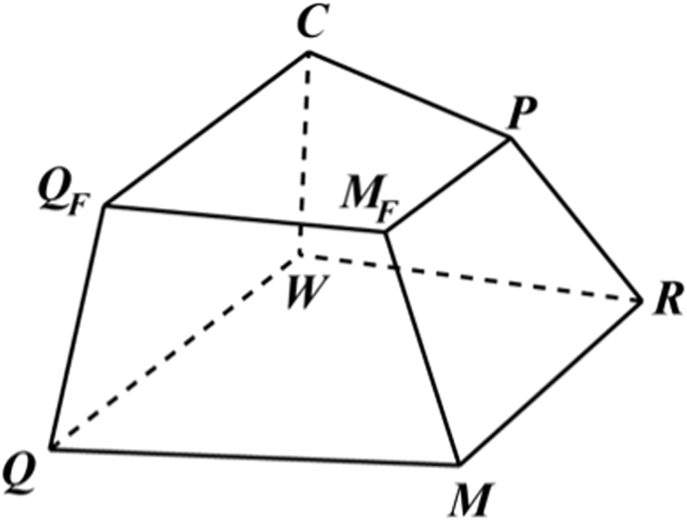
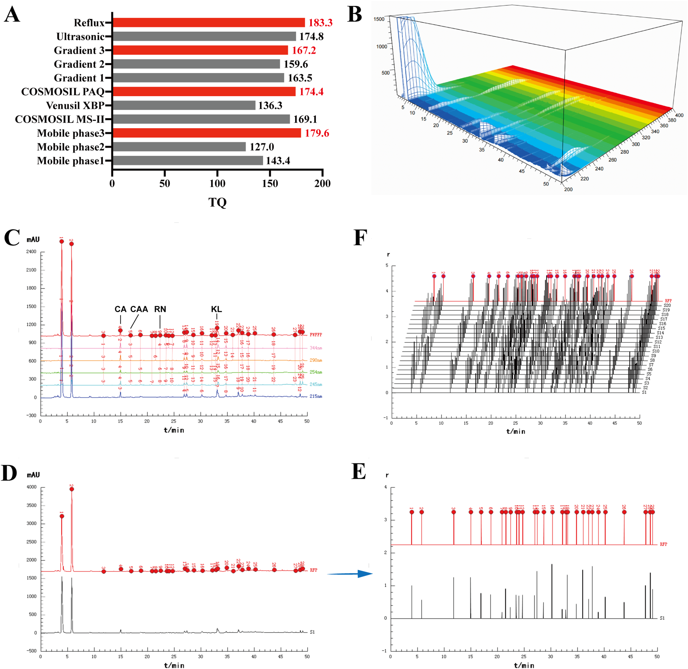
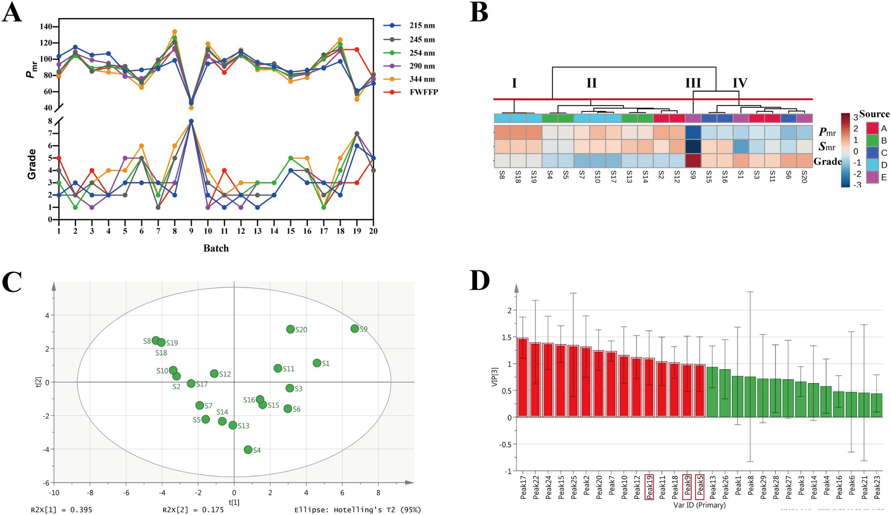
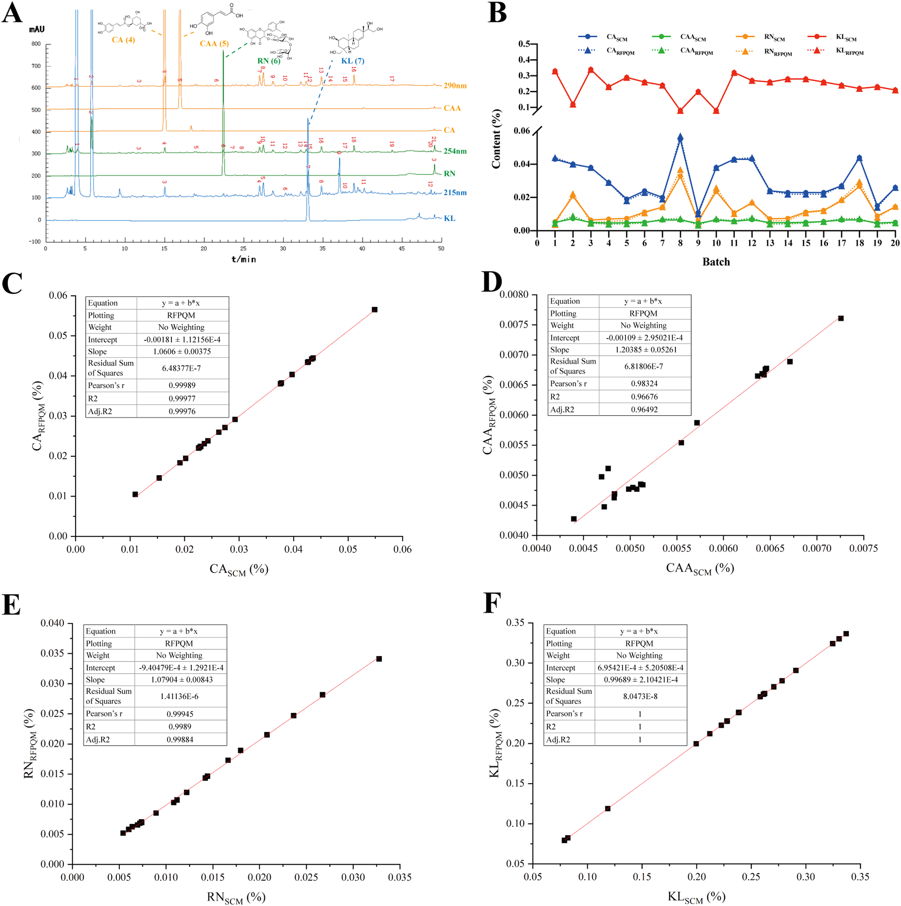
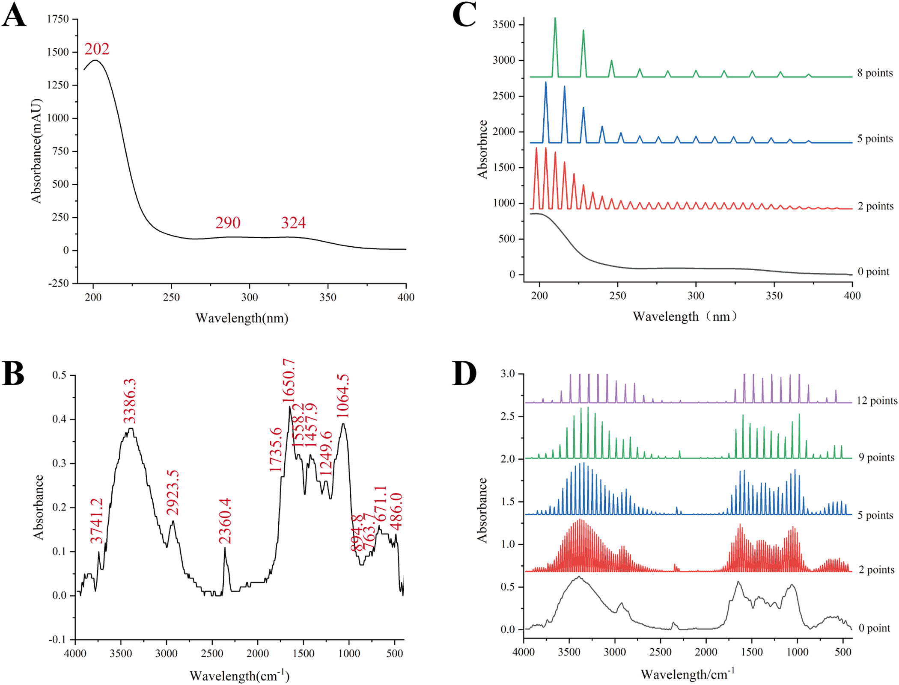
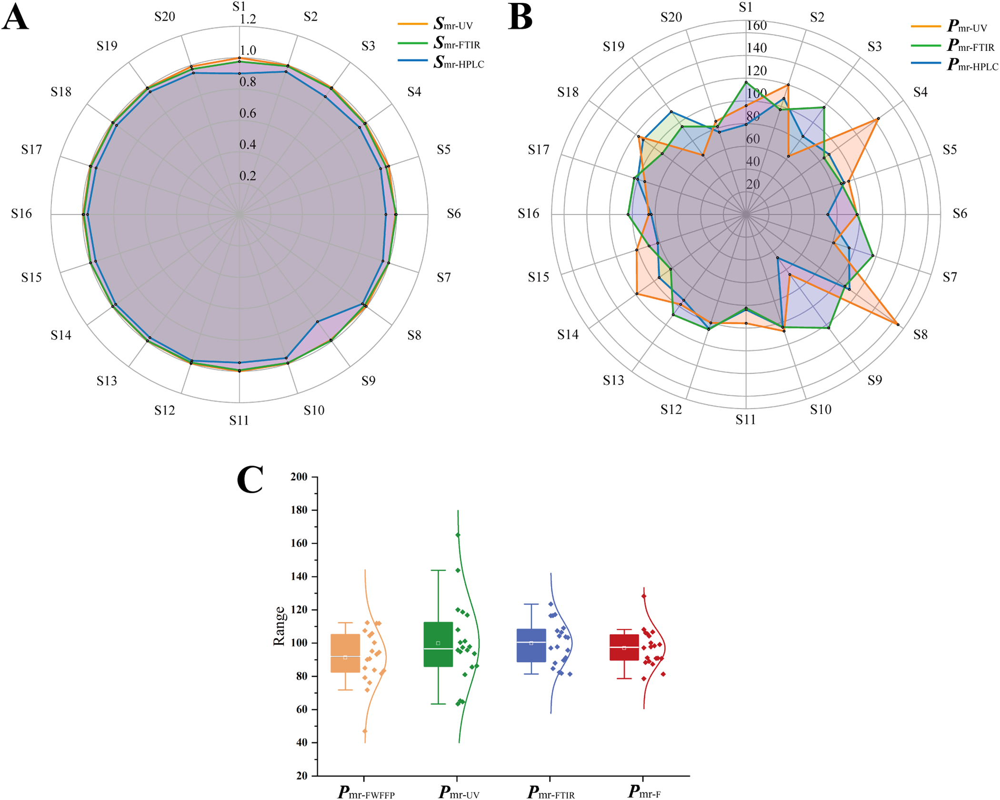
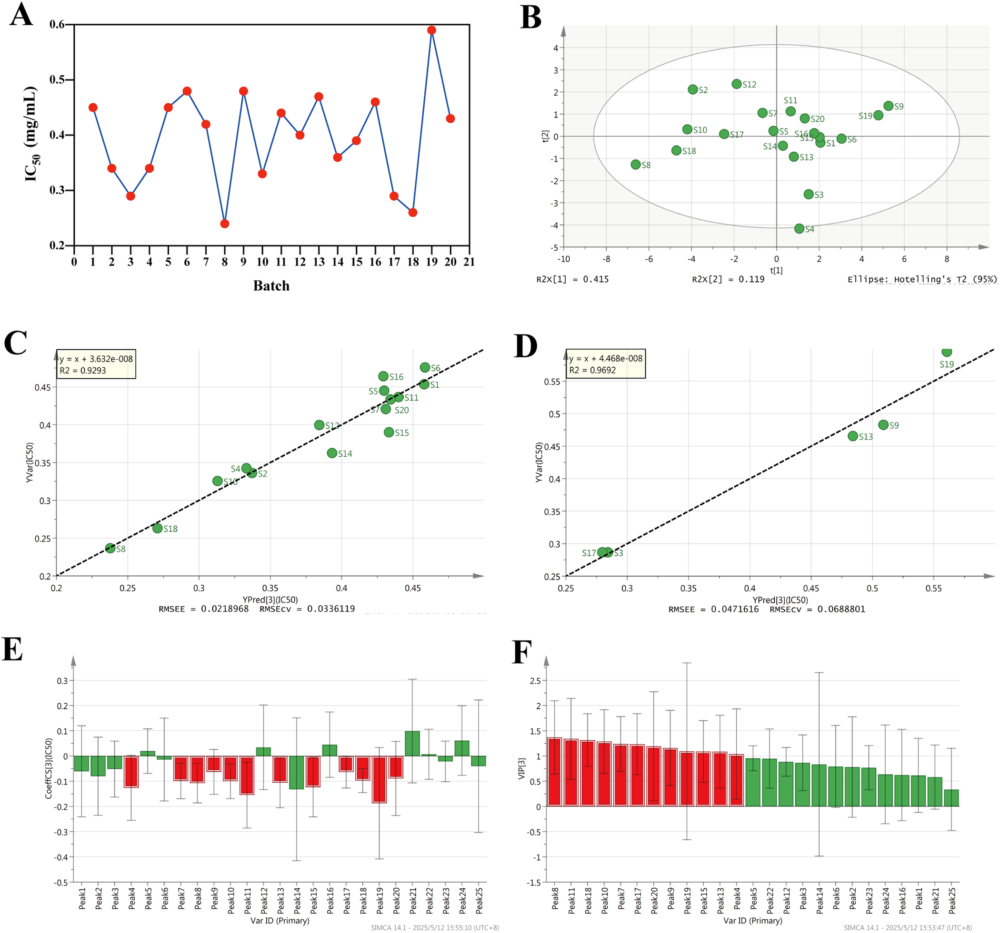

<!--
Yan H, Zhang Z, Lan L, Sun G. A comprehensive quality control system for Chinese
herbal medicine based on HPLC ratio quantitative fingerprinting and spectral
quantized fingerprinting combined with antioxidant activity: A case of
Siegesbeckiae Herba. Journal of Chromatography A 1760 (2025) 466313.
doi:10.1016/j.chroma.2025.466313 の全訳密度日本語版（ネイティブ抽出テキストを基に再構成）。
-->

> **補足（本サイトでの位置づけ）:** 本研究は当サイトが扱う「生薬の多次元品質評価」の典型例。中国薬局方（2020年版）が豨薟草（きけんそう）についてキレノール1成分だけを品質マーカーとする現状に対し、著者ら（瀋陽薬科大学・孫国祥グループ）は **HPLC 5波長融合指紋＋比率定量指紋法（RSQFM）＋UV/FTIR量子化指紋＋DPPH抗酸化活性** を統合した包括的な品質管理系を提案する。核心は「試料指紋と標準指紋の**ピーク面積比 ri=xi/yi**」で評価する発想で、補正係数の偏りを排し、参照指紋定量法（RFPQM）により1回の標準定量から複数成分を求めて標準品消費を大幅に減らす。孫グループの一連の「systematically quantified fingerprint」研究の系譜にあり、当サイトの複方甘草片（CLT）論文とも同じ方法論。**IF:** J. Chromatogr. A = 3.8（JCR2024・Q1）。

---

# 書誌情報

- **原題:** A comprehensive quality control system for Chinese herbal medicine based on HPLC ratio quantitative fingerprinting and spectral quantized fingerprinting combined with antioxidant activity: A case of Siegesbeckiae Herba
- **著者:** Hui Yan, Zhenwei Zhang, Lili Lan（責任著者）, Guoxiang Sun（孫国祥・責任著者）
- **所属:** 瀋陽薬科大学 薬学院（College of Pharmacy, Shenyang Pharmaceutical University, 遼寧省瀋陽）
- **掲載誌:** Journal of Chromatography A 1760 (2025) 466313
- **DOI:** 10.1016/j.chroma.2025.466313（2025年7月6日受付／8月22日改訂受付・受理／8月26日オンライン）
- **資金:** 国家自然科学基金（No. 81573586）
- **© 2025 Elsevier B.V.**

> **略語:** CHM=漢方生薬；SH=豨薟草（Siegesbeckiae Herba）；FWFFP=5波長融合指紋（five-wavelength fusion fingerprint）；RSQFM=比率系統的定量指紋法（ratio systematically quantitative fingerprint method）；RFPQM=参照指紋定量法（reference fingerprint quantitative method）；ROFP=比率定量指紋（ratio quantitative fingerprint）；SFP=試料指紋；RFP=参照指紋；Sm=マクロ定性類似度；Pm=マクロ定量類似度；FIA=フローインジェクション分析；SCM=標準曲線法；QFP=量子化指紋；DPPH=1,1-ジフェニル-2-ピクリルヒドラジルラジカル；TQ=総指紋情報量；CA=クロロゲン酸；CAA=カフェ酸；RN=ルチン；KL=キレノール。

---

# 要旨（Abstract）

信頼できる品質管理系は、漢方生薬（CHM）とその製剤の品質恒常性・臨床効能・安全性を保証するために不可欠である。本研究では、HPLC **5波長融合指紋（FWFFP）** とその **比率定量指紋（ROFP）** を確立し、革新的な **比率系統的定量指紋法（RSQFM）** を品質評価に適用した。22バッチの豨薟草（SH）を6等級に分類した（0.845 < Smr < 0.980、47.0% < Pmr < 112.3%）。続いて評価結果の信頼性を不確かさパラメータで評価し、全値が閾値0.2未満で本手法の頑健性を確認した。加えて4成分の含量を標準曲線法（SCM）と参照指紋定量法（RFPQM）の両方で測定し、両者に有意差がなくRFPQMの正確性を確認した。さらにUVとFTIRの量子化指紋（QFP）を構造特性化と定性-定量類似度評価に用いた。HPLC・UV・FTIRのRSQFM評価結果を等重み融合アルゴリズムで統合し、全SHを5等級に分類した（0.942 < Smr < 0.991、78.6% < Pmr < 128.3%）。最後に指紋-効能相関解析で、クロロゲン酸・カフェ酸・ルチンを含むSHの潜在的抗酸化成分を同定した。本研究の統合評価法は、クロマト指紋・分光プロファイル・精密定量・抗酸化活性を通じてSHの包括的かつ迅速な品質評価を可能にし、CHMとその製剤の品質管理に新規かつ実行可能な戦略を提供する。

---

# 1. 序論

漢方生薬（CHM）は十分に文書化された治療効能から臨床で広く用いられているが、活性成分の含量は生育環境や地理的産地の違いで大きく変動する [1]。安全性と有効性を保証するには合理的な分析法による品質管理が必要である。豨薟草（SH）は *Sigesbeckia orientalis* L.、*S. pubescens* Makino、*S. glabrescens* Makino の乾燥地上部で、伝統的に祛風湿・関節痛緩和・解毒に用いられる [2,3]。現在、豨桐丸（Xitong Pills）や複方豨薟草カプセルなど複数のSH製剤が関節炎などの治療に上市され良好な臨床効能を示す。しかしSHの品質管理法は依然として不十分で、**中国薬局方（2020年版）はキレノール含量のみを単一マーカーとする** [4]。したがって一貫した治療効能と臨床信頼性を保証する、より包括的で信頼できる品質評価系の確立が急務である。

近年、CHMの品質管理系の科学的厳密性・合理性を高める大きな進展があった [5–7]。近代分析技術の急速な発展に伴い、クロマト指紋法はCHM品質評価に最も有効なアプローチの一つとして国際的に認知されている [8]。中でもHPLCは優れた分離能と定量精度により指紋分析で広く受容されている [9,10]。しかし従来法は主に単一ピーク面積と限られた検出技術に依存し、包括的品質評価を提供できないことが多い [11–14]。この限界に対し、本研究は革新的に **比率系統的定量指紋法（RSQFM）** を採用した。これは試料指紋（SFP）と参照指紋（RFP）のピーク面積比（ri = xi/yi）を計算して比率定量指紋（ROFP）を構築するものである。続いて2つの重要指標——**比率マクロ定性類似度（Smr）** と **比率マクロ定量類似度（Pmr）**——を計算し、定性・定量の両観点からバッチ間品質変動を総合評価する [15,16]。

従来指紋と比べたRSQFMの主要な特徴と利点は次のとおり：(1) **質量比ベース評価**：各指紋のピーク面積比（xi/yi）を計算指標とし、値は1の周辺で変動する；(2) **標準指紋の正規化**：全標準指紋を含量1（100%）に設定；(3) **定量的相同性**：比率 ri = xi/yi が補正係数の偏りを排し、偏りのない試料評価を保証；(4) **エネルギー表現**：ri は系のエネルギー準位を反映し、試料と標準の熱力学的差を直接示す；(5) **精度向上**：補正係数誤差を生じやすい従来のピーク面積ベース法と異なり、相対質量比を用いて一貫した元素的定量を高精度で可能にする。特にこのアプローチは、RFP中の対応成分を定量してROFPピーク面積で換算することにより、SFP中のマーカー成分含量（CSFP）を **CSFP = ri × CRFP** で決定でき、これを **参照指紋定量法（RFPQM）** と呼ぶ。これにより標準品消費を大幅に削減し、CHM品質管理に効率的で費用対効果の高い解を提供する。

CHM成分の複雑さから、その指紋特性は波長により大きく変動する。従来の単一波長分析法は情報が限られるが、本研究の多波長融合指紋技術はこの限界を克服する [17]。具体的には、豊富な指紋情報をもつ5つの特性波長を選び、各波長の最大指紋ピークを1つのクロマトグラムに統合して、異なる化学成分の複数波長にわたる最大吸収特性を組み合わせた **5波長融合指紋（FWFFP）** を構築する [18]。これは簡略化された多次元指紋分析戦略であり、CHMとその製剤のより包括的で効率的な品質評価を可能にする。

しかしRFPは通常、複数の試料指紋を平均して構築されるため、本質的に不確かさの問題を抱え、品質評価の信頼性に直接影響する。同様にバッチ間変動は個々の試料をRFPに対して評価する際にさらなる不確かさを導入する。測定不確かさ（1980年代に国際度量衡局（BIPM）が結果の信頼性を定量化するために導入）は計量・産業で広く採用されている [19] が、CHM指紋への応用は限定的である。本研究では不確かさ理論を適用し、RFPと各バッチ試料の信頼性を系統的に評価して、指紋分析結果と品質評価結果の信頼性をさらに検証した。

加えて、CHMの一部成分はHPLC分析波長範囲で有効に検出されないことがある。この限界に対し、本研究は補完的分析技術としてFTIRとUVを導入した。FTIRは分子化学結合の振動・回転吸収に基づき、生薬成分の官能基と分子構造特性の情報を与える [20]。UVは分子中の共役系と発色団の電子遷移特性を活かし、紫外吸収をもつ化合物の分析に適し [21]、UVスペクトルデータの取得にはフローインジェクション分析（FIA）を用いる [22]。クロマト技術の制約を克服するため、HPLC結果をUV・FTIR評価と統合し、組成含量と構造の両面からSHの包括的品質評価を可能にした。ただしFTIR・UVスペクトルはデータ量が膨大なため、より効率的で合理化されたデータ処理法が必要である。本研究は革新的に **量子化指紋技術** をFTIR・UVスペクトルに適用した [23,24]。量子化スペクトルは豊富な特性情報を与えるだけでなく、量子化ピーク帰属後もクロマトピークの基本属性を保持し [25]、定性・定量類似度評価を支える。

近年、フリーラジカル生物学は大きく進展した。多くの臨床研究が種々の疾患とフリーラジカル代謝の乱れの密接な関連を示している [26–28]。抗酸化物質のラジカル消去・レドックス平衡維持の重要な役割から、薬物の抗酸化活性の評価は大きな研究意義をもつ。化学指紋特性と抗酸化活性の関係を解明するため、本研究は **部分最小二乗（PLS）回帰** と **DPPHラジカル消去アッセイ** を組み合わせて抗酸化能を系統的に評価し、指紋-効果関係モデルを確立した。

要するに、本研究はRSQFMを革新的に用いて異なる産地のSH試料間のマクロ定性・定量類似度を評価し、初めてRFPQMを導入して精密な成分定量を達成した。さらにHPLC・FTIR・UVの特性プロファイルと抗酸化活性評価を組み合わせ、化学組成・構造特性・生物活性を統合した包括的品質評価系を開発した。

---

# 2. 材料と方法

## 2.1 試薬と試料

クロロゲン酸（CA、純度99.9%）・カフェ酸（CAA、99.7%）・ルチン（RN、99.9%）は中国食品薬品検定研究院（北京）から、キレノール（KL、98%）は成都埃法生物科技から購入。クロマトグラフィーグレードのメタノール・アセトニトリルは禹王実業（山東）、リン酸は科竜化学試薬工場（成都）、Wahaha水は娃哈哈啟力食品（瀋陽）より。**20バッチのSH（*S. pubescens* Makino）** を S1〜S20 と標識。産地は S2/S3/S11/S12＝河北省（A）、S4/S5/S13/S14＝雲南省（B）、S6/S15/S16＝安徽省（C）、S7/S8/S10/S17〜S19＝広西省（D）、S1/S9/S20＝山西省（E）。（要旨では22バッチと記載されるが本文の試料表は20バッチ。**要確認**。）

## 2.2 試料調製

**2.2.1 HPLC試料:** 混合標準液——各標準（CA・CAA・RN・KL）を精秤し80%メタノールに溶解、混合後に同溶媒で6濃度に段階希釈して検量線用とした。試料液——SH約4 gに80%メタノール50 mLを加え秤量、76℃で1時間加熱還流。室温冷却後に溶媒で減量分を補い、0.45 µmメンブレンで濾過。

**2.2.2 FTIR試料:** SH試料を均一に粉砕し60メッシュ篩過。

**2.2.3 UV試料:** HPLCと同じ前処理。条件最適化後、試料液を10倍希釈し0.45 µm膜で濾過。

## 2.3 装置と分析条件

**2.3.1 HPLC:** Agilent 1260（四元ポンプ・ALSオートサンプラー・DAD）。カラム COSMOSIL C18（5C18-PAQ、4.6×250 mm、5 µm、Nacalai）、流量1.0 mL/min、カラム温度(35±2)℃。移動相A＝0.1% v/v リン酸水溶液、移動相B＝アセトニトリル。グラジエント：0〜15分 95→80%A；15〜30分 80→70%A；30〜40分 70→50%A；40〜45分 50→20%A；45〜50分 20→5%A；50〜55分 5→95%A。

**2.3.2 FTIR:** ican-9 FT-IR（天津能譜）、ZnSe結晶ATR＋DTGS検出器。0.1 g KBr錠でバックグラウンド測定後、試料をKBrと1:25(w/w)で均一混合し0.1 gを錠剤化。4000〜400 cm⁻¹を1 cm⁻¹間隔、分解能16 cm⁻¹、積算8回、25℃で取得。各試料3反復、CSV出力。

**2.3.3 UV:** 上記Agilent 1260のカラムをPEEK管（5000 mm×0.12 mm）に置換。検出190〜400 nm（2 nm間隔）、FIA原理、移動相A:B=1:1をキャリアに、PEEK管温度35℃、流量0.5 mL/min、注入2 µL、2分以内で取得。

**2.3.4 抗酸化活性:** Hongら [29] のDPPH法を微修正。試料液（2.2）を8 mg/mLに希釈し、希釈SH液（100/150/200/250/300 µL）を希釈DPPH液（0.128 mg/mL）1 mLと迅速混合、80%メタノールで5 mLに定容（最終0.16〜0.48 mg/mL）。暗所37℃で40分後、517 nmで吸光度減少を測定。各3反復。DPPHラジカル消去率（RS%）は式(1)：

$$RS\% = \frac{A_{control} - (A_{sample} - A_{sample\,blank})}{A_{control}} \times 100\% \tag{1}$$

A_control＝ブランク（DPPHのみ）、A_sample＝試料、A_sample blank＝DPPHなし試料液の吸光度。RS%を濃度に対しプロットして検量線を作り、**IC50**（DPPHの50%消去に要する濃度）を線形内挿で決定。IC50値で各試料の抗酸化能を定量評価。

## 2.4 データ解析

UV・FTIRの量子化には自作「中薬スペクトル量子プロファイリング一貫性デジタル評価システム4.0（TCM-SQPC-DES 4.0、ソフト登録番号7037415）」、類似度評価には「中薬クロマト指紋デジタル定量・知能評価システム6.0（登録番号0407573）」を使用。可視化はOrigin 2021、PLSはSIMCA-P 14.0、相関解析とt検定はSPSS 22.0、化学構造式はChemDraw 19.0、画像合成はAdobe Illustrator 2020。

---

# 3. 理論

## 3.1 比率系統的定量指紋法（RSQFM）

試料指紋（SFP）ベクトル **X**=(x₁,…,xₙ) と参照指紋（RFP）ベクトル **Y**=(y₁,…,yₙ)（xi・yi はSFP・RFPのピーク面積）から、比率定量指紋（ROFP）を計算する。保持時間に対し ri=xi/yi をプロットして ROFPベクトル **XR**=(x₁/y₁,…,xₙ/yₙ)=(r₁,…,rₙ) を得る（ri は各指紋の質量比）。一方RFP側は **YR**=(1,…,1)=(100%,…,100%) に変換され、各指紋ピークの含量が一律1（100%）であることを示す。

比率定性類似度（S′F）は **XR** と **YR** から式(2)で導かれる。平均質量百分率（M）・マクロ含量類似度（R）・投影含量類似度（C）・補正定量類似度（QF）は数学的に等価で補足資料の式(S1)で定義、モジュラス百分率（W）と定量類似度（Q）は式(S2)、含量類似度（P）と補正平均質量百分率（MF）は式(S3)で等価。これらが包括的な定性・定量品質管理系を成す（**図1**）。各レベルで2つの類似度指標の平均（W&R、P&C、Q&M、QF&MF）をとることで、第1〜第4レベルの比率ベース完全定量類似度指標が確立される。

RSQFMは、ROFPのカテゴリ属性を決める **比率マクロ定性類似度 Smr**（式3）と、ROFPの全体定量特性を監視する **比率マクロ定量類似度 Pmr**（式4）を用いる。

$$S'_F = \frac{\sum_{i=1}^{n} r_i}{\sqrt{n \sum_{i=1}^{n} r_i^2}} = \frac{M}{Q} \tag{2}$$

$$S_{mr} = S'_F = \frac{M}{Q} \tag{3}$$

$$P_{mr} = \frac{1}{2}(C + P) = \frac{1}{2}(Q_F + M_F) = \frac{1}{2}(1 + S'_F)\,M \tag{4}$$

両パラメータ（Smr・Pmr）を総合評価してCHMの品質を8等級に分ける：等級1（Smr≥0.95、95%≤Pmr≤105%）、等級2（Smr≥0.90、90〜110%）、等級3（Smr≥0.85、80〜120%）、等級4（Smr≥0.80、75〜125%）、等級5（Smr≥0.70、70〜130%）、等級6（Smr≥0.60、60〜140%）、等級7（Smr≥0.50、50〜150%）、等級8（Smr<0.50、Pmr<50%または>150%）。

## 3.2 不確かさと信頼性

RFPは通常10バッチ超の代表試料の指紋を平均して生成するため、試料間の変動が必然的にRFPに不確かさを導入する。RFPの不確かさは6パラメータ（式5〜10）で特性化する：① 定性不確かさ Uf（化学成分の比率分布の不確かさ）、② 比率定性不確かさ Ur（定量分布の不確かさ）、③ マクロ定性不確かさ US（比率と定量両方）、④ 投影含量不確かさ UC（全体含量の不確かさ）、⑤ 等重み含量不確かさ UP（集合的含量）、⑥ マクロ定量不確かさ UM。

RFP確立後、各試料指紋の不確かさをさらに決定できる。これは指紋均質化変動係数 α（定性・定量評価中に生じる固有の不確かさ、式11）に依存する。RFPの6パラメータに基づき、個々の試料指紋の6パラメータ（式12〜17）：① Ufi、② Uri、③ USi、④ UCi、⑤ UPi、⑥ UMi を計算する。U値により指紋信頼性を8等級に分類：等級1（U≤0.05）、2（≤0.10）、3（≤0.15）、4（≤0.20）、5（≤0.30）、6（≤0.40）、7（≤0.50）、8（>0.50）。**U値が0に近いほど信頼性が高く、0.2超は一般に指紋が信頼できないことを示す。**

$$U_f = \sqrt{\frac{1}{m(m-1)}\sum_{j=1}^{m}(S_{Fj}-1)^2} \tag{5}$$

$$U_r = \sqrt{\frac{1}{m(m-1)}\sum_{j=1}^{m}(S'_{Fj}-1)^2} \tag{6}$$

$$U_S = \frac{1}{2}\sqrt{U_f^2 + U_r^2} \tag{7}$$

$$U_C = \sqrt{\frac{1}{m(m-1)}\sum_{j=1}^{m}(C_j-1)^2} \tag{8}$$

$$U_P = \sqrt{\frac{1}{m(m-1)}\sum_{j=1}^{m}(P_j-1)^2} \tag{9}$$

$$U_M = \frac{1}{2}\sqrt{U_C^2 + U_P^2} \tag{10}$$

$$\alpha = \left|1 - \frac{P}{C}\right| \tag{11}$$

$$U_{fi}=\sqrt{U_f^2+\alpha^2}\ (12)\qquad U_{ri}=\sqrt{U_r^2+\alpha^2}\ (13)$$

$$U_{Ci}=\sqrt{U_C^2+\alpha^2}\ (14)\qquad U_{Pi}=\sqrt{U_P^2+\alpha^2}\ (15)$$

$$U_{Si}=\frac{1}{2}\sqrt{U_{fi}^2+U_{ri}^2}\ (16)\qquad U_{Mi}=\frac{1}{2}\sqrt{U_{Ci}^2+U_{Pi}^2}\ (17)$$

## 3.3 参照指紋定量法（RFPQM）による定量

RFPは20バッチのSHのSFPを自作ソフトで平均して生成し、SFPの品質評価基準として用いる。ROFPは3.1節の手法で導く。RFP中のマーカー含量を標準曲線法（SCM）で算出後、試料中のマーカー含量を式(18)で計算する。CSFP(%)・CRFP(%)はSFP・RFP中のマーカー含量、mR・mSはRFP・試料の秤取量、rはROFPのピーク面積。このアプローチは合理化されたワークフローで信頼できる結果を与え、標準品への依存を最小化する。

$$C_{SFP}(\%) = C_{RFP}(\%) \times \frac{m_R}{m_S} \times r \tag{18}$$

---

# 4. 結果と考察

## 4.1 クロマト指紋分析

**4.1.1 クロマト条件の最適化:** 有効時間内に最適指紋を確立するため、移動相組成・グラジエント・カラム選択・抽出法など主要パラメータを系統的に最適化（条件別クロマトは図S1）。最適化は **総指紋情報量（TQ）**（クロマト信号強度・ピーク分布均一性・全体情報量を総合評価する自作ソフトの指標、式S4）で導いた。TQが高いほど情報が豊富で抽出効率が優れる。図2Aのとおり2.3.1節の条件が最高TQを示し、最良条件と確認。

**4.1.2 指紋法のバリデーション:** 試料S1で精度・再現性・安定性を評価（全特性ピークの相対保持時間RRT・相対ピーク面積RPAのRSDで判定）。CAピークを良好なピーク形状・分離から参照ピークとした。精度：S1を6連続注入しRRTのRSD<0.3%・RPAのRSD<3.84%。再現性：独立6調製でRRT<0.35%・RPA<2.28%。安定性：室温(25±2)℃で24時間まで安定（0/2/4/8/12/24時間でRRT<0.6%・RPA<2.5%）。

**4.1.3 RSQFMによる5波長融合指紋分析:** CHMは複雑な化学成分を含み、多くが低濃度で異なる最大UV吸収波長をもつ。3次元スペクトルクロマトで全UV域の吸収特性を解析（図2B）、成分検出を最大化する5つの最適監視波長（**215・245・254・290・344 nm**）を選択。図2Cのとおり、これら波長での差次的吸収パターンは単一波長では完全なフィトケミカルプロファイルを特性化できないことを示す。自作ソフトの最大化法で**5波長融合指紋（FWFFP）**を構築（融合時間窓0.1分で最適ピークマッチング・化学情報保持を達成）。**FWFFPは29共通ピークを検出**（単一波長では215 nm:12、245 nm:25、254 nm:21、290 nm:17、344 nm:18）。この手法は迷光ピーク干渉を大幅に低減しつつ、生物活性成分の完全プロファイルを従来の単一波長検出より効果的に保持した。

20試料の総合品質評価のため定性・定量類似度解析を実施。5波長指紋とFWFFPデータを評価ソフトに取り込み（図S2）、全試料のクロマトを平均してRFPを生成、各試料のROFPを作成（図2D,E）。RSQFMで各試料を系統評価（図2F）。**表1**・図3Aのとおり、異なる単一波長で得たPmr値・等級分類は似た傾向を示すが有意な変動があり、単一波長データが限られた情報しか与えず精度の低い品質評価をもたらすことを確認。対照的にFWFFP法は5波長の最大指紋ピーク情報を統合してより信頼できる結果を与えた。**FWFFP評価で20バッチを8等級に分類**。16バッチが等級1〜4で受容基準（Smr>0.95、80%<Pmr<120%）を満たし合格。残る4バッチ（S1・S6・S9・S20）は等級5〜8で品質不良。特にS1・S9・S20はすべて産地Eで、地理的産地間の実質的な品質変動を示した。FWFFP結果のクラスター解析で試料を4群に分割（図3B）。群IIIはS9のみで著しく不合格（Smr=0.845、Pmr=47.0%、等級8）。他19バッチはすべてSmr>0.900で組成が類似するが、Pmr値は大きく変動（71.8%〜112.3%）、成分濃度の実質差を反映（生育環境・保存条件の違いに起因すると推定）。

**表1. SHの指紋評価結果（各単一波長・FWFFP、Smr／Pmr／等級。抜粋）**

| バッチ | 215nm | 245nm | 254nm | 290nm | 344nm | FWFFP |
|---|---|---|---|---|---|---|
| S1 | 0.950/103.5/2 | 0.914/84.0/4 | 0.893/85.1/3 | 0.912/93.5/2 | 0.889/80.2/4 | **0.900/79.2/5** |
| S2 | 0.955/114.9/3 | 0.956/108.4/2 | 0.960/104.4/1 | 0.944/107.0/2 | 0.952/109.4/2 | **0.958/107.5/2** |
| S8 | 0.938/98.7/2 | 0.980/120.7/5 | 0.988/126.4/5 | 0.971/113.9/3 | 0.989/134.1/6 | **0.968/112.3/3** |
| S9 | 0.877/46.0/8 | 0.868/48.5/8 | 0.845/48.0/8 | 0.838/48.6/8 | 0.865/40.2/8 | **0.845/47.0/8** |
| S12 | 0.972/110.0/2 | 0.976/106.4/2 | 0.975/105.1/2 | 0.973/104.3/1 | 0.985/111.6/3 | **0.980/105.8/2** |
| S19 | 0.957/61.5/6 | 0.932/57.8/7 | 0.930/57.1/7 | 0.933/58.8/7 | 0.940/50.5/7 | **0.967/111.9/3** |
| S20 | 0.926/70.1/5 | 0.954/80.9/4 | 0.953/80.7/4 | 0.942/75.3/5 | 0.961/81.9/4 | **0.949/76.2/5** |

（全20バッチの完全表は原文表1参照。単一波長間で等級が大きくぶれるバッチ〔例S19：単一波長で等級6-7だがFWFFPで等級3〕が、多波長融合の必要性を示す。）

**4.1.4 信頼性評価:** 20バッチのFWFFPとRFPのROFPに不確かさ・信頼性評価を実施（**表2**）。RFPは US=0.010、UM=0.030、他値も全て0.050未満で、定性・定量両評価で高信頼性。USi・UMiが定性・定量不確かさを総合評価するため、これらでバッチ間変動を解析。全試料が **USi≤0.112・UMi≤0.115** でSFP表現の優れた信頼性を示した。特に信頼性等級（ROFP評価結果の信憑性）と品質等級（試料品質）に直接の相関はない。例：S11は品質等級4だが信頼性等級1で結果が信頼できる。S6・S20は品質等級5を共有するが信頼性等級はそれぞれ2・1で、S20の等級5結果がS6より信頼できる。指紋分析に不確かさ・信頼性概念を導入することで、結果の信憑性を客観評価でき評価誤差を減らせる。

**表2. SFPとRFPのROFP信頼性評価結果（抜粋）**

| Para. | Uf(i) | Ur(i) | US(i) | UC(i) | UP(i) | UM(i) | 等級 |
|---|---|---|---|---|---|---|---|
| RFP | 0.014 | 0.014 | 0.010 | 0.038 | 0.045 | 0.030 | 1 |
| S1 | 0.110 | 0.110 | 0.078 | 0.116 | 0.118 | 0.083 | 2 |
| S9 | 0.158 | 0.158 | 0.112 | 0.162 | 0.164 | 0.115 | 3 |
| S12 | 0.027 | 0.027 | 0.019 | 0.044 | 0.050 | 0.034 | 1 |
| S20 | 0.054 | 0.054 | 0.038 | 0.064 | 0.069 | 0.047 | 1 |

（全20バッチの多くが信頼性等級1〔U≤0.05〕。最も不確かさが大きいのはS9〔等級3〕。全U値<0.2で手法の頑健性を確認。）

**4.1.5 ROFPとRSQFM等級の相関:** FWFFPのROFPの29ピーク面積をX行列、20試料のRSQFM等級をYベクトルとしてPLS解析。全試料が95%信頼区間内（図3C）。各ピークのVIP値を算出し等級への相対寄与を示した（図3D）。**VIP>1のピーク**（赤）が等級と強く相関。FWFFPでピーク4・5・9・19がそれぞれCA・CAA・RN・KLと同定され、うち **CAA・RN・KLがVIP>1** で試料等級に有意な影響を示し、これら成分の定量管理の必要性を示した。

## 4.2 4成分の定量分析

**4.2.1 方法バリデーション:** 保持時間とUVスペクトルを標準品と比較し4マーカーを同定。ピーク7（215 nm、33分）・ピーク6（254 nm、22分）・ピーク4（290 nm、16分）・ピーク5（290 nm、15分）をそれぞれKL・RN・CA・CAAと確認（図4A・図S3）。標準添加法の回収試験で正確性を評価。精度・安定性・再現性でRRT・ピーク面積のRSD<2.10%。4成分の平均回収率は96.3%（RSD 2.21%）・97.0%（2.50%）・102.3%（2.32%）・101.3%（2.98%）で優れた正確性。検量線は全成分で優れた直線性（**表3**、r≥0.9998）。LOD/LOQが全分析種の感度を確認。

**表3. KL・RN・CA・CAAの回帰式・直線範囲・LOD・LOQ**

| 成分 | 標準曲線 | r | 直線範囲(µg/mL) | LOD(ng) | LOQ(ng) |
|---|---|---|---|---|---|
| KL | y=7.5325x+4.6434 | 0.9998 | 9.8〜390.0 | 24.5 | 49.0 |
| RN | y=18.090x−33.473 | 0.9998 | 6.6〜264.0 | 16.5 | 33.0 |
| CA | y=22.351x−35.651 | 0.9998 | 5.2〜208.0 | 13.0 | 26.0 |
| CAA | y=40.133x−87.642 | 0.9999 | 7.0〜281.2 | 35.0 | 70.0 |

**4.2.2 SCMとRFPQMによる定量:** SCMでCA（290 nm）・CAA（290 nm）・RN（254 nm）・KL（215 nm）を測定。20バッチの4成分含量をSCMとRFPQMで算出（表S2・図4B）。**全試料でKL含量が薬局方要件（≥0.050%）を満たした**が、試料間で有意な変動があり、S3が最高KL含量（0.34%）、S8・S10が最低（0.08%）。興味深くS8は全試料中CA・RNが最高濃度で、生育環境や収穫後処理・保存条件の違いに起因しうる。CAAは4成分中で含量が最低かつ変動も最小で、外的要因の影響が小さいことを示唆。

RFPQMは複数成分の同時定量を可能にする。ROFPの面積をSFP/RFPピーク面積比として計算し、RFP中の対応成分を定量→試料重量正規化→ROFPピーク面積を乗じてSFP中の目的成分含量を決定（3.2節）。本研究ではRFP中4成分をSCMで定量し、試料の4成分ROFPピーク面積（r）を自作ソフトで生成（表S1）、式18で各SFP含量を導いた（表S2・図3F）。**RFPQM結果はSCMデータと優れた一致**を示し本法の正確性を検証。全結果の相対偏差（RD）を算出し全てRD<6.0%。さらにSCM測定値とRFPQM算出値の相関解析（図4C-F）で強い相関を確認。RFPQMは同一クロマト条件下でRFPを1回定量するだけでSFP試料中の複数成分を決定でき、日常分析で迅速かつ信頼できる。

## 4.3 分光指紋分析

**4.3.1 方法バリデーション:** 試料S1でUV・FTIR法の適用性を検証。精度・再現性・安定性を保持時間・ピーク面積のRSDで評価し、それぞれ<0.02%・<2.39%。直線回帰でUVは0.4〜2.0 mg/mL（y=43864x+2167.8、r=0.9990）、FTIRは2.0〜3.0 mg（y=39.143x−0.4238、r=0.9992）で優れた直線性。

**4.3.2 UVスペクトル特性:** 20バッチのUV-Vis吸収（190〜400 nm）を図5Aに提示。202・290・324 nmに3つの特性極大。これらは(i)テルペノイド末端の二重/三重結合、(ii)フラボノイド・フェニルプロパノイド芳香族系のπ→π*電子遷移、(iii)高度に共役したフェノール化合物に由来と推定。全試料が著しく類似の吸収プロファイルを示し、CHM特有の複雑なフィトケミカル組成の統合寄与を反映。

**4.3.3 FTIRスペクトル特性:** 4000〜400 cm⁻¹のFTIR吸収（図5B）。特性吸収帯：3741.2・3386.3 cm⁻¹＝遊離O–H・水素結合O–Hの伸縮；2923.5 cm⁻¹＝脂肪族CH₃/CH₂のC–H伸縮；2360.4 cm⁻¹＝脂肪族/芳香族三重結合伸縮；1735.6・1650.7 cm⁻¹＝エステル・共役カルボニルのC=O伸縮；1558.2・1457.9・1249.6 cm⁻¹＝N–H変角・C–H変角・O–H面内変角；1064.5 cm⁻¹＝C–O伸縮。

**4.3.4 UV・FTIRスペクトルの量子化指紋確立:** 元のUV・FTIRは品質関連情報を含むが、連続信号は直接解析に計算上の課題がある。連続スペクトルを離散的なクロマト量子化ピークに変換する **スペクトル量子化指紋** を適用（式19,20）：

$$H = Ab_{max} \tag{19}$$

$$A = Ab_1 + Ab_2 + Ab_3 + \cdots + Ab_n \tag{20}$$

H＝ピーク高、A＝ピーク面積、Abi＝各波数の吸光度、Abmax＝選択連続波帯の最大吸光度。量子化ピーク確立では異なる併合点のスペクトルへの影響を調査（図5C,D）。UVは併合点2/5/8、FTIRは2/5/9/12を試験。各併合点の量子化指紋を元スペクトルと比較（図S4）、Pmに有意差なし。t検定（SPSS）でUV・FTIRとも **P>0.05** で併合点変動間に有意差なし。最終的にスペクトル形状忠実度から**UVは併合点2、FTIRは9**を選び、UV量子化指紋33ピーク・FTIR量子化指紋45ピークを得た。これらは元プロファイルの全特性を保持しつつ、より直截的な解析解釈を提供する。

**4.3.5 類似度評価:** 最適条件で20バッチのUV・FTIRスペクトルを取得（図S5A-B）。生データ（CSV）をTCM-SQPC-DES 4.0で量子化（図S6A-B）、Smr・Pmrを算出。**UV-QFP** はバッチ間で高い類似度（Smr-UV>0.988）だがピーク面積に有意差（Pmr-UV=64.6〜165.1%）。定量解析で20バッチを8等級に分類、S3・S9・S19（等級6）・S4（等級7）・S8（等級8）が品質不良。**FTIR** はSmr-FTIR>0.975、Pmr-FTIR=81.4〜123.5%で全20バッチが等級5未満。UVよりFTIR評価が均一で、2分光技術の検出原理の違いに起因すると推定。要点：(1)UV・FTIRスペクトル特性はフィトケミカル組成と相関、(2)単一技術評価はCHM包括的品質評価に不十分——多モーダル分析の必要性を強く支持。

## 4.4 クロマトと分光の融合評価

図6A,Bのとおり、HPLC・UV・FTIR指紋評価結果に有意な相違があり、同一バッチでもPmr値の変動が視覚的に識別できた。これは各技術が捉える化学情報次元の違いに由来する：HPLCは特定成分プロファイル、UVは共役系特性、FTIRは官能基構造情報を反映。したがって単一技術の指紋データはCHMの全体的品質特性を包括的に表せず、より正確な品質評価には多技術統合戦略が不可欠。化学的関連情報の保持を最大化しつつ包括的評価戦略を開発するため、平均値アルゴリズム（式21,22）で3技術の評価パラメータを統合（**表4**）。

$$S_{mr-F} = \frac{1}{3}(S_{mr-FWFFP} + S_{mr-UV} + S_{mr-FTIR}) \tag{21}$$

$$P_{mr-F} = \frac{1}{3}(P_{mr-FWFFP} + P_{mr-UV} + P_{mr-FTIR}) \tag{22}$$

（原文の式21,22は加算のみの表記だが、3技術の等重み平均として実装される。）

**表4. SHの多重指紋類似度評価結果とIC50値（抜粋。HPLC/UV/FTIR/融合のSmr・Pmr、IC50）**

| バッチ | Smr-FWFFP/Pmr | Smr-UV/Pmr | Smr-FTIR/Pmr | Smr-F/Pmr-F | IC50(mg/mL) |
|---|---|---|---|---|---|
| S1 | 0.899/79.2 | 0.999/95.8 | 0.975/116.5 | 0.958/97.2 | 0.45 |
| S8 | 0.968/112.3 | 0.997/165.1 | 0.985/107.4 | **0.983/128.3** | **0.24** |
| S9 | 0.845/47.0 | 0.988/65.3 | 0.993/123.5 | **0.942/78.6** | 0.48 |
| S17 | 0.960/100.3 | 0.999/93.7 | 0.994/103.4 | 0.984/99.1 | 0.29 |
| S19 | 0.967/111.9 | 0.998/64.6 | 0.993/95.7 | 0.986/90.7 | **0.59** |

（全20バッチは原文表4参照。融合後 Smr-F>0.940、Pmr-F=78.6〜128.3%。）

総合評価では試料間で一貫した化学組成（Smr-F>0.940）、含量変動（Pmr-F：78.6〜128.3%）が許容限（70〜130%）内。Pmr-F値による品質格付けで5カテゴリに分類：S8（等級5）・S9（等級4）・残りバッチ（等級1〜3）。同一産地でも評価結果に変動があるのは、収穫プロトコル・収穫後処理・保存条件の固有差に起因しうる。図6Cの箱ひげ図で4つのPmr値を比較すると、HPLCとUVは平均・中央値がほぼ同一で比較的一貫、FTIRはより大きな分散・変動を示し（産地間で双極子モーメント変化成分に有意差があることを示唆）。融合アプローチは3技術のデータをより代表的に統合し、個別検出法の限界を克服してCHM品質一貫性評価の頑健な基盤を築く。

## 4.5 指紋と抗酸化活性の相関解析

SH試料の抗酸化能をDPPHラジカル消去アッセイでIC50として定量評価。IC50は抗酸化活性と逆相関（低いほど強い）。表4・図7Aのとおり、20バッチすべてが有意なラジカル消去能を示した（**IC50範囲：0.24〜0.59 mg/mL**）。

抗酸化活性とフィトケミカル組成（25特性成分のピーク面積で表現）の相関を評価するPLS回帰モデルを開発。全試料が95%信頼区間内（図7B）。信頼性検証のため20試料を訓練集合（n=15）と独立予測集合（n=5）に無作為分割（図7C,D）。訓練集合は高い説明力（R²Y=0.929）と強い予測能（Q²=0.752）、RMSEE（0.0219）とRMSEcv（0.0336）の差が小さくモデル頑健性を確認。予測集合はさらに良好（R²Y=0.969、Q²=0.742、RMSEE=0.0472、RMSEcv=0.0689）で優れた汎化性。校正と交差検証指標の近い一致が、過学習なく信頼できる予測性能を実証。

25独立変数（指紋ピーク）と従属変数（IC50）の相関解析で、**19ピークがIC50と負相関**（図7E）。既同定の3成分（CA(4)・CAA(6)・RN(8)）がこれら活性ピークに含まれ、フェノール酸とフラボノイドがSHの抗酸化に有意に寄与することを示唆。VIP解析（図7F）で **VIP>1の12ピーク**（G8(RN)・G11・G18・G10・G7・G17・G20・G9・G19・G15・G13・G4(CA)）を同定。抗酸化アッセイ（図7A）で20バッチ中 **S8が最強、S19が最弱** の抗酸化能を示し、定量データ（図4B）と高相関：S8はCA・RNが最高、S19が最低。これはCA・RNとSH抗酸化活性の有意な正相関を強く確認し、両者の品質マーカーとしての潜在性を示唆。ただしVIP>1の追加10潜在活性成分は構造同定が未完で、今後これら未知活性成分の同定・活性検証に注力する。

---

# 5. 結論

本研究は、単一波長分析の不完全な指紋情報の限界を克服する **FWFFP** を開発し、初めて **RSQFM** で20バッチのFWFFPの定性・定量評価を行った。得られた Smr-FWFFP・Pmr-FWFFP は異なる産地・バッチの試料を効果的に判別し、単一波長評価より有意に精度が向上。不確かさパラメータでRSQFM評価結果の信頼性を評価し満足な信頼性を示した。PLS解析はROFPピーク面積の過半（CAA・RN・KLのROFPを含む）と試料評価等級の強い相関を確認し、定量的組成分析の必要性を強調。SCMとRFPQMによる4成分定量は統計的有意差なく一致し、RFPQMの信頼性・正確性を検証。さらにUV-QFM・FTIR-QFMをHPLCの補完技術として導入。データ併合点アプローチがUV/FTIRデータ処理を簡略化しつつ重要な指紋ピーク情報を保持。クロマトと分光技術の検出範囲の違いを考慮し、等重み統合戦略で3指紋を組み合わせより包括的な品質特性化を可能にした。RSQFMはSHの品質評価に科学的基盤を与えるだけでなく、他のCHMとその製剤の分析の参照にもなる。化学組成が大きく異なる生薬でも、適切な品質分析プロトコルを確立すればRSQFMで信頼できる評価結果が得られる。最後に、指紋データとDPPH抗酸化結果を統合したPLSモデルがCA・CAA・RNなど顕著な抗酸化活性成分を同定。この多技術収束戦略はCHMに多次元品質評価枠組みを提供し、包括的品質管理への新規アプローチを与える。

---

# 訳者補足

- **RSQFMの勘所:** 従来の指紋類似度は「試料と標準のベクトルのなす角（コサイン類似度）」で定性を、ピーク面積和で定量を見るが、本法は各ピークを **ri=試料/標準の面積比** に変換してから評価する。比率は理想的に1（=100%）に揃うため、補正係数（成分ごとの感度差）を打ち消し、複数成分を横並びで比較できる。これが RFPQM（1回の標準定量で複数成分を換算）を成立させる鍵。
- **多次元化の意義:** 薬局方のキレノール1成分規格は「その1成分さえ基準を満たせば合格」で、全体組成のばらつき（表1でPmrが47〜112%と大きい）を捉えられない。HPLC（成分）＋UV（共役系）＋FTIR（官能基）＋DPPH（活性）を融合することで、化学組成・構造・生物活性の3層で品質を評価できる。
- **産地差:** 山西省産（E：S1/S9/S20）が総じて低評価、特にS9は全指標で最下位（等級8）。抗酸化はS8（広西省）が最強でCA・RN高含量と一致——「指紋-効能相関」が実際の活性差を説明できることを示す好例。
- **数値の扱い:** 本文は「20バッチ」で解析するが、要旨は「22バッチ」と記載する箇所があり不整合（**要確認**）。図S・表Sの一部（補足データ）は本文からは追えず原文補足資料参照。原文にない数値は加えていない。

## 参考文献

1. Shuaishuai Fan, L.G.; Tian, W.; Wang, B.; Wang, X.; Zhang, T.; Niu, L. Chemical components and pharmacological action for Siegesbeckiae Herba and predictive analysis on its Q-Marker, Chin. Herb. Med. 52 (23) (2021) 7389–7400.

2. Tao, H.X.; Zhao, G.D.; Linghu, K.G.; Xiong, W.; Sang, W.; Peng, Y.; Wang, Y.; Yu, H. Botany, traditional use, phytochemistry, pharmacology and toxicology of Sigesbeckiae Herba (Xixiancao): a review, Phytochem. Rev. 20 (3) (2021) 569–587. https://doi.org/10.1007/s11101-020-09714-4

3. Linghu, K.-G.; Xiong, S.H.; Zhao, G.D.; Zhang, T.; Xiong, W.; Zhao, M.; Shen, X.-C.; Xu, W.; Bian, Z.; Wang, Y.; Yu, H. Sigesbeckia orientalis L. Extract alleviated the collagen type II-induced arthritis through inhibiting multi-target-mediated synovial hyperplasia and inflammation, Front. Pharmacol. 11 (2020) 547913. https://doi.org/10.3389/fphar.2020.547913

4. National Pharmacopoeia Commission. Pharmacopoeia of the People's Republic of China (Part I), China Medical Science and Technology Press, Beijing, 2020.

5. Seo, C.S.; Shin, H.K. Simultaneous analysis for quality control of traditional herbal medicine, Gungha-Tang, using liquid chromatography-tandem mass spectrometry, Molecules 27 (4) (2022) 1223. https://doi.org/10.3390/molecules27041223

6. Wu, X.; Zhou, Y.; Yin, F.; Mao, C.; Li, L.; Cai, B.; Lu, T. Quality control and producing areas differentiation of Gardeniae Fructus for eight bioactive constituents by HPLC-DAD-ESI/MS, Phytomedicine 21 (4) (2014) 551–559. https://doi.org/10.1016/j.phymed.2013.10.002

7. Cai, M.; Zhang, Q.; Lan, L.; Sun, W.; Zhang, H.; Sun, G. Holistically assessing the quality consistency of compound liquorice tablets from similarities of both all chemical fingerprints and the integrated dissolution curves by systematically quantified fingerprint method, Talanta 264 (2023) 124774. https://doi.org/10.1016/j.talanta.2023.124774

8. Ma, D.; Wang, L.; Jin, Y.; Gu, L.; Yu, X.; Xie, X.; Yin, G.; Wang, J.; Bi, K.; Lu, Y.; Wang, T. Application of UHPLC fingerprints combined with chemical pattern recognition analysis in the differentiation of six Rhodiola species, Molecules 26 (22) (2021) 6855. https://doi.org/10.3390/molecules26226855

9. Jiang, Y.; David, B.; Tu, P.; Barbin, Y. Recent analytical approaches in quality control of traditional Chinese medicines - A review, Anal. Chim. Acta 657 (1) (2010) 9–18. https://doi.org/10.1016/j.aca.2009.10.024

10. Xu, Q.; Huo, X.; Yin, X.; Zhao, X.; Chen, M.; Wu, L.; Zhou, Y. Multivariate HPLC system assessment and optimization for traditional Chinese medicine: a case study of Gastrodia elata, Anal. Methods 16 (40) (2024) 6916–6928. https://doi.org/10.1039/d4ay01451k

11. Ma, C.J. Simultaneous determination of five compounds in descurainia sophia by HPLC-DAD, Nat. Prod. Sci. 29 (4) (2023) 305–311.

12. Ryu, G.H.; Ma, C.J. Simultaneous determination of eight compounds in Lysimachia christinae by HPLC-DAD, Nat. Prod. Sci. 28 (4) (2022) 187–193. https://doi.org/10.20307/nps.2022.28.4.187

13. Wang, H.; Zhan, C.; Wang, Y. Simultaneous determination of multiple components in Fuke Yangrong pill by HPLC, Acta Chromatogr. 35 (4) (2023) 326–330. https://doi.org/10.1556/1326.2022.01081

14. Zhang, Y.; Cao, C.; Yang, Z.; Jia, G.; Liu, X.; Li, X.; Cui, Z.; Li, A. Simultaneous determination of 20 phenolic compounds in propolis by HPLC-UV and HPLC-MS/MS, J. Food Compos. Anal. 115 (2023) 104877. https://doi.org/10.1016/j.jfca.2022.104877

15. Gu, P.; Chen, M.; Sun, G. Quality control and evaluation of Black chokeberry (Aronia melanocarpa) by three-wavelength fusion fingerprinting and electrochemical fingerprinting combined with antioxidant activity analysis, Food Chem. 450 (2024) 139303. https://doi.org/10.1016/j.foodchem.2024.139303

16. Yang, T.; Xue, L.; Liu, X.; Hao, C.; Gong, D.; Sun, G. Spectral and chromatographic fingerprint-based qualitative and quantitative evaluation strategy combined with chemometrics for quality control of functional red yeast, Microchem. J. 212 (2025) 113211. https://doi.org/10.1016/j.microc.2025.113211

17. Zhang, J.; Gong, D.; Lan, L.; Zheng, Z.; Pang, X.; Guo, P.; Sun, G. Comprehensive evaluation of Loblolly fruit by high performance liquid chromatography four wavelength fusion fingerprint combined with gas chromatography fingerprinting and antioxidant activity analysis, J. Chromatogr. A 1665 (2022) 462819. https://doi.org/10.1016/j.chroma.2022.462819

18. Chen, Y.; Lan, L.; Sun, W.; Zhang, H.; Sun, G. Quality control of Hugan capsule based on four-wavelength fusion profiling and electrochemical fingerprint combined with antioxidant activity and chemometric analysis, Anal. Chim. Acta 1251 (2023) 341015. https://doi.org/10.1016/j.aca.2023.341015

19. Li, S. JJF1059—1999 《Evaluation and expression of measurement uncertainty》 discussion 20: is there no class A uncertainty in a single measurement result? Ind. Meas. 6 (2008) 40.

20. Ji, Z.; Liu, H.; Li, J.; Wang, Y. ATR-FTIR as a green tool for rapid identity authentication of Gastrodia elata Blume under the influence of multi-biological variability, Vib. Spectrosc. 136 (2025) 103766. https://doi.org/10.1016/j.vibspec.2024.103766

21. Aceto, M.; Cala, E.; Gulino, F.; Gullo, F.; Labate, M.; Agostino, A.; Picollo, M. The use of UV-visible diffuse reflectance spectrophotometry for a fast, preliminary authentication of gemstones, Molecules 27 (15) (2022) 4716. https://doi.org/10.3390/molecules27154716

22. Yang, F.; Chu, T.; Zhang, Y.; Liu, X.; Sun, G.; Chen, Z. Quality assessment of licorice (Glycyrrhiza glabra L.) from different sources by multiple fingerprint profiles combined with quantitative analysis, antioxidant activity and chemometric methods, Food Chem. 324 (2020) 126854. https://doi.org/10.1016/j.foodchem.2020.126854

23. Fan, J.; Wang, X.; Chang, Q.; Sun, G.; Lan, L. Evaluating the quality consistency of antiviral oral liquid by high-performance liquid chromatography five-wavelength matched average fusion fingerprint combined with electrochemical fingerprint and ultraviolet spectral quantum fingerprint, J. Chromatogr. A 1702 (2023) 464098. https://doi.org/10.1016/j.chroma.2023.464098

24. Li, X.; Zhang, F.; Wang, X.; Sun, G. Evaluating the quality consistency of Rong'e Yishen oral liquid by UV plus FTIR quantum profilings and HPLC fingerprints combined with 3-dimensional antioxidant profiles, Microchem. J. 170 (2021) 106715. https://doi.org/10.1016/j.microc.2021.106715

25. Wang, P.; Wang, X.; Li, Y.; He, R.; Gao, J.; Chen, C.; Dai, H.; Cao, Z.; Lan, L.; Sun, G.; Sun, W. Thorough evaluation of the Chinese medicine preparations and intermediates using high performance liquid chromatography fingerprints and ultraviolet quantum fingerprints along with antioxidant activity: shuanghuanglian oral solution as an example, J. Chromatogr. A 1705 (2023) 464196. https://doi.org/10.1016/j.chroma.2023.464196

26. Chaudhary, P.; Janmeda, P.; Setzer, W.N.; Aldahish, A.A.; Sharifi-Rad, J.; Calina, D. Breaking free from free radicals: harnessing the power of natural antioxidants for health and disease prevention, Chem. Pap. 78 (4) (2024) 2061–2077. https://doi.org/10.1007/s11696-023-03197-1

27. Chaudhary, P.; Janmeda, P.; Docea, A.O.; Yeskaliyeva, B.; Razis, A.F.A.; Modu, B.; Calina, D.; Sharifi-Rad, J. Oxidative stress, free radicals and antioxidants: potential crosstalk in the pathophysiology of human diseases, Front. Chem. 11 (2023) 1158198. https://doi.org/10.3389/fchem.2023.1158198

28. Roy, Z.; Bansal, R.; Siddiqui, L.; Chaudhary, N. Understanding the role of free radicals and antioxidant enzymes in Human diseases, Curr. Pharm. Biotechnol. 24 (10) (2023) 1265–1276. https://doi.org/10.2174/1389201024666221121160822

29. Hong, P.K.; Betti, M. Non-enzymatic browning reaction of glucosamine at mild conditions: relationship between colour formation, radical scavenging activity and α-dicarbonyl compounds production, Food Chem. 212 (2016) 234–243. https://doi.org/10.1016/j.foodchem.2016.05.170

