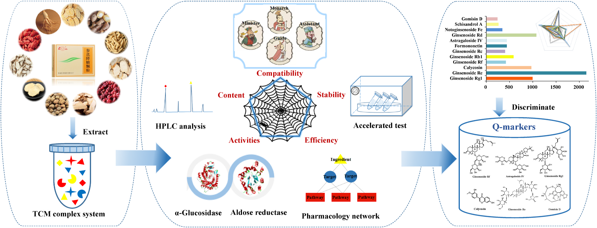
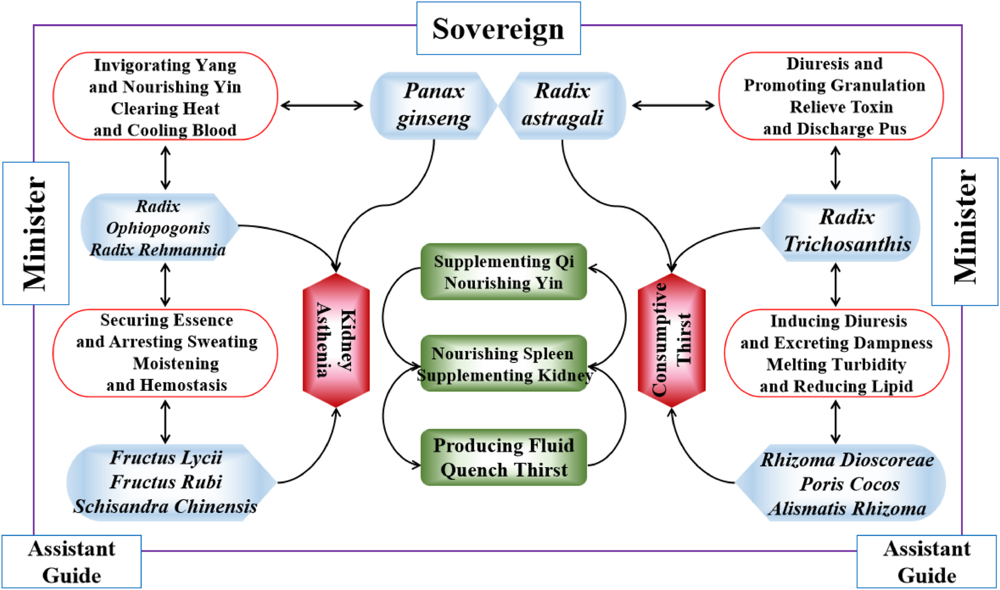
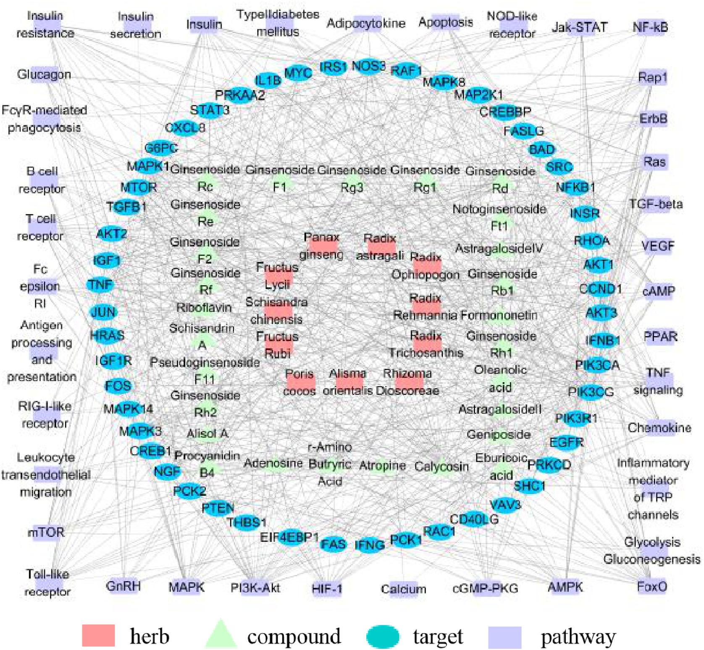
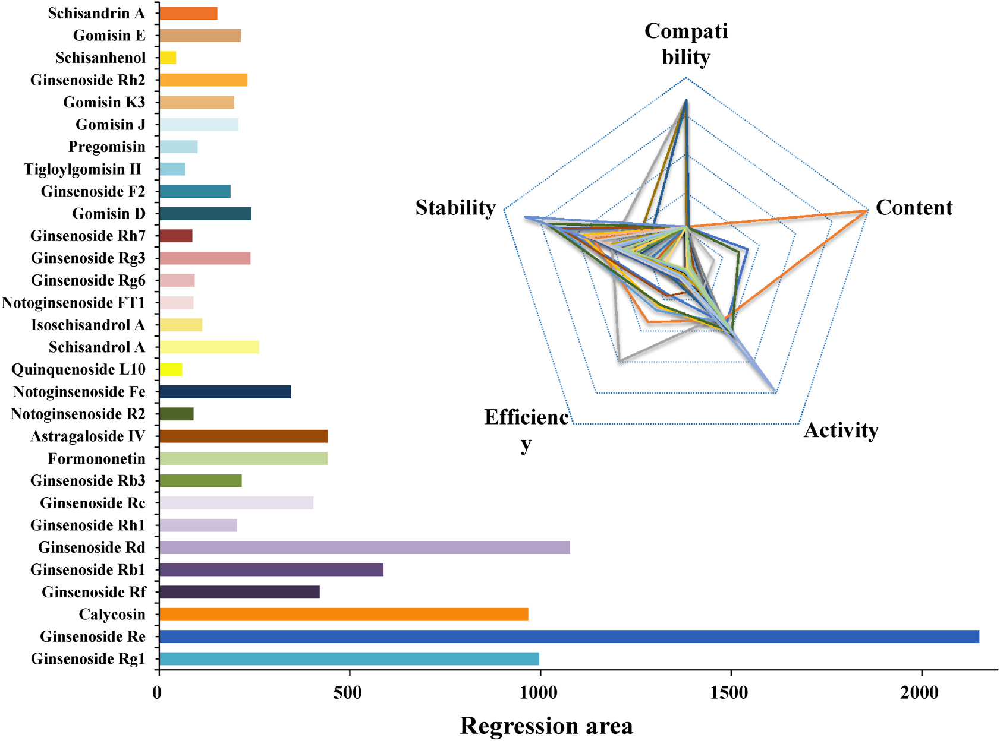
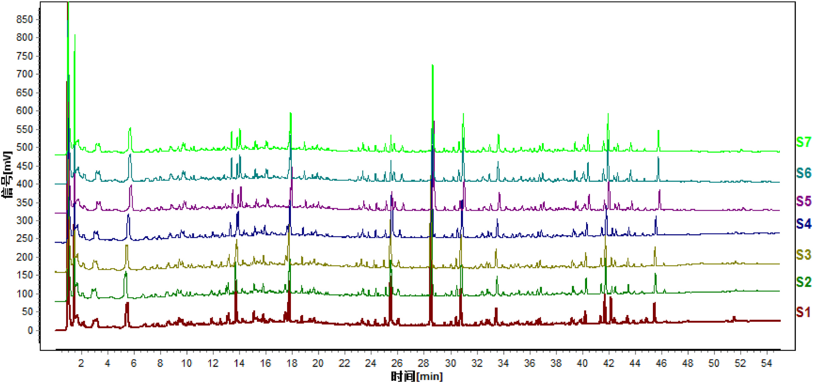
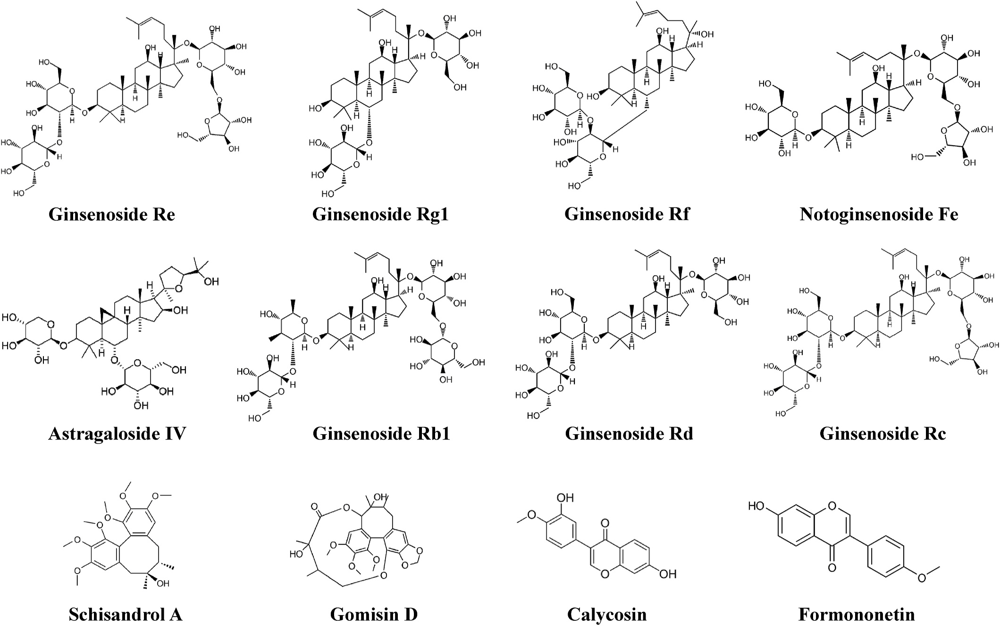

<!-- 方針: ほぼ全訳＋必要に応じた補足。原文構成に沿って訳出。「> 補足:」は訳者注。 -->

## 書誌情報

- 原題: An integrated approach to discriminate the quality markers of Traditional Chinese medicine preparation based on multi-dimensional characteristic network: Shenqi Jiangtang Granule as a case
- 著者: Hui Zhang, Ruoyu Chen, Cong Xu, Guimin Zhang, Yongxia Guan, Qun Feng, Jingchun Yao, Jizhong Yan（浙江工業大学薬学院／中薬ジェネリック製造技術国家重点実験室・魯南製薬集団, 中国）
- 掲載: *Journal of Ethnopharmacology* 278 (2021) 114277. https://doi.org/10.1016/j.jep.2021.114277
- インパクトファクター: **5.4**（*Journal of Ethnopharmacology*, JCR 2024 / Clarivate）
- 受理経過: 受領 2021-03-25 / 改訂 2021-05-23 / 採録 2021-05-30 / オンライン公開 2021-06-02

> 補足: SJG = 参耆降糖顆粒（Shenqi Jiangtang Granule）。Q-marker = 品質マーカー（quality marker、品質と薬効を結びつける指標成分）。DM = 糖尿病、DN = 糖尿病性腎症。本論文は実験＋計算（in silico）を組み合わせた研究論文。

## 要旨（Abstract）

**背景:** 漢方（TCM）は複雑であるため、現行の品質評価は臨床効果と結びつけにくい。参耆降糖顆粒(SJG)は2型糖尿病(DM)とその合併症の治療薬として実証された古典的漢方処方だが、その治療効果の物質的基盤は不明確である。

**目的:** 本研究は、TCMの品質管理のために、多次元特性ネットワークに基づいて品質マーカー(Q-marker)を判別する統合的手法を提案する。

**方法:** 多次元特性ネットワークを「蜘蛛の巣(Spider-web)」モデルで構築し、候補成分の「配合(compatibility)−含量(content)−活性(activity)−効能(efficiency)−安定性(stability)」を包括的に統合した。活性次元はSJGのα-グルコシダーゼおよびアルドース還元酵素に対する阻害活性で評価した。効能次元は統合薬理プラットフォームに基づき、成分と糖尿病性腎症(DN)の標的経路との関連性で評価した。各次元を多変量統計解析で定量化し、候補成分の回帰面積をネットワーク上に構築。最終的に回帰面積で候補成分を総合的に順位付けした。

**結果:** 有効な血糖降下活性をもつ計30種の化合物を潜在的Q-markerとして同定した。データ解析から、活性・効能・含量の3次元が特性ネットワークの回帰面積に大きく寄与した。これらのうち ginsenoside Re, ginsenoside Rd, ginsenoside Rg1, calycosin, ginsenoside Rb1, formononetin, astragaloside IV, ginsenoside Rf, ginsenoside Rc, notoginsenoside Fe, schisandrol A, gomisin D が候補Q-markerとして抽出された。

**結論:** 配合・含量・活性・効能・安定性を統合した多次元特性ネットワークは、TCM処方の潜在的Q-markerの判別に有効である。人参・黄耆・五味子に由来する12の候補成分がSJGの定性評価用Q-markerとして選定されうる。

## 1. 序論（Introduction）

漢方(TCM)は数千年にわたり疾病治療に用いられ、その品質は臨床効果の基盤である。複数生薬からなる処方が臨床での一般的な投与形態であり、これは「君(Jun)・臣(Chen)・佐(Zuo)・使(Shi)」というTCM配合原則に従う。SJGは2型DMとその合併症の治療に長く用いられてきた処方で、**11生薬**——人参(Panax Ginseng)・黄耆(Radix Astragali)・地黄(Radix Rehmanniae)・麦門冬(Radix Ophiopogonis)・栝楼根(Radix Trichosanthis)・枸杞子(Fructus Lycii)・五味子(Schisandrae Chinensis)・覆盆子(Fructus Rubi)・山薬(Rhizoma Dioscoreae)・茯苓(Poris Cocos)・沢瀉(Alismatis Rhizoma)——からなり、中国SFDAに承認されている。臨床試験では、SJGはDM患者血中のTGF-β1・VEGF・TNF-αなどのサイトカインを低下させ、尿中α1-ミクログロブリンと血清シスタチンを減少させ、脾腎両虚の症状を改善してDMの進行を遅らせることが示されている。

しかしSJGは品質規格が科学的・包括的でないため中国薬局方に未収載である。現行規格では **ginsenoside Re のみが薄層クロマトグラフィー(TLC)による唯一の定量指標**とされており、TCMの全体観の理論を無視したこの評価法は、SJGの治療物質的基盤を客観的に反映できない可能性がある。

従来のTCM品質管理は、相対的に含量の高い単一/少数成分を定量指標とするもので、品質特性の全体性も、薬効と品質の関係も客観的に反映できない。この共通課題に対し、Changxiao Liu教授がQ-markerの概念を提唱した。Q-markerは「生薬(HM)に固有の、あるいは加工調製中に生成する化学成分で、TCMの機能特性と密接に関連するもの」と定義され、生物学的性質・製造工程・配合理論を考慮して品質を高めるものである。本研究では、配合・含量・活性・効能・安定性からなる多次元特性ネットワークに基づきSJGのQ-markerを判別した。

## 2. 材料と方法（Materials and Methods）

### 2.1 試薬・試料

メタノール・アセトニトリル(HPLCグレード, TEDIA社, 米国)、リン酸・n-ブタノール(AR, 凌峰化学, 上海)。SJGは魯南厚普製薬より提供。陽性対照薬としてアカルボース(Aladdin)・エパルレスタット(Dyne Marine)、α-グルコシダーゼ(100U, Sigma)を使用。アルドース還元酵素はウサギ水晶体から自家調製。標準品(ginsenoside Rg1/Re, calycosin, formononetin, ginsenoside Rb1/Rh1/Rh2/Rc/Rd, astragaloside IV, ginsenoside Rg3, notoginsenoside Ft1, ginsenoside F2, schisandrol A, schisandrin A, gomisin D/J, schisanhenol ほか)は成都Must/Push社より入手。

### 2.2 試料調製

SJG粉末 9.0 g に メタノール150 mL を加え 30 ℃ で 60分 超音波抽出。常圧濾過後、ロータリーエバポレーターで濃縮。蒸留水45 mLで溶解し、等量の水飽和n-ブタノールで3回振盪。n-ブタノール層を集めて減圧乾固し、凍結乾燥して試料とした。

### 2.3 UHPLC条件

- 装置: Agilent 1290 infinity UHPLC（DAD付）
- カラム: Waters ACQUITY UPLC HSS T3（2.1 × 100 mm, 1.8 μm）、カラム温度 30 ℃
- 移動相: A=0.1%ギ酸水、B=アセトニトリル、流速 0.3 mL/min
- グラジエント: 0–12 min 5–23%B / 12–22 min 23–40%B / 22–34 min 40–55%B / 34–40 min 55–75%B / 40–48 min 75–90%B / 48–55 min 90–100%B
- 注入量 5 μL、DAD 190–400 nm 記録、クロマトグラムは **203 nm** で取得

### 2.4 UPLC-QQQ-MS/MS分析

- 装置: Agilent 1290 UPLC（G7120A二元ポンプ）＋ Agilent 6470 トリプル四重極MS（AJS-ESI源）
- カラム: Waters Acquity UPLC HSS T3 C18（2.1 × 50 mm, 1.8 μm）、カラム温度 35 ℃
- 移動相: A=0.1%ギ酸水、B=0.1%ギ酸アセトニトリル。グラジエント: 0–5 min 10–98%B / 5–8 min 98–100%B / 8–8.1 min 100–10%B / 8.1–10 min 10%B。流速 0.2 mL/min、注入量 2 μL
- イオン化条件: 乾燥ガス 350 ℃・11 L/min、噴霧圧 40 psi、シースガス 350 ℃・11 L/min、キャピラリー電圧 4000 V
- MRMパラメータ（プレカーサー/プロダクトイオン・コーン電圧・衝突エネルギー）は下表（Table 1）の通り。

**Table 1. 各分析対象のMRMトランジションとパラメータ（抜粋・全24化合物）**

| No. | 成分 | プレカーサー (m/z) | プロダクト (m/z) | コーン電圧 (V) | 衝突エネルギー (eV) | イオンモード |
|---|---|---|---|---|---|---|
| 1 | Ginsenoside Rg1 | 823.6 | 643.3 | 110 | 45 | (+) |
| 2 | Ginsenoside Re | 970 | 790 | 115 | 45 | (+) |
| 3 | Calycosin | 285.1 | 270.1 | 110 | 25 | (+) |
| 4 | Ginsenoside Rf | 799.5 | 475.5 | 100 | 45 | (−) |
| 5 | Ginsenoside Rb1 | 1132.1 | 365.4 | 130 | 50 | (+) |
| 6 | Notoginsenoside Ft1 | 916 | 784 | 90 | 35 | (−) |
| 7 | Ginsenoside Rh1 | 683.2 | 637.1 | 130 | 20 | (−) |
| 8 | Ginsenoside Rc | 1102.2 | 1102.2 | 110 | 0 | (+) |
| 9 | Ginsenoside Rb3 | 1078.1 | 1078.1 | 140 | 0 | (−) |
| 10 | Formononetin | 267 | 252 | 110 | 22 | (−) |
| 11 | Astragaloside IV | 829.9 | 829.9 | 150 | 0 | (−) |
| 12 | Ginsenoside Rd | 970 | 789.9 | 100 | 45 | (+) |
| 13 | Notoginsenoside R2 | 769.8 | 475.8 | 125 | 40 | (−) |
| 14 | Ginsenoside Rg3 | 819.5 | 783.4 | 110 | 30 | (−) |
| 15 | Ginsenoside Rh2 | 667.4 | 621.1 | 110 | 18 | (−) |
| 16 | Ginsenoside F2 | 829.9 | 783.8 | 95 | 20 | (−) |
| 17 | Notoginsenoside Fe | 962 | 916 | 130 | 25 | (−) |
| 18 | Gomisin D | 553.4 | 553.4 | 140 | 0 | (−) |
| 19 | Gomisin J | 387.2 | 372 | 95 | 20 | (−) |
| 20 | Schisandrol A | 455.2 | 409 | 120 | 30 | (+) |
| 21 | Schisanhenol | 403.2 | 340.1 | 110 | 30 | (+) |
| 22 | Schisandrin A | 417.2 | 316.2 | 115 | 28 | (+) |
| 23 | Tanshinone IIA | 295.0 | 277.1 | 110 | 20 | (+) |
| 24 | Astilbin | 448.9 | 284.9 | 135 | 20 | (−) |

### 2.5 配合(compatibility)次元

「君臣佐使」の配合原則を数式化。各有効成分のスコアは式(1): C = aᵢ × (wⱼ / Σ¹¹ wⱼ) × 100% で算出。aᵢ は 君(a₁=4)・臣(a₂=3)・佐(a₃=2)・使(a₄=1)、wⱼ は各生薬の重み。

### 2.6–2.9 活性(activity)次元

各成分の活性スコアを、α-グルコシダーゼおよびアルドース還元酵素に対する **①in vitro阻害率、②特異的結合率、③in silico分子ドッキング** の3側面から算出。

- in vitro阻害率: 式(2) Inhibition(%) = [1 − (A1−A2)/(A3−A0)] × 100%
- 特異的結合率: 式(3) = (P1 − P2)/P0 × 100%（P1=活性酵素群、P2=不活性酵素対照群、P0=ブランク群のピーク面積）
- 分子ドッキング: ChemBio Draw Ultra 12.0 / DS 3.0、CHARMmフォースフィールド、Libdock法、活性部位半径 8–15 Å
- 総合活性スコアは式(4): 阻害率0.4＋特異結合0.4＋ドッキング0.2 の重み付けで、α-グルコシダーゼとアルドース還元酵素を各50%として算出。

### 2.10 効能(efficiency)次元

TCM統合薬理プラットフォーム(TCMIP)に基づき、成分と疾患標的経路の相関で評価。DrugBank・GeneCards等で標的を検索、DAVIDでKEGG経路解析、Cytoscape 3.6.1で「生薬−成分−標的−経路」ネットワークを構築。効能スコアは式(5): E = (Dᵢ/D) × (Pᵢ/P)。ここで Dᵢ=次数値、D=平均次数(**11.81**)、Pᵢ=候補成分に関連する重要経路数、P=KEGGの顕著経路数(**61**)。

### 2.11 安定性(stability)次元

高温(60 ± 2 ℃)と高湿(相対湿度 75 ± 5%、飽和NaCl溶液)の2条件で評価。各5・10・15日後にHPLCで相対含量変化を測定。安定性スコアは式(6): F = [((f0−fH15)/f0)×1/2 + ((f0−fT15)/f0)×1/2] × 100%（f0=0日目、fH15=高湿15日目、fT15=高温15日目のピーク面積）。

### 2.12 Q-markerの総合判別

5次元を「蜘蛛の巣」モデルで統合し、回帰面積の大きい候補成分をQ-markerと判定。回帰面積は式(7): S = (1/2)sinα × (Σ⁴ Pₙ·Pₙ₊₁ + P5·P1)（α=隣接変数間の角度、P=変数の正規化値）。

### 2.13 統計

全定量データは3回測定の mean ± SD。KEGG経路のスクリーニングは P < 0.05 を有意とした。

## 3. 結果（Results）

### 3.1 配合次元

SJGは11生薬からなる。**人参・黄耆が「君」**、地黄・麦門冬・栝楼根が「臣」で、「佐」「使」と合理的に配合される。重みは 君4・臣3・佐2・使1。先行研究でUPLC-Q/TOF-MSにより **98成分** が同定されており、候補Q-markerとして 人参から17のジンセノシド・黄耆から3のフラボノイド（重み4）、五味子から10のリグナン（重み2）、地黄・麦門冬から各4配糖体・5サポニン（重み3）を選定した。

### 3.2 含量次元

DAD検出のピーク面積から相対含量を算出。複雑系では1ピークに複数成分が共存するため、Q-TOF-MS/MSで各特徴ピークを同定し、30の特徴ピークの分離を最適化。サポニン・リグナンの正確定量には ginsenoside Rb1・schisandrin Aの検量線では不正確なため、**UPLC-QQQ-MS/MS（MRM）＋標準品** で正確に定量した。含量順は ginsenoside Re > Rg1 > Rd > schisandrol A > gomisin D > Rb3 > Rh1 > Rb1。Q-markerには分離度 > 1.5 かつピーク純度が要件。

**Table 2. 候補30成分の由来・配合・含量・活性次元スコア**

| No. | 成分 | 由来 | 配合 | 配合スコア | 含量スコア | α-グルコシダーゼ活性 | アルドース還元酵素活性 | 活性総合 |
|---|---|---|---|---|---|---|---|---|
| 1 | Ginsenoside Rg1 | 人参 | 君 | 14.72 | 33.68 | 0.00 | 47.36 | 23.68 |
| 2 | Ginsenoside Re | 人参 | 君 | 14.72 | 98.79 | 18.49 | 25.13 | 21.81 |
| 3 | Calycosin | 黄耆 | 君 | 58.84 | 0.43 | 0.00 | 40.03 | 20.02 |
| 4 | Ginsenoside Rf | 人参 | 君 | 14.72 | 0.12 | 0.00 | 55.27 | 27.64 |
| 5 | Ginsenoside Rb1 | 人参 | 君 | 14.72 | 5.42 | 0.00 | 45.93 | 22.97 |
| 6 | Notoginsenoside R2 | 人参 | 君 | 14.72 | 0.12 | 12.08 | 0.00 | 6.04 |
| 7 | Ginsenoside Rh1 | 人参 | 君 | 14.72 | 5.91 | 19.78 | 14.94 | 17.36 |
| 8 | Ginsenoside Rc | 人参 | 君 | 14.72 | 4.01 | 17.43 | 0.00 | 8.72 |
| 9 | Ginsenoside Rb3 | 人参 | 君 | 14.72 | 6.54 | 25.87 | 0.00 | 12.94 |
| 10 | Formononetin | 黄耆 | 君 | 58.84 | 0.11 | 24.39 | 0.00 | 12.20 |
| 11 | Astragaloside IV | 黄耆 | 君 | 58.84 | 1.80 | 0.00 | 56.62 | 28.31 |
| 12 | Ginsenoside Rd | 人参 | 君 | 14.72 | 28.76 | 23.37 | 30.65 | 27.01 |
| 13 | Notoginsenoside Fe | 人参 | 君 | 14.72 | 2.20 | 18.07 | 0.00 | 9.04 |
| 14 | Quinquenoside L10 | 人参 | 君 | 14.72 | 0.25 | 21.42 | 0.00 | 10.71 |
| 15 | Schisandrol A | 五味子 | 佐 | 14.70 | 15.16 | 18.82 | 0.00 | 9.41 |
| 16 | Isoschisandrol A | 五味子 | 佐 | 14.70 | 0.59 | 12.41 | 0.00 | 6.21 |
| 17 | Notoginsenoside FT1 | 人参 | 君 | 14.72 | 0.06 | 0.00 | 60.50 | 30.25 |
| 18 | Ginsenoside Rg6 | 人参 | 君 | 14.72 | 2.74 | 0.00 | 33.69 | 16.85 |
| 19 | Ginsenoside Rg3 | 人参 | 君 | 14.72 | 0.75 | 0.00 | 18.26 | 9.13 |
| 20 | Ginsenoside Rh7 | 人参 | 君 | 14.72 | 1.84 | 0.00 | 38.63 | 19.32 |
| 21 | Gomisin D | 五味子 | 佐 | 14.70 | 7.48 | 43.14 | 0.00 | 21.57 |
| 22 | Ginsenoside F2 | 人参 | 君 | 14.72 | 2.09 | 21.75 | 0.00 | 10.88 |
| 23 | Tigloylgomisin H | 五味子 | 佐 | 14.70 | 0.13 | 0.00 | 24.16 | 12.08 |
| 24 | Pregomisin | 五味子 | 佐 | 14.70 | 0.42 | 17.14 | 0.00 | 8.57 |
| 25 | Gomisin J | 五味子 | 佐 | 14.70 | 0.53 | 39.97 | 64.47 | 52.22 |
| 26 | Gomisin K3 | 五味子 | 佐 | 14.70 | 0.47 | 0.00 | 10.27 | 5.14 |
| 27 | Ginsenoside Rh2 | 人参 | 君 | 14.72 | 0.56 | 0.00 | 54.98 | 27.49 |
| 28 | Schisanhenol | 五味子 | 佐 | 14.70 | 0.36 | 11.03 | 0.00 | 5.52 |
| 29 | Gomisin E | 五味子 | 佐 | 14.70 | 2.00 | 0.00 | 57.00 | 28.50 |
| 30 | Schisandrin A | 五味子 | 佐 | 14.70 | 1.58 | 0.00 | 50.70 | 25.35 |

### 3.3 活性次元

α-グルコシダーゼ阻害活性の順は gomisin D > gomisin J > ginsenoside Rb3 > formononetin > ginsenoside Rd > ginsenoside F2 > 他。アルドース還元酵素阻害活性の順は gomisin J > notoginsenoside FT1 > gomisin E > astragaloside IV > ginsenoside Rf > ginsenoside Rh2 > 他。総合では **gomisin J・notoginsenoside FT1・gomisin E・astragaloside IV・ginsenoside Rf・ginsenoside Rh2** が活性次元で突出した。

### 3.4 効能次元

SJGは主に2型糖尿病・合併症に用いられるため、統合薬理で「2型糖尿病」「糖尿病性腎症(DN)」「糖尿病性心筋症」の疾患−成分−標的−経路ネットワークを解析。DNの疾患標的が2型糖尿病標的をほぼ包含し、より多くの活性成分を抽出できたため、効能次元の疾患症状にDNを選定。98成分とDNの共通標的をUniProt/DAVIDで解析し、**SJGが調節する163経路** を取得。P < 0.05 の有意経路には、酸化ストレス関連9・糖脂質代謝関連16・炎症応答関連20・オートファジー/免疫関連16 などが含まれた。最終的に「**98成分 − 377標的 − 163経路**」のDN関連ネットワークを得た。98成分の平均次数は **11.81**。

**Table 3. 成分とDN標的に関連する主要経路（P値・遺伝子数、抜粋）**

| 経路 | P値 | 遺伝子数 |
|---|---|---|
| PI3K-Akt signaling pathway | 3.7E-22 | 114 |
| FoxO signaling pathway | 1.3E-19 | 61 |
| TNF signaling pathway | 1E-16 | 50 |
| Cytokine-cytokine receptor interaction | 1.3E-16 | 82 |
| HIF-1 signaling pathway | 4.4E-15 | 45 |
| Insulin resistance | 5.9E-15 | 48 |
| Insulin signaling pathway | 5.9E-11 | 49 |
| Type II diabetes mellitus | 1.2E-10 | 26 |
| AMPK signaling pathway | 1.8E-09 | 43 |
| VEGF signaling pathway | 2.9E-07 | 25 |
| TGF-beta signaling pathway | 1.6E-06 | 29 |
| PPAR signaling pathway | 2.1E-06 | 25 |

> 補足: 上表は代表的経路の抜粋。原文Table 3には計60超の経路（炎症・免疫・糖脂質代謝・酸化ストレス等）が P値・遺伝子数とともに掲載されている（詳細は原文参照）。

**Table 4. 主要候補成分の次数値・関連経路数・効能スコア（抜粋）**

| 成分 | 次数値 | 関連経路数 | 効能スコア |
|---|---|---|---|
| Calycosin | 238 | 60 | 19.82 |
| Ginsenoside Re | 141 | 58 | 11.35 |
| Ginsenoside Rb1 | 125 | 51 | 8.85 |
| Ginsenoside Rf | 102 | 57 | 8.07 |
| Ginsenoside Rd | 95 | 58 | 7.65 |
| Ginsenoside Rc | 81 | 51 | 5.73 |
| Ginsenoside Rg1 | 72 | 54 | 5.40 |
| Astragaloside IV | 47 | 43 | 2.81 |
| Formononetin | 40 | 50 | 2.78 |
| Ginsenoside Rh2 | 37 | 38 | 1.95 |
| Schisandrol A | 37 | 32 | 1.64 |
| Gomisin D | 43 | 29 | 1.73 |

効能次元では calycosin・ginsenoside Re/Rf/Rb1/Rd/Rc/Rg1 がより多くの標的・経路を調節した。一方、isoschisandrol A・ginsenoside Rg6/Rh7・tigloylgomisin H・pregomisin・schisanhenol は有意な標的・経路が見つからなかった。

### 3.5 安定性次元

高温・高湿の極端条件で評価。高温の方が高湿より安定性への影響が大きかった。安定性スコア > 20 の成分が13、特に **notoginsenoside Fe・ginsenoside Rd・ginsenoside Rb1・ginsenoside Rc・ginsenoside Rg1**（スコア > 30）は高温・高湿で最も不安定だった。不安定成分の含量管理がSJG品質の把握に有効である。

### 3.6 多次元特性ネットワークによるQ-marker判別

回帰分析前に各変数を自己重み付けで正規化（配合〜安定性を P1〜P5 とする）。「蜘蛛の巣」モデルと回帰面積のソートヒストグラムから、回帰面積が大きい成分として **ginsenoside Re, ginsenoside Rd, ginsenoside Rg1, calycosin, ginsenoside Rb1, formononetin, astragaloside IV, ginsenoside Rf, ginsenoside Rc, notoginsenoside Fe, schisandrol A, gomisin D**（計12）が選定された。内訳は——

- **君・人参 由来(7)**: ginsenoside Re, Rd, Rg1, Rb1, Rf, Rc, notoginsenoside Fe
- **君・黄耆 由来(3)**: calycosin, formononetin, astragaloside IV
- **佐・五味子 由来(2)**: schisandrol A, gomisin D

## 4. 考察・結論（Discussion / Conclusion）

TCM処方は「君臣佐使」の配合原則で組まれ、適切な比率での合理的配合が相乗効果に重要である。本研究では配合を数学的に簡略化し、UPLC-QQQ-MS/MSで候補成分の相対含量を正確に定量した。

活性次元では、α-グルコシダーゼ(EC 3.2.1.20、血糖制御の鍵酵素)とアルドース還元酵素(EC 1.1.1.21、ポリオール経路の律速酵素で合併症に関与)を血糖降下の鍵標的とした。先行研究で限外濾過-LC-MSにより **α-グルコシダーゼ阻害16成分・アルドース還元酵素阻害18成分** が検証されている。ドッキング値はサポニン類がリグナン・フラボノイドより総じて高く、サポニンの多数の糖鎖が受容体−リガンド間の水素結合を増やすためと推察された。

効能次元の統合薬理から、SJGのDN治療機構は多成分・多標的・多経路の特徴をもち、糖脂質代謝の調節・炎症応答の抑制・酸化ストレスの調整・免疫の増強が本質的機序と示された。

**結論:** 「蜘蛛の巣」モデルに基づき「配合−含量−活性−効能−安定性」を統合した5次元特性ネットワークを構築し、回帰面積の計算から処方への寄与が大きい12成分(ginsenoside Re, Rd, Rg1, calycosin, Rb1, formononetin, astragaloside IV, Rf, Rc, notoginsenoside Fe, schisandrol A, gomisin D)をSJGのQ-markerに選定した。これらは TLC同定・指紋ピーク・定量指標成分として、より実行可能で科学的な品質管理体系の構築に資する。

> 補足（実務的示唆）: 本研究の要点は、単一成分(ginsenoside Re)依存の現行規格に対し、「薬効・安定性まで含めた多次元評価」で指標成分を選ぶ枠組みを示した点。実務では、ここで挙がった12成分を多成分同時定量(MRM)の対象とし、特に高温・高湿で不安定な成分(notoginsenoside Fe・Rd・Rb1・Rc・Rg1)を安定性モニタリング指標に据える設計が考えられる。なお活性・効能・安定性の重み付け係数(0.4/0.4/0.2 など)は本研究の設定であり、処方や目的により再検討の余地がある。

## 訳者補足（用語）

- **君臣佐使**: 漢方処方の配合原則。主薬(君)・補助(臣)・調整/減毒(佐)・引経/調和(使)。
- **回帰面積(regression area)**: 各次元の正規化値を多角形(レーダー/蜘蛛の巣)の頂点として結んだ図形の面積。値が大きいほど処方への総合寄与が大きいと解釈する。
- **次数値(degree)**: ネットワーク上で1ノードが結ぶ関係の数。大きいほどネットワーク上の重要度が高い。

## 図（原論文より）

> 以下は原論文から抽出した主要な図。キャプションは訳者による要約。

